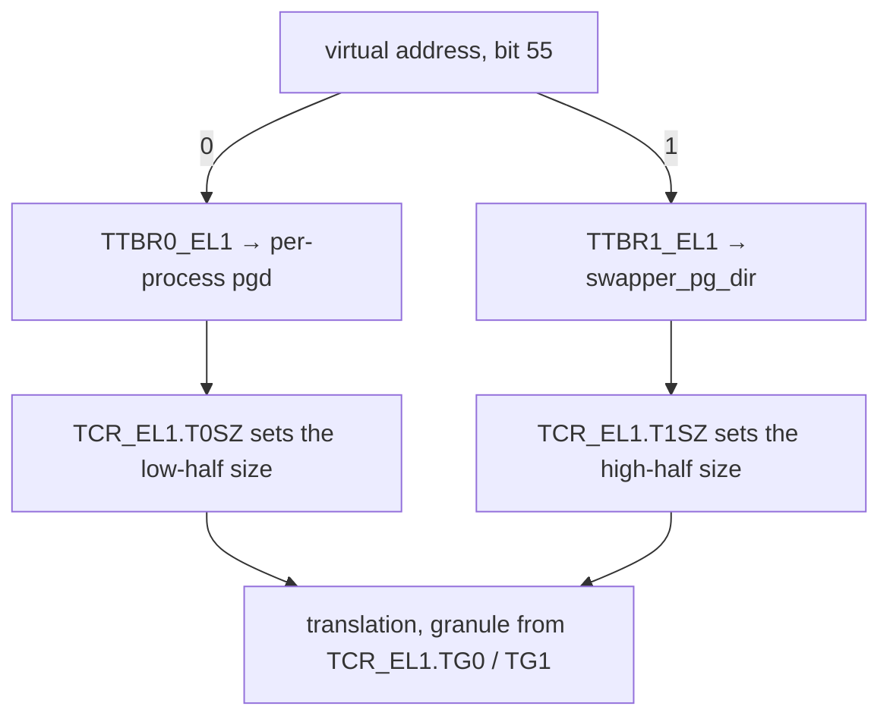

# Memory on arm64: Page Tables, ASIDs & Cache Maintenance

> **Goal:** read arm64 kernel memory-management code and inspect a live arm64
> system without translating from x86 in your head. You will learn where the
> two page-table roots live, what a translation granule actually changes, how
> to decode a real 64-bit descriptor bit by bit, why ASIDs need a generation
> counter, and what break-before-make is protecting you from.

## Why this chapter is not an appendix

[Virtual Memory](#/memory) explains paging under a heading titled "How the
hardware does it (x86-64)" and stops there. That was defensible when arm64
meant phones. Graviton and Ampere instances now run a large fraction of public
cloud compute; Grace-Blackwell and Jetson boxes are where unified-memory GPU
work happens; Apple hardware runs Linux under virtualization on a great many
developer desks.

The differences are not cosmetic. arm64 has **two** page-table root registers
instead of one, a **configurable page size** that changes the ABI, memory type
expressed as an **index into a register** rather than as bits in the
descriptor, an **architecturally mandatory sequence** for changing a live
translation, and a real population of machines where **DMA is not cache
coherent**. Each of those has bitten someone in production.

Everything from [Virtual Memory](#/memory) still holds: VMAs, `mm_struct`,
demand paging, the page cache, reclaim. This chapter replaces exactly one
layer — the hardware one — and says what the replacement costs you.

## Two roots, not one

x86-64 has a single `CR3`. One page table describes the whole 64-bit address
space; the kernel occupies the upper half of it, and every user process's
table contains a copy of those kernel entries. That design is why Meltdown was
such a problem, and why KPTI on x86 means *maintaining a second, stripped-down
copy of the page tables* for use in user mode.

arm64 splits the job in hardware. Bit 55 of the virtual address selects which
of two root registers the MMU walks:

- **`TTBR0_EL1`** — the low half (addresses with bit 55 clear). User space.
- **`TTBR1_EL1`** — the high half (bit 55 set). The kernel.



The kernel's table is
[`swapper_pg_dir`](https://elixir.bootlin.com/linux/v6.12/C/ident/swapper_pg_dir),
and — as
[Documentation/arch/arm64/memory.rst](https://elixir.bootlin.com/linux/v6.12/source/Documentation/arch/arm64/memory.rst)
puts it — it is written to TTBR1 and **never** written to TTBR0. A process
switch writes `TTBR0_EL1` only. The kernel half is not copied into anything;
it simply lives in a different register. So there is no "upper half" in a user
table: a walk of a user process's page tables shows no kernel entries, because
they are not there.

**KPTI therefore means something different.** `CONFIG_UNMAP_KERNEL_AT_EL0` on
arm64 does not build a shadow copy of the address space. Instead, on the way
out to EL0 the exception-return path swaps `TTBR1_EL1` itself to a tiny table,
`tramp_pg_dir`, that maps only the trampoline vectors. The whole switch is four
instructions in
[arch/arm64/kernel/entry.S](https://elixir.bootlin.com/linux/v6.12/source/arch/arm64/kernel/entry.S):

```
	// Move from swapper_pg_dir to tramp_pg_dir
	.macro tramp_unmap_kernel, tmp
	mrs	\tmp, ttbr1_el1
	sub	\tmp, \tmp, #TRAMP_SWAPPER_OFFSET
	orr	\tmp, \tmp, #USER_ASID_FLAG
	msr	ttbr1_el1, \tmp
	.endm
```

Note the `orr` — we will come back to it when we get to ASIDs, because it is
the reason KPTI halves the number of address spaces the machine can hold in
its TLB at once. Whether KPTI is enabled at all is decided at boot by
[`unmap_kernel_at_el0()`](https://elixir.bootlin.com/linux/v6.12/C/ident/unmap_kernel_at_el0)
in
[arch/arm64/kernel/cpufeature.c](https://elixir.bootlin.com/linux/v6.12/source/arch/arm64/kernel/cpufeature.c),
which consults an explicit allowlist of Meltdown-safe cores (Cortex-A53/A55/A57/A72/A73,
ThunderX2, NVIDIA Carmel, several Kryo parts, …) and the CPU ID registers, and
also forces KPTI on when KASLR needs it.

**TTBR0 can be turned off entirely.** When the kernel is not running on behalf
of a user task, `TTBR0_EL1` points at
[`reserved_pg_dir`](https://elixir.bootlin.com/linux/v6.12/C/ident/reserved_pg_dir),
an empty table through which no translation can succeed. That is what
[`cpu_set_reserved_ttbr0()`](https://elixir.bootlin.com/linux/v6.12/C/ident/cpu_set_reserved_ttbr0)
does, and it is also how software PAN (`CONFIG_ARM64_SW_TTBR0_PAN`) works: user
memory is literally unreachable from the kernel until `uaccess_ttbr0_enable()`
(reached through `uaccess_enable_privileged()` in
[arch/arm64/include/asm/uaccess.h](https://elixir.bootlin.com/linux/v6.12/source/arch/arm64/include/asm/uaccess.h))
installs the real root. x86 needs SMAP for the same effect; arm64 can get it
by unplugging a register.

The two halves are also *independently sized*. `TCR_EL1.T0SZ` and
`TCR_EL1.T1SZ` each hold `64 - VA_BITS` for their half — see `TCR_T0SZ(x)` and
`TCR_T1SZ(x)` in
[arch/arm64/include/asm/pgtable-hwdef.h](https://elixir.bootlin.com/linux/v6.12/source/arch/arm64/include/asm/pgtable-hwdef.h).
Linux normally sets them equal, but not always: while the boot identity map is
active the kernel temporarily widens T0SZ, and `vabits_actual` is recovered at
runtime by reading T1SZ back out of `TCR_EL1`.

## Granules: the page size is a build-time decision

On x86-64 the base page is 4 KiB, full stop. arm64 defines three **translation
granules**, and Linux exposes each as a Kconfig choice in
[arch/arm64/Kconfig](https://elixir.bootlin.com/linux/v6.12/source/arch/arm64/Kconfig):
`CONFIG_ARM64_4K_PAGES`, `CONFIG_ARM64_16K_PAGES`, `CONFIG_ARM64_64K_PAGES`.
The default is 4 KiB.

The granule is not a tuning knob bolted on top of a fixed structure. It *is*
the structure. Every level of the walk resolves `PAGE_SHIFT - 3` bits, because
one table is one page of 8-byte descriptors. So the level count falls straight
out of arithmetic, spelled exactly this way in `pgtable-hwdef.h`:

```c
#define ARM64_HW_PGTABLE_LEVELS(va_bits) (((va_bits) - 4) / (PAGE_SHIFT - 3))
```

and the size an entry at level *n* maps is:

```c
#define ARM64_HW_PGTABLE_LEVEL_SHIFT(n)	((PAGE_SHIFT - 3) * (4 - (n)) + 3)
```

Feed the three granules through those and everything else follows:

| Granule | bits/level | levels @48-bit VA | PMD block | PUD block | contiguous PTE |
|---|---|---|---|---|---|
| 4 KiB | 9 | 4 | 2 MiB | 1 GiB | 16 × 4 KiB = 64 KiB |
| 16 KiB | 11 | 4 | 32 MiB | (not used) | 128 × 16 KiB = 2 MiB |
| 64 KiB | 13 | 3 | 512 MiB | (not used) | 32 × 64 KiB = 2 MiB |

`pud_sect_supported()` in
[arch/arm64/include/asm/pgtable.h](https://elixir.bootlin.com/linux/v6.12/source/arch/arm64/include/asm/pgtable.h)
returns `PAGE_SIZE == SZ_4K`, so 1 GiB block mappings exist only on a 4 KiB
kernel. The contiguous-PTE counts come from `CONFIG_ARM64_CONT_PTE_SHIFT`
(4/7/5 for 4K/16K/64K) — that is the **contiguous bit**, a hint that a
naturally-aligned run of identical descriptors may share one TLB entry.
The full hugetlb matrix is in
[Documentation/arch/arm64/hugetlbpage.rst](https://docs.kernel.org/arch/arm64/hugetlbpage.html):

```text
  -      CONT PTE    PMD    CONT PMD    PUD
  4K:         64K     2M         32M     1G
  16K:         2M    32M          1G
  64K:         2M   512M         16G
```

Three practical consequences you will actually hit.

**Transparent huge pages change size.** "THP" means PMD-sized, so it is 2 MiB
on a 4 KiB kernel, 32 MiB on 16 KiB, and 512 MiB on 64 KiB. The mTHP
directories under `/sys/kernel/mm/transparent_hugepage/` are named
`hugepages-<size>kB` for the size in kilobytes, so the PMD-sized entry is
`hugepages-2048kB`, `hugepages-32768kB` or `hugepages-524288kB` depending on
your build. Advice copied from an x86 blog post about "2 MB pages" is
meaningless on a 64 KiB kernel. Separately, since 6.9 arm64 applies the
contiguous bit to ordinary user mappings automatically
(`CONFIG_ARM64_CONTPTE`, default y) — on a 4 KiB kernel that gives you 64 KiB
TLB entries for free, without hugetlbfs and without the PMD-sized THP
trade-offs.

**`mmap` alignment is coarser.** `mmap()` returns page-aligned addresses, and
"page" means 64 KiB on a 64 KiB kernel. A program that hardcodes 4096, or a
file format that stores 4 KiB-aligned offsets and mmaps them directly, breaks.
So does an ELF binary whose segments are only 4 KiB-aligned — which is why the
`ARM64_64K_PAGES` help text warns that AArch32 emulation "requires
applications compiled with 64K aligned segments."

**Memory accounting gets lumpier.** `/proc/meminfo` reports in kB regardless,
but the granularity of `Rss`, `Pss`, slab, and every `struct page`-derived
number is the page size. A process that touches one byte of each of 1,000
scattered objects has an RSS of 4 MB on a 4 KiB kernel and 64 MB on a 64 KiB
one. Internal fragmentation is real and it is 16× larger.

Distributions have taken visibly different positions. Red Hat ships RHEL 9's
aarch64 kernel with 4 KiB pages by default and offers a separate
[`kernel-64k`](https://docs.redhat.com/en/documentation/red_hat_enterprise_linux/9/html/managing_monitoring_and_updating_the_kernel/what-is-kernel-64k_managing-monitoring-and-updating-the-kernel)
package, with the pointed advice that you should not move between the two
after installation without reinstalling. NVIDIA's
[Grace performance tuning guide](https://docs.nvidia.com/dccpu/grace-perf-tuning-guide/os-settings.html)
recommends the opposite default: "The recommended default value for the page
size is 64K," i.e. `CONFIG_ARM64_64K_PAGES=y`, on the grounds that
large-footprint HPC and AI workloads win on TLB reach and fault count. Both are
right for their workloads. Neither can be changed after you have a filesystem
full of 4 KiB-aligned assumptions.

Ask any arm64 machine which world it is in:

```bash
getconf PAGE_SIZE          # 4096, 16384 or 65536 — the whole story in one number
getconf PAGESIZE           # same thing, older spelling
```

## How wide is the address space?

A second, independent choice: `CONFIG_ARM64_VA_BITS_{36,39,42,47,48,52}`. Not
all combinations are legal — 39-bit needs 4 KiB pages, 42-bit needs 64 KiB,
47-bit and 36-bit need 16 KiB — and `CONFIG_PGTABLE_LEVELS` is derived, exactly
matching the formula above:

| Granule | VA bits | Levels | User VA size |
|---|---|---|---|
| 4 KiB | 39 | 3 | 512 GiB |
| 4 KiB | 48 | 4 | 256 TiB |
| 4 KiB | 52 | 5 | 4 PiB |
| 16 KiB | 47 | 3 | 128 TiB |
| 16 KiB | 48 | 4 | 256 TiB |
| 64 KiB | 42 | 2 | 4 TiB |
| 64 KiB | 48 | 3 | 256 TiB |
| 64 KiB | 52 | 3 | 4 PiB |

Note the 64 KiB row: 52 bits of VA costs it *nothing*, because 13 bits per
level times three levels already covers 39 + 16 = 55 bits' worth of index
space. A 4 KiB kernel pays a whole extra level of walk for the same reach.
That is the clearest single argument for a large granule on a machine with
terabytes of RAM.

### 52-bit addressing in v6.12, precisely

This is worth stating carefully, because the situation changed recently and
much of the writing on the web predates it.

In v6.12, `ARM64_VA_BITS_52` is the Kconfig *default* for the virtual address
space size, and it is selectable with **any** granule — not just 64 KiB. Two
different architectural features get you there:

- **FEAT_LVA** (ARMv8.2) extends the top level of a 64 KiB-granule walk. The
  matching cpucap is described as `"52-bit Virtual Addressing (LVA)"` and keys
  off `ID_AA64MMFR2_EL1.VARange`.
- **FEAT_LPA2** (ARMv8.7) extends 4 KiB and 16 KiB granules, and also lifts the
  physical address space to 52 bits. The cpucap is
  `"52-bit Virtual Addressing (LPA2)"`, keyed off `ID_AA64MMFR0_EL1.TGRAN4`
  or `TGRAN16`. `CONFIG_ARM64_LPA2` is `def_bool y` and depends on
  `ARM64_PA_BITS_52 && !ARM64_64K_PAGES`.

Both feed the same boot-CPU capability, `ARM64_HAS_VA52`, declared in
[cpufeature.c](https://elixir.bootlin.com/linux/v6.12/source/arch/arm64/kernel/cpufeature.c).
And here is the part that makes it shippable: a kernel *configured* for 52 bits
runs correctly on hardware that lacks the feature, by **folding a level away at
runtime**. Look at
[`pgtable_l4_enabled()`](https://elixir.bootlin.com/linux/v6.12/C/ident/pgtable_l4_enabled):

```c
static __always_inline bool pgtable_l4_enabled(void)
{
	if (CONFIG_PGTABLE_LEVELS > 4 || !IS_ENABLED(CONFIG_ARM64_LPA2))
		return true;
	if (!alternative_has_cap_likely(ARM64_ALWAYS_BOOT))
		return vabits_actual == VA_BITS;
	return alternative_has_cap_unlikely(ARM64_HAS_VA52);
}
```

with a matching `pgtable_l5_enabled()`. `VA_BITS` is the compiled-in maximum;
`vabits_actual` is what this boot got, read back from `TCR_EL1.T1SZ`. On x86,
5-level paging is also folded when absent, but there the fold is largely
compile-time; on arm64 the *same binary* runs 4-level and 5-level.

Userspace does not get 52-bit addresses by surprise. By default `mmap()` keeps
returning addresses from the 48-bit range for compatibility, and a program
opts in by passing a hint above 48 bits:

```c
maybe_high_address = mmap(~0UL, size, prot, flags, ...);
```

`CONFIG_ARM64_FORCE_52BIT` removes the compatibility behaviour and is
explicitly documented as a debugging option, not a production one.

> **Documentation caveat.** `Documentation/arch/arm64/memory.rst` in v6.12
> still says 52-bit VA "is only available when running with a 64KB page size."
> That sentence predates LPA2 and is contradicted by the Kconfig and
> cpufeature code in the same tree. When kernel prose and kernel code disagree,
> the code is the specification.

## Reading a real descriptor

An arm64 leaf descriptor is 64 bits, and unlike x86 it does not spread the
memory type across three scattered bits. Here is the layout the kernel
actually uses, every constant taken verbatim from `pgtable-hwdef.h` and
[`pgtable-prot.h`](https://elixir.bootlin.com/linux/v6.12/source/arch/arm64/include/asm/pgtable-prot.h):

```text
bit  0   PTE_VALID        valid
bit  1   PTE_TABLE_BIT    1 = page/table descriptor, 0 = block descriptor
bits 2-4 PTE_ATTRINDX     AttrIndx[2:0] — index into MAIR_EL1
bit  6   PTE_USER         AP[1]  — EL0 data access allowed
bit  7   PTE_RDONLY       AP[2]  — read-only (note the polarity)
bits 8-9 PTE_SHARED       SH[1:0] = 0b11, inner shareable
bit 10   PTE_AF           access flag
bit 11   PTE_NG           non-global (ASID-tagged)
bit 50   PTE_GP           BTI guarded page
bit 51   PTE_DBM          dirty bit management — and Linux's PTE_WRITE
bit 52   PTE_CONT         contiguous hint
bit 53   PTE_PXN          privileged execute-never
bit 54   PTE_UXN          user execute-never
bits 55-58, 63            software bits (PTE_SWBITS_MASK)
```

Software claims those spare bits for `PTE_DIRTY` (55), `PTE_SPECIAL` (56),
`PTE_DEVMAP` (57) and `PTE_UFFD_WP` (58).

### AttrIndx and MAIR_EL1

This is the biggest conceptual difference from x86 and it is worth slowing
down for. On x86-64 the cacheability of a mapping is encoded by three bits in
the PTE itself (PWT, PCD, PAT), which together index the PAT MSR. arm64 makes
that indirection explicit and gives it three contiguous bits: `AttrIndx[2:0]`
selects one of **eight 8-bit attribute slots in `MAIR_EL1`**. The descriptor
carries an *index*; the register carries the *meaning*.

Linux fills five slots, defined in
[arch/arm64/include/asm/memory.h](https://elixir.bootlin.com/linux/v6.12/source/arch/arm64/include/asm/memory.h):

```c
#define MT_NORMAL		0
#define MT_NORMAL_TAGGED	1
#define MT_NORMAL_NC		2
#define MT_DEVICE_nGnRnE	3
#define MT_DEVICE_nGnRE		4
```

and installs them in `MAIR_EL1` via `MAIR_EL1_SET` in
[arch/arm64/mm/proc.S](https://elixir.bootlin.com/linux/v6.12/source/arch/arm64/mm/proc.S),
using the encodings `0xff` (Normal write-back), `0x44` (Normal non-cacheable),
`0x00` (Device-nGnRnE) and `0x04` (Device-nGnRE).

Two things fall out of this design.

**"Normal" versus "Device" is an architectural memory type, not a cache hint.**
Normal memory may be reordered, merged, speculatively read, and accessed
unaligned. Device memory may not: `nGnRnE` reads as *non-Gathering,
non-Reordering, no Early-write-acknowledgement*. When you `ioremap()` a
register block you get `PROT_DEVICE_nGnRE`, and that is why an MMIO write
followed by a read behaves like you expect while the same sequence on Normal
memory does not. `ioremap_wc()` gives you `MT_NORMAL_NC` instead — writes may
be gathered, which is what you want for a framebuffer and catastrophic for a
control register.

**Aliasing with mismatched attributes is architecturally undefined.** Two
mappings of the same physical page with different memory types is a bug the
hardware is entitled to punish. This is exactly why the kernel is so careful
about which attribute changes it will allow on a live mapping — see
break-before-make below.

`MT_NORMAL_TAGGED` (index 1) is for MTE, the Memory Tagging Extension: pages
mapped `PROT_MTE` carry allocation tags in hardware. `PTE_GP` (bit 50) marks a
page as BTI-guarded so indirect branches must land on a `BTI` instruction.
Neither has an x86 equivalent in the descriptor.

### Permissions, and Linux's clever abuse of DBM

The architecture gives you `AP[2:1]` plus two execute-never bits. Linux maps
them like this:

- `PTE_USER` (AP[1]) — EL0 may access the data. Clear it and the page is
  kernel-only.
- `PTE_RDONLY` (AP[2]) — read-only. Note the polarity: writability is the
  *absence* of a bit.
- `PTE_PXN` / `PTE_UXN` — execute-never at EL1 / EL0, set independently. The
  comment in `pgtable.h` records the invariant: "All valid kernel mappings
  have the `PTE_UXN` bit set."

That independence buys arm64 something x86-64 cannot do without protection
keys: **execute-only user memory**. `PAGE_EXECONLY` clears `PTE_USER` (no EL0
data access) while leaving `PTE_UXN` clear (EL0 execute permitted). It is only
installed when `ARM64_HAS_EPAN` (FEAT_EPAN) is present, in
[`adjust_protection_map()`](https://elixir.bootlin.com/linux/v6.12/C/ident/adjust_protection_map)
in [arch/arm64/mm/mmap.c](https://elixir.bootlin.com/linux/v6.12/source/arch/arm64/mm/mmap.c),
because without Enhanced PAN the kernel could override it.

Now the trick. Linux needs a *software* notion of "this VMA is writable" that
survives the page being write-protected for dirty tracking. On arm64 it steals
the DBM bit for it:

```c
#define PTE_WRITE		(PTE_DBM)		 /* same as DBM (51) */
#define PTE_DIRTY		(_AT(pteval_t, 1) << 55)
```

So a writable-but-clean page has **both** `PTE_WRITE`/DBM set and `PTE_RDONLY`
set — as the source comment says, "shared+writable pages are clean by default,
hence `PTE_RDONLY|PTE_WRITE`". With `FEAT_HAFDBS` (`CONFIG_ARM64_HW_AFDBM`,
default y), the *hardware* clears AP[2] on the first write to a DBM page
instead of raising a permission fault. The kernel then reads dirtiness as:

```c
#define pte_hw_dirty(pte)	(pte_write(pte) && !pte_rdonly(pte))
#define pte_sw_dirty(pte)	(!!(pte_val(pte) & PTE_DIRTY))
#define pte_dirty(pte)		(pte_sw_dirty(pte) || pte_hw_dirty(pte))
```

Because hardware may be updating AF and AP[2] concurrently,
[`__ptep_set_access_flags()`](https://elixir.bootlin.com/linux/v6.12/C/ident/__ptep_set_access_flags)
in [arch/arm64/mm/fault.c](https://elixir.bootlin.com/linux/v6.12/source/arch/arm64/mm/fault.c)
cannot simply store a new PTE — it runs a `cmpxchg_relaxed()` loop. If you
have only ever read x86 page-table code, this is the moment the difference
becomes concrete: on arm64 the PTE is shared mutable state between you and the
page-table walker.

The **access flag** deserves its own note. If `FEAT_HAFDBS` is absent, an
access to a page with `PTE_AF` clear does not silently succeed — it raises an
*access flag fault*, a distinct fault class the kernel handles by setting the
bit and retrying. That is why `fault_info[]` in `fault.c` has four separate
"level N access flag fault" entries alongside the translation and permission
faults.

### Decoding one for real

Take `PAGE_SHARED`, a normal writable user mapping, on a 4 KiB kernel with a
physical frame at `0x83f42000`. Assemble the constants:

```text
PTE_TYPE_PAGE  (3 << 0)   0x...003    valid + page descriptor
PTE_ATTRINDX(0)           0x...000    AttrIndx = 0 = MT_NORMAL
PTE_USER       (1 << 6)   0x...040    AP[1]: EL0 may access
PTE_RDONLY     (1 << 7)   0x...080    AP[2]: clean, so read-only for now
PTE_SHARED     (3 << 8)   0x...300    inner shareable
PTE_AF         (1 << 10)  0x...400    already accessed
PTE_NG         (1 << 11)  0x...800    non-global: tagged with this ASID
PTE_DBM        (1 << 51)  0x0008...   = PTE_WRITE: Linux says "writable"
PTE_PXN        (1 << 53)  0x0020...   kernel must not execute this
PTE_UXN        (1 << 54)  0x0040...   … and neither may EL0
                          ---------
                          0x0068_0000_83f4_2fc3
```

Read that value back and you can say everything about the mapping: user,
Normal write-back, inner shareable, accessed, non-global, no-execute at both
levels, writable-but-not-yet-written. After the first store, hardware DBM
clears bit 7 and it becomes `0x0068_0000_83f4_2f43` — the same PTE, now
hardware-dirty.

You do not have to do this by hand for kernel mappings. Build with
`CONFIG_PTDUMP_DEBUGFS=y` and read the decoded table:

```bash
sudo mount -t debugfs nodev /sys/kernel/debug 2>/dev/null
sudo cat /sys/kernel/debug/kernel_page_tables
```

```text
0xfff0000001c00000-0xfff0000080000000  2020M PTE  RW NX SHD AF  UXN  MEM/NORMAL-TAGGED
0xfff0000080000000-0xfff0000800000000    30G PMD          ← a gap: no leaf here
0xfff0000800700000-0xfff0000800710000    64K PTE  ro NX SHD AF  UXN  MEM/NORMAL-TAGGED
0xfff0000880000000-0xfff0040000000000  4062G PMD
0xfff0040000000000-0xffff800000000000  3964T PGD
```

(Example output from
[Documentation/arch/arm64/ptdump.rst](https://docs.kernel.org/arch/arm64/ptdump.html).)
The flag names map one-for-one onto the bits above: `ro`/`RW` is `PTE_RDONLY`,
`NX`/`x` is `PTE_PXN`, `UXN` is `PTE_UXN`, `SHD` is `PTE_SHARED`, `AF` is the
access flag, `CON` is the contiguous bit, and the trailing `MEM/NORMAL` or
`DEVICE/nGnRE` is `PTE_ATTRINDX` resolved through MAIR. That table is defined
as `pte_bits[]` in
[arch/arm64/mm/ptdump.c](https://elixir.bootlin.com/linux/v6.12/source/arch/arm64/mm/ptdump.c) —
worth reading once, because it is the shortest complete statement of the
descriptor format in the tree.

## ASIDs, TLBI, and why rollover exists

`PTE_NG` — bit 11 — is what makes a translation **non-global**: it is tagged
with the current ASID, and TLB entries for it are only usable by that address
space. Kernel mappings leave it clear, so they are global and survive a
process switch.

arm64 CPUs implement either 8 or 16 ASID bits, reported in
`ID_AA64MMFR0_EL1.ASIDBits` and read by
[`get_cpu_asid_bits()`](https://elixir.bootlin.com/linux/v6.12/C/ident/get_cpu_asid_bits).
Sixteen bits is 65,536 address spaces; eight bits is 256, and 256 is smaller
than the number of processes on any real machine. Compare x86's PCID: 12 bits,
4,096 contexts, and Linux famously uses only a handful of them per CPU. arm64
uses the whole space, which means it has to solve the problem x86 sidesteps.

The solution is a **generation counter**, in
[arch/arm64/mm/context.c](https://elixir.bootlin.com/linux/v6.12/source/arch/arm64/mm/context.c).
`mm->context.id` is not an ASID; it is an ASID *plus a generation number* in
the high bits:

```c
#define ASID_MASK		(~GENMASK(asid_bits - 1, 0))
#define ASID_FIRST_VERSION	(1UL << asid_bits)
#define NUM_USER_ASIDS		ASID_FIRST_VERSION
#define ctxid2asid(asid)	((asid) & ~ASID_MASK)
#define asid2ctxid(asid, genid)	((asid) | (genid))

#define asid_gen_match(asid) \
	(!(((asid) ^ atomic64_read(&asid_generation)) >> asid_bits))
```

[`check_and_switch_context()`](https://elixir.bootlin.com/linux/v6.12/C/ident/check_and_switch_context)
runs on every `switch_mm()`. The fast path is a single relaxed `cmpxchg`: if
the mm's stored generation matches the global one, its ASID is still valid and
we just install the root. If not, we take `cpu_asid_lock` and call
[`new_context()`](https://elixir.bootlin.com/linux/v6.12/C/ident/new_context),
which tries to reuse the old ASID from the bitmap and otherwise allocates a
free one.

**Rollover** is what happens when the bitmap is full:

```c
	/* We're out of ASIDs, so increment the global generation count */
	generation = atomic64_add_return_relaxed(ASID_FIRST_VERSION,
						 &asid_generation);
	flush_context();
```

[`flush_context()`](https://elixir.bootlin.com/linux/v6.12/C/ident/flush_context)
clears the bitmap, preserves the ASID currently active on each CPU as a
*reserved* ASID (otherwise a CPU that has not context-switched since the last
rollover would lose the only record of what it is running), and then sets
`tlb_flush_pending` for every CPU. Each CPU performs `local_flush_tlb_all()`
the next time it switches. This is the arm64 equivalent of the whole-TLB flush
x86 avoids with PCIDs — but it happens once every 65,536 address-space
creations rather than on every switch, which is a very different bargain.

Now back to KPTI. With `CONFIG_UNMAP_KERNEL_AT_EL0` active, ASIDs are handed
out **in even/odd pairs**: the even one is used while running kernel code, the
odd one while running at EL0. That is what the `orr` in `tramp_unmap_kernel`
does — `USER_ASID_FLAG` is bit 48 of the TTBR, and since the ASID occupies
TTBR[63:48] that is bit 0 of the ASID, so ORing it turns the even ASID into its
odd partner. `set_kpti_asid_bits()` sets this up by `memset`ting the allocation
bitmap to `0xaa`, marking every *odd* slot as already in use so the allocator
only ever hands out even ASIDs. The result is spelled out in
[`asids_update_limit()`](https://elixir.bootlin.com/linux/v6.12/C/ident/asids_update_limit):

```c
	if (arm64_kernel_unmapped_at_el0()) {
		num_available_asids /= 2;
```

**KPTI halves your ASID space and therefore doubles your rollover rate.** On a
16-bit-ASID machine that is 65,536 → 32,768 and nobody notices. On an 8-bit
machine it is 256 → 128, which is close enough to the CPU count that
`asids_update_limit()` contains a `WARN_ON` for the case where it is not.

You can read the number the machine actually settled on straight from the log:

```bash
sudo dmesg | grep -i 'ASID allocator'
# ASID allocator initialised with 65536 entries    ← 16-bit ASIDs, KPTI off
# ASID allocator initialised with 32768 entries    ← 16-bit ASIDs, KPTI on
```

One more arm64-only wrinkle: `arm64_mm_context_get()` / `arm64_mm_context_put()`
**pin** an ASID so it can never be recycled by a rollover. That exists for SVA
(shared virtual addressing), where an SMMU is walking the same page tables as
the CPU and cannot tolerate its ASID being reassigned under it. See
[DMA & the IOMMU](#/dma-and-iommu) for that side of the story.

### The broadcast model

x86 invalidates TLBs by sending IPIs: the initiating CPU interrupts every
other CPU, which runs a handler and invalidates locally. arm64 does it **in
hardware**. `TLBI` is an instruction, and its `...is` variants (`vmalle1is`,
`aside1is`, `vale1is`) are *inner-shareable*: the interconnect propagates the
invalidation to every other CPU's TLB and to attached SMMUs, using ARM's
[DVM](https://developer.arm.com/documentation/102407/latest/DVM-operations)
(Distributed Virtual Memory) messages on the coherent fabric. No interrupt, no
handler, no scheduling latency.

Every invalidation follows one template, documented at the top of
[arch/arm64/include/asm/tlbflush.h](https://elixir.bootlin.com/linux/v6.12/source/arch/arm64/include/asm/tlbflush.h):

```text
DSB ISHST	// Ensure prior page-table updates have completed
TLBI ...	// Invalidate the TLB
DSB ISH		// Ensure the TLB invalidation has completed
if (invalidated kernel mappings)
	ISB	// Discard instructions fetched from the old mapping
```

and the core API is exactly what
[Documentation/core-api/cachetlb.rst](https://docs.kernel.org/core-api/cachetlb.html)
specifies:
[`flush_tlb_all()`](https://elixir.bootlin.com/linux/v6.12/C/ident/flush_tlb_all)
(`tlbi vmalle1is`),
[`flush_tlb_mm()`](https://elixir.bootlin.com/linux/v6.12/C/ident/flush_tlb_mm)
(`tlbi aside1is` with the mm's ASID),
[`flush_tlb_page()`](https://elixir.bootlin.com/linux/v6.12/C/ident/flush_tlb_page)
(`tlbi vale1is`, last-level only, so walk caches are untouched),
[`flush_tlb_range()`](https://elixir.bootlin.com/linux/v6.12/C/ident/flush_tlb_range),
and `flush_tlb_kernel_range()`. Under KPTI each of these is issued twice —
once per ASID of the pair — which is what `__tlbi_user()` does.

Two refinements are worth knowing because they show up in `perf` profiles.
FEAT_TTL lets the kernel tell the hardware which translation level an
invalidation applies to (`__tlbi_level()`), and FEAT_TLBIRANGE lets one
instruction cover a whole range instead of a loop (`__flush_tlb_range_op()`,
capped at `MAX_TLBI_RANGE_PAGES`). Without range ops, unmapping a large VMA
means one `TLBI` per page, each one a fabric transaction. Broadcast
invalidation is elegant, but it is not free, and on very large socket counts
TLBI traffic is a known scalability concern — which is precisely why the range
and level hints exist.

## Break-before-make

Here is the rule that catches people writing arm64 driver and firmware code,
and it has no x86 counterpart.

If you change a live translation in a way that could leave the TLB holding
**two different translations for the same virtual address**, the architecture
does not define what happens. It is not "the CPU picks one." It is permitted
to produce a TLB conflict abort, or a merged entry, or corruption. The most
common way to create that state is changing the *size* of a mapping — splitting
a 2 MiB block into 512 pages, or folding pages into a block — because for a
moment both the block entry and the table entry are cacheable.

The mandated sequence is **break-before-make**:

1. Write an **invalid** descriptor over the live entry.
2. `DSB` — make sure the store is visible to page-table walkers.
3. `TLBI` for the affected address(es).
4. `DSB` again — wait for the invalidation to complete everywhere.
5. Write the **new** descriptor.

Between steps 1 and 5, any access to that address faults and the fault handler
must be able to cope. That is why
[arch/arm64/mm/contpte.c](https://elixir.bootlin.com/linux/v6.12/source/arch/arm64/mm/contpte.c)
refuses to apply the contiguous bit to kernel mappings at all:

> Don't attempt to apply the contig bit to kernel mappings, because
> dynamically adding/removing the contig bit can cause page faults. These
> racing faults are ok for user space, since they get serialized on the PTL.
> But kernel mappings can't tolerate faults.

`contpte_convert()` in that file is a textbook implementation: clear all
`CONT_PTES` entries with `__ptep_get_and_clear()`, accumulate their access and
dirty bits, `__flush_tlb_range()` over the whole block, and only then
`__set_ptes()` the new contiguous run.

The kernel also *enforces* the rule on itself. Every time
[arch/arm64/mm/mmu.c](https://elixir.bootlin.com/linux/v6.12/source/arch/arm64/mm/mmu.c)
overwrites a page-table entry it asserts
[`pgattr_change_is_safe()`](https://elixir.bootlin.com/linux/v6.12/C/ident/pgattr_change_is_safe),
which encodes exactly which changes may be made to a live entry without
breaking first:

```c
	pteval_t mask = PTE_PXN | PTE_RDONLY | PTE_WRITE | PTE_NG |
			PTE_SWBITS_MASK;

	/* creating or taking down mappings is always safe */
	if (!pte_valid(__pte(old)) || !pte_valid(__pte(new)))
		return true;

	/* A live entry's pfn should not change */
	if (pte_pfn(__pte(old)) != pte_pfn(__pte(new)))
		return false;

	/* live contiguous mappings may not be manipulated at all */
	if ((old | new) & PTE_CONT)
		return false;
```

Permission changes: fine. Changing the frame, the memory type, or anything
about a contiguous block while it is live: `BUG_ON`. Note that `PTE_UXN` is
*not* in the safe mask — you may not make a live kernel mapping
user-executable in place.

Generic mm code participates through
[`pte_mkinvalid()`](https://elixir.bootlin.com/linux/v6.12/C/ident/pte_mkinvalid),
which arm64 implements by clearing `PTE_VALID` while setting
`PTE_PRESENT_INVALID` (an alias for the nG bit, reused when the valid bit is
clear). That is the "break" half, expressed in a way that keeps
`pte_present()` true so the rest of mm does not mistake the entry for a hole —
which is what `pmdp_invalidate()` needs during a THP split.

**When does this reach you?** Any driver that changes the caching attributes
of a live mapping, any code that promotes or demotes huge mappings, any
`set_memory_*()` user, and every hypervisor or firmware author. If you have
written x86 code where "just store the new PTE and flush" was correct, this is
the habit to break.

## Caches and coherence

Two problems live here and they are usually confused with each other.

### CPU-to-CPU coherence

Already solved by hardware. arm64 cores in an inner-shareable domain keep
their data caches coherent, which is what `PTE_SHARED` (SH = inner shareable)
requests. You do not clean caches to make one core see another core's store;
you use barriers to control *ordering*, which is a different problem.

The one place the CPU is not self-coherent is between the **instruction cache
and the data cache**. Write instructions with ordinary stores and the I-cache
may not see them. That is what
[`__sync_icache_dcache()`](https://elixir.bootlin.com/linux/v6.12/C/ident/__sync_icache_dcache)
in [arch/arm64/mm/flush.c](https://elixir.bootlin.com/linux/v6.12/source/arch/arm64/mm/flush.c)
handles: when a page is mapped executable for the first time, clean the D-cache
to the Point of Unification and invalidate the I-cache, then mark the folio
`PG_dcache_clean` so it is done once. JITs, module loading, and `ptrace`
breakpoint insertion all depend on it — the last through `copy_to_user_page()`,
which calls `flush_ptrace_access()` for `VM_EXEC` VMAs.

Note the two "points": **PoU** (Point of Unification) is where I-cache,
D-cache and the page-table walker see the same data, and **PoC** (Point of
Coherency) is where *all* observers, including devices, do. The API names say
which one they mean: `caches_clean_inval_pou()` versus `dcache_clean_poc()`.

### Device-to-CPU coherence

**Not** solved by hardware, on many arm64 systems. This is the difference that
surprises people coming from server x86, where PCIe DMA is coherent as a
matter of platform design. On an SoC, whether a given device's DMA snoops the
CPU caches is a per-device property that firmware declares:

- Device Tree: the `dma-coherent` property, read by `of_dma_is_coherent()`.
- ACPI: the `_CCA` object, evaluated in `acpi_init_coherency()`; arm64 sets
  `CONFIG_ACPI_CCA_REQUIRED`, so a device with no `_CCA` is treated as
  **non-coherent** rather than assumed coherent.

Either way it lands in `dev->dma_coherent` via
[`arch_setup_dma_ops()`](https://elixir.bootlin.com/linux/v6.12/C/ident/arch_setup_dma_ops).
For a non-coherent device, the DMA API's sync calls become real cache
maintenance —
[arch/arm64/mm/dma-mapping.c](https://elixir.bootlin.com/linux/v6.12/source/arch/arm64/mm/dma-mapping.c)
is 54 lines and worth reading in full:

```c
void arch_sync_dma_for_device(phys_addr_t paddr, size_t size,
			      enum dma_data_direction dir)
{
	unsigned long start = (unsigned long)phys_to_virt(paddr);

	dcache_clean_poc(start, start + size);
}

void arch_sync_dma_for_cpu(phys_addr_t paddr, size_t size,
			   enum dma_data_direction dir)
{
	unsigned long start = (unsigned long)phys_to_virt(paddr);

	if (dir == DMA_TO_DEVICE)
		return;

	dcache_inval_poc(start, start + size);
}
```

Clean before the device reads; invalidate after the device writes. On a
coherent device both become no-ops. **This is why "it works on my x86 box"
proves nothing about a driver's DMA correctness** — the missing
`dma_sync_single_for_cpu()` that x86 forgives will hand you stale data on a
Jetson.

There is a second-order consequence: cache-line granularity. arm64 sets
`ARCH_DMA_MINALIGN` to 128 bytes, and `arch_setup_dma_ops()` taints the kernel
if a non-coherent device is set up on a CPU whose `CTR_EL0.CWG` says the real
cache writeback granule is *larger* than that — because then invalidating a
buffer could destroy adjacent data. A DMA buffer sharing a cache line with
anything else is a bug on arm64 in a way it is not on x86.

The DMA API itself, IOMMU/SMMU translation, and pinning are covered in
[DMA & the IOMMU](#/dma-and-iommu). What belongs here is only the reason the
API exists at all on this architecture.

## Memory ordering, briefly

arm64 has a **weak** memory model. Loads and stores may be reordered far more
aggressively than on x86-64's TSO. Three instructions control it, and reading
kernel code means recognizing them:

- **`DMB <domain>`** — data memory barrier. Orders memory accesses relative to
  each other. `dmb(ish)` (inner shareable) is `smp_mb()`; `dmb(ishld)` is
  `smp_rmb()`; `dmb(ishst)` is `smp_wmb()`.
- **`DSB <domain>`** — data synchronization barrier. Stronger: nothing after
  it executes until everything before it has *completed*, including cache and
  TLB maintenance. This is why TLB invalidation sequences use `DSB`, not `DMB`.
- **`ISB`** — instruction synchronization barrier. Flushes the pipeline so the
  effects of a system-register write (a new `TTBR`, a new `TCR`) are seen by
  subsequent instructions.

The domain suffix matters: `ish` is inner-shareable (all CPUs), `nsh`
non-shareable (this CPU only — which is why `local_flush_tlb_all()` uses
`dsb(nsh)`), `osh` outer-shareable (out to devices).

Most kernel code does not write barriers directly. It uses acquire/release,
which arm64 implements as single instructions — `LDAR`/`STLR` — rather than as
barrier pairs, making `smp_load_acquire()` and `smp_store_release()` genuinely
cheap. `CONFIG_ARM64_USE_LSE_ATOMICS` (default y, ARMv8.1 Large System
Extensions) replaces load-exclusive/store-exclusive retry loops with single
far-atomic instructions like `LDADD` and `CAS`, which is a large win on high
core counts because the operation can be performed at a shared cache level
instead of bouncing the line.

Locking, RCU, and the memory-consistency model itself belong to
[Kernel Synchronization](#/kernel-sync); the definitive text is
[Documentation/memory-barriers.txt](https://www.kernel.org/doc/Documentation/memory-barriers.txt).
The point for this chapter is narrower: **page-table updates are memory
accesses too**, and the barriers around them are load-bearing. Look again at
`set_pgd()` in `pgtable.h` — a `WRITE_ONCE`, then `dsb(ishst)`, then `isb()`.
Drop either and the page-table walker may not see your new entry.

## A checkpointer's angle

This course keeps returning to one question: what exactly is the contract
between a machine that takes a checkpoint and a machine that restores it? On
arm64, three items in this chapter are part of that contract, and none of them
appear in a CRIU image header.

**Page size is the geometry of the image.** CRIU's `pagemap_entry` is a
`{vaddr, nr_pages}` pair, and the payload in `pages-*.img` is a run of blocks
of `PAGE_SIZE` bytes. On aarch64 CRIU cannot even compile the page size in —
its `include/common/arch/aarch64/asm/page.h` defines `ARCH_HAS_LONG_PAGES` and
resolves `PAGE_SIZE` at runtime from `sysconf(_SC_PAGESIZE)`, precisely
because the same binary may run on 4 KiB, 16 KiB and 64 KiB kernels. That
runtime resolution makes CRIU portable across builds; it does **not** make an
*image* portable. A VMA that starts at `0x…1000` simply cannot exist on a
64 KiB-page kernel, because `mmap()` cannot produce that address. The dump and
restore hosts must agree on the page size, and no amount of cleverness in the
restorer changes that.

Worse, the disagreement is not detected early. CRIU's `inventory_entry`
records `img_version` but no page size, and searching the criu-dev tree
(checked 2026-07) I found no page-size validation on the restore path. So a
4 KiB image handed to a 64 KiB host fails somewhere downstream, as an
alignment or `mmap` error, rather than as a clean refusal. If you build a
checkpoint fleet on arm64, **record the page size in your own metadata and
check it yourself** before invoking the restorer.

**VA size is a weaker but real constraint.** A process that received a
52-bit address from `mmap()` — because it passed a high hint on an LPA2 or LVA
machine — holds pointers that a 48-bit restore host cannot reproduce. The
kernel's default of handing out 48-bit addresses unless asked is what makes
this rare rather than routine, and it is a good argument for leaving
`CONFIG_ARM64_FORCE_52BIT` alone. The same applies to a 39-bit kernel
receiving a dump from a 48-bit one.

**ASIDs, by contrast, are not part of the contract at all,** and it is worth
understanding why, because it is a useful test of whether you have internalized
the model. An ASID is a TLB tag allocated by
[`new_context()`](https://elixir.bootlin.com/linux/v6.12/C/ident/new_context)
at `switch_mm()` time. It is not visible to userspace, not stored in any
`/proc` file, and not stable across a rollover *on the same machine*. A
restored process gets a fresh ASID and does not care. The general rule this
illustrates: **hardware identifiers that the kernel allocates lazily are never
checkpoint state; hardware properties that shape the ABI always are.** Page
size shapes the ABI. ASIDs do not.

There is a fourth item, and it is the one that will bite the GPU crowd:
**cache coherence properties of device mappings are hardware topology, not
process state.** A checkpoint taken on a coherent platform and restored on a
non-coherent one has, in effect, changed the meaning of every DMA buffer the
process owns. That is one of the reasons
[GPU Checkpointing](#/gpu-checkpoint) treats "similar GPUs, same count" as a
hard contract rather than a suggestion, and it applies to the SoC's own
peripherals too.

## Follow the code (kernel v6.12)

**Path 1: a user page fault.** The CPU takes a data abort. Entry is
[`do_mem_abort()`](https://elixir.bootlin.com/linux/v6.12/C/ident/do_mem_abort)
in [arch/arm64/mm/fault.c](https://elixir.bootlin.com/linux/v6.12/source/arch/arm64/mm/fault.c),
which indexes `fault_info[]` by the fault status code, `esr & ESR_ELx_FSC`, in
`esr_to_fault_info()`. A missing entry gives a "level N translation fault"
routed to
[`do_translation_fault()`](https://elixir.bootlin.com/linux/v6.12/C/ident/do_translation_fault);
a permission or access-flag fault goes straight to
[`do_page_fault()`](https://elixir.bootlin.com/linux/v6.12/C/ident/do_page_fault).
From there it is the architecture-independent
[`handle_mm_fault()`](https://elixir.bootlin.com/linux/v6.12/C/ident/handle_mm_fault)
you already know from [Virtual Memory](#/memory). The faulting address arrives
in `FAR_EL1` (arm64's `CR2`) and the fault *description* in `ESR_EL1` — much
richer than x86's error code, which is why arm64 can distinguish an access-flag
fault from a permission fault without guessing.

**Path 2: a context switch.**
[`check_and_switch_context()`](https://elixir.bootlin.com/linux/v6.12/C/ident/check_and_switch_context)
in [arch/arm64/mm/context.c](https://elixir.bootlin.com/linux/v6.12/source/arch/arm64/mm/context.c)
validates the generation, allocating via `new_context()` and possibly
triggering `flush_context()` on rollover. Then
[`cpu_do_switch_mm()`](https://elixir.bootlin.com/linux/v6.12/C/ident/cpu_do_switch_mm)
writes the registers — and note the order: it parks `TTBR0` on
`reserved_pg_dir` first, then writes `TTBR1` (which carries the ASID, because
`TCR_EL1.A1` is set), then `TTBR0`, then `isb()`. Never leave a root and an
ASID transiently mismatched.

**Path 3: mapping a range.**
[`__create_pgd_mapping()`](https://elixir.bootlin.com/linux/v6.12/C/ident/__create_pgd_mapping)
in [arch/arm64/mm/mmu.c](https://elixir.bootlin.com/linux/v6.12/source/arch/arm64/mm/mmu.c)
descends through `alloc_init_pud` → `alloc_init_cont_pmd` → `alloc_init_cont_pte`,
using block mappings where alignment allows and asserting
`pgattr_change_is_safe()` on every overwrite.

**Path 4: unmapping and invalidating.**
[`flush_tlb_range()`](https://elixir.bootlin.com/linux/v6.12/C/ident/flush_tlb_range)
→ `__flush_tlb_range()` → `__flush_tlb_range_op()` in
[arch/arm64/include/asm/tlbflush.h](https://elixir.bootlin.com/linux/v6.12/source/arch/arm64/include/asm/tlbflush.h),
choosing between per-page and range `TLBI` and applying the TTL level hint.

**The descriptor format itself:**
[arch/arm64/include/asm/pgtable-hwdef.h](https://elixir.bootlin.com/linux/v6.12/source/arch/arm64/include/asm/pgtable-hwdef.h)
for hardware bits,
[pgtable-prot.h](https://elixir.bootlin.com/linux/v6.12/source/arch/arm64/include/asm/pgtable-prot.h)
for the `PAGE_*` combinations Linux builds from them, and
[ptdump.c](https://elixir.bootlin.com/linux/v6.12/source/arch/arm64/mm/ptdump.c)
for the decoder. Those three files are about 700 lines together and contain
most of what this chapter explains.

## Try it yourself

Everything below needs a Linux machine running on arm64 — a Graviton or Ampere
instance, a Raspberry Pi 4/5, a Jetson, or an aarch64 VM on Apple Silicon.
Nothing here requires a GPU. If you only have x86, run the last block anyway
and compare: the *absence* of these files is itself informative.

```bash
# 1. Which granule and which address space?
getconf PAGE_SIZE
grep -c . /proc/self/maps            # count VMAs, then look at their alignment
awk '{print $1}' /proc/self/maps | head -3   # low addresses = TTBR0 half

# 2. What did the ASID allocator decide?
sudo dmesg | grep -iE 'ASID allocator|kernel page table isolation'

# 3. Which architectural features does this CPU expose?
grep -m1 Features /proc/cpuinfo      # look for 'atomics' (LSE), 'mte', 'bti'
grep -m1 'CPU implementer' /proc/cpuinfo
# note there is no hwcap for LPA2 — for 52-bit VA, read the boot log instead:
sudo dmesg | grep -i '52-bit Virtual Addressing'
# note there is NO 'address sizes' line here — that is an x86-ism

# 4. Huge page sizes for this granule
ls /sys/kernel/mm/hugepages/         # hugepages-64kB, -2048kB, -32768kB, -1048576kB on 4K
cat /sys/kernel/mm/transparent_hugepage/hpage_pmd_size   # PMD-sized THP, in bytes
ls -d /sys/kernel/mm/transparent_hugepage/hugepages-*/ | head

# 5. The kernel's own page tables, decoded (needs CONFIG_PTDUMP_DEBUGFS=y)
sudo mount -t debugfs nodev /sys/kernel/debug 2>/dev/null
sudo head -40 /sys/kernel/debug/kernel_page_tables
```

Most distribution kernels ship without `CONFIG_PTDUMP_DEBUGFS`; it is a
debug option and the documentation says as much. If `kernel_page_tables` is
missing, the fallback is to read `pte_bits[]` in `ptdump.c` and decode a value
by hand as we did above — which teaches you more anyway.

To see the page-size ABI break for yourself without owning two machines, build
a program that `mmap`s a file at a 4 KiB-aligned, non-64 KiB-aligned offset and
run it under an aarch64 VM configured each way. `MAP_FIXED` at such an address
returns `EINVAL` on the 64 KiB kernel — the same source, the same
architecture, a different ABI.

## Check your understanding

1. On x86-64 every process's page table contains the kernel's upper-half
   entries; on arm64 it does not. What does that change about what KPTI has to
   do?

<details><summary>Show answer</summary>

On x86 the kernel is mapped in the same table userspace uses, so KPTI must
maintain a *second, stripped copy* of the page tables and switch `CR3` between
them. On arm64 the kernel already lives in a separate root register,
`TTBR1_EL1`, so nothing kernel-side is reachable from a user-half walk to
begin with. KPTI's remaining job is to hide the small amount of kernel text
that *must* be mapped while at EL0 — the exception vectors. It does that by
pointing `TTBR1_EL1` at a tiny `tramp_pg_dir` on the way out to userspace and
back at `swapper_pg_dir` on the way in, four instructions in `entry.S`. The side
effect is that ASIDs must be allocated in even/odd pairs so the two TTBR1
values are TLB-distinct, which halves the usable ASID space.

</details>

2. A colleague says "we'll switch our arm64 fleet to 64 KiB pages next
   quarter; it's just a kernel package." What do you tell them?

<details><summary>Show answer</summary>

That the page size is part of the ABI, not a tunable. `mmap()` will only return
64 KiB-aligned addresses, so any program or file format that assumes 4 KiB
alignment breaks; ELF segments need 64 KiB alignment; RSS and every
page-granular accounting number inflates because of internal fragmentation; THP
becomes 512 MiB instead of 2 MiB, invalidating any tuning done for 2 MiB; and
existing checkpoints, hibernation images, and anything else recording
page-granular geometry cannot be restored. Red Hat's own documentation for
`kernel-64k` advises against moving between the two without reinstalling. The
upside — better TLB reach and fewer faults for large-footprint workloads, which
is why NVIDIA recommends 64 KiB on Grace — is real, but it is a
fleet-provisioning decision, not a package swap.

</details>

3. You read a leaf descriptor and it has both bit 51 and bit 7 set. Is the page
   writable, and is it dirty?

<details><summary>Show answer</summary>

Bit 51 is `PTE_DBM`, which Linux redefines as `PTE_WRITE`, so the VMA-level
answer is: yes, this page is writable. Bit 7 is `PTE_RDONLY` (AP[2]), so the
*hardware* will currently reject a store. That combination is exactly the
"writable but clean" state — the kernel deliberately leaves AP[2] set so the
first write is observable. With hardware dirty-bit management the CPU clears
bit 7 itself on that first store; without it, the resulting permission fault
does the same in software. `pte_hw_dirty()` is literally
`pte_write(pte) && !pte_rdonly(pte)`, so with both bits set the page is not
dirty yet.

</details>

4. Why does arm64 need an ASID generation counter when x86 gets by with a small
   set of PCIDs?

<details><summary>Show answer</summary>

Because arm64 actually uses the whole tag space. With 8 or 16 ASID bits and
long-lived systems creating far more address spaces than that, ASIDs must be
recycled — and recycling one while stale TLB entries carrying it still exist
would let a new process read another's translations. The generation counter
makes staleness cheap to detect: `mm->context.id` carries both an ASID and a
generation, and `asid_gen_match()` is a single XOR and shift on the switch fast
path. When the ASID bitmap fills, `new_context()` bumps the global generation
and `flush_context()` schedules a full local TLB flush on every CPU. x86 avoids
the problem by using only a handful of PCIDs per CPU and re-flushing more
eagerly — a different trade, not a better one.

</details>

5. A driver wants to change a live kernel mapping of a buffer from Normal
   cacheable to Device-nGnRE, in place. What does `pgattr_change_is_safe()` do,
   and why?

<details><summary>Show answer</summary>

It returns false, and the `BUG_ON` in `init_pte()` fires. The safe mask is only
`PTE_PXN | PTE_RDONLY | PTE_WRITE | PTE_NG | PTE_SWBITS_MASK` — permission and
software bits. Memory type is not in it (the sole exception being
Normal ↔ Normal-Tagged, which the architecture treats as a permission-like
attribute). Changing the memory type of a live mapping creates the possibility
of mismatched aliases, where the same physical location is accessible with
incompatible attributes, which the architecture leaves undefined. The correct
sequence is break-before-make: write an invalid descriptor, `DSB`, `TLBI`,
`DSB`, then write the new one — accepting that anything touching the address in
between will fault.

</details>

6. Your driver works perfectly on an x86 server and returns garbage from the
   device on a Jetson. What is the first thing to check?

<details><summary>Show answer</summary>

Whether the device is cache-coherent, and whether the code is calling the DMA
sync API. On server x86 PCIe DMA is coherent, so a missing
`dma_sync_single_for_cpu()` after a device write has no visible effect. On
arm64 coherence is a per-device property declared by firmware (`dma-coherent`
in Device Tree, `_CCA` in ACPI) and landing in `dev->dma_coherent`; for a
non-coherent device the sync calls become real cache maintenance —
`dcache_clean_poc()` before the device reads, `dcache_inval_poc()` after it
writes. Omit them and the CPU reads stale cache lines. Also check that the DMA
buffer does not share a cache line with anything else: `ARCH_DMA_MINALIGN` on
arm64 is 128 bytes, and invalidation is line-granular.

</details>

7. A checkpoint taken on a 4 KiB-page arm64 host is handed to a 64 KiB-page
   arm64 host with the same CPU model and kernel version. What happens, and why
   is that answer unsatisfying?

<details><summary>Show answer</summary>

It fails — but not cleanly. The image's `pagemap_entry` records
`{vaddr, nr_pages}` with payload blocks of the dumping host's `PAGE_SIZE`, and
many of the recorded VMA boundaries are 4 KiB-aligned addresses that `mmap()`
on a 64 KiB kernel cannot produce. What is unsatisfying is that nothing checks
first: CRIU's `inventory_entry` carries `img_version` but no page size, and I
could find no page-size validation on the restore path in the criu-dev tree as
of 2026-07. The failure therefore surfaces as an alignment or `mmap` error deep
in restore rather than as an up-front refusal. If you operate an arm64
checkpoint fleet, record the page size in your own metadata and gate on it.

</details>

8. Which of these are part of the dump-host/restore-host contract on arm64, and
   which are not: (a) the page size; (b) the ASID a process was using;
   (c) whether the kernel was built for 39-bit or 48-bit VAs?

<details><summary>Show answer</summary>

(a) **Yes** — page size determines the alignment of every address in the image
and the block size of the page payload. (b) **No** — an ASID is a TLB tag
allocated by `new_context()` at `switch_mm()` time, invisible to userspace,
and not even stable across a rollover on the same machine; the restored process
gets a fresh one and never notices. (c) **Yes, weakly** — a process holding
addresses above the restore host's `VA_BITS` cannot be recreated. In practice
this bites rarely, because the kernel hands out 48-bit addresses by default
even on 52-bit-capable hardware unless the program passes a high `mmap` hint.
The general rule: hardware properties that shape the ABI are checkpoint state;
identifiers the kernel allocates lazily are not.

</details>

## Sources & further reading

- [Memory Layout on AArch64 Linux](https://docs.kernel.org/arch/arm64/memory.html) — the two-root split, the address-space tables, and the `VA_BITS` / `VA_BITS_MIN` / `vabits_actual` distinction. Note its 52-bit section predates LPA2 and is contradicted by the v6.12 Kconfig.
- [HugeTLBpage on ARM64](https://docs.kernel.org/arch/arm64/hugetlbpage.html) — the block-mapping vs contiguous-bit distinction and the authoritative size matrix per granule.
- [Kernel page table dump (arm64 ptdump)](https://docs.kernel.org/arch/arm64/ptdump.html) — how to enable `kernel_page_tables` and how to read its flag columns.
- [Cache and TLB Flushing Under Linux](https://docs.kernel.org/core-api/cachetlb.html) — the contract every `flush_tlb_*` and `flush_dcache_*` implementation must satisfy; arm64's header quotes it directly.
- [Dynamic DMA mapping using the generic device](https://docs.kernel.org/core-api/dma-api.html) — what `dma_sync_*` promises, which is what `arch_sync_dma_for_{cpu,device}` implements on arm64.
- [Arm Architecture Reference Manual for A-profile (DDI 0487)](https://developer.arm.com/documentation/ddi0487/latest/) — the normative text for descriptor formats, `MAIR_EL1`, `TCR_EL1`, TLB maintenance, and break-before-make.
- [Learn the architecture — AArch64 memory management](https://developer.arm.com/documentation/101811/latest/) — a readable introduction to granules, descriptor types, and why translation-table updates need invalidation.
- [What is the purpose of Break-Before-Make in the Arm Architecture?](https://developer.arm.com/documentation/ka006181/latest/) — Arm's own short answer, including the later FEAT_BBM relaxations.
- [AMBA CHI: DVM operations](https://developer.arm.com/documentation/102407/latest/DVM-operations) — how `TLBI ...is` reaches other CPUs and SMMUs over the interconnect without an IPI.
- [Transparent Contiguous PTEs for User Mappings](https://lwn.net/Articles/951689/) (LWN) — the design of `CONFIG_ARM64_CONTPTE`, the mechanism behind free 64 KiB TLB entries on a 4 KiB kernel.
- [The 64k page size kernel](https://docs.redhat.com/en/documentation/red_hat_enterprise_linux/9/html/managing_monitoring_and_updating_the_kernel/what-is-kernel-64k_managing-monitoring-and-updating-the-kernel) (Red Hat) — the distribution view: why it is a separate kernel package and why you should not switch after installation.
- [NVIDIA Grace Performance Tuning Guide: Operating System Settings](https://docs.nvidia.com/dccpu/grace-perf-tuning-guide/os-settings.html) — the opposite default, with the reasoning for large-footprint workloads.
- [Documentation/memory-barriers.txt](https://www.kernel.org/doc/Documentation/memory-barriers.txt) — the kernel's memory model, which arm64's weak ordering makes non-optional reading.

---

**Next:** the buffers you just learned to map correctly still have to reach a
device. [DMA & the IOMMU](#/dma-and-iommu) covers the DMA API, the ARM SMMU,
pinning, and what "device-visible address" really means — the layer between
these page tables and the hardware that reads them.
