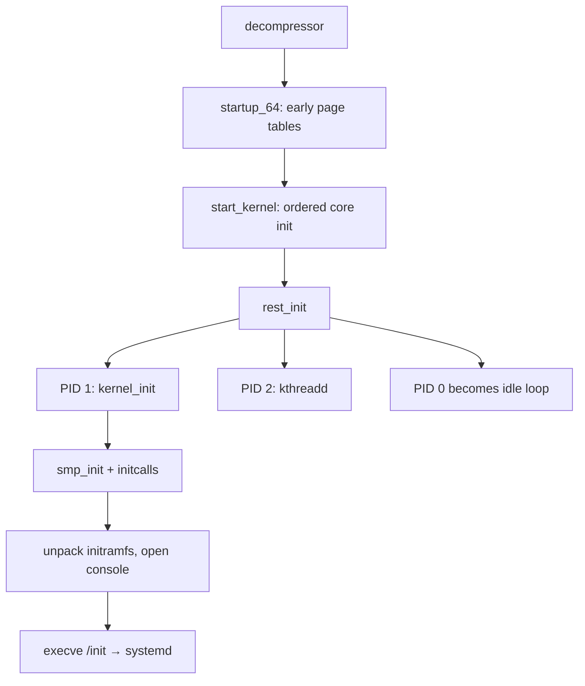

# From Power Button to Login

> **Goal:** follow the machine from electricity to a usable shell, naming every
> actor on the way: firmware → bootloader → kernel → init → your login. After
> this chapter, `dmesg` and "PID 1" will mean something concrete, and you'll
> understand exactly what your bootloader is doing in those three seconds.

Booting looks like magic because four completely different programs hand
control to each other in under a few seconds. Each one initializes just enough
of the machine to load the next, then disappears. Let's slow it down.

```text
power on
   │
   ▼
[1] Firmware (UEFI/BIOS)         "find something bootable"
   │
   ▼
[2] Bootloader (GRUB, systemd-boot)   "load kernel + initramfs into RAM"
   │
   ▼
[3] Linux kernel                  "initialize hardware, mount root fs"
   │
   ▼
[4] PID 1: init (systemd)         "start services, mounts, network, getty"
   │
   ▼
[5] login / display manager  →  your shell
```

Keep one idea in your pocket the whole way down: **each stage's only real job
is to set up enough of the machine to run the next stage, then get out of the
way.** Firmware brings up RAM so a bootloader can run. The bootloader loads a
kernel so the kernel can run. The kernel builds enough of an OS to run one
user-space program. That program builds everything else.

## Stage 1 — Firmware (UEFI)

When power arrives, the CPU starts executing code from a fixed address in a
flash chip on the motherboard: the **firmware**. Older machines used **BIOS**;
everything modern uses **UEFI**.

The firmware:

1. runs **POST** (Power-On Self-Test): checks RAM, enumerates devices;
2. locates a bootable target. UEFI reads boot entries from NVRAM
   (see them with `efibootmgr` on a running system), finds the **EFI System
   Partition** (a small FAT32 partition, usually mounted at `/boot/efi`), and
   loads a `.efi` executable from it — your bootloader.

> **BIOS vs UEFI in one line:** BIOS blindly executed the first 440 bytes of
> the disk (the MBR); UEFI understands partitions and filesystems and runs a
> proper executable. Same job, fewer dark rituals.

### Inside the firmware's few seconds

UEFI firmware itself boots in phases, and knowing their names helps you read
vendor logs and understand why the pre-GRUB delay exists at all:

- **SEC** (Security) — the very first instructions, running from flash with
  *no RAM initialized yet*; the CPU's cache is temporarily used as RAM
  ("cache-as-RAM") to give this code a stack. You have maybe 32–64 KiB of L2
  to work with, which is why this phase does almost nothing.
- **PEI** (Pre-EFI Initialization) — brings up main memory. On DDR4/DDR5 this
  means **memory training**: the memory controller calibrates signal timing
  against the installed DIMMs. This is why a desktop takes 2–10 seconds before
  any logo appears, and why servers with terabytes of RAM can sit at POST for
  1–5 *minutes*. Results are usually cached in NVRAM, so a cold boot after a
  RAM change is slower than the next one.
- **DXE** (Driver Execution Environment) — loads firmware drivers for storage
  controllers, USB, the GPU (the GOP driver that gives you pre-OS graphics).
  This is where most of the DXE-phase seconds go, and where "fast boot"
  options make cuts.
- **BDS** (Boot Device Selection) — walks the `BootOrder` NVRAM variable,
  tries each `Boot####` entry, and executes the first `.efi` binary it can
  load and (under Secure Boot) verify.

The ESP is deliberately boring: FAT32, typically 100–550 MiB, identified in
the GPT by a well-known partition type GUID (`C12A7328-F81F-11D2-BA4B-…`). FAT
is the one filesystem every UEFI implementation must understand — which is why
your cutting-edge NVMe system still boots from a filesystem designed in the
1970s.

### What UEFI hands to the bootloader

The ESP contains EFI executables — PE/COFF binaries, not ELF. Your bootloader
is one of them. UEFI hands the bootloader:

- a **memory map** (which physical ranges are usable RAM, reserved, ACPI
  tables, MMIO — the kernel needs this, and the bootloader passes it along);
- access to UEFI **boot services** (allocate memory, read files, drive
  devices) — usable only until the OS calls `ExitBootServices()`, after which
  the firmware relinquishes the hardware and its memory map freezes;
- access to UEFI **runtime services** (real-time clock, NVRAM variables,
  capsule updates) — these stay callable even after boot; `efibootmgr` works
  on a running system precisely because the kernel exposes them;
- the **GOP framebuffer** if you're booting graphically (what lets you see the
  GRUB menu and the early kernel console, via the `efifb`/`simpledrm` drivers,
  before the real GPU driver loads).

On most distributions you can inspect the boot entries:

```bash
sudo efibootmgr -v
# BootOrder: 0000,0001
# Boot0000* ubuntu  HD(1,GPT,...)/File(\EFI\ubuntu\shimx64.efi)
```

### Secure Boot: the chain of signatures

That `shimx64.efi` is the UEFI **shim**. Secure Boot is a key hierarchy baked
into firmware NVRAM:

- **PK** (Platform Key) — the root, usually the hardware vendor's key;
- **KEK** (Key Exchange Keys) — authorized to update the databases below;
- **db** — certificates/hashes of binaries *allowed* to boot (this is where
  Microsoft's "UEFI CA 2011" certificate lives, on nearly all PCs);
- **dbx** — the revocation list of binaries *forbidden* to boot.

The chain on a typical distro: firmware verifies **shim** (signed by
Microsoft's UEFI CA, so it boots everywhere), shim verifies **GRUB** using the
distro's certificate embedded in shim, GRUB verifies the **kernel** (signature
appended to the vmlinuz PE binary), and the kernel then verifies **modules**
against keys in its keyring. Users can enroll their own **MOK** (Machine Owner
Key) with `mokutil` to sign custom kernels or out-of-tree modules. If any link
fails, boot halts — this is why unsigned kernels/modules won't load under
Secure Boot, and why many distros also enable kernel **lockdown** mode when
Secure Boot is on (lockdown blocks the interfaces that could patch a running
kernel from user space, such as `/dev/mem` and unsigned module loading). The
deeper story — measured boot, the TPM, and IMA — is in
[Trusted Computing: Secure Boot, TPM & IMA](#/trusted-computing).

## Stage 2 — Bootloader (GRUB)

The bootloader's job is small but vital:

1. show you a menu (kernels, other OSes) if asked;
2. load two files from `/boot` into RAM:
   - `vmlinuz-…` — the **compressed kernel image**;
   - `initramfs-…` (or `initrd`) — a small **temporary root filesystem** in
     a compressed archive;
3. pass the **kernel command line** (arguments like `root=UUID=… quiet splash`
   — see yours with `cat /proc/cmdline`);
4. jump into the kernel's entry point. The bootloader's job is done forever.

That's it. GRUB looks big — it has a scripting language, a filesystem library
that understands ext4/Btrfs/XFS, network boot, and cryptography — but all of
that machinery exists only to reliably get those two files and one string into
memory and jump.

### What vmlinuz actually is

`vmlinuz` on x86 is a **bzImage**: a small real-mode setup stub plus a
self-decompressing compressed payload (the actual ELF `vmlinux`, typically
~10–15 MiB compressed, several times larger unpacked — a distro `vmlinux` with
debug symbols stripped is on the order of 40–70 MiB). Its first sector
contains a **setup header** — the contract between bootloader and kernel,
defined by the x86 Linux boot protocol (version 2.15 as of 6.12) and
represented in the kernel by [struct setup_header](https://elixir.bootlin.com/linux/v6.12/C/ident/setup_header).
The fields that matter:

- `cmd_line_ptr` — physical address of the command-line string the bootloader
  wrote into memory (max `COMMAND_LINE_SIZE` = 2048 bytes on x86);
- `ramdisk_image` / `ramdisk_size` — where the bootloader put the initramfs;
- `code32_start` / entry offsets — where to jump to start the kernel;
- `init_size` — how much memory the kernel needs to decompress itself.

The bootloader fills in a larger structure around this header — the
"zeropage", [struct boot_params](https://elixir.bootlin.com/linux/v6.12/C/ident/boot_params)
— which also carries `e820_table[]`/`e820_entries` (the physical memory map)
and `efi_info` (how to find the UEFI system table). Everything the kernel
knows about the machine at time zero arrives through this one struct; the very
first thing the C entry point does is copy it somewhere safe before the
decompressor's scratch memory gets reused.

Since the kernel gained an **EFI stub**, the vmlinuz is *also* a valid PE/COFF
executable: UEFI can execute the kernel directly, no GRUB required. That's how
**systemd-boot** works, and it's the basis of **UKIs** (Unified Kernel
Images): a single signed `.efi` bundling stub + kernel + initramfs + command
line, increasingly used because the *whole* bootable unit can be signed and
TPM-measured at once.

### The kernel command line, decoded

```bash
cat /proc/cmdline
# BOOT_IMAGE=/boot/vmlinuz-6.12.0 root=UUID=abc123 ro quiet splash
```

Each parameter has a role:
- `root=UUID=abc123` — which filesystem becomes `/`
- `ro` — mount root read-only initially (so a consistency check / journal
  replay can run safely; initramfs or systemd remounts it rw later)
- `quiet` — suppress most kernel log messages at boot
- `splash` — show a graphical splash screen
- `init=/bin/bash` — override PID 1 (single-user recovery!)
- `panic=5` — auto-reboot after 5 seconds if the kernel panics
- `initcall_debug` — print the time each init function takes (see below)

The kernel itself accepts hundreds of parameters (`modprobe.blacklist`,
`cgroup_no_v1`, `mitigations=off` — see
[CPU Vulnerability Mitigations](#/cpu-mitigations) for that last one).
The [kernel-parameters documentation](https://docs.kernel.org/admin-guide/kernel-parameters.html)
is the complete reference. Anything the kernel doesn't recognize (a `key=value`
it has no handler for, or an argument after a bare `--`) gets passed to PID 1
as arguments or environment — `systemd.unit=rescue.target` on the kernel
command line is really an argument *for systemd*.

### What's actually in the initramfs?

A chicken-and-egg problem: to mount your real root filesystem, the kernel may
need modules (disk drivers, filesystem drivers, RAID/LVM/encryption support) —
but those modules live *on* the root filesystem it can't mount yet.

Solution: the **initramfs**, a small CPIO archive containing just enough
drivers and tools, unpacked straight into RAM. The kernel runs a tiny `/init`
program from it which loads the right modules, assembles RAID/decrypts disks
if needed, mounts the real root, and finally **switches root** onto it.

Concretely, the file is a **cpio archive in "newc" format** (the same format
`cpio -H newc` produces), usually compressed — modern distros default to
**zstd** (supported since kernel 5.9) because it decompresses several times
faster than xz for similar ratios. It's often *two concatenated segments*: an
uncompressed early cpio carrying CPU **microcode updates** (which the kernel
must apply before almost anything else — before secondary CPUs come up), then
the compressed main archive. Sizes vary wildly: a host-only dracut image
(Fedora) is ~30–50 MiB; a generic-everything Ubuntu initramfs can exceed
100 MiB.

Two tools build these on mainstream distros: **initramfs-tools**
(Debian/Ubuntu, shell-script `/init`) and **dracut** (Fedora/RHEL/SUSE, which
puts a real *systemd* inside the initramfs — your machine briefly runs a
miniature systemd before the real one, then hands off with `switch-root`).

```bash
lsinitramfs /boot/initrd.img-$(uname -r) | head -30
# kernel/x86/microcode/GenuineIntel.bin          ← early microcode segment
# lib/modules/6.12.0/kernel/drivers/nvme/host/nvme.ko.zst
# lib/modules/6.12.0/kernel/fs/ext4/ext4.ko.zst
# sbin/blkid
# usr/sbin/cryptsetup
```

You can even unpack it and study the init script:

```bash
mkdir /tmp/initrd && cd /tmp/initrd
zstdcat /boot/initrd.img-$(uname -r) | cpio -idmv 2>/dev/null
cat init       # the script systemd/klibc-based initramfs runs
```

> **Architecture note:** everything above describes x86-64. On **arm64**
> there's no real-mode legacy at all: the kernel `Image` has its own simple
> 64-byte header, firmware is usually UEFI too (servers) or U-Boot (embedded),
> and hardware description arrives via ACPI tables or a **devicetree** blob
> instead of being probed. The rest of the story — initramfs, PID 1, systemd —
> is identical.

## Stage 3 — The kernel wakes up

The kernel decompresses itself, then runs its initialization in a precise
order. You can watch a replay of it any time with `dmesg`:

```bash
sudo dmesg | head -40
sudo dmesg --human --level=err,warn  # just the trouble
sudo dmesg -H -T                     # human timestamps
```

Roughly, it:

1. **CPU & memory setup** — builds page tables, enables
   [virtual memory](#/memory), parses the UEFI/e820 memory map to learn where
   RAM actually is, and sets up **memblock**, the boot-time allocator used
   until the real page allocator exists. With KASLR (the default), the
   decompressor has already placed the kernel at a randomized physical and
   virtual address.
2. **Core subsystems** — in a hand-ordered sequence: the
   [scheduler](#/scheduling) (so kernel threads can exist), the IDT and
   [interrupt handlers](#/interrupts) (so it can respond to hardware), the
   [timer subsystem](#/timers) (so preemption and timeouts work), and
   [RCU](#/kernel-sync) (the lock-free read mechanism used everywhere in the
   kernel). Order matters intensely here: you can't take a sleeping lock before
   the scheduler knows about preemption, can't set a timeout before timers
   exist.
3. **SMP bring-up** — the boot CPU starts the other cores.
4. **Device discovery** — walks PCIe/USB buses, populates the
   [device model](#/devices-modules).
5. **Mounts the root filesystem** — via the initramfs.
6. **Starts PID 1** — the kernel executes exactly one user-space program.

The next few subsections open up the ones that hide the most detail.

### CPU and memory setup, in detail

The very first thing the kernel needs is a coherent picture of physical
memory. The firmware hands it the **e820 map** (named after the legacy BIOS
`INT 0x15, EAX=0xE820` call; UEFI supplies the equivalent). Each entry is a
[struct e820_entry](https://elixir.bootlin.com/linux/v6.12/C/ident/e820_entry)
with three fields that matter: `addr` (start), `size`, and `type` (usable RAM,
reserved, ACPI-reclaimable, ACPI-NVS, etc.). You can see the map the kernel
was handed:

```bash
sudo dmesg | grep -i e820 | head
# BIOS-provided physical RAM map:
# BIOS-e820: [mem 0x0000000000000000-0x000000000009fbff] usable
# BIOS-e820: [mem 0x00000000000a0000-0x00000000000fffff] reserved
```

That map is not usable directly — it's full of holes and reserved regions. The
kernel copies it into **memblock**, a simple two-list allocator (`memory` and
`reserved`) that works before the page allocator exists. Everything early —
the initramfs, the kernel image, initial page tables — is protected by a
[memblock_reserve()](https://elixir.bootlin.com/linux/v6.12/C/ident/memblock_reserve)
call so nothing overwrites it. Once the real buddy allocator is up, memblock
hands its free ranges over and retires.

Meanwhile the kernel is running on **page tables**. On x86-64 the very first
ones are in [swapper_pg_dir](https://elixir.bootlin.com/linux/v6.12/C/ident/swapper_pg_dir),
the statically allocated top-level page table associated with
[init_mm](https://elixir.bootlin.com/linux/v6.12/C/ident/init_mm), the address
space every kernel thread borrows. The default page size on x86-64 is **4 KiB**
(with 2 MiB and 1 GiB "huge" pages available); **arm64** can be built for 4, 16,
or 64 KiB base pages, which changes the whole page-table geometry. KASLR adds
entropy to where the kernel and its `physmap` (the direct map of all RAM) land
— on the order of 9–30 bits depending on the region — so an attacker can't
assume a fixed address for kernel structures.

### SMP bring-up

The boot CPU (CPU 0) is the only one running so far. It brings up the others by
sending each an inter-processor interrupt that vectors into
[secondary_startup_64](https://elixir.bootlin.com/linux/v6.12/C/ident/secondary_startup_64)
on x86. Each secondary CPU gets its own kernel stack, its own **per-CPU data**
area (variables that are physically separate per core, so reading them needs no
lock), and its own idle task. On a [NUMA](#/numa-deep-dive) machine the per-CPU
areas are placed in each CPU's local memory node.

Historically this was strictly serial — CPU 0 woke CPU 1, waited for it to
report in, woke CPU 2, and so on — which cost real time on big sockets. **Since
kernel 6.5, x86 brings CPUs up in parallel**, overlapping the slow per-CPU
init across cores and cutting this phase from seconds to tens of milliseconds
on machines with hundreds of threads. The whole dance is driven by the CPU
hotplug state machine (the same mechanism `echo 0 > /sys/devices/system/cpu/
cpu3/online` uses at runtime), stepping each CPU through a fixed ladder of
`CPUHP_*` states.

### Device discovery

With CPUs, memory, interrupts, and timers up, the kernel walks the hardware.
Drivers register **ID tables** (for PCI, vendor/device ID pairs); the bus core
enumerates each device on PCIe/USB and, when an ID matches, calls the driver's
`probe()` function. `/sys` entries appear as devices are found; `/dev` nodes
follow once **udev** runs in user space and reacts to the uevents the kernel
emits. A driver that isn't ready — because a resource it depends on hasn't been
probed yet — can return `-EPROBE_DEFER` to be retried later instead of failing
or blocking boot. The full model is in
[Devices, Drivers & Modules](#/devices-modules).

### Mounting the real root

The initramfs `/init` does the heavy lifting: loads needed modules (nvme, ext4,
dm-crypt…), assembles [storage stacks](#/storage-stack) (md-raid, LVM, LUKS
unlock), mounts the real root, and then **switches root** onto it. The switch
is not a normal `mount` — the initramfs *is* the current root, so it uses a
special path: it moves the new root's mount to `/`, moves `/proc`, `/sys`,
`/dev` along with it, then deletes every file of the old initramfs to free the
RAM (a `rootfs`/ramfs instance can't be unmounted, so the tool
`switch_root` empties it instead) and finally `execve`s the real `/sbin/init`.
From this moment the kernel is largely *reactive*: most kernel code executes
when interrupts fire or processes make [syscalls](#/kernel-vs-userspace).

### The three first "processes"

The "first process" story actually has three characters, and you can see two
of them in `ps`:

- **PID 0** — the **idle task** (`swapper/0`, one per CPU). It's the context
  [start_kernel()](https://elixir.bootlin.com/linux/v6.12/C/ident/start_kernel)
  itself runs in, using the statically allocated
  [init_task](https://elixir.bootlin.com/linux/v6.12/C/ident/init_task) — the
  one `struct task_struct` never created by `fork()`. After boot it becomes the
  loop each CPU falls into when there's nothing to run, where the CPU enters
  C-states to save power (see [Power Management](#/power-management)). It never
  appears in `ps` — it's not a schedulable user process.
- **PID 1** — `init` (systemd). The kernel thread that will become PID 1 is
  created *first*, so it wins the number.
- **PID 2** — **kthreadd**, the parent of all
  [kernel threads](#/processes). Every `[kworker/*]`, `[ksoftirqd/*]` and
  friend descends from PID 2, never from PID 1 — check with `pstree -p 2`.

Every one of these is a [struct task_struct](https://elixir.bootlin.com/linux/v6.12/C/ident/task_struct),
the kernel's per-task control block. Even at this stage the fields that define
a task are already meaningful: `pid` (its identifier), `comm` (the short name
you see in brackets in `ps`), `flags` (with `PF_KTHREAD` set for the two kernel
threads, marking them as having no user-space address space), and `stack` (its
kernel stack, typically 16 KiB on x86-64). Kernel threads set their `mm`
pointer to `NULL` and borrow `init_mm`'s page tables; that's the concrete
difference between a kernel thread and a user process.

### Initcalls: how "everything else" gets initialized

After the hand-ordered core comes everything else — thousands of subsystem
and driver init functions. The kernel doesn't call them by name; each is
registered at compile time into one of eight **initcall levels** (early,
core, postcore, arch, subsys, fs, device, late), and the kernel simply walks
the levels in order. A driver's `module_init()` becomes a level-6 ("device")
initcall when built in. This is also where boot time hides: boot with
`initcall_debug` on the kernel command line and dmesg will print the latency
of every single initcall — the classic way to find the driver that costs you
400 ms probing hardware you don't have.



> **Simplified model:** after boot, the kernel has no single permanent "main
> loop" comparable to a user-space application. It is a library of services
> invoked by hardware interrupts and system calls, and user space drives the
> machine.
>
> **Important nuance:** the kernel is not purely reactive in every sense. It
> also runs **kernel threads** (visible as `[kthreadd]`, `[ksoftirqd/*]`,
> `[kworker/*]` — workqueues handling deferred work, writeback flushing page
> cache, and many others), executes **softirqs** and **timer-driven deferred
> processing**, and wakes itself periodically for housekeeping. The kernel
> is *event-driven* more than it is *passive*, driven by hardware events,
> timer events, and user-space requests rather than by a single blocking main
> loop. See [Interrupts, Exceptions & Softirqs](#/interrupts).

### The dmesg boot story decoded

Here's what key lines in your dmesg actually mean:

```text
[0.000000] Linux version 6.12.0 (buildd@…)      ← kernel version and builder
[0.000000] Command line: BOOT_IMAGE=...          ← the cmdline we discussed
[0.000000] BIOS-provided physical RAM map:       ← what UEFI told the kernel
[0.000000] e820: usable [mem 0x00000000-0x0009ffff]
[0.012345] smpboot: Booting Node 0, CPUs: #1 #2 #3 … ← multi-core bringup
[0.345678] pci_bus 0000:00: root bus resource    ← PCI enumeration begins
[1.234567] EXT4-fs (sda2): mounted filesystem    ← the real root, mounted
[2.345678] systemd[1]: Inserted module 'autofs4' ← PID 1 now running
```

The timestamps in brackets are seconds since the kernel started (specifically,
since the timer was calibrated early in boot). The messages live in a
fixed-size ring buffer in kernel memory (typically 128 KiB–1 MiB, tunable with
`log_buf_len=`), so on a long-running system the boot messages eventually
scroll away — `journalctl -k -b 0` keeps them on disk. Diagnose slow boots by
looking at large gaps: `dmesg -d` prints the delta between consecutive
messages.

## Stage 4 — PID 1: init (systemd)

The first process gets PID 1 and special status:

- it is the **ancestor of every (user-space) process** on the system;
- it **adopts orphans** (when a parent dies before its children) and reaps
  their exit status — see [Processes & Threads](#/processes);
- it never receives a [signal](#/signals) it hasn't installed a handler for.
  The kernel sets the `SIGNAL_UNKILLABLE` flag on init's `signal_struct` and
  refuses to deliver default-fatal signals — even `SIGKILL` from another
  process — so a stray signal can't take the system down;
- if PID 1 of the **initial PID namespace** dies, the kernel **panics** —
  the exact message is `Attempted to kill init!`. The check lives in
  [do_exit()](https://elixir.bootlin.com/linux/v6.12/C/ident/do_exit): if the
  exiting task satisfies [is_global_init()](https://elixir.bootlin.com/linux/v6.12/C/ident/is_global_init),
  the kernel panics rather than continue with no init. (Remember this for
  [containers](#/containers-overview): the process you start in a container
  becomes that [PID namespace's](#/namespaces) PID 1, inheriting orphan
  reaping duties and signal specialness — but its death triggers a **SIGKILL
  cascade to all processes in that PID namespace**, not a host panic. Only
  PID 1 in the initial namespace can panic the machine.)

On virtually all modern distros, init is **systemd**. Its job: bring the
system to a desired state by starting **units** (services, mounts, sockets,
timers, targets) with full dependency tracking and parallelism. The boot goal
is `default.target` — a symlink to `graphical.target` (desktop) or
`multi-user.target` (server). systemd computes the dependency graph
(`Requires=`, `Wants=`, ordered by `After=`/`Before=`), then starts everything
that *can* run in parallel, in parallel.

Two techniques do most of the parallelism work. **Socket activation**: systemd
opens a service's listening socket itself and hands it over on start, so
dependents can connect before the service has even finished starting —
connections just queue in the kernel's socket backlog. **Bus activation**: a
D-Bus service is started on first message. Both break dependency chains that a
sequential init would have to wait out. systemd also runs **generators** very
early — small programs that synthesize units on the fly, for example turning
`/etc/fstab` lines and `root=`/`rd.*` kernel-command-line options into mount
and target units before the first real unit starts.

If you booted from a dracut initramfs, there were actually *two* systemd
instances: a minimal one inside the initramfs that reaches `initrd.target` and
mounts the real root at `/sysroot`, then a `systemctl switch-root` that
`execve`s the real systemd on the real root, keeping PID 1 the whole time.

```bash
pstree -p | head -15        # everything descends from systemd(1)
systemctl list-units --type=service --state=running
systemctl list-dependencies default.target   # the boot goal, unfolded
systemd-analyze blame       # who's slow at boot?
systemd-analyze critical-chain  # the longest dependency chain
journalctl -b -0            # logs since THIS boot
journalctl -b -1            # logs from the PREVIOUS boot (gold for crashes)
```

Old-school `sysvinit` ran numbered shell scripts in sequence
(`/etc/rc3.d/S01…`); systemd replaced that with declarative unit files:

```ini
# /usr/lib/systemd/system/nginx.service (simplified)
[Unit]
Description=nginx web server
After=network.target

[Service]
ExecStart=/usr/sbin/nginx -g 'daemon off;'
Restart=on-failure
PrivateTmp=true        ← private /tmp, via mount namespace!
ProtectSystem=strict   ← read-only /usr, /etc
ReadWritePaths=/var/log/nginx

[Install]
WantedBy=multi-user.target
```

> **Container link:** systemd uses [cgroup v2](#/cgroups) — the default on all
> modern distros since around 2021 — to track every process a service spawns
> (peek at the tree in `/sys/fs/cgroup/system.slice/`), and
> [namespaces](#/namespaces) plus seccomp for the sandboxing directives above.
> The container world and the init world are built on identical kernel
> primitives — a systemd service with enough `Protect*=` lines is most of the
> way to a container.

## Stage 5 — Login

For a server: systemd starts `agetty` on a tty. `getty` opens the terminal,
prints `/etc/issue`, and runs `login`. `login` authenticates you through
**PAM** (Pluggable Authentication Modules — a *stack* of modules configured in
`/etc/pam.d/login`, evaluated in four groups: `auth`, `account`, `password`,
`session`). In the common case `pam_unix` checks your password hash against
`/etc/shadow` (yescrypt or SHA-512 by default on current distros), then
`pam_systemd` in the `session` group registers a **session** with
`systemd-logind` — which is what creates `/run/user/<uid>`, sets `XDG_RUNTIME_DIR`,
tracks your **seat** (the bundle of a screen, keyboard, and mouse), and starts
your `user@<uid>.service` tree. Then `login` sets your UID/GID/home directory
and finally `exec`s the shell listed in `/etc/passwd`. The kernel doesn't know
or care that you're "logged in"; it just knows the process tree changed and
some credentials (the task's UID/GID and its supplementary groups) got set.

For a desktop: a **display manager** (GDM, SDDM) does the same dance
graphically: it owns the GPU/input, runs a login screen, authenticates via
the same PAM machinery, and starts your session — a regular process tree
under systemd's `user@1000.service`.

Either way the result is identical: a process tree rooted at PID 1, with your
shell as a leaf, blocked in a `read()` on the terminal, waiting for you to
type. The boot is complete.

## Follow the code (kernel v6.12)

Two traces through the real source. Follow along on Elixir — the heart of it
all is [init/main.c](https://elixir.bootlin.com/linux/v6.12/source/init/main.c).

### Path 1: from bootloader to the idle loop (x86-64)

1. **Decompression.** The bootloader (or the kernel's own EFI stub, entered
   via [efi_stub_entry()](https://elixir.bootlin.com/linux/v6.12/C/ident/efi_stub_entry)
   when UEFI executes vmlinuz directly) jumps into the decompressor.
   [extract_kernel()](https://elixir.bootlin.com/linux/v6.12/C/ident/extract_kernel)
   in [arch/x86/boot/compressed/misc.c](https://elixir.bootlin.com/linux/v6.12/source/arch/x86/boot/compressed/misc.c)
   picks a KASLR-randomized load address, decompresses the embedded
   `vmlinux`, and applies relocations. Milliseconds, thanks to zstd/lz4.
2. **Assembly bring-up.** [startup_64](https://elixir.bootlin.com/linux/v6.12/C/ident/startup_64)
   in `arch/x86/kernel/head_64.S` builds minimal identity-mapped page tables in
   [swapper_pg_dir](https://elixir.bootlin.com/linux/v6.12/C/ident/swapper_pg_dir),
   enables the CPU features the kernel needs, sets up a stack, and calls into
   C: [x86_64_start_kernel()](https://elixir.bootlin.com/linux/v6.12/C/ident/x86_64_start_kernel),
   which copies [struct boot_params](https://elixir.bootlin.com/linux/v6.12/C/ident/boot_params)
   and the command line out of the bootloader's memory.
3. **The big one.** [start_kernel()](https://elixir.bootlin.com/linux/v6.12/C/ident/start_kernel)
   is ~200 lines of hand-ordered init calls. Highlights, in order:
   [setup_arch()](https://elixir.bootlin.com/linux/v6.12/C/ident/setup_arch)
   (parses the e820/EFI memory map via
   [e820__memory_setup()](https://elixir.bootlin.com/linux/v6.12/C/ident/e820__memory_setup),
   reserves the initramfs with
   [memblock_reserve()](https://elixir.bootlin.com/linux/v6.12/C/ident/memblock_reserve)),
   [setup_command_line()](https://elixir.bootlin.com/linux/v6.12/C/ident/setup_command_line)
   and [parse_args()](https://elixir.bootlin.com/linux/v6.12/C/ident/parse_args)
   (which hand every `key=value` to its registered handler),
   [sched_init()](https://elixir.bootlin.com/linux/v6.12/C/ident/sched_init),
   [init_IRQ()](https://elixir.bootlin.com/linux/v6.12/C/ident/init_IRQ),
   [time_init()](https://elixir.bootlin.com/linux/v6.12/C/ident/time_init),
   [mm_core_init()](https://elixir.bootlin.com/linux/v6.12/C/ident/mm_core_init)
   (the real page allocator comes alive; memblock retires),
   [rcu_init()](https://elixir.bootlin.com/linux/v6.12/C/ident/rcu_init).
   All of this runs in the context of
   [init_task](https://elixir.bootlin.com/linux/v6.12/C/ident/init_task) —
   the *statically allocated* `struct task_struct` for PID 0, the only
   process never created by `fork()`.
4. **Fork the world.** The last line of `start_kernel()` calls
   [rest_init()](https://elixir.bootlin.com/linux/v6.12/C/ident/rest_init),
   which creates exactly two threads:
   [kernel_init()](https://elixir.bootlin.com/linux/v6.12/C/ident/kernel_init)
   (destined to become PID 1) and
   [kthreadd()](https://elixir.bootlin.com/linux/v6.12/C/ident/kthreadd)
   (PID 2). Then the boot CPU calls
   [cpu_startup_entry()](https://elixir.bootlin.com/linux/v6.12/C/ident/cpu_startup_entry),
   whose core is [do_idle()](https://elixir.bootlin.com/linux/v6.12/C/ident/do_idle)
   — an infinite loop it never leaves. PID 0 has become the idle task.

### Path 2: from kernel_init to /init

1. [kernel_init()](https://elixir.bootlin.com/linux/v6.12/C/ident/kernel_init)
   first runs [kernel_init_freeable()](https://elixir.bootlin.com/linux/v6.12/C/ident/kernel_init_freeable),
   which brings up the secondary CPUs with
   [smp_init()](https://elixir.bootlin.com/linux/v6.12/C/ident/smp_init) and
   then runs [do_initcalls()](https://elixir.bootlin.com/linux/v6.12/C/ident/do_initcalls)
   — the eight-level initcall walk described above. Driver probing, filesystem
   registration, network stack init: it all happens here.
2. One of those initcalls is
   [populate_rootfs()](https://elixir.bootlin.com/linux/v6.12/C/ident/populate_rootfs)
   in [init/initramfs.c](https://elixir.bootlin.com/linux/v6.12/source/init/initramfs.c):
   it unpacks the cpio archive(s) the bootloader loaded into **rootfs**, the
   always-present ramfs/tmpfs instance at the very root of the mount tree.
3. Back in `kernel_init_freeable()`,
   [console_on_rootfs()](https://elixir.bootlin.com/linux/v6.12/C/ident/console_on_rootfs)
   opens `/dev/console` three times — file descriptors 0, 1 and 2 for
   everything that follows. If no `/init` exists in the initramfs,
   [prepare_namespace()](https://elixir.bootlin.com/linux/v6.12/C/ident/prepare_namespace)
   mounts whatever `root=` names directly.
4. Finally `kernel_init()` tries, in order: the initramfs `/init`, then
   `/sbin/init`, `/etc/init`, `/bin/init`, `/bin/sh` — each via
   [run_init_process()](https://elixir.bootlin.com/linux/v6.12/C/ident/run_init_process),
   which calls [kernel_execve()](https://elixir.bootlin.com/linux/v6.12/C/ident/kernel_execve).
   The first `execve()` that succeeds transforms this kernel thread into a
   real user-space process: systemd. If all fail, the kernel panics with
   *"No working init found."*
5. And the panic-on-death rule? It's back in
   [do_exit()](https://elixir.bootlin.com/linux/v6.12/C/ident/do_exit): if the
   exiting task is the global init (per
   [is_global_init()](https://elixir.bootlin.com/linux/v6.12/C/ident/is_global_init)),
   the kernel calls `panic("Attempted to kill init!...")`.

## Boot performance: what slows things down

If your machine boots slowly, here's where to look:

```bash
systemd-analyze                # total time: firmware + loader + kernel + user
systemd-analyze blame          # per-service startup times, descending
systemd-analyze plot > boot.svg # swimlane chart
dmesg -d                       # show delta timestamps between kernel messages
```

Common culprits, by stage:
- **Firmware time** (2–15 s desktop, minutes on servers) — POST, memory
  training, option ROMs. Hard to fix; "fast boot" firmware options skip
  re-training and some enumeration.
- **Loader time** (1–5 s) — GRUB's menu timeout (default 5 s) dominates.
  Trim `GRUB_TIMEOUT` in `/etc/default/grub`; systemd-boot/UKIs shave more.
- **Kernel time** (1–5 s) — device probing and firmware blob loading. Use
  `initcall_debug` or `dmesg -d` to find the guilty driver; probes are
  parallelized and deferred where possible, so this is usually not the
  problem.
- **Initramfs** — a generic 100 MiB image costs real time to load and
  unpack; host-only images (dracut `--hostonly`) are 2–3× smaller.
- **Userspace time** (5–30 s) — the big one. systemd units waiting on slow
  services (`network-online.target` is the classic offender).
  `systemd-analyze critical-chain` names the choke point.

For the general approach to hunting latency like this, see
[Performance Analysis Methodology](#/perf-methodology) and
[/proc, strace, perf & eBPF](#/observability).

## Try it yourself

```bash
cat /proc/cmdline            # what the bootloader told the kernel
sudo dmesg --human | less    # the kernel's own boot diary
sudo dmesg | grep -i e820    # the physical memory map the firmware handed over
sudo dmesg -d | sort -t'<' -k2 -rn | head -5  # where did the kernel spend time?
systemd-analyze              # how long each boot stage took
systemd-analyze critical-chain  # the longest dependency chain
pstree -p | head             # the process tree growing from PID 1
pstree -p 2 | head           # ...and the kernel-thread tree under kthreadd
ls -lh /boot                 # kernel images and initramfs archives
lsinitramfs /boot/initrd.img-$(uname -r) | wc -l  # how many files in there?
sudo efibootmgr -v           # UEFI boot entries
ls /sys/firmware/efi/efivars | head   # UEFI NVRAM variables, live
systemctl list-dependencies default.target | head  # the boot goal's graph
```

## Check your understanding

1. Why can't the kernel just mount the root filesystem directly — what is the
   initramfs working around?

<details><summary>Show answer</summary>

The kernel may need modules (disk/filesystem drivers, RAID/LVM/encryption
support) that live *on* the root filesystem it cannot yet mount. The
initramfs is a small cpio archive unpacked into RAM that provides exactly
those modules and tools; its `/init` mounts the real root and switches onto
it.

</details>

2. After boot is finished, what causes kernel code to execute at all?

<details><summary>Show answer</summary>

Interrupts, system calls, kernel threads, workqueues, softirqs, and
timer-driven deferred work. The kernel is event-driven rather than having a
single main loop — but it is not purely passive: `[kworker/*]` threads and
periodic housekeeping run without any user-space request.

</details>

3. What's special about PID 1, and why does this matter for containers?

<details><summary>Show answer</summary>

PID 1 is the process-tree root and orphan reaper, and the kernel sets
`SIGNAL_UNKILLABLE` on it so it drops even a `SIGKILL` it has no handler for.
If PID 1 of the *initial* PID namespace dies, `do_exit()` panics the kernel
(`Attempted to kill init!`). Inside a container's PID namespace, PID 1's death
instead SIGKILLs every other process in that namespace — so a container
entrypoint inherits reaping duties and signal specialness without being able
to crash the host.

</details>

4. You see a three-second gap in dmesg between PCI enumeration and the
   "mounted filesystem" message. What was likely happening?

<details><summary>Show answer</summary>

The initramfs was doing its work: loading storage and filesystem modules,
waiting for devices to appear, assembling RAID/LVM, possibly waiting for a
LUKS passphrase — all before it could mount the real root. `dmesg -d` and
`initcall_debug` narrow it down.

</details>

5. What are PID 0 and PID 2, and why does the "first process" story really
   have three characters?

<details><summary>Show answer</summary>

PID 0 is the idle task (`swapper`), which runs on the statically allocated
`init_task` and is the context `start_kernel()` executes in; it becomes the
per-CPU do-nothing loop after boot. PID 1 is init/systemd, the user-space
ancestor. PID 2 is `kthreadd`, the parent of *all* kernel threads — which is
why `[kworker/*]` threads descend from PID 2, not PID 1.

</details>

6. What does `ro` on the kernel command line mean, and when does it get
   changed?

<details><summary>Show answer</summary>

The root filesystem is mounted read-only initially so a consistency check
(fsck/journal replay) can run safely against an unmodified filesystem. The
initramfs or systemd remounts it read-write (`mount -o remount,rw /`) later
in boot.

</details>

7. Why does a distro kernel boot on a Secure Boot machine without you
   enrolling any keys, and what breaks when you build your own kernel?

<details><summary>Show answer</summary>

The firmware's `db` ships with Microsoft's UEFI CA certificate, which signed
the distro's shim; shim then vouches for GRUB and the distro-signed kernel.
Your self-built kernel isn't signed by any key in that chain, so it's
rejected — unless you sign it with a Machine Owner Key enrolled via
`mokutil`, or disable Secure Boot.

</details>

8. Why does the e820 (or UEFI) memory map matter so early, and what is
   `memblock` for?

<details><summary>Show answer</summary>

The kernel needs to know which physical ranges are real, usable RAM versus
reserved/ACPI/MMIO before it can allocate anything. It copies that map into
`memblock`, a simple boot-time allocator, and uses `memblock_reserve()` to
protect the kernel image, initial page tables, and the initramfs until the
real buddy allocator takes over — after which memblock retires.

</details>

## Sources & further reading

- [The Linux/x86 Boot Protocol](https://docs.kernel.org/arch/x86/boot.html) — the setup header and `boot_params` contract, field by field.
- [The kernel's command-line parameters](https://docs.kernel.org/admin-guide/kernel-parameters.html) — the complete reference.
- [Ramfs, rootfs and initramfs](https://docs.kernel.org/filesystems/ramfs-rootfs-initramfs.html) — Rob Landley's classic explanation of why initramfs works the way it does.
- [init/main.c in v6.12](https://elixir.bootlin.com/linux/v6.12/source/init/main.c) — `start_kernel()` itself; shorter and more readable than its reputation.
- [boot(7)](https://man7.org/linux/man-pages/man7/boot.7.html) and [bootup(7)](https://man7.org/linux/man-pages/man7/bootup.7.html) — the classic and systemd views of the boot sequence.
- [systemd.unit(5)](https://man7.org/linux/man-pages/man5/systemd.unit.5.html) — unit files and dependency semantics.
- "Parallel CPU bring-up for x86-64", LWN.net, 2023 — how the 6.5 parallel SMP boot work landed.
- UEFI Specification (uefi.org) — SEC/PEI/DXE/BDS phases and the Secure Boot key hierarchy, if you want the primary source.

---

**Next:** the boundary that defines everything —
[kernel space vs user space](#/kernel-vs-userspace), and the system call
mechanism that crosses it.
