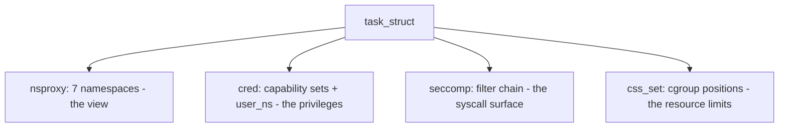
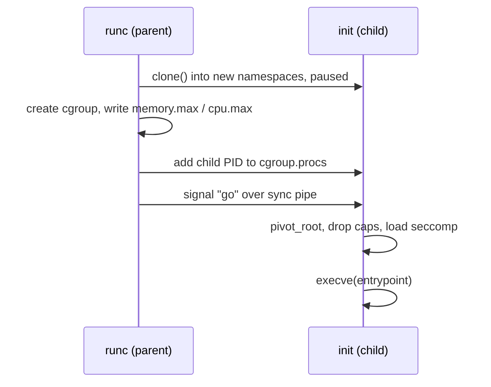

# Build a Container by Hand

> **Goal:** the payoff. Using only stock Linux tools — no Docker, no podman —
> we assemble a real container: root filesystem, namespaces, pivot_root,
> cgroup limits, dropped capabilities, seccomp. Every line explained by a
> previous chapter.
>
> **Setup:** any Linux box/VM you can root. Everything lives in `/tmp`, but
> read each command before running it — this is real root surgery.

If you've read [What a Container Actually Is](#/containers-overview), you know
the thesis: a container is not a kernel object. There is no `struct container`
anywhere in the source tree. A container is an ordinary process wearing four
independent disguises — [namespaces](#/namespaces) bound its *view*,
[cgroups](#/cgroups) its *consumption*, capabilities its *privileges*, and
seccomp its reachable *kernel attack surface*. This chapter builds one from
those parts, and then follows each part down into the kernel structures that
implement it.

Keep one number in mind the whole way: a `docker run` of a warm image reaches
the entrypoint in **20–80 ms** on a modern host. A microVM (Firecracker) needs
~125 ms; a full VM, seconds. Almost none of the container's time is isolation
setup — namespace creation is microseconds, cgroup creation is a few `mkdir`s.
The cost is filesystem preparation and the runtime's own bookkeeping. By the
end you'll have performed every one of those syscalls yourself and seen where
the milliseconds actually go.

## Step 0 — A root filesystem

A container needs a user space for its `/`. Alpine publishes theirs as a
~3 MB tarball (this is literally what's inside the `alpine` image):

```bash
export R=/tmp/ctr/rootfs
mkdir -p $R && cd /tmp/ctr
curl -sLo alpine.tgz https://dl-cdn.alpinelinux.org/alpine/v3.20/releases/x86_64/alpine-minirootfs-3.20.3-x86_64.tar.gz
tar xzf alpine.tgz -C $R
ls $R     # bin etc home lib … a complete tiny user space. No kernel — of course.
```

*(For full fidelity you could mount this as an overlay — lowerdir = this
tarball, upperdir = scratch — exactly as in
[Images & OverlayFS](#/overlayfs). We skip it here to keep the focus on
isolation; Step 5 puts it back.)*

### Inspect what you'll be using

```bash
du -sh $R                     # ~8 MB unpacked — that's all a base container needs
file $R/bin/busybox           # statically linked (musl), no host dependencies
ls -l $R/bin | head           # almost everything is a symlink to busybox
```

Why so small? Alpine links against musl instead of glibc, and nearly every
binary in `/bin` is a symlink to one ~800 KB static `busybox`. Compare: a
`debian:bookworm-slim` rootfs is ~75 MB, `ubuntu:24.04` ~78 MB. The kernel is
absent from all of them — every container on the machine executes the *host's*
kernel, which is the entire reason containers start in milliseconds while a VM
has to run [the whole boot process](#/boot-process).

That shared kernel is also the whole security story in one sentence: an
attacker who finds a kernel bug is one syscall away from *every* container on
the box, because there is exactly one kernel and they all call into it. Steps 3
and 4 exist precisely to shrink how much of that kernel a container can touch.

**A rootfs is not an image.** An OCI image is this tarball *plus* a JSON
manifest: content-addressed layer digests (`sha256:…`), the entrypoint, env,
and the default user. A runtime stacks the layers as overlayfs lowerdirs (see
[Images & OverlayFS](#/overlayfs)) and reads the config to know *what* to run.
Our hand-build supplies the config by hand — `exec /bin/sh` is the entrypoint,
and every namespace flag is a config field we're setting on the command line.

## Step 1 — Namespaces + pivot_root

The core move. One `unshare` invocation creates the namespaces; the inner
script swaps the root and mounts the virtual filesystems:

```bash
sudo unshare --pid --fork --mount --uts --ipc --net \
  sh -c '
    hostname handmade                       # UTS ns: our own hostname
    mount --bind '$R' '$R'                  # pivot_root needs a mount point
    cd '$R'
    mkdir -p old_root
    pivot_root . old_root                   # OUR / is now the alpine rootfs
    cd /

    mount -t proc  proc /proc               # fresh procfs for OUR pid ns
    mount -t tmpfs dev  /dev                # minimal private /dev
    mknod /dev/null    c 1 3; chmod 666 /dev/null
    mknod /dev/zero    c 1 5
    mknod /dev/random  c 1 8
    mknod /dev/urandom c 1 9

    umount -l /old_root && rmdir /old_root  # cut the rope to the host
    exec /bin/sh                            # PID 1 execs the "entrypoint"
  '
```

### What `unshare` actually creates

Inside the kernel, a task's namespace membership is one pointer:
`task_struct->nsproxy`, pointing at a
[`struct nsproxy`](https://elixir.bootlin.com/linux/v6.12/C/ident/nsproxy) —
a tiny refcounted bundle of seven namespace pointers:

```c
struct nsproxy {
    refcount_t count;
    struct uts_namespace    *uts_ns;      // hostname, domainname
    struct ipc_namespace    *ipc_ns;      // SysV IPC, POSIX mqueues
    struct mnt_namespace    *mnt_ns;      // the mount table
    struct pid_namespace    *pid_ns_for_children;  // note: for CHILDREN
    struct net              *net_ns;      // devices, routes, netfilter, sockets
    struct time_namespace   *time_ns;     // CLOCK_MONOTONIC/BOOTTIME offsets
    struct cgroup_namespace *cgroup_ns;   // virtualized cgroup root
};
```

Seven pointers here, but Linux has **eight** namespace types. Three precision
points that trip people up:

- **The user namespace is not in `nsproxy`.** It hangs off the credentials
  (`task_struct->cred->user_ns`), because it answers a different question —
  not "what do I see?" but "what am I allowed to do?" — and every permission
  check consults it. It is the only namespace an unprivileged user can create
  without any capability, which is exactly why rootless containers are built
  on it and why so many kernel CVEs have started with `CLONE_NEWUSER`.
- **`pid_ns_for_children` is exactly what it says.** `unshare(CLONE_NEWPID)`
  does *not* move the calling process into the new PID namespace — a process's
  PID cannot change, that would break everything holding its PID. Only
  children enter it. That's why `--fork` is mandatory: `unshare` forks once,
  and the *child* becomes PID 1 of the new namespace.
- Tasks *share* `nsproxy` objects; creating a namespace allocates a new
  `nsproxy` via
  [create_new_namespaces()](https://elixir.bootlin.com/linux/v6.12/C/ident/create_new_namespaces)
  and copies or replaces each pointer. Refcounting means an idle thread that
  shares all your namespaces adds zero namespace memory — only the `nsproxy`
  refcount ticks up. The whole operation is microseconds — namespace creation
  is not why containers are "lightweight," it's why they're *nearly free*.

Every namespace is visible as a symlink under `/proc/<pid>/ns/`; two processes
are in the same namespace iff the inode numbers match. Those inodes live in a
special `nsfs` filesystem, and holding an open fd to one keeps the namespace
alive even with no member process — this is how `ip netns add` pins a network
namespace with a bind-mount under `/var/run/netns/`. `setns(2)` (what `nsenter`
and `docker exec` use) opens one of those files and joins it, one namespace at
a time.

```bash
# Prove the inode-equality rule:
readlink /proc/self/ns/net              # net:[4026531840]  ← host's net ns
sudo readlink /proc/<container-pid>/ns/net   # net:[4026532...] ← different inode
```

### pivot_root, and why not chroot

`chroot()` changes one field: the task's idea of `/`
(`task_struct->fs->root`, a `struct path`). The old root stays mounted and
reachable — a process with `CAP_SYS_CHROOT` can `chroot()` deeper and walk
back out with `..`; it's a view trick, not a security boundary, and
`chroot(2)`'s own man page says so. The classic escape: `chroot` into a
subdir, `open(".")` before you enter, then `fchdir()` back to that fd and
`chdir("..")` until you hit the *real* root.

`pivot_root(2)` operates on the *mount namespace* instead: it detaches the
current root mount and reattaches it under `put_old`, making `new_root` the
real root of this namespace's mount tree. After `umount -l /old_root`, the
host filesystem is not hidden — it is *gone from the mount table*. There is
no path to it, because there is no mount to name.

The kernel (in
[fs/namespace.c](https://elixir.bootlin.com/linux/v6.12/source/fs/namespace.c))
enforces the fine print, and each rule explains a line of our script:

- `new_root` must be a mount point — hence the seemingly pointless
  `mount --bind $R $R`. Internally each mount is a
  [`struct mount`](https://elixir.bootlin.com/linux/v6.12/C/ident/mount) with
  an `mnt_root` dentry and an `mnt_parent`; pivot_root re-links these parent
  pointers, and you can't re-link something that isn't a mount.
- `put_old` must be at or underneath `new_root`
  (checked with
  [is_path_reachable()](https://elixir.bootlin.com/linux/v6.12/C/ident/is_path_reachable)) —
  hence `mkdir old_root` *inside* the new root.
- The current root and `new_root` must not have **shared** mount propagation,
  or you'd pivot every namespace that shares the propagation group — `EINVAL`
  otherwise. Mount propagation has four modes worth knowing: *shared* (events
  propagate both ways, systemd's default for `/`), *slave* (receive but don't
  send), *private* (isolated), and *unbindable*. On a systemd host `/` is
  `shared`; we survive only because util-linux `unshare --mount` recursively
  remounts everything `private` in the new mount namespace (its
  `--propagation private` default). Write your own runtime with raw `clone()`
  and you must do `mount --make-rprivate /` yourself, or pivot_root fails.
  runc does exactly this before it touches anything else.

### Life as PID 1

Our shell is now PID 1 of its namespace, and PID 1 is a special citizen
(see [Processes & Threads](#/processes)):

- **Signals bounce off it.** For a signal sent from *within* the namespace,
  the kernel delivers to PID 1 only if it installed a handler — default
  dispositions (even `SIGTERM`'s) are ignored. The check lives in
  [sig_task_ignored()](https://elixir.bootlin.com/linux/v6.12/C/ident/sig_task_ignored),
  which special-cases the namespace-init task. This is why a
  `docker stop` of a handler-less entrypoint hangs 10 s and falls back to
  `SIGKILL`, which the parent namespace *can* always deliver.
  ([Signals](#/signals) has the delivery rules.)
- **It inherits every orphan.** Zombies in the namespace reparent to it;
  if it doesn't `wait()`, they accumulate as un-reaped `EXIT_ZOMBIE` tasks,
  each holding a `struct pid` and a slot in the pid bitmap — the reason
  minimal init shims like `tini` (Docker's `--init`) exist. A leaked zombie
  is only ~1 KB, but a PID-exhausting leak is a real production incident.
- **Its death is the namespace's death.** When PID 1 exits,
  [zap_pid_ns_processes()](https://elixir.bootlin.com/linux/v6.12/C/ident/zap_pid_ns_processes)
  SIGKILLs every remaining process in the namespace and the namespace is
  disbanded; further forks into it fail with `ENOMEM`. Container lifetime
  *is* PID 1 lifetime.

You're in. Verify the lies, one namespace at a time:

```bash
ps aux          # two processes in the universe; sh is PID 1   (pid ns)
hostname        # handmade                                      (uts ns)
ls /            # alpine's root — and /old_root is gone         (mnt ns + pivot)
ip addr         # only a dead loopback                          (net ns)
cat /etc/os-release   # Alpine — while the host is whatever it is
# Verify the kernel is shared:
uname -r        # same as the host. The kernel is not namespaced.
```

Meanwhile, from another terminal on the host:

```bash
ps aux | grep 'bin/sh'    # there's your "container": an ordinary process
sudo ls -l /proc/<that-pid>/ns/   # its namespace inodes differ from yours
sudo lsns -p <that-pid>            # all its namespaces, tree view
```

Note what the host `ps` shows: the container's PID 1 has a perfectly normal
host PID like 48213. One process, two PIDs — the kernel stores a
[`struct pid`](https://elixir.bootlin.com/linux/v6.12/C/ident/alloc_pid) with
an array of `struct upid { nr, ns }` pairs, one per namespace level, plus a
`level` field naming the deepest one. The same task is 48213 at level 0 and 1
at level 1. `/proc` is just a window that shows the numbers for *its own*
namespace — which is why remounting it was mandatory.

Every concept from chapters past is on stage: `unshare`/`clone` flags,
PID 1 duties, per-namespace mount tables, `pivot_root` vs chroot, procfs as
a window into the pid namespace.

## Step 2 — A cgroup around it

Namespaces changed what the process *sees*; nothing yet limits what it
*uses*. That's [cgroup v2](#/cgroups) — the unified hierarchy, default on
every modern distro (Fedora since 31, Debian since 11, Ubuntu since 21.10,
RHEL since 9). One mount at `/sys/fs/cgroup`, one tree, controllers enabled
per subtree by writing to `cgroup.subtree_control`. (cgroup v1's tangle of
one-hierarchy-per-controller is deprecated and, on a v2-only "unified" boot,
absent entirely.)

Limits, from a host terminal:

```bash
sudo mkdir /sys/fs/cgroup/handmade
echo 100M | sudo tee /sys/fs/cgroup/handmade/memory.max
echo "50000 100000" | sudo tee /sys/fs/cgroup/handmade/cpu.max     # 0.5 CPU
echo 50 | sudo tee /sys/fs/cgroup/handmade/pids.max                # fork fence
echo <container-pid> | sudo tee /sys/fs/cgroup/handmade/cgroup.procs
```

What each file means, precisely:

- **`memory.max`** is a hard ceiling on the cgroup's charged memory
  (anonymous pages, page cache, socket buffers, and slab allocations made on
  its behalf — accounted per page, 4 KiB on x86-64; arm64 kernels may use
  4/16/64 KiB pages). Each charge runs through
  [try_charge_memcg()](https://elixir.bootlin.com/linux/v6.12/C/ident/try_charge_memcg),
  which bumps a
  [`struct page_counter`](https://elixir.bootlin.com/linux/v6.12/C/ident/page_counter)
  inside the cgroup's
  [`struct mem_cgroup`](https://elixir.bootlin.com/linux/v6.12/C/ident/mem_cgroup).
  On breach the kernel enters *direct reclaim* — it tries to evict pages
  synchronously in the faulting task's context; if reclaim can't get below the
  line, the [OOM killer](#/lab-oom-killer) fires *inside the cgroup* (only its
  tasks are candidates) and `memory.events:oom_kill` increments. Its gentler
  sibling **`memory.high`** doesn't kill — it throttles the offender into
  reclaim and adds an artificial `schedule()` delay proportional to the
  overage, which is what orchestrators actually prefer for soft limits.
- **`cpu.max`** is `"$MAX $PERIOD"` in microseconds: 50 000 µs of runtime per
  100 000 µs period (100 ms is the default period) = half a CPU — *summed
  across all cores*, so 16 threads can burn their 50 ms in ~3 ms of wall
  time and then sit throttled for the remaining ~97 ms. Kernel-side this is
  CFS *bandwidth control*: each group has a
  [`struct cfs_bandwidth`](https://elixir.bootlin.com/linux/v6.12/C/ident/cfs_bandwidth)
  refilling a quota pool on an hrtimer; when a runqueue drains its slice,
  [throttle_cfs_rq()](https://elixir.bootlin.com/linux/v6.12/C/ident/throttle_cfs_rq)
  dequeues the whole group until the next period. That bursty stop-start is a
  classic tail-latency killer; `cpu.stat`'s `nr_throttled` / `throttled_usec`
  expose it. This bandwidth cap is a separate mechanism from **`cpu.weight`**
  (proportional sharing, default 100), which the
  [EEVDF scheduler](#/scheduling) — CFS's replacement since kernel 6.6 — folds
  into each `sched_entity`'s eligibility-and-deadline accounting.
- **`pids.max`** caps live tasks in the subtree. A fork bomb fizzles at 50
  with `sh: can't fork` — `fork()` returns `EAGAIN`, nothing is killed. This
  is the cheap fence that stops a fork bomb from taking the *host* down, since
  the global pid space is shared.

Writing a PID to `cgroup.procs` migrates the whole process (all its
threads — v2 forbids splitting threads of one process across cgroups except
under the `threaded` mode). Kernel-side, a task doesn't point at a cgroup
directly: `task_struct->cgroups` points to a
[`struct css_set`](https://elixir.bootlin.com/linux/v6.12/C/ident/css_set) —
a cached, shared combination of "one `cgroup_subsys_state` per controller" —
so the scheduler and the memory controller can find their per-cgroup state in
O(1) on every hot path. Thousands of tasks in identical cgroups share one
`css_set`; migration swaps the pointer and fixes up refcounts.

Test from inside: a fork bomb fizzles at 50 processes; a memory hog gets
`Killed` at 100 MB. The jail holds.

```bash
# Inside the container, verify:
cat /proc/self/cgroup            # 0::/handmade
# Outside, watch it live:
cat /sys/fs/cgroup/handmade/memory.current
cat /sys/fs/cgroup/handmade/memory.events    # look at oom_kill count
cat /sys/fs/cgroup/handmade/cpu.stat         # nr_throttled, throttled_usec
cat /sys/fs/cgroup/handmade/memory.pressure  # PSI: % of time tasks stalled on memory
```

That last file is PSI (Pressure Stall Information) — the difference between
"the limit is set" and "the limit is *hurting*". It reports the fraction of
wall time tasks were stalled waiting on memory (`some`/`full`, over 10 s / 60 s
/ 300 s windows). A cgroup can sit under its `memory.max` and still thrash;
PSI is how you catch that before latency explodes. The
[cgroup lab](#/lab-cgroup-limits) drives all of these to their breaking
points on purpose.

> **Container link:** `docker run -m 100m --cpus 0.5` writes *exactly* these
> three files under a per-container cgroup like
> `/sys/fs/cgroup/system.slice/docker-<id>.scope/`. `--cpus 0.5` is just
> `cpu.max = "50000 100000"` with the arithmetic done for you.

## Step 3 — Drop capabilities

Our container's root is still *real* root (we used sudo, no user namespace).
[Linux Security & Confinement](#/security-hardening) introduced
**capabilities** — root's monolithic power split into 41 orthogonal flags
(bits 0–40 as of 6.12; the newest, `CAP_CHECKPOINT_RESTORE`, landed in 5.9).
A runtime's job is to shed almost all of them:

```bash
# inside the container (alpine: apk add libcap to inspect; or from host:)
grep Cap /proc/<pid>/status        # CapEff: 000001ffffffffff = all 41 bits = god mode
```

Each task carries five capability sets, stored as 64-bit bitmasks in its
[`struct cred`](https://elixir.bootlin.com/linux/v6.12/C/ident/cred) (credentials
are copy-on-write and refcounted; a `setuid` or capability change allocates a
fresh `cred` via `prepare_creds()` / `commit_creds()`):

| set (`cred` field) | meaning |
|---|---|
| `cap_effective` | what permission checks actually test |
| `cap_permitted` | what the task may raise into effective |
| `cap_inheritable` | preserved across `execve` *if* the file agrees |
| `cap_bset` (bounding) | ceiling: caps outside it can never be re-acquired |
| `cap_ambient` | survives `execve` of plain binaries (non-setuid helpers) |

The bounding set is the one that matters for containers: capabilities
dropped from it stay gone for the process *and every descendant*, even
across `execve` of a setuid-root binary (the setuid bit can only grant caps
that are still in the bounding set). That's the "point of no return"
property a runtime needs — there is no syscall to *add* a capability back
into the bounding set.

Docker's default keeps 14 of the 41 (`CAP_CHOWN`, `CAP_DAC_OVERRIDE`,
`CAP_FOWNER`, `CAP_FSETID`, `CAP_KILL`, `CAP_SETGID`, `CAP_SETUID`,
`CAP_SETPCAP`, `CAP_NET_BIND_SERVICE`, `CAP_NET_RAW`, `CAP_SYS_CHROOT`,
`CAP_MKNOD`, `CAP_AUDIT_WRITE`, `CAP_SETFCAP`) and drops the dangerous rest:
`CAP_SYS_ADMIN` (the "new root" catch-all — it gates `mount`, `setns`, most
of `ioctl`, `pivot_root`, and dozens of other things; the man page itself
calls it overloaded and advises splitting it), `CAP_SYS_MODULE` (load kernel
code into the one shared kernel!), `CAP_NET_ADMIN` (reconfigure the host
network), `CAP_SYS_PTRACE` (inspect and modify other processes), `CAP_SYS_BOOT`,
`CAP_SYS_TIME`…

Relaunching our shell with the same policy:

```bash
sudo apt install -y libcap2-bin    # capsh
# Drop the dangerous caps, keep the Docker-default subset:
sudo capsh --drop=cap_sys_admin,cap_sys_module,cap_net_admin,cap_sys_ptrace,cap_sys_rawio,cap_sys_boot,cap_sys_time,cap_sys_resource \
     -- -c '/usr/sbin/chroot /tmp/ctr/rootfs /bin/sh'
# inside:  mount -t tmpfs x /mnt  →  permission denied. Root, defanged.
```

Check which caps are actually present:

```bash
capsh --print       # inside the defanged shell — shows current caps
grep Cap /proc/self/status   # hex masks; decode with: capsh --decode=<hex>
```

Every check in the kernel funnels through
[ns_capable()](https://elixir.bootlin.com/linux/v6.12/C/ident/ns_capable) →
[cap_capable()](https://elixir.bootlin.com/linux/v6.12/C/ident/cap_capable),
and the namespace-aware version is the punchline: a capability is only
honored *in the user namespace the target resource belongs to*.
`cap_capable()` walks from the task's `user_ns` up the `parent` chain; if the
resource's owning namespace isn't found before the chain ends, the answer is
no. That's the clean solution we skipped — UID-remapped **user namespaces**
(`unshare --user --map-root-user`), where container-root has a full CapEff
mask *inside its own user namespace* and is structurally an unprivileged
UID like 100000 on the host. A `CAP_SYS_ADMIN` that only means something in a
namespace owning nothing the host cares about is nearly harmless. Rootless
podman and rootless Docker lean entirely on this; you met the mechanics
(`/proc/<pid>/uid_map`, `newuidmap`) in [Namespaces](#/namespaces).

## Step 4 — seccomp: filter the syscalls

Last fence, guarding the deepest layer.
[Kernel, User Space & Syscalls](#/kernel-vs-userspace) called the syscall
boundary "a perfect choke point"; **seccomp-BPF** is the filter installed on
it. A process declares: "from now on, for me and all my children, only these
syscalls" — irrevocably. Filters are inherited across `fork()` and preserved
across `execve()`, and installing one requires either `CAP_SYS_ADMIN` or —
the normal path — setting the one-way `no_new_privs` bit
(`prctl(PR_SET_NO_NEW_PRIVS, 1)`) first, so an unprivileged process can't use
a malicious filter to trick a setuid binary into running with a crippled view
of its own syscalls.

Get the direction right: Docker's default profile is an **allowlist**, not
a blocklist. Its default action is `SCMP_ACT_ERRNO` (return `EPERM`), with
~350+ syscalls explicitly allowed — out of roughly 360 wired up on x86-64
as of 6.12 — leaving ~40 dangerous ones unreachable by omission: `mount`,
`umount2`, `reboot`, `init_module`/`finit_module`, `kexec_load`,
`open_by_handle_at` (the 2014 "Shocker" container escape used it), `bpf` (load
[eBPF programs](#/ebpf-internals) into the shared kernel), `unshare` and
`clone` with new-namespace flags, `ptrace` (allowed again since Docker 19.03
on kernels ≥ 4.8, where a TOCTOU hole between seccomp and ptrace was fixed)…

Mechanically: each filter is a classic-BPF program (converted to eBPF
internally at install time) that receives a fixed 64-byte input,
[`struct seccomp_data`](https://elixir.bootlin.com/linux/v6.12/C/ident/seccomp_data):

```c
struct seccomp_data {
    int   nr;                    // syscall number
    __u32 arch;                  // AUDIT_ARCH_* — always check this first!
    __u64 instruction_pointer;
    __u64 args[6];               // raw register values — NOT dereferenced
};
```

Why check `arch` first? On x86-64 a task can issue 32-bit syscalls via `int
0x80`, where the *same number* means a *different* syscall. A filter that
allows `nr == 2` (`open` on x86-64) without pinning `arch` would also allow
`nr == 2` in the i386 table (`fork`). Every real profile begins by trapping any
unexpected `arch`.

Filters can only inspect *register values*, never memory behind pointers —
deliberately, because a sibling thread sharing the address space could rewrite
pointed-to memory between the filter's check and the kernel's use (TOCTOU). So
a filter can block `socket(AF_VSOCK, …)` by argument value but cannot match on
a pathname string. Verdicts range from `SCMP_ACT_ALLOW` through `ERRNO`,
`TRAP` (raise `SIGSYS`), `LOG`, `NOTIFY` (delegate the decision to a userspace
supervisor over an fd — how runtimes forward `mknod` from rootless
containers), to `KILL_PROCESS`. Stacked filters all run; the **numerically
lowest (most restrictive) verdict wins**, and `KILL_PROCESS` is lowest of all.
Cost: a few dozen extra nanoseconds per syscall for a typical profile —
measurable in a tight `getpid()` microbenchmark (a few percent), lost in the
noise for real work.

See it working with off-the-shelf tools:

```bash
docker run --rm alpine unshare --pid sh -c id
# unshare: Operation not permitted        ← seccomp said no
docker run --rm --security-opt seccomp=unconfined alpine unshare --pid sh -c id
# works — you just removed the filter (don't, in production)
# See that the filter is installed:
docker run --rm alpine grep Seccomp /proc/1/status   # Seccomp: 2 = filter mode
```

In code, it's one library call before `exec`:

```c
scmp_filter_ctx ctx = seccomp_init(SCMP_ACT_ERRNO(EPERM)); // default: deny
seccomp_rule_add(ctx, SCMP_ACT_ALLOW, SCMP_SYS(read), 0);
seccomp_rule_add(ctx, SCMP_ACT_ALLOW, SCMP_SYS(write), 0);
seccomp_rule_add(ctx, SCMP_ACT_ALLOW, SCMP_SYS(openat), 0);
/* … allow the ~350 safe syscalls, leave the ~40 dangerous ones denied … */
seccomp_load(ctx);          // point of no return
execve(entrypoint, …);
```

Defense in depth, fully assembled: namespaces bound the *view*, cgroups the
*consumption*, capabilities the *privileges*, seccomp the *kernel attack
surface*, plus an LSM profile (AppArmor/SELinux — see
[Linux Security & Confinement](#/security-hardening)) on top in real
runtimes. No single fence is sufficient; each closes a different escape.

All four hang off the same `struct task_struct`:



That diagram *is* the container. Four pointers on an ordinary process.

## Step 5 — Bringing it all together (the proper launch)

The real runc launch script (conceptually):

```bash
# 1. Prepare overlayfs
mkdir -p /tmp/ctr/{lower,upper,work,merged}
# lower = the extracted alpine tarball
sudo mount -t overlay overlay -o lowerdir=$R,upperdir=/tmp/ctr/upper,workdir=/tmp/ctr/work /tmp/ctr/merged

# 2. Launch with all isolation
sudo unshare --pid --fork --mount --uts --ipc --net \
  --mount-proc=/tmp/ctr/merged/proc \
  capsh --drop=cap_sys_admin,cap_sys_module,cap_net_admin,... \
  -- -c '
    pivot_root /tmp/ctr/merged /tmp/ctr/merged/old_root
    cd /
    mount -t tmpfs dev /dev
    mknod /dev/null c 1 3
    mknod /dev/zero c 1 5
    mknod /dev/random c 1 8
    mknod /dev/urandom c 1 9
    umount -l /old_root && rmdir /old_root
    exec /bin/sh
  ' &

# 3. Apply cgroup limits
CONTAINER_PID=$!
mkdir /sys/fs/cgroup/handmade
echo 100M > /sys/fs/cgroup/handmade/memory.max
echo "50000 100000" > /sys/fs/cgroup/handmade/cpu.max
echo 50 > /sys/fs/cgroup/handmade/pids.max
echo $CONTAINER_PID > /sys/fs/cgroup/handmade/cgroup.procs
```

One honest confession about ordering: our script attaches the cgroup *after*
launch, leaving a race window where the process could allocate unbounded
memory or fork before the limits bite. Real runtimes close it. The classic
technique is a two-phase start with a synchronization pipe:



runc creates the cgroup, starts the container process *paused* inside it,
applies limits, and only then signals it to `execve` the entrypoint — so the
first byte of the workload runs already fully constrained. With `clone3(2)`
(kernel ≥ 5.7) it's even cleaner: `CLONE_INTO_CGROUP` names a target cgroup fd
and places the child there atomically at fork time, no post-hoc migration and
no race at all. Details in [Docker, containerd, runc](#/container-runtimes).

## The whole recipe on one page

What `docker run -m 100m --cpus .5 alpine sh` does, demystified end-to-end:

```text
1. fetch image layers; mount overlayfs                    (images & overlayfs)
2. clone(CLONE_NEWPID|NEWNS|NEWNET|NEWUTS|NEWIPC|…)       (namespaces)
3. child: pivot_root onto merged dir; mount /proc, /dev   (this chapter)
4. create cgroup; write memory.max, cpu.max; add pid      (cgroups)
5. setup veth pair → bridge; NAT                          (container networking)
6. drop capabilities                                      (this chapter)
7. install seccomp profile                                (this chapter)
8. execve(entrypoint)               ← an ordinary process, thoroughly lied to
```

Eight steps, all of them ordinary syscalls you have now performed or read.
There is no step nine. **That's all a container is.**

Cleanup:

```bash
exit   # leave the container shell (PID 1 exits → namespace dies)
sudo rmdir /sys/fs/cgroup/handmade
sudo umount /tmp/ctr/merged
sudo rm -rf /tmp/ctr
```

## Follow the code (kernel v6.12)

Two of the paths above, traced through real source.

### Path 1: `unshare --pid --mount …` → new namespaces

The `unshare(2)` syscall lands in
[ksys_unshare()](https://elixir.bootlin.com/linux/v6.12/C/ident/ksys_unshare)
(kernel/fork.c). It validates the flag combination
([check_unshare_flags()](https://elixir.bootlin.com/linux/v6.12/C/ident/check_unshare_flags)
rejects nonsense like un-sharing a thread group's memory while it has
siblings), then calls
[unshare_nsproxy_namespaces()](https://elixir.bootlin.com/linux/v6.12/C/ident/unshare_nsproxy_namespaces),
which delegates to
[create_new_namespaces()](https://elixir.bootlin.com/linux/v6.12/C/ident/create_new_namespaces)
in [kernel/nsproxy.c](https://elixir.bootlin.com/linux/v6.12/source/kernel/nsproxy.c).
That function allocates a fresh `struct nsproxy` and, per flag, either
bumps a refcount on the old namespace or builds a new one:
[copy_mnt_ns()](https://elixir.bootlin.com/linux/v6.12/C/ident/copy_mnt_ns)
duplicates the entire mount tree for `CLONE_NEWNS` (the expensive one — it
copies a `struct mount` per mounted filesystem and applies the propagation
rules from Step 1);
[copy_utsname()](https://elixir.bootlin.com/linux/v6.12/C/ident/copy_utsname)
just clones a small hostname/domainname struct;
[copy_ipcs()](https://elixir.bootlin.com/linux/v6.12/C/ident/copy_ipcs),
[copy_pid_ns()](https://elixir.bootlin.com/linux/v6.12/C/ident/copy_pid_ns)
and
[copy_net_ns()](https://elixir.bootlin.com/linux/v6.12/C/ident/copy_net_ns)
do their kin. `copy_net_ns()` is quietly the slowest — creating a network
namespace means allocating a fresh loopback device and per-namespace netfilter
state, tens of microseconds to low milliseconds, which is why runtimes reuse a
pre-created netns where they can. The new `nsproxy` is swapped into the task
with
[switch_task_namespaces()](https://elixir.bootlin.com/linux/v6.12/C/ident/switch_task_namespaces).

Note what `copy_pid_ns()` returns to: `nsproxy->pid_ns_for_children`. The
caller keeps its PID. Only when `unshare`'s forked child goes through
[copy_process()](https://elixir.bootlin.com/linux/v6.12/C/ident/copy_process)
does [alloc_pid()](https://elixir.bootlin.com/linux/v6.12/C/ident/alloc_pid)
(kernel/pid.c) allocate a `struct pid` with one `struct upid {nr, ns}` per
namespace level — nr 1 in the new namespace at the deepest level, an ordinary
nr in every ancestor level. `ps` on the host and `ps` in the container are
reading different slots of the same array.

### Path 2: every syscall vs. the seccomp filter

On x86-64, syscall entry runs
[do_syscall_64()](https://elixir.bootlin.com/linux/v6.12/C/ident/do_syscall_64)
(arch/x86/entry/common.c). If the task has any "syscall work" flags —
seccomp sets `SYSCALL_WORK_SECCOMP` in `thread_info->syscall_work` — the slow
path calls
[syscall_trace_enter()](https://elixir.bootlin.com/linux/v6.12/C/ident/syscall_trace_enter),
which invokes
[__secure_computing()](https://elixir.bootlin.com/linux/v6.12/C/ident/__secure_computing)
→
[__seccomp_filter()](https://elixir.bootlin.com/linux/v6.12/C/ident/__seccomp_filter)
in [kernel/seccomp.c](https://elixir.bootlin.com/linux/v6.12/source/kernel/seccomp.c).
There,
[seccomp_run_filters()](https://elixir.bootlin.com/linux/v6.12/C/ident/seccomp_run_filters)
fills a `struct seccomp_data` from the saved registers (`struct pt_regs`) and
walks the task's filter chain — `task->seccomp.filter`, a singly linked list of
[`struct seccomp_filter`](https://elixir.bootlin.com/linux/v6.12/C/ident/seccomp_filter)
(fields that matter: `prog`, the attached BPF program; `prev`, the parent's
filter it stacks on; `refs`, the shared refcount across fork). Each program
runs via
[bpf_prog_run_pin_on_cpu()](https://elixir.bootlin.com/linux/v6.12/C/ident/bpf_prog_run_pin_on_cpu),
and the lowest (most restrictive) action across the chain wins.
`__seccomp_filter()`'s switch then implements the verdict: forge an errno
return, raise `SIGSYS` (`SECCOMP_RET_TRAP`), hand the syscall to a userspace
supervisor (`SECCOMP_RET_USER_NOTIF`), or `do_exit(SIGSYS)` for
`KILL_PROCESS`. Only `SECCOMP_RET_ALLOW` falls through to the actual syscall
table dispatch.

That is the whole enforcement story: one extra list walk on the syscall
slow path. No hypervisor, no rewriting — just a gate bolted onto the choke
point every userspace request already passes through.

## Check your understanding

1. Why must `/proc` be remounted *after* pivot_root rather than inherited?

<details><summary>Show answer</summary>

The inherited `/proc` was mounted by the host's PID namespace, so it shows
the host's process table. procfs renders PIDs *as seen by the namespace it
was mounted from*; a fresh `mount -t proc` inside the new PID namespace
shows only the container's processes, numbered from 1.

</details>

2. Our step-1 container ran as real root. Rank the three mechanisms that tame container-root and what each removes.

<details><summary>Show answer</summary>

(1) Capabilities: strip specific powers (`CAP_SYS_ADMIN`, `CAP_SYS_MODULE`, …)
from the bounding set so they can never be reacquired, while keeping the ~14
a workload needs. (2) User namespaces: remap root to an unprivileged host UID,
so even a full in-namespace CapEff mask is structurally powerless against
host-owned resources (`cap_capable()` won't find the owning namespace in the
chain). (3) Seccomp: make dangerous syscalls unreachable regardless of
credentials — even a full-capability root can't call what the filter denies.

</details>

3. `unshare` failed *inside* a default Docker container but works on the host as root. Which fence stopped it?

<details><summary>Show answer</summary>

Seccomp. Docker's default profile is an allowlist that omits `unshare` (and
`clone` with new-namespace flags), so the syscall returns `EPERM` before any
permission check runs. Capabilities also play a part — creating most
namespace types needs `CAP_SYS_ADMIN`, which Docker drops — but the seccomp
filter fires first, at the syscall boundary.

</details>

4. Why does `pivot_root` require the bind-mount trick and fail with `EINVAL` on some setups even then?

<details><summary>Show answer</summary>

`new_root` must be a mount point, not just a directory — `mount --bind $R $R`
manufactures one. And neither the current root nor `new_root` may have shared
mount propagation (systemd makes `/` shared by default), or the pivot would
leak into other namespaces; `unshare --mount` saves us by making everything
private in the new namespace, but a hand-rolled runtime must
`mount --make-rprivate /` itself.

</details>

5. What would happen if we forgot `--fork` when creating the PID namespace?

<details><summary>Show answer</summary>

`unshare(CLONE_NEWPID)` never moves the caller — a process's PID can't
change — it only sets `nsproxy->pid_ns_for_children`. The shell would stay
in the host PID namespace and its *next* forked child would become PID 1 of
the new one; when that first child exits, the namespace dies and further
forks fail. `--fork` makes unshare fork immediately so a proper long-lived
PID 1 exists from the start.

</details>

6. Your container has `cpu.max = "50000 100000"` and runs 16 busy threads. Describe its execution pattern within one period.

<details><summary>Show answer</summary>

The 50 ms quota is shared across all CPUs, so 16 threads burn it in roughly
3 ms of wall time, then `throttle_cfs_rq()` dequeues the whole group and it
sits throttled for the remaining ~97 ms of the 100 ms period. The result is
bursty stop-go execution and terrible tail latency — visible as `nr_throttled`
and `throttled_usec` climbing in `cpu.stat`.

</details>

7. A colleague sets a seccomp filter allowing syscall number 2 without checking `arch`. What can go wrong on x86-64?

<details><summary>Show answer</summary>

Syscall numbers differ per ABI. `nr == 2` is `open` in the x86-64 table but
`fork` in the i386 table, and a 64-bit process can still issue 32-bit syscalls
via `int 0x80`. Without pinning `seccomp_data.arch` to `AUDIT_ARCH_X86_64`, the
filter accidentally allows a *different* syscall than intended — which is why
every real profile checks `arch` before it looks at `nr`.

</details>

8. Recite the eight steps of `docker run` from memory. (Seriously — it's the exam question for this whole site.)

<details><summary>Show answer</summary>

1) Fetch image layers and mount overlayfs. 2) `clone()` with the
new-namespace flags. 3) In the child: `pivot_root` onto the merged dir,
mount `/proc` and `/dev`. 4) Create a cgroup, write `memory.max`/`cpu.max`,
add the PID. 5) Set up a veth pair to a bridge, plus NAT. 6) Drop
capabilities. 7) Install the seccomp profile. 8) `execve()` the entrypoint.

</details>

---

**Next:** so who actually performs these steps in production — Docker?
containerd? runc? Time to meet the cast in
[Docker, containerd, runc](#/container-runtimes), and to wire up step 5
properly in [Container Networking](#/container-networking).

## Sources & further reading

- [namespaces(7)](https://man7.org/linux/man-pages/man7/namespaces.7.html), [pid_namespaces(7)](https://man7.org/linux/man-pages/man7/pid_namespaces.7.html), [user_namespaces(7)](https://man7.org/linux/man-pages/man7/user_namespaces.7.html) — Michael Kerrisk's definitive namespace man pages.
- [pivot_root(2)](https://man7.org/linux/man-pages/man2/pivot_root.2.html) and [mount_namespaces(7)](https://man7.org/linux/man-pages/man7/mount_namespaces.7.html) — including the exact `EINVAL` and propagation rules we hit in Step 1.
- [capabilities(7)](https://man7.org/linux/man-pages/man7/capabilities.7.html) — all 41 capabilities and the five per-thread sets.
- [seccomp(2)](https://man7.org/linux/man-pages/man2/seccomp.2.html) and the kernel's [Seccomp BPF documentation](https://docs.kernel.org/userspace-api/seccomp_filter.html).
- [Control Group v2](https://docs.kernel.org/admin-guide/cgroup-v2.html) — the authoritative reference for every interface file in Step 2, including PSI and `cpu.max` semantics.
- [Namespaces in operation](https://lwn.net/Articles/531114/) — Michael Kerrisk's classic seven-part LWN series; part 4 builds almost exactly our Step 1.
- [Moby default seccomp profile](https://github.com/moby/moby/blob/master/profiles/seccomp/default.json) — the actual allowlist Docker installs.
- "Docker security" chapter of the Docker documentation — the rationale for the default capability set (docs.docker.com).
