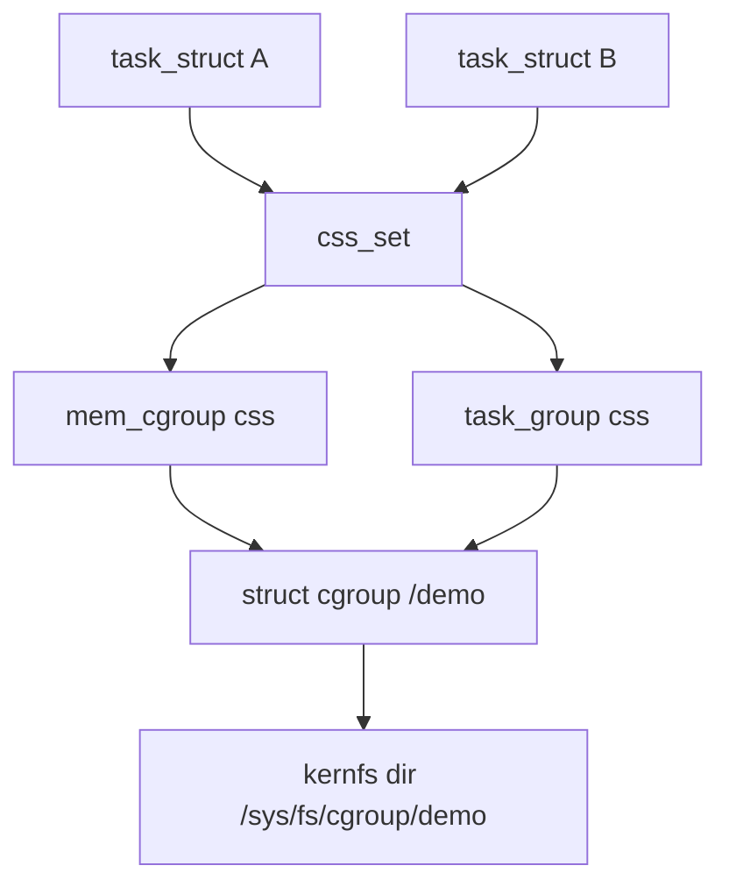

# Control Groups (cgroup v2)

> **Goal:** understand the kernel's resource accounting and limiting
> machinery — the second pillar of containers, and the thing behind
> `docker run -m 512m --cpus 1.5`, Kubernetes requests/limits, and systemd
> service properties.

## The idea

[Namespaces](#/namespaces) change what a process can *see*; **cgroups**
(control groups) change what it can *use*. A cgroup is a named group of
processes to which the kernel attaches **controllers** that meter and limit
resources:

| Controller | Governs | Since |
|---|---|---|
| `cpu` | CPU time (weights and hard quotas) | v2 core |
| `memory` | RAM + page cache usage, with limits and OOM behaviour | v2 core |
| `io` | Disk bandwidth, IOPS, and I/O latency targets per device | v2 core |
| `pids` | Number of tasks (fork-bomb fence) | 4.3 |
| `cpuset` | Pin processes to specific CPU cores and NUMA nodes | v2 in 5.0 |
| `hugetlb` | Huge page usage limits | v2 in 5.6 |
| `rdma` | RDMA/InfiniBand resource limits | 4.11 |
| `misc` | Scalar resources (e.g., AMD SEV/SEV-ES ASIDs) | 5.13 |
| `freezer` | Suspend/resume whole groups (`cgroup.freeze`) | v2 in 5.2 |

Two crucial properties:

- **Hierarchical** — cgroups form a tree; limits cascade. A child can never
  exceed its parent's limit. This enables delegation: give a team 32 GB, let
  them subdivide.
- **Inherited** — a forked process lands in its parent's cgroup
  automatically. No process escapes accounting by forking. (The exception:
  `cgroup.threads` for threaded mode, covered below.)

A one-paragraph history, because the version matters: cgroup v1 shipped in
2.6.24 (2008) and let every controller mount its own hierarchy — a process
could be in `/cpu/A` but `/memory/B`, which made coherent resource policy
nearly impossible. cgroup v2 (one unified tree, declared stable in 4.5,
2016) is the default on every modern distro — Fedora since 31, Ubuntu since
21.10, Debian since 11, RHEL since 9 — and the container stack followed:
Docker 20.10+, Kubernetes GA in 1.25. This chapter covers only v2. (You can
still boot a hybrid or legacy layout with `systemd.unified_cgroup_hierarchy=0`
on the kernel command line, but nothing new targets it.)

## How the kernel represents a cgroup

Four structures carry the whole design; knowing them makes the sysfs
interface stop looking magical.

- **`struct cgroup`** (`include/linux/cgroup-defs.h`) — one per directory
  under `/sys/fs/cgroup`. The fields that matter: `self` (an embedded
  `cgroup_subsys_state` anchoring refcounting), `kn` (the kernfs node — the
  directory *is* this struct's rendering), `level` (depth in the tree),
  `subtree_control` (bitmask of controllers enabled for children), and
  `nr_descendants` (used to enforce `cgroup.max.descendants` and
  `cgroup.max.depth`, the sprawl fences).
- **`struct cgroup_subsys_state`** ("css") — the per-controller state
  attached to a cgroup. `mem_cgroup` and `task_group` (below) *embed* a css
  as their first member; `css->cgroup` points back to the directory,
  `css->parent` up the tree, and `css->refcnt` is a percpu-refcount so the
  hot path never touches a shared atomic. All hierarchy walks are css walks.
- **`struct css_set`** — the trick that makes membership cheap. A task does
  not point at N controllers; `task_struct->cgroups` points at one shared,
  refcounted `css_set`, whose `subsys[]` array holds one css pointer per
  controller. Every task in the *same combination* of cgroups shares the same
  `css_set`, so `fork()` is a refcount increment — O(1), no allocation, no
  tree walk. css_sets are interned in a hash table keyed by their css vector;
  [find_css_set()](https://elixir.bootlin.com/linux/v6.12/C/ident/find_css_set)
  returns the existing one or builds a new one. The many-to-many link between
  a css_set and the cgroups it references is carried by `struct cgrp_cset_link`.
- **Controller state** — each controller defines its own struct embedding a
  css: `struct mem_cgroup` (page counters + per-node LRU lists), `struct
  task_group` (per-CPU runqueues + bandwidth state), `struct blkcg` (per-device
  I/O policy), etc.

Moving a task (`echo PID > cgroup.procs`) goes through
[cgroup_attach_task()](https://elixir.bootlin.com/linux/v6.12/C/ident/cgroup_attach_task):
the kernel finds or creates the `css_set` matching the destination, calls
each controller's `attach` callback, and swaps the task's pointer. One
consequence that bites people: **memory charges are not migrated**. Pages
stay charged to the group that first allocated them until they are freed, so
moving a busy process between cgroups does not move its resident set with it.



### Domain vs threaded cgroups

By default a cgroup is a **domain** cgroup: `cgroup.procs` moves a whole
thread group (a process and all its threads) as a unit, because the memory
and io controllers only make sense at process granularity — you cannot give
two threads of one address space different memory limits. Some controllers,
though, *are* per-thread: `cpu`, `pids`, and `perf_event`. To split the
threads of one process across sibling cgroups you switch a subtree to
**threaded mode** by writing `threaded` to `cgroup.type`; then
`cgroup.threads` accepts individual TIDs and only threaded controllers are
available. This is how a latency-sensitive thread and a background thread in
the same process can land on different `cpu.weight` groups. It's rare, but
it's why `cgroup.type` and `cgroup.threads` exist.

## It's a filesystem (of course it is)

The interface is a virtual filesystem (built on **kernfs**, the same library
behind sysfs) mounted at `/sys/fs/cgroup`. Directories are cgroups; `mkdir`
creates one ([cgroup_mkdir()](https://elixir.bootlin.com/linux/v6.12/C/ident/cgroup_mkdir)
allocates the `struct cgroup` and asks each enabled controller for a css via
its `css_alloc` callback); control files configure it. No syscalls, no
daemons — `echo` and `cat`:

```bash
mount | grep cgroup2       # cgroup2 on /sys/fs/cgroup (v2 = unified, the modern world)
cat /proc/self/cgroup      # where YOU live: 0::/user.slice/user-1000.slice/…
ls /sys/fs/cgroup/         # the root of the tree
cat /sys/fs/cgroup/cgroup.controllers      # controllers this kernel offers
cat /sys/fs/cgroup/cgroup.subtree_control  # controllers enabled for children
```

`cgroup.subtree_control` is the switchboard: writing `+memory +cpu` into it
makes those controllers' files appear in every child directory. A controller
you never enable costs (almost) nothing. Note the asymmetry: a controller is
enabled *by the parent, for its children* — a cgroup never enables a
controller on itself, which is what makes the "no internal processes" rule
below coherent.

> **v1 vs v2 in one line:** v1 had a separate tree per controller (a process
> could be in different groups for cpu vs memory — chaos); v2 has **one
> unified tree**. Everything modern (systemd, Docker, Kubernetes) is v2;
> this site covers only v2.

Note the systemd path in `/proc/self/cgroup`: **systemd organizes the entire
machine into cgroups** (`system.slice` for services, `user.slice` for
sessions) even with zero containers. `systemd-cgls` shows the live tree;
`systemd-cgtop` is "top for cgroups".

**Container link:** a container also gets a *cgroup namespace*
(`CLONE_NEWCGROUP`, covered in [Namespaces](#/namespaces)) so that
`/proc/self/cgroup` inside shows `0::/` instead of leaking the host path.
Namespaces hide the tree; cgroups enforce it — two mechanisms, one illusion.

## Hands-on: build a memory jail

Watch the whole mechanism in two minutes (as root):

```bash
cd /sys/fs/cgroup
mkdir demo                          # a new cgroup. That's it.
ls demo/ | head                     # control files appeared automatically

echo "100M" > demo/memory.max       # hard memory limit
echo $$ > demo/cgroup.procs         # move THIS shell into the jail

# now blow past the limit:
python3 -c 'x = bytearray(300_000_000)'
# → Killed                          ← the per-cgroup OOM killer

cat demo/memory.events              # oom_kill 1  — the kernel's receipt
echo $$ > /sys/fs/cgroup/cgroup.procs   # escape (move back to root cgroup)
rmdir demo
```

That `Killed` is exactly what happens inside `docker run -m 100m` — recall
[Virtual Memory](#/memory): cgroup OOM kill → exit code 137. You've now seen
the machinery naked. The [cgroup limits lab](#/lab-cgroup-limits) and the
[OOM killer lab](#/lab-oom-killer) push much harder on this.

```bash
# Before the kill, watch memory pressure build:
cat demo/memory.pressure    # some/full stall percentages
```

## The control files that matter

### memory

```text
memory.max        hard limit → reclaim, then cgroup-local OOM kill
memory.high       soft limit → heavy reclaim pressure, throttling, no kill
memory.low        best-effort protection from reclaim (evict this last)
memory.min        hard protection, dangerous if overcommitted (forces OOM elsewhere)
memory.current    usage right now (this is the number for "how much RAM")
memory.events     counts: how often limited (low/high/max/oom/oom_kill)
memory.stat       breakdown: anon vs file (page cache!), kernel memory, slab
memory.oom.group  kill the cgroup as a unit instead of one unlucky task
memory.peak       high-water mark — gold for capacity planning (resettable
                  by writing to it, since 6.12)
memory.swap.max   limit for swap usage by this cgroup
memory.reclaim    write "512M" to force proactive reclaim (since 5.19)
```

Under the hood this is `struct mem_cgroup` (`include/linux/memcontrol.h`).
Its load-bearing fields: `memory` and `swap`, both `struct page_counter`;
`oom_group`; and `nodeinfo[]`, an array of per-NUMA-node structures each
holding its own LRU lists — since 4.8, page reclaim *is* per-memcg-per-node
LRU walking; the global LRU is gone. A `struct page_counter` is five numbers
plus a parent pointer: `usage`, `min`, `low`, `high`, `max` (plus a
`watermark` high-water mark and a `failcnt`). Charging a page walks the
parent chain atomically incrementing `usage` at every level and fails at the
first ancestor over `max` — that is the entire "limits cascade" guarantee,
implemented in ~40 lines of `mm/page_counter.c`.

Ownership is per-page: every `struct folio` carries a `memcg_data` pointer
to the memcg that first charged it. That has a famous consequence: a file
page charged to container A stays A's even if container B reads it later
(the "shared page cache" wrinkle), and charges don't follow a task that
migrates between cgroups.

Subtlety with production consequences: **page cache counts toward the
limit**. A container reading large files "uses" memory in `memory.current`;
the kernel reclaims cache before OOM-killing, but monitoring that alerts on
`current` alone will lie to you. Read `memory.stat`'s anon vs file split
(and see the [page cache lab](#/lab-page-cache) for this in motion).

```bash
grep -E 'anon|file|cache' /sys/fs/cgroup/<group>/memory.stat
```

`memory.stat` is richer than most people use. Beyond `anon` and `file`, the
lines worth learning are `kernel` and `slab` (kernel structures charged to
the group — dentries, inodes, page tables), `sock` (network buffers — a
memory-heavy container can be starving on socket memory, not anon),
`file_dirty` and `file_writeback` (pages waiting to hit disk, which ties
into writeback attribution below), and `workingset_refault` (pages that were
evicted and had to be read back — a direct signal that the limit is too
tight for the working set). A high refault rate with no OOM kill is the
classic "the limit is technically fine but the workload is thrashing"
picture.

The protection knobs are where cgroup v2 becomes more than "limits":

```text
memory.high  pressure valve: slow this group down before it hurts others
memory.max   hard wall: if reclaim fails, kill
memory.low   protect this workload when the machine reclaims memory
memory.min   stronger protection; can force OOM elsewhere if overpromised
```

`memory.high` deserves precision, because its mechanism surprises people: it
never kills. When a charge pushes usage above `high`, the allocating task is
first sent into direct reclaim, and if it keeps allocating faster than
reclaim frees, the kernel adds an explicit sleep penalty proportional to the
square of the overage — clamped at **2 seconds per allocation batch** as of
6.12. An over-`high` cgroup doesn't die; it wades through molasses. That's
why systemd-oomd and Facebook's oomd pair `memory.high` with PSI: the kernel
slows the group, userspace watches the stall numbers and decides when to
kill politely.

The protection side (`low`/`min`) is worth equal precision because it works
by **proportional reclaim protection**, not a hard reservation. When the
machine reclaims, a group under its `memory.low` is skipped *until* all
unprotected memory is exhausted; if reclaim still can't make progress it will
dip into protected memory proportionally to how far each sibling is over its
protection. `memory.min` is the hard version: memory under `min` is never
reclaimed, which is why over-promising `min` across siblings can force an OOM
kill somewhere else on the machine. This is the shape used by serious
multi-tenant systems: do not only cap the noisy neighbor; protect the
latency-sensitive neighbor. A database with `memory.low` gets a reclaim
shield for its working set while batch jobs absorb more cache eviction.

`memory.oom.group=1` is another production-grade detail. Without it, the OOM
killer may kill one large worker and leave a half-broken service limping.
With it, the cgroup is treated as the failure domain: the whole workload
dies and the supervisor restarts it cleanly.

### cpu

```text
cpu.weight    1–10000 (default 100) — proportional share under contention
cpu.weight.nice  the same knob expressed in nice units (-20..19)
cpu.max       "150000 100000" = 150ms CPU per 100ms period = 1.5 CPUs, hard cap
cpu.max.burst optional burst budget above the hard period quota (since 5.14)
cpu.stat      usage_usec + nr_throttled / throttled_usec ← the smoking gun
cpu.pressure  PSI: % time tasks stalled on CPU
cpu.idle      schedule this group only on otherwise-idle CPUs (since 5.15)
```

Version pin: since 6.6 the fair scheduler is **EEVDF**, not CFS — see
[CPU Scheduling](#/scheduling) — but the cgroup story barely changed.
`cpu.weight` feeds the group's `struct task_group` (each group owns a
per-CPU `cfs_rq` runqueue and a scheduling entity in its parent's queue, so
"group scheduling" is literally nested runqueues), and bandwidth control is
still the CFS-era code in `kernel/sched/fair.c`, driven by `struct
cfs_bandwidth`: `period` and `quota` (what you wrote to `cpu.max`),
`runtime` (the remaining global pool this period), `burst`, and a `period_timer`
hrtimer that refills the pool.

The defaults and bounds are worth knowing cold: period defaults to
**100 ms** and the kernel clamps it to **1 ms–1 s**; quota is handed out to
CPUs in **5 ms slices** (`sysctl kernel.sched_cfs_bandwidth_slice_us`), which
is why a 64-core box with a small quota can burn its whole budget in a few
milliseconds of parallel work and then stall. Concretely: a group with
`cpu.max = "100000 100000"` (one CPU's worth) running 64 threads can consume
its entire 100 ms quota in about 1.5 ms of wall-clock time, then sit
throttled for the remaining ~98 ms of the period — a latency cliff that
looks nothing like "using one core."

[CPU Scheduling](#/scheduling) explained the trap: `cpu.max` throttling
freezes **all** the group's threads for the rest of each 100 ms period once
the quota is burned. `nr_throttled` rising + latency spikes = your
container's CPU limit is biting. `cpu.weight` (Docker's `--cpu-shares`,
Kubernetes *requests*) only divides *contended* CPU and is invisible on an
idle host; `cpu.max` (Docker's `--cpus`, Kubernetes *limits*) caps even an
idle one.

`cpu.max.burst` exists because real services are spiky. A strict quota can
create 100 ms rhythm artifacts. Burst lets unused runtime accumulate within
a bounded budget so short spikes complete without permanently raising the
CPU contract. It is not free CPU; it is a latency valve. `cpu.idle=1` is the
opposite end of the spectrum — SCHED_IDLE for a whole group — so a
best-effort batch cgroup runs only when a CPU would otherwise be idle,
without any quota math at all.

### io and pids

```text
io.max      "8:0 rbps=10485760 wiops=1000"   per-device byte/IOPS caps
io.weight   proportional share (needs the BFQ scheduler or io.cost)
io.cost.qos iocost model: work-conserving proportional I/O (since 5.4)
io.latency  latency target; throttle siblings to protect this group (4.19)
io.stat     bytes and operations per device (read, write, discard)
io.pressure PSI: % time tasks stalled on I/O
pids.max    fork-bomb ceiling — docker run --pids-limit
pids.current current count
```

The I/O controller is device-oriented (see
[The Linux Storage Stack](#/storage-stack) for where the throttling hooks
sit in the block layer). Its per-device state lives in `struct blkcg_gq`
(the "blkg" — one per (cgroup, block-device) pair), and there are two very
different policies. `io.max` is a **throttling** policy: a hard bytes/IOPS
ceiling enforced in the block layer regardless of contention, so it can
leave a disk idle. `io.weight` / `io.cost` (the **iocost** model, since 5.4)
is **work-conserving**: it estimates each device's cost model and divides
actual contended bandwidth by weight, so an idle disk is never wasted. Most
production setups want iocost, not `io.max`. Always map major:minor numbers
back to real devices:

```bash
lsblk -o NAME,MAJ:MIN,SIZE,TYPE,MOUNTPOINTS
cat /sys/fs/cgroup/<group>/io.stat
```

A quietly huge v2 improvement: **writeback attribution**. In v1, buffered
writes were charged to nobody — dirty pages were flushed later by kernel
threads outside any sensible group, so `io.max` only really governed direct
I/O. v2 links the memory and io controllers: each dirty page's memcg is
known (that `memcg_data` pointer again), the flusher threads charge the
writeback to the right group, and per-cgroup dirty-page limits derive from
the group's memory allowance. Buffered-write hogs are finally billable — the
`file_dirty` and `file_writeback` lines in `memory.stat` are how you watch
it happen.

`pids.max` is deceptively important. Memory limits do not stop a fork bomb
early enough if thousands of tasks can exist while consuming little memory
each. `pids.max` protects the scheduler, PID allocator, process table
pressure, and every service manager trying to recover the machine. It's
checked at `fork()` time in the pids controller's `can_fork` callback — the
cheapest possible fence, before any address space is set up.

### cpuset

```text
cpuset.cpus            which CPUs tasks may run on
cpuset.mems            which NUMA nodes memory may come from
cpuset.cpus.partition  "root" carves out an isolated scheduler partition
cpuset.cpus.effective  the CPUs actually in force after intersecting with parent
```

`cpuset` is placement, not bandwidth: it's how Kubernetes' static CPU
manager pins Guaranteed pods to exclusive cores, and
`cpuset.cpus.partition=root` (since 5.13, extended through 6.x) creates
isolated scheduler partitions without `isolcpus=` boot parameters — see
[CPU Isolation, NO_HZ & Real-Time](#/cpu-isolation) and the
[NUMA Deep Dive](#/numa-deep-dive) for why `cpuset.mems` can matter as much
as the CPU list. Note the `effective` files: a child's usable CPUs are the
*intersection* of what you request and what the parent grants, so a cpuset
never escapes its ancestor's mask — the same cascade rule as every other
controller, expressed as set intersection instead of arithmetic.

## How Docker/Kubernetes map onto this

```bash
docker run -d -m 512m --cpus 1.5 --name demo nginx
cat /sys/fs/cgroup/system.slice/docker-$(docker inspect -f '{{.Id}}' demo).scope/memory.max
# 536870912            ← there's your -m 512m, as a file
docker rm -f demo
```

| You write | Kernel receives |
|---|---|
| `docker run -m 512m` | `memory.max = 536870912` |
| `docker run --cpus 1.5` | `cpu.max = "150000 100000"` |
| `docker run --cpu-shares 512` | `cpu.weight = 20` (see formula below) |
| `docker run --memory-swap 1g` | `memory.swap.max` = 1g − 512m limit math |
| K8s `resources.requests.cpu` | `cpu.weight` (1000m → shares 1024 → weight ≈ 39) |
| K8s `resources.limits.cpu` | `cpu.max` (hard, "150000 100000" for 1.5 cores) |
| K8s `resources.requests.memory` | OOM score adjustment + eviction ordering |
| K8s `resources.limits.memory` | `memory.max` (hard) |
| K8s QoS: Guaranteed | requests = limits (evicted last) |
| K8s QoS: Burstable | requests < limits |
| K8s QoS: BestEffort | no requests/limits (first to be evicted under pressure) |

The shares→weight conversion (v1 `cpu.shares` was 2–262144 with default
1024; v2 `cpu.weight` is 1–10000 with default 100) is runc's
`weight = 1 + ((shares − 2) × 9999) / 262142` — so `--cpu-shares 512` ≈ 20
and the K8s default of 1024 shares lands on ≈ 39. Only the *ratios* between
siblings ever mattered, so the remapping is harmless.

Kubernetes builds a real cgroup subtree, not a flat list. Under
`kubepods.slice` it creates `kubepods-burstable.slice` and
`kubepods-besteffort.slice`, with Guaranteed pods placed directly under
`kubepods.slice`; each level carries the aggregate weights and limits so the
QoS classes compete correctly under contention. Which manager owns those
directories depends on the **cgroup driver**: on a systemd-managed host the
kubelet must run with `--cgroup-driver=systemd` so kubelet and systemd don't
fight over the same tree (the alternative, `cgroupfs`, writes the files
directly and is only safe when systemd isn't the init system managing
cgroups). A driver mismatch is one of the classic "pods randomly get killed"
Kubernetes bugs.

There is otherwise no other layer. The entire resource model of the
container ecosystem is file writes into `/sys/fs/cgroup` — performed by runc
at container start, as [Docker, containerd, runc](#/container-runtimes)
traces, and by [Build a Container by Hand](#/build-a-container) if you do it
yourself.

## Accounting: cgroups as a metering system

Even with no limits set, cgroups *measure* — per-group CPU, memory, and I/O
totals, far more usefully than per-process numbers (children included,
nothing escapes):

```bash
cat /sys/fs/cgroup/system.slice/cpu.stat        # all services' CPU, total
systemd-cgtop                                    # live per-group consumption
docker stats                                     # same files, prettier clothes
```

This is what `docker stats`, `kubectl top`, and every container monitoring
agent actually read. When metrics look weird, go read the files yourself
(the [observability chapter](#/observability) makes this a habit). Because
accounting is O(1) on the hot path (percpu stocks and counters), leaving
every controller enabled purely for measurement is cheap — the cost is
mostly in the *reclaim* and *throttle* paths, which only run when a limit is
actually set.

## cgroups + PSI: knowing when limits hurt

cgroup v2 exposes **Pressure Stall Information** (since 4.20) — the
percentage of time tasks in the group were *stalled* waiting for
cpu/memory/io:

```bash
cat /sys/fs/cgroup/system.slice/cpu.pressure
# some avg10=0.00 avg60=0.12 …   ← "some tasks stalled 0.12% of the last minute"
cat /proc/pressure/memory        # same idea, machine-wide
```

Mechanics: the scheduler feeds per-cgroup state machines
([psi_task_change()](https://elixir.bootlin.com/linux/v6.12/C/ident/psi_task_change)
on every relevant transition), and a periodic worker folds them into
exponential moving averages over **10 s / 60 s / 300 s** windows, updated
every 2 s. `some` = at least one task stalled; `full` = all non-idle tasks
stalled (no useful work at all). You can even register **PSI triggers**:
write `"some 150000 1000000"` to a pressure file and `poll()` it — wake me
when stall time exceeds 150 ms within any 1 s window (minimum window
500 ms). That's the primitive systemd-oomd and modern autoscalers are built
on.

PSI answers the real question — "is anything actually *suffering*?" — far
better than utilization percentages.

The killer monitoring combination:

```text
cpu.stat nr_throttled rising       → quota is actively delaying execution
memory.events high rising          → memory.high is applying pressure
memory.events max rising           → memory.max was hit (even if no kill yet)
memory.events oom_kill rising      → hard memory failure
io.pressure full rising            → all useful work stalled behind I/O
cpu.pressure some high             → runnable work waiting for CPU
```

Utilization says "the resource is busy". PSI says "tasks are losing time".
For SLOs and noisy-neighbor debugging, the second signal is usually closer
to user pain.

## Delegation and the no-internal-process rule

cgroup v2 has a structural rule (the **"no internal processes"
constraint**): a non-root cgroup can distribute domain controllers to its
children only if it hosts no processes itself. Resources flow from parents
to children; a cgroup that both ran tasks *and* subdivided resources would
make "who competes with whom" ambiguous. So processes live at leaves:

```text
service.slice/                  controllers enabled here
└── my.service/                 no workload process here if subdividing
    ├── frontend/               processes live here
    └── workers/                processes live here
```

It's also why mature systems let systemd own the upper tree and delegate a
subtree to a container manager with limited write access. Delegation is a
defined contract, not just `chown -R`: the delegatee gets write access to
`cgroup.procs`, `cgroup.subtree_control`, and `cgroup.threads` inside its
subtree — but crucially *not* to the resource-control files of the subtree
root itself (it can't widen its own limit), and the `nsdelegate` mount
option makes cgroup-namespace boundaries act as delegation boundaries
automatically.

```bash
# Enable delegation (systemd):
systemctl set-property my.service Delegate=yes
# Now my.service/ can create its own child cgroups
```

Two group-wide verbs complete the management picture: `echo 1 >
cgroup.freeze` (since 5.2) stops every task in the subtree — they stay
frozen even across `fork()` — and `echo 1 > cgroup.kill` (since 5.14)
SIGKILLs the entire subtree atomically, with no
kill-loop-while-they-keep-forking race. Container runtimes use both:
`cgroup.kill` is how `docker stop`'s hard-kill path and Kubernetes pod
teardown reliably reap a process tree that would otherwise fork faster than
you can signal it.

## Follow the code (kernel v6.12)

Two traces, one per flagship controller. Source lives under
[kernel/cgroup/](https://elixir.bootlin.com/linux/v6.12/source/kernel/cgroup)
(core), [mm/memcontrol.c](https://elixir.bootlin.com/linux/v6.12/source/mm/memcontrol.c)
(memory), and [kernel/sched/fair.c](https://elixir.bootlin.com/linux/v6.12/source/kernel/sched/fair.c)
(cpu bandwidth).

### Trace 1: an allocation hits `memory.max`

1. A task in the jail touches a new anonymous page. Page fault →
   [handle_mm_fault()](https://elixir.bootlin.com/linux/v6.12/C/ident/handle_mm_fault)
   → [do_anonymous_page()](https://elixir.bootlin.com/linux/v6.12/C/ident/do_anonymous_page),
   which allocates a folio and must *charge* it:
   [mem_cgroup_charge()](https://elixir.bootlin.com/linux/v6.12/C/ident/mem_cgroup_charge)
   → [charge_memcg()](https://elixir.bootlin.com/linux/v6.12/C/ident/charge_memcg).
2. The real work is
   [try_charge_memcg()](https://elixir.bootlin.com/linux/v6.12/C/ident/try_charge_memcg).
   Fast path first: each CPU keeps a pre-charged *stock* of up to 64 pages
   (`MEMCG_CHARGE_BATCH`, 256 KiB with x86-64's 4 KiB pages — arm64 with
   64 KiB pages would batch 4 MiB) via
   [consume_stock()](https://elixir.bootlin.com/linux/v6.12/C/ident/consume_stock),
   so most charges never touch shared counters.
3. On a stock miss:
   [page_counter_try_charge()](https://elixir.bootlin.com/linux/v6.12/C/ident/page_counter_try_charge)
   walks up the `page_counter` parent chain, atomically adding to `usage` at
   each ancestor, and fails at the first one whose `usage` would exceed
   `max` — hierarchy enforcement is literally this loop.
4. On failure, the task does targeted direct reclaim:
   [try_to_free_mem_cgroup_pages()](https://elixir.bootlin.com/linux/v6.12/C/ident/try_to_free_mem_cgroup_pages)
   runs the reclaim machinery from [Virtual Memory](#/memory), but only over
   this memcg subtree's per-node LRU lists — page cache first, then anon to
   swap if allowed. `try_charge_memcg()` retries the charge; as of 6.12 it
   gives reclaim `MAX_RECLAIM_RETRIES` = 5 rounds.
5. Still failing →
   [mem_cgroup_oom()](https://elixir.bootlin.com/linux/v6.12/C/ident/mem_cgroup_oom)
   → [mem_cgroup_out_of_memory()](https://elixir.bootlin.com/linux/v6.12/C/ident/mem_cgroup_out_of_memory)
   → the common [out_of_memory()](https://elixir.bootlin.com/linux/v6.12/C/ident/out_of_memory)
   with the oom-control scoped to the memcg, so victim scoring only iterates
   the group's tasks; with `memory.oom.group=1`,
   [mem_cgroup_get_oom_group()](https://elixir.bootlin.com/linux/v6.12/C/ident/mem_cgroup_get_oom_group)
   widens the kill to the whole group. That is your exit code 137.
6. On success, the folio's `memcg_data` is set to the memcg — the page now
   knows its owner until it's freed and uncharged. And if the charge landed
   above `memory.high`,
   [mem_cgroup_handle_over_high()](https://elixir.bootlin.com/linux/v6.12/C/ident/mem_cgroup_handle_over_high)
   runs on the way back to userspace: reclaim plus that up-to-2-second
   penalty sleep.

### Trace 2: `cpu.max` throttles a group

1. `echo "150000 100000" > cpu.max` lands (via kernfs) in
   [cpu_max_write()](https://elixir.bootlin.com/linux/v6.12/C/ident/cpu_max_write)
   in kernel/sched/core.c, which calls
   [tg_set_cfs_bandwidth()](https://elixir.bootlin.com/linux/v6.12/C/ident/tg_set_cfs_bandwidth):
   quota and period are stored in the group's
   [struct cfs_bandwidth](https://elixir.bootlin.com/linux/v6.12/C/ident/cfs_bandwidth)
   and the `period_timer` hrtimer is armed.
2. While the group runs,
   [update_curr()](https://elixir.bootlin.com/linux/v6.12/C/ident/update_curr)
   charges every nanosecond of runtime and
   [__account_cfs_rq_runtime()](https://elixir.bootlin.com/linux/v6.12/C/ident/__account_cfs_rq_runtime)
   decrements the per-CPU runqueue's `runtime_remaining` — each CPU holds a
   locally-cached 5 ms slice of the global quota.
3. Slice exhausted →
   [assign_cfs_rq_runtime()](https://elixir.bootlin.com/linux/v6.12/C/ident/assign_cfs_rq_runtime)
   tries to refill from the global pool. Pool empty →
   [throttle_cfs_rq()](https://elixir.bootlin.com/linux/v6.12/C/ident/throttle_cfs_rq)
   dequeues the group's scheduling entity from that CPU's runqueue. Every
   thread of the group on that CPU stops, mid-period, no matter how urgent.
4. At period end the hrtimer fires:
   [sched_cfs_period_timer()](https://elixir.bootlin.com/linux/v6.12/C/ident/sched_cfs_period_timer)
   refills `runtime` (plus any accumulated `burst`), and
   [distribute_cfs_runtime()](https://elixir.bootlin.com/linux/v6.12/C/ident/distribute_cfs_runtime)
   → [unthrottle_cfs_rq()](https://elixir.bootlin.com/linux/v6.12/C/ident/unthrottle_cfs_rq)
   puts the group back. Worst-case injected latency ≈ the rest of the
   period — that's the ~100 ms stutter, and every occurrence increments
   `nr_throttled`/`throttled_usec` in `cpu.stat`.

## Try it yourself

```bash
systemd-cgls | head -30                 # the machine's cgroup tree
cat /proc/self/cgroup                   # your own address in it
systemd-run --scope -p MemoryMax=50M stress --vm 1 --vm-bytes 100M
                                        # systemd as a cgroup CLI — watch it die
journalctl -u user@1000 | grep -i oom | tail -3
# Explore Docker's cgroup layout:
docker run -d -m 100m --cpus 0.5 --name test nginx
find /sys/fs/cgroup -name "memory.max" -exec grep -H . {} + | grep docker
docker rm -f test
```

```bash
# Watch throttling happen in real time (as root):
mkdir /sys/fs/cgroup/throttle
echo "50000 100000" > /sys/fs/cgroup/throttle/cpu.max   # 0.5 CPU
echo $$ > /sys/fs/cgroup/throttle/cgroup.procs
yes > /dev/null &                        # a CPU burner in the jail
watch -n1 cat /sys/fs/cgroup/throttle/cpu.stat   # nr_throttled climbs
kill %1; echo $$ > /sys/fs/cgroup/cgroup.procs; rmdir /sys/fs/cgroup/throttle
```

```bash
# See writeback attribution and the dirty/refault stats move (as root):
mkdir /sys/fs/cgroup/iodemo
echo "+memory +io" > /sys/fs/cgroup/cgroup.subtree_control 2>/dev/null
echo $$ > /sys/fs/cgroup/iodemo/cgroup.procs
dd if=/dev/zero of=/tmp/blob bs=1M count=512 conv=fdatasync
grep -E 'file_dirty|file_writeback|workingset_refault' \
    /sys/fs/cgroup/iodemo/memory.stat
echo $$ > /sys/fs/cgroup/cgroup.procs; rm -f /tmp/blob; rmdir /sys/fs/cgroup/iodemo
```

## Check your understanding

1. Why does forking never escape resource limits?

<details><summary>Show answer</summary>

A child inherits its parent's cgroup membership automatically: `fork()` just
takes a reference on the parent's `css_set`. The kernel accounts groups, not
individual processes, so there is no new bookkeeping to evade — and
`pids.max` is even checked at fork time itself.

</details>

2. `memory.current` is at 90% of `memory.max` — is the container about to
   OOM? What files tell you more?

<details><summary>Show answer</summary>

Not necessarily. Check `memory.stat` for the anon vs file split: if most
usage is file (page cache), the kernel will reclaim it before OOM-killing. A
rising `workingset_refault` in the same file means the working set no longer
fits (thrashing), and `memory.events` (`max` and `oom_kill` counters) tells
you whether the limit is actually being hit.

</details>

3. A latency-sensitive service stutters every ~100 ms under load. Which file
   confirms the diagnosis, and which Docker flag caused it?

<details><summary>Show answer</summary>

`cpu.stat` — rising `nr_throttled` and `throttled_usec`. The cause is
`--cpus` (i.e., `cpu.max`), a hard quota over a default 100 ms period: once
the quota burns, `throttle_cfs_rq()` parks the whole group until the period
timer refills it. Remedies: raise the quota, use `cpu.max.burst`, or drop
the hard limit and rely on `cpu.weight`.

</details>

4. What's the difference between Kubernetes CPU *requests* and *limits*, in
   cgroup file terms?

<details><summary>Show answer</summary>

Requests set `cpu.weight` — a proportional share that only matters under
contention and is invisible on an idle host. Limits set `cpu.max` — a hard
quota enforced even when every other CPU is idle.

</details>

5. Why does `memory.current` include page cache — and why is that important
   for monitoring?

<details><summary>Show answer</summary>

Every folio is charged to the memcg that first allocated it, and file pages
a group reads into cache are memory it caused to be used. But cache is
reclaimable: high `memory.current` with a high file fraction in
`memory.stat` is healthy, so alerting on `current` alone produces false
alarms.

</details>

6. `memory.high` is exceeded but nothing gets killed. What exactly is the
   kernel doing to the group?

<details><summary>Show answer</summary>

Every allocating task is forced into direct reclaim of the group's own
pages, and if usage stays above `high`, `mem_cgroup_handle_over_high()` adds
sleep penalties that grow with the overage, capped at 2 seconds per
allocation batch. The group is throttled, not killed — killing (if needed)
is left to `memory.max` or a userspace agent like systemd-oomd watching PSI.

</details>

7. Why does cgroup v2 forbid a cgroup from having both processes and
   controller-enabled children?

<details><summary>Show answer</summary>

The "no internal processes" rule: controllers distribute a parent's
resources among its *children*, so processes sitting directly in the parent
would compete with entire child subtrees with no defined weight or limit.
Forcing processes to the leaves keeps every competition well-defined — and
makes clean delegation of subtrees possible.

</details>

8. When does `io.max` leave a fast disk idle, and what should you use
   instead?

<details><summary>Show answer</summary>

`io.max` is a hard throttling ceiling: once a group hits its byte/IOPS cap
it waits even if the device is otherwise idle, wasting bandwidth. The
work-conserving alternative is the iocost model (`io.weight` / `io.cost.qos`,
since 5.4), which divides *contended* I/O by weight but lets any group use an
idle disk fully.

</details>

## Sources & further reading

- [Control Group v2 — kernel admin guide](https://docs.kernel.org/admin-guide/cgroup-v2.html) — the authoritative reference for every file mentioned here (Tejun Heo et al.).
- [cgroups(7) man page](https://man7.org/linux/man-pages/man7/cgroups.7.html) — v1 vs v2 overview, mount options, delegation rules.
- [PSI — Pressure Stall Information](https://docs.kernel.org/accounting/psi.html) — semantics of some/full, averages, and triggers.
- [systemd.resource-control(5)](https://man7.org/linux/man-pages/man5/systemd.resource-control.5.html) — how `MemoryMax=`, `CPUWeight=`, `TasksMax=` map to cgroup files.
- [systemd cgroup delegation documentation](https://systemd.io/CGROUP_DELEGATION/) — the contract between systemd and container managers.
- [kernel/cgroup/ in v6.12](https://elixir.bootlin.com/linux/v6.12/source/kernel/cgroup) — core: `cgroup.c`, `cpuset.c`, `pids.c`, `freezer.c`.
- Chris Down, *"5 Years of Cgroup v2: The Future of Linux Resource Control"* (USENIX SREcon / FOSDEM talk) — the best practitioner's tour of memory.low/high strategy at Facebook scale.

---

**Next:** the third pillar — where a container's filesystem comes from.
[Images, layers, and OverlayFS](#/overlayfs).
