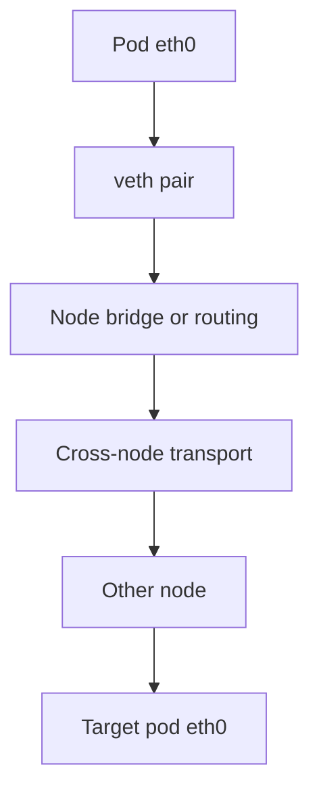

# Container Networking

> **Goal:** build Docker's default networking with bare `ip` commands —
> namespace, veth, bridge, NAT, port publishing — then map it to what Docker
> and Kubernetes do for you. Pure application of the [networking chapter](#/networking).

## The problem

A new network namespace is a sealed box: one dead loopback interface, no
routes, no reach. When the kernel processes `CLONE_NEWNET` it does not clone
the host's interfaces — it hands you a fresh, nearly empty `struct net` with
its own interface list, routing tables, ARP/neighbour tables, conntrack
table, and `/proc/sys/net` knobs. (See [Namespaces](#/namespaces) for how
`struct net` is allocated and reference-counted.) Container networking is the
answer to one question: **how does a sealed box talk to the world without
un-sealing it?**

Docker's default answer (the `bridge` network):

```text
                    HOST
  ┌────────────────────────────────────────────┐
  │              docker0 (bridge, 172.17.0.1)  │
  │              /        \                    │
  │        vethA1          vethB1   ← host ends│
  │           │               │                │
  │  ╔════════╪═══════╗ ╔═════╪══════════╗     │
  │  ║ ctr A  │       ║ ║ ctr B          ║     │
  │  ║  eth0 (vethA2) ║ ║  eth0 (vethB2) ║     │
  │  ║  172.17.0.2    ║ ║  172.17.0.3    ║     │
  │  ╚════════════════╝ ╚════════════════╝     │
  │                                            │
  │  eth0 (host NIC) ←— NAT (MASQUERADE) —→ internet
  └────────────────────────────────────────────┘
```

Every part is a stock kernel object from the networking chapter: **veth
pairs** (virtual patch cables crossing the namespace wall), a **bridge**
(virtual switch that learns MAC addresses and forwards frames), **routes**
(`ip route`), **netfilter NAT** (a MASQUERADE rule in POSTROUTING). None of it
is container-specific. Containers are just the most popular consumer of
plumbing the kernel has shipped for two decades.

## Build it by hand

Reproduce Docker's plumbing in ~15 commands (root, on a test box;
`ip netns` is `unshare --net` with a name attached under `/var/run/netns`):

```bash
# 1. a "container": a named network namespace
ip netns add ctr
ip netns exec ctr ip addr                 # the sealed box: only lo, DOWN

# 2. the switch
ip link add br0 type bridge
ip addr add 172.18.0.1/24 dev br0         # host's address ON the bridge
ip link set br0 up

# 3. the patch cable: one end stays, one end goes inside
ip link add veth-host type veth peer name veth-ctr
ip link set veth-host master br0 && ip link set veth-host up
ip link set veth-ctr netns ctr            # ← the magic move

# 4. configure inside
ip netns exec ctr ip link set lo up
ip netns exec ctr ip addr add 172.18.0.2/24 dev veth-ctr
ip netns exec ctr ip link set veth-ctr up
ip netns exec ctr ip route add default via 172.18.0.1

# 5. container ↔ host works already:
ip netns exec ctr ping -c1 172.18.0.1
```

Internet access needs two more things — the host must *forward*, and private
addresses must be *masqueraded* (both straight from the networking chapter):

```bash
sysctl -w net.ipv4.ip_forward=1
nft add table nat
nft add chain nat postrouting { type nat hook postrouting priority 100 \; }
nft add rule nat postrouting ip saddr 172.18.0.0/24 oifname eth0 masquerade
# (or iptables: iptables -t nat -A POSTROUTING -s 172.18.0.0/24 ! -o br0 -j MASQUERADE)

ip netns exec ctr ping -c1 1.1.1.1        # the box talks to the world
```

That's it. `docker network create` + container attach ≈ these commands with
generated names. Run `ip link`, `bridge link`, and
`iptables -t nat -L POSTROUTING -n` on a Docker host and you'll recognize
every object. Cleanup: `ip netns del ctr; ip link del br0;` plus the NAT
rule.

The rest of this chapter opens up each of those objects — veth, bridge, NAT —
to the data structures and code paths that make them work, then scales the
picture up to Kubernetes.

## What a veth pair actually is

`ip link add ... type veth peer name ...` creates two `struct net_device`
objects that are each other's mirror. The driver lives in
`drivers/net/veth.c`. Each device carries a `struct veth_priv` in its private
area, and the field that matters is a single RCU-protected pointer:

- `veth_priv.peer` — points at the *other* device. Transmitting on one end is
  literally receiving on the other. There is no queue, no wire, no serialization
  format; it is a pointer dereference and a re-injection into the receive path.

When a packet leaves the container's `eth0`, the stack calls the device's
`ndo_start_xmit`, which for veth is [veth_xmit()](https://elixir.bootlin.com/linux/v6.12/C/ident/veth_xmit).
It reads `priv->peer`, and — this is the crossing of the namespace wall —
re-tags the `struct sk_buff` so that `skb->dev` becomes the peer device, which
lives in the *other* namespace. It then hands the skb to
[veth_forward_skb()](https://elixir.bootlin.com/linux/v6.12/C/ident/veth_forward_skb),
which (after an optional XDP/GRO step) drops it into the peer's receive path
via [dev_forward_skb()](https://elixir.bootlin.com/linux/v6.12/C/ident/dev_forward_skb)
and [netif_rx()](https://elixir.bootlin.com/linux/v6.12/C/ident/netif_rx).
From the peer's point of view a frame simply *arrived*.

A few consequences worth internalizing:

- **The namespace boundary costs almost nothing structurally.** A veth
  traversal is a function call chain in the same kernel, not a context switch
  or a copy across an address-space boundary. The overhead that people
  measure comes from re-running the full RX/TX stack (GRO, netfilter,
  routing) twice per packet, not from the namespace itself.
- **veth is a NAPI/GRO-capable device since ~4.x.** That is why a modern
  veth can aggregate segments (`ethtool -k` shows `rx-gro` on) and why
  throughput between namespaces can hit tens of Gbit/s on a single flow.
- **Deleting either end deletes the pair.** The kernel tears down the peer
  when the last reference drops; you never end up with a dangling half.

```bash
# See the pair relationship and which namespace each end lives in
ip -d link show type veth          # "veth" line shows peer ifindex
ip netns exec ctr ethtool -k eth0 | grep -E 'gro|tso'  # offloads on the veth
```

> **Container link:** the veth pair *is* the container's network interface.
> Everything else — bridge, NAT, DNS — is host-side scaffolding. Kill the
> host end and the container goes dark instantly.

## The bridge: an Ethernet switch in software

`br0` / `docker0` is a `struct net_bridge`. Enslaving a device
(`ip link set veth-host master br0`) installs a **receive handler** on it:
the bridge sets the port's `rx_handler` to
[br_handle_frame()](https://elixir.bootlin.com/linux/v6.12/C/ident/br_handle_frame).
After that, every frame the enslaved device receives is intercepted *before*
it reaches the host's IP stack and is handed to the bridge for L2 switching
instead.

The bridge's brain is the **forwarding database (FDB)**: a hash table of
`struct net_bridge_fdb_entry`, each keyed on `{MAC address, VLAN id}` and
recording which port last sent frames from that source MAC. The fields that
matter:

- `key.addr` — the learned MAC address.
- `dst` — the `net_bridge_port` the MAC lives behind (NULL means "the bridge
  itself", i.e. locally delivered).
- `updated` / `used` — jiffies timestamps that drive **aging**. Entries idle
  longer than the bridge's `ageing_time` (default **300 seconds**) are
  garbage-collected.

The forwarding algorithm, per frame:

1. **Learn.** [br_fdb_update()](https://elixir.bootlin.com/linux/v6.12/C/ident/br_fdb_update)
   inserts or refreshes the FDB entry for the *source* MAC → ingress port.
   This is how the switch "learns" topology with zero configuration.
2. **Look up the destination.** Find the FDB entry for the destination MAC.
3. **Forward or flood.** If the destination is known and behind a single
   port, forward to exactly that port. If it is unknown, broadcast, or
   multicast, **flood** to all ports except the ingress one.

```bash
bridge fdb show br br0             # the learned MAC→port table
bridge link                       # ports enslaved to each bridge
cat /sys/class/net/br0/bridge/ageing_time  # in 1/100 s; 30000 = 300 s
```

Two subtleties that bite people:

- **Bridged traffic and netfilter.** By default, on most distros the
  `br_netfilter` module makes bridged IP frames traverse iptables/nftables
  (`net.bridge.bridge-nf-call-iptables`). This is why a FORWARD-chain DROP can
  silently break container-to-container traffic on the same bridge. Kubernetes
  installers famously require this sysctl to be **on** so that kube-proxy
  rules see pod traffic.
- **Hairpin / same-host containers.** Two containers on the same bridge talk
  L2-directly; the packet never touches the host's routing table or the NAT
  rules. That is why intra-host container latency is essentially veth +
  bridge forwarding — often **single-digit microseconds** — while cross-host
  traffic pays for routing, encapsulation, or NAT.

## Port publishing = DNAT (and conntrack does the bookkeeping)

Containers can dial out, but inbound? 172.18.0.2 is invisible to the world.
`docker run -p 8080:80` installs a **DNAT** rule — "TCP to host:8080 →
rewrite destination to 172.17.0.2:80" — in the nat table's PREROUTING hook:

```bash
docker run -d -p 8080:80 nginx
sudo iptables -t nat -L PREROUTING -n | grep -E 'DNAT|8080'
# DNAT tcp dpt:8080 to:172.17.0.2:80        ← there's your -p flag
```

The rewrite itself is done once per flow by
[nf_nat_setup_info()](https://elixir.bootlin.com/linux/v6.12/C/ident/nf_nat_setup_info),
but the reason replies get *un*-rewritten automatically is **connection
tracking**. Every new flow gets a `struct nf_conn` in the conntrack table. Its
heart is two `struct nf_conntrack_tuple`s stored in
`tuplehash[IP_CT_DIR_ORIGINAL]` and `tuplehash[IP_CT_DIR_REPLY]`:

- The **original** tuple is what the client sent: `client:src → host:8080`.
- The **reply** tuple is the *expected mirror*, pre-adjusted for NAT:
  `container:80 → client:src`.

When the container answers, its packet matches the reply tuple, and the kernel
applies the inverse translation with no rule evaluation — a hash lookup, not a
chain walk. This is why NAT is O(1) per packet after the first: only the first
packet of a flow runs the rules; the rest ride the conntrack fast path.

```bash
sudo conntrack -L | grep 8080      # watch the two-directional tuple
# default table size: net.netfilter.nf_conntrack_max (often ~262144)
cat /proc/sys/net/netfilter/nf_conntrack_max
```

Note the security folklore this explains: published ports bypass simple host
firewalls, because DNAT happens in PREROUTING — *before* the INPUT chain is
consulted, and the now-rewritten packet is destined for the container, not the
host, so it traverses **FORWARD**, not INPUT. Docker manages its own rules in
the **DOCKER** and **DOCKER-USER** chains hanging off FORWARD. To filter
published ports, put rules in FORWARD or in DOCKER-USER (which Docker
guarantees to evaluate first and preserves across daemon restarts).

```bash
sudo iptables -t nat -L -n -v       # DNAT rules and per-rule hit counters
sudo iptables -L DOCKER-USER -n -v  # your rules go here, they survive restarts
```

> **Container link:** conntrack state is per-`struct net`. A container in its
> own network namespace has its *own* conntrack table — which is why an
> aggressively-scaled workload can exhaust `nf_conntrack_max` inside the
> container while the host looks fine, and vice versa.

## The menu of network modes

| Mode | What it is | Trade-off |
|---|---|---|
| `bridge` (default) | everything above | NAT cost; ports must be published |
| `host` | **no net namespace at all** — host's stack | zero overhead, zero isolation; port clashes |
| `none` | the sealed box, kept sealed — only loopback | for paranoid batch jobs |
| `container:X` / pod | share another container's net ns | "localhost" between them — Kubernetes pods |
| `macvlan/ipvlan` | container appears on the physical LAN with its own MAC/IP | no NAT, but needs a cooperative network |
| rootless (slirp4netns/pasta) | user-space NAT relay via TAP device | works without root; slower for high-throughput |

`--network host` being literally "skip `CLONE_NEWNET`" is a nice reminder
that every mode is just a different namespace/plumbing decision. In host mode
the container process shares the host's single `struct net`, sees the host's
interfaces, and binds host ports directly — which is exactly why two host-mode
containers cannot both bind `:80`.

### macvlan vs ipvlan

- **macvlan**: each container gets its own MAC address on the physical
  interface (the driver demultiplexes incoming frames by destination MAC).
  Works with DHCP, looks like a separate physical machine. Most cloud
  networks and many switches block multiple MACs per port (anti-spoofing /
  port security), so macvlan often fails in EC2-style environments.
- **ipvlan**: containers share the host's MAC but get different IPs; the
  kernel demuxes on IP instead of MAC. Works where macvlan can't. L2 mode
  bridges within the parent's broadcast domain; L3 mode routes (no broadcast,
  the host acts as a router for the children). Both avoid the veth+bridge
  pair entirely, so they skip one full trip through the stack.

### Rootless networking

Without root you cannot create veth pairs or program netfilter on the host.
Rootless runtimes (Podman, rootless Docker) instead run a user-space process —
**slirp4netns** or the faster **pasta** — that owns a TAP device inside the
container's netns and NATs packets in user space. Every packet crosses the
kernel/user boundary, so throughput and latency are markedly worse than
bridge mode; pasta narrows the gap by using a more efficient datapath and
`vhost`-style tricks but still can't match in-kernel forwarding. This is the
classic security-vs-performance trade you also see in
[Security & Confinement](#/security-hardening).

## DNS and service discovery

How does container `web` reach container `db` *by name*?

- Docker's embedded DNS server (127.0.0.11, reachable inside the container's
  netns because Docker installs DNAT rules in the container's *own* nat table
  redirecting that address to the daemon's resolver) answers with container
  IPs on user-defined networks. It resolves container names — and
  service/alias names in Compose — to the correct internal IP.
- On the default `bridge` network, name resolution is via `/etc/hosts`
  injection only — no DNS. Use a user-defined network (`docker network create
  mynet`) for automatic DNS.
- `/etc/resolv.conf` and `/etc/hosts` are bind-mounted into the container
  (mount namespace + net namespace working together — see
  [Namespaces](#/namespaces)).

```bash
docker network create mynet
docker run -d --net mynet --name db postgres
docker run --net mynet alpine ping db     # resolved via internal DNS
docker exec db cat /etc/resolv.conf       # nameserver 127.0.0.11
```

### Kubernetes DNS

Kubernetes scales the same idea: CoreDNS (a cluster DNS service) resolves
Service names to ClusterIPs (stable virtual IPs). kube-proxy (running on
every node) translates the ClusterIP to a pod IP via iptables/IPVS/eBPF
rules:

```text
app → service-name.namespace.svc.cluster.local
  → CoreDNS → ClusterIP (10.96.0.10)
  → iptables/IPVS DNAT → actual pod IP (10.244.1.5)
```

## Sixty seconds of Kubernetes networking

The K8s model removes NAT-between-pods and states a flat requirement: **every
pod gets a real, cluster-routable IP; all pods reach all pods without NAT.**
A **CNI plugin** (Container Network Interface — a spec plus a set of
executables the kubelet calls at pod create/delete) runs the veth dance on
each node and then makes pod subnets routable between nodes:



- **flannel** — simplest: VXLAN overlay (L2-over-UDP tunnels, each packet
  gets a ~50-byte outer header, so watch MTU), or host-gw mode (plain route
  entries, needs L2 adjacency between nodes).
- **Calico** — no tunnels by default: BGP distributes pod-subnet routes
  between nodes, so pod IPs are genuinely routable cluster-wide.
- **Cilium** — eBPF datapath: replaces much of the iptables/kube-proxy chain
  with eBPF programs attached to kernel hooks (tc, XDP, socket ops). Scales to
  thousands of services where linear iptables chains would fall over. See
  [eBPF Internals](#/ebpf-internals).
- **Weave** — mesh overlay with a user-space router.

Different transports, same endgame: namespaces + veths + routing, at fleet
scale. Nothing you haven't already built by hand today. A **pod** is just the
`container:X` mode generalized: all containers in a pod share one netns (a
"pause" container holds it), so they reach each other over `localhost` and
share one pod IP.

## Follow the code (kernel v6.12)

Two short traces make the whole chapter concrete.

### 1. A ping from the container to the bridge (veth → bridge switching)

1. Inside `ctr`, `ping` writes an ICMP packet; the routing lookup picks
   `eth0` (the veth end) and the stack calls its `ndo_start_xmit`, which is
   [veth_xmit()](https://elixir.bootlin.com/linux/v6.12/C/ident/veth_xmit).
2. `veth_xmit()` reads `priv->peer` (from `struct veth_priv`), the host-side
   `veth-host`. It reassigns `skb->dev` to the peer and calls
   [veth_forward_skb()](https://elixir.bootlin.com/linux/v6.12/C/ident/veth_forward_skb).
3. That path runs any XDP/GRO logic, then
   [dev_forward_skb()](https://elixir.bootlin.com/linux/v6.12/C/ident/dev_forward_skb)
   → [netif_rx()](https://elixir.bootlin.com/linux/v6.12/C/ident/netif_rx)
   injects the frame into the host-side receive path. From the host's view,
   `veth-host` just received an Ethernet frame.
4. Because `veth-host` is enslaved to `br0`, its `rx_handler` is
   [br_handle_frame()](https://elixir.bootlin.com/linux/v6.12/C/ident/br_handle_frame),
   which intercepts the frame before the host IP stack sees it.
5. The bridge learns the source MAC via
   [br_fdb_update()](https://elixir.bootlin.com/linux/v6.12/C/ident/br_fdb_update)
   (refreshing the `net_bridge_fdb_entry` for that MAC→port), looks up the
   destination MAC, and forwards. Since the destination here is `br0`'s own
   address (the gateway), the frame is delivered locally up into the host's IP
   stack, which builds the ICMP echo reply and sends it back down the mirror
   path.

### 2. An inbound connection to a published port (DNAT + conntrack)

1. A SYN arrives on the host NIC for `host:8080`. In PREROUTING, netfilter
   creates a `struct nf_conn` and, matching the DNAT rule, calls
   [nf_nat_setup_info()](https://elixir.bootlin.com/linux/v6.12/C/ident/nf_nat_setup_info)
   to rewrite the destination to `172.17.0.2:80` and to compute the **reply
   tuple** (`container:80 → client`).
2. The routing decision now points at the container's subnet (reachable via
   the bridge), so the packet enters the **FORWARD** chain — where Docker's
   DOCKER / DOCKER-USER rules live — not INPUT.
3. It crosses `br0`, down the veth, and arrives in the container, whose stack
   sees a normal connection to `:80` from the real client IP.
4. The container's SYN-ACK comes back, matches the conntrack **reply tuple**
   by hash lookup, and gets the inverse NAT applied automatically — no rule
   walk. The client sees a reply from `host:8080` and never learns the
   container exists.

The mechanics of the RX/TX paths these traces plug into — softirqs, NAPI,
`sk_buff` lifetime — are the subject of [The Networking Stack](#/networking).

## Debugging cheat-sheet

The skills that solve 90% of "container can't reach X":

```bash
PID=$(docker inspect -f '{{.State.Pid}}' ctr)
sudo nsenter -t $PID -n ip addr          # host tools, container's network
sudo nsenter -t $PID -n ss -tlnp         # who listens inside?
sudo nsenter -t $PID -n ip route         # container's routing table
sudo nsenter -t $PID -n ping 172.17.0.1  # can it reach its gateway?
sudo nsenter -t $PID -n nslookup external.com  # DNS working?
sudo tcpdump -i docker0 -n icmp          # watch traffic at the bridge
sudo iptables -t nat -L -n -v            # DNAT/MASQ rules + hit counters
sudo conntrack -L                        # live flows and their NAT state
docker exec ctr cat /etc/resolv.conf     # who answers its DNS?
docker network inspect bridge            # configured subnet and containers
```

`nsenter -t <pid> -n <cmd>` is the star: full host tooling, container
viewpoint, no shell needed in the image. It works by `setns(2)` into the
target's network namespace — the same syscall `ip netns exec` uses. For the
broader `/proc`/`strace`/`perf` toolkit, see [Observability](#/observability).

### Common failure modes

| Symptom | Likely cause |
|---|---|
| Container can't reach internet | `ip_forward=0`, MASQUERADE rule missing, or FORWARD chain drops |
| Published port not reachable | DNAT rule missing, or container not listening on 0.0.0.0 |
| Containers can't reach each other by name | Not on a user-defined network (default bridge = /etc/hosts only) |
| Intermittent connection drops at scale | `nf_conntrack_max` exhausted — table full, new flows dropped |
| Same-bridge traffic silently dropped | `bridge-nf-call-iptables` on + a FORWARD DROP rule |
| Container IP reused after restart | The bridge recycles IPs quickly — pin a defined subnet |
| Overlay packets fragmented / slow | Overlay header (VXLAN ~50 B) pushed frame past MTU — lower pod MTU |

## Check your understanding

1. List the five kernel objects/rules that connect a bridged container to the
   internet.

<details><summary>Show answer</summary>

Network namespace (`struct net`), a veth pair (one end inside, one enslaved to
the bridge), the bridge itself, a default route via the bridge's gateway
address, and a NAT MASQUERADE (SNAT) rule in POSTROUTING. `ip_forward=1` is the
enabling knob that lets the host route between the two.

</details>

2. What does `veth_xmit()` do that "crosses the namespace wall," and why is it
   cheap?

<details><summary>Show answer</summary>

It reads `priv->peer` (the mirror `net_device`, which lives in the other
namespace), reassigns `skb->dev` to it, and re-injects the packet into that
device's receive path via `dev_forward_skb()`/`netif_rx()`. It is cheap
because it is a function-call chain in the same kernel — no context switch, no
copy across address spaces. The measured cost comes from re-running the RX/TX
stack twice, not from the namespace boundary.

</details>

3. Why can 50 containers all "listen on port 80" without conflict — and what
   makes exactly one of them reachable from outside?

<details><summary>Show answer</summary>

Each container has its own network namespace, so its port space is
independent — port 80 in one `struct net` is unrelated to port 80 in another.
A container becomes externally reachable only when a DNAT rule maps a specific
host port to that container's `IP:80`; that is what `-p 8080:80` installs.

</details>

4. When a reply from a published-port container goes back to the client, why
   is no NAT rule re-evaluated?

<details><summary>Show answer</summary>

Connection tracking stored a `struct nf_conn` with a pre-computed **reply
tuple** when the first packet was DNAT'd. The reply matches that tuple by a
hash lookup, and the inverse translation is applied directly — an O(1) fast
path, not a chain walk. Only the first packet of a flow runs the rules.

</details>

5. Why might a host firewall rule on the INPUT chain fail to block a published
   port?

<details><summary>Show answer</summary>

DNAT happens in PREROUTING, *before* INPUT. Once the destination is rewritten
to the container's IP, the packet is routed to the container and traverses the
FORWARD chain, not INPUT. Filter published ports in FORWARD or in Docker's
DOCKER-USER chain instead.

</details>

6. What does `--network host` change at container-creation time, in
   clone-flag terms — and what breaks as a result?

<details><summary>Show answer</summary>

It omits `CLONE_NEWNET`, so the container shares the host's single
`struct net` instead of getting a fresh one. There is zero network isolation
and zero NAT overhead, but two host-mode containers cannot both bind the same
port, and the container can see and touch every host interface.

</details>

7. On the default `bridge` network a container sees `nameserver 127.0.0.11`
   but on a plain manual netns it wouldn't. What is that address?

<details><summary>Show answer</summary>

It is Docker's embedded DNS resolver. Docker installs DNAT rules inside the
container's *own* network namespace that redirect 127.0.0.11 to the daemon's
resolver, which answers container/service names on user-defined networks. The
default `bridge` network has no such DNS — only `/etc/hosts` injection.

</details>

## Sources & further reading

- Linux kernel documentation — networking: <https://docs.kernel.org/networking/index.html>
- `veth(4)` man page: <https://man7.org/linux/man-pages/man4/veth.4.html>
- `network_namespaces(7)`: <https://man7.org/linux/man-pages/man7/network_namespaces.7.html>
- `ip-netns(8)`: <https://man7.org/linux/man-pages/man8/ip-netns.8.html>
- veth driver source (`drivers/net/veth.c`): <https://elixir.bootlin.com/linux/v6.12/source/drivers/net/veth.c>
- Bridge source (`net/bridge/`): <https://elixir.bootlin.com/linux/v6.12/source/net/bridge>
- netfilter connection tracking source (`net/netfilter/`): <https://elixir.bootlin.com/linux/v6.12/source/net/netfilter>
- CNI specification: <https://github.com/containernetworking/cni/blob/main/SPEC.md>

---

**Next:** Part V asks a harder question about the workload we just assembled:
what *exactly* would have to be saved to stop it here and resume it elsewhere?
[The Anatomy of Process State](#/process-state) inventories the registers,
memory, fds, signals, namespaces, and hidden device state that make a running
process unique.
