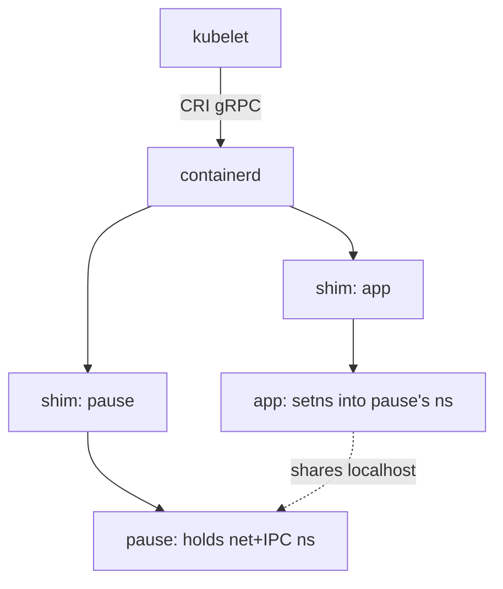

# Docker, containerd, runc

> **Goal:** untangle the container software stack. "Docker" is four programs
> in a trenchcoat; we'll meet each layer, see who really talks to the kernel,
> and place podman, Kubernetes, and the OCI standards on the map.

The [previous chapter](#/build-a-container) built a container by hand: a
`clone()` with `CLONE_NEW*` flags, a `pivot_root()`, a few cgroup writes, a
seccomp filter, an `execve()`. Everything from here up is *automation and
bookkeeping* around those same syscalls. No layer of the stack has a private
channel to the kernel that your shell script lacked. Keep that in mind as the
diagrams get taller: the kernel's view never changes, only the userspace
machinery that arranges the arguments.

## The stack, top to bottom

When you type `docker run nginx`, this is the chain of command:

```text
docker (CLI)                you type here
   │  REST API over /var/run/docker.sock
   ▼
dockerd                     the Docker daemon: API, images, volumes,
   │                        networks, builds, logs
   │  gRPC
   ▼
containerd                  the container lifecycle manager:
   │                        pulls images, manages snapshots (overlayfs),
   │                        starts/stops/supervises containers
   │  spawns (via a thin "shim" per container)
   ▼
runc                        the OCI runtime: performs THE EIGHT STEPS
   │                        (namespaces, cgroups, pivot_root, caps, seccomp)
   │                        then execve()s your process — and EXITS
   ▼
the kernel                  the only thing that was ever "running" containers
```

The division of labour:

| Layer | Job | If it dies… |
|---|---|---|
| `docker` CLI | UX: parse flags, call the API | nothing happens to containers |
| `dockerd` | API server, image builds, volumes, networks | containers keep running (live-restore) |
| `containerd` | image pulls, snapshots, container supervision | containers keep running (shim) |
| `containerd-shim` | tiny per-container babysitter: holds stdio, reports exit | (one per container; if it dies, container is orphaned) |
| `runc` | assemble isolation, exec the process, **exit immediately** | it's already gone |

Two facts that reorganize one's mental model:

- **runc is not a daemon.** It's a short-lived CLI that does the
  [build-a-container](#/build-a-container) chapter's work and vanishes.
  Nothing called "runc" runs while your container runs. That earlier chapter
  *was* the runtime chapter, spelled out.
- **Your container is not "inside" anything.** It's an ordinary process,
  parented by a small shim, supervised by containerd. `pstree` makes it
  concrete:

```bash
docker run -d --name web nginx
pstree -p | grep -A2 containerd
# containerd-shim(…)───nginx(…)───nginx(…)    ← no dockerd in the ancestry!
```

(That's also why `dockerd` can restart — or crash — without killing your
containers: the `live-restore` option, possible only because of the shim
design.)

### Why the shim exists

The shim solves a fundamental disconnect: runc finishes its job, execs the
container, and exits. But someone needs to:

- Be the container's parent (for `wait()` and exit-status collection).
- Hold the container's stdin/stdout/stderr open across restarts.
- Report the exit code back to containerd.

Without the shim, containerd itself would need to be the parent — and a
containerd restart would orphan (and re-parent to PID 1) every container,
losing exit codes and stdio. The shim is the decoupling layer:
runc → shim → container. It also handles the `docker attach` protocol (the
io streams, over a pty or fifo pair) and publishes the exit event.

The modern shim is `containerd-shim-runc-v2`, one process per container. It is
deliberately tiny — a few MiB of resident memory — because on a busy node you
will have hundreds of them. When the container's main process exits, the shim
reaps it (it is `subreaper`, set via `prctl(PR_SET_CHILD_SUBREAPER)`), records
the status, and hands it to containerd over a socket.

```bash
# See the shim's relationship to the container:
ls -l /proc/$(pgrep -f nginx | head -1)/fd/1  # stdout is a pipe/pty via the shim
grep PPid /proc/$(pgrep -f containerd-shim | head -1)/status  # shim → containerd child
```

**Container link:** the shim being the subreaper is exactly the PID 1
re-parenting behaviour from the [Processes & Threads](#/processes) chapter,
used on purpose. Whoever sets `PR_SET_CHILD_SUBREAPER` inherits orphans in its
subtree instead of them flying up to the real init.

## What runc actually does, step by step

runc is where software meets syscall. Given an OCI *bundle* — a directory with
a `rootfs/` and a `config.json` — it performs the eight steps from the
[build-a-container](#/build-a-container) chapter, in a specific order that
matters:

1. **Parse `config.json`** into a spec struct. Every isolation knob is here as
   JSON: the namespace list, mounts, the capability sets, the seccomp program,
   the cgroup limits, `oomScoreAdj`, `noNewPrivileges`.
2. **Create namespaces.** runc re-executes itself as a helper (`runc init`)
   using `clone()`/`unshare()` with the requested `CLONE_NEW*` flags. This is
   why runc is written with a C constructor (`nsenter`) that runs *before* the
   Go runtime starts — the Go scheduler spawns threads, and you cannot
   `unshare(CLONE_NEWUSER)` once a process is multithreaded.
3. **Join existing namespaces** with [setns()](https://man7.org/linux/man-pages/man2/setns.2.html)
   when the spec says "share the pod's net namespace" (see pods, below).
4. **Set up the rootfs**: bind/mount the requested filesystems, then
   `pivot_root()` into `rootfs/` and `umount` the old root, so the container
   cannot see the host tree. Details in [Images & OverlayFS](#/overlayfs).
5. **Apply cgroup limits** by writing the container's `cgroup.procs`, `memory.max`,
   `cpu.max`, etc. under the [cgroup v2](#/cgroups) hierarchy.
6. **Drop capabilities** to the bounding/effective sets in the spec, and set
   `no_new_privs` via `prctl(PR_SET_NO_NEW_PRIVS)`.
7. **Install the seccomp filter** — a classic-BPF program loaded with
   `seccomp(SECCOMP_SET_MODE_FILTER)`.
8. **`execve()` the entrypoint.** runc's job is done; the `runc init` helper
   is *replaced* by your process, and the parent `runc` returns 0 and exits.

The ordering is security-critical: `no_new_privs` must be set before seccomp
(the kernel requires it for unprivileged filter installation), and capabilities
are dropped before the final exec so the payload never briefly holds them.

```bash
# Watch runc make its syscalls, with no Docker in the picture:
mkdir -p bundle/rootfs && cd bundle
runc spec                                    # writes a default config.json
sudo strace -f -e trace=clone,clone3,unshare,setns,pivot_root,mount,seccomp,capset \
     runc run demo 2>&1 | less
```

The runtime spec also defines a **container lifecycle** — `creating` →
`created` → `running` → `stopped` — and **hooks** that fire at the transitions
(`createRuntime`, `createContainer`, `startContainer`, `poststart`,
`poststop`). This is not academic: it is how `docker run` splits into
`runc create` (build everything, block just before exec) and `runc start`
(release the exec), and how higher layers inject networking. containerd's CNI
plugin, for instance, runs in the gap between create and start, wiring the veth
into the already-created network namespace before the payload's first
instruction. `runc create` + `runc start` is what the shim actually invokes;
`runc run` is a convenience that fuses the two.

**crun**, the C rewrite, does the identical dance but starts a container in
single-digit milliseconds versus runc's tens of milliseconds — it avoids the Go
runtime entirely and issues `clone3()` directly. On a node churning through
thousands of short-lived containers (CI, serverless), that latency and its
lower per-launch memory add up.

## Inside containerd

containerd is the layer people run into least and depend on most: it is the
default runtime under both Docker and most Kubernetes clusters. It is worth
knowing its internal division, because it is not one blob but a set of gRPC
services you can talk to individually:

- **Content store** — a content-addressed blob store under
  `/var/lib/containerd/io.containerd.content.v1.content`. Every image layer,
  manifest, and config is a file named by its SHA-256 digest. Pulling an image
  is: fetch the manifest, read the layer digests, download any not already
  present. Two images that share a base layer share the blob on disk — the
  dedup is inherent to content addressing, not a special feature.
- **Snapshotter** — turns those read-only layer blobs into a writable rootfs.
  The default `overlayfs` snapshotter stacks the layers as
  [OverlayFS](#/overlayfs) lowerdirs and gives the container a fresh upperdir.
  Alternatives (`native`, `devmapper`, `stargz` for lazy-pulling) plug in via
  the same interface.
- **Runtime / task service** — creates the shim, hands it the OCI bundle, and
  tracks the container as a *task*. "Container" (metadata) and "task" (a
  running process) are separate objects in containerd's model; you can create a
  container's bundle without starting a task.

Every containerd object lives in a **namespace** (containerd's own concept,
unrelated to kernel namespaces): Docker's containers live under `moby`,
Kubernetes' under `k8s.io`. That is why `ctr` needs `--namespace moby` to see
Docker's containers.

```bash
# Explore containerd's stores directly:
sudo ctr --namespace moby images ls          # images containerd knows
sudo ls /var/lib/containerd/io.containerd.content.v1.content/blobs/sha256 | head
sudo ctr --namespace moby snapshots ls       # the overlay snapshots per container
```

containerd talks to the shim over **TTRPC**, a lean gRPC variant designed for
local sockets with minimal overhead — appropriate because the shim is spawned
per container and must stay tiny.

## OCI: the standards that decoupled everything

The **Open Container Initiative** (2015) froze the formats, ending the
docker-or-nothing era:

- **OCI Image Spec** — what an image is: layer tarballs + a config blob +
  a manifest, addressed by SHA-256 digest (you met it in
  [Images & OverlayFS](#/overlayfs)).
- **OCI Runtime Spec** — what a runtime must do: given a `config.json`
  (namespaces, mounts, caps, seccomp, cgroup values — every knob from the
  [build-a-container](#/build-a-container) chapter, as JSON) and a rootfs dir,
  create the container.
- **OCI Distribution Spec** — the registry HTTP API (push/pull/manifest),
  the `/v2/` endpoints every registry serves.

You can drive the bottom layer yourself, no Docker anywhere:

```bash
mkdir -p bundle/rootfs                        # rootfs: e.g. the alpine untar
cd bundle && runc spec                        # generates a default config.json
less config.json     # ← namespaces, capabilities, seccomp… all the knobs, in JSON
sudo runc run mycontainer                     # a container. From a JSON file.
```

Because of OCI, the pieces are swappable:

- **Other OCI runtimes** drop in below containerd: `crun` (C, faster than
  runc's Go), **gVisor**'s `runsc` (syscalls served by a user-space kernel in
  Go — the container's syscalls hit a seccomp-based **systrap** interceptor
  (the default since 2023; KVM optional, the old ptrace platform deprecated),
  not the host kernel directly), **Kata Containers** (each container in a lightweight
  micro-VM with its own guest kernel) — the
  [What a Container Actually Is](#/containers-overview) chapter's security
  spectrum, sold as products.
- **Other image builders** (buildah, kaniko, bazel's rules_oci, ko) and
  **registries** all interoperate because they all speak OCI.

```bash
# See which runtimes containerd knows about, then run under crun:
sudo apt install crun
containerd config default | grep -A2 runtimes  # runtime handlers
docker run --runtime=crun alpine echo hello    # same image, different runtime
```

## podman and the daemonless model

**podman** = the Docker UX without the central daemon and (optionally) without
root:

```text
docker:  CLI → dockerd (root) → containerd → runc → process
podman:  CLI ──────────────────────────────→ runc → process (your child!)
```

- **No daemon.** Each `podman run` forks a `conmon` (the podman equivalent of
  the shim) which execs runc; the container is a descendant of *your* command,
  or of a tiny per-user service for `-d`/`--restart`. Podman does **not**
  require systemd — it runs standalone fine — but when systemd is present, the
  modern integration path is **Quadlet**, which generates systemd unit files
  declaratively from `.container` descriptions. The older
  `podman generate systemd` command still works but is deprecated in favour of
  Quadlet.
- **Rootless.** Podman leans on user namespaces (see [Namespaces](#/namespaces)):
  container UID 0 maps to your unprivileged host UID, and a range of subordinate
  UIDs (from `/etc/subuid`, wired up by the setuid helper `newuidmap`) map the
  rest. You cannot create a veth pair as non-root, so networking goes through a
  user-space packet relay — **pasta** (the modern default) or the older
  slirp4netns. The CLI is intentionally identical (`alias docker=podman` mostly
  works).
- **Its own network stack.** Since Podman 4.0, wiring the netns is done by
  **netavark**, with **aardvark-dns** answering container-name lookups — a
  purpose-built Rust stack that replaced the Kubernetes-oriented CNI plugins.
- When systemd is present, Quadlet-managed containers become regular systemd
  services (`systemctl --user status <container>`), gaining restart policy and
  socket activation for free.

Docker gained a rootless mode too (`dockerd-rootless-setuptool.sh`), which runs
the whole dockerd → containerd → runc stack inside a single user namespace.
Rootless is not free: without `CAP_NET_ADMIN` on the host you lose real veth
networking and fall back to a user-space relay (measurable throughput cost on
high-bandwidth flows), and some workloads that expect to `mount` or tweak
sysctls need extra configuration. The architectural lesson still matters more
than the brand: *the daemon was never
necessary* — the kernel has no concept of a "container daemon", only of the
process that called `clone()`.

**Container link:** rootless containers are the sharpest demonstration of the
[user namespace](#/namespaces) from that chapter — "root inside, nobody
outside" is not a metaphor, it is `uid_map`/`gid_map` doing translation on
every credential check.

## Where Kubernetes plugs in

Kubernetes never talked to "Docker" conceptually — it needs only "start these
containers, grouped in pods". The **kubelet** speaks **CRI** (Container
Runtime Interface, a gRPC API) to:

```text
kubelet ──CRI──► containerd (with its CRI plugin)  ──► runc/crun → processes
            or ► CRI-O (a CRI-native slim alternative) ──► runc/crun
```

The 2020 "Kubernetes drops Docker support!" panic, decoded: kubelet stopped
using the *dockershim* adapter that translated CRI → dockerd. The images are
OCI, identical, built by anything; only a middleman daemon left the call path.
Nothing about anyone's images changed.

A **pod**, kernel-wise, is elegant: containers that **share** the net + IPC
(and optionally PID) namespaces while keeping their own mnt namespaces. The
shared net namespace is held open by a parked "pause" container — a process
that does nothing but `pause()` forever. That is why containers in a pod reach
each other on `localhost`: they are literally in the same network namespace,
sharing one loopback and one set of interfaces. See
[Container Networking](#/container-networking) for how that namespace gets
its veth.



The mechanism is step 3 of runc above: the app container is created with
`setns()` joining the pause container's already-created network and IPC
namespaces, rather than `unshare`-ing fresh ones.

```bash
# See the pause container on a K8s node:
crictl pods                                    # list pods (via CRI)
crictl inspect <pod-id> | jq '.status.linux.namespaces'
```

## Where checkpoint/restore plugs in

The creation path ends in `execve()`, but the same runtime boundary also
exposes a way to serialize a task that is already running. `runc checkpoint`
does not contain a second checkpoint implementation: libcontainer starts CRIU
as a service worker and sends it a protobuf RPC describing the container and
the requested options. CRIU freezes and dumps the process tree; runc supplies
the container context CRIU cannot infer safely on its own, such as external
mounts, namespace relationships, and cgroup handling.

The higher layers add progressively wider state:

```text
kubelet checkpoint API / podman checkpoint
    → containerd or CRI-O: container metadata, writable layer, network setup
        → runc or crun: OCI bundle, namespaces, cgroups, external mounts
            → CRIU: tasks, VMAs/pages, fds, sockets, timers, credentials
```

That division is the important idea. A **process checkpoint** is mostly Linux
kernel state; a **container checkpoint** also needs the engine's filesystem
and configuration state. This is why copying a CRIU image directory alone is
not automatically a portable container migration.

The interfaces mirror the ordinary start path:

- `runc checkpoint` / `runc restore` are the low-level OCI-runtime commands.
- podman provides the mature operator workflow, including
  `podman container checkpoint --export` and cross-host import.
- the kubelet exposes `POST /checkpoint/{namespace}/{pod}/{container}` and
  forwards the request through CRI to a runtime that implements the checkpoint
  RPC. It creates a runtime-defined checkpoint archive; Kubernetes does not
  offer a symmetric restore endpoint.

Do not memorize the product commands yet. [The Anatomy of Process
State](#/process-state) first defines what must be captured; the CRIU dump and
restore chapters explain the mechanism; [The Snapshot
Taxonomy](#/snapshot-taxonomy) then returns to this integration chain and
compares it with gVisor, microVM, and application-level snapshots.

## Follow the code (kernel v6.12)

Two paths turn a runtime's intentions into kernel state: **creating** fresh
namespaces (the common `docker run` case) and **joining** an existing one (the
pod / `setns` case).

**Path 1 — `clone(CLONE_NEWNS | CLONE_NEWPID | …)` creates a container's
namespaces.** When `runc init` (or crun) issues the clone, the syscall lands in
[kernel_clone()](https://elixir.bootlin.com/linux/v6.12/C/ident/kernel_clone),
which calls
[copy_process()](https://elixir.bootlin.com/linux/v6.12/C/ident/copy_process)
to build the new `task_struct`. Namespace duplication happens in
[copy_namespaces()](https://elixir.bootlin.com/linux/v6.12/C/ident/copy_namespaces):
if any `CLONE_NEW*` flag is set it calls
[create_new_namespaces()](https://elixir.bootlin.com/linux/v6.12/C/ident/create_new_namespaces),
which allocates a fresh
[struct nsproxy](https://elixir.bootlin.com/linux/v6.12/C/ident/nsproxy) — the
per-task container of namespace pointers. The fields that matter:

- `count` — refcount; a namespace lives while any task points at it (this is
  why the pause container keeps the pod's net ns alive).
- `mnt_ns`, `uts_ns`, `ipc_ns`, `pid_ns_for_children`, `net_ns`, `cgroup_ns`,
  `time_ns` — one pointer per namespace type. For each flag set,
  `create_new_namespaces()` calls the type's `copy_*` (e.g. `copy_mnt_ns`,
  `copy_pid_ns`); for each flag *unset*, it bumps the parent's refcount and
  shares it. A container is just a task whose `nsproxy` mixes fresh and
  inherited namespaces.

The user namespace is special: it hangs off
[struct cred](https://elixir.bootlin.com/linux/v6.12/C/ident/cred) (the
`user_ns` field), not `nsproxy`, because it governs credential translation
itself.

**Path 2 — `setns()` joins the pod's namespace.** The app container's
`setns(fd, CLONE_NEWNET)` enters
[validate_nsset()](https://elixir.bootlin.com/linux/v6.12/C/ident/validate_nsset),
which checks the caller has `CAP_SYS_ADMIN` **in the target namespace's owning
user namespace** — the permission model that makes rootless pods safe. On
success the kernel swaps the pointers via
[switch_task_namespaces()](https://elixir.bootlin.com/linux/v6.12/C/ident/switch_task_namespaces),
installing the pause container's `net_ns` into the caller's `nsproxy`. From that
instant the app shares the pod's loopback and interfaces — no packets moved,
just a pointer.

**And the pivot.** runc's rootfs switch is
[pivot_root()](https://elixir.bootlin.com/linux/v6.12/C/ident/pivot_root): it
makes the bundle's `rootfs/` the process's root and moves the old root to a
directory it then unmounts, so `/proc/self/root` can never walk back to the
host tree. Because the mount namespace was cloned first (step 4 after step 2),
this rearrangement is invisible to everything outside the container.

Finally, the seccomp filter installed in step 7 is consulted on **every**
syscall the container makes thereafter, in
[__secure_computing()](https://elixir.bootlin.com/linux/v6.12/C/ident/__secure_computing) —
a runtime tax of roughly tens of nanoseconds per syscall for a typical filter,
paid for the life of the process. This is [eBPF](#/ebpf-internals)'s older
cousin, classic BPF, running in the syscall entry path.

## Choosing tools, practically

- **Docker** — ubiquitous, best onboarding, Compose for local dev. Fine
  default on dev machines and simple deployments.
- **podman** — daemonless/rootless; the natural choice on servers managed by
  systemd, and on RHEL-family distros. `podman kube play` runs K8s pod YAML
  locally.
- **containerd + nerdctl** — what you are often *actually* running under
  Docker/K8s; `nerdctl` gives it a Docker-compatible CLI. Lightweight,
  production-grade.
- **crun / gVisor / Kata** — swap-in runtimes for speed / syscall isolation /
  VM-grade isolation respectively. See [Security & Confinement](#/security-hardening).
- **Firecracker + containerd** — the AWS Fargate/Lambda model: a micro-VM per
  container (boots in ~125 ms), as fast to start as a container, isolated as a
  VM. Built on [KVM](#/kvm-internals).

They all converge on the same OCI bundle and the same eight steps against the
same kernel. The differences are ergonomics, trust boundaries, and performance
characteristics — not kinds of magic.

### A real-world profile: what runs on a K8s node

```bash
ps auxf | grep -E 'containerd|runc|shim'
# /usr/bin/containerd
#  \_ containerd-shim-runc-v2 -namespace k8s.io -id <pod-id>
#      \_ /pause                          ← the infrastructure container
#      \_ /usr/local/bin/myapp            ← your workload
# The shim is the parent. Containerd is the grandparent. No dockerd anywhere.
# runc? Long gone — it exited milliseconds after execve().
```

## Try it yourself

```bash
docker info | grep -A3 'Runtimes'         # see runc registered, maybe crun/runsc
pstree -p | grep -B1 -A2 shim             # find your containers' real parents
sudo ctr --namespace moby containers ls   # talk to containerd directly,
                                          # behind dockerd's back
sudo ctr --namespace moby tasks ls        # list running tasks via containerd
runc spec --help; runc list               # the OCI runtime CLI, standalone
# Peek at a live container's namespace inodes and compare to the host:
CPID=$(docker inspect -f '{{.State.Pid}}' web)
sudo ls -l /proc/$CPID/ns                 # net/pid/mnt/... each an inode
sudo ls -l /proc/1/ns                     # host's — different inodes = isolated
# Rootless Docker prerequisites:
dockerd-rootless-setuptool.sh check
```

## Check your understanding

1. `dockerd` crashes. What happens to running containers, and which design choice makes that possible?

<details><summary>Show answer</summary>

They keep running. The `containerd-shim-runc-v2` process, not dockerd, is each
container's parent and holds its stdio and namespace references open. This
decoupling (plus the `live-restore` option) is exactly why dockerd can restart
without taking containers down.

</details>

2. What exactly does runc do, and for how long does it run?

<details><summary>Show answer</summary>

It reads `config.json`, creates/joins namespaces (`clone`/`unshare`/`setns`),
applies cgroup limits, `pivot_root`s into the rootfs, drops capabilities, sets
`no_new_privs`, installs the seccomp filter, then `execve()`s the entrypoint and
exits. It runs for milliseconds; nothing named runc is alive while your
container runs.

</details>

3. In kernel terms, what is a Kubernetes pod, and why can its containers reach each other on `localhost`?

<details><summary>Show answer</summary>

A set of processes sharing net + IPC (and optionally PID) namespaces while each
keeps its own mnt namespace. A "pause" container creates and pins the shared net
namespace; the other containers join it with `setns()`. Sharing one network
namespace means one loopback interface, so they see each other on `localhost`.

</details>

4. Why must runc set `no_new_privs` before installing the seccomp filter?

<details><summary>Show answer</summary>

The kernel requires `PR_SET_NO_NEW_PRIVS` to be set before an unprivileged
process may install a seccomp filter (otherwise a filtered process could still
gain privileges via a setuid binary and escape the intent of the filter). The
ordering — caps dropped, `no_new_privs` set, seccomp loaded, then `execve` — is
security-critical.

</details>

5. Why can podman do its job without any daemon?

<details><summary>Show answer</summary>

Because the kernel has no notion of a container daemon — a container is just a
process created by `clone()` with namespace flags. Podman forks a small
`conmon` that execs runc directly, making the container a descendant of your
command. The daemon in Docker's design is bookkeeping, not a kernel requirement.

</details>

6. What runtime cost does a container's seccomp filter impose, and where in the kernel is it paid?

<details><summary>Show answer</summary>

Every syscall the container makes is screened by
[__secure_computing()](https://elixir.bootlin.com/linux/v6.12/C/ident/__secure_computing)
running the classic-BPF filter in the syscall entry path — on the order of tens
of nanoseconds per syscall for a typical filter, for the life of the process.

</details>

7. The "Kubernetes drops Docker" change of 2020 — what actually changed in the call path, and what did not?

<details><summary>Show answer</summary>

kubelet stopped shipping the *dockershim* adapter that translated CRI to
dockerd; it now speaks CRI straight to containerd or CRI-O. Images are OCI and
unchanged, built by any tool, run by the same runc/crun. Only a middleman daemon
left the path.

</details>

8. Where does CRIU sit in the container checkpoint stack, and why is its image
directory not sufficient by itself for cross-host container migration?

<details><summary>Show answer</summary>

runc or crun invokes CRIU at the bottom of the stack. CRIU serializes the
process tree's kernel state: memory, fds, sockets, timers, credentials, and so
on. The container engine must additionally preserve or reconstruct the OCI
configuration, writable rootfs layer, external mounts, namespaces, cgroups,
and network identity. A portable container checkpoint therefore wraps CRIU's
images with engine-owned state.

</details>

## Sources & further reading

- OCI Runtime Specification — <https://github.com/opencontainers/runtime-spec>
- OCI Image Specification — <https://github.com/opencontainers/image-spec>
- runc (the reference OCI runtime) — <https://github.com/opencontainers/runc>
- containerd architecture docs — <https://github.com/containerd/containerd/tree/main/docs>
- Kubernetes CRI overview — <https://kubernetes.io/docs/concepts/architecture/cri/>
- Kubernetes Kubelet Checkpoint API — <https://kubernetes.io/docs/reference/node/kubelet-checkpoint-api/>
- CRIU integration in runc — <https://github.com/opencontainers/runc/blob/main/libcontainer/criu_linux.go>
- Podman checkpoint/restore — <https://docs.podman.io/en/latest/markdown/podman-container-checkpoint.1.html>
- `setns(2)` man page — <https://man7.org/linux/man-pages/man2/setns.2.html>
- `pivot_root(2)` man page — <https://man7.org/linux/man-pages/man2/pivot_root.2.html>
- `seccomp(2)` man page — <https://man7.org/linux/man-pages/man2/seccomp.2.html>

---

**Next:** the last assembly chapter — wiring containers to the network:
veth, bridges, NAT, port publishing, and DNS. See
[Container Networking](#/container-networking).
