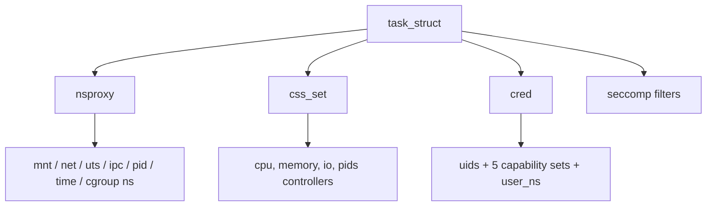

# What a Container Actually Is

> **Goal:** dismantle the magic. By the end of this chapter you'll be able to
> state precisely what a container is, what it is *not*, and which kernel
> features (each getting its own chapter next) combine to make one.

## The one-sentence truth

> **A container is just a normal Linux process (or process tree) that the
> kernel is lying to.**

There is no "container" object in the kernel. No container subsystem, no
special execution mode, no hypervisor. If you search the kernel source for a
container data type, you won't find one — grep the v6.12 tree for
`struct container` and you get device-tree helpers and an ACPI driver, nothing
process-related. What exists is a set of independent kernel features that,
*combined*, give a process:

1. a **restricted view** of the system — it sees its own PIDs, hostname,
   network interfaces, mounts (→ **namespaces**);
2. a **restricted share** of resources — capped CPU, memory, I/O
   (→ **cgroups**);
3. a **different filesystem** as its `/` — assembled from image layers
   (→ **OverlayFS** + `pivot_root`);
4. **reduced privileges** — dropped capabilities, filtered syscalls
   (→ capabilities, **seccomp**, LSMs).

"Container" is the *marketing name for this combination*. Docker's true
innovation wasn't isolation technology — it was packaging (images, layers,
registries) and developer experience. Every isolation primitive it used
already existed in the mainline kernel; runc today is roughly 15,000 lines of
Go whose job is to arrange these primitives in the right order and get out of
the way.

## What the kernel actually stores

If a container is a process the kernel is lying to, the lies must live
somewhere. They live in four pointers hanging off
[`struct task_struct`](https://elixir.bootlin.com/linux/v6.12/C/ident/task_struct) —
the per-process descriptor you met in [Processes & Threads](#/processes).
Every "containerization" of a process is just these pointers pointing at
something other than the host defaults:

- **`task->nsproxy`** — a
  [`struct nsproxy`](https://elixir.bootlin.com/linux/v6.12/C/ident/nsproxy),
  a tiny reference-counted bundle of namespace pointers: `mnt_ns`, `net_ns`,
  `uts_ns`, `ipc_ns`, `pid_ns_for_children`, `time_ns`, `time_ns_for_children`,
  `cgroup_ns`, plus an atomic `count`. Two processes in "the same container"
  typically share one `nsproxy`; the host's init and your shell share a
  different one. Note what's *not* in there: the user namespace lives in
  `task->cred->user_ns`, and the PID namespace a task *itself* belongs to is
  reachable through its `struct pid`, not through `nsproxy` (more on that
  below). The whole `nsproxy` is a refcount plus 8 pointers — about 72 bytes — and it's shared
  by pointer, so putting a thousand tasks in one container costs one `nsproxy`,
  not a thousand.
- **`task->cgroups`** — a pointer to a
  [`struct css_set`](https://elixir.bootlin.com/linux/v6.12/C/ident/css_set),
  the set of cgroup subsystem states (CPU, memory, io, pids…) this task is
  charged against. Moving a process into a container's cgroup means swapping
  this pointer; the kernel interns `css_set`s in a hash table, so all tasks
  with the *same* controller membership share one.
- **`task->cred`** — a
  [`struct cred`](https://elixir.bootlin.com/linux/v6.12/C/ident/cred) holding
  the UIDs/GIDs plus five capability sets (`cap_effective`, `cap_permitted`,
  `cap_inheritable`, `cap_bset`, `cap_ambient`) and the owning `user_ns`.
  "Root inside the container isn't root outside" is literally: `euid == 0`,
  but in a `user_ns` whose UID 0 maps to, say, host UID 100000.
- **`task->seccomp`** — a
  [`struct seccomp`](https://elixir.bootlin.com/linux/v6.12/C/ident/seccomp)
  with a `mode` and a pointer to a chain of
  [`struct seccomp_filter`](https://elixir.bootlin.com/linux/v6.12/C/ident/seccomp_filter)
  BPF programs, evaluated on every syscall entry.



Each namespace object embeds a
[`struct ns_common`](https://elixir.bootlin.com/linux/v6.12/C/ident/ns_common)
carrying three things that matter: an `atomic_long_t count` (the reference
count), a pointer to a
[`struct proc_ns_operations`](https://elixir.bootlin.com/linux/v6.12/C/ident/proc_ns_operations)
(the per-type vtable — `get`, `put`, `install`, `owner`), and an `inum`, an
inode number from the internal `nsfs` filesystem. That inode number is exactly
what you see in `/proc/<pid>/ns/net -> net:[4026531840]`. "Same namespace" is
defined as "same inode number", which is how tools like `lsns` and container
runtimes compare them.

The reference count is why a namespace can outlive every process in it. A
namespace is freed only when its `count` hits zero, and a process is not the
only thing that can hold a reference: an open file descriptor on
`/proc/<pid>/ns/net`, or a bind-mount of that path, pins it too. This is the
mechanism behind `ip netns add` (which bind-mounts the namespace under
`/var/run/netns/`) and behind the Kubernetes "pause" container discussed below.

As of 6.12 there are **8 namespace types**: mount (2.4.19, 2002), UTS
(2.6.19), IPC (2.6.19), PID (2.6.24, 2008), network (2.6.24), user (usable
unprivileged since 3.8, 2013), cgroup (4.6, 2016), and time (5.6, 2020).
Everything else about "container isolation" is composition of these plus
cgroups. Details and try-it-yourself for each: [Namespaces](#/namespaces).

## How the four pointers get set: one syscall

There is no `create_container()` syscall. A runtime builds a container with the
same two calls it would use to spawn any process — the container-ness is
entirely in the flags:

- [clone(2)](https://man7.org/linux/man-pages/man2/clone.2.html) /
  `clone3(2)` with `CLONE_NEW*` flags creates a child *and* its new
  namespaces in one shot. This is what runc uses.
- [unshare(2)](https://man7.org/linux/man-pages/man2/unshare.2.html) moves the
  *caller* into new namespaces without forking (mostly — the PID caveat below).
- [setns(2)](https://man7.org/linux/man-pages/man2/setns.2.html) joins an
  *existing* namespace given a file descriptor to it — the "enter a running
  container" operation (`docker exec`, `nsenter`, Kubernetes pods).

The eight flags map one-to-one onto the namespace types: `CLONE_NEWNS`
(mount — the odd name is historical, "NS" meant "namespace" before there were
others), `CLONE_NEWUTS`, `CLONE_NEWIPC`, `CLONE_NEWPID`, `CLONE_NEWNET`,
`CLONE_NEWUSER`, `CLONE_NEWCGROUP`, `CLONE_NEWTIME`. Ordering constraints
matter: `CLONE_NEWUSER` is applied first so the new (unprivileged-on-the-host)
process still has full capabilities *inside* its fresh user namespace, which is
what lets a rootless runtime create the other seven without being real root.

```bash
# The flags, made visible. Each --flag is one CLONE_NEW* bit.
sudo unshare --uts --fork --pid --mount-proc bash -c 'hostname box; hostname'
# 'box' — a private UTS namespace, one string changed, host hostname untouched.
```

## A brief history of containerization on Linux

Containers didn't start with Docker. The ingredients accumulated over decades:

- **1979**: `chroot` appears in Version 7 Unix — change the root directory
  for a process. The first "jail" (and famously *not* a security boundary).
- **2000**: FreeBSD Jails — chroot + process isolation + network isolation.
  A real container, before the word existed.
- **2001**: Linux-VServer — OS-level virtualization with separate process
  spaces, as an out-of-tree patch, before namespaces existed upstream.
- **2002**: the **mount namespace** lands in Linux 2.4.19 — the first
  namespace, modeled on Plan 9's per-process namespaces.
- **2005**: Solaris Zones (Solaris 10) — a complete container system with
  resource controls and ZFS snapshots. Years ahead.
- **2006**: Google engineers propose **"process containers"** (renamed
  **cgroups** to avoid overloading "container"); merged in 2.6.24 (January
  2008). Born from the needs of Borg.
- **2006–2008**: Eric Biederman and others upstream the big **namespaces**:
  UTS and IPC in 2.6.19, PID and network in 2.6.24.
- **2008**: **LXC (Linux Containers)** — the first full mainline-Linux
  container system, using namespaces and cgroups directly.
- **2013**: **Docker** — initially LXC under the hood (it switched to its own
  libcontainer in 0.9, 2014), adding images, layers, a registry, and an
  elegant UX. User namespaces become fully usable in 3.8 the same year.
- **2014**: **OverlayFS** is merged in 3.18 — the union filesystem that
  becomes the default image backend ([Images & OverlayFS](#/overlayfs)).
- **2016**: **cgroup v2** is declared stable in 4.5. It becomes the systemd
  default across distros from ~2019 (Fedora 31) onward; Docker supports it
  since 20.10. On a modern distro, v2 is what you're running
  ([Control Groups (cgroup v2)](#/cgroups)).
- **2018+**: **Kubernetes** becomes the orchestrator; rootless containers
  (podman), user namespaces everywhere, and eBPF-based networking
  ([eBPF Internals](#/ebpf-internals)) emerge.

The historical arc: the kernel added primitive features; each wave of
tooling composed them more ergonomically. The primitives haven't changed
fundamentally — they only became more powerful and better integrated.

## Prove it to yourself in 30 seconds

Run a container and look at it *from the host*:

```bash
docker run -d --name test nginx
ps aux | grep nginx        # ← there it is. A regular process. On YOUR host.
```

The nginx "inside" the container appears in the host's process list with a
normal host PID. Same kernel, same EEVDF scheduler (which replaced CFS in 6.6
— see [CPU Scheduling](#/scheduling)), same `task_struct`. From inside the
container it thinks it's PID 1; from outside it's PID 48213. That double
vision — one process, two views — is namespaces at work, nothing more.

```bash
docker exec test ps aux    # inside: nginx is PID 1, alone in the world
uname -r; docker exec test uname -r    # identical: SAME kernel
PID=$(docker inspect -f '{{.State.Pid}}' test)
cat /proc/$PID/cgroup      # in the host's cgroup v2 tree
ls -l /proc/$PID/ns        # its namespaces, as inode numbers
ls -l /proc/self/ns        # yours — compare the numbers
lsns -p $PID               # the same story, one row per namespace
docker rm -f test
```

The `uname -r` line is the punchline: an Alpine container, an Ubuntu
container, and your Fedora host all report the same kernel version, because
**the kernel is never in the image**. Images contain only user space (the
[Kernel, User Space & Syscalls](#/kernel-vs-userspace) distinction paying
off): a libc, a shell, some binaries. And the `/proc/$PID/ns` listing shows
you the whole isolation state of the container as a handful of symlinks —
that's all there is. Any namespace whose inode number *matches* yours is one
the container is sharing with the host (by default, none of them are shared;
`--net=host` would make the network row match).

## Containers vs virtual machines

The comparison everyone needs once, precisely:

```text
   VIRTUAL MACHINE                    CONTAINER
┌──────────────────┐            ┌──────────────────┐
│ app              │            │ app              │
│ guest user space │            │ image user space │
│ GUEST KERNEL     │            │ (no kernel!)     │
├──────────────────┤            ├──────────────────┤
│ virtual hardware │            │                  │
│ hypervisor       │            │   HOST KERNEL    │  ← shared, namespaced
│ HOST KERNEL      │            │                  │
└──────────────────┘            └──────────────────┘
```

| | VM | Container |
|---|---|---|
| Isolation boundary | virtual *hardware*; guest runs its own kernel | kernel *API*; syscalls filtered & namespaced |
| Startup | seconds (boot a kernel + init) | ~100 ms for `runc` setup; the process itself is a sub-millisecond fork+exec |
| Overhead | GiBs (guest OS), RAM reserved up front | MiBs; just processes, and identical image layers share the page cache |
| Density | tens per host | hundreds–thousands per host |
| Can run another OS? | yes (Windows on Linux) | no — Linux user space only |
| Security boundary | strong (hardware-assisted: VT-x/EPT) | good but: **one kernel bug from escape** |

Two of those rows deserve expansion.

**Memory.** A VM's guest kernel manages its own page cache, so two VMs running
the same nginx binary cache it twice. Containers share one kernel and one page
cache ([Virtual Memory](#/memory)): if ten containers run the same image
layer, the `libc.so` inside it is one set of physical pages (4 KiB each on
x86-64 by default; arm64 kernels may be built for 4, 16, or 64 KiB pages),
mapped ten times. The kernel deduplicates by inode: OverlayFS presents the
lower layer as the *same* underlying file to all ten containers, so the page
cache keys on one inode and every mapping shares it copy-on-write. This — not
startup time — is the real density win, and it's why "1000 containers, 4 GiB
of RAM" is plausible while "1000 VMs, 4 GiB" is not.

**Security.** Every container on a host talks to one shared kernel through the
full syscall interface — roughly **375 syscalls on x86-64 as of 6.12**
(numbered up to 462 — the table has gaps). A
kernel vulnerability reachable from inside a container can mean escape to the
host: the boundary is a software API surface, not a hardware trap. This is why
high-stakes multi-tenant platforms wrap containers in micro-VMs
(**Firecracker** boots a stripped guest kernel in ~125 ms with <5 MiB overhead
per microVM; **Kata Containers** does the same with standard runtimes) or
interpose a user-space kernel (**gVisor**, which implements the syscall ABI
itself so the host kernel sees only a narrow set of calls) — and why
defense-in-depth (seccomp, dropped capabilities, user namespaces) is standard
practice rather than paranoia. The VM side of this story is
[KVM & Virtualization Internals](#/kvm-internals); the hardening side is
[Linux Security & Confinement](#/security-hardening).

```text
Container security spectrum:

bare container    (namespaces + limited caps)
  → + seccomp      (reduced syscall surface)
  → + user ns      (root inside ≠ root outside)
  → + gVisor       (user-space kernel, few host syscalls reachable)
  → + Kata/Firecracker (each container in its own micro-VM, full kernel isolation)
```

(Fun fact closing the loop: Docker Desktop on macOS/Windows runs a hidden
Linux VM, because containers *are* Linux processes and need a Linux kernel.)

## The ingredient list

Here is the full recipe — and the map of the next chapters:

| Ingredient | Kernel feature | Gives the container | Chapter |
|---|---|---|---|
| Own PIDs, hostname, mounts, network… | **namespaces** | its private *view* | [Namespaces](#/namespaces) |
| CPU/memory/IO limits | **cgroups v2** | its bounded *share* | [Control Groups (cgroup v2)](#/cgroups) |
| Its own `/` built from layers | **OverlayFS**, `pivot_root` | its *filesystem* | [Images & OverlayFS](#/overlayfs) |
| Reduced root | **capabilities** | no dangerous powers | [Build a Container by Hand](#/build-a-container) |
| Syscall filter | **seccomp-BPF** | smaller kernel attack surface | [Build a Container by Hand](#/build-a-container) |
| MAC policy | AppArmor/SELinux | belt-and-suspenders | [Linux Security & Confinement](#/security-hardening) |

A useful mental formula:

```text
container = namespaces (view)
          + cgroups    (share)
          + overlayfs  (disk)
          + seccomp/caps (security)
          + a process tree
```

Each ingredient is independent and usable alone — that's the beauty. systemd
uses cgroups for every service with zero namespaces (run
`systemd-cgls` and look). `unshare -n` gives you a network namespace with no
container in sight. Chrome sandboxes tabs with namespaces + seccomp. Once you
know the ingredients, you see them everywhere.

### The view: what each namespace hides

Quick preview of what [Namespaces](#/namespaces) covers in depth — for each
namespace, the specific lie it tells:

- **mount**: a private [`struct mnt_namespace`](https://elixir.bootlin.com/linux/v6.12/C/ident/mnt_namespace)
  holding a private tree of `struct mount` entries, so the container's `/` can
  be an overlay while the host's stays put. Copying a mount ns duplicates the
  mount tree, so cost scales with the number of mounts; mount *propagation*
  types (private/shared/slave, since 2.6.15) govern whether new mounts leak
  across the boundary.
- **PID**: a private
  [`struct pid_namespace`](https://elixir.bootlin.com/linux/v6.12/C/ident/pid_namespace)
  with its own IDR number allocator, nestable up to **32 levels deep**
  (`MAX_PID_NS_LEVEL`). The first process gets PID 1 and inherits PID-1 duties:
  reaping orphans, and dying takes the whole namespace with it — the kernel
  sends `SIGKILL` to every remaining member. Signals from an ancestor
  namespace to PID 1 are also restricted (only `SIGKILL`/`SIGSTOP` and
  installed handlers), which is why a naive app running as PID 1 ignores
  `Ctrl-C` and never reaps zombies (the "PID 1 problem" that `tini` exists to
  solve).
- **network**: a private
  [`struct net`](https://elixir.bootlin.com/linux/v6.12/C/ident/net) — interfaces,
  routing tables, netfilter rules, its own `lo` (down until you bring it up).
  Creating one is the most expensive namespace (single-digit milliseconds,
  because every registered `pernet_operations` init runs); connecting it to
  the world is [Container Networking](#/container-networking).
- **UTS**: hostname and domain name. Two strings. The cheapest lie.
- **IPC**: private System V IPC objects and POSIX message queues
  ([Pipes, FIFOs & Unix Sockets](#/ipc-pipes)).
- **user**: a UID/GID remapping table (`/proc/<pid>/uid_map`, up to 340
  ranges since 4.15). The privilege foundation for rootless containers, and the
  one namespace an unprivileged user is allowed to create — which is also why
  it has been a recurring source of privilege-escalation CVEs.
- **cgroup**: virtualizes the cgroup root the process sees in
  `/proc/self/cgroup`, so a container can't read the host's cgroup path.
- **time**: offsets for `CLOCK_MONOTONIC`/`CLOCK_BOOTTIME` (since 5.6) —
  mainly for checkpoint/restore, *not* for faking wall-clock time
  (`CLOCK_REALTIME` is deliberately not virtualized).

### The share: cgroups, one level deeper

cgroups charge every task's resource usage to its `css_set`. On cgroup v2 (the
default on modern distros) one unified tree carries all controllers. In the
kernel, a directory in `/sys/fs/cgroup` is a
[`struct cgroup`](https://elixir.bootlin.com/linux/v6.12/C/ident/cgroup), and
each enabled controller attaches a
[`struct cgroup_subsys_state`](https://elixir.bootlin.com/linux/v6.12/C/ident/cgroup_subsys_state)
("css") to it — the memory css *is* a
[`struct mem_cgroup`](https://elixir.bootlin.com/linux/v6.12/C/ident/mem_cgroup),
whose `page_counter` fields track and cap usage. A Docker container maps to a
directory like `/sys/fs/cgroup/system.slice/docker-<id>.scope` with interface
files:

- `memory.max` — hard limit in bytes. Exceed it under reclaim pressure and the
  OOM killer fires *inside the group*, killing a task in that container, not on
  the host at large (see
  [Lab: Trigger & Autopsy the OOM Killer](#/lab-oom-killer)). `memory.high` is
  the softer throttle: crossing it slows the group by forcing synchronous
  reclaim rather than killing.
- `cpu.max` — a `quota period` pair, e.g. `50000 100000` = 50 ms of CPU per
  100 ms window = half a core. Enforced by the scheduler's bandwidth throttler,
  which parks the group's runqueue when the quota is spent.
- `cpu.weight` — proportional share (default 100, range 1–10000) used when CPUs
  are contended but no hard cap is hit.
- `pids.max` — a ceiling on the number of tasks, the fork-bomb backstop.
- `io.max` — per-device bytes/sec and IOPS caps, keyed by `major:minor`.

The key v2 rule that trips people up is **no internal processes**: a cgroup
with child cgroups that enable controllers may not itself hold processes.
This forces the clean tree structure that makes accounting unambiguous. Try
[Lab: Throttle a Process with cgroup v2](#/lab-cgroup-limits) to feel it.

```bash
# Watch a live container's actual limits and usage.
PID=$(docker inspect -f '{{.State.Pid}}' some-container)
CG=/sys/fs/cgroup/$(cut -d: -f3 < /proc/$PID/cgroup)
cat "$CG"/memory.max "$CG"/memory.current "$CG"/cpu.max "$CG"/pids.current
```

### The security floor: capabilities + seccomp, with numbers

Root was split into **41 capabilities** as of 6.12 (`CAP_CHOWN` = 0 through
`CAP_CHECKPOINT_RESTORE` = 40; `CAP_LAST_CAP` = 40). A default Docker container
keeps only **14** of them (`CAP_CHOWN`, `CAP_NET_BIND_SERVICE`, `CAP_KILL`,
`CAP_SETUID`, `CAP_SETGID`…) and crucially drops `CAP_SYS_ADMIN` — the "new
root" that gates mount, most namespace tricks, BPF loading, and much more. A
capability check is one call to
[ns_capable()](https://elixir.bootlin.com/linux/v6.12/C/ident/ns_capable),
which tests a bit in `cred->cap_effective` *relative to a user namespace* — the
same bit means "can do X on the host" or "can do X only inside this container"
depending on which `user_ns` owns the resource.

On top of that, Docker's default **seccomp-BPF** profile blocks around 44 of
the ~375 x86-64 syscalls (`mount(2)`, `reboot(2)`, `kexec_load(2)`,
`open_by_handle_at(2)` — the last famously used in an early container-escape
exploit). The filter is a classic-BPF program stored in the
`struct seccomp_filter` chain; the kernel runs it on **every** syscall entry
via [__secure_computing()](https://elixir.bootlin.com/linux/v6.12/C/ident/__secure_computing),
returning one of `ALLOW`, `ERRNO`, `TRAP`, `KILL`, or `TRACE`. The cost is on
the order of tens of nanoseconds per syscall — cheap enough that it's on by
default, and the reason a filter should match with as few instructions as
possible.

```bash
# See exactly which caps and seccomp mode a running process has.
grep -E 'Cap|Seccomp' /proc/self/status
capsh --decode=$(grep CapEff /proc/self/status | awk '{print $2}')
```

### A note on pod architecture

A Kubernetes **pod** is a group of containers that share **network** and
**IPC** namespaces (and optionally PID). They reach each other on `localhost`.
This is achieved by: create the shared namespaces once, then start each
container's process inside them via `setns(2)`. A tiny "pause" container
(an infinite `pause()` in a few kilobytes of static binary) holds the shared
namespaces open — necessary because a namespace is freed when its `ns_common`
reference count reaches zero, and without the pause process the namespaces
would evaporate whenever an app container restarted. The pause container is the
reference holder that keeps the pod's identity stable across restarts. This is
why `localhost` works within a pod but not between pods.

## A 10-line container, as a teaser

Everything Part III will explain, compressed (run as root on any Linux box):

```bash
mkdir -p /tmp/rootfs && cd /tmp/rootfs
curl -sL https://dl-cdn.alpinelinux.org/alpine/v3.20/releases/x86_64/alpine-minirootfs-3.20.0-x86_64.tar.gz | tar xz

unshare --pid --fork --mount --uts --net --ipc \
        chroot /tmp/rootfs /bin/sh -c '
          mount -t proc proc /proc
          hostname my-container
          ps aux            # ← we are PID 1!
          sh'
```

No Docker installed, and you're inside something that walks and talks like a
container — because `unshare(2)` + a root filesystem *is* a container. Notice
the `--fork`: `unshare(CLONE_NEWPID)` deliberately does **not** move the
calling process into the new PID namespace (a process's PID is fixed at birth,
because too much code assumes `getpid()` never changes); it only sets
`nsproxy->pid_ns_for_children`, so the *next child* becomes PID 1. The
[Build a Container by Hand](#/build-a-container) chapter does all of this
properly (pivot_root instead of the escapable chroot, cgroups, caps, seccomp —
the full assembly) and explains every line.

## Follow the code (kernel v6.12)

Three short traces make the "kernel is lying" claim concrete. Follow along in
the source — the namespace plumbing lives in
[kernel/nsproxy.c](https://elixir.bootlin.com/linux/v6.12/source/kernel/nsproxy.c)
and [kernel/fork.c](https://elixir.bootlin.com/linux/v6.12/source/kernel/fork.c).

**Trace 1: `unshare --pid --net` — building the lie.**

1. The `unshare(2)` syscall lands in
   [ksys_unshare()](https://elixir.bootlin.com/linux/v6.12/C/ident/ksys_unshare)
   (kernel/fork.c). It validates the flag combination (e.g. `CLONE_NEWUSER`
   forces `CLONE_THREAD | CLONE_FS`), then calls
   [unshare_nsproxy_namespaces()](https://elixir.bootlin.com/linux/v6.12/C/ident/unshare_nsproxy_namespaces).
2. That calls
   [create_new_namespaces()](https://elixir.bootlin.com/linux/v6.12/C/ident/create_new_namespaces)
   (kernel/nsproxy.c), which allocates a fresh `struct nsproxy` and fills each
   slot by either taking a reference on the old namespace (flag not set) or
   creating a new one:
   [copy_mnt_ns()](https://elixir.bootlin.com/linux/v6.12/C/ident/copy_mnt_ns),
   [copy_utsname()](https://elixir.bootlin.com/linux/v6.12/C/ident/copy_utsname),
   [copy_ipcs()](https://elixir.bootlin.com/linux/v6.12/C/ident/copy_ipcs),
   [copy_pid_ns()](https://elixir.bootlin.com/linux/v6.12/C/ident/copy_pid_ns),
   [copy_net_ns()](https://elixir.bootlin.com/linux/v6.12/C/ident/copy_net_ns),
   [copy_time_ns()](https://elixir.bootlin.com/linux/v6.12/C/ident/copy_time_ns),
   [copy_cgroup_ns()](https://elixir.bootlin.com/linux/v6.12/C/ident/copy_cgroup_ns).
   `copy_net_ns()` is the heavyweight: it runs every registered
   `pernet_operations` init (loopback setup, sysctl tables, netfilter…), which
   is why creating a network namespace is the slowest of the eight.
3. Finally
   [switch_task_namespaces()](https://elixir.bootlin.com/linux/v6.12/C/ident/switch_task_namespaces)
   swaps `task->nsproxy` to the new bundle under `task_lock()` and drops the
   reference on the old one. That pointer swap **is** entering a container's
   worth of namespaces. (`setns(2)` ends in the same function.)

**Trace 2: `getpid()` inside the container — telling the lie.**

1. When a process forks inside the new PID namespace,
   [copy_process()](https://elixir.bootlin.com/linux/v6.12/C/ident/copy_process)
   calls [alloc_pid()](https://elixir.bootlin.com/linux/v6.12/C/ident/alloc_pid)
   (kernel/pid.c), which allocates one
   [`struct pid`](https://elixir.bootlin.com/linux/v6.12/C/ident/pid) holding
   a `level` and an array `numbers[]` of
   [`struct upid`](https://elixir.bootlin.com/linux/v6.12/C/ident/upid) — **one
   entry per namespace level**, each with its own number from that level's
   IDR allocator. One process, several PIDs, all stored in one object: the
   double vision from the `docker exec` demo, in a struct.
2. `getpid()` calls
   [task_tgid_vnr()](https://elixir.bootlin.com/linux/v6.12/C/ident/task_tgid_vnr),
   which ends in
   [pid_nr_ns()](https://elixir.bootlin.com/linux/v6.12/C/ident/pid_nr_ns):
   it looks up `pid->numbers[ns->level]` for the *caller's* active PID
   namespace and returns that number. The host's `ps` walks the same
   `struct pid` at level 0 and prints 48213; the container's `ps` reads it at
   level 1 and prints 1. Nobody is translating anything at runtime — both
   numbers were allocated at fork and coexist.

**Trace 3: charging a page to a container's memory limit.**

1. When a containerized process faults in an anonymous page,
   [handle_mm_fault()](https://elixir.bootlin.com/linux/v6.12/C/ident/handle_mm_fault)
   eventually reaches
   [mem_cgroup_charge()](https://elixir.bootlin.com/linux/v6.12/C/ident/mem_cgroup_charge)
   (mm/memcontrol.c), which finds the task's `mem_cgroup` via its `css_set`.
2. That calls into the try-charge path, which uses
   [page_counter_try_charge()](https://elixir.bootlin.com/linux/v6.12/C/ident/page_counter_try_charge)
   to atomically add against `memory.max`. If the new total would exceed the
   limit, the kernel first attempts reclaim within the group; if that fails,
   the cgroup OOM killer picks a victim *inside this container*. This is how a
   `--memory=256m` flag becomes an enforced ceiling: not a special mode, just
   an atomic counter checked on the normal fault path.

## Vocabulary, fixed once and for all

- **Image** — a read-only, layered tarball of a user space + metadata
  (config, env, entrypoint). A *file*, essentially. Defined by the OCI Image
  Spec.
- **Container** — a *running instance*: process(es) + namespaces + cgroup +
  a writable layer on top of an image. Image : container :: program : process
  (the same relationship as in [Processes & Threads](#/processes)).
- **Registry** — an HTTP server implementing the OCI Distribution Spec,
  storing and serving images (Docker Hub, ghcr.io, ECR, GCR…).
- **Runtime** — the program that actually assembles namespaces/cgroups and
  starts the process (`runc`, `crun`). The runtime is NOT a daemon — it runs,
  sets up the container, execs the entrypoint, and exits.
- **Shim** — a tiny process that stays alive as the container's parent after
  the runtime exits, holding stdio and reporting the exit status to containerd.
- **Snapshotter** — manages the layered filesystem (e.g. overlayfs, btrfs).
- **Orchestrator** — Kubernetes, Docker Swarm, Nomad: schedules containers
  across nodes.

How these fit together at runtime — who forks whom, and why `dockerd` can
restart without killing your containers — is
[Docker, containerd, runc](#/container-runtimes).

## Check your understanding

1. Why does `uname -r` report the same thing in every container on a host?

<details><summary>Show answer</summary>

Because the kernel is shared: containers run directly on the host kernel, and
images contain only user space (libc, shell, binaries) — there is no guest
kernel to have a different version.

</details>

2. Where does a containerized process appear in the host's `ps`, and why does it show a different PID than inside the container?

<details><summary>Show answer</summary>

It appears as a regular process with a host PID, because there is only one
process table. Its `struct pid` holds one `upid` number per PID-namespace
level: `ps` on the host reads the level-0 number (e.g. 48213), `ps` inside
reads the level-1 number (e.g. 1). Both were allocated at fork; nothing is
translated at runtime.

</details>

3. Name the four ingredient groups of a container and what each contributes.

<details><summary>Show answer</summary>

Namespaces (a restricted *view*: PIDs, network, mounts, hostname…), cgroups
(a bounded *share*: CPU, memory, I/O, PID count), OverlayFS + `pivot_root`
(its own layered *filesystem* as `/`), and capabilities + seccomp (+ LSMs)
(reduced *privileges* and a smaller syscall attack surface).

</details>

4. Which four `task_struct` fields together encode "this process is in a container"?

<details><summary>Show answer</summary>

`nsproxy` (the bundle of namespace pointers), `cgroups` (the `css_set` its
resource usage is charged to), `cred` (UIDs, the five capability sets, and
the owning user namespace), and `seccomp` (the attached syscall-filter
chain). Swap those and a "normal" process becomes a "containerized" one —
there is no fifth flag saying "container".

</details>

5. Why does `unshare --pid` need `--fork` to work as expected?

<details><summary>Show answer</summary>

`unshare(CLONE_NEWPID)` doesn't move the caller into the new PID namespace —
a process's PID can't change after birth — it only sets
`nsproxy->pid_ns_for_children`. So the calling shell stays where it was and
the *next child* becomes PID 1; `--fork` creates that child immediately.

</details>

6. A container has exited but `ip netns` still lists its network namespace. How is that possible?

<details><summary>Show answer</summary>

A namespace lives as long as its `ns_common` reference count is non-zero, and
processes aren't the only holders: an open fd on `/proc/<pid>/ns/net` or a
bind-mount of it (which is exactly what `ip netns add` and the Kubernetes pause
container do) keeps the count above zero after every process has exited.

</details>

7. Why can't a Linux host run a Windows *container* natively, yet Docker Desktop on a Mac runs Linux containers?

<details><summary>Show answer</summary>

A container is a process using the host kernel's syscall ABI, so Windows
containers need a Windows kernel and Linux containers need a Linux kernel.
Docker Desktop squares the circle by running a hidden Linux VM and putting
the containers inside it.

</details>

8. What's the difference between a runtime, a shim, and containerd?

<details><summary>Show answer</summary>

The runtime (`runc`/`crun`) does the one-shot assembly of
namespaces/cgroups/filters and execs the container process, then exits. The
shim stays alive as the container's parent, holding stdio and reporting the
exit status. containerd is the long-running manager: it pulls images,
supervises shims, and exposes the gRPC API that Docker and Kubernetes use.

</details>

---

**Next:** the first and biggest ingredient — [Namespaces](#/namespaces), the
kernel's machinery for lying to processes about the world.

## Sources & further reading

- [namespaces(7)](https://man7.org/linux/man-pages/man7/namespaces.7.html) — the canonical overview of all 8 namespace types.
- [cgroups(7)](https://man7.org/linux/man-pages/man7/cgroups.7.html) and the kernel's [cgroup v2 admin guide](https://docs.kernel.org/admin-guide/cgroup-v2.html).
- [clone(2)](https://man7.org/linux/man-pages/man2/clone.2.html), [unshare(2)](https://man7.org/linux/man-pages/man2/unshare.2.html), [setns(2)](https://man7.org/linux/man-pages/man2/setns.2.html), and [capabilities(7)](https://man7.org/linux/man-pages/man7/capabilities.7.html).
- [seccomp(2)](https://man7.org/linux/man-pages/man2/seccomp.2.html) — filter modes and return actions.
- Michael Kerrisk, ["Namespaces in operation"](https://lwn.net/Articles/531114/) — the classic LWN series (7 parts) that this whole book section stands on.
- [OCI runtime specification](https://github.com/opencontainers/runtime-spec) — what a "container" is, contractually.
- Kernel source: [kernel/nsproxy.c](https://elixir.bootlin.com/linux/v6.12/source/kernel/nsproxy.c), [kernel/pid.c](https://elixir.bootlin.com/linux/v6.12/source/kernel/pid.c), [kernel/seccomp.c](https://elixir.bootlin.com/linux/v6.12/source/kernel/seccomp.c), [mm/memcontrol.c](https://elixir.bootlin.com/linux/v6.12/source/mm/memcontrol.c).
- "The Route to Rootless Containers" — Aleksa Sarai's talks on runc and user namespaces (cite by title; slides move around).
