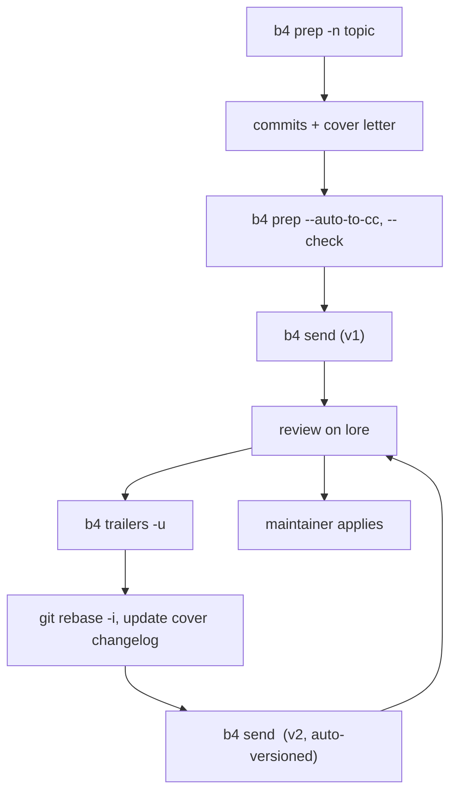
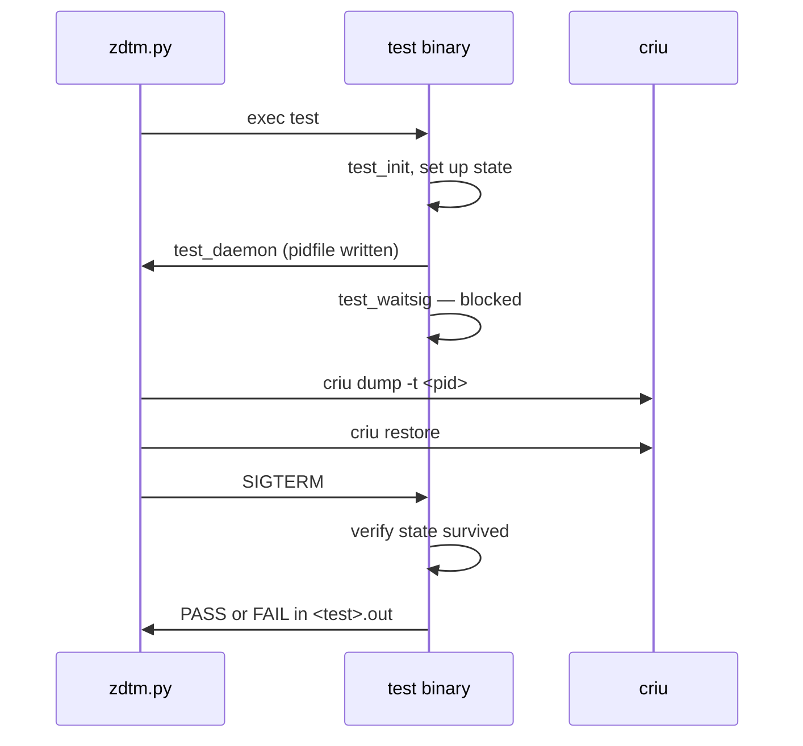

# Getting a Patch Accepted: Kernel, CRIU & vLLM

> **Goal:** turn work you have already done into a change that lands in
> somebody else's project. You will learn the one skill all three projects
> share — building a reviewable argument — and then the three completely
> different machines that carry it: the kernel's mailing list and `b4`, CRIU's
> `criu-dev` branch and its `zdtm` suite, and vLLM's RFC-then-PR pipeline.

[How the Kernel Is Made](#/kernel-governance) described the machine from the
outside: maintainers, the merge window, `linux-next`, the DCO. [Reading &
Building the Kernel](#/kernel-dev) got you a tree you can build and a module
that runs. Neither told you how to get a change *in* — and neither helps at all
with the two projects where a reader working on checkpoint/restore and GPU
serving is most likely to have something worth contributing.

Because **CRIU** and **vLLM** are not the kernel. They are GitHub projects with
their own branches, their own test suites, their own review cultures, and their
own idea of what a contribution even *is*. `git send-email` opens neither door.

The good news is that the hard part is shared. The mechanics differ; the
underlying demand does not.

## A contribution is a reviewable argument

Start with the reviewer's position, because everything else follows from it.

A maintainer's scarce resource is not merge access — it is attention, and the
liability that comes with it. Once your change is in, they own it. They will
answer the bug reports it causes, carry it through refactors, and explain it to
whoever reads the code in five years. `Documentation/process/6.Followthrough.rst`
states the question plainly: reviewers want to know "what will it be like to
maintain a kernel with this code in it five or ten years later?"

So a patch is not a diff you are asking someone to apply. It is an **argument
you are asking someone to accept**, and like any argument it can be well or
badly constructed. Four properties decide it.

### Small enough to be reviewed

Review effort does not scale linearly with diff size — it scales worse, because
a reviewer has to hold the whole change in their head at once. A 40-line patch
gets reviewed in a coffee break. A 900-line patch gets a "this is on my list"
and then nothing, because there is no 20-minute slot in anyone's week where it
fits.

This is why "make the change small" is not humility, it is engineering. If your
work genuinely is 900 lines, your job is to *decompose* it so each piece can be
reviewed alone.

### One thing per commit, and every commit builds

Both the kernel and CRIU say the same thing in nearly the same words: separate
each **logical change** into its own commit. A bug fix and a performance
improvement to the same file are two commits. An API change plus a caller that
uses the new API is two commits. A mechanical rename across forty files is *one*
commit, because it is one logical change.

The rule that makes this more than aesthetics is bisectability. CRIU's
`CONTRIBUTING.md` puts it bluntly:

> "take special care to ensure that CRIU builds and runs properly after each
> commit in the series. Developers using `git bisect` to track down a problem
> can end up splitting your patch series at any point"

CRIU does not merely ask. It **enforces this in CI**: the `check-commits`
workflow rebases your pull request onto the base branch with
`git rebase <base> -x "make -C scripts/ci check-commit"`, so every commit in
your series is compiled independently. A series that only builds at the tip
fails before a human looks at it.

The practical consequence: no fixup commits. If commit 3 breaks something that
commit 5 repairs, squash them. CRIU states that a pull request containing one
commit that breaks something and another that fixes it "will be rejected".

### A commit message that explains *why*

This is where most first contributions fail, and it is the cheapest thing to
fix.

The diff already says what changed — `git show` renders it perfectly. What no
tool can recover is the reason, and the reason is what a reader needs six
months from now when they are deciding whether your change caused their bug, or
whether it can be backported, or whether it can be deleted.

`Documentation/process/submitting-patches.rst` orders it: describe the problem
first, convince the reviewer it is worth fixing, *then* describe what you did
about it, in technical detail and in plain English. Use imperative mood ("make
xyzzy do frotz"), as if giving orders to the codebase. And — a rule people
consistently underweight:

> "Quantify optimizations and trade-offs. If you claim improvements in
> performance, memory consumption, stack footprint, or binary size, include
> numbers that back them up. But also describe non-obvious costs."

Here is an invented but realistic pair. The error strings are illustrative, not
quotations from CRIU.

**Bad:**

```text
Subject: [PATCH] fix timeout

Increased the timeout because dump was failing sometimes.
Also fixed some whitespace while I was in there.
```

Everything wrong with it is structural, not stylistic. It names no symptom, so
nobody searching the log will find it. It gives no measurement, so "sometimes"
is unfalsifiable. It bundles two logical changes. It describes the diff instead
of the problem. And it makes the reviewer do the work of reconstructing the
motivation — which is exactly the work they were hoping you would do.

**Rewritten:**

```text
Subject: [PATCH] criu: name the stalled task when --timeout expires

Dumping a 900-thread JVM on a loaded host fails with only

  Error: Timeout reached

The 10 s default from --timeout expired while collecting tasks, but
the message names neither the timeout value nor the thread that never
reached a stopped state. The only way to find out today is to rebuild
with debug logging, which on this workload perturbs the timing enough
that the failure stops reproducing.

Report the pid and the timeout in the error instead:

  Error: timeout (10s) waiting for task 4711 (thread of 4699) to stop

No dump or restore behaviour changes; this touches the error path only.
The reproducer below fails 14/20 times on an unpatched build and
produces the new message on every failure with this applied.

Reproducer and harness: <link>
```

That message does four things the first one didn't: it states the observable
symptom (so it is searchable), it quantifies (14/20), it bounds the blast radius
("error path only" — which is what a reviewer most wants to know), and it hands
over a reproducer. The diff might be six lines. The argument is what got it
merged.

One more discipline the kernel docs are explicit about: when you send v2, the
description must be **self-contained**. Do not write "same as v1 but with
Alice's fix." Some reviewers never saw v1.

### The reproducer and the measurement

If you take one thing from this chapter, take this: **a reproducer and a
measurement are what convert you from a stranger into someone worth answering.**

A maintainer receiving a bug report from an unknown name has to decide whether
to spend an hour on it. A report that includes a script which fails on their
machine in thirty seconds costs them almost nothing to verify — and once they
have verified it, the bug is *theirs* too. A performance claim with a
reproducible benchmark can be argued about; a performance claim without one can
only be ignored.

This cuts both ways, and it is why the three projects in this chapter are so
insistent about tests. In CRIU a `zdtm` test *is* the reproducer, permanently
attached to the tree. In vLLM the PR template has a mandatory "Test Plan" and
"Test Result" section. In the kernel a `Closes:` tag points at the public report.
In all three the underlying question is identical: *how do I know this is real,
and how will I know if it breaks again?*

### Responding to review: address, don't argue

Review comments come back. What you do next determines whether anything merges.

The default should be: **change the code**. Not because reviewers are always
right, but because the cost of a disagreement is asymmetric. Winning an argument
about a variable name costs you a review round and some goodwill; changing the
name costs you thirty seconds.

When you genuinely disagree, the kernel process docs describe the shape of a
productive response: explain what is really going on if the reviewer
misunderstood, or justify your solution if you have a technical objection. Then
notice what they add — if your explanation does not persuade, and especially if
others start agreeing with the reviewer, consider that you may be solving the
wrong problem. And Andrew Morton's suggestion, which is quietly the most useful
line in the whole document: every review comment that does *not* result in a
code change should result in an added **code comment** instead. If a reviewer
was confused, the next reader will be too.

The failure mode to avoid is named explicitly:

> "One fatal mistake is to ignore review comments in the hope that they will go
> away. They will not go away."

And the mechanical rule: **resend, don't defend**. A reply saying "I'll fix
that" is not progress. A v2 with the fix in it is. Every project in this chapter
expects revisions to arrive as a new, complete version — a fresh patch series, a
new pull request, an updated branch — not as a thread of promises.

## Flow 1 — the Linux kernel

[Kernel governance](#/kernel-governance) covered where a patch goes and who
signs it. This is how you actually send one, and the tooling has changed enough
in the last few years that advice from a 2018 blog post will make you look like
you have never done this before.

### Find the right audience

Mailing a patch to LKML alone is close to mailing it nowhere. Every subsystem
has its own list and its own maintainers, and there is a script that computes
them from `MAINTAINERS` plus the file's git history:

```bash
./scripts/get_maintainer.pl -f kernel/cgroup/cgroup.c
```

```text
Tejun Heo <tj@kernel.org> (maintainer:CONTROL GROUP (CGROUP))
Zefan Li <lizefan.x@bytedance.com> (maintainer:CONTROL GROUP (CGROUP))
Johannes Weiner <hannes@cmpxchg.org> (maintainer:CONTROL GROUP (CGROUP))
Michal Koutný <mkoutny@suse.com> (maintainer:CONTROL GROUP (CGROUP))
cgroups@vger.kernel.org (open list:CONTROL GROUP (CGROUP))
linux-kernel@vger.kernel.org (open list)
                    ← plus frequent committers, computed from git log
```

The four maintainers and the `cgroups@` list above are the verbatim `M:` and
`L:` lines of the `CONTROL GROUP (CGROUP)` entry in `MAINTAINERS` at v6.12; the
script also appends people derived from recent commit history, which is why its
real output is longer than the file suggests.

Before you write anything, **search the archive**. Almost every idea has been
proposed before, and the reason it was rejected is usually still valid.
`lore.kernel.org` indexes every list with full-text search and some very sharp
prefixes:

```text
https://lore.kernel.org/all/?q=dfn:mm/oom_kill.c        ← patches touching this file
https://lore.kernel.org/all/?q=dfhh:oom_badness         ← patches touching this function
https://lore.kernel.org/all/?q=s:userfaultfd+d:last.year..
https://lore.kernel.org/all/?q=nq:"we+do+not+break+userspace"
```

`dfn:` matches a filename in the diff, `dfhh:` matches the hunk header (usually a
function name), `s:` the subject, `nq:` non-quoted body text, `d:` a date range in
git approxidate format. Finding the thread where your idea was already NAK'd,
and addressing that objection in your cover letter, is a large fraction of the
work.

### Check the form before a human has to

```bash
./scripts/checkpatch.pl --strict --git HEAD~3..HEAD
```

`--strict` (spelled `--subjective` in the same option) enables the checks that
are advisory by default. Running it costs seconds and removes the entire class
of review comments that are about whitespace rather than about your idea. It is
not a correctness tool and it produces false positives — but a maintainer who
has to tell you about a missing blank line has learned something about how much
of their attention the rest of your patch will cost.

### The patch itself

```bash
git format-patch --cover-letter -v2 -3 -o /tmp/patches
```

A **cover letter** (`[PATCH v2 0/3]`) is mandatory in practice for any series of
more than one patch. It explains the series as a whole — the problem, the
approach, why it is split this way — so a reviewer can decide whether to read
the individual patches at all.

Each patch subject follows a strict shape, `subsystem: what it does`, 70–75
characters maximum:

```text
Subject: [PATCH v2 01/27] x86: fix eflags tracking
```

Then the body, then the tags. The **`---` marker line** after the tags is
load-bearing: it tells `git am` where the commit message ends. Anything below it
is stripped when the patch is applied, which is exactly where your inter-version
changelog belongs:

```text
  Signed-off-by: Author <author@mail>
  ---
  V2 -> V3: Removed redundant helper function
  V1 -> V2: Cleaned up coding style and addressed review comments

  path/to/file | 5 +++--
```

Put the changelog *above* the `---` and a maintainer has to hand-edit it out of
the permanent history. That is a small, avoidable irritation, and this course's
whole thesis is that small avoidable irritations are what get patches ignored.

### The trailer vocabulary

`Signed-off-by` is the only mandatory one, and it is worth being precise about
what it asserts. It is agreement to the **Developer Certificate of Origin 1.1**,
whose text is in `submitting-patches.rst`: you certify that you wrote the
contribution, *or* that it derives from work you have the right to resubmit under
the same license, *or* that someone who certified one of those gave it to you
unmodified — and that you understand the record is public and permanent. It is
**not** a copyright assignment and **not** a CLA. There is no lawyer and no
signup; `git commit -s` is the whole ceremony.

| Trailer | What it asserts | Who adds it |
|---|---|---|
| `Signed-off-by:` | DCO 1.1 — right to submit. Mandatory. | Author, then each maintainer in the chain |
| `Reviewed-by:` | The reviewer's four-part statement of oversight: technical review carried out, concerns communicated and answered, believed worthwhile and free of known blocking issues, no warranty | A reviewer, on-list |
| `Acked-by:` | Approval — "not as formal as `Signed-off-by:`"; often used by the maintainer of the affected code when that maintainer neither contributed to nor forwarded the patch | Maintainer / domain expert |
| `Tested-by:` | Someone ran it in some environment and it worked | A tester |
| `Reported-by:` | Credits a bug reporter. Must be followed by `Closes:` unless the report is not on the web. Ask permission if the report was private | Author |
| `Closes:` | URL of the public report this fixes. Private trackers and invalid URLs are forbidden | Author |
| `Link:` | Background URL; also used instead of `Closes:` when the patch fixes only part of a report | Author or maintainer |
| `Co-developed-by:` | Co-authorship. **Must be immediately followed** by that person's `Signed-off-by:` | Author |
| `Suggested-by:` | Credits the idea. Ask permission if it was not suggested in public | Author |

`Fixes:` deserves its own note because its format is exact and parsed by tooling:

```text
Fixes: 54a4f0239f2e ("KVM: MMU: make kvm_mmu_zap_page() return the number of pages it actually freed")
```

At least **twelve** hex characters of the SHA-1 — shorter IDs will collide in a
repository this large — followed by a space, then the commit's one-line summary
in parentheses and double quotes. Do **not** wrap it; tags are explicitly exempt
from the 75-column rule so that parsers stay simple. Generate it correctly with
a git alias rather than by hand:

`submitting-patches.rst` gives it as a `.gitconfig` block:

```ini
[core]
        abbrev = 12
[pretty]
        fixes = Fixes: %h (\"%s\")
```

Note the `\"` escaping is gitconfig's, not the shell's — if you set it from the
command line the quotes are literal:

```bash
git config --global core.abbrev 12
git config --global pretty.fixes 'Fixes: %h ("%s")'
git log -1 --pretty=fixes 54a4f0239f2e
```

One trailer rule that catches people on v2: `Reviewed-by:` and `Tested-by:`
tags you receive on the list must be **carried forward by you** into the next
version. If the patch changed substantially they no longer apply, should be
dropped, and the removal noted in the changelog under the `---`.

### `b4`, which is how this is actually done now

`git send-email` still works. But threading a v3 correctly, collecting six
`Reviewed-by:` trailers scattered across a thread, and tracking a series across
revisions by hand is tedious enough that most active contributors have moved to
**`b4`**, by Konstantin Ryabitsev. Contributor-side commands arrived in b4 0.10;
the current release is **0.15.2** (April 2026). `kernel-governance` mentions the
tool exists, so here is what it actually does.

```bash
b4 prep -n fix-cgroup-oom -f v6.12    # new branch b4/fix-cgroup-oom + cover letter
#   ... commit, git rebase -i, write good messages ...
b4 prep --edit-cover                  # cover letter lives in an empty commit
b4 prep --auto-to-cc                  # runs the MAINTAINERS query for you
b4 prep --check                       # pre-flight checks
b4 send                               # sends, bumps to v2, adds the changelog
#   ... review happens on-list ...
b4 trailers -u                        # pull Reviewed-by/Tested-by out of the
                                      #   archive and apply them to your commits
#   ... git rebase -i to address the comments, note them in the cover ...
b4 send                               # v2
b4 prep --cleanup                      # when it's merged
```

Three of those solve real problems. `--auto-to-cc` replaces
`get_maintainer.pl | xargs`. `b4 send` **automatically increments the version and
appends the changelog to the cover letter**, which is the step humans most
reliably forget. `b4 trailers -u` scrapes review tags out of lore and applies
them, which is the step humans most reliably do wrong.

`b4` also solves the mail problem. If your employer's mail server mangles
patches or offers no SMTP, `b4 send` can post through a **web submission
endpoint** instead — for kernel.org-hosted projects,
`b4.send-endpoint-web = https://lkml.kernel.org/_b4_submit` — with your
submission cryptographically attested by a PGP or `patatt`-generated ed25519 key.
You still need a working mail account to *participate in the review*; you no
longer need one that can transmit a patch intact.

Note the constraint: the kernel.org endpoint refuses submissions that name no
recognized mailing list, so it is not a general-purpose relay.



### The contribution nobody frames as one: a good bug report

If you have deep systems knowledge but no history in the kernel, the highest
expected-value thing you can produce is not a patch. It is a **bug report with a
bisect and a reproducer**, and `Documentation/admin-guide/reporting-issues.rst`
specifies exactly what makes one credible.

The requirements are not decoration; each one exists because reports failing it
waste a maintainer's day:

- **Reproduce on a vanilla kernel.** Not patched, no out-of-tree modules, and
  **not already tainted** before the issue occurs. A tainted kernel means the
  crash may not be the kernel's code at all — this is the same `add_taint()`
  machinery from `kernel-governance`, and it is why tainted reports are triaged
  differently.
- **Reproduce on a kernel that is still supported.** For a regression inside a
  stable series, the latest release of that series; otherwise, latest mainline.
- **Search first.** lore, the subsystem list archive, and the web. Joining an
  existing thread is more useful than opening a second one.
- **Bisect.** `git bisect` between a known-good and known-bad tag pins the
  guilty commit. Include the commit ID and **CC everyone in its `Signed-off-by`
  chain** — those are precisely the people who already understand that code.
- **One report per issue**, and CC `regressions@lists.linux.dev` if it is a
  regression so `regzbot` tracks it.
- **Stay.** Answer follow-up questions, retest on newer releases, send status
  updates.

A bisected, reproducible regression report is more valuable to a subsystem than
most first patches, and it is achievable with the skills this course already
gave you: build a kernel ([kernel-dev](#/kernel-dev)), instrument it
([observability](#/observability)), and measure honestly
([perf-methodology](#/perf-methodology)).

## Flow 2 — CRIU

CRIU is where a reader of [Dumping a Process](#/criu-dump) and [GPU
Checkpointing](#/gpu-checkpoint) is most likely to have something real to
contribute, and its conventions are close enough to the kernel's to be
misleading. The commit-message discipline, the DCO, the `Fixes:` tag and the
one-logical-change rule are all borrowed almost verbatim. Everything about
*delivery* is different.

### Target `criu-dev`, not `master`

```bash
git clone https://github.com/checkpoint-restore/criu criu
cd criu
git checkout criu-dev        # ← development happens here
```

This is the single most common newcomer error, and `CONTRIBUTING.md` states it
plainly under "Get the source code": **development happens in the `criu-dev`
branch**. It is also the repository's default branch. A pull request against
the stale `master` is a pull request against the wrong tree.

GitHub pull requests are the **preferred** contribution path — this is stated
twice in the document. The mailing list (`criu@lists.linux.dev`, archived at
`lore.kernel.org/criu`) still works, for historical reasons and for people who
prefer it, with `git format-patch --signoff origin/criu-dev` and
`--subject-prefix=PATCHv2` for revisions. But GitHub is the main road.

### Sign-off, prefixes, and revisions

`Signed-off-by` is required, under the same DCO 1.1 text as the kernel, with the
same request for real names. `git commit -s`.

Commit subjects carry a **component prefix**, taken from the file or directory
you touched, with `/` separating multiple:

```text
criu-ns: Convert to python3 style print() syntax
compel: Calculate sh_addr if not provided by linker
style: Enforce kernel style -Wstrict-prototypes
rpc/libcriu: Add lsm-profile option
```

`Fixes:` works in two forms — the kernel's `Fixes: <12-hex> ("subject")`, and
`Fixes: #339` naming a GitHub issue — and goes at the **end** of the detailed
description.

Revisions are the biggest divergence from GitHub habit. CRIU does **not** want a
stream of "address review comments" commits pushed onto a live PR. The
documented flow is: fold the fixes into the commits that introduced the problem,
then **close the old pull request and open a new one** whose description
contains a link to the previous PR and a revision changelog:

```text
v3: rebase on the current criu-dev
v2: add commit to foo() and update bar() coding style
```

Force-pushing into an existing PR is permitted "with care" for small updates,
still with the changelog. The structural requirement is the same as the kernel's:
what the reviewer reads must be the *current* argument, not an archaeology of how
you got there.

### `zdtm`: the test suite that decides whether your patch lands

Here is the rule that matters most in this section, and it is not written down
anywhere as a single sentence, so state it plainly: **a patch that changes
dump or restore behaviour without a `zdtm` test will not land.** CRIU is a
program whose entire job is to reproduce a process's state exactly. There is no
way to review a claim about that by reading a diff. Either a test demonstrates
the state survives a checkpoint/restore cycle, or the claim is unverified.

`zdtm` ("zero down time migration") lives in `test/zdtm/`. As of July 2026,
`test/zdtm/static/` holds roughly **488** C test programs — one per feature or
edge case — plus `test/zdtm/transition/` for tests that keep changing state
across the dump, and `test/zdtm/lib/` which builds `libzdtmtst.a`.

Every test has the same shape, and it is genuinely small. Here is `env00.c`
essentially in full — it checks that environment variables survive a
checkpoint/restore round trip:

```c
#include "zdtmtst.h"

const char *test_doc = "Check that environment didn't change";
const char *test_author = "Pavel Emelianov <xemul@parallels.com>";

char *envname;
TEST_OPTION(envname, string, "environment variable name", 1);

int main(int argc, char **argv)
{
	char *env;

	test_init(argc, argv);              /* parse args, set up logging */

	if (setenv(envname, test_author, 1)) {
		pr_perror("Can't set env var ...");
		exit(1);
	}

	test_daemon();                      /* write pidfile, go background */
	test_waitsig();                     /* sleep until SIGTERM  ← dump+restore happens here */

	env = getenv(envname);
	if (!env) {
		fail("can't get env var \"%s\"", envname);
		goto out;
	}

	if (strcmp(env, test_author))
		fail("%s != %s", env, test_author);
	else
		pass();                     /* prints PASS to <test>.out */
out:
	return 0;
}
```

Read the control flow, because the whole harness is in it. The test sets up
some state, calls `test_daemon()` to detach and announce it is ready, then
blocks in `test_waitsig()`. While it is blocked, `zdtm.py` checkpoints and
restores the process out from under it. Then the harness sends `SIGTERM`,
`test_waitsig()` returns, and the test verifies its state is intact. The
harness's `stop()` method reads `<test>.out` and looks for the literal string
`PASS`; anything else is a failure.



**To add a test**, you need three things:

1. `test/zdtm/static/<name>.c`, including `zdtmtst.h`, following the shape
   above. The library gives you `test_fork()`, `task_waiter_t` for
   parent/child rendezvous, `TEST_OPTION` for arguments, and
   `datagen()`/`datachk()` — CRC-checked buffers, which is how memory-content
   tests prove nothing was corrupted rather than merely that a pointer is
   non-NULL.
2. Your test's name added to the right list in `test/zdtm/static/Makefile`:
   `TST_NOFILE` for tests needing no scratch file, `TST_FILE`, `TST_DIR`,
   `TST_DIR_FILE`, `TST_STATE`.
3. Optionally `test/zdtm/static/<name>.desc`, a Python dict controlling how the
   harness runs it:

```python
{'flavor': 'h ns', 'flags': 'suid', 'opts': '--manage-cgroups'}
```

`flavor` selects the environments to run in — `h` (host), `ns` (own mount/pid
namespace root), `uns` (user namespace); the default is all three. `flags`
carries `suid` (needs root), `excl` (run exclusively, not in parallel), `noauto`
(skip in `run -a`), `samens`, `reqrst`, `crfail`. Then:

```bash
./test/zdtm.py run -t zdtm/static/<name>            # all flavors
./test/zdtm.py run -t zdtm/static/<name> -f h       # host flavor only
make test                                            # the whole suite
```

`make test` descends into `test/` and runs `./zdtm.py run -a --parallel 2`, then
repeats the suite under `--criu-config`, pre-dump, snapshot, iterative and
freezer variants. It takes a long time and needs root. Run your single test
locally; let CI run the rest.

### The CI gates

CRIU's CI is unusually broad for a project of its size, and understanding what
it covers tells you what the maintainers consider a risk. On every push and pull
request, `.github/workflows/ci.yml` runs exactly nineteen jobs (checked
2026-07-27): x86-64 under both GCC and Clang, Alpine with the zdtm suite
**sharded four ways**, Alpine on arm64, aarch64 on two Ubuntu versions, Arch
Linux (also sharded four ways), CentOS Stream 9 and 10, a 32-bit compat build,
cross-compiles, Docker and Podman integration, a Fedora **ASAN** build, Fedora
Rawhide in a container on x86_64 and aarch64, a four-variant Fedora VM job
(stable, next, no-vdso, non-root), a gcov coverage run, Java tests,
loongarch64 under QEMU, nftables, and streaming.

Alongside it: `check-commits.yml` (every commit builds, described above),
`lint.yml`, and `codeql.yml`. And `linux-next.yml`, a weekly workflow named
`linux-next-tests` that builds a **linux-next** kernel, boots it on an EC2
instance, and runs the CRIU suite against it — CRIU testing *the kernel* for
regressions that would break checkpoint/restore, before they reach a release.

Locally, two commands mirror the lint gate:

```bash
make lint     # ruff (Python), shellcheck, codespell, CRIU print-macro
              #   and EOL-whitespace checks for C
make indent   # git-clang-format against HEAD~1 by default;
make indent BASE=origin/criu-dev     # ... or your whole branch
```

Note the calibration `CONTRIBUTING.md` applies to the second one, because it is
unusual and it is correct: **clang-format compliance is optional**. The document
says so explicitly, and then shows two examples of clang-format *damaging*
readability by collapsing a hand-aligned struct initializer and joining a
well-broken line. If the formatter and readability disagree, readability wins,
and a human decides. Tools "should not be considered as a source of truth."

Code style is otherwise the kernel's, less strictly enforced: tabs, 8-wide,
80-column preference.

### The plugin API is a contribution surface

Now the practical point, and it is the most useful thing in this chapter for
someone with GPU and checkpoint knowledge.

CRIU's core dump/restore path is hard to contribute to as a newcomer — it is
intricate, heavily reviewed, and every change needs zdtm coverage across three
flavors. But CRIU has a second, much more tractable surface: the **plugin API**.

A plugin is a shared object CRIU `dlopen`s, implementing `cr_plugin_init()` /
`cr_plugin_fini()` and registering callbacks from the hook enum in
`criu/include/criu-plugin.h`. [GPU Checkpointing](#/gpu-checkpoint) walks that
enum and both existing implementations in detail. What matters here is the
*contribution* property: **a plugin adds files under `plugins/` and touches no
core code**. It cannot regress anybody else's workload. It is reviewable in
isolation. And there are only two of them in the tree as of July 2026 —
`plugins/amdgpu` and `plugins/cuda` — for a mechanism designed to handle
*any* external state the core cannot enumerate.

That is a wide-open surface for anyone with a device, a runtime, or an external
resource that CRIU currently refuses. The AMD plugin is a complete worked
example of the pattern, and `test/plugins/` and `test/cuda-checkpoint/` show how
plugin-level testing is structured.

One convention to note, because it is new: CRIU's `CONTRIBUTING.md` now
specifies an `Assisted-by: AGENT_NAME:MODEL_VERSION [TOOL1] [TOOL2]` trailer for
AI-assisted contributions, placed after the body and before `Signed-off-by`, and
states that **AI agents must not add `Signed-off-by` tags** — only a human can
certify the DCO. It follows the kernel's own
`Documentation/process/coding-assistants.rst`, which is *newer than this course's
v6.12 pin*: commit `78d979db6cef`, authored 2025-12-23, reached Linus's tree on
2026-01-06 and first shipped in **v7.0**. It is not present in the v6.12 tree.
If you are reading this later than 2026-07, check whether the format has moved.

## Flow 3 — vLLM

vLLM is a third culture again: a GitHub project moving fast enough that its
constraints come from *throughput*, not from ceremony. The numbers set the
context. Measured against the GitHub API on **2026-07-27**:

- **4,074 open pull requests.**
- **1,063 merged in the preceding 30 days** — about 35 a day, 290 in the last
  week alone.
- **27 open issues** labelled `good first issue`.

Read those together. This is a project merging more changes per day than CRIU
merges per month (172 pull requests in the preceding twelve months), with a
backlog of open PRs two orders of magnitude larger than CRIU's 54. Every rule
below is a response to that.

### RFC first, for anything structural

vLLM's contributing guide draws a line by size:

> "For major architectural changes (>500 LOC excluding kernel/data/config/test),
> we would expect a GitHub issue (RFC) discussing the technical design and
> justification. Otherwise, we will tag it with `rfc-required` and might not go
> through the PR."

The `[RFC]:` issue template asks for **Motivation**, **Proposed Change**, a
**Feedback Period** ("usually at least one week"), and a **CC List**. This is the
inverse of the kernel's "show me the code" culture — vLLM would rather argue
about the design before anyone writes 800 lines, precisely because reviewer
attention is the bottleneck.

The practical consequence for you: if your change is architectural, **the RFC is
the contribution**. Write it, run the feedback period, and only then open a PR
that says "implements #NNNN as discussed." A large PR that arrives without a
prior RFC is not rejected on technical grounds; it is deprioritized, which in a
4,000-PR backlog is the same thing. (Worth knowing before you go looking for
it: `rfc-required` is named in the guide but does not exist as a label in the
repository — the mechanism is social, not mechanical.)

### PR conventions

The title is not decoration — it is routing. vLLM states that "only specific
types of PRs will be reviewed" and requires one of a fixed set of prefixes:

`[Bugfix]` · `[CI/Build]` · `[Doc]` · `[Model]` · `[Frontend]` · `[Kernel]` ·
`[Core]` · `[Hardware][Vendor]` · `[Misc]` (sparingly). Multiple prefixes if the
PR spans categories; the model name goes in the title for `[Model]`.

The PR description template has three headings — **Purpose**, **Test Plan**,
**Test Result** — which is the same demand as CRIU's zdtm requirement,
expressed as a form rather than as a test file. Nothing mechanically enforces
them; they are a template plus a reviewer checklist, which means the pressure
to fill them in properly is entirely reputational.

`Signed-off-by` is required here too, under the same DCO, enforced by a
`signoff-commit` pre-commit hook. AI-assisted work must be disclosed in the PR
description and attributed with `Co-authored-by:` trailers, and the guide names
two anti-patterns directly: no "pure agent" PRs where the human has not reviewed
every changed line and validated behaviour end to end, and no one-off busywork
PRs (a single typo, an isolated style cleanup) — mechanical cleanups should be
bundled into a systematic scope.

### The gates

```bash
uv pip install 'pre-commit>=4.5.1'
pre-commit install          # now runs on every commit
pre-commit run -a           # or run everything by hand
pre-commit run --hook-stage manual mypy-3.11   # CI-only hooks
```

The hook set is long and worth skimming once: `ruff` check and format, `typos`,
`clang-format` for CUDA/C++, `markdownlint`, `actionlint`, `shellcheck`, `mypy`
across Python 3.10–3.13, SPDX header checks, a forbidden-imports check, a
"prevent new `torch.cuda` API calls" check, config validation, and Rust
`cargo fmt`. Develop on **Python 3.12** — that is what CI runs, except for mypy.

Heavy CI runs on Buildkite (`.buildkite/test-pipeline.yaml`, plus hardware test,
performance-benchmark and lm-eval-harness pipelines) and it is explicitly
rationed:

> "Note that not all CI checks will be executed due to limited computational
> resources. The reviewer will add `ready` label to the PR when the PR is ready
> to merge or a full CI run is needed."

So a green checks page on your PR does not mean the full suite passed. The
`ready` label is the real gate. The review protocol is documented too: a reviewer
is assigned, gives status updates every 2–3 days, applies `action-required` when
changes are needed, and you may ping after 7 days of silence. Contributors
without write access are capped at **6 open PRs**. As with `rfc-required`,
`action-required` is described in the guide but is not an actual label in the
repository, so do not build tooling that watches for it.

### What vLLM requires before it accepts a performance claim

This is the section most relevant to anyone arriving from the inference side of
this material, and the standard is higher than newcomers expect.

vLLM has a dedicated `[Performance]:` issue template, and it points at two
things specifically: benchmark results produced by the scripts in
`benchmarks/`, and environment output from `collect_env`. Every field on that
template is technically optional — but a performance issue without both is one
a maintainer has no way to act on. The benchmark CLI is first-class:

```bash
vllm bench serve        # online serving: latency and throughput under load
vllm bench latency      # single-request latency
vllm bench throughput   # offline batch throughput
vllm collect-env        # GPU, driver, CUDA, torch, vLLM versions
```

The issue templates still tell you to `wget` and run `collect_env.py`; the
script now lives at `vllm/collect_env.py` inside the package, and
`vllm collect-env` is the current invocation.

The reason for the rigidity is the one [Performance Analysis
Methodology](#/perf-methodology) argues at length: an inference throughput
number is meaningless without the model, the hardware, the request distribution,
the batch composition and the software versions, and a reviewer has no way to
reconstruct any of those from a screenshot. A before/after comparison produced by
the project's own benchmark scripts, with `collect-env` output attached, is
the minimum unit of evidence. See [Anatomy of an
Engine](inference/#/anatomy-of-an-engine) for what the numbers actually measure.

If you are adding or changing a CUDA kernel, there is an additional mechanical
contract: register custom ops following PyTorch's guidelines, implement and
register **meta-functions in Python** for ops returning tensors so dynamic
dimensions work, and use `torch.library.opcheck()` to test the registration —
with `tests/kernels` as the worked examples.

### "Good first issue" in a fast-moving project, honestly

27 open `good first issue` items across a repository merging 35 PRs a day is not
a queue you browse at leisure. In practice many are claimed within hours of
being labelled, and some go stale because the surrounding code moved before
anyone got to them.

What actually works better in a project at this velocity is the thing you were
going to do anyway: run it on your workload, hit something that is wrong or
undocumented or slower than it should be, and fix *that*. You arrive with a
reproducer and a motivation already in hand, which is exactly the position the
first section of this chapter described. The `new-model` label is a second real
on-ramp — adding a model is bounded, well-precedented work with existing
implementations to pattern-match against — though note that the guide's
"new model requests" job-board link filters on *open issues* carrying that
label, and on 2026-07-27 that returned only two. The label is heavily used;
the queue it points at is not a queue.

## The three flows side by side

| | **Linux kernel** | **CRIU** | **vLLM** |
|---|---|---|---|
| **Where discussion happens** | Subsystem mailing lists, archived on `lore.kernel.org`; `patchwork` tracks state | GitHub issues + PRs (preferred); `criu@lists.linux.dev` still accepted | GitHub issues, `[RFC]:` issues for design, PR threads |
| **Unit of contribution** | An emailed patch series with a cover letter, versioned `v1..vN` | A pull request against **`criu-dev`**, self-contained commits | A pull request against `main` with a prefixed title |
| **Sign-off required** | `Signed-off-by` (DCO 1.1), mandatory | `Signed-off-by` (DCO 1.1), `git commit -s` | `Signed-off-by` (DCO), enforced by a pre-commit hook |
| **Mandatory tests** | No universal gate; subsystem selftests where they exist. 0-Day and syzbot test *after* posting | **`zdtm` test for anything touching dump/restore**; every commit must build (CI rebases and compiles each one) | `pre-commit` must pass; PR must state Test Plan + Test Result; full Buildkite CI runs only when a reviewer adds `ready` |
| **Rejected on sight** | HTML mail or a mangled patch; missing `Signed-off-by`; sent only to LKML; a `Fixes:` tag with the wrong format; ignoring earlier review | A PR against `master`; fixup commits inside a series; a series that doesn't build at every commit; dump/restore change with no test | Missing title prefix; missing DCO; >500 LOC architectural change with no prior RFC; "pure agent" PRs; single-typo busywork PRs |
| **Typical time to merge** | Weeks to months — bounded below by the ~9–10 week release cycle ([governance](#/kernel-governance)) | Median ≈ **2.6 days**, p90 ≈ **35 days** (sample below) | Median ≈ **2.8 days**, p90 ≈ **21 days** (sample below) |

The two medians in the last row are a **measurement, not folklore**, and you
should know its limits before quoting it. On 2026-07-27 I pulled the most
recently-updated 300 closed pull requests from each repository via the GitHub
API, kept the merged ones (189 for vLLM, 209 for CRIU), and took
`merged_at - created_at`. That sampling is biased toward recent activity and
says nothing about PRs that were never merged — which, given vLLM's 4,074 open
PRs, is the larger population. The median in particular is unstable between
samples; treat it as "a few days", not as two significant figures. Treat it as "what merging looks like when it
happens," not as your odds. Reproduce it yourself:

```bash
gh api "repos/vllm-project/vllm/pulls?state=closed&sort=updated&per_page=100" \
  --jq '.[] | select(.merged_at) | [.number, .created_at, .merged_at] | @tsv'
```

The kernel row is deliberately not a number. Patch latency there is dominated by
the release cycle and by subsystem review depth, and I have no defensible
measurement of it; `kernel-governance` explains why the floor is roughly one
release cycle for anything that is not a fix.

What the table is really showing is that the *sequence* differs. The kernel
front-loads form (get the patch shaped right, then post it, then let the robots
test it). CRIU front-loads tests (the zdtm case is part of the patch, and CI
compiles every commit before review). vLLM front-loads design (RFC before
implementation) and rations the expensive verification until a human decides the
change is worth GPU-hours.

## What a first contribution can realistically be

If you have deep knowledge of a subject and no history in a project, the useful
moves are narrower than you would like and more useful than they look.

**Documentation that corrects something you verified.** Not a typo sweep — vLLM
explicitly discourages those, and the kernel's tolerance for them is thinner
than KernelNewbies suggests. This is a deliberate disagreement with the advice
in [Reading & Building the Kernel](#/kernel-dev), which points newcomers at
typo fixes and `checkpatch.pl` cleanups in `drivers/staging/`: those still work
as a way to learn the *mechanics* of sending a patch, which is what that
chapter was after. They are a poor way to earn a reviewer's attention, which is
what this one is after. A documentation patch that says "this option's
default changed in version X and the docs still describe the old behaviour, here
is the commit" is a *bug fix* that happens to touch a `.rst` file. It requires
exactly the skill this course trained: checking the claim against the source.

**A test that encodes a bug you reproduced.** A `zdtm` test for a
checkpoint/restore edge case that currently has no coverage stands alone: it
touches no core code, it cannot regress anything, and it converts your knowledge
into something permanent. If the test currently fails, you have also written the
bug report.

**A published measurement in an area that has none.** [GPU
Checkpointing](#/gpu-checkpoint) ends by pointing at exactly such a gap:
nobody has published image-size and restore-latency numbers for CUDA
checkpointing on unified-memory hardware. A careful, reproducible measurement
with the environment fully specified is original work, and it is the kind of
contribution that gets you taken seriously in a review thread afterwards.

**A CRIU plugin.** Two plugins exist for a mechanism designed to be general.
If you have a device or runtime whose state CRIU currently refuses, the plugin
API is the tractable path in — no core changes, isolated review, a complete
worked example already in the tree.

**A bug report done properly.** Bisected, reproducible, on a vanilla untainted
kernel, with the sign-off chain CC'd. Genuinely more valuable to a subsystem
than most first patches.

Now the honest part. **A first contribution is usually small, and that is
correct.** Not a consolation prize, not a rite of passage — correct. A
maintainer accepting your first patch is making a judgement with no evidence
except the patch itself. A small, well-argued, well-tested change is a cheap way
for both of you to find out whether your work is trustworthy. The second one is
easier because the first one existed.

The failure mode is the opposite: arriving with a 2,000-line series that
redesigns something, no prior discussion, no tests, and a commit message
explaining what the code does. That patch is not rejected because the idea is
bad. It is rejected because nobody can afford to evaluate it.

## Follow the code (kernel v6.12)

The process is implemented in scripts and config files you can read. Do.

**Kernel, at v6.12:**

- [`Documentation/process/submitting-patches.rst`](https://elixir.bootlin.com/linux/v6.12/source/Documentation/process/submitting-patches.rst)
  — the DCO 1.1 text, the trailer definitions, the reviewer's statement of
  oversight, the exact `Fixes:` format, and the `---` marker rule.
- [`Documentation/process/5.Posting.rst`](https://elixir.bootlin.com/linux/v6.12/source/Documentation/process/5.Posting.rst)
  — patch formatting, changelogs, subject-line conventions, and the tag summary.
- [`Documentation/process/6.Followthrough.rst`](https://elixir.bootlin.com/linux/v6.12/source/Documentation/process/6.Followthrough.rst)
  — working with reviewers; the source of "they will not go away."
- [`Documentation/admin-guide/reporting-issues.rst`](https://elixir.bootlin.com/linux/v6.12/source/Documentation/admin-guide/reporting-issues.rst)
  — the anatomy of a credible bug report.
- [`scripts/get_maintainer.pl`](https://elixir.bootlin.com/linux/v6.12/source/scripts/get_maintainer.pl)
  and [`MAINTAINERS`](https://elixir.bootlin.com/linux/v6.12/source/MAINTAINERS)
  — how the audience is computed.
- [`scripts/checkpatch.pl`](https://elixir.bootlin.com/linux/v6.12/source/scripts/checkpatch.pl)
  — read the `--help` block near the top for what `--strict` turns on.

**CRIU (`criu-dev` branch):**

- [`CONTRIBUTING.md`](https://github.com/checkpoint-restore/criu/blob/criu-dev/CONTRIBUTING.md)
  — the branch, the prefixes, the DCO, the PR revision protocol, the
  clang-format caveat, the `Assisted-by:` trailer.
- [`test/zdtm/static/env00.c`](https://github.com/checkpoint-restore/criu/blob/criu-dev/test/zdtm/static/env00.c)
  and [`test/zdtm/lib/zdtmtst.h`](https://github.com/checkpoint-restore/criu/blob/criu-dev/test/zdtm/lib/zdtmtst.h)
  — the smallest complete test, and every helper available to you.
- [`test/zdtm.py`](https://github.com/checkpoint-restore/criu/blob/criu-dev/test/zdtm.py)
  — the harness: flavors, `.desc` flags, and the `stop()` method that greps for
  `PASS`.
- [`.github/workflows/check-commits.yml`](https://github.com/checkpoint-restore/criu/blob/criu-dev/.github/workflows/check-commits.yml)
  — thirty-five lines that enforce "every commit builds" (and skip themselves
  when the PR carries the `not-selfcontained-ok` label).
- [`criu/include/criu-plugin.h`](https://github.com/checkpoint-restore/criu/blob/criu-dev/criu/include/criu-plugin.h)
  — the plugin contract, i.e. the contribution surface.

**vLLM (`main`):**

- [`docs/contributing/README.md`](https://github.com/vllm-project/vllm/blob/main/docs/contributing/README.md)
  — the whole policy: prefixes, DCO, AI rules, RFC threshold, review SLA.
- [`.github/ISSUE_TEMPLATE/750-RFC.yml`](https://github.com/vllm-project/vllm/blob/main/.github/ISSUE_TEMPLATE/750-RFC.yml)
  and [`700-performance-discussion.yml`](https://github.com/vllm-project/vllm/blob/main/.github/ISSUE_TEMPLATE/700-performance-discussion.yml)
  — exactly what an RFC and a performance claim must contain.
- [`.pre-commit-config.yaml`](https://github.com/vllm-project/vllm/blob/main/.pre-commit-config.yaml)
  — every gate that runs before your commit is allowed to exist.
- [`.buildkite/test-pipeline.yaml`](https://github.com/vllm-project/vllm/blob/main/.buildkite/test-pipeline.yaml)
  — the expensive CI that only runs when a reviewer says so.

## Try it yourself

None of this requires permission, and all of it is reversible.

```bash
# 1. Kernel: find the audience for a change, and the prior art.
cd linux
./scripts/get_maintainer.pl -f mm/oom_kill.c
xdg-open 'https://lore.kernel.org/all/?q=dfhh:oom_badness'

# 2. Kernel: shape a real commit and check its form.
git commit -s                                  # -s adds Signed-off-by
./scripts/checkpatch.pl --strict --git HEAD~1..HEAD
git format-patch --cover-letter -1 -o /tmp/p && cat /tmp/p/*.patch

# 3. b4, end to end, without sending anything.
pipx install b4
b4 prep -n my-first-series -f v6.12
b4 prep --edit-cover
b4 prep --auto-to-cc      # runs the MAINTAINERS query
b4 prep --check
b4 send --dry-run         # ← prints what WOULD be sent. Nothing leaves your machine.

# 4. CRIU: run one zdtm test and watch the dump/restore happen under it.
git clone https://github.com/checkpoint-restore/criu && cd criu
git checkout criu-dev
./contrib/dependencies/apt-packages.sh   # or dnf-packages.sh
make -j"$(nproc)"
sudo ./test/zdtm.py run -t zdtm/static/env00 -f h
cat test/zdtm/static/env00.out           # the PASS the harness greps for

# 5. CRIU: prove the "every commit builds" gate to yourself.
git rebase origin/criu-dev -x "make -j$(nproc)"

# 6. vLLM: install the gates and run them on an unmodified checkout.
git clone https://github.com/vllm-project/vllm && cd vllm
uv pip install pre-commit && pre-commit install
pre-commit run -a
```

Step 4 needs root and a Linux host — `zdtm` checkpoints real processes, so a
container or a VM is the right place, not your laptop's main OS. If you have no
Linux machine, [Lab: Checkpoint & Restore a Real Process](#/lab-criu) sets up a
minimal environment first. Step 6 needs no GPU: `pre-commit` is pure lint.

Step 3 is the one to actually do. `b4 send --dry-run` walks the entire
submission path — recipients, threading, versioning, attestation — and prints
the result instead of transmitting it. Ten minutes there removes most of the
fear from the real thing.

## Check your understanding

1. CRIU's CI rebases your pull request with
   `git rebase <base> -x "make -C scripts/ci check-commit"`. What class of
   contribution does this reject, and what is the underlying reason — beyond
   tidiness?

<details><summary>Show answer</summary>

It rejects any series that only builds at the tip: a series with a commit that
breaks the build and a later commit that repairs it, or a fixup commit appended
to address review. The reason is `git bisect`. A developer bisecting an
unrelated bug can land on any commit in your series; if that commit doesn't
build, the bisect gives a wrong or useless answer and they lose an afternoon.
CRIU's `CONTRIBUTING.md` says such pull requests "will be rejected" and asks you
to fold fixes into the commit that introduced the problem instead. The kernel
asks for the same property but enforces it socially rather than mechanically.

</details>

2. You have a `Fixes:` tag to write. Why does the format specify at least twelve
   hex characters, and why must the tag not be wrapped even though the rest of
   the message wraps at 75 columns?

<details><summary>Show answer</summary>

Twelve characters because the kernel repository holds enough objects that
shorter abbreviations collide — and a tag that resolves to two commits is worse
than no tag. `submitting-patches.rst` notes that even an ID that is unambiguous
today may not be in five years. No wrapping because `Fixes:` is machine-read:
Sasha Levin's stable-backport tooling and other bots parse it, and the tag is
explicitly exempted from the column rule "in order to simplify parsing scripts."
Generate it with `git log -1 --pretty=fixes <sha>` after setting
`core.abbrev = 12` rather than assembling it by hand.

</details>

3. A reviewer gives you six comments. You agree with five. For the sixth you are
   confident the reviewer misread the code. What do you send, and what do you
   send it as?

<details><summary>Show answer</summary>

Fix the five, and for the sixth reply on-list explaining what is actually going
on — politely, technically, without restating your credentials. Then send a
**v2 containing the five fixes**, not a message promising them; every project
here expects revisions as a complete new version. Two refinements from
`6.Followthrough.rst`: if your explanation doesn't persuade, and especially if
others start agreeing with the reviewer, seriously reconsider — you may be
solving the wrong problem. And take Andrew Morton's suggestion: a review comment
that produces no code change should produce a **code comment**, because the next
reader will be confused in exactly the same place. Note the changed and
unchanged items in the v2 changelog under the `---` line.

</details>

4. Why does vLLM ask for an RFC issue before a >500-LOC architectural change,
   while the kernel's culture is "show me the code"? What does each optimize
   for?

<details><summary>Show answer</summary>

Both are rationing reviewer attention, from opposite directions. The kernel
optimizes for *grounded* argument: an abstract proposal is cheap to make and
hard to evaluate, so it demands a concrete testable diff before design
discussion is taken seriously. vLLM optimizes for *wasted work*: with over
4,000 open PRs and ~35 merged per day (July 2026), a large unsolicited PR is
likely to sit unreviewed regardless of quality, so the project would rather
settle the design in an issue — Motivation, Proposed Change, a feedback period
of at least a week — before anyone writes the code. A large PR arriving with no
prior RFC gets an `rfc-required` label and, per the guide, "might not go through
the PR."

</details>

5. You have fixed a genuine bug in CRIU's restore path. The fix is four lines.
   Why is that probably not enough to get it merged, and what does the project
   want alongside it?

<details><summary>Show answer</summary>

Because CRIU's product is *exact state reproduction*, and no reviewer can verify
a claim about that by reading four lines of diff. The project wants a **`zdtm`
test**: a small C program that sets up the state, calls `test_daemon()` and
blocks in `test_waitsig()` while the harness checkpoints and restores it, then
verifies the state survived and prints `PASS`. That means a `.c` file in
`test/zdtm/static/`, the name added to the correct list in that directory's
`Makefile`, and optionally a `.desc` file selecting flavors (`h`/`ns`/`uns`) and
flags. The test is both the proof that your fix works and the guarantee that the
bug never returns — and if you wrote it before the fix, it was also your
reproducer.

</details>

6. Both the kernel and CRIU tell you to put your inter-version changelog below
   the `---` line rather than in the commit message body. What actually happens
   if you put it above?

<details><summary>Show answer</summary>

The `---` marker tells patch-handling tools where the changelog ends; everything
below it is stripped when the patch is applied. So "V2 -> V3: removed redundant
helper" placed below the line disappears cleanly on `git am`, while the same
text placed above it becomes part of the permanent git history, where it is
noise — the tree has no v2. The maintainer then has to hand-edit your commit
message before applying, which is a small friction that a maintainer with a
hundred pending patches will simply not absorb.

</details>

7. What makes a `Reviewed-by:` tag a stronger signal than an `Acked-by:`, and
   what obligation does it put on *you* when you send v3?

<details><summary>Show answer</summary>

`Reviewed-by:` carries the formal Reviewer's Statement of Oversight from
`submitting-patches.rst`: the reviewer states they carried out a technical
review of appropriateness and readiness, communicated their concerns and were
satisfied with the answers, and believe the change is worthwhile and free of
known blocking issues (while disclaiming any warranty). `Acked-by:` is
explicitly "not as formal" — usually a maintainer of affected code signalling
that a patch going through another subsystem's tree is fine by them. Your
obligation: tags you received on-list must be **carried forward by you** into
the next version. If the patch changed substantially they no longer apply, and
you should drop them and say so in the changelog under the `---`.

</details>

8. This chapter quotes a measured median time-to-merge of roughly 2.8 days for
   vLLM and 2.6 for CRIU. Why is it wrong to read that as "my PR will probably
   merge in about three days"?

<details><summary>Show answer</summary>

Because the sample is conditioned on merging. It was taken from the most
recently-updated 300 closed PRs in each repository on 2026-07-27, keeping only
the merged ones — so it describes the latency of PRs that *did* merge and says
nothing about the ones that didn't. With 4,074 open PRs against 1,063
merges in the preceding 30 days, the unmerged population is by far the larger
one for vLLM, and the p90 figures (≈21 days for vLLM, ≈35 for CRIU) already show
a long tail even among successes. Sorting by "recently updated" biases the sample
further, and the median moves by a fair fraction of a day between samples. The honest reading is "when merging happens, this is its shape" — which
is a different statement from a prediction about your PR.

</details>

## Sources & further reading

- [`Documentation/process/submitting-patches.rst`](https://docs.kernel.org/process/submitting-patches.html)
  — the authoritative source for the DCO 1.1 text, the exact `Fixes:` and
  `Closes:` formats, the reviewer's statement of oversight, the trailer
  definitions, and the `---` marker rule. Read at v6.12.
- [`Documentation/process/5.Posting.rst`](https://docs.kernel.org/process/5.Posting.html)
  — subject-line conventions, cover letters, changelog craft, and the brief tag
  summary.
- [`Documentation/process/6.Followthrough.rst`](https://docs.kernel.org/process/6.Followthrough.html)
  — the source for working with reviewers, including Andrew Morton's
  comment-instead-of-change suggestion.
- [`Documentation/admin-guide/reporting-issues.rst`](https://docs.kernel.org/admin-guide/reporting-issues.html)
  — vanilla and untainted kernels, bisecting, `regressions@lists.linux.dev`, and
  the obligation to stay engaged after filing.
- [b4 contributor documentation](https://b4.docs.kernel.org/en/latest/contributor/overview.html)
  — `b4 prep` / `send` / `trailers` (0.10+), auto-versioning, the cover-letter
  strategies, and the web submission endpoint with `patatt` attestation.
- [lore.kernel.org](https://lore.kernel.org/) — the archive; its search supports
  `s:`, `f:`, `b:`, `nq:`, `dfn:`, `dfhh:`, `dfa:`/`dfb:` and `d:` date ranges,
  documented on any list's `_/text/help/` page.
- [CRIU `CONTRIBUTING.md`](https://github.com/checkpoint-restore/criu/blob/criu-dev/CONTRIBUTING.md)
  — `criu-dev` as the target branch, component prefixes, the two `Fixes:` forms,
  the close-and-reopen revision protocol, `make lint` / `make indent` and the
  explicit statement that clang-format compliance is optional, and the
  `Assisted-by:` trailer.
- [CRIU `test/zdtm.py`](https://github.com/checkpoint-restore/criu/blob/criu-dev/test/zdtm.py)
  and [`test/zdtm/lib/zdtmtst.h`](https://github.com/checkpoint-restore/criu/blob/criu-dev/test/zdtm/lib/zdtmtst.h)
  — the harness, the `h`/`ns`/`uns` flavors, the `.desc` flags, and the helper
  API (`test_init`, `test_daemon`, `test_waitsig`, `datagen`/`datachk`).
- [CRIU `.github/workflows/`](https://github.com/checkpoint-restore/criu/tree/criu-dev/.github/workflows)
  — `check-commits.yml` (per-commit build), `ci.yml` (the 19-job matrix with
  4-way sharded zdtm runs), `lint.yml`, and `linux-next.yml` (the weekly
  `linux-next-tests` job that runs the suite against a linux-next kernel on
  EC2).
- [vLLM contributing guide](https://docs.vllm.ai/en/latest/contributing/)
  — PR title prefixes, the DCO requirement, the AI-assistance rules, the >500
  LOC RFC threshold and `rfc-required` label, the review SLA and `ready` label,
  and the 6-open-PR cap.
- [vLLM benchmarking CLI](https://docs.vllm.ai/en/latest/benchmarking/cli/) —
  `vllm bench serve` / `latency` / `throughput`, the evidence a performance
  claim is expected to carry.
- [`Documentation/process/coding-assistants.rst`](https://docs.kernel.org/process/coding-assistants.html)
  — the kernel's `Assisted-by:` format and the rule that AI agents must not add
  `Signed-off-by`. Landed in mainline 2025-12-23; **not present at v6.12**.
- [KernelNewbies](https://kernelnewbies.org/) — the first-patch tutorial, still
  the gentlest on-ramp, though its emphasis on trivial cleanups is worth reading
  against this chapter's argument about what a first contribution should be.

---

**Next:** everything here assumed you can produce evidence a maintainer will
accept. [Performance Analysis Methodology](#/perf-methodology) is where that
evidence comes from — and [GPU Checkpointing](#/gpu-checkpoint) ends with a
specific, unmeasured gap in the public record that is waiting for somebody to
publish.
