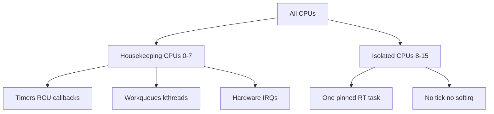

# CPU Isolation, NO_HZ & Real-Time

> **Goal:** understand how to carve CPUs out of the kernel's general-purpose scheduler, silence the timer tick on them, pin interrupts elsewhere, and achieve deterministic latency — moving from the default "fair-share for everyone" model to "these cores are mine, nothing touches them."

## Why default scheduling isn't enough

The default scheduler — [EEVDF](#/scheduling) since kernel 6.6, which replaced
CFS after fifteen years — gives every runnable task a fair, latency-weighted
slice of the CPU. It handles hundreds of tasks per core, migrates work across
cores to balance load, and relies on a periodic **timer interrupt** — the
*scheduler tick* — to account for elapsed runtime and decide when to preempt.

Depending on `CONFIG_HZ`, that tick fires 100, 250, 300, or 1000 times per
second on *every* CPU. At the common server default of `HZ=250` that is one
interrupt every 4 ms; at `HZ=1000` (many desktop and low-latency configs) it
is every 1 ms.

This design is excellent for throughput and fairness. It is actively hostile to *latency determinism*. Every tick is a forced detour into the kernel: save registers, run [`update_process_times()`](https://elixir.bootlin.com/linux/v6.12/C/ident/update_process_times), poke the scheduler, walk the timer wheels, maybe run softirqs, restore registers, return. On a warm cache that costs a few hundred nanoseconds; on a cold cache, after the tick evicts your working set, the *secondary* cost — reloading L1/L2 lines and re-warming the branch predictor — can be several microseconds.

For a high-frequency trading strategy, a real-time audio pipeline, a robot motion controller, or a [DPDK](#/networking) packet processor, one interrupt at the wrong instant means a stall that blows the budget. When your deadline is 5 µs, a single 10 µs perturbation is not a slowdown — it is a missed frame, a dropped packet, a violated safety guarantee.

The kernel offers a layered set of mechanisms to take CPUs away from general-purpose work:

1. **`isolcpus`** — remove CPUs from the scheduler's load-balancing domains at boot.
2. **`nohz_full`** — stop the periodic scheduler tick on chosen CPUs (adaptive-tick / "tickless" mode).
3. **`rcu_nocbs`** — offload RCU callback processing off those CPUs.
4. **IRQ affinity** — pin hardware interrupts to the CPUs you *aren't* protecting.

Together they split the machine into **housekeeping CPUs** (which absorb the kernel's background chores — timers, RCU, workqueues, IRQs) and **isolated CPUs** (which run one thing, uninterrupted).



## The boot-time recipe

```bash
# In /etc/default/grub, GRUB_CMDLINE_LINUX:
# Reserve CPUs 8-15 as isolated, with tick suppression and RCU offloading.
# CPUs 0-7 become housekeeping.
isolcpus=8-15 nohz_full=8-15 rcu_nocbs=8-15

# Then:
sudo update-grub    # or grubby --update-kernel=ALL --args=... on RHEL-family
sudo reboot
```

These parameters interact in ways worth knowing before you copy-paste them. Since roughly kernel 4.x, **`nohz_full=` already implies `rcu_nocbs=`** for the same CPU set — a `nohz_full` core cannot tolerate periodic RCU callback softirqs, so the kernel offloads them automatically. Listing `rcu_nocbs=8-15` is therefore belt-and-suspenders, and harmless. What `nohz_full` does *not* do is remove those CPUs from the scheduler's load-balancing domains — that is `isolcpus`'s job (or, better, a cpuset partition; see below). Set only `nohz_full` and the balancer will still happily migrate an unrelated task onto your "isolated" core.

### `isolcpus=8-15`

`isolcpus` removes the listed CPUs from every scheduling *domain* used for automatic load balancing. Internally the kernel tracks this through the **housekeeping** subsystem in `kernel/sched/isolation.c`: [`housekeeping_setup()`](https://elixir.bootlin.com/linux/v6.12/C/ident/housekeeping_setup) parses the flags into per-purpose cpumasks (one for timers, one for RCU, one for the scheduler domain, one for managed IRQs, one for unbound workqueues, and so on), and the balancer consults [`housekeeping_cpumask()`](https://elixir.bootlin.com/linux/v6.12/C/ident/housekeeping_cpumask) before it considers a CPU as a migration target.

The kernel will not *automatically* place tasks — user threads, unbound kernel threads, unbound workqueue workers — on an isolated CPU. But nothing runs there unless you send it there explicitly, via [`taskset`](https://man7.org/linux/man-pages/man1/taskset.1.html), `sched_setaffinity(2)`, or a cpuset.

Two caveats the man page buries:

- **`isolcpus` is considered a legacy/deprecated interface.** It is a static, boot-time-only decision; you cannot repartition without a reboot. The modern replacement is **cgroup v2 cpuset partitions** (below), which are dynamic. `isolcpus` still works and is still widely used because it is dead simple.
- **`isolcpus` takes flags.** The bare form `isolcpus=8-15` is shorthand for `isolcpus=domain,8-15`. You can also ask for `isolcpus=managed_irq,8-15` to keep the kernel from steering *managed* device interrupts (the automatically-spread MSI-X vectors of modern NICs and NVMe drives) onto those CPUs — something plain IRQ affinity edits cannot fix.

```bash
# Verify isolation
cat /sys/devices/system/cpu/isolated     # -> "8-15"
cat /sys/devices/system/cpu/present       # all CPUs, e.g. "0-15"
cat /sys/devices/system/cpu/nohz_full     # -> "8-15"

# Watch the local-timer interrupt (LOC) counters climb per CPU
grep -E 'CPU|LOC' /proc/interrupts        # LOC row = local APIC timer ticks
# Before nohz_full: every CPU's LOC count rises steadily.
# After:  isolated CPUs' LOC counts barely move.
```

### `nohz_full=8-15`

This is the interesting one. The periodic tick exists to answer one question — "should I preempt the running task?" — plus a few chores (update `jiffies`, drive RCU, run per-CPU timers). But if a CPU has exactly **one runnable task**, there is nobody to preempt *to*. The tick becomes pure overhead.

`nohz_full` puts the listed CPUs into **adaptive-tick mode**. When such a CPU drops to a single runnable task, the kernel stops the tick entirely and lets the task run without periodic interruption. This is different from the everyday [tickless-idle](#/timers) behaviour (`CONFIG_NO_HZ_IDLE`, on by default), which only stops the tick when the CPU goes *idle*. `nohz_full` (`CONFIG_NO_HZ_FULL=y`) stops it while the CPU is *busy running your task*.

The per-CPU state lives in **`struct tick_sched`** (`include/linux/tick.h`). The fields that matter:

- **`tick_stopped`** — a flag; nonzero means the periodic tick is currently suppressed on this CPU.
- **`last_tick` / `next_tick`** — the time of the last tick and when the next programmed one will fire.
- **`idle_jiffies`** — the `jiffies` snapshot taken when the tick stopped, used to catch up timekeeping when it restarts.

The decision to stop the full tick runs through [`can_stop_full_tick()`](https://elixir.bootlin.com/linux/v6.12/C/ident/can_stop_full_tick), which checks a chain of conditions: is there exactly one task on the runqueue? Are there no pending posix-cpu-timers? Is RCU not waiting on this CPU? Is perf not requiring the tick? Only if every check passes does the tick actually go away.

The tick still fires — occasionally — because it is *deferred*, not abolished. It comes back when:

- A second task becomes runnable on the CPU (now there is a preemption decision to make).
- A timer the task itself armed comes due — `setitimer(2)`, `timerfd_create(2)`, an `hrtimer`, a posix CPU timer, or an RCU grace period that needs this CPU's attention.
- **The residual 1 Hz tick.** Even a perfectly isolated, single-task `nohz_full` CPU takes roughly **one tick per second**. Some kernel accounting — scheduler runtime totals, cgroup CPU stats, load-average sampling — was never fully weaned off the periodic tick, so the kernel keeps a 1 Hz heartbeat as a correctness backstop. It is a known limitation, not a bug you can tune away.

There must be at least one CPU *outside* the `nohz_full` set to act as the **timekeeper** — it owns `jiffies` and the wall-clock update. Putting every CPU into `nohz_full` is a configuration error; the kernel will refuse and fall back.

```bash
# Confirm a CPU actually stopped its tick (needs CONFIG_NO_HZ_FULL + tracing)
cat /sys/kernel/tracing/per_cpu/cpu8/stats   # look at low tick/event counts

# Watch residual ticks: on a quiet isolated CPU this rises ~1/sec
watch -n1 "grep -m1 LOC /proc/interrupts"
```

### `rcu_nocbs=8-15`

[RCU (Read-Copy-Update)](#/kernel-sync) is the kernel's dominant lockless read-side synchronization mechanism. Writers install a new version of a data structure and defer freeing the old one until every CPU has passed through a *quiescent state* — a point where it provably holds no reference to the old version. A completed round of quiescent states across all CPUs is a **grace period**; when one ends, the deferred frees (RCU *callbacks*) can run.

By default each CPU processes its own callbacks in a softirq (`RCU_SOFTIRQ`)
driven by the tick. That is two problems for an isolated CPU: the softirq is
jitter, and it depends on the very tick that `nohz_full` just removed.

**`rcu_nocbs`** ("no callbacks") moves callback processing off the CPU
entirely. Each offloaded CPU gets its callbacks queued to a set of dedicated
kernel threads — you can see them as `rcuop/N` and `rcuog/N` (the
leader/follower "grace-period kthreads") — that run on housekeeping CPUs. The
isolated CPU still passes through quiescent states (it must, or grace periods
never end), but it never *invokes* callbacks.

An extra knob, **`rcu_nocb_poll`**, changes how those offload threads learn there is work: instead of being woken by an IPI from the offloaded CPU (an interrupt — jitter), the `rcuog` thread *polls* for pending callbacks. This trades a little housekeeping-CPU busy-work for the removal of one more interrupt source on the isolated CPU.

```bash
# Which CPUs are offloaded, and where callbacks go
cat /sys/kernel/debug/rcu/rcu_preempt/rcudata | head -20
# 'n_cbs_invoked' on an offloaded CPU stays ~0; the rcuop kthreads do the work.

ps -eo pid,psr,comm | grep -E 'rcuo[gp]'   # RCU offload threads and their CPUs
```

## IRQ affinity: the next layer

Hardware interrupts (NIC, NVMe, USB, timers) land wherever their affinity mask allows — by default spread across all CPUs by the `irqbalance` daemon or a round-robin default. An interrupt firing on an isolated CPU defeats everything above. Pin them to housekeeping CPUs.

```bash
# Boot-time shortcut: default affinity for all non-managed IRQs
# (add to the kernel command line)
irqaffinity=0-7

# Runtime: steer every steerable IRQ to CPUs 0-7
for d in /proc/irq/*/; do
    echo 0-7 > "${d}smp_affinity_list" 2>/dev/null || true
done

# Keep irqbalance from undoing your work
# /etc/sysconfig/irqbalance:  IRQBALANCE_BANNED_CPUS or --banirq
```

There is a category `smp_affinity` cannot touch: **managed IRQs**. Modern multi-queue devices (a NIC with 16 RX/TX queues, an NVMe drive with per-CPU submission queues) let the kernel assign one MSI-X vector per CPU and manage the mapping itself. Writing `smp_affinity_list` for those is ignored. The only lever is the boot-time `isolcpus=managed_irq,8-15` flag, which tells the kernel's spreading logic to skip isolated CPUs when it lays out managed vectors.

```bash
# MSI-X vectors backing a NIC
ls /sys/class/net/eth0/device/msi_irqs/     # one file per IRQ

# Keep receive-side scaling off the isolated cores: 8 RX queues on CPUs 0-7
ethtool -X eth0 weight 1 1 1 1 1 1 1 1 0 0 0 0 0 0 0 0
```

**Container link:** everything above is a machine-wide, boot-time decision. Inside the container world the dynamic equivalent is a [cgroup v2](#/cgroups) `cpuset` partition — the two coexist, and orchestrators lean on the cgroup side.

## The modern interface: cgroup v2 cpuset partitions

[cgroup v2](#/cgroups) is the default on every current distro (systemd mounts it as the unified hierarchy), and it offers a *dynamic* alternative to `isolcpus`. Create a child cgroup, give it an exclusive set of CPUs, and flip it into a **partition root**. The kernel then pulls those CPUs out of the parent's load-balancing domain at runtime — no reboot.

```bash
# Assumes the unified hierarchy at /sys/fs/cgroup and cpuset controller enabled
cd /sys/fs/cgroup
echo +cpuset > cgroup.subtree_control

mkdir rt
echo 8-15 > rt/cpuset.cpus            # request exclusive ownership of 8-15
echo root > rt/cpuset.cpus.partition  # promote to a partition root

cat rt/cpuset.cpus.partition          # "root" if it took; "root invalid" if it didn't
```

Setting the partition to `isolated` (rather than `root`) additionally disables load balancing *within* the partition — the effect `isolcpus` gives you, but toggleable. This is how Kubernetes' static CPU Manager policy and low-latency operators pin guaranteed pods without touching the kernel command line. Note that partitions handle scheduler-domain isolation only; you still need `nohz_full`/`rcu_nocbs` on the command line for the tick and RCU parts, because those are set up at boot.

## Real-time scheduling on isolated CPUs

Isolation removes the *noise*. Choosing a real-time scheduling policy decides *who wins* when more than one thing wants the CPU. Linux implements three real-time policies, all of which outrank the normal `SCHED_OTHER`/EEVDF class:

- **`SCHED_FIFO`** — run-to-completion at a fixed priority 1–99. A `FIFO` task runs until it blocks, yields, or a higher-priority RT task preempts it. It is never time-sliced against equal-priority peers.
- **`SCHED_RR`** — like FIFO but equal-priority tasks round-robin through a quantum (default ~100 ms, tunable via `sched_rr_timeslice_ms`).
- **`SCHED_DEADLINE`** — the highest class of all, and the most principled. Instead of a priority you specify a triple stored in **`struct sched_dl_entity`**: **`dl_runtime`** (how much CPU per period), **`dl_deadline`** (relative deadline), and **`dl_period`**. The kernel schedules by Earliest Deadline First plus a Constant Bandwidth Server. Crucially, admitting a deadline task runs through **admission control** ([`sched_dl_overflow()`](https://elixir.bootlin.com/linux/v6.12/C/ident/sched_dl_overflow)): if the requested bandwidth (`runtime/period`) would push the total above what the CPUs can guarantee, `sched_setattr(2)` returns `-EBUSY`. You cannot oversubscribe deadline tasks, which is exactly what makes them analyzable.

```bash
taskset -c 8-11 chrt -f 99 ./trading_engine   # SCHED_FIFO, priority 99, cores 8-11
chrt -r 50 ./worker                            # SCHED_RR, priority 50
# SCHED_DEADLINE has no chrt shorthand for the triple; use sched_setattr(2).
```

But an RT policy is *not* a determinism guarantee. Even a `SCHED_FIFO` priority-99 task on a fully isolated core can be stalled by things the scheduler does not control:

- A **non-maskable interrupt** (NMI) — the perf PMU, the hardware watchdog.
- A **TLB shootdown** IPI when another CPU changes a shared [page table](#/memory) and must invalidate your TLB.
- A machine-check exception.
- On non-RT kernels, any kernel path that holds a spinlock with preemption disabled.

For a *worst-case* guarantee — not just a good average — you need PREEMPT_RT.

## PREEMPT_RT: the real real-time kernel

The mainline kernel optimizes for throughput. Critical sections under `spin_lock()` disable preemption and can, in principle, run arbitrarily long; preemption is disabled outright in hundreds of places. That is fine for a web server and fatal for a motion controller.

**A milestone worth pinning: PREEMPT_RT was declared feature-complete in mainline during the 6.12 development cycle.** After roughly two decades as an out-of-tree patch set (and years of incremental merging since ~5.3), the final pieces — chiefly the reworked, non-blocking `printk()` — landed, and `CONFIG_PREEMPT_RT` became a first-class, selectable preemption model on x86-64 and arm64 without any external patch. If you are on a 6.12 kernel, enabling hard real-time is a `make menuconfig` choice, not a patch hunt.

`CONFIG_PREEMPT_RT` rewrites four rules:

1. **Sleeping spinlocks.** Most `spin_lock()` calls become `rt_mutex`-backed sleeping locks. Holding one no longer disables preemption, so a higher-priority RT task can preempt a lock holder. The handful of locks that *must* stay non-preemptible are converted to explicit **`raw_spinlock_t`** — the scheduler's own runqueue lock, low-level timer and interrupt code. `raw_spinlock` still disables preemption, by design.
2. **Threaded hard IRQs.** Interrupt handlers run in kernel threads (`irq/N-name`), which are schedulable and preemptible like any task. You can even give a critical IRQ thread a real-time priority above your own noise but below your app.
3. **Priority inheritance.** If a high-priority RT task blocks on a mutex held by a low-priority task, the holder temporarily *inherits* the waiter's priority until it releases the lock. This defeats **priority inversion** — the classic failure that famously reset the Mars Pathfinder rover. The mechanism lives in `rt_mutex`.
4. **High-resolution timers everywhere.** `CONFIG_HIGH_RES_TIMERS` gives nanosecond-granularity `hrtimer`s instead of jiffy-granularity wakeups, so an RT task woken by a timer wakes when it asked to, not at the next tick boundary.

```bash
# Am I on an RT kernel?
uname -v | grep -o PREEMPT_RT
cat /sys/kernel/realtime     # prints 1 on a PREEMPT_RT kernel

# See the threaded IRQ handlers and bump one's priority
ps -eo pid,cls,rtprio,comm | grep 'irq/'
chrt -f 80 "$(pgrep -f 'irq/24-eth0')"
```

The cost is real: PREEMPT_RT typically gives up **10–30% of peak throughput** on some workloads. Sleeping locks cost more than raw spinlocks, IRQ threading adds context switches, and the scheduler runs more often. This is the fundamental trade — **worst-case latency versus average throughput**. For a database serving mixed traffic, vanilla is faster. For anything with a hard deadline, RT is mandatory.

**Preemption models, from least to most preemptible:** `PREEMPT_NONE` (server/throughput), `PREEMPT_VOLUNTARY` (added reschedule points), `PREEMPT` (fully preemptible kernel, the desktop default, selectable at boot via `PREEMPT_DYNAMIC`), and `PREEMPT_RT` (the above). Choose the weakest one that meets your latency target.

## Measuring actual latency

You cannot tune what you cannot measure. The canonical tool is **`cyclictest`** from the `rt-tests` package: it arms a timer every *interval* microseconds, then measures how late the wakeup actually was.

```bash
cyclictest --mlockall --smp --priority=99 --interval=200 --distance=0 --duration=1h
# T: 0 ( 1234) P:99 I:200 C: 18000000 Min: 3 Act: 5 Avg: 4 Max: 12
# The single number that matters is Max — the worst wakeup latency over the run.
```

Rough expectations for `Max` (in microseconds), same hardware:

| Configuration | Typical `Max` |
|---|---|
| Loaded vanilla kernel, no isolation | 500+ µs |
| Vanilla + `isolcpus`/`nohz_full`, no RT | 50–200 µs |
| Tuned `PREEMPT_RT` + isolation | 10–20 µs |

Always measure *under load* — an idle system tells you nothing about the worst case:

```bash
stress-ng --cpu 8 --io 4 --vm 2 --timeout 1h &   # hammer the housekeeping CPUs
cyclictest --mlockall --smp --priority=99 --interval=200 --duration=1h
```

Newer kernels ship two purpose-built tracers that beat `cyclictest` for finding the *source* of a spike, both under `/sys/kernel/tracing`:

- **`osnoise`** — measures how much CPU time is stolen from a busy-looping thread and, when it finds a gap, records *what* stole it (NMI, IRQ, softirq, another thread).
- **`timerlat`** — like `cyclictest` but in-kernel, reporting both the IRQ-level and thread-level components of wakeup latency separately, so you can tell a hardware-timer problem from a scheduling problem.

```bash
cd /sys/kernel/tracing
echo osnoise > current_tracer
echo 8 > osnoise/cpus            # measure CPU 8 only
cat trace                        # per-source noise breakdown
```

## The complete isolation checklist

```
[kernel command line]
isolcpus=managed_irq,domain,8-15   -- domains + managed device IRQs
nohz_full=8-15                     -- stop the tick (implies rcu_nocbs)
rcu_nocbs=8-15                     -- explicit; offload RCU callbacks
rcu_nocb_poll                      -- poll instead of IPI for callbacks
irqaffinity=0-7                    -- default IRQ affinity to housekeeping
skew_tick=1                        -- de-synchronize per-CPU ticks (lock contention)
nosoftlockup                       -- quiet the soft-lockup detector
tsc=reliable                       -- skip periodic TSC re-validation
intel_idle.max_cstate=1            -- shallow C-states only (exit latency; see below)
processor.max_cstate=1
idle=poll                          -- never sleep the isolated CPUs (max power draw)
mitigations=off                    -- drop speculative-exec mitigations if acceptable

[runtime / cgroup v2]
echo 8-15 > /sys/fs/cgroup/rt/cpuset.cpus
echo isolated > /sys/fs/cgroup/rt/cpuset.cpus.partition
taskset -c 8-15 chrt -f 99 ./myapp

[sysctl]
kernel.sched_rt_runtime_us = -1    -- lift RT throttling (see the warning below)
vm.stat_interval = 120             -- rarer VM-stat timer
kernel.watchdog = 0                -- disable soft/hard lockup watchdog
kernel.nmi_watchdog = 0            -- disable the NMI watchdog (an NMI source)
```

Two of these deserve a warning. `idle=poll` and `intel_idle.max_cstate=1` fight the [power-management](#/power-management) subsystem on purpose: deep C-states save watts but add **exit latency** (waking from C6 can cost tens of microseconds), so latency-critical systems forbid them and burn the power. And `kernel.sched_rt_runtime_us = -1` removes the safety valve described next — do it only on cores you fully control.

## The RT throttle, and how to hang your machine

By default `kernel.sched_rt_runtime_us = 950000` and
`sched_rt_period_us = 1000000`: RT tasks may consume at most **950 ms of every
second**, reserving 5% for everything else. This exists because a `SCHED_FIFO`
priority-99 task that spins forever will otherwise starve *everything* below
it — including the `kworker` that would process your `echo` into procfs, the
RCU threads, and the console — leaving you with a wedged machine and no way
in.

The reservation is enforced per-runqueue via the `rt_bandwidth` accounting in
**`struct rt_rq`**. Setting the runtime to `-1` disables the throttle
entirely: correct for a validated, cpu-isolated RT workload, catastrophic for
a buggy one.

## The DPDK / AF_XDP extreme case

For kernel-bypass networking — [DPDK](#/networking), AF_XDP — you don't want
the scheduler to *think* about the data-plane cores at all. A DPDK poll-mode
driver stacks `isolcpus` + `nohz_full` + huge pages + `idle=poll` to reach
single-digit-microsecond wire-to-application latencies.

The core runs a busy loop reading descriptors straight from the NIC's rings:
no tick, no softirq, no scheduling decision, no syscall on the hot path. The
kernel is effectively *absent* from that CPU while your application owns it
end to end.

Huge pages matter here for the same reason the tick does: a TLB miss walking 4
KiB page tables (the x86-64 default; arm64 can use 4/16/64 KiB base pages) is
itself a source of jitter, and 2 MiB or 1 GiB pages shrink the [TLB](#/memory)
footprint dramatically.

## Follow the code (kernel v6.12)

Two paths are worth tracing: how a task pins itself, and how a busy CPU decides to stop its tick.

**Path 1 — pinning a task to an isolated CPU.** When you run `taskset -c 8 ./app`, the tool calls `sched_setaffinity(2)`. The syscall lands in [`sched_setaffinity()`](https://elixir.bootlin.com/linux/v6.12/C/ident/sched_setaffinity) (`kernel/sched/core.c`), which validates the requested mask against the task's permitted CPUs and calls [`__set_cpus_allowed_ptr()`](https://elixir.bootlin.com/linux/v6.12/C/ident/__set_cpus_allowed_ptr). That updates `task_struct->cpus_mask` and, if the task is currently on a now-forbidden CPU, hands it to the **migration** machinery to move it. The key point: this is *explicit* placement, so it succeeds even for an isolated CPU — `isolcpus` only stops the *automatic* balancer, encoded in the `housekeeping_cpumask()` checks that the balancer consults but affinity syscalls deliberately do not.

**Path 2 — stopping the tick on a busy nohz_full CPU.** On every timer interrupt, the tick handler eventually reaches the scheduler via [`sched_tick()`](https://elixir.bootlin.com/linux/v6.12/C/ident/sched_tick) (renamed from `scheduler_tick()` in 6.10), which updates the running task's runtime and, for a `nohz_full` CPU, evaluates whether the *next* tick is even needed. The tickless logic runs through the `tick_nohz_*` family in `kernel/time/tick-sched.c`:

1. [`tick_nohz_full_cpu()`](https://elixir.bootlin.com/linux/v6.12/C/ident/tick_nohz_full_cpu) tests whether this CPU is in the `nohz_full` set (a bit in `tick_nohz_full_mask`). If not, the normal periodic tick is reprogrammed and we're done.
2. If it is, [`can_stop_full_tick()`](https://elixir.bootlin.com/linux/v6.12/C/ident/can_stop_full_tick) walks its checklist: exactly one runnable task, no pending posix CPU timers, RCU not needing this CPU, perf not requiring the tick. Any failure means the tick stays.
3. If every check passes, [`tick_nohz_stop_sched_tick()`](https://elixir.bootlin.com/linux/v6.12/C/ident/tick_nohz_stop_sched_tick) sets `struct tick_sched->tick_stopped = 1`, cancels the periodic program, and arms the next `hrtimer` only for the soonest *actually-needed* event (the residual 1 Hz backstop, or a real timer the task set). The CPU returns to userspace and runs uninterrupted until that event.

When a second task wakes on that CPU, the wakeup path fires an IPI that kicks the isolated CPU back into a tick via [`tick_nohz_full_kick()`](https://elixir.bootlin.com/linux/v6.12/C/ident/tick_nohz_full_kick), restoring normal preemption — because now there is a scheduling decision to make. That IPI is precisely the interruption isolation is trying to avoid, which is why keeping *one* task per isolated core is the whole game.

## Try it yourself

```bash
# 1. Baseline worst-case latency (idle then loaded)
sudo cyclictest --mlockall --smp --priority=99 --duration=60s      # note Max
sudo stress-ng --cpu $(nproc) --timeout 65s &
sudo cyclictest --mlockall --smp --priority=99 --duration=60s      # note Max again

# 2. Add isolcpus/nohz_full/rcu_nocbs in /etc/default/grub, reboot, retest.
cat /sys/devices/system/cpu/isolated
cat /sys/devices/system/cpu/nohz_full

# 3. Watch tick activity on an isolated CPU: LOC should barely rise (~1/sec)
watch -n1 "grep -m1 LOC /proc/interrupts"

# 4. Dynamic isolation with a cgroup v2 cpuset partition (no reboot)
cd /sys/fs/cgroup
echo +cpuset > cgroup.subtree_control
mkdir rt
echo 8-9 > rt/cpuset.cpus
echo isolated > rt/cpuset.cpus.partition
cat rt/cpuset.cpus.partition            # expect "isolated"

# 5. Pin a shell into it and confirm affinity
echo $$ > rt/cgroup.procs
taskset -cp $$                          # affinity should be 8-9

# 6. Locate the noise: which source steals time from CPU 8?
cd /sys/kernel/tracing
echo 8 > osnoise/cpus
echo osnoise > current_tracer
sleep 5; cat trace | head -40
echo nop > current_tracer               # stop
```

## Check your understanding

1. You set `isolcpus=8-15`, yet `top` still shows kernel threads occasionally running on CPU 8. Why?

<details><summary>Show answer</summary>

`isolcpus` only stops the scheduler from *automatically placing* tasks. Per-CPU kernel threads (e.g. `kworker/8`, the migration thread, ksoftirqd) are bound to their CPU by design and still run there when that CPU has work. Move deferrable work off with `rcu_nocbs`, workqueue affinity, and IRQ pinning; use a cpuset `isolated` partition to keep unbound kthreads away.

</details>

2. `nohz_full` suppresses the periodic tick, but an isolated CPU still takes a timer interrupt roughly once per second. Where does it come from?

<details><summary>Show answer</summary>

The **residual 1 Hz tick**. Parts of the kernel's accounting (scheduler runtime totals, load average, cgroup CPU stats) were never fully decoupled from the periodic tick, so the kernel keeps a 1 Hz heartbeat as a correctness backstop. It is a documented limitation, not something you can tune to zero. Timers the task itself arms (`timerfd`, `hrtimer`, posix CPU timers) also bring the tick back.

</details>

3. A `PREEMPT_RT` kernel reports a 200 µs spike inside a `spin_lock` in a storage driver. How, if RT makes spinlocks preemptible?

<details><summary>Show answer</summary>

Not every lock is converted. The driver is likely holding a **`raw_spinlock_t`** — which stays non-preemptible even under PREEMPT_RT — across a slow hardware MMIO access. Raw spinlocks are used deliberately where sleeping is illegal (scheduler core, low-level IRQ/timer code, some drivers). Latency spikes under RT usually trace to a raw lock held too long, an NMI, or an SMI from firmware — none of which RT preempts.

</details>

4. A Kubernetes node boots with `isolcpus=8-15`, but kubelet reports 16 allocatable CPUs and schedules pods across all of them. What went wrong, and what fixes it?

<details><summary>Show answer</summary>

`isolcpus` is invisible to kubelet's accounting — it still sees 16 CPUs and spreads pods over the isolated ones, defeating the isolation. Fix it on the kubelet side: `--reserved-cpus=8-15` to remove them from the allocatable pool, plus `--cpu-manager-policy=static` so guaranteed pods get exclusive cores. The modern approach ties this to a cgroup v2 cpuset partition rather than the boot flag.

</details>

5. You set `kernel.sched_rt_runtime_us = -1` and every RT task on the box hangs the whole system. Why?

<details><summary>Show answer</summary>

`-1` disables **RT throttling**. The default `950000`/`1000000` reserves 5% of each second for non-RT work. Without it, a runaway `SCHED_FIFO` priority-99 task consumes 100% forever, starving the `kworker` that would process your `echo` to procfs, the RCU threads, and the console — the machine wedges with no way in. Only lift the throttle on validated, isolated RT cores.

</details>

6. `nohz_full=8-15` alone doesn't stop the scheduler from migrating an unrelated task onto CPU 8. What else must you set, and why?

<details><summary>Show answer</summary>

`nohz_full` handles the *tick* and implies `rcu_nocbs`, but it does not remove CPUs from the scheduler's load-balancing domains. You need `isolcpus=8-15` (or a cgroup v2 cpuset `isolated` partition) for that. Domain isolation and tick suppression are separate concerns handled by separate mechanisms.

</details>

7. Why do latency-critical deployments set `idle=poll` or clamp C-states, given it wastes power?

<details><summary>Show answer</summary>

Deep [C-states](#/power-management) save power but add **exit latency** — waking a core from C6 can cost tens of microseconds, which is catastrophic when your budget is single-digit microseconds. `idle=poll` keeps the isolated cores spinning in C0 so a wakeup is instantaneous. You trade watts for determinism deliberately.

</details>

## Sources & further reading

- Kernel documentation: *NO_HZ: Reducing Scheduling-Clock Ticks* — https://docs.kernel.org/timers/no_hz.html
- Kernel documentation: *CPU lists / the "isolation" boot parameters* in *The kernel's command-line parameters* — https://docs.kernel.org/admin-guide/kernel-parameters.html
- Kernel documentation: *Deadline Task Scheduling* (`SCHED_DEADLINE`, CBS, admission control) — https://docs.kernel.org/scheduler/sched-deadline.html
- Kernel documentation: *cgroup v2* (`cpuset.cpus.partition`, isolated partitions) — https://docs.kernel.org/admin-guide/cgroup-v2.html
- Kernel documentation: *OS Noise Tracer* and *Timerlat Tracer* — https://docs.kernel.org/trace/osnoise-tracer.html
- man page: `sched(7)` — scheduling policies (`SCHED_FIFO`, `SCHED_RR`, `SCHED_DEADLINE`) — https://man7.org/linux/man-pages/man7/sched.7.html
- man page: `cpuset(7)` — https://man7.org/linux/man-pages/man7/cpuset.7.html
- Jonathan Corbet, "The real-time Linux kernel enters the mainline" — LWN.net coverage of the 6.12 PREEMPT_RT merge.
- Kernel source for the tickless and isolation subsystems — https://elixir.bootlin.com/linux/v6.12/source/kernel/time/tick-sched.c and https://elixir.bootlin.com/linux/v6.12/source/kernel/sched/isolation.c

---

**Next:** the kernel doesn't just orchestrate performance — it actively defends against vulnerabilities in the CPU hardware itself. Spectre, Meltdown, L1TF, MDS, and the cascade of speculative-execution [mitigations](#/cpu-mitigations) that cost every datacenter measurable throughput.
