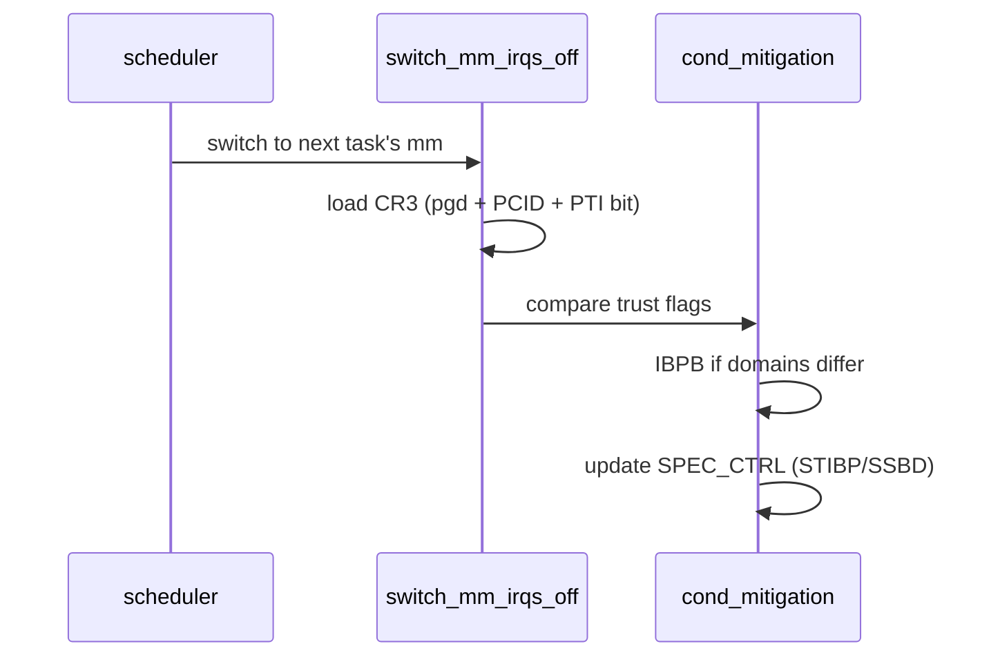

# CPU Vulnerability Mitigations

> **Goal:** understand the speculative execution vulnerabilities disclosed since 2018 — Spectre, Meltdown, L1TF, MDS, and the cascade that followed — and what the Linux kernel does about them: the page table isolation, the indirect branch barriers, the flushes at context switch, and the measurable performance cost of being secure.

## Speculative execution: the root of everything

Modern CPUs don't execute instructions one at a time. They *speculate*: the CPU guesses which way a branch will go, executes ahead down the predicted path, and if the guess was wrong, discards ("squashes") the results. Architecturally — in the register and memory state your program can see — nothing wrong happened. But the discarded work leaves *microarchitectural* traces: lines pulled into the cache, entries left in the branch predictor, TLB fills, buffer contents. Those traces are the side-channels that every post-2017 CPU vulnerability exploits.

```text
if (user_controlled_index < array_length) {
    y = kernel_array[user_controlled_index];  ← speculatively executed even if index is out of bounds!
}
// Architecturally: nothing happens (bounds check failed)
// Microarchitecturally: kernel_array[index] is now in cache
// Attacker measures cache timing → reads kernel memory
```

Two properties make this work. First, the CPU speculates *past* the bounds check because the check's outcome isn't known yet — the load address is computed and issued long before the comparison retires. Second, speculation windows are large: on a modern Intel or AMD core the reorder buffer holds 300–600+ in-flight micro-ops, so hundreds of instructions can execute on a mispredicted path before the machine notices and rolls back. That is more than enough to encode a secret bit into cache state and then leak it with a FLUSH+RELOAD timing loop that resolves a cache hit (~30–70 cycles) from a miss (~200–300 cycles).

The fix isn't easy because speculation *is* the performance. Turn it off and general-purpose code runs 5–10× slower. So none of the mitigations "disable speculation." They **constrain** it: block speculative access to secrets, or scrub the traces before crossing a security boundary. That boundary — user vs. kernel, guest vs. host, one SMT sibling vs. the other — is the whole story. See [Kernel, User Space & Syscalls](#/kernel-vs-userspace) for the privilege model these attacks subvert.

## The vulnerability taxonomy

Every one of these reads *across a privilege boundary* using speculation. What differs is which predictor or buffer is abused and which boundary leaks.

| Class | CVE | What | Boundary crossed | Kernel mitigation |
|---|---|---|---|---|
| **Meltdown** | CVE-2017-5754 | Read kernel memory from user space | User → Supervisor | KPTI (formerly KAISER) |
| **Spectre v1** | CVE-2017-5753 | Bounds-check bypass | Any | `array_index_nospec()` / `lfence` barriers |
| **Spectre v2** | CVE-2017-5715 | Branch target injection | Any | Retpoline, IBPB, (e)IBRS, STIBP |
| **Spectre v4** | CVE-2018-3639 | Speculative store bypass | Any | SSBD (Speculative Store Bypass Disable) |
| **L1TF** | CVE-2018-3615 | L1 Terminal Fault | Guest → Host | PTE inversion, L1D flush on VM-entry |
| **MDS** | CVE-2018-12126 | Microarchitectural Data Sampling | Kernel → User | CPU buffer clear (VERW) on exit |
| **SWAPGS** | CVE-2019-1125 | Speculative SWAPGS | User → Kernel | `lfence` after SWAPGS |
| **TSX Async Abort** | CVE-2019-11135 | TSX abort fills buffers with stale data | Any | TSX disable, VERW clear |
| **SRBDS** | CVE-2020-0543 | Special Register Buffer Data Sampling | Cross-core | Microcode update |
| **BHI** | CVE-2022-0001 | Branch History Injection | Any | Software loop + `BHI_DIS_S` |
| **Retbleed** | CVE-2022-29901 | Return stack buffer injection | Any | IBRS / untrained return thunks |
| **SRSO** | CVE-2023-20569 | Speculative Return Stack Overflow (Zen 3/4) | Any | Software sequence + IBPB |
| **GDS** | CVE-2022-40982 | Gather Data Sampling (Intel) | Cross-VM | Microcode, `GDS_MITG` MSR |
| **RFDS** | CVE-2023-28746 | Register File Data Sampling (Intel Atom) | Kernel → User | VERW clearing |
| **Native BHI** | CVE-2024-2201 | Native Branch History Injection | Any | `BHI_DIS_S` (Intel eIBRS bit) + SW loop |

This list is not complete and never will be — a new speculation primitive lands roughly every year. The kernel's strategy has shifted accordingly: from "patch each CVE with a bespoke sequence" to "build reusable clearing infrastructure" (a single VERW-on-exit path now covers MDS, TAA, and RFDS at once).

## KPTI: Kernel Page-Table Isolation (Meltdown)

Before Meltdown, every process's page tables mapped *both* user space and the entire kernel. Kernel PTEs had the supervisor (U/S) bit clear, so a user-mode load faulted with #PF — architecturally correct. But the fault is delivered only when the instruction *retires*. Speculatively, the load completed, returned the kernel byte, and the dependent load using that byte as an index touched the cache. Meltdown reads kernel memory at roughly 500 KB/s to a few MB/s.

KPTI (kernel 4.15, `CONFIG_PAGE_TABLE_ISOLATION=y`, default on affected x86-64) makes the kernel *absent* rather than merely privileged. Each process gets two top-level page tables:

- **User page table**: maps user space plus a tiny "trampoline" of kernel entry stubs and per-CPU data. The bulk of the kernel — text, direct map, page cache — is simply not mapped. There is no PTE to speculate through.
- **Kernel page table**: maps everything, installed on every syscall/interrupt entry.

```text
    Process page tables before KPTI:          After KPTI:
    ┌─────────────────────────┐              ┌─────────────┐ ┌─────────────┐
    │ 0xffff...80000000       │ kernel       │ user table  │ │ kernel table│
    │ (kernel text/data)      │              ├─────────────┤ ├─────────────┤
    │ 0xffff...88000000       │              │ user space  │ │ user space  │
    │ (direct map)            │              │  (mapped)   │ │  (mapped)   │
    ├─────────────────────────┤              │ kernel      │ │ kernel      │
    │ 0x00007f...             │ user         │ (UNMAPPED)  │ │  (mapped)   │
    │ (user code/data/stack)  │              └─────────────┘ └─────────────┘
    └─────────────────────────┘
```

The two tables are laid out as adjacent PGDs: the kernel PGD occupies one page, the user PGD the next, so switching between them is a single bit flip in the CR3 value (bit 12, `PTI_USER_PGTABLE_BIT`). On every `syscall`/interrupt the entry asm writes the kernel CR3; on `sysret`/`iret` it writes the user CR3. Each CR3 write on a machine *without* PCID flushes the entire TLB — ~1,000+ cycles, plus the refill misses afterward.

That is where **PCID** (Process-Context Identifiers, x86 since Haswell) earns its keep. PCID tags each TLB entry with a 12-bit address-space ID, so the CPU keeps user and kernel translations resident simultaneously. Switching CR3 with the no-flush bit set (bit 63) then costs a few hundred cycles instead of a full flush plus refill. KPTI reserves two PCIDs per real ASID — one for the user table, one for the kernel table — which is why `nopcid` on the command line makes a KPTI machine noticeably slower. The page table machinery itself is covered in [Virtual Memory](#/memory).

```bash
# Is KPTI active?
dmesg | grep -i "page table isolation"
# Kernel/User page tables isolation: enabled

cat /sys/devices/system/cpu/vulnerabilities/meltdown
# Mitigation: PTI

grep pcid /proc/cpuinfo | head -1     # does the CPU support PCID at all?
```

Modern silicon (Intel from ~Cascade Lake/Ice Lake, all AMD) is not vulnerable to Meltdown, so KPTI is auto-disabled there and the `meltdown` file reads `Not affected` — the CR3 dance disappears entirely.

## Spectre v1: teaching the compiler to distrust bounds checks

Spectre v1 (bounds-check bypass) can't be fixed by a global MSR or a page table trick, because the leaking access is ordinary in-bounds-looking code. The kernel handles it *per site*. The workhorse is [array_index_nospec()](https://elixir.bootlin.com/linux/v6.12/C/ident/array_index_nospec), a macro that turns the bounds check into a data dependency:

```c
if (index < size) {
    index = array_index_nospec(index, size);  // returns 0 (all-ones mask) if OOB
    val = array[index];                        // speculation now sees a clamped index
}
```

Internally it computes a mask with no branch (`(index < size) ? ~0 : 0`) using compare-and-subtract, then ANDs the index with it. Because the CPU can't speculate around a *data* dependency the way it speculates around a *branch*, an out-of-bounds index is forced to 0 on the speculative path too. Kernel developers add these by hand at boundaries where userspace controls an index — syscall multiplexers, BPF map lookups, and similar. There is no way to auto-insert them everywhere without wrecking performance, so Spectre v1 remains a code-audit problem; `smp_rmb()`/`lfence` barriers cover the cases where a full ordering fence is cheaper than a mask.

## Spectre v2: the retpoline saga

Spectre v2 is branch *target* injection. The attacker trains the Branch Target Buffer (BTB) so that an indirect `jmp`/`call` in the victim (the kernel) speculatively jumps to an attacker-chosen gadget, which does the secret-touch-then-cache trick. Any indirect branch in the kernel is a potential victim, and the kernel has thousands of them (every `struct file_operations->read`, every netfilter hook, every driver callback).

**Retpoline** ("return trampoline", kernel 4.15) replaces every indirect branch with a construct that funnels speculation into a dead-end loop while the architectural path takes a `ret` off a freshly-controlled return stack:

```asm
; Instead of:  call *%rax           (indirect call — BTB-speculatable)
; Retpoline (__x86_indirect_thunk_rax):
    call load_label                 ; pushes real return addr onto the RSB
capture_spec:
    pause                           ; keep the speculative path spinning here
    lfence
    jmp capture_spec                ; ...harmlessly, forever
load_label:
    mov %rax, (%rsp)                ; overwrite RSB top with the true target
    ret                             ; architecturally returns to *%rax
```

The magic: `ret` predicts its target from the Return Stack Buffer (RSB), not the BTB. Speculation follows the RSB to `capture_spec`, spins, and gets squashed; the real return goes to the correct target. Attacker BTB training is irrelevant because the branch the CPU actually speculates on is a `ret`, not the indirect call. The kernel installs these thunks at build time (`CONFIG_MITIGATION_RETPOLINE`) and patches the exact form at boot via alternatives — [x86_indirect_thunk](https://elixir.bootlin.com/linux/v6.12/C/ident/__x86_indirect_thunk_array). Cost: roughly 1–5% on indirect-heavy paths (VFS, networking, KVM).

On newer parts, **eIBRS** (enhanced Indirect Branch Restricted Speculation) does it in hardware: the core tags predictions with the privilege level, so kernel-mode indirect branches simply can't consume user-trained BTB entries. The kernel sets one MSR bit once and pays near-zero per-branch cost.

### The full Spectre v2 mitigation stack

Real deployments layer several mechanisms, because retpoline/eIBRS alone don't cover RSB underflow, cross-SMT training, or cross-process training:

| Mechanism | What it does | When it fires |
|---|---|---|
| **Retpoline** | Thunk all indirect branches | Compile time, all kernel code |
| **eIBRS / IBRS** | MSR bit restricts BTB use in kernel mode | Kernel entry (eIBRS: set once) |
| **STIBP** | Single-Thread Indirect Branch Predictor: sibling can't train your BTB | When SMT is on, per-task via prctl |
| **IBPB** | Flush the entire BTB | Context switch between distrusting tasks |
| **RSB filling** | Overfill the RSB with benign targets | Kernel/VM entry, prevents RSB underflow → BTB fallback |
| **PBRSB / BHI** | Extra barriers for post-barrier RSB and branch-history injection | VM exit; eIBRS parts add `BHI_DIS_S` |

**IBPB** (Indirect Branch Prediction Barrier) is a full BTB wipe issued on a context switch *between mutually distrusting processes* — expensive (thousands of cycles of cold predictor afterward), so it's conditional by default: the kernel issues it only when the incoming and outgoing tasks are in different trust domains, controlled per-task with `prctl(PR_SET_SPECULATION_CTRL, PR_SPEC_INDIRECT_BRANCH, ...)` and automatically for `seccomp`-confined tasks. This ties directly into container isolation.

> **Container link:** each container's processes share a kernel with every other container's. Without IBPB/STIBP a process in one container could train predictors that a process in another consumes. Runtimes that apply `seccomp` (all of them, by default — see [Docker, containerd, runc](#/container-runtimes)) opt those tasks into conditional IBPB automatically. The [Namespaces](#/namespaces) boundary is a kernel abstraction; the BTB is real silicon shared by every namespace on the core.

```bash
cat /sys/devices/system/cpu/vulnerabilities/spectre_v2
# Mitigation: Enhanced / Automatic IBRS, IBPB: conditional, RSB filling,
#             PBRSB-eIBRS: SW sequence, BHI: BHI_DIS_S

cat /sys/devices/system/cpu/smt/control   # on off forceoff notsupported ...
```

## L1TF and the virtualization nightmare

L1 Terminal Fault (L1TF / Foreshadow) is the one that terrifies cloud providers. When a PTE has its Present bit clear, the CPU still speculatively forwards the *physical address bits left in that PTE* to the L1 data cache — and if some other context's data sits at that L1 line, a guest can read it. In a virtualized world the guest controls its own page tables, so a malicious guest can craft PTEs whose physical bits point at host memory and speculatively read whatever the host left in L1: other guests, host kernel secrets, anything.

Three layers defend the host (see [KVM & Virtualization Internals](#/kvm-internals) for the VM-entry path):

1. **PTE inversion**: when the host clears a PTE's Present bit (swap, non-present mappings), it *inverts* the high physical-address bits so any speculative forward points at non-existent, un-cached physical memory. This is free and always on. [array_index_nospec](https://elixir.bootlin.com/linux/v6.12/C/ident/array_index_nospec)'s sibling logic; the swap-entry encoding was reworked so the top bits are always set for non-present entries.
2. **L1D flush on VM-entry**: before [vmx_l1d_flush()](https://elixir.bootlin.com/linux/v6.12/C/ident/vmx_l1d_flush) hands control to a guest, it flushes the entire L1 data cache (either a microcode command via the `FLUSH_CMD` MSR, or a hand-rolled 64 KB read loop). Cost: ~1,000–2,200 cycles per entry, brutal on exit-heavy guests.
3. **Core scheduling / `nosmt`**: L1 is shared by both SMT siblings, so even a flushed L1 refills instantly with the *other* thread's data mid-guest. The only complete fixes are disabling SMT or **core scheduling** — never co-scheduling threads from different trust domains on one core (see [CPU Isolation, NO_HZ & Real-Time](#/cpu-isolation)).

```bash
cat /sys/devices/system/cpu/vulnerabilities/l1tf
# Mitigation: PTE Inversion; VMX: conditional cache flushes, SMT vulnerable

cat /sys/module/kvm/parameters/l1d_flush     # never / cond / always
```

Like Meltdown, L1TF affects only older Intel cores (Nehalem through Coffee Lake); Ice Lake and later, and all AMD, read `Not affected`.

## MDS, TAA, and friends: one VERW to clear them all

A whole family — MDS, TSX Async Abort, and later RFDS — leaks data not from memory but from tiny internal staging buffers: line-fill buffers, load ports, store buffers. Values a previous context stashed there can be speculatively sampled by the next context. There's no address to protect and no page table trick; the buffers just have to be *emptied* before crossing back to a less-privileged domain.

Intel's answer is a repurposed instruction: **VERW** with a memory operand, when microcode is updated, overwrites those buffers as a side effect. The kernel runs it on the way out to user space and on VM-entry. In 6.12 this is the `CLEAR_CPU_BUFFERS` alternative macro, patched into the `sysret`/`iret`/VM-entry paths and a no-op on unaffected CPUs.

```asm
; The "clear buffers on exit" sequence, patched inline before returning to user:
verw   mds_verw_sel(%rip)     ; scrub fill/load/store buffers (microcoded)
; ~30–70 cycles on affected parts; nop on unaffected parts
```

```bash
cat /sys/devices/system/cpu/vulnerabilities/mds
# Mitigation: Clear CPU buffers; SMT vulnerable
cat /sys/devices/system/cpu/vulnerabilities/tsx_async_abort
# Mitigation: TSX disabled
```

Because MDS also leaks across SMT siblings *within* a speculation window, "Clear CPU buffers" alone still reports **SMT vulnerable** — clearing on exit doesn't help while both siblings run concurrently. That's why the strongest MDS posture is `mitigations=auto,nosmt`.

## Follow the code (kernel v6.12)

**Path 1 — deciding what to turn on, at boot.** On x86-64, [arch_cpu_finalize_init()](https://elixir.bootlin.com/linux/v6.12/C/ident/arch_cpu_finalize_init) calls [cpu_select_mitigations()](https://elixir.bootlin.com/linux/v6.12/C/ident/cpu_select_mitigations) (in `arch/x86/kernel/cpu/bugs.c`) once CPU feature detection has run. It is a straight sequence of per-vulnerability selectors, each reading the CPU's `x86_bug` flags and the command line:

1. It first computes the global `x86_spec_ctrl_base` — the baseline value written to the `IA32_SPEC_CTRL` MSR (holding the IBRS/STIBP/SSBD enable bits).
2. [spectre_v1_select_mitigation()](https://elixir.bootlin.com/linux/v6.12/C/ident/spectre_v1_select_mitigation) picks between `lfence` and the userspace-barrier stance.
3. [spectre_v2_select_mitigation()](https://elixir.bootlin.com/linux/v6.12/C/ident/spectre_v2_select_mitigation) chooses retpoline vs. (enhanced/automatic) IBRS, decides RSB filling, and enables the BHI software loop on eIBRS parts. It patches the indirect-thunk alternatives to match.
4. [mds_select_mitigation()](https://elixir.bootlin.com/linux/v6.12/C/ident/mds_select_mitigation), [taa_select_mitigation()](https://elixir.bootlin.com/linux/v6.12/C/ident/taa_select_mitigation), and the RFDS selector converge on whether to patch in the `CLEAR_CPU_BUFFERS` (VERW) sequence.
5. [l1tf_select_mitigation()](https://elixir.bootlin.com/linux/v6.12/C/ident/l1tf_select_mitigation) sets the KVM L1D-flush mode and may print the SMT warning.

Every decision is logged; that's what `dmesg | grep -iE 'spectre|mds|l1tf'` shows. The results end up as boot-time code patches (via the alternatives framework) plus per-CPU MSR state — so on unaffected hardware the mitigation instructions literally aren't in the running kernel.

**Path 2 — STIBP/IBPB at context switch.** When the scheduler switches to a new task's address space, [switch_mm_irqs_off()](https://elixir.bootlin.com/linux/v6.12/C/ident/switch_mm_irqs_off) (`arch/x86/mm/tlb.c`) loads the new `struct mm_struct`'s page tables (the `pgd`, encoded into CR3 with the right PCID and the KPTI user-bit) and then calls [cond_mitigation()](https://elixir.bootlin.com/linux/v6.12/C/ident/cond_mitigation). That helper compares the outgoing and incoming tasks' trust flags (`TIF_SPEC_IB` in `struct thread_info`) and:

- issues an [indirect_branch_prediction_barrier()](https://elixir.bootlin.com/linux/v6.12/C/ident/indirect_branch_prediction_barrier) (IBPB) if the domains differ and conditional IBPB is armed, wiping the BTB before the new task runs;
- calls into [__speculation_ctrl_update()](https://elixir.bootlin.com/linux/v6.12/C/ident/__speculation_ctrl_update) (`arch/x86/kernel/process.c`) to recompute the per-task `IA32_SPEC_CTRL` value, flipping STIBP and SSBD to match the new task before writing the MSR.

So the cost of Spectre v2 mitigation is not paid uniformly: two threads in the *same* trust domain switch with no IBPB and no MSR write, while a switch across a `seccomp`/prctl boundary pays the full BTB flush. This is the hook the scheduler ([CPU Scheduling](#/scheduling), EEVDF since 6.6) and container runtimes lean on.



## The mitigation control infrastructure

The kernel exposes every decision under one directory (`CONFIG_GENERIC_CPU_VULNERABILITIES`, x86 since 4.15, unified format since ~5.2). Each file is backed by a `cpu_show_*()` function in `bugs.c`:

```bash
ls /sys/devices/system/cpu/vulnerabilities/
# gather_data_sampling  itlb_multihit  l1tf  mds  meltdown  mmio_stale_data
# reg_file_data_sampling  retbleed  spec_rstack_overflow  spec_store_bypass
# spectre_v1  spectre_v2  srbds  tsx_async_abort

grep . /sys/devices/system/cpu/vulnerabilities/*    # one-shot full report
```

The boot command line is the master control:

```bash
mitigations=off         # disable ALL mitigations (10-30% faster, zero protection)
mitigations=auto        # default: enable what this CPU needs
mitigations=auto,nosmt  # auto + offline SMT siblings (for L1TF/MDS across threads)
spectre_v2=off          # target one class
pti=off                 # disable KPTI — only if CPU is Meltdown-immune
l1tf=off  mds=off       # per-vulnerability opt-out
```

```bash
cat /proc/cmdline       # what you actually booted with
```

### The `nosmt` hammer

When a vulnerability leaks across SMT siblings (L1TF, MDS, TAA), clearing-on-exit is not enough — both threads run at once and share L1 and the buffers. The blunt fix is to offline every sibling:

```bash
cat /sys/devices/system/cpu/smt/control     # on off forceoff notsupported notimplemented
echo off > /sys/devices/system/cpu/smt/control   # offline sibling threads → ~half the logical CPUs
```

Cloud providers face a genuinely hard trade-off: kill SMT (lose ~20–50% throughput) or risk guest-to-guest leaks. Most chose **core scheduling** instead — the kernel's `SCHED_CORE` feature groups tasks by a cookie and guarantees a core's two siblings always belong to the same trust domain, recovering most SMT throughput while closing the cross-thread channel.

## Performance impact: real numbers

Measured on a Xeon Gold 6154 (Skylake, fully mitigated) — Skylake is roughly the worst case because it pre-dates in-silicon fixes:

| Workload | Mitigations on | Mitigations off | Overhead |
|---|---|---|---|
| Kernel compile | 100% | 115% | −13% |
| PostgreSQL OLTP | 100% | 128% | −22% |
| Nginx HTTP (small files) | 100% | 118% | −15% |
| Redis GET | 100% | 155% | −35% |
| iperf3 TCP (loopback) | 100% | 140% | −29% |
| KVM nested VM (CPU-heavy) | 100% | 160% | −37% |

The pattern is consistent: cost scales with *boundary crossings*, not raw compute. Syscall-heavy servers (Redis, loopback networking) pay the KPTI CR3 switch on every syscall entry/exit; the [TCP stack](#/tcp-congestion) suffers doubly from that plus retpoline on packet-processing indirect calls. Databases eat retpoline/IBRS on every VFS and filesystem indirect branch. KVM takes the worst hit from L1D flushes on VM-entry.

On Ice Lake+ (Intel) and Zen 3+ (AMD) most of this collapses. Those parts aren't vulnerable to Meltdown or L1TF at all (no KPTI, no L1D flush), and eIBRS / automatic IBRS replaces per-branch retpoline with a one-time MSR bit. The same benchmarks typically show low-single-digit overhead. The lesson for capacity planning: the "cost of mitigations" is overwhelmingly a *hardware generation* question, not a Linux question.

## Try it yourself

```bash
# Full vulnerability status, one line each
grep . /sys/devices/system/cpu/vulnerabilities/*

# Which mitigations did this boot select, and why?
dmesg | grep -iE 'spectre|meltdown|mds|l1tf|kpti|retpoline|ibrs|stibp|srso|retbleed'

# Does the CPU even support the cheap escape hatches?
grep -o -E 'pcid|ibrs|ibpb|stibp|ssbd|flush_l1d' /proc/cpuinfo | sort -u

# Kernel config for mitigation features (needs CONFIG_IKCONFIG)
zgrep -E 'PAGE_TABLE_ISOLATION|MITIGATION_RETPOLINE|CPU_IBPB|CPU_IBRS' /proc/config.gz 2>/dev/null

# x86 debug knobs (root, CONFIG_DEBUG_FS)
cat /sys/kernel/debug/x86/pti_enabled     # 1 = KPTI active

# Count speculation barriers actually compiled into the running kernel
objdump -d /boot/vmlinuz-$(uname -r) 2>/dev/null | grep -c 'lfence' || \
  echo "vmlinuz is compressed; extract with scripts/extract-vmlinux first"

# See which tasks opted into extra speculation control (prctl/seccomp)
grep -i Speculation_Store_Bypass /proc/self/status

# Measure the KPTI syscall tax on an affected CPU: kernel-mode cycles per syscall
perf stat -e cycles:k --repeat 5 -- bash -c 'for i in $(seq 100000); do : ; done'

# Compare a getpid-hammer with pti on vs off (reboot with pti=off in a VM only)
perf bench syscall basic 2>/dev/null || strace -c -e trace=getpid true
```

## Check your understanding

1. A Skylake Xeon shows 35% overhead with `mitigations=auto`; an Ice Lake Xeon shows 3% on the identical workload. What changed?

<details><summary>Show answer</summary>

The hardware generation, not the software. Ice Lake isn't vulnerable to Meltdown or L1TF (so KPTI and the L1D flush vanish), and it has eIBRS/automatic IBRS in silicon — a one-time MSR bit instead of a retpoline on every indirect branch. On Skylake the same protections are dozens of extra instructions on every syscall, VM-entry, and indirect call.

</details>

2. Why does KPTI lean on PCID, and what happens if you boot `nopcid`?

<details><summary>Show answer</summary>

KPTI switches CR3 on every syscall entry and exit. Without PCID each CR3 write flushes the whole TLB (~1,000+ cycles plus refill misses). PCID tags TLB entries with an address-space ID and lets the switch use the no-flush bit, so both user and kernel translations stay resident and the switch costs a few hundred cycles. With `nopcid`, every transition pays a full TLB flush, so a KPTI machine gets dramatically slower on syscall-heavy work.

</details>

3. Your Kubernetes node disables SMT for L1TF, yet `kubectl describe node` shows the same CPU count. Why?

<details><summary>Show answer</summary>

kubelet computes node capacity from the logical CPUs it saw at startup (via cAdvisor / `/proc/cpuinfo`). Offlining SMT siblings at runtime through `/sys/devices/system/cpu/smt/control` doesn't notify kubelet, and `Allocatable` isn't recomputed until the kubelet restarts. The scheduler keeps placing pods against a capacity that no longer physically exists — you must set `nosmt` at boot and restart kubelet, or the node oversubscribes.

</details>

4. Retpoline funnels indirect branches through a `ret`. Why can't the attacker just poison the Return Stack Buffer instead of the BTB?

<details><summary>Show answer</summary>

The `ret` in a retpoline consumes an RSB entry that the matching `call` pushed *microseconds earlier in the same thunk* — the true target is on top of the RSB when the `ret` executes. Speculation that follows a stale/poisoned RSB entry lands in the `pause; lfence; jmp` dead-end loop and is squashed. Retpoline's weakness is RSB *underflow* (empty RSB falling back to the BTB), which is why the kernel also does RSB filling on kernel/VM entry — and why Retbleed later forced IBRS on some parts.

</details>

5. MDS reports `Mitigation: Clear CPU buffers; SMT vulnerable` even though the VERW runs on every exit to user space. Why is it still "SMT vulnerable"?

<details><summary>Show answer</summary>

VERW scrubs the internal buffers only *at the boundary* — when one thread returns to user space. But the two SMT siblings execute simultaneously and share those fill/load/store buffers, so while both threads are running, one can sample data the other just loaded, inside a speculation window that no exit-time clear can reach. Closing it fully requires `nosmt` or core scheduling so distrusting tasks never share a core.

</details>

6. A real-time deployment runs `mitigations=auto` on housekeeping CPUs but `mitigations=off` on isolated cores for latency. Why can this still leak the isolated workload's data?

<details><summary>Show answer</summary>

Mitigations are largely about *microarchitectural* state, and much of that state is shared beyond a single core: the L3 cache, the memory interconnect, and (for SMT siblings) L1 and internal buffers. An unmitigated isolated core can serve as a speculation gadget, and a mitigated-but-adjacent core can still observe leaked traces through shared caches. Per-CPU `mitigations=off` is not a security boundary — trust decisions have to cover every core that shares state with the secret.

</details>

7. Why can the kernel auto-insert retpolines everywhere but *not* auto-insert `array_index_nospec()` everywhere?

<details><summary>Show answer</summary>

Retpoline mechanically rewrites a well-defined instruction pattern (indirect `call`/`jmp`) that the compiler already recognizes, so a blanket transform is correct and cheap. Spectre v1 is a *semantic* problem: only some bounds checks guard a secret-dependent access, and clamping every array index in the kernel would add a data-dependent mask to enormous amounts of hot code for no benefit. So `array_index_nospec()` is placed by human audit at the specific user-controlled-index sites that matter.

</details>

## Sources & further reading

- Kernel docs: hardware vulnerabilities index — <https://docs.kernel.org/admin-guide/hw-vuln/index.html> (per-vuln pages for spectre, l1tf, mds, tsx_async_abort, srso, gather_data_sampling)
- Kernel docs: Spectre side channels — <https://docs.kernel.org/admin-guide/hw-vuln/spectre.html>
- Kernel docs: kernel parameters (`mitigations=`, `pti=`, `nosmt`, `spectre_v2=`) — <https://docs.kernel.org/admin-guide/kernel-parameters.html>
- x86 mitigation source of truth: `arch/x86/kernel/cpu/bugs.c` — <https://elixir.bootlin.com/linux/v6.12/source/arch/x86/kernel/cpu/bugs.c>
- KPTI CR3-switch and PCID handling: `arch/x86/mm/tlb.c` — <https://elixir.bootlin.com/linux/v6.12/source/arch/x86/mm/tlb.c>
- Jann Horn (Project Zero), "Reading privileged memory with a side-channel" — the original Spectre/Meltdown disclosure
- LWN, "The current state of kernel page-table isolation" (Jonathan Corbet) — <https://lwn.net/Articles/741878/>
- man7: `prctl(2)` — `PR_SET_SPECULATION_CTRL` — <https://man7.org/linux/man-pages/man2/prctl.2.html>

---

**Next:** Part VII — the kernel as a programmable platform. We start with [eBPF Internals](#/ebpf-internals): the constrained in-kernel virtual machine that powers observability, networking, security, and tracing. Programs, maps, helpers, BTF, CO-RE, and the verifier that makes it safe.
