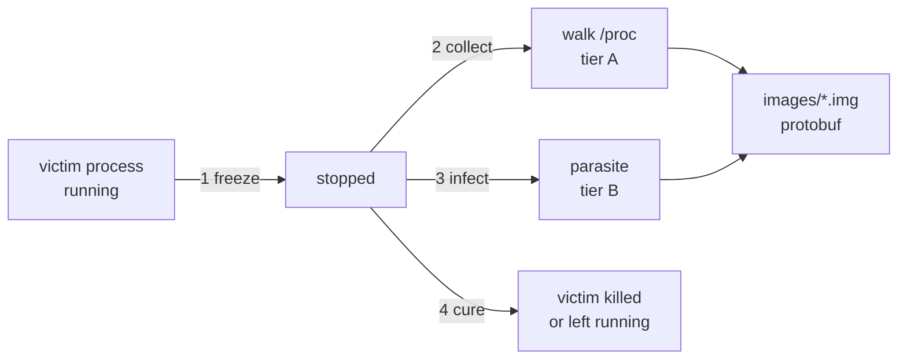
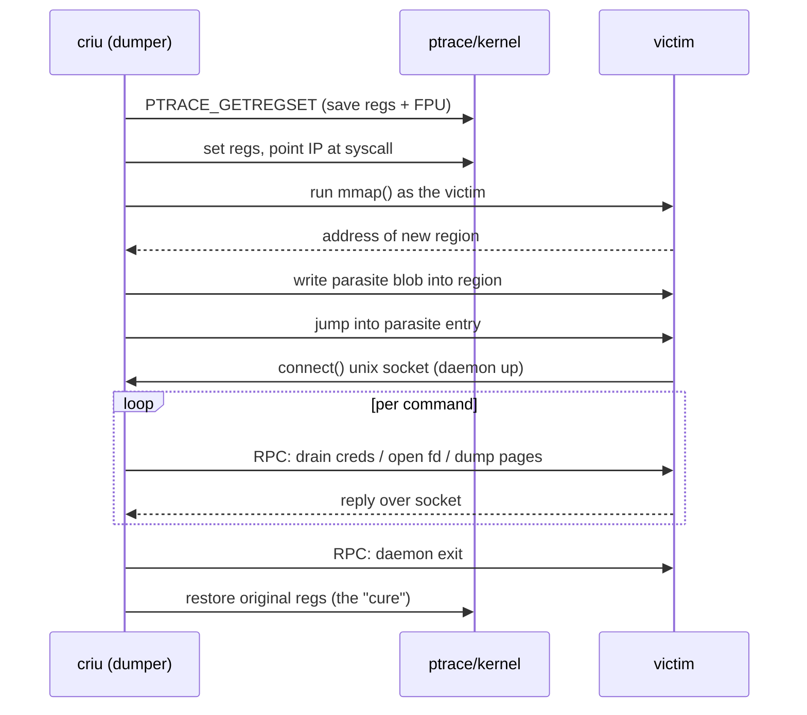

# CRIU: Dumping a Live Process

> **Goal:** watch a userspace program reach *into* a running process, freeze
> it, read out every scrap of its state through `/proc`, inject a **parasite**
> to drain the parts `/proc` won't hand over, and serialize the whole thing to
> a directory of protobuf files — all without the kernel having any "dump a
> process" syscall. This is the checkpoint half of checkpoint/restore.

## The audacity of the idea

[Process State & Its Three Tiers](#/process-state) laid out the problem: a live
process is a bundle of state spread across **tier A** (visible in `/proc`),
**tier B** (kernel-internal, reachable only *as* the process), and **tier C**
(truly kernel-private). To checkpoint a process you must capture A and B
completely, then later rebuild the task from that capture. The obvious place to
do this is *inside the kernel* — it already owns every byte of the state.

That is exactly what the first attempts did, and exactly why they failed.
Oren Laadan's **Zap**/Linux-CR carried a full in-kernel checkpoint/restart
implementation for years; it was repeatedly rejected upstream (LWN covered the
saga in 2011: *"Checkpoint/restart (mostly) in user space"*). The objection was
maintainability — serializing every kernel structure means the C/R code must
change in lockstep with every subsystem forever, an unbounded tax on the whole
kernel.

**CRIU** — *Checkpoint/Restore In Userspace* — is the answer that stuck. Born
around 2011 out of the OpenVZ / Parallels team (Pavel Emelyanov, Andrey Vagin,
Cyrill Gorcunov and others), its bet was inverted: do the serialization in an
ordinary userspace program, and ask the kernel only for the *minimum* set of
introspection primitives it can't fake — a richer `/proc`, `PTRACE_SEIZE`,
`process_vm_readv`, a readable `pagemap`, `kcmp`, `NS_GET_*` ioctls,
`TCP_REPAIR`. Each of those is a small, independently-useful hook that other
tools want anyway. The kernel exposes state; the *policy* of what to save and
how to encode it lives entirely in userspace, where it can iterate freely.

The result looks impossible the first time you see it: a program named `criu`,
running as a normal process, walks up to another live process, and writes an
image sufficient to reconstruct its **supported** state — memory, open files,
credentials, threads, pending signals — into a handful of files. It is not magic and it is not a debugger
trick bolted together. It is a disciplined tour through everything this course
has already taught you about a process, executed by a program instead of a
human. This chapter is that tour.



## Step 1 — Freezing the target

You cannot serialize a moving target. Before CRIU reads a single byte it must
bring every task in the process tree to a hard stop, so that memory, registers,
and kernel state stop changing underneath it. There are two mechanisms, and
CRIU picks based on what it's dumping.

**The cgroup freezer.** If the target is a whole cgroup — the usual case for a
container — the cleanest freeze is the cgroup v2 **freezer**. Writing `1` to
the group's `cgroup.freeze` file requests that every task in the subtree enter
the frozen state, and a child created during the transition is covered by the
same request. The transition is **asynchronous**, not simultaneous: the write
can return before the last task reaches a safe point. You must wait until
`cgroup.events` reports `frozen 1`. See [Control Groups (cgroup
v2)](#/cgroups) for the freezer's internals.

```bash
# Request a subtree freeze, then verify that it completed
echo 1 > /sys/fs/cgroup/mygroup/cgroup.freeze
while ! grep -q '^frozen 1$' /sys/fs/cgroup/mygroup/cgroup.events; do :; done
```

The subtree guarantee matters enormously. A process tree that forks while
you're walking it is a tree you can never consistently capture — new PIDs
appear between the moment you read `pstree` and the moment you read a task's
memory. CRIU uses this path only when explicitly given a freezer cgroup (for
example with `--freeze-cgroup`); the completion event, not the control-file
write, is the point after which the tree is stable.

The freezer is not a replacement for ptrace. Even after the subtree reports
`frozen 1`, CRIU seizes its tasks so it can read registers, control ptrace
stops, and inject the parasite. The cgroup interface stabilizes membership and
brings the subtree to rest; ptrace supplies task-by-task inspection and control.

**Per-task `PTRACE_SEIZE`.** When there's no convenient cgroup — dumping a
single process by PID — CRIU freezes each task individually with **ptrace**. It
does *not* use classic `PTRACE_ATTACH`, and the reason is precise:

- `PTRACE_ATTACH` sends a `SIGSTOP` to the tracee. That mutates the process's
  signal state — a signal appears in its history, `SIGCONT` handling gets
  perturbed — which is corruption you'd then have to detect and undo. You are
  supposed to be capturing state, not changing it.
- **`PTRACE_SEIZE`** (added in Linux 3.4) attaches *without* stopping the
  tracee and *without* injecting any signal. The task keeps running, now
  traced. Then **`PTRACE_INTERRUPT`** traps it into a `PTRACE_EVENT_STOP` —
  a stop that carries no signal and leaves the pending-signal set untouched.
  The task is stopped for inspection, but from its own point of view nothing
  ever happened. That is the whole point: a checkpoint must be invisible to the
  checkpointed.

```text
# CRIU's freeze log (criu dump -o dump.log -v4), lightly trimmed:
(00.004) Seizing task 1547 (state R)
(00.004) Seized task 1547, state 1
(00.005) Collected (1 threads)
```

**The seccomp caveat.** Freezing with ptrace has a sharp edge. To collect tier
B state CRIU will shortly make the victim execute injected syscalls (next
sections). If the victim installed a **seccomp** filter that denies, say,
`mmap` or `socket`, those injected syscalls would run through the victim's own
filter and could fail or kill it. On a capable kernel and with the required
privilege, CRIU uses the ptrace option `PTRACE_O_SUSPEND_SECCOMP` to suspend
those filters while it injects the parasite; it still reads and saves each
thread's seccomp mode and filter chain with ptrace's seccomp inspection requests
(`PTRACE_SECCOMP_GET_FILTER` and, when applicable,
`PTRACE_SECCOMP_GET_METADATA`) so the exact policy can be restored.
The option itself is tightly restricted (the tracer needs `CAP_SYS_ADMIN` and
must not already be under seccomp), which is one reason `criu check` probes the
host before a real dump.

## Step 2 — Collection: `/proc` and ptrace for tier A

With the tree frozen, CRIU harvests **tier A** — state the kernel exposes to an
external observer through `/proc/<pid>/` and ptrace. This is the bulk of a
checkpoint. For each task CRIU reads:

- **The tree shape** — `/proc/<pid>/task/*` for threads, `stat`/`status` for
  parent, process-group, session IDs, and the state character. This becomes
  `pstree.img`.
- **Credentials and limits** — `status` (Uid/Gid/CapEff/…), `/proc/<pid>/loginuid`,
  resource limits, `oom_score_adj`, `/proc/<pid>/cgroup`.
- **File descriptors** — `/proc/<pid>/fd/` (what each fd points at) plus the
  all-important **`/proc/<pid>/fdinfo/`**, which gives the file offset, open
  flags, and per-type detail (eventfd counter, inotify watches, epoll target
  sets). A pipe's capacity and unread bytes are not supplied by generic
  `fdinfo`; CRIU queries the descriptor (`F_GETPIPE_SZ`) and captures the pipe
  data separately. `fdinfo` is one part of restoring an fd at the right number,
  flags, and position.
- **The address-space map** — `/proc/<pid>/maps` and **`smaps`** for every VMA:
  address range, protection, flags, and whether it is file-backed or anonymous.
  This becomes `mm-<pid>.img`.
- **Mounts** — `/proc/<pid>/mountinfo` for the mount namespace's tree.
- **Namespaces** — the `/proc/<pid>/ns/*` inode identities (see
  [Namespaces](#/namespaces)); CRIU dedups tasks that share a namespace by
  comparing these, and uses `kcmp(2)` to tell whether two fds or address spaces
  are genuinely shared vs merely identical.
- **Queued signals** — ptrace's `PTRACE_PEEKSIGINFO` returns pending `siginfo`
  records without dequeuing them; `PTRACE_PEEKSIGINFO_SHARED` selects the
  process-wide queue. `/proc/<pid>/status` supplies the compact masks, not the
  real-time payloads.

None of this requires touching the victim's execution — it's the kernel
narrating the process to you through the filesystem. It is also everything the
[previous chapter](#/process-state) called tier A. But tier A has a hard
boundary, and to cross it CRIU needs a body on the inside.

## Step 3 — The parasite

Here is CRIU's signature idea, the one that makes the whole design work: to get
at **tier B** state — the things only the process itself can ask the kernel for
— CRIU makes the victim *ask on CRIU's behalf*. It injects a small chunk of
code into the victim and runs it there. That chunk is the **parasite**.

### Why a parasite is unavoidable

Some state simply has no `/proc` interface, or has one that only the task itself
may use. Pending signal payloads are an instructive counterexample:
`PTRACE_PEEKSIGINFO` makes those externally inspectable, so they belong to tier
A. Signal dispositions and alternate signal stacks, terminal (`tty`) settings,
some credential details, and operations on the victim's live fds still require
the task's own context. The parasite can also stream memory through a shared
pipe. It executes the relevant syscalls with the victim's fd table,
credentials, and address space — exactly the context an outside reader lacks.

### The mechanics: hijack, allocate, inject, daemonize

The victim is already frozen under `PTRACE_SEIZE`. CRIU now uses ptrace as a
puppeteer:

1. **Save the registers.** `PTRACE_GETREGSET` reads the victim's full register
   state (GP registers, plus FPU/SSE/AVX via the xsave area). CRIU keeps a
   pristine copy so it can restore the victim to the exact instant it was
   frozen.
2. **Execute a syscall inside the victim.** CRIU overwrites the instruction
   pointer to point at a syscall instruction (it finds or plants a `syscall`
   opcode), loads the argument registers, and single-steps. This runs an
   arbitrary syscall *as the victim*. The first one it runs is **`mmap`**, to
   carve out a fresh anonymous region inside the victim's address space — a
   landing pad for the parasite blob.
3. **Copy the parasite in.** CRIU writes the parasite's code and data into that
   new region (via `process_vm_writev` / `/proc/<pid>/mem`). The parasite is a
   **PIE** — a position-independent blob — precisely because it must run
   correctly wherever `mmap` happened to place it.
4. **Run it as a daemon.** CRIU redirects the victim into the parasite's entry
   point. The parasite opens a **unix socket** back to CRIU and enters
   *daemon mode*: it sits in a loop waiting for commands, executes each inside
   the victim, and replies over the socket. Now CRIU has a two-way RPC channel
   into the living process.



### What only the parasite can do

Running *as the victim*, the parasite collects the tier-B haul:

- **Drain credentials and misc task state** the kernel only reports to the task
  itself in the form CRIU wants.
- **Transfer live file descriptors from the victim's fd table.** Passing the
  actual descriptor over the parasite's Unix socket with `SCM_RIGHTS` creates a
  new fd that references the same open file description; independently
  reopening a path would instead create a new `struct file` and lose sharing.
- **Collect inside-only signal state** — dispositions and alternate signal
  stacks. Ptrace supplies registers, signal masks, and queued `siginfo`; the
  parasite fills the gaps that external interfaces do not expose.
- **Determine page presence.** The parasite can walk the victim's own view of
  which pages are resident (a `mincore`-style query) and, in the classic path,
  hand the resident pages straight to CRIU.
- **Terminal state** — `tty` line discipline and termios for a controlling TTY.

### compel: the parasite toolkit

The infect/cure machinery is factored out into a standalone library and CLI
called **compel** (shipped in CRIU's `compel/` tree, usable on its own — its
tagline is literally "execute parasitic code within another process"). You
write parasite code, compile it with compel's flags, and run `compel hgen` to
turn the blob into a C header your dumper embeds. At runtime the API is a clean
state machine:

- `compel_prepare(pid)` — set up an infection handle for a stopped task.
- `compel_syscall(...)` — execute a single syscall in the victim (the
  register-hijack trick above), used to bootstrap.
- `compel_infect(...)` — map the parasite in and start it in daemon mode.
- `compel_rpc_call()` / `compel_rpc_call_sync()` — invoke a
  `parasite_daemon_cmd()` handler over the socket; `compel_run_in_thread()`
  drives the one-shot `parasite_trap_cmd()` path.
- `compel_cure(...)` — the **cure**: stop the daemon, `munmap` the parasite
  region, restore the saved registers and FPU state, and detach. After the
  cure the userspace mappings and register state that compel deliberately
  changed are restored to their saved values. If CRIU was asked to leave the
  task running (`--leave-running`), it resumes from that saved userspace state.

The cure is what keeps CRIU honest. An injected agent that couldn't remove its
deliberate userspace changes would be a corruptor, not a checkpointer. compel's
discipline — save everything you touch, put it all back — is why
`criu dump --leave-running` is a routine operation and not a gamble.

## Step 4 — Dumping memory

Memory is the largest and most interesting part of the checkpoint, and CRIU is
careful not to copy a byte more than it must. The guide is **`/proc/<pid>/pagemap`**
(documented in
[Documentation/admin-guide/mm/pagemap.rst](https://elixir.bootlin.com/linux/v6.12/source/Documentation/admin-guide/mm/pagemap.rst)),
which reports, for every virtual page, whether it is **present** in RAM,
**swapped**, or absent, plus its physical frame number.

The policy that falls out of pagemap:

- **File-backed clean pages are not copied.** If a page maps a file and hasn't
  been modified, its contents live in that file already — CRIU records the
  mapping (in `mm-<pid>.img`, referencing the backing file) and copies nothing.
  On restore the page is faulted back in from the file. This is why
  checkpointing a process with a 200 MB mapped executable doesn't write 200 MB.
- **Anonymous and private-COW contents without a recoverable backing must be
  copied** — heap, stack, populated `MAP_ANONYMOUS` regions, and private-file
  pages that were modified. The decisive property is whether the exact bytes
  can be reconstructed from a stable external backing, not a generic "dirty"
  label on anonymous memory.
- **Swapped pages** are noted from pagemap and read back through the normal
  fault path as needed.

Concretely, CRIU walks each VMA against pagemap, builds a list of present page
ranges, and emits two files per task: **`pagemap-<pid>.img`** — the *index*, a
`pagemap_head` (giving the `pages_id` that names the data file) followed by one
`pagemap_entry` per contiguous range (`vaddr`, `nr_pages`, and `flags`
distinguishing present from lazy/swap) — and **`pages-<id>.img`** — the raw
page *contents*, back to back, that the index points into. Splitting index from
payload lets restore locate each virtual range efficiently and either stream it
eagerly or serve it on demand (the foundation of lazy restore).

There are two ways to actually get the bytes out, and CRIU uses both:

- **From outside, via `process_vm_readv(2)`** — a single syscall that copies
  ranges of the victim's address space into CRIU's own buffers with no context
  switch into the victim. Clean, and it needs no parasite for the read itself.
- **From inside, via the parasite** — the parasite `vmsplice`s the victim's
  present pages into a pipe shared with CRIU. The kernel pins the relevant
  userspace pages and attaches references to pipe buffers, avoiding an
  intermediate userspace copy; it does not move the victim's page-table
  entries. This is the classic
  high-throughput path, especially valuable for large working sets and for
  pre-dump/iterative-migration where you want to grab pages while the task runs.

Either way the destination is `pages-<id>.img`, and `/proc/<pid>/pagemap` is
what told CRIU which pages were worth reading at all.

```bash
# The same present/swapped bitmap CRIU consults, by hand:
grep -A1 heap /proc/self/smaps | head    # per-VMA accounting
# CRIU reads the raw /proc/<pid>/pagemap (64 bits/page) for present flags
```

## Step 5 — The image format

Everything CRIU collects lands in a directory of **`.img`** files. The format is
deliberately boring, which is the point: each file is a small binary header
(a magic number identifying the image type) followed by one or more
**Protocol Buffers** messages, one message type per category of state. The
`.proto` definitions live in CRIU's
[images/](https://github.com/checkpoint-restore/criu/blob/criu-dev/images/)
directory and are the real specification of a checkpoint.

A minimal dump of one single-threaded process contains, among others:

| File | Message | Holds |
|---|---|---|
| `inventory.img` | `inventory_entry` | image version, options, dump-time uptime, plugin list — read first on restore |
| `pstree.img` | `pstree_entry` | the process tree: `pid`, `ppid`, `pgid`, `sid`, `threads[]` |
| `core-<pid>.img` | `core_entry` | per-thread CPU state (`thread_info`), task core (`tc`: state, signals, rlimits), machine type |
| `mm-<pid>.img` | `mm_entry` | the VMA list, `mm_start_brk`/`mm_brk`, stack/arg/env ranges, `exe_file_id`, saved auxv |
| `pagemap-<pid>.img` | `pagemap_head` + `pagemap_entry[]` | index of present page ranges → `pages-*.img` |
| `pages-<id>.img` | *(raw)* | the actual page bytes |
| `files.img` / `reg-files.img` | `file_entry` / `reg_file_entry` | every open file description and its path |
| `fdinfo-<id>.img` | `fdinfo_entry` | which `fd` numbers map to which file id, with flags and `fd_types` |
| `ids-<pid>.img` | `task_kobj_ids_entry` | the task's shared-object ids (mm, files, fs, sighand, namespaces) |
| `fs-<pid>.img` | `fs_entry` | cwd and root (the task's filesystem context) |

That last column is the crux: the checkpoint isn't one monolithic blob, it's a
**normalized** set of tables joined by ids. `fdinfo` says "fd 3 is file-id 42";
`files.img` says "file-id 42 is `/var/log/app.log` at offset 8192, flags
O_WRONLY|O_APPEND". Sharing (two threads, one address space; two fds, one
file description) is encoded once and referenced, exactly as `ids-<pid>.img`
records via `task_kobj_ids_entry`.

Because it's just protobuf, you can read any of it with **CRIT** (CRiu Image
Tool), which decodes an image to JSON:

```bash
crit decode -i pstree.img --pretty
```

```json
{
    "magic": "PSTREE",
    "entries": [
        {
            "pid": 1547,
            "ppid": 1490,
            "pgid": 1547,
            "sid": 1490,
            "threads": [
                1547
            ]
        }
    ]
}
```

One counter process, one thread, its own process group, in the shell's session.
Decode `core-1547.img` and you'll see the register file, the signal mask, the
task state; decode `mm-1547.img` and you'll see every VMA with the same
addresses `/proc/1547/maps` showed before the dump. This is not a lossy summary
— it is the process, transposed into rows.

> Spend an hour with `crit decode` on a real dump and you'll learn more about
> what a Linux process *is* than from ten articles. The
> [CRIU Lab](#/lab-criu) does exactly that, end to end.

## A worked example

Take a deliberately single-process victim: a tiny C program that prints an
incrementing counter once a second. Using a shell loop here would be misleading
because each external `sleep` creates a child and turns the example into a
process tree.

```bash
cat >/tmp/criu-counter.c <<'EOF'
#include <errno.h>
#include <stdio.h>
#include <time.h>

int main(void)
{
    volatile unsigned long i = 0;
    setvbuf(stdout, NULL, _IOLBF, 0);

    for (;;) {
        struct timespec left = { .tv_sec = 1, .tv_nsec = 0 };
        printf("count=%lu\n", i++);
        while (nanosleep(&left, &left) == -1 && errno == EINTR)
            ;
    }
}
EOF

cc -O0 -g -o /tmp/criu-counter /tmp/criu-counter.c
/tmp/criu-counter &                  # current terminal -> a "shell job"
PID=$!
mkdir -p images
sudo criu dump -t "$PID" -D images/ --shell-job --leave-running -o dump.log -v4
```

`-t` names the tree root, `-D` the output directory. **`--shell-job`** is
required here because the victim inherits its session and process group from the
interactive shell — without it CRIU refuses, since it can't own that session on
restore; with it, the restored task will inherit session and pgid from `criu`
itself. `--leave-running` says: after dumping, cure the parasite and let the
process keep counting (drop it and CRIU kills the task once the checkpoint is
safely written — the default, because the classic use is "freeze here, restore
elsewhere").

The images directory now holds the normalized tables:

```text
$ ls images/
cgroup.img        fdinfo-2.img      inventory.img     pagemap-1547.img
core-1547.img     files.img         mm-1547.img       pages-1.img
dump.log          fs-1547.img       ids-1547.img      pstree.img
                  reg-files.img     stats-dump        tty-info.img
```

`tty-info.img` is here because `--shell-job` means a controlling terminal;
`stats-dump` records timing (freeze duration, pages written) and is itself a
CRIT-decodable image. The whole thing is a few hundred kilobytes for a process
whose application state is one counter — most of its mapped executable and
libc pages are referenced through their files, not copied.

## What dump cannot capture alone

CRIU's userspace bet has a natural boundary: it can only serialize state that
some kernel interface will show it. A plain file, a pipe, a socket, a
memory region — all fully describable. But an fd that points at a **device**
whose state lives on the *hardware* is opaque. The kernel can tell you the fd
exists and names `/dev/nvidia0`; it cannot hand you the GPU's on-chip memory,
command queues, or context through `/proc`. The same is true of many special
device fds.

CRIU's answer is not to guess but to **delegate**. At dump time, when it meets
an fd it doesn't understand, it fires the plugin hook
[**`CR_PLUGIN_HOOK__DUMP_EXT_FILE`**](https://github.com/checkpoint-restore/criu/blob/criu-dev/criu/include/criu-plugin.h)
(one of a family alongside `DUMP_EXT_MOUNT`, `HANDLE_DEVICE_VMA`,
`PAUSE_DEVICES`, `CHECKPOINT_DEVICES`, and their restore counterparts). A
loaded plugin claims the fd, serializes whatever device-specific state it can
reach through the driver, and stashes it alongside the CRIU images. This is
exactly the seam the NVIDIA GPU-checkpoint plugin plugs into — the subject of
[GPU & Device Checkpoint](#/gpu-checkpoint). For now the load-bearing point is
architectural: the core dumper handles the generic process; hardware state is a
plugin's job, mediated by a documented hook, so the userspace core never grows
a per-device dependency.

## Follow the code (CRIU & kernel v6.12)

The dump path is remarkably linear once you know the landmarks. Read it in this
order:

1. **The orchestrator.**
   [criu/cr-dump.c](https://github.com/checkpoint-restore/criu/blob/criu-dev/criu/cr-dump.c)
   is the top-level `cr_dump_tasks()` — freeze the tree, collect each task,
   drive the parasite, write the images. Start here and let it call outward.
2. **The freeze / infect glue.**
   [criu/parasite-syscall.c](https://github.com/checkpoint-restore/criu/blob/criu-dev/criu/parasite-syscall.c)
   sets up the parasite and issues the RPC commands; the reusable engine lives
   under [compel/](https://github.com/checkpoint-restore/criu/blob/criu-dev/compel/)
   (`compel_prepare` / `compel_infect` / `compel_cure`).
3. **The parasite itself.**
   [criu/pie/parasite.c](https://github.com/checkpoint-restore/criu/blob/criu-dev/criu/pie/parasite.c)
   is the code that actually runs *inside the victim* — the daemon loop and the
   per-command handlers. "PIE" = the position-independent-executable directory.
4. **Memory.**
   [criu/mem.c](https://github.com/checkpoint-restore/criu/blob/criu-dev/criu/mem.c)
   turns pagemap into the `pagemap`/`pages` image pair and chooses the
   `process_vm_readv` vs parasite `vmsplice` path.
5. **The schema.**
   [images/](https://github.com/checkpoint-restore/criu/blob/criu-dev/images/)
   — `pstree.proto`, `core.proto`, `mm.proto`, `pagemap.proto`, `fdinfo.proto`,
   `inventory.proto`. The messages *are* the checkpoint's data model.

On the **kernel** side, the primitives CRIU leans on:

- [ptrace(2)](https://man7.org/linux/man-pages/man2/ptrace.2.html) —
  `PTRACE_SEIZE`, `PTRACE_INTERRUPT`, `PTRACE_GETREGSET`/`SETREGSET`, the
  register hijack. Entry:
  [ptrace_request](https://elixir.bootlin.com/linux/v6.12/C/ident/ptrace_request).
- [process_vm_readv(2)](https://man7.org/linux/man-pages/man2/process_vm_readv.2.html) —
  cross-address-space reads without a context switch into the victim.
- pagemap:
  [Documentation/admin-guide/mm/pagemap.rst](https://elixir.bootlin.com/linux/v6.12/source/Documentation/admin-guide/mm/pagemap.rst)
  and the reader
  [pagemap_read](https://elixir.bootlin.com/linux/v6.12/C/ident/pagemap_read).
- the cgroup freezer's
  [cgroup_freeze](https://elixir.bootlin.com/linux/v6.12/C/ident/cgroup_freeze),
  behind `cgroup.freeze`.

---

## Check your understanding

1. Why did upstream reject in-kernel checkpoint/restart, and how does CRIU's
   design avoid that objection?

<details><summary>Show answer</summary>

In-kernel C/R (Zap / Linux-CR) had to serialize every kernel structure, which
means the C/R code must track every subsystem change forever — an unbounded,
whole-kernel maintenance tax. CRIU moves the serialization *policy* into a
userspace program and asks the kernel only for small, generally-useful
introspection primitives (`PTRACE_SEIZE`, `process_vm_readv`, readable
`pagemap`, `kcmp`, `TCP_REPAIR`, `NS_GET_*`). The kernel exposes state; the
churn-prone encoding logic lives in userspace where it can iterate.

</details>

2. Why does CRIU use `PTRACE_SEIZE` + `PTRACE_INTERRUPT` instead of
   `PTRACE_ATTACH`?

<details><summary>Show answer</summary>

`PTRACE_ATTACH` injects a `SIGSTOP`, which mutates the tracee's signal state —
corruption you'd have to detect and undo, in a tool whose entire job is to
*not* change the process. `PTRACE_SEIZE` attaches without stopping and without
any signal; `PTRACE_INTERRUPT` then traps the task into a signal-less
`PTRACE_EVENT_STOP`. The task is stopped for inspection but its pending-signal
set and signal history are untouched — the checkpoint stays invisible to the
checkpointed.

</details>

3. What is the parasite, and name two pieces of state that *require* it rather
   than a `/proc` read.

<details><summary>Show answer</summary>

The parasite is a position-independent code blob CRIU injects into the victim
and runs there in daemon mode, talking back over a Unix socket, so it can query
the kernel *as the victim*. It is needed for tier-B state such as signal
dispositions/alternate stacks and tty/termios settings, and for operations such
as transferring the victim's live fds with `SCM_RIGHTS` or draining pages via
`vmsplice`. Pending `siginfo` is not a valid tier-B example because a tracer can
read it with `PTRACE_PEEKSIGINFO`.

</details>

4. Walk the four steps by which CRIU gets the parasite running inside a frozen
   victim.

<details><summary>Show answer</summary>

(1) `PTRACE_GETREGSET` saves the victim's registers and FPU state. (2) CRIU
points the instruction pointer at a syscall instruction and runs `mmap` *as the
victim*, allocating a fresh anonymous region in its address space. (3) It copies
the PIE parasite blob into that region (`process_vm_writev` / `/proc/<pid>/mem`).
(4) It jumps the victim into the parasite's entry point; the parasite opens a
unix socket to CRIU and loops as a daemon, executing RPC commands. compel wraps
this as `compel_prepare` → `compel_syscall` → `compel_infect`.

</details>

5. A process has a 300 MB file-backed executable mapped and a 50 MB anonymous
   heap. Roughly how much page data does the dump write, and why?

<details><summary>Show answer</summary>

Roughly the 50 MB of anonymous heap (only the *present* pages), not the 300 MB.
Clean file-backed pages already exist in their backing file, so CRIU records the
mapping in `mm-<pid>.img` and copies nothing — restore faults them back from the
file. Only pages with no backing store — anonymous, plus any dirtied
private-COW pages — go into `pages-<id>.img`. `/proc/<pid>/pagemap`'s present
bits are what tell CRIU which pages that is.

</details>

6. In the image format, how is "fd 3 is `/var/log/app.log` at offset 8192"
   represented, and why is it split across files?

<details><summary>Show answer</summary>

It's normalized. `fdinfo-<id>.img` (`fdinfo_entry`) maps fd number 3 to a file
*id* with its flags; `reg-files.img`/`files.img` (`reg_file_entry`/`file_entry`)
maps that file id to the path and offset. The split lets shared state be encoded
once and referenced — two fds pointing at one open file description, or two
threads sharing one address space, are a single row plus references
(`task_kobj_ids_entry` in `ids-<pid>.img`), rather than duplicated data.

</details>

7. Why is the **cure** phase essential, and what does it restore?

<details><summary>Show answer</summary>

Because an injected agent that couldn't remove its deliberate changes would
corrupt the process, not checkpoint it. `compel_cure` stops the parasite daemon,
`munmap`s the parasite region it allocated, and restores the saved registers,
FPU state, and affected mappings. This restores the task's supported userspace
execution state semantically; it does not claim that time, caches, accounting,
or every externally observable side effect is byte-for-byte unchanged. That is
what lets `criu dump --leave-running` safely resume a supported task.

</details>

8. `criu dump` meets an fd pointing at `/dev/nvidia0`. What does it do, and why
   is that the right architecture?

<details><summary>Show answer</summary>

It can't serialize on-hardware GPU state through `/proc`, so it delegates: it
fires the `CR_PLUGIN_HOOK__DUMP_EXT_FILE` plugin hook, and a loaded device
plugin (e.g. NVIDIA's) claims the fd and dumps the driver-specific state beside
the CRIU images. This keeps the userspace core free of per-device dependencies —
generic process state stays in CRIU, hardware state is a plugin's job behind a
documented hook. Details in [GPU & Device Checkpoint](#/gpu-checkpoint).

</details>

---

## Sources & further reading

- [CRIU wiki: Checkpoint/Restore](https://criu.org/Checkpoint/Restore) — the
  project's own overview of the dump/restore lifecycle.
- [CRIU wiki: Parasite code](https://criu.org/Parasite_code) — the canonical
  description of injection, daemon mode, and the cure.
- [CRIU wiki: Memory dumping and restoring](https://criu.org/Memory_dumping_and_restoring) —
  the pagemap-guided page policy and the `pages`/`pagemap` image pair.
- [CRIU wiki: Images](https://criu.org/Images) and
  [CRIU wiki: CRIT](https://criu.org/CRIT) — the image format and how to decode
  it to JSON.
- Jonathan Corbet, *Checkpoint/restart (mostly) in user space*, LWN, 2011 —
  [https://lwn.net/Articles/451916/](https://lwn.net/Articles/451916/) — the
  history of why the in-kernel approach lost.
- [ptrace(2)](https://man7.org/linux/man-pages/man2/ptrace.2.html),
  [process_vm_readv(2)](https://man7.org/linux/man-pages/man2/process_vm_readv.2.html) —
  the two kernel primitives at the heart of freeze and read.
- [CRIU source: images/](https://github.com/checkpoint-restore/criu/blob/criu-dev/images/)
  and [criu/cr-dump.c](https://github.com/checkpoint-restore/criu/blob/criu-dev/criu/cr-dump.c) —
  the schema and the orchestrator, the two files worth reading in full.

**Next:** a directory of protobuf tables is not a running process. Turning it
back into one — forking the tree, rebuilding address spaces with the restorer
blob, reconstructing the fd graph, and jumping back into the saved userspace
context — is its own feat of engineering. [CRIU: The Restore](#/criu-restore).
