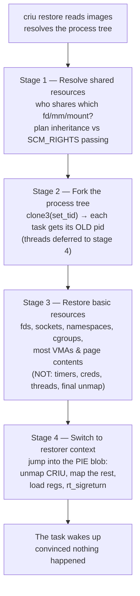
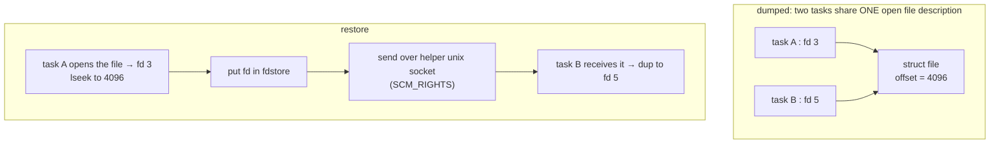
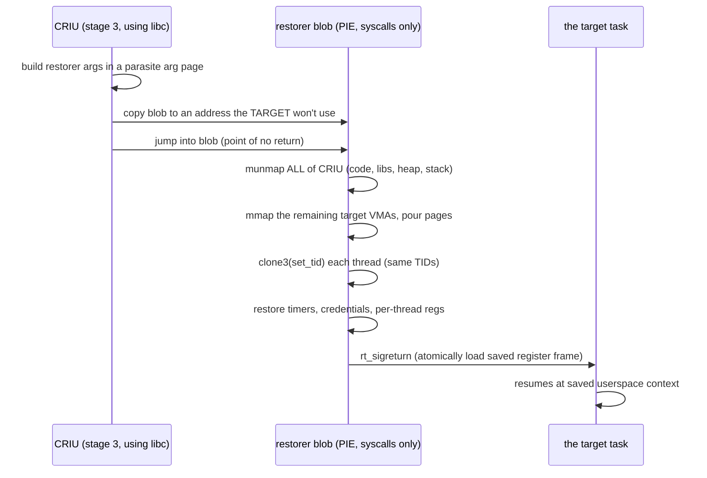

# CRIU: The Restore

> **Goal:** understand why bringing a process back from disk is *harder* than
> taking it apart. The dump reads objects through windows the kernel already
> provides; the restore must **re-create** objects the kernel normally builds
> only one way, in an order the kernel never intended, and end in a task that
> believes nothing ever happened. We'll follow CRIU's central trick — it does
> not build the target from the outside; it **transforms itself into** the
> target — all the way down to the final `rt_sigreturn`.

## Dump is reading; restore is forgery

The [dump](#/criu-dump) chapter left us with a directory of `.img` files: the
memory maps, the open file descriptors, the register set, the credentials, the
in-flight pipe bytes — a complete transcript of a process, frozen. Reading all
of that was, in a sense, the *easy* half. The kernel hands you `/proc/<pid>/maps`,
`/proc/<pid>/fd/`, `ptrace(PTRACE_GETREGSET)`, `PTRACE_PEEKDATA` — every object
has a window you can look through. Dump is **observation**.

Restore has no inverse `/proc` window and no single "deserialize this object"
syscall. Linux does provide important pieces: `lseek()` restores a regular-file
offset, `dup3()` can place a descriptor at a chosen number, and modern
`clone3(set_tid)` can request exact PIDs. But no one call recreates an open file
description with its sharing relationships, an epoll interest set, a socket
peer, or a whole process tree. Restore must compose ordinary object-specific
APIs in a constrained order until the resulting graph is indistinguishable
from the dumped one. Restore is **forgery** through legitimate mechanisms.

And there is a final twist that makes it genuinely strange. To rebuild a
process's address space *exactly*, you need to control every page of its
virtual memory. But *your* restore program — CRIU itself — is a process with
its own code, stack, and heap sitting in *that same address space*. You cannot
lay the target's floor while you are standing on it. The resolution to that
paradox (a self-erasing blob) is the signature idea of this chapter, and we
build up to it deliberately.

The thesis in one line: **CRIU does not construct the target beside itself and
copy it in. Each restoring task gradually *becomes* the task it must
incarnate** — same PID, same VMAs, same fds, same registers — and then wipes
away the last trace of the machinery that got it there.

## The morphing model

`criu restore` reads the image tree, works out the process hierarchy, and then
**forks a tree of tasks that mirrors the dumped tree**. Each forked task is,
initially, just a copy of CRIU. Then it walks a fixed pipeline, and at each
stage it sheds a little more of "being CRIU" and takes on a little more of
"being the target." By the end it *is* the target at its saved userspace
context, with supported interrupted syscalls arranged to restart correctly.

The CRIU wiki names four stages, and they run in this order:



Two properties of this pipeline matter more than the stage names:

- **It is barriered.** All tasks must finish stage *N* before any task enters
  stage *N+1*. Restore is inherently cooperative — task A cannot hand task B a
  shared file descriptor until B exists and has reached the point where it can
  receive one. CRIU coordinates the whole tree through a set of futexes in a
  shared memory area, releasing everyone from one stage to the next together.
- **The point of no return is late.** Right up until stage 4, a restoring task
  is still recognizably CRIU running CRIU's C code with CRIU's stack. Stage 4
  is where it stops being able to call `printf()` or `malloc()` — because it is
  about to unmap the library those live in. Everything that can fail *gracefully*
  is arranged to fail before stage 4.

Now we take the pipeline apart, object class by object class, in roughly the
order the difficulty rises.

## PIDs: you cannot ask for one (until you could)

A restored process must come back with the **same PID**. Half the world has
that number cached — the parent's `wait()`, `/proc/<pid>`, a `.pid` file, a
cgroup membership, a session leader relationship, a peer that will `kill()` it.
Change the PID and you have not restored the process; you have created a
stranger that happens to run the same code.

But PID allocation is the kernel's prerogative. Recall from
[Namespaces](#/namespaces) that
[alloc_pid()](https://elixir.bootlin.com/linux/v6.12/C/ident/alloc_pid) calls
[idr_alloc_cyclic()](https://elixir.bootlin.com/linux/v6.12/C/ident/idr_alloc_cyclic)
and returns *the next* cyclic id. There is no argument for "I want 8042."

### The old racy trick: `ns_last_pid`

For years CRIU cheated with a sysctl. The IDR remembers the last PID it handed
out, exposed as `/proc/sys/kernel/ns_last_pid`. Write `N` into it and the *next*
`fork()` in that PID namespace tends to allocate `N+1`:

```bash
echo 8041 | sudo tee /proc/sys/kernel/ns_last_pid   # next fork wants 8042
# ... immediately fork() the child that must be PID 8042 ...
```

It works, but look at what it assumes: that **no other process forks in this
namespace between the write and your fork**. On a busy host that window is a
live race — some daemon forks, steals 8042, and your restore fails or lands the
task on a different number. CRIU could reduce exposure by controlling the PID
namespace and the actors inside it, but there is no transaction lock on
`ns_last_pid` that excludes an unrelated fork. The mechanism remains advisory.
It also needs `CAP_SYS_ADMIN` or `CAP_CHECKPOINT_RESTORE` and a writable
`procfs`, and sets only one PID-namespace level at a time.

### The kernel grows a door: `clone3()` with `set_tid`

This is the first of three moments in this chapter where **checkpoint/restore
reshaped the kernel itself**. In Linux 5.5, `clone3()` gained a `set_tid` field
whose entire reason for existing is CRIU. Instead of racing a sysctl, you name
the PID you want, atomically, at fork time.

Here is the v6.12 argument struct, from
[include/uapi/linux/sched.h](https://elixir.bootlin.com/linux/v6.12/source/include/uapi/linux/sched.h)
(the kernel copies it in via
[clone_args](https://elixir.bootlin.com/linux/v6.12/C/ident/clone_args)):

```c
struct clone_args {
    __aligned_u64 flags;         // CLONE_* (namespaces, threads, ...)
    __aligned_u64 pidfd;
    __aligned_u64 child_tid;
    __aligned_u64 parent_tid;
    __aligned_u64 exit_signal;
    __aligned_u64 stack;
    __aligned_u64 stack_size;
    __aligned_u64 tls;
    __aligned_u64 set_tid;       // ← pointer to a pid_t[] : the PIDs we demand
    __aligned_u64 set_tid_size;  // ← how many namespace levels we're naming
    __aligned_u64 cgroup;
};
```

`set_tid` points to an array of PIDs, **innermost namespace first**:
`set_tid[0]` is the PID in the deepest namespace the task lives in, `set_tid[1]`
its PID one level up, and so on out to the init namespace, with `set_tid_size`
saying how many levels you are pinning. That single field solves two problems at
once: it kills the race (the kernel either grants the exact number or returns
`-EEXIST`, nothing in between), and it restores the **whole layered PID** of a
task nested several PID namespaces deep — the `numbers[]` array from the
[Namespaces](#/namespaces) chapter — in one call, which `ns_last_pid` could
never do.

The capability story is itself a C/R artifact: `set_tid` requires
`CAP_SYS_ADMIN`, or, since Linux 5.9, the narrower **`CAP_CHECKPOINT_RESTORE`**,
in every user namespace that owns one of the PID namespaces named by the array.
The capability lets a restore tool pick PIDs and read `/proc` map-file links
without holding all of `CAP_SYS_ADMIN`; it does not grant general ptrace or
memory-read access. (That's the second time the kernel grew a feature for CRIU;
the third is coming, with time.)

```bash
# Modern CRIU uses clone3(set_tid). You can watch it choose PIDs:
sudo strace -f -e trace=clone3 criu restore -D images/ --shell-job 2>&1 \
  | grep -o 'set_tid=\[[0-9, ]*\]' | head
# set_tid=[8042]
# set_tid=[8043]   ← each dumped task reincarnated at its recorded PID
```

### Threads: same TIDs, later

Threads share the process's address space, so they cannot be forked as
independent tasks in stage 2 — the address space isn't ready yet. CRIU defers
them to stage 4 and recreates them from *inside* the restorer blob with
`clone3()` again, `CLONE_THREAD | CLONE_VM | ...`, using `set_tid` to pin each
thread's **TID** to its dumped value. A process's threads are as identity-laden
as the process's PID: a futex keyed on a TID, a `SIGEV_THREAD_ID` timer, a
`gettid()` cached in userspace — all of them must find the same numbers.

## Namespaces & cgroups: order is everything

If the target lived in namespaces (it's a container), restore has to rebuild
their ownership and topology before placing the final tasks. The exact rule
depends on the namespace type: mount, network, IPC, UTS, cgroup, and time
namespaces can be joined with `setns()`, while a task's PID-namespace membership
is special — `setns()` affects only subsequently created children, whose PID
membership is fixed at creation. The [Namespaces](#/namespaces) chapter's
ownership model therefore dictates both construction and task-creation order.

**User namespace first, always.** Every other namespace records the user
namespace that owns it, and unprivileged creation only works if the owning user
namespace — where the restoring task holds a full capability set — already
exists when the mnt/pid/net namespaces are built. CRIU creates the user
namespace, writes its `uid_map`/`gid_map` to match the dump, and only then
builds the rest underneath it. Get this backwards and the namespaces end up
owned by the host user namespace, where the container's "root" is a nobody —
exactly the failure mode the namespaces chapter warned about, now on the
restore side.

**The mount namespace is the hardest thing CRIU rebuilds.** A mount tree is not
a flat list; it is a tree with propagation relationships (shared / slave /
private / unbindable), bind mounts that alias one subtree into several places,
and mounts whose *source* lives outside the container entirely. CRIU walks the
dumped mount tree in dependency order, recreates each mount, and reestablishes
propagation last (setting propagation too early would make intermediate mounts
leak into peer groups). Mounts it cannot recreate on its own — a host bind of
`/etc/resolv.conf`, a volume from the orchestrator, a device node — must be
declared by the operator with **`--external`** at both dump and restore, telling
CRIU "don't try to recreate this; I will provide an equivalent, splice it in
here." External mounts are the seam where a self-contained checkpoint meets a
world it doesn't own.

**Cgroups are rejoined, not always recreated.** By default CRIU puts the
restored tasks back into the cgroup paths they were dumped from (recreating the
cgroup subtree if `--manage-cgroups` asks it to). The controllers and their
limits are the [cgroups](#/cgroups) chapter's story; here the only job is
membership — write each restored PID into the right `cgroup.procs`. On a
different host the cgroup *paths* have to exist or be creatable, which is a
common restore-portability snag (more in the failure taxonomy below).

## The fd graph: dependencies, cycles, and staged reconstruction

Open file descriptors look like a flat numbered list, but their *dependencies*
form a graph that CRIU has to rebuild in dependency order. Many edges are
acyclic — an epoll watch depends on its target fd — but the graph as a whole is
not guaranteed to be a DAG. Connected Unix sockets and descriptors carried in
`SCM_RIGHTS` messages can create mutual dependencies. (The kernel rejects an
epoll nesting loop, so epoll contributes ordering edges but is not the cycle
example.) CRIU therefore combines ordering of acyclic portions with staged
creation: create an object or endpoint first, publish it through the fdstore,
then connect it or attach its dependent references in a later pass.

- An **`epoll`** fd is meaningless until the fds it watches exist — so those
  come first, then the `epoll` fd is created and `epoll_ctl()`'d to watch them.
- A **`unix` socketpair** has two ends that must be created together and
  connected to *each other*, not to fresh sockets.
- An **`inotify`** fd carries watch descriptors on specific paths; the paths
  must resolve first.
- A **timerfd**, **signalfd**, **eventfd**, **memfd** — each has internal state
  (expiry, mask, counter, contents) reloaded after creation.

### Shared file descriptions: one open, then pass it

Here is the subtle one, straight out of [Pipes & IPC](#/ipc-pipes). Two fds can
point at the *same* open file description — same `struct file`, same shared file
offset and status flags — because one was inherited across `fork()` or was sent
to another process over a `unix` socket with `SCM_RIGHTS`. Reopening the file
independently in each task would give them *separate* `struct file`s with
independent offsets: a read in one would no longer advance the other's cursor.
The shared identity would be lost.

CRIU rebuilds sharing the way the kernel would: **one task opens the file, then
passes the fd to every task that must share it, over a helper `unix` socket
using `SCM_RIGHTS`** — reconstructing, deliberately, the exact mechanism that
created the sharing in the first place. This machinery is the **service fd /
fdstore**: a set of internal file descriptors and a small socket-backed store
that CRIU keeps at a high, reserved fd range (out of the way of the target's
own numbers) so restoring tasks can stash a `struct file` in one task and fetch
it in another. Regular files with independent descriptions are simpler: reopen
the surviving path, then `lseek()` to the saved offset. An unlinked file has no
portable path to reopen: `/proc/<pid>/map_files` helps CRIU identify and access
the live mapping on the **dump** side, but restore needs a different strategy,
such as a serialized **ghost file** or `--link-remap`, to reconstruct an inode
before reopening it.



**Pipes** get the same care: CRIU recreates the pipe (both ends, shared or
passed as needed) and then *refills it* with the in-flight bytes captured at
dump time by writing them back into the write end, so a reader that was
mid-stream sees the same unread data. If both ends were open in different tasks,
the pipe is created once and the ends distributed via the fdstore.

## Memory: remap the maps, then pour the pages back

The address space is restored in two movements.

First, **the VMAs**: CRIU reads the memory-map image (`mm-<pid>.img` plus the
`vma` entries) and recreates each region with `mmap()` at its original address
and length, with the original protections and flags — anonymous private,
file-backed, shared, growsdown stack, and so on. File-backed mappings are
re-`mmap()`'d **from their backing file** when it still exists; a deleted
backing requires the ghost/link-remap handling above. The goal is the same
inode contents and mapping semantics, not reuse of the source host's
`map_files` pseudo-link. Only the *private, dirtied* pages of an otherwise
reconstructable file mapping need to be saved separately.

Second, **the page contents**: anonymous pages were dumped into `pages-<id>.img`
with an index (`pagemap-<pid>.img`) recording which virtual addresses each blob
covers. CRIU maps the target ranges and **`preadv()`s the saved pages straight
into them** — a bulk copy from the image file into the freshly mapped VMAs.
(This is also the seam where lazy restore lives: with `--lazy-pages` the pages
are *not* poured in eagerly; instead the range is registered with
`userfaultfd` and pages are fetched on first touch — the subject of the
[userfaultfd lab](#/lab-userfaultfd).)

**COW relationships** get special handling. A parent and child that shared
copy-on-write pages after `fork()` were dumped *once* (CRIU detects the sharing),
and on restore the shared pages are mapped so the parent and child point at the
same physical page again, COW re-armed — restoring the memory *and* its sharing,
not just the bytes, so a checkpoint of a big pre-forked server doesn't balloon
to N copies of one heap.

## The restorer blob: you cannot free the floor you stand on

Everything above still runs as ordinary CRIU: linked against libc, using
`malloc()`, printing errors, holding open the image files. But we have now
arrived at the paradox from the opening. To finish, the restoring task must:

- **unmap every trace of CRIU** — its executable, its libraries, its heap, its
  stack — because those occupy virtual addresses the target needs, and any left
  behind would be a foreign object in the restored address space;
- **map the last few regions** that couldn't be placed while CRIU's own
  mappings were in the way (including regions that overlap where CRIU's code
  currently sits);
- **restore the CPU state** — every thread's registers, FPU/SIMD state, the
  `fs`/`gs` base — to the exact values captured at dump;
- and then **vanish**, handing control to the target's own instruction stream
  at the exact point it was frozen.

You cannot do this from CRIU's own code, because step one deletes that code
mid-execution. The moment you `munmap()` the page you're executing, the next
instruction fetch faults and the task dies.

CRIU's answer is a small, self-contained, **position-independent (PIE) blob**:
`restorer.c`, compiled to depend on *nothing* — no libc, no global offset
table, no external mappings, only raw syscalls. In stage 4, CRIU copies this
blob into a memory region carefully chosen to sit in an address range the
**target does not use**, sets up a tiny private stack for it there, and *jumps
into it*. From that instant, execution is no longer running "in" CRIU — it runs
in a scrap of code squatting in a gap of the target's future address space, and
it is free to demolish everything else.



The finish is a beautiful piece of abuse of an ordinary kernel mechanism.
Normally, when a signal handler returns, the C library's trampoline calls
[rt_sigreturn](https://elixir.bootlin.com/linux/v6.12/C/ident/sys_rt_sigreturn):
the kernel pops a **signal frame** off the user stack — a `struct sigcontext`
holding *every* general-purpose register, the instruction pointer, the stack
pointer, the flags — and reloads the CPU from it in one atomic transition back
to userspace. It exists so a handler can run and then restore the interrupted
context perfectly.

CRIU **forges that signal frame.** The restorer blob writes a `sigcontext`
containing the dumped register set — the exact `RIP`, `RSP`, `RAX`, everything —
onto the stack and executes `rt_sigreturn`. The kernel, believing it is
returning from a signal handler, loads all of it at once and drops the task into
userspace at precisely the saved instruction pointer, with precisely the saved
registers. There is no "final instruction" of CRIU that runs in the target —
the transition is a single syscall that never returns to the caller, because
the caller's entire world has been replaced. This does **not** continue an
arbitrary kernel call frame halfway through `read()`: CRIU saves a
ptrace-visible userspace register context and the restart information it knows
how to reproduce, then arranges for supported interrupted syscalls to be
re-entered or restarted under Linux's normal restart rules. From the
application's supported userspace semantics, execution continues from the
checkpoint boundary.

That is the whole magic trick, stated plainly: *restore ends by staging a fake
return from a signal that was never delivered.*

## Time: the clock that must not jump backward

The third moment of C/R reshaping the kernel. A restored process very likely
lands on a **different host** than the one it was dumped on — that's the whole
point of [live migration](#/live-migration). Different hosts have different
uptimes. But `CLOCK_MONOTONIC` and `CLOCK_BOOTTIME` are defined to *never go
backward*, and a huge amount of software relies on that: timeout math, rate
limiters, `condition_variable` waits, watchdogs. Restore a process whose
`CLOCK_MONOTONIC` last read 9,000,000 seconds onto a host that booted an hour
ago, and its next reading would be a few thousand seconds — time running
violently backward under code that assumes it cannot. Deadlocks and corrupted
timeout logic follow.

The fix is the **time namespace** (Linux 5.6), which — as the
[Namespaces](#/namespaces) chapter notes — was *largely created for CRIU*. A
time namespace stores per-namespace **offsets** for `CLOCK_MONOTONIC` and
`CLOCK_BOOTTIME` (wall-clock `CLOCK_REALTIME` is deliberately not virtualized).
On restore, CRIU can place the tasks in the reconstructed time namespace and
restore those offsets so the clocks retain the dumped namespace's logical
epoch instead of inheriting the destination host's raw uptime:

```bash
# The offsets live here and freeze once a task enters the namespace:
cat /proc/<pid>/timens_offsets
# monotonic   +8991234 0
# boottime    +8991234 0
```

Because `clock_gettime()` is a vDSO fast path, each time namespace gets its own
`vvar` data page and the offset is added in userspace with no syscall — so the
restored process pays nothing per call for that virtualized epoch. Do not read
this as "time was perfectly paused": the first post-restore sample occurs after
restore work, `CLOCK_REALTIME` is outside the time namespace, and external
observers can see the downtime. The mechanism prevents a host-uptime jump and
keeps namespace-relative timer semantics coherent; it does not erase every
observable passage of time.
Three features — `set_tid`, `CAP_CHECKPOINT_RESTORE`, and the time namespace —
each exist because "restore a process somewhere else and let it believe nothing
happened" turned out to be a requirement the original kernel could not meet.

## What makes restore fail

Restore is a pickier operation than dump, because it depends on the *destination*
matching the source in ways the dump never had to care about. A practical
taxonomy:

- **Missing kernel features.** Requirements are image- and workload-specific.
  A dump may require time namespaces, TCP repair/socket diagnostics, lazy-page
  support, or another facility used by that workload. Modern CRIU can prefer
  `clone3(set_tid)`, while older/fallback paths use `ns_last_pid`; similarly,
  `CAP_SYS_ADMIN` can cover operations for which
  `CAP_CHECKPOINT_RESTORE` is the narrower alternative. The destination must
  satisfy the path actually recorded and selected, not an unconditional list
  of every C/R-related feature.
- **A PID is already taken.** Some process on the destination already holds a
  PID the checkpoint needs. `clone3(set_tid)` returns `-EEXIST` and restore
  fails cleanly (this is why restoring into a *fresh* PID namespace is the safe
  pattern — the numbers start empty).
- **Different file paths.** A file the process had open doesn't exist at the
  same path on the destination, or an unlinked file's contents weren't in the
  image. Reopen fails.
- **Changed library versions for file-backed maps.** This one bites in
  production. A file-backed executable mapping (`libc.so.6`, the binary itself)
  is restored by re-`mmap()`ing the *destination's* copy of that file. If the
  file changed — a security update bumped libc between dump and restore — the
  bytes at those virtual addresses are now *different code*, and the restored
  RIP points into the wrong instructions. Checkpoints are implicitly pinned to
  the exact binaries and libraries present at dump time.
- **Namespace / cgroup mismatch.** The destination can't create the cgroup path,
  or an `--external` mount wasn't provided, or a network resource
  (an IP, a veth peer) named by the dump can't be reproduced.

The first line of defense is to ask *before* you try:

```bash
criu check --all
# Looks like CRIU is fully functional.
```

`criu check` probes the running kernel for every feature CRIU can use and
reports gaps, so you validate a destination host *before* shipping a checkpoint
to it rather than discovering the gap mid-restore. Feature names accepted by
`--feature` are version-specific; consult the installed CRIU version's help and
documentation rather than deriving a probe name from a kernel API.

## Worked example: the counter comes back

We continue the tiny counter from the [dump](#/criu-dump) chapter — a process
that prints an incrementing number once a second and whose in-memory count we
froze into `images/`. Restore it and watch the count continue from the saved
checkpoint state:

```bash
# From the dump chapter we have images/ holding a counter frozen at, say, 137.
# That example used --leave-running, so first stop the original; otherwise its
# PID and other resources would conflict with the restored copy.
kill "$PID"
wait "$PID" 2>/dev/null || true
sudo criu restore -D images/ --shell-job
```

```text
138
139
140
141
...
```

It does **not** start over at 0 or 1. The variable holding the count was
poured back from `pages-*.img` into the same VMA at the same address; the
register set was reloaded via `rt_sigreturn`; the process returned to the saved
userspace context in its `nanosleep()`/print loop, with syscall restart handled
as described above. `--shell-job` tells CRIU the process was
started from an interactive shell and shares its controlling terminal and
process group, so the session relationships (which are as identity-laden as the
PID) are reattached to *your* terminal rather than the one that existed at dump
time. Its counter and control flow continue from the checkpoint rather than
starting over. That statement is about restored execution state, not invisible
wall time: `CLOCK_REALTIME`, the terminal observer, and external services can
all reveal the interval between dump and restore.

The full end-to-end walkthrough — dump, inspect the images, restore, and prove
the offsets and clocks survived — is the [CRIU hands-on lab](#/lab-criu).

## Follow the code (CRIU & kernel v6.12)

### The restore driver

1. **[criu/cr-restore.c](https://github.com/checkpoint-restore/criu/blob/criu-dev/criu/cr-restore.c)**
   is the top of the restore. `restore_task_with_children()` forks the process
   tree with `clone3(set_tid)`, and the whole thing advances through the four
   stages under futex barriers held in a shared "task entries" area. This file
   is where "morph myself into the target" is orchestrated.
2. **[criu/files.c](https://github.com/checkpoint-restore/criu/blob/criu-dev/criu/files.c)**
   builds the fd dependency graph and drives its staged, dependency-aware
   restore — deciding which task opens a shared `struct file`, which tasks
   receive it over the fdstore's `SCM_RIGHTS` sockets, and which cyclic
   relationships are attached later. The per-type logic lives alongside it
   (`sk-unix.c`, `eventpoll.c`, `pipes.c`, `timerfd.c`, …).
3. **[criu/pie/restorer.c](https://github.com/checkpoint-restore/criu/blob/criu-dev/criu/pie/restorer.c)**
   is *the blob*: the PIE, libc-free stage-4 code that unmaps CRIU, maps the
   remaining VMAs, recreates threads with `clone3(set_tid)`, restores timers and
   credentials and per-thread registers, and finishes with `rt_sigreturn`. Read
   `restore_task()` / `__export_restore_task()` here to see the point of no
   return.

### The kernel doors CRIU relies on

4. **[clone_args](https://elixir.bootlin.com/linux/v6.12/C/ident/clone_args)**
   in [include/uapi/linux/sched.h](https://elixir.bootlin.com/linux/v6.12/source/include/uapi/linux/sched.h)
   — the `set_tid` / `set_tid_size` fields (Linux 5.5) that let restore name a
   PID. Follow it into
   [kernel_clone()](https://elixir.bootlin.com/linux/v6.12/C/ident/kernel_clone)
   and
   [alloc_pid()](https://elixir.bootlin.com/linux/v6.12/C/ident/alloc_pid),
   which honors `set_tid` instead of calling `idr_alloc_cyclic()` for the next
   free id.
5. **[kernel/time/namespace.c](https://elixir.bootlin.com/linux/v6.12/source/kernel/time/namespace.c)**
   — the per-namespace `CLOCK_MONOTONIC`/`CLOCK_BOOTTIME` offsets and the vDSO
   `vvar` page that preserve a restored namespace's logical clock epoch on a
   fresh host.
6. **[sys_rt_sigreturn](https://elixir.bootlin.com/linux/v6.12/C/ident/sys_rt_sigreturn)**
   — the atomic "reload every register from a signal frame and return to
   userspace" syscall that CRIU repurposes as its final restore step. Read it as
   the mechanism the blob forges a frame for.

---

## Check your understanding

1. Why is restore fundamentally harder than dump, in one sentence?

<details><summary>Show answer</summary>

Dump *observes* objects through windows the kernel already provides
(`/proc`, `ptrace`), whereas restore must *re-create* an interdependent object
graph by composing many APIs in the required order. Individual mechanisms such
as `clone3(set_tid)`, `dup3()`, `lseek()`, and fixed-address `mmap()` expose some
identity controls, but none deserializes the process as a whole.

</details>

2. What does "CRIU transforms itself into the target" mean, concretely?

<details><summary>Show answer</summary>

`criu restore` forks a tree of tasks that mirrors the dumped tree; each forked
task starts as a copy of CRIU and, stage by stage, sheds CRIU state and takes on
the target's — same PID (via `clone3(set_tid)`), same VMAs, same fds, same
registers — until in stage 4 it unmaps the last of CRIU and `rt_sigreturn`s into
the target's own instruction stream. It never builds the target beside itself
and copies it in; it becomes it.

</details>

3. Why does a modern restore prefer `clone3(set_tid)` to the older
   `ns_last_pid` fallback?

<details><summary>Show answer</summary>

`ns_last_pid` is racy: you write `N` to the sysctl and *hope* your next `fork()`
gets `N+1`, but any other fork in that namespace between the write and your fork
steals the number. `clone3(set_tid)` names the PID atomically at creation time —
the kernel grants the exact number or returns an error — and can pin every level
of a nested PID namespace in one call. The sysctl remains a fallback on paths
that cannot use `set_tid`; the newer API did not remove it.

</details>

4. Two dumped tasks shared one open file description. How does CRIU restore the
   sharing, and why not just reopen the file in each?

<details><summary>Show answer</summary>

Reopening independently yields two separate `struct file`s with independent
offsets, breaking the shared cursor. Instead one task opens the file (and
`lseek`s to the saved offset), stashes the fd in the **fdstore**, and passes it
to the other task over a helper `unix` socket with `SCM_RIGHTS` — reconstructing
the exact kernel mechanism (`fork` inheritance or fd passing) that created the
sharing originally.

</details>

5. Why does the final stage need a separate PIE "restorer blob" instead of just
   running from CRIU's own code?

<details><summary>Show answer</summary>

Stage 4 must `munmap()` all of CRIU — its code, libraries, heap, and stack —
because they occupy addresses the target needs. You cannot delete the code you
are currently executing; the next instruction fetch would fault. So CRIU copies
a self-contained, libc-free, position-independent blob into an address range the
target won't use, jumps into it, and from there safely demolishes everything
else, maps the remaining VMAs, restores registers, and `rt_sigreturn`s.

</details>

6. How does `rt_sigreturn` end the restore, and why is it the right tool?

<details><summary>Show answer</summary>

`rt_sigreturn` normally pops a signal frame (a full `sigcontext` with every
register and the instruction pointer) off the stack and reloads the CPU from it
atomically when a signal handler returns. CRIU forges a signal frame containing
the *dumped* register set and executes `rt_sigreturn`; the kernel loads all
registers and drops the task into userspace at the saved RIP in a single
transition that never returns to the caller — so there is no "last CRIU
instruction" running in the target. Supported interrupted syscalls are handled
separately through the restart rules described above; `rt_sigreturn` itself
restores the userspace register context.

</details>

7. A container is checkpointed on host A (uptime days) and restored on host B
   (uptime one hour). What breaks without a time namespace, and how does it fix
   it?

<details><summary>Show answer</summary>

Without an appropriate time-namespace offset,
`CLOCK_MONOTONIC`/`CLOCK_BOOTTIME` could jump backward from host A's large
uptime-derived value to host B's smaller one, breaking timeout and rate-limit
logic. The time namespace (Linux 5.6, built largely for CRIU) applies
per-namespace offsets through the vDSO so the restored namespace retains its
logical clock epoch instead of adopting B's raw uptime. It does not virtualize
`CLOCK_REALTIME` or hide downtime from external observers.

</details>

8. You have a checkpoint that restored fine yesterday and fails today on the
   same host with the RIP landing in garbage. What changed?

<details><summary>Show answer</summary>

Most likely a **library update**. File-backed executable maps (`libc.so.6`, the
binary) are restored by re-`mmap()`ing the destination's copy of that file; a
security update that changed the file means different code now sits at those
virtual addresses, so the restored instruction pointer points into the wrong
instructions. Checkpoints are implicitly pinned to the exact binaries and
libraries present at dump time — run `criu check` and compare the on-disk
libraries.

</details>

---

## Sources & further reading

- [CRIU wiki — Checkpoint/Restore](https://criu.org/Checkpoint/Restore) — the
  four restore stages ("Resolve shared resources", "Fork the process tree",
  "Restore basic tasks resources", "Switch to restorer context…") in the
  project's own words.
- [CRIU wiki — Restorer context](https://criu.org/Restorer_context) — why the
  PIE blob exists and how it unmaps CRIU and maps the target.
- [clone(2)](https://man7.org/linux/man-pages/man2/clone.2.html) — the
  `struct clone_args` fields, `set_tid`/`set_tid_size` (Linux 5.5), and the
  `CAP_CHECKPOINT_RESTORE` (Linux 5.9) requirement.
- [time_namespaces(7)](https://man7.org/linux/man-pages/man7/time_namespaces.7.html)
  and Jonathan Corbet, *A namespace for time* (LWN, 2018) —
  [https://lwn.net/Articles/766089/](https://lwn.net/Articles/766089/) — the
  offset model that preserves a namespace's clock epoch across a migration.
- Marco Nenciarini / the CRIU team, and the `clone3()` coverage in
  [https://lwn.net/Articles/792628/](https://lwn.net/Articles/792628/) — how
  `clone3` and `set_tid` grew out of checkpoint/restore's need to pick PIDs.
- [rt_sigreturn(2)](https://man7.org/linux/man-pages/man2/sigreturn.2.html) —
  the signal-frame mechanism CRIU repurposes for the final register load.
- Source: [criu/cr-restore.c](https://github.com/checkpoint-restore/criu/blob/criu-dev/criu/cr-restore.c),
  [criu/pie/restorer.c](https://github.com/checkpoint-restore/criu/blob/criu-dev/criu/pie/restorer.c),
  [criu/files.c](https://github.com/checkpoint-restore/criu/blob/criu-dev/criu/files.c);
  kernel [alloc_pid()](https://elixir.bootlin.com/linux/v6.12/C/ident/alloc_pid),
  [kernel/time/namespace.c](https://elixir.bootlin.com/linux/v6.12/source/kernel/time/namespace.c).

**Next:** we can dump a process and forge it back to life — but so far on the
*same* box, one host at a time. [Live Migration](#/live-migration) puts the two
halves together and moves a running process across the network while it barely
misses a beat.
