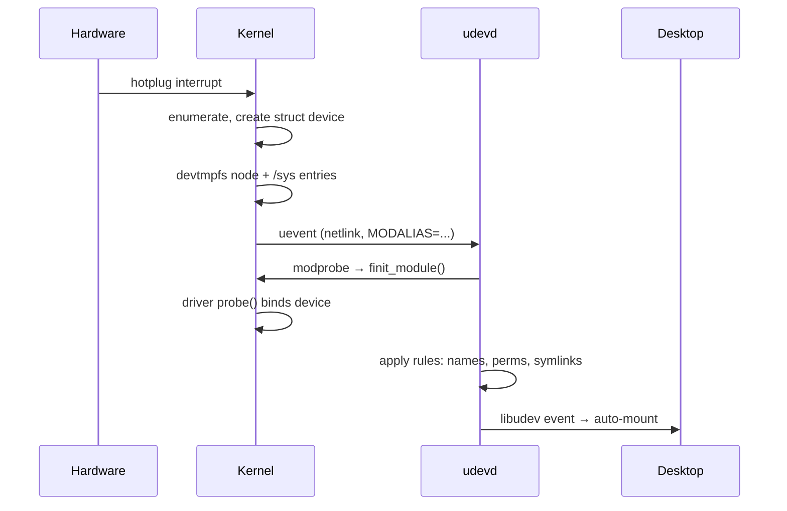

# Devices, Drivers & Modules

> **Goal:** see how the kernel turns silicon into files — drivers, `/dev`,
> `/sys`, udev — and how kernel modules let you extend a running kernel.

## Drivers: translators for hardware

A **driver** is kernel code that speaks one device's dialect and exposes a
standard interface upward. The kernel ships thousands of them — well over
half of the tree's ~40 million lines lives under `drivers/` — which is why
Linux boots on nearly anything.

The kernel splits the world into a few device classes:

| Class | Examples | Interface |
|---|---|---|
| **Character** | terminals, `/dev/null`, GPUs (mostly via ioctl) | byte stream, read/write |
| **Block** | disks: `/dev/sda`, `/dev/nvme0n1` | fixed-size blocks, random access, goes through the block layer & page cache |
| **Network** | `eth0`, `wlan0` | **not a file!** — interfaces, used via sockets |

What "exposes a standard interface" means concretely: a character driver
fills in a [`struct file_operations`](https://elixir.bootlin.com/linux/v6.12/C/ident/file_operations)
— a table of function pointers the [VFS](#/filesystems) calls on its behalf.
The fields that matter:

```c
struct file_operations {
    struct module *owner;      // pins the module while the file is open
    ssize_t (*read)(...);      // what read(2) ends up calling
    ssize_t (*write)(...);
    long (*unlocked_ioctl)(...); // the "everything else" escape hatch
    int (*mmap)(...);          // map device memory into a process
    int (*open)(...);
    __poll_t (*poll)(...);     // support select/epoll
    /* ~25 more, most optional */
};
```

When you `read()` from `/dev/urandom`, the VFS looks up the inode, finds it's
a character device, follows the pointer to the random driver's `file_operations`,
and calls its `.read`. Same syscall, completely different code — the
function-pointer polymorphism trick from the [VFS chapter](#/filesystems),
applied to hardware. Block drivers plug into the
[block layer](#/storage-stack) instead (they implement request queues, not
`read`/`write`), and network drivers register a
[`struct net_device`](https://elixir.bootlin.com/linux/v6.12/C/ident/net_device)
with the [networking stack](#/networking).

### USB as a cross-section

USB devices appear through a tree of buses and endpoints. Plug in a device:

```text
USB host controller (driver: xhci_hcd)
  └── bus → device → configuration → interface → endpoints
                                                 ├── endpoint 0x81 (IN, bulk)
                                                 └── endpoint 0x02 (OUT, bulk)
```

The kernel probes: reads the device descriptor (vendor ID, product ID),
matches against the [`usb_device_id`](https://elixir.bootlin.com/linux/v6.12/C/ident/usb_device_id)
table in every registered USB driver, calls `probe()` for the winner. That
match table is just an array of `{ match_flags, idVendor, idProduct, ... }`
entries; a driver saying "I handle vendor 0x2341, product 0x0043" is one line
of C. After probe, the driver registers interfaces, possibly a character
device, a block device, or a network device.

```bash
lsusb -v | head -40              # full descriptor tree
cat /sys/kernel/debug/usb/devices  # the kernel's USB topology
```

## /dev: devices as files

```bash
ls -l /dev/sda /dev/null /dev/tty
```

```text
brw-rw---- 1 root disk 8, 0  /dev/sda    ← b = block, major 8, minor 0
crw-rw-rw- 1 root root 1, 3  /dev/null   ← c = char,  major 1, minor 3
```

The **major number** selects the driver; the **minor** selects which device
that driver instance handles. Inside the kernel a device number is a 32-bit
`dev_t`: 12 bits of major (max 4095) and 20 bits of minor (max ~1 M).
Historically majors were assigned statically (8 = SCSI disks, 1 = memory
devices — the list lives in the kernel's `Documentation/admin-guide/devices.txt`);
modern drivers usually call
[`alloc_chrdev_region()`](https://elixir.bootlin.com/linux/v6.12/C/ident/alloc_chrdev_region)
to grab a dynamic major at load time, then register a
[`struct cdev`](https://elixir.bootlin.com/linux/v6.12/C/ident/cdev) — the
object that binds a `dev_t` range to a `file_operations` table.

`open("/dev/null")` routes straight to the null driver's `open` function —
the VFS function-pointer trick again. Writing to `/dev/sda` writes to the raw
disk (bypassing the filesystem — this is how `dd` images a drive, and how you
destroy one with a typo).

`/dev` is a **devtmpfs** (in-kernel since 2.6.32, 2009) — populated by the
kernel itself the instant a device registers, then polished by **udev**
(systemd-udevd), which applies naming rules, permissions, and the convenient
stable symlinks in `/dev/disk/by-uuid/` and friends. This ordering matters:
even with udev broken, `/dev/sda` exists, because devtmpfs doesn't depend on
user space. That's also why early boot works before udev starts — see
[the boot chapter](#/boot-process).

```bash
ls -l /dev/disk/by-uuid/
ls -l /dev/disk/by-id/
ls -l /dev/disk/by-path/
```

> **Container link:** inside a container, `/dev` is *not* devtmpfs — the
> runtime bind-mounts a tiny tmpfs with a curated allowlist (`null`, `zero`,
> `urandom`, `tty`, ~10 nodes total), and the cgroup device controller (a BPF
> program on [cgroup v2](#/cgroups)) blocks `mknod`-and-open tricks for
> anything else. Device access is one of the sharpest lines between a
> container and a VM.

## /sys: the kernel's object model on display

While `/dev` gives you *data paths* to devices, **sysfs** (`/sys`) exposes the
kernel's internal *object graph* — every device, driver, bus, and their
relationships — as directories, with attributes as one-value-per-file:

```bash
cat /sys/class/net/eth0/speed                 # link speed
cat /sys/block/nvme0n1/queue/rotational      # 0 = SSD
echo 0 | sudo tee /sys/class/leds/*/brightness  # writing = poking the kernel
cat /sys/devices/system/cpu/cpu0/cpufreq/scaling_governor
```

This is "everything is a file" used as a *control plane*: shell scripts can
tune kernel behaviour with `echo` and `cat`. (`/proc` was supposed to be about
processes; `/sys` is the tidy successor for everything device-related —
organized around the kernel's device model, not per-process scraps. The
[observability chapter](#/observability) tours both.)

### The device model: kobjects all the way down

Sysfs isn't a parallel database — it's a *direct rendering* of kernel data
structures. Every directory under `/sys` is a
[`struct kobject`](https://elixir.bootlin.com/linux/v6.12/C/ident/kobject):
a small embedded object carrying a name, a parent pointer (that's the
directory hierarchy), a reference count, and a type with attribute callbacks
(those are the files). Higher-level structures embed one:

- [`struct device`](https://elixir.bootlin.com/linux/v6.12/C/ident/device) —
  one physical or virtual device. Key fields: `parent` (the bus it hangs off,
  giving the `/sys/devices/...` topology), `bus`, `driver` (NULL until
  bound), `of_node`/`fwnode` (its device-tree or ACPI description), and the
  embedded `kobj`.
- [`struct device_driver`](https://elixir.bootlin.com/linux/v6.12/C/ident/device_driver)
  — one driver. Key fields: `name`, `bus`, `probe`/`remove` callbacks, and
  the ID table used for matching.
- [`struct bus_type`](https://elixir.bootlin.com/linux/v6.12/C/ident/bus_type)
  — a kind of bus (PCI, USB, platform, ...). Key fields: `match()` (does
  this driver claim this device?), `probe()`, `uevent()` (what to tell user
  space when something changes).

The graph they form:

```text
bus (PCI, USB, platform, ...)
  ├── driver (nvme, xhci_hcd, e1000e, ...)
  ├── device (a specific NVMe SSD, a specific NIC)
  │     ├── attributes (files in sysfs — vendor, model, power state)
  │     └── class (block, net, tty — groups devices by function)
  └── class (something like "net" or "block")
        └── class_device (eth0, sda)
```

Two views of the same device: `/sys/devices/...` is the physical topology
("this NVMe drive sits on PCI bus 0000:03"), `/sys/class/...` and
`/sys/block/...` are functional views ("this is a block device") implemented
as symlinks into the devices tree. `readlink /sys/block/nvme0n1` shows you the
join.

This graph is what `systemd`, `udev`, and the desktop environment query to
react to hardware changes. When a device appears, the kernel broadcasts a
**uevent** — a small `KEY=value` message (`ACTION=add`, `DEVPATH=...`,
`SUBSYSTEM=usb`, `MODALIAS=...`) sent over a `NETLINK_KOBJECT_UEVENT` socket.
udev receives it, consults its rules, creates `/dev` symlinks, sets
permissions, runs scripts. The desktop shows "new USB drive" because it
listened to the same netlink socket.

```bash
udevadm monitor        # plug in a USB stick and watch events flow
udevadm info -a -n /dev/sda | head -30  # the device tree, in udev's view
```

The flow when you plug something in:



## Kernel modules: extending the kernel at runtime

The kernel would be absurdly bloated if every driver were compiled in.
Instead, most are **loadable kernel modules** (`.ko` files) — relocatable ELF
objects linked into the *running* kernel on demand. A stock Fedora or Ubuntu
kernel ships ~5,000 modules but typically has only 100–200 loaded:

```bash
lsmod | head                      # what's loaded right now
modinfo ext4 | head -15           # metadata of one module
sudo modprobe dummy               # load (resolving dependencies via modules.dep)
sudo modprobe -r dummy            # unload
sudo modprobe -v <module>         # verbose: see what's being loaded and why
ls /lib/modules/$(uname -r)/kernel/drivers | head
```

Loading is a real link step performed *by the kernel*: the
[`finit_module()`](https://man7.org/linux/man-pages/man2/init_module.2.html)
syscall (since 3.8; the older `init_module()` takes a memory buffer instead
of an fd) hands the kernel an ELF file, and the kernel allocates executable
memory, resolves every undefined symbol against its exported symbol table
(`EXPORT_SYMBOL`/`EXPORT_SYMBOL_GPL`), applies relocations, and runs the
module's init function.

The bookkeeping lives in
[`struct module`](https://elixir.bootlin.com/linux/v6.12/C/ident/module):
`state` (COMING → LIVE → GOING), `name`, the symbol tables it exports, `init`
and `exit` function pointers, and a per-CPU reference count (`refcnt`) that
makes `rmmod` fail with `EBUSY` while anything uses the module — that's what
the `owner` field in `file_operations` feeds.

`modprobe` is triggered automatically: plug in hardware → the device
advertises IDs → the kernel creates a uevent carrying a **modalias** string
(e.g. `usb:v2341p0043d...` or `pci:v000010DEd...`) → udev receives it → udev
calls `modprobe $MODALIAS` → modprobe consults `modules.alias` to find which
module claims those IDs → `finit_module()` runs inside. (The kernel can also
demand-load from *inside* — [`request_module()`](https://elixir.bootlin.com/linux/v6.12/C/ident/request_module)
spawns `/sbin/modprobe` as a usermode helper when, say, you open an
`AF_ALG` socket for a crypto algorithm that isn't loaded.)

Cracking the magic: the `modules.alias` file maps PCI/USB vendor+device IDs
to module names:

```bash
grep -i 'nvidia' /lib/modules/$(uname -r)/modules.alias
# alias pci:v000010DEd... nvidia
```

Two facts with security weight:

- A module runs **in kernel space with total power**. There is no sandbox.
  A buggy module = crashes; a malicious module = game over (rootkits are
  usually modules). This is why [Secure Boot](#/trusted-computing) lockdown
  enforces module *signing*: with `CONFIG_MODULE_SIG`, a PKCS#7 signature is
  appended to the `.ko` (literally after the magic string
  `~Module signature appended~`), and the kernel verifies it against keys
  baked in at build time. Loading an unsigned or out-of-tree module sets a
  **taint flag** (`E`, `O`, or `P` in `cat /proc/sys/kernel/tainted` /
  `dmesg`) — the first thing kernel developers check in a bug report.
- The kernel↔module interface is *not* stable across versions — modules are
  built per-kernel, and a `vermagic` string plus (optionally) per-symbol CRCs
  (`CONFIG_MODVERSIONS`) enforce it at load time. That's what **DKMS**
  automates for out-of-tree drivers like NVIDIA's: rebuild on every kernel
  update.

Module loading is gated by `CAP_SYS_MODULE`. Containers lack it (unless
`--privileged`), which is one of the strongest [container security
boundaries](#/security-hardening). Without `CAP_SYS_MODULE`, you cannot load
kernel code from user space — and note it's the *host's* capability that
counts: a container [namespace](#/namespaces) doesn't get its own kernel, so
there is nothing per-container about module loading. Hardened hosts go
further and set `kernel.modules_disabled=1` after boot, which is one-way.

### A taste of writing one

A minimal module is genuinely small:

```c
// hello.c
#include <linux/module.h>
#include <linux/init.h>

static int __init hello_init(void) {
    pr_info("hello: loaded\n");
    return 0;
}
static void __exit hello_exit(void) {
    pr_info("hello: bye\n");
}
module_init(hello_init);
module_exit(hello_exit);
MODULE_LICENSE("GPL");
MODULE_AUTHOR("Me");
MODULE_DESCRIPTION("Minimal kernel module");
```

```makefile
# Makefile (the Kbuild system, not a plain Makefile)
obj-m += hello.o
all:
	make -C /lib/modules/$(shell uname -r)/build M=$(PWD) modules
clean:
	make -C /lib/modules/$(shell uname -r)/build M=$(PWD) clean
```

`make && sudo insmod hello.ko && sudo dmesg | tail -1` → `hello: loaded`.
Congratulations, you've run your own code in ring 0. The `__init` marker is
real machinery, not decoration: init code is placed in a separate ELF section
that the kernel *frees* after `hello_init()` returns — for a big driver that
can be tens of KiB given back. The
[kernel module lab](#/lab-kernel-module) builds this out into a real
character device, and [the kernel-dev chapter](#/kernel-dev) goes further.

```bash
sudo rmmod hello        # unload; dmesg → "hello: bye"
modinfo hello.ko        # read the metadata you embedded
```

## Interrupts and the bottom-half idea

How does a driver learn its device needs attention? **Interrupts** — the
[interrupts chapter](#/interrupts) covers the mechanism. One refinement worth
knowing here: interrupt handlers must be *fast* — a handler runs with its own
IRQ line masked, and every microsecond spent there is stolen from whatever
the CPU was doing. So Linux splits the work:

- **top half**: the actual IRQ handler — acknowledge the device (read the
  interrupt status register, or the interrupt is re-fired endlessly), grab
  the data pointer, schedule the rest, return in a few microseconds;
- **bottom half**: the real processing (e.g. pushing a packet through the
  TCP/IP stack), deferred to *softirqs* / workqueues / IRQ threads that run
  later, with interrupts enabled.

The bottom-half mechanisms:

| Mechanism | When it runs | Characteristics |
|---|---|---|
| **softirq** | After IRQ handler returns, or in `ksoftirqd` thread | Fast, per-CPU, can't sleep. Used by networking (NET_RX, NET_TX), block I/O, RCU, timers |
| **tasklet** | From softirq context | Simpler API than raw softirq, but formally deprecated — being converted to workqueues and threaded IRQs |
| **workqueue** | Dedicated kernel threads (`[kworker/*]`) | Can sleep, can block, general-purpose. Device drivers use this for most heavy work |
| **threaded IRQ** | Per-IRQ kernel thread (`[irq/N-name]`) | Modern default: [`request_threaded_irq()`](https://elixir.bootlin.com/linux/v6.12/C/ident/request_threaded_irq) — a tiny hard handler returns `IRQ_WAKE_THREAD`, a schedulable thread does the rest |

Softirq processing self-limits: after ~2 ms or 10 back-to-back rounds in
interrupt context, the kernel punts remaining work to `ksoftirqd/N` so normal
tasks aren't starved — that's why you see those threads eating CPU under
heavy network load.

```bash
cat /proc/interrupts | head     # IRQ counts per CPU per device
cat /proc/softirqs              # bottom-half counts per CPU
ps aux | grep '\[ksoftirqd\]'   # the softirq daemon threads
ps aux | grep '\[irq/'          # threaded IRQ handlers, if any
```

For very fast devices, interrupt-per-event is too slow — at 10 Gb/s line rate
you'd take over a million interrupts per second.

So NVMe and modern NICs use polling hybrids and many hardware queues: **NAPI**
for networking takes one interrupt, disables that queue's IRQ, then polls
packets in batches (default weight: 64 packets per poll, with a global
`net.core.netdev_budget` of 300 per softirq round); NVMe allocates one
submission/completion queue pair per CPU with its own **MSI-X** vector (PCIe
message-signaled interrupts — up to 2048 per device, vs. 1 shared line for
legacy INTx), so completions land on the CPU that submitted the I/O.

[Modern I/O & io_uring](#/modern-io) pushes this even further toward pure
polling.

## DMA: how devices touch memory directly

Devices don't ask the CPU to copy data for them. They use **DMA** (Direct
Memory Access): the driver programs the device with a memory address and
length, the device reads from or writes to RAM directly, and rings a doorbell
or fires an interrupt when done.

The catch: the device doesn't share the CPU's page tables. It sees *bus
addresses*, not the process virtual addresses from the
[memory chapter](#/memory). The kernel's DMA API bridges the gap with two
main patterns:

- [`dma_alloc_coherent()`](https://elixir.bootlin.com/linux/v6.12/C/ident/dma_alloc_coherent)
  — long-lived, *coherent* buffers (descriptor rings, doorbells): CPU and
  device always see the same bytes, no explicit sync needed. Costs more (may
  disable caching on some architectures), so it's for control structures.
- [`dma_map_single()`](https://elixir.bootlin.com/linux/v6.12/C/ident/dma_map_single)
  / `dma_map_sg()` — *streaming* mappings for actual data buffers: map, let
  the device DMA, unmap. The API handles cache maintenance (flush CPU caches
  before device reads, invalidate before CPU reads) and hands back the
  `dma_addr_t` the device should use. Scatter-gather (`_sg`) lets one I/O
  span physically discontiguous pages — essential since large buffers are
  rarely physically contiguous.

If a device can't reach all of RAM (e.g. a 32-bit device on a 64-bit
machine), the kernel transparently bounces through **swiotlb**, a contiguous
low-memory buffer (64 MiB by default) — correct but slow, since it
reintroduces the memcpy DMA was supposed to avoid.

Then there's the **IOMMU** (Intel VT-d / AMD-Vi / ARM SMMU): a page table
*for devices*. With it enabled, devices see I/O virtual addresses, and the
kernel maps only the exact buffers a device is allowed to touch.

This is critical for security — without an IOMMU, any bus-mastering device (or
a malicious Thunderbolt gadget) can DMA over arbitrary kernel memory. It's also
what makes safe device passthrough to VMs possible: VFIO hands a whole
**IOMMU group** to a guest, and the IOMMU confines the device to that guest's
memory — see [KVM internals](#/kvm-internals).

```bash
dmesg | grep -i iommu          # IOMMU initialization
ls /sys/kernel/iommu_groups/                 # one dir per isolation group
cat /sys/kernel/iommu_groups/*/devices/* 2>/dev/null | head
```

## udev rules, one practical example

The classic real-world task — stable permissions for some gadget:

```bash
# /etc/udev/rules.d/99-myboard.rules
SUBSYSTEM=="tty", ATTRS{idVendor}=="2341", ATTRS{idProduct}=="0043", \
    MODE="0666", SYMLINK+="arduino"
```

Reload (`sudo udevadm control --reload`), replug, and your Arduino is always
`/dev/arduino`, writable without sudo. Most "device permission denied"
problems end with a udev rule or joining a group (`dialout`, `video`, `plugdev`).

```bash
sudo udevadm control --reload-rules
sudo udevadm trigger       # re-trigger rules on already-connected devices
udevadm info -a -n /dev/ttyUSB0 | grep -E 'ATTRS{idVendor}|ATTRS{idProduct}'
```

## Follow the code (kernel v6.12)

### Path 1: `modprobe hello` → running init code in ring 0

Module loading lives in `kernel/module/` (split out of one giant file in
5.19): [https://elixir.bootlin.com/linux/v6.12/source/kernel/module](https://elixir.bootlin.com/linux/v6.12/source/kernel/module)

1. `modprobe` opens the `.ko` and calls the
   [`finit_module()`](https://elixir.bootlin.com/linux/v6.12/C/ident/finit_module)
   syscall with the fd. The kernel checks `CAP_SYS_MODULE` and
   `modules_disabled`, then reads the whole ELF file into kernel memory.
2. [`load_module()`](https://elixir.bootlin.com/linux/v6.12/C/ident/load_module)
   is the heart. It verifies the module signature if signing is enforced,
   sanity-checks the ELF headers, and checks `vermagic` (the "built for
   6.12.0-foo SMP" string) against the running kernel — mismatch →
   `EINVAL`, the error DKMS exists to prevent.
3. [`layout_and_allocate()`](https://elixir.bootlin.com/linux/v6.12/C/ident/layout_and_allocate)
   decides where each ELF section goes and allocates kernel memory for
   them — init sections separately, so they can be freed later.
4. [`simplify_symbols()`](https://elixir.bootlin.com/linux/v6.12/C/ident/simplify_symbols)
   resolves every undefined symbol in the module against the kernel's export
   table (and other modules' exports). An unresolved symbol → the familiar
   `Unknown symbol in module` failure. GPL-only exports are refused to
   proprietary-licensed modules here.
5. [`apply_relocations()`](https://elixir.bootlin.com/linux/v6.12/C/ident/apply_relocations)
   patches the module's code with the now-known addresses — the same job
   `ld` does for a normal program, done at runtime inside the kernel.
6. [`complete_formation()`](https://elixir.bootlin.com/linux/v6.12/C/ident/complete_formation)
   takes `module_mutex`, checks for duplicate loads, and flips
   `mod->state` to `MODULE_STATE_COMING`.
7. [`do_init_module()`](https://elixir.bootlin.com/linux/v6.12/C/ident/do_init_module)
   finally calls `mod->init()` — your `hello_init()`. On success the state
   becomes `MODULE_STATE_LIVE`, the init sections are freed, and `lsmod`
   shows the module. On failure everything is unwound as if the load never
   happened.

### Path 2: a new device meets its driver

Driver-core matching lives in `drivers/base/`:
[https://elixir.bootlin.com/linux/v6.12/source/drivers/base](https://elixir.bootlin.com/linux/v6.12/source/drivers/base)

1. A bus driver discovers hardware (PCI enumeration, USB hub port change)
   and calls [`device_add()`](https://elixir.bootlin.com/linux/v6.12/C/ident/device_add):
   the `struct device` joins the hierarchy, sysfs entries appear, devtmpfs
   gets its node, and [`kobject_uevent()`](https://elixir.bootlin.com/linux/v6.12/C/ident/kobject_uevent)
   broadcasts `ACTION=add` with the modalias to user space.
2. `device_add()` then calls
   [`bus_probe_device()`](https://elixir.bootlin.com/linux/v6.12/C/ident/bus_probe_device),
   which walks every driver registered on that bus via
   [`__device_attach()`](https://elixir.bootlin.com/linux/v6.12/C/ident/__device_attach).
3. For each candidate, the bus's `match()` callback runs — for PCI that's
   comparing vendor/device IDs against the driver's ID table; for USB,
   [`usb_match_id()`](https://elixir.bootlin.com/linux/v6.12/C/ident/usb_match_id)
   does the same against `usb_device_id` entries.
4. On a match, [`really_probe()`](https://elixir.bootlin.com/linux/v6.12/C/ident/really_probe)
   (in `drivers/base/dd.c` — "dd" is *driver–device* binding) does the
   binding ceremony: sets `dev->driver`, creates the sysfs
   `driver`/`device` cross-symlinks, and calls the driver's `probe()`
   function. If `probe()` returns 0, the device is bound; if it returns
   `-ENODEV`, the core quietly tries the next driver.
5. The mirror image: `modprobe` of a *driver* triggers
   [`driver_register()`](https://elixir.bootlin.com/linux/v6.12/C/ident/driver_register)
   → [`bus_add_driver()`](https://elixir.bootlin.com/linux/v6.12/C/ident/bus_add_driver),
   which walks all *unbound devices* on the bus looking for matches — so it
   doesn't matter whether device or driver arrives first.

You can watch step 4's results and even drive it by hand:

```bash
ls -l /sys/bus/pci/drivers/nvme/           # devices bound to the nvme driver
# manual unbind/bind (careful with your root disk!)
echo 0000:03:00.0 | sudo tee /sys/bus/pci/drivers/nvme/unbind
echo 0000:03:00.0 | sudo tee /sys/bus/pci/drivers/nvme/bind
```

## Try it yourself

```bash
lsblk; lspci | head; lsusb                      # the hardware inventory
ls -l /dev/disk/by-uuid/                        # udev's stable names
lsmod | wc -l                                    # how many modules right now
ls /lib/modules/$(uname -r)/kernel | head        # how many are *available*
cat /proc/interrupts | head
cat /proc/softirqs | head
cat /proc/sys/kernel/tainted                     # 0 = pristine kernel
udevadm info /dev/sda | head -15
sudo udevadm monitor --kernel --udev             # watch real-time events (then plug USB)
readlink /sys/block/nvme0n1 2>/dev/null          # class view → device topology
```

## Check your understanding

1. What do major/minor numbers select, respectively — and how big can each be?

<details><summary>Show answer</summary>

The major number selects the driver; the minor selects which device that
driver instance handles. In the kernel's 32-bit `dev_t`, the major gets 12
bits (max 4095) and the minor 20 bits (~1 million devices per driver).

</details>

2. Why is loading a kernel module a root-equivalent (and container-forbidden) operation?

<details><summary>Show answer</summary>

Modules run in ring 0 with full privilege — a malicious module owns the
kernel (that's what rootkits are). Loading requires `CAP_SYS_MODULE`, which
containers don't get; and since all containers share the host kernel, a
loaded module would affect every container, not just the loader.

</details>

3. Why are interrupt handlers split into top and bottom halves?

<details><summary>Show answer</summary>

The top half runs with its IRQ line masked and steals time from whatever was
running, so it must acknowledge the device and return in microseconds. The
real work is deferred to a bottom half — softirq, workqueue, or threaded IRQ
handler — which runs later with interrupts enabled and (for workqueues and
IRQ threads) is allowed to sleep.

</details>

4. What's the difference between `/dev/sda` and `/sys/block/sda`?

<details><summary>Show answer</summary>

`/dev/sda` is the *data path*: a block device file whose reads and writes hit
raw disk blocks through the block layer. `/sys/block/sda` is the *control
plane*: sysfs rendering the kernel's `struct device` for that disk —
attributes like queue depth, `rotational`, the I/O scheduler, and stats, one
value per file.

</details>

5. A `.ko` built for kernel 6.11 refuses to load on 6.12. Which mechanism rejected it, and why is that by design?

<details><summary>Show answer</summary>

`load_module()` compares the module's `vermagic` string (and per-symbol CRCs
if `CONFIG_MODVERSIONS` is on) against the running kernel and returns an
error on mismatch. The in-kernel API is deliberately unstable — internal
structs change between releases, so a stale binary module could corrupt
memory. DKMS exists to rebuild out-of-tree modules on every kernel update.

</details>

6. Why is an IOMMU important for security, and what does it enable for virtualization?

<details><summary>Show answer</summary>

Without an IOMMU, any bus-mastering device can DMA to arbitrary physical
memory — a malicious Thunderbolt device could read keys straight out of
kernel RAM. The IOMMU gives devices their own page tables, restricting DMA to
explicitly mapped buffers. The same isolation lets VFIO pass a whole device
(an IOMMU group) through to a VM while confining it to that guest's memory.

</details>

7. Plug in a USB serial adapter. Put these in order: `probe()`, uevent, `modprobe`, udev rule processing, `/dev/ttyUSB0` usable without sudo.

<details><summary>Show answer</summary>

Kernel enumerates the device and emits a uevent with its modalias → udev runs
`modprobe`, which loads the right driver via `finit_module()` → the driver
core matches and calls the driver's `probe()`, registering the tty device
(another uevent) → udev processes rules for the new node, applying
`MODE`/`GROUP`/symlinks → `/dev/ttyUSB0` is usable without sudo (assuming a
rule or group membership grants access).

</details>

---

**Next:** [the networking stack](#/networking) — sockets, TCP/IP inside the
kernel, and the plumbing (veth, bridges, iptables) containers will reuse.

If you would rather go deeper into devices than sideways into networking, the
three chapters that continue this one are [DMA, Coherence & the
IOMMU](#/dma-and-iommu) — how a device reads host memory, and what an address
even means once an IOMMU is in the path — and then [The GPU Driver Under
Linux](#/gpu-drivers), which takes the ops-table and char-device patterns you
just learned and applies them to the largest driver subsystem in the kernel.

## Sources & further reading

- [Linux device driver model — kernel docs](https://docs.kernel.org/driver-api/driver-model/index.html)
- [Everything you never wanted to know about kobjects, ksets, and ktypes](https://docs.kernel.org/core-api/kobject.html)
- [Dynamic DMA mapping using the generic device (DMA API)](https://docs.kernel.org/core-api/dma-api.html)
- [Kernel module signing facility](https://docs.kernel.org/admin-guide/module-signing.html)
- [init_module(2) / finit_module(2)](https://man7.org/linux/man-pages/man2/init_module.2.html)
- [udev(7)](https://man7.org/linux/man-pages/man7/udev.7.html)
- *Linux Device Drivers, 3rd edition* (Corbet, Rubini, Kroah-Hartman) — old (2.6 era) but still the best conceptual walkthrough: [free at LWN](https://lwn.net/Kernel/LDD3/)
- Module loader source, kernel 6.12: [kernel/module/](https://elixir.bootlin.com/linux/v6.12/source/kernel/module) · driver core: [drivers/base/](https://elixir.bootlin.com/linux/v6.12/source/drivers/base)
