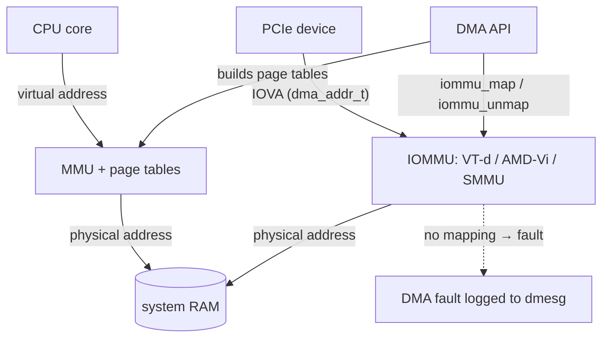

# DMA, Coherence & the IOMMU

> **Goal:** understand the moment the CPU's world and the device's world touch —
> a peripheral writing directly into host RAM. You'll learn the three address
> spaces involved, the DMA API that mediates them, why bounce buffers appear,
> what an IOMMU actually does, and why a pinned DMA buffer is the piece of
> process state no checkpointer can describe.

## Three address spaces, not two

[Virtual Memory](#/memory) taught you two kinds of address: the *virtual*
address a process uses, and the *physical* address of the RAM behind it, with
the MMU translating between them. That model is complete for the CPU. It is
wrong for a device.

A device performing DMA does not go through the CPU's MMU. It emits addresses
onto a bus, and something between the bus and the memory controller decides
what those addresses mean. The kernel calls the result a **bus address** or
**DMA address**, and the DMA API's own documentation is blunt that it is a
third thing:

> In some systems, bus addresses are identical to CPU physical addresses, but
> in general they are not. IOMMUs and host bridges can produce arbitrary
> mappings between physical and bus addresses.
> — [Documentation/core-api/dma-api-howto.rst](https://elixir.bootlin.com/linux/v6.12/source/Documentation/core-api/dma-api-howto.rst)

So there are three:

```text
CPU virtual        CPU physical            device/bus address
-----------        ------------            ------------------
0xffff8881_0a3c0000   0x0a3c0000    ...    0x0a3c0000     ← no IOMMU: same (maybe + offset)
0xffff8881_0a3c0000   0x0a3c0000    ...    0xfffb2000     ← IOMMU: an IOVA, unrelated
     ↑ kmalloc()          ↑ struct page          ↑ what the device puts on the wire
   MMU translates                            IOMMU translates
```

Burn this in now, because almost every confusing DMA bug is a violation of it:
**the value in a `dma_addr_t` is not a physical address.** When an IOMMU is in
the path it is an **IOVA** — an I/O virtual address — allocated from a
per-device address space the kernel invented, with no relationship to where the
bytes physically live. `virt_to_phys()` on a buffer and the `dma_addr_t` the
DMA API handed you for that same buffer are, in general, different numbers, and
only one of them is safe to program into a device. `phys_addr_t`, `dma_addr_t`
and `void *` are three distinct C types precisely because they name three
distinct spaces.

Two consequences follow. A `dma_addr_t` is valid only **for the device it was
created for** — two devices can be given the same IOVA meaning two different
physical pages, exactly the way two processes can use virtual address `0x4000`
for different pages. And it is valid only **while the mapping exists**: unmap
it and the IOMMU entry is torn down, so a device still using the old value is
committing the device-side equivalent of a use-after-free.

## The DMA API

`dma_addr_t` is defined for you by `#include <linux/dma-mapping.h>`, and the
kernel has exactly one blessed way to obtain one. Two families, and choosing
between them is the first design decision in any driver.

### Coherent allocations: buy the memory and the mapping together

```c
void *dma_alloc_coherent(struct device *dev, size_t size,
                         dma_addr_t *dma_handle, gfp_t flag);
void  dma_free_coherent(struct device *dev, size_t size, void *cpu_addr,
                        dma_addr_t dma_handle);
```

This allocates memory *and* maps it in one step, handing back both a kernel
virtual address (the return value) and the DMA address (`*dma_handle`). The
guarantee in the name is the point: CPU and device see the same bytes with no
explicit software step. Write a descriptor from the CPU and the device observes
it; the device writes a completion status and the CPU observes that.

On a cache-coherent platform (x86-64, most server arm64) that is free — the
hardware maintains it. On a **non-coherent** platform the kernel usually pays
for it by mapping the memory *uncached* or write-combining, which is why
coherent allocations are for small, long-lived control structures — descriptor
rings, doorbell pages, firmware images — and never for bulk data. Coherent
mappings carry no direction: "Only streaming mappings specify a direction,
consistent mappings implicitly have a direction attribute setting of
`DMA_BIDIRECTIONAL`." ("Consistent" is the DMA documentation's older word for
what the API now calls coherent.)

`dma_alloc_noncoherent()` is the v6.12 middle ground — normally-cached memory
with a DMA mapping, where *you* own the cache maintenance via the sync calls
below.

### Streaming mappings: map memory you already have

Bulk data usually already exists — a page-cache folio, an `skb`, a userspace
buffer. Streaming mappings map it for the duration of one transfer:

```c
dma_addr_t dma_map_single(struct device *dev, void *cpu_addr, size_t size,
                          enum dma_data_direction dir);
void       dma_unmap_single(struct device *dev, dma_addr_t dma_addr, size_t size,
                            enum dma_data_direction dir);
dma_addr_t dma_map_page(struct device *dev, struct page *page,
                        size_t offset, size_t size, enum dma_data_direction dir);
```

In v6.12 `dma_map_single()` is a macro over `dma_map_single_attrs()`, an inline
in `include/linux/dma-mapping.h` that funnels into `dma_map_page_attrs()` —
with one guard worth knowing about:

```c
	/* DMA must never operate on areas that might be remapped. */
	if (dev_WARN_ONCE(dev, is_vmalloc_addr(ptr),
			  "rejecting DMA map of vmalloc memory\n"))
		return DMA_MAPPING_ERROR;
```

`vmalloc()` memory is virtually contiguous and physically scattered, so a
single DMA mapping over it would be nonsense. The API refuses rather than
corrupt memory quietly.

**Every mapping can fail, and you must check.** There is no error pointer and
no negative return; failure is the sentinel
`#define DMA_MAPPING_ERROR (~(dma_addr_t)0)`, which you must never compare
against yourself:

```c
	dma_addr = dma_map_single(dev, buf, len, DMA_FROM_DEVICE);
	if (dma_mapping_error(dev, dma_addr))
		goto err;
```

Failure is not theoretical: IOVA space exhausts, the SWIOTLB pool fills, a
buffer exceeds the device's addressable range. A driver that skips
`dma_mapping_error()` programs `0xffffffffffffffff` into a device register and
then debugs the aftermath.

### Direction is not decoration

```c
enum dma_data_direction {
	DMA_BIDIRECTIONAL = 0,
	DMA_TO_DEVICE = 1,
	DMA_FROM_DEVICE = 2,
	DMA_NONE = 3,
};
```

The direction is a *contract*, and the kernel acts on it three ways.

It decides **cache maintenance**. This is the whole of arm64's sync path, in
`arch/arm64/mm/dma-mapping.c`:

```c
void arch_sync_dma_for_device(phys_addr_t paddr, size_t size,
			      enum dma_data_direction dir)
{
	unsigned long start = (unsigned long)phys_to_virt(paddr);

	dcache_clean_poc(start, start + size);
}

void arch_sync_dma_for_cpu(phys_addr_t paddr, size_t size,
			   enum dma_data_direction dir)
{
	unsigned long start = (unsigned long)phys_to_virt(paddr);

	if (dir == DMA_TO_DEVICE)
		return;

	dcache_inval_poc(start, start + size);
}
```

Before the device reads, dirty CPU cache lines are *cleaned* out to the point
of coherency so the device sees your writes. Before the CPU reads, stale lines
are *invalidated* so you see the device's — unless the direction says the
device only read, in which case the work is skipped. Get the direction wrong on
such a platform and you get silent corruption: your writes stuck in cache, or
the device's writes discarded by a stale line.

It decides **IOMMU permissions**. `dma_info_to_prot()` turns the direction into
`IOMMU_READ` / `IOMMU_WRITE` bits. A `DMA_TO_DEVICE` mapping is read-only *to
the device*; if the device writes to it anyway, the IOMMU faults. That is a
genuine security property, not a formality.

And it decides **what a bounce buffer copies, and when** — see below.

The mnemonic that prevents most mistakes: the direction is written from the
**device's** point of view. `DMA_TO_DEVICE` = the device will read this (a
transmit buffer). `DMA_FROM_DEVICE` = the device will write this (a receive
buffer). `DMA_BIDIRECTIONAL` costs you maintenance in both directions at both
ends. `DMA_NONE` exists to be rejected — `valid_dma_direction()` returns false
for it — as a debugging poison value.

### Ownership, and what `dma_sync_*` really does

The rule underneath the whole streaming API: **between map and unmap, the
buffer belongs to the device. The CPU must not touch it.** If you need to peek
mid-flight, you borrow it back and then return it:

```c
void dma_sync_single_for_cpu(struct device *dev, dma_addr_t dma_handle,
                             size_t size, enum dma_data_direction dir);
void dma_sync_single_for_device(struct device *dev, dma_addr_t dma_handle,
                                size_t size, enum dma_data_direction dir);
```

Here is the canonical shape, trimmed from the kernel's own
`dma-api-howto.rst` — a NIC receive path that inspects a header before deciding
whether to accept the frame:

```c
	mapping = dma_map_single(cp->dev, buffer, len, DMA_FROM_DEVICE);
	if (dma_mapping_error(cp->dev, mapping))
		goto map_error_handling;
	cp->rx_buf = buffer; cp->rx_len = len; cp->rx_dma = mapping;
	give_rx_buf_to_card(cp);

	/* ... later, in the completion interrupt ... */

	/* Examine the header ... But synchronize the DMA transfer
	 * with the CPU first so that we see updated contents. */
	dma_sync_single_for_cpu(&cp->dev, cp->rx_dma, cp->rx_len,
				DMA_FROM_DEVICE);

	hp = (struct my_card_header *) cp->rx_buf;
	if (header_is_ok(hp)) {
		dma_unmap_single(&cp->dev, cp->rx_dma, cp->rx_len,
				 DMA_FROM_DEVICE);
		pass_to_upper_layers(cp->rx_buf);
	} else {
		/* CPU should not write to a DMA_FROM_DEVICE-mapped area,
		 * so dma_sync_single_for_device() is not needed here. It
		 * would be required for a DMA_BIDIRECTIONAL mapping if the
		 * memory was modified. */
		give_rx_buf_to_card(cp);   /* hand it back, reuse it */
	}
```

Note the asymmetry in the `else` branch, because it is the half people get
backwards. Borrowing the buffer back with `dma_sync_single_for_cpu()` and only
*reading* it does not dirty anything the device needs to see, so handing it
back needs no `dma_sync_single_for_device()`. That call is what you owe the
device when the CPU has *written* to a buffer it is about to reuse — a
`DMA_BIDIRECTIONAL` or `DMA_TO_DEVICE` mapping.

Now the part people get wrong. **What `dma_sync_*` does depends entirely on the
platform, and on x86-64 the answer is usually "nothing."** Read
`dma_direct_sync_single_for_cpu()` in `kernel/dma/direct.h`:

```c
	phys_addr_t paddr = dma_to_phys(dev, addr);

	if (!dev_is_dma_coherent(dev)) {
		arch_sync_dma_for_cpu(paddr, size, dir);
		arch_sync_dma_for_cpu_all();
	}

	swiotlb_sync_single_for_cpu(dev, paddr, size, dir);
```

On a coherent device both branches are no-ops unless a bounce buffer is
involved. That is why omitting the sync calls is such a durable bug: the driver
works perfectly on the developer's x86 laptop and corrupts data on an embedded
arm64 board where `dev->dma_coherent` is false. `dev_is_dma_coherent()` reads a
per-device flag set by `arch_setup_dma_ops()` from the firmware description —
the `dma-coherent` device-tree property, or ACPI `_CCA`. Coherency is a
property of the *system integration*, not of your driver. Write the sync calls.
What "point of coherency" means and the instructions behind `dcache_clean_poc`
belong to [arm64 Memory Management](#/arm64-memory).

### DMA masks: what the device can actually reach

The kernel's default assumption is pessimistic — 32 bits. A device that can do
better must say so with `dma_set_mask_and_coherent(dev, DMA_BIT_MASK(64))`. The
mask is a *reachability* statement: if ANDing the mask with a DMA address does
not clear any bits, the device can reach that address. `dma_set_mask()` covers
streaming mappings, `dma_set_coherent_mask()` coherent allocations, and the
combined call does both, with the guarantee that the coherent mask may be the
same or narrower.

A machine with 128 GiB of RAM has physical addresses well above 4 GiB. A device
with `DMA_BIT_MASK(32)` — an old NIC, a 32-bit DMA engine on an SoC, a PCI (not
PCIe) card, some FPGA IP cores — cannot address most of it. If the buffer lives
high, the kernel has three options: fail, translate, or copy. With no IOMMU
present, copy is the only one left. That is where bounce buffers come from.

## SWIOTLB: where the kernel quietly copies

`swiotlb` — the *software* I/O TLB — is a slab of low, physically contiguous
memory reserved at boot into which the kernel copies data on behalf of devices
that cannot reach the real buffer. Watch it happen in
`dma_direct_map_page()`:

```c
	phys_addr_t phys = page_to_phys(page) + offset;
	dma_addr_t dma_addr = phys_to_dma(dev, phys);

	if (is_swiotlb_force_bounce(dev))
		return swiotlb_map(dev, phys, size, dir, attrs);

	if (unlikely(!dma_capable(dev, dma_addr, size, true)) ||
	    dma_kmalloc_needs_bounce(dev, size, dir)) {
		if (is_swiotlb_active(dev))
			return swiotlb_map(dev, phys, size, dir, attrs);
		...
```

`dma_capable()` is the mask check. Fail it, and if SWIOTLB is available the
transfer is silently rerouted through a bounce slot; the `dma_addr_t` you get
back points at the *bounce buffer*, not at your data. The direction then decides
the copies. (The code copies in even for `DMA_FROM_DEVICE`, deliberately, so a
device performing a partial write doesn't leave the untouched remainder holding
kernel garbage.)

Everything about it is a performance cliff:

- **You reintroduced the memcpy DMA existed to avoid.** Every byte crosses the
  memory bus twice.
- **The pool is small and fixed.** `IO_TLB_DEFAULT_SIZE` is 64 MiB. Slots are
  `1 << IO_TLB_SHIFT` = 2 KiB, allocated in runs of at most `IO_TLB_SEGSIZE` =
  128 slots.
- **Therefore no single mapping can exceed 256 KiB** —
  `swiotlb_max_mapping_size()` returns `IO_TLB_SIZE * IO_TLB_SEGSIZE`, less an
  allowance for the device's DMA min-align mask if it has one.
  A driver that assumes it can map a 1 MiB buffer in one go fails on a bounced
  path. `dma_max_mapping_size(dev)` is how you ask.
- **Exhaustion is a hard failure**, rate-limited to dmesg:
  `"swiotlb buffer is full (sz: %zd bytes), total %lu (slots), used %lu (slots)"`.
  The pool can grow dynamically in some configurations; don't plan on it.

Two modern reasons you may bounce even on a 64-bit-capable device:
**confidential computing** (a guest with encrypted memory must bounce through a
shared unencrypted region, so `swiotlb=force` is effectively the norm), and
**untrusted devices** — a hot-plugged Thunderbolt gadget gets bounced and its
padding zeroed so it can never see neighbouring bytes of a page it was given
sub-page access to.

### Seeing it

```bash
sudo dmesg | grep -i 'software IO TLB'
```

```text
software IO TLB: area num 8.                          ← per-CPU-ish areas, each with its own lock
software IO TLB: mapped [mem 0x00000000b6000000-0x00000000ba000000] (64MB)
```

```bash
# live utilisation, in 2 KiB slots
sudo grep -H '' /sys/kernel/debug/swiotlb/io_tlb_{nslabs,used,used_hiwater}
```

```text
/sys/kernel/debug/swiotlb/io_tlb_nslabs:32768         ← 32768 × 2 KiB = 64 MiB
/sys/kernel/debug/swiotlb/io_tlb_used:0               ← nothing bouncing right now
/sys/kernel/debug/swiotlb/io_tlb_used_hiwater:1152    ← but something did: ~2.3 MiB peak
```

`io_tlb_used_hiwater` is the one to watch: a nonzero high-water mark on a
machine you thought had no 32-bit devices is a finding.

> **A trap worth naming.** `Bounce:` in `/proc/meminfo` is **not** SWIOTLB. It
> reports `NR_BOUNCE`, incremented in `block/bounce.c` for the *block layer's*
> highmem bounce pages — a different, much older mechanism. On a modern x86-64
> box it is essentially always `0`, and its being `0` tells you nothing about
> DMA bouncing. Use the swiotlb debugfs files.

## Scatter-gather: many buffers, one transfer

A 1 MiB read from a file lands in the page cache as 256 physically scattered
4 KiB folios. `dma_map_single()` maps one contiguous run, so mapping that
naïvely means 256 mappings and 256 descriptors. Every serious DMA engine
therefore supports **scatter-gather**: hand it a list of (address, length)
pairs and it walks the list itself. Linux expresses that list as a
`struct sg_table`, and its two counters are the entire subtlety:

```c
struct sg_table {
	struct scatterlist *sgl;	/* the list */
	unsigned int nents;		/* number of mapped entries */
	unsigned int orig_nents;	/* original size of list */
};
```

`orig_nents` is how many CPU-side segments you built. `nents` is how many
DMA-side segments came back after mapping — and it can be *smaller*, because
mapping is allowed to merge adjacent segments. That asymmetry is the source of
the single most common scatter-gather bug, and the howto shouts about it:

> The 'nents' argument to the dma_unmap_sg call must be the _same_ one you
> passed into the dma_map_sg call, it should _NOT_ be the 'count' value
> _returned_ from the dma_map_sg call.

Which is why v6.12 wants you to use the table-based wrapper instead, where the
bookkeeping is done for you and errors arrive as a normal errno rather than as
a `0`:

```c
int dma_map_sgtable(struct device *dev, struct sg_table *sgt,
		    enum dma_data_direction dir, unsigned long attrs);
```

After mapping, you iterate the **DMA** view — `for_each_sgtable_dma_sg()`,
which walks `nents` — and read each segment with `sg_dma_address(sg)` and
`sg_dma_len(sg)`. Those are separate fields from `sg->offset`/`sg->length`
precisely because the CPU view and the device view are different lists.

### Why the IOMMU changes the allocator problem

Here is where the two halves of this chapter meet. Without an IOMMU,
"contiguous for the device" means "contiguous in physical memory", and the only
source of large contiguous physical regions is the buddy allocator's high-order
path — which, as [Virtual Memory](#/memory) showed, degrades badly with uptime
and may require compaction. Drivers that need it reserve at boot (CMA,
hugetlbfs) or give up and do scatter-gather.

With an IOMMU, contiguity is free. `iommu_dma_map_sg()` sums the aligned
lengths of every segment, allocates **one** IOVA range for the whole list, and
calls `iommu_map_sg()` once; `__finalise_sg()` then concatenates segments that
came out adjacent in IOVA space. A 128-segment scatterlist over 128 scattered
physical pages can come back as `nents == 1`: one address, one length, one
descriptor. The device sees a contiguous megabyte that exists nowhere in
physical memory. That is not a micro-optimisation — it is the reason an IOMMU
can make a device *faster*, and it collapses an allocator problem into an
address-space bookkeeping problem, the same trade the CPU MMU made decades
earlier.

## The IOMMU: an MMU for devices

An IOMMU is the same idea as the CPU's MMU, moved to the other side of the bus.
It sits between devices and memory, holds page tables, translates incoming
addresses, and faults on anything not mapped. The address a device emits is an
**IOVA**; the IOMMU translates IOVA → physical.



Two things follow. **Isolation**: a device can only reach memory the kernel
deliberately mapped for it, so a malicious or buggy bus-mastering device can no
longer scribble over arbitrary kernel RAM. **Translation**: a 32-bit device can
be given a 32-bit IOVA that maps to a buffer at 100 GiB physical, and the
bounce buffer disappears.

### Domains

A **domain** (`struct iommu_domain`) is one address space — one set of I/O page
tables. Its `type` field names every mode an IOMMU can be in:

```c
#define IOMMU_DOMAIN_BLOCKED	(0U)                      /* all DMA blocked */
#define IOMMU_DOMAIN_IDENTITY	(__IOMMU_DOMAIN_PT)       /* IOVA == physical */
#define IOMMU_DOMAIN_UNMANAGED	(__IOMMU_DOMAIN_PAGING)   /* caller drives iommu_map() */
#define IOMMU_DOMAIN_DMA	(__IOMMU_DOMAIN_PAGING | __IOMMU_DOMAIN_DMA_API)
#define IOMMU_DOMAIN_DMA_FQ	(... | __IOMMU_DOMAIN_DMA_FQ)   /* batched invalidation */
#define IOMMU_DOMAIN_SVA	(__IOMMU_DOMAIN_SVA)      /* shares an mm_struct */
```

`IOMMU_DOMAIN_DMA` is what your ordinary driver gets: the DMA API owns the
domain and populates it behind `dma_map_*`. `IOMMU_DOMAIN_UNMANAGED` is what
VFIO and other in-kernel users get, and it is where the low-level API is
actually called:

```c
int iommu_map(struct iommu_domain *domain, unsigned long iova,
	      phys_addr_t paddr, size_t size, int prot, gfp_t gfp);
size_t iommu_unmap(struct iommu_domain *domain, unsigned long iova, size_t size);
phys_addr_t iommu_iova_to_phys(struct iommu_domain *domain, dma_addr_t iova);
```

Read those three signatures as a unit and the "three address spaces" claim
stops being an assertion and becomes a type signature: `iommu_map()` takes
`unsigned long iova` and `phys_addr_t paddr` as *separate arguments*, and
`iommu_iova_to_phys()` exists because you cannot get one from the other by
arithmetic. `prot` is the CPU side's permission vocabulary — `IOMMU_READ`,
`IOMMU_WRITE`, `IOMMU_NOEXEC`, `IOMMU_CACHE`, `IOMMU_MMIO`. In v6.12 drivers
allocate a domain with `iommu_paging_domain_alloc(dev)`; the older bus-based
`iommu_domain_alloc(bus)` is on its way out.

### Groups: the hardware property you cannot argue with

You would like the unit of isolation to be one device. Frequently it is not,
and the reason is not software. VFIO's documentation states it precisely:

> This isolation is not always at the granularity of a single device though.
> Even when an IOMMU is capable of this, properties of devices, interconnects,
> and IOMMU topologies can each reduce this isolation.
> — [Documentation/driver-api/vfio.rst](https://elixir.bootlin.com/linux/v6.12/source/Documentation/driver-api/vfio.rst)

Three concrete ways isolation degrades: a **multi-function device** may route
transactions between its own functions internally, so the IOMMU never sees
them; a bridge without **PCI ACS** (Access Control Services) may redirect a
peer-to-peer transaction downstream instead of forwarding it upstream to the
IOMMU; and a **PCIe-to-PCI bridge** masks the devices behind it, so every
transaction arrives tagged with the bridge's identity and the IOMMU cannot tell
them apart at all.

So Linux defines an **IOMMU group**: the smallest set of devices provably
isolatable from everything else. `pci_device_group()` computes it by walking
the topology — following DMA aliases upstream, then continuing up "to the point
where devices are protected from peer-to-peer DMA by PCI ACS", then folding in
aliases and non-isolated functions in the same slot. The result is exported
read-only:

```bash
for g in /sys/kernel/iommu_groups/*; do
  echo "group ${g##*/}"
  for d in "$g"/devices/*; do
    printf '  %s  %s\n' "${d##*/}" "$(lspci -nns "${d##*/}" | cut -d' ' -f2-)"
  done
done
```

```text
group 1
  0000:00:02.0  VGA compatible controller [0300]: Intel Corporation UHD Graphics 630 [8086:3e98]
group 13
  0000:00:01.0  PCI bridge [0604]: Intel Corporation PCIe Controller (x16) [8086:1901] (rev 07)   ← the root port
  0000:01:00.0  VGA compatible controller [0300]: NVIDIA Corporation GA102 [10de:2204] (rev a1)   ← the GPU
  0000:01:00.1  Audio device [0403]: NVIDIA Corporation GA102 HD Audio [10de:1aef] (rev a1)       ← its HDMI audio
group 14
  0000:02:00.0  Non-Volatile memory controller [0108]: Samsung 980 PRO [144d:a80a]
```

Group 13 is the classic shape and the classic frustration: you wanted to pass
the GPU to a VM, and you must pass its audio function too, because the two
functions of one card are not isolatable from each other. Group membership is
computed from hardware topology and ACS capability; you cannot edit it. (The
"ACS override" patch that circulates does not make the hardware isolate — it
makes the kernel *stop checking*. That is a real loss of a security property,
and why it is out of tree.)

### Same idea, different tables

The three big implementations differ in their table shapes and their naming,
not in their concept.

| | Intel **VT-d** | AMD **AMD-Vi** | ARM **SMMUv3** |
|---|---|---|---|
| device identity | bus/device/function | device ID | **StreamID** |
| first lookup | root table → context table | Device Table (from IVRS) | Stream Table → **STE** |
| per-address-space table | PASID directory → PASID table | per-device page table | **Context Descriptor** table |
| page-table format | VT-d paging structures | AMD v1/v2 page tables | ARM long-descriptor (`io-pgtable-arm.c`, the same format arm64 uses for the CPU) |
| firmware description | ACPI DMAR | ACPI IVRS | ACPI IORT or device tree |
| kernel driver | `drivers/iommu/intel/` | `drivers/iommu/amd/` | `drivers/iommu/arm/arm-smmu-v3/` |

In every case: a device identifier indexes a first-level table, which points at
a per-address-space descriptor, which points at a page-table root, which is
walked to translate the IOVA. If you understood the CPU's four-level walk in
[Virtual Memory](#/memory), you understand all three. The SMMU case is the most
literal — `io-pgtable-arm.c` implements the *same* descriptor format the arm64
MMU uses. Each also supports two stages of translation (guest IOVA → guest
physical → host physical), which is what makes assigning a device to a VM work
at all; [KVM Internals](#/kvm-internals) continues that story.

### Passthrough, strictness, and the trade

An IOMMU is not free. Every `dma_map_*` allocates an IOVA and writes page-table
entries; every unmap must invalidate an IOTLB entry, and IOTLB invalidation is
slow and serialising. On a NIC doing millions of packets per second this is
measurable. Linux gives you three dials, all in
`Documentation/admin-guide/kernel-parameters.txt`:

- **`iommu.passthrough=1`** (or the older x86 `iommu=pt`) — "Bypass the IOMMU
  for DMA." The device gets an `IOMMU_DOMAIN_IDENTITY` domain: IOVA equals
  physical address, no per-transfer page-table work. Full DMA speed, and *no
  isolation whatsoever* — you have re-armed every rogue-device attack.
  Interrupt remapping is a separate mechanism and typically stays on.
- **`iommu.strict=`** — `1` invalidates IOTLB entries synchronously on unmap;
  `0` defers them ("lazy mode ... for increased throughput at the cost of
  reduced device isolation") via the `IOMMU_DOMAIN_DMA_FQ` flush queue. The
  exposure is a window in which a freed page is still reachable by the device
  because its stale translation has not been flushed.
- **`iommu=off`** — no translation at all, and welcome back to bounce buffers.
  Note that `iommu=` (unlike `iommu.passthrough=` and `iommu.strict=`) is an
  x86-only parameter.

The trade is genuine and has no universally correct answer; what is *not*
acceptable is choosing passthrough by accident. The kernel tells you:

```bash
sudo dmesg | grep -E 'DMAR|AMD-Vi|arm-smmu|^\[.*\] iommu:'
```

```text
DMAR: IOMMU enabled
DMAR: Host address width 39
DMAR: DRHD base: 0x000000fed90000 flags: 0x0
DMAR: dmar0: reg_base_addr fed90000 ver 1:0 cap 1c0000c40660462 ecap 19e2ff0505e
DMAR: RMRR base: 0x0000009d000000 end: 0x0000009f7fffff      ← firmware-reserved identity ranges
DMAR-IR: Enabled IRQ remapping in x2apic mode
iommu: Default domain type: Translated                       ← NOT passthrough. Good.
iommu: DMA domain TLB invalidation policy: lazy mode         ← deferred invalidation is on
```

If that first `iommu:` line says `Passthrough`, every driver on the box is
running with the IOMMU out of the data path. Note also that the kernel refuses
to default to passthrough when memory encryption is active — see
`iommu_subsys_init()`, which logs "Memory encryption detected - Disabling
default IOMMU Passthrough".

## VFIO: giving a device away, safely

Once you have groups, userspace device assignment becomes expressible. **VFIO**
is the framework that does it, and its central design decision follows directly
from the previous section: *the group, not the device, is the unit of
ownership.*

To hand a device to a VM or to a userspace driver you unbind every device in
its group from its host driver, bind them to `vfio-pci`, and open the resulting
`/dev/vfio/$GROUP` character device. From there userspace attaches the group to
a container, sets an IOMMU backend, and programs mappings with
`VFIO_IOMMU_MAP_DMA` — which is `iommu_map()` with a userspace ioctl on top,
against an `IOMMU_DOMAIN_UNMANAGED` domain. The guest's memory becomes the
device's IOVA space, and the IOMMU makes that confinement real.

v6.12 is mid-transition: the legacy container/group model is being superseded
by **iommufd** (`drivers/iommu/iommufd/`) plus a per-device cdev at
`/dev/vfio/devices/vfioX`, with the old interface retained as a compatibility
mode. The kernel's own documentation says the "vfio container and group model
is intended to be deprecated."

Everything else about passthrough — how QEMU wires this to a guest, MSI-X
remapping, the performance picture — is [KVM Internals](#/kvm-internals)'s
subject, not this chapter's.

## Pinning user memory

So far the buffers were the kernel's own. The interesting case is a device
DMAing straight into a *userspace* buffer: RDMA, io_uring registered buffers,
direct I/O, GPU compute. That buffer is described by a VMA and page tables the
kernel is free to change at any moment — reclaim it, migrate it for compaction,
collapse it into a THP. A device holding a raw physical address knows none of
that.

So the kernel pins the pages. Historically with `get_user_pages()`, which
resolves the virtual addresses and takes an ordinary reference on each page.
That turned out not to be enough information. A refcount says "someone is using
this page"; it does not say *who* or *why*. Filesystem and writeback code must
distinguish "a kernel thread is briefly reading this" from "a piece of hardware
may write into this at any instant, with no notification, forever." One
refcount cannot express both. Hence the split, now the required form for DMA:

```c
long get_user_pages(unsigned long start, unsigned long nr_pages,
		    unsigned int gup_flags, struct page **pages);   /* FOLL_GET */
long pin_user_pages(unsigned long start, unsigned long nr_pages,
		    unsigned int gup_flags, struct page **pages);   /* FOLL_PIN */
void unpin_user_pages(struct page **pages, unsigned long npages);
```

The two flags are mutually exclusive per call, and pinned pages **must** be
released with `unpin_user_page*()` — mixing the release functions corrupts the
counters. The counting is deliberately odd: `GUP_PIN_COUNTING_BIAS` is
`(1U << 10)`, so a pin on a small folio adds 1024 to the refcount rather than
1, letting `folio_maybe_dma_pinned()` get a usable answer out of a single
field. Large folios get an exact `_pincount`. The kernel's own comment is
honest that the small-folio answer is fuzzy in one direction only: false means
"definitely not pinned", true means "probably pinned".

### `FOLL_LONGTERM`, and why a pinned page poisons your memory management

`FOLL_PIN` alone means a short pin — a direct-I/O transfer that will complete.
`FOLL_LONGTERM` means the device may own this page indefinitely: an RDMA
registered region, a GPU buffer. The documentation is explicit that
"FOLL_LONGTERM is a specific case, more restrictive case of FOLL_PIN."

What makes it more restrictive is one predicate:

```c
/* MIGRATE_CMA and ZONE_MOVABLE do not allow pin folios */
static inline bool folio_is_longterm_pinnable(struct folio *folio)
{
#ifdef CONFIG_CMA
	int mt = folio_migratetype(folio);

	if (mt == MIGRATE_CMA || mt == MIGRATE_ISOLATE)
		return false;
#endif
	/* The zero page can be "pinned" but gets special handling. */
	if (is_zero_folio(folio))
		return true;

	/* Coherent device memory must always allow eviction. */
	if (folio_is_device_coherent(folio))
		return false;

	/* Otherwise, non-movable zone folios can be pinned. */
	return !folio_is_zone_movable(folio);
}
```

`__gup_longterm_locked()` pins the pages, then calls
`check_and_migrate_movable_pages()`, which collects every folio failing that
test, **migrates it out of movable memory**, and retries — looping on `-EAGAIN`
until every page sits somewhere it can be nailed down permanently.

Read that again, because it is the consequence this course cares about. A
long-term pin does not merely mark a page busy. It **relocates** the page into
unmovable memory and removes it from the reach of the entire memory management
system:

- It **cannot be migrated**, so it cannot be moved for [NUMA](#/numa-deep-dive)
  balancing.
- It **cannot be compacted**, so it becomes a permanent obstacle in the buddy
  allocator's hunt for contiguous high-order blocks — the mechanism THP
  collapse depends on. One pinned 4 KiB page in the middle of a 2 MiB block
  makes that block un-collapsible, forever.
- It **cannot be reclaimed.** Memory pressure cannot touch it.
- **Memory hotplug and `ZONE_MOVABLE` stop working as designed.** The premise
  of `ZONE_MOVABLE` is that everything in it can be evacuated; the migration
  step exists to protect that premise, which means a large long-term pin
  quietly shifts pressure onto the non-movable zones and shrinks what hotplug
  can offline.

A driver that pins a few gigabytes has therefore not just consumed memory — it
has fragmented the machine in a way no amount of reclaim will undo until it
unpins. That is the real cost of "zero-copy", and why
`pin_user_pages(FOLL_LONGTERM)` is a privileged, deliberate act rather than an
optimisation you sprinkle on. The alternative that avoids pinning entirely is
to register an MMU notifier and let the kernel tell the device when a mapping
changes — see [HMM & MMU Notifiers](#/hmm-and-mmu-notifiers).

## P2P DMA, briefly

If two devices are on the same bus, a transfer between them need not touch host
RAM at all. NVMe-to-RNIC, GPU-to-GPU, GPU-to-NVMe: the source's BAR memory is
the DMA target, and the data never crosses the memory controller. Linux
supports it as **PCI P2PDMA**; you can see its traces in the mapping code —
`is_pci_p2pdma_page()`, `sg_dma_is_bus_address()`, and the
`PCI_P2PDMA_MAP_BUS_ADDR` verdict, meaning "this segment carries a raw bus
address, do not put it in the IOMMU." What has to be true is restrictive, and
the documentation is candid about why:

> the kernel only supports doing P2P when the endpoints involved are all behind
> the same PCI bridge, as such devices are all in the same PCI hierarchy
> domain, and the spec guarantees that all transactions within the hierarchy
> will be routable, but it does not require routing between hierarchies.

Beyond routability, the memory being targeted must be backed by `struct page`
(a `ZONE_DEVICE` mapping registered with `pci_p2pdma_add_resource()`), and for
paths that go *through* the root complex the kernel consults a hardware
whitelist, because "there is no simple way to determine if a given Root Complex
supports this or not." If the check fails you get
`PCI_P2PDMA_MAP_NOT_SUPPORTED` and the transfer must go through host memory
after all.

## The checkpointer's angle

This course's spine is *what is a process, exactly, such that you could write it
down and rebuild it later?* DMA breaks the answer in two specific ways.

**A pinned DMA buffer is process state the kernel can enumerate but not
explain.** Walk `/proc/<pid>/maps` and you find a perfectly ordinary anonymous
VMA; walk `pagemap` and every page is present; a dumper happily copies the
bytes. What is nowhere in `/proc` is the fact that a device holds a long-term
pin on those pages and may be writing into them right now. There is no
`/proc/<pid>/dma`, and nothing enumerates "which devices have IOVAs pointing at
this process's memory". So the checkpoint is a photograph of a surface someone
else is still painting — and on restore the bytes come back at new physical
addresses with no live mapping at all, which is a different object even if
every byte matches.

**A live IOMMU mapping is hardware state with no representation at all.** The
IOVA→physical entries in a device's page tables are not process state in any
form `/proc` models. `/sys/kernel/iommu_groups/` tells you which devices *could*
be isolated together, not what is currently mapped, for whom, or at which IOVA.
`iommu_iova_to_phys()` exists in-kernel and has no userspace equivalent.
Restore cannot recreate what dump could not read.

Connect this to [GPU Checkpointing](#/gpu-checkpoint), which lists "pinned host
buffers whose *purpose* (a DMA target) `/proc` cannot express" among the things
invisible to a `/proc` walk. This chapter is why that sentence is true. A CUDA
process holds pinned host staging buffers, IOVAs mapped into the GPU's domain,
and a device-side page table referencing them — every one invisible or
meaningless from userspace. Hence *vendor cooperation*: `cuda-checkpoint`'s job
is precisely to tear all of this down — unpin, unmap, release the device — so
that what remains is an ordinary Linux process CRIU already knows how to dump.
The DMA layer is not a detail of why GPUs are hard to checkpoint. It is a large
part of the reason.

## Follow the code (kernel v6.12)

**Path 1: `dma_map_single()` on a machine with no IOMMU.**

1. `dma_map_single()` is a macro over
   [`dma_map_single_attrs()`](https://elixir.bootlin.com/linux/v6.12/C/ident/dma_map_single_attrs)
   in [include/linux/dma-mapping.h](https://elixir.bootlin.com/linux/v6.12/source/include/linux/dma-mapping.h)
   — it rejects `vmalloc` addresses and calls
   [`dma_map_page_attrs()`](https://elixir.bootlin.com/linux/v6.12/C/ident/dma_map_page_attrs).
2. That function, in [kernel/dma/mapping.c](https://elixir.bootlin.com/linux/v6.12/source/kernel/dma/mapping.c),
   picks an implementation: `dma_map_direct()` → the direct path,
   `use_dma_iommu(dev)` → `iommu_dma_map_page()`, otherwise a legacy
   `ops->map_page`.
3. The direct path is
   [`dma_direct_map_page()`](https://elixir.bootlin.com/linux/v6.12/C/ident/dma_direct_map_page)
   in [kernel/dma/direct.h](https://elixir.bootlin.com/linux/v6.12/source/kernel/dma/direct.h):
   compute `phys_to_dma()`, check `dma_capable()` against the mask, fall into
   [`swiotlb_map()`](https://elixir.bootlin.com/linux/v6.12/C/ident/swiotlb_map)
   if it fails, and finally call `arch_sync_dma_for_device()` if the device is
   not coherent.
4. `swiotlb_map()` reaches
   [`swiotlb_tbl_map_single()`](https://elixir.bootlin.com/linux/v6.12/C/ident/swiotlb_tbl_map_single)
   in [kernel/dma/swiotlb.c](https://elixir.bootlin.com/linux/v6.12/source/kernel/dma/swiotlb.c),
   which finds free slots via `swiotlb_find_slots()` and does the copy in
   `swiotlb_bounce()`. This is the function that emits "swiotlb buffer is full".

**Path 2: the same call, with an IOMMU.**

1. Step 2 above diverts to
   [`iommu_dma_map_page()`](https://elixir.bootlin.com/linux/v6.12/C/ident/iommu_dma_map_page)
   in [drivers/iommu/dma-iommu.c](https://elixir.bootlin.com/linux/v6.12/source/drivers/iommu/dma-iommu.c).
   It converts the direction to IOMMU `prot` bits with `dma_info_to_prot()`,
   bounces first if the device is untrusted or the buffer is sub-granule, and
   syncs caches if non-coherent.
2. `__iommu_dma_map()` allocates an IOVA from the per-domain allocator
   ([`alloc_iova_fast()`](https://elixir.bootlin.com/linux/v6.12/C/ident/alloc_iova_fast)
   in [drivers/iommu/iova.c](https://elixir.bootlin.com/linux/v6.12/source/drivers/iommu/iova.c),
   which keeps a per-CPU cache to avoid a global lock on every map) and calls
   [`iommu_map()`](https://elixir.bootlin.com/linux/v6.12/C/ident/iommu_map).
3. `iommu_map()` in [drivers/iommu/iommu.c](https://elixir.bootlin.com/linux/v6.12/source/drivers/iommu/iommu.c)
   dispatches through `domain->ops->map_pages` into the hardware driver —
   `drivers/iommu/intel/iommu.c`, `drivers/iommu/amd/`, or for ARM the shared
   page-table code in
   [drivers/iommu/io-pgtable-arm.c](https://elixir.bootlin.com/linux/v6.12/source/drivers/iommu/io-pgtable-arm.c).
4. Unmap runs the reverse and then must invalidate the IOTLB — synchronously in
   strict mode, batched through the flush queue in lazy mode. That invalidation
   is the cost `iommu.strict=0` is trying to amortise.

**Path 3: a long-term pin.**

[`pin_user_pages()`](https://elixir.bootlin.com/linux/v6.12/C/ident/pin_user_pages)
in [mm/gup.c](https://elixir.bootlin.com/linux/v6.12/source/mm/gup.c) sets
`FOLL_PIN` and calls
[`__gup_longterm_locked()`](https://elixir.bootlin.com/linux/v6.12/C/ident/__gup_longterm_locked).
With `FOLL_LONGTERM` set, that loop pins via `__get_user_pages_locked()`, then
runs
[`check_and_migrate_movable_pages()`](https://elixir.bootlin.com/linux/v6.12/C/ident/check_and_migrate_movable_pages),
which uses
[`folio_is_longterm_pinnable()`](https://elixir.bootlin.com/linux/v6.12/C/ident/folio_is_longterm_pinnable)
to find folios in `ZONE_MOVABLE` or CMA, unpins and migrates them with
`migrate_pages(..., MR_LONGTERM_PIN)`, and returns `-EAGAIN` so the whole thing
is retried. Release is
[`unpin_user_pages()`](https://elixir.bootlin.com/linux/v6.12/C/ident/unpin_user_pages).

## Try it yourself

All of this is visible on an ordinary machine — no special hardware required.

```bash
# 1. Is an IOMMU translating for you, or are you in passthrough?
sudo dmesg | grep -E 'DMAR|AMD-Vi|arm-smmu|iommu: (Default|DMA) domain'

# 2. What is stuck together, and how badly?
ls /sys/kernel/iommu_groups/ | wc -l
for g in /sys/kernel/iommu_groups/*; do
  n=$(ls "$g"/devices | wc -l); [ "$n" -gt 1 ] && echo "group ${g##*/}: $n devices"
done

# 3. Is anything bouncing?
sudo grep -H '' /sys/kernel/debug/swiotlb/io_tlb_{nslabs,used,used_hiwater}
grep -i bounce /proc/meminfo      # NB: block-layer counter, NOT swiotlb

# 4. Which devices are DMA-limited?
for d in /sys/bus/pci/devices/*; do
  printf '%s %s\n' "${d##*/}" "$(cat "$d"/dma_mask_bits 2>/dev/null)"
done | awk '$2 && $2 < 64'
```

To watch mappings happen you need tracing, not sysfs. The DMA API has
tracepoints — `dma_map_page`, `dma_unmap_page`, `swiotlb_bounced` — which
[ftrace](#/ftrace) enables directly and [eBPF Internals](#/ebpf-internals) can
aggregate. A histogram of `swiotlb_bounced` by device is the fastest way to
find the driver quietly costing you a memcpy per packet.

With a spare PCIe device and a machine you can reboot, the honest experiment is
to bind it to `vfio-pci` and confirm you must unbind *every* device in its
group first. Nothing teaches groups like being told no by the kernel.

## Check your understanding

1. A driver stores the value returned by `dma_map_single()` and later calls
   `phys_to_virt()` on it to inspect the buffer. On the developer's laptop it
   works. Why is this catastrophically wrong?

<details><summary>Show answer</summary>

Because a `dma_addr_t` is not a physical address. On a machine with no IOMMU
and no host-bridge offset it happens to equal one, which is why the laptop test
passes. With an IOMMU in the path it is an IOVA — allocated from a per-device
address space with no arithmetic relationship to the physical page — so
`phys_to_virt()` yields a pointer to unrelated memory. The correct route is the
CPU virtual address the driver already had before mapping, after a
`dma_sync_single_for_cpu()`; in-kernel, the only IOVA→physical translation is
`iommu_iova_to_phys()`.

</details>

2. Why does `dma_sync_single_for_cpu()` do essentially nothing on x86-64 but is
   still mandatory to write?

<details><summary>Show answer</summary>

On a coherent device `dev_is_dma_coherent()` is true, so
`dma_direct_sync_single_for_cpu()` skips `arch_sync_dma_for_cpu()` entirely and
only works if a SWIOTLB bounce buffer is involved. On a non-coherent platform —
many arm64 SoCs — the same call issues real cache maintenance
(`dcache_inval_poc()`), without which the CPU reads stale cache lines instead
of the device's data. Coherency is a property of the system integration,
advertised via `dma-coherent` in device tree or ACPI `_CCA`, not of your
driver. Omit the syncs and you have a driver that works on the machine you
tested and silently corrupts data on the one you didn't.

</details>

3. A device declares `DMA_BIT_MASK(32)` on a 128 GiB machine with no IOMMU.
   Trace what happens when the driver maps a page at physical address 90 GiB,
   and name two performance limits it now inherits.

<details><summary>Show answer</summary>

`dma_direct_map_page()` computes the DMA address, `dma_capable()` fails because
the address has bits above 32 set, and if SWIOTLB is active the mapping is
rerouted through `swiotlb_map()` — a bounce slot in the low pool, with a memcpy
in the direction the `enum dma_data_direction` specifies. The limits: the
default pool is only 64 MiB (`IO_TLB_DEFAULT_SIZE`), and exhausting it makes
mappings fail with "swiotlb buffer is full"; and no single mapping can exceed
`IO_TLB_SIZE * IO_TLB_SEGSIZE` = 2 KiB × 128 = 256 KiB, so large transfers must
be split — query `dma_max_mapping_size()`. Plus the obvious one: every byte is
copied twice. With an IOMMU present none of this happens, because the device
can be handed a 32-bit IOVA that maps to the 90 GiB page.

</details>

4. `dma_map_sg()` was called with 64 segments and returned 3. Which number do
   you pass to `dma_unmap_sg()`, which to `for_each_sgtable_dma_sg()`, and why
   are they different?

<details><summary>Show answer</summary>

Unmap takes the **original** 64 (`orig_nents`) — the howto is emphatic that it
must be the value passed to map, not the value returned. Programming the device
uses the **returned** 3 (`nents`). They differ because mapping may merge
segments: with an IOMMU, `iommu_dma_map_sg()` allocates one contiguous IOVA
range for the whole list and `__finalise_sg()` concatenates segments that came
out adjacent. `dma_map_sgtable()` exists to keep both counts inside the
`sg_table` so you cannot mix them up.

</details>

5. You want to pass a GPU through to a VM but the kernel refuses until you also
   unbind the audio function on the same card. Why can't this be fixed in
   software?

<details><summary>Show answer</summary>

Because the two functions may exchange transactions internally without those
transactions ever reaching the IOMMU, so the IOMMU cannot enforce isolation
between them — the same reason a non-ACS bridge or a PCIe-to-PCI bridge merges
devices into one group. `pci_device_group()` walks the topology to the point
where ACS guarantees peer-to-peer traffic is forced upstream. The group is a
statement about hardware, and VFIO takes it as the unit of ownership. The "ACS
override" patch does not make the hardware isolate; it makes the kernel stop
verifying.

</details>

6. `iommu.passthrough=1` measurably improves your NIC's throughput. What
   exactly did you give up, and what did you keep?

<details><summary>Show answer</summary>

You gave up DMA isolation: the device now runs in an `IOMMU_DOMAIN_IDENTITY`
domain where IOVA equals physical address, so any bus-mastering device — buggy
firmware, a malicious Thunderbolt gadget, a compromised NIC — can read and
write arbitrary physical memory. You keep interrupt remapping, a separate
mechanism. What you bought is the elimination of per-transfer IOVA allocation,
page-table writes, and IOTLB invalidation. The middle point is
`iommu.strict=0`: translation stays, invalidation is deferred, and the exposure
is a window in which a freed page is still reachable. Note also that the kernel
refuses passthrough-by-default under memory encryption.

</details>

7. Explain why `pin_user_pages(FOLL_LONGTERM)` makes it harder for the kernel
   to allocate a 2 MiB huge page — even for an unrelated process.

<details><summary>Show answer</summary>

A long-term pin must land in memory that will never move, so
`check_and_migrate_movable_pages()` first migrates the folio out of
`ZONE_MOVABLE`/CMA into an ordinary zone, then nails it there. That page can no
longer be migrated, compacted or reclaimed. Compaction is how the buddy
allocator manufactures contiguous high-order blocks, and THP collapse needs 512
contiguous 4 KiB frames. A single immovable pinned page in the middle of a
2 MiB-aligned block makes that block permanently uncollapsible until it is
unpinned — regardless of which process wanted the huge page. The same
immovability is why long-term pins undermine memory hotplug.

</details>

8. A checkpointer dumps a process holding an RDMA-registered buffer. Every page
   is present in `pagemap` and the bytes copy cleanly. Name the two distinct
   pieces of state it still failed to capture.

<details><summary>Show answer</summary>

First, the *pin itself* and its meaning: `/proc` shows an ordinary anonymous
VMA with resident pages and nothing that says a device holds a `FOLL_LONGTERM`
pin and may be writing into it during the dump. There is no `/proc/<pid>/dma`.
So the dump is a photograph of a buffer another agent is still mutating, and
the restored buffer has no pin behind it. Second, the *IOMMU mapping*: the
IOVA→physical entries in the device's domain are live hardware state with no
userspace representation — `/sys/kernel/iommu_groups/` describes isolation
topology, not current translations, and `iommu_iova_to_phys()` has no userspace
equivalent. Restore places the bytes at different physical addresses with no
mapping, so even a byte-perfect copy is not the same object. This is the
DMA-layer half of why a CUDA process needs vendor cooperation to be
checkpointed at all — see [GPU Checkpointing](#/gpu-checkpoint).

</details>

## Sources & further reading

- [Dynamic DMA mapping using the generic device](https://docs.kernel.org/core-api/dma-api.html) —
  the normative API reference: every signature quoted above, coherent vs
  streaming, and the ownership rules between map and unmap.
- [Dynamic DMA mapping Guide](https://docs.kernel.org/core-api/dma-api-howto.html) —
  source of the three-address-space picture, the DMA-mask discussion, and the
  `dma_sync_*` receive-path example.
- [pin_user_pages() and related calls](https://docs.kernel.org/core-api/pin_user_pages.html) —
  why `FOLL_PIN` had to be distinguished from `FOLL_GET`, the four caller cases,
  and the rule that `FOLL_LONGTERM` implies `FOLL_PIN`.
- [VFIO — "Virtual Function I/O"](https://docs.kernel.org/driver-api/vfio.html) —
  the authoritative statement of why IOMMU groups exist, the group/container
  model, and the iommufd transition.
- [PCI Peer-to-Peer DMA Support](https://docs.kernel.org/driver-api/pci/p2pdma.html) —
  the provider/client/orchestrator model and the hierarchy-domain restriction.
- [Kernel parameters](https://docs.kernel.org/admin-guide/kernel-parameters.html) —
  `iommu.passthrough=`, `iommu.strict=`, `iommu=pt`, `swiotlb=`, verbatim.
- Kernel source, v6.12: [kernel/dma/](https://elixir.bootlin.com/linux/v6.12/source/kernel/dma)
  (API core, direct path, SWIOTLB),
  [drivers/iommu/](https://elixir.bootlin.com/linux/v6.12/source/drivers/iommu)
  (core, `dma-iommu.c` glue, IOVA allocator, vendor drivers), and
  [mm/gup.c](https://elixir.bootlin.com/linux/v6.12/source/mm/gup.c) (pinning).
- LWN, [*Reconsidering the scope of get_user_pages()*](https://lwn.net/Articles/784574/) —
  the discussion that produced the `pin_user_pages()` split.
- Intel *Virtualization Technology for Directed I/O* and ARM *System Memory
  Management Unit Architecture Specification version 3* — the vendor documents
  behind the table above.

---

**Next:** the CPU-side counterpart to everything here —
[arm64 Memory Management](#/arm64-memory) explains the page tables, granule
sizes, and cache-maintenance instructions that make `arch_sync_dma_for_cpu()`
more than a no-op. Or follow the device further out:
[GPU Drivers & DRM](#/gpu-drivers) picks up where `dma_map_sg()` and `dma-buf`
leave off.
