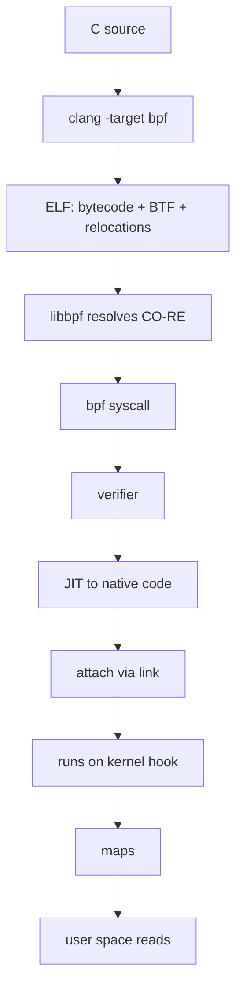

# eBPF Internals

> **Goal:** understand eBPF as a kernel execution substrate, not as a magic
> observability brand. The important objects are programs, maps, helpers,
> attach points, BTF, CO-RE, the verifier, and the JIT. Once those are clear,
> tracing, networking, security, and container monitoring become one system.

## The core idea

eBPF is a constrained virtual machine inside the Linux kernel. User space
loads bytecode through the `bpf()` syscall; the kernel verifies that the
program is safe enough to run; then the program is attached to a kernel hook:
a tracepoint, a kprobe, an LSM hook, a socket, TC, XDP, cgroup hooks, and many
others.

The key is not "running scripts in the kernel". The key is:

```text
event happens in kernel
    ↓
attached BPF program runs immediately, in kernel context
    ↓
program reads constrained kernel/user data
    ↓
program updates maps or emits events
    ↓
user space consumes aggregated results
```

This removes the expensive pattern where every event crosses into user space.
A BPF program can count, filter, aggregate, sample, drop packets, enforce
policy, or summarize latency before user space ever wakes up. Compare it to the
classic instrumentation loop: `strace` intercepts each syscall by stopping the
tracee and context-switching to the tracer twice per event, which can slow a
syscall-heavy workload by 10-100x. A BPF program attached to the same syscall
runs in a few dozen nanoseconds without leaving kernel context. That gap — the
cost of *not* crossing the [kernel/user-space boundary](#/kernel-vs-userspace)
per event — is the whole reason eBPF exists.

### The virtual machine itself

The eBPF instruction set is a small, fixed 64-bit RISC-like ISA. Eleven
registers, `R0`-`R10`, each 64 bits wide. `R0` holds return values and helper
results; `R1`-`R5` pass arguments to helper calls; `R6`-`R9` are callee-saved;
`R10` is a read-only frame pointer into a 512-byte stack (`MAX_BPF_STACK`).
Each instruction is a fixed 8-byte `struct bpf_insn`: an 8-bit opcode, 4-bit
destination and source register fields, a 16-bit signed offset, and a 32-bit
immediate. Wide (64-bit immediate) loads take two slots.

The design is deliberately hostile to the things that make code hard to
verify. There is no unbounded jump, no arbitrary indirect call, no raw memory
access outside checked pointers. Everything the program can touch — the context
pointer, map values, packet bytes, the stack — is a typed, bounds-checked
object. That constraint is what lets the kernel accept foreign code on its hot
paths at all.

## Objects, not commands

Almost every BPF tool is a friendly wrapper around a small set of kernel
objects:

| Object | What it is |
|---|---|
| BPF program | Verified bytecode loaded into the kernel (`struct bpf_prog`) |
| BPF map | Kernel-resident key/value storage shared by programs and user space (`struct bpf_map`) |
| Link | A durable attachment between a program and a hook (`struct bpf_link`) |
| Helper | A kernel-provided function callable from BPF |
| kfunc | A BTF-typed kernel function directly callable from BPF (modern successor to some helpers) |
| BTF | Type metadata describing kernel and program data structures (`struct btf`) |
| Ring buffer | A high-throughput event channel from kernel to user space |

Every one of these lives as a kernel object with a refcount and, usually, a
file descriptor in the loading process. That FD is how ownership works: when
the last FD to a program or map closes and no link pins it, the object is
freed. This is why pinning to the `/sys/fs/bpf` BPF filesystem (`bpftool prog
pin`) matters — it keeps an object alive after the loader exits.

`bpftool` exposes the real inventory:

```bash
sudo bpftool prog list
sudo bpftool map list
sudo bpftool link list
sudo bpftool btf list
```

If a production host has Cilium, Falco, Tetragon, systemd-oomd, or modern
observability agents, this list is no longer empty. Those systems are not
"watching Linux from the outside"; they have loaded small verified programs
into the kernel.

> **Try it yourself.** On a modern host, dump one program and read its
> translated bytecode:
>
> ```bash
> sudo bpftool prog show
> sudo bpftool prog dump xlated id <ID>   # verifier-processed instructions
> sudo bpftool prog dump jited  id <ID>   # native machine code
> ```
>
> The `xlated` view is the BPF ISA after the verifier rewrote it; the `jited`
> view is the actual x86-64 or arm64 the CPU runs.

## Program types: the hook defines the world

A BPF program type (`enum bpf_prog_type`, set at load time in `union
bpf_attr`) determines where the program can attach, what context pointer it
receives, and which helpers it may call. The same bytecode ISA sits under
several very different execution environments:

| Program type | Typical hook | Context pointer | Used for |
|---|---|---|---|
| `BPF_PROG_TYPE_TRACEPOINT` | stable kernel tracepoints | tracepoint args | observability |
| `BPF_PROG_TYPE_KPROBE` | dynamic kernel function probes | `struct pt_regs` | debugging internals |
| `BPF_PROG_TYPE_TRACING` | fentry/fexit, typed BTF hooks | typed function args | low-overhead tracing |
| `BPF_PROG_TYPE_XDP` | NIC driver receive path | `struct xdp_md` | packet drop/redirect before skb |
| `BPF_PROG_TYPE_SCHED_CLS` | TC ingress/egress | `struct __sk_buff` | traffic shaping, service mesh datapaths |
| `BPF_PROG_TYPE_CGROUP_*` | cgroup hooks | varies | per-container network/socket policy |
| `BPF_PROG_TYPE_LSM` | Linux Security Module hooks | LSM hook args | security decisions |
| `BPF_PROG_TYPE_STRUCT_OPS` | pluggable kernel ops tables | struct-specific | e.g. custom TCP congestion control |

The context pointer is the crux. An XDP program gets a `struct xdp_md` whose
`data` and `data_end` fields bracket the raw frame; a TC program gets a `struct
__sk_buff`, the sanitized user-visible mirror of the in-kernel `sk_buff`; a
tracing program gets typed access to the traced function's arguments. The
verifier knows each context layout and rejects reads outside it.

This is why "eBPF" can mean observability, load balancing, firewalling,
runtime security, or packet acceleration. Those are not separate technologies;
they are different attach points around the same verifier, map system, and
runtime. `BPF_PROG_TYPE_STRUCT_OPS` is the sharpest example: it lets you write
a whole [TCP congestion control algorithm](#/tcp-congestion) in BPF and plug it
into the stack's `tcp_congestion_ops` table with no module at all.

## The verifier

The verifier is the reason BPF is acceptable in production kernels. Its entry
point is [bpf_check()](https://elixir.bootlin.com/linux/v6.12/C/ident/bpf_check)
in `kernel/bpf/verifier.c` — roughly 20,000 lines, the single most complex
piece of the subsystem. Before a program can attach, the kernel statically
analyzes it and proves a set of properties:

- all paths terminate (no unbounded loops);
- stack access is within the 512-byte frame and always to initialized bytes;
- pointer arithmetic stays inside known objects;
- helper arguments have the expected pointer types and permissions;
- uninitialized stack bytes are not leaked to user space or returned;
- packet and context accesses are bounds-checked against `data_end`;
- reference-counted kernel objects (acquired sockets, ringbuf reservations) are released on every path;
- privileged-only operations require the right capability and kernel policy.

### How it actually reasons

The verifier does an abstract interpretation of the program. It first builds a
control-flow graph in
[check_cfg()](https://elixir.bootlin.com/linux/v6.12/C/ident/check_cfg),
rejecting unreachable code and back-edges that are not provably bounded loops.
Then [do_check()](https://elixir.bootlin.com/linux/v6.12/C/ident/do_check)
walks every reachable path, simulating each instruction's effect on register
and stack state.

The state it tracks per register is `struct bpf_reg_state`. The fields that
matter:

- `type` — is this a scalar, a `PTR_TO_CTX`, `PTR_TO_MAP_VALUE`,
  `PTR_TO_PACKET`, `PTR_TO_STACK`, a `PTR_TO_BTF_ID` (trusted kernel pointer),
  or a nullable reference that must be null-checked before use?
- `off` and `var_off` — the offset within that object. `var_off` is a *tnum*
  (tracked number): a pair of bitmasks recording which bits are known-0,
  known-1, or unknown. This is how the verifier reasons about values it cannot
  compute concretely.
- `smin_value` / `smax_value` / `umin_value` / `umax_value` — signed and
  unsigned bounds. When you write `if (i < 64)`, the verifier narrows these
  bounds on the taken branch, which is exactly what lets a subsequent array
  index be proven in-range.
- `ref_obj_id` — nonzero if this register holds an acquired reference that must
  be released.

A register is not just "64 bits". It might be "pointer to packet data with
range checked up to byte N", "scalar whose value is in [0, 63]", or "nullable
socket pointer, id=3, not yet checked". Path explosion is bounded by state
pruning: when the verifier reaches an instruction with a register state at
least as general as one it already proved safe, it stops re-exploring. Even so,
the total work is capped at `BPF_COMPLEXITY_LIMIT_INSNS` = 1,000,000 processed
instructions. A program that is *correct* but too branchy for the verifier to
prove within that budget is rejected with "BPF program is too large".

Bounded loops have been allowed since kernel 5.3; before that every loop had to
be fully unrolled by the compiler. The privileged program size limit is 1
million instructions (since 5.2), up from the old 4,096 (`BPF_MAXINSNS`), which
still applies to unprivileged programs.

### Reading verifier errors

Typical verifier failures are not random:

```text
invalid mem access 'scalar'
R1 min value is negative, either use unsigned or 'var_off' ...
R2 unbounded memory access, use 'var_off' to bound
invalid access to packet, off=54 size=14, R3(id=0,off=0,r=34)
R0 leaks addr as return value
Unreleased reference id=2 alloc_insn=17
```

Read them as type errors from a very strict kernel type system. "R1 min value
is negative" means the verifier's `smin_value` for that register dropped below
zero and you used it as an offset; the fix is usually a `& mask` or an explicit
bounds check the verifier can see. "Unreleased reference" means a path exists
where an acquired object (say, a `bpf_sk_lookup_tcp()` result) is not released
with the matching `bpf_sk_release()`.

This is why small source changes can decide whether a program loads. Serious
BPF engineering is partly writing code for the kernel and partly writing code
that the verifier can reason about.

## Maps: state inside the kernel

BPF programs are small and event-driven; they run, touch some state, and
return. Maps provide the state that outlives a single invocation: counters,
histograms, policy tables, LRU caches, socket maps, stack traces, per-CPU
buffers, and queues. Every map is a `struct bpf_map` with a `map_type`,
`key_size`, `value_size`, `max_entries`, and an ops table (`struct
bpf_map_ops`) that implements lookup/update/delete for that specific type.

Common map types:

| Map | Why it exists |
|---|---|
| Hash (`BPF_MAP_TYPE_HASH`) | general key/value lookup |
| LRU hash | bounded cache with automatic eviction |
| Array | dense numeric indexes, config slots (zero-initialized, fixed size) |
| Per-CPU hash/array | no cross-CPU cacheline bouncing for hot counters |
| Ring buffer (`BPF_MAP_TYPE_RINGBUF`) | MPSC event stream to user space |
| Stack trace | folded stacks for profiling |
| Sockmap/Sockhash | steer sockets through BPF |
| LPM trie | longest-prefix IP matching for routing/policy |

### Why per-CPU maps matter

The per-CPU variants are not a micro-optimization; they are the difference
between a tool that works in a demo and one that survives line rate. A global
hash counter incremented by every packet or syscall becomes a
cache-coherency bottleneck: the cacheline holding that counter ping-pongs
between cores, and each atomic update stalls waiting for exclusive ownership.
On a 64-core box under load this can cost hundreds of nanoseconds per event and
serialize CPUs that should be independent. A per-CPU map gives each core its
own copy at a distinct cacheline; the BPF program writes its local shard with
no contention, and user space sums the shards at read time. This connects
directly to the cache-coherency and false-sharing concerns covered in
[Kernel Synchronization](#/kernel-sync).

### The ring buffer

Since kernel 5.8, `BPF_MAP_TYPE_RINGBUF` is the preferred kernel-to-user event
channel, replacing the older per-CPU perf buffer. The perf buffer had two
problems: it was per-CPU (wasting memory and reordering events across cores)
and it copied twice. The ring buffer is a single shared MPSC buffer with a
reserve/commit API: a program calls `bpf_ringbuf_reserve()` to claim space
*before* filling it, writes directly into that space, then commits. If reserve
fails because the buffer is full, the program knows immediately and can
increment a drop counter instead of losing data silently. User space polls it
via `epoll` with no syscall per event in the common case.

## BTF and CO-RE

Old BPF tracing had a painful problem: kernel structs change between versions.
If a program reads `task_struct->pid` or `sock->__sk_common.skc_daddr`, the
byte offset of that field may differ across kernel builds and configs. A
program compiled against one kernel's headers would read garbage on another.

BTF, the **BPF Type Format** (`struct btf`), fixes this by shipping compact
type metadata describing kernel and program types. A kernel built with
`CONFIG_DEBUG_INFO_BTF=y` exposes its own type layout at
`/sys/kernel/btf/vmlinux`. CO-RE, **Compile Once - Run Everywhere**, uses BTF
relocation records so a program compiled once can adapt field offsets to
whatever kernel it lands on, resolved at load time by libbpf.

The modern stack looks like:

```text
C source (uses BPF_CORE_READ / __builtin_preserve_access_index)
  ↓ clang -target bpf -g
ELF object with BPF bytecode + BTF + CO-RE relocations
  ↓ libbpf loader
relocations resolved against target kernel's /sys/kernel/btf/vmlinux
  ↓ bpf() syscall
verified program + maps + links
```

When you write `BPF_CORE_READ(task, pid)`, clang emits not a fixed offset but a
relocation record saying "the offset of `pid` within `task_struct`". At load
time libbpf reads the running kernel's BTF, finds the real offset, and patches
the instruction. This is one of the quiet revolutions in Linux tooling: BPF
stopped being a collection of fragile per-kernel scripts and became a
deployable binary artifact you can ship once and run on kernels you have never
seen.

## Helpers and kfuncs

A BPF program cannot call arbitrary kernel functions — that would defeat the
verifier. It calls **helpers**: a fixed, numbered, stable API
(`bpf_map_lookup_elem`, `bpf_probe_read_kernel`, `bpf_ktime_get_ns`,
`bpf_get_current_pid_tgid`, and hundreds more). Each helper has a
`bpf_func_proto` declaring its argument types and return type so the verifier
can check the call site.

Since kernel 5.x, **kfuncs** extend this: they let BPF call specifically
annotated kernel functions directly, resolved by BTF type rather than by a
fixed number. Kfuncs are the modern extension mechanism — new capabilities
(list manipulation, dynptrs, some networking primitives) arrive as kfuncs
rather than as new numbered helpers. Unlike helpers, kfuncs carry no stable-ABI
promise, which is deliberate: it keeps the fast-moving surface honest about
being kernel-internal.

## Tracepoints, kprobes, fentry/fexit

Not all hooks are equal.

**Tracepoints** are stable instrumentation points maintained by kernel
developers. They are the best default for tooling you expect to keep running
across kernel versions:

```bash
sudo bpftrace -l 'tracepoint:sched:*'
sudo bpftrace -l 'tracepoint:syscalls:sys_enter_*'
```

**Kprobes** can hook almost any kernel function by patching the instruction at
that address (an `int3` breakpoint, or an optimized jump where possible). They
are powerful but tied to internal function names and calling conventions that
carry no stability guarantee. Use them when investigating a specific kernel
path, not as a long-term product API. The attach machinery lives in
[bpf_trace.c](https://elixir.bootlin.com/linux/v6.12/source/kernel/trace/bpf_trace.c).

**fentry/fexit** (program type `BPF_PROG_TYPE_TRACING`, since kernel 5.5)
attaches at function entry/exit using a **BPF trampoline** and BTF type
information. Instead of a breakpoint trap, it uses the compiler's `-mfentry`
nop sled to splice in a direct call, so overhead is markedly lower than a
classic kprobe, and the program gets typed access to the function's actual
arguments and (for fexit) its return value — no manual `pt_regs` decoding. On a
hot function the difference between a kprobe and an fentry probe can be several
fold in per-call overhead.

The hierarchy is practical:

```text
stable product signal     → tracepoint
deep temporary debugging  → kprobe/kretprobe
modern typed low overhead → fentry/fexit
```

## XDP and TC: two network worlds

Networking BPF has two famous attachment layers on the receive path. See the
[Networking Stack](#/networking) chapter for where these sit in the full
journey of a packet:

```text
NIC driver RX
  ↓
XDP       ← earliest hook, before skb allocation
  ↓
skb exists (struct sk_buff allocated)
  ↓
TC ingress / netfilter / routing / sockets
  ↓
TC egress
  ↓
NIC driver TX
```

XDP (`BPF_PROG_TYPE_XDP`) is brutally early. The packet is still in the
driver's raw RX buffer — no `sk_buff` has been allocated, which is the single
most expensive per-packet allocation in the stack. The program receives a
`struct xdp_md` and returns one of a fixed set of verdicts:

- `XDP_DROP` — free the frame immediately (the DDoS-filter fast path; a single
  core can drop tens of millions of packets per second this way);
- `XDP_PASS` — continue to the normal stack and allocate the skb;
- `XDP_TX` — bounce the frame back out the same NIC;
- `XDP_REDIRECT` — send it to another NIC, a CPU, or an AF_XDP socket;
- `XDP_ABORTED` — error path, traced via a tracepoint.

For maximum speed the NIC driver needs *native XDP* support (the program runs
inside the driver's NAPI poll); otherwise the kernel falls back to *generic
XDP* after skb allocation, which still works but loses most of the advantage.

TC BPF (`BPF_PROG_TYPE_SCHED_CLS`) runs later, after the packet has become an
`sk_buff`. It has far more kernel context — it sees a `struct __sk_buff` with
cgroup membership, routing metadata, and connection tracking — and integrates
naturally with qdiscs, [cgroups](#/cgroups), containers, and service-mesh
traffic manipulation. Cilium's datapath is built from this family: attach
policy and routing logic to kernel packet paths instead of forcing every packet
through a user-space proxy.

> **Container link:** in a Kubernetes node running Cilium, pod-to-pod policy,
> load balancing, and NAT are largely XDP and TC BPF programs. There is often
> no iptables rule and no per-connection user-space proxy in the datapath at
> all — the enforcement lives in the kernel, keyed on the pod's cgroup and
> [network namespace](#/namespaces). See also
> [Container Networking](#/container-networking).

## LSM BPF: policy in the security path

BPF can attach to Linux Security Module hooks (`BPF_PROG_TYPE_LSM`, since
kernel 5.7, gated behind `CONFIG_BPF_LSM=y` and the LSM being enabled in
`lsm=` on the kernel command line). These are the same hooks SELinux and
AppArmor use. A program inspects a security-sensitive operation and returns an
allow/deny decision:

```text
process calls openat()
  ↓
VFS path resolution
  ↓
LSM hook: file_open / inode_permission / ...
  ↓
BPF LSM program evaluates policy
  ↓
return 0  → operation proceeds
return -EPERM/-EACCES → operation fails
```

A nonzero (negative errno) return value from the BPF program becomes the
syscall's failure. This is the basis for a class of modern runtime security
tools: policy that knows process identity, cgroup/container membership, file
paths, socket addresses, and full kernel event context, without injecting code
into the workloads themselves. It complements — rather than replaces — the
confinement mechanisms in [Linux Security & Confinement](#/security-hardening).

It is also why BPF privilege is a serious matter. A root-equivalent actor able
to load powerful BPF programs can observe or influence enormous parts of the
machine. Since kernel 5.8 the capability was split out as `CAP_BPF` (plus
`CAP_PERFMON` or `CAP_NET_ADMIN` for specific program types) so a loader no
longer needs full `CAP_SYS_ADMIN` — but `CAP_BPF` is still close to root in
practice.

## Follow the code (kernel v6.12)

### Path 1: loading and verifying a program

Loading a program is one `bpf()` syscall with `cmd = BPF_PROG_LOAD`.

1. User space fills a `union bpf_attr` (program type, instruction array,
   license, BTF FD, ...) and calls
   [bpf()](https://man7.org/linux/man-pages/man2/bpf.2.html). The kernel entry
   is [__sys_bpf()](https://elixir.bootlin.com/linux/v6.12/C/ident/__sys_bpf)
   in `kernel/bpf/syscall.c`, which dispatches on the command.

2. `BPF_PROG_LOAD` routes to
   [bpf_prog_load()](https://elixir.bootlin.com/linux/v6.12/C/ident/bpf_prog_load).
   It allocates a `struct bpf_prog`, copies the instructions in from user
   space, checks the license (GPL-only helpers require a GPL-compatible
   program), and sets up the `struct bpf_prog_aux` bookkeeping.

3. It calls
   [bpf_check()](https://elixir.bootlin.com/linux/v6.12/C/ident/bpf_check),
   the verifier. This builds the CFG with
   [check_cfg()](https://elixir.bootlin.com/linux/v6.12/C/ident/check_cfg),
   then abstractly executes every path in
   [do_check()](https://elixir.bootlin.com/linux/v6.12/C/ident/do_check),
   updating `struct bpf_reg_state` for each register and pruning already-proven
   states. Failure here is the "invalid mem access" family of errors and the
   syscall returns `-EACCES` or `-EINVAL`.

4. On success the verifier may rewrite instructions (inlining some helper
   calls, adding runtime bounds masks). Then
   [bpf_prog_select_runtime()](https://elixir.bootlin.com/linux/v6.12/C/ident/bpf_prog_select_runtime)
   hands the verified program to the JIT — on x86-64 that is
   [bpf_int_jit_compile()](https://elixir.bootlin.com/linux/v6.12/C/ident/bpf_int_jit_compile)
   in `arch/x86/net/bpf_jit_comp.c`, which emits native machine code. If no JIT
   is available the program runs through the interpreter
   [__bpf_prog_run()](https://elixir.bootlin.com/linux/v6.12/C/ident/___bpf_prog_run)
   instead (and `net.core.bpf_jit_enable` controls this).

5. `bpf_prog_load()` installs an FD referring to the program and returns it.
   The program exists but runs nothing until it is attached.

### Path 2: a map lookup at runtime

When an attached program executes `bpf_map_lookup_elem(&my_hash, &key)`:

1. The verifier already proved, at load time, that the first argument is a
   valid map pointer of a known type and the second points to `key_size` bytes
   of initialized memory. So the runtime call skips all revalidation.

2. For a common hash map the call reaches
   [htab_map_lookup_elem()](https://elixir.bootlin.com/linux/v6.12/C/ident/htab_map_lookup_elem)
   in `kernel/bpf/hashtab.c` (the `map_lookup_elem` slot of that map type's
   `struct bpf_map_ops`). It hashes the key, walks the bucket, and returns a
   pointer *directly into the map's value storage* — no copy.

3. That returned pointer is typed `PTR_TO_MAP_VALUE_OR_NULL` in the verifier's
   view, so the program is *required* to null-check it before dereferencing.
   This is why idiomatic BPF C always writes `val = bpf_map_lookup_elem(...);
   if (!val) return 0;` — skip the check and the program will not load.

4. The whole lookup happens in kernel context with no lock crossing to user
   space and, for a per-CPU map, no cross-core traffic. That is the
   performance story from earlier, in code.

## Performance model

BPF is fast because work happens at the event site, but it is not free.

Costs to understand:

- Program execution adds native instructions to the hot path — usually tens of
  nanoseconds, but a bad program can be far worse.
- Map lookups can be expensive, especially global hash maps under contention.
- Ring-buffer event emission wakes user space and moves data; per-event
  emission on a high-frequency hook will dominate.
- Stack traces are expensive to capture; sample them deliberately.
- Kprobes on very hot functions can distort the system being measured — the
  observer effect is real when the probe costs more than the traced work.
- Per-event `bpf_printk()` writes to the shared trace pipe and is a debugging
  aid, never a production design.

The production pattern is:

```text
filter early
aggregate in maps
emit summaries, not raw events
sample high-frequency paths
prefer per-CPU maps for hot counters
prefer stable hooks for long-running agents
```

Good BPF tools are quiet. They leave the hot path with a small bounded amount
of work and move interpretation to user space. This is the same discipline as
the rest of [Performance Analysis Methodology](#/perf-methodology): measure
where the cost is, and don't let the instrument become the bottleneck.

## Failure modes

The sharp edges are predictable:

| Symptom | Likely cause |
|---|---|
| Program rejected at load | verifier cannot prove safety (read the exact message) |
| "BPF program is too large" | correct but too branchy; exceeds the 1M complexity limit |
| Works on one kernel only | missing BTF/CO-RE discipline, or an unstable kprobe target |
| High CPU overhead | hot hook, too much event emission, global map contention |
| Lost events | ring buffer too small or user space not draining fast enough |
| Missing container context | reading only host PIDs, not joining the PID/mount namespace view |
| Permission denied loading BPF | kernel lockdown, missing `CAP_BPF`, unprivileged BPF disabled |

On hardened distributions, unprivileged BPF is disabled by default:
`kernel.unprivileged_bpf_disabled` defaults to `2` on many kernels since 5.16,
meaning a program load without `CAP_BPF` fails outright. That is a feature, not
an inconvenience — BPF is too close to the kernel to treat as a normal
scripting facility.

> **Try it yourself.** Check the policy and watch a live trace:
>
> ```bash
> sysctl kernel.unprivileged_bpf_disabled
> sysctl net.core.bpf_jit_enable
> sudo bpftrace -e 'tracepoint:syscalls:sys_enter_openat { @[comm] = count(); }'
> ```
>
> The `bpftrace` line counts `openat()` calls per command entirely in-kernel,
> emitting only the aggregated histogram when you press Ctrl-C — the
> filter-early / aggregate-in-maps pattern in one line.

## Source map

When you want to go below the tools:

| Area | Kernel path |
|---|---|
| syscall entry | `kernel/bpf/syscall.c` |
| verifier | `kernel/bpf/verifier.c` |
| hash maps | `kernel/bpf/hashtab.c` |
| core/interpreter | `kernel/bpf/core.c` |
| BTF | `kernel/bpf/btf.c` |
| tracing attach | `kernel/trace/bpf_trace.c` |
| trampolines (fentry/fexit) | `kernel/bpf/trampoline.c` |
| cgroup hooks | `kernel/bpf/cgroup.c` |
| x86-64 JIT | `arch/x86/net/bpf_jit_comp.c` |
| LSM BPF | `kernel/bpf/bpf_lsm.c`, `security/security.c` |

The code is dense, but the object model above is the compass: programs, maps,
links, helpers, BTF, verifier, JIT. Everything else is a specialization. If you
want to build and browse this yourself, see
[Reading & Building the Kernel](#/kernel-dev), and for the everyday tooling
view, [/proc, strace, perf & eBPF](#/observability).

## The subsystem at a glance



## Check your understanding

1. Why can a BPF program that a human can see is obviously correct still fail
   to load?

<details><summary>Show answer</summary>

The verifier proves safety by static analysis, not by running the code. If it
cannot narrow a register's bounds or prove a pointer stays in-object along
every path, it rejects the program even when the code is correct in practice.
Writing BPF is partly writing code the verifier can *reason about* — adding
explicit bounds checks and masks the analysis can follow.

</details>

2. A tool must observe every `openat()` on a busy host. Where should it keep
   state, and why?

<details><summary>Show answer</summary>

In BPF maps, ideally per-CPU maps for hot counters. Aggregating in-kernel and
emitting only summaries avoids waking user space per syscall; per-CPU maps
avoid the cacheline bouncing a shared counter would cause across cores. User
space sums the per-CPU shards when it reads.

</details>

3. Why is a tracepoint usually a better product hook than a kprobe, even when
   the kprobe exposes a more tempting internal function?

<details><summary>Show answer</summary>

Tracepoints are maintained as stable instrumentation points by kernel
developers, so they survive across versions. Kprobes attach to internal
function names and calling conventions with no stability promise — a rename or
inline in the next kernel silently breaks the tool.

</details>

4. What problem do BTF and CO-RE solve, and at what moment is a field offset
   actually resolved?

<details><summary>Show answer</summary>

Kernel struct layouts change between builds, so a hardcoded field offset breaks
across kernels. BTF ships type metadata; CO-RE emits relocation records for
field accesses. libbpf resolves each access against the running kernel's
`/sys/kernel/btf/vmlinux` and patches the instructions **at load time**, so one
compiled object runs on many kernels.

</details>

5. What does `XDP_DROP` let you avoid that a TC or netfilter drop cannot?

<details><summary>Show answer</summary>

XDP runs before the `sk_buff` is allocated, in the driver's RX path. Dropping
there skips the most expensive per-packet allocation and all downstream stack
processing, which is why a single core can drop tens of millions of packets per
second — the basis for XDP DDoS mitigation.

</details>

6. Why does idiomatic BPF C always null-check the result of
   `bpf_map_lookup_elem()`?

<details><summary>Show answer</summary>

A hash-map lookup can miss, so the helper is typed `PTR_TO_MAP_VALUE_OR_NULL`.
The verifier requires a null check before any dereference along every path;
without it the program is rejected. The check is not defensive style — it is a
load-time requirement.

</details>

7. Since kernel 5.8, what capability does loading a BPF program need, and why
   does it still matter that it is close to root?

<details><summary>Show answer</summary>

`CAP_BPF` (plus `CAP_PERFMON` or `CAP_NET_ADMIN` for certain program types),
split out from `CAP_SYS_ADMIN`. It still matters because a loader can attach
programs to tracing, networking, and LSM hooks that observe or influence nearly
the whole machine — so hardened systems set
`kernel.unprivileged_bpf_disabled=2` and gate loading tightly.

</details>

## Sources & further reading

- BPF and XDP Reference Guide, Cilium documentation — https://docs.cilium.io/en/stable/bpf/
- Kernel BPF documentation index — https://docs.kernel.org/bpf/
- BPF verifier documentation — https://docs.kernel.org/bpf/verifier.html
- BTF (BPF Type Format) documentation — https://docs.kernel.org/bpf/btf.html
- `bpf(2)` manual page — https://man7.org/linux/man-pages/man2/bpf.2.html
- BPF source directory in the kernel tree — https://elixir.bootlin.com/linux/v6.12/source/kernel/bpf
- "BPF CO-RE reference guide", Andrii Nakryiko (nakryiko.com blog)
- Brendan Gregg, *BPF Performance Tools* (Addison-Wesley, 2019)

---

**Next:** the same kernel boundary, now from the security side: credentials,
capabilities, seccomp, LSMs, namespaces, and why "root in a container" is not
the same thing as root on the host. See
[Linux Security & Confinement](#/security-hardening).
