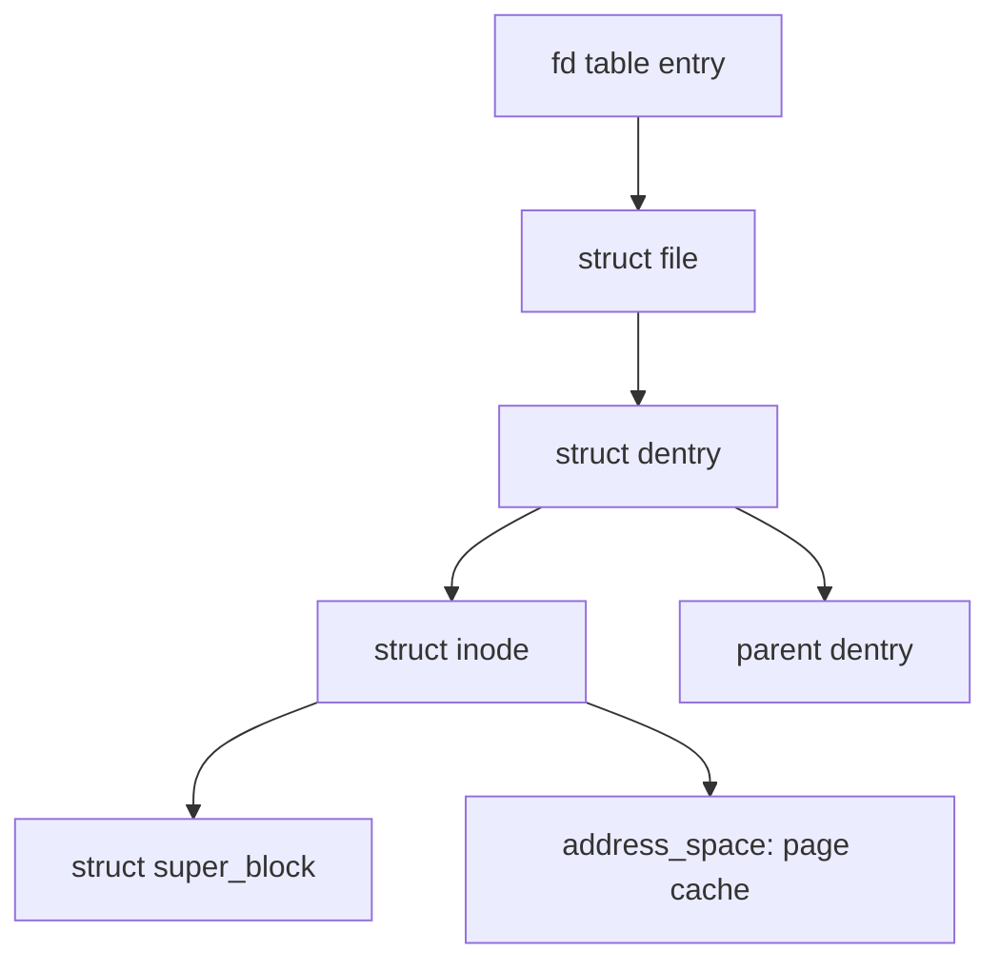

# Files, Filesystems & the VFS

> **Goal:** understand the path from `open("/etc/passwd")` down to disk
> blocks: the VFS layer, inodes, directory entries, mounts, and why "mount
> namespaces + pivot_root" (Part III) will feel natural afterwards.

## One tree, many filesystems

Unlike Windows' drive letters, Linux presents a **single tree** rooted at `/`.
Different branches of the tree can live on completely different filesystems —
a real disk here, a USB stick there, pure RAM over there:

```bash
findmnt | head -15
```

```text
TARGET        SOURCE          FSTYPE   OPTIONS
/             /dev/nvme0n1p2  ext4     rw,relatime
├─/boot/efi   /dev/nvme0n1p1  vfat     rw
├─/proc       proc            proc     rw          ← kernel data, not disk
├─/sys        sysfs           sysfs    rw          ← kernel data, not disk
├─/dev        devtmpfs        devtmpfs rw          ← devices
├─/run        tmpfs           tmpfs    rw          ← RAM-backed
└─/home       /dev/nvme0n1p3  xfs      rw
```

**Mounting** grafts a filesystem onto a directory of the tree. The directory
(`/home`) is just a name; the mount makes its contents come from elsewhere.
This composability is everywhere: the same `cat` works on ext4, on a network
share, on `/proc` — because of the layer that makes them interchangeable.

Inside the kernel, each mount is a `struct mount` wrapping a
`struct vfsmount`; the fields that matter are `mnt_root` (the dentry that
becomes the top of the grafted subtree), `mnt_sb` (the superblock it belongs
to), `mnt_mountpoint` (where in the parent tree it's attached), and
`mnt_parent` (mounts form their own tree, parallel to the directory tree).
When path lookup walks *onto* a mount point, it silently jumps from the
covered dentry to `mnt_root` of the mounted filesystem — that jump is the
entire magic of mounting.

```bash
cat /proc/mounts            # the kernel's live mount table
findmnt --types ext4,xfs    # only disk-backed
```

## The VFS: one interface, many implementations

The **Virtual File System** is the kernel's abstraction layer. It defines the
*concepts* — file, inode, directory entry, mount, superblock — and the
operations on them (`open`, `read`, `lookup`…). Each filesystem (ext4, xfs,
btrfs, tmpfs, proc, nfs, overlayfs…) is an implementation plugged in
underneath:

```text
        open() read() write() stat() ...        ← syscalls
                     │
              ┌──── VFS ────┐                   ← common model + page cache
              │             │
        ext4  xfs  btrfs  tmpfs  proc  nfs  overlayfs
              │
        block layer → disk driver → hardware
```

It's classic polymorphism, in C: each filesystem provides tables of function
pointers (`file_operations`, `inode_operations`, `super_operations`,
`dentry_operations`); the VFS calls through them. When you `read()` an ext4
file, the VFS ends up calling `ext4_file_read_iter()`; the same `read()` on
tmpfs lands in shmem code; on `/proc` it runs a kernel callback that
*generates* the text on the fly. OverlayFS — the engine of Docker images —
is "just" another VFS implementation, one that stacks others
([Images & OverlayFS](#/overlayfs)).

### The four VFS objects, with their fields

| Object | Struct | What it represents |
|---|---|---|
| Superblock | `struct super_block` | A mounted filesystem instance |
| Inode | `struct inode` | A file (metadata, permissions, data blocks) |
| Dentry | `struct dentry` | A directory entry: a name → inode mapping |
| File | `struct file` | An open file (cursor, flags, the process's view) |

These are worth knowing at the field level, because every filesystem
conversation eventually lands on one of them:

- **`struct super_block`** — one per mounted instance. `s_type` points to the
  `file_system_type` (which fs this is), `s_op` is the operations table,
  `s_root` is the root dentry of this filesystem, `s_blocksize` the block
  size (4096 for a default ext4), and `s_magic` a per-fs magic number
  (`stat -f /proc` shows `proc`'s). Mount the same device twice and you get
  *one* superblock with two mounts pointing at it.
- **`struct inode`** — the in-memory file object. `i_ino` (the number `ls -i`
  shows), `i_mode` (type + permission bits together), `i_size`, `i_nlink`
  (hard link count), `i_uid`/`i_gid`, `i_op` and `i_fop` (the operation
  tables installed by the filesystem), and `i_mapping` — the pointer to the
  file's `address_space`, i.e. its slice of the page cache. Note this is the
  *VFS* inode: ext4 keeps its on-disk `struct ext4_inode` (256 bytes by
  default, 128 minimum) separately and translates between the two.
- **`struct dentry`** — a cached `name → inode` link. `d_name` (the
  component name, up to `NAME_MAX` = 255 bytes), `d_parent` (dentries form
  the tree), `d_inode` (may be NULL — see negative dentries below), `d_op`,
  and `d_flags`. A dentry is ~192 bytes of slab on x86-64; a warm desktop
  easily caches a million of them.
- **`struct file`** — created by `open()`, destroyed on last close. `f_pos`
  (the read/write cursor — this is why two `read()`s advance), `f_mode` and
  `f_flags` (how it was opened), `f_op` (copied from `i_fop` at open time),
  `f_inode`, and `f_count` (shared after `fork()` or `dup()` — which is why
  parent and child share one cursor). Your fd `3` is just index 3 in the
  process's fd table, pointing at one of these.



### The dcache: why path lookup is (usually) free

The dentry cache (dcache) is the kernel's "path lookup accelerator" — a hash
table of recently-resolved `name → inode` mappings. Without it, every `open()`
would read directories from disk. With it, repeated opens of the same file
cost zero I/O.

Two details make it more interesting than a plain cache:

- **Negative dentries.** When a lookup fails, the kernel caches the
  *failure* — a dentry with `d_inode == NULL`. This is why the second
  `stat()` of a nonexistent file is fast, and why programs probing dozens of
  paths (shells walking `$PATH`, dynamic linkers walking library dirs) don't
  hammer the disk. Negative dentries can accumulate into the millions;
  `vfs_cache_pressure` (default 100) tunes how eagerly reclaim evicts them.
- **RCU-walk.** Since kernel 2.6.38, hot path lookup takes *no locks and no
  reference counts at all*: it walks the dcache under
  [RCU](#/kernel-sync), validating each step with sequence counters, and only
  falls back to the slower "ref-walk" mode (taking references, possibly
  calling into the filesystem) when something changes underneath it or a
  component isn't cached. This is why `open()` of a hot path costs on the
  order of a microsecond even on a 128-core box with thousands of processes
  doing the same.

```bash
sudo slabtop -s c | grep -E 'dentry|inode'      # cache sizes by memory
cat /proc/sys/fs/dentry-state                   # total and unused dentries
cat /proc/sys/vm/vfs_cache_pressure             # reclaim aggressiveness
```

## Inodes: a file is not its name

The central idea of Unix filesystems, worth engraving:

> **A file is an inode. Names are separate things that point to inodes.**

An **inode** holds a file's metadata: type, permissions, owner, size,
timestamps, and — crucially — where its data blocks live. What it does *not*
hold: the file's name.

A **directory** is itself just a file whose content is a list of
`name → inode number` pairs (these pairs are *directory entries*, "dentries").

```bash
ls -li /etc/hostname        # first column = inode number
stat /etc/hostname          # all inode metadata
df -i /                     # filesystems can run out of inodes!
```

That last one is real: ext4 allocates a fixed inode table at `mkfs` time
(default: one inode per 16 KiB of disk), so a filesystem full of tiny files
can hit "No space left on device" with gigabytes free. XFS and btrfs allocate
inodes dynamically and don't have this failure mode.

### How an inode finds its blocks

The interesting part of an inode is the mapping *file offset → disk block*:

- **Classic indirect blocks (ext2/ext3):** the inode holds 12 direct block
  pointers, then single/double/triple indirect pointers. A read at offset
  4 GiB needs 3 extra metadata reads just to find the data. Simple, slow for
  big files.
- **Extents (ext4, xfs, btrfs):** an extent says "logical blocks 0–8191 live
  at physical blocks 200000–208191" — one 12-byte `ext4_extent` record
  instead of 8192 pointers. ext4 stores up to 4 extents inline in the inode
  body; beyond that it grows a B+ tree of extent blocks. A fully sequential
  1 GiB file can be described by a single extent.

```bash
filefrag -v /var/log/syslog     # dump a file's actual extent map
```

Consequences of "name ≠ inode", all of which confuse people until they learn
this model:

- **Hard links** — two names pointing to the same inode. Fully equal; the
  inode has a link count (`i_nlink`) and the data dies only when it hits
  zero *and* no process holds the file open.

```bash
echo hi > a; ln a b; ls -li a b    # same inode, link count 2
```

- **Deleting an open file is safe** — `rm` removes a *name*
  (syscall: `unlink`). A process with the file open keeps reading/writing
  happily; space is freed on last close. This is why you can upgrade a
  running program's binary, and why "disk full but `du` finds nothing"
  happens (a deleted-but-open log file: check `lsof +L1`).
- **Renaming is atomic** — `mv` within a filesystem just rewrites a directory
  entry; the inode and its data never move. This is the foundation of every
  "write temp file, then rename over the original" safe-update pattern.
  (`rename()` is atomic *as seen by other processes*; whether it's durable
  after a crash needs an `fsync` — see journaling below.)
- **Symbolic links** are different: a symlink is its own little file
  containing a *path* as text. It can dangle, cross filesystems, and point at
  directories — all things hard links can't do. The kernel resolves at most
  40 nested symlinks per lookup (`MAXSYMLINKS`) before returning `ELOOP`,
  and a whole path may not exceed `PATH_MAX` = 4096 bytes.
- **`O_TMPFILE`** (since 3.11) creates a file with *no name at all* — an
  inode with `i_nlink == 0` from birth. Write it, then `linkat()` it into
  place atomically, or just close it and it vanishes. Perfect for temp files
  that can't be leaked.

```bash
ln -s a s1; stat s1          # symlink is its own inode, type "symbolic link"
readlink -f s1               # resolve to the final target
```

## Permissions, briefly but precisely

Each inode carries `mode` bits — the famous `rwxr-xr-x`: three triplets for
**user (owner), group, other**. For files: read/write/execute. For
directories: `r` = list names, `w` = create/delete entries, `x` = *traverse*
(enter, resolve names through it) — you need `x` on every directory along a
path, and the kernel really does check it at every component during lookup.

```bash
chmod u+x script.sh         # symbolic
chmod 644 notes.txt         # octal: rw- r-- r--
chown alice:staff file
```

Three special bits: **setuid** (run as the file's owner — how `passwd`
edits `/etc/shadow`), **setgid**, and the **sticky bit** on directories
(`/tmp`: anyone may create, only owners may delete).

Beyond classic bits: **ACLs** (`getfacl`/`setfacl`) for finer grants:

```bash
getfacl /etc/shadow
# user::rw-
# user:alice:r--     ← Alice can read, even though she's not root
setfacl -m u:bob:rw myfile
```

And **capabilities** — root's powers chopped into ~40 pieces
(`CAP_DAC_OVERRIDE` bypasses permission checks, `CAP_FOWNER` bypasses
ownership checks, `CAP_SYS_ADMIN` does far too much). Capabilities matter
enormously for containers; [Linux Security & Confinement](#/security-hardening)
and Part III return to them. On top of everything sit LSM hooks: even after
mode bits and ACLs say yes, SELinux or AppArmor gets a veto.

## A journey: what `cat /etc/passwd` actually does

1. `openat(AT_FDCWD, "/etc/passwd", O_RDONLY)` enters the VFS via the
   [syscall path](#/kernel-vs-userspace).
2. **Path resolution**: starting at `/` (the process's root dentry), the VFS
   walks component by component. Each step: find the dentry in the dcache
   (RCU-walk, lockless); cache miss → drop to ref-walk and call the
   filesystem's `lookup()`, which reads directory blocks from disk. Check
   `x` permission at every directory level. Cross mount points by jumping to
   the mounted filesystem's root dentry.
3. The final dentry yields the **inode**; permission check (`r` on the file);
   the kernel allocates a `struct file` (cursor at 0, `f_op` copied from the
   inode), installs it in your fd table → returns `3`.
4. `read(3, buf, 4096)`: the VFS calls `f_op->read_iter`, which asks the
   **page cache** first (`i_mapping`). Hit → copy to the user buffer, done —
   sub-microsecond. Miss → the filesystem maps file offset → disk blocks via
   the extent tree, the [block layer](#/storage-stack) queues a request, the
   NVMe driver fetches it (~20–100 µs on a decent SSD, ~5–10 ms on spinning
   rust), the folio joins the cache, then the copy happens. The kernel also
   kicks off **readahead** — by default up to 128 KiB
   (`/sys/block/*/queue/read_ahead_kb`) — so your next sequential read hits
   the cache.
5. `close(3)` drops the reference count on the `struct file`. Nothing touches
   the disk. Writes, if there were any, would sit dirty in the page cache
   until writeback (default: flusher threads wake for pages dirty longer
   than 30 s, tunable via `vm.dirty_expire_centisecs`) or an explicit
   `fsync()`.

Every file operation on any filesystem is a variation of this dance. See
[Lab: Watch the Page Cache Work](#/lab-page-cache) to observe steps 4–5 live,
and [Modern I/O & io_uring](#/modern-io) for how to bypass parts of it
(`O_DIRECT`, io_uring).

## Follow the code (kernel v6.12)

Two paths worth tracing in the source. All of this lives in `fs/` — mostly
[fs/namei.c](https://elixir.bootlin.com/linux/v6.12/source/fs/namei.c),
[fs/open.c](https://elixir.bootlin.com/linux/v6.12/source/fs/open.c), and
[mm/filemap.c](https://elixir.bootlin.com/linux/v6.12/source/mm/filemap.c).

### Path 1: `openat()` → a file descriptor

1. The syscall lands in
   [do_sys_openat2()](https://elixir.bootlin.com/linux/v6.12/C/ident/do_sys_openat2):
   copy the path from user space with
   [getname()](https://elixir.bootlin.com/linux/v6.12/C/ident/getname),
   grab a free fd slot with
   [get_unused_fd_flags()](https://elixir.bootlin.com/linux/v6.12/C/ident/get_unused_fd_flags),
   then call
   [do_filp_open()](https://elixir.bootlin.com/linux/v6.12/C/ident/do_filp_open).
2. `do_filp_open()` sets up a `struct nameidata` — the walk's scratchpad:
   current position (`path`), remaining name, nesting depth, and the
   sequence numbers RCU-walk needs. It calls
   [path_openat()](https://elixir.bootlin.com/linux/v6.12/C/ident/path_openat),
   first with `LOOKUP_RCU` (the lockless fast path), retrying without it if
   the fast path bails.
3. The loop is
   [link_path_walk()](https://elixir.bootlin.com/linux/v6.12/C/ident/link_path_walk):
   for each `/`-separated component, hash the name, then
   [lookup_fast()](https://elixir.bootlin.com/linux/v6.12/C/ident/lookup_fast)
   probes the dcache hash table. Under RCU-walk this touches no locks — it
   validates with `d_seq` sequence counters instead. A miss or a stale entry
   sends it to
   [lookup_slow()](https://elixir.bootlin.com/linux/v6.12/C/ident/lookup_slow),
   which takes the parent inode's rwsem and calls the filesystem's
   `inode_operations.lookup` (ext4: reads and hash-searches the directory
   block, allocates a dentry, fills it). Permission on each directory is
   checked via
   [may_lookup()](https://elixir.bootlin.com/linux/v6.12/C/ident/may_lookup).
   Symlinks push a new name onto the `nameidata` stack; mount points swap
   the walk over to the mounted fs's root.
4. The last component gets special handling in
   [open_last_lookups()](https://elixir.bootlin.com/linux/v6.12/C/ident/open_last_lookups)
   (this is where `O_CREAT`/`O_EXCL` semantics live — create-if-absent must
   be atomic with the lookup), then
   [vfs_open()](https://elixir.bootlin.com/linux/v6.12/C/ident/vfs_open) →
   [do_dentry_open()](https://elixir.bootlin.com/linux/v6.12/C/ident/do_dentry_open):
   allocate the `struct file`, copy `i_fop` into `f_op`, call the
   filesystem's own `->open()` if it has one.
5. Back in `do_sys_openat2()`,
   [fd_install()](https://elixir.bootlin.com/linux/v6.12/C/ident/fd_install)
   publishes the file pointer into the fd table. The number you get back is
   just that array index.

### Path 2: `read()` → bytes from the page cache

1. [ksys_read()](https://elixir.bootlin.com/linux/v6.12/C/ident/ksys_read)
   resolves fd → `struct file` and calls
   [vfs_read()](https://elixir.bootlin.com/linux/v6.12/C/ident/vfs_read),
   which checks `f_mode` and dispatches to `f_op->read_iter`.
2. For ext4 that's
   [ext4_file_read_iter()](https://elixir.bootlin.com/linux/v6.12/C/ident/ext4_file_read_iter),
   which for normal buffered I/O defers to
   [generic_file_read_iter()](https://elixir.bootlin.com/linux/v6.12/C/ident/generic_file_read_iter)
   → [filemap_read()](https://elixir.bootlin.com/linux/v6.12/C/ident/filemap_read).
3. `filemap_read()` loops:
   [filemap_get_pages()](https://elixir.bootlin.com/linux/v6.12/C/ident/filemap_get_pages)
   looks up folios in the inode's `i_mapping` (an XArray keyed by file
   offset). Missing folio → trigger synchronous readahead via
   [page_cache_sync_ra()](https://elixir.bootlin.com/linux/v6.12/C/ident/page_cache_sync_ra),
   which builds block I/O requests and hands them to the
   [block layer](#/storage-stack); the task sleeps until the folio is
   up-to-date.
4. With folios in hand, the data is copied into your buffer and `f_pos`
   advances. Note the copy: buffered I/O always moves bytes twice
   (disk → page cache → your buffer). That double copy is what
   `O_DIRECT` and parts of [io_uring](#/modern-io) exist to avoid.

## Journaling and crash consistency

*Journaling*, in one line: the filesystem writes its intent to a log before
modifying structures, so a crash mid-operation replays or discards cleanly.

ext4 does this through **jbd2**, a separate journaling layer. Updates are
batched into *transactions*; a transaction commits either when the commit
timer fires (default **5 seconds**, mount option `commit=`) or when someone
calls `fsync()`:

```text
ext4 journal model (data=ordered, the default):

1. write actual DATA blocks to their final location
2. write journal: "I'm going to update inode 45, bitmap block 3, ..."
   (the metadata blocks, copied into the journal)
3. write commit record          ← the transaction is now durable
4. later, checkpoint: write metadata to final locations, free journal space

Crash before step 3 → on boot, the partial transaction is discarded;
                       the fs looks like the operation never happened.
Crash after step 3  → on boot, jbd2 replays the journal to final locations.
```

Key subtleties:

- Only **metadata** is journaled by default. The `data=` mount option picks
  the trade-off: `ordered` (default — data blocks are forced out *before*
  the metadata that references them commits, so you never see stale blocks
  in a file after a crash), `writeback` (faster; after a crash a recently
  grown file may contain garbage), `journal` (data written twice; slow,
  rarely worth it).
- **A commit is not an `fsync`.** Your `write()` returns after copying into
  the page cache. Durability requires `fsync()` — which forces the current
  transaction to commit *and* issues a disk cache flush. Budget ~1–10 ms per
  `fsync` on SATA SSDs, tens of µs on good NVMe. This is why databases
  care so much about group commit.
- **The famous rename problem:** ext4's delayed allocation (buffering data
  in RAM, allocating blocks as late as possible) made the 2009 pattern
  "write new config to temp file, rename over the old one, *no fsync*"
  produce zero-length files after crashes. The fix that shipped
  (`auto_da_alloc`, still in place as of 6.12) detects the
  write-then-rename pattern and flushes data before committing the rename.
  The correct application-side pattern remains: write temp → `fsync(temp)`
  → `rename()` → (for full durability) `fsync(directory)`.

XFS journals metadata similarly (it calls the journal a "log"); btrfs and
ZFS don't journal at all — copy-on-write means the on-disk tree is *always*
consistent, and a crash simply falls back to the last committed tree root.

## Which filesystem should you care about?

| FS | One-liner |
|---|---|
| **ext4** | The dependable default for decades. Journaled, fast, boring (a compliment). Max file 16 TiB at 4 KiB blocks. |
| **xfs** | Excellent at large files & parallel I/O; RHEL's default. Allocates inodes dynamically — no `df -i` exhaustion. |
| **btrfs** | Copy-on-write: snapshots, checksums, compression, send/receive. Subvolumes act like mount points. Default on Fedora & openSUSE. |
| **zfs** | The legendary COW filesystem (out-of-tree for licensing). Built-in RAID, snapshots, dedup. The gold standard for data integrity. |
| **tmpfs** | RAM-backed (really: page-cache-backed, can swap), vanishes at reboot — `/tmp` on many distros, `/run`, `/dev/shm`. |
| **overlayfs** | Stacks read-only layers under a writable one. **The engine of container images** — [Images & OverlayFS](#/overlayfs). |
| **FUSE** | Filesystem in user space — sshfs, s3fs, rclone. Each operation round-trips through `/dev/fuse` to a userspace daemon; flexible, slower. |

### Copy-on-Write filesystems (btrfs/zfs)

COW means: when you modify a block, the filesystem writes it to a new
location and updates pointers. The old block remains until no snapshot
references it. This gives you:

- **Snapshots**: `btrfs subvolume snapshot /home /snaps/home-2026` — instant
  (it copies one tree root), takes no extra space until files diverge.
- **Checksums**: every data and metadata block has a checksum (btrfs default
  crc32c); bit rot is detected on read and (with redundancy) repaired.
- **Send/receive**: `btrfs send` creates a binary diff from one snapshot to
  the next; `btrfs receive` applies it. Efficient incremental backup.

The trade-off: fragmentation (blocks get scattered — bad for databases and
VM images; people set `nodatacow` on those), write amplification, and
complexity (btrfs RAID5/6 remains explicitly not recommended for metadata
as of 6.12 — test before trusting).

## Mounts are per-process (the seed of containers)

Here's the detail that quietly sets up Part III: the mount table isn't truly
global — each process *references* a **mount namespace**
(`struct nsproxy → mnt_ns`). Today, all your processes share one. But a
process can get its own copy (`unshare(CLONE_NEWNS)`), mount things only
*it* sees, then `pivot_root` so that its `/` is some other directory entirely
— at which point it lives in a different filesystem world. That, plus a few
more [namespaces](#/namespaces), *is* a
[container](#/containers-overview). Hold the thought — you'll do it by hand
in [Build a Container by Hand](#/build-a-container).

Mount propagation controls how mounts appear across namespace copies:

```bash
cat /proc/self/mountinfo | head  # see "shared", "private", "slave" flags
```

**Container link:** container runtimes set everything `private` (or `slave`)
so container mounts never leak to the host, and host mounts don't flood into
containers. When a `docker run -v` bind mount "doesn't show up", mount
propagation is almost always the culprit.

## Try it yourself

```bash
echo data > f1; ln f1 f2; stat f1 f2          # one inode, two names
ln -s f1 s1; ls -li f1 f2 s1                  # symlink = its own inode
rm f1; cat f2; cat s1                          # hard link lives, symlink dangles
filefrag -v f2                                 # the file's extent map
findmnt --fstab; cat /proc/filesystems        # what your kernel speaks
strace -e trace=openat,read,close cat /etc/hostname
sudo slabtop -s c | grep -E 'dentry|inode'    # dcache & inode cache sizes
cat /proc/sys/fs/dentry-state                 # dentries: total, unused
grep -E 'Dirty|Writeback' /proc/meminfo       # pages waiting for writeback
```

And a negative-dentry demo — watch failures get cached:

```bash
for i in $(seq 1000); do stat /no/such/file$i 2>/dev/null; done
cat /proc/sys/fs/dentry-state                 # unused count jumped
```

For deeper poking, [strace and friends](#/observability) let you watch every
one of these syscalls with timing.

## Check your understanding

1. Why does `mv` within one filesystem take 1 ms for a 100 GB file, while `mv` across filesystems takes minutes?

<details><summary>Show answer</summary>

Within one filesystem, `mv` is a `rename()`: it rewrites a directory entry — only the name → inode mapping changes, the inode and its data blocks never move. Across filesystems the inode can't be shared, so `mv` must copy every data block to the destination filesystem and then unlink the source.

</details>

2. Disk is 100% full; `du -sh /` reports half that. What's the classic cause?

<details><summary>Show answer</summary>

A deleted-but-still-open file (typically a log). `rm` removed the name, so `du` — which walks names — can't see it; but a process still holds the inode open, so its blocks stay allocated and `df` counts them. `lsof +L1` lists such files; restarting the holder (or truncating via `/proc/PID/fd/N`) frees the space.

</details>

3. What does the VFS buy the kernel — and what kind of filesystem is `/proc`?

<details><summary>Show answer</summary>

The VFS defines one object model (superblock, inode, dentry, file) and dispatches through per-filesystem operation tables, so `open/read/write` work identically on any filesystem without callers knowing which. `/proc` is a virtual filesystem: its "files" are generated from kernel data structures at read time — no disk involved.

</details>

4. What's the difference between a hard link and a symbolic link at the inode level?

<details><summary>Show answer</summary>

A hard link is a second directory entry pointing to the *same* inode (`i_nlink` goes up; both names are fully equal). A symlink is its *own* inode whose data is a path string; the kernel re-resolves that path at lookup time, which is why symlinks can dangle and cross filesystems.

</details>

5. Why does `rm` on an open file not free space immediately, and when is the space actually freed?

<details><summary>Show answer</summary>

`rm` (`unlink`) only drops a name and decrements `i_nlink`. The inode's blocks are freed only when the link count is zero *and* the in-kernel reference count (open `struct file`s) drops to zero — i.e., on the last `close()`. Until then the file is fully usable, just unreachable by path.

</details>

6. Your program writes a new config file and `rename()`s it over the old one, with no `fsync`. The machine crashes. What can you find afterwards, and what's the correct sequence?

<details><summary>Show answer</summary>

Without `fsync`, the data may still have been only in the page cache when the rename's metadata committed — after a crash you could see the new name with empty or partial content (ext4's `auto_da_alloc` heuristic mitigates this exact pattern, but it's a heuristic, not a contract). Correct sequence: write temp file → `fsync(temp)` → `rename()` → `fsync` the containing directory.

</details>

7. What is a negative dentry, and why does the kernel bother caching lookup failures?

<details><summary>Show answer</summary>

A dentry whose `d_inode` is NULL, recording "this name does not exist here". Programs constantly probe paths that don't exist — shells walking `$PATH`, linkers searching library directories — and caching the failure turns each repeat probe into a lockless dcache hit instead of a disk read.

</details>

## Sources & further reading

- [Overview of the Linux Virtual File System](https://docs.kernel.org/filesystems/vfs.html) — kernel docs; the authoritative tour of the four object types and their operation tables.
- [Pathname lookup](https://docs.kernel.org/filesystems/path-lookup.html) — kernel docs by Neil Brown; the definitive explanation of REF-walk vs RCU-walk.
- [ext4 Data Structures and Algorithms](https://docs.kernel.org/filesystems/ext4/index.html) — on-disk format: inode tables, extent trees, the journal.
- [inode(7)](https://man7.org/linux/man-pages/man7/inode.7.html) and [path_resolution(7)](https://man7.org/linux/man-pages/man7/path_resolution.7.html) — the userspace-visible contract.
- [open(2)](https://man7.org/linux/man-pages/man2/open.2.html) — every flag, including `O_TMPFILE` and `O_DIRECT` semantics.
- [fs/namei.c in v6.12](https://elixir.bootlin.com/linux/v6.12/source/fs/namei.c) — path lookup itself; the file's opening comment block is a genuinely good read.
- "Ext4 and data loss" (LWN, 2009, Jonathan Corbet) — the delayed-allocation / rename controversy that produced `auto_da_alloc`.
- *Understanding the Linux Kernel* (Bovet & Cesati), ch. 12 — dated in details, still the best long-form VFS walkthrough in print.

---

**Next:** beneath every filesystem sits [the storage stack](#/storage-stack) — the page cache, the bio, the block layer with blk-mq, the I/O scheduler, the device mapper, and the queue architecture that decides what hits the disk first and when.
