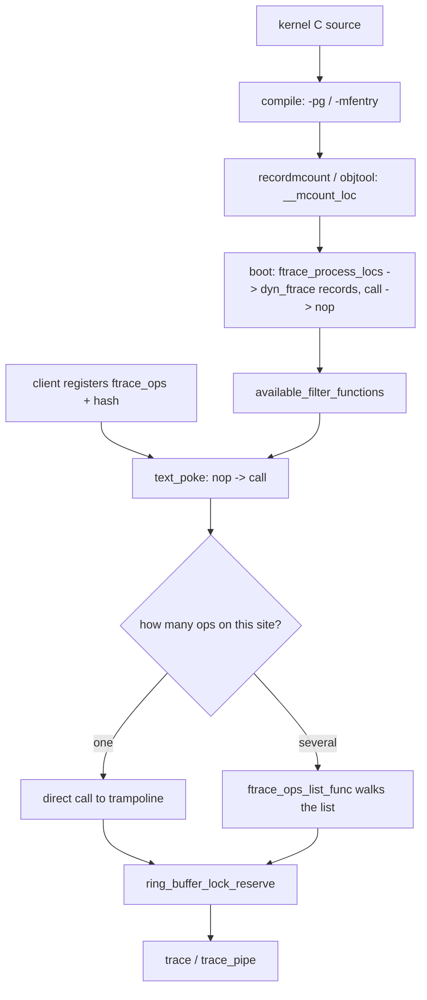

# ftrace: The Kernel's Built-in Tracer

> **Goal:** drive the tracer that is already compiled into your kernel — no
> compiler, no verifier, no packages. You will read a call graph of a real
> syscall descending into a driver, aggregate events inside the kernel with
> histogram triggers, place kprobes and uprobes by writing text into files, and
> understand the nop-patching machinery that makes all of it nearly free when
> it is off.

## A tracer made of files

[/proc, strace, perf & eBPF](#/observability) taught you a ladder of
instruments. There is a rung it skipped, and it is the one under all the
others: **ftrace**, the tracer built into the kernel since 2.6.27 and
maintained largely by Steven Rostedt.

Its entire user interface is a directory:

```bash
mount | grep tracefs || sudo mount -t tracefs nodev /sys/kernel/tracing
cd /sys/kernel/tracing
ls
```

That is the whole API. There is no library, no bytecode, no daemon, and no
syscall you have to learn. You configure the tracer by writing strings into
files and read results by reading files. On a stripped appliance with busybox
and no package manager, `echo` and `cat` are enough to get a function-level
call graph out of the kernel. That is ftrace's actual pitch, and it is why it
survives alongside eBPF rather than being replaced by it.

> **Note on paths.** `/sys/kernel/tracing` is the tracefs mount point. Before
> kernel 4.1 these files lived under `/sys/kernel/debug/tracing`, and for
> backward compatibility mounting debugfs still exposes them there. Every path
> in this chapter is relative to `/sys/kernel/tracing`. Everything needs root.

Here is a complete, useful trace in ten seconds. It records the kernel's
internal call graph for one `open()`:

```bash
cd /sys/kernel/tracing
echo 0 > tracing_on
echo nop > current_tracer            # start from a clean slate
echo function_graph > current_tracer
echo do_sys_openat2 > set_graph_function   # only this function and its children
echo 1 > options/function-fork       # follow children of the traced PID
echo $$ > set_ftrace_pid             # only this shell and what it spawns
echo 1 > tracing_on
cat /etc/hostname > /dev/null
echo 0 > tracing_on
head -30 trace
```

```text
# tracer: function_graph
#
# CPU  DURATION                  FUNCTION CALLS
# |     |   |                     |   |   |   |
 3)               |  do_sys_openat2() {
 3)               |    getname() {
 3)   1.842 us    |      getname_flags();
 3)   2.615 us    |    }
 3)               |    do_filp_open() {
 3)               |      path_openat() {
 3)   0.410 us    |        path_init();
 3)   3.981 us    |        link_path_walk();
 3)               |        do_open() {
 3) + 11.204 us   |        }
 3) + 21.870 us   |      }
 3) + 22.640 us   |    }
 3)   0.512 us    |    fd_install();
 3)   0.398 us    |    putname();
 3) + 29.115 us   |  }
```

Clean up when you are done — a live function tracer is not free:

```bash
echo nop > current_tracer
echo > set_graph_function
echo > set_ftrace_pid
```

Read that output again, because it is the thing ftrace does that nothing else
does as naturally. It is not a list of events. It is **C control flow**:
`do_sys_openat2()` called `getname()`, which took 2.6 µs; then `do_filp_open()`
called `path_openat()`, which walked the path and opened the file. The nesting
is real nesting, the durations are real durations, and the `+` marker means the
function exceeded 10 µs. `!` means it exceeded 100 µs, `#` 1 ms, `*` 10 ms,
`@` 100 ms, `$` one second. Scanning a graph trace for `#` and `*` is the
fastest way to find where a kernel path spent its time.

Your exact function list will differ — inlining, config, and kernel version all
change which symbols survive as call sites. The *shape* is the point.

## The tracers

`current_tracer` selects one tracer at a time; `available_tracers` lists what
your kernel was built with.

```bash
cat available_tracers
# function_graph function wakeup_dl wakeup_rt wakeup timerlat osnoise hwlat
# blk mmiotrace preemptirqsoff preemptoff irqsoff nop
```

The ones worth knowing:

| Tracer | What it records |
|---|---|
| `nop` | nothing — the off switch, and the mode you use for pure event tracing |
| `function` | every entry to every (filtered) kernel function, with its caller |
| `function_graph` | entry **and** exit, giving nesting and per-function duration |
| `irqsoff` | the longest region with interrupts disabled, and the trace leading to it |
| `preemptoff` | the longest region with preemption disabled |
| `preemptirqsoff` | the longest region with either disabled |
| `wakeup` | max latency from any task being woken to it running |
| `wakeup_rt` | the same, restricted to real-time tasks |
| `wakeup_dl` | the same, restricted to `SCHED_DEADLINE` tasks |
| `hwlat` | latency introduced by the *hardware* (SMIs, firmware) with no kernel code running |
| `blk` | the block-layer tracer that `blktrace` drives |

`function` gives you a flat stream: one line per call, with `<-parent`
appended. It is the right tool when you want to know *whether* something was
called, or to see interleaving across CPUs. `function_graph` gives you
structure, and structure is almost always what you want when the question is
"what did the kernel actually do here, in order".

The **latency tracers** work differently from the others: they do not stream.
They keep the single worst case seen so far. `irqsoff` instruments every
interrupt-disable/enable pair (see
[Interrupts, Exceptions & Softirqs](#/interrupts)), measures the interval, and
when a new maximum appears it saves the whole trace leading up to it and
records the number in `tracing_max_latency`. You come back an hour later, read
`trace`, and see the exact call path that held interrupts off for 400 µs.

```bash
echo 0 > tracing_max_latency     # reset the recorded maximum
echo irqsoff > current_tracer
sleep 60
cat tracing_max_latency          # e.g. 259
cat trace                        # the call path that produced it
```

`wakeup_rt` answers the real-time engineer's question directly: between
`sched_waking` and the RT task actually running on a CPU, what was the worst
delay, and what was in the way? Set `options/display-graph` and the latency
tracers render their saved trace as a call graph instead of a flat list.

`osnoise` and `timerlat`, the two newer noise tracers, are covered in
[CPU Isolation & Real-Time Tuning](#/cpu-isolation), where they belong.

## Filtering is the whole game

Turn on the `function` tracer with no filter on a busy machine and you will
generate millions of events per second per CPU, overrun the ring buffer in
milliseconds, and measurably slow the system down. Unfiltered function tracing
is not a tool; it is a denial-of-service attack you perform on yourself.
Everything useful starts with narrowing.

`available_filter_functions` lists every call site ftrace knows about — tens of
thousands of entries on a distro kernel. Anything in that list can go into
`set_ftrace_filter`:

```bash
echo hrtimer_interrupt > set_ftrace_filter    # '>' replaces the list
echo 'hrtimer_*' >> set_ftrace_filter         # '>>' appends
echo '!hrtimer_forward*' >> set_ftrace_filter # '!' removes matches
echo > set_ftrace_filter                      # empty write: trace everything again
cat set_ftrace_filter                         # what is actually selected
```

Globs are full `glob(7)` — ftrace calls `glob_match()`, so `?` and character
classes work — but the four shapes that carry all the weight are `match*`,
`*match`, `*match*`, and `match1*match2`. Quote them, or your shell will expand
them against the current directory. `set_ftrace_notrace` is the exclusion list,
and it wins: a function in both files is not traced.

Two filter idioms carry most of the weight in practice:

```bash
# Everything a module does, and nothing else. Syntax: <glob>:mod:<module-glob>
echo '*:mod:nvme' > set_ftrace_filter

# The reverse — trace the core kernel but no modules at all
echo '!*:mod:*' >> set_ftrace_filter
```

Because string matching against the whole call-site table is expensive, you can
also select by **index** — the line number in `available_filter_functions`:

```bash
echo 1 50 > set_ftrace_filter   # the 1st and 50th entries, no string matching
```

That is a scripting optimisation, not an ergonomic one; it matters when a tool
sets thousands of filters at once.

### Narrowing by task

`set_ftrace_pid` restricts function tracing to listed threads;
`set_ftrace_notrace_pid` excludes them, and takes precedence when a PID is in
both. Both use the same `>` / `>>` / empty-write conventions as the filter
files.

```bash
echo 1 > options/function-fork    # add children to the list on fork, drop on exit
echo $$ > set_ftrace_pid
```

`function-fork` is the option people forget and then wonder why their trace is
empty: without it, you traced the shell, and the shell forked a child to do all
the interesting work.

### Narrowing the graph

The function-graph tracer has two more knobs, and they are the difference
between a readable trace and a wall of text:

```bash
echo __x64_sys_ioctl > set_graph_function   # this function and everything under it
echo 5 > max_graph_depth                    # stop descending after 5 levels
echo > set_graph_function                   # clear
```

`set_graph_notrace` is the complement: when execution enters a listed function,
graph tracing pauses until it returns — the way to make one noisy subtree
disappear without losing its siblings. Note that `set_ftrace_filter` and
`set_ftrace_notrace` still apply on top of the graph filters.

### Filters that do things

`set_ftrace_filter` also accepts *commands*, in the form
`<function>:<command>:<parameter>`. This is a small, under-used superpower:
you can make the tracer react to a function being hit without writing any code.

```bash
# Freeze the buffer the first time this fires — preserving what led up to it
echo '__schedule_bug:traceoff:5' > set_ftrace_filter

# Record a stack trace at every hit
echo 'kfree_skb:stacktrace' >> set_ftrace_filter

# Take a snapshot of the ring buffer when this function runs.
# (ftrace.rst still uses the pre-5.10 name native_flush_tlb_others here;
#  at v6.12 the symbol is native_flush_tlb_multi. The doc is the stale one.)
echo 'native_flush_tlb_multi:snapshot:1' >> set_ftrace_filter

# Turn a tracepoint on for the next 2 hits when this function is entered
echo 'try_to_wake_up:enable_event:sched:sched_switch:2' >> set_ftrace_filter
```

Prefix with `!` to remove a command. `dump` and `cpudump` dump the ring buffer
to the console when the function is hit — the last resort when the machine is
about to die before you can read `trace`.

## Events: the stable, structured layer

Function tracing gives you a raw call stream, and every symbol in it is a
kernel internal that can be renamed or inlined out of existence tomorrow.
**Tracepoints** are the opposite: named, structured, deliberately-placed
instrumentation with typed fields that kernel developers maintain. Same trace
buffer, entirely different stability contract. This is the same distinction
[eBPF Internals](#/ebpf-internals) draws between attaching to a tracepoint and
attaching to a kprobe — and it applies identically here.

They live in a directory tree, grouped by subsystem:

```bash
cat available_events | wc -l                  # a few thousand on a distro kernel
ls events/sched/
echo 1 > events/sched/sched_switch/enable     # one event
echo 1 > events/block/enable                  # a whole subsystem
echo 1 > events/enable                        # everything (don't)
```

Each event directory has the same five interesting files: `enable`, `format`,
`filter`, `trigger`, and `hist`. `format` is the schema — it tells you the
field names you are allowed to filter on:

```bash
cat events/kmem/kmalloc/format
```

```text
name: kmalloc
format:
	field:unsigned short common_type;   offset:0;  size:2; signed:0;
	field:int common_pid;               offset:4;  size:4; signed:1;

	field:unsigned long call_site;      offset:8;  size:8; signed:0;   ← who called kmalloc
	field:const void * ptr;             offset:16; size:8; signed:0;
	field:size_t bytes_req;             offset:24; size:8; signed:0;   ← requested size
	field:size_t bytes_alloc;           offset:32; size:8; signed:0;   ← what the slab gave
```

`filter` takes a boolean expression over those fields, evaluated **in the
kernel** before the event is written to the buffer. This is not grep after the
fact; the discarded events never cost you buffer space.

```bash
cd events/sched/sched_switch
echo 'prev_comm ~ "postgres*" && prev_state == 2' > filter
echo 1 > enable
```

Numeric fields take `== != < <= > >= &`; string fields take `== != ~`, where
`~` is a glob. Two conveniences are easy to miss: `.ustring` appended to a
field name tells the kernel the pointer is in user space
(`filename.ustring ~ "*password*"`), and `.function` compares a `long` against
a symbol's address range (`call_site.function == security_prepare_creds`).
Clear a filter by writing `0` to it.

### Triggers

`trigger` makes an event *do* something when it fires. The general form is
`command[:count] [if filter]`, removed by prefixing `!`.

```bash
# Capture the stack for the first five large allocations
echo 'stacktrace:5 if bytes_req >= 65536' > events/kmem/kmalloc/trigger

# Freeze the buffer the first time a block queue unplugs deep
echo 'traceoff:1 if nr_rq > 1' > events/block/block_unplug/trigger

# Snapshot the buffer on that condition instead
echo 'snapshot if nr_rq > 1' > events/block/block_unplug/trigger

# Turn one event on while another is in flight
echo 'enable_event:kmem:kmalloc:1' > events/syscalls/sys_enter_read/trigger
echo 'disable_event:kmem:kmalloc'  > events/syscalls/sys_exit_read/trigger
```

The last pattern is worth internalising. It gives you *conditional* tracing —
expensive instrumentation that is only live inside the window you care about —
with no code and no user-space involvement. Triggers work through "soft" mode:
attaching a trigger activates the tracepoint even when its `enable` file reads
0, so the trigger can run without the event itself being recorded.

## Histogram triggers: aggregation without eBPF

The `hist` trigger is ftrace's least-known feature and its most surprising one.
It builds a **hash table inside the kernel**, keyed on event fields, with
running totals — the exact thing people reach for bpftrace to do.

```bash
cd events/kmem/kmalloc
echo 'hist:key=call_site.sym:val=bytes_req:sort=bytes_req.descending' > trigger
sleep 10
cat hist
```

```text
# event histogram
# trigger info: hist:keys=call_site.sym:vals=bytes_req:sort=bytes_req.descending:size=2048 [active]

{ call_site: [ffffffff8134b9c0] alloc_fdtable         } hitcount:  1676  bytes_req:  33520
{ call_site: [ffffffff81a2c110] __alloc_skb           } hitcount:   485  bytes_req:  27160
{ call_site: [ffffffff812f0a40] __d_alloc             } hitcount:   417  bytes_req:  56712
...
Totals:
    Hits: 4610
    Entries: 45
    Dropped: 0
```

The syntax is a colon-separated parameter list:

```text
hist:keys=<field[,field,field]>[:values=<field,...>][:sort=<field,...>]
    [:size=#entries][:pause][:continue][:clear][:name=<shared-name>]
    [:nohitcount][:<handler>.<action>] [if <filter>]
```

Up to three fields can form a compound key; `hitcount` is implicit if you name
no values. The **field modifiers** are where it becomes expressive:

| Modifier | Effect |
|---|---|
| `.log2` | bucket by power of two — a latency/size histogram in one word |
| `.buckets=N` | bucket by a fixed width |
| `.sym` / `.sym-offset` | render an address as a kernel symbol |
| `.execname` | render `common_pid` as the program name |
| `.syscall` | render a syscall id as its name |
| `.hex` | base-16 |
| `.usecs` | interpret `common_timestamp` as microseconds |
| `.percent` / `.graph` | render a value as a percentage or an ASCII bar |

Two synthetic fields are available on every event: `common_timestamp` (the
ring-buffer timestamp in nanoseconds) and `common_cpu`. `common_stacktrace` can
be used as a key, which gives you kernel-side stack aggregation — a folded
stack count, computed in the kernel, with no user-space collector.

```bash
# Distribution of block I/O sizes, log2, per device — one line, no toolchain
echo 'hist:keys=dev,nr_sector.log2' > events/block/block_rq_issue/trigger
cat events/block/block_rq_issue/hist
```

### Variables, synthetic events, and cross-event latency

The hist trigger can save a value into a **variable** on one event and read it
back on another. Combined with a **synthetic event** — an event you define
yourself — this measures latency *between* two tracepoints entirely inside the
kernel.

The canonical example is wakeup latency. Define the event:

```bash
echo 'wakeup_latency u64 lat; pid_t pid; int prio' >> synthetic_events
```

Stamp the time when a task of interest is woken:

```bash
echo 'hist:keys=$saved_pid:saved_pid=pid:ts0=common_timestamp.usecs \
      if comm=="cyclictest"' >> events/sched/sched_waking/trigger
```

And on `sched_switch`, when that PID actually gets the CPU, subtract and emit
the synthetic event:

```bash
echo 'hist:keys=next_pid:wakeup_lat=common_timestamp.usecs-$ts0:\
onmatch(sched.sched_waking).wakeup_latency($wakeup_lat,$saved_pid,next_prio) \
if next_comm=="cyclictest"' >> events/sched/sched_switch/trigger
```

Now `wakeup_latency` is a real event under `events/synthetic/`, with `enable`,
`filter`, `format`, `trigger` and `hist` files like any other. Histogram it:

```bash
echo 'hist:keys=pid,prio,lat.log2:sort=lat' >> events/synthetic/wakeup_latency/trigger
cat events/synthetic/wakeup_latency/hist
```

The handlers are `onmatch(system.event)`, `onmax(var)` and `onchange(var)`; the
actions are `trace(<synthetic_event>, params)`, `save(field,...)` and
`snapshot()`. `onmax($wakeup_lat).save(next_comm,prev_pid,prev_comm)` keeps the
context of the *worst* case seen — which is usually the case you actually
wanted. `onmax($var).snapshot()` freezes the whole ring buffer at the new
maximum, giving you the events that led up to the outlier and nothing else.

Take this seriously as an eBPF alternative. It is not as general — there is no
arbitrary logic, no loops, no map of your own design — but for "count these
events keyed by that field" and "measure the delay between these two
tracepoints", it needs no compiler, no BTF, no verifier argument, and it works
on a kernel that was built five years ago.

## Dynamic events: probe anything, including user space

Tracepoints only exist where a developer put one. **Dynamic events** let you
create your own, at runtime, by writing a definition into a file.

### kprobes and kretprobes

```bash
# p = entry probe, r = return probe. $argN and $retval are best-effort.
echo 'p:myopen do_sys_openat2 dfd=$arg1 file=+0($arg2):ustring' > kprobe_events
echo 'r:myopen_ret do_sys_openat2 ret=$retval' >> kprobe_events
echo 1 > events/kprobes/enable
echo 1 > tracing_on
cat trace_pipe
```

```text
      cat-4471  [002] ..... 8291.402231: myopen: (do_sys_openat2+0x0/0x120) dfd=-100 file="/etc/hostname"
      cat-4471  [002] ..... 8291.402297: myopen_ret: (do_sys_open+0x2c/0x50 <- do_sys_openat2) ret=3
```

The fetch-argument language is compact and worth learning: `%REG` for a
register, `$stackN`, `$argN`, `$retval`, `$comm`, `@SYM` for a data symbol,
and `+OFFS(FETCHARG)` to dereference. Append `:TYPE` to cast —
`u8`/`s32`/`x64`, `string`, `ustring`, `symbol`, `symstr`, `%pd`/`%pD` for a
dentry or file name, or `b<width>@<offset>/<size>` for a bitfield. `+u8(...)`
means the dereference targets user memory. Clear with `echo > kprobe_events`,
or one at a time with `echo '-:myopen' >> kprobe_events`.

### uprobes: the bridge into user space

Uprobes place the same machinery on a *userspace* text address, and they are
the reason ftrace can instrument an application stack from the kernel side.
The catch, spelled out in the kernel docs: **the uprobe interface takes a file
offset, not a symbol name.** You compute it yourself.

```bash
LIB=/lib/x86_64-linux-gnu/libc.so.6

# 1. The symbol's virtual address in the ELF
readelf -sW "$LIB" | awk '$8 == "getaddrinfo" {print $2}'
# 00000000000f9df0

# 2. The PT_LOAD segment containing it, to convert vaddr -> file offset:
#    file_offset = sym_vaddr - (p_vaddr - p_offset)
readelf -lW "$LIB" | grep LOAD
# LOAD 0x000000 0x0000000000000000 ... R
# LOAD 0x028000 0x0000000000028000 ... R E    ← p_vaddr == p_offset here, so offset == vaddr
```

For a typical shared object built by a modern toolchain each `PT_LOAD` has
`p_vaddr == p_offset`, so the symbol value *is* the file offset — but check,
because when they differ and you skip the correction you will probe a random
instruction. Then:

```bash
cd /sys/kernel/tracing
echo "p:gai $LIB:0xf9df0 host=+0(%di):ustring" > uprobe_events
echo "r:gai_ret $LIB:0xf9df0 ret=\$retval" >> uprobe_events
echo 1 > events/uprobes/enable
cat trace_pipe
```

```text
   curl-5120 [001] ..... 9022.118840: gai: (0x7f4c2a0f9df0) host="example.org"
   curl-5120 [001] ..... 9022.140912: gai_ret: (0x7f4c2a0f9e6c <- 0x7f4c2a0f9df0) ret=0
```

Every process that maps that library is now instrumented — including ones that
start later. `perf probe -x /lib/.../libc.so.6 getaddrinfo` will do the offset
arithmetic for you and register the same uprobe, if you have `perf` available;
the raw `uprobe_events` write is what to reach for when you do not.

### fprobes and eprobes

Two newer dynamic-event types round out the set in v6.12.

**fprobe events** (`f`, written to `dynamic_events`) probe function entry and
exit like kprobes, but are built on ftrace's own call-site machinery rather
than breakpoints — and, when the kernel has BTF
(`CONFIG_DEBUG_INFO_BTF`), they can name arguments by their **source names**
and follow struct members:

```bash
echo 'f vfs_read $arg*' >> dynamic_events
echo 'f vfs_read%return $retval' >> dynamic_events
cat dynamic_events
# f:fprobes/vfs_read__entry vfs_read file=file buf=buf count=count pos=pos
# f:fprobes/vfs_read__exit vfs_read%return arg1=$retval

echo 'f vfs_open mode=file->f_mode:x32 inode=file->f_inode:x64' >> dynamic_events
```

`t` in the same file creates a **tracepoint probe**, which sees the tracepoint's
*raw* arguments rather than its cooked print format — so you can reach fields
the tracepoint never exposed:

```bash
echo 't sched_switch comm=next->comm:string next->start_time' > dynamic_events
```

**eprobe events** (`e`) attach to an existing trace event and re-extract its
fields, with syntax `e[:[GRP/][ENAME]] SYSTEM.EVENT [FETCHARGS] [if FILTER]`,
landing in the `eprobes` group. This is how you dereference a pointer that an
event only recorded as an address. Worth flagging honestly: as of v6.12 there
is **no `Documentation/trace/eprobetrace.rst`** — the syntax above comes from
the comment in
[trace_eprobe.c](https://elixir.bootlin.com/linux/v6.12/source/kernel/trace/trace_eprobe.c),
not from the documentation tree. Treat eprobes as real but under-documented.

`dynamic_events` is the unified file: kprobes, uprobes, fprobes, eprobes and
synthetic events all appear in it, and `echo > dynamic_events` clears the lot.

## The ring buffer

Everything above writes into one structure: a **per-CPU, lock-free ring
buffer**. Per-CPU is not an optimisation detail — it is why tracing can happen
in NMI context and in the middle of the scheduler without deadlocking. There is
no lock to take, no cross-CPU cache line to bounce, and reservation is a local
atomic on the CPU's own buffer.

Reading comes in two flavours, and confusing them wastes an afternoon:

- **`trace`** is a *non-consuming* snapshot. Read it as many times as you like;
  the data stays. Opening it with `O_TRUNC` (i.e. `echo > trace`) clears the
  buffer. Reading it while tracing is live can give inconsistent results,
  because it tries to render the whole buffer without consuming it.
- **`trace_pipe`** is a *consuming* stream. Reads block until data arrives and
  each event is delivered once. This is what you pipe into a file for a long
  capture.

Per-CPU views live under `per_cpu/cpuN/{trace,trace_pipe,trace_pipe_raw,stats}`.
`trace_pipe_raw` is the binary form that `trace-cmd` splices straight to disk.

### Sizing, and knowing when you lost events

```bash
cat buffer_size_kb          # per-CPU size, in KB
cat buffer_total_size_kb    # all CPUs combined
echo 20000 > buffer_size_kb # ~20 MB per CPU
```

Sizes are per CPU, so multiply. Ask for too much and the write fails with
`ENOMEM` rather than triggering the OOM killer on your behalf.

Detecting loss matters more than sizing. Two independent signals:

```bash
head -3 trace
# entries-in-buffer/entries-written: 140080/250280   #P:4
#                    ↑ still present     ↑ ever written  → 110,200 events lost
```

```bash
cat per_cpu/cpu0/stats
# entries: 41221
# overrun: 903112          ← events overwritten because the buffer wrapped
# commit overrun: 0        ← should always be 0; nested events filled the buffer
# dropped events: 0        ← lost with the overwrite option OFF
```

`overrun` versus `dropped events` encodes a policy choice: by default the
buffer overwrites the oldest data, so you lose history and `overrun` climbs;
turn off `options/overwrite` and it instead refuses new events, so you keep
history and `dropped events` climbs. Neither is silent. **Any trace analysis
that does not check one of these numbers is untrustworthy.**

Events cannot exceed the sub-buffer size (normally one page). `buffer_subbuf_size_kb`
raises that if you need larger events, at the cost of discarding the buffer.

### trace_marker: putting your program on the kernel's timeline

`trace_marker` is a write-only file that injects a user-space string into the
same buffer, with the same clock, interleaved with kernel events. It is the
correlation primitive: your application says "request 41 started", and the
scheduler and block-layer events around it are right there in the same trace.

```c
/* Open once at startup; the write is a single syscall with no formatting
   in the kernel path. */
int trace_fd = open("/sys/kernel/tracing/trace_marker", O_WRONLY);
...
dprintf(trace_fd, "request %d start\n", req_id);
```

`trace_marker_raw` takes binary payloads for tools that parse
`trace_pipe_raw`. And because a marker write is itself an event
(`events/ftrace/print`), it can carry a trigger — write a marker at a
suspicious moment and have it snapshot the buffer.

### Instances: more than one buffer

`mkdir instances/foo` creates a completely separate buffer with its own events,
its own tracer, its own size, and its own `trace_marker`.

```bash
mkdir instances/io
echo 1 > instances/io/events/block/enable
echo 100000 > instances/io/buffer_size_kb
cat instances/io/trace_pipe
rmdir instances/io
```

Instances are how two tools trace the same machine without fighting over the
main buffer, and how you run a low-rate long-lived capture alongside a
high-rate short one. Note that the v6.12 `ftrace.rst` still says instances
cannot do function tracing; that is stale — both the `function` and
`function_graph` tracers set `.allow_instances = true`, and an instance gets
its own `current_tracer`, `set_ftrace_filter` and `set_ftrace_pid`.

## How it actually works

Here is the part that makes ftrace a kernel mechanism rather than a tool.

**Step 1: the compiler leaves a hole.** With `CONFIG_FUNCTION_TRACER`, the
kernel is built with `-pg`, which makes GCC emit a call to `mcount` at the top
of every function. On x86-64 the kernel uses `-mfentry` instead, emitting a
call to `__fentry__` *before* the stack frame is set up — which is why the
probe sees the function's arguments still in their ABI registers.

**Step 2: the build records where the holes are.** `scripts/recordmcount` (or
objtool, on architectures that select `HAVE_OBJTOOL_MCOUNT` — x86 does) parses
each object file's `.text`, finds every call site, and emits a
`__mcount_loc` section listing them. The final link merges these into one table
in the kernel image.

**Step 3: boot turns every hole into a nop.** Early in boot,
[ftrace_process_locs()](https://elixir.bootlin.com/linux/v6.12/C/ident/ftrace_process_locs)
walks that table, allocates a
[dyn_ftrace](https://elixir.bootlin.com/linux/v6.12/C/ident/dyn_ftrace)
record per call site — just `{ ip, flags }` plus an arch field — and patches
every call into a 5-byte nop. Those records become
`available_filter_functions`. Modules go through the same path on load, and
their records are removed on unload. This is what `CONFIG_DYNAMIC_FTRACE` buys:
its Kconfig help text says a `CONFIG_FUNCTION_TRACER` kernel "is slightly
larger, but otherwise has native performance as long as no tracing is active",
and `CONFIG_FUNCTION_TRACER`'s own help adds that when runtime-disabled the
overhead of the patched-in nops is "very small and not measurable even in
micro-benchmarks (at least on x86, but may have impact on other
architectures)".

**Step 4: a client registers.** A tracer, a kprobe, an fprobe, a BPF program,
or livepatching registers a
[ftrace_ops](https://elixir.bootlin.com/linux/v6.12/C/ident/ftrace_ops) — a
callback plus a *hash* of which call sites it wants. `enabled_functions` shows
you every function that currently has one attached, and how many.

**Step 5: the call sites get patched back.** When a call site's refcount goes
from zero to one, ftrace patches the nop back into a call. On x86 that is
[ftrace_replace_code()](https://elixir.bootlin.com/linux/v6.12/C/ident/ftrace_replace_code),
which verifies the existing bytes match what it expects, then batches every
site through `text_poke_queue()`/`text_poke_finish()`. Live patching of
instructions other CPUs may be executing is done with the int3 breakpoint
dance: place a breakpoint on the first byte, sync all CPUs, write the rest,
sync again, then replace the first byte. Any CPU that traps in the middle is
routed to the right destination by the int3 handler.

**Step 6: dispatch.** If exactly one `ftrace_ops` is attached and the
architecture supports it, ftrace patches the site — or the trampoline — to call
that callback *directly*. When several clients want the same function,
[update_ftrace_function()](https://elixir.bootlin.com/linux/v6.12/C/ident/update_ftrace_function)
falls back to
[ftrace_ops_list_func()](https://elixir.bootlin.com/linux/v6.12/C/ident/ftrace_ops_list_func),
which walks the registered ops and calls each whose hash contains this IP. That
list walk is the reason a function with three tracers attached costs
meaningfully more than one with a single tracer.

**The graph tracer is different again.** Entry alone cannot tell you when a
function returned, so
[function_graph_enter()](https://elixir.bootlin.com/linux/v6.12/C/ident/function_graph_enter)
**hijacks the return address**: it pushes the real one onto a per-task shadow
stack in `task_struct` and substitutes the address of
[ftrace_return_to_handler()](https://elixir.bootlin.com/linux/v6.12/C/ident/ftrace_return_to_handler).
When the function returns it lands in ftrace, which records the exit and
timestamp and jumps to the saved address. That is where the nesting and the
durations come from — and also why those durations include the tracer's own
overhead. Only leaf functions have durations you should trust to the
nanosecond; a parent's time contains every child's instrumentation cost.

**Tracepoints take a third path.** A tracepoint is not a patched call site at
all. `trace_<name>()` expands to a
[static key](https://elixir.bootlin.com/linux/v6.12/source/include/linux/tracepoint.h)
branch — a nop patched into a jump when the tracepoint is enabled — and when
taken, dispatches through a **static call**, a direct call whose target is
patched in rather than loaded from a function pointer. Disabled, a tracepoint
costs one not-taken nop. This is why enabling a few tracepoints is cheap in a
way that function tracing never is.

Finally, whichever path fires ends in
[ring_buffer_lock_reserve()](https://elixir.bootlin.com/linux/v6.12/C/ident/ring_buffer_lock_reserve):
reserve space in this CPU's buffer, write the record in place, commit. No copy,
no lock, no allocation.



## Follow the code (kernel v6.12)

- [ftrace_process_locs()](https://elixir.bootlin.com/linux/v6.12/C/ident/ftrace_process_locs)
  in [kernel/trace/ftrace.c](https://elixir.bootlin.com/linux/v6.12/source/kernel/trace/ftrace.c)
  — turns the `__mcount_loc` table into `dyn_ftrace` records at boot and on
  module load.
- [dyn_ftrace](https://elixir.bootlin.com/linux/v6.12/C/ident/dyn_ftrace) and
  [ftrace_ops](https://elixir.bootlin.com/linux/v6.12/C/ident/ftrace_ops) in
  [include/linux/ftrace.h](https://elixir.bootlin.com/linux/v6.12/source/include/linux/ftrace.h)
  — the two structures the whole subsystem is built from.
- [update_ftrace_function()](https://elixir.bootlin.com/linux/v6.12/C/ident/update_ftrace_function)
  and [ftrace_ops_list_func()](https://elixir.bootlin.com/linux/v6.12/C/ident/ftrace_ops_list_func)
  — the single-client fast path versus the multi-client list walk.
- [ftrace_replace_code()](https://elixir.bootlin.com/linux/v6.12/C/ident/ftrace_replace_code)
  and [ftrace_update_ftrace_func()](https://elixir.bootlin.com/linux/v6.12/C/ident/ftrace_update_ftrace_func)
  in [arch/x86/kernel/ftrace.c](https://elixir.bootlin.com/linux/v6.12/source/arch/x86/kernel/ftrace.c)
  — the `text_poke_queue()` / `text_poke_bp()` call-site patching.
- [function_graph_enter()](https://elixir.bootlin.com/linux/v6.12/C/ident/function_graph_enter)
  and [ftrace_return_to_handler()](https://elixir.bootlin.com/linux/v6.12/C/ident/ftrace_return_to_handler)
  in [kernel/trace/fgraph.c](https://elixir.bootlin.com/linux/v6.12/source/kernel/trace/fgraph.c)
  — the return-address shadow stack.
- [ring_buffer_lock_reserve()](https://elixir.bootlin.com/linux/v6.12/C/ident/ring_buffer_lock_reserve)
  and `struct ring_buffer_per_cpu` in
  [kernel/trace/ring_buffer.c](https://elixir.bootlin.com/linux/v6.12/source/kernel/trace/ring_buffer.c)
  — reserve/commit, and the `overrun` / `commit_overrun` / `dropped_events`
  counters behind `per_cpu/cpuN/stats`.
- [kernel/trace/trace_events_hist.c](https://elixir.bootlin.com/linux/v6.12/source/kernel/trace/trace_events_hist.c)
  — histogram triggers, variables, and synthetic events.
- [kernel/trace/trace_kprobe.c](https://elixir.bootlin.com/linux/v6.12/source/kernel/trace/trace_kprobe.c),
  [trace_uprobe.c](https://elixir.bootlin.com/linux/v6.12/source/kernel/trace/trace_uprobe.c),
  [trace_fprobe.c](https://elixir.bootlin.com/linux/v6.12/source/kernel/trace/trace_fprobe.c),
  [trace_eprobe.c](https://elixir.bootlin.com/linux/v6.12/source/kernel/trace/trace_eprobe.c)
  — the four dynamic-event types behind `dynamic_events`.
- [include/linux/tracepoint.h](https://elixir.bootlin.com/linux/v6.12/source/include/linux/tracepoint.h)
  — `__DO_TRACE`, the static key guard and the `static_call()` dispatch.

## Cost model, and when to choose it

Be honest about the numbers, because the three tools are not interchangeable.

| | Cost when off | Cost when on | Selectivity |
|---|---|---|---|
| Tracepoint (event) | one not-taken nop | write one record to the ring buffer | in-kernel field filter |
| ftrace `function` | one nop per call site | patched call + dispatch + record, on **every** call | function/glob/module/PID |
| ftrace `function_graph` | one nop | entry **and** exit, plus shadow-stack push/pop | as above, plus depth |
| `perf record` | nothing | PMU interrupt at a sampling rate you choose | statistical |
| eBPF on a hook | nop / trampoline | JITed native program, typically tens of ns | arbitrary in-program logic |

The shape of the difference: **eBPF and tracepoints charge you per event you
care about; function tracing charges you per call that matches your filter,
whether you care or not.** Trace `hrtimer_*` and you pay on every timer
operation on every CPU. Trace `*` and you have changed the workload you were
trying to measure — you will see it in the trace itself as the observer effect.

Where **eBPF wins**: arbitrary in-kernel logic, aggregation you design, safe
early filtering before anything is written anywhere, typed access to arguments
via BTF, and a single program that both filters and summarises. If you need to
decide something based on three fields and a map lookup, write BPF.

Where **ftrace wins**:

- **It is already there.** Every distro kernel has it. No clang, no libbpf, no
  BTF, no matching kernel headers, no verifier to argue with.
- **Boot-time tracing.** `ftrace=function_graph`, `ftrace_filter=...`,
  `trace_event=...`, `trace_trigger=...` and `ftrace_boot_snapshot` on the
  kernel command line start tracing before user space exists — before any BPF
  loader could possibly run. With `CONFIG_BOOTTIME_TRACING`, bootconfig extends
  this to per-event filters, histograms and kprobe events at boot.
  `ftrace_dump_on_oops` dumps the buffer to the console when the kernel dies.
- **The call graph.** eBPF gives you events and stacks; it does not naturally
  give you `function_graph`'s nested call/return structure with per-function
  durations. When the question is "what did the kernel *do*, in order", nothing
  else answers it as directly.
- **Restricted environments.** A Secure Boot machine in `[confidentiality]`
  kernel lockdown refuses BPF tracing outright, and no capability changes that;
  a root shell and tracefs still work. (Note that
  `kernel.unprivileged_bpf_disabled=2` is *not* such a case — ftrace needs root
  too, so that sysctl does not separate the two tools.)

And where `perf` wins is unchanged from
[Performance Analysis Methodology](#/perf-methodology): if the question is
"where is the CPU time going across the whole machine", sample; do not trace.

The practical sequence: counters, then tracepoints with a filter, then a hist
trigger if you need aggregation, then `function_graph` on one narrowly-filtered
subtree, then eBPF when you need logic none of the above expresses.

## trace-cmd and KernelShark

Writing to fourteen files and remembering to reset them is fine once and
tedious daily. [`trace-cmd`](https://www.trace-cmd.org/) is the ergonomic front
end: it sets up the same tracefs files, streams `trace_pipe_raw` to a
`trace.dat`, and restores your previous configuration afterwards.

```bash
sudo trace-cmd record -p function_graph -g __x64_sys_ioctl -F -- drm_info
sudo trace-cmd report | less

sudo trace-cmd record -e sched -e irq -- ./workload   # events instead
sudo trace-cmd list -e '^block:'                      # regcomp(3), not a glob
```

**KernelShark** reads `trace.dat` and draws it: per-CPU and per-task timelines
with events plotted against time, which is a genuinely different way of seeing
a trace than scrolling text. It earns its place when you are looking for
*patterns* — a task repeatedly preempted, an IRQ landing on the wrong CPU, a
gap where nothing ran. For a targeted question, raw tracefs is faster.

## Worked example: an ioctl into a device driver

Put it together on a real path — a `ioctl()` from user space into a DRM driver.
This is the boundary [Instrumenting the GPU](#/gpu-observability) picks up on
the vendor-tooling side; here you watch it from below.

Every graphical Linux system has `/dev/dri/card0`, even on a virtual machine
(`simpledrm`, `vkms` or `virtio-gpu`). Any tool that opens it — `drm_info`,
`modetest`, a compositor — fires ioctls through the same path.

```bash
cd /sys/kernel/tracing
echo 0 > tracing_on
echo nop > current_tracer
echo > set_graph_function

echo function_graph > current_tracer
echo __x64_sys_ioctl > set_graph_function   # the syscall and everything under it
echo 6 > max_graph_depth                    # keep it readable
echo 1 > options/funcgraph-tail             # name the function at each closing brace
echo 1 > options/function-fork
echo $$ > set_ftrace_pid

echo 1 > tracing_on
drm_info > /dev/null 2>&1                   # or: modetest -c
echo 0 > tracing_on

grep -n "drm" trace | head
head -40 trace
```

```text
# tracer: function_graph
#
# CPU  DURATION                  FUNCTION CALLS
# |     |   |                     |   |   |   |
 1)               |  __x64_sys_ioctl() {
 1)   0.331 us    |    security_file_ioctl();
 1)               |    do_vfs_ioctl() {
 1)   0.284 us    |    } /* do_vfs_ioctl */          ← returned -ENOIOCTLCMD
 1)               |    vfs_ioctl() {
 1)               |      drm_ioctl() {               ← now inside the DRM core
 1)   0.512 us    |        drm_dev_is_unplugged();
 1)   1.104 us    |        copy_from_user();
 1)               |        drm_ioctl_kernel() {
 1)   0.298 us    |          drm_file_update_pid();
 1)   0.221 us    |          drm_ioctl_permit();
 1)   3.884 us    |          drm_version();         ← the actual handler
 1) + 12.017 us   |        } /* drm_ioctl_kernel */
 1)   2.240 us    |        copy_to_user();
 1) + 21.663 us   |      } /* drm_ioctl */
 1) + 22.410 us   |    } /* vfs_ioctl */
 1) + 24.902 us   |  } /* __x64_sys_ioctl */
```

Read the structure against the source and it explains itself. `sys_ioctl` calls
`security_file_ioctl()` — the LSM hook from
[Linux Security & Confinement](#/security-hardening) — then tries
`do_vfs_ioctl()` for the generic commands (`FIONBIO`, `FIOCLEX` and friends).
A driver command is not one of those, so it returns `-ENOIOCTLCMD` and
`sys_ioctl` falls through to `vfs_ioctl()`, which calls
`filp->f_op->unlocked_ioctl` — for a DRM fd, `drm_ioctl()`. From there the
argument is copied in, permissions are checked, and the per-driver handler
runs. That is the whole path behind the `unlocked_ioctl` entry in the
`file_operations` struct that [Devices, Drivers &
Modules](#/devices-modules) called "the everything-else escape hatch" —
observed here rather than described.

To go further into the driver, swap the filter:

```bash
echo '*:mod:amdgpu' > set_ftrace_filter     # or i915, nouveau, nvidia...
echo 12 > max_graph_depth
```

**If you have no DRM device**, the identical structure appears on any character
device. A loop device gives you the same lesson with no hardware at all:

```bash
truncate -s 64M /tmp/disk.img
sudo losetup -f /tmp/disk.img               # LOOP_SET_FD, LOOP_CONFIGURE ioctls
# ... trace as above; you land in loop_control_ioctl / lo_ioctl
sudo losetup -d /dev/loop0; rm /tmp/disk.img
```

## Try it yourself

Always reset when you are finished; a forgotten `function` tracer is a real
performance bug.

```bash
cd /sys/kernel/tracing

# 1. What can this kernel do?
cat available_tracers; wc -l available_filter_functions available_events

# 2. Who calls kfree_skb, and from where? (needs the networking chapter's context)
echo 1 > events/skb/kfree_skb/enable
echo 'stacktrace' > events/skb/kfree_skb/trigger
cat trace_pipe            # Ctrl-C
echo '!stacktrace' > events/skb/kfree_skb/trigger
echo 0 > events/skb/kfree_skb/enable

# 3. Block I/O size distribution, aggregated in-kernel, no eBPF
echo 'hist:keys=comm:vals=nr_sector:sort=nr_sector.descending' \
  > events/block/block_rq_issue/trigger
sleep 20; cat events/block/block_rq_issue/hist
echo '!hist:keys=comm:vals=nr_sector:sort=nr_sector.descending' \
  > events/block/block_rq_issue/trigger

# 4. Prove the buffer can lose data
OLD=$(cat buffer_size_kb)                 # read it first; the default is 1408
echo 512 > buffer_size_kb                 #   but trace_buf_size= overrides it
echo function > current_tracer            # unfiltered, deliberately
sleep 1
echo nop > current_tracer
head -3 trace                             # entries-in-buffer << entries-written
cat per_cpu/cpu0/stats | grep -E 'overrun|dropped'
echo "$OLD" > buffer_size_kb

# 5. Correlate your own program with the kernel
echo 1 > events/sched/sched_switch/enable
sudo sh -c 'echo "PHASE start" > trace_marker; sleep 0.1; echo "PHASE end" > trace_marker'
grep -n PHASE trace
echo 0 > events/sched/sched_switch/enable

# Reset everything
echo nop > current_tracer; echo 0 > events/enable
echo > set_ftrace_filter; echo > set_ftrace_notrace
echo > set_graph_function; echo > set_ftrace_pid
echo > kprobe_events; echo > uprobe_events; echo > dynamic_events
echo > trace
```

For a boot-time experiment, add `ftrace=function_graph ftrace_filter=acpi_*`
to the kernel command line and read `trace` after login — you will have a call
graph from before user space existed.

## Check your understanding

1. You enable the `function` tracer with no filter on a 32-core production
   host and the trace is nearly empty of the events you wanted. Give two
   independent reasons, and the file that proves each.

<details><summary>Show answer</summary>

First, the ring buffer overran: unfiltered function tracing writes millions of
events per second per CPU, and the default buffer wraps in milliseconds. The
proof is the header line `entries-in-buffer/entries-written` in `trace` — the
difference is events lost — and `overrun` in `per_cpu/cpuN/stats`. Second, the
tracer's own overhead perturbed the workload badly enough that it no longer did
what you were investigating; the observer effect shows up as the trace being
dominated by the paths you did not care about. The fix for both is the same:
narrow with `set_ftrace_filter`, `set_ftrace_pid` and `max_graph_depth` before
you turn tracing on, not after.

</details>

2. Why does `function_graph` need a per-task shadow stack, while `function`
   does not?

<details><summary>Show answer</summary>

The `function` tracer only instruments entry, so a single patched call site is
enough. `function_graph` must also observe the *return*, and there is no
patchable instruction at every return path. Instead
`function_graph_enter()` overwrites the function's return address with the
address of `ftrace_return_to_handler()` and pushes the real return address onto
a stack held in the task's `task_struct`. When the function returns it lands in
ftrace, which records the exit and duration and then jumps to the saved
address. Per-task is required because the stack must survive preemption and
follow the thread across CPUs.

</details>

3. `set_ftrace_pid` contains your shell's PID, yet a command you run from that
   shell produces no trace output. What is wrong?

<details><summary>Show answer</summary>

The command runs in a forked child with a different PID, which is not in the
list. Set `options/function-fork` to 1 *before* writing the PID: with that
option, a traced task's children are added to `set_ftrace_pid` automatically on
fork (and PIDs are removed as tasks exit). Without it you are tracing only the
shell, which spends its time waiting.

</details>

4. You want a per-call-site histogram of `kmalloc` sizes, and someone tells you
   to write a bpftrace script. What can ftrace do instead, and what specifically
   would you lose?

<details><summary>Show answer</summary>

Write a `hist` trigger:
`echo 'hist:keys=call_site.sym:vals=bytes_req' > events/kmem/kmalloc/trigger`,
then read the `hist` file. The aggregation happens in a kernel hash table with
no per-event trip to user space — the same property that makes bpftrace cheap.
What you lose is generality: hist triggers can key on event fields, apply a
fixed set of modifiers (`.log2`, `.sym`, `.execname`, `.buckets`) and compute
sums, maxima and a small set of handler/action pairs, but they cannot run
arbitrary logic, follow pointers you did not ask a probe to fetch, or maintain
data structures you design. For "count these, keyed by that", ftrace is enough
and needs no toolchain.

</details>

5. A tracepoint that is enabled and a function-tracing filter that matches one
   function both cost "one probe". Why is the disabled cost so different?

<details><summary>Show answer</summary>

A disabled tracepoint is a static-key branch: the compiler emitted a jump that
was patched to a nop, so the cost is one not-taken nop and nothing else, and
enabling it patches the nop into a jump plus a static-call dispatch. A
function-tracing call site with no client is also a nop — but the moment you
enable tracing, ftrace patches that nop back into a call for every site your
filter matched, and every one of those calls pays the trampoline and record
cost on every invocation. The asymmetry is not the probe, it is how many times
per second the site executes: tracepoints sit at semantically meaningful
moments, whereas a glob like `hrtimer_*` sits on paths that run constantly.

</details>

6. Reading `trace` twice gives identical output; reading `trace_pipe` twice
   gives different output. Which do you use for a 30-minute capture, and why?

<details><summary>Show answer</summary>

`trace_pipe`. It is a *consuming* reader — each event is delivered once and
freed from the buffer — and it blocks waiting for new data, so you can redirect
it to a file for the whole window without the buffer overrunning. `trace` is a
non-consuming snapshot: it re-renders whatever is currently in the buffer, so
over 30 minutes you would only ever see the last few seconds that fit, and
reading it while tracing is live can return inconsistent results. For maximum
throughput, `trace-cmd record` splices the per-CPU `trace_pipe_raw` binary
streams straight to disk instead.

</details>

7. You need to instrument `getaddrinfo()` inside `libc` on a production host
   with no compiler and no BPF. What exactly do you write, and what is the one
   arithmetic step people get wrong?

<details><summary>Show answer</summary>

Write a uprobe definition into `uprobe_events`:
`p:gai /lib/x86_64-linux-gnu/libc.so.6:<offset> host=+0(%di):ustring`, then
enable `events/uprobes/enable`. The step people get wrong is the offset: the
uprobe interface takes a **file offset within the ELF object**, not a symbol
name and not a runtime virtual address. You must convert the symbol's ELF
virtual address with `file_offset = sym_vaddr - (p_vaddr - p_offset)` for the
containing `PT_LOAD` segment. It is common for those to be equal, which is
exactly why the correction gets skipped and why a wrong offset probes a random
instruction. Once registered, every process mapping that library is
instrumented, including ones started later.

</details>

8. Name two things ftrace can do that eBPF cannot, and one thing eBPF does that
   ftrace fundamentally cannot.

<details><summary>Show answer</summary>

ftrace can trace **before user space exists** — `ftrace=`, `ftrace_filter=`,
`trace_event=` and bootconfig start tracing during early boot, when no BPF
loader could have run — and it produces a **nested call/return graph with
per-function durations**, which eBPF does not naturally give you. (A third:
it needs no compiler, BTF, or verifier, so it works on locked-down or ancient
systems.) What eBPF does that ftrace cannot is run *arbitrary programmer-defined
logic* at the probe site: conditionals over multiple data structures, pointer
chasing, custom map types, and early filtering that depends on state the
program itself maintains. ftrace's filters, triggers and histograms are a fixed
vocabulary; BPF is a language.

</details>

## Sources & further reading

- [Documentation/trace/ftrace.rst](https://docs.kernel.org/trace/ftrace.html) —
  the authoritative reference for every tracefs file, tracer, filter command,
  and trace option quoted above; written and maintained by Steven Rostedt.
- [Documentation/trace/events.rst](https://docs.kernel.org/trace/events.html) —
  the `set_event` interface, filter expression grammar (including `.ustring`
  and `.function`), and the trigger command set.
- [Documentation/trace/histogram.rst](https://docs.kernel.org/trace/histogram.html)
  — hist trigger syntax, field modifiers, variables, synthetic events, and the
  `onmatch`/`onmax`/`onchange` handlers with the wakeup-latency worked example.
- [Documentation/trace/kprobetrace.rst](https://docs.kernel.org/trace/kprobetrace.html)
  and [uprobetracer.rst](https://docs.kernel.org/trace/uprobetracer.html) — the
  probe definition and fetch-argument grammars; uprobetracer is explicit that
  you must compute the file offset yourself.
- [Documentation/trace/fprobetrace.rst](https://docs.kernel.org/trace/fprobetrace.html)
  — fprobe and tracepoint-probe events, `$arg*`, and BTF-named arguments with
  `->` member access.
- [Documentation/trace/boottime-trace.rst](https://docs.kernel.org/trace/boottime-trace.html)
  — bootconfig-driven tracing before user space, including boot-time histograms
  and kprobe events.
- [kernel/trace/](https://elixir.bootlin.com/linux/v6.12/source/kernel/trace) —
  the implementation; `ftrace.c`, `fgraph.c`, `ring_buffer.c`,
  `trace_events_hist.c` and the four `trace_*probe.c` files are the ones this
  chapter walks.
- Steven Rostedt, [Debugging the kernel using Ftrace, part 1](https://lwn.net/Articles/365835/)
  and [part 2](https://lwn.net/Articles/366796/), LWN — the original
  introduction from the author, and still the clearest account of *why* the
  design looks like this.
- Steven Rostedt, [Secrets of the Ftrace function tracer](https://lwn.net/Articles/370423/),
  LWN — filtering, PID tracing, the function profiler, and the caveat that only
  leaf-function durations are trustworthy.
- [trace-cmd](https://www.trace-cmd.org/) and
  [KernelShark](https://kernelshark.org/) — the command-line front end and the
  timeline viewer for `trace.dat` captures.

---

**Next:** take the same instinct — instrument the boundary, not the black box —
across the PCIe bus. [Instrumenting the GPU](#/gpu-observability) picks up where
the `drm_ioctl()` trace above stops, with NVML, DCGM, CUPTI and Nsight on the
vendor side of the driver.
