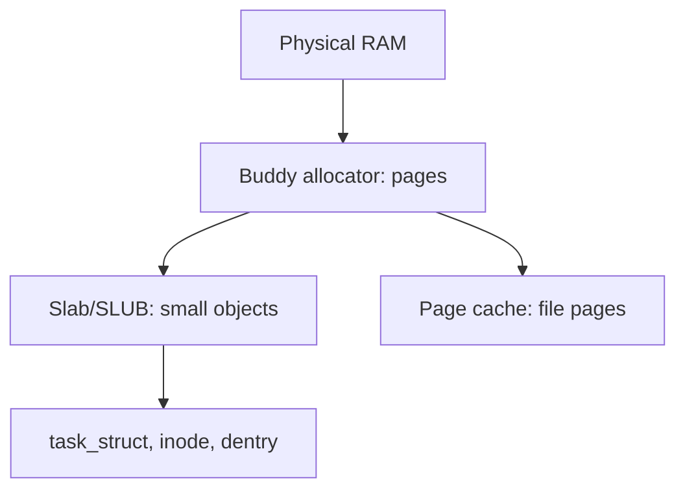

# Glossary

> **Goal:** one place to look up the ~100 terms this book leans on, each defined
> in a sentence or two and linked to the chapter that treats it properly. Read
> it front to back once to build a mental index, or jump in when a word in
> another chapter stops you cold.

Definitions here are deliberately short — enough to unblock you, not enough to
replace the chapter. Where a term is version-dependent, the entry pins the
version. Where architecture matters (page sizes, register names), it says which
arch. Follow the cross-links for the real story.

## A

**ABI (Application Binary Interface)** — the binary-level contract between two
pieces of compiled code: how syscalls pass arguments, how structs are laid out,
which registers survive a call. Linux's promise is that a working userspace ABI
is *never* broken ("we do not break userspace"). See
[Kernel, User Space & Syscalls](#/kernel-vs-userspace).

**Address space** — the set of valid virtual addresses a process can name,
described by an `mm_struct` and populated with VMAs. Every process gets its own;
threads share one. See [Virtual Memory](#/memory).

**Anonymous memory** — pages not backed by any file: heap, stack, `malloc`
regions, `MAP_ANONYMOUS` mappings. Under pressure they can only be reclaimed by
writing them to swap, unlike file-backed pages. See [Virtual Memory](#/memory).

**Atomic operation** — a read-modify-write (like `atomic_inc()` or a `cmpxchg`)
that hardware guarantees completes indivisibly, so no other CPU sees a
half-finished state. The building block under every lock. See
[Kernel Synchronization](#/kernel-sync).

## B

**BPF / eBPF** — a safe, verified in-kernel virtual machine that runs small
sandboxed programs attached to hooks (syscalls, tracepoints, network paths, LSM
hooks) without a module or a reboot. The modern basis for tracing, networking,
and security tooling. See [eBPF Internals](#/ebpf-internals).

**Bottom half** — the deferred part of interrupt handling that runs later with
interrupts enabled, so the fast top half can return quickly. Implemented today
as softirqs, tasklets, or threaded IRQs. See
[Interrupts, Exceptions & Softirqs](#/interrupts).

**Buddy allocator** — the kernel's bottom-level physical page allocator. It
keeps free memory in power-of-two blocks (orders 0–10, i.e. 4 KiB up to 4 MiB
on x86-64) and splits/merges "buddies" on `alloc_pages()` and free. See
[Virtual Memory](#/memory).

## C

**cgroup (control group)** — a kernel mechanism that groups processes and meters
or caps their resources (CPU, memory, I/O, PIDs). cgroup v2 uses a single
unified hierarchy and is what every container runtime drives. See
[Control Groups (cgroup v2)](#/cgroups).

**Context switch** — the act of saving one task's CPU state and loading
another's: register file, and for a different process the `mm` (a CR3 write on
x86-64). Cheaper between threads of one process. See
[CPU Scheduling](#/scheduling).

**COW (copy-on-write)** — sharing a page read-only between two mappings and only
duplicating it when one side writes. Powers `fork()`, `MAP_PRIVATE`, and overlay
filesystems. See [Virtual Memory](#/memory).

**C-state** — a CPU idle power state (C0 = running, C1/C2/C6… = progressively
deeper sleep with higher wake latency). The idle governor picks how deep to go.
See [Power Management](#/power-management).

## D

**dentry (directory entry)** — the VFS's in-memory object linking a name to an
inode, cached in the dcache so repeated path lookups skip the disk. See
[Files, Filesystems & the VFS](#/filesystems).

**DMA (Direct Memory Access)** — a device reading or writing RAM directly
without the CPU copying every byte. The CPU sets it up and gets an interrupt on
completion. See [Devices, Drivers & Modules](#/devices-modules).

**Descriptor** — see *File descriptor*.

## E

**EEVDF (Earliest Eligible Virtual Deadline First)** — the fair-class scheduling
algorithm that replaced CFS (default since kernel 6.6). It picks the eligible
task with the earliest virtual deadline, giving both fairness and latency
control. See [CPU Scheduling](#/scheduling).

**epoll** — Linux's scalable readiness-notification API (`epoll_create1`,
`epoll_ctl`, `epoll_wait`) for watching thousands of file descriptors without
the O(n) rescans of `select`/`poll`. See [The Networking Stack](#/networking).

**Exception** — a synchronous CPU-generated trap caused by an instruction: a
page fault, a divide-by-zero, a breakpoint. Distinct from an asynchronous IRQ.
See [Interrupts, Exceptions & Softirqs](#/interrupts).

## F

**File descriptor** — a small non-negative integer a process uses to name an
open file, socket, pipe, or eventfd; an index into the process's file table.
0/1/2 are stdin/stdout/stderr. See [Files, Filesystems & the VFS](#/filesystems).

**Futex (fast userspace mutex)** — the syscall (`futex`) that lets userspace
locks stay entirely in user space when uncontended and only enter the kernel to
sleep/wake when they actually contend. The basis of pthread mutexes. See
[Kernel Synchronization](#/kernel-sync).

## G

**Governor** — a pluggable policy that picks a value from a range: CPUfreq
governors (`schedutil`, `performance`, `powersave`) choose clock frequency;
cpuidle governors choose C-states. See [Power Management](#/power-management).

## H

**Hardirq (hard IRQ)** — the top-half interrupt handler that runs immediately in
interrupt context with the line masked; it must be short and defer real work to
a softirq or thread. See [Interrupts, Exceptions & Softirqs](#/interrupts).

**Hugepage** — a page larger than the base size (2 MiB or 1 GiB on x86-64) that
shrinks page-table depth and TLB pressure. Available explicitly (`hugetlbfs`) or
automatically (Transparent Huge Pages). See [Virtual Memory](#/memory).

## I

**inode** — the on-disk (and cached) object holding a file's metadata — size,
owner, permissions, timestamps, block pointers — but *not* its name. Names live
in directory entries that point at inodes. See
[Files, Filesystems & the VFS](#/filesystems).

**IOMMU** — an MMU for devices: it translates the addresses a device uses for
DMA into physical addresses, enabling isolation, VM passthrough, and protection
from rogue devices. See [KVM & Virtualization Internals](#/kvm-internals).

**io_uring** — a shared ring-buffer syscall interface (submission + completion
queues) for high-throughput asynchronous I/O with far fewer syscalls than
read/write. See [Modern I/O & io_uring](#/modern-io).

**IRQ (Interrupt Request)** — a hardware signal telling the CPU a device needs
attention, delivered through an interrupt controller (APIC/GIC) and dispatched
to a registered handler. See [Interrupts, Exceptions & Softirqs](#/interrupts).

## J

**jiffies** — the kernel's coarse tick counter, incremented `HZ` times per
second (commonly 250 or 1000). Cheap but low-resolution; hrtimers exist for
precision. See [Timers & Time](#/timers).

## K

**KASLR (Kernel Address Space Layout Randomization)** — randomizing where the
kernel image and its data land in virtual memory at boot, so an attacker can't
rely on fixed addresses. See [Linux Security & Confinement](#/security-hardening).

**kprobe** — a dynamic tracing mechanism that patches almost any kernel
instruction to run a probe handler, letting you inspect a live kernel without
recompiling. Often driven from BPF. See [/proc, strace, perf & eBPF](#/observability).

**KVM (Kernel-based Virtual Machine)** — the in-kernel hypervisor that turns
Linux into a type-2 host using hardware virtualization (VMX/SVM), with a `/dev/kvm`
interface driven by userspace VMMs like QEMU. See
[KVM & Virtualization Internals](#/kvm-internals).

## L

**LSM (Linux Security Module)** — the hook framework that lets security models
(SELinux, AppArmor, and BPF LSM) veto operations at kernel security checkpoints.
See [Linux Security & Confinement](#/security-hardening).

## M

**MMU (Memory Management Unit)** — the CPU hardware that translates every virtual
address to physical by walking page tables, caching results in the TLB and
raising a page fault on a miss. See [Virtual Memory](#/memory).

**Mount namespace** — the namespace that gives a process group its own view of
the filesystem mount tree, the foundation of a container's private root. See
[Namespaces](#/namespaces).

**Module** — a `.ko` object loaded into the running kernel to add drivers or
features without rebooting, via `insmod`/`modprobe`. See
[Devices, Drivers & Modules](#/devices-modules).

## N

**Namespace** — a kernel mechanism that virtualizes a global resource (PIDs,
network, mounts, users, UTS, IPC, cgroup, time) so different process groups see
independent instances. See [Namespaces](#/namespaces).

**netfilter** — the in-kernel packet-filtering and NAT framework hooked into the
network path, configured by `iptables`/`nftables`. See
[The Networking Stack](#/networking).

**NUMA (Non-Uniform Memory Access)** — a topology where each CPU socket has
local memory that's faster to reach than another socket's, so placement of
threads and pages matters for performance. See [NUMA Deep Dive](#/numa-deep-dive).

## O

**OOM killer (Out-Of-Memory killer)** — the last-resort reclaimer that picks and
kills a process (by `oom_score`) when the kernel truly cannot free memory,
rather than deadlocking the machine. See
[Lab: Trigger & Autopsy the OOM Killer](#/lab-oom-killer).

**OverlayFS** — a union filesystem that stacks a writable upper layer over
read-only lower layers using copy-up, the basis of container images. See
[Images & OverlayFS](#/overlayfs).

## P

**Page cache** — the kernel's cache of file contents in RAM; almost all file
I/O flows through it, and unused RAM fills with it. See
[Lab: Watch the Page Cache Work](#/lab-page-cache).

**Page fault** — the exception the MMU raises when a virtual address isn't
currently mapped. Minor faults just wire up an existing page; major faults must
fetch it from disk or swap. See [Virtual Memory](#/memory).

**PID (Process ID)** — the integer identifying a process (really a thread-group
leader's `tgid`). Inside a PID namespace it's remapped, so PID 1 in a container
isn't PID 1 on the host. See [Processes & Threads](#/processes).

**Preemption** — the scheduler forcibly taking a CPU from a running task to give
it to another. Kernel preemption models (none/voluntary/full, plus lazy
preemption maturing in 6.12) control when this can happen in kernel code. See
[CPU Scheduling](#/scheduling).

## R

**RCU (Read-Copy-Update)** — a synchronization technique for read-mostly data:
readers run lock-free, and writers publish a new copy then wait for a grace
period before freeing the old one. See [Kernel Synchronization](#/kernel-sync).

**RSS (Resident Set Size)** — the amount of a process's memory currently in
physical RAM (as opposed to virtual or swapped out). Shared pages are counted
in every sharer's RSS. See [Virtual Memory](#/memory).

**runc** — the low-level OCI runtime that actually creates a container: sets up
namespaces, cgroups, and mounts, then `execve`s your process. containerd and
Docker sit above it. See [Docker, containerd, runc](#/container-runtimes).

## S

**Scheduler class** — a priority-ordered plug-in policy layer. The kernel checks
classes in order: `stop` → `deadline` → `rt` → `fair` (EEVDF) → `idle`, plus the
new `sched_ext` (BPF schedulers) in 6.12. See [CPU Scheduling](#/scheduling).

**seccomp** — a facility that restricts which syscalls a process may make,
usually via a BPF filter, shrinking the kernel attack surface. Every container
runtime applies a seccomp profile. See [Linux Security & Confinement](#/security-hardening).

**Signal** — an asynchronous notification delivered to a process (`SIGINT`,
`SIGKILL`, `SIGSEGV`), interrupting or terminating it, or running a handler.
`SIGKILL` and `SIGSTOP` can't be caught. See
[Signals](#/signals).

**Slab / SLUB** — the kernel's allocator for small fixed-size objects (`inode`s,
`task_struct`s, dentries), built on top of the buddy allocator. SLUB is the
default implementation. See [Virtual Memory](#/memory).

**Socket** — the endpoint abstraction for network (and local `AF_UNIX`)
communication, presented to userspace as a file descriptor. See
[The Networking Stack](#/networking).

**Softirq** — the primary bottom-half mechanism: a fixed set of high-priority
deferred handlers (NET_RX, TIMER, RCU…) run after hardirqs, optionally offloaded
to the `ksoftirqd` thread. See [Interrupts, Exceptions & Softirqs](#/interrupts).

**Syscall (system call)** — the controlled entry point from user space into the
kernel (`read`, `mmap`, `clone`…), invoked via a trap instruction (`syscall` on
x86-64) that switches privilege level. See
[Kernel, User Space & Syscalls](#/kernel-vs-userspace).

## T

**task_struct** — the kernel's per-task control block: it holds a task's state,
scheduling info, credentials, files, `mm`, and signal state. One per thread. See
[Processes & Threads](#/processes).

**TLB (Translation Lookaside Buffer)** — the CPU cache of recent virtual→physical
translations, so hot addresses skip the page-table walk. A context switch may
flush it unless PCID/ASID tags avoid that. See [Virtual Memory](#/memory).

**Tracepoint** — a stable, statically-placed hook in kernel code that tools (ftrace,
perf, BPF) can attach to with low overhead and a documented format. See
[/proc, strace, perf & eBPF](#/observability).

**TPM (Trusted Platform Module)** — a hardware chip that stores keys and
measurement hashes (PCRs), used by Secure Boot and IMA to attest boot integrity.
See [Trusted Computing](#/trusted-computing).

## V

**vDSO (virtual dynamic shared object)** — a tiny shared library the kernel maps
into every process so hot "syscalls" like `gettimeofday()` run in user space
with no privilege transition. See [Kernel, User Space & Syscalls](#/kernel-vs-userspace).

**VFS (Virtual File System)** — the abstraction layer of common objects
(`inode`, `dentry`, `file`, `superblock`) that lets every filesystem look the
same to userspace. See [Files, Filesystems & the VFS](#/filesystems).

**VMA (virtual memory area)** — a `vm_area_struct`: one contiguous region of a
process's address space with uniform permissions and backing (code, heap, a
mapped file). See [Virtual Memory](#/memory).

**vruntime (virtual runtime)** — the per-task virtual clock the fair scheduler
advances in proportion to how much CPU a task used, weighted by nice. Lower
vruntime means more owed. See [CPU Scheduling](#/scheduling).

## W

**Workqueue** — a kernel mechanism for running deferred work in process context
on kernel worker threads (`kworker`), so the work can sleep — unlike a softirq.
See [Interrupts, Exceptions & Softirqs](#/interrupts).

## Z

**Zombie** — a process that has exited but whose parent hasn't `wait()`ed for
it, so its `task_struct` lingers to hold the exit status. Reaped when the parent
collects it or is itself reparented to init. See [Processes & Threads](#/processes).

---

### A few relationships worth seeing together

Many of these terms only make sense in relation to each other. The memory
allocators stack:

And the interrupt-to-work handoff is a recurring shape: a **hardirq** does the
minimum, then defers to a **softirq** (fast, atomic context) or a **workqueue**
(can sleep). Knowing which context you're in decides what you're allowed to do —
you cannot block in a softirq.

## Check your understanding

1. Two processes both read the same virtual address `0x4000` and get different
   bytes. Which term explains how that's possible, and which chapter covers it?

Show answer

The *MMU* translates each process's virtual addresses through its own *page
tables*, so identical virtual addresses map to different physical pages. See
[Virtual Memory](#/memory).

2. A colleague says "the container's PID 1 is different from the host's PID 1."
   What single kernel concept makes both statements true at once?

Show answer

The *PID namespace*: it remaps process IDs so a process is PID 1 inside the
container while having some other PID on the host. See [Namespaces](#/namespaces).

3. Why can a handler running in *softirq* context not do the same things a
   *workqueue* handler can?

Show answer

A softirq runs in atomic (bottom-half) context and must not sleep or block; a
workqueue runs in process context on a kernel thread, so it *can* sleep. See
[Interrupts, Exceptions & Softirqs](#/interrupts).

4. Anonymous memory and page-cache pages are both reclaimable under pressure,
   but the kernel treats them differently. How?

Show answer

Clean file-backed (page-cache) pages can be dropped and re-read from disk;
*anonymous* pages have no file backing, so reclaiming them requires writing them
to *swap*. See [Virtual Memory](#/memory).

5. Which allocator hands out a fresh `task_struct`, and what does *it* get its
   memory from?

Show answer

The *slab/SLUB* allocator carves fixed-size objects like `task_struct` out of
pages it obtains from the *buddy allocator*. See [Virtual Memory](#/memory).

6. Why is `gettimeofday()` on Linux usually not a real syscall, and what makes
   that possible?

Show answer

The *vDSO* is mapped into every process, so the read runs in user space with no
privilege transition into the kernel. See
[Kernel, User Space & Syscalls](#/kernel-vs-userspace).

7. A `SIGKILL` sent to a process guarantees termination, but a `SIGSEGV` handler
   can run first on a different signal. What's the underlying rule?

Show answer

Most signals can be caught, blocked, or ignored by a handler, but `SIGKILL` and
`SIGSTOP` cannot — the kernel enforces them directly. See [Signals](#/signals).

## Follow the code (kernel v6.12)

Glossaries are lists, but almost every term here meets in one hot path: the
**page fault**. Watch a *minor fault* wire up a page and you'll see the *MMU*,
*VMA*, *page tables*, *anonymous memory*, and the *buddy allocator* all appear
in sequence.

1. The MMU fails a translation and traps into the arch fault handler, which on
   x86-64 is [do_user_addr_fault()](https://elixir.bootlin.com/linux/v6.12/C/ident/do_user_addr_fault).
   It reads the faulting address from `CR2` and the error code (was it a write? a
   user access?).

2. It looks up the *VMA* covering that address. In 6.12 the read side of that
   lookup can run under the per-VMA lock via
   [lock_vma_under_rcu()](https://elixir.bootlin.com/linux/v6.12/C/ident/lock_vma_under_rcu) —
   an *RCU*-based fast path that avoids taking the whole `mmap_lock`. No VMA
   means a real segfault, and a `SIGSEGV` is queued to the task.

3. With a VMA in hand it calls
   [handle_mm_fault()](https://elixir.bootlin.com/linux/v6.12/C/ident/handle_mm_fault),
   the architecture-independent core. This walks (and fills in) the page-table
   levels via helpers like `handle_pte_fault()`, operating on the process's
   `mm_struct`.

4. For a fresh anonymous page — a first touch of freshly `mmap`'d heap — control
   reaches [do_anonymous_page()](https://elixir.bootlin.com/linux/v6.12/C/ident/do_anonymous_page).
   It asks the *buddy allocator* (through the folio/`alloc_pages` path) for a
   zeroed page, then installs a *PTE* pointing at it with the right permission
   bits.

5. The fault handler returns, the CPU re-executes the faulting instruction, the
   *MMU* now finds a valid translation, caches it in the *TLB*, and the process
   never knows it stalled. The page now counts toward the task's *RSS*.

The same entry point handles the harder cases by branching elsewhere: a
*copy-on-write* write-fault duplicates the shared page; a fault on a swapped
page becomes a *major fault* that goes to `do_swap_page()` and blocks on I/O.
The struct that ties it together is `struct vm_fault`, carrying the address, the
VMA, the pmd/pte pointers, and flags describing the access.

## Sources & further reading

- [The Linux Kernel documentation](https://docs.kernel.org/) — the index behind
  most terms here; the memory-management and scheduler sections are especially
  worth browsing.
- [Core API and glossary](https://docs.kernel.org/core-api/index.html) — kernel
  docs for the internal APIs many of these terms name.
- [man7.org: system calls (man 2)](https://man7.org/linux/man-pages/dir_section_2.html)
  and [man 7 overviews](https://man7.org/linux/man-pages/dir_section_7.html) —
  authoritative userspace-facing definitions for syscalls, `epoll`, `signal`,
  `namespaces`, `cgroups`, and more.
- [bootlin Elixir cross-referencer](https://elixir.bootlin.com/linux/v6.12/source) —
  search any identifier in this glossary against the real 6.12 tree.
- [Understanding the Linux Kernel](https://www.oreilly.com/library/view/understanding-the-linux/0596005652/),
  Bovet & Cesati — dated on specifics but still the clearest tour of the
  vocabulary as a whole.
- [LWN.net Kernel Index](https://lwn.net/Kernel/Index/) — the running history
  behind terms like EEVDF, io_uring, BPF, and RCU.

---

**Next:** pick any linked chapter above and read it end to end — the glossary is
a map, not the territory. If you're new here, start with
[How to Use This Book](#/start-here).
