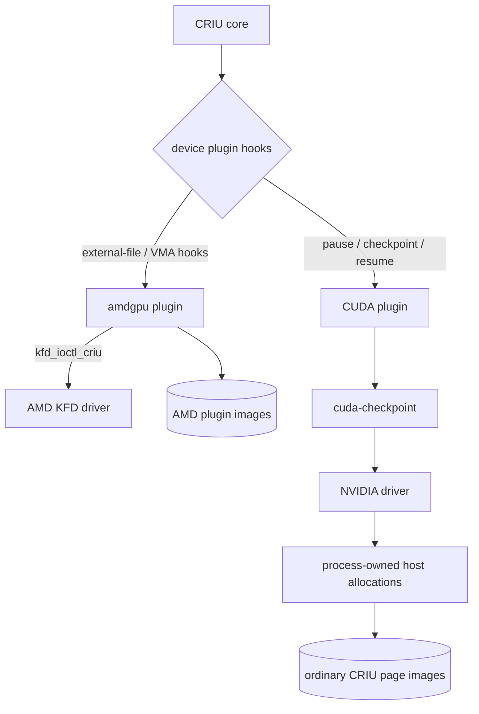
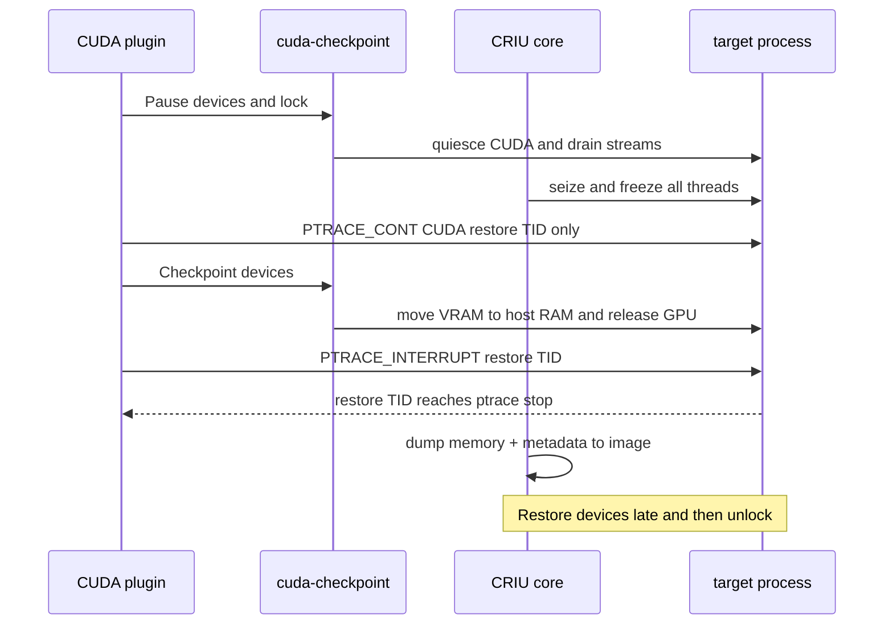

# GPU Checkpointing: cuda-checkpoint & CRIU Plugins

> **Goal:** understand why a CUDA process is the one thing plain CRIU cannot
> checkpoint, and how NVIDIA's `cuda-checkpoint` and CRIU's plugin API team up
> to fix it. We'll walk the plugin hooks, the per-process state machine, the
> AMD upstream counterpart, and the genuinely open frontier: unified memory.
> This is the newest, least-documented chapter in the book — so we'll mark
> carefully what is *documented*, what is *inferable*, and what is still an
> *open question*.

## Why the GPU breaks CRIU

Everything you learned in [The Anatomy of Process State](#/process-state)
rests on one assumption: a process's state lives in places the kernel can
enumerate. Its address space is a list of VMAs. Its open files are a table of
`struct file` pointers. Its registers sit in `task_struct`. CRIU works
([Dumping a Process](#/criu-dump)) because `/proc/<pid>/` is a faithful,
complete inventory — walk it, serialize what you find, and you have the whole
process.

A CUDA process violates that assumption at the most fundamental level. Its
*real* state does not live in anything `/proc` can see. It lives in three
places the kernel has no map of:

- **Device memory.** Your model weights, the KV cache, every tensor — tens of
  gigabytes sitting in VRAM on the card. From the host kernel's point of view
  this is just a BAR (Base Address Register) window and some opaque driver
  bookkeeping. There is no `struct page` for most of it, no page-cache entry,
  nothing to `read()`.
- **Driver state.** CUDA contexts, streams, events, module handles, and the
  GPU's *own* page tables (the MMU on the card that maps device virtual
  addresses to VRAM). All of this is private to the proprietary NVIDIA driver
  and lives partly in the driver's kernel-side allocations and partly on the
  device itself.
- **DMA and mapped regions.** The host and device are stitched together by
  pinned host buffers, `mmap`'d BAR windows, and IOMMU mappings that let the
  GPU DMA into host RAM. These bindings are live hardware state, not data.

Here is the irreducible fact, and it is an *architectural* fact, not an
implementation gap somebody will fix next quarter. A CUDA process holds a
handful of file descriptors:

```bash
ls -l /proc/$(pgrep -n python)/fd | grep nvidia
```

```text
lrwx------ 1 user user 64 Jul 17 09:14 12 -> /dev/nvidiactl
lrwx------ 1 user user 64 Jul 17 09:14 13 -> /dev/nvidia0
lrwx------ 1 user user 64 Jul 17 09:14 14 -> /dev/nvidia-uvm
lrwx------ 1 user user 64 Jul 17 09:14 15 -> /dev/nvidia-uvm-tools
lrwx------ 1 user user 64 Jul 17 09:14 22 -> /dev/nvidia0
```

Those five fds are the entire *visible* interface to the GPU. But recall the
lesson from [devices & modules](#/devices-modules): a device fd is a handle,
not the state. Everything meaningful that ever happened — allocating VRAM,
launching a kernel, creating a stream — went through **opaque `ioctl()` calls**
on `/dev/nvidiactl` and `/dev/nvidia-uvm`. Reopening these fds on restore
recreates *nothing* behind them. You would get fresh, empty handles to a
driver that has never heard of your contexts, your allocations, or your data.

Now look at what the address space shows:

```bash
grep -E 'nvidia|/dev' /proc/$(pgrep -n python)/maps
```

```text
7f2c00000000-7f2c40000000 rw-s 00000000 00:06 1074  /dev/nvidia-uvm
7f2e80000000-7f2e80200000 rw-s 00000000 00:06 1075  /dev/nvidiactl
7f2e80200000-7f2e80a00000 rw-s 96000000 00:06 1076  /dev/nvidia0
200000000-200200000000    ---p 00000000 00:00 0
```

Read that carefully. The `rw-s` mappings backed by `/dev/nvidia*` are
**shared device mappings** — windows onto the driver and the card, not onto
ordinary memory. CRIU can see that the VMA *exists*, but it cannot dump its
contents: reading those bytes means talking to hardware through the driver, and
the driver defines what a read even means.

That last line — the huge `---p` region with no backing and no permissions
at a suspiciously round address (`0x200000000`) — is a **unified/managed
memory reservation**: virtual address space the CUDA driver has carved out
to migrate pages between host and device on demand. It has no file behind it
and no readable contents from the host side.

So enumerate what is *invisible* to a `/proc` walk:

- the contents of every `/dev/nvidia*` device mapping (potentially tens of GB
  of VRAM);
- every CUDA context, stream, event, and module handle inside the driver;
- the GPU's own page tables;
- the semantics of the unified-memory VA reservation;
- pinned host buffers whose *purpose* (a DMA target) `/proc` cannot express.

Stock CRIU, confronted with a `/dev/nvidia0` fd it does not understand, does
the only honest thing: it **refuses**, with an "unsupported file" error. It
will not pretend to checkpoint state it cannot reach. That refusal is correct.
The question is how to give CRIU a collaborator that *can* reach it.

## The plugin architecture

CRIU anticipated this. From early on it has had an extension point for exactly
the situation where the core cannot enumerate some external state: the
**plugin API**. The design is simple and, importantly for you, *small enough to
read in an afternoon*.

The contract lives in one header,
[criu/include/criu-plugin.h](https://github.com/checkpoint-restore/criu/blob/criu-dev/criu/include/criu-plugin.h).
A plugin is a shared object that CRIU `dlopen`s; it implements `cr_plugin_init()`
and `cr_plugin_fini()` and registers callbacks for a fixed set of **hooks**.
The hooks are an enum, and in kernel-6.12-era CRIU they are, verbatim and in
order:

```c
enum {
    CR_PLUGIN_HOOK__DUMP_UNIX_SK       = 0,
    CR_PLUGIN_HOOK__RESTORE_UNIX_SK    = 1,
    CR_PLUGIN_HOOK__DUMP_EXT_FILE      = 2,
    CR_PLUGIN_HOOK__RESTORE_EXT_FILE   = 3,
    CR_PLUGIN_HOOK__DUMP_EXT_MOUNT     = 4,
    CR_PLUGIN_HOOK__RESTORE_EXT_MOUNT  = 5,
    CR_PLUGIN_HOOK__DUMP_EXT_LINK      = 6,
    CR_PLUGIN_HOOK__HANDLE_DEVICE_VMA  = 7,
    CR_PLUGIN_HOOK__UPDATE_VMA_MAP     = 8,
    CR_PLUGIN_HOOK__RESUME_DEVICES_LATE = 9,
    CR_PLUGIN_HOOK__PAUSE_DEVICES      = 10,
    CR_PLUGIN_HOOK__CHECKPOINT_DEVICES = 11,
    CR_PLUGIN_HOOK__POST_FORKING       = 12,
    CR_PLUGIN_HOOK__RESTORE_INIT       = 13,
    CR_PLUGIN_HOOK__DUMP_DEVICES_LATE  = 14,
    CR_PLUGIN_HOOK__UPDATE_INETSK      = 15,
    CR_PLUGIN_HOOK__MAX
};
```

The first seven are the *classic* hooks — the ones the CRIU wiki documents
under friendly names like `cr_plugin_dump_file` / `cr_plugin_restore_file`.
They handle "external" objects: a Unix socket whose peer is outside the dumped
set, a bind mount, a network link. The pattern is always the same: when CRIU
meets an object it does not understand, it **enumerates the registered
callbacks until one returns something other than `-ENOTSUP`**. That plugin now
owns that object's dump and restore.

The generic `DUMP_EXT_FILE` / `RESTORE_EXT_FILE` pair lets a plugin claim an
otherwise unsupported fd and serialize vendor-defined state into its own image.
AMD uses that pattern. Do **not** project it onto NVIDIA's current CUDA plugin:
that plugin registers the three lifecycle hooks discussed below, transforms
device contents into process-owned host memory, and lets CRIU's normal memory
machinery store the bytes. It does not write a weight-sized CUDA plugin image.

The last block — `HANDLE_DEVICE_VMA`, `UPDATE_VMA_MAP`,
`PAUSE_DEVICES`, `CHECKPOINT_DEVICES`, `RESUME_DEVICES_LATE`,
`DUMP_DEVICES_LATE` — are the *newer*, device-specific hooks added precisely
so accelerators could be checkpointed cleanly. They exist because a device is
not just a file; it interacts with the process's *address space* (those
`rw-s` device VMAs) and with the *freeze timeline*.

`HANDLE_DEVICE_VMA` lets a plugin claim a VMA that CRIU's normal memory walk
cannot handle. `UPDATE_VMA_MAP` lets it fix up where a mapping lands on
restore. `PAUSE_DEVICES` / `CHECKPOINT_DEVICES` / `RESUME_DEVICES_LATE` give
the plugin three precisely-timed slots in the dump/restore sequence — we'll
see below why that timing is everything.

### The AMD plugin: the upstream existence proof

You don't have to take the architecture on faith. **AMD's `amdgpu` plugin is
upstream in CRIU today**, and it is the clean, readable proof that
vendor-cooperative GPU checkpointing works. It lives at
[plugins/amdgpu/amdgpu_plugin.c](https://github.com/checkpoint-restore/criu/blob/criu-dev/plugins/amdgpu/amdgpu_plugin.c)
with a
[README](https://github.com/checkpoint-restore/criu/blob/criu-dev/plugins/amdgpu/README.md).

The AMD design is cooperative all the way down to the kernel. AMD's **KFD**
(Kernel Fusion Driver, `drivers/gpu/drm/amd/amdkfd`) exposes explicit
checkpoint/restore ioctls — the
[kfd_ioctl_criu](https://elixir.bootlin.com/linux/v6.12/C/ident/kfd_ioctl_criu)
entry point, dispatched inside
[drivers/gpu/drm/amd/amdkfd/kfd_chardev.c](https://elixir.bootlin.com/linux/v6.12/source/drivers/gpu/drm/amd/amdkfd/kfd_chardev.c).
The plugin drives a small set of operations against it:

- a **process-info / checkpoint** op that *discovers the buffer objects* (BOs)
  belonging to the process being dumped, and hands their metadata and VRAM
  contents back to the plugin running under the CRIU master context;
- a **CRIU_PAUSE**-style op to make sure all the GPU's user-mode queues are
  evicted (the device stops touching memory);
- a **restore** op that recreates those BOs;
- a **CRIU_RESUME**-style late op that re-registers MMU notifiers, restores SVM
  (shared virtual memory) ranges, and restarts the queues *after* CRIU has
  finalized the process's VMAs.

The plugin registers `DUMP_EXT_FILE` (save all KFD state and VRAM),
`RESTORE_EXT_FILE` (recreate it), `UPDATE_VMA_MAP` and `HANDLE_DEVICE_VMA` (fix
up device mappings), and `RESUME_DEVICES_LATE` (restart queues once addresses
are settled). It serializes the dumped state with **protobuf** into its own
image files alongside CRIU's. The result: a running ROCm/HIP process on a
supported AMD GPU can be checkpointed and restored by upstream CRIU + the
amdgpu plugin, no proprietary side channel required — because the *ioctl
surface is in the mainline kernel*.

This is your contributor entry point. The plugin API is tiny, the amdgpu
plugin is a complete worked example, and the kernel side is open. If you want
to *do* original work in this area rather than read about it, this is where the
door is unlocked.



The NVIDIA path in that diagram works differently in one crucial way — and
that difference is the whole trick of the next section.

## cuda-checkpoint: turning a GPU process back into a Linux process

NVIDIA's cooperation ships as a single utility,
[`cuda-checkpoint`](https://github.com/NVIDIA/cuda-checkpoint), backed by a
`cuCheckpoint*` API in the driver. It requires **display driver r550 or newer**
for the base feature (CRIU integration specifically wants **r555+**), and until
recently it was **x86_64-only** — aarch64 binaries arrived with **driver 595**.
Its job is not to serialize the GPU into a file. Its job is subtler and, once
you see it, obviously right: it makes the CUDA process *stop being a GPU
process at the OS level* so that stock CRIU can take it from there.

Think of `cuda-checkpoint` as driving a small **per-process state machine**,
one CUDA process at a time, toggled by PID:

```text
   RUNNING ──lock──▶ LOCKED ──checkpoint──▶ CHECKPOINTED
      ▲                │                          │
      └────unlock──────┘◀───────restore───────────┘
```

- **`lock`** (`RUNNING → LOCKED`): quiesce the CUDA runtime. New CUDA calls
  from the application block; in-flight work on streams is allowed to drain and
  the device is brought to a clean, stalled point. The process is still alive
  and *runnable* — that matters enormously below.
- **`checkpoint`** (`LOCKED → CHECKPOINTED`): copy all device memory **out of
  VRAM and into ordinary host memory** owned by the process, then release the
  GPU-side resources — contexts, streams, the device page tables, the BAR
  mappings. The driver hands the VRAM contents back as plain host pages.
- **`restore`** (`CHECKPOINTED → LOCKED`): the reverse — re-acquire a GPU,
  reallocate device memory, copy the saved bytes back into VRAM, rebuild
  contexts and streams.
- **`unlock`** (`LOCKED → RUNNING`): let the application's CUDA calls proceed
  again.

The CLI exposes these directly:

```bash
# What state is this CUDA process in right now?
cuda-checkpoint --get-state --pid 48213
# running

# Drive one transition at a time (driver 570+ split 'lock' out as its own verb):
cuda-checkpoint --action lock       --pid 48213 --timeout 10000
cuda-checkpoint --action checkpoint --pid 48213
# ... now the process holds no GPU resources ...
cuda-checkpoint --action restore    --pid 48213
cuda-checkpoint --action unlock     --pid 48213

# Or do the whole round trip with the convenience toggle:
cuda-checkpoint --toggle --pid 48213   # running -> checkpointed
cuda-checkpoint --toggle --pid 48213   # checkpointed -> running
```

Here is the payoff, and it is beautiful. **After `checkpoint`, the process is a
plain Linux process.** Its formerly-device state — the model weights, the KV
cache — now sits in ordinary anonymous host VMAs. It holds no `/dev/nvidia*`
mappings that matter, no live contexts. Every problem from the first section
has evaporated, because there is no longer any opaque GPU state to reach: it
was copied into normal memory that `/proc/<pid>/maps` describes and CRIU dumps
routinely.

So the full recipe is a dance between two tools:

**Dump:**
1. `cuda-checkpoint` toggles the process to `CHECKPOINTED` (VRAM → host RAM,
   GPU released).
2. Stock CRIU dumps the now-ordinary process ([Dumping a Process](#/criu-dump)).

**Restore:**
1. Stock CRIU restores the process image ([Restoring a Process](#/criu-restore)),
   host memory and all.
2. `cuda-checkpoint` toggles it back (re-acquire GPU, host RAM → VRAM, rebuild
   contexts).

### Who runs the dance, and the freeze-order subtlety

You *could* run those steps by hand, but the point of the CRIU **CUDA plugin**
([plugins/cuda/cuda_plugin.c](https://github.com/checkpoint-restore/criu/blob/criu-dev/plugins/cuda/cuda_plugin.c))
is to orchestrate them automatically, and to get the *timing* right — which is
where the device-specific hooks from earlier earn their keep. The plugin
registers exactly three:

- **`PAUSE_DEVICES`** → runs the **`lock`** action *while the process is still
  running*.
- **`CHECKPOINT_DEVICES`** → runs the **`checkpoint`** action *after* CRIU has
  seized the process. The plugin temporarily resumes only CUDA's dedicated
  restore TID while the rest of the task remains stopped.
- **`RESUME_DEVICES_LATE`** → runs **`restore`** then **`unlock`** on the
  restore side, after the address space is rebuilt.

Why split `lock` from `checkpoint` across the freeze boundary? Because of a
constraint that is easy to miss and fatal to ignore: **the CUDA runtime needs
one target thread to run its side of the protocol.** The machinery is driven
by a dedicated *CUDA restore thread* inside the target process (you can find
its TID with `cuda-checkpoint --get-restore-tid --pid <pid>`). CRIU must stop
the tree to obtain a consistent checkpoint, but it cannot leave that one TID
stopped while asking the driver to transform GPU state.

So the sequence is:

1. **`PAUSE_DEVICES`** fires first, on the *live* process: `lock` quiesces
   CUDA while its threads can still run.
2. CRIU **seizes/freezes** every thread.
3. **`CHECKPOINT_DEVICES`** obtains the restore TID, saves its signal mask,
   clears the ptrace options that would interfere, and issues `PTRACE_CONT`
   for that TID only. It then invokes `cuda-checkpoint --action checkpoint`;
   all other application threads remain stopped.
4. When the driver transition completes, the plugin uses `PTRACE_INTERRUPT`
   to stop the restore TID again, waits for its ptrace stop, and restores its
   mask/options. The whole process is now consistently stopped with its former
   device contents represented in ordinary host allocations.
5. CRIU dumps memory and metadata as usual.

Get that order wrong and you either deadlock or dump a process mid-flight with
the GPU still live. The plugin encodes the correct order so you never have to
think about it.



### What survives, and what constrains you

The CUDA plugin README and the NVIDIA docs are refreshingly blunt about the
sharp edges. Documented constraints, as of the 6.12 / driver-570 era:

- **Similar GPUs, same count.** Restore needs a target with GPUs compatible
  with the source and the *same number* of them. This is a topology contract,
  not a suggestion.
- **Driver compatibility.** The restoring driver must be able to make sense of
  the checkpointed state; treat "same or compatible driver version" as the safe
  assumption.
- **VRAM goes through host RAM.** The `checkpoint` copies device memory into
  system memory, so on a multi-GPU box you can *thrash* host RAM moving tens of
  GB around. Plan capacity accordingly.
- **Not supported:** **NVIDIA UVM Managed Memory**, **MIG** (Multi-Instance
  GPU), and **MPS** (Multi-Process Service) are called out as *not currently
  supported*. UVM in particular is the one that matters most — see the next
  section.
- **Leftover references.** NVML handles and processes that `fork()` without
  `exec()` can leave lingering device references that break the clean-toggle
  assumption. There is also a documented race between `PAUSE_DEVICES` and a
  process that is still initializing CUDA.

Newer drivers keep chipping at the list: **580** added GPU migration and
partial container passthrough (the latter also in some 575 drivers), **595**
added aarch64, **610** added
`cuIpcGetMemHandle`-based CUDA IPC support. The frontier moves fast enough that
you should always check the [cuda-checkpoint README](https://github.com/NVIDIA/cuda-checkpoint)
for the exact matrix on your driver rather than trusting any prose — including
this chapter — as current.

## Unified memory: the open frontier

Everything above assumes a **discrete GPU**: a card with its own VRAM across a
PCIe bus, where "checkpoint" fundamentally means *copy device memory to host
memory*. On a 129 GiB model that copy **is** the checkpoint — it dominates the
cost, the image size, and the restore latency.

Now change the hardware. On **unified-memory platforms** — Grace-Blackwell
desk-side machines like DGX Spark / GB10, and the Jetson line — the CPU and GPU
share the *same physical memory* over a coherent interconnect. There is no
separate VRAM to copy *from*. The single most expensive operation in the
discrete story — the device→host DMA of the weights — either disappears or
changes nature entirely, because the weights may already be in memory the host
can address.

This is where I owe you honesty rather than confidence. Let me separate the
three tiers explicitly.

**Documented:** UVM Managed Memory is on the *unsupported* list for
`cuda-checkpoint` today. aarch64 tooling exists as of driver 595. The Jetson
and Grace-Blackwell platforms use physically unified memory.

**Hypothesis, not a supported path:** Physical coherence could remove some
device→host data movement for allocations the CPU can already address. That
does **not** imply that CUDA's current checkpoint protocol can serialize those
allocations: UVM Managed Memory is explicitly unsupported. Driver metadata,
mapping ownership and the semantics of migrating pages can remain blockers
even when the bytes share a physical pool. Treat lower copy cost as a question
to test after support exists, not as an expected present-day behavior.

**Open questions (genuinely unanswered in the public record):**

- How does the driver expose managed / unified mappings to CRIU's VMA walk on
  these platforms? Recall the `---p` reservation at `0x200000000` from the
  first section — what does CRIU actually see, and dump, there?
- What does `cuda-checkpoint` *do* on the `checkpoint` action when there is no
  separate VRAM? Does the "unsupported UVM" restriction lift on coherent
  hardware, or is it a blanket restriction regardless of platform?
- What would land in the image files once UVM is supported? The current CUDA
  plugin does not create a weight-sized, CUDA-specific plugin image: the driver
  materializes device contents as process-owned host allocations and CRIU puts
  those bytes into its ordinary `pages-*.img`/shmem image families. Would a
  coherent-memory implementation use those same families, or introduce a new
  driver-managed transfer path without double-counting pages?
- Do the toggle and restore latencies change shape — from copy-bound to
  metadata-bound?

**Public measurements barely exist.** I could find no published
image-size / toggle-latency / restore-latency numbers, and no
[CRIT](#/criu-dump)-style autopsies of a CUDA process on unified memory, at the
time of writing (2026-07). That is not a gap in my search; it is a gap in the
field.

Which means: **if you own such hardware, this is an experimental protocol, not
a supported recipe.** Use a disposable worker with no irreplaceable state;
an expected rejection is a valid result. First observe the utility's state
transition independently of CRIU:

```bash
# A measurement protocol for unified-memory GPU checkpointing.
# UVM is documented unsupported: stop at the first error and inspect state.

PID=<pid-of-a-disposable-worker>
sed -n '1,240p' "/proc/$PID/maps" > maps.before
cuda-checkpoint --get-state --pid "$PID"
/usr/bin/time -v cuda-checkpoint --toggle --pid "$PID"
cuda-checkpoint --get-state --pid "$PID"
sed -n '1,240p' "/proc/$PID/maps" > maps.after
```

If the transition fails, do not blindly continue. Query `--get-state`; a
`locked` job needs `--action unlock`, while a successfully `checkpointed` job
must be returned with `--action restore` followed by `--action unlock`. Keep
the failure log and the before/after maps. On a **fresh disposable run**, only
if the CUDA state transition and `criu check` succeed, exercise the integrated
plugin and inspect CRIU's normal memory families:

```bash
PID=<pid-of-the-fresh-disposable-worker>
mkdir -p ./ckpt
sudo criu dump -t "$PID" -D ./ckpt --shell-job   # CUDA plugin installed
du -sh ./ckpt
ls -lh ./ckpt/pages-*.img ./ckpt/pagemap-*.img
sudo crit decode -i "./ckpt/pagemap-$PID.img" --pretty | head -80
/usr/bin/time -v sudo criu restore -D ./ckpt --shell-job
```

Whoever runs that carefully and publishes the numbers — image sizes, toggle
latencies, restore latencies, a CRIT autopsy of what the ordinary page images
contain on unified memory — is doing *original work*. There is no authoritative
source to cite yet because the source hasn't been written. Treat this section
as a set of hypotheses with a testing plan attached, and hold it to the same
standard you'd hold any claim: measured, or marked as unmeasured.

## The economics: why anyone bothers

Step back and ask why NVIDIA, AMD, Modal, and half a dozen inference startups
are all pushing on this at once. The answer is money, and the mechanism is
simple: **checkpointing turns idle GPU time into sellable capacity.**

A loaded inference server spends enormous effort getting ready — pulling
weights off disk into VRAM, JIT-compiling and capturing CUDA graphs,
initializing contexts. For a large model that cold start is *minutes*. If you
must eat minutes every time you bring a replica up, you cannot afford to scale
to zero; you keep GPUs hot and idle, paying for silicon that isn't serving
requests. That idle time is the entire cost problem of GPU serving.

Checkpoint/restore attacks it directly:

- **Scale-to-zero for inference.** Snapshot a fully-warmed process; when
  traffic drops, tear it down and release the GPU; when traffic returns,
  *restore* in seconds instead of cold-starting in minutes.
- **Model hot-swap.** Keep snapshots of several models; bin-pack them onto a
  smaller fleet, restoring whichever one a request needs.
- **Bin-packing and migration.** Move a running workload off a node for
  maintenance or consolidation ([Live Migration](#/live-migration)).

Vendor measurements show the potential, but the implementation layer matters.
In NVIDIA's **early Dynamo Snapshot prototype**, upstream CRIU restored the
6.2/26/129 GiB test checkpoints in **6.8/24/119 s**. Prototype CRIU changes
(parallel memfd restore plus native AIO) reduced those CRIU-only times to
**2.4/4.7/15 s**; NVIDIA explicitly says those optimizations were not yet
shipped in Dynamo Snapshot and awaited upstreaming.

A separate proof-of-concept GPU Memory Service path restored the 129 GiB
workload in under five seconds and produced the reported **21×** end-to-end
startup reduction. The available experimental release was narrower: single-GPU
vLLM/SGLang through the non-GMS path. These are different data points, not one
production result.

Modal likewise reports workload-specific cold-boot improvements using the CUDA
checkpoint API; treat all vendor figures as measurements of their stated setup,
not guarantees.

Now connect this back to [The Snapshot Taxonomy](#/snapshot-taxonomy), because
these products live at *different layers* and that placement determines what
they can and can't do:

| System | Layer | Mechanism |
|---|---|---|
| **Modal** GPU snapshots | sandbox / gVisor | gVisor checkpoint-restore + `cuCheckpoint*` API |
| **Dynamo Snapshot** (early prototype) | container / process | CRIU + cuda-checkpoint, with prototype restore optimizations |
| **vLLM sleep mode** | application | `sleep()`/`wake_up()` free & reallocate weights/KV in-process |
| **amdgpu plugin** | driver, upstream | KFD CRIU ioctls + CRIU plugin |

Each trades generality for control. **vLLM sleep mode** is the narrowest and
the least magical: it operates *inside* the Python process, releasing GPU
memory (level 1 offloads weights to CPU RAM and drops the KV cache; level 2
drops both) and reallocating on `wake_up()`. It can avoid much of a reload, but
only vLLM knows how to do it, and only for its own tensors.

The **amdgpu** path is the most principled: the checkpoint contract is in the
*mainline kernel*, so upstream CRIU handles it with no proprietary
intermediary. **Dynamo / CRIU + cuda-checkpoint** is the general process-level
answer for NVIDIA, at the cost of depending on a closed driver utility.
**Modal** wraps the same NVIDIA API but underneath its gVisor sandbox, buying
stronger isolation and a different restore substrate.

There is no single "GPU snapshot." There is a stack of them, and knowing which
layer a given product sits at tells you immediately what it can migrate, what
it can't, and where it will break.

## Follow the code

The whole subject is small enough to read directly — do it.

- **The plugin contract:**
  [criu/include/criu-plugin.h](https://github.com/checkpoint-restore/criu/blob/criu-dev/criu/include/criu-plugin.h)
  — the hook enum, `cr_plugin_init`/`cr_plugin_fini`, the `CR_PLUGIN_DESC`
  registration macro. Read this first; everything else is an implementation of
  it.
- **The NVIDIA orchestration:**
  [plugins/cuda/cuda_plugin.c](https://github.com/checkpoint-restore/criu/blob/criu-dev/plugins/cuda/cuda_plugin.c)
  and its
  [README](https://github.com/checkpoint-restore/criu/blob/criu-dev/plugins/cuda/README.md)
  — watch how `PAUSE_DEVICES`, `CHECKPOINT_DEVICES`, and
  `RESUME_DEVICES_LATE` map to `lock` / `checkpoint` / `restore` / `unlock`
  across the freeze boundary.
- **The utility itself:** [github.com/NVIDIA/cuda-checkpoint](https://github.com/NVIDIA/cuda-checkpoint)
  — the state machine, the CLI verbs, the driver-version matrix.
- **The AMD upstream proof:**
  [plugins/amdgpu/amdgpu_plugin.c](https://github.com/checkpoint-restore/criu/blob/criu-dev/plugins/amdgpu/amdgpu_plugin.c)
  and its
  [README](https://github.com/checkpoint-restore/criu/blob/criu-dev/plugins/amdgpu/README.md)
  — the vendor-cooperative design, end to end.
- **The kernel side of AMD's contract:**
  [kfd_ioctl_criu](https://elixir.bootlin.com/linux/v6.12/C/ident/kfd_ioctl_criu)
  in
  [drivers/gpu/drm/amd/amdkfd/kfd_chardev.c](https://elixir.bootlin.com/linux/v6.12/source/drivers/gpu/drm/amd/amdkfd/kfd_chardev.c),
  with SVM range handling in
  [drivers/gpu/drm/amd/amdkfd/kfd_svm.c](https://elixir.bootlin.com/linux/v6.12/source/drivers/gpu/drm/amd/amdkfd/kfd_svm.c)
  — the checkpoint/restore ioctls that make the whole thing possible *without*
  a closed driver.

---

## Check your understanding

1. Why can't stock CRIU checkpoint a CUDA process, even though it can see the
   `/dev/nvidia0` file descriptors in `/proc/<pid>/fd`?

<details><summary>Show answer</summary>

Because the fds are handles, not state. Every meaningful GPU operation —
allocating VRAM, creating contexts and streams, launching kernels — went
through opaque `ioctl()` calls on the proprietary driver, and the resulting
state lives in device memory, driver-private structures, and the GPU's own
page tables. None of that is reachable through `/proc`. Reopening the fds on
restore recreates empty handles behind which *nothing* exists. This is an
architectural fact, not a missing feature.

</details>

2. What does the `cuda-checkpoint --toggle` do to a process, and why does that
   make it checkpointable by *stock* CRIU?

<details><summary>Show answer</summary>

It drives the process from `RUNNING` to `CHECKPOINTED`: it quiesces the CUDA
runtime (`lock`), then copies all device memory out of VRAM into ordinary host
memory and releases the GPU-side resources (`checkpoint`). Afterwards the
process holds no live GPU state — its former device data now sits in normal
anonymous host VMAs that `/proc/<pid>/maps` describes. It has become a plain
Linux process, which stock CRIU dumps routinely.

</details>

3. The CRIU CUDA plugin runs `lock` via `PAUSE_DEVICES` *before* the process is
   frozen, but `checkpoint` via `CHECKPOINT_DEVICES` *after*. Why not do both
   after freezing?

<details><summary>Show answer</summary>

`lock` must first quiesce CUDA while the process is live. CRIU then seizes the
whole tree for consistency. During `CHECKPOINT_DEVICES`, however, the plugin
does not magically checkpoint a permanently frozen task: it temporarily
`PTRACE_CONT`s only CUDA's restore TID, invokes the driver transition, then
`PTRACE_INTERRUPT`s that TID and restores its signal mask/ptrace options. All
other application threads stay stopped. This controlled exception avoids the
deadlock while preserving a stopped process for CRIU's memory dump.

</details>

4. How does the AMD `amdgpu` plugin differ architecturally from the NVIDIA
   `cuda` plugin, and why does that make it "upstream"?

<details><summary>Show answer</summary>

AMD put the checkpoint/restore contract in the *mainline kernel*: the KFD
driver exposes CRIU ioctls (`kfd_ioctl_criu`) that discover buffer objects,
evict queues, dump VRAM, and restore SVM ranges. The amdgpu plugin drives those
open ioctls directly and serializes state with protobuf — no proprietary
userspace utility in the loop. The NVIDIA path instead depends on the closed
`cuda-checkpoint` utility and driver API. Because AMD's mechanism is open and in
the kernel, the plugin ships upstream in CRIU.

</details>

5. You checkpoint a model on an 8×H100 node and try to restore it on a
   single-GPU workstation. What happens, and why?

<details><summary>Show answer</summary>

It won't restore. `cuda-checkpoint` documents that restore requires a target
with *compatible GPUs and the same GPU count* (and a compatible driver). The
checkpoint captured device state — contexts, memory placement, topology — tied
to the source's GPU count; there is no defined way to remap 8 GPUs' worth of
state onto 1. GPU topology is part of the checkpoint contract, not an
incidental detail.

</details>

6. On a discrete GPU, what dominates checkpoint cost and image size — and how
   does that change on a unified-memory Grace-Blackwell machine?

<details><summary>Show answer</summary>

On the documented discrete-GPU path, moving device contents into process-owned
host allocations dominates for large models; CRIU then stores those bytes in
its ordinary memory image families. For a coherent-memory platform it is
reasonable to ask whether physical copies could shrink, but no supported
conclusion follows: UVM Managed Memory is explicitly unsupported today, and
driver metadata/mapping semantics may still require a different protocol.
Measure only after the transition is supported, and keep the result labeled by
driver, hardware, allocation type and CRIU version.

</details>

7. Place Modal, NVIDIA Dynamo Snapshot, vLLM sleep mode, and the amdgpu plugin
   on the snapshot-taxonomy layers.

<details><summary>Show answer</summary>

Modal operates at the **sandbox / gVisor** layer (gVisor checkpoint-restore
plus the `cuCheckpoint*` API). Dynamo Snapshot operates at the **container /
process** layer (CRIU + cuda-checkpoint). vLLM sleep mode operates at the
**application** layer (in-process release/realloc of weights and KV cache).
The amdgpu plugin operates at the **driver** layer, upstream (KFD CRIU ioctls +
CRIU plugin). Same goal, four different altitudes, different generality/control
trade-offs.

</details>

8. Which of these is a *documented* limitation of NVIDIA's cuda-checkpoint,
   and which is an *open question*: (a) MIG is unsupported; (b) what
   `cuda-checkpoint` writes into image files on a unified-memory system?

<details><summary>Show answer</summary>

(a) is **documented**: MIG, MPS, and UVM Managed Memory are explicitly listed
as not currently supported. (b) is an **open question**: there are no published
CRIT autopsies of cuda-checkpoint image contents on unified-memory hardware, so
whether the weights are double-counted, deferred to CRIU's ordinary memory
dump, or handled some other way is unmeasured in the public record. Keeping
these two straight — documented vs. open — is the intellectual-honesty
discipline this frontier demands.

</details>

---

## Sources & further reading

- [NVIDIA/cuda-checkpoint](https://github.com/NVIDIA/cuda-checkpoint) — the
  utility's README: CLI verbs (`--get-state`, `--action`, `--toggle`,
  `--get-restore-tid`), the RUNNING/LOCKED/CHECKPOINTED state machine, driver
  version matrix (550/555/570/580/595/610), and architecture support.
- [CRIU plugins](https://criu.org/Plugins) — the plugin API overview, callback
  model, and the `-ENOTSUP` enumeration mechanism.
- [criu/include/criu-plugin.h](https://github.com/checkpoint-restore/criu/blob/criu-dev/criu/include/criu-plugin.h)
  — the authoritative hook enum.
- [CRIU CUDA plugin](https://github.com/checkpoint-restore/criu/blob/criu-dev/plugins/cuda/README.md)
  — hook-to-action mapping, driver requirements (r555+), and the documented
  limitations (VRAM→host thrashing, UVM/MIG/MPS unsupported, similar-GPU/same-count restore).
- [CRIU amdgpu plugin](https://github.com/checkpoint-restore/criu/blob/criu-dev/plugins/amdgpu/README.md)
  and [amdgpu_plugin.c](https://github.com/checkpoint-restore/criu/blob/criu-dev/plugins/amdgpu/amdgpu_plugin.c)
  — the vendor-cooperative, upstream design against KFD's CRIU ioctls.
- [Modal: GPU Memory Snapshots](https://modal.com/blog/gpu-mem-snapshots) —
  gVisor + `cuCheckpoint*` at the sandbox layer, with cold-start numbers.
- [NVIDIA Dynamo Snapshot](https://developer.nvidia.com/blog/nvidia-dynamo-snapshot-fast-startup-for-inference-workloads-on-kubernetes/)
  — CRIU + cuda-checkpoint for single-GPU vLLM/SGLang on Kubernetes, with the
  Qwen3 / gpt-oss-120b restore benchmarks.
- [vLLM sleep mode](https://docs.vllm.ai/en/latest/features/sleep_mode/) — the
  application-layer comparison point.
- Linux Plumbers Conference, *Fast Checkpoint Restore for GPUs* (checkpoint-restore
  microconference) — the AMD KFD CRIU design as originally presented:
  [LPC 2021 slides](https://lpc.events/event/11/contributions/891/attachments/745/1404/LPC%20-%20Fast%20Checkpoint%20Restore%20for%20GPUs.pdf).

**Next:** enough theory — go do it. [Lab: Checkpoint & Restore a Real
Process](#/lab-criu) walks you through a hands-on CRIU checkpoint/restore from
first principles, the foundation every GPU snapshot in this chapter is built on.
