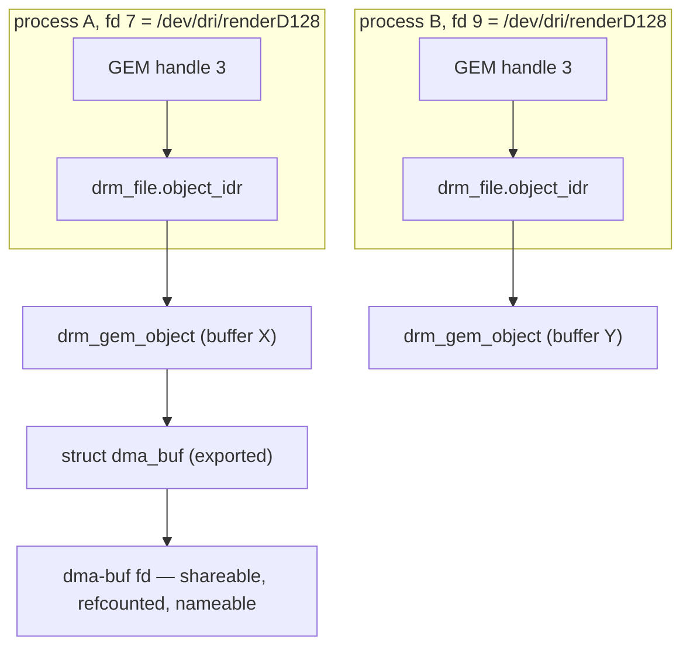

# The GPU Driver Under Linux: DRM, GEM & dma-buf

> **Goal:** read a real GPU driver without getting lost. You'll learn what the
> two device nodes in `/dev/dri` actually are, why the entire userspace
> contract is an ioctl table, how a GEM handle differs from a dma-buf file
> descriptor, and how to trace one ioctl from `ioctl()` to a register write
> that starts the hardware. By the end you will know exactly where a
> checkpoint contract can live — and where it cannot.

## Start where you can look: `/dev/dri`

`drivers/gpu/drm` is, by line count, the largest subsystem in the Linux kernel
tree, and every claim this book makes about GPUs rests on it. But you can meet
it in one command:

```bash
ls -l /dev/dri/
```

```text
total 0
drwxr-xr-x 2 root root         80 Jul 27 09:02 by-path
crw-rw----+ 1 root video  226,   0 Jul 27 09:02 card0     ← primary node
crw-rw-rw-  1 root render 226, 128 Jul 27 09:02 renderD128 ← render node
```

Three things in that listing are load-bearing.

**Major 226 is DRM.** Every DRM node shares one character-device major
([`DRM_MAJOR`](https://elixir.bootlin.com/linux/v6.12/C/ident/DRM_MAJOR) = 226).
This is the pattern from [Devices, Drivers & Modules](#/devices-modules): major
picks the driver, minor picks the instance.

**The minor numbers are not arbitrary.** In v6.12,
[drm_minor_alloc()](https://elixir.bootlin.com/linux/v6.12/C/ident/drm_minor_alloc)
in [drivers/gpu/drm/drm_drv.c](https://elixir.bootlin.com/linux/v6.12/source/drivers/gpu/drm/drm_drv.c)
allocates from `XA_LIMIT(64 * type, 64 * type + 63)`, where `type` is a value
of `enum drm_minor_type`:

```c
enum drm_minor_type {
	DRM_MINOR_PRIMARY = 0,
	DRM_MINOR_CONTROL = 1,
	DRM_MINOR_RENDER  = 2,
	DRM_MINOR_ACCEL   = 32,
};
```

So primary nodes get minors 0–63 (`card0`…), render nodes get 128–191
(`renderD128`…), and the 64–127 band belongs to a *control* node whose planned
KMS control interface was never written — the node itself was created for years
as `controlD<num>`, was removed from the kernel in v4.18, and the enum value
survives because the minor-allocation scheme is kept for backwards
compatibility (the code comment in `drm_drv.c` says exactly that). Beyond 64
devices minors are handed out dynamically from 192 upward
(`DRM_EXTENDED_MINOR_LIMIT`). `DRM_MINOR_ACCEL` is newer and lives on a
**different major** entirely, as `/dev/accel/accel*`, for compute-only
accelerators with no display at all.

**The two nodes have different groups, and that is the whole security model.**
systemd's `50-udev-default.rules` contains exactly two lines for this
subsystem:

```text
SUBSYSTEM=="drm", KERNEL!="renderD*", GROUP="video"
SUBSYSTEM=="drm", KERNEL=="renderD*", GROUP="render", MODE="{{GROUP_RENDER_MODE}}"
```

`GROUP_RENDER_MODE` is a distribution build option; systemd's upstream default
is `0666`. The primary node additionally carries a `+` in its permission
string — an ACL that logind grants to whoever is on the local seat. That is
why your desktop session can set a display mode and an SSH session cannot,
while *both* can run a compute job.

### Why the render node exists

The kernel documents the reason directly, in
[Documentation/gpu/drm-uapi.rst](https://elixir.bootlin.com/linux/v6.12/source/Documentation/gpu/drm-uapi.rst):
with the rise of offscreen rendering and GPGPU, clients no longer needed a
running compositor — but the DRM API required an unprivileged client to
*authenticate to a DRM master* before it could touch the GPU. Render nodes
removed that step. They "solely serve render clients": no modesetting, no
privileged ioctls, no DRM-master concept at all, and — crucially —
`DRM_IOCTL_GEM_OPEN` is explicitly prohibited on them.

That last prohibition is the point of the design. The old sharing mechanism,
**flink**, gave a buffer a *global* 32-bit name any client could guess and open.
Render nodes drop it and require sharing through **PRIME** file descriptors,
which are passed explicitly and cannot be guessed. Access control becomes
ordinary filesystem permissions on `/dev/dri/renderD128`.

Keep the split in your head as two different authorities:

| | `card0` (primary) | `renderD128` (render) |
|---|---|---|
| Authority | modesetting, display resources, DRM master | submit work, allocate buffers |
| Access control | seat ACL / `video` group | `render` group |
| Sharing | flink names *and* PRIME | PRIME only |
| Created when | driver sets `DRIVER_MODESET` | driver sets `DRIVER_RENDER` |
| A container needs it for | driving a screen | running CUDA/ROCm/Vulkan compute |

A GPU container that gets `renderD128` but not `card0` can compute and cannot
touch your display. That is not a convention someone agreed to; it is enforced
per-ioctl in the code you're about to read.

## What DRM manages in 2026

The name is a fossil. "Direct Rendering Manager" comes from the Direct Rendering
Infrastructure, whose job was to arbitrate between an X server and
direct-rendering clients. Today DRM is the kernel's *entire* graphics and
graphics-adjacent accelerator subsystem: display controllers (KMS — modes,
CRTCs, planes, connectors, atomic commit), 3D and compute engines, buffer
management, cross-device buffer sharing, GPU scheduling, and now compute-only
accelerators. `amdgpu`, `i915`, `xe`, `nouveau`, `msm`, `v3d`, `panfrost`,
`vc4`, `etnaviv`, `lima`, `virtio-gpu` — all DRM drivers.

A driver registers itself as a `const struct drm_driver`. The interesting
fields are few:

```c
struct drm_driver {
	/* ... callbacks: open, postclose, dumb_create, gem_prime_import, ... */
	int major, minor, patchlevel;
	char *name;
	char *desc;
	u32 driver_features;                  /* enum drm_driver_feature */
	const struct drm_ioctl_desc *ioctls;  /* the driver's private ioctls */
	int num_ioctls;
	const struct file_operations *fops;
};
```

— condensed from
[include/drm/drm_drv.h](https://elixir.bootlin.com/linux/v6.12/source/include/drm/drm_drv.h).

If you read [Just Enough C](#/prereq-c), you already recognise this: it is the
**ops table**, the same pattern as `struct file_operations` on `/dev/null` and
`vm_ops->fault` on a VMA. A GPU driver is a `struct` full of function pointers
plus an array of ioctl descriptors, and DRM core is the generic machinery that
calls them. There is nothing more mystical going on. The `driver_features`
bitmask is what decides which device nodes appear:

```c
DRIVER_GEM              = BIT(0),  /* uses the GEM memory manager */
DRIVER_MODESET          = BIT(1),  /* supports KMS -> a primary node */
DRIVER_RENDER           = BIT(3),  /* supports render nodes -> renderD* */
DRIVER_ATOMIC           = BIT(4),
DRIVER_SYNCOBJ          = BIT(5),
DRIVER_SYNCOBJ_TIMELINE = BIT(6),
DRIVER_COMPUTE_ACCEL    = BIT(7),  /* /dev/accel/accel*, mutually exclusive
                                      with RENDER and MODESET */
DRIVER_GEM_GPUVA        = BIT(8),
```

Per-device state lives in
[`struct drm_device`](https://elixir.bootlin.com/linux/v6.12/C/ident/drm_device),
which holds `->driver`, the `->primary` / `->render` / `->accel` minors, and
the locks guarding the object tables you'll meet next. Per-open state lives in
[`struct drm_file`](https://elixir.bootlin.com/linux/v6.12/C/ident/drm_file) —
one per `open()` of a node, hung off `file->private_data`, and the owner of
everything a client allocates.

## The ioctl surface *is* the contract

Here is the fact that organises everything else: **DRM has almost no
read/write interface.** You do not write commands to `/dev/dri/renderD128`.
The userspace ABI is a numbered ioctl space, and it is deliberately small,
deliberately versioned, and deliberately split in two.

```c
#define DRM_IOCTL_BASE   'd'
#define DRM_IOCTL_VERSION            DRM_IOWR(0x00, struct drm_version)
#define DRM_IOCTL_GEM_CLOSE          DRM_IOW (0x09, struct drm_gem_close)
#define DRM_IOCTL_GET_CAP            DRM_IOWR(0x0c, struct drm_get_cap)
#define DRM_IOCTL_PRIME_HANDLE_TO_FD DRM_IOWR(0x2d, struct drm_prime_handle)
#define DRM_IOCTL_PRIME_FD_TO_HANDLE DRM_IOWR(0x2e, struct drm_prime_handle)
/* ... */
#define DRM_COMMAND_BASE                0x40
#define DRM_COMMAND_END                 0xA0
```

— from
[include/uapi/drm/drm.h](https://elixir.bootlin.com/linux/v6.12/source/include/uapi/drm/drm.h),
whose comment states the rule: *"the device specific ioctl range is from 0x40
to 0x9f. Generic IOCTLS restart at 0xA0."*

So numbers `0x00`–`0x3f` and `0xA0`+ are **core DRM**, identical on every
driver. Numbers `0x40`–`0x9f` are **driver-private**: on `amdgpu` `0x40` means
one thing, on `v3d` another. A driver declares its private ioctls with
`DRM_IOCTL_DEF_DRV()`, whose expansion indexes the array by
`DRM_IOCTL_NR(cmd) - DRM_COMMAND_BASE`. That is 96 slots — the entire private
vocabulary a GPU driver is allowed.

### Dispatch, and the four permission clauses

[drm_ioctl()](https://elixir.bootlin.com/linux/v6.12/C/ident/drm_ioctl) in
[drivers/gpu/drm/drm_ioctl.c](https://elixir.bootlin.com/linux/v6.12/source/drivers/gpu/drm/drm_ioctl.c)
is the whole dispatcher, and it is short enough to read in one sitting. It
rejects anything whose ioctl type isn't `'d'` with `-ENOTTY`, then splits:

```c
is_driver_ioctl = nr >= DRM_COMMAND_BASE && nr < DRM_COMMAND_END;

if (is_driver_ioctl) {
	unsigned int index = nr - DRM_COMMAND_BASE;
	if (index >= dev->driver->num_ioctls)
		goto err_i1;
	index = array_index_nospec(index, dev->driver->num_ioctls);
	ioctl = &dev->driver->ioctls[index];
} else {
	if (nr >= DRM_CORE_IOCTL_COUNT)
		goto err_i1;
	nr = array_index_nospec(nr, DRM_CORE_IOCTL_COUNT);
	ioctl = &drm_ioctls[nr];
}
```

Two table lookups, both bounds-checked, both `array_index_nospec()`-hardened
against Spectre-v1 (see [CPU Vulnerabilities](#/cpu-mitigations)). Then it
copies the argument struct in, calls
[drm_ioctl_kernel()](https://elixir.bootlin.com/linux/v6.12/C/ident/drm_ioctl_kernel),
and copies the result back.

The permission check inside is the render-node contract in executable form:

```c
static int drm_ioctl_permit(u32 flags, struct drm_file *file_priv)
{
	/* ROOT_ONLY is only for CAP_SYS_ADMIN */
	if (unlikely((flags & DRM_ROOT_ONLY) && !capable(CAP_SYS_ADMIN)))
		return -EACCES;

	/* AUTH is only for authenticated or render client */
	if (unlikely((flags & DRM_AUTH) && !drm_is_render_client(file_priv) &&
		     !file_priv->authenticated))
		return -EACCES;

	/* MASTER is only for master or control clients */
	if (unlikely((flags & DRM_MASTER) &&
		     !drm_is_current_master(file_priv)))
		return -EACCES;

	/* Render clients must be explicitly allowed */
	if (unlikely(!(flags & DRM_RENDER_ALLOW) &&
		     drm_is_render_client(file_priv)))
		return -EACCES;

	return 0;
}
```

Read the last clause again. It is a **default-deny**: on a render node, an
ioctl is refused unless its descriptor explicitly opts in with
`DRM_RENDER_ALLOW`. Adding a new driver ioctl does not accidentally expose it
to unprivileged compute clients; a driver author has to type the flag. That is
why the core table reads the way it does:

```c
DRM_IOCTL_DEF(DRM_IOCTL_VERSION, drm_version, DRM_RENDER_ALLOW),
DRM_IOCTL_DEF(DRM_IOCTL_GET_CAP, drm_getcap, DRM_RENDER_ALLOW),
DRM_IOCTL_DEF(DRM_IOCTL_GEM_CLOSE, drm_gem_close_ioctl, DRM_RENDER_ALLOW),
DRM_IOCTL_DEF(DRM_IOCTL_GEM_FLINK, drm_gem_flink_ioctl, DRM_AUTH),
DRM_IOCTL_DEF(DRM_IOCTL_GEM_OPEN, drm_gem_open_ioctl, DRM_AUTH),
DRM_IOCTL_DEF(DRM_IOCTL_PRIME_HANDLE_TO_FD, drm_prime_handle_to_fd_ioctl, DRM_RENDER_ALLOW),
DRM_IOCTL_DEF(DRM_IOCTL_PRIME_FD_TO_HANDLE, drm_prime_fd_to_handle_ioctl, DRM_RENDER_ALLOW),
DRM_IOCTL_DEF(DRM_IOCTL_MODE_SETCRTC, drm_mode_setcrtc, DRM_MASTER),
```

FLINK and GEM_OPEN carry `DRM_AUTH` but *not* `DRM_RENDER_ALLOW`, so the
guessable-global-name path is unreachable from a render node. `SETCRTC`
carries `DRM_MASTER`, so nothing on a render node can change your display
mode. The prose in the documentation and the flags in the table are the same
statement.

### How this surface is allowed to change

DRM's uAPI stability rules are stricter than most of the kernel's, and
`drm-uapi.rst` is unusually explicit about why: any addition of DRM uAPI
requires corresponding open-source userspace patches, "the real thing" rather
than a test app, reviewed and merge-ready in a canonical upstream project
(Mesa, not a vendor fork). Without the full userspace source you cannot tell
required behaviour from accidental behaviour, so you could never safely change
the implementation again. The kernel patch must land first, because "uAPI
always flows from the kernel."

Because the ioctl numbers and struct layouts are then frozen forever, growth
happens in three disciplined ways instead: `DRM_IOCTL_VERSION`, which returns
the driver's `major`/`minor`/`patchlevel` and `name` so userspace can gate on a
driver generation; `DRM_IOCTL_GET_CAP`, a numbered capability query (does this
driver support PRIME export?); and **extension chains** — a `flags` bit plus a
user pointer to a linked list of typed structs, so new fields arrive without
changing the original struct's size. `v3d` does the last with
`DRM_V3D_SUBMIT_EXTENSION`; several drivers use the same shape.

For a checkpointer this rigidity is a gift and a warning at once. A gift:
whatever ioctls a driver exposes today will still exist and mean the same thing
years from now. A warning: **whatever state the driver does not expose through
an ioctl is state you cannot reach**, and no amount of `/proc` walking will
help.

## GEM: buffer objects, handles, and file descriptors

GPU work is mostly about buffers — vertex data, textures, framebuffers, model
weights, KV caches. The **Graphics Execution Manager** is DRM's shared
abstraction for them.

The kernel's own history of the choice, in
[Documentation/gpu/drm-mm.rst](https://elixir.bootlin.com/linux/v6.12/source/Documentation/gpu/drm-mm.rst),
is worth internalising because it explains the rest of this chapter: TTM came
first and tried to solve every graphics memory problem, producing "a large,
complex piece of code that turned out to be hard to use." GEM was a reaction —
share common code, leave the hard device-specific parts to driver ioctls. The
trade is stated flatly: GEM "has no video RAM management capabilities and is
thus limited to UMA devices."

A GEM object is
[`struct drm_gem_object`](https://elixir.bootlin.com/linux/v6.12/C/ident/drm_gem_object),
and its fields tell you everything about the lifetime model:

```c
struct drm_gem_object {
	struct kref refcount;                    /* total references */
	unsigned handle_count;                   /* userspace handles */
	struct drm_device *dev;
	struct file *filp;                       /* shmem backing store, or NULL */
	struct drm_vma_offset_node vma_node;     /* fake mmap offset */
	size_t size;
	int name;                                /* global flink name, 0 = unnamed */
	struct dma_buf *dma_buf;                 /* if exported or imported */
	struct dma_buf_attachment *import_attach;
	struct dma_resv *resv;                   /* fences guarding this buffer */
	const struct drm_gem_object_funcs *funcs;
};
```

`filp` is the plain-Linux part: `drm_gem_object_init()` creates a **shmem**
file of the requested size, so an ordinary GEM object is backed by the same
anonymous pageable memory as `tmpfs` — reclaimable, swappable, describable by
everything in [Virtual Memory](#/memory). Drivers with special requirements
(physically contiguous memory, dedicated VRAM) call
`drm_gem_private_object_init()` instead, leave `filp` NULL, and take on storage
themselves.

### A handle is an index. An fd is an object.

When a driver publishes a buffer to userspace it calls
[drm_gem_handle_create()](https://elixir.bootlin.com/linux/v6.12/C/ident/drm_gem_handle_create),
which lands in `drm_gem_handle_create_tail()`:

```c
if (obj->handle_count++ == 0)
	drm_gem_object_get(obj);

idr_preload(GFP_KERNEL);
spin_lock(&file_priv->table_lock);

ret = idr_alloc(&file_priv->object_idr, obj, 1, 0, GFP_NOWAIT);

spin_unlock(&file_priv->table_lock);
idr_preload_end();
```

The handle is `idr_alloc()`'s return value: **a small integer index into an IDR
that hangs off `struct drm_file`.** Not a pointer. Not a global identifier. An
index into a table that belongs to one `open()` of one device node in one
process. Allocation starts at 1, so handle `0` is always invalid.

Consequences, all of them mechanical. Two processes each holding GEM handle `3`
are almost certainly referring to different buffers, and neither can name the
other's. `DRM_IOCTL_GEM_CLOSE` removes the IDR entry and drops one reference;
when `handle_count` reaches zero the object may be freed. Closing the DRM fd
walks the IDR and releases every handle, so a handle can never outlive its
file. And nothing outside the process can translate the number `3` into a
buffer — not `/proc`, not another process with the same GPU open, not a
checkpointer.

Now contrast the **file descriptor**. Also a small integer index into a
per-process table — but the thing it indexes is a `struct file`, a first-class
kernel object with its own refcount, which the kernel already knows how to pass
between processes (SCM_RIGHTS), inherit across `fork()`, and *name*. Exporting
a GEM object as a dma-buf fd converts private table state into a kernel object
that exists independently of any one process. That is the whole reason the next
section matters.



## PRIME and dma-buf: making a buffer shareable

**PRIME** is DRM's name for buffer sharing built on **dma-buf**, the kernel's
subsystem-independent buffer-sharing framework. Two core ioctls, both
`DRM_RENDER_ALLOW`:

```c
#define DRM_IOCTL_PRIME_HANDLE_TO_FD    DRM_IOWR(0x2d, struct drm_prime_handle)
#define DRM_IOCTL_PRIME_FD_TO_HANDLE    DRM_IOWR(0x2e, struct drm_prime_handle)
```

**Export.**
[drm_gem_prime_handle_to_fd()](https://elixir.bootlin.com/linux/v6.12/C/ident/drm_gem_prime_handle_to_fd)
looks the handle up, and — if this object has no `dma_buf` yet — calls the
driver's export path, which for most drivers is
[drm_gem_prime_export()](https://elixir.bootlin.com/linux/v6.12/C/ident/drm_gem_prime_export).
That wraps the object in a `struct dma_buf` whose ops table is:

```c
static const struct dma_buf_ops drm_gem_prime_dmabuf_ops =  {
	.cache_sgt_mapping = true,
	.attach       = drm_gem_map_attach,
	.detach       = drm_gem_map_detach,
	.map_dma_buf  = drm_gem_map_dma_buf,
	.unmap_dma_buf = drm_gem_unmap_dma_buf,
	.release      = drm_gem_dmabuf_release,
	.mmap         = drm_gem_dmabuf_mmap,
	.vmap         = drm_gem_dmabuf_vmap,
	.vunmap       = drm_gem_dmabuf_vunmap,
};
```

The result is cached in `obj->dma_buf` so a second export returns the same
buffer, and an fd is installed. The ops table again — the exporter is the
authority on what "map this buffer" means for its hardware.

**Import.**
[drm_gem_prime_fd_to_handle()](https://elixir.bootlin.com/linux/v6.12/C/ident/drm_gem_prime_fd_to_handle)
does `dma_buf_get(prime_fd)`, then checks a per-file table
(`drm_file.prime`) for an existing handle to that same dma-buf. If found, it
returns the existing handle — which is why the uapi header warns that
userspace handling arbitrary dma-bufs "must have a user-space lookup data
structure to manually reference-count duplicated GEM handles." Otherwise it
calls the driver's `gem_prime_import`, sets `obj->dma_buf`, and creates a new
handle.

### The attachment dance

Getting an fd is not getting the memory. Between exporter and importer there
is a four-step protocol, and the reason for each step is a hardware constraint:

1. **`dma_buf_attach()`** — the importing *device* announces itself. The
   exporter now knows who will DMA from this buffer and can take that device's
   addressing limits and IOMMU domain into account before deciding where the
   memory may live.
2. **`dma_buf_map_attachment()`** — returns an `sg_table`: a scatter-gather
   list of `dma_addr_t` values, valid *for that importing device*. These are
   device addresses, not physical addresses; if an IOMMU sits in the path, the
   mapping was created there. This is the DMA API boundary covered in
   [DMA & the IOMMU](#/dma-and-iommu).
3. **`dma_buf_unmap_attachment()`** — tear the mapping down.
4. **`dma_buf_detach()`** — done.

Dynamic exporters add a fifth idea. An importer that supplies
`struct dma_buf_attach_ops` with a `move_notify` callback is telling the
exporter "you may move this buffer; call me and I will re-map." The exporter
calls `dma_buf_move_notify()` when it relocates the pages — which is precisely
what a VRAM manager needs in order to evict a shared buffer under pressure.
The core enforces the contract: `dma_buf_attach()` will `WARN_ON` an importer
that supplies ops without a `move_notify`.

### Synchronisation: dma-fence

Sharing bytes is half the problem; the other half is knowing when they are
ready. A **dma-fence** is a refcounted, one-shot completion object: created
unsignalled, signalled exactly once, never reset. Each buffer carries a
`struct dma_resv` (`obj->resv`) holding the fences currently guarding it —
conventionally one "write" fence plus a set of "read" fences. Before a driver
submits work touching a buffer it adds its own fence to that reservation and
waits on the incompatible ones. That is how a producer on one GPU and a
consumer on another agree on ordering without either knowing anything about
the other's engine.

Userspace sees fences through two doors. `struct drm_syncobj`
(`DRM_IOCTL_SYNCOBJ_*`, gated by `DRIVER_SYNCOBJ` and
`DRIVER_SYNCOBJ_TIMELINE`) is the modern container Vulkan drives. And a
dma-buf can convert directly:

```c
#define DMA_BUF_BASE                    'b'
#define DMA_BUF_IOCTL_SYNC              _IOW(DMA_BUF_BASE, 0, struct dma_buf_sync)
#define DMA_BUF_SET_NAME                _IOW(DMA_BUF_BASE, 1, const char *)
#define DMA_BUF_IOCTL_EXPORT_SYNC_FILE  _IOWR(DMA_BUF_BASE, 2, struct dma_buf_export_sync_file)
#define DMA_BUF_IOCTL_IMPORT_SYNC_FILE  _IOW(DMA_BUF_BASE, 3, struct dma_buf_import_sync_file)
```

`DMA_BUF_IOCTL_SYNC` is the CPU-access bracket: tell the exporter you are about
to read or write the buffer with the CPU so it can do cache maintenance.

### What a dma-buf looks like from outside

Since dma-bufs are `struct file`s on their own private filesystem, they show up
in the places files show up. The dentry name callback in
[drivers/dma-buf/dma-buf.c](https://elixir.bootlin.com/linux/v6.12/source/drivers/dma-buf/dma-buf.c)
formats them as `/<inode>:<name>`, where `name` is whatever
`DMA_BUF_SET_NAME` set (often empty):

```bash
ls -l /proc/$(pgrep -n compositor)/fd | grep -E 'dmabuf|dri'
```

```text
lrwx------ 1 u u 64 Jul 27 09:31 12 -> /dev/dri/renderD128   ← the device node
lrwx------ 1 u u 64 Jul 27 09:31 27 -> /dmabuf:              ← an exported buffer
lrwx------ 1 u u 64 Jul 27 09:31 28 -> /dmabuf:              ← another one
```

And in the address space, a mapped GEM buffer appears as a shared file mapping
of the *device node*, not of the dma-buf — because `mmap()` on a DRM fd uses
the fake offset in `obj->vma_node` to find the object:

```bash
grep -E 'dri|dmabuf' /proc/$(pgrep -n compositor)/maps
```

```text
7f4a1c000000-7f4a1c800000 rw-s 00000000 00:0f 1042  /dmabuf:
7f4a1d000000-7f4a1d200000 rw-s 07a00000 00:06 617   /dev/dri/renderD128
```

`rw-s` — shared, file-backed, and the "file" is a device. Compare that with the
`/dev/nvidia*` mappings in [GPU Checkpointing](#/gpu-checkpoint): same shape,
same problem. The kernel can tell you the mapping exists and how big it is. It
cannot tell you what the bytes mean, because meaning is the driver's.

Two more observation points worth knowing:

```bash
sudo cat /sys/kernel/debug/dma_buf/bufinfo       # every dma-buf, size, exporter, attachments
cat /proc/<pid>/fdinfo/<drm-fd>                  # drm-driver, drm-client-id, drm-engine-*, drm-memory-*
```

The `fdinfo` keys are a documented interface
([Documentation/gpu/drm-usage-stats.rst](https://elixir.bootlin.com/linux/v6.12/source/Documentation/gpu/drm-usage-stats.rst))
— that is where `nvtop`, `intel_gpu_top` and friends get per-client engine
utilisation and memory. More on reading them in
[GPU Observability](#/gpu-observability).

## TTM: when the memory has somewhere else to be

Everything above assumes the buffer's pages are host pages. On a discrete card
with its own VRAM, they may not be — and a buffer may need to *move*.

That is TTM, the **Translation Table Manager**. Where GEM says "here is an
object, its pages come from shmem," TTM says "here is an object, and here is a
*placement policy* describing where it is allowed to live." The vocabulary is
small:

```c
#define TTM_PL_SYSTEM   0   /* ordinary host pages, not GPU-accessible */
#define TTM_PL_TT       1   /* translation table: host pages mapped into the GPU's aperture */
#define TTM_PL_VRAM     2   /* on-device memory */
#define TTM_PL_PRIV     3   /* driver-defined */
```

A `struct ttm_placement` is an array of `struct ttm_place` entries, each naming
a memory type and flags such as `TTM_PL_FLAG_CONTIGUOUS`,
`TTM_PL_FLAG_TOPDOWN`, `TTM_PL_FLAG_DESIRED` and `TTM_PL_FLAG_FALLBACK`.
[ttm_bo_validate()](https://elixir.bootlin.com/linux/v6.12/C/ident/ttm_bo_validate)
is the verb that matters: *make this buffer satisfy this placement, now* — if
it must be in VRAM and VRAM is full, evict something else first. Each memory
type has a `ttm_resource_manager` doing the allocation and eviction inside it.
A `struct ttm_buffer_object` records its current `->resource`, and its `type`
is one of `ttm_bo_type_device`, `ttm_bo_type_kernel`, or `ttm_bo_type_sg` —
that last one being "buffer made from a dmabuf sg table shared with another
device," the import case from the previous section.

TTM is where an eviction/migration policy lives, and it is why the two managers
coexist rather than one replacing the other. Drivers for cards with their own
VRAM (`amdgpu`, `radeon`, `nouveau`, `xe`, and `i915` on the discrete/LMEM
platforms it grew TTM support for — see `drivers/gpu/drm/i915/gem/i915_gem_ttm.c`)
use GEM for the userspace-facing object model and TTM underneath for placement;
small UMA drivers (`v3d`, `panfrost`, `vc4`, `lima`) use the shmem GEM helpers
and never touch TTM.

For a checkpointer the consequence is sharp. Under plain shmem GEM, a buffer's
contents are host pages — reachable, dumpable, at worst awkward. Under TTM, a
buffer's contents may be sitting in VRAM across a PCIe bus with no `struct
page`, and the only code that knows how to bring them back is the driver's
eviction path. Reading them means asking the driver, through an ioctl, to move
them. If no such ioctl exists, the bytes are unreachable. That single sentence
is the whole reason the rest of this chapter splits AMD from NVIDIA.

## The compute path: `/dev/kfd` and a checkpoint contract in the kernel

AMD's compute stack does not run through the DRM render node's submit path. It
runs through a second character device, **`/dev/kfd`**, owned by the *Kernel
Fusion Driver*, `drivers/gpu/drm/amd/amdkfd`. There is exactly one such node
for the whole machine — `static const char kfd_dev_name[] = "kfd";` in
[kfd_chardev.c](https://elixir.bootlin.com/linux/v6.12/source/drivers/gpu/drm/amd/amdkfd/kfd_chardev.c)
— not one per GPU. A ROCm process opens `/dev/kfd` *and* a DRM render node per
GPU it uses; you can see the pairing in the uapi itself, where
`struct kfd_criu_device_bucket` carries a `drm_fd` alongside its GPU ids.

KFD has its own ioctl space, with its own base letter:

```c
#define AMDKFD_IOCTL_BASE 'K'
/* ... */
#define AMDKFD_IOC_CRIU_OP    AMDKFD_IOWR(0x22, struct kfd_ioctl_criu_args)
#define AMDKFD_COMMAND_START  0x01
#define AMDKFD_COMMAND_END    0x27
```

Look hard at `0x22`. **AMD put checkpoint/restore in the mainline kernel's
userspace ABI.** Not in a vendor tool, not behind a proprietary library — in
`include/uapi/linux/kfd_ioctl.h`, under the same stability guarantee as every
other ioctl in this chapter.

The operation is a small state machine, declared in the uapi header:

```c
enum kfd_criu_op {
	KFD_CRIU_OP_PROCESS_INFO,
	KFD_CRIU_OP_CHECKPOINT,
	KFD_CRIU_OP_UNPAUSE,
	KFD_CRIU_OP_RESTORE,
	KFD_CRIU_OP_RESUME,
};
```

and the header documents the exact sequence a checkpointer must follow:

> When checkpointing a process, the userspace application will perform:
> 1. `PROCESS_INFO` op to determine current process information. This pauses
>    execution and evicts all the queues.
> 2. `CHECKPOINT` op to checkpoint process contents (BOs, queues, events,
>    svm-ranges)
> 3. `UNPAUSE` op to un-evict all the queues
>
> When restoring a process, the CRIU userspace application will perform:
> 1. `RESTORE` op to restore process contents
> 2. `RESUME` op to start the process

`struct kfd_ioctl_criu_args` is a discovery-then-fetch interface: user pointers
for `devices`, `bos` and an opaque `priv_data` blob, plus in/out counts
(`num_devices`, `num_bos`, `num_objects`, `priv_data_size`). You call
`PROCESS_INFO` to learn the sizes, allocate, then call `CHECKPOINT` to fill
them. The kernel-side dispatcher,
[kfd_ioctl_criu()](https://elixir.bootlin.com/linux/v6.12/C/ident/kfd_ioctl_criu),
is a five-case `switch` onto `criu_process_info`, `criu_checkpoint`,
`criu_unpause`, `criu_restore` and `criu_resume` — and the ioctl descriptor
carries a dedicated flag, `KFD_IOC_FLAG_CHECKPOINT_RESTORE`.

Notice what is *inside* the contract: buffer objects, queues, events, and SVM
ranges. Not just memory — the *device-side execution state*. Queue eviction is
part of the protocol because a checkpoint of memory taken while the GPU is
still writing to it is worthless.

This is the existence proof [GPU Checkpointing](#/gpu-checkpoint) leans on.
Upstream CRIU's `amdgpu` plugin drives exactly these ioctls, and that is why it
can be upstream: no proprietary intermediary is required, because the state
transfer is a kernel ABI. The lesson generalises. *If a vendor exposes
state-transfer ioctls, checkpointing is an ordinary userspace program. If it
does not, no amount of cleverness in userspace will substitute.*

(SVM ranges appear in that list because AMD's compute stack supports shared
virtual memory backed by device page faults and page migration. That machinery
— `ZONE_DEVICE`, MMU notifiers, `migrate_vma` — is its own subject; see
[HMM & MMU Notifiers](#/hmm-and-mmu-notifiers).)

## The NVIDIA shape, told honestly

The four NVIDIA kernel modules that matter for this book are these, and knowing
which owns what is the difference between reading the right code and wasting a
weekend.

| Module | Owns |
|---|---|
| `nvidia.ko` | the core resource manager: device init, memory, contexts, channels, command submission. The `/dev/nvidiactl` and `/dev/nvidia<N>` nodes. |
| `nvidia-modeset.ko` | NVKMS, the display engine: modes, surfaces, flips. |
| `nvidia-drm.ko` | the DRM adaptation layer — registers a `struct drm_driver`, translating KMS and PRIME into NVKMS/RM calls. |
| `nvidia-uvm.ko` | Unified Virtual Memory: `/dev/nvidia-uvm`, the fault-driven CPU↔GPU migration engine behind CUDA managed memory. |

There is a fifth in the same tree, `nvidia-peermem.ko` (`kernel-open/nvidia-peermem/`),
a small shim that registers NVIDIA device memory with the Mellanox/InfiniBand
peer-memory client interface for GPUDirect RDMA. It is not on the CUDA path and
this book does not use it, but do not be surprised to find it loaded.

`open-gpu-kernel-modules` is the source release of those modules. Its README is
precise about what "open" covers. "Most of NVIDIA's kernel modules are split
into two components": an OS-agnostic component and a Linux-specific kernel
interface layer; in the binary `.run` installer the OS-agnostic part ships
prebuilt as `nv-kernel.o_binary` (for `nvidia.ko`) and
`nv-modeset-kernel.o_binary` (for `nvidia-modeset.ko`). The open repository
publishes the source for *both* halves — and for `nvidia-drm.ko` and
`nvidia-uvm.ko` there is only one half to publish, because the README states
that neither "have OS-agnostic components".

Three constraints define the picture, all from primary sources:

- **Turing or later, only.** "The NVIDIA open kernel modules can be used on any
  Turing or later GPU" (repository README). NVIDIA's announcement is the
  complement: for Maxwell, Pascal or Volta "the open-source GPU kernel modules
  are not compatible."
- **Default since R560.** NVIDIA stated the transition "in the upcoming R560
  driver release," and the datacenter driver installation guide now says
  "Starting in the 560 driver release series, the open kernel module flavor is
  the default and suggested installation." The complement, in the same
  documents: the proprietary flavour "is required for older GPUs from the
  Maxwell, Pascal, or Volta architectures," and for Grace Hopper and Blackwell
  "you must use the open-source GPU kernel modules. The proprietary drivers are
  unsupported on these platforms." NVIDIA does not publish a single
  "proprietary support ends at architecture X" statement, so do not invent one:
  what is documented is the two ends of the range, not a clean cut in the
  middle.
- **GSP firmware is required and is not source.** "The kernel modules built
  here must be used with GSP firmware and user-space NVIDIA GPU driver
  components from a corresponding [driver] release." NVIDIA's driver
  documentation defines the GSP — GPU System Processor — only functionally:
  "Some GPUs include a GPU System Processor (GSP) which can be used to offload
  GPU initialization and management tasks," used by default for all Turing and
  later GPUs, with `gsp_*.bin` images installed under
  `/lib/firmware/nvidia/<version>/`. That the GSP core is RISC-V is *not* in
  any NVIDIA driver documentation I can find; it comes from NVIDIA conference
  talks reported by third parties (RISC-V International's write-up of NVIDIA's
  "one billion RISC-V cores" talk describes a 64-bit RISC-V "Peregrine" GSP)
  and from Nouveau/NOVA developers booting it. Treat the architecture as
  well-attested but second-hand; treat the *boundary* it sits behind as the
  thing that actually matters here.

State the engineering consequence rather than an opinion: **the open modules
are open source, and a large block of the logic they used to contain now runs
as a firmware binary on the card.** The repository does ship those firmware
images — encoded in its source tree, with a Python script under `nouveau/` that
extracts them so the Nouveau driver can load and talk to GSP — but they are
binaries, not source. Whether you can *read* a given behaviour depends on
which side of the GSP boundary it fell on, and there is no public map of that
boundary.

### Why CUDA is not a render-node path

Here is the part people get wrong, and you can check it yourself.

`nvidia-drm.ko` **does** register a real DRM driver, and it **does** set
`DRIVER_RENDER`:

```c
static struct drm_driver nv_drm_driver = {
    .driver_features = /* ... */ DRIVER_GEM | DRIVER_RENDER,
    .ioctls          = nv_drm_ioctls,
    .num_ioctls      = ARRAY_SIZE(nv_drm_ioctls),
    .name            = "nvidia-drm",
    .desc            = "NVIDIA DRM driver",
};
```

So a `renderD*` node appears. But now read the ioctl table it points at. The
entries are `NVIDIA_GEM_IMPORT_NVKMS_MEMORY`, `NVIDIA_GEM_MAP_OFFSET`,
`NVIDIA_GET_DEV_INFO`, `NVIDIA_PRIME_FENCE_CONTEXT_CREATE`,
`NVIDIA_GEM_EXPORT_DMABUF_MEMORY`, `NVIDIA_GRANT_PERMISSIONS`, and a set of
CRTC/connector queries. **There is no command-submission ioctl.** The driver's
own comment states the scope: it "defaults to PRIME-only, but is upgraded to
atomic modeset if the kernel supports atomic modeset and the `modeset` kernel
module parameter is true."

`nvidia-drm` exists so that NVIDIA GPUs can participate in the Linux display
and buffer-sharing world — KMS for compositors, dma-buf import/export for
PRIME offload and Wayland. CUDA does not go through it. CUDA goes through
`/dev/nvidiactl`, `/dev/nvidia<N>` and `/dev/nvidia-uvm`, driven by
`nvidia.ko` and `nvidia-uvm.ko`, using an ioctl vocabulary defined by the
resource manager rather than by DRM.

Three tiers, kept separate:

- **Documented:** the module split, the DRM driver features and ioctl list, the
  Turing+ / R560 / GSP facts above — with the one exception flagged there, the
  GSP's instruction set, which is second-hand. Everything else is in source or
  vendor documentation you can read today.
- **Inferable:** because the CUDA path is not a DRM path, none of DRM's
  guarantees apply to it — no `DRM_RENDER_ALLOW` default-deny, no
  `DRM_IOCTL_VERSION`, no obligation to have open userspace, no per-ioctl
  stability review by the DRM maintainers. That follows from where the code
  sits, not from anyone's intentions.
- **Open question:** exactly which resource-manager operations are serviced on
  the host and which are handed to GSP firmware. Publicly unmapped, as far as I
  can find; if you need to know for a specific operation, measure it, don't
  assume.

The practical advice for anyone trying to read this code: `nvidia-drm` and
`nvidia-uvm` are ordinary Linux driver code and are worth reading. The RM's
`src/nvidia/` tree is enormous and generated in part; go there with a specific
question, never to browse.

## How to actually read a GPU driver

The method is the same for every DRM driver, and it has five steps.

1. **Find the ioctl table.** Grep the driver directory for
   `DRM_IOCTL_DEF_DRV`. That array *is* the driver's public vocabulary — every
   single thing userspace can ask it to do, in one screen.
2. **Find the `struct drm_driver`.** Read `driver_features` (which nodes exist,
   which memory manager) and the callbacks (`open`, `postclose`,
   `gem_create_object`, `gem_prime_import_sg_table`).
3. **Pick one ioctl and follow it.** Not the biggest one. The submission one.
4. **Watch the handles become objects.** Every submit ioctl starts by turning
   userspace's `u32` handles into `drm_gem_object` pointers. That is the trust
   boundary.
5. **Find the register write.** Every path ends in a store to MMIO or a
   doorbell. Stop when you find it; you now know the shape of the whole driver.

### Worked example: `v3d`, from `ioctl()` to hardware

`drivers/gpu/drm/v3d` drives the Broadcom V3D GPU in Raspberry Pi 4/5 class
chips. It is small, upstream, uncontroversially real, and its submit path is
readable end to end. Its ioctl table is 13 entries:

```c
static const struct drm_ioctl_desc v3d_drm_ioctls[] = {
	DRM_IOCTL_DEF_DRV(V3D_SUBMIT_CL, v3d_submit_cl_ioctl, DRM_RENDER_ALLOW | DRM_AUTH),
	DRM_IOCTL_DEF_DRV(V3D_WAIT_BO, v3d_wait_bo_ioctl, DRM_RENDER_ALLOW),
	DRM_IOCTL_DEF_DRV(V3D_CREATE_BO, v3d_create_bo_ioctl, DRM_RENDER_ALLOW),
	DRM_IOCTL_DEF_DRV(V3D_MMAP_BO, v3d_mmap_bo_ioctl, DRM_RENDER_ALLOW),
	DRM_IOCTL_DEF_DRV(V3D_GET_PARAM, v3d_get_param_ioctl, DRM_RENDER_ALLOW),
	/* ... GET_BO_OFFSET, SUBMIT_TFU, SUBMIT_CSD, SUBMIT_CPU, PERFMON_* ... */
};
```

Thirteen entries. That is the entire contract between Mesa and this GPU.
`.driver_features` is `DRIVER_GEM | DRIVER_RENDER | DRIVER_SYNCOBJ` — GEM with
the shmem helpers, a render node, no KMS (display is a separate `vc4` driver),
no TTM.

Now follow `DRM_IOCTL_V3D_SUBMIT_CL`, defined in the uapi header as
`DRM_IOWR(DRM_COMMAND_BASE + DRM_V3D_SUBMIT_CL, struct drm_v3d_submit_cl)` with
`DRM_V3D_SUBMIT_CL == 0x00` — so ioctl number `0x40`, the first driver-private
slot.

```mermaid
sequenceDiagram
    participant U as Mesa (userspace)
    participant C as DRM core
    participant D as v3d driver
    participant S as drm_gpu_scheduler
    participant HW as V3D hardware
    U->>C: "ioctl(fd, DRM_IOCTL_V3D_SUBMIT_CL, args)"
    C->>C: "nr=0x40 -> index 0 in dev->driver->ioctls"
    C->>C: "drm_ioctl_permit: RENDER_ALLOW | AUTH"
    C->>D: "v3d_submit_cl_ioctl(dev, data, file_priv)"
    D->>D: "v3d_lookup_bos: handles -> drm_gem_object*"
    D->>D: "v3d_job_init: fences, dma_resv"
    D->>S: "drm_sched_entity_push_job"
    S->>D: "v3d_bin_job_run(sched_job)"
    D->>HW: "V3D_CORE_WRITE(CT0QBA, start); (CT0QEA, end)"
    HW-->>D: "interrupt -> dma_fence_signal"
```

Step by step, with the file you land in at each hop:

1. **`drm_ioctl()`** — `drivers/gpu/drm/drm_ioctl.c`. `nr` is `0x40`, so
   `is_driver_ioctl` is true, `index = 0x40 - DRM_COMMAND_BASE = 0`,
   `ioctl = &dev->driver->ioctls[0]`. Argument struct copied in;
   `drm_ioctl_permit()` checks `DRM_RENDER_ALLOW | DRM_AUTH` — both satisfied
   on a render node.

2. **[v3d_submit_cl_ioctl()](https://elixir.bootlin.com/linux/v6.12/C/ident/v3d_submit_cl_ioctl)**
   — `drivers/gpu/drm/v3d/v3d_submit.c`. Its kernel-doc says what it is for:
   "Userspace provides the binner command list (if applicable), and the kernel
   sets up the render command list." It validates `args->flags` against the
   known set, walks any `DRM_V3D_SUBMIT_EXTENSION` chain, and allocates a bin
   job and a render job.

3. **`v3d_lookup_bos()`** — the trust boundary. Userspace passed an array of
   `u32` handles; this turns each into a `drm_gem_object` via
   `drm_gem_object_lookup()`, taking a reference for the lifetime of the job.
   A bogus handle fails here, cleanly, with nothing submitted. Every DRM driver
   has a function that does this; find it and you have found where userspace
   input stops being userspace input.

4. **`v3d_job_init()`** — attaches input fences (`in_sync_rcl`), sets up the
   job's own `dma_fence`, and locks the buffers' `dma_resv` reservations so
   dependencies are recorded on the buffers themselves.

5. **`v3d_push_job()`** — hands the job to the shared **DRM GPU scheduler**:

   ```c
   static void v3d_push_job(struct v3d_job *job)
   {
       drm_sched_job_arm(&job->base);
       job->done_fence = dma_fence_get(&job->base.s_fence->finished);
       kref_get(&job->refcount);          /* put by scheduler job completion */
       drm_sched_entity_push_job(&job->base);
   }
   ```

   The ioctl now returns. Nothing has touched hardware yet — the job waits in a
   scheduler queue until its fences signal. `drm_gpu_scheduler` is shared
   infrastructure: `v3d` creates one per hardware queue (bin, render, TFU, CSD,
   cache-clean, CPU) with `drm_sched_init()`, and `amdgpu`, `etnaviv`,
   `panfrost`, `lima` and others use the same code.

6. **[v3d_bin_job_run()](https://elixir.bootlin.com/linux/v6.12/C/ident/v3d_bin_job_run)**
   — `drivers/gpu/drm/v3d/v3d_sched.c`, the scheduler's `->run_job` callback.
   It invalidates caches, creates the completion fence, switches performance
   counters, and then:

   ```c
   /* Set the current and end address of the control list.
    * Writing the end register is what starts the job.
    */
   V3D_CORE_WRITE(0, V3D_CLE_CT0QBA, job->start);
   V3D_CORE_WRITE(0, V3D_CLE_CT0QEA, job->end);
   ```

   That comment is the end of the trail. A store to a memory-mapped register
   starts the GPU. Everything above it — the ioctl number, the handle table,
   the fences, the scheduler — is bookkeeping arranged so that this one store
   happens at a moment when it is safe.

7. **Completion** — the GPU raises an interrupt; the handler signals the job's
   `dma_fence`; anything waiting on that fence (`V3D_WAIT_BO`, a syncobj, a
   downstream job, another device's importer) wakes.

Now generalise. `amdgpu`'s `DRM_IOCTL_AMDGPU_CS` is enormously more elaborate,
but it has the same seven stations: dispatch, validate, resolve handles,
attach fences, schedule, ring/doorbell write, interrupt-signals-fence. Once you
have walked `v3d` you are not lost in `amdgpu`; you are looking for the local
name of a station you already know.

## The checkpointer's angle

Return to the question this book keeps asking: what does it take to freeze a
process and bring it back?

For a GPU process, the answer is now precise. Everything meaningful the process
did to the device went through an ioctl. The kernel therefore holds device
state that `/proc` cannot describe: GEM objects and their contents, queues,
fences, per-file handle tables, GPU virtual-address mappings. **The ioctl
surface is the checkpoint contract** — the exact set of operations through
which that state can be extracted and reinstated. If an operation is not in the
table, the state behind it is not reachable.

So when you meet an unfamiliar accelerator, ask three questions in this order:

1. **Can I enumerate the objects?** Is there an ioctl that lists this
   process's buffers, queues and mappings? (KFD: `KFD_CRIU_OP_PROCESS_INFO`.)
2. **Can I quiesce the device?** Is there a way to stop the hardware touching
   memory, so a snapshot is consistent? (KFD evicts queues as part of
   `PROCESS_INFO`; NVIDIA's `cuda-checkpoint` calls it `lock`.)
3. **Can I move the contents both ways?** Is there an ioctl that reads device
   memory out and writes it back? (KFD: `CHECKPOINT` / `RESTORE`.)

Answer all three "yes" and checkpointing is a normal userspace program against
a stable kernel ABI — which is exactly why CRIU's `amdgpu` plugin is upstream.
Answer any of them "no" and the capability must come from the vendor as a
userspace utility that speaks the driver's private language, which is exactly
what `cuda-checkpoint` is and why it must exist.

That is the door. [GPU Checkpointing](#/gpu-checkpoint) is on the other side of
it: `cuda-checkpoint`'s state machine, CRIU's plugin hooks, and where the
public record runs out.

## Follow the code (kernel v6.12)

- **Device nodes and minors:**
  [drm_minor_alloc()](https://elixir.bootlin.com/linux/v6.12/C/ident/drm_minor_alloc)
  and `DRM_MINOR_LIMIT` in
  [drivers/gpu/drm/drm_drv.c](https://elixir.bootlin.com/linux/v6.12/source/drivers/gpu/drm/drm_drv.c);
  `enum drm_minor_type` in
  [include/drm/drm_file.h](https://elixir.bootlin.com/linux/v6.12/source/include/drm/drm_file.h).
- **The ioctl dispatcher:**
  [drm_ioctl()](https://elixir.bootlin.com/linux/v6.12/C/ident/drm_ioctl),
  [drm_ioctl_kernel()](https://elixir.bootlin.com/linux/v6.12/C/ident/drm_ioctl_kernel)
  and `drm_ioctl_permit()` in
  [drivers/gpu/drm/drm_ioctl.c](https://elixir.bootlin.com/linux/v6.12/source/drivers/gpu/drm/drm_ioctl.c);
  the flags in
  [include/drm/drm_ioctl.h](https://elixir.bootlin.com/linux/v6.12/source/include/drm/drm_ioctl.h);
  the numbers in
  [include/uapi/drm/drm.h](https://elixir.bootlin.com/linux/v6.12/source/include/uapi/drm/drm.h).
- **The driver ops table:**
  [struct drm_driver](https://elixir.bootlin.com/linux/v6.12/C/ident/drm_driver)
  and `enum drm_driver_feature` in
  [include/drm/drm_drv.h](https://elixir.bootlin.com/linux/v6.12/source/include/drm/drm_drv.h).
- **GEM objects and handles:**
  [struct drm_gem_object](https://elixir.bootlin.com/linux/v6.12/C/ident/drm_gem_object)
  in [include/drm/drm_gem.h](https://elixir.bootlin.com/linux/v6.12/source/include/drm/drm_gem.h);
  [drm_gem_handle_create()](https://elixir.bootlin.com/linux/v6.12/C/ident/drm_gem_handle_create),
  [drm_gem_object_lookup()](https://elixir.bootlin.com/linux/v6.12/C/ident/drm_gem_object_lookup),
  [drm_gem_handle_delete()](https://elixir.bootlin.com/linux/v6.12/C/ident/drm_gem_handle_delete)
  in [drivers/gpu/drm/drm_gem.c](https://elixir.bootlin.com/linux/v6.12/source/drivers/gpu/drm/drm_gem.c);
  the shmem model in
  [drivers/gpu/drm/drm_gem_shmem_helper.c](https://elixir.bootlin.com/linux/v6.12/source/drivers/gpu/drm/drm_gem_shmem_helper.c).
- **PRIME:**
  [drm_gem_prime_handle_to_fd()](https://elixir.bootlin.com/linux/v6.12/C/ident/drm_gem_prime_handle_to_fd),
  [drm_gem_prime_fd_to_handle()](https://elixir.bootlin.com/linux/v6.12/C/ident/drm_gem_prime_fd_to_handle)
  and `drm_gem_prime_dmabuf_ops` in
  [drivers/gpu/drm/drm_prime.c](https://elixir.bootlin.com/linux/v6.12/source/drivers/gpu/drm/drm_prime.c).
- **dma-buf:**
  [dma_buf_export()](https://elixir.bootlin.com/linux/v6.12/C/ident/dma_buf_export),
  [dma_buf_attach()](https://elixir.bootlin.com/linux/v6.12/C/ident/dma_buf_attach),
  [dma_buf_map_attachment()](https://elixir.bootlin.com/linux/v6.12/C/ident/dma_buf_map_attachment),
  [dma_buf_move_notify()](https://elixir.bootlin.com/linux/v6.12/C/ident/dma_buf_move_notify)
  in [drivers/dma-buf/dma-buf.c](https://elixir.bootlin.com/linux/v6.12/source/drivers/dma-buf/dma-buf.c);
  the uapi in
  [include/uapi/linux/dma-buf.h](https://elixir.bootlin.com/linux/v6.12/source/include/uapi/linux/dma-buf.h).
- **TTM:** placement vocabulary in
  [include/drm/ttm/ttm_placement.h](https://elixir.bootlin.com/linux/v6.12/source/include/drm/ttm/ttm_placement.h);
  [ttm_bo_validate()](https://elixir.bootlin.com/linux/v6.12/C/ident/ttm_bo_validate)
  and `struct ttm_buffer_object` in
  [include/drm/ttm/ttm_bo.h](https://elixir.bootlin.com/linux/v6.12/source/include/drm/ttm/ttm_bo.h).
- **AMD's checkpoint ABI:** `enum kfd_criu_op`, `struct kfd_ioctl_criu_args`
  and `AMDKFD_IOC_CRIU_OP` in
  [include/uapi/linux/kfd_ioctl.h](https://elixir.bootlin.com/linux/v6.12/source/include/uapi/linux/kfd_ioctl.h);
  [kfd_ioctl_criu()](https://elixir.bootlin.com/linux/v6.12/C/ident/kfd_ioctl_criu)
  in [drivers/gpu/drm/amd/amdkfd/kfd_chardev.c](https://elixir.bootlin.com/linux/v6.12/source/drivers/gpu/drm/amd/amdkfd/kfd_chardev.c).
- **The worked example:**
  [v3d_submit_cl_ioctl()](https://elixir.bootlin.com/linux/v6.12/C/ident/v3d_submit_cl_ioctl)
  in [drivers/gpu/drm/v3d/v3d_submit.c](https://elixir.bootlin.com/linux/v6.12/source/drivers/gpu/drm/v3d/v3d_submit.c),
  the ioctl table in
  [drivers/gpu/drm/v3d/v3d_drv.c](https://elixir.bootlin.com/linux/v6.12/source/drivers/gpu/drm/v3d/v3d_drv.c),
  and
  [v3d_bin_job_run()](https://elixir.bootlin.com/linux/v6.12/C/ident/v3d_bin_job_run)
  in [drivers/gpu/drm/v3d/v3d_sched.c](https://elixir.bootlin.com/linux/v6.12/source/drivers/gpu/drm/v3d/v3d_sched.c).

## Try it yourself

Everything here works on any machine with a GPU, integrated or discrete. The
`/dev/kfd` step needs an AMD card with ROCm; there is no fallback for it — read
the uapi header instead, which is the point of the exercise anyway.

```bash
# 1. The two nodes, their majors and minors, their groups.
ls -l /dev/dri/
ls -l /dev/dri/by-path/            # stable names, one symlink pair per GPU
stat -c '%n %t:%T %G %a' /dev/dri/*

# 2. Which driver is behind each minor, straight from sysfs.
for d in /sys/class/drm/*/device/driver; do
  printf '%-24s %s\n' "$d" "$(basename "$(readlink -f "$d")")"
done

# 3. What the driver says about itself (needs libdrm's utilities).
sudo drm_info 2>/dev/null | head -40      # or: modetest -c   (from libdrm-tests)

# 4. Who has the GPU open right now.
sudo lsof /dev/dri/renderD128 2>/dev/null | head

# 5. Per-client engine and memory usage — the documented fdinfo interface.
pid=$(pgrep -n gnome-shell || pgrep -n Xorg)
for fd in /proc/$pid/fd/*; do
  case "$(readlink "$fd")" in /dev/dri/*)
    sudo cat "/proc/$pid/fdinfo/$(basename "$fd")" ;;
  esac
done

# 6. Every dma-buf in the system: size, exporter, attachment count.
sudo mount -t debugfs none /sys/kernel/debug 2>/dev/null
sudo cat /sys/kernel/debug/dma_buf/bufinfo | head -30

# 7. AMD only: is the compute node present, and who can use it?
ls -l /dev/kfd && ls /sys/class/kfd/kfd/topology/nodes/
```

Then read one thing in the source tree. Pick any driver under
`drivers/gpu/drm/`, grep for `DRM_IOCTL_DEF_DRV`, and count the entries. That
number is how much of the machine you have to understand to understand the
driver's contract with the world.

## Check your understanding

1. Your container has `/dev/dri/renderD128` bind-mounted but not
   `/dev/dri/card0`. A Vulkan compute job runs fine; a program that tries to
   change the display mode gets `-EACCES`. Point at the code that produced
   that errno.

<details><summary>Show answer</summary>

`drm_ioctl_permit()` in `drivers/gpu/drm/drm_ioctl.c`. `DRM_IOCTL_MODE_SETCRTC`
is declared with the `DRM_MASTER` flag, and the third clause rejects it unless
`drm_is_current_master(file_priv)` — a render-node client is never a master,
because render nodes drop the DRM-master concept entirely. The fourth clause
would also catch it: modesetting ioctls do not carry `DRM_RENDER_ALLOW`, and
any ioctl without that flag is refused outright for a render client. The
container's device allowlist decided which node exists; the per-ioctl flags
decided what that node can do.

</details>

2. Why can a GEM handle never be meaningfully checkpointed and restored on its
   own, while a dma-buf fd at least *could* be?

<details><summary>Show answer</summary>

A GEM handle is an integer index allocated by `idr_alloc()` into
`drm_file.object_idr` — a table hanging off one `open()` of one device node.
It has no existence outside that `struct drm_file`; nothing in `/proc` maps it
to anything, and re-creating the number on restore would index into a table
that has never heard of the buffer. A dma-buf fd, by contrast, indexes a real
`struct file` backed by a `struct dma_buf` kernel object with its own refcount,
ops table and lifetime. That object survives independently of any one process,
can be passed over SCM_RIGHTS, and can in principle be re-created and re-bound
by a restorer — provided the driver exposes ioctls to reconstruct the
underlying buffer's contents, which is the separate and harder half of the
problem.

</details>

3. A new driver adds a private ioctl at `DRM_COMMAND_BASE + 12` and forgets to
   write any flags in its `DRM_IOCTL_DEF_DRV()` entry. What happens on the
   render node, and is that a bug or the design working?

<details><summary>Show answer</summary>

Every call on a render node fails with `-EACCES`. `drm_ioctl_permit()`'s last
clause refuses any ioctl that does *not* have `DRM_RENDER_ALLOW` when the
caller is a render client, so an unflagged entry is default-denied. That is the
design working: exposure to unprivileged compute clients requires an author to
deliberately type the flag, so a new ioctl can never leak onto render nodes by
omission. The failure is loud and immediate, which is exactly what you want
from a security default.

</details>

4. Explain why `dma_buf_attach()` exists as a separate step instead of
   `dma_buf_map()` doing everything, in terms of what the exporter learns.

<details><summary>Show answer</summary>

Attachment tells the exporter *which device* will access the buffer, before
any placement decision is made. That device has addressing limits, an IOMMU
domain, and possibly coherency constraints, and the exporter may have to move
or reallocate the buffer to satisfy them. Only after attachment can
`dma_buf_map_attachment()` return an `sg_table` of `dma_addr_t` values that are
correct *for that importer* — device addresses produced through the DMA API,
not physical addresses. Separating the two also enables dynamic exporters: an
importer that registers `move_notify` in its `dma_buf_attach_ops` lets the
exporter relocate the buffer later and ask the importer to re-map, which is how
a VRAM manager evicts a shared buffer under pressure.

</details>

5. Two drivers both expose a GEM object of the same size. One is `v3d`, one is
   `amdgpu` on a discrete card. Why is reading that buffer's contents from
   outside the process a different kind of problem in each case?

<details><summary>Show answer</summary>

`v3d` uses the shmem GEM helpers: the object's `filp` is an shmem file, so its
contents are ordinary host pages — swappable, reclaimable, and reachable by
normal memory machinery. `amdgpu` uses TTM underneath GEM, so the object has a
*placement* and its current `ttm_resource` may be in `TTM_PL_VRAM` — on-device
memory across a PCIe bus, with no `struct page` and no host mapping. Getting
the bytes means asking the driver to migrate or copy them, which only the
driver's eviction path knows how to do. In the first case memory management
gets you there; in the second, only an ioctl does.

</details>

6. What exactly makes CRIU's `amdgpu` plugin upstreamable when the CUDA one
   depends on a vendor binary? Name the mechanism, not the company.

<details><summary>Show answer</summary>

`AMDKFD_IOC_CRIU_OP` in `include/uapi/linux/kfd_ioctl.h`. AMD placed the
state-transfer operations — `PROCESS_INFO`, `CHECKPOINT`, `UNPAUSE`, `RESTORE`,
`RESUME`, covering buffer objects, queues, events and SVM ranges — in the
mainline kernel's userspace ABI, under the same stability guarantee as every
other ioctl. Any userspace program may call them, so the plugin needs no
proprietary intermediary. NVIDIA's compute path has no equivalent published
ioctl, so the ability to extract device state exists only inside a vendor
utility that knows the driver's private language. The distinction is where the
contract lives, not who wrote it.

</details>

7. `nvidia-drm.ko` sets `DRIVER_RENDER`, so a `renderD*` node exists for an
   NVIDIA GPU. Why does that not mean CUDA runs over a DRM render node?

<details><summary>Show answer</summary>

Because the node's capability is defined by the driver's ioctl table, and
`nv_drm_ioctls[]` contains no command-submission entry — it holds GEM import
and export for NVKMS memory and dmabuf, mmap offsets, device info, PRIME fence
contexts, permission grants, and CRTC/connector queries. The driver's own
comment describes its scope as "PRIME-only," upgraded to atomic modeset when
the `modeset` module parameter is set. `nvidia-drm` exists so NVIDIA GPUs can
take part in KMS and dma-buf sharing. CUDA submits work through
`/dev/nvidiactl`, `/dev/nvidia<N>` and `/dev/nvidia-uvm`, served by `nvidia.ko`
and `nvidia-uvm.ko` with a resource-manager ioctl vocabulary that is not DRM's
— so none of DRM's per-ioctl permission model, versioning, or open-userspace
review applies to it.

</details>

8. You are handed an unfamiliar accelerator driver, 40,000 lines, no
   documentation. Describe your first hour.

<details><summary>Show answer</summary>

Grep for `DRM_IOCTL_DEF_DRV` and read the ioctl table — that is the driver's
entire public vocabulary, usually one screen. Read the `struct drm_driver` for
`driver_features` (which nodes it creates, whether it uses TTM or shmem GEM)
and its callbacks. Then pick the submission ioctl and follow it: find where
`u32` handles become `drm_gem_object` pointers via `drm_gem_object_lookup()`
(the trust boundary), where fences are attached to the buffers' `dma_resv`,
where the job is pushed to `drm_gpu_scheduler`, and finally the `->run_job`
callback that writes a register or rings a doorbell. Seven stations, the same
in every DRM driver. Everything else in the 40,000 lines is a specialisation of
something you have now seen.

</details>

## Sources & further reading

- [Documentation/gpu/drm-uapi.rst](https://elixir.bootlin.com/linux/v6.12/source/Documentation/gpu/drm-uapi.rst)
  — the authoritative statement on render nodes, the primary/DRM-master model,
  and the open-source-userspace requirement for any new DRM uAPI.
- [Documentation/gpu/drm-mm.rst](https://elixir.bootlin.com/linux/v6.12/source/Documentation/gpu/drm-mm.rst)
  — the GEM/TTM history and division of labour, GEM object lifetime, and why
  handles, flink names and fds are three different things.
- [Documentation/gpu/drm-usage-stats.rst](https://elixir.bootlin.com/linux/v6.12/source/Documentation/gpu/drm-usage-stats.rst)
  — the `drm-driver` / `drm-client-id` / `drm-engine-*` / `drm-memory-*` fdinfo
  keys that GPU monitoring tools read.
- [Documentation/driver-api/dma-buf.rst](https://elixir.bootlin.com/linux/v6.12/source/Documentation/driver-api/dma-buf.rst)
  — the exporter/importer contract, dynamic attachments and `move_notify`,
  dma-fence and `dma_resv` rules.
- [drm_ioctl.c](https://elixir.bootlin.com/linux/v6.12/source/drivers/gpu/drm/drm_ioctl.c)
  and [drm_ioctl.h](https://elixir.bootlin.com/linux/v6.12/source/include/drm/drm_ioctl.h)
  — the dispatcher, the core ioctl table, and the four permission clauses. The
  single most useful file in the subsystem for a newcomer.
- [include/uapi/linux/kfd_ioctl.h](https://elixir.bootlin.com/linux/v6.12/source/include/uapi/linux/kfd_ioctl.h)
  — AMD KFD's ioctl space, including the CRIU op enum and the documented
  checkpoint/restore sequence.
- [NVIDIA/open-gpu-kernel-modules](https://github.com/NVIDIA/open-gpu-kernel-modules)
  — the module split, the OS-agnostic vs kernel-interface-layer structure, the
  Turing-or-later requirement, and the statement that the modules must be used
  with GSP firmware from a matching driver release.
- [NVIDIA: Transitioning Fully Towards Open-Source GPU Kernel Modules](https://developer.nvidia.com/blog/nvidia-transitions-fully-towards-open-source-gpu-kernel-modules/)
  — R560 as the default switch, which architectures are supported, and the
  open-modules-only requirement for Grace Hopper and Blackwell.
- [NVIDIA Driver Installation Guide: Kernel Modules](https://docs.nvidia.com/datacenter/tesla/driver-installation-guide/kernel-modules.html)
  — "Starting in the 560 driver release series, the open kernel module flavor is
  the default and suggested installation," open modules "supported only on
  Turing and newer generations," and proprietary "required for older GPUs from
  the Maxwell, Pascal, or Volta architectures."
- [NVIDIA driver README: GSP Firmware](https://download.nvidia.com/XFree86/Linux-x86_64/570.169/README/gsp.html)
  — what the GPU System Processor offloads, that it is used by default on
  Turing and later, and where `gsp_*.bin` is installed. Note what it does *not*
  say: nothing about the GSP's instruction set.
- [RISC-V International: how NVIDIA shipped one billion RISC-V cores](https://riscv.org/blog/how-nvidia-shipped-one-billion-risc-v-cores-in-2024/)
  — a third-party write-up of an NVIDIA talk, and the best public support for
  "the GSP is a RISC-V core." Secondary, not vendor documentation; cited here so
  you can see exactly how thin that particular thread is.
- [freedesktop.org DRM documentation index](https://dri.freedesktop.org/docs/drm/gpu/index.html)
  — the rendered kernel GPU docs, easier to browse than the `.rst` sources.
- Keith Packard & Eric Anholt, "GEM — the Graphics Execution Manager"
  ([LWN coverage](https://lwn.net/Articles/283798/)) — the original design
  argument for handles-and-ioctls over TTM's one-size-fits-all API. Dated in
  detail, still the clearest explanation of *why*.

---

**Next:** you now know where a GPU's state lives and which ioctls can reach it.
[GPU Checkpointing](#/gpu-checkpoint) takes that contract and asks the hard
question: can you freeze a running CUDA process and bring it back? For the
memory side of the same hardware — device page faults, `ZONE_DEVICE` and
migration — see [HMM & MMU Notifiers](#/hmm-and-mmu-notifiers).
