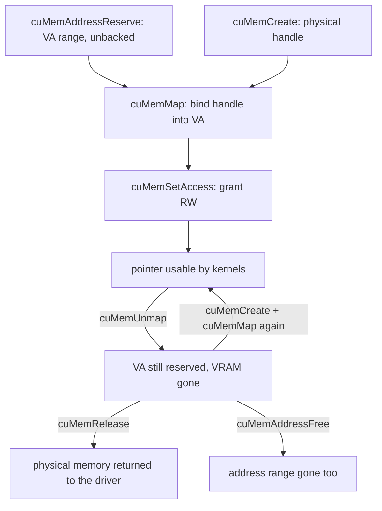

# Where VRAM Goes: Allocators, the VMM API & Engine Memory

> **Goal:** be able to answer "where did my 80 GB of VRAM go, and who is
> allowed to give it back?" You will learn why `cudaMalloc` is nothing like
> `malloc`, how CUDA's virtual memory management API separates address
> reservation from physical backing exactly the way `mmap` does, how PyTorch's
> caching allocator and vLLM's memory model are built on top of that, and why
> `nvidia-smi`, the framework, and your own accounting all report different
> numbers — each of them correctly.

## `cudaMalloc` is not `malloc`

Start with the observation that sends people to forums. `nvidia-smi` says your
process is using 78 GiB. `torch.cuda.memory_allocated()` says 41 GiB.
`torch.cuda.memory_reserved()` says 74 GiB. Nobody is lying, nobody is broken,
and until you know what each number measures you cannot debug a single
out-of-memory error.

The confusion begins one layer down, with the allocation call itself.

In [Virtual Memory](#/memory) you learned that `malloc()` is not a syscall. It
is a userspace allocator carving chunks out of a heap that is already mapped,
asking the kernel for more address space only occasionally, and even then
getting only a *promise* — a VMA — with physical pages arriving lazily on first
touch. The cheapness of `malloc` comes from two tricks: most calls never reach
the kernel, and the ones that do never move a byte of RAM.

`cudaMalloc()` has neither trick. Every call is a round trip into the
proprietary driver through an `ioctl()` on `/dev/nvidiactl` and `/dev/nvidia0`
(see [GPU Drivers](#/gpu-drivers)). The driver finds physical device memory,
commits it, programs the GPU's own page tables so the returned device virtual
address is backed, and returns. There is no lazy faulting: when the call
returns, the VRAM is *yours and resident*. And the paired `cudaFree()` is
worse. Before the driver can reclaim device memory it must know that no kernel
is still reading it, and the only way it knows that is to wait. NVIDIA's
description of the pre-CUDA-11.2 world is blunt: these are "global-scope
operations that synchronize the entire device," and, in the CUDA Programming
Guide's own words, "managing memory allocations using `cudaMalloc` and
`cudaFree` causes the GPU to synchronize across all executing CUDA streams."
The stream-ordered-allocator blog puts the same thing concretely: "the first
`cudaFree` call has to wait for *kernelA* to finish, so it synchronizes the
device before freeing the memory."

A transformer layer's forward pass allocates and frees dozens of intermediate
tensors; multiply by 80 layers and thousands of steps and a naive framework
would insert tens of thousands of device-wide barriers per epoch, each draining
every stream on the card to free a buffer nothing was using.

This is why *no* serious framework calls `cudaMalloc` on the hot path. They all
do what you would do: call it rarely, in big chunks, and manage the chunks
themselves. The rest of this chapter is the two mechanisms CUDA provides to
make that manageable, and the two layers of software — framework and engine —
built on them.

## Reservation is not backing: the CUDA VMM API

This is the intellectual centre of the chapter, and the best way in is an
analogy the course has already taught you.

Consider this on the host:

```c
void *p = mmap(NULL, 8UL << 30, PROT_READ | PROT_WRITE,
               MAP_ANONYMOUS | MAP_PRIVATE | MAP_NORESERVE, -1, 0);
```

Eight gibibytes, returned instantly, with not one physical page moved. The
kernel wrote a `vm_area_struct` and stopped. Pages appear on first touch, one
minor fault at a time. And crucially, `madvise(p, len, MADV_DONTNEED)` throws
those pages away again — the physical memory goes back to the buddy allocator,
while `p` and every pointer derived from it stay perfectly valid. Touch the
range again and fresh zero pages appear.

That is the whole idea: **address space and physical memory are separate
resources with separate lifetimes.** A VMA is a claim on addresses; a
`struct page` is a claim on RAM; the PTE is the revocable link between them.

Classic `cudaMalloc` fuses the two. You get an address *and* the backing, and
you cannot have one without the other. CUDA's **virtual memory management
API** (driver API, CUDA 10.2 and later) unfuses them, and the correspondence to
the Linux calls you already know is almost one-to-one:

| CUDA driver call | What it does | Linux analogue |
|---|---|---|
| `cuMemAddressReserve` | reserve a device VA range, no backing | `mmap(..., PROT_NONE)` |
| `cuMemCreate` | commit physical memory, return a handle | the buddy allocator handing you frames |
| `cuMemMap` | bind a handle into a reserved VA range | filling in the PTEs |
| `cuMemSetAccess` | grant read/write to specific devices | `mprotect` |
| `cuMemUnmap` | drop the backing, keep the reservation | `madvise(MADV_DONTNEED)` |
| `cuMemRelease` | drop the last reference to the physical handle | freeing the frames |
| `cuMemAddressFree` | return the address range | `munmap` |

The properties are explicit rather than implied. `cuMemCreate` takes a
`CUmemAllocationProp` whose `location.type` is `CU_MEM_LOCATION_TYPE_DEVICE`
and whose `location.id` names the GPU; `cuMemSetAccess` takes a
`CUmemAccessDesc` carrying `CU_MEM_ACCESS_FLAGS_PROT_READWRITE`. Sizes and
offsets must be multiples of what
`cuMemGetAllocationGranularity(..., CU_MEM_ALLOC_GRANULARITY_MINIMUM)` reports
— the device's page size, in the same sense that `getconf PAGE_SIZE` reports
the host's. PyTorch's allocator comment puts a number on it from the other
side: "This can work at the granularity of GPU pages which are 2MiB currently."
(That is PyTorch's statement about the hardware, not a reading of
`cuMemGetAllocationGranularity`, which the allocator never calls.) The
coincidence with x86-64's huge page size is a coincidence and nothing more.



Read the two paths out of `R2` in that diagram, because the difference between
them is the point of this entire chapter. `cuMemUnmap` + `cuMemRelease` gives
the *memory* back. `cuMemAddressFree` gives the *address* back. **You can do the
first without the second.** A process can hand every byte of its device memory
back to the driver, let another process use the card, then take memory again
and remap it at exactly the addresses it was using before — with every pointer
it ever handed out still valid.

Hold onto that sentence. It is the mechanism behind expandable segments, behind
vLLM's sleep mode, and behind every "release VRAM without restarting" feature
you will meet.

### The safety you gave up

`cudaFree` synchronized the device for you, and that was a feature disguised as
a cost. The VMM calls do not. NVIDIA states plainly that you "can't assume that
prior work synchronizes during a call to `cuMemUnmap` or `cuMemSetAccess`."

Unmapping device memory while a kernel is still reading it is the exact CUDA
analogue of `munmap`ing a buffer a DMA engine is writing into — the failure
mode discussed in [DMA, Coherence & the IOMMU](#/dma-and-iommu), with the roles
of host and device swapped. You do not get a clean error; you get whatever the
hardware does with a translation that vanished mid-flight.

This is not hypothetical. vLLM's allocator carries the scar in a comment —
in `vllm/device_allocator/cumem.py`, inside
`CuMemAllocator._python_free_callback`, not in the C extension it guards. The
callback calls `torch.cuda.synchronize()` before the extension unmaps, because
without it "in-flight work (e.g. quant helpers' transient tensors during weight
loading) races the unmap and surfaces as `CUDA_ERROR_ILLEGAL_ADDRESS`." When you
take the mapping into your own hands, the ordering is yours to prove.

## Stream-ordered allocation

The VMM API is the *powerful* escape from `cudaMalloc`. CUDA 11.2 added a
*convenient* one: `cudaMallocAsync` and `cudaFreeAsync`, which make allocation
an operation in a stream rather than on the device. In NVIDIA's words they
"shift memory allocation from global-scope operations that synchronize the
entire device to stream-ordered operations that enable you to compose memory
management with GPU work submission." A `cudaFreeAsync` enqueued behind a
kernel does not wait for that kernel now; it becomes a node in the stream's
timeline that takes effect when the stream reaches it.

Underneath sits a **memory pool** (`cudaMemPool_t`). Every `cudaMallocAsync`
draws from one — the stream's device's current pool unless you name another —
and a freed allocation returns to the pool rather than to the driver. Retrieve
the default with `cudaDeviceGetDefaultMemPool`; install your own with
`cudaDeviceSetMemPool`. (Capital `P` — the Programming Guide prose spells it
"Mempool", the header and the API reference spell it `MemPool`, and only one of
those compiles.)

The knob worth knowing is `cudaMemPoolAttrReleaseThreshold`: how many bytes the
pool holds before trying to return memory to the OS. The documented default is
**0**, so unused pool memory is released back to the OS at every
synchronization point — and if you allocate again, you pay the driver cost
again. Raise the threshold (`UINT64_MAX` effectively disables shrinking) and,
NVIDIA reports, "this requires only simple bookkeeping and makes the
performance of `cudaMallocAsync` independent of the size of the allocation."
`cudaMemPoolTrimTo(pool, minBytesToKeep)` releases the surplus explicitly when
you do want it back.

What stream-ordering buys: no device-wide barrier, and allocation that composes
with the work graph. What it costs: when accessing an allocation "from a stream
other than the stream that made the allocation, the user must guarantee that
the access occurs after the allocation operation, otherwise the behavior is
undefined" — and the pool is a *second* cache that neither the OS nor
`nvidia-smi` can see through. PyTorch exposes this path as `backend:cudaMallocAsync`, but it
is not the default, and the next two sections are why.

## Pinned host memory, and its kernel-side bill

One detour, because it is where the GPU story reaches back into the kernel.

`cudaHostAlloc()` / `cudaFreeHost()` allocate page-locked host memory;
`cudaHostRegister()` / `cudaHostUnregister()` page-lock a range you already got
from `malloc`. Page-locked buffers are what make asynchronous host↔device copies
possible, so every fast data path uses them.

The consequence frameworks gloss over is that those pages become **unmovable
and unreclaimable**. They cannot be swapped, cannot be migrated by compaction,
and do not participate in the LRU reclaim you met in
[Virtual Memory](#/memory). NVIDIA's Runtime API reference warns, under
`cudaHostAlloc`, that "allocating excessive amounts of pinned memory may
degrade system performance, since it reduces the amount of memory available to
the system for paging." The Best Practices Guide adds the operational version:
"Pinned memory should not be overused. Excessive use can reduce overall system
performance because pinned memory is a scarce resource, but how much is too
much is difficult to know in advance." (Older editions of the Programming Guide
put it more sharply — page-locked memory "is a scarce resource however, so
allocations in page-locked memory will start failing long before allocations in
pageable memory" — a sentence that did not survive the 13.x restructure, so
quote it as archived rather than current.)

The kernel machinery — `pin_user_pages()`, `FOLL_LONGTERM`, and why long-term
pins fight the memory management subsystem — belongs to
[DMA, Coherence & the IOMMU](#/dma-and-iommu). What matters *here* is the
accounting. When you read below that vLLM's level-1 sleep "offloads weights to
CPU RAM," understand that the destination is pinned pages: offloading 140 GiB
of weights takes 140 GiB of host memory the kernel can no longer reclaim under
pressure. (Pinned wherever pinning is available — vLLM allocates the backup
tensor with `pin_memory=PIN_MEMORY`, a runtime probe that is true on ordinary
CUDA-on-Linux and false only on old WSL2 kernels.)
PyTorch's `pinned_use_cuda_host_register` and
`pinned_num_register_threads` options exist because page-locking that much
memory is slow enough to want parallelised.

## The framework layer: PyTorch's caching allocator

*Everything in this section and the next was read against PyTorch and vLLM
`main` in **2026-07**. These are the two fastest-moving things in this book:
constants get renamed, options get added, defaults drift. Treat every named
identifier below as a pointer into the source rather than as a fact with a long
shelf life, and re-check before you rely on one.*

PyTorch does exactly what the first section predicted: it calls `cudaMalloc`
rarely and in big chunks, and manages the chunks itself. The allocator lives in
`c10/cuda/CUDACachingAllocator.cpp`, described by a comment block at the top of
the file worth reading in the original. The size constants it uses have since
been hoisted out into the device-agnostic `c10/core/AllocatorConfig.h`, which
is where you should look for them.

Two object levels. A **segment** is what came back from one `cudaMalloc`. A
**block** is a range inside a segment that a tensor got. Blocks are split off
segments and coalesced back when neighbours are free — the buddy allocator's
idea, applied to a much smaller and more adversarial address range.

The size classes are concrete, and explain a lot of otherwise mysterious
behaviour (constants from `c10/core/AllocatorConfig.h`):

- Minimum block size is 512 bytes (`kMinBlockSize`); every request rounds up.
- Requests up to 1 MiB (`kSmallSize`) come from the **small pool** and are
  packed into 2 MiB buffers (`kSmallBuffer`).
- Requests from 1 MiB to 10 MiB (`kMinLargeAlloc`) allocate and split a large
  segment — 20 MiB by default, tunable via `large_segment_size_mb`.
- Above that, the segment size is the request rounded up to a multiple of
  2 MiB (`kRoundLarge`).

Freed blocks go back to the pool's free list, keyed by stream. The allocator's
own summary of the reuse rule: "Allocations are associated with a stream. Once
freed, blocks can be re-allocated on the same stream, but not on any other
stream." That is not bookkeeping fussiness — it is the stream-ordering
correctness problem from the previous section, solved conservatively.

When `cudaMalloc` finally fails, the allocator does not give up at once. On
current `main` it tries, in order: an opted-in overflow mempool, if one was
registered; then `release_available_cached_blocks()`, which frees cached blocks
at or above `max_split_size` and retries — a step that is a **no-op unless you
set `max_split_size_mb`**, because it returns immediately when `max_split_size`
is its default `SIZE_MAX`; then, unless a CUDA graph capture is in progress,
`release_cached_blocks()`, which frees *all* non-split cached blocks and
retries. Only then does it raise `OutOfMemoryError`. The retry count is visible
as `num_alloc_retries`, and a rising value is a reliable early warning that you
are running close to the edge. (Note the consequence of the middle step's
default: on a stock configuration the allocator effectively has only the
all-or-nothing fallback.)

### Why nothing is ever given back

Deleting a tensor does not call `cudaFree`. It returns a block to a free list.
The segment stays registered with the driver, which is why the memory continues
to show as used in `nvidia-smi` — the PyTorch docs say so directly: "unused
memory managed by the allocator will still show as if used in `nvidia-smi`."

This is a deliberate trade, and the first section explains it: returning the
segment means a `cudaFree`, and a `cudaFree` means a device-wide barrier. The
allocator would rather look greedy than stall the card.
`torch.cuda.empty_cache()` is the explicit instruction to give the free
segments back — useful before handing the GPU to another process, useless as a
routine "fix" for OOM, because it cannot free anything a live tensor is in.

### Fragmentation is the failure mode

The OOM message everyone has seen has a shape worth parsing:

```text
torch.OutOfMemoryError: CUDA out of memory. Tried to allocate 2.00 GiB.
GPU 0 has a total capacity of 79.15 GiB of which 1.28 GiB is free.
Of the allocated memory 68.42 GiB is allocated by PyTorch, and 4.91 GiB
is reserved by PyTorch but unallocated.        ← the fragmentation number
```

That last clause is the interesting one. Nearly 5 GiB is sitting in the
allocator's free lists, and the 2 GiB request failed anyway — because no *single
contiguous* free block was big enough. Free memory that cannot satisfy a
request is the definition of fragmentation, and on a GPU it is far more painful
than on the host, because there is no compaction daemon and no page-fault
indirection to paper over it.

The allocator's splitting policy is where you can intervene. For a large-pool
block, with expandable segments off, `should_split()` splits only when
`(size < max_split_size()) && (remaining > kSmallSize)` — so it refuses when
the requested size is at or above `max_split_size`, and when the leftover would
be 1 MiB or less. (The small pool, and the large pool when expandable segments
are on, use a much laxer test: split whenever the remainder is at least
`kMinBlockSize`, 512 bytes.) Setting `max_split_size_mb` therefore stops huge
segments from being carved up into pieces that can never be reassembled — the
classic mitigation for a workload whose allocation sizes vary.

Configuration goes through the environment variable `PYTORCH_ALLOC_CONF`, which
is the name to write in new code. Be careful about precedence, because it is
the opposite of what "unified name" suggests: `AcceleratorAllocatorConfig` in
`c10/core/AllocatorConfig.cpp` checks `PYTORCH_CUDA_ALLOC_CONF` first, then
`PYTORCH_HIP_ALLOC_CONF`, then `PYTORCH_ALLOC_CONF`, and stops at the first one
set. A stale `PYTORCH_CUDA_ALLOC_CONF` in your environment silently wins over
the new name. Options confirmed in the current documentation and parser include
`max_split_size_mb`, `roundup_power2_divisions`, `max_non_split_rounding_mb`,
`garbage_collection_threshold`, `expandable_segments`, `large_segment_size_mb`,
`per_process_memory_fraction`, and `backend` (`native` or `cudaMallocAsync`).

### Expandable segments: the caching allocator on the VMM API

`expandable_segments:True` is where this chapter's two halves meet, and
PyTorch's design note explains the motivation better than a paraphrase would.
The problem is batch size drift. A model that ran at batch N has segments sized
for N. Run it at N + 1 and some tensors fit the old segments imperfectly,
"leaving unusable free slices of memory at the end of these segments." With a
50-layer model "this pattern might repeat 50+ times creating many slivers."

The fix is to stop making one segment per allocation and instead make "one
segment (per stream) that grows as necessary" — which requires growing a
contiguous address range without moving what is already in it, which is exactly
what `cudaMalloc` cannot do and the VMM API can. PyTorch's note names the
mechanism outright: the low-level APIs "separate the allocation of physical
memory (`cuMemCreate`) from the allocation of virtual address space
(`cuMemAddressReserve`) and the associate between them
`cuMemMap`/`cuMemSetAccess`."

The implementation reserves address space for more than the whole card up
front — the `ExpandableSegment` constructor reserves "enough address space for
1 1/8 the total memory on the GPU," which is cheap because address space is
cheap — and maps physical memory into that reservation only as the program
needs it, in 2 MiB units for the small pool and, by default, 20 MiB for the
large one (that second figure is now `large_segment_size()`, so it moves if you
set `large_segment_size_mb`). Under memory pressure it can unmap the pages
behind empty regions and return them to CUDA for use elsewhere. When growing,
it deliberately fills the lowest available gap first: "By allocating at the
lowest address we encourage the split up parts of the block to merge into a
single block again, reducing fragmentation potential."

The costs are listed in the allocator's own "Limitations" comment — note, not
in the user-facing docs, which omit them: "slightly slower initial memory
allocation speed"; CUDA IPC of tensors in expandable segments "is not
supported"; and "CUDA runtime APIs related to sharing memory across process
(`cudaDeviceEnablePeerAccess`) do not work for memory allocated with
`cuMemMap`." That last one used to be the end of the story and no longer is —
the same comment now continues that such mappings "have to be done manually"
and that "the allocator now has an `enablePeerAccess` method to do this." So if
you inherited a distributed setup that turns expandable segments off for peer
access, that reason is worth re-testing rather than re-inheriting.

### The diagnostic surface

`torch.cuda.memory_allocated()`, `memory_reserved()`, their `max_*` variants
and `memory_summary()` are the quick view. `torch.cuda.memory_stats()` returns
the full dictionary; the keys that answer real questions:

- `allocated_bytes.all.current` — live tensor bytes. Is my model too big?
- `reserved_bytes.all.current` — segment bytes. What is `nvidia-smi` seeing?
- `inactive_split_bytes.all.current` — documented as "amount of inactive,
  non-releasable memory." This is your fragmentation meter.
- `requested_bytes.all.current` — what the caller actually asked for; compare
  against `allocated_bytes` to see what rounding is costing you.
- `num_alloc_retries`, `num_ooms` — the allocator's distress signals.
- `num_device_alloc` / `num_device_free` — real device calls, and the docs note
  these include `cuMemMap`/`cuMemUnmap`, not just `cudaMalloc`/`cudaFree`.

Every core statistic is broken down by pool (`all`, `large_pool`, `small_pool`)
and by metric (`current`, `peak`, `allocated`, `freed`) — which is how you
distinguish "we are at peak now" from "we hit a peak an hour ago and never
released."

When the numbers are not enough, record history:

```python
torch.cuda.memory._record_memory_history(max_entries=100_000)
# ... run the workload ...
torch.cuda.memory._dump_snapshot("snap.pickle")
```

Drop the pickle into <https://pytorch.org/memory_viz> — a local JavaScript
page, nothing uploaded — and you get an active-memory timeline of every live
tensor with allocation stack traces, plus an allocator-state history showing
how each segment was subdivided. Fragmentation stops being a number and becomes
a picture.

## The engine layer: vLLM's memory model

An inference engine has three distinct consumers of device memory, and
conflating them is the source of most capacity-planning mistakes:

1. **Weights** — fixed at load time, sized by parameters × dtype.
2. **KV cache blocks** — the paged store of attention keys and values, sized by
   whatever is left over. This is the engine's real capacity dial; see
   [The Paged KV Cache](inference/#/paged-kv-cache).
3. **Activation workspace and CUDA graph pools** — transient per-step memory,
   sized by the largest batch you allow, plus whatever graph capture holds.

### What `gpu_memory_utilization` actually does

It is not a throttle and it is not a target. In vLLM's worker (`request_memory`
in `vllm/v1/worker/utils.py`) it is one line:

```python
requested_memory = math.ceil(
    init_snapshot.total_memory * cache_config.gpu_memory_utilization
)
```

Three things follow immediately.

**It is a fraction of the card's *total* memory, not of what is free.** On an
80 GiB card, `0.9` means 72 GiB regardless of what else is running. The very
next check raises a `ValueError` if free memory at startup is already below
that figure — which is why the flag is per-instance and why running two engines
on one GPU means giving each about half.

**It is measured once, at startup.** `determine_available_memory()` takes a
snapshot, loads the weights, runs a dummy forward pass at the configured
maximum batch, optionally profiles CUDA graph memory, and then computes:

```python
self.available_kv_cache_memory_bytes = (
    self.requested_memory
    - profile_result.non_kv_cache_memory        # weights + non-torch + transient peak
    - cudagraph_memory_estimate_applied
)
```

Note the `_applied` on the last term. The CUDA-graph estimate is subtracted
only when `VLLM_MEMORY_PROFILER_ESTIMATE_CUDAGRAPHS` is set; by default that
term is **zero**, and the graph pools have to fit inside whatever headroom the
profiling run happened to leave. `non_kv_cache_memory` is derived from the
*free memory delta across the whole profiling run* — so it captures the CUDA
context, NCCL buffers, cuBLAS workspaces, and everything else that is not a
PyTorch tensor. vLLM names the underlying quantity `non_torch_memory` and
computes it in `MemorySnapshot.measure()` as `cuda_memory − torch_memory`, the
reconciliation the next section is about. Whatever survives that subtraction
becomes KV cache blocks.

The startup-snapshot property has teeth. There is an assertion in
`determine_available_memory()` whose failure message tells you exactly what
goes wrong: it fires "when other processes sharing the same container release
GPU memory while vLLM is profiling during initialization." The measurement
assumes a stable device.

**Raising it does not make the engine faster.** It buys KV cache blocks, which
buys concurrency and context length. That is a throughput lever, not a latency
one — see [Sizing a Deployment](inference/#/sizing-a-deployment). The default
has drifted upward over time — `vllm/config/cache.py` declares
`gpu_memory_utilization: float = Field(default=0.92, ...)` as of 2026-07,
against 0.9 for most of vLLM's history — so pin it explicitly if you care about
reproducible capacity.

### Sleep mode, precisely

With `--enable-sleep-mode`, vLLM does not use PyTorch's native allocator for
model memory. It installs its own via
`torch.cuda.memory.CUDAPluggableAllocator` and `torch.cuda.memory.MemPool`, and
that allocator's `my_malloc` (in `csrc/cumem_allocator.cpp`) is precisely the
four-step VMM sequence from earlier in this chapter: query granularity, round
the size up, `cuMemAddressReserve`, `cuMemCreate`, `cuMemMap`, `cuMemSetAccess`
— then return the reserved virtual address as the pointer.

Allocations are **tagged** by the context they were made in: the worker loads
the model inside `use_memory_pool(tag="weights")` and builds the KV cache
inside `use_memory_pool(tag="kv_cache")`. The tag is the only thing that
distinguishes the two levels:

```python
# vllm/device_allocator/sleep_mode_backend.py
allocator.sleep(offload_tags=("weights",) if level == 1 else tuple())
```

**Level 1** offloads the weights and discards the KV cache. Concretely, for
every allocation tagged `weights`, the allocator creates a pinned CPU tensor
and `cudaMemcpy`s the bytes into it; then — for *every* allocation, weights and
KV alike — it calls `cuMemUnmap` followed by `cuMemRelease`. The KV cache
contents are not saved anywhere. They are simply forgotten, which is correct:
they are a cache, reconstructible from the prompts.

**Level 2** passes an empty tag tuple, so the allocator backs up nothing. The
worker separately saves the model's `named_buffers()` to CPU first — rope
scaling tables and similar small tensors — and everything else is discarded.
Weights come back from storage, or from an RLHF training loop that is about to
push new ones. That is the case level 2 exists for.

Now the detail that makes the whole thing work. Look at what
`unmap_and_release` calls on the CUDA path: `cuMemUnmap`, then `cuMemRelease`.
It does **not** call `cuMemAddressFree`. The virtual address reservation
survives the sleep. On `wake_up`, `create_and_map` runs `cuMemCreate`,
`cuMemMap` and `cuMemSetAccess` *at the same device address*, and then copies
any CPU backup back in.

("On the CUDA path" is load-bearing. The Python-facing wrapper in
`csrc/cumem_allocator.cpp` *does* call `cuMemAddressFree` on the ROCm path and
immediately re-reserves the same range as a placeholder, because — per its own
comment, citing ROCm issue 6021 — there "physical VRAM is only reclaimed once
the virtual address range is freed." Same invariant, uglier implementation.)

So every `torch.Tensor` in the Python heap still has the same `data_ptr()`.
Every captured CUDA graph still refers to the same device addresses. Every
kernel-argument buffer is still correct. Nothing above the allocator ever
learns that the memory went away — which is why waking is a memcpy and a few
mapping calls rather than a model reload. vLLM's own benchmarks report level-1
wake-up around 0.26 s for Qwen3-0.6B and 0.82 s for Phi-3-vision on an A100,
against 37.6–58.1 s per model switch without sleep mode. Those are their
numbers on their models and their hardware; treat them as an illustration of
the shape, not a guarantee.

Wake-up is also selectively taggable — `llm.wake_up(tags=["weights"])` then,
after the weight update, `llm.wake_up(tags=["kv_cache"])` — which keeps peak
memory down during an RLHF weight swap by not reallocating the KV cache until
it is needed.

One collision is worth knowing about, because it shows two consumers of the
same mechanism getting in each other's way: expandable segments are
incompatible with the sleep-mode memory pool, so vLLM temporarily disables
`expandable_segments` for the duration of the pool context and restores it
afterwards. Both features want to own the VMM API for the same allocations.

## Why your three tools disagree

Return to the opening numbers. Here is what each one measures:

| Number | Source | Counts |
|---|---|---|
| `nvidia-smi` used / per-process | NVML, driver-side | everything the driver has committed to the process: CUDA context, allocator segments (used or free), library workspaces, IPC buffers |
| `torch.cuda.memory_reserved()` | caching allocator | segments the allocator holds from CUDA — its whole cache |
| `torch.cuda.memory_allocated()` | caching allocator | bytes inside live tensor blocks only |
| `cudaMemGetInfo` free/total | driver | device-wide, all processes; what vLLM snapshots at startup |

The relationships, and the questions they answer:

- **total − free (from `cudaMemGetInfo`) ≥ reserved ≥ allocated.**
- **"Will another process fit on this card?"** → `nvidia-smi` /
  `cudaMemGetInfo`. Nothing the framework reports is relevant; the driver's
  view is the only one the next process will meet.
- **"Will my next tensor fit?"** → `reserved − allocated`, *and* whether any of
  it is contiguous. This is the number that decides the OOM.
- **"Is my model too big?"** → `allocated` at steady state.
- **"Am I fragmented?"** → `reserved − allocated` large and growing while
  allocations still fail; confirm with `inactive_split_bytes` and a memory
  snapshot.
- **"Where did the memory the framework does not claim go?"** → the driver's
  used figure minus `reserved`. That is the CUDA context, NCCL, cuBLAS
  workspaces, and any other library holding device memory. vLLM computes this
  explicitly as `non_torch_memory` and subtracts it from your budget — a few
  hundred MiB for the context alone is typical, but measure it rather than
  assume it, since it varies with driver, toolkit and library set.

The one-line rule: **the driver tells you what the card has given away; the
framework tells you what it is holding; only the allocator's internal stats
tell you what it can still use.** Getting the tooling depth for all three —
NVML, DCGM, CUPTI, Nsight — is [Instrumenting the GPU](#/gpu-observability).

## The checkpointer's angle

The course's spine keeps asking one question: what exactly is the state of this
process, and can you write it down and get it back? Everything in this chapter
is an answer that is easy to get wrong.

An allocator's internal state is **process state**. Not the bytes it manages —
those are obvious — but its bookkeeping:

- **The device VA → live tensor mapping.** Every `data_ptr()` in the Python
  heap, every pointer baked into a captured CUDA graph, every kernel-argument
  buffer already staged. Restore the weights to a *different* device address
  and all of them are wrong, silently.
- **The segment map.** Which VA ranges are backed, at what granularity, and by
  which physical handle. With expandable segments this matters twice over,
  because CUDA cannot split a `CUmemGenericAllocationHandle` after it has been
  mapped — the handle boundaries are part of the state.
- **Free lists and split relationships.** A block that believes it was split
  from a parent segment that no longer exists is a double free waiting for a
  quiet moment.
- **Stream association.** A free block is reusable only on the stream that
  freed it. Restore that association wrongly and you do not get a crash; you
  get a race.

A checkpoint that faithfully restores every byte of VRAM and violates any of
these is a broken checkpoint. It will run, and then it will corrupt something.

Now notice why an *out-of-process* checkpointer has such a hard time.
`/proc/<pid>/maps` shows device mappings as opaque shared windows onto
`/dev/nvidia*` — see [GPU Checkpointing](#/gpu-checkpoint) for what CRIU
actually sees. Nothing in that view distinguishes a live block from a cached
free one, a split block from a whole one, or a segment owned by stream 7 from
one owned by the default stream. The kernel never knew; the information lives
in a userspace data structure inside the process, and in the closed driver.
That is precisely why NVIDIA's approach is to *dissolve* the GPU state into
ordinary host memory before CRIU looks at the process, rather than to teach
CRIU about allocators.

An *in-process* mechanism sidesteps the problem by never letting the
bookkeeping go stale. vLLM's sleep mode does not serialize the allocator — it
*is* the allocator. Its `pointer_to_data` map, its tags and its handles stay
live in Python across the sleep; nothing is reconstructed from bytes because
nothing was taken apart. And it keeps the pointers valid by the one trick this
chapter has been building toward: keep the reservation, release only the
backing.

The price is generality, exactly as [The Snapshot Taxonomy](#/snapshot-taxonomy)
predicts. Sleep mode can only release memory it allocated, in one process, for
one framework, on a machine that stays up — no migration, no crash recovery.
CRIU plus `cuda-checkpoint` can do all three, at the cost of moving every byte
through host RAM and depending on a closed driver utility. And in-process
release runs up its own bill: level-1 sleep buys VRAM by spending *pinned* host
RAM, which is memory the host kernel cannot reclaim. Freeing 140 GiB on the GPU
by pinning 140 GiB on the host has not reduced the machine's memory pressure —
it has moved it somewhere with a worse reclaim story.

**And here is the open edge, marked as such.** Everything above is
all-or-nothing: sleep releases the entire tagged pool, wake reacquires it.
*Fine-grained* release — returning the pages behind idle KV blocks while
continuing to serve — is mechanically possible with exactly the primitives in
this chapter, since the KV cache is already paged and `cuMemUnmap` with the
reservation retained is the natural implementation. What does not exist in the
public record, as of 2026-07, is the policy layer (when to release, with what
hysteresis, against what admission-control signal) or any published measurement
of the unmap/remap cost at serving latencies. PyTorch's note warns only that
"changing memory mappings also appears to involve at least some synchronous
actions with the GPU and so should be considered an expensive operation" —
a statement about page-granularity cost, not a serving-loop budget. Whoever
measures that and publishes it is doing original work; see
[Operating It](inference/#/operating-it) for the surrounding control problem.

## Follow the code

The mechanisms in this chapter are almost entirely in userspace, so the code to
follow is mostly library source rather than kernel source. All of it is
readable.

- **The CUDA VMM API:**
  [Virtual Memory Management](https://docs.nvidia.com/cuda/cuda-driver-api/group__CUDA__VA.html)
  in the driver API reference — `cuMemAddressReserve`, `cuMemCreate`,
  `cuMemMap`, `cuMemSetAccess`, `cuMemUnmap`, `cuMemRelease`,
  `cuMemAddressFree`, plus `cuMemGetAllocationGranularity` and the
  `CUmemAllocationProp` / `CUmemAccessDesc` structures.
- **PyTorch's allocator:**
  [c10/cuda/CUDACachingAllocator.cpp](https://github.com/pytorch/pytorch/blob/main/c10/cuda/CUDACachingAllocator.cpp)
  — read the design comment at the top, then `Note [Expandable Segments]`, then
  `should_split()` and `get_allocation_size()`. The size constants are in
  [c10/core/AllocatorConfig.h](https://github.com/pytorch/pytorch/blob/main/c10/core/AllocatorConfig.h)
  and the environment-variable parsing (including the
  `PYTORCH_CUDA_ALLOC_CONF` → `PYTORCH_ALLOC_CONF` compatibility order) is in
  [c10/core/AllocatorConfig.cpp](https://github.com/pytorch/pytorch/blob/main/c10/core/AllocatorConfig.cpp).
- **The statistics contract:**
  [torch/cuda/memory.py](https://github.com/pytorch/pytorch/blob/main/torch/cuda/memory.py)
  — the docstring of `memory_stats()` is the authoritative list of keys and of
  what each one means.
- **vLLM's VMM allocator:**
  [csrc/cumem_allocator.cpp](https://github.com/vllm-project/vllm/blob/main/csrc/cumem_allocator.cpp)
  for `my_malloc` / `create_and_map` / `unmap_and_release` — the four-step
  sequence in C — and
  [vllm/device_allocator/cumem.py](https://github.com/vllm-project/vllm/blob/main/vllm/device_allocator/cumem.py)
  for `CuMemAllocator.sleep()` / `wake_up()` / `use_memory_pool()`.
- **vLLM's sizing arithmetic:**
  [vllm/v1/worker/gpu_worker.py](https://github.com/vllm-project/vllm/blob/main/vllm/v1/worker/gpu_worker.py)
  (`determine_available_memory`, `sleep`, `wake_up`),
  [vllm/v1/worker/utils.py](https://github.com/vllm-project/vllm/blob/main/vllm/v1/worker/utils.py)
  (`request_memory`), and
  [vllm/utils/mem_utils.py](https://github.com/vllm-project/vllm/blob/main/vllm/utils/mem_utils.py)
  (`MemorySnapshot`, `memory_profiling`, and the `non_torch_memory` definition).
- **The kernel side of the one host-memory hook:**
  [`pin_user_pages()`](https://elixir.bootlin.com/linux/v6.12/C/ident/pin_user_pages)
  in [mm/gup.c](https://elixir.bootlin.com/linux/v6.12/source/mm/gup.c) — what
  page-locking a host buffer actually does to
  [`struct vm_area_struct`](https://elixir.bootlin.com/linux/v6.12/C/ident/vm_area_struct)'s
  pages and to reclaim. The full treatment is in
  [DMA, Coherence & the IOMMU](#/dma-and-iommu).

## Try it yourself

The first block needs an NVIDIA GPU with PyTorch. If you do not have one, read
the outputs here and run the host-side analogue below, which needs nothing.

```python
import torch

torch.cuda.init()
base = torch.cuda.memory_reserved()

x = torch.empty(1024, 1024, 512, dtype=torch.float16, device="cuda")  # 1 GiB
print(torch.cuda.memory_allocated() >> 20, "MiB allocated")   # ← ~1024
print(torch.cuda.memory_reserved()  >> 20, "MiB reserved")    # ← ~1024 + base

del x
print(torch.cuda.memory_allocated() >> 20, "MiB allocated")   # ← ~0
print(torch.cuda.memory_reserved()  >> 20, "MiB reserved")    # ← unchanged!

torch.cuda.empty_cache()
print(torch.cuda.memory_reserved()  >> 20, "MiB reserved")    # ← back to base
```

The third print is the whole caching story in one line: the tensor is gone, the
segment is not. Run `nvidia-smi` in another terminal between each step and
watch it agree with `reserved`, never with `allocated`.

Then provoke fragmentation deliberately and look at the damage:

```python
import torch, random
keep = []
for _ in range(400):                       # varying sizes, half retained
    n = random.choice([3, 5, 7]) * (1 << 20)
    t = torch.empty(n, dtype=torch.uint8, device="cuda")
    if random.random() < 0.5:
        keep.append(t)
s = torch.cuda.memory_stats()
print("reserved ", s["reserved_bytes.all.current"]  >> 20, "MiB")
print("allocated", s["allocated_bytes.all.current"] >> 20, "MiB")
print("inactive ", s["inactive_split_bytes.all.current"] >> 20, "MiB")  # ← the gap
```

Re-run it with `PYTORCH_ALLOC_CONF=expandable_segments:True` in the environment
and compare `inactive_split_bytes`. That single diff is the clearest
demonstration of what the VMM API buys. For the picture rather than the number,
wrap your real workload in `torch.cuda.memory._record_memory_history()` /
`torch.cuda.memory._dump_snapshot("snap.pickle")` and open the pickle in
<https://pytorch.org/memory_viz>.

**Without a GPU**, the reservation-versus-backing idea is fully demonstrable on
the host, and the mental model transfers exactly:

```bash
python3 - <<'PY'
import mmap, os, resource
SIZE = 1 << 30
m = mmap.mmap(-1, SIZE)                       # 1 GiB of reservation
print("RSS after mmap :", resource.getrusage(resource.RUSAGE_SELF).ru_maxrss >> 10, "MiB")
m.write(b"\x01" * SIZE)                       # touch it: backing appears
print("RSS after touch:", resource.getrusage(resource.RUSAGE_SELF).ru_maxrss >> 10, "MiB")
m.madvise(mmap.MADV_DONTNEED)                 # backing dropped, address kept
print("still mapped, first byte:", m[0])      # ← 0: fresh zero page, same address
PY
```

`mmap` is `cuMemAddressReserve`; the first touch is `cuMemCreate` +
`cuMemMap`; `MADV_DONTNEED` is `cuMemUnmap`. The pointer never changed.

## Check your understanding

1. Why does calling `cudaFree()` in an inner loop cost far more than the
   equivalent `free()` on the host, even ignoring the driver round trip?

<details><summary>Show answer</summary>

Because `cudaFree` is a device-wide synchronization point, not just a
bookkeeping update. Before the driver can reclaim device memory it must
guarantee no kernel is still reading it, and the way it guarantees that is to
wait: NVIDIA documents that `cudaMalloc`/`cudaFree` "cause the GPU to
synchronize across all executing CUDA streams." Host `free()` returns a chunk to an arena
and touches nothing else. This is the single reason every framework builds a
caching allocator instead of calling `cudaFree` per tensor.

</details>

2. A process reserves a 4 GiB device address range, backs it, uses it, then
   calls `cuMemUnmap` and `cuMemRelease` on the whole range. Another process
   allocates and finishes. The first process then calls `cuMemCreate` and
   `cuMemMap` again. What is guaranteed about the addresses, and what is not?

<details><summary>Show answer</summary>

The *addresses* are guaranteed, because `cuMemAddressFree` was never called —
the reservation is still held, so remapping puts the new physical memory at
exactly the same device virtual addresses, and every pointer the process handed
out remains valid. The *contents* are guaranteed to be nothing: `cuMemRelease`
returned the physical memory to the driver and the second process may well have
used it. Whatever was in those bytes must have been saved elsewhere, or must be
reconstructible. That split — addresses cheap and stable, backing expensive and
volatile — is exactly the `mmap` / `MADV_DONTNEED` split from
[Virtual Memory](#/memory).

</details>

3. `torch.cuda.memory_allocated()` reports 30 GiB, `memory_reserved()` reports
   62 GiB, and a 3 GiB allocation just failed on an 80 GiB card. Diagnose it,
   and say what `empty_cache()` would and would not do.

<details><summary>Show answer</summary>

32 GiB is sitting in the allocator's free lists and none of it contains a
contiguous 3 GiB run — this is fragmentation, not exhaustion. Confirm with
`inactive_split_bytes.all.current` and a memory snapshot.
`torch.cuda.empty_cache()` would return the *entirely free* segments to CUDA,
which helps another process on the card and may help a subsequent large
`cudaMalloc`; it would not free anything a live tensor occupies, and it cannot
merge free space that lives in different segments. The durable fixes are
`expandable_segments:True` (so one growable segment replaces many
sliver-producing ones) or `max_split_size_mb` (so large blocks stop being
carved into unusable pieces).

</details>

4. Why did PyTorch need the CUDA VMM API to implement expandable segments? What
   would break if it tried the same thing with `cudaMalloc` and `cudaMemcpy`?

<details><summary>Show answer</summary>

Expandable segments need a *contiguous address range that grows* without moving
what is already in it. `cudaMalloc` returns an address and its backing fused
together, so growing means allocating a bigger block and copying — which
changes every pointer into the old block, invalidating live tensors and any
captured CUDA graph, and costs a full copy of the segment in bandwidth. The VMM
API lets PyTorch reserve address space far beyond what it will use (address
space is nearly free) and then append physical memory into that reservation as
needed. The pointers never move because the addresses were never tied to the
backing.

</details>

5. Two vLLM instances share one 80 GiB GPU, each started with
   `--gpu-memory-utilization 0.9`. What happens, and why is it a property of
   how the number is computed rather than a bug?

<details><summary>Show answer</summary>

The second one fails at startup. `requested_memory` is
`ceil(total_memory × gpu_memory_utilization)` — a fraction of the card's
**total** memory, not of what is currently free — so each instance asks for
72 GiB. The worker then checks free memory against that figure and raises a
`ValueError` when it is short. To co-locate two instances you give each roughly
half (e.g. `0.45`). The flag is documented as a per-instance limit precisely
because it does not negotiate with anyone else on the device.

</details>

6. What exactly is different between vLLM sleep level 1 and level 2, at the
   level of the CUDA calls involved?

<details><summary>Show answer</summary>

The CUDA calls are identical: both levels call `cuMemUnmap` then `cuMemRelease`
on **every** allocation in the pool, and on the CUDA path neither calls
`cuMemAddressFree` (ROCm frees and immediately re-reserves the range, to the
same effect). The
only difference is the `offload_tags` argument — `("weights",)` for level 1 and
an empty tuple for level 2. For tagged allocations the allocator first copies
the bytes into a pinned CPU tensor and restores them on wake; untagged ones are
discarded. So level 1 spends host RAM to make weights instantly restorable,
level 2 spends nothing and requires the weights to come back from storage or
from a training loop. The KV cache is discarded either way, because it is a
cache. (Level 2 additionally has the worker save the model's `named_buffers()`
to CPU, outside the allocator.)

</details>

7. `nvidia-smi` shows a process at 74 GiB while `memory_reserved()` reports
   68 GiB. Where are the other 6 GiB, and which of the two numbers should you
   use to decide whether a second process fits on the card?

<details><summary>Show answer</summary>

The gap is memory the driver has committed to the process that the PyTorch
caching allocator did not request: the CUDA context itself, NCCL communication
buffers, cuBLAS/cuDNN workspaces, and any other library holding device memory.
vLLM names this quantity `non_torch_memory` and computes it as the device's
used memory minus `torch.cuda.memory_reserved()`. To decide whether another
process fits, use the driver's view — `nvidia-smi` or `cudaMemGetInfo` — because
that is the only accounting the *next* process will actually encounter. The
framework's numbers describe one process's internal bookkeeping and say nothing
about what the card has left.

</details>

8. Why can an in-process mechanism like sleep mode preserve allocator
   invariants that an out-of-process checkpointer cannot, and what does it give
   up in exchange?

<details><summary>Show answer</summary>

Because it never takes the allocator apart. The segment map, the free lists,
the split relationships, the stream associations, and the device VA → tensor
mapping all stay live in the process's own data structures across the sleep;
only the physical backing is released, and the reservation keeps every pointer
valid. An out-of-process checkpointer sees only opaque `rw-s` mappings onto
`/dev/nvidia*` in `/proc/<pid>/maps` and has no way to learn which block is
live, which is a cached free, or which stream owns what. What sleep mode gives
up is generality: it works only for allocations it made, in one process, for
one framework, on a machine that stays up — no migration, no crash recovery,
no help for a workload that is not vLLM.

</details>

## Sources & further reading

- [CUDA Driver API: Virtual Memory Management](https://docs.nvidia.com/cuda/cuda-driver-api/group__CUDA__VA.html)
  — the authoritative signatures and granularity rules for
  `cuMemAddressReserve` / `cuMemCreate` / `cuMemMap` / `cuMemSetAccess` /
  `cuMemUnmap` / `cuMemRelease` / `cuMemAddressFree`, plus
  `CUmemAllocationProp` and `CUmemAccessDesc`.
- [Introducing Low-Level GPU Virtual Memory Management](https://developer.nvidia.com/blog/introducing-low-level-gpu-virtual-memory-management/)
  — NVIDIA's own walkthrough of the four-step workflow, the growable-vector
  pattern, and the explicit statement that VMM calls do not carry `cudaFree`'s
  implicit synchronization.
- [Using the NVIDIA CUDA Stream-Ordered Memory Allocator, Part 1](https://developer.nvidia.com/blog/using-cuda-stream-ordered-memory-allocator-part-1/)
  — why `cudaMalloc`/`cudaFree` synchronize the device, and what
  `cudaMallocAsync`, pools, and `cudaMemPoolAttrReleaseThreshold` change.
- [CUDA Programming Guide: Stream-Ordered Memory Allocation](https://docs.nvidia.com/cuda/cuda-programming-guide/04-special-topics/stream-ordered-memory-allocation.html)
  — the normative semantics: pool selection, cross-stream access rules,
  `cudaMemPoolTrimTo`, and what happens at synchronization points.
- [CUDA Runtime API: Memory Management](https://docs.nvidia.com/cuda/cuda-runtime-api/group__CUDART__MEMORY.html)
  and [Memory Pools](https://docs.nvidia.com/cuda/cuda-runtime-api/group__CUDART__MEMORY__POOLS.html)
  — `cudaHostAlloc`, `cudaFreeHost`, `cudaHostRegister`, the documented warning
  that allocating excessive pinned memory degrades system performance, and the
  authoritative spelling and signatures of `cudaDeviceGetDefaultMemPool` /
  `cudaDeviceSetMemPool` / `cudaMemPoolTrimTo`, plus the "(default 0)" for
  `cudaMemPoolAttrReleaseThreshold`.
- [CUDA C++ Best Practices Guide](https://docs.nvidia.com/cuda/cuda-c-best-practices-guide/index.html)
  — the current wording on pinned memory being a scarce resource. The sharper
  "allocations in page-locked memory will start failing long before allocations
  in pageable memory" line is from archived editions of the Programming Guide
  and is quoted here as such.
- [PyTorch: CUDA semantics — Memory management](https://docs.pytorch.org/docs/stable/notes/cuda.html)
  — the caching allocator's user-facing contract, the `PYTORCH_ALLOC_CONF`
  option list, and the expandable-segments rationale.
- [PyTorch: Understanding CUDA Memory Usage](https://docs.pytorch.org/docs/stable/torch_cuda_memory.html)
  — `_record_memory_history()`, `_dump_snapshot()`, and the
  [memory_viz](https://pytorch.org/memory_viz) timeline and allocator-state
  views.
- [c10/cuda/CUDACachingAllocator.cpp](https://github.com/pytorch/pytorch/blob/main/c10/cuda/CUDACachingAllocator.cpp)
  — the design comment and `Note [Expandable Segments]`; the best written
  explanation of GPU allocator fragmentation that exists anywhere.
- [vLLM: Sleep Mode](https://docs.vllm.ai/en/latest/features/sleep_mode/)
  — level 1 vs level 2 semantics, the tag-based partial wake-up, the HTTP
  endpoints, and the ROCm chunking caveat.
- [vLLM blog: Sleep Mode](https://vllm.ai/blog/2025-10-26-sleep-mode)
  — the model-switching benchmarks quoted above, with their hardware and model
  context.
- [vllm/device_allocator/cumem.py](https://github.com/vllm-project/vllm/blob/main/vllm/device_allocator/cumem.py)
  and [csrc/cumem_allocator.cpp](https://github.com/vllm-project/vllm/blob/main/csrc/cumem_allocator.cpp)
  — the pluggable allocator and the C-level VMM sequence, including the
  synchronize-before-unmap comment.
- [mm/gup.c](https://elixir.bootlin.com/linux/v6.12/source/mm/gup.c) and
  [`pin_user_pages()`](https://elixir.bootlin.com/linux/v6.12/C/ident/pin_user_pages)
  in Linux v6.12 — the host half of "what does pinning actually cost."

---

**Next:** you now know what the numbers mean; go learn to watch them properly.
[Instrumenting the GPU](#/gpu-observability) covers NVML, DCGM, CUPTI and
Nsight — how to see utilization, memory, and kernel behaviour on a live
machine, and which of those tools is lying to you about what.
