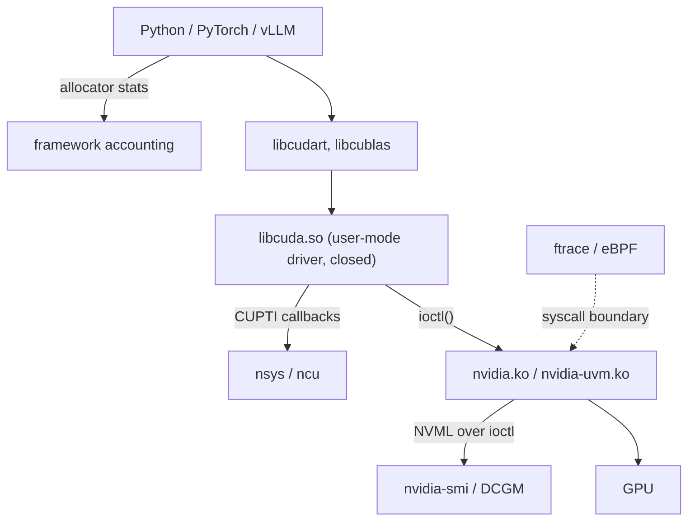

# Instrumenting the GPU: NVML, DCGM, CUPTI & Nsight

> **Goal:** build the GPU counterpart to your host toolkit — device counters,
> CUDA tracing, kernel profiling, and host-kernel tracing of the driver
> boundary — know exactly what each layer can and cannot see, know what each
> one costs, and be able to answer "what is this process actually doing to the
> GPU?" on a production box, not just in a profiler GUI.

## The layered toolbox, GPU edition

[/proc, strace, perf & eBPF](#/observability) gave you a rule: start at the
top, descend only as far as the question requires, and each layer down buys
resolution at the price of perturbation. The GPU has the same shape, with one
extra wrinkle — the bottom of the host stack is not the bottom of the *system*.
Below the syscall boundary sits a closed user-mode driver, a kernel module you
did not compile, and a processor with its own scheduler and its own MMU.

```text
"what is this process doing to the GPU?"
   ├── NVML / nvidia-smi ..... device counters, as an API      (ships with driver)
   ├── DCGM / dcgm-exporter .. the same, fleet-shaped + health (separate install)
   ├── nsys (CUPTI trace) .... CUDA API + kernel + memcpy timeline
   ├── ncu (CUPTI profiling) . per-kernel hardware counters    (serializes!)
   ├── ftrace / eBPF ......... the ioctl boundary, from the host kernel
   └── the framework itself .. PyTorch/vLLM allocator accounting
```

Five layers, five different questions. Confusing them is the single most
common way GPU investigations go wrong, so state the contract before you touch
a tool:

| Layer | The question it answers | What it structurally cannot see |
|---|---|---|
| NVML / `nvidia-smi` | Is the device busy, hot, throttled, out of memory — right now? | Anything sub-sample-period; which kernel; why |
| DCGM | The same across 10,000 GPUs, plus health and per-job rollups | Individual CUDA calls; anything inside a process |
| `nsys` + NVTX | The *sequence*: which API call, which kernel, which copy, in what order, on which stream | What happened inside a kernel |
| `ncu` | Inside one kernel: occupancy, memory throughput, stalls | The rest of the program; anything about time under real conditions |
| ftrace / eBPF on `/dev/nvidia*` | Which syscalls the CUDA stack issued, when, how long they blocked | The meaning of an opaque ioctl payload; anything on the device |
| Framework accounting | What *the allocator* thinks it owns | Whether the driver agrees |

The last row is not a joke. A serving stack has three independent opinions
about how much memory it is using, and on a healthy system all three differ.
That is the subject of the section after next.



Read that diagram twice. Every tool NVIDIA ships hangs off the *right* of the
picture — it observes the stack from inside the stack. `ftrace` and eBPF hang
off the *left*, and they are the only instruments in the room that owe the
CUDA runtime nothing. That is what this course can teach that a profiling
tutorial cannot.

## The GPU observability cost model

The host cost model had three tiers: counters, sampling, tracing. The GPU adds
a fourth, and it is qualitatively worse than anything on the host, because it
does not merely slow the workload down — it *changes what the workload is*.

| Mechanism | Class | Cost/risk |
|---|---|---|
| NVML polling (`nvidia-smi`, exporters) | counter read | near-free; coarse in time; averages over a sample period |
| DCGM field watches | counter read | near-free; 1 Hz default, 100 ms floor |
| DCGM profiling fields (`DCGM_FI_PROF_*`) | hardware counters | cheap but *exclusive* — conflicts with Nsight/CUPTI |
| NVTX ranges | in-process annotation | a few instructions when nothing is listening |
| `nsys` CUDA+NVTX trace | tracing | per-event cost, comparable to a light eBPF probe; usable on real workloads |
| `nsys` with `--cuda-trace-all-apis`, `--cuda-memory-usage`, UM page-fault tracing, or `--cudabacktrace` | heavy tracing | the user guide flags each of these as "may cause significant runtime overhead" |
| `ncu` | **serializing + replay** | kernels run one at a time, many times each, with caches flushed between passes |
| eBPF on `sys_enter_ioctl` | tracing | tens to hundreds of ns per event, in-kernel aggregation |
| ftrace `function_graph` on the driver | tracing | high; a debugging instrument, not a monitor |

The fourth class deserves its own paragraph, because it is the one people
misuse. Nsight Compute is not a slower profiler; it is a different experiment.
The documentation is explicit that it *"serializes kernel launches, unless a
dedicated replay mode is used"*, and that limited hardware counters force
**multiple replay passes per kernel** — the pass count is printed when
profiling finishes. Between passes it restores the memory the kernel wrote so
each replay is deterministic, flushes all GPU caches by default
(`--cache-control all`), and locks the GPC and memory clocks (`--clock-control`,
default `boost`).

Take that apart and notice what is gone. Concurrency between kernels: gone.
Overlap of copy and compute: gone. Cache state carried from the previous
kernel: deliberately destroyed. Clock behaviour under sustained thermal load:
replaced with a fixed point. `ncu` gives you a beautiful, reproducible answer
to "how does this kernel behave in isolation on a cold cache" — which is
exactly the right question when you are optimizing a kernel, and exactly the
wrong question when you are debugging a serving latency spike. NVIDIA does not
publish a slowdown multiplier, and there isn't a meaningful one to publish: it
is roughly (passes per kernel) × (kernels launched), so a `--set full` run over
a training step can be one to three orders of magnitude slower in wall clock.

The production rule follows directly:

```text
on production, always:      NVML / DCGM counter polling
on production, willingly:   NVTX ranges compiled in, dormant
on production, briefly:     nsys with -t cuda,nvtx,osrt and a bounded duration
on production, carefully:   eBPF on the ioctl boundary, aggregated in maps
NEVER on production:        ncu, and any nsys option the guide calls "significant overhead"
```

And the same discipline as the host chapter: *choose the cheapest probe that
can falsify the hypothesis.* If a 100 ms NVML poll shows `memory.used` flat
across the event you care about, you have already falsified "the process
released device memory" and you never needed a profiler.

## The numbers that lie

Two numbers on the `nvidia-smi` default screen are misread constantly. Both
are misread because people assume they mean what the equivalent host metric
means, and they do not.

### "GPU-Util" is not utilization

NVIDIA's own definition, from the `nvidia-smi` manual, is:

> Percent of time over the past sample period during which one or more kernels
> was executing on the GPU.

Read the qualifier: *one or more kernels*. One. A kernel occupying a single SM
of the 132 on an H100 SXM5, doing nothing but a serialized reduction, reports the same
100% as a kernel saturating every tensor core on the device. `utilization.gpu`
is a **duty cycle**, the GPU analogue of "was any thread on the run queue",
not a throughput measure. The memory field is the same shape: *"Percent of
time over the past sample period during which global (device) memory was being
read or written."* Both tell you *whether*, never *how much*.

This matters because "our GPUs are at 95% utilization" is the sentence that
stops capacity investigations. It should start them. The metrics that actually
speak to throughput are DCGM's profiling fields, which are ratios of *cycles*
rather than ratios of *time*:

- field **1002** — the fraction of cycles at least one warp was resident on an
  SM (the "am I using the machine's width?" number);
- field **1003** — resident warps as a fraction of the theoretical maximum
  (occupancy);
- field **1004** — the fraction of cycles any tensor pipe was active (for LLM
  serving, the number that most nearly means "am I doing the work I bought the
  card for");
- field **1005** — the fraction of cycles the device memory interface was
  active.

A workload at 99% `utilization.gpu` with field 1004 at 0.05 is not a busy GPU.
It is a GPU being kept warm by a stream of tiny kernels. That single
comparison catches more real capacity problems than any profiler.

### "Memory-Usage" is not what your model occupies

`nvidia-smi` reports **frame-buffer memory the driver has handed out**, per
device and per process. It is not what your tensors occupy, and it is not what
you could free.

Between "bytes of live tensor" and "bytes `nvidia-smi` reports" sit at least
four layers:

1. **Driver reserve.** The manual notes the driver "may also reserve a small
   amount of memory for internal use, even without active work on the GPU", and
   that reported total is affected by ECC state. `nvidia-smi -q -d MEMORY`
   breaks out Total / Reserved / Used / Free.
2. **The CUDA context.** Creating a context on a modern data-centre GPU costs a
   substantial fixed amount before you allocate a byte — in practice a few
   hundred megabytes, though NVIDIA publishes no figure and it varies with
   driver, GPU and CUDA version. Measure your own (step 2 below); a live CUDA
   process never reports zero.
3. **The framework's caching allocator.** PyTorch's allocator suballocates from
   large `cudaMalloc` segments and does not return them on `free`. The PyTorch
   documentation says it plainly: unused memory managed by the allocator "still
   appears as allocated in `nvidia-smi`". `empty_cache()` is what returns
   segments; a Python `del` is not.
4. **Fragmentation inside those segments.** Reserved-but-unusable bytes.

So the honest reading is a chain of inequalities you should be able to recite:

```text
memory_allocated()   ≤  memory_reserved()   ≤  per-process used  ≤  memory.used
   live tensors          allocator segments      driver's view       whole device
```

Every `≤` in that chain is a place where memory can hide, and each gap has a
different owner and a different remedy. [Where VRAM
Goes](#/gpu-memory-allocation) explains the allocators that create those gaps;
this chapter is about *measuring* them, and the measurement is only meaningful
if you name which inequality you are testing.

### Per-process accounting is weaker than you think

`nvidia-smi --query-compute-apps=pid,used_gpu_memory --format=csv` gives you
per-process device memory, and NVML gives the same through
`nvmlDeviceGetComputeRunningProcesses_v3()`. Note what is *not* in that list:
per-process utilization is a separate, sampled API
(`nvmlDeviceGetProcessUtilization()`), and lifetime per-process statistics
require **accounting mode**, which is off by default, must be enabled by root
(`nvmlDeviceSetAccountingMode()`), resets when the driver unloads unless
persistence mode is on, and stores results in a **circular buffer** — query a
long-dead PID and the record may have been overwritten. Once enabled, the CLI
side is `nvidia-smi --query-accounted-apps=gpu_utilization,mem_utilization,max_memory_usage,time --format=csv`.

Two caveats will bite you in exactly the environment you care about.

**Containers.** NVML is not PID-namespace aware. The driver records the
*global* PID; `nvidia-smi` inside a container with its own PID namespace looks
those PIDs up in its own namespace, fails to find them, and shows an empty
process table. NVIDIA's own container documentation recommends monitoring from
the host, or running the container with `--pid=host`. This is not a bug you
can configure around — it is the same lesson as
[namespaces](#/namespaces): the kernel-side identity and the container-side
identity are different numbers for the same task, and the driver only ever
knew one of them.

**MIG.** On MIG-enabled GPUs the `nvidia-smi` manual states that querying the
utilization of "encoder, decoder, jpeg, ofa, gpu, and memory is not currently
supported". The duty-cycle numbers you were misreading are not even available;
you must go to DCGM's per-instance profiling fields. And `dcgm-exporter`'s
container/pod labelling has been reported repeatedly — in issues that are still
open, rather than in NVIDIA's documentation — as not being emitted for
MIG-enabled GPUs, so per-workload attribution on a MIG fleet is an unsolved
operational problem, not a configuration you have got wrong.

## Layer 1: NVML and DCGM, concretely

**NVML** is a C library (`libnvidia-ml.so`) that ships with the driver;
`nvidia-smi` is a thin CLI over it, and every exporter you have ever deployed
is another. The query surface you want in muscle memory:

```bash
# One line per GPU, machine-readable, every 100 ms
nvidia-smi --query-gpu=index,name,memory.total,memory.used,memory.free,\
utilization.gpu,temperature.gpu,power.draw,clocks.sm,clocks_event_reasons.active \
           --format=csv,noheader,nounits -lms 100

# Who holds device memory
nvidia-smi --query-compute-apps=pid,process_name,used_gpu_memory --format=csv

# The full breakdown, including the driver's own reserve
nvidia-smi -q -d MEMORY

# Scrolling per-device and per-process monitors
nvidia-smi dmon -s pucm       # power+temperature, utilization, clocks, memory
nvidia-smi pmon -s um         # per-process utilization + memory
```

`nvidia-smi -q` is the discovery command: it prints everything NVML exposes for
the device, and `--help-query-gpu`, `--help-query-compute-apps` and
`--help-query-accounted-apps` print the exact field names each `--query-*`
switch accepts — the manual page does not enumerate them. Print the list once
rather than guessing field names; NVIDIA renames them (`clocks_throttle_reasons.*`
became `clocks_event_reasons.*`).

The library surface behind it, for when you write the exporter rather than
run one: `nvmlDeviceGetUtilizationRates()` (→ `nvmlUtilization_t`),
`nvmlDeviceGetMemoryInfo_v2()` (→ `nvmlMemory_v2_t`, which adds a reserved
field over the v1 struct), `nvmlDeviceGetComputeRunningProcesses_v3()` (→
`nvmlProcessInfo_t`), `nvmlDeviceGetProcessUtilization()` (→
`nvmlProcessUtilizationSample_t`), and the accounting family
(`nvmlDeviceSetAccountingMode`, `nvmlDeviceGetAccountingPids`,
`nvmlDeviceGetAccountingStats`, `nvmlDeviceGetAccountingBufferSize`).

**DCGM** is what you run when there are more GPUs than you can `ssh` to. It
adds four things NVML does not have:

- **Groups and field watches.** You declare a set of GPUs and a set of numeric
  field IDs, and `nv-hostengine` samples them for you at a configured rate
  (1 Hz default; 100 ms floor via the API). `dcgmi dmon -e 203,252,1001,1004`
  streams them.
- **Health.** `dcgmi health -s a` sets background watches; `dcgmi health -c`
  reports. `dcgmi diag -r 1|2|3` runs active diagnostics at roughly seconds,
  ~2 minutes, and ~15 minutes of testing. Level 3 is a real hardware
  qualification pass, not a smoke test — do not run it on a busy node.
- **Job statistics.** `dcgmi stats` aggregates a field group over the lifetime
  of a process or job, which is the honest way to answer "did that training run
  actually use the GPUs we gave it".
- **Profiling metrics** — the `DCGM_FI_PROF_*` family described above, read
  from hardware performance counters rather than from the duty-cycle counters.

A note on names, because it will cost you an afternoon otherwise: **the
numeric field IDs are the stable handle, the symbol names are not.** NVIDIA's
current field-ID reference lists 1001–1005 as
`DCGM_FI_PROF_GR_ENGINE_UTIL_RATIO`, `DCGM_FI_PROF_SM_UTIL_RATIO`,
`DCGM_FI_PROF_SM_OCCUPANCY_RATIO`, `DCGM_FI_PROF_TENSOR_UTIL_RATIO`,
`DCGM_FI_PROF_DRAM_UTIL_RATIO`, while other current NVIDIA documentation and
every `dcgm-exporter` dashboard in existence use the older
`DCGM_FI_PROF_GR_ENGINE_ACTIVE`, `..._SM_ACTIVE`, `..._SM_OCCUPANCY`,
`..._PIPE_TENSOR_ACTIVE`, `..._DRAM_ACTIVE`. Same IDs, same semantics,
different spelling across releases. Write dashboards against the numbers, and
enumerate what your build actually has with `dcgmi dmon -l`.

Two DCGM limitations you must plan around. Hardware counters cannot all be read
at once, so DCGM **multiplexes** groups of metrics by statistical sampling —
its documentation warns that collecting at higher frequencies "will result in
zeroes returned". And profiling-metric collection is **exclusive**: DCGM's own
docs state that it "will conflict with usage of other developer tools" such as
Nsight Systems and Nsight Compute. That is why `dcgmi profile --pause` and
`--resume` exist. If you have ever seen `ncu` fail with a resource-in-use error
on a node with a monitoring agent, that is the whole story — and the fix is to
pause DCGM's profiling watches, not to reboot the node.

Finally, permissions. Reading GPU performance counters requires administrator
privileges on Linux drivers 418.43 and later. To let unprivileged users profile,
you set a module parameter:

```bash
echo 'options nvidia NVreg_RestrictProfilingToAdminUsers=0' \
  | sudo tee /etc/modprobe.d/nvidia-profiling.conf
# then reboot (and on some distros rebuild the initrd)
```

This is the fix for `ERR_NVGPUCTRPERM`, and it affects Nsight Compute, Nsight
Graphics, Nsight Systems, CUPTI, and the legacy profilers alike. Treat it as
the security decision it is: you are granting every user on the box the ability
to read hardware counters that reflect other tenants' work.

## Layer 2: `nsys` in practice

Nsight Systems is a whole-application timeline. Under it sits **CUPTI**, the
CUDA Profiling Tools Interface — the C API that lets a tool subscribe to the
CUDA stack. CUPTI's **Callback API** notifies a subscriber when a CUDA API
function is entered or exited; its **Activity API** asynchronously records
completed activities as records (`CUpti_ActivityAPI`, `CUpti_ActivityKernel*`,
`CUpti_ActivityMemcpy*`) into buffers the tool registers with
`cuptiActivityRegisterCallbacks()`. Everything in an `nsys` timeline arrives
that way. CUPTI also offers the **Profiling** / **Range Profiling**, **PC
Sampling**, **PM Sampling**, and **SASS Metrics** APIs — those are the hardware
counter machinery underneath `ncu`, not `nsys`.

Historically CUPTI allowed one subscriber per process
(`CUPTI_ERROR_MULTIPLE_SUBSCRIBERS_NOT_SUPPORTED`), which is why two profilers
on one process fought. As of CUDA 13.3 with driver r610+, multiple concurrent
subscribers are supported through the v2 subscribe API — but do not assume it
on the box in front of you; check the CUDA version before you promise a
colleague they can attach alongside your trace.

### What is actually on the timeline

A default `-t cuda,nvtx,osrt` capture gives you five tracks worth reading:

- **CUDA API** — the host-side calls, on the calling thread, with real
  durations. A `cudaLaunchKernel` that takes 40 µs on the host is a fact about
  your CPU, not your GPU.
- **Kernels** — GPU-side execution, per stream, with the gaps between them
  visible. The gaps are the point.
- **Memory** — `memcpy` and `memset` operations with direction and size.
- **NVTX** — your own semantic ranges (below).
- **OS runtime** — host syscalls and library waits, so a stall in
  `pthread_cond_wait` or `read()` appears on the same time axis as the GPU
  work.

### Collecting headless

`nsys` is a CLI first; the GUI just opens the report file. On a server:

```bash
nsys profile -t cuda,nvtx,osrt \
             -o /var/tmp/serve --force-overwrite true \
             -d 30 -y 10 \
             --cuda-memory-usage=true \
             python serve.py
```

`-d 30` bounds the collection to 30 seconds and `-y 10` delays the start by 10,
so you skip model load and capture steady state. Note that
`--cuda-memory-usage` is itself one of the switches the user guide warns "may
cause significant runtime overhead" — it is worth the cost for a bounded
memory investigation like the one at the end of this chapter, and not worth it
otherwise. Drop it for a plain timeline. The result is a
`.nsys-rep` file you can copy off the box and summarize without a GUI:

```bash
nsys stats --report cuda_api_sum        /var/tmp/serve.nsys-rep
nsys stats --report cuda_gpu_kern_sum   /var/tmp/serve.nsys-rep
nsys stats --report cuda_gpu_mem_time_sum /var/tmp/serve.nsys-rep
nsys stats --report cuda_gpu_mem_size_sum /var/tmp/serve.nsys-rep
nsys stats --report nvtx_sum            /var/tmp/serve.nsys-rep
```

For a long-running server you cannot restart, use interactive mode: `nsys
launch` the application, then `nsys start` / `nsys stop` against the session
(`nsys sessions list`), and `nsys shutdown` when done. Note honestly that
`nsys` launches or wraps a process — the documentation describes no way to
attach to an already-running, un-launched PID. If the process is already up and
you cannot restart it, `nsys` is off the table and you fall through to layer 4.

Alternatively, let the application decide: `-c cudaProfilerApi` starts
collection at `cudaProfilerStart()` and stops at `cudaProfilerStop()`, and
`-c nvtx` keys the capture range to an NVTX range. That is how you profile the
tenth request rather than the first.

### NVTX: making the timeline mean something

A timeline of `ampere_bf16_gemm_128x256` is not an answer. NVTX ranges label
spans with *your* vocabulary — `prefill`, `decode_step`, `sampling`,
`kv_evict` — so the profiler reports time in terms of your system's concepts.
The C API is `nvtxRangePushA()` / `nvtxRangePop()` for nested per-thread
ranges, `nvtxRangeStartA()` / `nvtxRangeEnd()` for overlapping ranges,
`nvtxMarkA()` for instants, and `nvtxDomainCreateA()` to namespace them. From
PyTorch:

```python
import torch

with torch.cuda.nvtx.range("decode_step"):
    logits = model(tokens)
torch.cuda.nvtx.mark("kv_cache_evict")
```

`torch.cuda.nvtx.range_push()` / `range_pop()` are the explicit forms. When no
tool is attached the calls are near-free, so leave them compiled in.

### Reading it for the two failure modes that matter

**Launch-bound.** On the kernel track you see thousands of short kernels with
visible gaps between them, and on the CUDA API track a matching density of
`cudaLaunchKernel`. Total GPU busy time is a small fraction of wall clock while
`utilization.gpu` sits near 100% — the duty-cycle metric is counting the gaps
as busy because *some* kernel is nearly always resident. The host cannot feed
the device fast enough. Confirm it in `cuda_gpu_kern_sum`: many launches,
tiny average duration. The fixes are CUDA graphs, kernel fusion, larger
batches — all of which reduce launches per unit of work, not time per kernel.

**Transfer-bound.** The memory track is wide, and kernels wait on it rather
than overlapping with it. `cuda_gpu_mem_time_sum` and `cuda_gpu_mem_size_sum`
together tell you whether you are moving too much or moving it badly: divide
size by time and compare with the link's capability. A host-to-device copy far
below PCIe speed usually means pageable (not pinned) host memory, because the
driver has to stage it through an internal pinned buffer. Copies that do not
overlap with compute usually mean everything is on the default stream.

Both are diagnoses `ncu` cannot make, because both are about the *spaces
between* kernels, and `ncu` deletes those spaces by construction.

## Layer 3: `ncu`, and when to pay for it

Nsight Compute is the right tool for exactly one question: *given this kernel,
what is limiting it?* If your question has the words "sometimes", "p99",
"under load", or "after an hour" in it, `ncu` is not the tool.

```bash
# List what your build offers before guessing
ncu --list-sets
ncu --list-sections

# Profile the first 3 launches of one kernel, then stop
ncu --set full \
    -k regex:attention \
    -s 100 -c 3 \
    --target-processes all \
    -o /var/tmp/attn --force-overwrite \
    python bench.py

ncu --import /var/tmp/attn.ncu-rep --page details
```

`--set basic` is the default and the cheap one; `--set full` collects every
section and pays for it in replay passes. `-s/--launch-skip` and
`-c/--launch-count` are how you avoid profiling warm-up; both count only
launches matching `-k/--kernel-name`. `--nvtx` plus `--nvtx-include` lets you
select kernels by the NVTX ranges you already added for `nsys`, which is the
cleanest way to profile "the kernel inside decode_step" without knowing its
mangled name.

The four replay modes are worth knowing because they are the whole cost/fidelity
trade:

- **kernel** (default) — save the memory the kernel can reach, replay the
  kernel N times, restoring written memory between passes. Cheapest per
  application run; save/restore cost scales with bytes written.
- **application** — re-run the whole application once per pass. No memory
  save/restore, and kernels with host-side dependencies behave correctly, but
  you pay for all the host work N times.
- **range** — capture a whole range of API calls and kernel launches and replay
  it as a unit, which preserves concurrency between kernels inside the range.
- **app-range** — the range semantics, but by re-running the application.

Use `range` or `app-range` when the thing you are measuring *requires*
concurrent kernels; the default `kernel` mode will quietly measure something
that never happens in production.

## Layer 4: crossing the boundary

Now the part no CUDA tutorial covers. Everything above observes the GPU stack
from inside the GPU stack. The host kernel is underneath all of it, and it sees
every request that crosses the boundary.

Start where [GPU Drivers](#/gpu-drivers) left you: a CUDA process holds a small
set of character-device file descriptors.

```bash
ls -l /proc/$(pgrep -n python)/fd | grep nvidia
```

```text
lrwx------ 1 u u 64 Jul 27 09:14 12 -> /dev/nvidiactl        ← RM control channel
lrwx------ 1 u u 64 Jul 27 09:14 13 -> /dev/nvidia0          ← per-GPU node
lrwx------ 1 u u 64 Jul 27 09:14 14 -> /dev/nvidia-uvm       ← unified memory
lrwx------ 1 u u 64 Jul 27 09:14 15 -> /dev/nvidia-uvm-tools ← what profilers use
```

Every CUDA operation that needs the kernel — allocating device memory, creating
a context, mapping a BAR window, submitting work — becomes an `ioctl()` on one
of these. Watch the `ioctl()`s and you are watching CUDA's side of the
conversation, with timestamps, without the CUDA stack's cooperation and without
any tool NVIDIA has to bless.

### The ioctl numbers, and what they are worth

`/dev/nvidiactl` and `/dev/nvidia0` use ordinary Linux `_IOC` encoding. The
32-bit `cmd` packs a direction (bits 30–31), a size (bits 16–29), a **type**
(bits 8–15) and a **number** (bits 0–7). NVIDIA's type — from
`nv-ioctl-numbers.h` in the [open GPU kernel
modules](https://github.com/NVIDIA/open-gpu-kernel-modules) — is `'F'`, i.e.
`0x46`. That single fact gives you a precise, cheap filter for "any request to
the NVIDIA resource manager".

The numbers themselves are public. The generic ones live in
`nv-ioctl-numbers.h` (`NV_ESC_CARD_INFO` 200, `NV_ESC_REGISTER_FD` 201,
`NV_ESC_CHECK_VERSION_STR` 210, `NV_ESC_IOCTL_XFER_CMD` 211,
`NV_ESC_ATTACH_GPUS_TO_FD` 212, …), and the resource-manager escapes live in
`nv_escape.h`:

```c
/* src/nvidia/arch/nvalloc/unix/include/nv_escape.h, MIT-licensed */
#define NV_ESC_RM_ALLOC_MEMORY        0x27
#define NV_ESC_RM_FREE                0x29
#define NV_ESC_RM_CONTROL             0x2A
#define NV_ESC_RM_ALLOC               0x2B
#define NV_ESC_RM_VID_HEAP_CONTROL    0x4A
#define NV_ESC_RM_MAP_MEMORY          0x4E
#define NV_ESC_RM_UNMAP_MEMORY        0x4F
```

Now the honesty. **These numbers name a class of request, not an operation.**
`NV_ESC_RM_CONTROL` (0x2A) is a generic RPC: the real command is a field
*inside* the payload. Its parameter struct, `NVOS54_PARAMETERS` in `nvos.h`, is

```c
typedef struct {
    NvHandle hClient;      /* offset 0  */
    NvHandle hObject;      /* offset 4  */
    NvV32    cmd;          /* offset 8  ← the operation actually being requested */
    NvU32    flags;        /* offset 12 */
    NvP64    params;       /* offset 16, 8-byte aligned */
    NvU32    paramsSize;   /* offset 24 */
    NvV32    status;       /* offset 28 */
} NVOS54_PARAMETERS;
```

So counting ioctls by number tells you "the process made 900,000 RM control
calls". It does not tell you what any of them did. To go further you must read
the inner `cmd` out of user memory — which is possible, and shown below — and
then map it against the `NV*_CTRL_CMD_*` constants in the open modules'
`sdk/nvidia/inc/ctrl/` headers. Two things stay opaque even then: the payload
semantics for anything you cannot find a matching header for, and the fact that
requests larger than the `_IOC` size field are wrapped in
`NV_ESC_IOCTL_XFER_CMD` (211), where the real command sits at offset 0 of an
`nv_ioctl_xfer_t` and the real payload behind a pointer at offset 8.

`/dev/nvidia-uvm` is worse and more interesting. Its ioctl numbers are **not**
`_IOC`-encoded at all — `uvm_ioctl.h` defines `UVM_IOCTL_BASE(i)` as literally
`i` on Linux, so `UVM_MIGRATE` is 51, `UVM_MAP_EXTERNAL_ALLOCATION` is 33,
`UVM_REGISTER_GPU` is 37, `UVM_FREE` is 34, the profiler-facing `UVM_TOOLS_*`
family occupies 56–64 plus 67 (`UVM_TOOLS_FLUSH_EVENTS`), with two later `_V2`
additions at 76 and 77, and the two lifecycle calls in `uvm_linux_ioctl.h` are
`UVM_INITIALIZE` = `0x30000001` and `UVM_DEINITIALIZE` = `0x30000002` — chosen
to sit outside the small-integer space. Bare
small integers collide with every other ioctl on the system, so **you cannot
identify a UVM call by its number** — you have to know the fd. That constraint
shapes the script below.

### Real `bpftrace` on the boundary

> **A note on spelling.** The scripts below use `args->cmd` and the
> single-argument `delete(@m[k])`, which run on every bpftrace release
> including the current one — `->` is a documented alias for `.`, and the
> one-argument `delete()` is deprecated but still supported. [Lab: Answer a
> Real Question with eBPF](#/lab-ebpf) uses the modern `args.cmd` and
> `delete(@m, k)` spellings, which need 0.19 and 0.22 respectively. Both styles
> are correct; pick one per script and stay in it.

Count RM escapes by number, system-wide, with in-kernel aggregation:

```bash
sudo bpftrace -e '
tracepoint:syscalls:sys_enter_ioctl
/ ((args->cmd >> 8) & 0xff) == 0x46 /
{ @nv[comm, args->cmd & 0xff] = count(); }'
```

```text
@nv[python, 41]: 1190      ← 0x29 NV_ESC_RM_FREE
@nv[python, 42]: 918234    ← 0x2A NV_ESC_RM_CONTROL — the firehose
@nv[python, 43]: 1237      ← 0x2B NV_ESC_RM_ALLOC
@nv[python, 74]: 1204      ← 0x4A NV_ESC_RM_VID_HEAP_CONTROL
```

Latency, per escape, as a log2 histogram — this is the one that finds a driver
call blocking your inference loop:

```bash
sudo bpftrace -e '
tracepoint:syscalls:sys_enter_ioctl
/ ((args->cmd >> 8) & 0xff) == 0x46 /
{ @start[tid] = nsecs; @esc[tid] = args->cmd & 0xff; }

tracepoint:syscalls:sys_exit_ioctl
/ @start[tid] /
{
  @us[@esc[tid]] = hist((nsecs - @start[tid]) / 1000);
  delete(@start[tid]);
  delete(@esc[tid]);
}'
```

Reach through to the inner RM command (needs `uptr()`, bpftrace ≥ 0.12):

```bash
sudo bpftrace -e '
tracepoint:syscalls:sys_enter_ioctl
/ ((args->cmd >> 8) & 0xff) == 0x46 && (args->cmd & 0xff) == 0x2a /
{
  $p = uptr((uint32 *) (args->arg + 8));
  @rm_ctl[*$p] = count();
}'
```

The keys that come back are `NV*_CTRL_CMD_*` values; grep the open modules'
`ctrl` headers for the hex to name them. Be honest with yourself that this
reads user memory at a hard-coded offset in a struct with no ABI promise —
verify the layout against the driver version you are on before you trust it.

For UVM, track the fd instead of the number:

```bash
sudo bpftrace -e '
tracepoint:syscalls:sys_enter_openat
/ str(args->filename) == "/dev/nvidia-uvm" /
{ @opening[tid] = 1; }

tracepoint:syscalls:sys_exit_openat
/ @opening[tid] /
{
  delete(@opening[tid]);
  if (args->ret >= 0) { @uvmfd[pid, (uint64) args->ret] = 1; }
}

tracepoint:syscalls:sys_enter_ioctl
/ @uvmfd[pid, (uint64) args->fd] /
{ @uvm[args->cmd] = count(); }'
```

Start it *before* the process, or you will miss the `openat()` and see nothing —
which is itself a useful reminder that this technique observes transitions, not
state.

### Correlating a CUDA call with the syscalls it produces

The payoff: attach a uprobe to a driver-API entry point in `libcuda.so` and
count the ioctls that happen inside it, on the same thread.

```bash
LIBCUDA=$(ldconfig -p | awk '/libcuda\.so\.1/{print $NF; exit}')

sudo bpftrace -e "
uprobe:$LIBCUDA:cuMemFree_v2
{ @in[tid] = 1; @n[tid] = 0; }

tracepoint:syscalls:sys_enter_ioctl
/ @in[tid] && ((args->cmd >> 8) & 0xff) == 0x46 /
{ @n[tid]++; @esc[args->cmd & 0xff] = count(); }

uretprobe:$LIBCUDA:cuMemFree_v2
/ @in[tid] /
{
  @ioctls_per_free = hist(@n[tid]);
  delete(@in[tid]);
  delete(@n[tid]);
}"
```

If `@ioctls_per_free` is a spike at zero, `cuMemFree()` is not talking to the
kernel at all — it is bookkeeping in the user-mode driver, and the memory has
not gone back to the device. That is a real, load-bearing result you cannot get
any other way, and we use it in the next section.

Three caveats, stated plainly:

1. **Verify the symbol exists.** `nm -D "$LIBCUDA" | grep cuMemFree` — the
   versioned names (`_v2`) are the exported ones. `libcuda.so` is closed
   source; the symbols are the whole of its public contract.
2. **A uprobe on a public symbol may not catch every call.** Since CUDA 11.3
   the runtime can resolve entry points through `cuGetProcAddress()`, and
   internal call paths need not go through the exported PLT symbol. Check that
   your probe fires at the rate you expect before drawing conclusions from its
   silence.
3. **Uprobes are not free.** Each one is a breakpoint that traps into the
   kernel — two traps per call for a uprobe/uretprobe pair. On a hot entry
   point like `cuLaunchKernel` the probe can cost more than the traced work.
   "Follow the code" below walks the trap path; sample rather than trace if you
   need a hot path.

### ftrace on the driver itself

eBPF gives you the syscall boundary. `ftrace`'s function graph tracer gives you
what happens *below* it, inside the module — if the module was built with the
kernel's function-tracer instrumentation, which it normally is when
`CONFIG_FUNCTION_TRACER=y`. Check first, then trace:

```bash
cd /sys/kernel/tracing
grep -c '^nvidia_unlocked_ioctl' available_filter_functions   # 1 == traceable
echo nvidia_unlocked_ioctl > set_graph_function
echo 4 > max_graph_depth
echo function_graph > current_tracer
echo 1 > tracing_on
timeout 2 cat trace_pipe
echo 0 > tracing_on; echo nop > current_tracer; : > set_graph_function
```

`nvidia_unlocked_ioctl` is the `unlocked_ioctl` file operation of `nvidia.ko`
(the UVM module's chain is `uvm_unlocked_ioctl_entry`, the fops entry, into
`uvm_unlocked_ioctl` and then `uvm_ioctl`, which holds the command switch). What you
get is the in-driver call tree with per-function durations — enough to see
whether a slow ioctl is blocking on a lock, on the GSP firmware, or on a DMA
completion. What you do *not* get is any semantics: these are symbol names from
a module with no stability contract, they differ between the open and
proprietary module variants, and they change between driver releases. Confirm
against `/proc/kallsyms` on the machine in front of you.
[ftrace](#/ftrace) covers the tracer itself; this chapter only points it at a
new target.

There are, notably, **no tracepoints in the NVIDIA driver**. There is no
`nvidia:` event family under `/sys/kernel/tracing/events/`. Everything above is
kprobe- and syscall-level work on an uncooperative target, which is precisely
why the ioctl boundary — a stable *kernel* ABI, whatever the driver does behind
it — is the right place to stand.

## Layer 5: what the framework thinks

The cheapest instrument of all is the one already inside the process:

```python
import torch
mib = lambda b: b // 2**20
print("allocated", mib(torch.cuda.memory_allocated()))   # live tensors
print("reserved ", mib(torch.cuda.memory_reserved()))    # allocator segments
print("peak alloc", mib(torch.cuda.max_memory_allocated()))
print(torch.cuda.memory_summary())                        # the full table
```

`torch.cuda.memory_stats()` returns the same as a dict, `memory_snapshot()`
dumps allocator state for the visualizer, and `reset_peak_memory_stats()` lets
you scope a peak to one phase. Allocator behaviour is steered by
`PYTORCH_ALLOC_CONF` (`expandable_segments`, `max_split_size_mb`,
`garbage_collection_threshold`, `backend`).

This layer is authoritative about one thing and one thing only: what the
allocator believes. It cannot tell you whether the driver agrees. That is the
gap the next section walks across.

## Putting it all together: where does the memory go when an engine sleeps?

Here is a concrete question of the kind this chapter exists for. An inference
server releases its device memory — vLLM's sleep mode, or a bare
`empty_cache()` — and later reacquires it. Operationally you need to know: **is
that memory actually available to another process in between?** If yes you can
bin-pack two models onto one GPU. If no, you have built an elaborate no-op.

Three hypotheses, and note that they are mutually exclusive and all testable:

- **(a)** the bytes go back to the driver and another process can take them;
- **(b)** nothing crosses the kernel boundary; only the framework's bookkeeping
  changed;
- **(c)** some go back, and a floor stays behind.

### Step 1 — the cheapest probe that can falsify anything

```bash
nvidia-smi --query-gpu=timestamp,memory.used,memory.free,utilization.gpu \
           --format=csv,noheader,nounits -lms 100 > /var/tmp/fb.csv
```

Run the sleep/wake cycle, then look at the trace. If `memory.used` never moves,
hypothesis (b) is confirmed and you are done — total cost, one shell command,
zero perturbation. If it drops, you have ruled out (b) and must now find out
*how far* it drops, which is (a) versus (c).

### Step 2 — three numbers, three questions

Print all three across the transition, from inside the process:

```text
phase          allocated   reserved   nvidia-smi used
-------------  ---------   --------   ---------------
serving          38 GiB     41 GiB          42.6 GiB
after sleep       0 GiB      0 GiB           0.6 GiB   ← the floor
after wake       38 GiB     41 GiB          42.6 GiB
```

The shape is the lesson, not the digits. Read it as three separate facts.
`allocated → 0` says the framework dropped its tensors. `reserved → 0` says the
caching allocator *also* returned its segments — this is the step a plain `del`
does not do, and its absence is the most common reason a "release" releases
nothing. And the residual in `memory.used` is the **floor**: the CUDA context
plus the driver's own reserve, which no amount of freeing removes while the
process lives.

Measure your own floor once and remember it, because it sets a hard limit on
bin-packing:

```bash
# a process that only creates a context and sleeps
python -c "import torch; torch.cuda.init(); import time; time.sleep(60)" &
nvidia-smi --query-compute-apps=pid,used_gpu_memory --format=csv
```

### Step 3 — did it actually cross the boundary?

Steps 1 and 2 are consistent with a driver that lies to `nvidia-smi`, or with a
framework that reports optimistically. The falsifier is the syscall trace,
because the kernel has no stake in the argument. Attach before the transition,
bucket by second:

```bash
sudo bpftrace -e '
tracepoint:syscalls:sys_enter_ioctl
/ pid == $1 && ((args->cmd >> 8) & 0xff) == 0x46 /
{ @esc[args->cmd & 0xff] = count(); }

interval:s:1 { time("%H:%M:%S\n"); print(@esc); clear(@esc); }' $(pgrep -n python)
```

Now the one-second buckets line up against the sleep call, and the answer is
qualitative and unambiguous:

- A burst of `41`/`74` (`NV_ESC_RM_FREE`, `NV_ESC_RM_VID_HEAP_CONTROL`) at the
  moment of release means the driver was genuinely asked to give memory back.
- **No burst at all** means the release never left user space — the user-mode
  driver merely marked pages free in its own pool, and hypothesis (b) is true
  no matter what `memory.used` looked like, because you were watching a number
  the driver also computes from its own pool.

Run the `cuMemFree_v2` correlation script from the previous section alongside
it, and you get the same answer per call rather than per second: a histogram
peaked at zero ioctls per free is a user-space-only free.

If the engine uses the CUDA virtual-memory API rather than `cudaMalloc` — which
is how modern serving stacks release physical pages while keeping virtual
addresses stable — the escapes you see will differ, and you should widen the
uprobe set to `cuMemCreate`, `cuMemMap`, `cuMemUnmap`, `cuMemRelease`,
`cuMemAddressReserve` (verify each with `nm -D` first). The allocator design
behind that choice is [Where VRAM Goes](#/gpu-memory-allocation); what you are
doing here is checking whether it does what it claims.

### Step 4 — how long does it take, and where does the time go?

Now, and only now, is a timeline worth its cost. Annotate the phases and
capture a bounded window:

```python
with torch.cuda.nvtx.range("sleep"):
    llm.sleep(level=1)
with torch.cuda.nvtx.range("wake"):
    llm.wake_up()
```

```bash
nsys profile -t cuda,nvtx,osrt -o /var/tmp/sleepwake --force-overwrite true \
             --cuda-memory-usage=true -d 60 python serve.py
nsys stats --report nvtx_sum              /var/tmp/sleepwake.nsys-rep
nsys stats --report cuda_gpu_mem_time_sum /var/tmp/sleepwake.nsys-rep
nsys stats --report cuda_gpu_mem_size_sum /var/tmp/sleepwake.nsys-rep
```

`nvtx_sum` gives wall-clock per phase. The two memory reports tell you whether
wake time is dominated by **moving bytes** (a device-to-host offload on sleep
and a copy back on wake, which will show as large `Memcpy DtoH`/`HtoD`
totals) or by **driver work** (little copied, but the phase still takes
seconds — allocation, mapping and context work, which is where the ioctl
latency histogram from step 3 becomes the next thing to read).

That distinction decides your architecture. Copy-bound wake scales with model
size and PCIe bandwidth and is a capacity-planning problem. Driver-bound wake
does not shrink when you buy a faster link, and the fix is to release *less* —
keep the allocation, drop only the contents.

### Step 5 — what you deliberately did not do

You never ran `ncu`. Every question in this investigation was about *time
between* operations and *bytes across* a boundary, and `ncu` measures neither:
it would have serialized the launches, flushed the caches, replayed each kernel
several times, and produced an exquisitely detailed answer to a question nobody
asked. Knowing which tool *not* to reach for is most of what a cost model is
for.

### What the investigation established

Layered, cheapest first: NVML said *whether*, the framework counters said *what
the allocator believes*, eBPF on the ioctl boundary said *whether the kernel
was involved at all*, and only then did a timeline say *where the time went*.
Each layer either answered the question or narrowed it enough to justify the
next one's cost. That sequence — not any particular tool — is the transferable
skill, and it is the same sequence as [Performance Analysis
Methodology](#/perf-methodology), pointed at a device the host kernel can
barely see.

## What you cannot see

Hold the three tiers apart, as [GPU Checkpointing](#/gpu-checkpoint) does.

**Documented.** The ioctl escape numbers, the UVM ioctl numbers, the
`NVOS54_PARAMETERS` layout, and thousands of `NV*_CTRL_CMD_*` constants are
public under the MIT-licensed open GPU kernel modules. The NVML, DCGM, CUPTI,
Nsight Systems and Nsight Compute interfaces are documented in full. The
metric definitions — including the duty-cycle definition of `utilization.gpu`
— are in NVIDIA's own manuals.

**Inferable from measurement.** Which CUDA driver-API call produced which
syscalls, and how long each blocked (uprobes plus the ioctl trace). Whether a
"free" reached the kernel. Whether a phase is copy-bound or driver-bound.
Whether a workload is launch-bound. The size of your CUDA context floor. None
of these are documented anywhere; all are measurable in an afternoon with the
scripts above.

**Not observable from the host, at all.**

- **The user-mode driver.** `libcuda.so` is closed. Between `cuLaunchKernel()`
  and an ioctl there is command-buffer construction, batching, and scheduling
  you can only observe at its edges.
- **The device.** The GPU's own scheduler, its page tables, its caches, and the
  GSP firmware execute out of reach of any host tracer. Anything you learn
  about them arrives through counters NVIDIA chose to expose.
- **Payload semantics beyond the headers.** Reading `cmd` out of an
  `NVOS54_PARAMETERS` gives you a number; whether a matching public header
  exists for it is not guaranteed, and the `NV_ESC_IOCTL_XFER_CMD` indirection
  hides oversized requests behind a second dereference.
- **Anything the proprietary module does differently.** The open modules are a
  driver *variant*. Symbol names, and in principle behaviour, may differ from
  the proprietary module you are actually running.

Where observation of causes is impossible, fall back to measurement of effects.
You cannot watch the driver decide to migrate a page; you *can* count
`UVM_MIGRATE` ioctls, histogram their latency, and correlate the spikes with
your p99. You cannot see the GPU scheduler; you *can* compare kernel-busy time
from `nsys` against wall clock and know exactly how much of your GPU you are
wasting. That substitution — effects for causes, honestly labelled — is the
whole craft on a closed device.

## Follow the code (kernel v6.12)

The host kernel's contribution is small and worth reading, because it is the
part with a stability guarantee.

**Path 1 — an `ioctl()` to `/dev/nvidiactl`.**

1. The syscall entry lands in `SYSCALL_DEFINE3(ioctl, ...)` in
   [fs/ioctl.c](https://elixir.bootlin.com/linux/v6.12/source/fs/ioctl.c). It
   resolves the fd with
   [fdget()](https://elixir.bootlin.com/linux/v6.12/C/ident/fdget) and returns
   `-EBADF` if there is no file.
2. It calls
   [security_file_ioctl()](https://elixir.bootlin.com/linux/v6.12/C/ident/security_file_ioctl)
   — the LSM hook, and the reason an eBPF LSM program (or SELinux) can deny a
   GPU ioctl before the driver ever sees it.
3. It calls
   [do_vfs_ioctl()](https://elixir.bootlin.com/linux/v6.12/C/ident/do_vfs_ioctl),
   which handles the generic commands (`FIOCLEX`, `FIONBIO`, …). An NVIDIA
   escape is not one of those, so it returns `-ENOIOCTLCMD`.
4. On `-ENOIOCTLCMD` the syscall falls through to
   [vfs_ioctl()](https://elixir.bootlin.com/linux/v6.12/C/ident/vfs_ioctl),
   which is three lines: if the file has no `unlocked_ioctl` return `-ENOTTY`,
   otherwise call `filp->f_op->unlocked_ioctl(filp, cmd, arg)`.
5. That function pointer is `nvidia_unlocked_ioctl` in the out-of-tree module.
   From here the kernel is a bystander; it copied nothing and interpreted
   nothing. **This is why the boundary is such a good observation post:** the
   kernel's involvement is a stable, documented ABI, and the opacity begins
   exactly one function pointer later.

The tracepoint you attach to is generated from the syscall metadata, and your
eBPF program runs from
[trace_call_bpf()](https://elixir.bootlin.com/linux/v6.12/C/ident/trace_call_bpf)
in
[kernel/trace/bpf_trace.c](https://elixir.bootlin.com/linux/v6.12/source/kernel/trace/bpf_trace.c),
as traced in [/proc, strace, perf & eBPF](#/observability).

**Path 2 — a uprobe on `libcuda.so`.**

1. Registering the probe reaches
   [uprobe_register()](https://elixir.bootlin.com/linux/v6.12/C/ident/uprobe_register)
   in
   [kernel/events/uprobes.c](https://elixir.bootlin.com/linux/v6.12/source/kernel/events/uprobes.c),
   keyed on the *inode* of the library plus a file offset — which is why one
   probe covers every process that maps `libcuda.so`, present and future.
2. [uprobe_write_opcode()](https://elixir.bootlin.com/linux/v6.12/C/ident/uprobe_write_opcode)
   replaces the instruction at that offset with a breakpoint, using a private
   copy of the page so other mappings of the file are untouched.
3. When a thread executes it, the trap handler runs
   [handle_swbp()](https://elixir.bootlin.com/linux/v6.12/C/ident/handle_swbp),
   which finds the uprobe and calls its consumers —
   [uprobe_dispatcher()](https://elixir.bootlin.com/linux/v6.12/C/ident/uprobe_dispatcher)
   in
   [kernel/trace/trace_uprobe.c](https://elixir.bootlin.com/linux/v6.12/source/kernel/trace/trace_uprobe.c),
   which routes to your BPF program.
4. The original instruction is single-stepped out of line and the thread
   continues. Two traps per probed call for a uprobe/uretprobe pair — cheap
   next to `strace`, expensive next to a tracepoint. Budget accordingly.

**The driver side**, out of tree but readable, in
[NVIDIA/open-gpu-kernel-modules](https://github.com/NVIDIA/open-gpu-kernel-modules):
`kernel-open/common/inc/nv-ioctl-numbers.h` (the `NV_IOCTL_MAGIC` `'F'` and the
generic escapes), `kernel-open/common/inc/nv-ioctl.h` (`nv_ioctl_xfer_t`),
`src/nvidia/arch/nvalloc/unix/include/nv_escape.h` (the RM escapes),
`src/common/sdk/nvidia/inc/nvos.h` (`NVOS54_PARAMETERS`),
`kernel-open/nvidia/nv.c` (`nvidia_unlocked_ioctl`),
`kernel-open/nvidia-uvm/uvm.c` (`uvm_unlocked_ioctl_entry` and `uvm_ioctl`), and
`kernel-open/nvidia-uvm/uvm_ioctl.h` plus `uvm_linux_ioctl.h` (the UVM numbers).
Numbers and layouts above were checked against driver **610.43.03**, July 2026;
they are not an ABI, so re-check them against the release you are running.

## Try it yourself

Everything below needs an NVIDIA GPU and the driver. Without one, you can still
run the ftrace and eBPF halves against any character device — pick a
`/dev/dri/*` node or `/dev/kvm` and change the magic byte — and the technique
transfers unchanged.

```bash
# 1. What does the duty-cycle metric hide? Run a tiny-kernel workload and
#    compare utilization.gpu against DCGM's tensor-pipe ratio.
nvidia-smi --query-gpu=utilization.gpu --format=csv,noheader -lms 200 &
dcgmi dmon -e 1002,1004 -d 200

# 2. Find your CUDA context floor.
python -c "import torch; torch.cuda.init(); input()" &
nvidia-smi --query-compute-apps=pid,used_gpu_memory --format=csv

# 3. Watch every RM escape the machine issues, aggregated in-kernel.
sudo bpftrace -e '
tracepoint:syscalls:sys_enter_ioctl
/ ((args->cmd >> 8) & 0xff) == 0x46 /
{ @nv[comm, args->cmd & 0xff] = count(); }'

# 4. Which escapes block, and for how long?  (script from Layer 4)

# 5. Confirm the driver entry point is ftrace-able on your kernel.
grep -c '^nvidia_unlocked_ioctl' /sys/kernel/tracing/available_filter_functions

# 6. A 20-second headless timeline of a real workload, summarized without a GUI.
nsys profile -t cuda,nvtx,osrt -d 20 -o /var/tmp/t --force-overwrite true python app.py
nsys stats --report cuda_gpu_kern_sum /var/tmp/t.nsys-rep
#   Compare total kernel time against 20 s. The difference is your headroom.
```

## Check your understanding

1. A dashboard shows `utilization.gpu` at 98% for a fleet of inference nodes,
   and the capacity team concludes the GPUs are saturated. What is wrong with
   that inference, and which measurement would settle it?

<details><summary>Show answer</summary>

`utilization.gpu` is defined as the percent of the sample period during which
*one or more* kernels was executing — a duty cycle, not a throughput measure. A
single tiny kernel occupying one SM scores the same 100% as a kernel saturating
the device. The metric answers "was the GPU ever busy", never "how busy". To
settle it, read DCGM's cycle-ratio profiling fields: field 1002 (fraction of
cycles with at least one warp resident on an SM), 1003 (occupancy) and 1004
(tensor-pipe active). A 98% duty cycle with a tensor ratio of a few percent is a
launch-bound workload with enormous headroom, not a saturated fleet.

</details>

2. You need to know whether a serving process actually returned device memory
   to the driver when it "released" it. `nvidia-smi` shows `memory.used`
   dropping. Why is that not conclusive, and what settles it?

<details><summary>Show answer</summary>

`memory.used` is the driver's accounting of frame-buffer memory handed out; a
user-mode driver pool and the framework's caching allocator both sit above it,
and you are reading a number computed by the same stack you are auditing.
The independent falsifier is the host kernel, which has no stake in the answer:
trace `ioctl()` on the NVIDIA character devices (type byte `'F'` = `0x46`) and
look for a burst of `NV_ESC_RM_FREE` (0x29) / `NV_ESC_RM_VID_HEAP_CONTROL`
(0x4A) at the moment of release. Better still, wrap the release call with a
uprobe on `cuMemFree_v2` and histogram ioctls per call: a spike at zero means
the free never left user space, whatever any GPU-side counter said.

</details>

3. Your `bpftrace` script identifies NVIDIA RM ioctls by testing
   `((cmd >> 8) & 0xff) == 0x46`. Why does that same trick not work for
   `/dev/nvidia-uvm`, and what do you do instead?

<details><summary>Show answer</summary>

`/dev/nvidiactl` and `/dev/nvidia0` use standard Linux `_IOC` encoding, where
bits 8–15 hold a type byte — `'F'` for NVIDIA — so the filter is precise. UVM
does not: `uvm_ioctl.h` defines `UVM_IOCTL_BASE(i)` as literally `i` on Linux,
so `UVM_MIGRATE` is the bare integer 51 and `UVM_FREE` is 34. Bare small
integers collide with ioctls on every other device on the system, so the number
carries no identity. You must key on the file descriptor instead: watch
`openat()` for `/dev/nvidia-uvm`, record the returned fd per PID in a map, and
filter `sys_enter_ioctl` on that (pid, fd) pair. The consequence is that you
have to be tracing before the process opens the device.

</details>

4. You count 900,000 `NV_ESC_RM_CONTROL` ioctls in a minute. How much have you
   actually learned, and what would it take to learn more?

<details><summary>Show answer</summary>

Almost nothing about *what* the process did. `NV_ESC_RM_CONTROL` (0x2A) is a
generic RPC into the resource manager; the operation is a `cmd` field inside
the payload, at offset 8 of `NVOS54_PARAMETERS`. The ioctl number names a class
of request, not an operation. To go further you read that inner `cmd` out of
user memory (`uptr()` in bpftrace) and match it against the `NV*_CTRL_CMD_*`
constants in the open kernel modules' `sdk/nvidia/inc/ctrl/` headers — while
accepting that the struct layout has no ABI promise, that not every command
necessarily has a public header, and that oversized requests are indirected
through `NV_ESC_IOCTL_XFER_CMD`.

</details>

5. A colleague proposes running `ncu --set full` against the production
   inference server for ten minutes to find out why p99 latency spikes. Give
   two independent reasons this is wrong.

<details><summary>Show answer</summary>

First, cost: Nsight Compute serializes kernel launches and replays each kernel
once per required counter pass, saving and restoring written memory between
passes, flushing all GPU caches, and locking clocks. The wall-clock inflation is
roughly passes × kernels — one to three orders of magnitude on a real workload,
which will take the service down. Second, and more fundamental, it measures the
wrong thing: serialization removes kernel concurrency and copy/compute overlap,
and cache flushing plus clock locking removes exactly the conditions that
produce a tail-latency spike. `ncu` answers "how does this kernel behave in
isolation on a cold cache". A p99 question is about the spaces *between*
kernels, which is `nsys` (bounded, with `-d`) plus NVML/DCGM counters plus the
ioctl-latency histogram.

</details>

6. An `nsys` timeline shows thousands of short kernels with visible gaps
   between them, and the CUDA API track is dense with `cudaLaunchKernel`.
   Meanwhile `nvidia-smi` reports 100% utilization. Reconcile these and name
   the class of fix.

<details><summary>Show answer</summary>

They are consistent, because they measure different things. The workload is
launch-bound: the host cannot issue work fast enough to keep the device busy,
so each kernel is short and separated by a gap. `utilization.gpu` counts a
sample period as busy if *any* kernel was resident, and with kernels arriving
continuously that is nearly always true — so the duty cycle reads 100% while
actual GPU busy time is a small fraction of wall clock. Confirm with
`nsys stats --report cuda_gpu_kern_sum`: many launches, tiny mean duration, and
a total well under wall clock. The fixes all reduce launches per unit of work
rather than time per kernel: CUDA graphs, kernel fusion, larger batches.

</details>

7. Your monitoring agent collects DCGM profiling fields on every node. A
   developer's `ncu` run fails with a resource-in-use error. What is happening,
   and what is the correct fix?

<details><summary>Show answer</summary>

DCGM's profiling metrics are read from hardware performance counters, and that
collection is exclusive — DCGM's documentation states it will conflict with
other developer tools including Nsight Systems and Nsight Compute. The agent
holds the counters; `ncu` cannot get them. The correct fix is `dcgmi profile
--pause` before the profiling session and `--resume` afterwards, which is
precisely why those subcommands exist. Note also the separate permission axis:
counter access needs administrator privileges on drivers 418.43+ unless
`NVreg_RestrictProfilingToAdminUsers=0` is set as a module parameter — a
different failure (`ERR_NVGPUCTRPERM`) with a different fix.

</details>

8. Why does `nvidia-smi` show an empty process list inside a container, and why
   is that not something you can configure away?

<details><summary>Show answer</summary>

The NVIDIA driver records the *global* PID of each process holding a context —
it has no notion of PID namespaces. Inside a container with its own PID
namespace, `nvidia-smi` receives those global PIDs from NVML and looks them up
in the namespace it can see, where they either do not exist or refer to
different processes. NVIDIA's recommendation is to monitor from the host or run
the container with `--pid=host`. It is not configurable because the translation
does not exist anywhere: the driver never learned the container-side identity,
so there is no mapping to apply. It is the same asymmetry as everywhere else in
[namespaces](#/namespaces) — one kernel, one set of real identities, and a
per-namespace view layered on top that the driver was never told about.

</details>

## Sources & further reading

- [nvidia-smi manual](https://docs.nvidia.com/deploy/nvidia-smi/index.html) —
  the authoritative definitions of `utilization.gpu` ("percent of time … during
  which one or more kernels was executing"), FB memory Total/Reserved/Used/Free,
  the compute-process list, `--query-gpu` / `--query-compute-apps` /
  `--query-accounted-apps`, `dmon`, `pmon`, and the MIG utilization limitation.
- [NVML API reference](https://docs.nvidia.com/deploy/nvml-api/) — device
  queries (`nvmlDeviceGetUtilizationRates`, `nvmlDeviceGetMemoryInfo_v2`,
  `nvmlDeviceGetComputeRunningProcesses_v3`, `nvmlDeviceGetProcessUtilization`)
  and the accounting family, including the circular-buffer and root-required
  caveats.
- [DCGM documentation](https://docs.nvidia.com/datacenter/dcgm/latest/) —
  `dcgmi` subcommands, health and diagnostic levels, and the profiling-metric
  multiplexing and exclusivity constraints; the
  [field identifier reference](https://docs.nvidia.com/datacenter/dcgm/latest/dcgm-api/dcgm-api-field-ids.html)
  is where the numeric IDs and the current symbol spellings live.
- [Nsight Systems user guide](https://docs.nvidia.com/nsight-systems/UserGuide/index.html)
  — `nsys profile` switches, the trace families, interactive
  `launch`/`start`/`stop`/`sessions`, `nsys stats` report names, and the
  explicit list of options that "may cause significant runtime overhead".
- [Nsight Compute CLI](https://docs.nvidia.com/nsight-compute/NsightComputeCli/index.html)
  and [Nsight Compute profiling guide](https://docs.nvidia.com/nsight-compute/ProfilingGuide/index.html)
  — sets and sections, `--replay-mode`, cache and clock control, and the
  statement that Nsight Compute serializes kernel launches.
- [CUPTI documentation](https://docs.nvidia.com/cupti/) — the Activity,
  Callback, Profiling, Range Profiling, PC Sampling, PM Sampling and SASS
  Metrics APIs, and the multiple-subscriber rules.
- [NVTX](https://nvidia.github.io/NVTX/) — `nvtxRangePushA`/`nvtxRangePop`,
  `nvtxRangeStartA`/`nvtxRangeEnd`, `nvtxMarkA`, domains; and
  [`torch.cuda.nvtx`](https://docs.pytorch.org/docs/stable/cuda.html) for the
  Python bindings.
- [PyTorch CUDA semantics — memory management](https://docs.pytorch.org/docs/stable/notes/cuda.html)
  — the caching allocator, `memory_allocated` vs `memory_reserved`, and the
  statement that cached-but-unused memory "still appears as allocated in
  `nvidia-smi`".
- [NVIDIA/open-gpu-kernel-modules](https://github.com/NVIDIA/open-gpu-kernel-modules)
  — MIT-licensed source for every ioctl number and struct layout quoted above.
- [ERR_NVGPUCTRPERM](https://developer.nvidia.com/ERR_NVGPUCTRPERM) — the
  `NVreg_RestrictProfilingToAdminUsers` module parameter and which tools it
  gates.
- [NVIDIA container toolkit FAQ](https://nvidia.github.io/container-wiki/toolkit/faq.html)
  — the PID-namespace limitation and the `--pid=host` recommendation.
- [bpftrace reference](https://bpftrace.org/docs/latest.html) — `uptr()`,
  multi-key maps, `hist()`, and the tracepoint argument syntax used above.

---

**Next:** you can now measure where device memory goes; go find out *why* it
goes there. [Where VRAM Goes](#/gpu-memory-allocation) covers the allocators —
the driver's, the CUDA VMM API's, and the ones PyTorch and vLLM build on top —
that create every gap in the inequality chain above.
