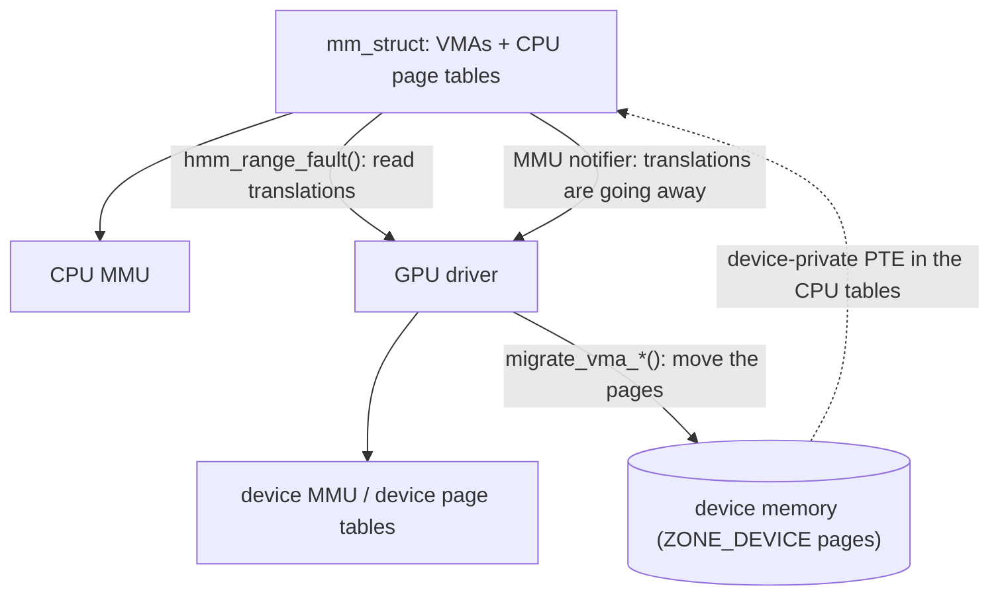

# Device Memory in the Kernel: HMM, MMU Notifiers & migrate_vma

> **Goal:** understand what the kernel does when a device wants to walk the
> *same* virtual addresses as the CPU process it serves. You will learn the
> three mechanisms that make it work — MMU notifiers, ZONE_DEVICE pages, and
> `migrate_vma` — and finish able to open `drivers/gpu/drm/amd/amdkfd/kfd_svm.c`
> and recognize every shape in it. Along the way you will find out why "dump the
> address space" stops being a complete description of a process.

## The second consumer

[Virtual Memory](#/memory) taught you an address space as a closed system. A
`mm_struct` owns a maple tree of VMAs and a page-table root. The MMU walks those
tables. The fault handler fills them in. `mmap_lock` and the per-VMA locks
arbitrate. Exactly one hardware unit consumes those translations, and the kernel
code that maintains them was written knowing that.

Now put a GPU next to it. A compute kernel written for AMD's ROCm or NVIDIA's
CUDA takes a pointer:

```c
float *data = malloc(1UL << 30);      /* ordinary anonymous memory */
build_a_huge_linked_structure(data);
launch_kernel<<<...>>>(data);         /* the *same* pointer, on the device */
```

For that to mean anything, `data` must resolve to the same bytes when the GPU
dereferences it as when the CPU does. The GPU has its own MMU and its own page
tables — on AMD hardware, per-process tables reached through a PASID. Something
must fill those tables with translations that agree with the CPU's, and keep
agreeing as the kernel does all the things the kernel does: reclaim a page,
break COW, collapse a THP, `mprotect` a range, `munmap` it, `fork`.

The kernel's page-table code will not consult the GPU before doing any of that.
It never had to. So the problem statement is precise:

1. **Mirroring** — a driver needs to read a range of the CPU's page tables into
   its own device tables, faulting missing pages in on the way if it wants.
2. **Notification** — the driver must be told *before* the kernel invalidates a
   translation, so it can tear down its own copy first, and told again when the
   invalidation is complete.
3. **Migration** — reaching host memory from the device costs, in the words of
   `Documentation/mm/hmm.rst`, "an order of magnitude higher latency" than the
   device's own, so data the device is chewing on should physically move
   *there* — and the CPU's page tables must keep describing it while it is gone.

Those three are, respectively, `hmm_range_fault()`, MMU notifiers, and
`migrate_vma_*()`. Together they are what the kernel calls **HMM**,
Heterogeneous Memory Management. The umbrella document is
[Documentation/mm/hmm.rst](https://docs.kernel.org/mm/hmm.html); everything
below is verified against Linux **v6.12**.



Note the dotted arrow. That is the part that breaks checkpointing, and we come
back to it at the end.

## MMU notifiers: the callback the mm subsystem owes you

MMU notifiers predate GPUs in this role — they were added in 2008 for KVM,
whose shadow page tables have exactly the same problem. The contract lives in
[include/linux/mmu_notifier.h](https://elixir.bootlin.com/linux/v6.12/source/include/linux/mmu_notifier.h).

A subscriber registers a
[`struct mmu_notifier`](https://elixir.bootlin.com/linux/v6.12/C/ident/mmu_notifier)
against an `mm_struct` and supplies a
[`struct mmu_notifier_ops`](https://elixir.bootlin.com/linux/v6.12/C/ident/mmu_notifier_ops).
The members that matter at v6.12:

```c
int  (*invalidate_range_start)(struct mmu_notifier *,
                               const struct mmu_notifier_range *);
void (*invalidate_range_end)(struct mmu_notifier *,
                             const struct mmu_notifier_range *);
void (*arch_invalidate_secondary_tlbs)(struct mmu_notifier *,
                                       struct mm_struct *,
                                       unsigned long start, unsigned long end);
int  (*clear_flush_young)(...);   /* plus clear_young, test_young */
void (*release)(struct mmu_notifier *, struct mm_struct *);
```

The `*_young` trio exists so that reclaim's aging (the accessed-bit scanning
from [Virtual Memory](#/memory)) sees accesses made *through the device*.
Without them, a page the GPU is hammering looks cold to `shrink_node()` and gets
evicted.

`arch_invalidate_secondary_tlbs` is for hardware that shares the CPU's page
tables outright (PCIe ATS/PASID) rather than keeping a private copy; it runs
from architecture TLB-invalidation code **while the PTL spinlock is held**, so
it must not sleep. One naming trap: it was called `invalidate_range` until v6.6,
and much of the writing about MMU notifiers still uses the old name. Its
kerneldoc says plainly that a driver implementing it should *not* also implement
`invalidate_range_start/end`.

### Why start and end are a pair

Everything hangs on this. A range invalidation is not an event, it is an
**interval of time**:

```text
mmu_notifier_invalidate_range_start(range)
        ← the pages are still mapped, refcount >= 1
   ... the mm removes PTEs, flushes TLBs, may free the pages ...
mmu_notifier_invalidate_range_end(range)
        ← the pages are unmapped and possibly gone
```

The header states the rule the driver must obey: *establishment of translations
in the range is forbidden for the whole duration of the start/end critical
section.* Between the two calls, the CPU's answer for those addresses is in
flux. If the device were allowed to fault a translation in during that window,
it would install a mapping to a page the kernel is in the middle of freeing —
which is a use-after-free with DMA behind it.

So the correct driver behaviour is: on `start`, unmap the range from the device
*and set a flag or bump a counter that blocks new device mappings*; on `end`,
clear it. A single "invalidate now" callback could not express that window, and
this is precisely why one callback would not do.

The range itself is described by
[`struct mmu_notifier_range`](https://elixir.bootlin.com/linux/v6.12/C/ident/mmu_notifier_range):
`mm`, `start`, `end`, `flags`, an `event` and an `owner`. The `event` field is a
hint about *why* — `MMU_NOTIFY_UNMAP` (`munmap`/`mremap`), `MMU_NOTIFY_CLEAR`
(a PTE cleared for any of many reasons), `MMU_NOTIFY_PROTECTION_VMA`
(`mprotect`), `MMU_NOTIFY_PROTECTION_PAGE`, `MMU_NOTIFY_SOFT_DIRTY`,
`MMU_NOTIFY_RELEASE` (the mm is going away), `MMU_NOTIFY_MIGRATE`, and
`MMU_NOTIFY_EXCLUSIVE`.

`MMU_NOTIFY_MIGRATE` carries the `owner` field, and it exists as an
optimisation with real teeth: when *this* driver is the one doing the
migration, it already knows what is happening and can compare `range->owner`
against its own `pgmap->owner` and skip the invalidation entirely.

### The rules that hurt

Driver authors get injured here, so be precise about three of them.

**Sleeping.** `invalidate_range_start` may normally sleep;
`mmu_notifier_invalidate_range_start()` calls `might_sleep()` unconditionally.
But there is a non-blocking variant,
[`mmu_notifier_invalidate_range_start_nonblock()`](https://elixir.bootlin.com/linux/v6.12/C/ident/mmu_notifier_invalidate_range_start_nonblock),
which clears `MMU_NOTIFIER_RANGE_BLOCKABLE` in `range->flags`. Your callback
must test
[`mmu_notifier_range_blockable(range)`](https://elixir.bootlin.com/linux/v6.12/C/ident/mmu_notifier_range_blockable);
if it is false and you would have to sleep, return `-EAGAIN` and do nothing
else. The core wraps such calls in `non_block_start()` / `non_block_end()`, so
sleeping anyway is caught, not silently tolerated.

Who calls the non-blocking variant? Essentially one caller that matters: the
**OOM reaper** in
[mm/oom_kill.c](https://elixir.bootlin.com/linux/v6.12/source/mm/oom_kill.c),
stripping anonymous VMAs off a doomed process without being able to wait for
anybody. Connect it to the OOM section of [Virtual Memory](#/memory): the reaper
cannot block on a GPU driver that may itself be waiting on the very memory
pressure that triggered the kill.

**Failure asymmetry.** A notifier that can fail `invalidate_range_start` is
**not allowed to implement `invalidate_range_end`**. The reason is in
`mn_hlist_invalidate_range_start()`: when one subscriber returns `-EAGAIN`, the
core calls `invalidate_range_end` on all subscribers that have an `end` method,
because there is no way to tell a notifier that *its* start failed. The kernel
enforces this with `WARN_ON(ops->invalidate_range_end)` on the failure path.

**Nesting and concurrency.** The core comment in
[mm/mmu_notifier.c](https://elixir.bootlin.com/linux/v6.12/source/mm/mmu_notifier.c)
says it outright: the mm creates *nested* start/end regions within the same
thread and runs start/end *in parallel on multiple CPUs*. Your callback is not a
mutual-exclusion point. The notifier list itself is walked under SRCU, and the
chain may only be traversed while holding `mmap_lock`, or one of the reverse-map
locks (`i_mmap_rwsem`, `anon_vma->rwsem`), or when no concurrent access is
possible.

### mmu_interval_notifier: what drivers were moved to

The plain `mmu_notifier` gives you every invalidation in the whole address
space. Jason Gunthorpe's observation when he reworked this for **kernel 5.5**
was that most subscribers did nothing with that except intersect the range
against a private list of virtual addresses they cared about, each with its own
subtly different locking. So the interval tree and the retry protocol moved into
the core:

```c
struct mmu_interval_notifier {
	struct interval_tree_node interval_tree;
	const struct mmu_interval_notifier_ops *ops;
	struct mm_struct *mm;
	struct hlist_node deferred_item;
	unsigned long invalidate_seq;
};

struct mmu_interval_notifier_ops {
	bool (*invalidate)(struct mmu_interval_notifier *interval_sub,
	                   const struct mmu_notifier_range *range,
	                   unsigned long cur_seq);
};
```

One callback, and it fires only for ranges that actually overlap your
subscription. You insert with
[`mmu_interval_notifier_insert()`](https://elixir.bootlin.com/linux/v6.12/C/ident/mmu_interval_notifier_insert)
and remove with `mmu_interval_notifier_remove()`. The return convention is
inverted from the old interface: return `true` for success, and `false` *only*
when sleeping was required and `mmu_notifier_range_blockable(range)` was false.

### The sequence-number protocol

This is the part worth internalising, because HMM's whole correctness argument
rests on it. It is a seqlock, generalised to allow many concurrent writers.

`mmu_notifier_subscriptions` holds an `invalidate_seq`. Odd means "a range in
this mm is being invalidated right now"; even means idle. `mn_itree_inv_start_range()`
sets the low bit when it finds any overlapping subscription;
`mn_itree_inv_end()` increments past it when the last active invalidation
finishes.

The reader's dance:

```text
seq = mmu_interval_read_begin(&sub);   /* may sleep until an in-flight
                                          invalidation of *this* range ends */
   ... read the CPU page tables into a scratch array ...
take(driver->update_lock);             /* the SAME lock invalidate() takes */
if (mmu_interval_read_retry(&sub, seq)) {
        release(driver->update_lock);
        goto again;                    /* we raced; the data is stale */
}
   ... program the device page tables ...
release(driver->update_lock);
```

and the writer's half, inside your `invalidate()` callback:

```c
take(driver->update_lock);
mmu_interval_set_seq(interval_sub, cur_seq);   /* cur_seq is always odd */
   ... tear down device mappings for [start, end) ...
release(driver->update_lock);
return true;
```

Three details that are easy to get wrong and are spelled out in the header:

- `mmu_interval_set_seq()` must be called **unconditionally** from `invalidate()`,
  under the same user-provided lock that `mmu_interval_read_retry()` is called
  under. That lock is what turns two `WRITE_ONCE`/`READ_ONCE` pairs into an
  actual barrier.
- `mmu_interval_read_begin()` can return a sequence for which
  `mmu_interval_read_retry()` is *already* true. It deliberately does not loop,
  so that the caller can impose a global time bound rather than spinning
  forever. HMM ships one: `HMM_RANGE_DEFAULT_TIMEOUT`, 1000 ms.
- `mmu_interval_check_retry()` is the cheap, lock-free probe you can call in
  the middle of an expensive loop to bail out early. A `false` from it proves
  nothing; only `read_retry()` under the lock is authoritative.

## ZONE_DEVICE: `struct page` for memory that is not RAM

Mirroring alone gives you a device that reads host RAM over PCIe at ~32 GB/s
when its own memory runs at 1 TB/s or more. To fix that you must move the pages
onto the device — and then the kernel needs something to put in `struct page`
slots for memory that is not RAM.

The answer is **ZONE_DEVICE**: a memory zone whose page frames are described by
ordinary `struct page`s but backed by a driver-owned physical range. A driver
declares one with
[`struct dev_pagemap`](https://elixir.bootlin.com/linux/v6.12/C/ident/dev_pagemap)
and hands it to `memremap_pages()` / `devm_memremap_pages()`. The type field
selects the semantics
([include/linux/memremap.h](https://elixir.bootlin.com/linux/v6.12/source/include/linux/memremap.h)):

| `enum memory_type` | CPU can load/store? | Pinnable? | Typical user |
|---|---|---|---|
| `MEMORY_DEVICE_PRIVATE` | **No** | No | discrete GPU VRAM behind PCIe |
| `MEMORY_DEVICE_COHERENT` | Yes, cache-coherent | No — must stay evictable | CXL / coherent-interconnect device memory |
| `MEMORY_DEVICE_FS_DAX` | Yes | Yes | filesystem DAX on persistent memory |
| `MEMORY_DEVICE_GENERIC` | Yes | Yes | device DAX character devices |
| `MEMORY_DEVICE_PCI_P2PDMA` | — | — | PCIe peer-to-peer BAR memory |

The first two are the ones this chapter is about, and the difference between
them is the entire hardware story. `MEMORY_DEVICE_PRIVATE` is memory the CPU
**cannot read or write at all** — there is a `struct page`, but dereferencing
its contents from the CPU is not a thing that exists. `MEMORY_DEVICE_COHERENT`
is memory the CPU *can* address coherently, which is what appears on
coherent-interconnect platforms; the kernel's only special rule is that nobody
may pin it, so it can always be evicted.

You can watch a real driver choose between them. In
[kgd2kfd_init_zone_device()](https://elixir.bootlin.com/linux/v6.12/C/ident/kgd2kfd_init_zone_device)
(`drivers/gpu/drm/amd/amdkfd/kfd_migrate.c`), amdkfd registers VRAM as
`MEMORY_DEVICE_COHERENT` when `adev->gmc.xgmi.connected_to_cpu` is set — the
GPU is on a coherent link — and as `MEMORY_DEVICE_PRIVATE` otherwise. Same
driver, same VRAM, different kernel semantics decided by the interconnect.

`struct dev_pagemap` also carries an `ops` table with two methods that matter:

```c
struct dev_pagemap_ops {
	void       (*page_free)(struct page *page);
	vm_fault_t (*migrate_to_ram)(struct vm_fault *vmf);
	int        (*memory_failure)(struct dev_pagemap *, unsigned long pfn,
	                             unsigned long nr_pages, int mf_flags);
};
```

and an `owner` pointer — "an opaque pointer identifying the entity that manages
this instance" — which is how every helper in this chapter tells *your* device
pages from someone else's.

One cost to keep in mind: every ZONE_DEVICE page needs a real `struct page` in
system RAM. amdkfd names the arithmetic explicitly, `SVM_HMM_PAGE_STRUCT_SIZE`,
and reserves it: at 64 bytes per 4 KiB page that is about 1.6% of the registered
device memory, so a 64 GiB card costs roughly a gigabyte of host RAM just to
describe its VRAM.

### What a device-private page looks like from the CPU side

Here is the trick that makes the whole design work. When a page is migrated to
device-private memory, the CPU PTE is not cleared — it is replaced with a
**special swap entry**. In
[include/linux/swapops.h](https://elixir.bootlin.com/linux/v6.12/source/include/linux/swapops.h)
these are `SWP_DEVICE_READ` and `SWP_DEVICE_WRITE`, recognised by
[`is_device_private_entry()`](https://elixir.bootlin.com/linux/v6.12/C/ident/is_device_private_entry).
They are *PFN swap entries*: instead of a swap slot, the offset field holds the
PFN of the ZONE_DEVICE page, so `pfn_swap_entry_to_page()` recovers the
`struct page`.

From here the existing kernel machinery just works, because the kernel already
knows how to handle "a valid mapping whose page is not present":

- `pte_present()` is false, so nothing takes the page fast path.
- A CPU access lands in
  [`do_swap_page()`](https://elixir.bootlin.com/linux/v6.12/C/ident/do_swap_page),
  which detects the device-private case and calls
  `vmf->page->pgmap->ops->migrate_to_ram(vmf)`. The driver DMAs the page back
  and installs a normal PTE.
- `get_user_pages()` sees a non-present PTE, fails to follow it, and calls
  `faultin_page()` — which routes to the same `do_swap_page()`. So even a
  well-meaning `process_vm_readv()` from another process pulls the page home.

That last property has a sharp corner worth knowing: in v6.12, `do_swap_page()`
explicitly bails out of the per-VMA-lock fast path for device-private entries
(`FAULT_FLAG_VMA_LOCK` → `VM_FAULT_RETRY`), with the comment "migrate_to_ram is
not yet ready to operate under VMA lock." The scalability win you read about in
[Virtual Memory](#/memory) does not apply to this fault.

### What a page-table walker sees — and the discrepancy

You already know how to decode `/proc/<pid>/pagemap`. Now decode a
device-private page, straight from
[`pte_to_pagemap_entry()`](https://elixir.bootlin.com/linux/v6.12/C/ident/pte_to_pagemap_entry)
in `fs/proc/task_mmu.c` at v6.12:

```text
bit 63  PM_PRESENT        0   ← pte_present() is false
bit 62  PM_SWAP           1   ← is_swap_pte() is true
bit 61  PM_FILE           0   ← the folio is anonymous
bit 56  PM_MMAP_EXCLUSIVE 0   ← only set for PM_PRESENT entries
bits 0-54  "frame"            ← swp_type | (PFN << MAX_SWAPFILES_SHIFT),
                                 and only if the reader has the privilege
                                 for show_pfn; otherwise zero
```

**A page resident in GPU memory is indistinguishable from a swapped-out page in
`pagemap`.** Same present bit, same swap bit. The only tell is the `swp_type`
nibble in the low bits of the frame field, which encodes `SWP_DEVICE_READ` or
`SWP_DEVICE_WRITE` rather than a real swap device — and you only get to see it
at all if you are privileged enough for `show_pfn`.

Now look at `smaps` for the same page, in `smaps_pte_entry()`:

```c
} else if (is_pfn_swap_entry(swpent)) {
        if (is_device_private_entry(swpent))
                present = true;              /* "fake-present" */
        page = pfn_swap_entry_to_page(swpent);
}
```

`smaps` counts it into **`Rss`** and **`Anonymous`**, and *not* into `Swap`.
The comment in `smaps_account()` says it in so many words: "We treat device
private entries as being fake-present."

So the two interfaces the course taught you to trust disagree about the same
byte of memory:

| Interface | Verdict on a device-private page |
|---|---|
| `/proc/<pid>/pagemap` | not present, **swapped** |
| `/proc/<pid>/smaps` | **resident**, anonymous, not swapped |

Neither is wrong. They are answering different questions, and the answer only
becomes ambiguous once a page can live somewhere the CPU cannot reach. Hold on
to this; it is the crux of the last section.

## HMM proper: `hmm_range_fault()`

With notifiers and ZONE_DEVICE in place, the mirroring half of HMM is one
function.
[`hmm_range_fault()`](https://elixir.bootlin.com/linux/v6.12/C/ident/hmm_range_fault)
snapshots a virtual range into an array of PFNs. Its argument is
[`struct hmm_range`](https://elixir.bootlin.com/linux/v6.12/C/ident/hmm_range):

```c
struct hmm_range {
	struct mmu_interval_notifier *notifier;
	unsigned long   notifier_seq;      /* from mmu_interval_read_begin() */
	unsigned long   start, end;
	unsigned long  *hmm_pfns;          /* (end-start)>>PAGE_SHIFT entries */
	unsigned long   default_flags;
	unsigned long   pfn_flags_mask;
	void           *dev_private_owner;
};
```

The output array holds a PFN in the low bits and metadata in the top eight
(`HMM_PFN_FLAGS`) — three named flags plus a five-bit map-order field:

```c
HMM_PFN_VALID = 1UL << (BITS_PER_LONG - 1),   /* pfn is at least readable */
HMM_PFN_WRITE = 1UL << (BITS_PER_LONG - 2),   /* and writable */
HMM_PFN_ERROR = 1UL << (BITS_PER_LONG - 3),   /* poisoned, special, no VMA */

HMM_PFN_REQ_FAULT = HMM_PFN_VALID,            /* input aliases output */
HMM_PFN_REQ_WRITE = HMM_PFN_WRITE,
```

The input request bits are *the same bits* as the output result bits, reused.
Use `hmm_pfn_to_page()` to strip the flags, and `hmm_pfn_to_map_order()` to
learn that a run of entries came from one large folio.

### Snapshot versus fault

The distinction is entirely in `default_flags` and `pfn_flags_mask`, and
`hmm_pte_need_fault()` combines them in exactly two lines:

```c
pfn_req_flags &= range->pfn_flags_mask;
pfn_req_flags |= range->default_flags;
```

So:

- **Snapshot.** `default_flags = 0`, `pfn_flags_mask = 0`. Nothing is ever
  faulted; each entry reports the current state of the page tables, and holes
  come back as zero. This is what you want when you are *observing* — "what is
  mapped right now, and where?"
- **Fault the whole range readable.** `default_flags = HMM_PFN_REQ_FAULT`,
  `pfn_flags_mask = 0`. Every page is faulted in through the ordinary
  `handle_mm_fault()` path — the same path from [Virtual Memory](#/memory), no
  parallel implementation.
- **Fault readable, but one page writable.** `default_flags = HMM_PFN_REQ_FAULT`,
  `pfn_flags_mask = HMM_PFN_REQ_WRITE`, and set `HMM_PFN_REQ_WRITE` in the one
  entry you care about. The mask is what lets per-entry requests survive.

`hmm_range_fault()` is emphatically *not* `get_user_pages()`. It takes **no
reference** on the returned pages. Nothing is pinned. The only thing keeping the
answer valid is the notifier sequence you took before the call — which is the
whole point, because pinning is what HMM exists to avoid (see
[DMA & the IOMMU](#/dma-and-iommu) for what pinning costs).

One special case earns its own branch: if the walk meets a device-private entry
whose `pgmap->owner` matches `range->dev_private_owner`, it does **not** fault
the page back to RAM. It reports the device PFN with `HMM_PFN_VALID`. Your own
pages on your own device stay where they are; another device's pages get
migrated home. That single owner comparison is what makes multi-GPU coexistence
possible.

### The canonical skeleton

This is the shape a driver author copies, from `Documentation/mm/hmm.rst` with
the real return codes filled in:

```c
struct hmm_range range = {
	.notifier      = &interval_sub,
	.start         = addr,
	.end           = addr + npages * PAGE_SIZE,
	.hmm_pfns      = pfns,
	.default_flags = HMM_PFN_REQ_FAULT | (writable ? HMM_PFN_REQ_WRITE : 0),
	.dev_private_owner = my_pgmap_owner,
};
unsigned long timeout = jiffies + msecs_to_jiffies(HMM_RANGE_DEFAULT_TIMEOUT);

if (!mmget_not_zero(interval_sub.mm))
	return -EFAULT;
again:
	range.notifier_seq = mmu_interval_read_begin(&interval_sub);

	mmap_read_lock(mm);
	ret = hmm_range_fault(&range);          /* may sleep, may fault */
	mmap_read_unlock(mm);
	if (ret) {
		if (ret == -EBUSY && !time_after(jiffies, timeout))
			goto again;                 /* invalidation collided */
		return ret;
	}

	take_lock(driver->update);              /* same lock as invalidate() */
	if (mmu_interval_read_retry(&interval_sub, range.notifier_seq)) {
		release_lock(driver->update);
		goto again;
	}
	/* program the device page tables from pfns[] here, and only here */
	release_lock(driver->update);
	return 0;
```

Read the ordering carefully. `mmu_interval_read_begin()` comes *before*
`mmap_read_lock()`. The device tables are programmed *after* `read_retry()`
succeeds, *under the driver lock*, and nowhere else. `hmm_range_fault()` itself
also checks `mmu_interval_check_retry()` at the top of its own loop and returns
`-EBUSY` early rather than finishing a walk it already knows is stale.

The real-world instance is
[`amdgpu_hmm_range_get_pages()`](https://elixir.bootlin.com/linux/v6.12/C/ident/amdgpu_hmm_range_get_pages)
in `drivers/gpu/drm/amd/amdgpu/amdgpu_hmm.c`. Open it next to the skeleton: same
`retry:` label, same `HMM_RANGE_DEFAULT_TIMEOUT`, same `-EBUSY` loop, plus
chunking of long ranges. Its companion `amdgpu_hmm_range_get_pages_done()` is
nothing but the `mmu_interval_read_retry()` half, so the caller can do the
retry check at the right moment under its own lock.

The error codes are worth memorising, because they mean genuinely different
things: `-EBUSY` means "retry, an invalidation collided"; `-EFAULT` means "a
page was requested valid and cannot be made valid"; `-EPERM` means "you asked
for write on a read-only range"; `-EINVAL` means the VA is in a VMA HMM cannot
handle, such as a device file mapping.

## `migrate_vma_*`: moving pages under a live address space

Now the other half. `migrate_vma` moves pages between system memory and device
memory in an **anonymous private VMA** — that is the only kind it handles, and
`migrate_vma_setup()` rejects hugetlb, `VM_SPECIAL` and DAX VMAs outright.

```c
struct migrate_vma {
	struct vm_area_struct *vma;
	unsigned long *dst;          /* both arrays: (end-start) >> PAGE_SHIFT */
	unsigned long *src;
	unsigned long cpages;        /* pages collected */
	unsigned long npages;
	unsigned long start, end;
	void *pgmap_owner;
	unsigned long flags;         /* MIGRATE_VMA_SELECT_* */
	struct page *fault_page;
};
```

The `flags` select what to move: `MIGRATE_VMA_SELECT_SYSTEM`,
`MIGRATE_VMA_SELECT_DEVICE_PRIVATE`, `MIGRATE_VMA_SELECT_DEVICE_COHERENT`. Each
array entry is a PFN shifted left by `MIGRATE_PFN_SHIFT` (6), with flags in the
low bits: `MIGRATE_PFN_VALID` (1<<0), `MIGRATE_PFN_MIGRATE` (1<<1),
`MIGRATE_PFN_WRITE` (1<<3).

### Why three phases

Because the driver has to copy the bytes, and the driver's copy engine is not
something the mm subsystem can call. The protocol therefore hands control back
to the driver in the middle, and the middle is a window where the source pages
are **isolated and unmapped**:

```mermaid
sequenceDiagram
    participant D as GPU driver
    participant M as mm (migrate_device.c)
    participant N as other MMU notifiers
    D->>M: migrate_vma_setup(args)
    M->>N: "invalidate_range_start (MMU_NOTIFY_MIGRATE, owner)"
    M->>M: "walk PTEs, fill src[], lock + isolate + unmap pages"
    M->>M: "install special migration PTEs"
    M->>N: invalidate_range_end
    M-->>D: "returns; cpages = how many are movable"
    Note over D,M: "window: source pages isolated, PTEs point nowhere"
    D->>D: "allocate dst pages, DMA the bytes, fill dst[]"
    D->>M: migrate_vma_pages()
    M->>M: "commit: copy struct page state src -> dst"
    M-->>D: "src[i] MIGRATE_PFN_MIGRATE cleared where it lost"
    D->>D: "program device page tables for the winners"
    D->>M: migrate_vma_finalize()
    M->>M: "replace migration PTEs with final PTEs, drop refs"
```

**Phase 1 — `migrate_vma_setup()`.** It calls `migrate_vma_collect()`, which
brackets its page-table walk in
`mmu_notifier_invalidate_range_start/end` with `event = MMU_NOTIFY_MIGRATE` and
`owner = args->pgmap_owner` — that is where the owner-matching skip from earlier
gets used. The walk fills `src[]`: every candidate page is locked with
`folio_trylock()`, isolated from the LRU (device pages are not on the LRU at
all), unmapped, and its PTE replaced with a **migration entry**, another
non-present PFN swap entry. A `pte_none()` or zero-page entry in an anonymous
VMA also gets `MIGRATE_PFN_MIGRATE` with no valid PFN, so the driver can
allocate device memory and simply zero it rather than copying a page of zeroes.
`args->cpages` comes back with the count.

**Phase 2 — the driver's copy.** For each entry with `MIGRATE_PFN_MIGRATE` set,
the driver allocates a destination page, locks it, DMAs the contents, and writes
`dst[i] = migrate_pfn(page_to_pfn(dpage))`. A `NULL` from
`migrate_pfn_to_page(src[i])` means the source was never populated — clear the
destination instead of copying. The driver may also decline a page simply by
leaving `dst[i]` at zero.

**Phase 3 — `migrate_vma_pages()` then `migrate_vma_finalize()`.**
`migrate_vma_pages()` is the commit point: `struct page` state moves from source
to destination, and for the previously-empty entries the new page is inserted
into the CPU page tables for the first time. This can lose a race — if a CPU
thread faulted the same address in the meantime, the page-table lock lets only
one winner through, and the loser sees `MIGRATE_PFN_MIGRATE` **cleared** in
`src[i]`. That is why the driver programs its own page tables *between*
`migrate_vma_pages()` and `migrate_vma_finalize()`: at that moment it knows
exactly which pages really moved, and both source and destination pages are
still locked. `migrate_vma_finalize()` then swaps the migration entries for
final PTEs — pointing at the new page where migration succeeded, and **restoring
the original page where it did not** — and drops the references.

### When a page cannot be migrated

`migrate_vma` is best-effort by design, and there are several ways to be
refused. `migrate_vma_check_page()` compares the folio's refcount against its
mapcount plus a known number of expected extra references; a surplus means
somebody has the page **pinned** (a `pin_user_pages()` caller, an in-flight DMA)
and it cannot move. `folio_trylock()` failing is enough to skip a page —
deliberately, to avoid deadlocking two concurrent migrations against each other.
And at v6.12 large folios are simply refused: `migrate_vma_check_page()` returns
false for `folio_test_large()`, and the collect walk splits a THP with
`split_folio()` before it can migrate the pieces. Device-private THP support was
still out of tree at v6.12.

The universal rule follows from `Documentation/mm/hmm.rst`: **device memory can
never be pinned**, by a driver or through GUP. That is not a limitation, it is
the invariant that lets the kernel guarantee a device page can always be brought
home — which is exactly what an OOM situation, a `munmap`, or a process exit
requires.

## Device page faults

Two directions, and they are not symmetric.

**The device touches a VA whose page is on the host.** On AMD hardware with
retry faults enabled (XNACK), the GPU's memory controller raises an interrupt
rather than killing the wavefront. The host handles it in
[`amdgpu_vm_handle_fault()`](https://elixir.bootlin.com/linux/v6.12/C/ident/amdgpu_vm_handle_fault),
which for a compute context calls
[`svm_range_restore_pages()`](https://elixir.bootlin.com/linux/v6.12/C/ident/svm_range_restore_pages).
That function does `get_task_mm()`, takes `mmap_read_lock()`, decides whether to
migrate the range to VRAM, and re-validates and re-maps it — so it is running in
a sleepable kernel context off the interrupt handler, not in hard IRQ.

Compare the two paths honestly:

| | CPU minor fault | GPU retry fault |
|---|---|---|
| Detection | MMU trap, same core | device interrupt to the host |
| Handler runs on | the faulting CPU, immediately | a host CPU, after IRQ dispatch |
| Work | allocate a page, fix one PTE | look up SVM range, maybe migrate 2 MiB, rebuild device tables, flush device TLB |
| Unit | one page | `prange->granularity` — 2 MiB by default on amdgpu |
| Meanwhile | the thread is blocked | the wavefront is stalled; other queues may be too |
| Order of magnitude | ~1 µs | far worse — the copy alone is a DMA round trip |

I am not going to invent a number for the second column. What I can tell you is
where to get one: amdkfd emits `kfd_smi_event_page_fault_start` /
`kfd_smi_event_page_fault_end` and `kfd_smi_event_migration_start` /
`_end` with timestamps through the KFD system-management interface, which is
exactly the instrumentation you would use to measure it on your own hardware.

The asymmetry that matters is *granularity*. A CPU fault fixes one page. A GPU
fault, by default, migrates 2 MiB — because per-page migration across PCIe would
be catastrophic, and because a compute kernel that touched one address will
touch its neighbours. That default is a module parameter you can see and change:
`amdgpu_svm_default_granularity`, documented as `log2(pages)`, default 9.

**The CPU touches a VA whose page is on the device.** You have already seen
this: `do_swap_page()` → `migrate_to_ram()`. The driver's callback (amdkfd's is
`svm_migrate_to_ram()`) runs `migrate_vma_*` in the other direction, with
`MIGRATE_VMA_SELECT_DEVICE_PRIVATE` and `fault_page` set to `vmf->page`. Note
the consequence: **any CPU read of device-resident data migrates it back**. A
debugger, a `process_vm_readv()`, a checkpointer — none of them can look without
moving. If the driver cannot bring the page home it must return `VM_FAULT_SIGBUS`,
which `migrate_device.c` describes as having "severe consequences for the
userspace process, so it must be avoided if at all possible."

## SVM in a real driver: amdkfd

Everything above is now recognisable in
[drivers/gpu/drm/amd/amdkfd/kfd_svm.c](https://elixir.bootlin.com/linux/v6.12/source/drivers/gpu/drm/amd/amdkfd/kfd_svm.c).
Open it and look for these shapes.

**The object.** `struct svm_range` (`kfd_svm.h`) is one contiguous VA range with
uniform attributes. It embeds both an `interval_tree_node it_node` — so the
driver can find a range by address — *and* an `mmu_interval_notifier notifier`.
The `svm_range_list` hanging off `struct kfd_process` is the per-process set.

**The subscription.** `svm_range_add_notifier_locked()` calls
`mmu_interval_notifier_insert_locked()`. The ops table is `svm_range_mn_ops`,
with a single `.invalidate = svm_range_cpu_invalidate_pagetables`.

**The invalidate callback.** `svm_range_cpu_invalidate_pagetables()` returns
`true` immediately for `MMU_NOTIFY_RELEASE`, takes the range lock, calls
`mmu_interval_set_seq(mni, cur_seq)` — unconditionally, under the lock, exactly
as the header demands — and then splits on the event: `MMU_NOTIFY_UNMAP` unmaps
the range from the GPUs and schedules removal, everything else goes to
`svm_range_evict()`. The kerneldoc even tells you the policy fork: with retry
faults enabled, just unmap and let the next device fault rebuild the mapping;
without them, evict the queues and schedule restore work, because a device that
cannot retry must not be allowed to touch the range at all.

**The mirror.** `svm_range_validate_and_map()` carries a comment block that is,
almost verbatim, the protocol from earlier in this chapter:

```text
1. Reserve page table (and SVM BO if range is in VRAM)
2. hmm_range_fault to get page addresses (if system memory)
3. DMA-map pages (if system memory)
4-a. Take notifier lock
4-b. Check that pages still valid (mmu_interval_read_retry)
4-c. Check that the range was not split or otherwise invalidated
4-d. Update GPU page table
4.e. Release notifier lock
5. Release page table (and SVM BO) reservation
```

In the code that is `amdgpu_hmm_range_get_pages()`, then `svm_range_dma_map()`,
then `svm_range_lock()`, then `amdgpu_hmm_range_get_pages_done()` returning true
→ `-EAGAIN` and around again, then `svm_range_map_to_gpus()`. Step 4-c is the
driver's own addition: the range may have been split by a concurrent `munmap`,
which the sequence number alone would not tell it.

**The migration.** `kfd_migrate.c` holds `svm_migrate_ram_to_vram()` and
`svm_migrate_vram_to_ram()`, each a textbook `migrate_vma_setup()` → copy →
`migrate_vma_pages()` → `migrate_vma_finalize()`, with
`migrate.pgmap_owner = SVM_ADEV_PGMAP_OWNER(adev)` in every one. That owner value
is the same one stored in `pgmap->owner` at registration and passed as
`dev_private_owner` to `hmm_range_fault()` — one identity threaded through all
three mechanisms.

**The policy surface.** Userspace drives all of this through one ioctl,
`AMDKFD_IOC_SVM` (`include/uapi/linux/kfd_ioctl.h`), whose attributes are the
entire policy vocabulary:
`KFD_IOCTL_SVM_ATTR_PREFERRED_LOC`, `_PREFETCH_LOC`, `_ACCESS`,
`_ACCESS_IN_PLACE`, `_NO_ACCESS`, `_SET_FLAGS`, `_CLR_FLAGS`, `_GRANULARITY`.
The kernel supplies mechanism; ROCm supplies policy.

## The checkpointer's angle

Now bring it back to the spine of this course.

[The Anatomy of Process State](#/process-state) rests on the claim that
`/proc/<pid>/` is a faithful, complete inventory of a process. HMM does not
break that claim by hiding memory from `/proc` — it breaks it more subtly, by
making the inventory *ambiguous*.

**What a dumper actually sees.** Walk `/proc/<pid>/pagemap` over a range whose
pages are resident in GPU memory and every entry reads: present clear, swap set.
Byte-for-byte the encoding of a swapped-out anonymous page. A dumper that
believes it is looking at swap will happily do the normal thing — read the page
through the process's address space to get its contents back.

**And here is the twist: that works.** Reading the page faults it, `do_swap_page()`
calls `migrate_to_ram()`, the driver DMAs it home, and the read returns the real
bytes. A naive checkpointer *does* capture the data. What it does not capture is
that the page was on the device — and it drags every touched page back across
the bus in the process, which for a large working set is the dominant cost of
the checkpoint and is invisible in the dumper's own accounting.

So state the failure precisely, because it is not "the data is missing":

1. **Location is lost.** The `src`/`dst` distinction, the per-range preferred
   and prefetch locations, the access permissions per GPU, the granularity —
   none of that is in `pagemap`. Restore gives you a process whose data is all
   in host RAM, and a device that has forgotten it ever wanted any of it.
2. **The read is destructive to performance.** Every page dumped is a page
   migrated. The checkpoint's cost is a full VRAM→host copy whether you planned
   one or not.
3. **`Rss` and `Swap` disagree** (previous section), so capacity planning and
   validation built on either number is wrong by exactly the device-resident set.
4. **Nothing pins**, so between reading `pagemap` and reading the page, the
   driver may have moved it again. Consistency requires the device be quiesced
   first — which is what the pause/checkpoint hook ordering in
   [GPU Checkpointing](#/gpu-checkpoint) is for.

**What AMD does about it, in-kernel.** This is the payoff of the whole chapter.
`kfd_svm.c` contains `kfd_criu_checkpoint_svm()`, `kfd_criu_restore_svm()` and
`kfd_criu_resume_svm()`. Read what `kfd_criu_checkpoint_svm()` actually saves:
for each `svm_range`, a `struct kfd_criu_svm_range_priv_data` holding
`start_addr`, `size`, and an array of `kfd_ioctl_svm_attribute` — preferred
location, prefetch location, flags, granularity, and per-device access. It saves
**the metadata, not the bytes.** The bytes are left to CRIU's ordinary memory
dump, which gets them via the migrate-on-read path above. On restore,
`kfd_criu_resume_svm()` replays those attributes through `svm_range_set_attr()`,
and the ranges — and the prefetches — are recreated.

That division of labour is only expressible because the mechanism is in the
mainline kernel. The SVM range *is* a kernel object with a defined attribute
vocabulary, so there is something to serialize. Which is exactly the structural
difference with the NVIDIA path: UVM's equivalent state lives inside a
proprietary driver with no kernel-visible schema, and correspondingly UVM
Managed Memory is on `cuda-checkpoint`'s documented **unsupported** list. The
question is not "did NVIDIA implement it yet"; it is that there is no in-kernel
object for a third party to checkpoint.

Three tiers, kept honest:

- **Documented.** Device-private pages are non-present PFN swap entries; pagemap
  reports them as swapped and smaps as resident; a CPU access triggers
  `migrate_to_ram()`; amdkfd checkpoints SVM ranges as attributes; UVM Managed
  Memory is unsupported by `cuda-checkpoint`. All of the above is in v6.12
  source or vendor documentation.
- **Inferable.** That a CRIU page-read migrates device-resident pages home
  follows from `do_swap_page()` and the GUP fault path, and from the fact that
  amdkfd's CRIU code saves no page contents. I have not found a published trace
  confirming it end to end.
- **Open.** Nobody has published the numbers: how much of a GPU checkpoint's
  wall time is migrate-on-read, what the image looks like when pages were device
  resident, or how any of this behaves on physically unified memory where the
  distinction between `MEMORY_DEVICE_PRIVATE` and `MEMORY_DEVICE_COHERENT`
  changes the answer. [Unified & Coherent Memory](#/unified-memory) takes up the
  platform side of that question; the measurement is still nobody's published
  work.

## Follow the code (kernel v6.12)

**Path 1 — a device mirrors a range.**

1. [`mmu_interval_notifier_insert()`](https://elixir.bootlin.com/linux/v6.12/C/ident/mmu_interval_notifier_insert)
   in [mm/mmu_notifier.c](https://elixir.bootlin.com/linux/v6.12/source/mm/mmu_notifier.c)
   adds the range to the mm's interval tree (deferred to `mn_itree_inv_end()` if
   an invalidation is in flight).
2. [`mmu_interval_read_begin()`](https://elixir.bootlin.com/linux/v6.12/C/ident/mmu_interval_read_begin)
   returns a sequence, sleeping on `subscriptions->wq` if this range is being
   invalidated right now.
3. [`hmm_range_fault()`](https://elixir.bootlin.com/linux/v6.12/C/ident/hmm_range_fault)
   in [mm/hmm.c](https://elixir.bootlin.com/linux/v6.12/source/mm/hmm.c) loops
   `walk_page_range()` over `hmm_walk_ops`;
   [`hmm_vma_handle_pte()`](https://elixir.bootlin.com/linux/v6.12/C/ident/hmm_vma_handle_pte)
   classifies each PTE and calls `hmm_vma_fault()` → `handle_mm_fault()` where a
   fault is required.
4. [`mmu_interval_read_retry()`](https://elixir.bootlin.com/linux/v6.12/C/ident/mmu_interval_read_retry)
   under the driver lock decides whether the snapshot is still good.

**Path 2 — an invalidation races it.**

1. Any PTE-modifying path calls
   [`mmu_notifier_invalidate_range_start()`](https://elixir.bootlin.com/linux/v6.12/C/ident/mmu_notifier_invalidate_range_start)
   → `__mmu_notifier_invalidate_range_start()` → `mn_itree_invalidate()`.
2. `mn_itree_inv_start_range()` sets `invalidate_seq` odd and walks the interval
   tree; each overlapping subscription's `->invalidate(sub, range, cur_seq)`
   runs.
3. The driver takes its lock, calls
   [`mmu_interval_set_seq()`](https://elixir.bootlin.com/linux/v6.12/C/ident/mmu_interval_set_seq),
   tears down its mappings, returns `true`.
4. `__mmu_notifier_invalidate_range_end()` → `mn_itree_inv_end()` makes the
   sequence even again, processes deferred tree insertions/removals, and wakes
   the wait queue. The racing reader's `read_retry()` now returns true.

**Path 3 — a page moves to the device and back.**

1. [`migrate_vma_setup()`](https://elixir.bootlin.com/linux/v6.12/C/ident/migrate_vma_setup)
   in [mm/migrate_device.c](https://elixir.bootlin.com/linux/v6.12/source/mm/migrate_device.c)
   → `migrate_vma_collect()` (notifier-bracketed walk, `MMU_NOTIFY_MIGRATE`) →
   `migrate_vma_unmap()` (isolate, unmap, install migration entries).
2. Driver copies; then
   [`migrate_vma_pages()`](https://elixir.bootlin.com/linux/v6.12/C/ident/migrate_vma_pages)
   and
   [`migrate_vma_finalize()`](https://elixir.bootlin.com/linux/v6.12/C/ident/migrate_vma_finalize).
3. The CPU later touches the address:
   [`do_swap_page()`](https://elixir.bootlin.com/linux/v6.12/C/ident/do_swap_page)
   in [mm/memory.c](https://elixir.bootlin.com/linux/v6.12/source/mm/memory.c)
   sees `is_device_private_entry()` and calls
   `vmf->page->pgmap->ops->migrate_to_ram(vmf)`.
4. The driver's `migrate_to_ram` runs `migrate_vma_*` in reverse with
   `MIGRATE_VMA_SELECT_DEVICE_PRIVATE`.

**The registration side.**
[`memremap_pages()`](https://elixir.bootlin.com/linux/v6.12/C/ident/memremap_pages)
in [mm/memremap.c](https://elixir.bootlin.com/linux/v6.12/source/mm/memremap.c),
driven from
[kgd2kfd_init_zone_device()](https://elixir.bootlin.com/linux/v6.12/source/drivers/gpu/drm/amd/amdkfd/kfd_migrate.c)
for AMD and `nouveau_dmem_init()` in
[drivers/gpu/drm/nouveau/nouveau_dmem.c](https://elixir.bootlin.com/linux/v6.12/source/drivers/gpu/drm/nouveau/nouveau_dmem.c)
for the open NVIDIA driver — two independent users of the same mechanism, worth
diffing.

**The checkpoint side.** `kfd_criu_checkpoint_svm()`, `kfd_criu_restore_svm()`,
`kfd_criu_resume_svm()` at the end of
[kfd_svm.c](https://elixir.bootlin.com/linux/v6.12/source/drivers/gpu/drm/amd/amdkfd/kfd_svm.c).

## Try it yourself

You do not need a GPU. The kernel ships a fake one:
[lib/test_hmm.c](https://elixir.bootlin.com/linux/v6.12/source/lib/test_hmm.c),
a pseudo-driver that registers real `MEMORY_DEVICE_PRIVATE` memory and exposes
`/dev/hmm_dmirror0` and `/dev/hmm_dmirror1`. It needs `CONFIG_TEST_HMM=m`,
which itself *depends on* `CONFIG_DEVICE_PRIVATE` and
`CONFIG_TRANSPARENT_HUGEPAGE` already being enabled and then selects
`HMM_MIRROR` and `MMU_NOTIFIER`. So on a distro kernel you will have to build
it — see [Reading & Building the Kernel](#/kernel-dev).

```bash
# Is device-private memory even compiled in on your running kernel?
grep -E 'CONFIG_(ZONE_DEVICE|DEVICE_PRIVATE|HMM_MIRROR|MMU_NOTIFIER|TEST_HMM)=' \
     "/boot/config-$(uname -r)"

# With CONFIG_TEST_HMM=m built, from a kernel tree:
cd tools/testing/selftests/mm && make hmm-tests
sudo ./test_hmm.sh smoke        # loads test_hmm, runs hmm-tests, unloads

# The fake devices, while the module is loaded:
ls -l /dev/hmm_dmirror*
```

The selftest exercises migration to and from device-private memory, fault
handling, and the notifier retry loop — on your machine, with no hardware.

On any machine, look at what the mm subsystem exposes about the mechanism:

```bash
# Every mmu_notifier user in your running kernel:
sudo grep -E 'mmu_notifier|mmu_interval' /proc/kallsyms | head

# Anonymous pages that are resident-but-not-present will show up here as the
# gap between smaps Rss and pagemap PM_PRESENT counts. On a machine with no
# device memory this gap is always zero, which is the point.
grep -E '^(Rss|Anonymous|Swap):' /proc/self/smaps_rollup
```

On an **AMD GPU with ROCm** (gfx9 or newer, discrete card), the policy knobs are
real files:

```bash
# Migration granularity, log2(pages). 9 = 2 MiB, the default.
cat /sys/module/amdgpu/parameters/svm_default_granularity

# How much VRAM the driver registered with ZONE_DEVICE at probe:
sudo dmesg | grep -i 'HMM registered'
# [   4.881...] amdgpu: HMM registered 24560MB device memory
```

The `dmesg` line is `kgd2kfd_init_zone_device()` reporting; if it is absent,
either the GPU predates gfx9, it is an APU (which takes an early return), or
registration failed and SVM is disabled.

## Check your understanding

1. Why must MMU-notifier invalidation be a *pair* of callbacks rather than a
   single "this range is now invalid" notification?

<details><summary>Show answer</summary>

Because invalidation is an interval of time, not an instant. Between
`invalidate_range_start()` and `invalidate_range_end()` the mm is removing PTEs,
flushing TLBs, and possibly freeing the pages; `start` runs while the pages are
still mapped with a refcount of at least one, `end` after they are unmapped and
may be gone. The driver's obligation is not just "unmap now" but "unmap now
*and refuse to establish any new translation in this range until I say so*".
A single callback could not express the closing of that window, and a device
that faulted a mapping in during it would install a translation to memory the
kernel is in the middle of freeing.

</details>

2. Your `invalidate_range_start` callback needs to take a mutex. What must it
   check first, who forces the issue, and what may your driver *not* also
   implement?

<details><summary>Show answer</summary>

It must check `mmu_notifier_range_blockable(range)`. If that returns false the
callback is in a non-blocking context and must return `-EAGAIN` without
sleeping; the core brackets the call in `non_block_start()`/`non_block_end()` so
a violation is caught. The caller that forces this is the OOM reaper, via
`mmu_notifier_invalidate_range_start_nonblock()`. And a notifier that can fail
`start` must **not** implement `invalidate_range_end` at all — when any
subscriber returns `-EAGAIN` the core calls `end` on every subscriber that has
one, because there is no mechanism to tell a notifier that its own `start`
failed. The kernel enforces this with a `WARN_ON`.

</details>

3. `hmm_range_fault()` returns an array of PFNs and takes no reference on any of
   them. What stops the answer from being stale by the time you program the
   device page tables?

<details><summary>Show answer</summary>

Nothing stops it — the protocol *detects* it instead. You call
`mmu_interval_read_begin()` before the walk to capture a sequence number, and
afterwards you take the same lock your `invalidate()` callback takes and call
`mmu_interval_read_retry()` with that sequence. If any invalidation overlapped
your range in between, the callback ran `mmu_interval_set_seq()` under that
lock, the sequence no longer matches, and you start over. The device tables are
programmed only inside that lock, after a successful retry check — the shared
lock is what makes the two sequence accesses ordered. Check it without holding
the lock the callback holds and it proves nothing.

</details>

4. A range has `default_flags = 0` and `pfn_flags_mask = 0`. What does
   `hmm_range_fault()` do, and when would you want that?

<details><summary>Show answer</summary>

Nothing is faulted. `hmm_pte_need_fault()` masks the per-entry request with
`pfn_flags_mask` (zero) and ORs in `default_flags` (zero), so `HMM_PFN_REQ_FAULT`
is never set. The array comes back describing the *current* state of the page
tables — `HMM_PFN_VALID` and `HMM_PFN_WRITE` where a translation exists, zero
where it does not. That is snapshot mode, and you want it when observing rather
than populating: "what is mapped here right now", without perturbing the address
space by faulting in pages the device may never touch.

</details>

5. Why is `migrate_vma` a three-phase protocol, and what is the state of the
   source pages during the middle phase?

<details><summary>Show answer</summary>

Because the copy has to be done by the device's DMA engine, which the mm
subsystem cannot drive — so control must return to the driver in the middle.
`migrate_vma_setup()` walks the range under an `MMU_NOTIFY_MIGRATE` notifier
bracket, locks and isolates each movable page, unmaps it, and replaces its PTE
with a special migration entry. During the middle phase the source pages are
therefore locked, off the LRU, and unmapped: the CPU PTEs point at migration
entries, so any CPU access blocks in `migration_entry_wait()`. That frozen
window is what gives the driver stable contents to copy. `migrate_vma_pages()`
then commits and `migrate_vma_finalize()` installs the final PTEs — the new page
where migration succeeded, the original where it did not.

</details>

6. You call `migrate_vma_setup()` for 512 pages and get `cpages = 500`; after
   `migrate_vma_pages()`, three more entries have lost `MIGRATE_PFN_MIGRATE`.
   Name plausible causes for each group.

<details><summary>Show answer</summary>

The twelve never collected were rejected in phase 1: **pinned**
(`migrate_vma_check_page()` finds a refcount surplus over the mapcount — a
`pin_user_pages()` caller or in-flight DMA), a failed `folio_trylock()`
(deliberately treated as a skip, to avoid deadlocking concurrent migrations), or
part of a large folio, which v6.12 refuses outright. The three lost in phase 3
lost a **race**: `migrate_vma_pages()` inserts pages for entries that were
previously `pte_none()`, and if a CPU thread faulted the same address meanwhile,
the page-table lock lets only one winner through. So treat `MIGRATE_PFN_MIGRATE`
as authoritative only *after* `migrate_vma_pages()` returns, and program the
device tables between that call and `migrate_vma_finalize()`.

</details>

7. A checkpointer walks `/proc/<pid>/pagemap` for a process using GPU shared
   virtual memory. What does it see for a page currently resident in VRAM, and
   what does `smaps` say about the same page?

<details><summary>Show answer</summary>

`pagemap` reports it as **not present** (bit 63 clear) and **swapped** (bit 62
set) — byte-identical to a swapped-out anonymous page, because a device-private
PTE really is a swap entry (`SWP_DEVICE_READ`/`SWP_DEVICE_WRITE`). The only
distinguishing information is the `swp_type` nibble in the frame field, visible
only to a reader privileged enough for `show_pfn`. `smaps`, walking the same PTE
in `smaps_pte_entry()`, sets `present = true` for device-private entries and
counts the page into **`Rss`** and **`Anonymous`** and *not* into `Swap` — the
kernel comment calls this "fake-present". The two interfaces disagree by exactly
the device-resident set. Neither is buggy; they answer different questions that
only diverge once a page can be somewhere the CPU cannot load from.

</details>

8. AMD can checkpoint an SVM process's memory topology in-kernel and NVIDIA's
   UVM path cannot. What is the structural reason, and what exactly does the AMD
   code save?

<details><summary>Show answer</summary>

The structural reason is that AMD's shared virtual memory is a **mainline kernel
object with a defined attribute vocabulary**: an `svm_range` with an
`mmu_interval_notifier`, plus an `AMDKFD_IOC_SVM` attribute set (`PREFERRED_LOC`,
`PREFETCH_LOC`, `ACCESS`, `ACCESS_IN_PLACE`, `NO_ACCESS`, `SET_FLAGS`,
`GRANULARITY`) that fully describes it — so there is something for a third party
to serialize. `kfd_criu_checkpoint_svm()` saves precisely that: per range, a
`start_addr`, a `size`, and the attribute array — **metadata, not page
contents**, since the contents come home through the ordinary migrate-on-read
path into CRIU's normal memory images. NVIDIA's equivalent state lives inside a
proprietary driver with no kernel-visible schema, which is why UVM Managed
Memory is on `cuda-checkpoint`'s documented unsupported list: the obstacle is
the absence of an in-kernel object, not a missing feature.

</details>

## Sources & further reading

- [Heterogeneous Memory Management (HMM)](https://docs.kernel.org/mm/hmm.html) —
  the subsystem's own document: the split-address-space problem, the mirroring
  API, the `default_flags`/`pfn_flags_mask` policy, the seven-step
  `migrate_vma` sequence, and the memcg/RSS accounting decisions.
- [include/linux/mmu_notifier.h](https://elixir.bootlin.com/linux/v6.12/source/include/linux/mmu_notifier.h)
  — the authoritative statement of the start/end pairing rule, the blockable
  contract, and the `mmu_interval_*` sequence protocol. The comments are the
  specification.
- [mm/mmu_notifier.c](https://elixir.bootlin.com/linux/v6.12/source/mm/mmu_notifier.c)
  — the "collision-retry read-side/write-side lock" comment block explaining how
  `invalidate_seq` supports many concurrent writers, plus the nesting and
  parallelism warnings.
- [mm/hmm.c](https://elixir.bootlin.com/linux/v6.12/source/mm/hmm.c) and
  [include/linux/hmm.h](https://elixir.bootlin.com/linux/v6.12/source/include/linux/hmm.h)
  — `hmm_range_fault()`'s error contract and the device-private owner shortcut
  in `hmm_vma_handle_pte()`.
- [mm/migrate_device.c](https://elixir.bootlin.com/linux/v6.12/source/mm/migrate_device.c)
  — the long comment above `migrate_vma_setup()` is the definitive description
  of the three-phase protocol and of what `MIGRATE_PFN_MIGRATE` means at each
  point.
- [include/linux/memremap.h](https://elixir.bootlin.com/linux/v6.12/source/include/linux/memremap.h)
  — `enum memory_type` with the semantics of each ZONE_DEVICE flavour, and
  `struct dev_pagemap` with its `owner` and `ops`.
- Jérôme Glisse, [Heterogeneous memory management and MMU notifiers](https://lwn.net/Articles/752964/)
  (LWN, LSFMM 2018) — the design rationale and the objections raised to it,
  from the author.
- [ZONE_DEVICE and the future of struct page](https://lwn.net/Articles/717555/)
  (LWN, 2017) — why the kernel chose to give non-RAM memory real page
  structures, and the cost of that choice.
- [The future of ZONE_DEVICE](https://lwn.net/Articles/1016124/) (LWN, 2025) —
  the current maintainer view: device-private memory, LRU exclusion, and where
  the abstraction is heading.
- [Add mmu_notifier_get/put for managing mmu notifier registrations](https://lwn.net/Articles/795628/)
  (LWN) — Jason Gunthorpe's series introducing the lifetime helpers alongside
  the interval-notifier consolidation that landed in kernel 5.5.
- [Add HMM-based SVM memory manager to KFD](https://lwn.net/Articles/851771/)
  (LWN) — the amdkfd SVM series itself, which is the code walked through above.
- [drivers/gpu/drm/amd/amdkfd/kfd_svm.c](https://elixir.bootlin.com/linux/v6.12/source/drivers/gpu/drm/amd/amdkfd/kfd_svm.c),
  [kfd_migrate.c](https://elixir.bootlin.com/linux/v6.12/source/drivers/gpu/drm/amd/amdkfd/kfd_migrate.c)
  and [drivers/gpu/drm/amd/amdgpu/amdgpu_hmm.c](https://elixir.bootlin.com/linux/v6.12/source/drivers/gpu/drm/amd/amdgpu/amdgpu_hmm.c)
  — the complete worked example, including the CRIU checkpoint/restore entry
  points.
- [lib/test_hmm.c](https://elixir.bootlin.com/linux/v6.12/source/lib/test_hmm.c)
  and [tools/testing/selftests/mm/hmm-tests.c](https://elixir.bootlin.com/linux/v6.12/source/tools/testing/selftests/mm/hmm-tests.c)
  — a complete, readable HMM device driver in one file, and the selftest that
  drives it. The best way to run this machinery without hardware.

---

**Next:** the platform above this mechanism — what CUDA managed memory and
NVIDIA's UVM actually promise, what changes on physically unified
Grace-Blackwell hardware, and why the `---p` reservation in a CUDA process's
maps is what it is: [Unified & Coherent Memory](#/unified-memory). Then take the
whole argument to its conclusion in [GPU Checkpointing](#/gpu-checkpoint).
