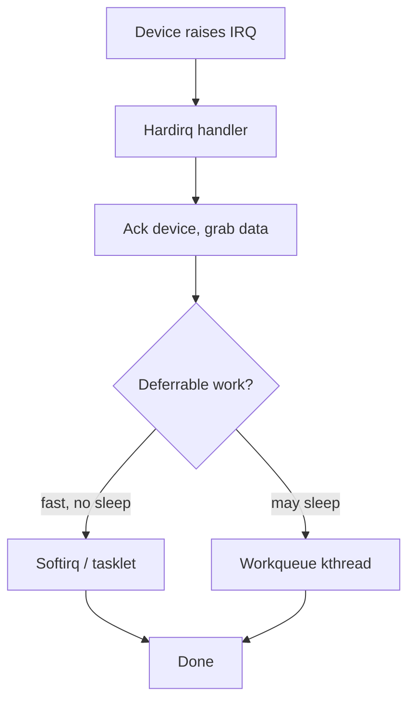

# Interrupts, Exceptions & Softirqs

> **Goal:** understand how hardware grabs the CPU's attention, what the kernel
> does in the split second after, and why that work is split into a "top half"
> that must never sleep and a "bottom half" that can. By the end you'll read
> `/proc/interrupts` and `/proc/softirqs` like a dashboard.

## Why interrupts exist

A CPU core does one thing: fetch an instruction, run it, repeat. Left alone it
would never notice that a network packet arrived, a key was pressed, or a disk
finished a read. The naive fix is **polling** — loop forever asking "anything
yet? anything yet?" — which burns 100% of a core doing nothing useful and still
adds latency.

Interrupts invert the arrangement. Hardware raises a signal on a physical line
(or writes a special memory address, see MSI below); the CPU finishes its
current instruction, **stops**, saves just enough state to come back, and jumps
to a kernel routine that services the device. When that routine returns, the
interrupted code resumes at the exact instruction it was on, none the wiser.
This is what lets one core drive a keyboard, three NICs, an NVMe drive and a
timer while spending almost all its cycles running your programs.

The cost is that an interrupt can strike **between any two instructions**, in
any context — a user process, a kernel syscall, even another interrupt handler.
Everything difficult about this chapter follows from that one fact.

## Three ways the CPU gets diverted

The x86-64 architecture lumps three different events under one mechanism, and
the kernel treats them differently. Know the taxonomy:

- **Exceptions** are *synchronous* — the running instruction itself caused
  them. A page fault (`#PF`, vector 14), a divide-by-zero (`#DE`, vector 0), an
  invalid opcode (`#UD`, vector 6), a breakpoint (`#BP`, vector 3). They are
  reproducible: the same instruction with the same state faults again. Page
  faults are the busy ones — see [Virtual Memory](#/memory) for what the
  handler does.
- **Hardware interrupts** (IRQs) are *asynchronous* — a device raised a line
  with no relation to what the CPU was executing. The timer tick, a NIC's "I
  have packets," a disk's "your I/O is done." These arrive through an interrupt
  controller (the APIC on modern x86) and can be masked.
- **NMI**, the *non-maskable interrupt* (vector 2), is the emergency line. It
  cannot be disabled by clearing the interrupt flag, so it's reserved for
  things that must be noticed even when normal interrupts are off: hardware
  errors, the watchdog that detects a hung CPU, and `perf` hardware sampling.

There are also **software interrupts** — an instruction (`int3`, or the old
`int 0x80` syscall path) that deliberately triggers the same machinery. Modern
syscalls use the faster `syscall` instruction instead
(see [Kernel, User Space & Syscalls](#/kernel-vs-userspace)), but the mechanism
is the same table lookup.

## The IDT and vectors

On x86-64 the CPU decides *where to jump* using the **Interrupt Descriptor
Table** (IDT): 256 entries, one per **vector** (0–255). Each entry is a gate
descriptor holding the address of a handler plus some flags. The `IDTR`
register points at it; the kernel builds it early in boot.

The 256 vectors are carved up:

```text
0  – 31    CPU exceptions (fixed by the architecture)
           0 #DE divide error   3 #BP breakpoint   6 #UD invalid opcode
           8 #DF double fault    13 #GP general protection  14 #PF page fault
32 – 255   available for external/hardware interrupts and IPIs
           0x80 = 128            legacy int 0x80 syscall gate
           high vectors reserved for local APIC (timer, IPIs, spurious)
```

Vectors 0–31 are nailed down by Intel/AMD. Everything from 32 up is the
kernel's to assign. When a device's interrupt is routed to a CPU, the APIC
delivers a specific vector number, the CPU indexes the IDT, and off it goes.
The kernel keeps a per-CPU map from vector → Linux **IRQ number**, which is the
abstract identity you see in `/proc/interrupts` (IRQ numbers and hardware
vectors are *not* the same thing — the IRQ layer sits above the vectors).

You can dump the exception setup conceptually; the entry stubs live in
[arch/x86/kernel/idt.c](https://elixir.bootlin.com/linux/v6.12/source/arch/x86/kernel/idt.c)
and the handlers are declared with the `DEFINE_IDTENTRY` family of macros.

## What happens the instant an interrupt fires

Say the network card raises its interrupt while your shell is running in user
mode. Roughly, in hardware then software:

1. The CPU finishes the current instruction, then consults the IDT entry for
   the delivered vector.
2. Because we're crossing from user (ring 3) to kernel (ring 0), the CPU
   switches to the **kernel stack** for this task (loaded from the TSS), and
   pushes a small hardware frame: `SS`, `RSP`, `RFLAGS`, `CS`, `RIP` (and an
   error code for some exceptions). This is the minimum needed to return.
3. It disables further maskable interrupts (for interrupt gates) and jumps to
   the kernel entry stub for that vector.
4. The kernel entry code saves the rest of the registers, switches page tables
   if needed (KPTI, the Meltdown mitigation — see
   [CPU Vulnerability Mitigations](#/cpu-mitigations)), and calls the C handler.

### IST: stacks that can't be trusted to the normal one

Most handlers run on the current kernel stack. But some exceptions can fire
*when the normal stack is unusable* — a double fault after a stack overflow,
or an NMI arriving in the middle of another handler.

For those, x86-64 provides the **Interrupt Stack Table** (IST): the TSS holds
up to 7 known-good stack pointers, and an IDT entry can specify "always switch
to IST stack N."

The kernel dedicates IST stacks to the dangerous vectors — NMI, double fault
(`#DF`), machine check (`#MC`), and debug (`#DB`) — so they always land on a
fresh, valid stack no matter how wrecked the interrupted context was. These
per-CPU stacks live in the `cpu_entry_area`; you can see the sizes in
[arch/x86/include/asm/cpu_entry_area.h](https://elixir.bootlin.com/linux/v6.12/source/arch/x86/include/asm/cpu_entry_area.h).

## Hardirq context: the rules

The C function that runs for a hardware interrupt executes in **hardirq
context** (also called "top half" or "interrupt context"). The kernel enforces
brutal rules here, and understanding *why* explains half the architecture of
the whole subsystem:

- **You cannot sleep.** There is no process to put to sleep — you interrupted
  one, and blocking would block *it* for reasons it knows nothing about, or
  deadlock. So no `mutex_lock()`, no `kmalloc(GFP_KERNEL)`, no `copy_to_user()`,
  nothing that might wait. The scheduler will refuse; `might_sleep()` checks
  splat in the log.
- **You run with that IRQ (often all IRQs) masked**, so you're delaying every
  other interrupt on the CPU. Long handlers mean lost timer ticks and jittery
  latency.
- **You use `spin_lock_irqsave()`, not plain locks**, to coordinate with code
  that a handler might have interrupted mid-critical-section (the full story is
  in [Kernel Synchronization](#/kernel-sync)).

The consequence: a hardirq handler should do the *absolute minimum* — read a
status register, acknowledge the device so it drops the line, stash the data,
and schedule the real work for later. That "later" is the **bottom half**, and
Linux has three mechanisms for it (softirqs, tasklets, workqueues), covered
below. This top-half / bottom-half split is the central idea of the chapter.



## The generic IRQ layer

Above the raw vectors sits the **generic IRQ layer**, the architecture-neutral
machinery in [kernel/irq/](https://elixir.bootlin.com/linux/v6.12/source/kernel/irq).
Every IRQ line the kernel knows about has a
[`struct irq_desc`](https://elixir.bootlin.com/linux/v6.12/C/ident/irq_desc)
— the descriptor. Its important pieces:

- `handle_irq` — the **flow handler**: a function that knows how this line's
  hardware signals (edge vs level, below).
- `action` — a linked list of
  [`struct irqaction`](https://elixir.bootlin.com/linux/v6.12/C/ident/irqaction),
  one per driver that registered on this line. Each holds the driver's
  `handler` callback and its `dev_id`. Multiple entries = a **shared** IRQ.
- `irq_data` — carries the
  [`struct irq_chip`](https://elixir.bootlin.com/linux/v6.12/C/ident/irq_chip),
  the driver for the *interrupt controller* itself (`irq_ack`, `irq_mask`,
  `irq_unmask`, `irq_eoi` — the operations that talk to the APIC or a GPIO
  controller).

A driver registers with
[`request_irq()`](https://elixir.bootlin.com/linux/v6.12/C/ident/request_irq)
(or `request_threaded_irq()`), passing its handler, flags (`IRQF_SHARED`,
`IRQF_ONESHOT`, …) and a name — the name is exactly what shows up in
`/proc/interrupts`. It tears down with
[`free_irq()`](https://elixir.bootlin.com/linux/v6.12/C/ident/free_irq).

### Edge vs level

How a device *signals* on its line dictates which flow handler is used, and
getting it wrong loses interrupts:

- **Level-triggered**: the device holds the line asserted until the kernel
  services it. The handler must **mask** the line, service, ack, then unmask —
  otherwise it re-fires immediately. Flow handler:
  [`handle_level_irq()`](https://elixir.bootlin.com/linux/v6.12/C/ident/handle_level_irq).
  Level lines are naturally shareable (several devices can pull the same line).
- **Edge-triggered**: the device pulses the line on a *transition*. If a second
  edge arrives while you're handling the first, you must not miss it —
  [`handle_edge_irq()`](https://elixir.bootlin.com/linux/v6.12/C/ident/handle_edge_irq)
  handles that re-entrancy. Most modern APIC-delivered and MSI interrupts use
  [`handle_edge_irq()`](https://elixir.bootlin.com/linux/v6.12/C/ident/handle_edge_irq)
  or, for controllers that ack via end-of-interrupt,
  [`handle_fasteoi_irq()`](https://elixir.bootlin.com/linux/v6.12/C/ident/handle_fasteoi_irq).

## Threaded IRQs

Some drivers need to do more than a top half can safely do — talk to an I2C
chip, grab a mutex — but that work *is* the interrupt handling and can't be a
generic bottom half. The answer is a **threaded IRQ**:
[`request_threaded_irq()`](https://elixir.bootlin.com/linux/v6.12/C/ident/request_threaded_irq)
takes two callbacks.

The `handler` runs in hardirq context (fast, just decides "is this mine?" and
returns `IRQ_WAKE_THREAD`); the `thread_fn` runs in a dedicated kernel
thread — you'll see it as `irq/48-eth0` in `ps` — where it **can sleep**. With
`IRQF_ONESHOT` the line stays masked until the thread finishes.

Threaded handlers are also what the **PREEMPT_RT** real-time kernel forces
almost everywhere: pushing IRQ work into schedulable threads is how RT bounds
interrupt latency (see [CPU Isolation, NO_HZ & Real-Time](#/cpu-isolation)).

## MSI and MSI-X

Old PCI devices asserted one of a handful of shared physical interrupt lines —
which meant sharing, and a handler that had to poll "was it me?" MSI
(Message-Signaled Interrupts) replaced the wire with a **memory write**: to
raise an interrupt, the device performs a posted write to a special address the
kernel programmed into it, and that write *is* the interrupt. Benefits:

- No physical line, so **no sharing** — each MSI gets its own vector and IRQ.
- **MSI-X** extends this to up to 2048 vectors per device, so a NIC can have
  one interrupt *per queue per CPU*, letting different cores service different
  receive queues in parallel (essential for multi-gigabit networking, see
  [The Networking Stack](#/networking)).
- The write is ordered after the device's DMA, closing a race where the old
  wire interrupt could beat the data into memory.

Drivers request them with
[`pci_alloc_irq_vectors()`](https://elixir.bootlin.com/linux/v6.12/C/ident/pci_alloc_irq_vectors),
which transparently picks MSI-X, then MSI, then a legacy line. Each vector gets
a [`struct msi_desc`](https://elixir.bootlin.com/linux/v6.12/C/ident/msi_desc).
In `/proc/interrupts` these show up with names like `nvme0q1`, `eth0-TxRx-3` —
one line per queue.

## Softirqs: the primary bottom half

The oldest and fastest deferral mechanism is the **softirq**. There is a
*fixed, compile-time* set of them — you can't register new ones from a module —
defined by an enum in
[include/linux/interrupt.h](https://elixir.bootlin.com/linux/v6.12/source/include/linux/interrupt.h),
in priority order:

| Softirq | Job |
|---|---|
| `HI` | high-priority tasklets |
| `TIMER` | expiring timers (see [Timers & Time](#/timers)) |
| `NET_TX` | transmit-side networking |
| `NET_RX` | receive-side networking (the heavy one under load) |
| `BLOCK` | block-I/O completions |
| `IRQ_POLL` | polled I/O completion |
| `TASKLET` | ordinary tasklets |
| `SCHED` | load balancing, scheduler bookkeeping |
| `HRTIMER` | high-resolution timers |
| `RCU` | RCU callback processing (see [Kernel Synchronization](#/kernel-sync)) |

A subsystem claims its slot at boot with
[`open_softirq()`](https://elixir.bootlin.com/linux/v6.12/C/ident/open_softirq)
and requests a run with
[`raise_softirq()`](https://elixir.bootlin.com/linux/v6.12/C/ident/raise_softirq),
which just sets a per-CPU bit. Softirqs run in **softirq context**: still
atomic — *you still cannot sleep* — but interrupts are enabled, so they don't
delay hardware the way a hardirq does. The same softirq can even run on several
CPUs at once, so its handler must be reentrant.

### When do softirqs run?

Pending softirqs are checked and run at a few well-defined moments:

1. On the way **out of a hardware interrupt**, in
   [`irq_exit_rcu()`](https://elixir.bootlin.com/linux/v6.12/C/ident/irq_exit_rcu)
   — the common case. The NIC's hardirq raised `NET_RX`; as the interrupt
   returns, the softirq runs and actually processes the packets.
2. When re-enabling bottom halves with `local_bh_enable()`.
3. In the **ksoftirqd** kernel thread (below).

The core loop is
[`__do_softirq()`](https://elixir.bootlin.com/linux/v6.12/C/ident/__do_softirq).
It grabs the pending bitmask, then walks it bit by bit, calling each raised
softirq's handler. Crucially it does **not** loop forever: it bounds itself to
`MAX_SOFTIRQ_RESTART` (10) passes or `MAX_SOFTIRQ_TIME` (2 ms), whichever comes
first. If softirqs are still being raised after that — a NIC under a packet
flood re-raising `NET_RX` faster than it drains — it stops hogging the CPU and
**wakes ksoftirqd** to finish the work later.

### ksoftirqd

[`ksoftirqd`](https://elixir.bootlin.com/linux/v6.12/C/ident/run_ksoftirqd) is a
per-CPU kernel thread (`ksoftirqd/0`, `ksoftirqd/1`, …) that runs softirqs in
*process context* at normal scheduler priority. It's the pressure-relief valve:
when softirq load would otherwise starve user space, the work moves to a thread
the scheduler can balance against everything else. Seeing `ksoftirqd` eating a
whole core is the classic signature of an interrupt/packet storm — the machine
is drowning in bottom-half work.

```bash
ps -eo pid,comm | grep -E 'ksoftirqd|irq/'   # per-CPU softirq threads + threaded IRQs
```

## Tasklets and workqueues

**Tasklets** are a convenience layer built *on top of* the `TASKLET`/`HI`
softirqs. Unlike a raw softirq, a given tasklet is guaranteed to run on only
one CPU at a time and never concurrently with itself, which makes them easier to
write. You schedule one with
[`tasklet_schedule()`](https://elixir.bootlin.com/linux/v6.12/C/ident/tasklet_schedule).
But tasklets are on a **deprecation trajectory**: they have awkward semantics, a
long-standing API (`tasklet_init`) that carries a raw function pointer, and the
kernel community actively encourages converting them to threaded IRQs,
workqueues, or BH workqueues. As of 6.12 they still exist and plenty of drivers
use them, but new code shouldn't reach for them.

The same "can't sleep" limit applies to tasklets — they're softirqs. When the
deferred work genuinely *needs* to sleep — allocate with `GFP_KERNEL`, take a
mutex, do I/O — you need a **workqueue**:

- A [`struct work_struct`](https://elixir.bootlin.com/linux/v6.12/C/ident/work_struct)
  wraps a callback; you submit it with
  [`schedule_work()`](https://elixir.bootlin.com/linux/v6.12/C/ident/schedule_work)
  or onto a private queue.
- It runs in **process context** on a pool of kernel worker threads — the
  `kworker/*` threads you see everywhere in `ps`. Because it's a real thread,
  the callback **may sleep**.
- Modern kernels use **concurrency-managed workqueues** (CMWQ): a shared,
  dynamically-sized worker pool rather than one thread per queue.

So the deferral menu, from most restrictive to least:

```text
hardirq handler   → no sleep, IRQs off, minimal work
softirq / tasklet → no sleep, IRQs on, atomic
workqueue         → may sleep, process context, full kernel API
```

## Reading /proc/interrupts

This file is a live per-CPU counter of every interrupt since boot — one row per
IRQ, one column per CPU:

```bash
cat /proc/interrupts
```

```text
            CPU0       CPU1       CPU2       CPU3
  1:          9          0          0          0   IO-APIC   1-edge      i8042
  8:          0          1          0          0   IO-APIC   8-edge      rtc0
 24:          0    1832910          0          0   PCI-MSI   524288-edge nvme0q1
 56:    4021332          0          0          0   PCI-MSI   1572864-edge eth0-TxRx-0
LOC:  120031  118222  119544  121002   Local timer interrupts
NMI:       2       1       0       0   Non-maskable interrupts
RES:   40221   39887   41003   40551   Rescheduling interrupts
```

Read it column by column:

- **Left number** = Linux IRQ number. The columns are per-CPU counts — this is
  how you see *which core* is fielding a device's interrupts.
- **`IO-APIC` / `PCI-MSI`** = the interrupt controller and trigger type
  (`edge`/`level`), then the hardware vector, then the driver-supplied name
  (`nvme0q1`, `eth0-TxRx-0`, `i8042` = keyboard/mouse controller).
- The **lettered rows at the bottom** are architecture interrupts that aren't
  device IRQs: `LOC` = local APIC timer, `NMI`, `RES` = rescheduling IPIs sent
  between CPUs to wake the scheduler, `CAL` = function-call IPIs, `TLB` = TLB
  shootdowns. Watching `RES` and `TLB` climb tells you about cross-CPU chatter.

Notice `nvme0q1` fires only on CPU1 and `eth0-TxRx-0` only on CPU0 — that's
**IRQ affinity** at work (below), pinning each queue to a core.

## Reading /proc/softirqs

The bottom-half counterpart, again per-CPU, one column per softirq type:

```bash
cat /proc/softirqs
```

```text
                    CPU0       CPU1       CPU2       CPU3
          HI:          3          0          1          0
       TIMER:     880214     875110     889001     870233
      NET_TX:       2201          9         14          3
      NET_RX:    5028811       1200       1104       1099
       BLOCK:      88213     442119        220        200
     TASKLET:      12043          2         55          1
       SCHED:     440021     438110     441550     437221
     HRTIMER:          0          0          0          0
         RCU:     620144     618900     621333     619001
```

What to look for: `NET_RX` heavily skewed to one CPU (as above) means that
core is doing all the packet receive processing — a bottleneck you fix with
RSS/RPS to spread receive queues across cores. `TIMER` and `RCU` tick along on
every CPU as background housekeeping. If `TASKLET` or `NET_RX` grows explosively
while `ksoftirqd` burns CPU, you're softirq-bound.

## IRQ affinity and irqbalance

By default the kernel picks which CPU handles each IRQ, but you can steer it.
Every IRQ has an **affinity mask** — the set of CPUs allowed to service it:

```bash
cat /proc/irq/24/smp_affinity_list      # which CPUs may handle IRQ 24, e.g. "1"
cat /proc/irq/24/effective_affinity_list # which one actually does (single-target)
echo 2 | sudo tee /proc/irq/24/smp_affinity_list   # pin IRQ 24 to CPU 2
```

Why steer affinity:

- **Locality**: keep a NIC queue's interrupt on the same core (and NUMA node,
  see [NUMA Deep Dive](#/numa-deep-dive)) that runs the app draining it, so the
  data stays cache-hot.
- **Isolation**: keep interrupts *off* the cores running a latency-critical or
  real-time workload, so IRQ jitter never touches them
  (see [CPU Isolation, NO_HZ & Real-Time](#/cpu-isolation)).

Most desktops and general servers run **irqbalance**, a userspace daemon that
periodically re-spreads IRQ affinities across cores based on load. It's helpful
for mixed general-purpose systems and usually *harmful* for tuned ones — for
low-latency or high-throughput networking you disable it and pin affinities by
hand (or let the driver's own steering do it). Note irqbalance can't move some
interrupts: managed MSI-X affinities set by a driver are off-limits to it.

> **Container link:** interrupts are a *host* concern — they belong to physical
> CPUs and devices, not to any namespace. A container has no IRQs of its own and
> can't see or steer `/proc/irq` (it's the host's). But a container's packets
> and disk I/O still generate softirq load on whatever host cores handle them,
> so a noisy container shows up as `NET_RX`/`ksoftirqd` pressure on the host,
> not inside the container's own stats.

## Follow the code (kernel v6.12)

**Path 1: a device interrupt, top to bottom.** The NIC raises its MSI-X vector;
your shell is running on that core.

1. The CPU vectors through the IDT into the common assembly entry, which lands
   in [`common_interrupt()`](https://elixir.bootlin.com/linux/v6.12/C/ident/common_interrupt)
   in [arch/x86/kernel/irq.c](https://elixir.bootlin.com/linux/v6.12/source/arch/x86/kernel/irq.c)
   (declared with the `DEFINE_IDTENTRY_IRQ` macro). It records the previous
   register state, then enters
   [`irq_enter_rcu()`](https://elixir.bootlin.com/linux/v6.12/C/ident/irq_enter_rcu)
   to mark that we're now in hardirq context.
2. It looks up the [`irq_desc`](https://elixir.bootlin.com/linux/v6.12/C/ident/irq_desc)
   for the delivered vector and calls
   [`handle_irq()`](https://elixir.bootlin.com/linux/v6.12/C/ident/handle_irq),
   which for a normal line dispatches to the descriptor's flow handler.
3. The flow handler — say
   [`handle_edge_irq()`](https://elixir.bootlin.com/linux/v6.12/C/ident/handle_edge_irq)
   — acks the controller and calls
   [`handle_irq_event()`](https://elixir.bootlin.com/linux/v6.12/C/ident/handle_irq_event),
   which walks the `action` list and invokes each registered driver `handler`.
   The NIC's handler reads the queue, hands the work to NAPI by calling
   `napi_schedule()`, which **raises the `NET_RX` softirq** — and returns
   `IRQ_HANDLED`. That's the whole top half: a few microseconds.
4. On the way out, [`irq_exit_rcu()`](https://elixir.bootlin.com/linux/v6.12/C/ident/irq_exit_rcu)
   notices a softirq is pending and, if we're not nested, calls into the
   softirq machinery.

**Path 2: draining the bottom half.**

1. [`__do_softirq()`](https://elixir.bootlin.com/linux/v6.12/C/ident/__do_softirq)
   in [kernel/softirq.c](https://elixir.bootlin.com/linux/v6.12/source/kernel/softirq.c)
   snapshots and clears the pending bitmask, re-enables interrupts, and loops
   over set bits, calling each softirq's registered `action`.
2. For `NET_RX` that's `net_rx_action()`, which polls the NIC's NAPI queue,
   builds `sk_buff`s, and pushes packets up the network stack — potentially
   thousands of packets in one softirq pass (the receive path continues in
   [The Networking Stack](#/networking)).
3. If work remains after 10 iterations or 2 ms (`MAX_SOFTIRQ_RESTART` /
   `MAX_SOFTIRQ_TIME`), `__do_softirq()` stops and calls
   [`wakeup_softirqd()`](https://elixir.bootlin.com/linux/v6.12/C/ident/wakeup_softirqd)
   to hand the rest to
   [`ksoftirqd`](https://elixir.bootlin.com/linux/v6.12/C/ident/run_ksoftirqd),
   so user space gets a turn. This bound is the entire reason a packet flood
   slows the box instead of freezing it.

## Try it yourself

```bash
# 1. Watch interrupts move as you use a device. Run this, then wiggle the
#    mouse / type: the i8042 or a USB-HID row climbs on one CPU.
watch -n1 'grep -E "i8042|hid|USB" /proc/interrupts'

# 2. Ping something and watch NET_RX / the NIC's IRQ tick up:
watch -n1 'cat /proc/interrupts | grep -E "eth|en|wl"'
# in another terminal:
ping -i 0.2 1.1.1.1

# 3. See softirq load per CPU, refreshing:
watch -n1 'cat /proc/softirqs'

# 4. Which CPU handles a given IRQ, and its name:
grep -H . /proc/irq/*/smp_affinity_list 2>/dev/null | head
ls /proc/irq/                          # every IRQ number the kernel tracks

# 5. Spot softirq threads and threaded IRQ handlers:
ps -eo pid,comm | grep -E 'ksoftirqd|kworker|irq/'
```

## Check your understanding

1. Why can't a hardware interrupt handler call `mutex_lock()` or
   `kmalloc(GFP_KERNEL)`?

<details><summary>Show answer</summary>

Because a hardirq handler runs in interrupt context, not process context —
there is no task that "owns" the code, since it interrupted whatever was
running. Sleeping (which both a contended mutex and a `GFP_KERNEL` allocation
may do) would block an unrelated victim task or deadlock. The handler must stay
atomic; anything that might sleep goes into a workqueue.

</details>

2. What is the difference between a hardware interrupt, an exception, and an
   NMI?

<details><summary>Show answer</summary>

An exception is synchronous — caused by the instruction executing (page fault,
divide error), so it's reproducible. A hardware interrupt is asynchronous —
raised by a device unrelated to the running code, delivered via the APIC, and
maskable. An NMI is a non-maskable interrupt (vector 2) that can't be disabled
by clearing the interrupt flag, reserved for watchdogs, hardware errors, and
perf sampling.

</details>

3. A NIC is receiving a packet flood and `ksoftirqd/2` is pinned at 100% on one
   core. What's happening?

<details><summary>Show answer</summary>

`NET_RX` softirqs are being raised faster than `__do_softirq()` can drain them
inline. After its bound (10 passes or 2 ms) the kernel defers the rest to the
per-CPU `ksoftirqd` thread so user space isn't starved — so that thread saturates
the core. Fixes involve spreading receive queues across CPUs (RSS/RPS) and/or
tuning affinity, since one core is doing all the receive processing.

</details>

4. Why does MSI-X matter for a fast NIC compared to a legacy wired interrupt?

<details><summary>Show answer</summary>

A legacy device shared one of a few physical lines, so interrupts couldn't be
parallelized and handlers had to poll "is it mine?" MSI-X gives a device up to
2048 independent vectors, so it can dedicate one interrupt per receive/transmit
queue per CPU. Different cores then service different queues concurrently, which
is required to keep up at multi-gigabit rates.

</details>

5. What determines whether a driver uses `handle_level_irq()` versus
   `handle_edge_irq()`?

<details><summary>Show answer</summary>

How the hardware signals. A level-triggered line stays asserted until serviced,
so the flow handler masks the line, services it, acks, and unmasks — otherwise
it re-fires forever. An edge-triggered line pulses on a transition, so the
handler must cope with a new edge arriving mid-service without losing it.
Getting the type wrong causes either interrupt storms or missed interrupts.

</details>

6. You need to do something after an interrupt that requires taking a mutex and
   allocating memory that might sleep. Which deferral mechanism, and why not a
   tasklet?

<details><summary>Show answer</summary>

A workqueue. Its callback runs in process context on a `kworker` thread, so it
may sleep — take mutexes, allocate `GFP_KERNEL`, do I/O. A tasklet runs in
softirq context and is atomic, so it can't sleep. (Tasklets are also on a
deprecation path; new code should prefer workqueues or threaded IRQs anyway.)

</details>

7. In `/proc/interrupts`, what are the `LOC`, `RES`, and `NMI` rows, and why
   aren't they numbered IRQs?

<details><summary>Show answer</summary>

They're architecture-level interrupts, not device IRQs, so they don't get a
Linux IRQ number. `LOC` is the per-CPU local APIC timer, `RES` counts
rescheduling IPIs sent between cores to wake the scheduler, and `NMI` counts
non-maskable interrupts. They're tracked separately because they're internal
CPU/inter-processor signals rather than lines any driver registered on.

</details>

## Sources & further reading

- [Interrupts and Interrupt Handling — kernel docs](https://docs.kernel.org/core-api/genericirq.html) — the generic IRQ layer, `irq_desc`, flow handlers, and chips, from the source.
- [Software interrupts and realtime (LWN, Jonathan Corbet)](https://lwn.net/Articles/520076/) — why softirqs are structured the way they are and the tension with real-time.
- [request_irq(9)](https://man7.org/linux/man-pages/man9/request_irq.9.html) — the driver-facing registration API and its flags.
- [proc(5)](https://man7.org/linux/man-pages/man5/proc.5.html) — documents `/proc/interrupts`, `/proc/softirqs`, and `/proc/irq/`.
- [kernel/softirq.c](https://elixir.bootlin.com/linux/v6.12/source/kernel/softirq.c) and [kernel/irq/](https://elixir.bootlin.com/linux/v6.12/source/kernel/irq) — the softirq loop and generic IRQ core; short and worth reading.
- [The many faces of tasklets (LWN)](https://lwn.net/Articles/830964/) — background on why tasklets are being phased out.
- Robert Love, *Linux Kernel Development*, ch. 7–8 — the classic prose treatment of interrupts, softirqs, tasklets, and work queues.

---

**Next:** the timer tick, `jiffies`, high-resolution timers, and how a
"tickless" kernel stops interrupting idle cores — [Timers & Time](#/timers).
