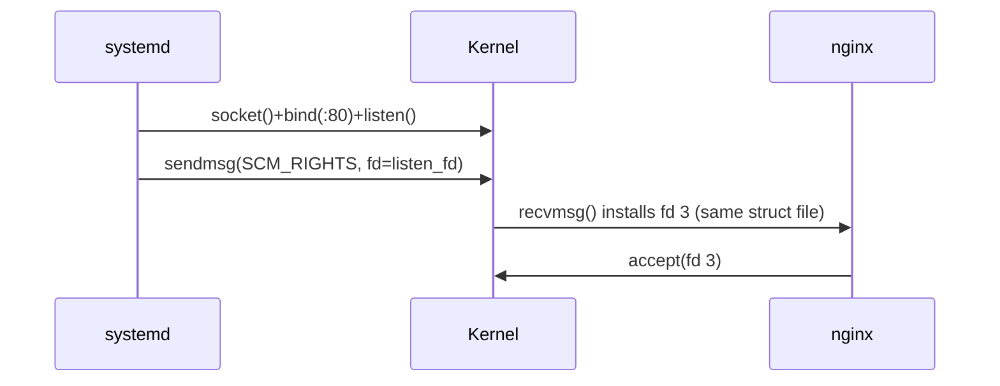

# Pipes, FIFOs & Unix Sockets

> **Goal:** understand the kernel's inter-process communication primitives —
> anonymous pipes, named FIFOs, and Unix domain sockets — and see them as the
> hidden plumbing behind shells, systemd, databases, and container runtimes.

## The kernel's IPC toolbox

Processes are isolated by design — separate address spaces, separate file
descriptor tables (see [Processes & Threads](#/processes)). The kernel
provides three fundamental byte-stream mechanisms to let them talk:

| Mechanism | Persistent name? | Scope | Bidirectional? |
|---|---|---|---|
| **Anonymous pipe** | No (inherited by fd) | Parent↔child or shared ancestor only | Unidirectional |
| **Named pipe (FIFO)** | Yes (inode in filesystem) | Any process with path access | Unidirectional |
| **Unix domain socket** | Yes (inode in filesystem, or abstract name) | Any process with path/namespace access | Bidirectional (stream, datagram, or seqpacket) |

Pipes and FIFOs share one implementation
([fs/pipe.c](https://elixir.bootlin.com/linux/v6.12/source/fs/pipe.c)); Unix
sockets live in [net/unix/](https://elixir.bootlin.com/linux/v6.12/source/net/unix).
All three plug into the [VFS](#/filesystems) through `struct file` and
`file_operations`, so they work with the syscalls you already know: `read()`,
`write()`, `close()`, `poll()`, `epoll`, `splice()`, `sendmsg()`. That
uniformity is the point: a shell doesn't care whether fd 1 is a terminal, a
file, or a pipe.

These three are the *byte-stream* family. They are not the whole IPC universe:
System V and POSIX message queues, POSIX shared memory (`shm_open` + `mmap`),
futexes, and `eventfd`/`signalfd`/`memfd` all exist for cases these three
handle poorly — shared memory when you truly cannot afford a copy, message
queues when you need prioritized fixed-size records. But pipes, FIFOs, and Unix
sockets carry the overwhelming majority of real IPC traffic on a running Linux
box, and they share a single mental model: a kernel-owned buffer, a wait queue,
and a wake-up. Master that model and the rest are variations.

**Which one do you actually want?** A quick decision guide before the details:

- Data flows one way between processes you *fork* yourself → **anonymous pipe**.
- You need a fixed rendezvous point in the filesystem for a one-shot,
  unidirectional handoff between unrelated processes → **FIFO**.
- Anything else — request/response, passing fds or credentials, a long-lived
  daemon accepting many clients, message boundaries — → **Unix socket**. When
  in doubt, this is the answer, which is why modern Linux is saturated with them.

## Anonymous pipes: the shell's secret weapon

When you type `ls -l | grep txt`, the shell calls `pipe()` before forking:

```text
shell
  │
  pipe([3, 4])     ← creates two fds: 3=read end, 4=write end
  │
  fork()           ← child 1: ls -l
  │   │
  │   close(3)     ← child doesn't need the read end
  │   dup2(4, 1)   ← redirect stdout (fd 1) to write end
  │   close(4)
  │   exec(ls)
  │
  fork()           ← child 2: grep txt
      │
      close(4)     ← child doesn't need the write end
      dup2(3, 0)   ← redirect stdin (fd 0) to read end
      close(3)
      exec(grep txt)

Result: ls writes → pipe buffer → grep reads. Neither knows the pipe exists.
```

The fd-closing choreography matters: the pipe only reports EOF to `grep` when
*every* copy of the write end is closed. A shell that forgot `close(4)` in the
second child would leave `grep` hanging forever, waiting for data from a write
end that `grep` itself still holds open. This "who still holds the write end?"
question is the single most common pipe bug in real programs. The kernel tracks
it with two plain reference counts (`pipe->readers`, `pipe->writers`) that are
decremented in [pipe_release()](https://elixir.bootlin.com/linux/v6.12/C/ident/pipe_release)
each time a fd for that end is closed; EOF and `SIGPIPE` fire when a count hits
zero.

### Inside the pipe: `struct pipe_inode_info`

At the kernel level, `pipe()` (really `pipe2()`, via
[do_pipe2()](https://elixir.bootlin.com/linux/v6.12/C/ident/do_pipe2))
allocates one
[struct pipe_inode_info](https://elixir.bootlin.com/linux/v6.12/C/ident/pipe_inode_info)
and wires two `struct file`s to it — one opened read-only, one write-only,
both using the same
[pipefifo_fops](https://elixir.bootlin.com/linux/v6.12/C/ident/pipefifo_fops)
operations table. The fields that matter:

```c
struct pipe_inode_info {
    struct mutex     mutex;      // serializes all readers & writers
    wait_queue_head_t rd_wait;   // readers sleep here when pipe is empty
    wait_queue_head_t wr_wait;   // writers sleep here when pipe is full
    unsigned int     head, tail; // ring indices: writer bumps head, reader bumps tail
    unsigned int     ring_size;  // number of slots (power of two, default 16)
    unsigned int     max_usage;  // capacity ceiling in slots
    unsigned int     readers, writers;  // count of open ends (for EOF/SIGPIPE)
    struct pipe_buffer *bufs;    // the ring itself
    ...
};
```

The pipe is **not** one contiguous circular byte buffer. It's a ring of
[struct pipe_buffer](https://elixir.bootlin.com/linux/v6.12/C/ident/pipe_buffer)
slots, each describing one page:

```c
struct pipe_buffer {
    struct page *page;       // the actual data page
    unsigned int offset, len; // valid bytes within that page
    const struct pipe_buf_operations *ops;
    unsigned int flags;      // e.g. PIPE_BUF_FLAG_CAN_MERGE
    ...
};
```

The default ring is 16 slots × one page = **64 KiB** on x86-64 with its 4 KiB
default pages (`PIPE_DEF_BUFFERS` is 16). Because each slot holds one page,
capacity is page-size dependent: arm64 configured with 64 KiB pages gets a
1 MiB default from the same 16 slots — a genuinely observable architecture
difference (arm64 supports 4/16/64 KiB page sizes; x86-64 uses 4 KiB). The
head/tail-index ring design dates from kernel 5.5; before that the same idea
used `curbuf`/`nrbufs` counters. Since 4.5, if a user already holds a lot of
pipe memory (past `/proc/sys/fs/pipe-user-pages-soft`, default 16384 pages),
new unprivileged pipes are created with only **1 slot** rounded up — in
practice a small pipe — a classic "why is my pipeline suddenly slow on this
busy box" surprise.

Slots are allocated lazily. An idle pipe holds the `bufs` array but no data
pages; pages are grabbed from the page allocator on the first `write()` and
freed as the reader drains them (unless they came from `splice()`, in which case
the slot just drops a reference — more below).

The blocking semantics, precisely:

- **Read from empty pipe** → blocks on `rd_wait` (or returns `EAGAIN` with
  `O_NONBLOCK`). Returns 0 (EOF) only when `pipe->writers == 0`.
- **Write to full pipe** → blocks on `wr_wait` (or `EAGAIN`).
- **Write when `pipe->readers == 0`** → the kernel sends `SIGPIPE` to the
  writer *and* the `write()` returns `-EPIPE`. The default disposition of
  SIGPIPE is to terminate the process (see
  [Signals](#/signals)); a process that ignores or handles SIGPIPE just sees
  the `EPIPE` error. This is a reliability feature: it's what kills the left
  side of `yes | head` instead of letting it spin forever, and it's why
  pipelines are self-cleaning.
- **Atomicity:** writes of at most `PIPE_BUF` bytes — **4096 on Linux**
  (POSIX only guarantees 512) — are atomic: they are never interleaved with
  other writers' data. That's why ten shell jobs can append single-line
  records to one FIFO without producing garbled half-lines. Larger writes may
  be split, and a blocked large write can interleave with others at page
  boundaries.

### Waking up: poll, epoll, and the empty→non-empty edge

Pipes are a favorite of event loops, so their `poll` behavior is worth
pinning down. The read end is *readable* when the pipe holds data **or** when
`writers == 0` (so EOF wakes a poller too); the write end is *writable* when
there is room for at least one `PIPE_BUF`-sized write, or when `readers == 0`
(so a broken pipe also wakes the poller, who then gets `EPIPE`). The kernel
does not wake sleepers on every byte: `pipe_write()` only kicks `rd_wait` and
`epoll` watchers when it transitions the pipe from empty to non-empty, and
`pipe_read()` only wakes writers when it frees space in a previously full ring.
This edge-triggered internal wake-up is why a lazy reader that never drains can
stall a writer indefinitely with no extra wake-up churn — and why level- vs
edge-triggered `epoll` (`EPOLLET`) on a pipe fd needs the usual "drain until
`EAGAIN`" discipline.

Every wake-up here bottoms out in the scheduler: the woken task is placed back
on a CPU runqueue and the scheduler (EEVDF since 6.6, which replaced CFS)
decides when it actually runs — see [CPU Scheduling](#/scheduling). On a busy
box, that scheduling latency, not the copy, dominates small-message pipe
round-trips.

Two lesser-known `pipe2()` flags: `O_DIRECT` (since 3.4) switches the pipe to
**packet mode**, where each `write()` becomes one discrete packet and each
`read()` returns at most one packet — datagram semantics on a pipe. And
`O_NOTIFICATION_PIPE` (since 5.8) turns the pipe into a kernel notification
queue for `watch_queue` events (key/keyring and, later, block-layer changes).

```bash
ls -l /proc/$$/fd            # your shell's open descriptors
ls -l /proc/self/fd | grep pipe   # pipes show as "pipe:[inode number]"
# The inode number is how you match up both ends across processes:
lsof | grep 'pipe' | head    # or: find /proc/*/fd -lname 'pipe:*' 2>/dev/null
```

### `splice()`, `tee()`, `vmsplice()`: zero-copy pipe plumbing

Because a pipe is a ring of *page references*, not a byte array, the kernel
can move data into and out of a pipe **without copying it through user
space** — it just makes pipe slots point at existing pages:

```c
// Move data from a socket into a pipe (no userspace copy):
splice(sock_fd, NULL, pipe_write_fd, NULL, len, SPLICE_F_MOVE);
// Move from the pipe into a file or another socket:
splice(pipe_read_fd, NULL, file_fd, &offset, len, SPLICE_F_MOVE);
```

`splice()` from a file makes pipe buffers point directly at **page-cache
pages** (see [Virtual Memory](#/memory) and
[Lab: Watch the Page Cache Work](#/lab-page-cache)); the buffer's `ops` become
the page-cache buffer ops, so releasing the slot drops a page reference rather
than freeing a page. `tee()` duplicates pipe contents into a second pipe
without consuming them (it just bumps the reference count on the shared pages);
`vmsplice()` maps user memory pages into a pipe, and with `SPLICE_F_GIFT` the
pages are donated to the kernel. `sendfile(out_fd, in_fd, ...)` is the same
machinery with the intermediate pipe hidden inside the kernel — it's how
nginx serves static files: page cache → socket, zero user-space copies. One
honest caveat: `SPLICE_F_MOVE` has been a hint the kernel largely ignores for
years; the win is the avoided *userspace* copy, not literal page stealing.
[Modern I/O & io_uring](#/modern-io) covers where zero-copy I/O went next.

> **Security aside — Dirty Pipe (CVE-2022-0847).** This page-reference design
> had a famous failure. When `splice()` inserted page-cache pages into a pipe,
> a code path forgot to clear the buffer `flags` field. If a leftover
> `PIPE_BUF_FLAG_CAN_MERGE` flag was set, a subsequent ordinary `write()` to
> the pipe would "merge" its data *into the page-cache page itself* —
> letting any unprivileged user overwrite the cached contents of read-only
> files (like `/etc/passwd` or a setuid binary). Fixed in 5.16.11 / 5.15.25
> (Feb 2022). One uninitialized field, full local privilege escalation.

## Named pipes (FIFOs): pipes with a filesystem address

A FIFO is an inode of type `S_IFIFO` in a filesystem. Once opened, it behaves
exactly like an anonymous pipe — same `pipe_inode_info`, same code paths:

```bash
mkfifo /tmp/myfifo
echo hello > /tmp/myfifo &       # blocks until a reader opens it!
cat /tmp/myfifo                  # unblocks the writer, prints "hello"
ls -l /tmp/myfifo                # prw-r--r--   ← 'p' = fifo
```

One correction to a common misconception: a FIFO inode holds **one** pipe
object (`inode->i_pipe`), shared by *all* openers. Two readers do **not** get
independent copies of the stream — each byte written goes to whichever reader
happens to `read()` it first. A FIFO is a rendezvous point around a single
shared pipe, not a broadcast channel. (If you need one-to-many, you want a
Unix socket with multiple connections.)

The open-time blocking rules, handled by
[fifo_open()](https://elixir.bootlin.com/linux/v6.12/C/ident/fifo_open):

| `open()` mode | No counterpart yet | With `O_NONBLOCK` |
|---|---|---|
| `O_RDONLY` | blocks until a writer opens | succeeds immediately |
| `O_WRONLY` | blocks until a reader opens | fails with `ENXIO` |
| `O_RDWR` | succeeds immediately (Linux behavior) | succeeds immediately |

`O_RDWR` on a FIFO is technically unspecified by POSIX, but on Linux it opens
without blocking and gives you both ends. That trick — opening your own FIFO
read-write so the pipe never sees "zero writers" — is a standard daemon idiom
to avoid an EOF storm when intermittent writers come and go: without a held
write end, the reader gets a stream of EOFs every time the last external writer
closes, and a naive `read()` loop spins.

FIFOs in the wild (rarer than they used to be — Unix sockets ate their lunch):

- **SysV init** used `/run/initctl` (a FIFO) as its control channel; `telinit`
  wrote request structs into it.
- **Nagios/Icinga** accept external commands through a FIFO command file.
- **Shell plumbing** — process substitution `<(cmd)` is implemented with a
  FIFO or `/dev/fd` on most systems, and `mkfifo` shows up for fan-in/fan-out
  in build and ETL pipelines.
- **CI log capture** — a FIFO lets a supervisor read a job's output without a
  temp file hitting disk.

(Contrary to a widespread claim, `/dev/log` was historically a Unix
*datagram socket*, not a FIFO — today it's a symlink to systemd-journald's
socket `/run/systemd/journal/dev-log`.)

## Unix domain sockets: the workhorse of modern Linux IPC

Unix sockets (`AF_UNIX`, alias `AF_LOCAL`) are the real show. They present the
full sockets API — `socket()`, `bind()`, `listen()`, `accept()`, `connect()`,
`sendmsg()`, `recvmsg()` — but never touch the
[networking stack](#/networking): no IP, no TCP, no checksums, no NIC. The
address is a **pathname in the filesystem** or an abstract name in a
per-network-namespace kernel table:

```c
// Server:
int s = socket(AF_UNIX, SOCK_STREAM, 0);
struct sockaddr_un addr = { .sun_family = AF_UNIX, .sun_path = "/tmp/mysock" };
bind(s, (struct sockaddr*)&addr, sizeof(addr));   // creates the socket inode
listen(s, 128);
int client = accept(s, NULL, NULL);               // new fd per client
```

`sun_path` is at most **108 bytes** including the NUL — a real limit you hit
with deeply nested container runtime directories, and one reason runtimes lean
on the abstract namespace or short symlink-heavy paths. `bind()` creates the
inode; it is *not* removed on `close()`, so servers must `unlink()` old socket
files or they get `EADDRINUSE` on restart. An unbound socket that sends is
given an automatic abstract name (autobind: an `@` name like `@0000a`), so
`recvmsg()` on the other side always has a return address.

```bash
socat UNIX-LISTEN:/tmp/mysock,fork - &      # server
echo hello | socat - UNIX-CONNECT:/tmp/mysock   # client
```

Unix sockets support **all three socket types**:

- `SOCK_STREAM` — connection-oriented, reliable, byte stream (feels like TCP).
- `SOCK_DGRAM` — preserves message boundaries; unlike UDP it is **reliable
  and ordered**, because there's no network to lose or reorder anything — but
  a full receiver queue makes the sender block or return `EAGAIN` rather than
  silently drop.
- `SOCK_SEQPACKET` — connection-oriented *and* message-preserving. Each
  `send()` is exactly one `recv()`. Used by systemd and multipathd; arguably
  what most local protocols actually want.

### How they work inside

A connected Unix stream socket is a pair of
[struct unix_sock](https://elixir.bootlin.com/linux/v6.12/C/ident/unix_sock)
objects pointing at each other:

```c
struct unix_sock {
    struct sock       sk;      // generic socket bookkeeping
    struct unix_address *addr; // bound name (path or abstract), if any
    struct path       path;    // dentry+mount of the filesystem inode
    struct sock       *peer;   // the other end of the connection
    ...
};
```

There is no shared ring buffer: `sendmsg()` allocates an **sk_buff** (the
same [struct sk_buff](https://elixir.bootlin.com/linux/v6.12/C/ident/sk_buff)
used by the network stack — see [The Networking Stack](#/networking)), copies
the user data into it once, and queues it directly on the *peer's*
`sk_receive_queue`. `recvmsg()` copies it out once. Two copies total,
kernel-mediated, no protocol processing in between. For `SOCK_STREAM` the
receiver coalesces across skbs and can return a partial read; for `SOCK_DGRAM`
and `SOCK_SEQPACKET` one skb is one message and the boundary is preserved.

Flow control is the socket buffer accounting you already know: in-flight bytes
are charged against the sender's send buffer, capped by `SO_SNDBUF`, which
defaults to `net.core.wmem_default` (**212992 bytes ≈ 208 KiB** on stock
kernels; the value you set with `SO_SNDBUF` is doubled internally for
bookkeeping). When the peer's receive buffer (`SO_RCVBUF`, default
`net.core.rmem_default`, also ~208 KiB) is full, a `SOCK_STREAM` sender blocks
in [unix_stream_sendmsg()](https://elixir.bootlin.com/linux/v6.12/C/ident/unix_stream_sendmsg)
on the peer's write-space wait queue; a `SOCK_DGRAM` sender blocks (or gets
`EAGAIN`) until the receive queue drains. There is no sliding window and no
congestion control because there is nothing to congest — just two queues and a
mutex.

Because `connect()`/`accept()` are just object creation plus a wait-queue
handshake — no SYN/SYN-ACK/ACK round trips — connection setup is one syscall
each side. On a typical modern x86-64 machine, a one-byte request/response
round trip over a Unix socket costs on the order of **5–10 µs**; TCP over
loopback is typically 2–3× that, and bulk throughput over Unix sockets
commonly measures around twice localhost TCP. Not a revolution, but free.

> **eBPF link:** since ~5.7 the kernel supports `AF_UNIX` sockets in a
> `BPF_MAP_TYPE_SOCKMAP`/`SOCKHASH`, so a `sk_msg` program can redirect stream
> data from one Unix (or TCP) socket straight to another's receive queue,
> skipping the sender's `recvmsg`/`sendmsg` bounce entirely. This is the
> engine behind service-mesh sidecar acceleration (e.g. Cilium): two local
> sockets get short-circuited in kernel space. See
> [eBPF Internals](#/ebpf-internals).

### Key advantages over TCP sockets

| Feature | Unix socket | TCP socket |
|---|---|---|
| Address | Filesystem path (`/run/mysock`) | IP:port (`127.0.0.1:5432`) |
| Credential passing | Yes — kernel-verified PID/UID/GID of peer | No |
| File descriptor passing | Yes — `sendmsg()` with `SCM_RIGHTS` | No |
| Access control | Filesystem permissions on the socket inode and its directory | Anyone who can reach the address (unless firewalled) |
| Protocol overhead | None: memcpy into an skb, queue, wake | Handshake, sequence numbers, checksums, congestion control ([TCP Congestion Control & Tuning](#/tcp-congestion)) |
| Namespacing | Abstract names are per **network namespace** | Ports are per network namespace |

The **abstract namespace** (a `sun_path` starting with a NUL byte, written
`@name` by tools like `ss`) has no filesystem inode at all: no permissions
(any process in the same network namespace can connect — mind that in
multi-tenant setups), no stale files to clean up, and automatic disappearance
when the last user closes it. D-Bus session buses, Wayland in some setups,
and lots of desktop plumbing use it. Because it's scoped to the network
namespace, it's also one of the walls between containers — see
[Namespaces](#/namespaces).

> **Container link:** `/var/run/docker.sock` is a `SOCK_STREAM` Unix socket
> speaking HTTP. Filesystem permissions are its *only* access control —
> which is why membership in the `docker` group is root-equivalent: the API
> behind that socket can start a privileged container with `/` bind-mounted.
> The whole runtime chain (dockerd → containerd → shim) talks over Unix
> sockets; see [Docker, containerd, runc](#/container-runtimes).

### File descriptor passing: the kernel superpower

A Unix socket can transfer **open file descriptors** between unrelated
processes. The sender attaches fds as an `SCM_RIGHTS` control message; the
kernel takes a reference on each underlying `struct file` and, on receipt,
installs *new* fd numbers in the receiver that point to the *same* open file
description — same offset, same flags, same everything:

```c
// Sender: msg.msg_control holds a cmsghdr with cmsg_type = SCM_RIGHTS
sendmsg(sock, &msg, 0);
// Receiver:
recvmsg(sock, &msg, 0);   // kernel has already fd_install()ed the new fds
```

Up to `SCM_MAX_FD` = **253 fds per message**. This works for any fd: files,
sockets, pipes, memfds, pidfds, even other Unix sockets. It's how:

- **systemd socket activation** works: systemd `bind()`s and `listen()`s on,
  say, port 80 at boot, then hands the listening fd to the service over a
  Unix socket pair (`sd_listen_fds()` on the receiving side). The service
  never calls `bind()` and can be started lazily on first connection.
- **Container runtimes** pass the container's stdio and the console PTY fd
  from runc to the shim to containerd — see
  [Build a Container by Hand](#/build-a-container).
- **PostgreSQL** and other preforking servers hand accepted client
  connections to worker processes.
- **Wayland compositors** pass GPU buffer fds (dma-buf) to clients — every
  frame you see crossed a Unix socket as an fd.



There's a dark corner: fds can carry Unix sockets, and those sockets can
themselves hold queued messages containing fds — including, circularly, each
other. Two processes can build a reference cycle and exit, leaving files
alive with no reachable owner. The kernel runs a special **garbage collector**
([unix_gc()](https://elixir.bootlin.com/linux/v6.12/C/ident/unix_gc)) just
for in-flight `SCM_RIGHTS` fds; as of 6.10 it was rewritten to model in-flight
fds as an explicit graph and detect dead cycles with Tarjan's
strongly-connected-components algorithm. Yes: there is a graph-theory garbage
collector in the kernel purely because of this one feature. (The pre-6.10
version was the source of several subtle bugs and lock-ordering headaches; the
rewrite made the invariant explicit — an in-flight fd is a graph edge — which
is the real lesson.)

### Credential passing: kernel-verified identity

A peer can ask the kernel who is on the other end:

```c
struct ucred creds;
socklen_t len = sizeof(creds);
getsockopt(sock, SOL_SOCKET, SO_PEERCRED, &creds, &len);
// creds.pid, creds.uid, creds.gid — captured at connect() time, unforgeable
```

`SO_PEERCRED` is a *one-shot snapshot* of the peer taken when the connection
was established — it never changes for the life of the connection, which is
exactly what you want for authentication. This is the foundation of D-Bus
authentication, polkit decisions, and systemd's permission model: no passwords,
no tokens — the kernel itself vouches for the caller's UID. Its per-message
cousin, `SCM_CREDENTIALS` (enabled with the `SO_PASSCRED` socket option),
attaches the sender's credentials to *each datagram* and is used with
`SOCK_DGRAM` control channels; the kernel validates that a process can only
claim its own PID/UID (or others if it holds `CAP_SYS_ADMIN`/`CAP_SETUID`).
Two further refinements worth knowing:

- Credentials are translated across [user namespaces](#/namespaces): a
  container's "root" shows up as its mapped host UID.
- A PID can be recycled between `connect()` and your permission check. Since
  kernel 6.5, `SO_PEERPIDFD` returns a **pidfd** for the peer instead —
  race-free process identity that a later `pidfd_send_signal()` or
  `/proc/<pid>` lookup can trust. dbus-broker and systemd already use it.

## Where you find them in the wild

```bash
ss -xlpn | grep -E 'dbus|journal'      # D-Bus & journald listeners
ls -l /run/user/$(id -u)/bus           # your session bus socket
ls -l /var/run/postgresql/.s.PGSQL.5432 2>/dev/null   # PostgreSQL
ls -l /var/run/docker.sock 2>/dev/null # Docker API (root-equivalent!)
ls -l /tmp/.X11-unix/X0 2>/dev/null    # X11
ls -l $XDG_RUNTIME_DIR/wayland-0 2>/dev/null  # Wayland
```

The `ss` command is your Unix-socket x-ray (see
[/proc, strace, perf & eBPF](#/observability) for the broader toolkit):

```bash
ss -xpan                         # all Unix sockets, with owning process
ss -xln                          # listening Unix sockets ('@' prefix = abstract)
ss -xp state established | wc -l # active connections right now
```

Run `ss -xlpn` on any desktop and count: a quiet laptop easily has 100+ Unix
sockets open. This chapter is describing the busiest IPC path on your machine.

## Pipe capacity: the forgotten tuning knob

The default pipe capacity is 64 KiB (16 pages on x86-64). For high-throughput
local shuffling — gigabytes between a producer and a consumer — that creates a
ping-pong effect: producer fills 64 KiB, blocks, consumer drains, producer
wakes... and context switches (each costing roughly 1–3 µs of direct CPU plus
the harder-to-measure cache and TLB damage) start to dominate.

The fix: `fcntl(fd, F_SETPIPE_SZ, 1048576)` grows the ring (the kernel rounds
up to a power-of-two number of pages). Unprivileged processes can grow a pipe
up to `/proc/sys/fs/pipe-max-size` (**1 MiB default**); `CAP_SYS_RESOURCE`
can go beyond. Per-user aggregate limits apply:

```bash
cat /proc/sys/fs/pipe-max-size          # per-pipe max for unprivileged users (default 1048576)
cat /proc/sys/fs/pipe-user-pages-soft   # past this, new pipes get minimal rings (default 16384 pages)
cat /proc/sys/fs/pipe-user-pages-hard   # hard cap on a user's total pipe memory (0 = unlimited)
```

`F_GETPIPE_SZ` reads the current capacity back. Rule of thumb: if
`pv source | consumer`-style pipelines show both sides far below 100% CPU,
measure with a bigger pipe before reaching for shared memory — you often
recover most of the gap for one `fcntl()`.

## Follow the code (kernel v6.12)

### Path 1: `write()` to a pipe

1. The `write(fd, buf, n)` syscall enters
   [ksys_write()](https://elixir.bootlin.com/linux/v6.12/C/ident/ksys_write)
   → [vfs_write()](https://elixir.bootlin.com/linux/v6.12/C/ident/vfs_write),
   which dispatches through the file's `f_op` — for a pipe fd that's
   [pipefifo_fops](https://elixir.bootlin.com/linux/v6.12/C/ident/pipefifo_fops),
   landing in
   [pipe_write()](https://elixir.bootlin.com/linux/v6.12/C/ident/pipe_write)
   in `fs/pipe.c`. (This is [VFS](#/filesystems) dispatch working exactly as
   advertised: pipes are just files with unusual `f_op`.)
2. `pipe_write()` takes `pipe->mutex` — one plain mutex serializes all
   readers and writers of this pipe (see
   [Kernel Synchronization](#/kernel-sync)). First check: if
   `pipe->readers == 0`, send `SIGPIPE` to the current task and return
   `-EPIPE`.
3. If the most recent slot (`head - 1`) has spare room in its page and its
   buffer has `PIPE_BUF_FLAG_CAN_MERGE`, the new data is appended there — this
   merge is why many small writes don't burn one page each (and the flag is
   the one at the heart of Dirty Pipe).
4. Otherwise, if the ring isn't full (`head - tail < max_usage`), allocate a
   fresh page, copy user data into it with
   [copy_page_from_iter()](https://elixir.bootlin.com/linux/v6.12/C/ident/copy_page_from_iter),
   fill in a `pipe_buffer`, and advance `head`.
5. If the ring *is* full: with `O_NONBLOCK` return `-EAGAIN`; otherwise wake
   any readers and sleep on `pipe->wr_wait` until a reader frees a slot.
6. On the way out, if the pipe was empty when we started, wake sleepers on
   `pipe->rd_wait` and kick `epoll` watchers.

The mirror image,
[pipe_read()](https://elixir.bootlin.com/linux/v6.12/C/ident/pipe_read),
copies out of the `tail` buffer with
[copy_page_to_iter()](https://elixir.bootlin.com/linux/v6.12/C/ident/copy_page_to_iter),
and when a buffer is drained releases it (freeing the page — or just dropping
a page-cache reference if the buffer came from `splice()`), advances `tail`,
and wakes writers. Returns 0 (EOF) only if the pipe is empty *and*
`pipe->writers == 0`.

### Path 2: sending an fd with `SCM_RIGHTS`

1. `sendmsg()` on a connected Unix stream socket reaches
   [unix_stream_sendmsg()](https://elixir.bootlin.com/linux/v6.12/C/ident/unix_stream_sendmsg)
   in `net/unix/af_unix.c`.
2. Control messages are parsed by
   [__scm_send()](https://elixir.bootlin.com/linux/v6.12/C/ident/__scm_send):
   for `SCM_RIGHTS` it looks up each fd in the sender's fd table, takes a
   reference on each `struct file`, and collects them in a
   [struct scm_fp_list](https://elixir.bootlin.com/linux/v6.12/C/ident/scm_fp_list)
   (max 253 entries).
3. The data is copied into an sk_buff; the `scm_fp_list` rides along in the
   skb's control block, and the GC bookkeeping (the in-flight fd graph used
   by [unix_gc()](https://elixir.bootlin.com/linux/v6.12/C/ident/unix_gc))
   is updated. The skb is queued on `other->sk_receive_queue`, where `other`
   is the peer `struct sock`, and the peer is woken.
4. The receiver's `recvmsg()` path
   ([unix_stream_recvmsg()](https://elixir.bootlin.com/linux/v6.12/C/ident/unix_stream_recvmsg))
   dequeues the skb, copies the payload to user space, and
   [scm_detach_fds()](https://elixir.bootlin.com/linux/v6.12/C/ident/scm_detach_fds)
   allocates fresh fd numbers in the *receiver's* table, each installed to
   point at the passed `struct file`. From this moment the receiver owns
   fully functional descriptors — same open file description as the sender's.

Note what never happens in either path: no protocol headers, no checksums, no
retransmission logic. The "network" of a Unix socket is a mutex, a queue, and
a wake-up.

## Try it yourself

```bash
# Watch a shell build a pipeline (pipe2 + dup2 + fork):
strace -f -e trace=pipe2,dup2,clone,execve sh -c 'ls | wc -l' 2>&1 | head -20

# Named pipe rendezvous:
mkfifo /tmp/demo && (sleep 2; echo hello > /tmp/demo) & cat /tmp/demo

# Prove FIFO readers SHARE one stream (each line goes to only one reader):
mkfifo /tmp/shared; cat /tmp/shared & cat /tmp/shared &
seq 1 10 > /tmp/shared; sleep 1; kill %1 %2 2>/dev/null; rm /tmp/shared

# Inspect and grow a pipe's capacity from the shell (bash only reads it here):
cat /proc/sys/fs/pipe-max-size
dd if=/dev/zero bs=1M count=4096 2>/dev/null | cat > /dev/null  # baseline throughput

# SIGPIPE in action — yes dies the moment head exits:
yes | head -1 >/dev/null; echo "yes exit status: ${PIPESTATUS[0]}"  # 141 = 128+SIGPIPE(13)

# Unix sockets on your system RIGHT NOW:
ss -xpan | head -20
ss -xln | grep '@'                    # abstract-namespace sockets

# See who's on the other end of a socket (peer credentials via ss):
ss -xp state connected | head

# Talk HTTP to Docker over its Unix socket (if installed):
curl --unix-socket /var/run/docker.sock http://localhost/version 2>/dev/null
```

## Check your understanding

1. What happens when a process writes to a pipe whose read end has been
closed — and why is this a production reliability feature rather than a bug?

<details><summary>Show answer</summary>

The kernel sends `SIGPIPE` to the writer and the `write()` returns `-EPIPE`
(the process only sees `EPIPE` if it ignores or handles SIGPIPE). Since
SIGPIPE kills by default, this is what terminates the left side of
`yes | head` — pipelines automatically tear themselves down when the consumer
exits, instead of leaking runaway producers.

</details>

2. Two processes each open the same FIFO for reading, and a third writes 100
lines into it. Do both readers see all 100 lines?

<details><summary>Show answer</summary>

No. A FIFO inode holds a single shared pipe object (`inode->i_pipe`), so the
readers compete: each byte is consumed by exactly one of them, and the split
is effectively arbitrary. A FIFO is a rendezvous around one pipe, not a
broadcast channel — for one-to-many delivery you need per-client Unix socket
connections.

</details>

3. Why is a pipe a ring of `pipe_buffer` slots pointing at pages rather than
one contiguous byte buffer — and what capability does that design unlock?

<details><summary>Show answer</summary>

Because each slot is a page *reference*, the kernel can splice pages into and
out of a pipe without copying through user space: `splice()`/`sendfile()` make
slots point directly at page-cache pages, `tee()` shares them by refcount, and
`vmsplice()` maps user pages in. The same design is what made Dirty Pipe
possible — a stale `PIPE_BUF_FLAG_CAN_MERGE` let a `write()` scribble into a
shared page-cache page.

</details>

4. How does systemd's socket activation work at the fd level?

<details><summary>Show answer</summary>

systemd creates and binds the listening socket itself (`socket()` +
`bind()` + `listen()`), then passes the open fd to the service using
`sendmsg()` with an `SCM_RIGHTS` control message over a Unix socket. The
kernel installs a new fd in the service pointing at the same
`struct file`, so the service (told via `sd_listen_fds()` which fds it got)
starts `accept()`ing without ever calling `bind()`.

</details>

5. What's the security implication of `/var/run/docker.sock` being a Unix
socket writable by the `docker` group?

<details><summary>Show answer</summary>

Filesystem permission on the socket inode is the only gate, and the API
behind it lets you create privileged containers, bind-mount `/`, and run
commands as root inside them. So write access to docker.sock is
root-equivalent on the host — `docker` group membership should be treated
exactly like sudo.

</details>

6. Why are Unix sockets faster than TCP over localhost, and what accounting
still limits how much a `SOCK_STREAM` sender can push before it blocks?

<details><summary>Show answer</summary>

A Unix send is: copy into an sk_buff, queue it on the peer's receive queue,
wake the peer — no handshake, headers, checksums, congestion control, or
loopback processing. But in-flight bytes are charged against `SO_SNDBUF`
(default `net.core.wmem_default`, ~208 KiB) and the peer's `SO_RCVBUF`; when
the peer's receive queue is full the sender blocks on its write-space wait
queue. That's the only "flow control" — two queues, no window.

</details>

7. Your producer/consumer pipeline maxes out at 60% CPU on both sides. Which
pipe knob do you check, and what's the mechanism?

<details><summary>Show answer</summary>

Grow the pipe with `fcntl(fd, F_SETPIPE_SZ, ...)` (up to
`/proc/sys/fs/pipe-max-size`, 1 MiB by default for unprivileged users). With
the default 64 KiB ring, producer and consumer ping-pong: fill, block, drain,
wake — and context-switch overhead dominates. A bigger ring means longer
uninterrupted bursts and far fewer switches. Also check
`pipe-user-pages-soft`: past it, new pipes shrink to a minimal ring.

</details>

8. Why does the kernel need a garbage collector for Unix sockets?

<details><summary>Show answer</summary>

Because `SCM_RIGHTS` messages can contain Unix socket fds, two sockets can
end up queued *inside each other's* receive buffers. If the owning processes
then exit, the reference cycle keeps both `struct file`s alive with no one
able to reach them. `unix_gc()` finds and frees such dead cycles — since
kernel 6.10 by building an explicit graph of in-flight fds and running
Tarjan's SCC algorithm on it.

</details>

## Sources & further reading

- [pipe(7) — man7.org](https://man7.org/linux/man-pages/man7/pipe.7.html) — capacity, `PIPE_BUF` atomicity, `O_DIRECT` packet mode, all the `/proc` knobs.
- [fifo(7) — man7.org](https://man7.org/linux/man-pages/man7/fifo.7.html) — FIFO open semantics.
- [unix(7) — man7.org](https://man7.org/linux/man-pages/man7/unix.7.html) — address formats, abstract namespace, `SCM_RIGHTS`, `SCM_CREDENTIALS`, `SO_PEERCRED`, `SO_PEERPIDFD`.
- [cmsg(3) — man7.org](https://man7.org/linux/man-pages/man3/cmsg.3.html) — how to actually build ancillary messages without off-by-one bugs.
- [fs/pipe.c in v6.12](https://elixir.bootlin.com/linux/v6.12/source/fs/pipe.c) and [net/unix/](https://elixir.bootlin.com/linux/v6.12/source/net/unix) — the code this chapter summarizes.
- [The Dirty Pipe vulnerability (Max Kellermann, CVE-2022-0847)](https://dirtypipe.cm4all.com/) — a forensic walk from a corrupted log file to a pipe-buffer flag; the best pipe-internals write-up ever published.
- "The unfinished business of the AF_UNIX garbage collector" — LWN's coverage of the 6.10 Tarjan-based GC rewrite (search lwn.net if the title has drifted).
- [sd_listen_fds(3) — man7.org](https://man7.org/linux/man-pages/man3/sd_listen_fds.3.html) — the receiving end of socket activation.

---

**Next:** Part IV. We take everything so far — processes, signals, pipes, the
networking stack — and discover that [containers](#/containers-overview) were
hiding in plain sight all along. Kernel features you already understand,
combined to lie to a process about the world.
