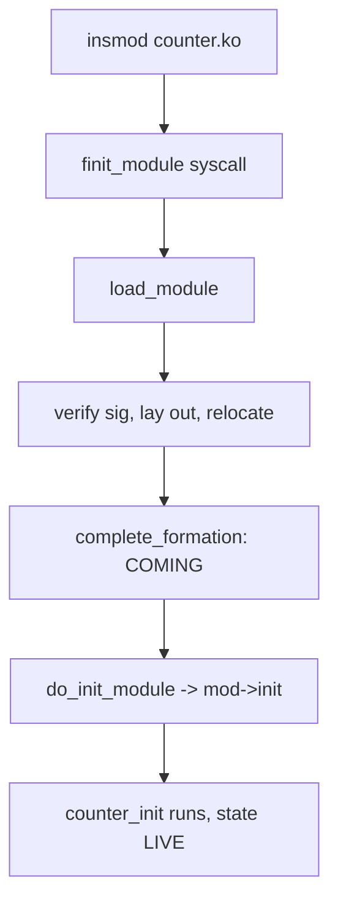

# Reading & Building the Kernel

> **Goal:** lose your fear of the source. Where the code lives, how to read
> it without drowning, how the build system actually turns C into a bootable
> image, how to build and boot your own kernel safely in a VM, a first real
> module — and a map for everything after this site.

## The territory

The kernel tree is around 40 million lines across ~80,000 files, but that
number lies about the difficulty. More than 60% of it is `drivers/`, and you
will never read most of it. The *core* — scheduler, memory manager, VFS, the
network stack — is a few hundred thousand lines, and you already know most of
the rooms from earlier chapters. Here is the map:

```text
linux/
├── kernel/        core: scheduler (sched/), fork.c, signals, cgroups, time
├── mm/            memory management: page faults, page cache, OOM killer
├── fs/            VFS (namei.c, open.c, read_write.c) + ext4/, btrfs/, overlayfs/, proc/
├── net/           the stack: ipv4/ (tcp*.c!), core/, netfilter/
├── drivers/       >60% of all code — every device driver
├── arch/          per-CPU-architecture code (x86/, arm64/, riscv/…)
├── include/       headers; include/linux/sched.h = task_struct lives here
├── security/      LSMs: selinux/, apparmor/; capabilities.c
├── init/          main.c — start_kernel(), the boot chapter in C
├── kernel/module/ the module loader (main.c) — insmod ends up here
├── tools/         perf lives here, plus selftests
├── scripts/       build infrastructure, Kconfig, Coccinelle
├── lib/           kernel-internal: string, checksums, data structures
├── block/         block layer and I/O scheduler
├── ipc/           SysV IPC and POSIX message queues
├── crypto/        in-kernel crypto API (used by filesystems, networking)
├── rust/          Rust infrastructure (kernel 6.1+)
└── Documentation/ vast, good, underrated — *.rst, rendered at docs.kernel.org
```

Almost every concept this site covered is one file away:

| You learned about | Now read |
|---|---|
| fork & COW | `kernel/fork.c` (`copy_process()` — clone flags handled here!) |
| scheduler | `kernel/sched/fair.c` (EEVDF itself, since 6.6), `kernel/sched/core.c` |
| syscall table | `arch/x86/entry/syscalls/syscall_64.tbl` — all ~470, numbered |
| page faults | `mm/memory.c` (`handle_mm_fault()`) |
| OOM killer | `mm/oom_kill.c` (`oom_badness()` — the "who dies" formula) |
| path lookup | `fs/namei.c` (`link_path_walk()` — the walk) |
| pipes | `fs/pipe.c` (self-contained, clean — a great first read) |
| namespaces | `kernel/nsproxy.c`, `kernel/pid_namespace.c`, `net/core/net_namespace.c` |
| cgroups | `kernel/cgroup/cgroup.c`, `mm/memcontrol.c` |
| TCP | `net/ipv4/tcp_input.c` (famously, one of the hardest — save for last) |
| eBPF verifier | `kernel/bpf/verifier.c` |
| io_uring | `io_uring/io_uring.c` |
| module loading | `kernel/module/main.c` (`load_module()`) |

The scheduler line is worth pinning: the file is still called `fair.c`, but
what lives in it changed. CFS (the Completely Fair Scheduler) was replaced by
**EEVDF** (Earliest Eligible Virtual Deadline First) in **6.6** — same file,
new algorithm. If you read a pre-2023 book that describes `vruntime` red-black
trees as *the* scheduler, cross-reference [CPU Scheduling](#/scheduling)
before you trust it. This is the recurring hazard of kernel books: they age.
The source does not.

## How to actually read it

Don't clone-and-scroll. Use an indexed browser and a strategy:

- **Elixir** — [elixir.bootlin.com](https://elixir.bootlin.com): every
  identifier hyperlinked, every version selectable, full-text search. This is
  *the* way to read. Try it now: search `task_struct`, click around — you'll
  recognize `pid`, `mm`, `nsproxy`, `cred` from [Processes &
  Threads](#/processes). Every link in the "Follow the code" section below
  points here.
- **Livegrep / grep.app** — instant regex search of the entire tree, useful
  when you want *every* caller of a function, not just its definition.
- Or locally: `git clone` + `cscope`/`clangd` (for IDE-level go-to-definition),
  and grep like a kernel dev: `git grep -n "SYSCALL_DEFINE" fs/open.c` —
  syscall entry points are declared via the `SYSCALL_DEFINE<argc>(name, …)`
  macro, so this finds `openat`'s actual implementation. That macro expands to
  the real `sys_openat` symbol plus wrappers; grepping for the plain name
  `sys_openat` often finds *nothing*, which trips up newcomers.

Strategy that works:

1. **Start from a syscall you know.** `SYSCALL_DEFINE3(openat, …)` →
   `do_sys_openat2()` → `do_filp_open()` → `path_openat()` → recognize the
   journey from [Files, Filesystems & the VFS](#/filesystems), now in C.
2. **Read data structures before functions** (`struct task_struct`,
   `struct page`/`struct folio`, `struct sk_buff`, `struct dentry`). Kernel
   code is comprehensible exactly to the degree you know its structs. Half of
   any function is just walking pointers between these.
3. **Ignore error handling and locking on a first pass** — mentally delete the
   `unlikely(…)` branches, the `goto out` cleanup ladders, and the `_rcu`
   suffixes; get the happy path first. Locking (see [Kernel
   Synchronization](#/kernel-sync)) is where half the lines go, and almost none
   of the intent.
4. **Trust `Documentation/`** — e.g. `Documentation/admin-guide/cgroup-v2.rst`
   is the best cgroup text in existence, and the networking docs explain things
   the source comments don't. It renders at docs.kernel.org.

> **Try it yourself.** Read a whole subsystem end to end in one sitting:
> `fs/pipe.c` is under 1,500 lines, self-contained, and implements exactly the
> thing from [Pipes, FIFOs & Unix Sockets](#/ipc-pipes). You will finish it.

## The build system: Kconfig and Kbuild

Before you build, understand the two machines that drive it. The kernel is not
one program with one Makefile — it is a configurable meta-program, and the
config is the input that decides which of the 40 million lines even get
compiled.

**Kconfig** is the configuration language. Every feature has a symbol —
`CONFIG_SMP`, `CONFIG_NET_NS`, `CONFIG_MEMCG` — declared in `Kconfig` files
scattered through the tree, with types (`bool`, `tristate`, `int`, `string`),
help text, and dependency rules (`depends on`, `select`). A **tristate** symbol
has three states that matter enormously:

- `y` — built *into* the kernel image (`vmlinux`).
- `m` — built as a **loadable module** (`.ko`), inserted later with `insmod`.
- `n` — not built at all.

Your answers land in a single file, `.config`, at the tree root: a flat list of
`CONFIG_FOO=y` / `=m` / `# CONFIG_FOO is not set` lines. Everything downstream
reads that file. `make menuconfig` is just an ncurses editor for it;
`make olddefconfig` fills in defaults for any new symbol; `make oldconfig`
prompts you for each new one interactively. There are ~15,000 config symbols in
6.12 — which is exactly why you start from a working `.config` rather than a
blank one.

**Kbuild** is the build system layered on GNU Make. The magic is one idiom:
Makefiles list objects as `obj-$(CONFIG_FOO) += foo.o`. Because `$(CONFIG_FOO)`
expands to `y`, `m`, or empty, the *same line* means "link it in", "make a
module", or "skip it" depending on your `.config`. That is how the config file
mechanically selects code. Built-in objects (`obj-y`) get collected up the
directory tree and linked into one big ELF binary, `vmlinux`.

`vmlinux` is not what boots. It is the uncompressed, fully-symboled ELF image —
the thing your debugger and `decode_stacktrace.sh` want. To make it bootable on
x86-64, `objcopy` strips it, it gets compressed (gzip/zstd/lzma…), and a small
real-mode setup stub is prepended, producing **`arch/x86/boot/bzImage`** ("big
zImage") — the file your bootloader loads and your distro calls `vmlinuz`. See
[From Power Button to Login](#/boot-process) for what happens after the
bootloader hands control over. On arm64 the equivalent is `arch/arm64/boot/Image`
(optionally `Image.gz`).

One more consequence of `y` vs `m`: modules must match the kernel they load
into. The kernel embeds a **vermagic** string (version, `CONFIG_SMP`, compiler,
etc.) into every `.ko` and refuses mismatches — this is why rebuilding the
kernel means rebuilding and reinstalling its modules. If `CONFIG_MODVERSIONS`
is on, it goes further and checksums each exported symbol's prototype, so an ABI
change is caught at load time rather than as a silent corruption.

> **Container link:** the features that make [containers](#/containers-overview)
> possible are all Kconfig symbols you can see and toggle: `CONFIG_NET_NS`,
> `CONFIG_PID_NS`, `CONFIG_USER_NS` ([Namespaces](#/namespaces)),
> `CONFIG_MEMCG`, `CONFIG_CGROUP_*` ([cgroup v2](#/cgroups)),
> `CONFIG_OVERLAY_FS` ([OverlayFS](#/overlayfs)). A kernel built with them off
> cannot run Docker, no matter what userspace you install.

## Build and boot your own kernel

Deeply worth doing once — the boot chapter becomes physical. Total time: under
an hour on a modern machine, minutes on the inner loop once you're set up.
**Do it in a VM** (or accept that GRUB keeps your old kernel as a fallback
entry — it does).

```bash
sudo apt install build-essential flex bison libssl-dev libelf-dev bc \
                 libncurses-dev fakeroot
git clone --depth=1 https://git.kernel.org/pub/scm/linux/kernel/git/stable/linux.git
cd linux

# start from your distro's known-good configuration:
cp /boot/config-$(uname -r) .config
make olddefconfig          # take defaults for any new options
make localmodconfig        # optional: build only modules YOUR hardware uses
                           # → reads `lsmod`, cuts ~10,000 modules to ~200
make menuconfig            # browse! General setup → see EXPERT, namespaces,
                           #   cgroups — the features from Part III are
                           #   literally checkboxes here

make -j$(nproc)            # ☕ — produces arch/x86/boot/bzImage (a vmlinuz!)
sudo make modules_install  # → /lib/modules/<version>/
sudo make install          # → /boot + GRUB entry, initramfs generated (dracut/update-initramfs)
sudo reboot                # pick your kernel in GRUB
uname -r                   # …that's YOUR build running
```

Why `make localmodconfig` is the single biggest time-saver: a full distro
config builds essentially every driver as a module — 10,000+ `.ko` files, most
for hardware you don't own. `localmodconfig` runs `lsmod`, sees the ~150–250
modules your *running* system actually loaded, and sets every other tristate to
`n`. That drops a multi-hour build to roughly 10–20 minutes. The tradeoff:
your new kernel won't have drivers for hardware you plug in later, which is fine
for a VM and a learning build.

`sudo make install` does more than copy a file. It places the `bzImage` in
`/boot`, then triggers your distro's initramfs generator (`dracut` on Fedora,
`update-initramfs` on Debian/Ubuntu) to build an **initramfs** — a small cpio
archive with just enough drivers and tools to find and mount your real root
filesystem — and finally regenerates the GRUB config so a new menu entry
appears.

If your kernel needs the disk/filesystem driver to *reach* the root device but
you built that driver as a module not present in the initramfs, you get the
classic "unable to mount root fs" panic. Building storage and root-fs drivers
as `y` (built-in) sidesteps it.

### Signed kernels and Secure Boot

On a machine with Secure Boot enabled, the firmware will refuse an unsigned
kernel. Either disable Secure Boot in firmware for your test box, or sign the
image with a key enrolled via MOK (`mokutil`). Modules can be signed too
(`CONFIG_MODULE_SIG`, enforced by `CONFIG_MODULE_SIG_FORCE`), which is why on a
locked-down distro `insmod`-ing your hand-built `.ko` can fail with
`Key was rejected by service`. This chain — signed firmware → signed kernel →
signed modules — is the subject of [Trusted Computing](#/trusted-computing).

### Faster inner loop, no reboots

Boot the fresh kernel directly in QEMU — no install, no GRUB, no reboot:

```bash
qemu-system-x86_64 -kernel arch/x86/boot/bzImage \
    -append "console=ttyS0 root=/dev/vda rw" \
    -drive file=rootfs.img,if=virtio -nographic -m 2G -enable-kvm
```

Build a minimal `rootfs.img` with busybox or debootstrap. Better yet, the
**`virtme-ng`** tool automates the whole loop — it boots your freshly-built
kernel in QEMU *sharing your host filesystem* over virtio-9p/virtiofs, so there
is no disk image to build and no install step at all:

```bash
pipx install virtme-ng
vng --build          # build the kernel in the current tree
vng                  # boot it, using your host's / as the guest root
# you're now in a shell running YOUR kernel; `uname -r` proves it
```

This is the loop real kernel developers use for iteration: edit, `vng --build`,
`vng`, test, in under a minute. Reserve the full `make install` + reboot for
when you actually want the kernel on the metal.

## Follow the code (kernel v6.12)

Two short traces tie this chapter to the source. Both are readable in an
afternoon on Elixir.

### 1. What `insmod counter.ko` actually runs

When you run `insmod`, it opens the `.ko` and calls the `finit_module(2)`
syscall (the `fd`-based variant; the older `init_module(2)` takes a buffer).
The entry point is `SYSCALL_DEFINE3(finit_module, …)` in
`kernel/module/main.c`, which hands off to the loader's core,
[load_module()](https://elixir.bootlin.com/linux/v6.12/C/ident/load_module).
That function is the heart of the module system, and it does, in order:

1. **Copy and sanity-check the ELF.** It reads the `.ko` into kernel memory and
   validates the ELF headers and section table — the `.ko` is a relocatable ELF
   object, not a finished executable.
2. **Verify the signature** if `CONFIG_MODULE_SIG` is on (this is where an
   unsigned module is rejected on a locked-down kernel).
3. **Allocate and lay out** the module's sections into executable kernel
   memory, populating a `struct module` — the in-kernel record of your module.
   The fields that matter: `name` (`"counter"`), `state`, `init`, and `exit`
   (function pointers to your `counter_init`/`counter_exit`). `state` is an
   `enum module_state` that walks `COMING → LIVE → GOING`.
4. **Resolve symbols and apply relocations.** Your module calls `proc_create`
   and `seq_printf`; the loader looks each up in the kernel's exported-symbol
   table (`EXPORT_SYMBOL`/`EXPORT_SYMBOL_GPL`) and patches your code's addresses
   to point at the real functions. An unresolved symbol here is the familiar
   `Unknown symbol in module` dmesg error.
5. **`complete_formation()`** flips the module to `MODULE_STATE_COMING` and
   makes it visible to the rest of the kernel.
6. Finally,
   [do_init_module()](https://elixir.bootlin.com/linux/v6.12/C/ident/do_init_module)
   calls `mod->init()` — *your* `counter_init`, running in ring 0 — then, on
   success, marks the module `MODULE_STATE_LIVE` and frees the init-only
   memory. This is the exact moment your `pr_info("counter: registered …")`
   lands in `dmesg`.

`rmmod` is the mirror image: the `delete_module(2)` syscall checks the
reference count (`module_refcount()`), and if nobody holds the module it calls
`mod->exit()` — your `counter_exit` — and frees everything.



### 2. What `cat /proc/counter` actually runs

Your module called `proc_create("counter", …, &counter_ops)`, which registers a
`struct proc_dir_entry` in procfs. When `cat` does `openat("/proc/counter")`,
the VFS ([Files, Filesystems & the VFS](#/filesystems)) walks the path via
`link_path_walk()`, reaches procfs, and wires the open file's operations to
procfs's generic handlers.

On the first `read(2)`, procfs's `proc_reg_read` calls into the seq_file
layer — [seq_read()](https://elixir.bootlin.com/linux/v6.12/C/ident/seq_read)
— which, because you used `single_open()`, invokes your `counter_show()`
exactly once, lets `seq_printf()` format the number into a kernel buffer, and
then `copy_to_user()` hands those bytes across the [kernel/user-space
boundary](#/kernel-vs-userspace) into `cat`'s buffer. `read()` returns, `cat`
does `write(1, …)`, and you see the number. Every arrow in that sentence is a
function you can click through on Elixir.

## A module that does something

The [devices chapter](#/devices-modules) showed hello-world. One step further —
a module exposing a file in `/proc`, closing the loop on "everything is a file":

```c
// counter.c — /proc/counter: reads return an incrementing number
#include <linux/module.h>
#include <linux/proc_fs.h>
#include <linux/seq_file.h>

static unsigned long counter;

static int counter_show(struct seq_file *m, void *v)
{
    seq_printf(m, "%lu\n", counter++);
    return 0;
}

static int counter_open(struct inode *inode, struct file *file)
{
    return single_open(file, counter_show, NULL);
}

static const struct proc_ops counter_ops = {
    .proc_open = counter_open,
    .proc_read = seq_read,
    .proc_lseek = seq_lseek,
    .proc_release = single_release,
};

static int __init counter_init(void)
{
    proc_create("counter", 0444, NULL, &counter_ops);
    pr_info("counter: registered /proc/counter\n");
    return 0;
}

static void __exit counter_exit(void)
{
    remove_proc_entry("counter", NULL);
    pr_info("counter: unregistered\n");
}

module_init(counter_init);
module_exit(counter_exit);
MODULE_LICENSE("GPL");
MODULE_DESCRIPTION("A simple incrementing counter in /proc");
```

Note `struct proc_ops`, not `struct file_operations`: since 5.6, procfs uses
its own smaller ops struct. The `__init` / `__exit` markers put those functions
in special sections the loader can discard after use — `__init` code is freed
the moment `do_init_module()` finishes, which is why step 6 above could reclaim
memory.

Same Kbuild Makefile as before (`obj-m += counter.o`); then:

```bash
make && sudo insmod counter.ko
cat /proc/counter   # 0
cat /proc/counter   # 1  ← kernel code you wrote, invoked by cat
cat /proc/counter   # 2
sudo rmmod counter
```

You now know, end to end, what happens during that `cat`: shell → fork/exec →
`openat("/proc/counter")` → VFS → procfs → *your* `counter_open()` →
`counter_show()` in ring 0 → `seq_printf` → `copy_to_user` → `read()` returns →
`write(1, …)`. The whole site in one command. (For a guided version with a
Kbuild Makefile and troubleshooting, see [Lab: Write, Build & Load a Kernel
Module](#/lab-kernel-module).)

## Debugging a running kernel

When you're working with your own kernel and something goes wrong:

```bash
# Kernel logs (your module's pr_info/pr_err go here):
sudo dmesg -wH            # follow live, human-readable timestamps
# Control what severity actually prints to console:
cat /proc/sys/kernel/printk   # current: console loglevel default minimum
# Kernel oops/panic backtrace — find it:
sudo dmesg | grep -A30 "Call Trace"
# With debug symbols, turn raw addresses into file:line:
./scripts/decode_stacktrace.sh vmlinux < backtrace.txt
# QEMU + GDB for real step-through debugging:
qemu-system-x86_64 -s -S ...  # -s = gdb stub on :1234, -S = freeze at start
gdb vmlinux; (gdb) target remote :1234
# Dynamic debugging — flip on pr_debug() in one file at runtime:
echo 'file counter.c +p' | sudo tee /sys/kernel/debug/dynamic_debug/control
```

A few things worth knowing when you read a crash. An **oops** is a recoverable
fault (the offending task is killed, the kernel limps on); a **panic** is
unrecoverable and halts the machine. The most useful line in either is
`RIP:`/`PC:` — the instruction pointer where it died — followed by the call
trace. Feed the trace through `decode_stacktrace.sh` with the matching
`vmlinux` and you get real function names and line numbers instead of hex.

Beyond `printk`, the two big in-kernel instruments are **ftrace**
(`/sys/kernel/tracing/`, function and event tracing with near-zero overhead
when off) and **eBPF** ([eBPF Internals](#/ebpf-internals)); both are covered
from the user side in [Observability](#/observability) and
[Performance Analysis Methodology](#/perf-methodology).

For live source-level debugging of a physical machine there's **KGDB**
(`kgdboc` over a serial line), but the QEMU gdb-stub loop above is far easier
and is what most developers actually use.

## Navigating the kernel with git

The kernel uses git at a scale few projects match — Linus wrote git *for* it:

```bash
git log --oneline v6.11..v6.12         # what changed between two releases?
git log --oneline -- mm/memory.c        # recent changes to one file
git blame include/linux/sched.h         # who wrote each line of task_struct
git log -S "oom_badness" --oneline      # commits that changed this string
# Find the commit that introduced a feature:
git log --all --grep="io_uring" --oneline | head
# The -next tree (integration testing for the next merge window):
git remote add next https://git.kernel.org/pub/scm/linux/kernel/git/next/linux-next.git
git fetch next && git log next/master --oneline | head
```

`git log -S` (the "pickaxe") is the underused one: it finds the commits where a
given string entered or left the tree, which is how you locate *when and why* a
function was born. Pair it with `lore.kernel.org` — every kernel patch is an
archived email, and the commit message usually links back to the thread where
it was argued over. See [How the Kernel Is Made](#/kernel-governance) for how
that process runs.

## Joining the actual development

How the kernel project works, in brief:

- Development happens on **mailing lists** (lore.kernel.org archives them all)
  as emailed patches; each subsystem has a **maintainer** (listed in
  `MAINTAINERS`) who curates patches up the tree toward Linus. Releases land
  every ~9–10 weeks: a two-week **merge window** opens after each release, then
  `-rc1` through roughly `-rc7` stabilize it weekly before the final tag.
- Realistic first contributions: typo/doc fixes, `scripts/checkpatch.pl`
  cleanups in `drivers/staging/`, or — most useful — *testing* and *reporting*
  regressions. Read `Documentation/process/submitting-patches.rst` first; the
  bar for form (commit-message style, `Signed-off-by`, `Fixes:` tags) is high
  and strictly enforced.
- **KernelNewbies** (kernelnewbies.org) exists precisely for this on-ramp;
  their first-patch tutorial walks you from zero to an accepted patch.
- Run `scripts/checkpatch.pl --strict your.patch` before you email — it catches
  ~90% of style rejections. Use `git send-email`; patches mangled by a
  graphical mail client are the classic newcomer mistake.

That is the outline. The craft — splitting work into a reviewable series,
writing a commit message that argues rather than describes, and the fact that
the two projects where this course's own subject matter actually lands
(**CRIU** and **vLLM**) are GitHub projects where `git send-email` opens no
door at all — is [Getting a Patch Accepted](#/contributing-upstream).

## Where to go from here — the bookshelf

- **Brendan Gregg — *Systems Performance* & *BPF Performance Tools***: the
  [observability chapter](#/observability), expanded into a career. Learn to
  answer "why is it slow?" with data.
- **Love — *Linux Kernel Development***: dated (2010, ~2.6) but still the
  friendliest tour of the big ideas — just cross-check anything version-specific
  against the source, since the scheduler and much else have changed since.
- **Kerrisk — *The Linux Programming Interface***: the syscall bible; the
  user-space view of everything here, in 64 chapters. Kerrisk also maintains the
  man pages, including the excellent `man 7 namespaces`.
- **lwn.net** — *the* kernel news source; the weekly editions explain new kernel
  work better than anywhere else. Its archives are where most of the "why did
  they do it this way" answers live.
- **docs.kernel.org** — the in-tree documentation, rendered. Genuinely good
  now: the cgroup-v2, overlayfs, and BPF admin guides are authoritative.
- **OSDev wiki** (wiki.osdev.org) — if you want to go all the way down: how to
  write a kernel from scratch.
- And: this site's "try it yourself" blocks, re-run on real problems. The
  durable skill isn't trivia — it's the reflex of *asking the kernel directly*
  and reading the answer.

## Check your understanding

1. In the `.config`, what is the difference between `CONFIG_OVERLAY_FS=y` and
   `CONFIG_OVERLAY_FS=m`, and how does Kbuild act on each?

<details><summary>Show answer</summary>

`=y` compiles OverlayFS *into* the `vmlinux`/`bzImage` so it's always present;
`=m` builds it as a loadable module (`overlay.ko`) inserted later with
`modprobe`. Kbuild acts via `obj-$(CONFIG_OVERLAY_FS) += …`: the variable
expands to `y` (link in), `m` (make a `.ko`), or empty (skip), so the config
value mechanically decides what gets built.

</details>

2. Why does `make localmodconfig` shrink build time so dramatically, and what's
   the tradeoff?

<details><summary>Show answer</summary>

It runs `lsmod`, sees the ~150–250 modules your *running* system actually
loaded, and sets every other tristate to `n` — from 10,000+ modules down to a
couple hundred, cutting a multi-hour build to ~10–20 minutes. The tradeoff:
your kernel lacks drivers for hardware you weren't using at config time, so
plugging in new devices later may not work. Fine for a VM/learning build.

</details>

3. You built a new kernel, but it panics with "unable to mount root fs." What
   Kconfig-level mistake most likely caused it?

<details><summary>Show answer</summary>

The driver needed to *reach* the root filesystem (the disk controller or the
root FS type) was built as a module (`=m`) but isn't present in the initramfs —
so the kernel can't mount root to load the very module it needs. Build storage
and root-fs drivers as `=y` (built-in), or ensure the initramfs includes them.

</details>

4. Trace what happens between `sudo insmod counter.ko` and your `pr_info` line
   appearing in `dmesg`.

<details><summary>Show answer</summary>

`insmod` calls `finit_module(2)` → `SYSCALL_DEFINE3(finit_module)` →
`load_module()`, which copies and validates the ELF, verifies the signature,
lays out sections into kernel memory and fills a `struct module`, resolves
exported symbols (`proc_create`, `seq_printf`) and applies relocations,
`complete_formation()` marks it `COMING`, then `do_init_module()` calls
`mod->init` — your `counter_init` — which runs `pr_info`. On return the module
becomes `LIVE` and its `__init` memory is freed.

</details>

5. What is the difference between `vmlinux` and `bzImage`, and which one does
   `decode_stacktrace.sh` need?

<details><summary>Show answer</summary>

`vmlinux` is the uncompressed ELF with full symbols — the linker's output.
`bzImage` (`arch/x86/boot/bzImage`, what your distro calls `vmlinuz`) is that
image stripped, compressed, and wrapped with a real-mode setup stub so a
bootloader can load it. `decode_stacktrace.sh` needs `vmlinux`, because only it
carries the symbols that turn raw addresses into `function+offset` and line
numbers.

</details>

6. Where would you look up: the implementation of `unshare(2)`? The OOM badness
   formula? The list of all x86-64 syscalls?

<details><summary>Show answer</summary>

`kernel/fork.c` (unshare/clone flags are handled by `copy_process()` and
friends), `mm/oom_kill.c` (`oom_badness()`), and
`arch/x86/entry/syscalls/syscall_64.tbl` (every syscall, numbered).

</details>

7. Why does `virtme-ng` (`vng`) give a faster development loop than
   `make install` + reboot?

<details><summary>Show answer</summary>

`vng` boots your freshly built `bzImage` directly in QEMU while sharing the
host filesystem as the guest root — no initramfs to generate, no disk image to
build, no GRUB entry, no reboot. The cycle becomes edit → `vng --build` → `vng`
→ test in well under a minute, versus several minutes and a full reboot for a
real install.

</details>

---

*That's the tour. You came in with "Linux is a mysterious black box" and leave
with: it's processes all the way down — namespaced views, metered shares,
layered files, one kernel, and every bit of it inspectable from your shell, and
now buildable from your own checkout. Go build something, break it, and strace
it back to health.*

## Sources & further reading

- Kernel build system — [`Documentation/kbuild/`](https://elixir.bootlin.com/linux/v6.12/source/Documentation/kbuild) (Kconfig language and Makefile conventions), rendered at docs.kernel.org/kbuild.
- Module loading source — [`kernel/module/main.c`](https://elixir.bootlin.com/linux/v6.12/source/kernel/module/main.c) (`load_module()`, `do_init_module()`).
- `man 2 finit_module` — [man7.org/linux/man-pages/man2/finit_module.2.html](https://man7.org/linux/man-pages/man2/finit_module.2.html)
- `man 7 namespaces` — [man7.org/linux/man-pages/man7/namespaces.7.html](https://man7.org/linux/man-pages/man7/namespaces.7.html) (Michael Kerrisk)
- Kernel development process — [`Documentation/process/`](https://docs.kernel.org/process/) including `submitting-patches.rst`.
- Elixir cross-referencer — [elixir.bootlin.com](https://elixir.bootlin.com) (browse any identifier, any version).
- virtme-ng — the fast QEMU-based kernel test loop (project by Andrea Righi).
- KernelNewbies — [kernelnewbies.org](https://kernelnewbies.org) and its first-patch tutorial.
