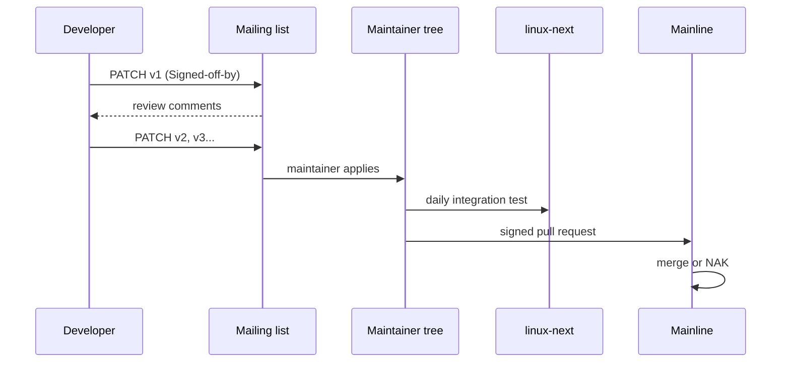

# How the Kernel Is Made: Process & Governance

> **Goal:** understand how the largest collaborative software project in
> history actually works — the people, the process, the mailing lists, the
> merge window, the stable/LTS release model, and the unwritten rules that
> define Linux kernel development culture.

Everything else in this book describes what the kernel *does*. This chapter
describes how the kernel *becomes*: the machine that turns 15,000 strangers,
2,000 competing companies, and one opinionated Finn into a new release every
nine to ten weeks, on schedule, for two decades. There is no product manager,
no roadmap, no sprint. There is a mailing list, a git tree, and a chain of
trust. It works better than almost any corporate process, and understanding
why is worth as much as understanding any subsystem.

## The scale, in numbers

Before the process, the scale (kernel 6.x era, per release):

- **~40 million lines** of source (C, some assembly, growing Rust, plus
  Makefiles, Kconfig, and scripts). Roughly **two-thirds is drivers**.
- **~13,000–15,000 changesets** merged, from **~1,700–2,000 developers**,
  employed by **~200+ companies** that appear in `Signed-off-by` lines.
- A tagged release every **9–10 weeks**, without a single miss since git
  adoption in **2005**.
- **~10,000–14,000 patches** land in the ~2-week merge window alone.
- **~2,900 entries** in the `MAINTAINERS` file — subsystems, each with one or
  more maintainers.
- **1 person** signs the final tag: Linus Torvalds.

The kernel is *not* governed by a foundation the way Python (PSF), Go
(Google), or Kubernetes (CNCF) are. The Linux Foundation pays some salaries
and hosts infrastructure, but it has **zero authority over what enters the
tree**. Governance is a **maintainer hierarchy** — a human chain of trust
where each maintainer decides what enters their subsystem, and Linus decides
what enters mainline. It is closer to a guild than a company.

```bash
# Reproduce the scale on your own clone (needs a full git history):
git shortlog -sne v6.11..v6.12 | wc -l   # distinct authors in one release
git log --oneline v6.11..v6.12 | wc -l    # total commits
wc -l MAINTAINERS                          # size of the map of who owns what
```

## The release cycle: merge window + stabilization

The kernel runs a strict **two-week-merge, seven-week-stabilize** cadence:

```text
Week 0:    Previous release ships (e.g. v6.12). Merge window opens.

Week 1-2:  MERGE WINDOW — Linus pulls signed tags from subsystem
           maintainers. ALL new features land here, nowhere else.
           ~10,000-14,000 patches. Linus tags -rc1 and the window SLAMS shut.

Week 3-9:  STABILIZATION — one -rc per week (rc2, rc3, ... rc7).
           Only bug fixes, regressions, docs, and small cleanups accepted.
           Each -rc should have fewer changes than the last.
           -rc7 is the usual last stop; -rc8 (rarely -rc9) if regressions linger.

Week 9-10: FINAL RELEASE — Linus tags v6.13. The next merge window opens
           the same day. The wheel never stops.
```

The asymmetry is the whole point. **The merge window is the only door for new
work.** Miss it and your feature waits for the *next* one — roughly seven weeks
of stabilization plus the two-week window, so **~9–10 weeks minimum**, often
longer if a subsystem maintainer wants another review round. This forces
developers to have code *ready and reviewed* before the window, not scrambling
during it. Most patches actually spend their real life on mailing lists weeks
or months earlier; the merge window is just the moment of formal entry.

The cycle is visible live in any full clone:

```bash
git log --oneline --merges v6.11..v6.12 | wc -l   # pull requests Linus accepted
git log --oneline v6.12-rc1..v6.12 | wc -l          # bug fixes during stabilization
git log --oneline v6.11..v6.12-rc1 | wc -l          # the merge-window flood
```

That last number will dwarf the middle one — usually 10:1 or worse. That ratio
*is* the release model: a burst of features, then a long tail of fixes.

### Stable and LTS kernels

Linus tags mainline and moves on; he does not maintain old releases. That job
belongs to the **stable team**, led by **Greg Kroah-Hartman** with **Sasha
Levin**, running a parallel track:

- **Stable kernels** — `v6.12.1`, `v6.12.2`, … receive bug fixes *backported
  from mainline* for the life of the series. A normal (non-LTS) series is
  maintained only until the next mainline release supersedes it (~2–3 months).
- **LTS (Long-Term Support)** — one release per year is designated LTS. As of
  July 2026 the actively maintained LTS lines include **6.1, 6.6, and 6.12**
  (6.12 is the newest, tagged November 2024), alongside older survivors like
  5.15 and 5.10. In September 2023 Greg KH announced that new LTS kernels
  default to **2 years** of support rather than the old 6, because almost
  nobody was testing the 5–6 year-old trees — support gets *extended* only
  where there is real demand (Android, major distros). LTS is what Android,
  embedded devices, and enterprise distros ride, because they cannot reboot
  the planet onto a new kernel every 10 weeks.

```bash
uname -r                 # e.g. 6.8.0-52-generic — a distro's patched stable
cat /proc/version        # full build string, compiler, build date
git tag -l "v6.12.*" | sort -V   # the 6.12 LTS point releases
```

**Stable rules are deliberately strict** (see
`Documentation/process/stable-kernel-rules.rst`): a fix must already be in
Linus's tree first (**no stable-only patches, ever**), must be small and
obviously correct, must fix a real bug users hit, and should carry either a
`Cc: stable@vger.kernel.org` tag or a `Fixes:` tag naming the commit that
introduced the bug. The `Fixes:` tag is what lets Sasha Levin's tooling — and
increasingly an ML classifier — auto-select candidates for backport.

### Kernel security and CVEs

Security fixes take a different path. The **security team**
(`security@kernel.org`) handles embargoed vulnerabilities under coordinated
disclosure, with a hard cap on embargo length (typically **≤7 days**, rarely
up to ~5 weeks) — the kernel refuses long embargoes on principle.

Here the old folklore is now **wrong, and worth correcting**: since **13
February 2024 the Linux kernel project is an official CVE Numbering Authority
(CNA)** and assigns its own CVE identifiers. The philosophy Greg KH articulated
is blunt: because *any* bug can turn out to be a security bug, the project
assigns CVEs liberally to fixed commits rather than trying to divine intent in
advance. This produces a large volume of CVEs — deliberately — and pushes the
industry away from treating a CVE number as a reliable severity signal. The
kernel does **not** assign scores; downstream consumers decide what matters.
See the [Linux Security & Confinement](#/security-hardening) and
[Trusted Computing](#/trusted-computing) chapters for the defensive side.

## The chain of trust: maintainer hierarchy

The kernel is a **tree of git repositories**, not one repo everyone pushes to.
Each maintainer runs their own tree; trust flows upward through people, not
through commit access.

```text
Linus Torvalds  —  torvalds/linux.git  (mainline; the only "real" tree)
  │
  ├── Greg KH            — stable, driver core, USB, char/misc
  ├── Andrew Morton      — mm (memory management funnels through -mm / mm-next)
  ├── Jakub Kicinski,    — networking (netdev); David S. Miller and
  │   Paolo Abeni          Eric Dumazet remain co-maintainers
  ├── Jens Axboe         — block layer, io_uring
  ├── Christian Brauner  — VFS, mounts, namespaces
  ├── Tejun Heo          — cgroups, workqueues
  ├── Peter Zijlstra,    — scheduler, locking
  │   Ingo Molnar
  ├── Thomas Gleixner    — x86, timers, interrupt/IRQ core
  ├── ...
  └── ~2,900 MAINTAINERS entries
        └── sub-maintainers, reviewers, per-driver owners
```

Networking illustrates the reality: **David S. Miller** ran `netdev` for years,
but as of 6.12 day-to-day networking is co-maintained by **Jakub Kicinski** and
**Paolo Abeni**, with Eric Dumazet on the hot paths — maintainership is a
living arrangement, not a title carved in stone. The scheduler tells the same
story: the fair-class scheduler that lands your threads on CPUs was **CFS until
kernel 6.6, when EEVDF replaced it** — a change shepherded by Peter Zijlstra
through the `tip` tree (see [CPU Scheduling](#/scheduling)).

The map of who owns what is a file in the tree:

```bash
# Who do I send an ext4 patch to, and which lists?
./scripts/get_maintainer.pl -f fs/ext4/inode.c
# Reads MAINTAINERS + git history to compute maintainers, reviewers, and lists.
```

### A patch's journey

1. Developer writes the patch, runs `scripts/checkpatch.pl` for style/coding
   violations, and mails it (inline, plain text) to the maintainer + list that
   `get_maintainer.pl` named. Modern workflow often uses **`b4`** (by
   Konstantin Ryabitsev) to format, send, and later collect review tags.
2. Reviewers reply on-list. The developer sends a **v2, v3, …** revision,
   each a fresh thread, incorporating feedback. This can take many rounds.
3. The maintainer applies the accepted patch to *their* subsystem tree.
4. That tree spends time in **`linux-next`**, the daily integration tree
   maintained by **Stephen Rothwell**, which merges ~200 subsystem trees so
   cross-subsystem conflicts surface *before* they reach Linus.
5. During the merge window, the maintainer sends Linus a **pull request** — a
   **signed git tag** with a summary message. Linus pulls, and if it survives
   his review, the code is in mainline.

The **point of no return** is step 5. Once Linus pulls, a change can only be
undone by a follow-up fix in the -rc cycle or later — never a clean rewind of
history. This is why the merge message and the DCO chain matter so much: they
are the permanent record.

### The merge window ritual

By the time the window opens, everything Linus pulls has already been sitting
in `linux-next` for weeks. That is what makes a two-week window survivable:
Linus is mostly ratifying integration that has already been tested together,
not discovering conflicts live. During the window he reads every pull-request
message and will **NAK** (reject) anything that lacks justification, breaks
existing systems, or adds complexity without payoff. The all-caps "**WE DO NOT
BREAK USERSPACE!**" is a real, recurring, and load-bearing part of that review.

## How patches become kernel law

A patch is not a pull request in a web UI. It is an **email with an inline
unified diff**, formatted by `git format-patch`:

```text
From: Developer <dev@example.com>
Subject: [PATCH v2] ext4: fix use-after-free in extent status tree

The extent status tree can race with truncate under heavy writeback,
freeing an es entry while another thread still holds a pointer to it.
Reorder the drop under i_es_lock so the lookup and free are atomic.

Fixes: a1b2c3d4e5f6 ("ext4: add extent status tree")
Reported-by: syzbot+deadbeef@syzkaller.appspotmail.com
Signed-off-by: Developer <dev@example.com>
---
 fs/ext4/extents_status.c | 4 ++++
 1 file changed, 4 insertions(+)
```

The tags carry legal and review meaning:

| Tag | Meaning |
|---|---|
| `Signed-off-by` | The **Developer Certificate of Origin** (DCO 1.1): "I wrote this or have the right to submit it under the open-source license indicated." **Mandatory** — no sign-off, no merge. |
| `Reviewed-by` | A reviewer read the code carefully and vouches for it. |
| `Acked-by` | A maintainer or domain expert approves, often for a change that goes through *another* subsystem's tree. |
| `Tested-by` | Someone ran it and it works. |
| `Reported-by` | Credits the bug reporter (often `syzbot`). |
| `Fixes: <12+hex> ("subject")` | Names the commit that introduced the bug. Drives stable backport selection. |
| `Cc: stable@vger.kernel.org` | Requests inclusion in the stable trees. |

The DCO is **not a CLA**. There is no copyright assignment, no lawyer, no
signup — you certify origin by adding one line. It is defined in
`Documentation/process/submitting-patches.rst`. That low friction is a
deliberate governance choice: it keeps the barrier to a first contribution as
close to "write a good patch" as possible.

The `Signed-off-by` chain traces custody from author to mainline:

```text
Signed-off-by: Developer <dev@example.com>          # author
Signed-off-by: Ext4 Maintainer <tytso@mit.edu>      # subsystem maintainer
Signed-off-by: Linus Torvalds <torvalds@linux-...>  # mainline
```

For a patch that originates at a hardware vendor and passes through a driver
sub-maintainer, a subsystem maintainer, and Linus, that chain can be 4–6 links
deep — each a person who took responsibility for passing it upward.



## The testing infrastructure (the invisible machinery)

The kernel's reliability does **not** come from Linus reading 14,000 patches —
it comes from automation running continuously at a scale no human can match:

| System | What it does |
|---|---|
| **Kernel Test Robot / 0-Day** (Intel) | Builds and boots posted patches across hundreds of configs and architectures; emails build/boot/perf regressions, often within hours of a patch hitting a list. |
| **syzbot** (Google, driven by `syzkaller`) | A coverage-guided syscall fuzzer running nonstop, finding use-after-frees, deadlocks, and panics. Files reports publicly and even bisects and proposes fixes. Thousands of bugs found and fixed to date. |
| **KernelCI** | Builds and boots mainline/stable/next on **real hardware** across arm, arm64, x86, riscv; a LF-hosted, cross-vendor lab. |
| **CKI** (Red Hat) | Enterprise-oriented CI for stable and distro kernels. |
| **linux-next** | Human-plus-machine integration testing that catches cross-subsystem breakage before the merge window. |

The sanitizers these systems lean on ship *in the kernel itself*: **KASAN**
(Kernel Address Sanitizer) catches out-of-bounds and use-after-free; **KCSAN**
catches data races; **UBSAN** catches undefined behavior; **kmemleak** finds
leaks. They connect this chapter to real debugging — see
[/proc, strace, perf & eBPF](#/observability) and
[Reading & Building the Kernel](#/kernel-dev).

```bash
# See how much of the tree is bug-fix churn driven by the fuzzer:
git log --grep="syzbot" --oneline v6.11..v6.12 | wc -l
# The live dashboard (public): syzkaller.appspot.com/upstream
```

## Follow the code (kernel v6.12)

Governance is usually social, but a piece of it is **compiled into the
kernel**: the GPLv2 boundary between the kernel and proprietary code is
enforced by real functions, not just etiquette. Trace what happens when you
load a module — the machinery lives in `kernel/module/main.c`.

1. Your driver exports and imports symbols through
   [EXPORT_SYMBOL](https://elixir.bootlin.com/linux/v6.12/C/ident/EXPORT_SYMBOL)
   and
   [EXPORT_SYMBOL_GPL](https://elixir.bootlin.com/linux/v6.12/C/ident/EXPORT_SYMBOL_GPL).
   The GPL variant marks a symbol as available **only to GPL-compatible
   modules**. Thousands of core interfaces (many scheduler, cgroup, and mm
   hooks) are `_GPL`-only, which is a governance decision expressed in C.

2. `insmod` calls the `init_module`/`finit_module` syscall, which lands in the
   loader. The kernel parses your module's `.modinfo` section — populated by
   the [MODULE_LICENSE](https://elixir.bootlin.com/linux/v6.12/C/ident/MODULE_LICENSE)
   macro — via
   [check_modinfo](https://elixir.bootlin.com/linux/v6.12/C/ident/check_modinfo).
   The declared license string ("GPL", "GPL v2", "Dual BSD/GPL", "Proprietary",
   …) is checked by
   [license_is_gpl_compatible](https://elixir.bootlin.com/linux/v6.12/C/ident/license_is_gpl_compatible).

3. If the license is not GPL-compatible, the loader calls
   [add_taint](https://elixir.bootlin.com/linux/v6.12/C/ident/add_taint)
   with `TAINT_PROPRIETARY_MODULE`, permanently flagging the kernel. That taint
   flag shows up in every oops and in `/proc/sys/kernel/tainted`, and it tells
   maintainers "this crash may not be our code" — which is exactly why bug
   reports from tainted kernels get triaged differently.

4. When the loader resolves your module's imported symbols in
   [resolve_symbol](https://elixir.bootlin.com/linux/v6.12/C/ident/resolve_symbol),
   it looks each name up with
   [find_symbol](https://elixir.bootlin.com/linux/v6.12/C/ident/find_symbol).
   For a `_GPL` symbol, resolution **fails** for a non-GPL-compatible module,
   and `insmod` returns `-ENOEXEC`. The `struct module` that results carries a
   `taints` field and a `state` field (`MODULE_STATE_COMING` → `LIVE`) tracking
   exactly this lifecycle.

So "in-tree, GPLv2, and no stable module API" is not only culture — the fields
`license`, `taints`, and the `_GPL` symbol table make the social contract
executable. This is the same module machinery you exercise by hand in
[Devices, Drivers & Modules](#/devices-modules) and the
[kernel module lab](#/lab-kernel-module).

A second, smaller thread worth knowing: the version you see from `uname` comes
from the build-time `UTS_RELEASE` string surfaced through the kernel's
`utsname()` and the
[uts_namespace](https://elixir.bootlin.com/linux/v6.12/C/ident/uts_namespace)
— which is *also* why containers can present a different `uname` per namespace
(see [Namespaces](#/namespaces)) without changing the running kernel.

## The culture: unwritten rules

### "Don't break userspace"

The cardinal rule. If a kernel upgrade breaks a program that worked before, the
**kernel** is at fault — even if the program relied on undocumented or
technically-wrong behavior. Linus's canonical formulation:

> "We do not break userspace. The whole *point* of the kernel is to run
> userspace. If we break userspace, we are a BUG."

The practical consequences are severe and permanent: a syscall number, a
`/proc` or `/sys` field's format, an `ioctl` number, or a stable `sysfs`
attribute, once shipped, is effectively **forever**. Developers can *add* new
syscalls (x86-64 is past **450**), wrap old paths in compatibility shims, or
gate new behavior behind flags — but they almost never remove anything. This
rule is why syscall interfaces are designed so cautiously and why the UAPI
headers (`include/uapi/`) are treated as a contract, not code.

### "No regressions"

A new kernel must work **at least as well** as the old one on the hardware
people actually run. If a Wi-Fi adapter worked on 6.11 and breaks on 6.12,
that is a regression bug that can hold up the release, and bisection
(`git bisect`) is the standard tool for pinning the guilty commit. Regressions
are tracked formally (the `regzbot` bot follows them across threads).

### "Show me the code"

Ideas without patches carry little weight. Design happens *around concrete,
testable diffs*, not abstract proposals. This is productive — arguments are
grounded in real code — and exclusionary: you must be able to write a working C
(or increasingly Rust) patch to participate meaningfully.

### "Latency is sacred"

The merge window is for features; the -rc cycle guards against performance and
latency regressions. Every change must not slow down the millions of systems
already deployed, which is why the kernel carries such heavy `perf`, tracing,
and benchmark infrastructure (see
[Performance Analysis Methodology](#/perf-methodology)).

### Linus as benevolent dictator

Linus is the final arbiter of taste, complexity, and design direction. He
cannot and does not review most patches — the maintainer hierarchy exists
precisely so he doesn't have to. He sets standards through **which pull
requests he rejects, how he words merge messages, and the culture built over
30+ years**. His LKML posts are public and archived; they function as the
project's constitutional debates. The **Code of Conduct** (added 2018,
`Documentation/process/code-of-conduct.rst`) and the "gentler" tone since
Linus's 2018 break are themselves governance changes worth noting.

### Rust joins the language set

Since kernel **6.1 (December 2022)**, the tree accepts **Rust** for new code,
gated behind `CONFIG_RUST`. As of 6.12 it remains experimental and optional —
core subsystems are still C — but real Rust abstractions and drivers are
landing (networking PHY, DRM/GPU work, filesystem experiments). It is the first
new implementation language admitted in the kernel's history, and the debate
around it is a live example of governance in motion (see
[Rust in the Linux Kernel](#/rust-kernel)).

## Comparison: Linux vs other kernels

Seeing what other kernels do differently sharpens what makes Linux *Linux*:

| Dimension | Linux | FreeBSD | Windows NT | XNU (macOS/iOS) |
|---|---|---|---|---|
| **Architecture** | Monolithic + loadable modules | Monolithic + modules (kld) | Hybrid (kernel + user-mode services) | Hybrid (Mach microkernel + BSD) |
| **Governance** | Linus + maintainer hierarchy | Elected Core Team | Microsoft (single company) | Apple (single company, partly open) |
| **Release model** | Time-based (~10 weeks), stable/LTS | Time-based + stable branches | Feature updates ~biannual | Tied to OS releases |
| **Driver model** | In-tree preferred, **no** stable in-kernel API | In-tree, stable KPI within a major | Stable driver ABI (WHQL) | In-tree; DriverKit for 3rd party |
| **License** | GPLv2 | BSD 2-clause | Proprietary | APSL + proprietary |
| **Philosophy** | "We don't break userspace" | "Least astonishment" | "Backward compat at all costs" | "Security + perf for Apple HW" |
| **Rust support** | Yes, since 6.1 (experimental) | Exploratory | Kernel-mode Rust drivers (in progress) | No |
| **Key strength** | Hardware breadth, flexibility, ecosystem | Stability, ZFS, network stack | Driver compatibility, enterprise | Power efficiency, security model |

The **no stable in-kernel API** row is the sharpest contrast and a direct
consequence of governance. Windows guarantees a driver ABI so vendors can ship
binaries forever; Linux deliberately refuses to, so that internal interfaces
can be refactored freely — the cost of an out-of-tree driver is *yours* to bear
at every release, which is precisely the pressure that pushes vendors to
upstream. The GPLv2 completes the loop: you cannot ship a modified kernel
binary without offering source, so improvements flow back. FreeBSD's permissive
BSD license let companies (Sony, Netflix, WhatsApp historically) contribute
less back; that is a large part of why Linux, not BSD, won servers and Android.

## The mailing list is the town square

Almost everything of consequence happens over **plain-text email**:

- **LKML** (`linux-kernel@vger.kernel.org`) — the firehose main list, too much
  for any human to follow fully. Real work happens on subsystem lists.
- **Subsystem lists** — `linux-mm@`, `linux-fsdevel@`, `netdev@`,
  `linux-block@`, `linux-btrfs@`, each with its own regulars and conventions.
- **lore.kernel.org** — the public, searchable archive of every list, with
  full threads and downloadable mbox (feeds the `b4` workflow).
- **patchwork.kernel.org** — per-subsystem patch tracking: what is pending,
  accepted, changes-requested, or rejected.

How to follow along without drowning:

- **lwn.net** (Linux Weekly News) — the best English-language summary of kernel
  development. The weekly "kernel page" is the single most efficient way to
  stay current.
- **kernelnewbies.org/LinuxChanges** — human-readable per-release changelogs.

```bash
# Configure git to send patches the kernel way (SMTP, inline):
git config sendemail.smtpserver smtp.example.com
git format-patch -1 --cover-letter -o /tmp/patches
# git send-email /tmp/patches/*.patch --to=... --cc=...
```

## Check your understanding

1. Why does a patch that misses the merge window typically wait ~10 weeks?

<details><summary>Show answer</summary>

The merge window (weeks 1–2) is the *only* time new features are accepted.
After it closes, ~7 weeks of stabilization (-rc2…-rc7/rc8) allow only bug
fixes. So genuinely new work must wait out the rest of this cycle plus the
next window opening — roughly 9–10 weeks minimum, often more if a maintainer
wants another review round.

</details>

2. What is the difference between a *stable* kernel and an *LTS* kernel?

<details><summary>Show answer</summary>

Both are maintained by the stable team via backports from mainline. A normal
stable series (e.g. 6.12.x) is maintained only until the next mainline release
supersedes it (~2–3 months). An **LTS** release is one designated version per
year kept alive far longer — since 2023 the default is ~2 years, extended on
demand — for Android, embedded, and enterprise distros. As of mid-2026,
6.1/6.6/6.12 are active LTS lines.

</details>

3. The old belief that "the kernel doesn't issue its own CVEs" is outdated.
   What changed, and what is the project's philosophy?

<details><summary>Show answer</summary>

Since 13 February 2024 the Linux kernel is an official **CVE Numbering
Authority (CNA)** and assigns its own CVE IDs. Because almost any bug can turn
out to be exploitable, the project assigns CVEs **liberally** to fixed commits
rather than judging severity up front, and it assigns no scores — pushing
consumers to evaluate risk for their own configuration instead of trusting a
CVE count.

</details>

4. "Don't break userspace" — what concrete, permanent consequences does it
   impose on kernel developers?

<details><summary>Show answer</summary>

Once shipped, a syscall number, `ioctl` number, or the format of a stable
`/proc`, `/sys`, or UAPI field is effectively permanent. Developers can *add*
new interfaces (x86-64 has 450+ syscalls) or wrap old ones in compatibility
shims, but essentially never remove them. UAPI headers are treated as a binding
contract, and interface design is correspondingly cautious.

</details>

5. What does the `Signed-off-by` chain establish, and what is it *not*?

<details><summary>Show answer</summary>

It is the chain of **custody and provenance** under the Developer Certificate
of Origin: each person who handled the patch certifies they had the right to
pass it on, tracing it from author through sub-maintainers and maintainers to
Linus. It is **not** a copyright assignment or a CLA — there is no legal
transfer, just a one-line certification that keeps the contribution barrier low.

</details>

6. Why does the kernel deliberately refuse to guarantee a stable in-kernel
   driver API, and how does that interact with GPLv2?

<details><summary>Show answer</summary>

No stable internal API means maintainers can refactor freely; out-of-tree
drivers break at every release, so the cost of staying out-of-tree is high.
GPLv2 means you cannot ship a modified kernel binary without offering source.
Together they pressure vendors to **upstream** their drivers, which is why
Linux has such broad in-tree hardware support. See the module-license
enforcement in "Follow the code" for the compiled-in half of this.

</details>

7. What role does `linux-next` play, and why does it make a two-week merge
   window survivable?

<details><summary>Show answer</summary>

`linux-next` (maintained by Stephen Rothwell) merges ~200 subsystem trees
daily, surfacing cross-subsystem conflicts and build/boot breakage *weeks
before* the merge window. By the time Linus pulls, the code has already been
integration-tested together, so the window is mostly ratification rather than
live conflict resolution.

</details>

## Sources & further reading

- Kernel documentation: [A guide to the Kernel Development Process](https://docs.kernel.org/process/development-process.html) and the [Submitting Patches guide](https://docs.kernel.org/process/submitting-patches.html) (DCO, `Signed-off-by`, tags).
- [Stable kernel rules](https://docs.kernel.org/process/stable-kernel-rules.html) — what qualifies for the stable and LTS trees.
- [The kernel CVE process](https://docs.kernel.org/process/cve.html) — the project's own explanation of becoming a CNA in February 2024.
- [The MAINTAINERS file](https://elixir.bootlin.com/linux/v6.12/source/MAINTAINERS) — the machine-readable map of who owns what, consumed by `get_maintainer.pl`.
- Module loading and license enforcement source: [kernel/module/main.c](https://elixir.bootlin.com/linux/v6.12/source/kernel/module/main.c).
- Greg Kroah-Hartman's talks and LWN's weekly kernel coverage at **lwn.net** — the best ongoing English-language record of kernel development (cited by publication; browse LWN's kernel index).
- **kernelnewbies.org/LinuxChanges** for human-readable per-release changelogs, and **b4** documentation (b4.docs.kernel.org) for the modern patch-submission workflow.

---

**Next:** you've learned every subsystem in isolation. Now we consolidate everything into a systematic performance methodology — USE, RED, the 60-second checklist, flame graphs, and the investigation pattern that finds what's slow in five minutes or less. Continue to [Performance Analysis Methodology](#/perf-methodology).
