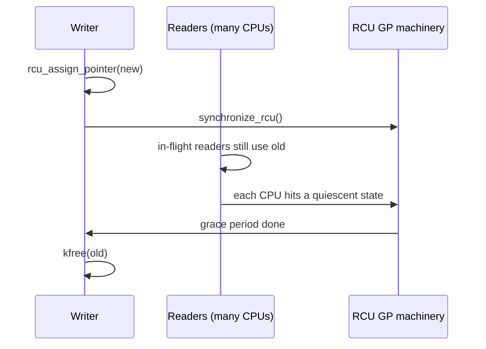

# Kernel Synchronization: Locks, Atomics & RCU

> **Goal:** understand how the kernel coordinates access to shared data
> across multiple CPUs, interrupts, and preempting threads. The locking
> primitives that make parallel kernel code correct — and why reading the source
> without knowing them is impossible.

## Why the kernel needs locks everywhere

The kernel is a massively concurrent program:

- Multiple CPUs execute kernel code simultaneously (SMP). A modern server has
  128, 192, or 256 hardware threads, and any of them can be inside the same
  function at the same instant.
- An interrupt can fire on a CPU that was already inside kernel code (see
  [Interrupts, Exceptions & Softirqs](#/interrupts)).
- A bottom-half (softirq/tasklet) can preempt almost anything.
- Preemption means the kernel can context-switch while a thread holds a lock —
  the [scheduler](#/scheduling) can yank the CPU away mid-critical-section.

Without synchronization, two CPUs updating the same `task_struct`, page
table entry, or socket buffer simultaneously would produce silent corruption:
a lost list insertion, a double free, a refcount that never reaches zero. The
kernel's correctness relies entirely on disciplined locking, and getting it
wrong produces bugs that appear once a week on one machine in a fleet of ten
thousand.

The key insight: **kernel code is shared-memory multithreaded code, but it
also manages hardware constraints** — interrupts, cache coherency, and memory
ordering. A userspace `pthread_mutex_t` only has to worry about other threads.
A kernel lock has to worry about other threads *and* interrupt handlers that
can fire on the same CPU *and* whether the current context is even allowed to
sleep. The locking primitives must work across all of these, and choosing the
wrong one is not a style question — it is a deadlock.

## The lock hierarchy

The kernel provides a stack of synchronization tools, from simplest to most
sophisticated:

| Primitive | What it protects | Can sleep while holding? | Typical user |
|---|---|---|---|
| Atomic operations | Single integer/pointer | No (single instructions) | Counters, flags, refcounts |
| Spinlock | Short critical sections | **No** (busy-waits) | IRQ handlers, scheduler, hot paths |
| Mutex | Longer critical sections | **Yes** (sleeps the caller) | Filesystem ops, driver probe, allocation |
| RW semaphore | Many readers OR one writer | Yes | `mmap_lock`, inode tree |
| RCU | Read-often-write-rarely data | Read side: no sleeping (classic) | Routing tables, dcache, fd table |
| Seqlock | Write-rarely data, fast readers | No | `jiffies`, timekeeping, vDSO |
| Completion | Thread signaling | Yes (waiter sleeps) | "Wait until this I/O is done" |

The single most important axis in this table is the **can-it-sleep** column.
A spinlock holder must not sleep; a mutex holder may. Every other decision
flows from context: are you in an interrupt handler (can't sleep, must use
spinlocks), or in a syscall's process context (can sleep, mutexes allowed)?

## Atomic operations: the building blocks

Sometimes you need to increment a counter or set a flag without a full lock:

```c
atomic_t counter = ATOMIC_INIT(0);
atomic_inc(&counter);            // thread-safe increment
atomic_dec_and_test(&counter);   // decrement, return true if reached zero
atomic_read(&counter);           // read the value
int old = atomic_cmpxchg(&counter, expected, new);  // compare-and-swap

// Bit operations on unsigned long:
set_bit(NR_LOCKED, &flags);
test_and_clear_bit(NR_DIRTY, &flags);
```

`atomic_t` is literally `struct { int counter; }` — a wrapper around a plain
`int` whose only purpose is to force you to use the accessor functions instead
of touching the field directly. On x86-64 these compile to single
`LOCK`-prefixed instructions (`lock inc`, `lock cmpxchg`), atomic across all
CPUs. The `LOCK` prefix also acts as a full memory barrier on x86: it drains
the store buffer, making all prior writes visible to other CPUs before the
atomic completes. On arm64, `atomic_inc()` generates either an `ldaxr/stlxr`
load-acquire/store-release exclusive pair, or a single `LSE` atomic
instruction (`stadd`) on CPUs that support the Large System Extensions —
which most server-class arm64 parts do.

The API comes in ordering flavors, and the suffix tells you the barrier:

- `atomic_inc()` / `atomic_read()` — no ordering guarantees beyond the
  operation itself.
- `atomic_fetch_add_acquire()` — acquire semantics (later accesses can't move
  before it).
- `atomic_fetch_add_release()` — release semantics (earlier accesses can't
  move after it).
- `atomic_add_return()` — fully ordered (a full barrier on both sides).

The key rule: atomics are for **single-word** operations. If you need to
update two fields together (say, a pointer *and* a length, or a linked-list
insertion that touches three pointers), a single atomic cannot help — you need
a lock.

### Reference counting: `refcount_t` and `kref`

Refcounting is so common the kernel has dedicated types:

```c
struct kref {
    refcount_t refcount;   // a hardened atomic_t
};
void kref_init(struct kref *kref);
void kref_get(struct kref *kref);      // increment
void kref_put(struct kref *kref, void (*release)(struct kref *));
```

`refcount_t` is a **saturating, checked** variant of `atomic_t`. A raw
`atomic_t` used as a refcount has a classic exploit: if an attacker can force
the counter to wrap from `UINT_MAX` back to 0, the object is freed while still
referenced — a use-after-free. `refcount_inc()` detects the overflow, refuses
to wrap, and issues a `WARN`. Likewise `refcount_dec_and_test()` refuses to
decrement below zero. This turned a whole class of CVEs into loud warnings
instead of silent memory corruption. New code should always use `refcount_t`
for object lifetimes and reserve raw `atomic_t` for statistics counters where
wraparound is harmless.

## Spinlocks: the workhorse of hot paths

A spinlock protects a short critical section by making the waiter **busy-loop**
until the lock is free:

```c
spinlock_t lock;
spin_lock(&lock);        // busy-wait until available
// ... critical section ...
spin_unlock(&lock);
```

Spinlocks work only when the critical section is **short** (nanoseconds to a
few microseconds) and the holder **cannot sleep**. Sleeping while holding a
spinlock is catastrophic: the next CPU to want the lock spins forever, burning
100% of a core and making no progress. Lockdep and the "scheduling while
atomic" checks exist specifically to catch this.

### It's not a simple flag anymore

The old mental model — "a spinlock is one `int`, 0 means free, 1 means held" —
describes a *test-and-set* lock, which Linux abandoned years ago because it is
unfair and cache-hostile. Under contention, dozens of CPUs all spin on the
same cacheline, every one of them hammering it with atomic compare-and-swaps,
and whichever CPU happens to win is random (a starving CPU can wait
indefinitely).

Since kernel 4.2, the mainline spinlock on x86-64 and arm64 is the
**queued spinlock** (`qspinlock`). The visible `struct qspinlock` is still a
single 32-bit word, but under contention it builds an **MCS queue**: each
waiting CPU spins on its *own* per-CPU cacheline, and the lock is handed off
FIFO. Only the CPU at the head of the queue touches the shared word. This turns
O(N) cacheline bouncing into O(1) and makes acquisition fair. The fast path —
uncontended acquire — is still a single `cmpxchg` on that word, so nothing is
lost when there's no contention.

### The IRQ-safe variant

The most common form in driver code disables local interrupts while holding
the lock:

```c
unsigned long flags;
spin_lock_irqsave(&lock, flags);        // save IRQ state, disable IRQs, acquire
// ... critical section also touched by an IRQ handler ...
spin_unlock_irqrestore(&lock, flags);   // release, restore IRQ state
```

Why? Imagine CPU 0 holds `lock` in process context. An interrupt fires on
CPU 0, and its handler tries to take the same `lock`. The handler spins —
but the holder is the very code the handler interrupted, and it can't run
until the handler returns. Deadlock, on a single CPU. `spin_lock_irqsave()`
prevents this by masking interrupts on the local CPU for the duration. If a
spinlock protects data an interrupt handler ever touches, the non-`irqsave`
variant is a latent bug.

There is a subtlety: on a `PREEMPT_RT` kernel (see
[CPU Isolation, NO_HZ & Real-Time](#/cpu-isolation)), most `spinlock_t`
locks become *sleeping* mutexes so that a high-priority task isn't blocked by
a low-priority spinlock holder. The truly non-sleeping locks are then spelled
`raw_spinlock_t`, and only those are safe in true atomic context on RT.

Where to find spinlocks: the [scheduler's](#/scheduling) run queues
(`rq->lock`), the dentry cache hash table, socket lookup tables in the
[networking stack](#/networking), the timer wheel (see [Timers](#/timers)),
the per-file `f_lock`. Anywhere that's hot and can't sleep.

## Mutexes: the sleeping lock

When the critical section is long or may block — memory allocation, disk I/O,
waiting for a network response — use a mutex:

```c
struct mutex lock;
mutex_lock(&lock);       // if held, sleep until unlocked
// ... long critical section, may call functions that sleep ...
mutex_unlock(&lock);
```

`struct mutex` is more than a flag. The fields that matter in kernel 6.12:

- `atomic_long_t owner` — packs the `task_struct` pointer of the current
  holder with a few low bits of state. Storing the owner is what enables the
  clever fast path below.
- `raw_spinlock_t wait_lock` — a tiny spinlock protecting the wait list.
- `struct list_head wait_list` — the FIFO queue of sleepers.
- An optimistic-spin queue (`osq`) when `CONFIG_MUTEX_SPIN_ON_OWNER` is set.

### Optimistic spinning: the counterintuitive part

A naive mutex, on contention, immediately puts the waiter to sleep. But
sleeping and waking cost a couple of microseconds each (a context switch, a
scheduler pass, cache pollution). If the lock is going to be released in 200
nanoseconds, sleeping is far more expensive than just waiting.

So Linux mutexes do **optimistic spinning**: when you fail to grab the lock,
the mutex checks whether the current owner is *running on another CPU right
now* (this is why it stores the owner). If so, the lock is probably about to
be released, so the waiter spins — briefly — instead of sleeping. The waiters
line up in an MCS queue (`osq_lock`) so they spin on separate cachelines, just
like qspinlock. Only if the owner goes to sleep, or the waiter has spun too
long, does the waiter fall back to the classic path: add itself to
`wait_list` and `schedule()` away. This makes a contended mutex nearly as fast
as a spinlock when hold times are short, while still yielding the CPU when
they're long.

On `PREEMPT_RT` kernels, mutexes (and RT-converted spinlocks) implement
**priority inheritance**: if a high-priority real-time task blocks on a mutex
held by a low-priority task, the holder's priority is temporarily boosted to
the waiter's, so it can finish and release quickly. Without PI, a
medium-priority task could preempt the low-priority holder indefinitely and
starve the high-priority waiter — the classic priority-inversion bug that
famously stalled the Mars Pathfinder.

Where to find mutexes: `inode->i_rwsem` in the [VFS](#/filesystems), device
`probe()` paths in [drivers](#/devices-modules), subsystem init, any lock held
across a disk operation.

## Reader-writer locks

When many threads only *read* shared data and writes are rare, reader-writer
locks allow simultaneous readers but exclusive writers. The sleeping variant,
`rw_semaphore`, is by far the most common in modern code:

```c
struct rw_semaphore sem;
down_read(&sem);      // reader lock; many readers concurrent
up_read(&sem);
down_write(&sem);     // writer lock; blocks until readers == 0
up_write(&sem);
```

`struct rw_semaphore` packs everything into `atomic_long_t count`: the high
bits hold the reader count, and low bits are flags (writer-locked,
waiters-present, writer-handoff). Like mutexes, rwsems do optimistic spinning
against a running writer owner, and track the owner in an `owner` field. There
is also a non-sleeping `rwlock_t` built on qspinlock, but it is rarely the
right choice today — RCU or an rwsem usually wins.

Where to find them: `mm_struct->mmap_lock` protects the VMA tree ([page
fault](#/memory) handlers take it as **reader**, while `mmap()`/`munmap()`
take it as **writer**). Filesystem metadata. The tasklist lock guarding
`for_each_process()` traversals.

> **Writer starvation warning:** under a continuous stream of readers, a
> writer can wait a long time. Since around 4.9 the kernel's rwsem has a
> **writer handoff** mechanism: once a writer has waited too long, new readers
> are blocked and the lock is handed directly to the waiting writer. This
> bounds the starvation but doesn't eliminate the underlying tension — if
> writes are anything but rare, an rwsem is the wrong tool.

## Seqlocks: readers that never wait

For data where reads vastly outnumber writes and the read side must be
*extremely* fast — no atomic RMW, no lock acquire, not even a shared cacheline
to write — seqlocks are brilliant:

```c
seqlock_t lock;

// Reader:
unsigned seq;
do {
    seq = read_seqbegin(&lock);      // sample an even sequence number
    // ... read the protected data into locals ...
} while (read_seqretry(&lock, seq)); // writer ran in between? retry.

// Writer:
write_seqlock(&lock);
// ... modify the data ...
write_sequnlock(&lock);              // sequence goes odd during, even after
```

The mechanism is a version counter (`struct seqcount`, one `unsigned`). A
writer increments it to an **odd** value before modifying, and to the next
**even** value after. A reader samples the counter before and after; if it
changed (or was odd, meaning a write was in flight), the reader saw a torn
value and retries. Readers never block and never write the shared line, so
they scale perfectly — but the read side must be **retry-able**: no side
effects, no dereferencing a pointer that a concurrent writer might have freed
(for that, combine with RCU as `seqcount_latch`).

Where to find them: `jiffies_64`, the wall-clock and monotonic timekeeping
structures (see [Timers & Time](#/timers)), and the **vDSO** data page that
lets `clock_gettime()` return the time without entering the kernel at all —
userspace reads the seqlock-protected timestamp directly.

## RCU: Read-Copy-Update

RCU is Linux's most distinctive synchronization mechanism and one that defines
how the kernel scales to hundreds of cores. The insight: separate the *removal*
of data from its *reclamation*. A reader never blocks and never writes shared
state; a writer publishes a new version and defers freeing the old one until
every reader that could still see it has finished.

> **The read side is close to free — but how free depends on config.** On a
> `CONFIG_PREEMPT_NONE` kernel, `rcu_read_lock()` / `rcu_read_unlock()` compile
> to literally nothing — zero instructions. On a preemptible kernel
> (`CONFIG_PREEMPT` / `CONFIG_PREEMPT_DYNAMIC`, the default on most desktop and
> many server distros), they bump a per-task nesting counter to prevent the
> reader from being preempted out mid-section — a couple of instructions, no
> atomic, no shared cacheline. Either way there is no lock and no cacheline
> bouncing on the protected pointer.

The API has three moving parts:

```c
// Reader — inside this section, the pointer is guaranteed to stay valid:
rcu_read_lock();
p = rcu_dereference(shared_ptr);   // load with a dependency-ordering barrier
// ... use p — no lock, no atomic ...
rcu_read_unlock();

// Writer — publish-then-reclaim:
struct foo *new = kmalloc(sizeof(*new), GFP_KERNEL);
*new = *old;                       // copy
new->field = new_value;            // modify the copy
rcu_assign_pointer(shared_ptr, new);  // release-store: publish atomically
synchronize_rcu();                 // wait for all pre-existing readers
kfree(old);                        // now provably safe
```

### Grace periods and quiescent states

The magic is in `synchronize_rcu()`. It does **not** track which readers exist
— that would require the readers to register, defeating the whole point.
Instead it waits for a **grace period**: a span of time after which every CPU
has been observed to pass through at least one **quiescent state**. A
quiescent state is any moment a CPU provably holds no RCU read-side reference —
a context switch, a return to user space, or an idle tick. Since a classic RCU
reader cannot sleep or be preempted, once a CPU has context-switched, any RCU
read section it held must have ended. When *all* CPUs have reached a quiescent
state after the writer published its update, no reader can possibly still see
`old`, and it's safe to free.

This is why the read side pays nothing: all the cost is shifted to the writer,
which waits. A `synchronize_rcu()` typically takes on the order of tens of
milliseconds — it's bounded by the scheduler tick (`HZ`, commonly 250 or 1000)
and by how quickly every CPU happens to reach a quiescent state. That's a
terrible price for a writer, and a fantastic deal for the millions of readers
that paid nothing.



### Deferring the wait

Blocking in `synchronize_rcu()` is often unacceptable (you may be holding
another lock, or in a context that can't sleep). The alternative is
`call_rcu()`, which registers a callback to run *after* the next grace period
and returns immediately:

```c
struct foo {
    struct rcu_head rcu;   // embed this; it holds a next-pointer and func
    /* ... */
};
static void foo_free(struct rcu_head *head) {
    struct foo *f = container_of(head, struct foo, rcu);
    kfree(f);
}
// ...
rcu_assign_pointer(shared_ptr, new);
call_rcu(&old->rcu, foo_free);   // returns now; frees later, safely
```

`kfree_rcu(ptr, rcu)` is a convenience wrapper for the common "just free it"
case. RCU batches thousands of these callbacks and runs them from a softirq or
a dedicated `rcuo` kthread once the grace period ends.

### RCU variants

- **Classic (`synchronize_rcu`, `call_rcu`)** — readers can't sleep. Covers
  the vast majority of uses.
- **`synchronize_rcu_expedited()`** — sends IPIs to force every CPU through a
  quiescent state fast (hundreds of microseconds instead of tens of
  milliseconds), at the cost of disturbing every CPU. Used when latency
  matters more than politeness.
- **SRCU (Sleepable RCU)** — read sections *may* sleep. Each SRCU domain has
  its own grace-period tracking. Used heavily in [KVM](#/kvm-internals) around
  memory-slot updates.
- **Tasks RCU** — waits for every task to voluntarily context-switch. Used to
  safely free trampolines for [eBPF](#/ebpf-internals) and ftrace, where a CPU
  might be executing *inside* generated code that classic RCU can't see.

RCU is used in the dentry cache (path lookup reads dentries with zero locks),
the routing table (packet forwarding runs under `rcu_read_lock()` while route
updates use `call_rcu`), the file-descriptor table (`close()` swaps fd arrays
via RCU), the process list, the loaded-module list, and BPF map lookups. It is
the reason Linux can forward millions of packets per second while
simultaneously mutating the tables those packets consult.

## Memory ordering: when explicit barriers are needed

On weak-memory-model architectures (arm64, PowerPC, RISC-V), the CPU may
reorder memory accesses that have no data dependency. For an ordinary critical
section with correctly paired `spin_lock()` / `spin_unlock()` (or
`mutex_lock` / `mutex_unlock`), **the lock itself supplies the ordering**: the
acquire prevents accesses from leaking out the top, the release prevents them
from leaking out the bottom, and the next acquirer is guaranteed to see
everything the previous holder wrote. You do not need barriers for lock-based
code.

Explicit barriers matter for **lockless algorithms** — RCU internals, ring
buffers, lock-free lists — where ordering isn't wrapped up in a single
acquire/release pair:

```c
smp_mb();       // full barrier: no reordering across it, either direction
smp_rmb();      // load-load ordering
smp_wmb();      // store-store ordering
smp_store_release(&x, v);    // store, with release ordering
smp_load_acquire(&x);        // load, with acquire ordering
WRITE_ONCE(x, v);            // single indivisible store, no tearing/fusing
READ_ONCE(x);                // single indivisible load
```

On x86-64 the hardware memory model is strong (stores aren't reordered past
stores, loads past loads), so `smp_rmb()`/`smp_wmb()` are compiler-only
barriers and `smp_mb()` is an `mfence`. On arm64 they lower to `dmb`
instructions. `READ_ONCE()` / `WRITE_ONCE()` don't emit CPU barriers at all —
they stop the *compiler* from tearing a word into byte accesses, fusing two
loads into one, or inventing loads — which is exactly the discipline RCU and
seqlock readers rely on. The canonical reference is
`Documentation/memory-barriers.txt`, one of the hardest and most rewarding
documents in the tree.

## Choosing the right lock: a decision tree

```
Is the data accessed from interrupt handlers?
  Yes → spin_lock_irqsave, never sleep, never mutex.
  No  →
    Is the critical section very short (< ~1 microsecond)?
      Yes → spin_lock  (or rwlock for read-heavy)
      No  → mutex  (or rw_semaphore for read-heavy)

Is the data read constantly by many CPUs, written rarely?
  → RCU. The read side is nearly free.

Is the data a single integer / flag / counter?
  → atomic_t  (refcount_t for lifetimes)

Are writes very rare and reads must be lock-free and fast?
  → seqlock.

Is a thread waiting for a one-shot event (I/O done)?
  → completion.
```

## Follow the code (kernel v6.12)

### Path 1: what `mutex_lock()` actually does

Start in `kernel/locking/mutex.c`.

1. [mutex_lock()](https://elixir.bootlin.com/linux/v6.12/C/ident/mutex_lock)
   tries the fast path first: a single `atomic_long_cmpxchg` that swaps the
   `owner` field from 0 to `current` (the running `task_struct`). If the mutex
   was free, this succeeds and the function returns — no function call, no
   spin, no sleep. This is the common, uncontended case.
2. If the `cmpxchg` fails, control falls into
   [__mutex_lock_slowpath()](https://elixir.bootlin.com/linux/v6.12/C/ident/__mutex_lock_slowpath)
   and then the shared core,
   [__mutex_lock_common()](https://elixir.bootlin.com/linux/v6.12/C/ident/__mutex_lock).
3. Before sleeping, it calls the optimistic-spin routine, which checks whether
   the current `owner` is *running on another CPU*. If so, it joins the MCS
   queue via
   [osq_lock()](https://elixir.bootlin.com/linux/v6.12/C/ident/osq_lock)
   (in `kernel/locking/osq_lock.c`) and spins on its own cacheline, watching
   for the owner to release or deschedule.
4. If spinning isn't worthwhile — the owner went to sleep, or a higher-priority
   task needs the CPU — the waiter adds itself to the mutex's `wait_list`, sets
   its state to `TASK_UNINTERRUPTIBLE`, and calls
   [schedule()](https://elixir.bootlin.com/linux/v6.12/C/ident/schedule),
   handing the CPU to the [scheduler](#/scheduling).
5. On unlock, `mutex_unlock()` clears `owner` and wakes the first task on
   `wait_list`, which re-attempts the acquire.

The takeaway: a mutex is a fast path (one atomic), a medium path (bounded
spinning), and a slow path (sleep). You pay only for the contention you
actually hit.

### Path 2: how `synchronize_rcu()` waits without tracking readers

Start in `kernel/rcu/tree.c`.

1. [synchronize_rcu()](https://elixir.bootlin.com/linux/v6.12/C/ident/synchronize_rcu)
   records the current grace-period number and blocks, waiting for a grace
   period that started *after* this call to complete.
2. A dedicated per-flavor kthread,
   [rcu_gp_kthread()](https://elixir.bootlin.com/linux/v6.12/C/ident/rcu_gp_kthread),
   drives grace periods. It marks the start, then over successive scheduler
   ticks checks each CPU for a quiescent state.
3. Each CPU reports its quiescent state through the tick and context-switch
   hooks (`rcu_note_context_switch`, the idle path). No reader ever registers;
   the GP machinery only needs to observe that a CPU has *left* any read
   section by seeing it context-switch, go idle, or return to user space.
4. When every CPU in the tree has reported in, the grace period ends, sleeping
   `synchronize_rcu()` callers are woken, and any
   [call_rcu()](https://elixir.bootlin.com/linux/v6.12/C/ident/call_rcu)
   callbacks queued before it started are invoked — freeing the old versions
   nobody can see anymore.

The whole design is "wait for a coarse global event (all CPUs quiesced)
instead of tracking fine-grained state (which readers exist)." That trade is
what makes the read side cost nothing.

## Debugging locks

The kernel's lock validator, **lockdep**, is compiled into debug kernels. It
learns the order in which every lock class is acquired and flags any
acquisition that would reverse a previously seen order — catching a potential
ABBA deadlock *before* it actually deadlocks, even if the racy timing never
occurred in this run:

```bash
grep LOCKDEP /boot/config-$(uname -r)     # CONFIG_LOCKDEP=y → enabled
dmesg | grep -i "possible circular locking dependency"
```

A lockdep splat is almost always a real bug — fix the lock ordering, don't
suppress it. Lockdep also catches sleeping-in-atomic-context and IRQ-unsafe
usage of a lock that an IRQ handler takes.

For contention (correctness is fine, but a lock is a scalability bottleneck):

```bash
# Per-lock contention counts, wait times, hold times:
sudo sh -c 'echo 1 > /proc/sys/kernel/lock_stat'   # needs CONFIG_LOCK_STAT
# ... run workload ...
sudo cat /proc/lock_stat | head -30

# Sample lock acquire/release events across the whole system:
sudo perf lock record -- sleep 10
sudo perf lock report
```

More on this in [Performance Analysis Methodology](#/perf-methodology) and
[/proc, strace, perf & eBPF](#/observability).

## Source map

| Primitive | Kernel path |
|---|---|
| spinlock / qspinlock | `include/linux/spinlock.h`, `kernel/locking/qspinlock.c` |
| mutex | `kernel/locking/mutex.c` |
| rwsem | `kernel/locking/rwsem.c` |
| RCU | `kernel/rcu/`, `include/linux/rcupdate.h` |
| atomics | `include/linux/atomic.h`, `arch/*/include/asm/atomic.h` |
| seqlock | `include/linux/seqlock.h` |
| memory barriers | `include/asm-generic/barrier.h` |

RCU has excellent in-tree docs under `Documentation/RCU/` —
`whatisRCU.rst` is the canonical introduction.

> **Container link:** none of these primitives are namespaced. A
> [container](#/containers-overview) shares the host's kernel, so a workload
> that hammers a contended lock — say, forking heavily and pounding the
> tasklist lock, or thrashing a shared inode's `i_rwsem` — degrades every
> other container on the box. Lock contention is one of the noisy-neighbor
> effects that [cgroups](#/cgroups) cannot fully contain, because cgroups
> account for CPU *time* but not for the serialization a lock imposes.

## Try it yourself

```bash
# Enable and read per-lock contention statistics (needs CONFIG_LOCK_STAT):
sudo sh -c 'echo 1 > /proc/sys/kernel/lock_stat'
sleep 5
sudo cat /proc/lock_stat | head -20
sudo sh -c 'echo 0 > /proc/sys/kernel/lock_stat'
```

```bash
# Watch RCU grace periods advance (debugfs must be mounted):
sudo cat /sys/kernel/debug/rcu/rcu_preempt/rcugp    # grace-period counters
# Run it twice a second apart; the numbers climb as GPs complete.
```

```bash
# See RCU's own kthreads doing the deferred work:
ps -eo pid,comm | grep -E 'rcu_|rcuo'   # rcu_preempt, rcu_sched, rcuog/rcuop...
```

```bash
# TLB shootdowns — SMP synchronization for page-table changes (x86):
sudo perf stat -e tlb:tlb_flush -a -- sleep 2
# or the APIC vector on x86:
sudo perf stat -e irq_vectors:call_function:CALL_FUNCTION_ENTRY -a -- sleep 2
```

```bash
# Any lockdep or RCU-stall reports since boot?
sudo dmesg | grep -iE 'lockdep|rcu.*stall|circular locking'
```

## Check your understanding

1. A kernel module's `probe()` function calls `mutex_lock()`, sleeps 5
   seconds, then continues. Why is that fine, while doing the same under
   `spin_lock()` is a disaster?

<details><summary>Show answer</summary>

`mutex_lock()` puts a contending caller to sleep on the mutex's `wait_list` via
`schedule()`, yielding the CPU — so sleeping while holding it just means other
waiters sleep too, and the CPU stays useful. A spinlock holder that sleeps
leaves the lock held while the CPU runs something else; any other CPU wanting
the lock busy-waits at 100% forever, and if it's an IRQ handler on the same
CPU you get an instant single-core deadlock.

</details>

2. Why does `rcu_read_lock()` cost essentially nothing, while
   `synchronize_rcu()` can take tens of milliseconds?

<details><summary>Show answer</summary>

The read side does no atomic op, takes no lock, and touches no shared
cacheline — on `PREEMPT_NONE` it compiles to zero instructions; on a
preemptible kernel it just bumps a per-task nesting counter. All the cost is
deferred to the writer's `synchronize_rcu()`, which must wait a full grace
period until every CPU passes through a quiescent state (context switch, idle,
or return to user space). That's bounded by `HZ` and scheduling, hence tens of
milliseconds.

</details>

3. You have a spinlock protecting data that is also modified inside an
   interrupt handler. Which acquire function must you use in process context,
   and what goes wrong otherwise?

<details><summary>Show answer</summary>

Use `spin_lock_irqsave()` / `spin_unlock_irqrestore()`. If you use plain
`spin_lock()`, an interrupt can fire on the same CPU while you hold the lock;
its handler tries to acquire the same lock and spins, but the holder can't run
until the handler returns — a self-deadlock on one core.

</details>

4. Why is `refcount_t` preferred over a raw `atomic_t` for object lifetimes?

<details><summary>Show answer</summary>

`refcount_t` saturates and checks: it refuses to wrap past `UINT_MAX` or below
zero and issues a `WARN` instead. A raw `atomic_t` used as a refcount can be
driven to overflow, wrapping to zero and freeing a still-referenced object — a
use-after-free primitive behind a whole class of CVEs. `refcount_t` turns that
into a loud warning.

</details>

5. A modern qspinlock is still one 32-bit word in the struct. What does it do
   under contention that a simple test-and-set lock does not?

<details><summary>Show answer</summary>

Under contention it builds an MCS queue: each waiting CPU spins on its own
per-CPU cacheline and the lock is handed off in FIFO order, so only the queue
head touches the shared word. A test-and-set lock has every waiter hammering
the same cacheline with atomics, which bounces the line O(N) ways and grants
the lock unfairly (a CPU can starve).

</details>

6. What is a "quiescent state" and why can RCU free memory without knowing
   which readers exist?

<details><summary>Show answer</summary>

A quiescent state is any moment a CPU provably holds no RCU read-side
reference — a context switch, an idle period, or a return to user space. A
classic RCU reader can't sleep or be preempted, so once a CPU reaches a
quiescent state, any read section it held has ended. Once *every* CPU has
reached one after an update was published, no reader can still see the old
version, so it's safe to free — no per-reader bookkeeping required.

</details>

7. When do you actually need `smp_wmb()` or `smp_load_acquire()`, given that
   `spin_lock()`/`spin_unlock()` already order memory?

<details><summary>Show answer</summary>

Only for lockless code — RCU internals, ring buffers, lock-free lists — where
ordering isn't handled by a single lock acquire/release pair. A properly
locked critical section already gets acquire semantics on lock and release on
unlock, so ordinary lock-based code needs no explicit barriers. `READ_ONCE()`
/ `WRITE_ONCE()` are a related but separate tool: they stop the compiler from
tearing or fusing accesses, which seqlock and RCU readers depend on.

</details>

## Sources & further reading

- Kernel docs: [What is RCU?](https://docs.kernel.org/RCU/whatisRCU.html) — the canonical introduction to Read-Copy-Update.
- Kernel docs: [Lock types and their rules](https://docs.kernel.org/locking/locktypes.html) — spinlock vs. mutex vs. rwsem, and how `PREEMPT_RT` changes them.
- Kernel docs: [Lock ordering and lockdep](https://docs.kernel.org/locking/lockdep-design.html).
- Kernel source: `Documentation/memory-barriers.txt` — the definitive (and demanding) treatment of memory ordering.
- Paul E. McKenney, *Is Parallel Programming Hard, And, If So, What Can You Do About It?* — the deepest treatment of RCU and kernel concurrency, by RCU's maintainer (free PDF, "perfbook").
- LWN: [The kernel's queued spinlocks](https://lwn.net/Articles/590243/) — how MCS-based qspinlocks replaced ticket spinlocks.
- LWN: [Optimistic spinning for mutexes](https://lwn.net/Articles/562190/).
- man7: [pthread_mutex_lock(3)](https://man7.org/linux/man-pages/man3/pthread_mutex_lock.3p.html) — the userspace analogue, for contrast.

---

**Next:** the human side — how the kernel project actually works. The
maintainers, the mailing lists, the merge-window cadence, the thousands of
contributors, and the unwritten rules that govern the largest collaborative
software project in history. See [How the Kernel Is Made](#/kernel-governance).
