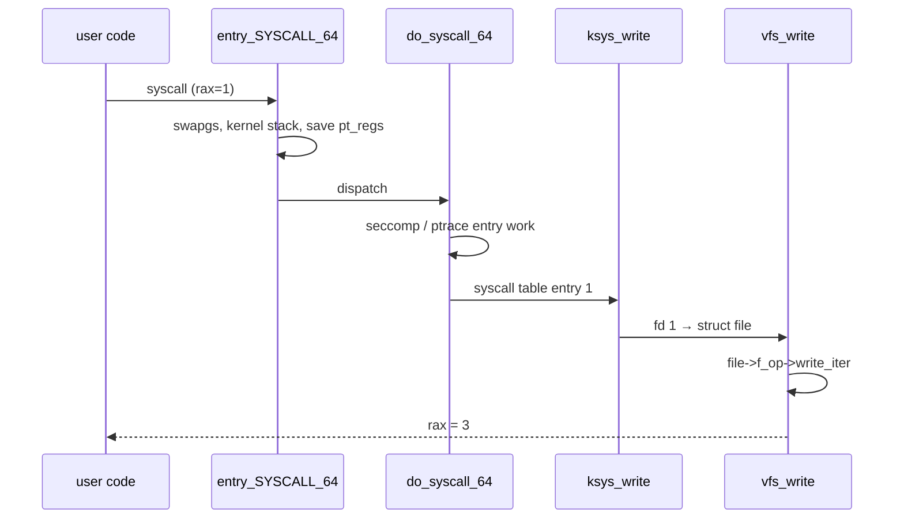

# Kernel, User Space & Syscalls

> **Goal:** understand the single most important boundary in Linux — the line
> between user space and kernel space — and the doorway through it: the
> **system call**. Every later chapter stands on this one.

## Two worlds, enforced by the CPU

Modern CPUs run code at different **privilege levels**. Linux uses two:

- **Kernel mode** (x86 "ring 0", arm64 "EL1"): can execute any instruction,
  touch any memory, talk to any device.
- **User mode** (x86 "ring 3", arm64 "EL0"): a restricted mode. Privileged
  instructions (configuring the MMU, disabling interrupts, doing port I/O)
  cause the CPU itself to trap. The hardware — not a convention, not a
  permission check in software — enforces this.

x86 actually offers four rings (0–3); Linux ignores rings 1 and 2 entirely.
arm64 has *four* exception levels, and they aren't just "more rings": EL0 is
user, EL1 is the kernel, **EL2** is where a hypervisor lives (KVM runs the
host kernel with an EL2 stub — see [KVM & Virtualization Internals](#/kvm-internals)),
and **EL3** is the secure monitor / firmware. The two-level user/kernel split
is the part every OS agrees on; the higher levels are for virtualization and
secure boot ([Trusted Computing](#/trusted-computing)).

The enforcement is two-layered:

1. **Instruction-level.** Executing a privileged instruction (`lgdt`, `hlt`,
   `wrmsr`, `cli`…) at ring 3 raises a general-protection fault. The kernel's
   fault handler runs and typically kills the process with `SIGSEGV` or
   `SIGILL`.
2. **Memory-level.** Every page-table entry carries a User/Supervisor bit.
   Kernel pages are supervisor-only, so a user-mode load or store into kernel
   memory page-faults before it reads a single byte. Modern x86 adds the
   reverse protection too: **SMEP** stops the kernel from *executing* user
   pages and **SMAP** stops it from *accidentally reading/writing* them —
   the kernel must explicitly open a window (the `stac`/`clac` instructions
   inside `copy_from_user()`) to touch user memory. arm64's equivalents are
   PXN and PAN.

The address space itself reflects the split. On x86-64 with 4-level paging,
each process sees a 48-bit canonical space: the lower 128 TiB
(`0x0000_0000_0000_0000`–`0x0000_7fff_ffff_ffff`) belongs to the process, the
upper half (`0xffff_8000_0000_0000` and up) is the kernel — mapped into
*every* process's page tables, but supervisor-only, so a syscall doesn't need
to switch address spaces at all.

(Meltdown broke that elegant assumption; **KPTI** re-splits the tables on
affected CPUs — see [CPU Vulnerability Mitigations](#/cpu-mitigations).) The
page size is 4 KiB by default on x86-64; arm64 kernels can be built for 4, 16,
or 64 KiB — details in [Virtual Memory](#/memory).

Every process you launch runs in user mode. When it needs anything from the
outside world — read a file, send a packet, get more memory, even know what
time it is — it must ask the kernel. That request is a **system call**.

```text
   user mode                      kernel mode
─────────────────             ──────────────────
 your program
    │
    │ read(fd, buf, 4096)     ← libc wrapper function
    │
    │ syscall instruction ──────► syscall entry point
    │                             • which syscall? (number in a register)
    │                             • validate arguments
    │                             • run kernel code: VFS → ext4 → disk driver
    │                             • copy data into the user buffer
    ◄────────────────────────── return to user mode
    │
    │ read() returns 4096
```

The `syscall` CPU instruction atomically switches to kernel mode **and** jumps
to one fixed kernel entry point (the address the kernel wrote into the
`MSR_LSTAR` register at boot). User code chooses *that* it enters the kernel,
never *where* — that's what keeps the boundary safe.

### The syscall ABI, at CPU level

On x86-64, the syscall convention is:

```text
rax  = syscall number (0 = read, 1 = write, 2 = open, ...)
rdi  = arg 1
rsi  = arg 2
rdx  = arg 3
r10  = arg 4 (instead of rcx, because SYSCALL clobbers rcx)
r8   = arg 5
r9   = arg 6
rcx  = return address (set by SYSCALL instruction)
r11  = saved RFLAGS (set by SYSCALL instruction)
rax  = return value (or -errno on failure)
```

Note this is *not* the ordinary C calling convention: the fourth argument
moves from `rcx` to `r10` precisely because the `SYSCALL` instruction hardwires
`rcx` to hold the saved return address. The kernel only reads six argument
registers, which is why no Linux syscall takes more than six scalar arguments —
anything larger is passed by pointer to a struct.

Two more details worth pinning down:

- **Error encoding.** The kernel returns errors as negative numbers directly
  in `rax`: `-2` means `ENOENT`. The libc wrapper checks whether the return
  value falls in the range −4095…−1 (the kernel's `MAX_ERRNO` is 4095), and
  if so stores the positive value in `errno` and returns −1 to your code.
  `errno` is pure user-space convention; the kernel knows nothing about it.
  This is also why a syscall can never legitimately return a value in that
  top 4 KiB of the address space — the range is reserved for errors.
- **Numbers are per-architecture.** `write` is 1 on x86-64 but 64 on arm64;
  `openat` is 257 vs 56. arm64 enters the kernel with the `svc #0`
  instruction, number in `w8`, arguments in `x0`–`x5`. This is why
  seccomp filters must be arch-aware — the same number means different
  syscalls on different arches.

The kernel's x86-64 syscall table lives in
`arch/x86/entry/syscalls/syscall_64.tbl`. As of 6.12 it tops out at number
462 (`mseal`, added in 6.10) — roughly 460 in-use entries. Syscall 0 is
`read`, 1 is `write`, 59 is `execve`, 231 is `exit_group`. When glibc calls
`write(fd, buf, len)`, what actually executes is:

```asm
mov eax, 1          ; syscall number for write
syscall             ; enter kernel
```

Older mechanisms still exist for compatibility: 32-bit programs use
`int 0x80` or `sysenter`, and the ancient fixed-address **vsyscall** page is
kept alive only as an emulated trap for pre-2012 binaries. The modern `syscall`
instruction replaced `int 0x80` because trapping through the interrupt gate was
much slower — a hardware fast path was worth building.

## What happens inside the kernel on entry

The `syscall` instruction lands on [entry_SYSCALL_64](https://elixir.bootlin.com/linux/v6.12/C/ident/entry_SYSCALL_64),
a hand-written assembly stub in
[arch/x86/entry/entry_64.S](https://elixir.bootlin.com/linux/v6.12/source/arch/x86/entry/entry_64.S).
In order, it:

1. runs `swapgs` so `%gs` points at per-CPU kernel data;
2. (with KPTI) switches `%cr3` to the kernel page tables;
3. switches from the user stack to the task's **kernel stack** — every thread
   owns one, 16 KiB on x86-64 (`THREAD_SIZE`), allocated in vmalloc space
   with unmapped guard pages on either side (`CONFIG_VMAP_STACK`), so a
   kernel stack overflow faults instead of silently corrupting memory;
4. pushes all user registers onto that stack, forming a
   [struct pt_regs](https://elixir.bootlin.com/linux/v6.12/C/ident/pt_regs) —
   the frozen snapshot of user state (`ip`, `sp`, `ax`…, plus `orig_ax`
   holding the syscall number). Everything `strace`, seccomp and ptrace show
   you is read from this struct.

Then C takes over:
[do_syscall_64()](https://elixir.bootlin.com/linux/v6.12/C/ident/do_syscall_64)
bounds-checks the syscall number, runs the entry work — **seccomp** filters,
ptrace stops, audit — and dispatches through the syscall table to the actual
implementation.

### The return path: exit work

The way *out* of the kernel is more than a `sysretq`. Before returning to
ring 3, the generic entry code runs a small loop —
[syscall_exit_to_user_mode()](https://elixir.bootlin.com/linux/v6.12/C/ident/syscall_exit_to_user_mode) —
that keeps checking the task's `TIF_*` "thread info" flags until none remain:

- **`TIF_NEED_RESCHED`** — the scheduler wants to run someone else; the kernel
  calls `schedule()` here, so a syscall is one of the natural preemption points
  ([CPU Scheduling](#/scheduling), which since 6.6 runs the **EEVDF**
  scheduler in place of the old CFS).
- **`TIF_SIGPENDING` / `TIF_NOTIFY_SIGNAL`** — a signal is pending; the kernel
  sets up the user-space signal frame and redirects the return so the handler
  runs first ([Signals](#/signals)).
- **`TIF_NOTIFY_RESUME`** — deferred "task work" runs via
  [task_work_run()](https://elixir.bootlin.com/linux/v6.12/C/ident/task_work_run):
  things the kernel couldn't safely do in interrupt context, like closing the
  final reference on a file or delivering io_uring completions.

Only when the loop finds nothing left to do does `sysretq` drop back to ring 3.
This is why "the syscall returned" and "the process resumed" aren't the same
instant — a signal handler or a whole other process can run in between.

One rule governs everything the syscall implementation does: **never trust a
user pointer**. Arguments like `buf` in `read(fd, buf, len)` are just numbers
a process chose.

The kernel accesses them only through
[copy_from_user()](https://elixir.bootlin.com/linux/v6.12/C/ident/copy_from_user)
/ [copy_to_user()](https://elixir.bootlin.com/linux/v6.12/C/ident/copy_to_user),
which (a) verify the address lies below the user/kernel split
([access_ok()](https://elixir.bootlin.com/linux/v6.12/C/ident/access_ok)),
(b) briefly lift SMAP, and (c) are registered in an exception table so that a
fault on a bad address returns `-EFAULT` instead of oopsing the kernel.

It also copies the data *once* and works on the copy — re-reading user memory
would let another thread flip the value between the check and the use
(a TOCTOU race).

## What system calls look like

There are roughly 460 syscalls on x86-64 as of 6.12. The famous ones form
small families:

| Family | Syscalls | Purpose |
|---|---|---|
| Files | `openat` `read` `write` `close` `statx` `lseek` | All file I/O |
| Processes | `clone` `fork` `execve` `exit` `wait4` `kill` | Create/run/end processes |
| Memory | `mmap` `brk` `munmap` `mprotect` `madvise` | Ask for / manage memory |
| Network | `socket` `bind` `connect` `accept4` `sendto` | All networking |
| Info | `getpid` `getuid` `uname` `clock_gettime` | Ask about yourself/system |
| **Containers** | `clone` `unshare` `setns` `pivot_root` | Namespaces — Part III! |

You almost never invoke these directly. The **C library (glibc)** wraps each
one in an ordinary function, and every language runtime (Python, Go, Node…)
ultimately funnels into the same syscalls. `printf()` → `write()`.
Python's `open()` → `openat()`. There is no other road to the hardware.
(Go is the notable exception that bypasses libc and issues `syscall`
instructions itself — same ABI, no wrapper.)

### Open vs openat: the modern syscall

Most file syscalls now have `*at` variants: `openat`, `statx`, `unlinkat`,
`renameat2`. The difference: `open("/etc/hostname")` resolves the path from
the process's current working directory. `openat(dirfd, "etc/hostname")`
resolves relative to a directory you already hold open as a file descriptor —
or from the CWD if you pass the special value `AT_FDCWD`.

The `*at` variants are essential for thread safety (a `chdir` in one thread
doesn't invalidate another's `openat`), and for containers (pass the
container's root fd instead of the process root). Since 5.6 there's also
`openat2`, which adds resolve flags like `RESOLVE_BENEATH` and
`RESOLVE_NO_SYMLINKS` — the building blocks for safely opening untrusted
paths. Path resolution itself is a [VFS](#/filesystems) story.

### The forgotten syscalls

Not every syscall is famous. Some oddball ones worth knowing:

- `getrandom(2)` — ask the kernel for cryptographically random bytes without
  opening `/dev/urandom`. Since 6.11 it even has a vDSO fast path
  (`vgetrandom`), so most calls never enter the kernel.
- `memfd_create(2)` — create an anonymous file living purely in RAM,
  sealable, passable over Unix sockets. Chrome and Wayland compositors use it
  heavily.
- `pidfd_open(2)` — get a file descriptor referring to a process, killing the
  ancient PID-reuse race. See [Processes & Threads](#/processes).
- `io_uring_setup(2)` — the modern completion-based I/O interface
  ([Modern I/O & io_uring](#/modern-io)).
- `bpf(2)` — the eBPF program/map management syscall. One syscall number,
  dozens of sub-commands ([eBPF Internals](#/ebpf-internals)).
- `mseal(2)` — added in 6.10: seal a memory mapping so nothing (not even the
  process itself) can remap or change its permissions again.

## Watch syscalls live: strace

This is the moment to meet the most instructive tool on this entire site:

```bash
strace -c ls          # summary: which syscalls, how many, how long
strace cat /etc/hostname
```

Output of the second command (trimmed):

```text
execve("/usr/bin/cat", ["cat", "/etc/hostname"], ...) = 0
openat(AT_FDCWD, "/etc/hostname", O_RDONLY)           = 3
read(3, "mybox\n", 131072)                            = 6
write(1, "mybox\n", 6)                                = 6
close(3)                                              = 0
exit_group(0)                                         = ?
```

Six lines and you can *see* the anatomy of `cat`: open the file (getting file
descriptor 3), read its bytes, write them to file descriptor 1 (stdout), exit.
When a program misbehaves, `strace` shows you exactly what it asked the kernel
and what the kernel answered. Use it liberally.

Production-grade strace patterns:

```bash
strace -f -tt -T ./myprog          # follow forks, timestamps, syscall durations
strace -e trace=file ls             # only file-related syscalls
strace -e trace=network curl example.org
strace -Z -e trace=openat myprog   # -Z: only FAILED syscalls ← quick debug gold
strace -p 1234 -cw -o report.txt   # attach, count syscalls, write report
```

`-Z` (failed-only) is the forgotten superpower: `strace -Z myapp 2>&1 | grep ENOENT`
shows every missing file path the app is looking for, instantly.

One caveat: `strace` works via `ptrace(2)`, which stops the tracee **twice
per syscall** (on entry and exit) and context-switches to the tracer each
time. A syscall-heavy program can run 10–100× slower under it. Fine for
debugging; for production, use `perf trace` or eBPF-based tools, which
observe from inside the kernel — see
[/proc, strace, perf & eBPF](#/observability).

## File descriptors: handles to kernel objects

When `openat()` succeeded above it returned `3`. That number is a **file
descriptor (fd)**: an index into a per-process table, where each entry points
to an open object *inside the kernel*. Your process never holds the object —
only the numbered ticket to it.

The kernel-side plumbing is three structs deep:

- `current->files` points to a
  [struct files_struct](https://elixir.bootlin.com/linux/v6.12/C/ident/files_struct)
  — one per process (threads share it; that's why fds are process-global).
  Key fields: `fdt` (the current table), `next_fd` (lowest free number —
  POSIX requires "lowest available", which is why closing fd 0 makes the next
  `open()` return 0), and an embedded `fd_array[64]` so small processes never
  allocate a separate table.
- [struct fdtable](https://elixir.bootlin.com/linux/v6.12/C/ident/fdtable)
  holds `max_fds`, the `fd[]` array of `struct file *`, and two bitmaps:
  `open_fds` and `close_on_exec`. It grows by doubling and is
  RCU-protected, so lookups take no lock.
- Each entry points to a
  [struct file](https://elixir.bootlin.com/linux/v6.12/C/ident/file) — the
  open-file description itself: `f_pos` (the read/write offset!), `f_mode`,
  `f_flags`, `f_inode`, a refcount (`f_count`), and `f_op` — the operations
  table that makes a "read" on a socket behave differently from a read on an
  ext4 file.

The layering explains classic behaviors: `dup(3)` and `fork()` copy *table
entries*, so both fds point at the **same** `struct file` and share one file
offset — while opening the same path twice creates two `struct file`s with
independent offsets. The `O_CLOEXEC` flag lives in the per-fd bitmap, not in
`struct file`, so it's per-descriptor.

Look-up on the hot path goes through
[fdget()](https://elixir.bootlin.com/linux/v6.12/C/ident/fdget), which returns
a lightweight [struct fd](https://elixir.bootlin.com/linux/v6.12/C/ident/fd).
The clever part: if the current fd table isn't shared with another thread,
`fdget()` skips the atomic refcount increment entirely and just borrows the
`struct file` for the duration of the syscall — a measurable win for read/write
heavy workloads.

Limits come in two layers, and mixing them up is a classic production outage:

- Per-process: the soft `RLIMIT_NOFILE` default is **1024** almost everywhere;
  systemd-based distros typically set the hard limit to **524288**
  (`ulimit -n -H`). Hitting it yields **`EMFILE`** ("too many open files" for
  *this* process).
- System-wide: `fs.file-max` caps the total number of open `struct file`s
  across the whole machine; the ceiling on any single process's fd count is
  `fs.nr_open`. Exhausting the global pool yields **`ENFILE`**.

Three fds exist by convention in every process:

```text
0  stdin    1  stdout    2  stderr
```

Shell redirection is pure fd manipulation: `ls > out.txt` simply makes fd 1
point at `out.txt` before launching `ls` — `ls` itself never knows. And fds
name much more than files: pipes, sockets, eventfd, signalfd, timerfd, pidfd,
memfd, epoll instances, io_uring instances — all are fds. *Everything is a
file (descriptor).*

```bash
ls -l /proc/self/fd      # the fd table of the process running this very ls
ls -l /proc/$$/fd        # your shell's open file descriptors
cat /proc/sys/fs/file-nr # open struct files, system-wide: used, 0, max
```

**Container link:** fds can be *passed between processes* over Unix sockets
(`SCM_RIGHTS`) — the receiving process gets a new fd pointing at the same
`struct file`. That's how container runtimes hand a pre-opened rootfs or a
network socket into a sandboxed child. See
[Pipes, FIFOs & Unix Sockets](#/ipc-pipes).

## vDSO: the syscall the kernel skips

Some "syscalls" never enter the kernel. The kernel injects a tiny shared
library — the **vDSO** (virtual Dynamic Shared Object) — into every process's
address space:

```bash
cat /proc/self/maps | grep -E 'vdso|vvar'
# 7fffdc0f2000-7fffdc0f4000 r-xp ... [vdso]
# 7fffdc0ee000-7fffdc0f2000 r--p ... [vvar]
```

Functions like `clock_gettime()`, `gettimeofday()`, `getcpu()`, and (since
6.11) `getrandom()` live here. The trick is the **vvar page** next door: a
read-only mapping of a data page the kernel keeps updated — the
[vdso_data](https://elixir.bootlin.com/linux/v6.12/C/ident/vdso_data) struct,
holding the last clock readout (`cycle_last`), the conversion factors
(`mult`, `shift`), and a sequence counter.

The vDSO code reads the sequence counter, computes
`base + (rdtsc() - cycle_last) * mult >> shift`, reads the counter again,
and retries if it changed mid-read (a lock-free **seqcount** pattern — see
[Kernel Synchronization](#/kernel-sync)).

No mode switch, no privilege transition — a `clock_gettime()` call costs
~20–25 ns instead of hundreds. If the clocksource isn't vDSO-capable (an
unstable TSC, some VMs), the vDSO quietly falls back to the real syscall.

The general pattern: if the kernel can expose a piece of data to user space as
read-only memory, it avoids a full syscall for every read. Two consequences
you'll meet later: [time namespaces](#/namespaces) get their *own* vvar page
(so a container can have a shifted `CLOCK_MONOTONIC`), and clock internals are
covered in [Timers & Time](#/timers).

See it linked into any dynamic binary:

```bash
ldd /bin/ls | grep vdso      # → linux-vdso.so.1 (no file path: it's injected)
```

## Mode switch ≠ context switch

Two terms people mix up:

- a **mode switch** is one process going user → kernel → user (every syscall);
  cheap-ish (~hundreds of CPU cycles, but varies with Spectre/Meltdown
  mitigations — the `syscall` entry/exit can be ~200–1000 cycles with KPTI
  page table switching on affected CPUs — see
  [CPU Vulnerability Mitigations](#/cpu-mitigations)).
- a **context switch** is the kernel pausing one process and resuming
  *another* — saving registers, switching address spaces (`%cr3`), and
  usually eating cache/TLB misses afterwards. More expensive (~1–10 µs
  all-in), and the subject of [CPU Scheduling](#/scheduling).

A syscall like `read()` on an empty pipe causes both: mode switch in, the
kernel sees there's no data, puts your process on the pipe's **wait queue**
and marks it `TASK_INTERRUPTIBLE`, then context-switches to someone else.
When data arrives, the writer's kernel path walks that wait queue and marks
you runnable again. This block-and-wake pattern is how Linux appears to do
everything at once.

## Interrupts: the other way into the kernel

Syscalls are the *intentional* entry into kernel mode. The other entry is the
**interrupt**: hardware (a network card, a disk, a timer) electrically signals
the CPU, which suspends whatever is running and jumps into a kernel handler.

- Your NIC received a packet → interrupt → kernel processes it
  ([The Networking Stack](#/networking)).
- The **timer interrupt** fires periodically (every 1–10 ms depending on
  `CONFIG_HZ`, and not at all on idle tickless CPUs —
  [Timers & Time](#/timers)) → the scheduler gets a chance to preempt the
  running process. This is why an infinite loop can't freeze Linux: the timer
  always pulls the CPU back into the kernel.
- **Exceptions** are the third entry: the CPU traps on errors *it* detects.
  Touch an unmapped address → *page fault* → kernel decides: fix it up
  (more in [Virtual Memory](#/memory) — page faults are often *normal*!) or
  kill you with the famous `SIGSEGV`, the segfault.

So kernel code runs for exactly three reasons: **a syscall, an interrupt, or
an exception**. Never spontaneously.

### The interrupt flow in more detail

When an interrupt arrives:

1. CPU saves minimal state (instruction pointer, flags) on the kernel stack.
2. CPU indexes the **IDT** (Interrupt Descriptor Table) with the vector
   number; the kernel filled in the handlers at boot.
3. The IRQ handler runs (the "top half" — must be fast, as further interrupts
   are often disabled during it).
4. The handler acknowledges the device, reads the urgent data, schedules the
   "bottom half" for heavier processing (softirq, tasklet, workqueue —
   [Interrupts, Exceptions & Softirqs](#/interrupts) covers these in depth).
5. The CPU returns from the interrupt; the scheduler decides whether the
   interrupted process or some newly-woken process should resume.

You can see this live:

```bash
cat /proc/interrupts    # counts per-IRQ per-CPU
watch -n1 cat /proc/softirqs  # bottom-half counters
```

## Why this design wins

The cost of all this ceremony buys enormous benefits:

- **Isolation** — a crashing process can't corrupt others or the kernel.
- **A stable contract** — the syscall interface is famously stable
  ("we do not break user space" — Linus). A binary from 2005 still runs.
- **A perfect choke point** — since *everything* passes through syscalls, you
  can observe everything (`strace`, eBPF), filter what a process may do
  (**seccomp**), and account/limit precisely (that accounting boundary is
  where [Control Groups (cgroup v2)](#/cgroups) — the default on modern
  distros — hook in).

### Seccomp: filtering the choke point

Because every syscall funnels through the same entry work, the kernel can run
a filter there. **seccomp** ("secure computing") has two modes:

- **`SECCOMP_MODE_STRICT`** — the original, draconian mode: the process may
  only call `read`, `write`, `_exit`, and `sigreturn`. Anything else kills it.
- **`SECCOMP_MODE_FILTER`** — the one everyone actually uses: the process (or
  its parent) installs a small **classic BPF** program that runs inside
  [do_syscall_64()](https://elixir.bootlin.com/linux/v6.12/C/ident/do_syscall_64)'s
  entry work, inspecting the syscall number and arguments from `pt_regs`.

The filter returns one of a handful of verdicts: `SECCOMP_RET_ALLOW`,
`SECCOMP_RET_ERRNO` (fail the call with a chosen errno), `SECCOMP_RET_TRAP`
(raise `SIGSYS`), `SECCOMP_RET_TRACE` (hand off to a ptracer or a userspace
notifier fd), `SECCOMP_RET_LOG`, or `SECCOMP_RET_KILL_PROCESS`. Filters can
only *inspect* register values, never dereference pointer arguments — a
deliberate limit that sidesteps TOCTOU races. Docker's default profile blocks a
few dozen of the ~460 syscalls — `kexec_load`, `open_by_handle_at`, the raw
`clock_settime`, older `ptrace` — and that single mechanism removes whole
classes of container escapes. Details in
[Linux Security & Confinement](#/security-hardening).

**Container link:** containers are not virtual machines with their own
kernel. **Every process in every container talks to the one shared kernel
through these same syscalls** — just with namespaced views
([Namespaces](#/namespaces)) and filtered permissions. Keep that in mind for
[Part III](#/containers-overview).

### Syscall overhead: what it costs in the real world

On a modern machine, a trivial syscall (like `getpid()`) costs roughly:

```text
~200–300 cycles on CPUs without mitigations
~800–1500 cycles with KPTI (Meltdown mitigation) enabled
```

That's still fast (~100–500 nanoseconds), but web servers and databases issue
hundreds of thousands per second. This is why:

- **vDSO** exists for `gettimeofday` and friends.
- **io_uring** batches submissions and completions through shared rings to
  amortize (or entirely skip) entry/exit —
  [Modern I/O & io_uring](#/modern-io).
- **eBPF** moves logic *into* the kernel so events don't cross the boundary
  at all ([eBPF Internals](#/ebpf-internals)).
- Languages like Go batch syscalls behind a network poller rather than
  one-epoll_wait-per-goroutine.

The syscall cost is the fundamental tax that the entire I/O architecture is
organized to minimize.

## Follow the code (kernel v6.12)

### Path 1: `write(1, "hi\n", 3)` from ring 3 to the VFS



1. glibc's `write()` loads `rax = 1` and executes `syscall`. The CPU jumps to
   [entry_SYSCALL_64](https://elixir.bootlin.com/linux/v6.12/C/ident/entry_SYSCALL_64)
   in [arch/x86/entry/entry_64.S](https://elixir.bootlin.com/linux/v6.12/source/arch/x86/entry/entry_64.S),
   which does the `swapgs` / stack-switch / `pt_regs` dance from earlier.
2. It calls [do_syscall_64()](https://elixir.bootlin.com/linux/v6.12/C/ident/do_syscall_64)
   in [arch/x86/entry/common.c](https://elixir.bootlin.com/linux/v6.12/source/arch/x86/entry/common.c),
   which runs
   [syscall_enter_from_user_mode()](https://elixir.bootlin.com/linux/v6.12/C/ident/syscall_enter_from_user_mode)
   (seccomp, ptrace, audit) and then dispatches on the number. Since 6.9,
   x86 dispatches through a generated `switch` statement
   ([x64_sys_call()](https://elixir.bootlin.com/linux/v6.12/C/ident/x64_sys_call))
   rather than indexing the classic
   [sys_call_table](https://elixir.bootlin.com/linux/v6.12/C/ident/sys_call_table)
   function-pointer array — an anti-Spectre measure; both are generated from
   the same `.tbl` file.
3. Entry 1 is `write`, defined in
   [fs/read_write.c](https://elixir.bootlin.com/linux/v6.12/source/fs/read_write.c)
   with the [SYSCALL_DEFINE3](https://elixir.bootlin.com/linux/v6.12/C/ident/SYSCALL_DEFINE3)
   macro — the macro generates the `__x64_sys_write()` glue that unpacks
   arguments from `pt_regs`. The body just calls
   [ksys_write()](https://elixir.bootlin.com/linux/v6.12/C/ident/ksys_write).
4. `ksys_write()` calls
   [fdget_pos()](https://elixir.bootlin.com/linux/v6.12/C/ident/fdget_pos):
   an RCU-protected lookup of fd 1 in `current->files`, returning the
   `struct file` and — if the file is shared between threads — taking the
   `f_pos_lock` so concurrent writes don't scramble the shared offset.
5. [vfs_write()](https://elixir.bootlin.com/linux/v6.12/C/ident/vfs_write)
   checks `f_mode` for `FMODE_WRITE`, verifies the user buffer region, and
   invokes `file->f_op->write_iter` — the function pointer in
   [struct file_operations](https://elixir.bootlin.com/linux/v6.12/C/ident/file_operations)
   that the backing object registered. For a terminal that's the tty driver;
   for an ext4 file it lands in the page cache
   ([Virtual Memory](#/memory), [The Linux Storage Stack](#/storage-stack)).
   Somewhere below, `copy_from_user()` pulls your 3 bytes across the
   boundary.
6. The return value bubbles back into `regs->ax`, exit work runs (signals,
   resched, task_work), and `sysretq` restores user mode. Your `write()`
   returns 3.

### Path 2: `clock_gettime()` — the syscall that isn't

1. glibc calls `__vdso_clock_gettime`, resolved at process startup from the
   injected vDSO — user-space code, in your address space.
2. On x86 that's a thin wrapper around the generic
   [__cvdso_clock_gettime()](https://elixir.bootlin.com/linux/v6.12/C/ident/__cvdso_clock_gettime)
   in [lib/vdso/gettimeofday.c](https://elixir.bootlin.com/linux/v6.12/source/lib/vdso/gettimeofday.c).
3. That code reads the
   [vdso_data](https://elixir.bootlin.com/linux/v6.12/C/ident/vdso_data)
   page: grab the seqcount, read `cycle_last`/`mult`/`shift` and the base
   time, execute `rdtsc`, compute the current time, re-check the seqcount,
   retry if the kernel updated the page mid-read.
4. Only if `clock_mode` says the clocksource can't be read from user space
   does it fall back to a genuine `syscall`. On healthy hardware, the kernel
   is never entered. Total cost: tens of nanoseconds.

## Try it yourself

```bash
strace -c true                       # the minimal program's syscall bill
strace -e trace=network curl -s example.org > /dev/null
strace -Z myapp 2>&1 | grep ENOENT   # find missing config files instantly
ls -l /proc/$$/fd                    # your shell's open file descriptors
man 2 syscalls                       # the full catalogue (section 2 = syscalls)
cat /proc/self/maps | grep -E 'vdso|vvar'   # the vDSO in your process
ldd /bin/ls | grep vdso              # linux-vdso.so.1: injected, not on disk
cat /proc/interrupts | head          # interrupts since boot
ulimit -n; ulimit -n -H              # your fd limits, soft and hard
cat /proc/sys/fs/file-max            # system-wide struct file ceiling
grep -i seccomp /proc/self/status    # Seccomp: 0 = off, 2 = filtered
```

Compare traced vs untraced speed to feel the ptrace overhead:

```bash
time dd if=/dev/zero of=/dev/null bs=1 count=100000
time strace -c -o /dev/null dd if=/dev/zero of=/dev/null bs=1 count=100000
```

## Check your understanding

1. Why can't a user program simply jump into kernel code at an address of its
   choosing?

<details><summary>Show answer</summary>

The CPU enforces the boundary in hardware. Kernel pages are marked
supervisor-only in the page tables, so user-mode execution of them faults
immediately; the only sanctioned entry is the `syscall` instruction, which
atomically raises the privilege level *and* jumps to the one fixed entry
point the kernel registered in `MSR_LSTAR`. User code controls *that* it
enters the kernel, never *where*.

</details>

2. `strace` shows `python script.py` calling `openat`, never "fopen". Why?

<details><summary>Show answer</summary>

`fopen` is a libc function, executing entirely in user space; it internally
issues the `openat` syscall. `strace` sits at the kernel boundary (via
ptrace) and sees only what actually crosses it — real syscalls, not library
wrappers.

</details>

3. What are the only three events that cause kernel code to run?

<details><summary>Show answer</summary>

A **syscall** (intentional request), an **interrupt** (a device or timer
signals the CPU), or an **exception** (the CPU traps on a fault such as a
page fault or division by zero). The kernel never runs spontaneously.

</details>

4. Why does `clock_gettime()` usually not enter the kernel, and when does it
   still have to?

<details><summary>Show answer</summary>

The kernel maps a read-only data page (the vDSO's `vdso_data`) into every
process, containing the latest clock parameters. The vDSO code reads it,
combines it with `rdtsc`, and validates with a seqcount retry loop — all in
user mode, ~20 ns. It falls back to a real syscall when the clocksource
can't be read from user space (e.g. an unstable TSC or certain VMs).

</details>

5. A process is stuck sleeping in `read()`. What has to happen for it to wake
   — and how does the kernel find the right process?

<details><summary>Show answer</summary>

Data must arrive at the object it's blocked on. The device's interrupt
handler (or a writer on the pipe) processes the data — for TCP, matching the
packet's 4-tuple to a socket — and then walks that object's **wait queue**,
where the sleeping task registered itself before blocking, marking it
runnable. The scheduler eventually context-switches back to it and `read()`
returns.

</details>

6. After `fd2 = dup(fd)`, reading from `fd` moves `fd2`'s offset too — but
   two separate `open()`s of the same file have independent offsets. Why?

<details><summary>Show answer</summary>

`dup()` copies only the fd-table entry, so both descriptors point at the
**same `struct file`**, which owns the single `f_pos` offset. Each `open()`
allocates a *new* `struct file`, hence a fresh, independent offset. The same
sharing happens across `fork()`.

</details>

7. Why must the kernel access syscall pointer arguments through
   `copy_from_user()` instead of just dereferencing them?

<details><summary>Show answer</summary>

The pointer is untrusted: it may point at kernel memory (an exploit
attempt), at an unmapped address (must yield `-EFAULT`, not a kernel crash),
and SMAP blocks casual kernel access to user pages anyway.
`copy_from_user()` validates the range with `access_ok()`, briefly lifts
SMAP, and its faults are caught by an exception table. Copying once also
prevents TOCTOU races where another thread changes the data between check
and use.

</details>

8. Your service starts failing with `EMFILE` while another on the same box
   hits `ENFILE`. What's the difference?

<details><summary>Show answer</summary>

`EMFILE` means *this* process exhausted its own `RLIMIT_NOFILE` (raise it with
`ulimit -n` up to the hard cap). `ENFILE` means the *whole system* ran out of
`struct file`s against `fs.file-max`. One is a per-process limit, the other is
global — the fix differs accordingly.

</details>

## Sources & further reading

- David Drysdale, ["Anatomy of a system call, part 1"](https://lwn.net/Articles/604287/) and
  [part 2](https://lwn.net/Articles/604515/) — LWN, the definitive walkthrough of syscall plumbing.
- [syscall(2)](https://man7.org/linux/man-pages/man2/syscall.2.html) — calling conventions for every architecture, in one table.
- [syscalls(2)](https://man7.org/linux/man-pages/man2/syscalls.2.html) — the full catalogue with the kernel version each syscall appeared in.
- [vdso(7)](https://man7.org/linux/man-pages/man7/vdso.7.html) — what the vDSO exports on each architecture.
- [seccomp(2)](https://man7.org/linux/man-pages/man2/seccomp.2.html) — the syscall-filtering mechanism containers rely on.
- [Entry/exit handling for interrupts and syscalls](https://docs.kernel.org/core-api/entry.html) — kernel docs on the generic entry code.
- [arch/x86/entry/syscalls/syscall_64.tbl](https://elixir.bootlin.com/linux/v6.12/source/arch/x86/entry/syscalls/syscall_64.tbl) — the actual x86-64 syscall table in v6.12.
- Jonathan Corbet, ["KAISER: hiding the kernel from user space"](https://lwn.net/Articles/738975/) — LWN, the KPTI design that made syscalls pricier.

---

**Next:** Part II begins with the kernel's favourite object — the
[process](#/processes) — and what `fork()` and `exec()` really do.
