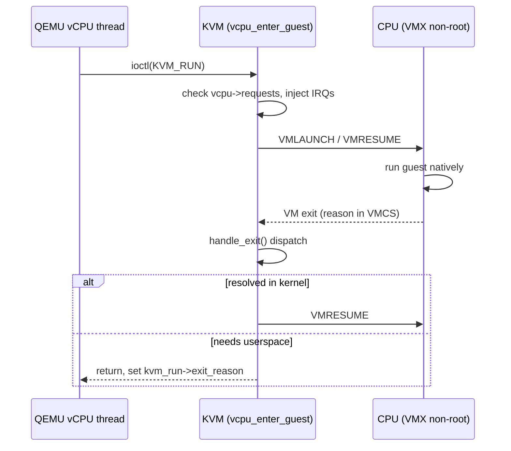

# KVM & Virtualization Internals

> **Goal:** understand how the Linux kernel itself becomes a hypervisor — the KVM module, the vCPU execution loop, the VM-exit handling, the memory virtualization via EPT/NPT, and the virtio paravirtualized device model that makes cloud computing possible.

## The hypervisor taxonomy

Virtualization splits the world in two:

| Type | What | Examples |
|---|---|---|
| **Type 1** | Hypervisor runs on bare metal, VMs on top | VMware ESXi, Xen, Hyper-V |
| **Type 2** | Hypervisor is a process on a host OS, VMs are processes | VirtualBox, QEMU without KVM |

Linux+KVM is **both**: KVM (Kernel-based Virtual Machine, merged in 2.6.20
back in 2007) is a kernel module that turns the running Linux kernel into a
Type 1 hypervisor. Each VM is a regular Linux process (visible in `ps`,
killable with `kill`, cgroup-constrained, swappable), but inside that process
the CPU runs in **guest mode** — a hardware-enforced execution context where
the guest OS believes it owns the machine.

So it walks like a Type 2 (a normal userspace process manages it) but runs
like a Type 1 (guest code executes directly on the silicon, not interpreted).

```bash
# A running VM is a process like any other
ps aux | grep qemu
# user  12345  120.0  50.0  ... qemu-system-x86_64 -enable-kvm -m 4096 ...
ls /proc/12345/fd/     # KVM file descriptors, memory mappings
cat /proc/12345/status | grep Threads   # one thread per vCPU + I/O + main
```

## The three components

1. **KVM** (`/dev/kvm`): the kernel module (`kvm.ko` plus the vendor module `kvm_intel.ko` or `kvm_amd.ko`) that exposes hardware virtualization extensions (Intel VT-x, AMD-V) as a character device.
2. **QEMU** (or a lighter VMM like [Firecracker](https://firecracker-microvm.github.io/) or Cloud Hypervisor): userspace that emulates devices, allocates guest memory, and orchestrates vCPU threads.
3. **Guest code**: the unmodified kernel and applications running inside the VM.

The split matters: KVM does the privileged, latency-critical work (entering/leaving guest mode, second-level page faults, interrupt injection); userspace does everything that is complex but not hot (device emulation, migration, config). This is why a single `kvm.ko` supports QEMU, Firecracker, crosvm, and Kata Containers without changes.

```text
     ┌─────────────────────────────────────────────┐
     │              Guest VM process (QEMU)          │
     │  ┌─────────────────────────────────────────┐ │
     │  │            main / I/O threads            │ │
     │  │  • emulates devices (disk, NIC, GPU)    │ │
     │  │  • handles I/O forwarded from guest     │ │
     │  │  • uses KVM ioctls to create/manage VM  │ │
     │  └─────────────────────────────────────────┘ │
     │  ┌───────────────┐ ┌───────────────┐         │
     │  │  vCPU thread  │ │  vCPU thread  │  ...    │
     │  │  ioctl(KVM_RUN)│ │ ioctl(KVM_RUN)│         │
     │  └───────┬───────┘ └───────┬───────┘         │
     └──────────┼─────────────────┼─────────────────┘
                │                 │
     ┌──────────┴─────────────────┴─────────────────┐
     │              /dev/kvm (KVM kernel module)     │
     │  • VM entry/exit via VMX/SVM instructions     │
     │  • EPT/NPT (nested page tables)               │
     │  • vCPU state save/restore, IRQ injection     │
     └──────────────────────────────────────────────┘
                │
     ┌──────────┴──────────────────────────────────┐
     │              CPU Hardware (VT-x / AMD-V)      │
     │  • VMXON / VMXOFF, VMLAUNCH / VMRESUME        │
     │  • VM-exit conditions, EPT/NPT walkers        │
     └──────────────────────────────────────────────┘
```

## The KVM API

KVM is a set of file descriptors and ioctls, documented exhaustively in [Documentation/virt/kvm/api.rst](https://docs.kernel.org/virt/kvm/api.html). There are three fd "levels", each with its own ioctl set:

- **system fd** — `open("/dev/kvm")`. Global queries: `KVM_GET_API_VERSION`, `KVM_CHECK_EXTENSION`, `KVM_GET_VCPU_MMAP_SIZE`, and `KVM_CREATE_VM`.
- **VM fd** — returned by `KVM_CREATE_VM`. Owns guest physical address space and devices: `KVM_SET_USER_MEMORY_REGION2`, `KVM_CREATE_VCPU`, `KVM_CREATE_IRQCHIP`, `KVM_IRQFD`.
- **vCPU fd** — returned by `KVM_CREATE_VCPU`. One per virtual CPU: `KVM_RUN`, `KVM_GET_REGS`/`KVM_SET_REGS`, `KVM_SET_CPUID2`, `KVM_GET_MSRS`.

```c
// Conceptual skeleton — real code uses these exact ioctls
kvm_fd  = open("/dev/kvm", O_RDWR);                 // system fd
vm_fd   = ioctl(kvm_fd, KVM_CREATE_VM, 0);          // VM fd
// Hand guest RAM to KVM: a userspace mmap becomes guest-physical memory
struct kvm_userspace_memory_region2 region = {
    .slot = 0, .guest_phys_addr = 0,
    .memory_size = mem_size, .userspace_addr = (u64)mmap_ptr };
ioctl(vm_fd, KVM_SET_USER_MEMORY_REGION2, &region); // register a memslot
vcpu_fd = ioctl(vm_fd, KVM_CREATE_VCPU, 0);         // vCPU 0
size_t run_sz = ioctl(kvm_fd, KVM_GET_VCPU_MMAP_SIZE, 0);
struct kvm_run *run = mmap(NULL, run_sz, PROT_RW, MAP_SHARED, vcpu_fd, 0);

for (;;) {
    ioctl(vcpu_fd, KVM_RUN, 0);          // enter guest; returns on VM exit
    switch (run->exit_reason) {
    case KVM_EXIT_IO:    handle_pio(run);  break;  // in/out instruction
    case KVM_EXIT_MMIO:  handle_mmio(run); break;  // memory-mapped I/O
    case KVM_EXIT_HLT:   handle_halt();    break;  // guest executed HLT
    case KVM_EXIT_SHUTDOWN: return;                // triple fault / reset
    }
}
```

The shared `struct kvm_run` page is the ABI between kernel and userspace. On every exit KVM fills in `exit_reason` and a matching union member (`run->io`, `run->mmio`, `run->hypercall`) so userspace knows what the guest asked for without a second syscall.

**Key insight:** the vCPU thread alternates between **guest mode** (native guest code at full CPU speed), **kernel mode** (KVM handles an exit it can resolve itself, e.g. an EPT fault or timer), and — only when necessary — **userspace mode** (control returns from `KVM_RUN` so QEMU can emulate a device). The whole performance game is minimizing the second and especially the third.

```bash
# Watch the KVM ioctls a live VM issues
strace -p $(pgrep -f qemu) -f 2>&1 | grep -E 'ioctl\([0-9]+, KVM'
# KVM_RUN dominates; KVM_SET_REGS/KVM_GET_REGS around device emulation
```

## The vCPU execution loop

Everything hangs off one ioctl: `KVM_RUN`. Understanding its loop is understanding KVM.

The vCPU is described by `struct kvm_vcpu` (in `include/linux/kvm_host.h`). The fields that matter:

- `vcpu->run` — the mmap'd `struct kvm_run` shared with userspace.
- `vcpu->arch` — the arch-specific `struct kvm_vcpu_arch`: register cache, `cr0/cr3/cr4`, the MMU, the local APIC, pending exceptions.
- `vcpu->mode` — `IN_GUEST_MODE`, `OUTSIDE_GUEST_MODE`, or `EXITING_GUEST_MODE`. Other CPUs read this to decide whether they must send an IPI to kick this vCPU out of the guest (e.g. to deliver an interrupt).
- `vcpu->requests` — a bitmap of deferred work (`KVM_REQ_TLB_FLUSH`, `KVM_REQ_EVENT`, `KVM_REQ_STEAL_UPDATE`) checked just before entry.

On Intel the per-vCPU `struct vcpu_vmx` wraps this and owns the **VMCS** (Virtual Machine Control Structure) — the ~4 KiB hardware-defined block that holds guest register state, host state to restore on exit, and the execution controls that decide which guest actions cause exits. AMD's equivalent in `struct vcpu_svm` is the **VMCB**.



The inner kernel loop (`vcpu_enter_guest`) does, on every iteration: service
pending `vcpu->requests`; flush the TLB if asked; evaluate and inject a
pending interrupt or exception into the VMCS; disable preemption and IRQs; do
the low-level register save/restore and execute `VMLAUNCH`/`VMRESUME`; then,
the instant the guest exits, read the exit reason from the VMCS and dispatch.

If the exit is fully handled in the kernel, it loops again without ever
returning to userspace — this is the fast path, and keeping I/O on it (via
KVM's in-kernel APIC, PIT, and `ioeventfd`) is why modern VMs feel native.

## The VM exit: the heart of virtualization

Hardware virtualization runs guest code directly on the physical core — **most instructions execute at native speed**, including arithmetic, branches, and normal memory access. The hardware forces a VM exit only when the guest does something the hypervisor must mediate:

| Trigger | Exit reason | Handled by |
|---|---|---|
| Guest executes `HLT` | `KVM_EXIT_HLT` | KVM: block the vCPU until an event arrives |
| Guest does `inb $0x64` (PIO) | `KVM_EXIT_IO` | Userspace (or in-kernel device): emulate the port |
| Guest reads/writes MMIO region | `KVM_EXIT_MMIO` | Userspace: emulate the device register |
| Guest accesses a GPA not mapped in EPT | EPT violation | KVM: fault in a page or forward to guest |
| Guest writes CR3 / executes INVLPG | (usually no exit with EPT) | Hardware: guest paging is native under EPT |
| Guest executes `CPUID` | CPUID exit | KVM: return curated/hypervisor CPUID leaves |
| Guest reads/writes an MSR | MSR exit | KVM: emulate specific model-specific registers |
| Guest executes `VMCALL` | `KVM_EXIT_HYPERCALL` | KVM: handle the paravirt hypercall |
| Guest's virtual timer fires | (APIC-timer exit) | KVM: inject a virtual interrupt |
| Physical IRQ arrives for the host | external-interrupt exit | Host: take the IRQ, then re-enter the guest |

A VM exit on current hardware costs roughly **500–1500 cycles** for the hardware transition alone (well under a microsecond); the full software round-trip through KVM's handler is more. Compare that to an EPT-less shadow-paging fault or a bounce all the way to userspace, which can be tens of thousands of cycles. An exit-heavy workload (naive disk benchmark, packet flood on an emulated NIC) can burn well over 30% of CPU on exits — which is exactly the problem virtio and vhost exist to solve.

```bash
# VM-exit accounting via tracepoints
perf stat -e 'kvm:kvm_exit,kvm:kvm_entry' -a -p $(pgrep qemu) sleep 5
# kvm_exit and kvm_entry counts should match

# Per-reason exit counts (needs debugfs mounted)
mount -t debugfs none /sys/kernel/debug 2>/dev/null
ls /sys/kernel/debug/kvm/*/vcpu0/    # exit reason stat files
perf kvm stat live                   # live, sorted by exit reason
```

Related reading on why leaving the core is expensive: [Interrupts, Exceptions & Softirqs](#/interrupts) and [CPU Scheduling](#/scheduling).

## EPT/NPT: two-dimensional address translation

Memory is the subtle part. A guest process address must survive **two** translations:

```text
    Guest paging:   Guest Virtual Addr  → Guest Physical Addr   (guest CR3, guest page tables)
    Host/EPT:       Guest Physical Addr → Host  Physical Addr   (EPT / NPT, owned by KVM)
```

Intel **EPT** (Extended Page Tables) and AMD **NPT** (Nested Page Tables) let
the CPU perform both walks in hardware — sometimes called *two-dimensional
paging*. The guest freely edits its own page tables and writes CR3 with **no
exit**; the MMU walks the guest tables to get a GPA and then walks the EPT to
get the HPA.

On x86-64 with 4 KiB pages both are 4-level radix trees. Each of the five
guest-physical addresses the walk produces — four page-table pages plus the
final data page — must itself be resolved by a five-step EPT walk, so a full
nested miss can touch up to 5×5 − 1 = 24 memory accesses before the data is
read. That is why the TLB, and using huge pages, matter so much for VMs.

KVM owns the EPT/NPT structures through `struct kvm_mmu` (per vCPU) and
represents each page-table page with `struct kvm_mmu_page`. When the guest
touches a GPA that has no EPT entry, the hardware raises an **EPT violation**
and `kvm_mmu_page_fault()` runs: it looks up the guest-physical address in the
target memslot, calls into the host's ordinary fault path to get the backing
page, and installs a leaf EPT entry (a "SPTE", shadow page-table entry)
pointing at the host page frame.

Since ~4.14 the default MMU is the **TDP MMU** (Two-Dimensional Paging MMU), a
rewrite that uses RCU-protected, largely lock-free page-table walks so faults
on different vCPUs scale — see [Kernel Synchronization](#/kernel-sync) for the
RCU it leans on.

Before EPT (Nehalem, 2008) KVM had to **shadow** the guest's page tables: maintain a hidden set of tables containing baked-in GVA→HPA entries and trap every guest CR3 write and `INVLPG` to keep them in sync. It worked but the trap density was brutal. EPT eliminates that entire category of exits; shadow paging survives today only for the no-EPT and nested cases.

Because EPT decouples GPA from HPA, the host can do things the guest never notices:

- **Demand paging / overcommit** — a guest page need not be resident; the EPT entry is filled lazily on first touch, and the host can even swap guest RAM out (the EPT entry is cleared, the next access faults it back). This is ordinary [Virtual Memory](#/memory) applied one level down.
- **KSM (Kernel Same-page Merging)** — a host kernel thread (`ksmd`) scans and deduplicates identical guest pages, pointing many EPT entries at one copy-on-write host page. Cloud hosts running many similar guests reclaim substantial RAM this way, at the cost of CPU and a well-known information-leak/side-channel tradeoff, so it is opt-in per-VMA via `madvise(MADV_MERGEABLE)`.
- **Huge pages** — backing guest RAM with 2 MiB transparent huge pages shrinks the EPT and cuts nested-walk cost.

```bash
# Is EPT / NPT active?
cat /sys/module/kvm_intel/parameters/ept    # Y
cat /sys/module/kvm_amd/parameters/npt      # Y

# EPT violations show up as kvm_page_fault
perf stat -e 'kvm:kvm_page_fault' -a sleep 5

# KSM savings (host)
cat /sys/kernel/mm/ksm/pages_shared     # unique pages kept
cat /sys/kernel/mm/ksm/pages_sharing    # references saved by merging
```

> **Note on page sizes:** 4 KiB is the base page on x86-64; arm64 kernels can be built for 4, 16, or 64 KiB base pages, and KVM's stage-2 (arm64's name for EPT/NPT) tracks whatever the host uses. Don't assume 4 KiB everywhere.

## Virtio: the paravirtualized I/O standard

Emulating real hardware is slow. Every guest `outb` to a simulated 16550 UART, or every MMIO poke at an emulated e1000 register, is a VM exit that may bounce to userspace. For storage and networking that death-by-a-thousand-exits is unacceptable.

**Virtio** (`CONFIG_VIRTIO`, `drivers/virtio/`, standardized as OASIS VIRTIO 1.x) is the fix: the guest ships drivers that *know* they are virtualized. Instead of pretending to be an Intel NIC, the device is honestly "a virtio-net device," and guest and host move data through shared-memory rings called **virtqueues** rather than through register traps.

| Device | Guest driver | Host backend | What it does |
|---|---|---|---|
| virtio-blk | `virtio_blk` | QEMU, vhost-user-blk | Block device → guest sees `/dev/vda` |
| virtio-net | `virtio_net` | QEMU, vhost-net, vhost-vdpa | NIC → guest sees `eth0`/`enp0s*` |
| virtio-scsi | `virtio_scsi` | QEMU, vhost-scsi | SCSI HBA for many disks, passthrough |
| virtio-balloon | `virtio_balloon` | KVM, QEMU | Host reclaims idle guest RAM |
| virtio-rng | `virtio_rng` | QEMU | Guest entropy from the host |
| virtio-console | `virtio_console` | QEMU | Serial console + data channels |
| virtio-fs | `virtio_fs` | virtiofsd | Shared-directory passthrough (DAX-capable) |
| virtio-gpu | `virtio_gpu` | QEMU, vhost-user-gpu | 2D/3D acceleration |
| virtio-vsock | `vsock` | vhost-vsock | Socket host↔guest channel, no network |

### How virtqueues work

The classic "split" virtqueue is three arrays in guest RAM that both sides can see:

```text
    Descriptor Table          Available Ring          Used Ring
    ┌───┬────┬────┬──┐    ┌───┬───┬───┬───┐       ┌───┬───┬───┬───┐
    │ 0 │addr│len │fl│    │idx│ 0 │ 1 │...│       │idx│ 0 │ 1 │...│
    │ 1 │addr│len │fl│    └───┴───┴───┴───┘       └───┴───┴───┴───┘
    │...│    │    │  │     guest publishes           host publishes
    └───┴────┴────┴──┘     buffers it offers         buffers it finished
    guest fills buffers
    (addr = GPA of data)
```

The flow for one I/O:

1. The guest driver writes buffer descriptors (each `addr` is a **guest-physical** address, `len`, flags including `VRING_DESC_F_NEXT` to chain and `VRING_DESC_F_WRITE` to mark device-writable) into the **descriptor table**.
2. It publishes the head index into the **available ring** and bumps `avail->idx`.
3. It **kicks** the host — a write to the notify register, which is the *one* VM exit per batch (and can be suppressed entirely with `VIRTIO_F_EVENT_IDX` or by a polling backend).
4. The host consumes descriptors, does the real work, writes results, and appends to the **used ring**, then signals the guest (an injected interrupt, again batchable).

The two-ring (avail/used) split is deliberate: producer and consumer never write the same index, which sidesteps the ABA problem and enables zero-copy — the host reads/writes guest buffers in place rather than copying through an emulated register. Since 6.x the newer **packed** virtqueue layout folds this into a single ring with descriptor-side flags, which is friendlier to hardware offload. In-tree this all lives under `drivers/virtio/` with `struct virtqueue` and `struct vring_virtqueue`.

Related: virtio-net plugs into the same [Networking Stack](#/networking) machinery (tun/tap, GSO, NAPI) you already know, and virtio-blk into the [Storage Stack](#/storage-stack).

### vhost acceleration

Even with virtio, if QEMU processes the virtqueue in userspace, each kick still means kernel→QEMU→kernel. **vhost** moves virtqueue processing into a kernel thread so the data path never leaves the kernel:

```bash
# vhost-net: a kernel worker services virtio-net queues directly
ps -eLf | grep vhost           # vhost-<pid> kernel threads
qemu-system-x86_64 ... -netdev tap,vhost=on,...

# vhost-user: virtqueues handled by another userspace process (DPDK/OVS, SPDK)
# vhost-vdpa: virtqueues bound to a hardware datapath (SmartNIC), guest talks to silicon
```

The chain, fastest last: emulated device (QEMU) → virtio+QEMU backend → **vhost** kernel thread → **vhost-user** (dedicated poller like DPDK) → **vhost-vdpa** (hardware virtqueues on a SmartNIC/DPU, near line-rate with the standard guest driver). `ioeventfd` and `irqfd` glue the pieces: the guest kick lands on an eventfd the vhost thread waits on, and completions inject via an irqfd, so notifications skip userspace in both directions.

> **Container link:** the same virtio + vhost stack powers "secure container" runtimes — Kata Containers and Firecracker run each pod/function in a stripped microVM, giving hardware isolation with container-like boot times (Firecracker boots a guest in ~125 ms). See [Docker, containerd, runc](#/container-runtimes) and [What a Container Actually Is](#/containers-overview) for the namespaces-and-cgroups alternative these trade against.

## vCPU scheduling and the steal-time problem

A KVM vCPU is just a host thread, scheduled by the host's **EEVDF** scheduler (Earliest Eligible Virtual Deadline First, which replaced CFS as the default in 6.6) exactly like any other `qemu-system-x86_64` thread. The host scheduler has no idea this thread is running a guest kernel, and it will happily deschedule it mid-guest to run something else. That creates a measurement lie:

```text
   Guest wall-clock keeps advancing while its vCPU is descheduled.
   Guest thinks "that syscall took 5 ms" — but its vCPU wasn't on a core for 4 of them.
   Fix: steal-time accounting tells the guest how long it was NOT running.
```

KVM exports **steal time** through a per-vCPU shared page (the paravirt `struct kvm_steal_time`, registered via the `MSR_KVM_STEAL_TIME` MSR). KVM updates the `steal` nanosecond counter whenever the vCPU is scheduled out and in. The guest kernel reads it and reports it as the `steal` column of `/proc/stat`:

```bash
# Inside the VM
grep '^cpu ' /proc/stat
# cpu  123456 789 123456 123456789 456 0 0 56789 0 0
#       user  nice system  idle     iowait irq soft steal guest guest_nice
#                                                     ^^^^^ vCPU wanted to run but host wouldn't let it
```

High steal almost always means the host is **overcommitted** (more busy vCPUs than physical CPUs), the vCPUs are contending on the same cores, or NUMA is misplacing memory relative to where the vCPU runs — see the [NUMA Deep Dive](#/numa-deep-dive). A related paravirt trick: `MSR_KVM_PV_EOI` and directed yield (`kvm_vcpu_on_spin`) let a vCPU spinning on a lock held by a *descheduled* sibling vCPU yield to that sibling instead of burning its slice — the classic "lock-holder preemption" problem.

### Pinning and RT scheduling for VMs

Latency-sensitive VMs (telco NFV, market data, real-time control) pin each vCPU to a dedicated physical CPU and keep the host off those cores:

```bash
# Pin vCPUs 0-3 to isolated host CPUs 8-11 (one-to-one, no oversubscription)
virsh vcpupin myvm 0 8
virsh vcpupin myvm 1 9
virsh vcpupin myvm 2 10
virsh vcpupin myvm 3 11

# Keep emulator and I/O threads OFF the realtime cores
virsh emulatorpin myvm 0-7
virsh iothreadpin  myvm 1 0-7
```

Pair this with `isolcpus`/`nohz_full` on the host so the housekeeping tick and other tasks stay away from the pinned cores — that combination is exactly the subject of [CPU Isolation, NO_HZ & Real-Time](#/cpu-isolation). And because a VM is a normal process tree, you constrain and account its resources with ordinary [Control Groups (cgroup v2)](#/cgroups) — cgroup v2 being the default hierarchy on modern distros (systemd unified it years ago).

## Follow the code (kernel v6.12)

Let's trace one guest MMIO access — say the guest driver reads a device register that QEMU emulates — from the ioctl down to the userspace return. Structures: `struct kvm_vcpu`, its `struct kvm_run` (shared page), and Intel's `struct vcpu_vmx` (VMCS owner).

1. **`kvm_vcpu_ioctl(KVM_RUN)`** → **[kvm_arch_vcpu_ioctl_run()](https://elixir.bootlin.com/linux/v6.12/C/ident/kvm_arch_vcpu_ioctl_run)** (`arch/x86/kvm/x86.c`). This is where the vCPU thread "enters" the guest. It restores FPU/guest state, then calls into the run loop.

2. **[vcpu_enter_guest()](https://elixir.bootlin.com/linux/v6.12/C/ident/vcpu_enter_guest)** services `vcpu->requests` (TLB flushes, pending events), injects any queued interrupt into the VMCS, disables preemption, and calls the vendor entry hook.

3. **[vmx_vcpu_run()](https://elixir.bootlin.com/linux/v6.12/C/ident/vmx_vcpu_run)** (`arch/x86/kvm/vmx/vmx.c`) does the low-level dance: load guest registers, run `VMLAUNCH`/`VMRESUME`. The CPU switches to VMX non-root mode and executes guest code natively — no more software in the loop — until the guest touches the MMIO page, which is not present in EPT and causes an EPT-violation VM exit. Hardware writes the exit reason into the VMCS and resumes in the host at KVM's exit point.

4. **[vmx_handle_exit()](https://elixir.bootlin.com/linux/v6.12/C/ident/vmx_handle_exit)** reads the VMCS exit reason and dispatches through the handler table. An EPT violation routes to the MMU.

5. **[kvm_mmu_page_fault()](https://elixir.bootlin.com/linux/v6.12/C/ident/kvm_mmu_page_fault)** inspects the faulting GPA. For real RAM it would install an EPT entry via the TDP MMU and re-enter. But this GPA falls in **no memslot** (it's an emulated device), so KVM decodes the faulting instruction and recognizes an MMIO access.

6. KVM fills the shared page: `run->exit_reason = KVM_EXIT_MMIO`, `run->mmio.phys_addr`, `.len`, `.is_write`, and the data bytes. `kvm_arch_vcpu_ioctl_run()` returns, so **`ioctl(KVM_RUN)` returns to userspace**.

7. QEMU's vCPU loop sees `KVM_EXIT_MMIO`, dispatches to the emulated device model, produces the register value, writes it back into `run->mmio.data`, and calls `ioctl(KVM_RUN)` again. KVM copies the result into the guest's target register and re-enters at step 2. The guest never knew it left the CPU.

For contrast, trace a **hypercall**: a guest `VMCALL` exits with a hypercall reason, `vmx_handle_exit()` routes to **[kvm_emulate_hypercall()](https://elixir.bootlin.com/linux/v6.12/C/ident/kvm_emulate_hypercall)**, which handles paravirt services (e.g. `KVM_HC_KICK_CPU` to wake a spinning vCPU, or PV-TLB-flush) entirely in the kernel and re-enters without ever returning to userspace — the whole point of paravirtualization. And a guest `HLT` exits to **[kvm_emulate_halt()](https://elixir.bootlin.com/linux/v6.12/C/ident/kvm_emulate_halt)** → **[kvm_vcpu_halt()](https://elixir.bootlin.com/linux/v6.12/C/ident/kvm_vcpu_halt)**, which blocks the vCPU thread (optionally spinning briefly first via halt-polling to shave wakeup latency) until an interrupt is pending.

The demand-paging case bottoms out in the same host fault machinery a normal process uses — [handle_mm_fault()](https://elixir.bootlin.com/linux/v6.12/C/ident/handle_mm_fault) — because guest RAM is, to the host, just an anonymous VMA. That is the whole trick of KVM memory: the second dimension of paging reuses the first.

## Try it yourself

```bash
# Is hardware virtualization present and enabled?
egrep -c '(vmx|svm)' /proc/cpuinfo    # >0 = VT-x (vmx) or AMD-V (svm)
ls -l /dev/kvm                        # must exist and be accessible
lsmod | grep kvm                      # kvm + kvm_intel / kvm_amd

# Minimal VM with virtio disk + net, KVM accelerated
qemu-system-x86_64 \
    -enable-kvm -cpu host -m 2048 -smp 2 \
    -drive file=disk.qcow2,if=virtio \
    -netdev user,id=net0 -device virtio-net-pci,netdev=net0

# Live KVM event tracing
echo 1 > /sys/kernel/debug/tracing/events/kvm/kvm_exit/enable
cat /sys/kernel/debug/tracing/trace_pipe | head -30

# Exit-reason profile of a running guest
perf kvm stat record -p $(pgrep qemu) sleep 10
perf kvm stat report

# Nested virtualization (VMs inside VMs)?
cat /sys/module/kvm_intel/parameters/nested   # Y = available
cat /sys/module/kvm_amd/parameters/nested     # Y = available
```

## Check your understanding

1. A vCPU thread spends 80% of its time inside `KVM_RUN` and 20% handling exits, running a network-heavy workload on an *emulated* NIC. Which exits dominate, and what one change would slash them?

<details><summary>Show answer</summary>

MMIO/PIO exits to the device register (`KVM_EXIT_MMIO`/`KVM_EXIT_IO`) plus external-interrupt exits when host NIC IRQs arrive during guest mode. Switching the guest to **virtio-net with vhost-net** replaces per-register traps with batched virtqueue kicks processed in a kernel thread, cutting exits per packet from many to roughly one (and near zero with event-index suppression).

</details>

2. EPT means KVM no longer traps guest CR3 writes or INVLPG. So what still causes EPT violations?

<details><summary>Show answer</summary>

An EPT violation happens when the guest touches a *guest-physical* address with no valid EPT entry: a lazily-populated page on first touch, a host page that was swapped out or KSM-merged (its EPT entry cleared), or an access to an unbacked GPA that turns out to be MMIO. The guest's own paging is native; it's the GPA→HPA layer that faults.

</details>

3. A cloud guest reports 15% steal time on a host with 2× vCPU overcommit. Expected? What reduces it?

<details><summary>Show answer</summary>

Yes, entirely plausible under 2× overcommit — steal is time the vCPU was runnable but the host scheduler ran something else. Reduce it by lowering overcommit, pinning vCPUs 1:1 to physical cores, isolating those cores with `isolcpus`/`nohz_full`, and fixing NUMA placement so a vCPU and its memory stay on the same node.

</details>

4. virtio-blk uses shared-memory rings instead of emulated AHCI registers. What is the performance-critical benefit, mechanically?

<details><summary>Show answer</summary>

It collapses many register-access VM exits into a single **kick** per batch. The guest writes a chain of descriptors (each pointing at a guest-physical buffer) into the virtqueue and notifies the host once; the host processes the whole batch zero-copy and posts completions once. Exits per I/O drop from ~5–10 to ~1, and vhost/event-index suppression can push it toward zero.

</details>

5. KVM intercepts guest `CPUID` and returns *filtered* leaves rather than passing the host's through. Why is filtering mandatory for correctness, not just policy?

<details><summary>Show answer</summary>

CPUID advertises CPU features the guest will then use unconditionally. If the guest sees AVX-512 but the host/VMCS isn't configured to save that state across exits, guest registers get corrupted; if it sees an instruction KVM doesn't emulate, it faults or panics. KVM must present a coherent virtual CPU (and for live migration, the *lowest common denominator* across the fleet).

</details>

6. Under the TDP MMU, faults on different vCPUs of the same VM scale well. What kernel mechanism makes the lock-free page-table walks safe?

<details><summary>Show answer</summary>

RCU. The TDP MMU (default since ~4.14) walks and updates the EPT page tables (`struct kvm_mmu_page`) using RCU-protected pointers and atomic SPTE updates, so concurrent faults on separate vCPUs rarely contend a shared lock. See [Kernel Synchronization](#/kernel-sync).

</details>

7. Firecracker boots a guest in roughly 125 ms and Kata wraps a container in a microVM. What do these buy over plain namespaces + cgroups, and what's the cost?

<details><summary>Show answer</summary>

They add a **hardware isolation boundary** (VT-x/AMD-V, a separate guest kernel) instead of sharing the host kernel, shrinking the attack surface to the much smaller KVM/VMM interface. The cost is a second kernel's memory and boot overhead and some I/O indirection — mitigated by virtio/vhost. It's the security-vs-density tradeoff against [What a Container Actually Is](#/containers-overview).

</details>

## Sources & further reading

- [KVM API — Documentation/virt/kvm/api.rst](https://docs.kernel.org/virt/kvm/api.html) — the authoritative ioctl and `kvm_run` reference.
- [KVM documentation index — docs.kernel.org/virt/kvm](https://docs.kernel.org/virt/kvm/index.html) — MMU, halt-polling, hypercalls, CPUID handling.
- [KVM source tree — arch/x86/kvm/](https://elixir.bootlin.com/linux/v6.12/source/arch/x86/kvm) — `x86.c`, `mmu/`, `vmx/`, `svm/`.
- [virtio drivers — drivers/virtio/](https://elixir.bootlin.com/linux/v6.12/source/drivers/virtio) and the OASIS *Virtual I/O Device (VIRTIO) Version 1.2* specification.
- Rusty Russell, "virtio: Towards a De-Facto Standard For Virtual I/O Devices" (ACM SIGOPS OSR, 2008) — the original virtqueue design rationale.
- [KVM_RUN and halt-polling — LWN: "Halt polling"](https://lwn.net/Articles/739276/).
- [The TDP MMU — LWN: "A more scalable KVM MMU"](https://lwn.net/Articles/832835/).
- [qemu(1) man page](https://man7.org/linux/man-pages/man1/qemu.1.html) and `virsh(1)` for the userspace controls used above.

---

**Next:** Part IX — how the kernel codebase itself is engineered. Inside the synchronization arsenal that keeps tens of millions of lines of concurrent code correct: spinlocks, mutexes, RCU, seqlocks, atomics, memory barriers, and the lockdep debugger that catches deadlocks before they ship — [Kernel Synchronization](#/kernel-sync).
