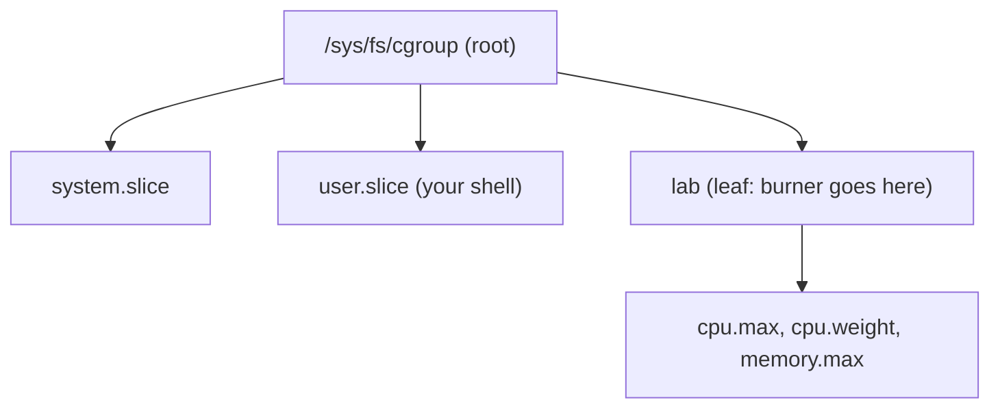

# Lab: Throttle a Process with cgroup v2

> **Goal:** stop reading about CPU quotas and memory ceilings and *feel* them.
> By the end you will have created a cgroup by hand, pinned a runaway process
> into it, watched its CPU% collapse in real time, made two groups share a core
> by weight, capped a program's memory and watched reclaim fight back — then
> mapped every knob back to the `docker run` and Kubernetes flags you already
> use.

This is the hands-on companion to [Control Groups (cgroup v2)](#/cgroups). That
chapter explains the machinery; here you drive it. Everything runs from a root
shell on any modern Linux (kernel 6.x, unified cgroup v2). No containers, no
Docker — just `mkdir`, `echo`, and a text editor for `/sys/fs/cgroup`.

You need **root** (or delegated write access to a sub-tree). Commands that write
to `/sys/fs/cgroup` are shown with `#`; run them as root or under `sudo`. This
is safe on a spare VM or laptop — you are only touching cgroup files you create,
and cleanup is a single `rmdir`. Don't run it on a busy production box: the CPU
burner will peg a core until you kill it.

---

## Stage 0 — confirm you are on cgroup v2

Every distro since ~2021 boots the **unified hierarchy** (Fedora 31+, Ubuntu
21.10+, Debian 11+, RHEL 9+). Confirm before you start — the v1 layout has a
completely different, per-controller directory structure and none of the files
below will exist.

```bash
# Filesystem type of /sys/fs/cgroup — must be "cgroup2fs"
stat -fc %T /sys/fs/cgroup
```

Expected output:

```text
cgroup2fs
```

If you see `tmpfs` or `cgroup` instead, you are on a legacy/hybrid layout. Boot
with `systemd.unified_cgroup_hierarchy=1` on the kernel command line (it is the
default now, so you rarely need to). The other tell is the root controller
list:

```bash
cat /sys/fs/cgroup/cgroup.controllers
```

```text
cpuset cpu io memory hugetlb pids rdma misc
```

That file is the menu of controllers the kernel compiled in and mounted. If
`cpu` and `memory` are both listed, this whole lab will work.

---

## Stage 1 — create a group by hand

A cgroup *is* a directory. Creating one is `mkdir`; the kernel materialises all
the interface files for you.

```bash
# mkdir under the cgroup2 mount = a new (empty) cgroup
sudo mkdir /sys/fs/cgroup/lab
ls /sys/fs/cgroup/lab
```

```text
cgroup.controllers      cgroup.threads          cpu.stat.local
cgroup.events           cgroup.type             io.pressure
cgroup.freeze           cpu.pressure            memory.pressure
cgroup.kill             cpu.stat                ...
```

You didn't create those files; the kernel did, the instant the directory
appeared. Notice what's *missing*: there is no `cpu.max`, no `memory.max` yet.
Those knobs only appear once the relevant controller is **enabled** for this
group by its parent. That's the next stage.

---

## Stage 2 — enable controllers, and meet the "no internal processes" rule

Controllers are switched on from the **parent**, by writing to
`cgroup.subtree_control`. This is the rule that trips up everyone the first
time: a cgroup does not enable its *own* controllers — its parent enables them
for all of its children.

```bash
# Enable cpu + memory for every child of the root
sudo sh -c 'echo "+cpu +memory" > /sys/fs/cgroup/cgroup.subtree_control'
cat /sys/fs/cgroup/lab/cgroup.controllers
```

```text
cpu memory
```

Now the control files exist:

```bash
ls /sys/fs/cgroup/lab | grep -E 'cpu.max|memory.max'
```

```text
cpu.max
memory.max
```

**Why the parent, not the child?** Because a controller divides a parent's
resources among that parent's children. Enabling `+cpu` on the root means "the
root's CPU time is now split among the root's child cgroups by the cpu
controller." The `lab` group is one of those children, so it gets `cpu.max` and
friends.

This is also where the **no-internal-process rule** bites. In cgroup v2, a
cgroup that has controllers enabled on its children may **not** hold processes
directly *and* have controller-enabled children at the same time — processes
must live in the leaves. The reason is fairness: a controller distributes
resources among children, so a process sitting in an inner node would compete
against whole subtrees with no defined weight. The kernel forbids the ambiguity.

In practice on a systemd box the root is already carved into `init.scope`,
`system.slice`, `user.slice`, etc., and your login shell lives in one of those
leaves — so enabling `+cpu` at the root usually just works. If you ever get
`echo: write error: Device or resource busy` when enabling a controller, it
means a process is sitting directly in that cgroup; move it to a child first.



---

## Stage 3 — throttle a CPU burner and watch it happen

Now the payoff. Start a process that will happily eat a whole core:

```bash
# yes writes "y" forever; redirect to /dev/null so only CPU is consumed
yes > /dev/null &
echo "burner PID = $!"
```

In another terminal, run `top` (press `1` to see per-CPU, or just watch the
`%CPU` column). The `yes` process sits at **~100%** of one core. It is unlimited
— it lives in your shell's cgroup, which has no `cpu.max`.

Move it into `lab`. You migrate a process by writing its PID into the target's
`cgroup.procs`:

```bash
# Replace 12345 with the PID printed above
sudo sh -c 'echo 12345 > /sys/fs/cgroup/lab/cgroup.procs'
cat /sys/fs/cgroup/lab/cgroup.procs
```

```text
12345
```

Writing one PID moves the whole thread group. `top` still shows ~100% — moving a
process doesn't limit it, it only *joins* the group. Now set the cap.

`cpu.max` takes two numbers: **`$MAX $PERIOD`**, both in microseconds. It means
"this group may run for `$MAX` µs of CPU time out of every `$PERIOD` µs of
wall-clock." The default is `max 100000` (unlimited over a 100 ms period). Give
it half a core:

```bash
# 50,000 µs of runtime per 100,000 µs period = 50% of ONE CPU
sudo sh -c 'echo "50000 100000" > /sys/fs/cgroup/lab/cpu.max'
```

Watch `top`. Within a second the `yes` process drops to **~50%**. You capped it
in userspace, live, with an `echo`. Try `echo "25000 100000"` and it falls to
~25%; `echo "200000 100000"` lets it use two cores' worth (if it were
multithreaded).

Now look at *why* it dropped — the throttling counters:

```bash
cat /sys/fs/cgroup/lab/cpu.stat
```

```text
usage_usec 8421334
user_usec 8390112
system_usec 31222
nr_periods 512
nr_throttled 511
throttled_usec 25109882
```

The two lines that matter:

- **`nr_throttled`** — how many of the accounting periods ended with the group
  hitting its quota and getting parked. Here it's 511 out of 512: almost every
  100 ms window, `yes` burned its 50 ms allowance and was stopped for the rest.
- **`throttled_usec`** — total microseconds the group spent *frozen*, waiting
  for the next period to refill its quota.

Watch those numbers climb live:

```bash
watch -n1 'cat /sys/fs/cgroup/lab/cpu.stat'
```

`nr_throttled` ticks up once per period. This is the hard-cap mechanism made
visible: the scheduler hands the group a budget of runtime each period, and when
the budget is gone the tasks are dequeued until the timer refills it.

---

## Stage 4 — proportional sharing with `cpu.weight`

A hard cap wastes idle CPU: cap a group at 50% and it stays at 50% even when the
machine is otherwise empty. **`cpu.weight`** is the *work-conserving*
alternative — it splits *contended* CPU in proportion to weight, but lets any
group use a fully idle CPU. This is the same distinction as `io.max` vs
`io.weight` in the [cgroups](#/cgroups) chapter, and it comes straight from the
[CFS/EEVDF](#/scheduling) fair scheduler.

First remove the hard cap so weight is the only thing in play, and pin
everything to **one** CPU so the two groups genuinely compete:

```bash
sudo sh -c 'echo "max 100000" > /sys/fs/cgroup/lab/cpu.max'   # uncap

# Make a second group
sudo mkdir /sys/fs/cgroup/lab2

# Pin both groups to CPU 0 so they must share one core.
# (cpuset must be enabled in subtree_control; add it if needed)
sudo sh -c 'echo "+cpuset" > /sys/fs/cgroup/cgroup.subtree_control'
sudo sh -c 'echo 0 > /sys/fs/cgroup/lab/cpuset.cpus'
sudo sh -c 'echo 0 > /sys/fs/cgroup/lab2/cpuset.cpus'
```

Default weight is **100**. Give `lab` three times the share of `lab2`:

```bash
sudo sh -c 'echo 300 > /sys/fs/cgroup/lab/cpu.weight'    # 300 : 100  →  75% : 25%
sudo sh -c 'echo 100 > /sys/fs/cgroup/lab2/cpu.weight'
```

Now put one burner in each group:

```bash
yes > /dev/null &   echo "lab  PID=$!"
sudo sh -c "echo $! > /sys/fs/cgroup/lab/cgroup.procs"

yes > /dev/null &   echo "lab2 PID=$!"
sudo sh -c "echo $! > /sys/fs/cgroup/lab2/cgroup.procs"
```

In `top`, the two `yes` processes settle near **75%** and **25%** of CPU 0 —
the 3:1 weight ratio. Neither is *capped*: kill the `lab2` burner and the `lab`
one immediately jumps to ~100%, because weight only divides CPU that's actually
contended. That's the whole difference from Stage 3, where the capped process
sat idle even with a free core next to it.

`cpu.weight` accepts 1–10000 (default 100). There is also `cpu.weight.nice`,
which takes a nice value (−20..19) and maps it onto the same scale, so an old
`nice`-based policy translates directly.

---

## Stage 5 — cap memory and watch reclaim fight back

Memory is more interesting than CPU because the kernel doesn't just say "no" —
it *reclaims*. When a group nears `memory.max`, the kernel tries to shrink it
(drop clean page cache, swap out anonymous pages) *before* it resorts to the
[OOM killer](#/lab-oom-killer). You can watch that pressure in the counters.

Set a small ceiling on `lab` and read the live usage:

```bash
sudo sh -c 'echo 50M > /sys/fs/cgroup/lab/memory.max'
cat /sys/fs/cgroup/lab/memory.current
```

```text
0
```

Now run a program *inside* the group that tries to allocate and **touch** far
more than 50 MiB (touching matters — untouched pages are never backed by
physical frames; see [Virtual Memory](#/memory)). A three-line Python hog does
the job:

```bash
# Launch a shell already inside lab, then allocate 200 MiB inside it
sudo sh -c 'echo $$ > /sys/fs/cgroup/lab/cgroup.procs; exec \
  python3 -c "b=bytearray(200*1024*1024); import time; time.sleep(30)"' &
```

While it runs, watch the counters:

```bash
watch -n1 'cat /sys/fs/cgroup/lab/memory.current; echo ---; \
           cat /sys/fs/cgroup/lab/memory.events'
```

`memory.current` climbs toward the 50 MiB ceiling and then **stalls just under
it** — it cannot cross `memory.max`. Meanwhile `memory.events` tells the story:

```text
low 0
high 0
max 5834
oom 0
oom_kill 0
```

The **`max`** counter is the one to watch. Each time an allocation would have
pushed the group over `memory.max`, the kernel forces synchronous reclaim to
make room; every one of those events increments `max`. A big, fast-growing `max`
means the group is living right at its ceiling, paying a reclaim tax on almost
every allocation — the memory equivalent of Stage 3's throttling.

What happens next depends on swap:

- **With swap available**, anonymous pages get pushed to swap, `memory.current`
  hovers at the cap, and the process keeps running (slowly). Check
  `memory.swap.current` to see it.
- **Without swap** (or with `memory.swap.max 0`), there's nothing to reclaim
  from a pure-anonymous hog. The kernel gives up and invokes the **cgroup OOM
  killer** — scoped to this group, not the whole machine. Then `oom` and
  `oom_kill` in `memory.events` tick up, and `dmesg` shows a
  `Memory cgroup out of memory` kill. That containment is exactly why you set
  per-container memory limits.

There's a softer knob too: **`memory.high`**. Unlike `memory.max` (a hard wall
that triggers OOM), `memory.high` is a *throttle* — cross it and the kernel
aggressively reclaims and slows the group down with allocation stalls, but never
kills. It's the graceful-degradation setting; `memory.max` is the backstop.

```bash
# Softer: throttle at 40M, hard wall at 50M
sudo sh -c 'echo 40M > /sys/fs/cgroup/lab/memory.high'
```

The best single view of how much a group is *suffering* for memory is
[PSI](#/cgroups) — `cat /sys/fs/cgroup/lab/memory.pressure` shows the
percentage of wall-clock time tasks stalled waiting on memory.

---

## Stage 6 — map it back to Docker and Kubernetes

You just set by hand every knob your container stack sets for you. The runtime
([runc](#/container-runtimes)) does the identical `mkdir` + `echo` dance into a
cgroup it creates per container.

| You ran… | Docker / Kubernetes | cgroup v2 file it writes |
|---|---|---|
| `echo "50000 100000" > cpu.max` | `docker run --cpus 0.5` | `cpu.max` = `50000 100000` |
| `echo "200000 100000" > cpu.max` | `docker run --cpus 2` | `cpu.max` = `200000 100000` |
| `echo 300 > cpu.weight` | `docker run --cpu-shares 3072` | `cpu.weight` (shares rescaled) |
| K8s `resources.requests.cpu: 500m` | — | `cpu.weight` (request → weight) |
| K8s `resources.limits.cpu: "1"` | — | `cpu.max` = `100000 100000` |
| `echo 512M > memory.max` | `docker run -m 512m` | `memory.max` = `536870912` |
| K8s `resources.limits.memory: 512Mi` | — | `memory.max` |
| K8s `resources.requests.memory` | — | `memory.low` (reclaim protection) |

The mapping worth burning in:

- **CPU *requests* become `cpu.weight`** (proportional share — what you get when
  the node is busy). **CPU *limits* become `cpu.max`** (hard cap — what you can
  never exceed, even on an idle node).
- **Memory *limits* become `memory.max`** (hard wall → cgroup OOM). Memory
  *requests* become `memory.low` (reclaim protection, not a guarantee of
  allocation).

**Container link:** when a Kubernetes pod shows `OOMKilled` in
`kubectl describe`, that is the `oom_kill` counter in *its* `memory.events`
firing — the exact file you watched in Stage 5.

### The pitfall everyone hits: CPU throttling and tail latency

`cpu.max` is enforced per **100 ms period** by default. For a single-threaded
batch job, being parked for the back half of each period is fine. For a
**latency-sensitive, multithreaded** service it is a trap.

Say a request needs work from 8 threads for 10 ms each — 80 ms of CPU. With a
limit of `100000 100000` (one core-equivalent), the group burns its 100 ms
quota in the first ~12.5 ms of the period across those 8 threads, then **all of
them are frozen** until the period rolls over.

A request that should take 12 ms now waits up to ~90 ms for the refill. The p50
looks fine; the p99 is a cliff.

Symptoms: high `nr_throttled` / `throttled_usec` (Stage 3) on a service that
looks like it's under its average CPU limit. Fixes:

- Raise the limit, or drop it entirely and rely on `cpu.weight` (requests) for
  fairness. This is why many teams set K8s CPU *requests* but no CPU *limits*.
- The `CONFIG_CFS_BANDWIDTH` machinery is what enforces the period; a shorter
  period (not settable per-cgroup in v2) would tighten the sawtooth but raise
  overhead. In practice you widen the quota, not the period.

See [CPU Scheduling](#/scheduling) for how the fair scheduler dequeues a
throttled group, and [CPU Isolation](#/cpu-isolation) for the other side of the
coin — keeping cores *away* from cgroups entirely.

---

## Cleanup

A cgroup directory can only be removed when it holds no processes. Kill the
burners, then `rmdir` (not `rm -r` — the kernel owns those files):

```bash
kill %1 %2 2>/dev/null            # or: pkill yes
sudo sh -c 'echo 1 > /sys/fs/cgroup/lab/cgroup.kill'   # kill any stragglers in the group
sudo rmdir /sys/fs/cgroup/lab /sys/fs/cgroup/lab2
```

`cgroup.kill` (since 5.14) is the clean way to terminate *everything* in a
group: write `1` and the kernel SIGKILLs every member atomically. After that the
directory is empty and `rmdir` succeeds. If `rmdir` returns `Device or resource
busy`, a process is still inside — check `cat cgroup.procs`.

---

## Follow the code (kernel v6.12)

**Path 1 — how `cpu.max` throttles.** The cpu controller's bandwidth logic
lives in the CFS/EEVDF scheduler. Each cgroup's cpu settings hang off a
[`struct task_group`](https://elixir.bootlin.com/linux/v6.12/C/ident/task_group),
which owns a per-CPU [`struct cfs_rq`](https://elixir.bootlin.com/linux/v6.12/C/ident/cfs_rq)
(the run-queue) and a [`struct cfs_bandwidth`](https://elixir.bootlin.com/linux/v6.12/C/ident/cfs_bandwidth)
holding the `quota` and `period` you set via `cpu.max`. As a group runs,
[update_curr()](https://elixir.bootlin.com/linux/v6.12/C/ident/update_curr)
charges elapsed runtime against the group's remaining runtime. When a run-queue
exhausts its slice, [throttle_cfs_rq()](https://elixir.bootlin.com/linux/v6.12/C/ident/throttle_cfs_rq)
dequeues it — this is the moment your `yes` process stops running and
`nr_throttled` increments. An hrtimer fires each period and
[unthrottle_cfs_rq()](https://elixir.bootlin.com/linux/v6.12/C/ident/unthrottle_cfs_rq)
refills the quota and re-enqueues the tasks. The `throttled_usec` you read is
accumulated across these park/refill cycles. (This whole subsystem is compiled
in under `CONFIG_CFS_BANDWIDTH`.)

**Path 2 — how `memory.max` forces reclaim.** A charge to a memory cgroup goes
through [try_charge()](https://elixir.bootlin.com/linux/v6.12/C/ident/try_charge)
(often via `charge_memcg()`), operating on the group's
[`struct mem_cgroup`](https://elixir.bootlin.com/linux/v6.12/C/ident/mem_cgroup)
and its `page_counter` for the `max` limit. When a charge would cross
`memory.max`, `try_charge()` doesn't fail immediately — it calls
[try_to_free_mem_cgroup_pages()](https://elixir.bootlin.com/linux/v6.12/C/ident/try_to_free_mem_cgroup_pages),
the memcg-scoped entry into the reclaim path
([shrink_node()](https://elixir.bootlin.com/linux/v6.12/C/ident/shrink_node) and
friends), to evict clean cache and swap out anonymous pages within *this group
only*. Each such forced-reclaim event bumps the `max` counter you watched in
`memory.events`. Only if reclaim can't recover enough does `try_charge()` invoke
[mem_cgroup_out_of_memory()](https://elixir.bootlin.com/linux/v6.12/C/ident/mem_cgroup_out_of_memory),
the cgroup-scoped OOM killer that increments `oom_kill`. The counters are not
cosmetic — they are literally incremented at these call sites.

---

## Check your understanding

1. You `mkdir /sys/fs/cgroup/lab` but `cpu.max` doesn't exist in it. Why, and
   how do you make it appear?

<details><summary>Show answer</summary>

The `cpu` controller isn't enabled for `lab` yet. Controllers are switched on
by the **parent** via `cgroup.subtree_control`:
`echo "+cpu" > /sys/fs/cgroup/cgroup.subtree_control`. Once the parent enables
`+cpu`, every child (including `lab`) gets `cpu.max`, `cpu.weight`, and
`cpu.stat`.

</details>

2. `cpu.max` reads `50000 100000`. In plain terms, how much CPU can this group
   use, and over what window?

<details><summary>Show answer</summary>

50,000 µs of CPU runtime per 100,000 µs (100 ms) period — i.e. **50% of one
CPU**. If the group had multiple busy threads they'd collectively share that
50 ms budget each period, then all be throttled until the next period refills
it.

</details>

3. During Stage 4 you kill one of the two weighted burners and the survivor
   jumps from 75% to ~100%. Why doesn't that happen with a `cpu.max` hard cap?

<details><summary>Show answer</summary>

`cpu.weight` is **work-conserving**: it only divides CPU that's actually
contended, so a group can use a whole idle core. `cpu.max` is an absolute
ceiling — a group capped at 50% stays at 50% even when every other core is
idle, wasting the spare capacity.

</details>

4. In Stage 5, `memory.current` climbs and then holds just under `memory.max`
   while `memory.events`' `max` counter keeps rising. What is the kernel doing?

<details><summary>Show answer</summary>

Each allocation that would cross `memory.max` triggers **synchronous reclaim**
inside the group (dropping clean page cache, swapping out anonymous pages) to
make room — and each of those forced-reclaim events increments the `max`
counter. The group is pinned at its ceiling, paying a reclaim tax per
allocation. If reclaim can't free enough (e.g. no swap, all-anonymous), the
cgroup OOM killer fires and `oom_kill` ticks up.

</details>

5. A multithreaded web service has a K8s CPU *limit* of `1` and shows p50
   latency of 8 ms but p99 of 90 ms. `cpu.stat` shows `nr_throttled` climbing.
   What's happening and what's the usual fix?

<details><summary>Show answer</summary>

CPU **throttling on the 100 ms period**: the service's threads burn the whole
one-core quota early in each period, then *all* freeze until the period rolls
over — adding up to ~90 ms of stall to unlucky requests. Fix by raising or
removing the CPU limit and relying on `cpu.weight` (the request) for fairness;
many teams set CPU requests but no CPU limits for latency-sensitive services.

</details>

6. Why does enabling a controller happen through the parent's
   `cgroup.subtree_control` rather than the child enabling it on itself, and how
   does this connect to the "no internal processes" rule?

<details><summary>Show answer</summary>

A controller divides a *parent's* resources among that parent's *children*, so
enabling it is inherently a parent's decision about how to split what it has.
The same logic forbids a cgroup from holding processes directly while also
having controller-enabled children: those inner-node processes would compete
against whole subtrees with no defined weight. Processes therefore live in the
leaves.

</details>

7. Which single command cleanly kills every process in `lab` before `rmdir`,
   and why can't you just `rm -r` the directory?

<details><summary>Show answer</summary>

`echo 1 > /sys/fs/cgroup/lab/cgroup.kill` (since 5.14) atomically SIGKILLs
every member of the group. You can't `rm -r` because those are kernel-generated
control files, not real files — you remove the cgroup with `rmdir`, and only
after it's empty of processes (otherwise `rmdir` returns `EBUSY`).

</details>

---

## Sources & further reading

- [Control Group v2 — kernel admin guide](https://docs.kernel.org/admin-guide/cgroup-v2.html) — authoritative reference for `cpu.max`, `cpu.weight`, `memory.max`, `memory.events`, `cgroup.subtree_control`, and the no-internal-process rule.
- [CFS Bandwidth Control](https://docs.kernel.org/scheduler/sched-bwc.html) — exactly how `cpu.max`'s quota/period throttling works, with the multithreaded latency pitfall spelled out.
- [cgroups(7) man page](https://man7.org/linux/man-pages/man7/cgroups.7.html) — the v2 model, delegation, and mount details.
- [PSI — Pressure Stall Information](https://docs.kernel.org/accounting/psi.html) — reading `cpu.pressure` / `memory.pressure` to quantify how much a group is starving.
- [kernel/sched/fair.c in v6.12](https://elixir.bootlin.com/linux/v6.12/source/kernel/sched/fair.c) — the CFS bandwidth machinery: `throttle_cfs_rq()`, `unthrottle_cfs_rq()`, `cfs_bandwidth`.
- [mm/memcontrol.c in v6.12](https://elixir.bootlin.com/linux/v6.12/source/mm/memcontrol.c) — `try_charge()`, memcg reclaim, and the cgroup OOM path behind `memory.max`.
- Chris Down, *"5 Years of Cgroup v2"* (SREcon / FOSDEM) — practitioner's guide to `memory.high` vs `memory.max` and CPU-limit-vs-request strategy at scale.

---

**Next:** put a group under real memory pressure until the kernel gives up —
[Lab: Trigger & Autopsy the OOM Killer](#/lab-oom-killer).
