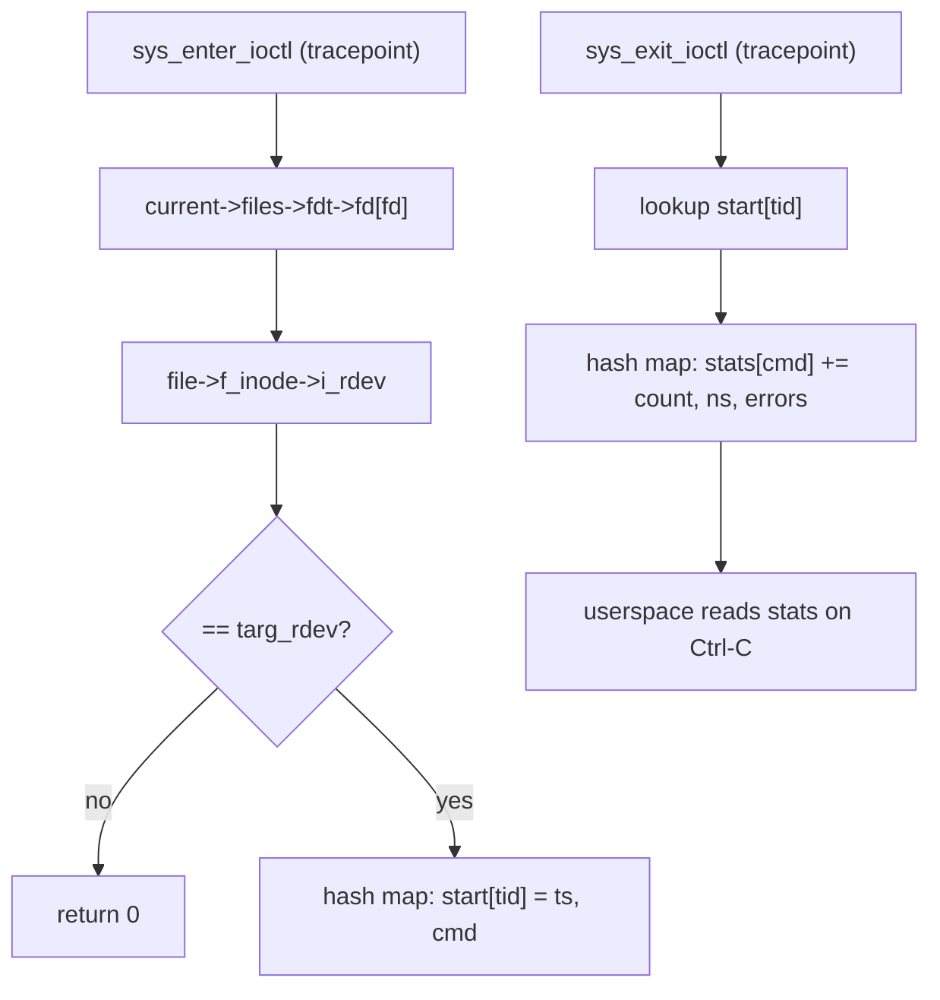

# Lab: Answer a Real Question with eBPF

> **Goal:** go from zero to a tool you will keep. In five minutes you will
> count `ioctl()` calls with a bpftrace one-liner; in twenty you will have a
> bpftrace script that prints a latency histogram on Ctrl-C; by the end you
> will have compiled a real libbpf **CO-RE** binary that watches one device
> node — identified by its major:minor, not by a guessed file descriptor — and
> reports per-request-code call counts, average and worst-case latency, and
> error counts. You will also make the verifier reject a program on purpose and
> read what it says.

[eBPF Internals](#/ebpf-internals) explained the machinery: the `bpf()`
syscall, the verifier, maps, BTF and CO-RE, the ring buffer, the difference
between a tracepoint and a kprobe. This lab does not re-explain any of it. It
makes you *use* it, and every "what just happened" section below points back at
the paragraph in that chapter which predicted what you observed.

The question we are going to answer is a real one, and it is the reason this
lab targets `ioctl()` rather than something easier:

> *A userspace stack is talking to a device driver. Which requests is it
> sending, how many, how long does each one take, and how many fail?*

That question is the entire job when you are debugging a GPU stack, a
virtualisation stack, a media pipeline, or a vendor driver whose source you do
not have. `ioctl()` is where [device drivers](#/devices-modules) put everything
that is not a `read()` or a `write()`, so the answer lives there. The tool you
build in Stage 3 is the instrument
[Instrumenting the GPU](#/gpu-observability) assumes you have — and you can
build it today, on a laptop VM, against a device node you already own.

## Setup and safety

### What the kernel needs

Any stock Fedora, Ubuntu, Debian, Arch or RHEL kernel from the last few years
has all of this. Check anyway:

```bash
grep -E 'CONFIG_(BPF_SYSCALL|BPF_JIT|BPF_EVENTS|FTRACE_SYSCALLS|DEBUG_INFO_BTF)=' \
  /boot/config-$(uname -r) 2>/dev/null || zcat /proc/config.gz | grep -E '...'
```

```text
CONFIG_BPF_SYSCALL=y
CONFIG_BPF_JIT=y
CONFIG_BPF_EVENTS=y
CONFIG_FTRACE_SYSCALLS=y
CONFIG_DEBUG_INFO_BTF=y
```

What each one buys you:

- **`CONFIG_BPF_SYSCALL`** — the `bpf()` syscall exists at all.
- **`CONFIG_BPF_EVENTS`** — BPF programs may attach to tracing hooks.
- **`CONFIG_FTRACE_SYSCALLS`** — the per-syscall tracepoints
  (`syscalls:sys_enter_ioctl` and friends) are generated. Without it Stage 1
  has nothing to attach to.
- **`CONFIG_DEBUG_INFO_BTF`** — the kernel ships its own type information.
  This is what CO-RE relocates against in Stage 3. The practical check is
  simply whether the file exists:

```bash
ls -l /sys/kernel/btf/vmlinux
```

```text
-r--r--r--. 1 root root 5951488 Jul 22 09:14 /sys/kernel/btf/vmlinux
```

That ~6 MB of BTF is the whole reason a program you compile here can run on a
kernel you have never seen. If the file is missing, see Troubleshooting.

### Packages

```bash
# Fedora / RHEL / Rocky
sudo dnf install -y bpftrace bpftool clang llvm libbpf-devel \
                    elfutils-libelf-devel zlib-devel

# Debian / Ubuntu
sudo apt install -y bpftrace clang llvm libbpf-dev libelf-dev zlib1g-dev \
                    linux-tools-common linux-tools-$(uname -r)

# Arch
sudo pacman -S --needed bpf bpftrace clang llvm libbpf libelf
```

On Debian/Ubuntu `bpftool` lives inside `linux-tools-$(uname -r)`; some
releases also ship a standalone `bpftool` package. Confirm both tools:

```bash
bpftrace --version && sudo bpftool version
```

```text
bpftrace v0.26.1
bpftool v7.5.0
using libbpf v1.5
```

Everything in this lab works on **bpftrace 0.22 or newer** — that is the floor
set by the two-argument `delete()` used in Stage 2; the syntax changes that
bite on older releases are called out where they occur. One further constraint
on recent bpftrace: since 0.25, reading tracepoint `args` requires kernel BTF,
so the `/sys/kernel/btf/vmlinux` check below matters for Stage 1 as well as
Stage 3.

### Privilege

Loading a BPF program needs `CAP_BPF` plus `CAP_PERFMON` (attaching to
tracepoints and calling `bpf_probe_read_kernel()` are perfmon operations). In
practice: run the tracing commands under `sudo`. If a load fails with
`Operation not permitted` before the verifier has said anything, check the
policy knob [eBPF Internals](#/ebpf-internals) mentions:

```bash
sysctl kernel.unprivileged_bpf_disabled
```

```text
kernel.unprivileged_bpf_disabled = 2      ← unprivileged BPF off; sudo required
```

### What is safe here, and what is not

**This lab is much safer than the [kernel-module lab](#/lab-kernel-module),
and the reason is structural, not cultural.** A module is native code the
kernel links into itself with no supervision; a null dereference there is a
panic. A BPF program is checked by the verifier *before* it can run: it cannot
loop forever, cannot touch memory outside checked objects, and cannot call
arbitrary kernel functions. A buggy BPF program is rejected at load time or
returns garbage numbers. It does not take the machine down. Everything below
is safe to run on a machine you care about.

That is not a blank cheque. Four things still bite:

1. **Overhead is real.** You are adding work to every `ioctl()` on the box.
   Tens of nanoseconds per event is nothing on a terminal; on a device
   servicing a million requests a second it is not nothing. Measure before you
   leave a tracer running in production, and prefer aggregation in maps to
   per-event output — the "filter early, aggregate in maps, emit summaries"
   discipline from [eBPF Internals](#/ebpf-internals).
2. **Wildcards are a real hazard.** `bpftrace -e 'kprobe:* { ... }'` attaches
   to tens of thousands of functions and can stall a machine hard enough that
   you reach for the reset button. Enumerate with `-l` first; attach
   deliberately.
3. **Tracing reads other people's data.** ioctl arguments, file paths, and
   syscall payloads belong to whoever issued them. On a shared or multi-tenant
   host, treat trace output as sensitive.
4. **Loading BPF is a root-equivalent privilege.** `CAP_BPF` can observe and
   influence nearly the whole machine. That is a security boundary, not a
   convenience setting.

### The workload

Any character or block device works. To keep this reproducible on a bare VM
the walkthrough uses **your own terminal**, which is a character device
(`/dev/pts/N`) present on every machine, and drives it with `TCGETS` — the
ioctl `stty` uses. Substitute `/dev/dri/renderD128`, `/dev/kvm`, `/dev/net/tun`
or a loop device wherever you see `$DEV`; nothing below is terminal-specific.

Open a second shell and start a steady, harmless stream of ioctls:

```bash
DEV=$(tty)                        # e.g. /dev/pts/2
printf 'DEV=%s\n' "$DEV"
python3 -c '
import fcntl, termios, sys, time
f = open(sys.argv[1], "rb")
buf = bytearray(64)
while True:
    fcntl.ioctl(f, termios.TCGETS, buf)
    time.sleep(0.002)
' "$DEV" &
GEN=$!
printf 'GEN=%s\n' "$GEN"
```

```text
DEV=/dev/pts/2
GEN=8123
```

That is roughly 500 ioctls a second on one file descriptor of one device — a
small, honest, obviously-attributable signal.

## Stage 1 — Five minutes, no toolchain

### 1a. Does the hook exist?

Never guess a probe name. Ask:

```bash
sudo bpftrace -l 'tracepoint:syscalls:sys_*_ioctl'
```

```text
tracepoint:syscalls:sys_enter_ioctl
tracepoint:syscalls:sys_exit_ioctl
```

Two probes, one pair: the entry tracepoint fires before the syscall body, the
exit tracepoint after. Every latency tool in existence is built on a pair like
this. Now ask what fields they carry — this is the part people skip and then
guess wrong:

```bash
sudo bpftrace -lv tracepoint:syscalls:sys_enter_ioctl
sudo bpftrace -lv tracepoint:syscalls:sys_exit_ioctl
```

```text
tracepoint:syscalls:sys_enter_ioctl
    int __syscall_nr
    unsigned int fd
    unsigned int cmd
    unsigned long arg

tracepoint:syscalls:sys_exit_ioctl
    int __syscall_nr
    long ret
```

Those names are not bpftrace's invention. They come from the syscall's own
prototype — `SYSCALL_DEFINE3(ioctl, unsigned int, fd, unsigned int, cmd,
unsigned long, arg)` in
[fs/ioctl.c](https://elixir.bootlin.com/linux/v6.12/source/fs/ioctl.c) — and
the kernel publishes them in tracefs, which is where bpftrace read them:

```bash
sudo cat /sys/kernel/tracing/events/syscalls/sys_enter_ioctl/format
```

```text
name: sys_enter_ioctl
ID: 108
format:
	field:unsigned short common_type;	offset:0;	size:2;	signed:0;
	field:unsigned char common_flags;	offset:2;	size:1;	signed:0;
	field:unsigned char common_preempt_count;	offset:3;	size:1;	signed:0;
	field:int common_pid;	offset:4;	size:4;	signed:1;

	field:int __syscall_nr;	offset:8;	size:4;	signed:1;
	field:unsigned int fd;	offset:16;	size:8;	signed:0;   ← size 8, not 4
	field:unsigned int cmd;	offset:24;	size:8;	signed:0;
	field:unsigned long arg;	offset:32;	size:8;	signed:0;
```

Note the `size:8` on a field declared `unsigned int`. Every syscall argument
is stored in the trace record as a full `unsigned long`, eight bytes apart
starting at offset 16 — that layout is fixed by
[syscall_enter_define_fields()](https://elixir.bootlin.com/linux/v6.12/C/ident/syscall_enter_define_fields).
Remember it; Stage 3 depends on it.

### 1b. Who is calling, and how often?

```bash
sudo bpftrace -e 'tracepoint:syscalls:sys_enter_ioctl { @[comm] = count(); }'
```

Let it run ten seconds, then Ctrl-C:

```text
Attaching 1 probe...
^C

@[systemd-journal]: 12
@[Xwayland]: 337
@[gnome-shell]: 1904
@[python3]: 5012
```

`@[comm] = count()` builds a hash map keyed by process name entirely in the
kernel; nothing crosses into userspace until you interrupt it. That is the
"filter early, aggregate in maps, emit summaries" pattern from
[eBPF Internals](#/ebpf-internals), and you just wrote it in eighteen
characters. `python3` is our generator.

### 1c. Which request codes?

Counting per-`comm` is a start; the real question is *which requests*. Grab
the generator's PID and print the raw codes in hex:

```bash
sudo bpftrace -e "tracepoint:syscalls:sys_enter_ioctl /pid == $GEN/ {
    @[args.cmd] = count();
}"
```

```text
^C

@[21505]: 4873
```

One code, 4873 times. `21505` is decimal because bpftrace prints map keys in
decimal; convert it:

```bash
printf '%#x\n' 21505
```

```text
0x5401
```

`0x5401` is `TCGETS`. The high bytes tell you more than the name does — we
unpack them properly in Stage 3.

> **`args.cmd` versus `args->cmd`.** `args` became a struct rather than a
> pointer in bpftrace 0.19, which is when the dot became the natural spelling;
> on anything older you must write `args->cmd`. The arrow was never removed —
> the language reference calls it "purely an alias for the `.` operator" — so
> scripts written either way still run, and you will see both in the wild.

### 1d. Which file descriptor, and what is it?

A PID filter is coarse: a process may hold a dozen devices open. Filter by
descriptor instead:

```bash
sudo bpftrace -e "tracepoint:syscalls:sys_enter_ioctl /pid == $GEN/ {
    @fd[args.fd] = count();
}"
```

```text
^C

@fd[3]: 2431
```

Now resolve fd 3 to a path. The kernel already publishes this mapping —
`/proc/PID/fd/N` is a symlink to the open file:

```bash
readlink "/proc/$GEN/fd/3"
```

```text
/dev/pts/2
```

The inverse question — *who has this device open?* — is a symlink search:

```bash
sudo find /proc/[0-9]*/fd -lname "$DEV" 2>/dev/null
```

```text
/proc/8123/fd/3
/proc/4471/fd/0
/proc/4471/fd/1
/proc/4471/fd/2
```

Hold on to this limitation, because it is the reason Stage 3 exists: a
bpftrace filter can only match the *fd number*, and fd 3 means something
different in every process. Resolving fd → device from userspace is a race —
the process can close and reopen between your `readlink` and the next ioctl.
The fix is to resolve it **in the kernel, at event time**, and that needs
CO-RE.

### 1e. The first latency answer

```bash
sudo bpftrace -e '
tracepoint:syscalls:sys_enter_ioctl { @start[tid] = nsecs; }
tracepoint:syscalls:sys_exit_ioctl /@start[tid]/ {
    @ns = hist(nsecs - @start[tid]);
    delete(@start, tid);
}'
```

```text
Attaching 2 probes...
^C

@ns:
[512, 1K)           1247 |@@@@@@@@@@@@@@@@@@@@@@@@@@@@@@@@@@@@@@@@@@@@@@@@@@|
[1K, 2K)             893 |@@@@@@@@@@@@@@@@@@@@@@@@@@@@@@@@@@@             |
[2K, 4K)             211 |@@@@@@@@                                        |
[4K, 8K)              34 |@                                               |
[8K, 16K)              6 |                                                |
[16K, 32K)             1 |                                                |

@start[4471]: 15904483277201                                ← in-flight leftover
```

There it is: a log2 histogram of ioctl service time in nanoseconds, built in
the kernel, with the tail visible. Most calls finish in under a microsecond;
one took 16–32 µs. On a real device that tail is the story.

> **bpftrace 0.21 and older** want `delete(@start[tid])` — the key inside the
> brackets. The two-argument `delete(@start, tid)` arrived in 0.22. Both forms
> work on current releases; the one-argument form is deprecated.

### What just happened

Four mechanisms from [eBPF Internals](#/ebpf-internals), all visible at once:

- **Tracepoints are the stable hook.** You attached to
  `syscalls:sys_enter_ioctl`, whose field names and offsets are generated from
  the syscall prototype and published in tracefs. Nothing here depends on an
  internal function name that could be renamed or inlined next release.
- **The map is the state.** `@start[tid]` is a `BPF_MAP_TYPE_HASH` keyed by
  thread ID. Keying on `tid` rather than `pid` is not a detail: two threads of
  the same process can be inside `ioctl()` simultaneously, and a `pid` key
  would let one thread's exit consume the other's start timestamp.
- **The pairing idiom is universal.** Store a timestamp on entry, subtract on
  exit, delete the key. `biolatency`, `funclatency`, `runqlat`, every latency
  tool in bcc and bpftrace is this shape. You now know it.
- **Aggregation stayed in the kernel.** `hist()` bucketed 2,392 samples into a
  map; userspace woke up once, at Ctrl-C. Printing one line per event instead
  would have cost more than the syscalls you were measuring.

That stray `@start[4471]` in the output is a thread that was inside `ioctl()`
when you hit Ctrl-C — an entry with no matching exit. Stage 2 cleans it up.

## Stage 2 — A script you can keep

One-liners are for questions you ask once. Save this as `ioctlsnoop.bt`:

```awk
#!/usr/bin/env bpftrace
/*
 * ioctlsnoop.bt   Latency and request-code profile for one process's fd.
 * usage: sudo ./ioctlsnoop.bt <pid> <fd>
 */

BEGIN
{
    printf("Tracing ioctl() on PID %d fd %d... Ctrl-C to report.\n", $1, $2);
}

tracepoint:syscalls:sys_enter_ioctl
/pid == $1 && args.fd == $2/
{
    @start[tid] = nsecs;
    @inflight[tid] = args.cmd;      /* remember which code, for the exit probe */
}

tracepoint:syscalls:sys_exit_ioctl
/@start[tid]/
{
    $dur = nsecs - @start[tid];
    $cmd = @inflight[tid];

    @ns = hist($dur);               /* the distribution */
    @calls[$cmd] = count();         /* how many of each request code */
    @total_ns[$cmd] = sum($dur);    /* where the time actually went */

    if (args.ret < 0) {
        @errors[$cmd, args.ret] = count();
    }

    delete(@start, tid);
    delete(@inflight, tid);
}

END
{
    clear(@start);                  /* scratch maps: do not print them */
    clear(@inflight);

    printf("\nioctl service time (ns):");
    print(@ns);
    printf("\ncalls per request code (decimal; printf '%%#x' to convert):");
    print(@calls);
    printf("\ntotal ns per request code:");
    print(@total_ns);
    printf("\nfailures by [code, errno]:");
    print(@errors);

    clear(@ns);
    clear(@calls);
    clear(@total_ns);
    clear(@errors);
}
```

Make it executable and point it at the generator:

```bash
chmod +x ioctlsnoop.bt
sudo ./ioctlsnoop.bt "$GEN" 3
```

```text
Tracing ioctl() on PID 8123 fd 3... Ctrl-C to report.
^C
ioctl service time (ns):
@ns:
[512, 1K)           2104 |@@@@@@@@@@@@@@@@@@@@@@@@@@@@@@@@@@@@@@@@@@@@@@@@@@|
[1K, 2K)             688 |@@@@@@@@@@@@@@@@                                  |
[2K, 4K)              97 |@@                                                |
[4K, 8K)               9 |                                                  |

calls per request code (decimal; printf '%#x' to convert):
@calls[21505]: 2898

total ns per request code:
@total_ns[21505]: 2735441

failures by [code, errno]:
```

`2735441 / 2898` ≈ 944 ns average — consistent with the histogram's mode, and
the empty failures map says every call succeeded.

### What just happened

Three things changed from Stage 1, and each is a habit worth keeping.

**`BEGIN` and `END` bracket the run.** `BEGIN` fires before any probe is
attached, `END` after they are all detached. Everything you want printed goes
in `END`, and the `clear()` calls there are load-bearing: bpftrace
automatically dumps every map that still has contents when it exits, so
without `clear(@start)` you would see that in-flight leftover again. Clearing
a map *after* printing it suppresses the duplicate automatic dump.

**Scratch variables versus maps.** `$dur` and `$cmd` are per-invocation scratch
values on the BPF stack — that 512-byte frame `MAX_BPF_STACK` limits. `@ns`,
`@calls`, `@total_ns` are maps: kernel-resident, surviving between
invocations, shared with userspace. The `$`/`@` distinction is exactly the
program/map distinction from [eBPF Internals](#/ebpf-internals), spelled with
punctuation.

**Two maps for one event pair.** `@start[tid]` carries the timestamp forward
and `@inflight[tid]` carries the request code, because the exit tracepoint
carries only `ret` — the code is gone by then. This is the general shape of
enter/exit instrumentation: the exit hook knows the outcome, the entry hook
knows the request, and a per-thread map is the only thing joining them.

And here is what Stage 2 still cannot do. It filters on `args.fd == 3`. That
is a number whose meaning is private to PID 8123. It cannot follow the device
across processes, it cannot survive the process closing and reopening the
descriptor, and it cannot tell you that fd 3 in one process and fd 7 in
another are the same GPU. To key on the *device* you have to walk from the fd
to the file to the inode inside the kernel — and the offsets of those fields
differ between kernel builds. That is precisely the problem CO-RE was invented
for.

## Stage 3 — A real CO-RE tool

The target: `ioctlhist <device-node>`. It resolves each `ioctl()`'s file
descriptor to a device number *at event time, in the kernel*, ignores every
call that is not on your device no matter which process made it, and prints a
decoded per-request-code report.



Every field access in the `B` and `C` boxes is a CO-RE relocation: clang emits
"the offset of `fdt` within `struct files_struct`" rather than a number, and
libbpf patches in the real offset from `/sys/kernel/btf/vmlinux` when you load.

### The shared header

`ioctlhist.h` — one struct, seen by both sides:

```c
#ifndef __IOCTLHIST_H
#define __IOCTLHIST_H

struct cmd_stat {
	unsigned long long count;
	unsigned long long total_ns;
	unsigned long long max_ns;
	unsigned long long errors;
};

#endif /* __IOCTLHIST_H */
```

### The kernel side

`ioctlhist.bpf.c`:

```c
#include "vmlinux.h"
#include <bpf/bpf_helpers.h>
#include <bpf/bpf_core_read.h>
#include "ioctlhist.h"

char LICENSE[] SEC("license") = "GPL";

/* Written by the loader before load(). Because it is const, the verifier
   treats it as a literal and dead-code-eliminates the branches around it. */
const volatile __u32 targ_rdev = 0;

struct inflight {
	__u64 ts;
	__u32 cmd;
};

struct {
	__uint(type, BPF_MAP_TYPE_HASH);
	__uint(max_entries, 10240);
	__type(key, __u32);                  /* tid */
	__type(value, struct inflight);
} start SEC(".maps");

struct {
	__uint(type, BPF_MAP_TYPE_HASH);
	__uint(max_entries, 1024);
	__type(key, __u32);                  /* ioctl request code */
	__type(value, struct cmd_stat);
} stats SEC(".maps");

/* The CO-RE part. Not one of these offsets is compiled in: BPF_CORE_READ()
   emits a relocation record per field, resolved at load time against the
   running kernel's BTF. */
static __always_inline __u32 fd_to_rdev(__u32 fd)
{
	struct task_struct *task = (struct task_struct *)bpf_get_current_task();
	struct fdtable *fdt = BPF_CORE_READ(task, files, fdt);
	struct file **fdarray;
	struct file *file = NULL;

	if (!fdt)
		return 0;
	/* Our own sanity check, not the verifier's: an out-of-range index would
	   read a wild kernel address, and bpf_probe_read_kernel would simply
	   return -EFAULT with garbage left behind. */
	if (fd >= BPF_CORE_READ(fdt, max_fds))
		return 0;

	fdarray = BPF_CORE_READ(fdt, fd);
	if (!fdarray)
		return 0;
	if (bpf_probe_read_kernel(&file, sizeof(file), &fdarray[fd]) || !file)
		return 0;

	return BPF_CORE_READ(file, f_inode, i_rdev);
}

SEC("tracepoint/syscalls/sys_enter_ioctl")
int ioctl_enter(struct trace_event_raw_sys_enter *ctx)
{
	__u32 fd  = (__u32)ctx->args[0];     /* offsets 16, 24, 32 — Stage 1a */
	__u32 tid = (__u32)bpf_get_current_pid_tgid();
	struct inflight fl = {};             /* zero the padding: the verifier
	                                        rejects indirect reads of
	                                        uninitialised stack */

	if (fd_to_rdev(fd) != targ_rdev)
		return 0;

	fl.ts  = bpf_ktime_get_ns();
	fl.cmd = (__u32)ctx->args[1];
	bpf_map_update_elem(&start, &tid, &fl, BPF_ANY);
	return 0;
}

SEC("tracepoint/syscalls/sys_exit_ioctl")
int ioctl_exit(struct trace_event_raw_sys_exit *ctx)
{
	__u32 tid = (__u32)bpf_get_current_pid_tgid();
	struct cmd_stat *st, zero = {};
	struct inflight *fl;
	__u64 delta;
	__u32 cmd;

	fl = bpf_map_lookup_elem(&start, &tid);
	if (!fl)                             /* not one of ours */
		return 0;

	delta = bpf_ktime_get_ns() - fl->ts;
	cmd   = fl->cmd;

	st = bpf_map_lookup_elem(&stats, &cmd);
	if (!st) {
		bpf_map_update_elem(&stats, &cmd, &zero, BPF_NOEXIST);
		st = bpf_map_lookup_elem(&stats, &cmd);
		if (!st)                     /* the check the verifier demands */
			goto out;
	}

	__sync_fetch_and_add(&st->count, 1);
	__sync_fetch_and_add(&st->total_ns, delta);
	if (delta > st->max_ns)
		st->max_ns = delta;
	if (ctx->ret < 0)
		__sync_fetch_and_add(&st->errors, 1);
out:
	bpf_map_delete_elem(&start, &tid);
	return 0;
}
```

Two notes before you build it.

`struct trace_event_raw_sys_enter` comes from `vmlinux.h`; it is the type the
kernel generates for the syscall tracepoints, with `args[6]` starting exactly
at the offset the `format` file reported in Stage 1a. You are not guessing a
layout — you are using the kernel's own declaration of it.

The walk `task → files → fdt → fd[]` uses **internal** structures. CO-RE
relocates *offsets*, so this binary survives a kernel rebuild with different
config options. It does not survive a *rename* or a restructuring, and
`struct files_struct` is not stable ABI — it has been reworked before and will
be again. That is the honest trade: the syscall tracepoint in Stage 1 is a
promise, this walk is a well-informed bet. `libbpf` will tell you loudly if the
bet stops paying (see Troubleshooting).

### The userspace side

`ioctlhist.c`:

```c
#include <errno.h>
#include <signal.h>
#include <stdarg.h>
#include <stdio.h>
#include <stdlib.h>
#include <string.h>
#include <unistd.h>
#include <sys/stat.h>
#include <sys/sysmacros.h>

#include <bpf/bpf.h>
#include <bpf/libbpf.h>

#include "ioctlhist.h"
#include "ioctlhist.skel.h"

static volatile sig_atomic_t exiting;

static void on_sigint(int sig) { (void)sig; exiting = 1; }

static int libbpf_print_fn(enum libbpf_print_level level,
                           const char *format, va_list args)
{
	(void)level;                         /* print everything, verifier log included */
	return vfprintf(stderr, format, args);
}

/* asm-generic/ioctl.h packs a request code as: dir:2 size:14 type:8 nr:8 */
static void print_cmd(unsigned int cmd)
{
	static const char *dirs[] = { "none", "w", "r", "rw" };
	unsigned int nr   = cmd & 0xff;
	unsigned int type = (cmd >> 8) & 0xff;
	unsigned int size = (cmd >> 16) & 0x3fff;
	unsigned int dir  = (cmd >> 30) & 0x3;
	char t = (type >= 0x20 && type < 0x7f) ? (char)type : '?';

	printf("0x%08x  '%c'/%-3u  size=%-5u dir=%-4s", cmd, t, nr, size, dirs[dir]);
}

int main(int argc, char **argv)
{
	struct ioctlhist_bpf *skel = NULL;
	struct cmd_stat val;
	unsigned int prev = 0, key;
	struct stat sb;
	int err = 1, map_fd, first = 1;

	if (argc != 2) {
		fprintf(stderr, "usage: %s <device-node>\n", argv[0]);
		return 1;
	}
	if (stat(argv[1], &sb) != 0) {
		perror("stat");
		return 1;
	}
	if (!S_ISCHR(sb.st_mode) && !S_ISBLK(sb.st_mode)) {
		fprintf(stderr, "%s is not a device node\n", argv[1]);
		return 1;
	}

	libbpf_set_print(libbpf_print_fn);

	skel = ioctlhist_bpf__open();
	if (!skel) {
		fprintf(stderr, "open failed\n");
		return 1;
	}

	/* glibc's dev_t encoding is NOT the kernel's. Decompose with the glibc
	   macros, then re-encode the way MKDEV() does: (major << 20) | minor. */
	skel->rodata->targ_rdev =
		(major(sb.st_rdev) << 20) | (minor(sb.st_rdev) & 0xfffff);

	err = ioctlhist_bpf__load(skel);      /* verifier runs here */
	if (err) {
		fprintf(stderr, "load failed: %d\n", err);
		goto cleanup;
	}
	err = ioctlhist_bpf__attach(skel);
	if (err) {
		fprintf(stderr, "attach failed: %d\n", err);
		goto cleanup;
	}

	signal(SIGINT, on_sigint);
	printf("Tracing ioctl() on %s (%u:%u)... Ctrl-C to report.\n",
	       argv[1], major(sb.st_rdev), minor(sb.st_rdev));

	while (!exiting)
		sleep(1);

	map_fd = bpf_map__fd(skel->maps.stats);
	printf("\n%-12s %-11s %-11s %-9s %10s %10s %10s %8s\n",
	       "REQUEST", "", "", "", "CALLS", "AVG(ns)", "MAX(ns)", "ERRORS");

	while (bpf_map_get_next_key(map_fd, first ? NULL : &prev, &key) == 0) {
		first = 0;
		if (bpf_map_lookup_elem(map_fd, &key, &val) == 0) {
			print_cmd(key);
			printf(" %10llu %10llu %10llu %8llu\n",
			       val.count,
			       val.count ? val.total_ns / val.count : 0,
			       val.max_ns, val.errors);
		}
		prev = key;
	}
	err = 0;

cleanup:
	ioctlhist_bpf__destroy(skel);
	return err != 0;
}
```

### Build it

Four commands, and each one is a stage of the pipeline
[eBPF Internals](#/ebpf-internals) drew:

```bash
# 1. Dump the running kernel's BTF as C. ~2 MB of struct definitions.
sudo bpftool btf dump file /sys/kernel/btf/vmlinux format c > vmlinux.h

# 2. Compile to BPF bytecode + BTF + CO-RE relocation records.
clang -g -O2 -Wall -target bpf -D__TARGET_ARCH_x86 -I. \
      -c ioctlhist.bpf.c -o ioctlhist.bpf.o

# 3. Generate the skeleton: a header with the embedded object and typed
#    accessors for every map, program and global.
sudo bpftool gen skeleton ioctlhist.bpf.o > ioctlhist.skel.h

# 4. Compile the loader against libbpf.
clang -g -O2 -Wall -I. -o ioctlhist ioctlhist.c -lbpf -lelf -lz
```

On arm64, step 2 takes `-D__TARGET_ARCH_arm64`. We do not include
`bpf_tracing.h`, so the define is not strictly required here — but the moment
you use `BPF_PROG()` or `PT_REGS_PARM1()` it is, and forgetting it produces a
confusing preprocessor error rather than a helpful one. Keep it in the muscle
memory.

`-g` is not optional. Without debug info clang emits no BTF, and without BTF
there are no CO-RE relocations — the object will build and then fail to load
with a complaint about missing BTF.

Confirm the relocations really are there:

```bash
llvm-objdump --section=.BTF.ext --full-contents ioctlhist.bpf.o | head -3
bpftool btf dump file ioctlhist.bpf.o | grep -c .
```

```text
ioctlhist.bpf.o:	file format elf64-bpf
Contents of section .BTF.ext:
 0000 9feb0100 20000000 00000000 2c000000  .... .......,...
127
```

### Run it

```bash
sudo ./ioctlhist "$DEV"
```

```text
libbpf: loading object 'ioctlhist_bpf' from buffer
libbpf: elf: section(3) tracepoint/syscalls/sys_enter_ioctl, size 232, link 0, ...
libbpf: sec 'tracepoint/syscalls/sys_enter_ioctl': found 5 CO-RE relocations
libbpf: CO-RE relocating [0] struct task_struct: found target candidate ...
Tracing ioctl() on /dev/pts/2 (136:2)... Ctrl-C to report.
^C
REQUEST                                       CALLS    AVG(ns)    MAX(ns)   ERRORS
0x00005401  'T'/1    size=0     dir=none        3126        912      27431        0
0x0000541b  'T'/27   size=0     dir=none           4       1104       2210        0
0x00005413  'T'/19   size=0     dir=none           2        876        951        0
```

Compare this to Stage 2 and notice what improved:

- **The request codes are decoded.** `0x5401` is type `'T'`, number 1 — the
  tty family. `0x541b` is `TIOCINQ`, `0x5413` is `TIOCGWINSZ` (something asked
  the terminal for its size). The `size=0 dir=none` on all three is the tell
  that these are *legacy* codes predating the `_IOC()` packing scheme; a
  modern driver's codes carry a real payload size and direction, which is how
  you spot a read-modify-write ioctl without reading the driver.
- **The filter is the device, not a descriptor.** Those `TIOCGWINSZ` calls came
  from a completely different process than the generator. Nothing told
  `ioctlhist` about PIDs or fd numbers; it matched `136:2` in the kernel.
- **Errors are counted separately**, so an `EINVAL` storm shows up as a column
  rather than hiding inside the average.

While it runs, look at the objects it created from another shell:

```bash
sudo bpftool prog show | grep -A2 ioctl_
sudo bpftool map show | grep -E 'start|stats'
```

```text
 412: tracepoint  name ioctl_enter  tag 1d3c94f0a2e05b17  gpl
	loaded_at 2026-07-22T09:41:03+0000  uid 0
	xlated 448B  jited 271B  memlock 4096B  map_ids 88,89
 413: tracepoint  name ioctl_exit   tag 7a1e0c5b93d2f846  gpl
	loaded_at 2026-07-22T09:41:03+0000  uid 0
	xlated 392B  jited 245B  memlock 4096B  map_ids 88,89
  88: hash  name start  flags 0x0
  89: hash  name stats  flags 0x0
```

`xlated 448B` is the verifier's rewritten bytecode; `jited 271B` is the native
x86-64 the CPU actually executes. Those are the two views
[eBPF Internals](#/ebpf-internals) told you to dump with
`bpftool prog dump xlated id 412` — do it now, while you still know what the
source said.

### Make the verifier say no

The lab is not finished until you have read a real rejection. In
`ioctlhist.bpf.c`, delete these two lines from `ioctl_exit`:

```c
		if (!st)                     /* the check the verifier demands */
			goto out;
```

Rebuild and run:

```bash
clang -g -O2 -Wall -target bpf -D__TARGET_ARCH_x86 -I. \
      -c ioctlhist.bpf.c -o ioctlhist.bpf.o
sudo bpftool gen skeleton ioctlhist.bpf.o > ioctlhist.skel.h
clang -g -O2 -Wall -I. -o ioctlhist ioctlhist.c -lbpf -lelf -lz
sudo ./ioctlhist "$DEV"
```

```text
libbpf: prog 'ioctl_exit': BPF program load failed: Permission denied
libbpf: prog 'ioctl_exit': -- BEGIN PROG LOAD LOG --
...
; st = bpf_map_lookup_elem(&stats, &cmd);
38: (18) r1 = 0xffff9c0e41b2c000
40: (bf) r2 = r10
41: (07) r2 += -12
42: (85) call bpf_map_lookup_elem#1
43: (bf) r7 = r0
; __sync_fetch_and_add(&st->count, 1);
44: (b7) r1 = 1
45: (db) lock *(u64 *)(r7 +0) += r1
R7 invalid mem access 'map_value_or_null'
processed 46 insns (limit 1000000) max_states_per_insn 0 total_states 3 ...
-- END PROG LOAD LOG --
libbpf: prog 'ioctl_exit': failed to load: -EACCES
libbpf: failed to load object 'ioctlhist_bpf'
load failed: -13
```

Your instruction numbers and register allocation will differ; the shape will
not. Read it the way [eBPF Internals](#/ebpf-internals) taught:

- **`Permission denied` / `-EACCES` is not a privilege problem.** You are root.
  `-EACCES` is what `bpf_check()` returns when it cannot *prove* the program
  safe, and it is the single most misread error in the subsystem. If you see it
  and start editing sudoers, you have lost an afternoon.
- **`R7 invalid mem access 'map_value_or_null'`** is a type error. The verifier
  tracked `r7` — the return of `bpf_map_lookup_elem()` — as a pointer that
  *might be null*, and instruction 45 dereferenced it. A hash-map lookup can
  miss, so the type is `PTR_TO_MAP_VALUE_OR_NULL` until a null check narrows it
  to `PTR_TO_MAP_VALUE` on the taken branch. The null check is not defensive
  style; it is how you tell the verifier something it cannot otherwise know.
- **The log is annotated with your source lines.** `; __sync_fetch_and_add(...)`
  came from the `-g` debug info you compiled in. This is why `-g` matters twice:
  CO-RE needs the BTF, and you need the source annotation to find the offending
  line in a 400-instruction program.

Put the two lines back, rebuild, and confirm it loads again.

### What just happened

**The `.rodata` global was constant-folded.** You wrote
`skel->rodata->targ_rdev = ...` between `open()` and `load()`. libbpf keeps
`.rodata` in a memory-mapped array map, freezes it at load, and the verifier
therefore treats `targ_rdev` as a known constant — it can prune the whole
not-our-device branch. That is why a `const volatile` global is faster than a
map lookup for configuration, and why the pattern is everywhere in modern
libbpf tools.

**CO-RE did what it claims.** Look again at the load log line
`found 5 CO-RE relocations` and the `CO-RE relocating` lines. Five field
accesses — `files`, `fdt`, `max_fds`, `fd`, and the `f_inode`/`i_rdev` pair —
went into the object as *questions*, and libbpf answered them from
`/sys/kernel/btf/vmlinux` at load time. Copy `ioctlhist` to a VM running a
different kernel build and it will still work, without recompiling, because
the answers are recomputed there. That is the entire CO-RE thesis, and you can
now check it yourself rather than believe it.

**The skeleton is not magic.** `ioctlhist.skel.h` is generated C: a struct with
one member per map, program and global, plus the ELF object as a byte array
and thin wrappers over `bpf_object__open_mem()`, `bpf_object__load()` and
`bpf_link` creation. Open it and read it — it is the clearest possible map of
what libbpf does on your behalf.

**The maps are ordinary kernel objects.** `bpftool map dump name stats` shows
the same counters your loader read, because both are looking at the same
`struct bpf_map`. When `ioctlhist` exits, its file descriptors close, nothing
pins the objects, and the kernel frees them — the refcount ownership model
from [eBPF Internals](#/ebpf-internals), observable with a `Ctrl-C` and a
`bpftool map show`.

## Troubleshooting

**`ls: /sys/kernel/btf/vmlinux: No such file or directory`.** Your kernel was
built without `CONFIG_DEBUG_INFO_BTF`. Stages 1 and 2 still work — bpftrace
falls back to tracefs format files for tracepoints — but Stage 3 cannot
relocate. Options: use a distro kernel (all major distros enable it), rebuild
with the option, or supply external BTF from the BTFhub archive via
`bpf_object_open_opts.btf_custom_path`. There is no way to fake it.

**`Operation not permitted` (`-EPERM`) before any verifier output.** Not a
verifier failure — a policy one. Check you are root, then
`sysctl kernel.unprivileged_bpf_disabled`, then kernel lockdown:
`cat /sys/kernel/security/lockdown`. A Secure Boot machine in
`[confidentiality]` lockdown refuses BPF tracing outright, and no capability
will change that.

**`Permission denied` (`-EACCES`) *with* a verifier log.** That is the
verifier, not the permission system. Read the log, as above.

**`unknown func bpf_probe_read_kernel#113`.** Either the kernel predates 5.5
(use `bpf_probe_read()` instead) or — much more likely — the program type is
not allowed to call it. Tracing helpers require `CAP_PERFMON`/`CAP_BPF`; a
loader running with `CAP_BPF` alone gets exactly this message.

**`libbpf: failed to find BTF for extern` or
`CO-RE relocation ... no candidate found for struct files_struct`.** Your
kernel's struct layout no longer matches what the program asks for — usually a
renamed or restructured field. This is the honest failure mode of walking
internal structures, and it is loud rather than silent. Regenerate `vmlinux.h`
on the target kernel and check the field still exists:
`bpftool btf dump file /sys/kernel/btf/vmlinux format c | grep -A8 'struct fdtable {'`.

**`fatal error: 'asm/types.h' file not found`.** Clang in BPF-target mode is
not finding the multiarch system headers. Add them:
`-I/usr/include/$(uname -m)-linux-gnu` on Debian/Ubuntu. This is what the
`CLANG_BPF_SYS_INCLUDES` variable in every libbpf Makefile exists to compute.

**`failed to create tracepoint 'syscalls/sys_enter_ioctl' perf event: No such
file or directory`.** The tracepoint is not there. Check in order: is tracefs
mounted (`mount | grep tracefs`, or
`sudo mount -t tracefs none /sys/kernel/tracing`); does the event exist
(`ls /sys/kernel/tracing/events/syscalls/sys_enter_ioctl`); is
`CONFIG_FTRACE_SYSCALLS=y`. And check the `SEC()` string for a typo — libbpf
derives the attach target from it literally, so `sys_enter_ioctl_` fails
exactly like a missing config.

**bpftrace parse errors.** The dot form `args.cmd` needs 0.19 or newer; the
arrow form `args->cmd` works on every release, old and current, as a documented
alias. `delete(@m, k)` needs 0.22; `delete(@m[k])` still works but is
deprecated. `bpftrace --version` first, then adjust.

**`args` fails on a kernel without BTF.** Since bpftrace 0.25, tracepoint
`args` are resolved from BTF rather than from the tracefs `format` file, so a
kernel built without `CONFIG_DEBUG_INFO_BTF` breaks Stage 1 too, not just
Stage 3. Point `BPFTRACE_BTF` at an external BTF file, or use an older
bpftrace.

**Histogram buckets that all say `[0]`.** You subtracted two `nsecs` readings
taken from different clock sources, or the exit probe matched an entry that was
never set. Guard the exit probe with `/@start[tid]/` as the scripts here do.

## Take it further

**1. Aim it at a GPU.** Everything above works unchanged on a render node:

```bash
sudo ./ioctlhist /dev/dri/renderD128 &
glxgears            # or vkcube, or any Vulkan/OpenGL/compute workload
```

You will see type `'d'` (0x64) codes: `nr` below 0x40 are the core DRM ioctls
(`DRM_IOCTL_GEM_CLOSE`, `DRM_IOCTL_PRIME_HANDLE_TO_FD`), `nr` at 0x40 and above
are driver-specific — `amdgpu`, `i915` and `nouveau` each define their own
numbering in that range. Cross-reference `Documentation/userspace-api/ioctl/
ioctl-number.rst` and the driver's `uapi` header. Matching on device rather
than fd is what makes this work at all: a Mesa process opens the render node
several times and hands descriptors around.
[Instrumenting the GPU](#/gpu-observability) attacks the same boundary from the
other side — filtering by the NVIDIA `_IOC` type byte rather than by device
number, because the closed driver's request numbers, not its device nodes, are
what carry the meaning there.

**2. Add a ring buffer for the tail.** A histogram tells you a p99 exists but
not who caused it. Add a `BPF_MAP_TYPE_RINGBUF` and, in `ioctl_exit`, emit an
event only when `delta` exceeds a `const volatile __u64 min_ns` threshold —
`bpf_ringbuf_reserve()`, fill in pid/comm/cmd/delta, `bpf_ringbuf_submit()`.
Userspace consumes it with `ring_buffer__new()` and `ring_buffer__poll()`.
Aggregate for the shape, sample for the culprits; that combination is what
separates a toy from a tool.

**3. Change the hook and explain the difference.** Replace the two syscall
tracepoints with a single `SEC("fentry/vfs_ioctl")` program, which receives
`struct file *filp` directly and makes the whole `fd_to_rdev()` walk vanish.
Then compare the counts against `ioctlhist` — they will not match. The reason
is in
[fs/ioctl.c](https://elixir.bootlin.com/linux/v6.12/source/fs/ioctl.c): the
syscall first tries `do_vfs_ioctl()`, which handles the generic codes
(`FIONBIO`, `FIOCLEX`, `FIONREAD`) itself, and only falls through to
`vfs_ioctl()` when that returns `-ENOIOCTLCMD`. Working out which calls went
missing, and why, teaches more about the ioctl path than any diagram.

## Follow the code (kernel v6.12)

What ran, in order, when your generator called `ioctl()`:

1. The syscall enters
   [SYSCALL_DEFINE3(ioctl, ...)](https://elixir.bootlin.com/linux/v6.12/source/fs/ioctl.c),
   which resolves the fd, calls `security_file_ioctl()`, then `do_vfs_ioctl()`
   and — for driver-specific codes — [vfs_ioctl()](https://elixir.bootlin.com/linux/v6.12/C/ident/vfs_ioctl),
   which dispatches to `filp->f_op->unlocked_ioctl`.
2. Before the body runs, the syscall entry path fires the per-syscall
   tracepoint. Its record layout was fixed at boot by
   [syscall_enter_define_fields()](https://elixir.bootlin.com/linux/v6.12/C/ident/syscall_enter_define_fields)
   in `kernel/trace/trace_syscalls.c` — the `offset:16, size:8` you read in
   Stage 1a.
3. With a BPF program attached, the tracepoint reaches
   [perf_syscall_enter()](https://elixir.bootlin.com/linux/v6.12/C/ident/perf_syscall_enter)
   and then `perf_call_bpf_enter()`, which runs your program via
   [trace_call_bpf()](https://elixir.bootlin.com/linux/v6.12/C/ident/trace_call_bpf)
   in `kernel/trace/bpf_trace.c`. The exit side is `perf_syscall_exit()`.
4. Your `bpf_map_update_elem()` on a hash map lands in
   [htab_map_update_elem()](https://elixir.bootlin.com/linux/v6.12/C/ident/htab_map_update_elem)
   in `kernel/bpf/hashtab.c`.
5. The fd walk read
   [struct fdtable](https://elixir.bootlin.com/linux/v6.12/source/include/linux/fdtable.h)
   (`max_fds`, `fd`) out of `struct files_struct`, then `f_inode->i_rdev` — the
   same `dev_t` that `MKDEV()` in
   [include/linux/kdev_t.h](https://elixir.bootlin.com/linux/v6.12/source/include/linux/kdev_t.h)
   packs as `(major << 20) | minor`.
6. Loading went through
   [bpf_prog_load()](https://elixir.bootlin.com/linux/v6.12/C/ident/bpf_prog_load)
   to [bpf_check()](https://elixir.bootlin.com/linux/v6.12/C/ident/bpf_check) —
   the function that returned your `-EACCES`.

## Check your understanding

1. In Stage 1e you keyed the timestamp map on `tid`, not `pid`. Construct the
   case where a `pid` key gives a wrong answer.

<details><summary>Show answer</summary>

A multi-threaded process with two threads inside `ioctl()` at the same time.
With a `pid` key, thread A's entry writes `@start[pid]`, thread B's entry
overwrites it, and then whichever thread exits first subtracts B's timestamp —
producing a too-small duration for one call and, after the `delete`, no
measurement at all for the other. `tid` is unique per thread, so each in-flight
call gets its own slot. Any enter/exit pairing must key on the thread, because
the thread is what is actually blocked inside the call.

</details>

2. `bpftrace -lv tracepoint:syscalls:sys_enter_ioctl` reports `unsigned int fd`,
   but the tracefs `format` file says `size:8`. Why the mismatch, and what
   would go wrong if you believed the declared type?

<details><summary>Show answer</summary>

The declared type comes from the syscall prototype
(`SYSCALL_DEFINE3(ioctl, unsigned int, fd, ...)`), but the trace record stores
every argument as a full `unsigned long`:
`syscall_enter_define_fields()` registers each field with
`sizeof(unsigned long)` and advances the offset by eight. So the fields sit at
offsets 16, 24 and 32, not 16, 20 and 24. A hand-written context struct that
packed them as 4-byte ints would read `cmd` out of the top half of `fd` and
return nonsense. Stage 3 avoids the trap by using `struct
trace_event_raw_sys_enter`, whose `args[6]` array is the kernel's own
declaration of that layout.

</details>

3. The Stage 3 load failed with `Permission denied` while running as root. What
   actually happened, and what is the general rule for telling the two kinds of
   permission failure apart?

<details><summary>Show answer</summary>

`bpf_check()` returns `-EACCES` when it cannot prove a program safe, and libbpf
renders that errno as "Permission denied" — it is a verification failure
wearing a privilege failure's clothes. The rule: if a verifier log accompanies
the message, it is the verifier; read the log. If the load fails with no log at
all, it is genuine policy — capabilities,
`kernel.unprivileged_bpf_disabled`, or kernel lockdown — and the errno is
usually `-EPERM` rather than `-EACCES`.

</details>

4. `bpf_map_lookup_elem()` on the `stats` hash map returns a pointer the
   program must null-check. Why is the same not true for the `.rodata` global
   `targ_rdev`, and what does the verifier do with it instead?

<details><summary>Show answer</summary>

A hash lookup can miss, so its result is typed `PTR_TO_MAP_VALUE_OR_NULL` and
only a null check narrows it to `PTR_TO_MAP_VALUE`. `.rodata` is a
single-element array map that libbpf populates and freezes before load, so the
verifier knows the value cannot be absent *and* knows the value itself — it
constant-folds `targ_rdev` into the comparison and can prune the branch it
makes unreachable. That is why `const volatile` globals are the idiomatic way
to configure a libbpf program: no runtime lookup, no null check, and dead code
eliminated at verification time.

</details>

5. `ioctlhist` matched calls by device number rather than by file descriptor.
   Name two concrete things that buys you which the Stage 2 bpftrace script
   could not do.

<details><summary>Show answer</summary>

First, cross-process attribution: fd 3 in one process and fd 7 in another are
the same device, and a fd filter sees only one of them. In the sample run,
`TIOCGWINSZ` calls from a process the script was never told about still landed
in the report. Second, correctness across close/reopen: a userspace `readlink`
of `/proc/PID/fd/N` is a race — the descriptor can be closed and the number
reused before the next event — whereas resolving `fd → file → inode → i_rdev`
inside the kernel, in the same context that is about to service the call, is
atomic with respect to the event being measured.

</details>

6. `ioctlhist` walks `task_struct → files → fdt → fd[]`. CO-RE makes this
   binary portable across kernels. Precisely what does it make portable, and
   what does it not?

<details><summary>Show answer</summary>

CO-RE makes **field offsets** portable. Clang emits a relocation record per
access — "the offset of `fdt` within `struct files_struct`" — and libbpf
resolves each one against the target kernel's BTF at load time, so a kernel
built with different config options, different struct padding, or different
neighbouring fields works with no recompile. It does not make **names or
shapes** portable: if `files_struct` is restructured or `fdt` renamed, the
relocation finds no candidate and the load fails. `struct files_struct` is
kernel-internal, not stable ABI. The failure is loud rather than silent, which
is the actual improvement over pre-BTF tracing — those programs read the wrong
bytes and reported plausible garbage.

</details>

7. In the Stage 3 report every request code showed `size=0 dir=none`. What does
   that tell you about those ioctls, and what would you expect from a modern
   driver's codes?

<details><summary>Show answer</summary>

The request code packs four fields — `dir:2 size:14 type:8 nr:8`. `size=0
dir=none` means the code was assigned before the `_IOC()` macros existed and
carries no payload metadata, which is true of the whole tty `'T'` family
(`TCGETS` is literally `0x5401`). A modern driver builds its codes with
`_IOR`/`_IOW`/`_IOWR`, so `size` is the `sizeof()` of the argument struct and
`dir` says which way it travels. That is genuinely useful when you have no
source: a `dir=rw, size=104` code is a read-modify-write of a 104-byte
structure, and you can find it by grepping the driver's uapi header for a
struct of that size.

</details>

8. You left `ioctlhist` running and killed it with `Ctrl-C` without any
   explicit cleanup. Why do the two programs and two maps not leak?

<details><summary>Show answer</summary>

Every BPF object is refcounted and held by a file descriptor in the loading
process. `ioctlhist_bpf__destroy()` closes them, but even a hard kill works:
process exit closes the whole fd table, the links detach, the last references
to the programs and maps drop, and the kernel frees them. Objects survive a
loader's death only if something else pins them — a `bpftool prog pin` entry in
`/sys/fs/bpf`, or another process holding an fd. Confirm it with
`sudo bpftool prog show` after the tool exits: the entries are gone.

</details>

## Cleanup

```bash
kill "$GEN" 2>/dev/null; unset GEN
rm -f ioctlhist ioctlhist.bpf.o ioctlhist.skel.h vmlinux.h ioctlsnoop.bt
sudo bpftool prog show | grep -E 'ioctl_(enter|exit)' || echo "nothing left loaded"
```

Nothing persistent was created: no modules, no pinned objects in `/sys/fs/bpf`,
no cgroups, no files outside your working directory.

## Sources & further reading

- [bpftrace documentation](https://bpftrace.org/docs/latest.html), and its sources [`docs/language.md`](https://github.com/bpftrace/bpftrace/blob/master/docs/language.md) and [`docs/stdlib.md`](https://github.com/bpftrace/bpftrace/blob/master/docs/stdlib.md) — the authority for `args.field`, `BEGIN`/`END`, `hist()`, `delete()` and the map/scratch-variable distinction. The [CHANGELOG](https://github.com/bpftrace/bpftrace/blob/master/CHANGELOG.md) is where you confirm which release changed what.
- [bpftrace one-liner tutorial](https://github.com/bpftrace/bpftrace/blob/master/docs/tutorial_one_liners.md) — the canonical progression this lab's Stage 1 follows.
- [libbpf overview — kernel documentation](https://docs.kernel.org/bpf/libbpf/libbpf_overview.html) — the skeleton lifecycle (`open`/`load`/`attach`/`destroy`), `.rodata` globals, and where `bpftool gen skeleton` fits.
- [libbpf-bootstrap](https://github.com/libbpf/libbpf-bootstrap) and Andrii Nakryiko's [Building BPF applications with libbpf-bootstrap](https://nakryiko.com/posts/libbpf-bootstrap/) — the build pipeline in Stage 3, including the clang flags and `CLANG_BPF_SYS_INCLUDES`.
- [BPF CO-RE reference guide](https://nakryiko.com/posts/bpf-core-reference-guide/) — `BPF_CORE_READ()`, relocation records, and exactly what portability CO-RE does and does not provide.
- [BPF verifier documentation](https://docs.kernel.org/bpf/verifier.html) — register state, `PTR_TO_MAP_VALUE_OR_NULL`, and why an unproven program returns `-EACCES`.
- [Event tracing — kernel documentation](https://docs.kernel.org/trace/events.html) — the tracefs `format` file, and what `offset`/`size` mean in it.
- [ioctl-number.rst](https://elixir.bootlin.com/linux/v6.12/source/Documentation/userspace-api/ioctl/ioctl-number.rst) and [asm-generic/ioctl.h](https://elixir.bootlin.com/linux/v6.12/source/include/uapi/asm-generic/ioctl.h) — the `dir/size/type/nr` packing the Stage 3 report decodes, and who owns which type letter.
- [bpftool documentation](https://github.com/libbpf/bpftool/tree/main/docs) — `btf dump ... format c`, `gen skeleton`, `prog dump xlated|jited`, `map dump`.
- Brendan Gregg, *BPF Performance Tools* (Addison-Wesley, 2019) — chapter 8 in particular; the enter/exit timing idiom and the histogram-plus-outliers discipline come from here.

---

**Next:** you have an instrument. Point it at hardware in
[Instrumenting the GPU](#/gpu-observability), where the same tracepoint pair —
with the filter moved from the device number to the vendor's ioctl type byte —
answers questions about a driver whose source you may not have. For the other half of Linux tracing — the one that needs no
compiler and no verifier — see [ftrace](#/ftrace); and for where eBPF sits
among `/proc`, `strace` and `perf`, return to
[Observability](#/observability).
