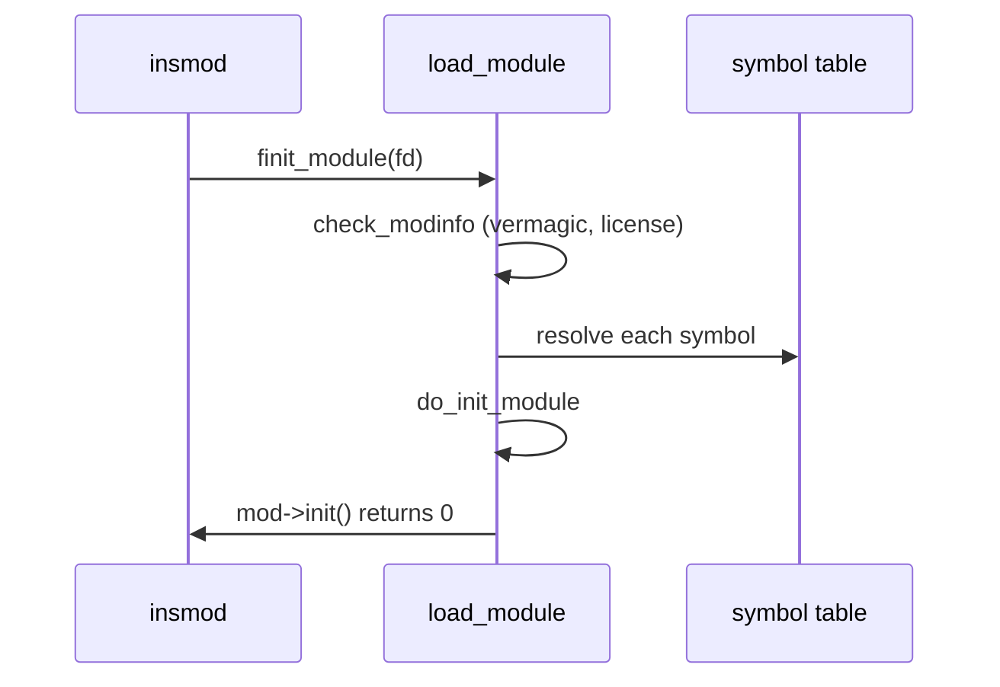

# Lab: Write, Build & Load a Kernel Module

> **Goal:** build, load, inspect and unload a real loadable kernel module from
> scratch — a "hello world," a version with a live parameter, and a second
> module that publishes stats through `/proc`. You will touch kbuild, `insmod`,
> `modinfo`, `/sys/module`, module parameters, `seq_file`, taint flags and DKMS.
> By the end the mechanisms in [Devices, Drivers & Modules](#/devices-modules)
> stop being abstract.

## Read this before you run anything

**Do this in a throwaway virtual machine.** Kernel modules run in ring 0 with
no memory protection between them and everything else. There is no `SIGSEGV`
for a driver. A stray NULL dereference, an off-by-one in kernel memory, or a
missing `rmmod` cleanup can panic the box, corrupt a mounted filesystem, or
wedge it so hard only the reset button helps. Userspace bugs cost you a core
dump; kernel bugs cost you the machine.

Spin up a disposable VM — `multipass launch`, a fresh `vagrant up`, a QEMU
image, a cloud instance you can delete — take a snapshot, and work there. Never
develop modules on a laptop or server whose uptime or data you care about.
Everything below is safe on a normal system *except* the oops discussion in
stage 7, which is explicitly "read, do not run."

You need root (via `sudo`), roughly 1 GB free for the kernel headers, and a
working C toolchain.

## Stage 1 — Install the kernel headers

A module is C compiled against the internal headers of the *exact* kernel it
will load into. You cannot use the userspace headers in `/usr/include`; you
need the matching `linux-headers` / `kernel-devel` package. Pick your distro:

```bash
# Debian / Ubuntu
sudo apt update && sudo apt install -y build-essential linux-headers-$(uname -r)

# Fedora / RHEL / Rocky
sudo dnf install -y kernel-devel-$(uname -r) gcc make

# Arch
sudo pacman -S --needed base-devel linux-headers
```

The `$(uname -r)` matters. `uname -r` prints the running kernel's release
string (for example `6.12.0-1-amd64`). Installing headers for a *different*
version — easy to do right after a kernel update, before you reboot — produces
a module that refuses to load. Verify the build tree exists:

```bash
ls -d /lib/modules/$(uname -r)/build
# → /lib/modules/6.12.0-1-amd64/build   (a symlink into the headers package)
```

If that path is missing, the header package is wrong or unpicked, and nothing
below will compile.

## Stage 2 — The module: `hello.c`

Make a working directory and create `hello.c`:

```c
#include <linux/init.h>
#include <linux/module.h>
#include <linux/kernel.h>

static int __init hello_init(void)
{
        printk(KERN_INFO "hello: module loaded\n");
        return 0;   /* non-zero would abort the load */
}

static void __exit hello_exit(void)
{
        printk(KERN_INFO "hello: module unloaded\n");
}

module_init(hello_init);
module_exit(hello_exit);

MODULE_LICENSE("GPL");
MODULE_AUTHOR("you <you@example.com>");
MODULE_DESCRIPTION("Minimal hello-world kernel module");
MODULE_VERSION("0.1");
```

Line by line:

- [`module_init()`](https://elixir.bootlin.com/linux/v6.12/C/ident/module_init)
  registers `hello_init` as the entry point the kernel calls once, right after
  it finishes relocating and linking the module. Returning non-zero here means
  "initialisation failed" and the kernel unloads the module immediately.
- [`module_exit()`](https://elixir.bootlin.com/linux/v6.12/C/ident/module_exit)
  registers the teardown function, called on `rmmod`. It must undo everything
  `init` did — free memory, unregister callbacks, remove `/proc` files.
- `__init` and `__exit` are section markers. Code marked `__init` is placed in
  a throwaway section the kernel frees after the module is loaded; `__exit` is
  dropped entirely when a module is built into the kernel (it can never unload).
- [`printk()`](https://elixir.bootlin.com/linux/v6.12/C/ident/printk) is the
  kernel's `printf`. `KERN_INFO` is a log-level prefix, not a separate argument
  — it string-concatenates onto the format. Messages land in the kernel ring
  buffer, readable with `dmesg`. (Modern code often prefers the `pr_info()`
  wrapper, which adds a per-module prefix; `printk` is the primitive.)

### Why `MODULE_LICENSE("GPL")` is not decoration

The license macro is load-bearing, in two concrete ways:

1. **Tainting.** If you omit it, or set a non-GPL-compatible string like
   `"Proprietary"`, the kernel sets the `TAINT_PROPRIETARY_MODULE` flag the
   moment your module loads. That flag rides along in every subsequent oops and
   panic report. Kernel developers routinely refuse to debug a tainted kernel —
   the taint says "there is code in here we cannot see." You can read the
   current taint state at `/proc/sys/kernel/tainted`.

2. **GPL-only symbols.** The kernel exports two tiers of symbols:
   [`EXPORT_SYMBOL()`](https://elixir.bootlin.com/linux/v6.12/C/ident/EXPORT_SYMBOL)
   (available to any module) and
   [`EXPORT_SYMBOL_GPL()`](https://elixir.bootlin.com/linux/v6.12/C/ident/EXPORT_SYMBOL_GPL)
   (available only to modules that declare a GPL-compatible license). Large
   swathes of the internal API — scheduler hooks, many tracing and power
   interfaces — are `_GPL`. A module without a GPL license simply fails to link
   against them: `Unknown symbol ... (GPL-only)`. The string is a legal
   assertion the build and load machinery actually enforces.

The accepted GPL-compatible strings are fixed (`"GPL"`, `"GPL v2"`,
`"GPL and additional rights"`, `"Dual BSD/GPL"`, `"Dual MIT/GPL"`,
`"Dual MPL/GPL"`); anything else counts as proprietary.

## Stage 3 — The kbuild Makefile

Kernel modules are not built with a hand-written `gcc` line. They go through
**kbuild**, the kernel's own build system, so they inherit the exact compiler
flags, include paths, and config the running kernel was built with. Create
`Makefile` (real tabs, not spaces, for the indented lines):

```makefile
obj-m += hello.o

KDIR := /lib/modules/$(shell uname -r)/build

all:
	$(MAKE) -C $(KDIR) M=$(PWD) modules

clean:
	$(MAKE) -C $(KDIR) M=$(PWD) clean
```

What each piece does:

- `obj-m += hello.o` is the one kbuild directive that matters. It says "build
  `hello.o` (from `hello.c`) as a loadable **m**odule." Kbuild derives the
  source name automatically.
- `-C $(KDIR)` tells `make` to change into the kernel build tree and use *its*
  top-level Makefile. That is where all the real rules live.
- `M=$(PWD)` sends kbuild back out to your directory to find `obj-m` and the
  source. This "external module" mode is how every out-of-tree driver builds.

Build it:

```bash
make
```

Expected output (versions will differ):

```text
make -C /lib/modules/6.12.0-1-amd64/build M=/home/you/hello modules
make[1]: Entering directory '/usr/src/linux-headers-6.12.0-1-amd64'
  CC [M]  /home/you/hello/hello.o
  MODPOST /home/you/hello/Module.symvers
  CC [M]  /home/you/hello/hello.mod.o
  LD [M]  /home/you/hello/hello.ko
make[1]: Leaving directory '/usr/src/linux-headers-6.12.0-1-amd64'
```

The product is `hello.ko` — a **k**ernel **o**bject, an ELF file with extra
sections that describe its symbols, parameters and license.

### Why it must match the running kernel exactly

Notice the `MODPOST` step. Kbuild stamps every `.ko` with a **vermagic**
string — kernel version, compiler, and critical config options
(`SMP`, preemption model, `CONFIG_MODVERSIONS`, and more). At load time the
kernel compares that string to its own. A mismatch is rejected outright:

```text
insmod: ERROR: could not insert module hello.ko: Invalid module format
# dmesg: hello: version magic '6.12.0-2-amd64 SMP ...' should be '6.12.0-1-amd64 SMP ...'
```

This is not bureaucracy. The kernel has no stable internal ABI. `struct
task_struct` and hundreds of others change layout between versions and even
between config options. A module compiled against one layout that runs against
another reads garbage — silent corruption, not a clean error. Vermagic (and
optionally `CONFIG_MODVERSIONS`, which additionally CRC-checks each exported
symbol's prototype) exists to turn that catastrophe into a refusal to load.
This is exactly why you install headers for `$(uname -r)` and no other.

## Stage 4 — Load, inspect, unload

Run the full cycle:

```bash
sudo dmesg -C                       # clear the ring buffer (optional, tidy)
sudo insmod ./hello.ko              # load
dmesg | tail -1                     # → hello: module loaded
lsmod | grep hello                  # → hello   16384  0
sudo rmmod hello                    # unload
dmesg | tail -2                     # → hello: module unloaded
```

`insmod` loads exactly the file you name and does nothing clever. Its
production cousin `modprobe` resolves dependencies and searches
`/lib/modules`, but for a local `.ko`, `insmod` is the direct path.

While it is loaded, inspect it two ways.

**From the ELF file** with `modinfo` — this reads the `.ko`'s metadata
sections without loading anything:

```bash
modinfo ./hello.ko
```

```text
filename:       /home/you/hello/hello.ko
version:        0.1
description:    Minimal hello-world kernel module
author:         you <you@example.com>
license:        GPL
srcversion:     8F2A...
depends:
vermagic:       6.12.0-1-amd64 SMP preempt mod_unload modversions
```

**From the live kernel** through sysfs. Every loaded module gets a directory
under [`/sys/module`](#/observability):

```bash
ls /sys/module/hello/
# → coresize  initstate  refcnt  sections  taint  ...
cat /sys/module/hello/refcnt        # → 0  (nothing is using it)
cat /sys/module/hello/initstate     # → live
```

The `refcnt` is why `rmmod` sometimes refuses: a module in use (a driver bound
to a device, a filesystem still mounted) has a non-zero reference count and
cannot be removed until every user drops it.

## Stage 5 — A live module parameter

Modules can take parameters — values you set at load time and, if you allow it,
tweak afterward through sysfs. Copy `hello.c` to `hello_param.c` and change the
top:

```c
#include <linux/init.h>
#include <linux/module.h>
#include <linux/kernel.h>
#include <linux/moduleparam.h>

static char *whom = "world";
static int count = 1;

module_param(whom, charp, 0644);
MODULE_PARM_DESC(whom, "who to greet");
module_param(count, int, 0644);
MODULE_PARM_DESC(count, "how many times");

static int __init hello_init(void)
{
        int i;
        for (i = 0; i < count; i++)
                printk(KERN_INFO "hello: hi, %s (%d/%d)\n", whom, i + 1, count);
        return 0;
}
```

Keep the same `hello_exit`, `module_init/exit`, and `MODULE_*` lines (rename
the module in the Makefile: `obj-m += hello_param.o`).

[`module_param(name, type, perm)`](https://elixir.bootlin.com/linux/v6.12/C/ident/module_param)
declares a variable as a parameter. `charp` is a char pointer (string), `int`
an int; other types include `bool`, `uint`, `long`. The third argument is the
**sysfs permission mask**: `0644` means the parameter appears at
`/sys/module/<name>/parameters/<param>`, world-readable and root-writable.
Pass `0` and the parameter is settable only at load time, with no sysfs file.

```bash
make
sudo insmod ./hello_param.ko whom="lab" count=3
dmesg | tail -3
# hello: hi, lab (1/3)
# hello: hi, lab (2/3)
# hello: hi, lab (3/3)

cat /sys/module/hello_param/parameters/whom     # → lab
echo galaxy | sudo tee /sys/module/hello_param/parameters/whom
cat /sys/module/hello_param/parameters/whom     # → galaxy
sudo rmmod hello_param
```

Writing to the sysfs file changes the kernel variable *live* — the next code
that reads `whom` sees `galaxy`. Note the subtlety: changing `count` after load
does nothing visible here, because `count` is only read inside `init`, which
already ran. Parameters you want to react at runtime must be read by code that
runs at runtime. This is the standard mechanism behind knobs like
`nvme_core.io_timeout` or `usbcore.autosuspend`.

## Stage 6 — A `/proc` file with seq_file

Now something that does real work: a module that publishes live kernel stats at
`/proc/labstats`. Create `labstats.c`:

```c
#include <linux/init.h>
#include <linux/module.h>
#include <linux/proc_fs.h>
#include <linux/seq_file.h>
#include <linux/jiffies.h>
#include <linux/cpumask.h>

static int labstats_show(struct seq_file *m, void *v)
{
        seq_printf(m, "jiffies:      %lu\n", jiffies);
        seq_printf(m, "HZ:           %d\n", HZ);
        seq_printf(m, "uptime_secs:  %lu\n", jiffies / HZ);
        seq_printf(m, "online_cpus:  %u\n", num_online_cpus());
        seq_printf(m, "possible_cpus:%u\n", num_possible_cpus());
        return 0;
}

static int labstats_open(struct inode *inode, struct file *file)
{
        return single_open(file, labstats_show, NULL);
}

static const struct proc_ops labstats_ops = {
        .proc_open    = labstats_open,
        .proc_read    = seq_read,
        .proc_lseek   = seq_lseek,
        .proc_release = single_release,
};

static struct proc_dir_entry *entry;

static int __init labstats_init(void)
{
        entry = proc_create("labstats", 0444, NULL, &labstats_ops);
        if (!entry)
                return -ENOMEM;
        printk(KERN_INFO "labstats: /proc/labstats created\n");
        return 0;
}

static void __exit labstats_exit(void)
{
        proc_remove(entry);
        printk(KERN_INFO "labstats: removed\n");
}

module_init(labstats_init);
module_exit(labstats_exit);
MODULE_LICENSE("GPL");
MODULE_DESCRIPTION("Publishes kernel stats at /proc/labstats");
```

Each API call, and why it is shaped this way:

- [`proc_create(name, mode, parent, ops)`](https://elixir.bootlin.com/linux/v6.12/C/ident/proc_create)
  creates the `/proc` entry. `0444` is the file mode (read-only for everyone),
  `NULL` parent means directly under `/proc`, and `ops` is the operations
  table. It returns a
  [`struct proc_dir_entry *`](https://elixir.bootlin.com/linux/v6.12/C/ident/proc_dir_entry)
  which you must keep to remove the file later. Since 5.6, `/proc` files use
  [`struct proc_ops`](https://elixir.bootlin.com/linux/v6.12/C/ident/proc_ops)
  rather than the old `file_operations`, so `/proc` handlers no longer carry
  the full VFS baggage.
- **seq_file** is the right way to produce `/proc` and `/sys` text. It handles
  the hard parts — buffering, partial reads, a `read()` larger than one page,
  `lseek` — so you just emit text. For a small fixed-size output,
  [`single_open()`](https://elixir.bootlin.com/linux/v6.12/C/ident/single_open)
  wires up the simplest variant: your `show` function is called once, its whole
  output captured into a buffer that seq_file serves to userspace.
- [`seq_printf()`](https://elixir.bootlin.com/linux/v6.12/C/ident/seq_printf)
  appends formatted text into that buffer. Never `printk` your output here and
  never write to a raw userspace pointer — seq_file owns the buffer.
- The `proc_ops` table maps VFS operations onto the seq_file helpers:
  `seq_read`, `seq_lseek`, `single_release` are stock functions the kernel
  provides. Your only custom piece is `open`.
- The data itself: [`jiffies`](https://elixir.bootlin.com/linux/v6.12/C/ident/jiffies)
  is the kernel's tick counter, incremented `HZ` times per second (typically
  250 or 1000 — see [Timers & Time](#/timers)).
  [`num_online_cpus()`](https://elixir.bootlin.com/linux/v6.12/C/ident/num_online_cpus)
  counts CPUs currently schedulable; `num_possible_cpus()` counts the maximum
  the kernel is built to handle, including hot-pluggable ones.

Build and try it:

```bash
make          # obj-m += labstats.o
sudo insmod ./labstats.ko
cat /proc/labstats
```

```text
jiffies:      4304512789
HZ:           1000
uptime_secs:  4304512
online_cpus:  4
possible_cpus:4
```

```bash
cat /proc/labstats            # read again — jiffies has advanced
sudo rmmod labstats
cat /proc/labstats            # → No such file or directory
```

Read it twice a second apart and `jiffies` climbs by ~`HZ` — the numbers are
computed fresh in your `show` function on every `open`.

**Container link:** the per-namespace `/proc` you see inside a container is
this same machinery. Most `/proc` files are backed by kernel functions like
`labstats_show`, and what a container sees depends on the namespaces its `/proc`
was mounted against (see [Namespaces](#/namespaces)). A module's `/proc` entry
created with a `NULL` parent lands in the host's global `/proc`, visible to
everyone — namespacing `/proc` content is extra work the module must opt into.

## Follow the code (kernel v6.12)

What actually happens between `insmod ./hello.ko` and your `printk` firing? Two
short paths.

**Loading.** `insmod` makes the
[`finit_module()`](https://man7.org/linux/man-pages/man2/finit_module.2.html)
syscall, handing the kernel a file descriptor for the `.ko`. Inside the kernel:

1. [`load_module()`](https://elixir.bootlin.com/linux/v6.12/C/ident/load_module)
   is the core routine. It copies the ELF image in, sanity-checks the headers,
   and reads the module's metadata sections.
2. It calls
   [`check_modinfo()`](https://elixir.bootlin.com/linux/v6.12/C/ident/check_modinfo),
   which compares the module's **vermagic** against the running kernel and,
   crucially for stage 2, inspects the license. A missing or non-GPL license
   here triggers `add_taint_module()` and sets the proprietary taint flag.
3. [`simplify_symbols()`](https://elixir.bootlin.com/linux/v6.12/C/ident/simplify_symbols)
   resolves each undefined symbol (your `printk`, `proc_create`, …) against the
   kernel's exported symbol table via
   [`resolve_symbol()`](https://elixir.bootlin.com/linux/v6.12/C/ident/resolve_symbol).
   This is where a `_GPL` symbol requested by a non-GPL module is rejected, and
   where an `Unknown symbol` error comes from.
4. Once symbols are linked and relocations applied,
   [`do_init_module()`](https://elixir.bootlin.com/linux/v6.12/C/ident/do_init_module)
   flips the module state to `MODULE_STATE_COMING`, then calls `mod->init` —
   *that* is your `hello_init`. Its return value is the syscall's return value;
   non-zero rolls the whole load back.

**The struct.** Everything the kernel knows about your loaded module lives in
one [`struct module`](https://elixir.bootlin.com/linux/v6.12/C/ident/module).
The fields that map onto what you have seen: `name` (what `lsmod` prints),
`state` (`initstate` in sysfs), `init` and `exit` (your two functions),
`refcnt` (the sysfs `refcnt`), and `taints`. `rmmod` walks the reverse path via
[`delete_module()`](https://man7.org/linux/man-pages/man2/delete_module.2.html)
→ `free_module()`, refusing if `refcnt` is non-zero and calling `mod->exit`
(your `hello_exit`) before unmapping the code.



## Stage 7 — What a bug does (read, do not run)

This is the part the VM warning is for. Suppose `labstats_show` dereferenced a
NULL pointer instead of reading `jiffies`. In userspace that is a segfault: the
kernel kills your process, the rest of the system shrugs. In kernel space there
is no other process to fall back on. The CPU takes a page fault at an address
the kernel cannot handle, and the fault handler produces an **oops**:

- `dmesg` shows `BUG: kernel NULL pointer dereference`, the faulting address,
  the CPU registers, and a **call trace** naming `labstats_show` and the
  functions above it — often enough to locate the exact line.
- The kernel sets the `TAINT_DIE` / oops taint flag. From this point
  `/proc/sys/kernel/tainted` is non-zero and any later bug report is suspect.
- The offending *thread* is killed, but it may have been holding a lock or a
  reference. If it was, that resource is now leaked forever, and the subsystem
  it belonged to can hang the next process that touches it. This is why an oops
  frequently cascades into an unusable machine even though it is not, strictly,
  an immediate panic.
- A true **panic** (for example an oops inside an interrupt handler, or with
  `panic_on_oops` set) stops the kernel dead — no more scheduling, reboot
  required.

You do not need to trigger this to learn from it. Read a real oops in your
`dmesg` history if you have one, or study the call-trace format in the docs.
The lesson is simply: kernel code has no safety net, so validate every pointer
and clean up every resource on every exit path — including the error paths in
`init`.

## Stage 8 — Surviving kernel updates with DKMS

Your `.ko` is bound to one kernel version by vermagic. The next `apt upgrade`
that installs a new kernel leaves your module unbuildable against it — reboot
into the new kernel and it is gone. **DKMS** (Dynamic Kernel Module Support)
fixes this: you register the *source* once, and DKMS automatically rebuilds the
module against every new kernel as it is installed, via a package post-install
hook. This is how out-of-tree drivers (NVIDIA, VirtualBox, ZFS) survive kernel
updates. You give it a `dkms.conf` naming the module and version, run
`dkms add`, `dkms build`, `dkms install`, and from then on it is automatic.
For a one-off lab module you do not need it; for anything you rely on across
reboots, you do.

## Cleanup

```bash
# unload anything still loaded
lsmod | grep -E 'hello|labstats'
sudo rmmod hello_param labstats hello 2>/dev/null

# remove build artifacts
make clean
rm -f hello*.ko labstats*.ko

# confirm nothing lingers
ls /sys/module/ | grep -E 'hello|labstats'   # (no output = clean)
```

Then delete or roll back the VM snapshot. You are done.

## Check your understanding

1. Why must a module be compiled against the headers of the exact running
   kernel, and what mechanism enforces it?

<details><summary>Show answer</summary>

The kernel has no stable internal ABI — struct layouts and offsets change
between versions and config options, so a module built against a different
layout reads garbage. Kbuild stamps each `.ko` with a **vermagic** string
(version, SMP, preemption, compiler, config); `check_modinfo()` compares it at
load time and rejects a mismatch with `Invalid module format`. Optionally
`CONFIG_MODVERSIONS` adds per-symbol CRC checks.

</details>

2. What two concrete things does `MODULE_LICENSE("GPL")` control?

<details><summary>Show answer</summary>

(1) **Tainting** — omitting it or using a proprietary string sets
`TAINT_PROPRIETARY_MODULE`, visible in `/proc/sys/kernel/tainted` and in every
later oops. (2) **Symbol access** — symbols exported with `EXPORT_SYMBOL_GPL()`
only link into modules that declare a GPL-compatible license; a non-GPL module
gets `Unknown symbol ... (GPL-only)` and fails to load.

</details>

3. In stage 5, why does writing a new value to
   `/sys/module/hello_param/parameters/count` after load have no visible effect,
   while writing to `whom` (in a runtime path) would?

<details><summary>Show answer</summary>

The sysfs write does change the kernel variable live, but `count` is only read
inside `hello_init`, which already ran at load time — nothing reads it again. A
parameter only reacts at runtime if code that runs at runtime reads it. This is
why `whom` written into a still-executing loop or handler would be seen, but a
value consumed once in `init` will not.

</details>

4. What does `single_open()` set up, and why not just `printk` the stats
   instead?

<details><summary>Show answer</summary>

`single_open()` wires a seq_file whose `show` function is called once and whose
entire output is buffered, then served to userspace via `seq_read` — handling
partial reads, large outputs and `lseek` correctly. `printk` writes to the
kernel log, not to the reader of `/proc/labstats`; seq_file is the mechanism
that delivers text to a `read()` on the file.

</details>

5. A colleague's module loaded fine but their box became unresponsive minutes
   later after they triggered a code path. `/proc/sys/kernel/tainted` is
   non-zero. What likely happened, and why did a single-threaded bug take down
   the whole machine?

<details><summary>Show answer</summary>

A kernel oops (e.g. a NULL dereference) killed the offending thread and set a
taint flag. Kernel code has no per-process isolation: if the killed thread was
holding a lock or a reference, that resource leaks permanently, so the next
process to touch that subsystem blocks forever — the machine wedges even though
it was not an immediate panic.

</details>

6. Why does `rmmod` sometimes refuse with "Module is in use," and where do you
   check?

<details><summary>Show answer</summary>

The module's reference count is non-zero — a device is bound to it, a
filesystem it provides is mounted, or another module depends on it. Check
`/sys/module/<name>/refcnt` (or the last column of `lsmod`). The module cannot
unload until every user drops its reference, because `free_module()` would
otherwise unmap code that is still executing.

</details>

7. What problem does DKMS solve that a plain `make && insmod` workflow does not?

<details><summary>Show answer</summary>

A `.ko` is bound to one kernel version by vermagic, so a kernel upgrade leaves
it unbuildable against the new kernel and it disappears on reboot. DKMS
registers the module source and automatically rebuilds and installs it against
each newly installed kernel via a package hook — the mechanism that keeps
out-of-tree drivers like NVIDIA or VirtualBox working across updates.

</details>

## Sources & further reading

- The Linux Kernel Module Programming Guide (TLDP / sysprog21) — the canonical
  hands-on introduction, kept current for recent kernels.
- kernel.org: "Building External Modules" —
  <https://docs.kernel.org/kbuild/modules.html>
- kernel.org: "The seq_file interface" —
  <https://docs.kernel.org/filesystems/seq_file.html>
- kernel.org: "Exporting kernel headers / kbuild" documentation index —
  <https://docs.kernel.org/kbuild/index.html>
- `man 2 init_module` and `man 2 finit_module` —
  <https://man7.org/linux/man-pages/man2/init_module.2.html>
- `man 8 modprobe`, `man 8 insmod`, `man 8 modinfo` —
  <https://man7.org/linux/man-pages/man8/modprobe.8.html>
- Module loader source, `kernel/module/` —
  <https://elixir.bootlin.com/linux/v6.12/source/kernel/module>
- DKMS project documentation — <https://github.com/dell/dkms>
