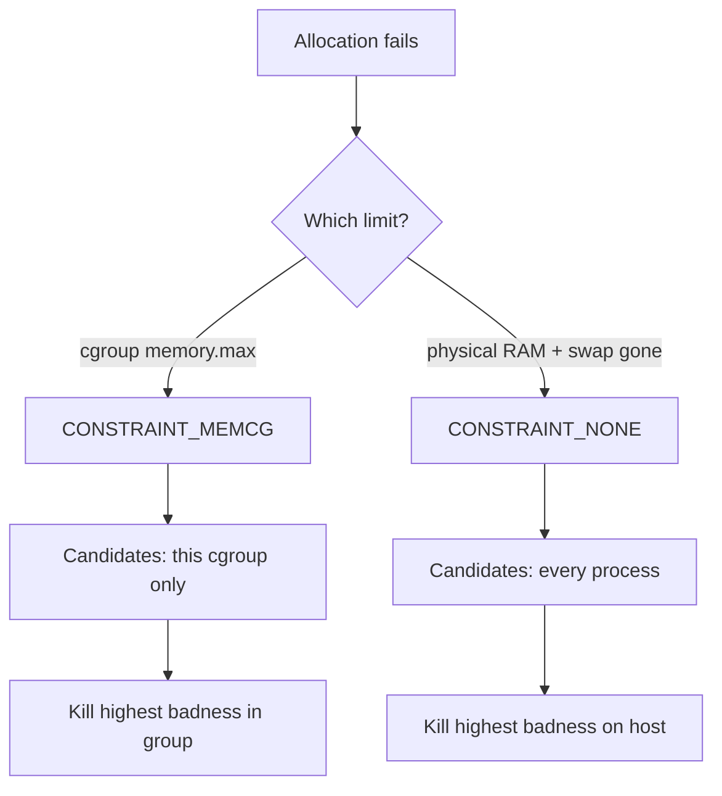

# Lab: Trigger & Autopsy the OOM Killer

> **Goal:** deliberately provoke the Out-Of-Memory killer inside a
> memory-limited cgroup — safely, without endangering the host — then read
> the dmesg autopsy line by line, steer which process dies, and watch memory
> pressure build with PSI before the axe falls.

The [Virtual Memory](#/memory) chapter described the OOM killer in theory:
when reclaim fails, the kernel picks the process with the highest *badness*
score and SIGKILLs it. This lab makes it happen in front of you. Every
allocation stays inside a cgroup with a hard `memory.max`, so when the kill
fires it fires *inside the group* — the host never notices.

## What you need

- A throwaway Linux VM, a spare box, or any Linux machine where you don't
  mind a process dying. A recent distro with **cgroup v2** (the default on
  Fedora 31+, Ubuntu 21.10+, Debian 11+, RHEL 9+) and **systemd**.
- `root` (or `sudo`) — creating scopes and reading full dmesg needs it.
- Ten minutes.

> **Safety, stated once and meant:** the danger of an OOM demo is triggering
> the *global* killer, which can shoot `sshd`, your display manager, or the
> database you forgot was running. **Never run the allocator outside the
> limited scope.** Every command below caps memory at 256 MiB inside a
> cgroup; the allocator can only starve *itself*. If you ever run the raw
> `python3 -c '...bytearray...'` line in your normal shell with no limit
> around it, you are inviting the global OOM killer to pick a victim from your
> whole machine. Don't.

Verify you are on cgroup v2 before starting:

```bash
stat -fc %T /sys/fs/cgroup/
# cgroup2fs        ← good. "tmpfs" means legacy/hybrid v1; this lab assumes v2.
```

## Stage 1 — Build a memory-limited scope

`systemd-run --scope` drops your command into a fresh transient cgroup and
lets you set resource-control properties on it directly. `MemoryMax=256M`
becomes `memory.max` in that cgroup (see [Control Groups](#/cgroups) for the
full property-to-file mapping).

```bash
sudo systemd-run --scope -p MemoryMax=256M --slice=oomlab \
    bash -c 'echo "PID $$ in cgroup:"; cat /proc/self/cgroup; sleep 300'
```

Expected output (the scope name is randomized):

```text
Running scope as unit: run-r9c3f1a2e4b74d8e9f0a1b2c3d4e5f6a.scope
PID 4127 in cgroup:
0::/oomlab.slice/run-r9c3f1a2e4b74d8e9f0a1b2c3d4e5f6a.scope
```

Leave that shell running. In **another terminal**, confirm the limit landed:

```bash
CG=/sys/fs/cgroup/oomlab.slice
find $CG -name memory.max -exec sh -c 'echo "$1: $(cat "$1")"' _ {} \;
```

```text
/sys/fs/cgroup/oomlab.slice/run-r9c3....scope/memory.max: 268435456
```

`268435456` is 256 × 1024 × 1024 — your hard wall, as a plain file.

**The raw cgroup-v2 alternative** (no systemd, same result). This is what
`systemd-run` does under the hood:

```bash
sudo -i                                        # become root for the sequence
cd /sys/fs/cgroup
# Ensure the memory controller is delegated to children:
echo '+memory' > cgroup.subtree_control 2>/dev/null || true
mkdir -p oomlab_raw                            # a new cgroup = one mkdir
echo 268435456 > oomlab_raw/memory.max         # 256 MiB hard limit
echo 0         > oomlab_raw/memory.swap.max    # no swap escape hatch
echo $$        > oomlab_raw/cgroup.procs       # move THIS shell into it
cat oomlab_raw/memory.max
```

```text
268435456
```

Setting `memory.swap.max` to 0 matters: if the group can swap, the kernel
will page anonymous memory out instead of killing, and the demo turns into a
thrashing exercise rather than a clean kill. Zero swap forces the cliff.

### What just happened

You created a cgroup — a directory under `/sys/fs/cgroup` — and wrote one
number into its `memory.max` file. That number is the total resident memory
(anonymous pages + page cache + some kernel memory) the group's processes are
allowed to hold. Exceed it and the kernel first reclaims the group's own
pages; if reclaim can't get usage back under the limit, it invokes the OOM
killer *scoped to this cgroup*. Nothing outside `oomlab.slice` is a candidate.

## Stage 2 — Allocate until the kill

Now, **inside the limited shell from Stage 1** (the one whose `/proc/self/cgroup`
shows `oomlab`), run a tiny allocator that touches memory 10 MiB at a time.
Touching matters — thanks to demand paging ([Virtual Memory](#/memory)),
merely `malloc`ing doesn't consume physical pages; writing to them does.

```bash
python3 -c '
import sys
chunks = []
for i in range(1, 1000):
    chunks.append(bytearray(10 * 1024 * 1024))   # 10 MiB, then touch it
    for j in range(0, len(chunks[-1]), 4096):
        chunks[-1][j] = 1                         # fault in every 4 KiB page
    print(f"allocated {i*10} MiB", flush=True)
'
```

Expected output — it climbs, then dies:

```text
allocated 10 MiB
allocated 20 MiB
...
allocated 230 MiB
allocated 240 MiB
Killed
```

`Killed` — printed by your shell — is the visible face of `SIGKILL`. The
process crossed ~256 MiB (a little less, because the Python interpreter
itself and its own pages count too) and the kernel's cgroup OOM killer
reclaimed, failed, and fired.

Check the receipt:

```bash
cat /sys/fs/cgroup/oomlab.slice/run-*.scope/memory.events
```

```text
low 0
high 0
max 47
oom 1
oom_kill 1
```

- `max 47` — the charge hit `memory.max` 47 times (each triggered reclaim).
- `oom 1` — the OOM killer was invoked once.
- `oom_kill 1` — it actually killed one task.

### What just happened

Each 10 MiB `bytearray` plus the write loop faulted in real pages, charged to
the cgroup's `struct mem_cgroup` counter. Around 256 MiB the charge failed;
the kernel ran targeted reclaim over just this group's LRU lists
([try_to_free_mem_cgroup_pages()](https://elixir.bootlin.com/linux/v6.12/C/ident/try_to_free_mem_cgroup_pages)),
found nothing droppable (it's all dirty anonymous memory, no page cache, no
swap), and escalated to the OOM killer. The killer picked the only real
memory hog in the group — the Python process — and SIGKILLed it.

## Stage 3 — The autopsy: reading the dmesg OOM report

This is the heart of the lab. Every OOM kill dumps a full report to the
kernel log.

```bash
sudo dmesg | grep -A1 -iE 'invoked oom|Out of memory|Killed process|oom-kill' | tail -20
```

You'll see something like this (trimmed and annotated):

```text
python3 invoked oom-killer: gfp_mask=0x1100cca(GFP_HIGHUSER_MOVABLE), order=0, oom_score_adj=0
...
memory: usage 262144kB, limit 262144kB, failcnt 47
swap: usage 0kB, limit 0kB, failcnt 0
Memory cgroup stats for /oomlab.slice/run-r9c3....scope:
...
Tasks state (memory values in pages):
[  pid  ]   uid  tgid total_vm      rss  ...  oom_score_adj  name
[   4127]     0  4127     1234       89  ...              0  bash
[   4392]     0  4392    68201    64893  ...              0  python3
oom-kill:constraint=CONSTRAINT_MEMCG,nodemask=(null),cpuset=...,mems_allowed=0,oom_memcg=/oomlab.slice/run-...,task_memcg=/oomlab.slice/run-...,task=python3,pid=4392,uid=0
Memory cgroup out of memory: Killed process 4392 (python3) total-vm:272804kB, anon-rss:258560kB, file-rss:1012kB, shmem-rss:0kB, UID:0 pgtables:576kB oom_score_adj:0
```

Read it line by line:

- **`python3 invoked oom-killer: ... order=0`** — the process whose
  allocation failed and *triggered* the killer. Not necessarily the victim,
  but here they're the same. `order=0` means it wanted a single 4 KiB page
  (2⁰ pages) — the common case.
- **`memory: usage 262144kB, limit 262144kB`** — usage has reached the limit
  exactly. 262144 KiB = 256 MiB. `failcnt 47` matches the `max 47` you saw in
  `memory.events`.
- **`Tasks state`** — the candidate list. The kernel enumerates every process
  in the OOM domain (here, just the cgroup) with its `total_vm` (virtual
  size, in pages), `rss` (resident pages — the number that matters), and
  `oom_score_adj`. `bash` holds 89 pages (~356 KiB); `python3` holds 64,893
  pages (~253 MiB). The choice is obvious.
- **`constraint=CONSTRAINT_MEMCG`** — *why* this OOM happened: a memory-cgroup
  limit, not global exhaustion. `oom_memcg=` names the group that hit its
  wall. (Global OOM would say `CONSTRAINT_NONE`.)
- **`Killed process 4392 (python3) ... anon-rss:258560kB`** — the verdict.
  `anon-rss` is the anonymous resident set — 252 MiB of untouched-by-disk
  memory that could only be freed by killing. `pgtables:576kB` is the page
  tables mapping it all.

Now confirm the exit status. In the shell where Python died:

```bash
echo $?
```

```text
137
```

**137 = 128 + 9.** Unix encodes "terminated by signal N" as exit code
128 + N, and SIGKILL is signal 9 (see [Signals](#/signals)). So **137 is the
universal fingerprint of an OOM kill** — the same code you get from a
container that busts its `docker run -m` limit. When you see 137 in a
Kubernetes `kubectl describe pod` or a CI log, this is what happened.

### What just happened

The kernel didn't kill blindly. It built the candidate list, scored each task
with [oom_badness()](https://elixir.bootlin.com/linux/v6.12/C/ident/oom_badness)
(roughly `rss + swap + pagetables`, in pages, plus the `oom_score_adj` bias),
picked the highest, logged the entire state of the OOM domain for forensics,
and sent one `SIGKILL`. The dump is deliberately verbose because when this
happens on a production box at 3 a.m., that log is your only witness.

## Stage 4 — Steer the victim with `oom_score_adj`

The kernel's choice is biased by each process's
`/proc/PID/oom_score_adj`, an integer from **−1000 to +1000**. It's added
(scaled) to the badness score: **+1000 = "kill me first," −1000 = "never kill
me."** Let's prove it by making the kernel kill the *smaller* process.

Set up two allocators in the limited scope, and tilt the scoring so the
100 MiB process dies instead of the 150 MiB one:

```bash
sudo systemd-run --scope -p MemoryMax=256M -p MemorySwapMax=0 --slice=oomlab \
  bash -c '
    # Victim A: small (100 MiB) but marked as preferred target
    python3 -c "import time; x=bytearray(100*1024*1024)
for j in range(0,len(x),4096): x[j]=1
time.sleep(600)" &
    PID_A=$!
    echo 1000 > /proc/$PID_A/oom_score_adj    # "kill me first"

    # Victim B: large (150 MiB) but shielded
    python3 -c "import time; x=bytearray(150*1024*1024)
for j in range(0,len(x),4096): x[j]=1
time.sleep(600)" &
    PID_B=$!
    echo -1000 > /proc/$PID_B/oom_score_adj   # "never kill me"

    echo "A(small)=$PID_A adj=1000   B(large)=$PID_B adj=-1000"
    sleep 5
    # Now tip the group over the edge with a third allocator:
    python3 -c "x=bytearray(80*1024*1024)
for j in range(0,len(x),4096): x[j]=1"
    wait
  '
```

Check who died:

```bash
sudo dmesg | grep 'Killed process' | tail -1
```

```text
Memory cgroup out of memory: Killed process 4501 (python3) total-vm:105432kB, anon-rss:102400kB, ... oom_score_adj:1000
```

The **100 MiB** process (`oom_score_adj:1000`) was killed even though the
150 MiB one was the bigger memory hog — the `−1000` shield took B out of the
running entirely, and the `+1000` on A guaranteed it topped the list. Without
the adjustments, B (larger RSS) would have died.

### What just happened

`oom_score_adj` is how you tell the kernel what's precious. In practice:

- `sshd`, `systemd`, and critical daemons often run at a negative adjustment
  so they survive an OOM storm and you keep your foothold on the box. The
  `choom -p <pid> -n -1000` command (or `OOMScoreAdjust=` in a systemd unit)
  sets this.
- `−1000` is special: it removes the process from consideration *entirely*
  ([oom_badness()](https://elixir.bootlin.com/linux/v6.12/C/ident/oom_badness)
  returns `LONG_MIN` and the task is skipped), not merely "very low score."
- Batch jobs and caches are sometimes set positive so they're sacrificed
  first.

```bash
cat /proc/self/oom_score        # your shell's current badness (context-dependent)
cat /proc/self/oom_score_adj    # its bias, default 0
```

## Stage 5 — Watch the pressure build with PSI

The OOM kill is the *end* of the story. **Pressure Stall Information** (PSI,
since kernel 4.20) lets you watch memory pressure rise *before* the kill —
the same signal `systemd-oomd` uses to intervene early. PSI reports the
percentage of wall-clock time tasks were *stalled* waiting on memory.

In one terminal, watch the cgroup's memory pressure:

```bash
watch -n0.5 cat /sys/fs/cgroup/oomlab.slice/run-*.scope/memory.pressure
```

In the limited scope, start a *slow* allocator that spends time in reclaim
(swap off, small limit, so every allocation near the ceiling stalls):

```bash
# inside the Stage-1 limited shell:
python3 -c '
import time
chunks=[]
for i in range(30):
    chunks.append(bytearray(10*1024*1024))
    for j in range(0,len(chunks[-1]),4096): chunks[-1][j]=1
    time.sleep(0.3)
'
```

As usage approaches 256 MiB, the pressure numbers climb toward the kill:

```text
some avg10=48.20 avg60=12.10 avg300=2.44 total=8123456
full avg10=44.90 avg60=11.30 avg300=2.28 total=7501234
```

- **`some`** — at least one task in the group was stalled on memory.
- **`full`** — *every* non-idle task was stalled (zero useful work happening).
- **`avg10/60/300`** — exponential moving averages over 10 s / 60 s / 300 s.

The machine-wide equivalent is `/proc/pressure/memory` — read it during any
real memory crunch:

```bash
cat /proc/pressure/memory
```

### What just happened

Every time an allocation near the limit forced the task into direct reclaim,
the scheduler recorded stall time and folded it into the PSI averages
([psi_task_change()](https://elixir.bootlin.com/linux/v6.12/C/ident/psi_task_change)).
`some` climbing past a few percent means the workload is spending real time
waiting for memory instead of running — the early-warning sign the OOM
killer's cliff-edge behavior can't give you. This is why modern userspace
OOM daemons watch PSI and kill *politely, earlier*, instead of waiting for
the kernel's last-resort kill after minutes of thrashing.

## Stage 6 — cgroup-local OOM vs global OOM, and `memory.oom.group`

Everything so far was **cgroup-local OOM** (`CONSTRAINT_MEMCG`): a group hit
its own `memory.max`, the host had plenty of free RAM, and only the group's
tasks were kill candidates. This is the safe, contained kind — and the kind
every container hits.

**Global OOM** (`CONSTRAINT_NONE`) is different: physical RAM *and* swap are
genuinely exhausted machine-wide, so the killer's candidate list is *every
process on the box*. That's the dangerous one — it might pick `sshd` — and
it's exactly why this lab confines everything to a cgroup. You can recognize
which kind hit you from the `constraint=` field in the dmesg dump.



### Killing the group as a unit

By default the OOM killer kills **one** task in the group — which can leave a
multi-process service half-broken (imagine a worker pool with one worker
suddenly gone). `memory.oom.group=1` makes the *entire cgroup* the failure
domain: when OOM fires, every process in the group is killed together.

```bash
# In another terminal (raw cgroup from Stage 1's alternative, or a fresh one):
sudo -i
cd /sys/fs/cgroup/oomlab_raw
echo 1 > memory.oom.group          # kill the whole group on OOM
```

Now run two allocators in that group; when it OOMs, **both** die, not just
the hog. The dmesg report gains a line:

```text
Tasks in /oomlab_raw are going to be killed due to memory.oom.group set
```

### What just happened

`memory.oom.group` flips a flag on `struct mem_cgroup`; at kill time
[mem_cgroup_get_oom_group()](https://elixir.bootlin.com/linux/v6.12/C/ident/mem_cgroup_get_oom_group)
finds the group and the killer reaps every task in it. Kubernetes and systemd
use this so a crashing workload dies cleanly and the supervisor restarts the
*whole* thing, rather than nursing a limping half-alive service.

> **Container link:** `docker run -m 256m` sets exactly the `memory.max` you
> set by hand here; a container busting it produces the same
> `CONSTRAINT_MEMCG` kill and the same **exit code 137**. That's why 137 in
> container logs almost always means "raise the memory limit or fix the
> leak," not "the host ran out of RAM." See
> [What a Container Actually Is](#/containers-overview).

## Cleanup

```bash
# Stop the systemd scopes (they vanish when their shell exits; force if needed):
sudo systemctl stop oomlab.slice 2>/dev/null

# Tear down the raw cgroup: move your shell out first, then rmdir:
echo $$ > /sys/fs/cgroup/cgroup.procs 2>/dev/null   # only if you're still in it
sudo rmdir /sys/fs/cgroup/oomlab_raw 2>/dev/null

# Confirm nothing lingers:
ls /sys/fs/cgroup/ | grep -E 'oomlab' || echo "clean"
```

A cgroup directory can only be removed when it holds no processes — that's
why you move your shell back to the root cgroup first. `systemd-run` scopes
self-destruct when their command exits, so usually there's nothing to clean
up there at all.

## Follow the code (kernel v6.12)

The whole kill lives in
[mm/oom_kill.c](https://elixir.bootlin.com/linux/v6.12/source/mm/oom_kill.c).
Here's the path from "charge failed" to "process dead."

1. A cgroup charge that can't be satisfied by reclaim calls
   [mem_cgroup_out_of_memory()](https://elixir.bootlin.com/linux/v6.12/C/ident/mem_cgroup_out_of_memory),
   which builds a `struct oom_control` (the `memcg` field pins the OOM domain
   to this cgroup) and calls the common
   [out_of_memory()](https://elixir.bootlin.com/linux/v6.12/C/ident/out_of_memory).
   Global exhaustion reaches the same function from the allocator slowpath,
   just with `memcg = NULL`.
2. [out_of_memory()](https://elixir.bootlin.com/linux/v6.12/C/ident/out_of_memory)
   first checks for shortcuts (a pending SIGKILL, `oom_killer_disabled`), then
   calls [select_bad_process()](https://elixir.bootlin.com/linux/v6.12/C/ident/select_bad_process),
   which iterates the domain's tasks and scores each with
   [oom_badness()](https://elixir.bootlin.com/linux/v6.12/C/ident/oom_badness).
3. [oom_badness()](https://elixir.bootlin.com/linux/v6.12/C/ident/oom_badness)
   computes `points = rss + pte_pages + swap`, adds
   `oom_score_adj * totalpages / 1000`, and returns `LONG_MIN` (skip
   entirely) if the task is unkillable or `oom_score_adj == OOM_SCORE_ADJ_MIN`
   (−1000). Highest score wins — that's the `Tasks state` table you read in
   Stage 3.
4. [oom_kill_process()](https://elixir.bootlin.com/linux/v6.12/C/ident/oom_kill_process)
   logs the report ([dump_header()](https://elixir.bootlin.com/linux/v6.12/C/ident/dump_header)
   prints the task list and the `Killed process` line) and calls
   [__oom_kill_process()](https://elixir.bootlin.com/linux/v6.12/C/ident/__oom_kill_process),
   which sends `SIGKILL` and sets `TIF_MEMDIE` on the victim. If
   `memory.oom.group` is set,
   [mem_cgroup_get_oom_group()](https://elixir.bootlin.com/linux/v6.12/C/ident/mem_cgroup_get_oom_group)
   redirects the kill to the whole group.
5. To break deadlocks (a dying task waiting on a lock held by the memory it
   can't get), the **OOM reaper** — a kernel thread running
   [oom_reaper()](https://elixir.bootlin.com/linux/v6.12/C/ident/oom_reaper)
   — asynchronously tears down the victim's anonymous memory with
   [__oom_reap_task_mm()](https://elixir.bootlin.com/linux/v6.12/C/ident/__oom_reap_task_mm),
   reclaiming pages even before the process fully exits so the system makes
   forward progress.

The struct that ties it together is
[struct oom_control](https://elixir.bootlin.com/linux/v6.12/C/ident/oom_control):
its `memcg` field is the difference between a contained cgroup kill and a
machine-wide one, and `chosen`/`chosen_points` carry the winner out of
`select_bad_process()`.

## Check your understanding

1. You ran the Stage 2 allocator and saw `Killed`, but `free -h` on the host
   showed 12 GiB free. Why did anything die?

<details><summary>Show answer</summary>

Because the OOM was **cgroup-local** (`CONSTRAINT_MEMCG`): the process hit its
cgroup's `memory.max` of 256 MiB, not the host's physical limit. The kernel's
candidate list was scoped to the cgroup, and host free memory was irrelevant.
The dmesg line `constraint=CONSTRAINT_MEMCG` confirms it.

</details>

2. A container in CI exits with code 137 and no application error. What
   happened, and what does 137 decode to?

<details><summary>Show answer</summary>

The container was OOM-killed: it exceeded its cgroup `memory.max` (set by
`docker run -m` / Kubernetes `limits.memory`) and the kernel SIGKILLed its
biggest process. 137 = 128 + 9, the Unix encoding for "terminated by signal
9 (SIGKILL)." Fix: raise the limit or reduce the workload's memory use.

</details>

3. Why does the lab set `memory.swap.max` (or `MemorySwapMax`) to 0? What
   would happen otherwise?

<details><summary>Show answer</summary>

With swap allowed, the kernel reclaims by paging anonymous memory *out to
swap* instead of killing, so the allocator would thrash rather than die
cleanly — the demo could take a long time and might never reach the OOM
cliff. Zero swap means anonymous memory can't be reclaimed, forcing the OOM
kill promptly.

</details>

4. Two processes are in the cgroup: process A uses 200 MiB with
   `oom_score_adj=0`, process B uses 40 MiB with `oom_score_adj=1000`. The
   group OOMs. Who dies, and why?

<details><summary>Show answer</summary>

Process B. `oom_badness()` adds `oom_score_adj * totalpages / 1000` to the
raw RSS score; +1000 adds a full group's-worth of points, dwarfing A's
160 MiB RSS advantage. `oom_score_adj` is how you deliberately steer the
victim independent of size.

</details>

5. You want to watch memory pressure *before* the kill. Which file do you
   read for a single cgroup, and what do `some` vs `full` mean?

<details><summary>Show answer</summary>

Read `memory.pressure` inside the cgroup directory (or `/proc/pressure/memory`
machine-wide). `some` is the percentage of time *at least one* task was
stalled waiting on memory; `full` is the percentage where *every* non-idle
task was stalled (no useful work at all). Rising `some` is the early-warning
signal daemons like `systemd-oomd` act on.

</details>

6. What does `memory.oom.group=1` change about the kill, and why would a
   service want it?

<details><summary>Show answer</summary>

Instead of killing a single highest-badness task, the OOM killer reaps
*every* process in the cgroup as a unit. A multi-process service benefits
because losing one worker can leave it half-broken; killing the whole group
lets the supervisor (systemd, Kubernetes) restart it cleanly.

</details>

7. In the dmesg autopsy, which single field tells you whether the kill was
   contained to a cgroup or was a machine-wide emergency?

<details><summary>Show answer</summary>

The `constraint=` field. `CONSTRAINT_MEMCG` means a cgroup memory limit was
hit (contained; candidates were only that group's tasks). `CONSTRAINT_NONE`
means global RAM+swap exhaustion (dangerous; every process on the host was a
candidate).

</details>

## Sources & further reading

- [Out Of Memory Management — kernel docs](https://docs.kernel.org/mm/oom.html) — the kernel's own description of OOM handling.
- [Control Group v2 — memory controller](https://docs.kernel.org/admin-guide/cgroup-v2.html) — `memory.max`, `memory.swap.max`, `memory.oom.group`, `memory.events`, and `memory.pressure` semantics.
- [PSI — Pressure Stall Information](https://docs.kernel.org/accounting/psi.html) — the meaning of `some`/`full` and the moving-average windows.
- [mm/oom_kill.c in v6.12](https://elixir.bootlin.com/linux/v6.12/source/mm/oom_kill.c) — `out_of_memory()`, `oom_badness()`, `select_bad_process()`, and the OOM reaper, all in one file.
- [proc(5)](https://man7.org/linux/man-pages/man5/proc.5.html) — documents `/proc/PID/oom_score`, `/proc/PID/oom_score_adj`, and `/proc/pressure/memory`.
- [choom(1)](https://man7.org/linux/man-pages/man1/choom.1.html) — adjust a process's OOM score from the command line.
- [systemd-run(1)](https://man7.org/linux/man-pages/man1/systemd-run.1.html) and [systemd.resource-control(5)](https://man7.org/linux/man-pages/man5/systemd.resource-control.5.html) — the `--scope`, `MemoryMax=`, and `MemorySwapMax=` properties used throughout.

---

**Next:** see the other side of the memory coin — how the kernel *keeps* file
data in RAM to make everything fast — in the [page cache lab](#/lab-page-cache),
or push harder on limits and throttling in the
[cgroup limits lab](#/lab-cgroup-limits).
