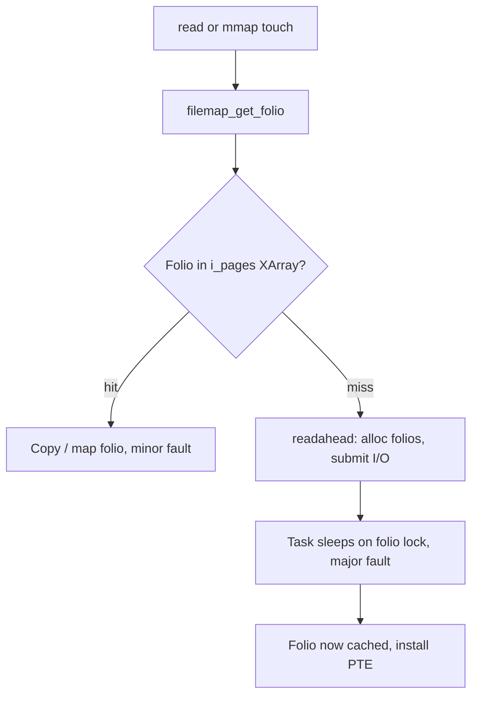

# Lab: Watch the Page Cache Work

> **Goal:** make the page cache *visible*. You'll watch RAM fill with cached
> file data, see a second read go 100× faster than the first, watch dirty pages
> rise and drain to disk, and count the exact major faults that a cold read
> costs and a hot read doesn't. Every stage has a command, the output to expect,
> and a "what just happened."

The [Virtual Memory](#/memory) chapter explained the page cache in prose: every
file byte you read or write is kept in RAM, because RAM is thousands of times
faster than even NVMe, and free RAM is wasted RAM. This lab turns that prose
into numbers on your own machine. You'll leave able to read `free -h` and
`/proc/meminfo` the way a kernel engineer does.

**What you need:** any Linux box (a VM or container is fine), a normal user
account, and `sudo` for exactly two commands (dropping caches and
`/usr/bin/time -v` is not one of them). Nothing here is destructive. Total time:
about 20 minutes.

> **A word of warning up front.** Stage 5 uses `echo 3 > /proc/sys/vm/drop_caches`.
> That command is a **benchmarking and teaching tool only**. It throws away
> every clean cached page system-wide, so the next access to *anything* — your
> shell, your editor, the database on the same host — is a cold read. Never put
> it in a cron job or a "free up memory" script; the kernel already reclaims
> cache better than you can. We use it here precisely to create a cold cache on
> demand.

---

## Stage 0: set up a scratch file

Everything below reads and writes one big file so the numbers are large enough
to see. Create a 1 GiB file of zeros in a directory you can write to:

```bash
cd /tmp
dd if=/dev/zero of=bigfile bs=1M count=1024 status=progress
```

Expected output ends with something like:

```text
1024+0 records in
1024+0 records out
1073741824 bytes (1.1 GB, 1.0 GiB) copied, 0.83 s, 1.3 GB/s
```

If `/tmp` is a `tmpfs` (RAM-backed — check with `df -h /tmp`; a `tmpfs` line
means yes), use a path on a real disk instead, e.g. `~/bigfile`, or the reads
will never touch storage and stages 2 and 6 won't show major faults. On a
container, the container's writable layer on real storage is fine.

---

## Stage 1: read the baseline

Before touching the file, learn to read the two dashboards you'll watch all lab.

```bash
free -h -w
```

```text
               total        used        free      shared   buffers       cache   available
Mem:            15Gi       2.1Gi        11Gi        18Mi       120Mi       2.0Gi        13Gi
Swap:          4.0Gi          0B       4.0Gi
```

The `-w` (wide) flag splits what `free` normally lumps into one `buff/cache`
column into **buffers** and **cache** separately. `cache` is the page cache —
file data. `available` is the honest "how much could I allocate without
swapping" number; it counts reclaimable cache, so it's much bigger than `free`.

Now the raw source those numbers come from:

```bash
grep -E '^(MemFree|MemAvailable|Buffers|Cached|Dirty|Writeback):' /proc/meminfo
```

```text
MemFree:        11534336 kB
MemAvailable:   13421772 kB
Buffers:          122880 kB
Cached:          2015232 kB
Dirty:               512 kB
Writeback:             0 kB
```

The fields that matter for this lab, all in kilobytes:

- **`Cached`** — page-cache memory holding file contents. This is the number
  that grows when you read files and shrinks when the kernel reclaims. (It also
  includes tmpfs and shared memory, so it won't be exactly zero even on an idle
  box.)
- **`Buffers`** — cache for raw block-device metadata (filesystem superblocks,
  bitmaps). Usually small; you can ignore it here.
- **`Dirty`** — pages modified in cache but **not yet written to disk**. A
  `write()` bumps this; writeback drains it.
- **`Writeback`** — pages *currently in flight* to storage. A page moves
  `Dirty → Writeback → clean` as the kernel flushes it.

**What just happened:** nothing yet — that's the point. Write down (or keep the
terminal open with) the `Cached` value. In the next stage you'll watch it jump
by roughly the size of `bigfile`.

---

## Stage 2: cold vs hot — the same read, 100× apart

This is the headline demo. Read the whole file into nothing (`cat >/dev/null`
just forces every byte through the page cache) and time it. Then do it again.

First, guarantee a cold start for `bigfile` specifically — this asks the kernel
to drop just this file's cached pages, no `sudo` required:

```bash
dd if=/tmp/bigfile iflag=nocache count=0        # hint: drop this file's cache
# fall back to the sync + posix_fadvise trick if your dd lacks nocache:
sync
```

Now the cold read:

```bash
time cat /tmp/bigfile > /dev/null
```

```text
real    0m0.812s
user    0m0.002s
sys     0m0.290s
```

And immediately again — the hot read:

```bash
time cat /tmp/bigfile > /dev/null
```

```text
real    0m0.121s
user    0m0.004s
sys     0m0.116s
```

The exact numbers depend on your storage (an NVMe cold read might be 0.3 s, a
spinning disk 8 s), but the **ratio** is the lesson: the second read did zero
disk I/O. Every byte was already in RAM, so `cat` just copied cache to
`/dev/null`. Notice `real` collapsed toward `sys` time — the wall-clock wait for
the disk vanished.

Watch the cache grow across the two reads:

```bash
grep '^Cached:' /proc/meminfo    # before and after — expect ~+1 GiB
```

```text
Cached:          3067904 kB      # was 2015232 — up by ~1 GiB, the size of bigfile
```

**What just happened:** the cold read faulted 1 GiB of file pages in from
storage and *inserted them into the page cache* (the file's
`struct address_space`, indexed by offset). The hot read found every page
already resident — a cache hit per page — and never called the block layer at
all. `Cached` rose by the file's size. This is why the second `grep` through a
source tree, the second `import` of a Python module, the second container start
from the same image are all instant. (For the same effect on a directory tree
instead of one file, try `time grep -rc zzz /usr/include >/dev/null` twice.)

---

## Stage 3: watch dirty pages rise and drain

Reads fill `Cached`. Writes fill `Dirty`. Open a live watch in one terminal:

```bash
watch -n 0.5 'grep -E "^(Dirty|Writeback):" /proc/meminfo'
```

In a *second* terminal, write a fresh 512 MiB file but tell `dd` **not** to sync
it — we want to catch the dirty pages before the kernel flushes them:

```bash
dd if=/dev/zero of=/tmp/dirtyfile bs=1M count=512 conv=notrunc oflag=nonblock
```

In the `watch` pane you'll see `Dirty` spike — up into the hundreds of
megabytes — then, over the next few seconds, fall back toward zero as
`Writeback` briefly rises and the pages hit disk:

```text
Dirty:            418304 kB      # just after dd
Writeback:         65536 kB
```

then a moment later:

```text
Dirty:             12288 kB      # draining
Writeback:             0 kB
```

Force the drain immediately instead of waiting:

```bash
sync            # returns only once all dirty pages are written
grep -E '^(Dirty|Writeback):' /proc/meminfo
```

```text
Dirty:               128 kB      # essentially drained
Writeback:             0 kB
```

**What just happened:** `write()` (and `dd`) returns as soon as the data is
copied into page-cache pages and those pages are marked **dirty** — the data is
in RAM, not on disk. This is why writes feel instant and why pulling the power
cord can lose the last few seconds of writes.

Background flusher threads (kernel
`kworker`s driven by `fs/fs-writeback.c`) write dirty pages out based on the
`vm.dirty_*` knobs — `dirty_background_ratio` (default 10%) starts background
flushing, `dirty_expire_centisecs` (default 3000 = 30 s) forces out pages that
have been dirty too long. `sync` forces the whole backlog now; `fsync(fd)` does
it for one file, which is exactly what a database calls to guarantee durability
(the rest of that journey to the platter is [The Linux Storage Stack](#/storage-stack)).

```bash
# the knobs that decide when dirty pages get written:
grep . /proc/sys/vm/dirty_background_ratio /proc/sys/vm/dirty_ratio \
       /proc/sys/vm/dirty_expire_centisecs
```

---

## Stage 4: see *exactly which pages* are cached (mincore)

`Cached` is a system-wide total. To see, page by page, which parts of *one
specific file* are in RAM, use the [mincore(2)](https://man7.org/linux/man-pages/man2/mincore.2.html)
syscall — "in core" is old Unix for "in RAM." It reports, for each page of a
mapping, whether that page is resident. Save this tiny script as `pagemap.py`:

```python
#!/usr/bin/env python3
import ctypes, mmap, os, sys

path = sys.argv[1]
fd = os.open(path, os.O_RDONLY)
size = os.fstat(fd).st_size
mm = mmap.mmap(fd, size, prot=mmap.PROT_READ)

libc = ctypes.CDLL("libc.so.6", use_errno=True)
pagesize = os.sysconf("SC_PAGE_SIZE")            # 4096 on x86-64
npages = (size + pagesize - 1) // pagesize
vec = (ctypes.c_uint8 * npages)()
addr = ctypes.c_void_p(ctypes.addressof(ctypes.c_char.from_buffer(mm)))

if libc.mincore(addr, ctypes.c_size_t(size), vec) != 0:
    raise OSError(ctypes.get_errno(), "mincore failed")

resident = sum(v & 1 for v in vec)
print(f"{path}: {resident}/{npages} pages resident "
      f"({100*resident/npages:.1f}%), {resident*pagesize//1024} KiB in cache")
```

Drop `bigfile` from cache, then check residency:

```bash
dd if=/tmp/bigfile iflag=nocache count=0 2>/dev/null   # cold
python3 pagemap.py /tmp/bigfile
```

```text
/tmp/bigfile: 0/262144 pages resident (0.0%), 0 KiB in cache
```

Now read only the **first half** of the file, and look again:

```bash
head -c 512M /tmp/bigfile > /dev/null    # read first 512 MiB only
python3 pagemap.py /tmp/bigfile
```

```text
/tmp/bigfile: 131072/262144 pages resident (50.0%), 524288 KiB in cache
```

Read the rest and it fills to 100%:

```bash
cat /tmp/bigfile > /dev/null
python3 pagemap.py /tmp/bigfile
```

```text
/tmp/bigfile: 262144/262144 pages resident (100.0%), 1048576 KiB in cache
```

**What just happened:** you observed the page cache at *page granularity*.
`mincore` walks the file's mapping and, for each 4 KiB page, checks whether a
resident page-cache folio backs that offset. Reading half the file populated
exactly half the pages — the kernel caches what you touch (plus a readahead
window ahead of you, which is why you may see slightly *more* than 50% after a
sequential read). This is the same residency information the kernel uses to
answer a [filemap_fault()](https://elixir.bootlin.com/linux/v6.12/C/ident/filemap_fault)
with a fast minor fault instead of a slow major one — the subject of the next
stage.

---

## Stage 5: reset the cache and re-time (the drop_caches tool)

To prove a hot read really depends on cache, throw the cache away and watch the
cold timing come back. This is the one stage needing `sudo`.

```bash
sync                                          # flush dirty pages first
echo 3 | sudo tee /proc/sys/vm/drop_caches    # drop clean page cache + slab
grep '^Cached:' /proc/meminfo
```

```text
Cached:           612352 kB      # collapsed from ~3 GiB
```

The three values mean: `1` drops the page cache (file pages), `2` drops
reclaimable slab (dentry and inode caches — see [Files, Filesystems & the VFS](#/filesystems)),
`3` drops both. It only drops **clean** pages, which is why you `sync` first —
dirty pages can't just be discarded, they'd lose data.

Re-time the read and you're cold again:

```bash
time cat /tmp/bigfile > /dev/null    # cold once more — slow again
```

```text
real    0m0.798s      # back to disk speed
```

**What just happened:** you emptied the cache and the "magic" second-read speed
disappeared, proving it was the cache all along — not some clever disk. Say it
one more time: this command is for **experiments and benchmarks only**. In
production it evicts every other process's warm data too, so the whole machine
takes a cold-cache latency hit for no benefit. The kernel's reclaim
(kswapd, MGLRU) already frees cache precisely when memory is needed and not a
moment sooner. `drop_caches` is a scalpel for labs like this one, never a
maintenance chore.

---

## Stage 6: count the faults — minor vs major

The [Virtual Memory](#/memory) chapter drew the line: a **minor fault** is fixed
without disk I/O (the page was already in RAM); a **major fault** required
reading from storage. `/usr/bin/time -v` (the standalone binary, *not* the shell
`time` builtin — spell out the path) reports both.

The counter only moves for pages the process faults in through its own address
space, so *how* you read the file decides what you see. Start with the reading
method you already used — `read()`, via `grep` — to establish the baseline:

Cold run — drop the file's cache first:

```bash
dd if=/tmp/bigfile iflag=nocache count=0 2>/dev/null
/usr/bin/time -v grep -c zzz /tmp/bigfile 2>&1 | grep -E 'page faults'
```

```text
        Major (requiring I/O) page faults: 0
        Minor (reclaiming a frame) page faults: 384
```

`grep` uses `read()` rather than `mmap`, so its page-ins show as block I/O, not
process page faults — a useful subtlety. To make **major faults** appear in the
counter, read the file through a memory mapping, where a cold page really does
fault into the process. This one-liner uses Python's `mmap` to touch one byte
per page:

```bash
dd if=/tmp/bigfile iflag=nocache count=0 2>/dev/null    # cold
/usr/bin/time -v python3 -c '
import mmap,os
fd=os.open("/tmp/bigfile",os.O_RDONLY)
m=mmap.mmap(fd,0,prot=mmap.PROT_READ)
s=0
for i in range(0,len(m),4096): s+=m[i]   # touch one byte per page
' 2>&1 | grep -E 'page faults'
```

Cold:

```text
        Major (requiring I/O) page faults: 4102
        Minor (reclaiming a frame) page faults: 218
```

Now hot — run the exact same command again without dropping the cache:

```text
        Major (requiring I/O) page faults: 0
        Minor (reclaiming a frame) page faults: 4320
```

**What just happened:** on the cold run, touching one byte per page forced the
kernel to fetch pages from storage — **major faults**, thousands of them, each a
real disk round-trip. On the hot run the pages were already in the page cache,
so the same accesses became **minor faults**: the kernel found the resident
folio and fixed up the page table with no I/O. Same code, same file — the only
variable was cache residency, and it moved every fault from the expensive column
to the cheap one. (Minor-fault *count* even rose hot, because every page mapped
in is one minor fault; what vanished is the majors, and with them the
milliseconds.)

```bash
# system-wide fault counters since boot, for context:
grep -E '^(pgfault|pgmajfault)' /proc/vmstat
```

---

## Optional stage: trace cache hits and misses live (bpftrace)

If `bpftrace` is installed (`sudo apt install bpftrace` / `dnf install
bpftrace`; needs root and a kernel with BTF, standard since ~5.8), you can watch
page-cache accesses as they happen. This counts calls into the readahead path —
misses that pull data off disk — versus the fast folio lookups:

```bash
sudo bpftrace -e '
kprobe:filemap_get_folio  { @hits = count(); }
kprobe:page_cache_ra_unbounded { @misses_readahead = count(); }
interval:s:1 { print(@hits); print(@misses_readahead); clear(@hits); clear(@misses_readahead); }'
```

Run a cold `cat /tmp/bigfile >/dev/null` in another terminal and watch
`@misses_readahead` climb while the disk is read; run it again hot and only
`@hits` moves. The bundled `cachestat` tool (from `bcc-tools`, or the older
`/usr/share/bcc/tools/cachestat`) packages this into a ready-made per-second
hit/miss ratio:

```bash
sudo cachestat 1        # HITS  MISSES  DIRTIES  HITRATIO ...
```

**What just happened:** you saw the hit/miss decision the kernel makes on every
file access, live. A healthy warm workload runs at a >95% hit ratio; a run of
misses is either genuinely cold data or a working set too big for RAM (see
[Performance Analysis Methodology](#/perf-methodology) for turning these into a
diagnosis). eBPF is how modern production observability watches the cache without
`drop_caches` guesswork — the machinery is [eBPF Internals](#/ebpf-internals).

---

## Cleanup

```bash
rm -f /tmp/bigfile /tmp/dirtyfile pagemap.py
```

No caches or sysctls need restoring — `drop_caches` isn't persistent, and the
cache refills itself the instant you use the machine. Confirm the files are gone
and `Cached` settles back on its own:

```bash
grep '^Cached:' /proc/meminfo
```

---

## Follow the code (kernel v6.12)

**The hot path: a cache hit on `read()`.** When Stage 2's second `cat` reads a
byte, the VFS `read` lands in the generic buffered-read routine
[filemap_read()](https://elixir.bootlin.com/linux/v6.12/C/ident/filemap_read)
in [mm/filemap.c](https://elixir.bootlin.com/linux/v6.12/source/mm/filemap.c).
It calls [filemap_get_pages()](https://elixir.bootlin.com/linux/v6.12/C/ident/filemap_get_pages),
which looks up the file offset in the inode's
[struct address_space](https://elixir.bootlin.com/linux/v6.12/C/ident/address_space).
The `i_pages` field there is an **XArray** mapping file offset → cached folio;
[filemap_get_folio()](https://elixir.bootlin.com/linux/v6.12/C/ident/filemap_get_folio)
does the lookup. On a **hit** it returns the resident
[struct folio](https://elixir.bootlin.com/linux/v6.12/C/ident/folio) immediately
and the data is copied to userspace — no block layer, no I/O. That's your hot
read, and why Stage 6's hot run showed zero major faults.

**The cold path: a miss triggers readahead and disk I/O.** On a **miss**,
`filemap_get_pages()` calls
[page_cache_sync_readahead()](https://elixir.bootlin.com/linux/v6.12/C/ident/page_cache_sync_readahead),
which through [page_cache_ra_unbounded()](https://elixir.bootlin.com/linux/v6.12/C/ident/page_cache_ra_unbounded)
allocates fresh folios, adds them to the `address_space` via
[filemap_add_folio()](https://elixir.bootlin.com/linux/v6.12/C/ident/filemap_add_folio),
and submits the read through the filesystem's `a_ops->readahead` callback down
to the block layer. The reading task **sleeps** on the folio's lock until the
I/O completes — that sleep *is* the wall-clock time Stage 2's cold read spent,
and the major fault Stage 6 counted. Crucially, readahead pulls in *neighbouring*
folios too (betting on sequential access), which is why Stage 4 sometimes showed
slightly more than 50% resident after reading exactly half.

**The mmap variant.** Stage 6's Python `mmap` loop takes a different door to the
same cache. Each first touch of a page is a page fault; for a file-backed VMA the
handler reaches [filemap_fault()](https://elixir.bootlin.com/linux/v6.12/C/ident/filemap_fault).
It does the same `filemap_get_folio()` lookup: a hit installs the PTE and returns
a **minor fault**; a miss reads from disk (setting `VM_FAULT_MAJOR`, which is the
bit `/usr/bin/time -v` counts as a major fault) and then
[finish_fault()](https://elixir.bootlin.com/linux/v6.12/C/ident/finish_fault)
points the process's page-table entry straight at the page-cache folio. That
last step is the concrete meaning of "`mmap` and `read()` are the same bytes in
RAM" — the mapping and the cache share one folio.



The one data structure under all of it is the folio-indexed `address_space`, one
per open inode. Reading, `mmap`ing, writing, and reclaim all meet there — see
[Virtual Memory](#/memory) for how reclaim later evicts these same folios under
pressure.

> **Container link:** the page cache is **shared across the host**, and it is
> *not* partitioned by container. Ten containers started from the same image
> read the same physical cached pages of the shared image layers (see
> [Images & OverlayFS](#/overlayfs)) — that sharing is a big reason containers
> are cheap. But cgroup v2 *does* attribute cache to the group that faulted it
> in and counts it toward `memory.max`, so a container can be pushed into reclaim
> (or OOM) by its own page cache. Watch `file` in a cgroup's `memory.stat`; the
> mechanics are in [Control Groups](#/cgroups) and the
> [cgroup limits lab](#/lab-cgroup-limits).

---

## Check your understanding

1. You run `time cat bigfile >/dev/null` twice and the second run is 6× faster,
   yet `top` shows `cat` used almost no extra memory the second time. Where did
   the speedup come from, and whose memory holds the cached data?

<details><summary>Show answer</summary>

The first read populated the **page cache** — the file's pages now live in RAM,
indexed by the inode's `address_space`. The second read hit those pages and did
zero disk I/O. The cached memory isn't charged to `cat`'s RSS; it belongs to the
kernel's page cache (visible as `Cached` in `/proc/meminfo` and `buff/cache` in
`free`), which any process reading the same file benefits from.

</details>

2. `free -h` shows only 300 MiB `free` but 9 GiB `available`. Is the machine
   low on memory? Which number do you trust?

<details><summary>Show answer</summary>

No. Most "used" RAM is reclaimable page cache. `available` (the `MemAvailable`
field) estimates what you could allocate without swapping, counting cache that
would be dropped on demand — that's the trustworthy figure. A low `free` with a
high `available` is a *healthy* machine making full use of its RAM as cache.

</details>

3. A `write()` returned in microseconds but you know the disk is slow. Where is
   the data, and what field in `/proc/meminfo` proves it isn't on disk yet?

<details><summary>Show answer</summary>

The data is in page-cache pages marked **dirty** — in RAM, not yet on storage.
`Dirty:` in `/proc/meminfo` shows how many kilobytes are waiting to be written.
It rises on `write()` and drains as background writeback (or `sync`/`fsync`)
flushes the pages, briefly passing through `Writeback:` while the I/O is in
flight.

</details>

4. Why must you run `sync` before `echo 3 > /proc/sys/vm/drop_caches` to get a
   clean cold cache, and why should this command never be in a production
   cron job?

<details><summary>Show answer</summary>

`drop_caches` only discards **clean** pages; dirty pages can't be dropped
without losing data, so `sync` first writes them out and makes them clean/
droppable. It's benchmark-only because it evicts the entire host's warm cache —
every process then eats a cold-read latency hit for nothing. The kernel already
reclaims cache exactly when memory is needed; manually dropping it just makes the
machine slower.

</details>

5. In Stage 6 the cold run showed thousands of major faults and the hot run
   showed zero, but the hot run's *minor* fault count was actually higher.
   Explain both.

<details><summary>Show answer</summary>

A **major fault** is a page fault that required disk I/O; cold, every first-touch
page had to be read from storage. Hot, every page was already a resident cache
folio, so [filemap_fault()](https://elixir.bootlin.com/linux/v6.12/C/ident/filemap_fault)
found it and fixed the PTE with no I/O — a **minor fault**. Mapping each page in
still costs one minor fault either way, so the hot run's minor count is high; what
matters is that all the *major* (millisecond-scale, I/O-bound) faults became
minor (microsecond-scale) ones.

</details>

6. `mincore` reported 50% of a file resident right after you read exactly the
   first half sequentially — but the next run showed 53%. What explains the extra
   3%?

<details><summary>Show answer</summary>

**Readahead.** On a sequential read the kernel prefetches folios *ahead* of the
current offset (via `page_cache_sync_readahead()`), betting you'll keep going. So
a bit past the halfway mark is already cached even though you never explicitly
read it. It's the same mechanism that makes large sequential reads fast.

</details>

7. Two containers run from the same image on one host. The image's shared library
   pages appear cached once, not twice. Why — and does that mean container A can
   never push container B into memory pressure via the cache?

<details><summary>Show answer</summary>

The page cache is host-wide and keyed by inode `address_space`, so identical
underlying files (the shared read-only image layers via
[OverlayFS](#/overlayfs)) are cached as **one** set of physical folios both
containers map. But cgroup v2 still *attributes* cache to whichever cgroup
faulted a page in and counts it toward that group's `memory.max`; heavy file I/O
by one container can drive its own group into reclaim or OOM. Shared cache saves
RAM; it doesn't make cgroup accounting disappear.

</details>

## Sources & further reading

- [Concepts overview — kernel memory-management docs](https://docs.kernel.org/admin-guide/mm/concepts.html) — the page cache, reclaim, and where `Cached`/`Dirty` come from.
- [proc(5)](https://man7.org/linux/man-pages/man5/proc.5.html) — every `/proc/meminfo` and `/proc/vmstat` field used above, defined.
- [mincore(2)](https://man7.org/linux/man-pages/man2/mincore.2.html) — the syscall behind Stage 4's page-residency script.
- [Documentation for /proc/sys/vm/](https://docs.kernel.org/admin-guide/sysctl/vm.html) — `drop_caches`, `dirty_ratio`, `dirty_background_ratio`, and the rest of the writeback knobs.
- [mm/filemap.c](https://elixir.bootlin.com/linux/v6.12/source/mm/filemap.c) — the buffered read, cache lookup, and `filemap_fault` code traced in "Follow the code."
- [free(1)](https://man7.org/linux/man-pages/man1/free.1.html) — how the `used`/`free`/`buff/cache`/`available` columns are computed.
- Jonathan Corbet, [*The pagecache and its discontents*](https://lwn.net/Articles/712467/) — LWN on how the page cache behaves under real workloads.
- [BCC / cachestat](https://github.com/iovisor/bcc) — the eBPF tools used in the optional bpftrace stage.

---

**Next:** you've watched the cache fill and drain from userspace. To see how a
pile of disk blocks becomes the files it caches — inodes, dentries, the VFS — go
to [Files, Filesystems & the VFS](#/filesystems); to see how those cached writes
finally reach the platter, [The Linux Storage Stack](#/storage-stack).
