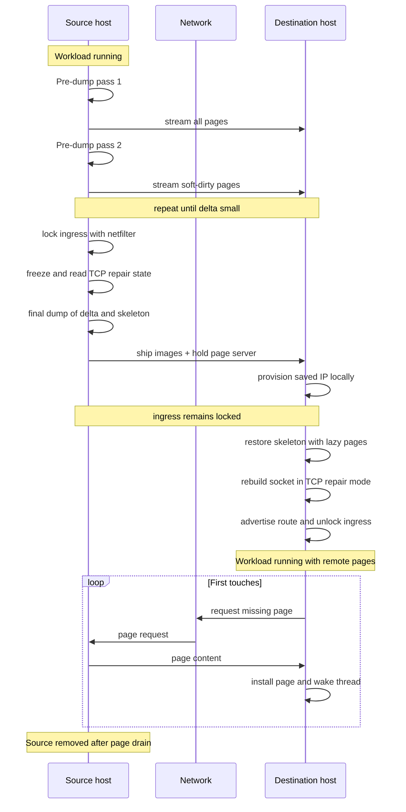

# Live Migration: Iterative, Lazy & TCP Repair

> **Goal:** understand how a multi-second freeze can, under favorable workload
> and network conditions, shrink to a much shorter cutover. A naive
> stop-dump-copy-restore migration pauses the workload for the whole transfer.
> This chapter dissects the three mechanisms that shrink downtime —
> soft-dirty pre-copy, userfaultfd post-copy, and TCP repair — each one a
> kernel primitive worth knowing on its own.

## The downtime equation

You have a process — or a whole container — running on host A. You want it
running on host B, and you want the outside world to barely notice. The
[Dumping a Process with CRIU](#/criu-dump) and
[Restoring a Process](#/criu-restore) chapters gave you the two halves:
serialize the task's state to an image set, ship the images, rebuild the task
on the far side. String them together and you have migration:

```text
host A:  criu dump --tree $PID --images-dir img/ --shell-job
         rsync -a img/  host-B:/img/
host B:  criu restore --images-dir /img/ --shell-job
```

Correct, and completely stop-the-world. Between the `dump` freezing the task
and the `restore` thawing it on B, the process is **dead**: it runs nowhere.
And the dominant term in that dead time is almost always memory. A task's
serialized state is a handful of small images — file descriptors, credentials,
signal handlers, the odd megabyte — plus one big thing: the contents of every
private anonymous page it owns. Ship a process with an 8 GB heap over a 10
Gbit/s link and you are frozen for at least

```text
downtime ≈ 8 GB / (10 Gbit/s) ≈ 6.4 s   (plus dump + restore + fs latency)
```

Six seconds of a hard pause is fine for a batch job and unacceptable for a
database, a game server, or anything with a client holding a socket open. The
entire craft of live migration is one question: **how do you move the memory
without the task being frozen while you do it?**

There are exactly two answers, and they are the same two answers the KVM world
reached for virtual machines (see
[KVM & Virtualization Internals](#/kvm-internals) — the concepts transfer
verbatim, only the primitives differ):

- **Pre-copy.** Copy memory *while the task keeps running on A*, then copy the
  small set of pages that changed during the copy, and repeat until the
  remaining delta is tiny. Freeze only for that last delta. The task runs on A
  until the final instant; the freeze is short because you only stop-and-copy
  what's left.
- **Post-copy.** Freeze A, ship the *minimal* state, and start the task on B
  **immediately** — before its memory has arrived. Pull each page over the
  network the first time B touches it. The task runs on B almost at once;
  memory trickles in on demand.

Pre-copy front-loads the work and keeps the source authoritative until the
end. Post-copy front-loads the switch and makes the destination authoritative
before the data has caught up. They have opposite failure semantics, opposite
latency profiles, and — this is the good part — they are built on completely
different kernel features. Pre-copy rides the **soft-dirty** PTE bit;
post-copy rides **userfaultfd**.

And neither of them helps at all with the one piece of state that doesn't
live in the process's address space: its open TCP connections. That needs a
third primitive, **TCP repair**. We'll take all three in turn.

## Pre-copy: iterative migration with soft-dirty

The idea is dead simple once you can answer one question cheaply: *which pages
has the task written since I last looked?* If you can ask that, the algorithm
writes itself:

```text
1. copy ALL pages to B                    (task still running on A)
2. ask: which pages changed during step 1?
3. copy just those                        (task still running)
4. changed set small enough?  no → goto 2
                              yes → freeze, copy the last delta, done
```

Each pass copies less than the one before, because each pass is shorter and so
fewer pages get dirtied during it. The freeze at the end covers only the final,
tiny delta. That's pre-copy.

### The soft-dirty bit

The kernel primitive that answers "which pages changed" is the **soft-dirty**
PTE bit, documented in
[Documentation/admin-guide/mm/soft-dirty.rst](https://elixir.bootlin.com/linux/v6.12/source/Documentation/admin-guide/mm/soft-dirty.rst).
It works in two moves:

**Reset.** Write `4` into `/proc/<pid>/clear_refs`. The kernel walks the task's
page tables and, for every private writable page, clears the soft-dirty bit
*and strips the write permission* from the PTE:

```bash
echo 4 > /proc/$PID/clear_refs      # clear soft-dirty, remap RO
```

**Detect.** The next time the task writes to one of those pages, the write
faults (the PTE is now read-only). The page-fault handler notices this is a
soft-dirty tracking fault, sets the soft-dirty bit *and* restores write
permission, and lets the write proceed. No signal, no visible stall — just a
minor fault that flips a bit. Later you read `/proc/<pid>/pagemap` and check
which pages have the bit set.

`pagemap` gives you one 64-bit entry per virtual page. The bits you care about:

```text
 63  present
 62  swapped
 61  file-page or shared-anon
 57  uffd-wp write-protected        ← we'll meet this one later
 56  page exclusively mapped
 55  pte is SOFT-DIRTY              ← "written since last clear_refs"
 0-54  page frame number (or swap offset)
```

Bit 55 is the whole game for pre-copy. Read the task's `pagemap`, collect every
page with bit 55 set, and you have the exact set of pages to re-send — no
guessing, no full re-scan of contents.

One caveat the kernel doc calls out and CRIU has to respect: if a task unmaps a
region and immediately maps fresh memory at the same address, the fresh PTEs
start out zeroed (soft-dirty clear) even though the *contents* are brand new.

To avoid silently missing that, the kernel marks any newly mapped or grown VMA
soft-dirty at the VMA level (`VM_SOFTDIRTY`), so the region is treated as fully
dirty until the next reset. Miss this and you'd ship stale data — which is why
you never hand-roll this and let CRIU drive it.

### `criu pre-dump` and `--track-mem`

CRIU wraps the whole dance in one action:
[criu pre-dump](https://github.com/checkpoint-restore/criu/blob/criu-dev/criu/cr-dump.c).
A pre-dump **freezes the task only long enough to snapshot its dirty pages,
then lets it run again** — it does not serialize the full process, it does not
kill the task, and its images *cannot be used for restore*. It exists purely to
move page contents ahead of time.

```text
# First pass: snapshot everything, arm the tracker, keep the task running.
criu pre-dump --tree $PID --images-dir img/1/ --track-mem

# Second pass: only pages dirtied since pass 1, referenced against it.
criu pre-dump --tree $PID --images-dir img/2/ --track-mem \
      --prev-images-dir ../1/

# ...repeat while the dirty set keeps shrinking...

# Final pass: freeze, grab the last delta, keep a rollback copy stopped.
criu dump --tree $PID --images-dir img/final/ --prev-images-dir ../N/ \
     --leave-stopped
```

Three flags do the work:

- **`--track-mem`** resets the soft-dirty tracker (the `echo 4` step) as part
  of the pre-dump, so the *next* pass can find only what changed.
- **`--prev-images-dir`** points at the previous pass's images. CRIU reads
  `pagemap`, and for any page whose soft-dirty bit is clear it writes a
  "this page is in a parent image" reference instead of the page body. The
  page images become a **chain** of deltas, each layer holding only what that
  pass dirtied — exactly the pattern from the memory-image internals in
  [Dumping a Process with CRIU](#/criu-dump).
- The final **`criu dump`** (no `--track-mem` needed on the last one) freezes
  the task and captures the residual dirty set, closing the chain into a
  restorable image. `--leave-stopped` is shown deliberately: an orchestrator
  can resume that source if destination restore fails, and kills it only after
  the destination is committed. A production runtime may implement this
  transaction through its own CRIU RPC lifecycle instead of this literal CLI.

Pair pre-dump with the page server (below) and the pages stream to host B as
they're captured, so by the time you freeze, almost everything is already
there.

### The convergence problem

Pre-copy has one failure mode, and it's the same one that bites VM live
migration: **a task that dirties pages faster than the link drains them never
converges.** If each pass takes long enough that the task re-dirties as much
memory as the pass just shipped, the "remaining delta" stops shrinking. You
iterate forever, freeze never gets short, and you've gained nothing.

```text
dirty rate (bytes/s)  vs  effective bandwidth (bytes/s)
   dirty < bandwidth   →  delta shrinks each pass, converges  ✔
   dirty ≥ bandwidth   →  delta stalls, never converges       ✘
```

Real implementations don't loop forever. They cap the iteration count or watch
the delta size, and when it won't shrink they **give up on convergence and just
freeze** — accepting a longer stop-and-copy for that pass — or they switch
strategy entirely and fall through to post-copy, which has no convergence
requirement at all. Which brings us to the deep end.

## Post-copy: lazy migration with userfaultfd

Post-copy inverts everything. You freeze the task on A, ship only the
*bookkeeping* — file descriptors, mappings, registers, credentials, the
skeleton — and start it on B before all eligible anonymous memory has arrived.
The initial cutover can be much shorter than a bulk memory copy. Then, the
first time it touches a page that isn't there yet, you pause *that one thread*,
fetch *that one page* from A over the network, drop it into place, and resume.
Memory arrives on demand, driven by what the task actually accesses.

For this to work you need a way to say: "this range of my address space is empty; when anyone touches it, *tell me* and let me fill it in — don't just hand them a zero page." That mechanism is **userfaultfd**.

### What userfaultfd is

Normally, page faults are the kernel's private business: a fault on a valid-but-not-present page gets resolved by the kernel (allocate a zero page, read from swap, fault in a file page) with userspace none the wiser. `userfaultfd(2)` **hands that resolution to a userspace process**. One process becomes the fault handler for a range of another's (or its own) address space: when a fault hits that range, instead of the kernel resolving it, a message appears on a file descriptor, and the handler decides what content to place there.

It's `mmap` of a signal handler's power, but as a pollable fd instead of a `SIGSEGV` handler — faster, race-free, and usable from a *different* process. The full API lives in
[Documentation/admin-guide/mm/userfaultfd.rst](https://elixir.bootlin.com/linux/v6.12/source/Documentation/admin-guide/mm/userfaultfd.rst)
and the implementation in
[fs/userfaultfd.c](https://elixir.bootlin.com/linux/v6.12/source/fs/userfaultfd.c)
plus [mm/userfaultfd.c](https://elixir.bootlin.com/linux/v6.12/source/mm/userfaultfd.c).

### The API walk

```c
/* 1. Create the userfault fd. */
int uffd = syscall(SYS_userfaultfd, O_CLOEXEC | O_NONBLOCK);

/* 2. Handshake: agree on API version and negotiate features. */
struct uffdio_api api = { .api = UFFD_API,
                          .features = UFFD_FEATURE_EVENT_FORK
                                    | UFFD_FEATURE_EVENT_REMAP
                                    | UFFD_FEATURE_EVENT_REMOVE };
ioctl(uffd, UFFDIO_API, &api);      /* kernel fills in what it supports */

/* 3. Register a range for missing-page faults. */
struct uffdio_register reg = {
    .range = { .start = base, .len = length },
    .mode  = UFFDIO_REGISTER_MODE_MISSING,
};
ioctl(uffd, UFFDIO_REGISTER, &reg);

/* 4. Loop: read fault events, fetch the page, resolve. */
struct uffd_msg msg;
read(uffd, &msg, sizeof msg);       /* blocks until a fault (or event) */
if (msg.event == UFFD_EVENT_PAGEFAULT) {
    void *page = fetch_from_source(msg.arg.pagefault.address);
    struct uffdio_copy copy = {
        .dst = msg.arg.pagefault.address & ~(PAGE_SIZE - 1),
        .src = (unsigned long)page,
        .len = PAGE_SIZE,
    };
    ioctl(uffd, UFFDIO_COPY, &copy); /* atomically place page, wake faulter */
}
```

The moving parts:

- **`UFFDIO_API`** enables the object and negotiates capabilities. The kernel
  returns bitmasks of the features and per-range ioctls it actually supports,
  so you never assume.
- **`UFFDIO_REGISTER`** with `UFFDIO_REGISTER_MODE_MISSING` arms the range for
  *missing-page* faults — the mode post-copy needs. (The other mode,
  `UFFDIO_REGISTER_MODE_WP`, arms *write-protect* faults — "tell me when this
  present page is written." That's a faster, race-free replacement for the
  `mprotect`+`SIGSEGV` trick, and it's how live *pre-copy* can also be done in
  userspace; keep it in mind as the mirror image of the soft-dirty bit.)
- **`read(uffd, ...)`** delivers a `struct uffd_msg`. For a fault, `msg.event`
  is `UFFD_EVENT_PAGEFAULT` and `msg.arg.pagefault.address` is the faulting
  address. The faulting thread is now parked inside the kernel, blocked, until
  you resolve it.
- **`UFFDIO_COPY`** atomically copies your supplied bytes into the target page
  *and* wakes the blocked thread — one ioctl, no window where the thread could
  see half a page. Its sibling `UFFDIO_ZEROPAGE` installs a zero page (for
  ranges you know are zero-filled, cheaper than copying zeros).

### Non-cooperative mode: watching a task that doesn't know

Here's the subtlety that makes CRIU possible. In the *simple* case, the process
being faulted-on is a willing participant — it created the uffd and registered
its own memory. But CRIU is restoring an arbitrary task that has **no idea it's
being monitored**, and that task will do things behind the monitor's back:
`fork()`, `mremap()`, `madvise(MADV_DONTNEED)`. If the monitor doesn't hear
about those, its model of the address space rots and it resolves faults into
the wrong place.

So userfaultfd grew a **non-cooperative mode**: a set of feature flags,
negotiated at `UFFDIO_API` time, that turn structural memory events into
messages on the same fd. They were added *specifically for CRIU*:

- **`UFFD_FEATURE_EVENT_FORK`** — when the monitored task forks, the child's
  address space is *also* covered: the parent's uffd context is duplicated for
  the child and a new fd is handed to the monitor, so the child's faults are
  served too.
- **`UFFD_FEATURE_EVENT_REMAP`** — an `mremap()` sends a message with old and
  new addresses, so the monitor can follow a range that moved.
- **`UFFD_FEATURE_EVENT_REMOVE`** — `madvise(MADV_DONTNEED)` /
  `MADV_REMOVE` sends a message, so the monitor knows a range was thrown away
  and shouldn't be faulted back in.
- (`UFFD_FEATURE_EVENT_UNMAP` completes the set for `munmap`.)

With these, one external daemon can serve faults for a process — and all its
forks — that is running normally and utterly unaware. That daemon is the heart
of CRIU's lazy restore.

### How lazy restore actually runs

Post-copy migration wires three CRIU roles together:

1. **Source page server.** On host A, after the (frozen) task's state is
   captured, a CRIU process stays resident holding all the task's pages,
   ready to serve them over TCP.
2. **Lazy-pages daemon.** On host B, `criu lazy-pages` runs a daemon that owns
   the userfaultfd for the restored task. It receives fault events and, for
   each faulting address, fetches the page from the source page server over
   the network and resolves it with `UFFDIO_COPY`.
3. **The restore.** On host B, `criu restore --lazy-pages` rebuilds the task —
   but for lazy-eligible anonymous memory it does **not** fill the pages.
   Instead it maps the ranges and registers them with the daemon's uffd. The
   task starts running immediately; its heap is a field of landmines, each one
   a not-yet-present page that will trap into the daemon on first touch.

```bash
# Host A — dump the non-page state and serve retained pages on this address.
criu dump --tree "$PID" --images-dir /img/ --lazy-pages \
  --address "$SOURCE_IP" --port 9999

# Copy the relatively small metadata images, not a complete page payload.
scp -r /img/ "host-b:/img/"

# Host B, terminal 1 — the fault-serving daemon (fetches from A):
criu lazy-pages --images-dir /img/ --page-server \
  --address "$SOURCE_IP" --port 9999 --work-dir /img/

# Host B, terminal 2 — use the same work directory for the control socket:
criu restore --images-dir /img/ --lazy-pages --work-dir /img/
```

The source `dump --lazy-pages` remains the page server for this one migration;
it cannot be discarded until the daemon has pulled every page. The explicit,
matching `--work-dir` values satisfy the daemon/restore control-socket
requirement even when the commands start from different shell directories.

The CRIU implementation of all of this is
[criu/uffd.c](https://github.com/checkpoint-restore/criu/blob/criu-dev/criu/uffd.c)
(the daemon and the fault loop) talking to
[criu/page-xfer.c](https://github.com/checkpoint-restore/criu/blob/criu-dev/criu/page-xfer.c)
(the page-server protocol).

### Latency character

Post-copy trades a long freeze for a **tail of first-touch latency**. Every
page the task hasn't seen yet costs fault handling plus at least one fetch from
A the first time it's touched: fault → message → network fetch →
`UFFDIO_COPY` → wake. The cost depends on the network, batching, page size
and scheduling; a cold-start workload that sweeps its whole heap pays it many
times in
the first seconds after the switch.

CRIU softens the tail two ways. First, **prefetch/prioritization**: the daemon
doesn't only react to faults — it also pushes pages proactively, and when a
fault does happen it can pull a *batch* of nearby pages on the assumption that
access is somewhat local.

Second, the pages already delivered by any earlier *pre-dump* passes are
present from the start, so post-copy is usually run *on top of* one or more
pre-copy passes: pre-copy moves the bulk cheaply while the task runs,
post-copy covers the residual so the freeze is near-zero and no convergence
is required. Best of both. The [userfaultfd lab](#/lab-userfaultfd) builds a
minimal fault-serving daemon by hand so you can watch a page arrive on
demand.

## TCP repair: migrating a live connection

Memory is handled. But a real server has open sockets, and a TCP connection is
**not** in the process's address space — it's kernel state: sequence numbers,
the send queue of un-acknowledged bytes, the receive queue of bytes not yet
`read()`, window sizes, negotiated options (MSS, window scale, SACK,
timestamps), timers. None of that shows up in a memory dump, and you cannot
`read()` it out through the socket API, because the socket API is *designed* to
hide it.

Worse, a TCP connection is a distributed object: the peer has half the state.
If you close the socket on A to migrate it, the kernel sends a FIN or RST and
the peer tears the connection down. From the peer's chair, the connection is
just *gone*. So the requirement is brutal: extract the full connection state
from A's kernel, recreate it byte-identically in B's kernel, and do it **without
the peer ever seeing a packet that says the connection ended.**

That's what **TCP repair** provides. It landed in Linux 3.5 (net/ipv4/tcp.c;
see [TCP_REPAIR](https://elixir.bootlin.com/linux/v6.12/C/ident/TCP_REPAIR))
built for exactly this — another kernel change driven by checkpoint/restore.

### Repair mode

`setsockopt(fd, SOL_TCP, TCP_REPAIR, &on)` puts a socket into **repair mode**,
which suspends the normal protocol machinery and lets you read and write the
internals directly. The two magic behaviors:

- In repair mode, **`connect()` sends no packets**. The socket jumps straight
  to `ESTABLISHED` without a handshake — because on the restore side the
  connection is *already* established; you're just re-inflating it, and a real
  SYN would confuse the peer.
- In repair mode, **`close()` sends no FIN/RST**. You can dismantle the socket
  on the dump side without telling the peer.

The knobs you use while in repair mode:

- **`TCP_REPAIR_QUEUE`** — select which queue you're about to operate on:
  `TCP_RECV_QUEUE` or `TCP_SEND_QUEUE`.
- **`TCP_QUEUE_SEQ`** — get/set the sequence number for the currently selected
  queue (the write side's next-seq, or the read side's next-expected).
- Ordinary **`recv(MSG_PEEK)`** / **`send()`** on a repair-mode socket now read
  and write the *selected queue's contents* — this is how you pull out the
  un-acked send buffer and the un-read receive buffer, and how you push them
  back on restore.
- **`TCP_REPAIR_WINDOW`** — get/set the window parameters (snd/rcv window,
  window clamp) so flow control resumes correctly.
- **`TCP_REPAIR_OPTIONS`** — restore the options negotiated at handshake time:
  MSS, window scale, SACK permitted, timestamps. These can never be
  re-negotiated (there's no handshake on restore), so they must be set
  explicitly.
- **`TCP_TIMESTAMP`** — read the current TCP timestamp on dump and set it on
  restore, compensating for the two hosts' different `jiffies` — otherwise the
  peer's PAWS check could discard your packets as old.

### Dump side, restore side

CRIU's socket logic lives in
[criu/sk-tcp.c](https://github.com/checkpoint-restore/criu/blob/criu-dev/criu/sk-tcp.c).
The two halves are mirror images:

```text
DUMP (host A)                        RESTORE (host B)
─────────────                        ────────────────
freeze the task                      socket()
lock the network (drop peer pkts)    TCP_REPAIR = on
TCP_REPAIR = on                      set TCP_REPAIR_OPTIONS
read seqs   (TCP_QUEUE_SEQ, both)    set seqs  (TCP_QUEUE_SEQ, both queues)
read queues (recv MSG_PEEK, both)    bind() to the original local address
read window (TCP_REPAIR_WINDOW)      connect() to peer   ← SILENT, no SYN
read options                         refill queues (send into each)
  → tcp-stream image                 set TCP_REPAIR_WINDOW
TCP_REPAIR = off / close (silent)    TCP_REPAIR = off  → connection live again
```

Turning repair mode off on the restore side triggers a window probe, and normal
traffic resumes. **From the peer's point of view, a successful cutover looks
like packet loss and a pause**, not a new connection. Whether the pause remains
inside the peer's retransmission tolerance depends on the actual cutover time
and TCP settings. The sequence numbers must line up so the next ACK fits the
saved window and the conversation can continue on a different machine.

### What must *also* be true

Repair mode reconstructs the connection's *kernel* state. Two things outside the
kernel still have to hold:

- **The peer must still reach the same IP.** TCP is addressed by the 4-tuple;
  restore recreates the socket bound to the *original* local address, so B must
  answer for A's IP. In practice that's an **IP takeover** (move a floating/VIP
  address to B and send a gratuitous ARP so the switch relearns the MAC), an
  **overlay/tunnel** that keeps the container's IP portable across hosts (the
  usual answer for [container runtimes](#/container-runtimes)), or a
  load-balancer re-point. This is a whole discipline; here it's one paragraph —
  just know that repair mode assumes it's solved.
- **The peer's packets must not hit a closed socket during the window.**
  Between dumping the socket on A and re-establishing it on B, an incoming
  segment landing on either kernel would draw a **RST** — instantly killing the
  connection you're trying to save. CRIU installs a **netfilter rule that drops
  packets from the peer** for the duration (its `--network-lock` mechanism;
  for a container it can lock the whole network namespace instead). The peer
  simply sees a few dropped packets and retransmits — TCP's normal behavior —
  until B is ready to answer. LWN's *TCP connection repair* write-up walks the
  original design if you want the primary source.

## Putting it together

A full container migration with near-zero downtime chains all three
mechanisms. The choreography, source to destination:



The destination must be able to `bind()` the saved local address before CRIU
rebuilds the socket. That can mean installing the address on an isolated
namespace/interface, or using a controlled non-local-bind setup, while ingress
is still locked. Only after the socket is ready does the orchestrator advertise
the route or send the gratuitous ARP and remove the packet lock.

The downtime — the interval where the task runs *nowhere* — covers the final
freeze, residual state transfer, restore and network cutover. Everything
expensive that can safely move happens either before it (pre-copy pages) or
after destination resume (post-copy pages). On a tuned compatible system that
can be far shorter than copying the whole address space, but it is a measured
property of the workload and deployment, not a universal millisecond promise.

### The porcelain

You rarely drive raw `criu` for this. The container runtimes wrap it. With
Podman:

```bash
# Source: checkpoint a running container to a portable archive.
podman container checkpoint webapp \
      --compress=gzip --export /tmp/webapp.tar.gz --tcp-established

# ship /tmp/webapp.tar.gz to the destination host, then:

# Destination: restore from the archive.
podman container restore --import /tmp/webapp.tar.gz --tcp-established
```

`--tcp-established` is the flag that opts the container's live TCP connections
into the repair-mode dance (off by default, because it only makes sense when
the network can be made to follow). For pre-copy, Podman exposes
`--pre-checkpoint` (a pre-dump that leaves the container running) and
`--with-previous` (a checkpoint that references the prior pre-checkpoint's
pages), mapping directly onto the `criu pre-dump` / `--prev-images-dir` chain
above. The [container runtimes](#/container-runtimes) chapter shows where these
sit in the runc/crun stack, and the [snapshot taxonomy](#/snapshot-taxonomy)
places migration alongside the other things "checkpoint" can mean.

## When each strategy wins

There's no universally best answer — the right one depends on your downtime
budget, how fast the workload dirties memory, the link, and what you're willing
to lose if a host dies mid-flight.

| | Stop-and-copy | Pre-copy (iterative) | Post-copy (lazy) |
|---|---|---|---|
| **Downtime** | full transfer time | short (final delta only) | minimal (skeleton only) |
| **Total data moved** | memory size × 1 | memory size + re-dirtied pages (can exceed 1×) | memory size × 1 |
| **Kernel primitive** | none | soft-dirty (bit 55) | userfaultfd |
| **Hates** | large memory | high dirty rate (may not converge) | latency-sensitive cold start (fault tail) |
| **Failure before destination commit** | resume retained source if the orchestrator kept it stopped | resume retained source; discard pre-copies | once B runs there may be no complete rollback point |
| **Source/network loss after B starts** | not applicable: B starts from a complete image | not applicable: B starts from the complete delta chain | **fatal until all missing pages reach B** |

The failure rows are the ones people underweight. **Pre-copy can support safe
rollback** because the source remains authoritative while the early passes
run; during final cutover the orchestrator must retain it in a stopped,
resumable state until B commits. A plain `criu dump` that kills the source does
not provide that guarantee by itself.

**Post-copy is a gamble:** the instant B starts executing, it creates state
the stopped source does not have while some pages still exist only on A.
Losing A or the link before the drain completes can strand B on its next
fault; losing B discards its new execution state. There is no single
complete, current copy to resume. Hybrid systems use pre-copy for the bulk
and accept that bounded post-copy risk window only for the residual tail.

Rules of thumb:

- **Small memory, downtime doesn't matter** (batch job, dev box): plain
  stop-and-copy. Don't over-engineer.
- **Large memory, low dirty rate** (idle-ish service, cache that's mostly
  read): pre-copy converges fast and stays safe. The default.
- **Large memory, high dirty rate** (busy database, write-heavy): pre-copy
  won't converge — lead with a couple of pre-copy passes to move the cold bulk,
  then post-copy the rest to cap the freeze.
- **Extremely tight downtime budget**: post-copy can bound the memory-transfer
  contribution, but restore and network cutover still have to be measured; you
  also accept its failure-semantics cost.

## Follow the code (CRIU & kernel v6.12)

**Soft-dirty / pre-copy**

- [Documentation/admin-guide/mm/soft-dirty.rst](https://elixir.bootlin.com/linux/v6.12/source/Documentation/admin-guide/mm/soft-dirty.rst)
  — the `clear_refs`=4 reset, the RO-remap fault, and the `VM_SOFTDIRTY`
  whole-VMA caveat.
- [Documentation/admin-guide/mm/pagemap.rst](https://elixir.bootlin.com/linux/v6.12/source/Documentation/admin-guide/mm/pagemap.rst)
  — the 64-bit entry layout; bit 55 is soft-dirty.
- CRIU [criu/mem.c](https://github.com/checkpoint-restore/criu/blob/criu-dev/criu/mem.c)
  reads `pagemap`, builds the dirty set, and writes the delta chain;
  [criu/cr-dump.c](https://github.com/checkpoint-restore/criu/blob/criu-dev/criu/cr-dump.c)
  is the `pre-dump` / `dump` driver.

**userfaultfd / post-copy**

- [fs/userfaultfd.c](https://elixir.bootlin.com/linux/v6.12/source/fs/userfaultfd.c)
  — the fd, the message queue, `UFFDIO_API`/`UFFDIO_REGISTER`, the
  non-cooperative fork/remap/remove events.
- [mm/userfaultfd.c](https://elixir.bootlin.com/linux/v6.12/source/mm/userfaultfd.c)
  — `UFFDIO_COPY`/`UFFDIO_ZEROPAGE` page installation.
- [Documentation/admin-guide/mm/userfaultfd.rst](https://elixir.bootlin.com/linux/v6.12/source/Documentation/admin-guide/mm/userfaultfd.rst)
  — the API contract and feature negotiation.
- CRIU [criu/uffd.c](https://github.com/checkpoint-restore/criu/blob/criu-dev/criu/uffd.c)
  (lazy-pages daemon + fault loop) and
  [criu/page-xfer.c](https://github.com/checkpoint-restore/criu/blob/criu-dev/criu/page-xfer.c)
  (page-server protocol).

**TCP repair**

- [net/ipv4/tcp.c](https://elixir.bootlin.com/linux/v6.12/source/net/ipv4/tcp.c),
  ident [TCP_REPAIR](https://elixir.bootlin.com/linux/v6.12/C/ident/TCP_REPAIR)
  — repair mode, the `getsockopt`/`setsockopt` handlers for
  `TCP_REPAIR_QUEUE`, `TCP_QUEUE_SEQ`, `TCP_REPAIR_WINDOW`,
  `TCP_REPAIR_OPTIONS`.
- CRIU [criu/sk-tcp.c](https://github.com/checkpoint-restore/criu/blob/criu-dev/criu/sk-tcp.c)
  — the dump/restore socket choreography and the network lock.

---

## Check your understanding

1. Why does a naive stop-dump-copy-restore migration freeze for so long, and
   what single quantity dominates the freeze?

<details><summary>Show answer</summary>

Because the task runs *nowhere* from the moment `dump` freezes it on the source
until `restore` thaws it on the destination — and that interval is dominated by
the time to transfer the task's memory (every private anonymous page). File
descriptors, credentials, and registers are tiny; an 8 GB heap over a 10 Gbit/s
link is ~6+ seconds of hard pause. Everything in this chapter exists to move
that memory while the task is *not* frozen.

</details>

2. In pre-copy, how does CRIU learn which pages to re-send on each pass, at the
   kernel level?

<details><summary>Show answer</summary>

Via the soft-dirty PTE bit. Writing `4` to `/proc/<pid>/clear_refs` clears the
bit and remaps the task's writable pages read-only; the next write faults, and
the fault handler sets soft-dirty (bit 55 in `/proc/<pid>/pagemap`) and
restores write access. Reading `pagemap` after a running interval yields
exactly the set of pages written since the reset. `criu pre-dump --track-mem`
does the reset; `--prev-images-dir` references the prior pass so only dirtied
pages get new bodies.

</details>

3. What is the convergence problem, and what do implementations do when
   pre-copy won't converge?

<details><summary>Show answer</summary>

If the task dirties pages faster than the link can ship them, the "remaining
delta" stops shrinking between passes — you'd iterate forever and never get a
short freeze. Implementations cap the iterations or watch the delta, then
either give up and accept a longer stop-and-copy freeze, or switch to post-copy
(which needs no convergence). Both are the same trade-offs KVM VM live
migration faces.

</details>

4. Explain, in API terms, how userfaultfd lets a task resume on the destination
   before its memory has arrived.

<details><summary>Show answer</summary>

The restore maps the anonymous ranges but doesn't fill them; it registers them
with a userfaultfd (`UFFDIO_REGISTER` / `UFFDIO_REGISTER_MODE_MISSING`). When
the running task touches an absent page, the faulting thread blocks in the
kernel and a `UFFD_EVENT_PAGEFAULT` message appears on the fd. The lazy-pages
daemon `read()`s it, fetches that page from the source over TCP, and calls
`UFFDIO_COPY` to atomically install the page and wake the thread. The task can
resume after the metadata restore without waiting for every eligible page;
memory arrives on first touch and through background fetching.

</details>

5. Why does CRIU need userfaultfd's non-cooperative feature flags, and what do
   they report?

<details><summary>Show answer</summary>

Because CRIU serves faults for a task that doesn't know it's monitored and will
mutate its own address space. `UFFD_FEATURE_EVENT_FORK` extends coverage to
children (duplicating the uffd context and handing the monitor a new fd),
`UFFD_FEATURE_EVENT_REMAP` reports `mremap()`, and `UFFD_FEATURE_EVENT_REMOVE`
reports `madvise(MADV_DONTNEED/MADV_REMOVE)`. Without them the monitor's model
of the address space would drift and it would fault pages into the wrong place
or resurrect discarded ranges. These features were added specifically for
CRIU.

</details>

6. A live TCP connection isn't in the process's memory. How does TCP repair
   move it without the peer noticing, and what makes `connect()`/`close()`
   special in repair mode?

<details><summary>Show answer</summary>

`setsockopt(TCP_REPAIR)` suspends normal protocol handling so userspace can
read/write the connection's internals: sequence numbers (`TCP_QUEUE_SEQ` per
`TCP_REPAIR_QUEUE`), the send/recv queue contents (via `send`/`recv MSG_PEEK`),
window (`TCP_REPAIR_WINDOW`), and negotiated options (`TCP_REPAIR_OPTIONS`). In
repair mode, `connect()` sends no SYN (the connection is already established,
just being re-inflated) and `close()` sends no FIN/RST (so the peer isn't told
it ended). Turn repair off on the destination and traffic resumes; the peer saw
only a brief pause.

</details>

7. During the migration window, why would the connection die without a
   netfilter rule, and what does CRIU install?

<details><summary>Show answer</summary>

Between dumping the socket on the source and re-establishing it on the
destination, any segment the peer sends could land on a kernel with no matching
socket, which replies with a RST — killing the connection. CRIU installs a
netfilter rule (its `--network-lock`) that *drops* packets from the peer for
the duration (or locks the whole network namespace for a container). The peer
just retransmits, TCP-normally, until the destination can answer.

</details>

8. Under what orchestration condition can pre-copy support safe rollback, and
   why is post-copy still a gamble?

<details><summary>Show answer</summary>

During pre-copy's iterative passes the source remains authoritative. For safe
rollback at final cutover, the orchestrator must keep that source stopped and
resumable until the destination reports a successful commit; a default dump
that kills it is not enough. In post-copy, B starts mutating state while some
pages still exist only on A. Losing B discards its new state, while losing A
or the link can strand B on a missing-page fault, so no single complete,
current rollback copy necessarily exists. Hybrid migration limits this risk to
the residual tail.

</details>

---

## Sources & further reading

- CRIU wiki, [Memory changes tracking](https://criu.org/Memory_changes_tracking)
  — soft-dirty, `clear_refs`, `--track-mem`, `--prev-images-dir`, the
  incremental-dump chain.
- CRIU wiki, [Lazy migration](https://criu.org/Lazy_migration) — post-copy,
  `criu lazy-pages`, `--lazy-pages`, the page-server split.
- CRIU wiki, [TCP connection](https://criu.org/TCP_connection) — the repair-mode
  sockopts, queue extraction, and network lock in practice.
- CRIU wiki, [Live migration](https://criu.org/Live_migration) — the end-to-end
  choreography and the page-server/pre-dump pipeline.
- LWN, [TCP connection repair](https://lwn.net/Articles/495304/) — Pavel
  Emelyanov's original design: repair mode, silent `connect()`, queue and
  sequence-number save/restore.
- LWN, [The userfaultfd() system call](https://lwn.net/Articles/615086/) and
  [Non-cooperative userfaultfd](https://lwn.net/Articles/718198/) — the API and
  the fork/remap/remove events built for CRIU.
- Kernel docs:
  [soft-dirty.rst](https://elixir.bootlin.com/linux/v6.12/source/Documentation/admin-guide/mm/soft-dirty.rst),
  [pagemap.rst](https://elixir.bootlin.com/linux/v6.12/source/Documentation/admin-guide/mm/pagemap.rst),
  and
  [userfaultfd.rst](https://elixir.bootlin.com/linux/v6.12/source/Documentation/admin-guide/mm/userfaultfd.rst).

**Next:** we've used "checkpoint," "snapshot," and "migration" almost
interchangeably — but they're not the same thing, and the differences matter.
[The Snapshot Taxonomy](#/snapshot-taxonomy) sorts them out.
