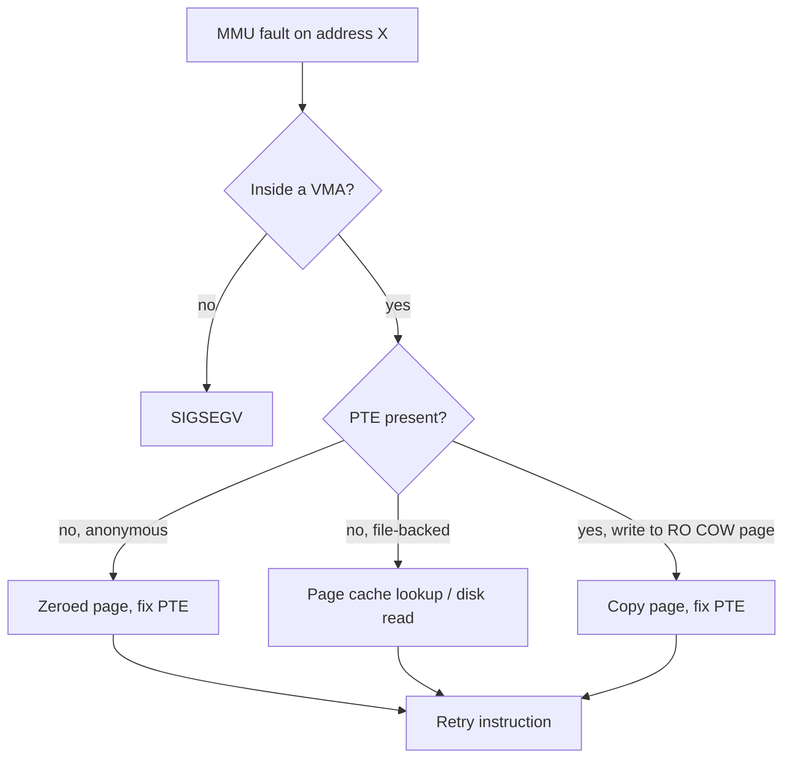

# Virtual Memory

> **Goal:** understand the illusion every process lives in — a private address
> space — and the machinery behind it: pages, page tables, page faults, the
> page cache, swap, and the OOM killer. This chapter explains more everyday
> mysteries ("where did my RAM go?") than any other.

## The illusion

Every process believes it has a private, contiguous memory range starting at
(almost) zero, gigabytes wide, all to itself. All of them believe this
*simultaneously*. None of it is physically true.

The trick: processes only ever use **virtual addresses**. On every single
memory access, the CPU's **MMU** (Memory Management Unit) translates virtual →
physical using **page tables** that the kernel maintains per process.

```text
Process A: virtual 0x4000 ──┐
                             ├─► page tables ─► physical RAM
Process B: virtual 0x4000 ──┘        (different pages!)
```

Two processes can use the *same* virtual address for *different* physical
memory — or for the *same* physical page (that's shared memory and COW).
Translation happens in hardware, cached by the **TLB**, at full speed.

Memory is managed in **pages**. On x86-64 the base page is 4 KiB, full stop.
arm64 is more flexible: the kernel can be built for 4, 16, or 64 KiB base
pages (most arm64 distros ship 4 KiB; Red Hat's aarch64 kernels used 64 KiB
for years, and Apple Silicon runs 16 KiB natively). Everything below —
mapping, faulting, swapping, caching — moves in units of pages.

### How the hardware does it (x86-64)

The MMU walks page tables on every memory access that misses the TLB:

```text
virtual address = 48 bits → 256 TiB of address space,
split in half: 128 TiB for user space, 128 TiB for the kernel

[ 9 bits: PGD ] [ 9 bits: PUD ] [ 9 bits: PMD ] [ 9 bits: PTE ] [ 12 bits: offset ]
   (level 4)       (level 3)       (level 2)       (level 1)      (4 KiB page)

Huge pages shortcut the walk:
- 2 MiB pages: skip the PTE level (PMD entry points directly at the frame)
- 1 GiB pages: skip PTE + PMD (PUD entry points directly at the frame)
```

Each level is itself one 4 KiB page holding 512 eight-byte entries — that's
where the 9 bits come from (2⁹ = 512). A full 4-level walk is four dependent
memory reads. The final PTE holds the physical frame number plus permission
bits: present, writable, user-accessible, no-execute (NX), dirty, accessed.
The *dirty* and *accessed* bits are set by the hardware itself, and the
kernel's reclaim code reads them to learn which pages are hot.

The **TLB** (Translation Lookaside Buffer) caches recent translations so the
walk is skipped for hot pages. A modern x86 core has a small L1 TLB (~64
entries for data, ~128 for instructions) and a unified L2 TLB (~1,500–2,000
entries). A TLB miss costs roughly 10–100 cycles; the hardware page walker
fetches the translation while the core continues speculatively.

Do the arithmetic and you see why huge pages matter: 2,000 TLB entries × 4 KiB
= only ~8 MiB of *TLB reach*. Any working set bigger than that misses
constantly. Mapping 1 GiB with 2 MiB pages needs 512 TLB entries instead of
262,144.

One more cost worth knowing: on a context switch the kernel loads the new
process's top-level table into the `CR3` register, which historically flushed
the whole TLB. Modern CPUs tag entries with a **PCID** (process-context ID) so
translations from several address spaces coexist — one reason switching
between *threads* of one process (same `mm_struct`, no CR3 write) is cheaper
than switching between processes (see [Processes & Threads](#/processes)).

### 5-level paging (kernel 4.14+)

x86-64 CPUs with the LA57 feature add a 5th level (P4D above PGD) for 57-bit
virtual addresses — 128 PiB. The kernel has supported it since 4.14 and uses
it automatically when the hardware offers it, but keeps 4-level layout
otherwise; the P4D level is folded away at compile time on most machines.

```bash
grep -E 'address sizes' /proc/cpuinfo | head -1   # "48 bits virtual" = 4-level
getconf PAGE_SIZE                                  # 4096 on x86-64
```

## The kernel's bookkeeping: `mm_struct` and VMAs

The page tables are the hardware's view. The kernel's own view of an address
space lives in [`struct mm_struct`](https://elixir.bootlin.com/linux/v6.12/C/ident/mm_struct)
(one per process; threads share it — that's practically the *definition* of a
thread, see [Processes & Threads](#/processes)). The fields that matter:

- `pgd` — pointer to the top-level page table (what gets loaded into CR3);
- `mm_mt` — a **maple tree** holding all the VMAs (below);
- `mmap_lock` — the reader/writer semaphore protecting the whole layout;
- `total_vm`, `rss_stat` — the counters behind VSZ and RSS in `ps`.

Each contiguous region with uniform properties — the code of `libc`, your
heap, one `mmap()` call — is a
[`struct vm_area_struct`](https://elixir.bootlin.com/linux/v6.12/C/ident/vm_area_struct)
(**VMA**). Its key fields:

- `vm_start`, `vm_end` — the virtual range (end exclusive);
- `vm_flags` — `VM_READ`, `VM_WRITE`, `VM_EXEC`, `VM_SHARED`, …;
- `vm_file` + `vm_pgoff` — which file (and offset) backs it, or NULL for
  anonymous memory;
- `vm_ops` — a table of callbacks; `vm_ops->fault` is what runs when a page
  fault lands in this VMA.

Every line in `/proc/<pid>/maps` is one VMA. When a fault arrives, the
kernel's first question is "which VMA covers this address?" — for two decades
that lookup used a red-black tree, but **since 6.1 VMAs live in a maple tree**,
an RCU-safe B-tree variant built for ranges. Building on that, **6.4 added
per-VMA locking**: most faults now take a lock on just the one VMA instead of
the whole `mmap_lock`, which removed a notorious bottleneck for multithreaded
programs faulting in parallel (locking strategy is a theme —
see [Kernel Synchronization](#/kernel-sync)).

A busy process has dozens to a few hundred VMAs; check yours:

```bash
wc -l /proc/self/maps
```

## The address space layout

```bash
cat /proc/self/maps | head -20
```

```text
address range          perms  what
55d0e2a00000-...       r-xp   /usr/bin/cat        ← code (text), read-only+exec
55d0e2c1f000-...       rw-p   /usr/bin/cat        ← globals (data)
55d0e4521000-...       rw-p   [heap]              ← malloc() arena, grows up
7f6f12000000-...       r-xp   /lib/.../libc.so.6  ← shared libraries
7ffd9c8e0000-...       rw-p   [stack]             ← grows down
7fff...                r-xp   [vdso]              ← kernel-injected fast syscalls
```

Key observations:

- The C library appears in *every* process's maps — but it's the **same
  physical pages**, mapped into everyone. Shared libraries are "shared" in the
  most literal sense.
- `malloc()` is **not a syscall** — it's a glibc allocator managing the heap,
  asking the kernel for big chunks via `brk`/`mmap` only when necessary.
  Small `malloc(16)` = carved from the heap; large `malloc(1 MiB)` = its own
  anonymous `mmap` (glibc's threshold, `M_MMAP_THRESHOLD`, defaults to
  128 KiB).
- Those base addresses are randomized on every exec — **ASLR** (address space
  layout randomization, `kernel.randomize_va_space = 2` by default) shuffles
  the stack, heap, mmap base, and (for PIE binaries) the code itself, to make
  exploit targets unpredictable (see
  [Linux Security & Confinement](#/security-hardening)).
- Each mapping has permissions (`r`,`w`,`x`). Jump into a non-executable page
  or write to a read-only one → CPU exception → `SIGSEGV`. Segfault =
  **the MMU catching you touching a page in a way the page tables forbid**
  (delivery of that signal is covered in [Signals](#/signals)).

```bash
cat /proc/self/maps | awk '{print $2}' | sort | uniq -c  # count permission combos
```

## Page faults: the engine, not the error

The kernel is *lazy*. When you `mmap()` a file or `malloc()` 1 GB, it doesn't
allocate physical memory — it just records the promise as a VMA ("this range
is valid, file-backed at offset X" or "anonymous zero-fill"). Physical pages
appear on demand:

1. You touch an address with no valid PTE behind it.
2. The MMU traps into the kernel (**page fault** — on x86 this is exception
   #14; the fault address arrives in the `CR2` register).
3. The kernel checks: is this address inside a VMA, with compatible
   permissions?
   - **Yes** → allocate/fetch a page, fix the page table, resume the process
     *at the exact same instruction*, which now succeeds. The process never
     notices. This is a *normal* event — millions per minute on a busy box.
   - **No** → `SIGSEGV`.



Two flavours, and the difference is the whole game:

- **minor fault** — fixed without disk I/O (fresh zero page, or the page was
  already in RAM, e.g. a shared library someone else loaded, or a COW page
  that needed copying). Cost: on the order of **1 µs**.
- **major fault** — required reading from storage (first touch of a file page,
  or swapped-out memory coming back). Cost: **tens of microseconds on NVMe,
  milliseconds on a hard disk** — three to four orders of magnitude worse.
  When people say "the machine is thrashing," they mean it's doing almost
  nothing but major faults.

```bash
ps -o min_flt,maj_flt,comm -p $$       # your shell's fault counts
/usr/bin/time -v ls 2>&1 | grep -i fault
grep -E 'pgfault|pgmajfault' /proc/vmstat   # system-wide since boot
```

### Copy-on-write: how `fork()` is cheap

`fork()` duplicates a whole address space — and returns in well under a
millisecond even for a 10 GB process. The trick is **copy-on-write (COW)**:
instead of copying pages, the kernel copies only the *page tables*, marks
every writable private page **read-only in both parent and child**, and bumps
each page's reference count. Reads proceed at full speed on shared pages.
The first *write* by either side faults; the fault handler
([`do_wp_page()`](https://elixir.bootlin.com/linux/v6.12/C/ident/do_wp_page))
sees a write to a read-only page inside a writable VMA, copies that one 4 KiB
page, points the writer's PTE at the private copy, and restores write
permission. Pages nobody writes are never copied at all.

COW is everywhere: `fork()`, KSM-merged pages (below), and the zero page —
the kernel keeps a single page of zeroes, and a *read* fault on untouched
anonymous memory just maps that shared zero page read-only. Your 8 GB
`malloc` that was only read costs almost nothing physical.

The PTE machinery that makes COW possible also gives checkpoint tools a cheap
way to notice writes. Linux can clear a page's **soft-dirty** PTE bit and
temporarily remove write permission; the next write takes a minor fault that
marks the page soft-dirty and makes it writable again. No COW copy is required
for an exclusively owned page — the fault is just the observation point. That
distinction is what makes iterative pre-copy practical.

This laziness has a famous consequence, **overcommit**: Linux happily promises
more memory than physically exists (`malloc` virtually never fails), betting
that most promises aren't fully used. Mostly the bet pays. When it doesn't…
see "OOM killer" below.

The `vm.overcommit_memory` sysctl controls this:
- `0` (default): heuristic overcommit — refuse only obviously absurd requests.
- `1`: always overcommit (for workloads that know what they're doing —
  sparse arrays, some databases).
- `2`: never overcommit — allocations fail once *committed* memory reaches
  swap + RAM × `overcommit_ratio` (default 50%). Used on very conservative
  systems.

```bash
cat /proc/sys/vm/overcommit_memory
grep -E 'CommitLimit|Committed_AS' /proc/meminfo   # the running total of promises
```

## Memory through a checkpointer's eyes

The normal memory question is: *can this address be accessed now?* A
checkpointer asks three more precise questions:

1. Which virtual ranges must exist again?
2. Which pages currently have meaningful contents?
3. Which pages changed after an earlier copy?

Linux exposes one mechanism for each layer of that inventory.

### VMAs describe shape; pagemap describes pages

`/proc/<pid>/maps` and `smaps` describe the address-space **shape**: each VMA's
range, permissions, file offset, and backing file. They do not say whether an
individual 4 KiB page is resident, swapped out, shared, or never touched. A
1 TiB sparse mapping can therefore occupy one line in `maps` and almost no
physical memory.

`/proc/<pid>/pagemap` supplies the page-granular view. It is a binary array of
64-bit entries, one per virtual page. In kernel 6.12 the important high bits
include present (63), swapped (62), file-backed/shared-anonymous (61),
exclusive (56), and soft-dirty (55). A dumper walks the VMAs, indexes pagemap
by virtual page number, and copies the pages that actually need bytes in the
image. Clean file-backed pages usually need only a reference to the file; an
anonymous dirty page has no other source and must be saved.

Do not try to `cat` pagemap: offsets and entries are binary, and exposing raw
physical frame numbers would create security side channels. Modern kernels
zero the PFN field unless the reader has the required privilege. The useful
exercise is to inspect the decoded result through CRIU's own images in
[Lab: Checkpoint & Restore a Real Process](#/lab-criu), then write a small
pagemap decoder when you want to study the ABI itself.

### Soft-dirty answers “what changed?”

For iterative migration, copying every resident page on every pass would gain
nothing. Linux therefore lets a privileged observer reset the soft-dirty bit
for an address space:

```bash
pid=48213
echo 4 | sudo tee /proc/$pid/clear_refs >/dev/null
# let the process run, then decode bit 55 in /proc/$pid/pagemap
```

Writing `4` clears the soft-dirty PTEs and write-protects writable mappings.
On each page's first subsequent write, the page-fault path sets bit 55 and
restores write permission; later writes run normally. A pre-copy loop can now
copy the full resident set once, clear the tracker, and copy only soft-dirty
pages on later passes. CRIU's `pre-dump` and `--track-mem` automate that loop.
New or expanded VMAs are treated as soft-dirty too, so a mapping created
between passes cannot silently escape the next delta.

Soft-dirty is a change detector, not a transaction log. It tells you that a
page changed at least once, not how many times or which bytes changed. A
workload that dirties memory faster than the network can copy it may never
converge; [Live Migration](#/live-migration) develops that dirty-rate equation
and the switch from pre-copy to the final freeze.

### userfaultfd answers “what if the page is not here yet?”

Restore normally installs every saved page before the task runs. With
**userfaultfd**, userspace can register a virtual range and receive selected
page faults as messages on a file descriptor. A manager thread or separate
daemon then resolves each fault with an ioctl:

```text
target touches a missing page
    → kernel parks the faulting thread
    → manager reads UFFD_EVENT_PAGEFAULT from the userfaultfd
    → manager fetches or constructs the page
    → UFFDIO_COPY installs it and wakes the target
```

This reverses the usual relationship: the kernel still detects and blocks the
fault, but userspace chooses the bytes. CRIU uses the mechanism for **lazy
restore** — rebuild the task's metadata, let it resume early, and fetch saved
pages from the source when first touched while a background copy drains the
rest. The cost moves from one long stop-the-world pause to short first-touch
stalls, potentially including a network round trip.

Keep the three interfaces separate:

| Interface | Question it answers | Checkpoint use |
|---|---|---|
| `/proc/<pid>/maps` | Which VMAs exist? | rebuild the address-space layout |
| `/proc/<pid>/pagemap` + soft-dirty | Which pages exist, and which changed? | full and incremental dumps |
| `userfaultfd` | How can userspace resolve a missing page? | lazy/post-copy restore |

You will drive the last interface yourself in [Lab: Serve Page Faults from
Userspace](#/lab-userfaultfd). Together these mechanisms turn the abstract VMA
and PTE model into a serializable, migratable process.

## The page cache: where your RAM "goes"

Run `free -h` and behold the most misunderstood line in Linux:

```text
               total        used        free      buff/cache   available
Mem:           31Gi        8Gi        1.2Gi        22Gi        21Gi
```

Only 1.2 GB free?! Relax — 22 GB is the **page cache**: every file read or
written is kept cached in RAM, because RAM (~100 ns) is thousands of times
faster than even NVMe (~50–100 µs per read), and free RAM is wasted RAM. The
cache is evicted whenever a process needs memory. **`available` is the
truthful number** — it estimates how much could be allocated without swapping,
counting reclaimable cache.

Internally, each cached file has a
[`struct address_space`](https://elixir.bootlin.com/linux/v6.12/C/ident/address_space)
hanging off its inode (see [Files, Filesystems & the VFS](#/filesystems)).
Its `i_pages` field is an **XArray** — a radix-tree-like index mapping *file
offset → cached page* — and `a_ops` points to the filesystem's read/write
callbacks. Since the **folio** conversion (kernel 5.16 onward), the page
cache tracks [`struct folio`](https://elixir.bootlin.com/linux/v6.12/C/ident/folio)
objects — a folio is "one or more contiguous pages managed as a unit," which
lets the cache hold 16 KiB or 64 KiB chunks of a file with one object instead
of 4–16 separate `struct page`s, cutting per-page overhead on big files.

The page cache explains everyday magic:

- Second `grep` through a big tree is instant — pages already cached. (Watch
  this live in the [page cache lab](#/lab-page-cache).)
- `write()` returns immediately: it wrote to cache (the page is now *dirty*);
  the kernel flushes dirty pages to disk in the background seconds later.
  That's why yanking power can lose data, and what `sync`/`fsync` are *for*
  (databases call `fsync` precisely to force durability — the journey from
  dirty page to platter continues in [The Linux Storage Stack](#/storage-stack)).
- `mmap` of a file = the same page cache, just mapped into user space. No
  second copy. `read()`/`write()` use the same pages as `mmap`.

```bash
grep -E 'Dirty|Writeback|Cached|Buffers' /proc/meminfo
free -h -w         # more detail on buff/cache split
```

### The writeback machinery

Per-device writeback workers (they show up as `kworker` threads, driven by
`fs/fs-writeback.c`) flush dirty pages in the background. The knobs that
control urgency:

```bash
cat /proc/sys/vm/dirty_background_ratio  # default 10: % of RAM dirty → start background flush
cat /proc/sys/vm/dirty_ratio             # default 20: % dirty → writers are throttled/block
cat /proc/sys/vm/dirty_expire_centisecs  # default 3000: pages dirty >30 s get written regardless
cat /proc/sys/vm/dirty_writeback_centisecs # default 500: wake the flusher every 5 s
```

The failure mode to recognize: a server with lots of RAM, heavy writes, and
default ratios can accumulate *gigabytes* of dirty pages (20% of 256 GB is
51 GB), then hit `dirty_ratio` and stall every writer while the storage
grinds through the backlog — multi-second latency spikes out of nowhere.
Write-heavy servers usually switch to the absolute knobs
(`dirty_background_bytes` / `dirty_bytes`) and cap the backlog at a few
hundred MB.

## Swap and reclaim

When memory gets tight, the kernel **reclaims** pages, cheapest first:

1. clean page-cache pages — droppable instantly (re-readable from disk);
2. dirty page-cache pages — flush, then drop;
3. **anonymous** memory (heaps, stacks) — has no file behind it, so the only
   way to reclaim it is to write it to **swap**.

### Who reclaims, and when

Each memory zone has three **watermarks**: `high`, `low`, `min` (derived from
`vm.min_free_kbytes`, visible in `/proc/zoneinfo`). The kernel daemon
**kswapd** (one per NUMA node) wakes when free memory dips below `low` and
reclaims in the background until it's back above `high` — processes don't
wait. If allocations outrun kswapd and free memory falls below `min`, the
allocating process itself gets drafted: **direct reclaim**, where your
`malloc`-touching thread synchronously frees pages before its allocation can
proceed. Direct reclaim is where "the system feels like molasses" lives —
watch for `pgscan_direct` climbing in `/proc/vmstat` (and see
[Performance Analysis Methodology](#/perf-methodology) for how to reason
about it).

### How the kernel picks victims

Classically, pages sit on per-node **active/inactive LRU lists** (one pair
for file pages, one for anonymous). Referenced pages get promoted to the
active list; reclaim scans the inactive tail, using the hardware
*accessed* bit to give recently-touched pages a second chance. Since kernel
6.1 there's a better replacement available: **MGLRU** (multi-generational
LRU), which sorts pages into generations by recency and scans page tables
directly instead of chasing the accessed bit page-by-page. It's a build-time
option (`CONFIG_LRU_GEN`), runtime-toggled at
`/sys/kernel/mm/lru_gen/enabled`; several distros ship it on by default as of
2026 — check yours.

Swap isn't "emergency overflow that means you need more RAM" — modest swap
lets the kernel evict the gigabytes of *never-touched* allocations every
system carries, freeing real RAM for the page cache. Heavy, *sustained*
swapping (thrashing) is the pathology, not swap usage per se. Modern setups
soften the cliff further with **zswap** (compress swapped pages into a RAM
pool before touching disk) — many distros enable it by default.

`vm.swappiness` (0–200 since kernel 5.8, default 60) controls the *relative
balance* between reclaiming file-backed pages vs swapping anonymous pages.
Lower = prefer dropping file cache; above 100 = actively prefer swapping
anon (sensible when swap is on fast NVMe or zswap).

```bash
swapon --show; vmstat 1 5     # si/so columns = swap in/out per second
cat /proc/sys/vm/swappiness
grep -E 'pgscan_kswapd|pgscan_direct|pswpin|pswpout' /proc/vmstat
```

> **Container link:** cgroup v2 gives every container its own miniature
> version of this machinery — `memory.high` triggers per-group reclaim
> (throttling, not killing) and `memory.max` is the hard wall. See
> [Control Groups](#/cgroups) and the [cgroup limits lab](#/lab-cgroup-limits).

## Physical memory: zones, NUMA, and allocators

Virtual memory is the interface processes see; physical memory is the machine
the kernel must actually manage. RAM is divided into **page frames**, and each
frame has a [`struct page`](https://elixir.bootlin.com/linux/v6.12/C/ident/page)
describing its state — 64 bytes of dense, heavily-unioned metadata (`flags`,
`_refcount`, `_mapcount`, and a `mapping`/`lru` union) for every 4 KiB frame.
That's ~1.6% of all RAM spent just *describing* RAM: on a 64 GB machine, about
1 GB of `struct page` arrays.

Physical pages are grouped by constraints:

```text
node 0                         node 1              ← NUMA locality
├── DMA / DMA32 zones           ├── DMA32
├── Normal zone                 ├── Normal
└── Movable / device zones      └── Movable / device
```

Zones exist because old hardware could only DMA into low addresses (`DMA` =
first 16 MB, `DMA32` = first 4 GB); `Normal` is everything else. NUMA nodes
exist because on multi-socket machines, memory attached to the *other* socket
is ~1.5–2× slower to reach — the allocator prefers the local node
(full story in [NUMA Deep Dive](#/numa-deep-dive)).

The **buddy allocator** manages free frames in power-of-two blocks
(orders 0–10: 4 KiB up to 4 MiB on x86-64). Freeing a block coalesces it with
its "buddy" — the adjacent block of the same size — back into a bigger block,
which fights fragmentation but can't eliminate it: after weeks of uptime,
finding a *contiguous* 2 MiB block can require **compaction** (migrating
movable pages to defragment). That's why `/proc/buddyinfo`'s high-order
columns drain toward zero on long-lived systems.

Kernel objects are usually much smaller than a page: dentries, inodes,
sockets, `task_struct`s, VMAs. Those come from the **slab allocator**, which
carves pages from the buddy into caches of same-sized, pre-initialized
objects. As of kernel 6.12 there is exactly one implementation: **SLUB**
(SLOB was removed in 6.4, the original SLAB in 6.8 — "slab" survives only as
the generic term).

You can see this world directly:

```bash
cat /proc/buddyinfo             # free blocks per zone, by order (columns = 4K,8K,...,4M)
cat /proc/pagetypeinfo          # movable/unmovable/reclaimable split
sudo slabtop -o                 # kernel object caches, live
numactl --hardware              # NUMA nodes and distances
```

This is where some "mysterious" memory usage lives. Kernel memory is not
process RSS, but it is real RAM. Millions of dentries and inodes (from a
`find /` sweep), conntrack entries, or eBPF maps
(see [eBPF Internals](#/ebpf-internals)) consume memory outside the simple
"application heap" story. Look at `Slab:` and `SReclaimable:` in
`/proc/meminfo` — reclaimable slabs (dentry/inode caches) are freed under
pressure, just like the page cache.

## Transparent Huge Pages

The page size you meet first is 4 KiB, and TLB reach at 4 KiB is tiny (see
above). **Transparent Huge Pages** (THP) automatically promote suitable
anonymous regions to 2 MiB pages — both at fault time (a 2 MiB-aligned VMA
region can be faulted in as one huge page) and in the background, where the
`khugepaged` thread scans memory and *collapses* runs of 512 contiguous 4 KiB
pages into one huge page. Since 6.8, **multi-size THP (mTHP)** extends this
to intermediate sizes (16 KiB, 64 KiB, …) configured per-size under
`/sys/kernel/mm/transparent_hugepage/hugepages-*kB/`.

```bash
cat /sys/kernel/mm/transparent_hugepage/enabled    # [always] madvise never
grep -E 'AnonHugePages|ShmemPmdMapped|FilePmdMapped' /proc/meminfo
grep thp /proc/vmstat | head                       # alloc successes/failures, collapses
```

Huge pages improve throughput by cutting TLB misses — commonly 5–15% on
big-working-set workloads. They can also hurt: compaction stalls while the
kernel hunts for contiguous 2 MiB blocks, latency spikes when COW must split
or copy a huge page, and memory bloat when 2 MiB is resident for a structure
that touches 8 KiB of it. This is why database docs (PostgreSQL, MongoDB,
Redis) historically said "disable THP" — advice written when `always` mode
plus aggressive compaction caused multi-millisecond stalls. The modern middle
ground is `madvise`: only regions the application explicitly marks with
`madvise(MADV_HUGEPAGE)` get huge pages. The production rule stands: measure
TLB misses and compaction stalls for *your* workload, don't guess.

```bash
perf stat -e dTLB-load-misses,dTLB-store-misses -p <pid> -- sleep 30
```

Latency-critical systems often skip THP entirely and pre-reserve *explicit*
hugetlbfs pages (`HugePages_Total` in `/proc/meminfo`) — guaranteed 2 MiB or
1 GiB pages, no compaction, no surprises. That's standard practice for
DPDK and for VM guest memory (see [KVM Internals](#/kvm-internals)).

## KSM: deduplicating identical pages

**Kernel Same-page Merging** scans opted-in anonymous memory
(`madvise(MADV_MERGEABLE)`) for byte-identical pages and merges them into a
single read-only COW page; a later write triggers an ordinary COW fault and
un-shares. Twenty VMs running the same guest OS have thousands of identical
pages — this is the hypervisor's trick (QEMU marks guest RAM mergeable), and
it can reclaim 10–50% of guest memory in homogeneous fleets. It's not free:
the `ksmd` thread burns CPU comparing pages, and the dedup side-channel is
why it's off for anything security-sensitive.

```bash
grep -H '' /sys/kernel/mm/ksm/pages_shared /sys/kernel/mm/ksm/pages_sharing
# pages_sharing / pages_shared = your dedup ratio; pages_sharing × 4 KiB = RAM saved
```

## The OOM killer

If reclaim fails — every page squeezed and still not enough — the kernel must
choose: deadlock, panic, or kill something. It kills something: the
**Out-Of-Memory killer** picks the process with the highest *badness* score
and SIGKILLs it. The score
([`oom_badness()`](https://elixir.bootlin.com/linux/v6.12/C/ident/oom_badness))
is essentially *RSS + swap used + page-table pages*, normalized to
per-mille of available memory, then shifted by the per-process
`oom_score_adj` (−1000 to +1000; −1000 means "never kill this"). Root
processes get a small 3% discount. The kernel then logs a full memory
autopsy to dmesg — every process's RSS, the zone states, the killer's
reasoning.

```bash
sudo dmesg | grep -i "out of memory"      # the OOM killer's confession log
cat /proc/self/oom_score                  # badness score (higher = more likely to die)
choom -p <pid> -n -1000                   # make a process OOM-immune (e.g. sshd)
```

Do the full autopsy yourself in the [OOM killer lab](#/lab-oom-killer).

> **Container link:** memory limits via cgroup v2 (`docker run -m 512m` sets
> `memory.max`) create a *per-group* OOM: exceed the limit and the OOM killer
> fires *inside the cgroup*, killing your container's biggest process even
> though the host has plenty of free RAM. Exit code 137 = 128 + SIGKILL(9) —
> the telltale signature of an OOM-killed container
> (see [What a Container Actually Is](#/containers-overview)).

Note what the OOM killer is *not*: proactive. It fires only at the true
cliff-edge, after the system may have spent minutes thrashing. That's why
userspace daemons like `systemd-oomd` (default on Fedora/Ubuntu desktops)
watch PSI pressure metrics (`/proc/pressure/memory`) and kill *earlier*, at
the first signs of sustained stall.

## Measuring memory honestly

"How much memory does my process use?" is genuinely ambiguous:

| Metric | Meaning | Catch |
|---|---|---|
| **VSZ** (virtual) | All promises | Mostly meaningless — includes untouched mappings |
| **RSS** (resident) | Physical pages currently mapped | Double-counts shared pages across processes |
| **PSS** (proportional) | RSS with shared pages split among users | The honest one — see `/proc/<pid>/smaps_rollup` |
| **USS** (unique) | Pages not shared with anyone | What killing this process would actually free |

```bash
ps -o vsz,rss,comm -p $$
grep -E 'Pss|Rss|Swap' /proc/$$/smaps_rollup
# Pss: 4 582 kB  ← honest per-process memory
```

Rule of thumb: sum of RSS across processes routinely exceeds physical RAM
(shared libraries counted N times); sum of PSS never does. More on reading
these numbers in [/proc, strace, perf & eBPF](#/observability).

## Follow the code (kernel v6.12)

**Path 1: an anonymous write fault** — you `malloc(1 << 30)` and write the
first byte.

1. The MMU raises exception #14 with the faulting address in `CR2`. The x86
   entry point is [`exc_page_fault()`](https://elixir.bootlin.com/linux/v6.12/C/ident/exc_page_fault)
   in [arch/x86/mm/fault.c](https://elixir.bootlin.com/linux/v6.12/source/arch/x86/mm/fault.c),
   which routes user-space faults to
   [`do_user_addr_fault()`](https://elixir.bootlin.com/linux/v6.12/C/ident/do_user_addr_fault).
2. `do_user_addr_fault()` first tries the lock-free fast path:
   [`lock_vma_under_rcu()`](https://elixir.bootlin.com/linux/v6.12/C/ident/lock_vma_under_rcu)
   looks the VMA up in the maple tree under RCU and takes only that VMA's
   per-VMA lock (the 6.4+ scalability win). If that fails, it falls back to
   [`lock_mm_and_find_vma()`](https://elixir.bootlin.com/linux/v6.12/C/ident/lock_mm_and_find_vma),
   which takes `mmap_lock` for reading. Either way it verifies the access is
   allowed by `vm_flags` (a write needs `VM_WRITE`), else: `SIGSEGV`.
3. [`handle_mm_fault()`](https://elixir.bootlin.com/linux/v6.12/C/ident/handle_mm_fault)
   in [mm/memory.c](https://elixir.bootlin.com/linux/v6.12/source/mm/memory.c)
   is the arch-independent core. It bumps the fault counters, then
   [`__handle_mm_fault()`](https://elixir.bootlin.com/linux/v6.12/C/ident/__handle_mm_fault)
   walks PGD → P4D → PUD → PMD, *allocating* page-table pages that don't
   exist yet, filling in a `struct vm_fault` as it goes.
4. [`handle_pte_fault()`](https://elixir.bootlin.com/linux/v6.12/C/ident/handle_pte_fault)
   dispatches on the PTE's state. Ours is empty (`pte_none`), so
   [`do_pte_missing()`](https://elixir.bootlin.com/linux/v6.12/C/ident/do_pte_missing)
   checks `vma->vm_ops`: NULL means anonymous →
   [`do_anonymous_page()`](https://elixir.bootlin.com/linux/v6.12/C/ident/do_anonymous_page).
5. `do_anonymous_page()` allocates a zeroed folio (for a *read* fault it
   would map the shared zero page instead), adds it to the anon LRU, writes
   the new PTE with write permission, and returns. The trap returns, the CPU
   retries the store, it succeeds. Total: ~1 µs.

Other PTE states branch elsewhere from `handle_pte_fault()`: a swapped-out
PTE goes to [`do_swap_page()`](https://elixir.bootlin.com/linux/v6.12/C/ident/do_swap_page)
(a major fault), and a write to a present-but-read-only page goes to
[`do_wp_page()`](https://elixir.bootlin.com/linux/v6.12/C/ident/do_wp_page)
— the COW copy.

**Path 2: a file-backed read fault** — first touch of an `mmap`ed file.

1. Same road to `do_pte_missing()`, but the VMA has `vm_ops`, so it calls
   [`do_fault()`](https://elixir.bootlin.com/linux/v6.12/C/ident/do_fault) →
   [`do_read_fault()`](https://elixir.bootlin.com/linux/v6.12/C/ident/do_read_fault),
   which invokes `vma->vm_ops->fault` — for nearly every filesystem that's
   [`filemap_fault()`](https://elixir.bootlin.com/linux/v6.12/C/ident/filemap_fault)
   in [mm/filemap.c](https://elixir.bootlin.com/linux/v6.12/source/mm/filemap.c).
2. `filemap_fault()` looks up the folio in the file's `address_space.i_pages`
   XArray. Cache hit → minor fault, done. Miss → it kicks off readahead
   (pulling in neighboring pages too, betting on sequential access), sleeps
   until the I/O completes — that's your major fault — then
   [`finish_fault()`](https://elixir.bootlin.com/linux/v6.12/C/ident/finish_fault)
   installs the PTE pointing straight at the page-cache folio. `mmap` and
   `read()` really are the same bytes in RAM.

And when allocation itself runs dry: the buddy fast path
[`get_page_from_freelist()`](https://elixir.bootlin.com/linux/v6.12/C/ident/get_page_from_freelist)
fails its watermark check, [`__alloc_pages_slowpath()`](https://elixir.bootlin.com/linux/v6.12/C/ident/__alloc_pages_slowpath)
wakes kswapd ([`balance_pgdat()`](https://elixir.bootlin.com/linux/v6.12/C/ident/balance_pgdat)
→ [`shrink_node()`](https://elixir.bootlin.com/linux/v6.12/C/ident/shrink_node)
in [mm/vmscan.c](https://elixir.bootlin.com/linux/v6.12/source/mm/vmscan.c)),
tries direct reclaim and compaction itself, and as the last resort calls
[`out_of_memory()`](https://elixir.bootlin.com/linux/v6.12/C/ident/out_of_memory)
in [mm/oom_kill.c](https://elixir.bootlin.com/linux/v6.12/source/mm/oom_kill.c).
The whole memory story of this chapter is that one slowpath, read top to
bottom.

## Try it yourself

```bash
cat /proc/self/maps                     # an address space, live
free -h && head -5 /proc/meminfo
# watch the page cache work:
time grep -r "main" /usr/include > /dev/null     # cold
time grep -r "main" /usr/include > /dev/null     # hot — compare!
grep -E 'pgfault|pgmajfault' /proc/vmstat  # fault counters system-wide
sudo slabtop -o | head -15               # kernel memory consumers, sorted
# watch COW in action: fork a big shell and compare RSS vs PSS
grep -E 'Rss|Pss' /proc/$$/smaps_rollup
# who's under memory pressure right now?
cat /proc/pressure/memory
```

## Check your understanding

1. Why is a page fault usually *not* an error?

<details><summary>Show answer</summary>

Because of demand paging: the kernel records `mmap`/`malloc` requests only as
VMAs and allocates physical pages lazily, on first touch. Most faults are the
kernel fulfilling a valid promise — allocate a page, fix the PTE, retry the
instruction. Only a fault landing *outside* any VMA (or violating its
permissions) becomes `SIGSEGV`.

</details>

2. A machine shows 200 MB "free" — is it out of memory? What number tells you?

<details><summary>Show answer</summary>

Not necessarily. Most "used" RAM is usually page cache, which is dropped the
moment someone needs memory. The `available` column of `free -h` (or
`MemAvailable` in `/proc/meminfo`) estimates allocatable memory *including*
reclaimable cache — that's the truthful number.

</details>

3. Your container died with exit code 137 while the host had 20 GB free. What
   happened?

<details><summary>Show answer</summary>

The container's cgroup hit its own `memory.max` limit (e.g. `docker run -m
512m`), and the OOM killer fired *inside the cgroup*, SIGKILLing its biggest
process. Exit code 137 = 128 + 9 (SIGKILL). Host free memory is irrelevant —
cgroup limits create a private OOM domain.

</details>

4. Why does `ps` show a process using 8 GB VSZ but only 50 MB RSS?

<details><summary>Show answer</summary>

VSZ counts all mapped virtual regions — every VMA — including pages never
touched. Thanks to overcommit and demand paging, the process reserved 8 GB of
address space but has only faulted in 50 MB of physical pages. And even RSS
overstates things: it double-counts shared library pages (use PSS from
`smaps_rollup` for the honest figure).

</details>

5. `fork()` of a 10 GB process returns in under a millisecond. How?

<details><summary>Show answer</summary>

Copy-on-write. `fork()` copies only the page tables, marks all private
writable pages read-only in both processes, and shares the physical pages.
The first write by either side triggers a fault handled by `do_wp_page()`,
which copies just that one page. Pages nobody writes are never duplicated.

</details>

6. What's the difference between kswapd reclaim and direct reclaim, and why
   does one of them hurt?

<details><summary>Show answer</summary>

kswapd reclaims asynchronously in the background when free memory drops
below the `low` watermark — applications don't wait. Direct reclaim happens
when free memory falls below `min`: the allocating thread itself must
synchronously free pages before its allocation proceeds, adding latency
directly to the application. Rising `pgscan_direct` in `/proc/vmstat` is the
signature of a machine under real memory pressure.

</details>

7. How does THP help a database workload, and when does it hurt?

<details><summary>Show answer</summary>

2 MiB pages multiply TLB reach by 512, cutting TLB misses on large working
sets — often worth 5–15% throughput. It hurts when the kernel stalls
compacting memory to manufacture contiguous 2 MiB blocks, when COW must
split/copy huge pages, or when 2 MiB stays resident for sparsely-used data.
The `madvise` mode (huge pages only where the app asks) is the usual middle
ground — but measure, don't presume.

</details>

## Sources & further reading

- [Concepts overview — kernel memory-management docs](https://docs.kernel.org/admin-guide/mm/concepts.html) — the kernel's own tour of virtual memory, pages, reclaim, and OOM.
- [Documentation for /proc/sys/vm/](https://docs.kernel.org/admin-guide/sysctl/vm.html) — the authoritative meaning of every sysctl knob used in this chapter.
- [Transparent Hugepage Support](https://docs.kernel.org/admin-guide/mm/transhuge.html) — THP modes, khugepaged, and the mTHP per-size controls.
- [Multi-Gen LRU](https://docs.kernel.org/admin-guide/mm/multigen_lru.html) — design and runtime toggles for MGLRU.
- [mmap(2)](https://man7.org/linux/man-pages/man2/mmap.2.html) and [madvise(2)](https://man7.org/linux/man-pages/man2/madvise.2.html) — the userspace contract for mappings, THP hints, and KSM opt-in.
- [proc(5)](https://man7.org/linux/man-pages/man5/proc.5.html) — every `/proc` file quoted above, documented.
- Ulrich Drepper, [*What Every Programmer Should Know About Memory*](https://lwn.net/Articles/250967/) — the classic on caches, TLBs, and why locality wins.
- Mel Gorman, *Understanding the Linux Virtual Memory Manager* — dated (2.6-era) but still the best book-length walk through these data structures; browse the modern code at [mm/](https://elixir.bootlin.com/linux/v6.12/source/mm).

---

**Next:** how a pile of disk blocks becomes `/home/you/notes.txt` — [the VFS and filesystems](#/filesystems). Inodes, dentries, hard links, symlinks, journaling, and how the kernel makes ext4, xfs, and btrfs all look the same from above.
