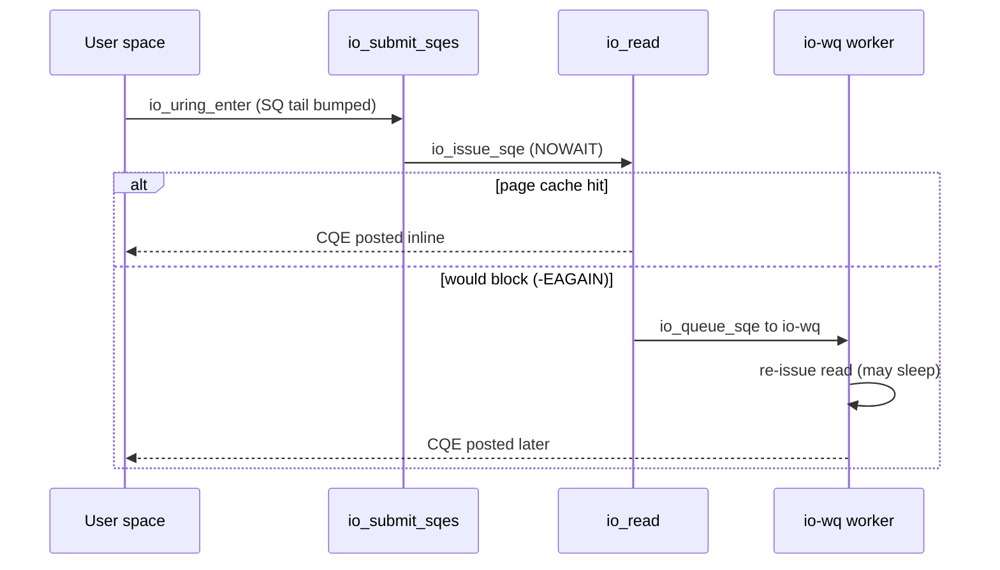

# Modern I/O & io_uring

> **Goal:** understand why Linux I/O has so many APIs, what problem each one
> solves, and why `io_uring` is a structural change rather than another wrapper
> around `read()` and `write()`.

## The old contract: blocking syscalls

The simplest I/O path is synchronous:

```c
n = read(fd, buf, len);
```

The process enters the kernel and does not return until data is available,
an error occurs, or a signal interrupts the call. This is a beautiful API for
local files and small programs. It is also a scalability problem when one
thread must manage thousands of sockets or slow storage operations.

The kernel has three costs to keep in mind:

```text
syscall entry/exit
copying data between user and kernel
sleeping/waking tasks when I/O cannot complete immediately
```

None of these is free, and the first one got measurably more expensive over
the last decade. A syscall is not just a `syscall` instruction; on x86-64 the
CPU switches privilege rings, swaps the stack, and — since the Meltdown/Spectre
era — often flips page tables through **KPTI** (kernel page-table isolation).
On mitigated hardware a round trip that once cost tens of nanoseconds can cost
several hundred.

See [CPU Vulnerability Mitigations](#/cpu-mitigations) for why that overhead
exists and [Kernel, User Space & Syscalls](#/kernel-vs-userspace) for the
mechanics of the boundary itself. When a busy server does one syscall per
socket per event, that tax dominates.

The history of Linux I/O APIs is mostly a history of reducing those costs
without destroying the Unix file descriptor model.

## Readiness APIs: select, poll, epoll

`select()` and `poll()` ask: "which file descriptors are ready right now?"
They do not perform I/O. They tell user space which operation is unlikely to
block. Both are O(n) in the number of watched descriptors: the kernel walks the
entire set on every call, and user space re-passes the whole set each time.
`select()` is worse still — it is capped at `FD_SETSIZE` (1024) and rebuilds
its bitmaps on every iteration.

`epoll` fixes the scaling model by splitting registration from waiting:

```text
epoll_ctl()  register interest once
epoll_wait() receive readiness events many times
read/write   still perform the actual I/O
```

Internally each epoll instance is a `struct eventpoll` holding a red-black tree
of registered interests (`struct epitem`, keyed by fd + `struct file`) and a
ready-list. When a monitored file becomes ready, its wait-queue callback
(`ep_poll_callback()`) moves the corresponding `epitem` onto the ready-list, so
`epoll_wait()` returns in O(ready) rather than O(watched). That is the whole
trick: readiness is pushed to a list instead of polled across a set.

This is why classic high-concurrency servers are event loops:

```text
epoll_wait()
  ↓
for each ready fd:
    read until EAGAIN
    process
    write until EAGAIN
```

The catch: **readiness is not completion.** `epoll` says "you can probably read
now"; user space must then call `read()`. That means at least one syscall for
readiness and more syscalls for actual operations. Two more sharp edges:

- **Level- vs edge-triggered.** Default level-triggered mode re-reports a fd
  while data remains; edge-triggered (`EPOLLET`) reports only on transitions,
  so you *must* drain to `EAGAIN` or you lose the wakeup. Getting this wrong is
  the classic epoll bug.
- **Buffered files don't fit.** A regular file is "always ready" to `epoll`, so
  readiness notification is useless for making buffered disk reads async. epoll
  handles sockets beautifully and disk files not at all.

That second limitation is the real motivation for what follows. See
[The Networking Stack](#/networking) for how socket readiness is generated in
the first place.

## Completion APIs: the better question

For high-performance systems, the more useful question is often:

```text
Here are operations I want. Tell me when each one is done.
```

That is completion-based I/O. Instead of waiting for readiness and then doing
work, user space submits work and later reaps completions.

Linux tried this before `io_uring`. The old POSIX AIO (`io_submit`, from 2003)
only ever worked asynchronously for `O_DIRECT` files; on buffered I/O it
silently fell back to blocking, and it never covered sockets, `accept`, or
`poll`. It is widely regarded as a design that never delivered. `io_uring`
(merged in **5.1**, May 2019, by Jens Axboe) is the second attempt, and this
time the shape matches the hardware.

NVMe queues, network cards, and modern storage devices already speak in
producer/consumer rings:

```text
software submits descriptors
device/kernel consumes them
device/kernel writes completion descriptors
software reaps completions
```

`io_uring` brings that shape to the Linux syscall interface. If you have read
[The Linux Storage Stack](#/storage-stack), the NVMe submission/completion
queue pair should look familiar — `io_uring` is deliberately the same idea one
level up.

## io_uring in one diagram

An `io_uring` instance has two shared rings:

```text
user space                                      kernel

SQEs: submission queue entries
  [read fd=4 buf=X len=4096]
  [write fd=7 buf=Y len=128]
  [accept listenfd=3]
        ↓
   submission ring  ─────────────────────────► kernel consumes work

   completion ring  ◄───────────────────────── kernel posts CQEs
        ↓
CQEs: completion queue entries
  [user_data=A result=4096]
  [user_data=B result=128]
  [user_data=C result=new_fd]
```

The rings are three separate `mmap()` regions returned by the setup call: the
SQ ring metadata, the CQ ring metadata, and the SQE array itself. (Since 5.12,
`IORING_SETUP_SUBMIT_ALL` and single-mmap features simplify this, but the
three-region model is the mental picture.)

Each ring is a power-of-two circular buffer with `head` and `tail` indices.
User space owns the SQ tail and the CQ head; the kernel owns the SQ head and
the CQ tail. Because both sides share the memory, advancing an index is a
plain memory write plus a memory barrier — no syscall.

The SQ ring holds *indices* into the SQE array, not SQEs directly. That
indirection lets you prepare SQEs out of order and submit them in a chosen
sequence.

The basic loop:

```text
prepare SQE
submit
do other work
peek/wait for CQE
handle result
mark CQE seen
```

The important shift: the unit of API is no longer "call this syscall now".
The unit is "enqueue this operation". In the busiest configurations you may
submit and complete tens of thousands of operations without a single syscall.

## What an SQE describes

An SQE is a fixed 64-byte operation descriptor, `struct io_uring_sqe`. The
fields that matter:

```text
opcode          u8   IORING_OP_READV, WRITEV, ACCEPT, SENDMSG, TIMEOUT, ...
flags           u8   IOSQE_* (fixed-file, link, drain, async, buffer-select)
fd              s32  target fd, or an index if IOSQE_FIXED_FILE is set
off / addr      u64  file offset; buffer / sockaddr / iovec pointer
len             u32  byte count or iovec count, opcode-dependent
user_data       u64  application-owned completion cookie (opaque to kernel)
```

The 64-byte size is deliberate: it is exactly one cache line on x86-64, so
preparing an SQE touches one line. Rich operations (`sendmsg`, some registered
ops) can opt into 128-byte SQEs with `IORING_SETUP_SQE128`.

The CQE (`struct io_uring_cqe`, 16 bytes by default) returns:

```text
user_data       u64  copied verbatim from the SQE
res             s32  result: bytes transferred, new fd, 0, or -errno
flags           u32  IORING_CQE_F_MORE, F_BUFFER, buffer-id in the high bits
```

`res` is not `errno` via thread-local state. Negative values encode failure:
`-EAGAIN`, `-ECANCELED`, `-ENOENT`, etc. This is friendlier to batched,
asynchronous code because each completion carries its own outcome, and there is
no per-thread `errno` to race over. The `IORING_CQE_F_MORE` flag says "this
request will post more CQEs" — the mechanism behind multishot, below.

## Follow the code (kernel v6.12)

The `io_uring` core lives in the `io_uring/` directory (it graduated from the
single `fs/io_uring.c` file in 5.10–6.0). Let's trace a buffered read from
submission to completion. The central per-instance object is
[struct io_ring_ctx](https://elixir.bootlin.com/linux/v6.12/C/ident/io_ring_ctx),
which owns the SQ/CQ ring state, the registered-buffer and fixed-file tables,
and the async worker pool. Every in-flight operation is a
[struct io_kiocb](https://elixir.bootlin.com/linux/v6.12/C/ident/io_kiocb) —
the internal "request" object; its important fields are `opcode`, `flags`,
`ctx` (back-pointer to the ring), `file` (the resolved target), and `cqe` (the
completion it will eventually post).

1. **Enter the kernel.** User space bumps the SQ tail, then calls
   [io_uring_enter()](https://elixir.bootlin.com/linux/v6.12/C/ident/io_uring_enter)
   (unless `SQPOLL` is doing that for it). With `IORING_ENTER_GETEVENTS` the
   same call also waits for completions.

2. **Drain the submission queue.**
   [io_submit_sqes()](https://elixir.bootlin.com/linux/v6.12/C/ident/io_submit_sqes)
   loops from the SQ head to the tail. For each slot it calls
   [io_get_sqe()](https://elixir.bootlin.com/linux/v6.12/C/ident/io_get_sqe)
   to fetch the SQE via the ring's index array, allocates an `io_kiocb` from a
   per-ctx cache, and runs `io_init_req()` to copy the opcode, flags, and
   `user_data` into the request.

3. **Prep, then issue.** Each opcode has a `prep` and an `issue` handler in an
   opcode dispatch table (`io_op_defs`). Submission calls
   [io_issue_sqe()](https://elixir.bootlin.com/linux/v6.12/C/ident/io_issue_sqe),
   which for `IORING_OP_READ` reaches the read handler in
   [io_read()](https://elixir.bootlin.com/linux/v6.12/C/ident/io_read)
   (in `io_uring/rw.c`).

4. **Try it without blocking first.** The handler issues the read with
   `IOCB_NOWAIT` set, so it goes down the normal VFS path —
   [vfs_read()](https://elixir.bootlin.com/linux/v6.12/C/ident/vfs_read) into
   the filesystem's `read_iter` — but *refuses to sleep*. If the data is warm
   in the [page cache](#/memory), it is copied out immediately and the request
   completes inline.

5. **Fall back to a worker on `-EAGAIN`.** If the page is not cached and the
   read would block, the filesystem returns `-EAGAIN`. `io_uring` does not give
   up; it re-queues the request to its async pool via
   [io_queue_sqe()](https://elixir.bootlin.com/linux/v6.12/C/ident/io_queue_sqe)
   → the **io-wq** thread pool
   ([io_wq_enqueue()](https://elixir.bootlin.com/linux/v6.12/C/ident/io_wq_enqueue)).
   A kernel worker thread then re-issues the read *allowed to block*. This is
   the "hidden fallback" discussed later — buffered reads become async by
   running on a worker, not by magic.

6. **Post the completion.** When the read finishes, the handler fills the
   `io_kiocb`'s CQE (`res` = bytes read), and the completion path writes a
   `struct io_uring_cqe` into the CQ ring and advances the CQ tail. If user
   space is waiting in `io_uring_enter()`, it is woken; otherwise it will see
   the CQE on its next peek.



The two setup/register entry points complete the picture:
[io_uring_setup()](https://elixir.bootlin.com/linux/v6.12/C/ident/io_uring_setup)
allocates the `io_ring_ctx` and the rings, and
[io_uring_register()](https://elixir.bootlin.com/linux/v6.12/C/ident/io_uring_register)
installs registered buffers and fixed files (next sections).

## Why it can be faster

`io_uring` attacks several overheads at once:

| Feature | What it saves |
|---|---|
| Shared rings | less syscall traffic for submission/completion |
| Batching | many operations submitted/reaped together |
| Registered buffers | repeated pin/copy bookkeeping avoided |
| Registered files | repeated fd table lookups reduced |
| SQPOLL | kernel thread polls submissions, fewer syscall entries |
| Linked operations | dependencies expressed without returning to user space |
| Multishot ops | one request can produce multiple completions |

Concretely: a naive echo server does two syscalls per event (`epoll_wait` plus
`read`, then `write`). A batched `io_uring` server can amortize a single
`io_uring_enter` across dozens of operations, and with `SQPOLL` it can drop to
*zero* syscalls in steady state. On mitigated x86-64 hardware, where a syscall
round trip can cost several hundred nanoseconds, eliminating it per-operation is
the single biggest win at high request rates.

Not every workload wins. If your program does one blocking read at a time,
`io_uring` adds complexity. If your program manages tens of thousands of
sockets, storage requests, timeouts, accepts, sends, and cancels, the ring
model becomes a different class of machine.

## Buffered files vs direct I/O

Linux file I/O has two major personalities.

Buffered I/O:

```text
read file
  ↓
page cache
  ↓
copy to user buffer
```

The [page cache](#/memory) gives reuse, readahead, writeback, and normal
filesystem semantics. But buffered file reads may need page faults, cache
misses, allocation, filesystem locks, or disk I/O. Historically, making this
fully asynchronous was hard — which is exactly why `io_uring` uses the
`NOWAIT`-then-worker trick from the trace above. The default page size the
cache works in is **4 KiB on x86-64**; arm64 can be built with 4, 16, or 64 KiB
pages, which changes readahead granularity and alignment math.

Direct I/O (`O_DIRECT`) bypasses the page cache:

```text
storage DMA ↔ user buffer
```

This avoids cache pollution and extra copies for databases and storage
engines, but requires alignment discipline (buffer, offset, and length aligned
to the device's logical block size — 512 B or 4096 B) and gives up many
page-cache benefits.

`io_uring` is attractive for both worlds, but the performance model differs.
With direct I/O and registered buffers, it can map closely to storage queue
semantics — an SQE turns into a block-layer request that DMAs straight into a
pinned user buffer. With buffered I/O, it improves API structure, batching,
and async behavior, but still interacts with page cache realities.

See [The Linux Storage Stack](#/storage-stack) for where the block layer and
NVMe driver pick the request up.

## Registered buffers and files

Every normal syscall that takes a user pointer or fd forces the kernel to
validate, pin, look up, and account. Some of that is unavoidable; some can be
amortized.

**Registered buffers** (`io_uring_register` with `IORING_REGISTER_BUFFERS`)
pin a set of user memory ranges once. Internally each becomes a
`struct io_mapped_ubuf` recording the pinned pages. For direct I/O, this means
the pages are already `get_user_pages`-pinned and ready for DMA, so the hot
path skips per-I/O pinning entirely:

```text
setup:  pin these memory ranges for I/O
steady: SQE references buffer id (opcode _FIXED variant)
```

**Registered files** (`IORING_REGISTER_FILES`) install an fd table on the ring
so an SQE can reference a *fixed-file index* (with `IOSQE_FIXED_FILE`) instead
of a raw fd. That skips the per-operation `fget`/`fput` reference counting and
fd-table lookup — meaningful when the same sockets or files are hit millions of
times:

```text
setup:  register this fd array with the ring
steady: SQE references fixed file slot
```

The trade-off is lifecycle complexity. Pinned memory counts against
`RLIMIT_MEMLOCK` and is not free; registered state must be updated (there are
`_UPDATE` register opcodes) when files rotate, connections close, or buffers
are reused. High-performance APIs often buy speed by making lifetime explicit.
This is less compelling for one-shot scripts.

## SQPOLL and IOPOLL

`SQPOLL` (`IORING_SETUP_SQPOLL`) creates a dedicated kernel thread that polls
the submission queue tail. User space places SQEs into the ring and, in the hot
path, avoids the `io_uring_enter()` syscall to notify the kernel — it just
advances the tail.

The thread sleeps after an idle period (`sq_thread_idle`, default 1000 ms,
tunable at setup) and user space must set `IORING_SQ_NEED_WAKEUP` before
re-entering to wake it. This is excellent when the ring is busy enough to
justify burning a core; it is wasteful when the workload is sparse, and it
needs `CAP_SYS_NICE` (or a shared-poll thread) to set up.

`IOPOLL` (`IORING_SETUP_IOPOLL`) is for polling-capable block devices under
direct I/O. Instead of interrupt-driven completion, the kernel busy-polls the
device completion queue. This can shave microseconds off tail latency and cut
interrupt overhead on NVMe, at the cost of CPU. It only works with `O_DIRECT`
on devices that support polled completions.

The pattern is familiar from kernel performance work — see
[Interrupts, Exceptions & Softirqs](#/interrupts):

```text
interrupts save CPU but add wakeup latency
polling burns CPU but can reduce tail latency
```

There is no universal winner. Latency budgets decide. Pairing `SQPOLL` +
`IOPOLL` with a [CPU-isolated](#/cpu-isolation) core is a common recipe for
storage engines that want deterministic sub-10-µs completions.

## Linked operations and async control flow

`io_uring` can express chains with the `IOSQE_IO_LINK` flag:

```text
accept
  → recv
  → send
  → close on failure
```

Linked SQEs let the kernel understand dependencies between operations: the next
link does not start until the previous one completes successfully. If a linked
operation fails (short read, error, cancellation), the rest of the chain is
short-circuited with `-ECANCELED`. This reduces the back-and-forth where user
space wakes only to submit the obvious next step. `IOSQE_IO_HARDLINK` is the
stricter variant that links regardless of the previous result.

Timeouts and cancellation are first-class operations too. `IORING_OP_TIMEOUT`
posts a CQE after a delay or a number of completions; `IORING_OP_LINK_TIMEOUT`
arms a timeout on the *linked* operation, so a `recv` that hangs can be
canceled automatically; `IORING_OP_ASYNC_CANCEL` cancels an in-flight request
by `user_data`.

That is crucial: large async systems are not just reads and writes. They are
reads, writes, timeouts, retries, accept loops, shutdowns, backpressure, and
cancellation. An I/O API that cannot cancel cleanly eventually leaks
complexity into the application architecture — and interacts badly with
[signals](#/signals), which are the older, blunter cancellation mechanism.

## Multishot operations

Some operations naturally produce many events:

```text
accept many connections   (IORING_OP_ACCEPT, multishot since 5.19)
receive many datagrams    (IORING_OP_RECV multishot)
poll many transitions     (IORING_OP_POLL_ADD multishot)
```

A multishot request stays armed and produces multiple CQEs, each flagged with
`IORING_CQE_F_MORE` until the last. One `accept` SQE can yield a stream of
accepted connections without re-submission; combined with **provided buffers**
(a pool the kernel picks from, `IORING_REGISTER_PBUF_RING`), a multishot `recv`
can deliver many datagrams into kernel-chosen buffers with almost no per-packet
user-space work. That reduces the submit/rearm loop dramatically and helps busy
servers.

It also requires careful CQE handling because one logical request no longer
maps to one completion, and the buffer-id lives in the CQE `flags` high bits.
This is a recurring `io_uring` theme: the API lets you move more control flow
into the kernel boundary, but your application state machine must become
precise.

## Zero-copy is not a spell

People often talk about zero-copy as if copies are the only cost. In reality,
zero-copy trades copies for pinning, accounting, fragmentation pressure,
device constraints, and completion complexity.

For network send paths, `IORING_OP_SEND_ZC` / `SENDMSG_ZC` (zero-copy send,
since 6.0) can avoid copying payloads into kernel socket buffers, but user
memory must remain stable until the NIC is done with it. That is signalled by a
**second** CQE carrying `IORING_CQE_F_NOTIF`: the first CQE means "submitted",
the notification CQE means "your buffer is free to reuse".

Completion notification has become part of memory ownership — a strictly more
complex contract than a normal `send`. It only pays off above a payload
threshold (roughly a few KiB); below that the copy is cheaper than the pinning
bookkeeping.

For storage, direct I/O avoids page-cache copies, but you lose cache
reuse/readahead and inherit alignment constraints.

The honest rule:

```text
zero-copy helps when copy cost dominates and lifetimes are well controlled
zero-copy hurts when it destroys locality, caching, or simplicity
```

## The hidden fallback problem

Not every operation can complete asynchronously in the exact path you imagine.
As the code trace showed, the kernel re-issues would-block operations on the
**io-wq** worker pool. Filesystems, metadata operations, buffered cache misses,
and locking can force work out of the immediate submission path and onto a
kernel thread.

This does not make `io_uring` fake. It means the implementation is a hybrid:
some operations complete inline (page-cache hit, socket with data ready), some
are queued to async workers, some depend on filesystem/device support, and some
are better suited to direct I/O. The io-wq pool has bounded workers (for I/O
that can block) and unbounded workers (for CPU-ish work), and it scales the
thread count with demand — which is exactly what you must watch when
benchmarking.

When benchmarking, look for:

```bash
# count io_uring worker threads for a process (kernel threads named iou-wrk)
ps -eLf | grep iou-

# per-thread CPU: are hidden workers eating a core?
pidstat -t 1

# pressure stall: is "async" work actually queuing behind blocked I/O?
cat /proc/pressure/io
cat /proc/pressure/cpu

# where is the time going?
perf top
```

If your "async" system is just moving blocking work onto a hidden worker pool,
tail latency and CPU pressure will tell on you. This is a good moment to reach
for [/proc, strace, perf & eBPF](#/observability) and the
[Performance Analysis Methodology](#/perf-methodology) chapter.

## Security implications

`io_uring` expands the shape of the syscall interface. A process can submit
operations indirectly through a ring, use registered files, ask for async
workers, and combine operations in ways that are harder to reason about than
one syscall at a time.

This matters for sandboxes:

- seccomp profiles must understand `io_uring_setup`, `io_uring_enter`, and
  `io_uring_register` — but classic [seccomp](#/security-hardening) filters
  inspect syscall *numbers and arguments*, and the real operation is the
  *opcode encoded inside an SQE*, which a syscall filter never sees;
- the kernel added `IORING_RESTRICTION_*` (registered restrictions) and the
  `io_uring_disabled` sysctl (`/proc/sys/kernel/io_uring_disabled`, values 0/1/2)
  precisely so administrators can lock this down;
- io-wq worker threads run operations on the submitter's behalf, which
  complicated credential and audit tracking (several 2021–2023 CVEs lived
  here);
- Google, Docker's default seccomp profile, and several hardened distros
  disable or restrict `io_uring` for untrusted workloads by default.

**Container link:** because io_uring can be a sandbox-escape surface, many
container runtimes block `io_uring_setup` in their default seccomp profile,
which is why `io_uring` code may fail with `-EPERM` inside a stock Docker
container even though the host kernel supports it. See
[Docker, containerd, runc](#/container-runtimes) and
[Linux Security & Confinement](#/security-hardening).

The lesson is not "`io_uring` is bad". The lesson is that powerful async
interfaces need policy models that understand submitted operations, not only
syscall numbers.

## Choosing the API

| Workload | Usually sensible |
|---|---|
| simple CLI | blocking `read`/`write` |
| many sockets, portable | nonblocking + `epoll` |
| high-performance Linux server | `io_uring` |
| database/storage engine | `io_uring` + direct I/O + registered buffers, benchmarked |
| cross-platform runtime | abstraction over epoll/kqueue/IOCP/io_uring |
| tiny service with low concurrency | boring blocking I/O may win |

The highest-performance API is not automatically the best architecture.
`io_uring` pays off when batching, completion semantics, and reduced syscall
traffic simplify the hot path enough to justify the state machine.

## Try it yourself

```bash
# Is io_uring available and allowed on this host?
cat /proc/sys/kernel/io_uring_disabled   # 0 = enabled, 1 = restricted, 2 = off

# Install the userspace library + examples (Debian/Ubuntu)
sudo apt install liburing-dev

# Trace the three io_uring syscalls a program makes
strace -e trace=io_uring_setup,io_uring_enter,io_uring_register ./your_program

# Watch io_uring worker kernel threads appear under load
watch -n1 'ps -eLf | grep -c "[i]ou-"'

# See per-opcode io_uring activity with bpftrace (needs eBPF + root)
sudo bpftrace -e 'tracepoint:io_uring:io_uring_submit_req { @[args->opcode] = count(); }'
```

That last line is a good bridge to [eBPF Internals](#/ebpf-internals): the
kernel exposes an `io_uring` tracepoint family so you can watch opcodes flow
without instrumenting your program.

## Source map

| Area | Kernel path |
|---|---|
| core implementation | `io_uring/io_uring.c` |
| read/write opcodes | `io_uring/rw.c` |
| network opcodes | `io_uring/net.c` |
| poll / multishot | `io_uring/poll.c` |
| async worker pool | `io_uring/io-wq.c` |
| public API | `include/uapi/linux/io_uring.h` |
| VFS read/write path | `fs/read_write.c` |
| block layer | `block/` |
| page cache | `mm/filemap.c` |

The code is easier to read if you keep the ring model fixed in your head:
SQEs describe work, `io_submit_sqes()` turns them into `io_kiocb` requests,
completions post CQEs, and registered resources reduce repeated lookup/pinning
overhead.

## Check your understanding

1. Why does `epoll` scale readiness notification but still require separate
   syscalls to perform the actual I/O?

<details><summary>Show answer</summary>

`epoll` only answers "which fds are ready" — it splits registration
(`epoll_ctl`) from waiting (`epoll_wait`) and uses a ready-list callback so
`epoll_wait` returns in O(ready). But it never moves data; readiness is not
completion, so user space must still issue a `read`/`write` syscall per
operation. `io_uring` collapses that by being completion-based.

</details>

2. What is the difference between a readiness API and a completion API, and
   which one matches NVMe hardware?

<details><summary>Show answer</summary>

A readiness API tells you an operation *probably won't block* (you still do it
yourself); a completion API takes the operation and tells you when it's *done*.
NVMe uses submission/completion queue pairs, so the completion model matches the
hardware directly — which is why `io_uring` uses shared rings.

</details>

3. Trace what happens when an `io_uring` buffered read misses the page cache.

<details><summary>Show answer</summary>

`io_read()` first tries the VFS path with `IOCB_NOWAIT`. On a cache miss the
filesystem returns `-EAGAIN`; `io_uring` re-queues the `io_kiocb` to the io-wq
worker pool (`io_wq_enqueue`), and a kernel worker thread re-issues the read
allowed to block. When it finishes, a CQE is posted to the completion ring.

</details>

4. When can zero-copy send make latency *worse* rather than better?

<details><summary>Show answer</summary>

For small payloads (below a few KiB), the cost of pinning pages, accounting, and
handling the extra `IORING_CQE_F_NOTIF` completion exceeds the cost of just
copying the data. Zero-copy also forces the buffer to stay stable until the NIC
signals it's free, adding lifetime complexity. It only wins when copy cost
dominates and buffer lifetimes are well controlled.

</details>

5. What do registered buffers and registered files actually save on the hot
   path?

<details><summary>Show answer</summary>

Registered buffers (`io_mapped_ubuf`) pin user memory once, so per-I/O pinning
(`get_user_pages`) is skipped — important for `O_DIRECT` DMA. Registered files
install an fd array so an SQE can reference a fixed-file index, skipping the
per-operation `fget`/`fput` and fd-table lookup. Both trade lifecycle
complexity (and `RLIMIT_MEMLOCK`) for lower per-operation overhead.

</details>

6. Why does `io_uring` complicate seccomp-based sandboxing?

<details><summary>Show answer</summary>

Classic seccomp filters inspect syscall numbers and arguments, but the real
operation in `io_uring` is the *opcode inside an SQE*, submitted via a generic
`io_uring_enter`. A filter that allows the three io_uring syscalls can't see
whether the ring is doing a harmless `read` or an `openat`. That's why the
`io_uring_disabled` sysctl and registered restrictions exist, and why many
container runtimes block it by default.

</details>

7. When is plain blocking I/O still the right choice over `io_uring`?

<details><summary>Show answer</summary>

For low-concurrency programs — a CLI tool, or a service handling one operation
at a time — blocking `read`/`write` is simpler and often just as fast. `io_uring`
pays off only when batching, completion semantics, and reduced syscall traffic
justify the added state-machine complexity, i.e. at high concurrency or
throughput.

</details>

## Sources & further reading

- Jens Axboe, "Efficient IO with io_uring" (the original design document /
  "io_uring.pdf").
- kernel.org: [io_uring documentation](https://docs.kernel.org/#) and the
  in-tree `Documentation/` sources under the `io_uring/` subsystem.
- man pages:
  [io_uring_setup(2)](https://man7.org/linux/man-pages/man2/io_uring_setup.2.html),
  [io_uring_enter(2)](https://man7.org/linux/man-pages/man2/io_uring_enter.2.html),
  [io_uring_register(2)](https://man7.org/linux/man-pages/man2/io_uring_register.2.html),
  [epoll(7)](https://man7.org/linux/man-pages/man7/epoll.7.html).
- Source: [io_uring/ subsystem](https://elixir.bootlin.com/linux/v6.12/source/io_uring)
  and the UABI header
  [include/uapi/linux/io_uring.h](https://elixir.bootlin.com/linux/v6.12/source/include/uapi/linux/io_uring.h).
- LWN: "The rapid growth of io_uring" (Jonathan Corbet) and "Ringing in a new
  asynchronous I/O API" — background on the design and its evolution.
- liburing (Jens Axboe): the userspace library and its example programs, the
  practical starting point for writing io_uring code.

---

**Next:** [Rust in the Linux Kernel](#/rust-kernel) — the first new language in
30 years. Why it matters, what's already been merged, how it coexists with C,
and what it means for the future of kernel security and driver development.
