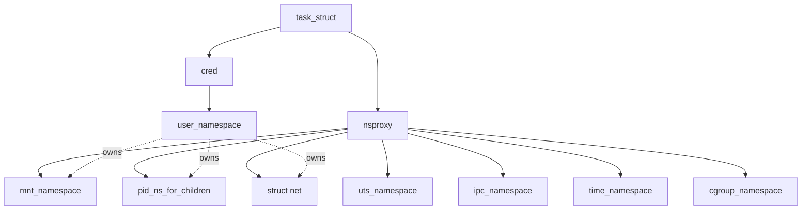
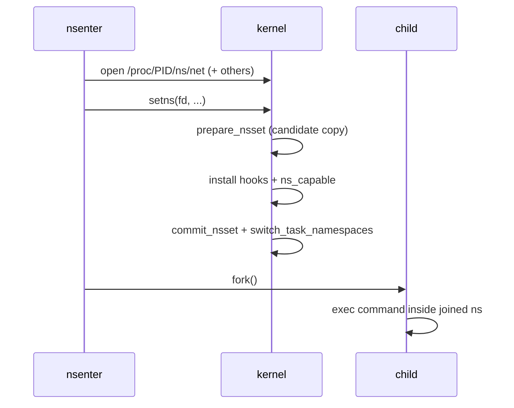

# Namespaces

> **Goal:** master the kernel feature at the heart of containers. Each
> namespace type virtualizes one global resource; we'll tour all eight with
> hands-on commands, walk the real kernel data structures behind them, and
> see how `unshare`/`setns` create and enter them.

## The idea

Many things in a classic Unix system are **global**: the process table, the
hostname, the mount table, the network interfaces, user IDs. Every process
sees the same ones.

A **namespace** wraps one of these globals in a private copy. Processes
inside the namespace see *their* copy and genuinely cannot name, address, or
see anything outside it. It's not hiding (like a permission check) — inside a
PID namespace there simply *is no* PID for an outside process; the outside
world is unaddressable.

Remember `task_struct → nsproxy` from [Processes & Threads](#/processes):
each task holds pointers to one namespace of each type. "Being in a
container" = those pointers aim at non-default namespaces. Nothing else.
There is no `is_container` flag anywhere in the kernel, no container object,
no "containment" subsystem. A container is an emergent property of a set of
namespaces (this chapter) plus a [cgroup](#/cgroups), plus a chosen root
filesystem, assembled by userspace. The kernel only knows namespaces.

### The data structures

The hub is `struct nsproxy` (defined in `include/linux/nsproxy.h`), a small
refcounted bundle of pointers:

```c
struct nsproxy {
    refcount_t count;                       // tasks sharing this bundle
    struct uts_namespace    *uts_ns;
    struct ipc_namespace    *ipc_ns;
    struct mnt_namespace    *mnt_ns;
    struct pid_namespace    *pid_ns_for_children;  // note: for CHILDREN
    struct net              *net_ns;
    struct time_namespace   *time_ns;
    struct time_namespace   *time_ns_for_children;
    struct cgroup_namespace *cgroup_ns;
};
```

Three details in this struct explain half the surprising behavior you'll
meet later:

- **`count` is shared.** A `fork()` without any `CLONE_NEW*` flag just bumps
  the refcount — parent and child share one `nsproxy`. Only when a task
  unshares something does the kernel copy the bundle (copy-on-unshare). This
  is why `nsproxy` is a *bundle of pointers* rather than the namespaces
  inlined into `task_struct`: sharing the common case (everyone in the init
  namespaces) costs one refcount, not eight.
- **`pid_ns_for_children`**, not `pid_ns`. A task's *own* PID namespace is
  recorded elsewhere (reachable via its `struct pid`); the nsproxy field only
  says where *future children* will get PIDs. That's why you can't move your
  own PID into a new namespace — more below. The same asymmetry appears for
  time: `time_ns` is what *you* see, `time_ns_for_children` is what your
  forks inherit.
- **The user namespace is missing.** It lives in `task->cred->user_ns`
  (`struct cred`), because it's part of the *credentials*: every permission
  check needs it, and credentials are per-task and copy-on-write. Common
  interview trap: "which namespace is not in nsproxy?"

Every namespace object embeds a `struct ns_common` — a tiny header with the
namespace's inode number (`inum`), a refcount (`count`), an ops table
(`struct proc_ns_operations`: `get`, `put`, `install`, `owner`), and a
`stashed` dentry pointer for its nsfs inode. Those inodes live on an
invisible internal filesystem, **nsfs**, and surface here:

```bash
ls -l /proc/$$/ns/        # your shell's namespaces — every process has them!
```

```text
cgroup → cgroup:[4026531835]     ipc  → ipc:[4026531839]
mnt    → mnt:[4026531841]        net  → net:[4026531840]
pid    → pid:[4026531836]        time → time:[4026531834]
user   → user:[4026531837]       uts  → uts:[4026531838]
```

You are *already* in namespaces — the initial, default ones. Their inode
numbers are hard-coded constants (`PROC_PID_INIT_INO` = 0xEFFFFFFC =
4026531836 and friends, in `include/linux/proc_ns.h`), which is why the
numbers above look the same on every Linux machine you'll ever touch. Two
processes are "in the same container", kernel-wise, exactly when these inode
numbers match.

Non-initial namespaces get inode numbers allocated from an increasing counter
that starts at `PROC_DYNAMIC_FIRST` = 0xF0000000, so they land *at or above*
`0xF0000000` — just past the hard-coded init-ns constants that sit right
below it — and change every boot.



The dotted arrows matter: **every non-user namespace is owned by a user
namespace** (captured at creation time). Privilege checks against a
namespaced resource ask "does this task have the capability *in the owning
user namespace*?" — the `ns_capable()` question that makes rootless
containers work. This ownership pointer is stored right on the namespace
(e.g. `mnt_namespace->user_ns`, `pid_namespace->user_ns`) and is fixed for
life; you cannot re-parent a namespace to a different user namespace after
the fact.

## The eight namespaces

| NS | Since | Kernel struct | Virtualizes | Container effect |
|---|---|---|---|---|
| **mnt** | 2.4.19 (2002) | `mnt_namespace` | the mount table | its own filesystem tree |
| **uts** | 2.6.19 (2006) | `uts_namespace` | hostname, domainname | its own hostname |
| **ipc** | 2.6.19 (2006) | `ipc_namespace` | System V/POSIX IPC objects | no shared-memory snooping |
| **pid** | 2.6.24 (2008) | `pid_namespace` | the process table | its own PID 1, sees only itself |
| **net** | 2.6.24 (2008) | `net` | interfaces, routes, firewall, ports | its own private network stack |
| **user** | 3.8 (2013)* | `user_namespace` | UID/GID mappings, capabilities | "root inside" ≠ root outside |
| **cgroup** | 4.6 (2016) | `cgroup_namespace` | the cgroup tree view | can't see/escape host hierarchy |
| **time** | 5.6 (2020) | `time_namespace` | boot/monotonic clocks | own view of uptime (CRIU restore) |

\* partial support earlier; 3.8 is when unprivileged creation landed.

The three syscalls that drive everything:

- `clone(CLONE_NEW…)` — create a child *in* new namespaces (the
  [Processes & Threads](#/processes) chapter's punchline). Each namespace has
  a flag bit: `CLONE_NEWNS` (0x00020000 — "NS" with no qualifier because
  mount namespaces came first and nobody imagined more), `CLONE_NEWPID`
  (0x20000000), `CLONE_NEWNET` (0x40000000), and so on.
- `unshare(CLONE_NEW…)` — move *yourself* into new namespaces (with the PID
  and time exceptions below).
- `setns(fd, nstype)` — join an *existing* namespace via its
  `/proc/…/ns/…` file. This is exactly what `docker exec` does: open the
  target's ns files, setns into each, fork your command inside. Since kernel
  5.8, `fd` may also be a **pidfd**, letting you join several of a process's
  namespaces in one atomic call — this is what modern runtimes use.

One quirk worth pinning: `CLONE_NEWTIME` is 0x00000080, a bit that collides
with the exit-signal byte in legacy `clone()` — so a time namespace can only
be created via `unshare()` or `clone3()`, never old `clone()`.

The `unshare(1)` and `nsenter(1)` CLI tools wrap these — our lab equipment
for the rest of the chapter. (Everything below needs root or user namespaces.)

### Ordering matters: user namespace first

When you create several namespaces at once, the kernel processes them in a
fixed order — user namespace first, everything else after. That is
deliberate: the other namespaces need to record the user namespace that owns
them, and unprivileged creation only works if the new user namespace (where
you hold a full capability set) already exists when the mnt/pid/net
namespaces are built. This is why

```bash
unshare --user --map-root-user --net --pid --fork sh   # works as a normal user
```

succeeds without root, while `unshare --net` alone (no `--user`) demands real
`CAP_SYS_ADMIN`. Get the ordering wrong in your own C code — create the net
namespace before the user namespace — and the net namespace ends up owned by
the *host* user namespace, where your capabilities are void.

### Namespace lifecycle

A namespace exists as long as *something* holds a reference to its
`ns_common`: a process inside it, an open file descriptor on its
`/proc/<pid>/ns/…` entry, or a **bind mount** of that entry. When the last
reference drops, the namespace is torn down. Inside a PID namespace, when
PID 1 exits, the kernel calls
[zap_pid_ns_processes()](https://elixir.bootlin.com/linux/v6.12/C/ident/zap_pid_ns_processes)
to SIGKILL every other process in the namespace — the namespace dies
cleanly, and no new process can ever be created in it again (further forks
into it fail with `ENOMEM`).

The bind-mount trick is load-bearing infrastructure: `ip netns add blue`
does nothing more than create a new net namespace and bind-mount its nsfs
inode to `/run/netns/blue`, keeping it alive with zero processes inside.

```bash
# A namespace with no processes, kept alive by a bind mount:
sudo ip netns add blue
sudo ls -l /run/netns/           # the anchor
sudo ip netns exec blue ip addr  # enter it on demand
sudo ip netns del blue
```

There's also an introspection API on ns fds: `ioctl(fd, NS_GET_PARENT)`
returns an fd for the parent PID/user namespace, `NS_GET_USERNS` returns the
owning user namespace, and `NS_GET_NSTYPE` reports which kind of namespace an
opaque fd refers to — this is how `lsns` draws its ownership tree.

Creation is rate-limited per user namespace by the `ucounts` mechanism:
`/proc/sys/user/max_pid_namespaces`, `max_net_namespaces`,
`max_user_namespaces`, etc. cap how many of each a user can create. Each
`unshare` charges a counter on the *creating* user namespace and every
ancestor up to init; hitting the cap fails with `ENOSPC`. Defaults are
generous (tens of thousands) but finite — a container-density knob worth
knowing.

```bash
sysctl user   # see all the per-user-namespace caps at once
```

## UTS: the warm-up

```bash
sudo unshare --uts sh -c 'hostname inside-the-matrix; hostname; sh'
# new shell says: inside-the-matrix
hostname        # from another terminal: unchanged. The lie is contained.
```

One flag, one private hostname. The whole namespace is a `struct
uts_namespace` wrapping one `struct new_utsname` — six fixed 65-byte char
arrays (`sysname`, `nodename`, `release`, `version`, `machine`,
`domainname`). `sethostname(2)` writes `nodename` in *your* copy; `uname(2)`
reads it back. Trivial — but it proves the pattern all the others follow:
copy the global, point `nsproxy` at the copy.

(Notice what's *in* that struct: `release` — the kernel version string. A
container can't have a different one, because there's only one kernel. UTS
virtualizes the *strings*, nothing more. "UTS" itself stands for *UNIX
Time-sharing System*, the historic name of the `utsname` struct — nothing to
do with time.)

## PID: your own process universe

```bash
sudo unshare --pid --fork --mount-proc sh
ps aux
#   PID  COMMAND
#     1  sh          ← we are PID 1 of a new universe
#     2  ps
```

What's really going on:

- The *first child* in the new PID namespace becomes **PID 1** there, with
  init's duties: reap zombies (remember [Processes & Threads](#/processes) —
  this is the `docker run --init` story) and a special signal regime: PID 1
  ignores any signal for which it has no handler installed, even SIGKILL
  *from inside* the namespace. (The parent namespace can still kill it.)
- PIDs are **layered**: the same task has PID 1 inside and PID 48213 in the
  parent namespace. The host sees everything (with shifted PIDs); the inside
  sees only itself. Isolation is asymmetric, by design — that's why `docker
  top`, host monitoring, and `kill` from the host all work.
- `--mount-proc` matters: `ps` reads `/proc`, so a fresh procfs must be
  mounted *for this namespace* — otherwise you'd see the host's `/proc` and
  the illusion would leak. Lesson: **namespaces compose**; pid alone isn't
  enough without mnt.
- You can't `unshare` your own PID namespace and stay — hence `--fork`: the
  *next child* enters it. Now you know why: `unshare(CLONE_NEWPID)` only
  changes `nsproxy->pid_ns_for_children`. A task's own PID is baked into
  hashtables and parent/child relationships at fork time; migrating it live
  would break `getppid()`, sessions, and every cached PID in userspace.

### Inside `struct pid`

The layering is implemented in `struct pid` (in `include/linux/pid.h`),
which every task points to:

```c
struct pid {
    refcount_t count;
    unsigned int level;          // nesting depth of the task's ns
    /* ... wait queues, hlists ... */
    struct upid numbers[];       // one entry PER LEVEL
};
struct upid {
    int nr;                      // the numeric PID at this level
    struct pid_namespace *ns;
};
```

A process three levels deep has **three numbers**, one per ancestor
namespace, all stored in the same `struct pid`. The `numbers[]` array is
ordered outermost-first (`numbers[0]` is the init namespace), so translation
in either direction is just an array walk. That's what `NSpid` in
`/proc/<pid>/status` prints. Note the direction of visibility this encodes: a
task in an inner namespace has *no* `struct upid` entry for any *deeper*
namespace, which is precisely why inner tasks are invisible to their
children's namespaces but the reverse is not true.

`struct pid_namespace` itself holds the allocator and the rules:

- `idr` — an IDR (radix-tree-backed ID allocator); PID allocation is
  `idr_alloc_cyclic()`, which is why PIDs count upward and wrap instead of
  reusing the lowest free number immediately (reuse-too-fast races were a
  classic Unix bug class).
- `child_reaper` — the namespace's PID 1, inheritor of its orphans.
- `parent`, `level` — the nesting chain. **Nesting is capped at 32 levels**
  (`MAX_PID_NS_LEVEL`); creation beyond that fails with `ENOSPC`.
- `pid_allocated`, `pid_cachep` — bookkeeping and the per-namespace slab
  cache PIDs are allocated from.
- `pid_max` — since 6.7 this is a *per-namespace* limit (it moved out of the
  single global `kernel.pid_max` sysctl into the pid namespace), though the
  init namespace still exposes it via that sysctl: default 32768, raiseable
  to `PID_MAX_LIMIT` = 4,194,304 on 64-bit (systemd ≥ v243 raises it to the
  max at boot on most modern distros — check `sysctl kernel.pid_max`).

Allocating a PID for a new task means walking from the task's namespace *up
to the root*, grabbing one number from each level's IDR — a fork three
namespaces deep does three allocations. Cheap (sub-microsecond), but it's
real per-level work.

```bash
# See the layered PIDs from the host:
PID=$(pgrep -f "unshare.*pid")
cat /proc/$PID/status | grep -E '^(Pid|NSpid)'
# Pid:   48213
# NSpid: 48213  1   ← outer→inner PID mapping, one column per level
```

## Mount: your own filesystem tree

```bash
sudo unshare --mount sh
mount -t tmpfs none /mnt       # mount something…
ls /mnt                        # visible here
# other terminal: ls /mnt     → empty. Host never saw it.
```

Each mnt namespace is a `struct mnt_namespace`: since 6.8 a **red-black
tree** of `struct mount` entries keyed by mount ID (the tree replaced a
linear linked list — hosts with thousands of mounts made list scans in
`/proc/<pid>/mountinfo` and mount lookups hurt), a pointer to the `root`
mount, the owning `user_ns`, a `seq` sequence counter, and `nr_mounts` —
checked against the sysctl `fs.mount-max` (default **100,000** mounts per
namespace, a DoS guard).

`struct mount` is the *per-namespace* view of a mount; the `struct
vfsmount` it embeds (`mnt`) plus the `struct super_block` behind it are
**shared** across namespaces (see
[Files, Filesystems & the VFS](#/filesystems)).

That split is the whole trick: creating a mount namespace **copies the mount
tree** — every `struct mount` is duplicated — but the superblocks, inodes,
and page cache underneath are not, so two namespaces looking at the same ext4
filesystem share one page cache. On a host with 60 mounts that's 60 small
allocations: fast, but not free, and it's why the new namespace initially
looks identical to the host.

Combined with `pivot_root(2)` — which swaps the namespace's `/` for a
directory of your choosing and lets you unmount the old root — this gives
containers their own root filesystem. (Runtimes use `pivot_root`, not
`chroot`: chroot only bends path resolution and is escapable by a privileged
process; pivot_root actually detaches the old tree from the namespace.)

### Mount propagation

One subtlety worth real attention: **mount propagation**. Every mount has a
propagation type recorded in flags on its peer/master groups:

- **shared** — mount and unmount events replicate to every member of a *peer
  group*. Mount a USB stick under a shared mount and it appears in all peers.
- **private** — no propagation in or out. The default for a freshly created
  namespace tree once made private.
- **slave** — receives events from a master peer group but sends none out. A
  one-way valve: host mounts flow *in*, container mounts stay *in*.
- **unbindable** — like private, but also cannot be bind-mounted (used to
  stop propagation explosions when a shared tree is copied).

Since systemd, distros boot with `/` marked `shared:1` — so a naive
`unshare --mount` copy would *still propagate* your mounts back to the host
through the shared peer group!

`unshare(1)` saves you by defaulting to `--propagation private` (it remounts
everything private after unsharing); container runtimes do the equivalent,
usually making the container's tree a `slave` so host mounts (a USB stick, an
NFS automount) still appear inside, but nothing leaks out. Raw
`unshare(CLONE_NEWNS)` from C gives you the *leaky* behavior — the copied
tree inherits the shared peer groups — unless you `mount(MS_REC|MS_PRIVATE)`
yourself.

```bash
# The propagation type is the 7th field of each mountinfo line:
cat /proc/self/mountinfo | awk '{print $5, $7}' | head
# /        shared:1     ← systemd made / shared
# /proc    shared:26
# a mount with no shared:/master: tag is private

# Watch propagation in action, then contain it:
sudo mount --make-shared /mnt
sudo unshare --mount --propagation unchanged sh -c 'mount -t tmpfs none /mnt/x; true'
# with 'unchanged' the tmpfs leaks back to the host peer group — check it:
mount | grep /mnt/x
```

**Container link:** the per-layer magic of images sits *below* this level —
[Images & OverlayFS](#/overlayfs) builds the root directory that
`pivot_root` then makes into `/`.

## Net: your own network stack

The richest one. A `struct net` is a *complete* instance of the networking
stack: its own device list (`loopback_dev` plus whatever you add), its own
routing tables and rule sets (`netns_ipv4 ipv4` / `netns_ipv6 ipv6`), its own
netfilter hooks and conntrack table, its own port space — even its own
`/proc/net` and `/sys/class/net`.

Subsystems that need per-namespace state register a `struct
pernet_operations` with `init`/`exit` callbacks and stash their data in the
`net->gen` (net_generic) array; every module from TCP to netfilter to IPsec
hangs its per-namespace state there. A new namespace contains: a loopback
(down), no other interfaces, empty routes, empty firewall:

```bash
sudo unshare --net sh
ip addr            # only lo, and it's DOWN. Total network silence.
ip link set lo up  # bring loopback up first thing
ip addr            # 127.0.0.1/8 back — now the container can talk to itself
```

Two namespaces can both bind `0.0.0.0:80` without conflict — different port
spaces. This is how every container can listen on "port 80".

Details that matter in production:

- **Sockets belong to a namespace, not a process.** A socket created inside
  a net ns keeps working after the process `setns()`es elsewhere — the ns
  pointer is captured at `socket(2)` time and held in `sock->sk_net`. This
  enables the "open a socket in the container's ns, serve it from the host"
  pattern used by service meshes.
- **It's the most expensive namespace.** A fresh net ns runs every
  registered pernet subsystem's `init` and allocates tens of kilobytes of
  per-ns state; teardown runs every `exit` and is *asynchronous*, batched on
  the single-threaded `cleanup_net` workqueue with an RCU grace period in the
  path. Churn thousands of short-lived containers per second and you'll find
  measurable kernel time — and latency spikes — in netns cleanup; the
  `cleanup_net` serialization was a real scaling bottleneck (much improved
  after the ~4.15 batching work, but the single workqueue remains a global
  choke point). Reusing net namespaces beats recreating them.
- A physical NIC can live in **only one** net ns at a time (`ip link set
  eth0 netns blue` moves it, and it comes back to the host when the namespace
  dies). Virtual devices — veth pairs, bridges, vxlan — are how you connect
  namespaces without giving each one hardware.

```bash
# Prove sockets outlive the process's namespace membership:
sudo ip netns add blue
sudo ip netns exec blue ip link set lo up
# a listener bound inside 'blue' stays bound to blue's port space
sudo ip netns exec blue sh -c 'ss -tlnp' 
sudo ip netns del blue
```

Connecting a namespace to the world = the veth-pair-into-bridge plumbing
from [The Networking Stack](#/networking); the
[Container Networking](#/container-networking) chapter wires it end-to-end,
and conntrack behavior (per-namespace tables) intersects with
[TCP Congestion Control](#/tcp-congestion) once traffic actually flows.

## User: the cleverest one

User namespaces **remap identities**: a process can be UID 0 *inside* while
being unprivileged UID 100000 *outside*:

```bash
unshare --user --map-root-user sh    # look ma, no sudo!
id        # uid=0(root) … inside
touch /etc/test-file     # Permission denied — root powers stop at the border
```

The mapping is just two files (`/proc/<pid>/uid_map`, `gid_map`):
`0 100000 65536` = "inside UIDs 0–65535 are outside UIDs 100000–165535".

In the kernel, `struct user_namespace` holds:

- `uid_map`, `gid_map`, `projid_map` — each a `struct uid_gid_map` of
  extents (`first`, `lower_first`, `count`). Up to 5 extents are stored
  inline and scanned linearly; since 4.15 a map can have up to **340
  extents**, sorted and binary-searched (`map_id_up` / `map_id_down`). Every
  `stat(2)`, every `setuid(2)`, every permission check funnels through this
  translation, so the kernel keeps two sorted copies (forward and reverse) to
  make both directions O(log n).
- `parent`, `level` — like PID namespaces, nesting caps at **32 levels**
  (`MAX_USER_NS_LEVEL`).
- `owner`, `group` — the creator's (outer) UID/GID (a `kuid_t`/`kgid_t`).
- `flags` (e.g. `USERNS_SETGROUPS_ALLOWED`), per-ns `ucounts` limits, and its
  own keyring quota.

The write rules on `uid_map` are strict and worth knowing because every
rootless-container bug report ends up here: the file is **write-once**; you
may map your *own* UID to any single inside UID without privilege; mapping
*ranges* requires `CAP_SETUID` in the parent namespace (that's what the
setuid helpers `newuidmap`/`newgidmap` are for, driven by `/etc/subuid`);
and an unprivileged process must write `deny` to
`/proc/<pid>/setgroups` before it may write `gid_map` (otherwise you could
shed a group that a "deny this group" ACL relies on — the CVE-2014-8989
class of bug).

Why this is a big deal:

- It's the only namespace creatable **without privilege** — the foundation
  of **rootless containers** (podman, rootless Docker): full container UX,
  no daemon running as root, container "root" = your own user in disguise.
- Capabilities (see [Linux Security & Confinement](#/security-hardening))
  are evaluated *relative to the user namespace*: the creator gets a full
  capability set **in the new namespace**, and — via the ownership arrows
  from the diagram above — over any mnt/pid/net namespace it creates
  afterwards. That ordering is why `unshare --user --net` works
  unprivileged: the net ns is *owned by* your new user ns, so "root inside"
  may configure it. Over host-owned resources those capabilities are void; a
  container escape lands as UID 100000 — a nobody.
- The flip side: user namespaces expose formerly-root-only kernel code paths
  to unprivileged users, and they've been the front door for a steady stream
  of privilege-escalation CVEs. Hence the knobs: Debian's old
  `kernel.unprivileged_userns_clone` (a downstream patch, never mainline),
  and Ubuntu 24.04+ gating unprivileged user namespaces behind an AppArmor
  profile by default. Mainline's answer is
  `user.max_user_namespaces` plus LSM hooks, not a global off switch.
- The `/etc/subuid` and `/etc/subgid` files configure the delegated ranges
  per host user.

```bash
cat /etc/subuid
# makhal:100000:65536    ← this user gets a block of 65536 UIDs for remapping
grep -E 'Uid|Gid|CapEff' /proc/self/status   # compare inside vs outside the ns

# Inspect a running namespace's actual map from the host:
PID=$(pgrep -f 'unshare.*user')
cat /proc/$PID/uid_map    # e.g.  0  100000  65536
```

## Time & the quiet ones

**time** (5.6, 2020) is the newest and narrowest: `struct time_namespace`
stores per-ns *offsets* (`struct timens_offsets offsets`, a `timespec64` pair)
for `CLOCK_MONOTONIC` and `CLOCK_BOOTTIME` only — wall-clock time
(`CLOCK_REALTIME`) is deliberately not virtualized. Offsets are written to
`/proc/<pid>/timens_offsets` and become immutable the moment the first
process enters the namespace. Because `clock_gettime()` is a vDSO fast path
(see [Timers & Time](#/timers)), each time ns gets its *own* `vvar` data page
mapped into its processes; the vDSO adds the offset in userspace with no
syscall. The use case is checkpoint/restore (CRIU): migrate a container to a
host with different uptime without `CLOCK_MONOTONIC` jumping backwards under
running processes that assume it only ever increases.

```bash
# Give a namespace a monotonic clock that reads 1 hour further along:
sudo unshare --time --monotonic $((3600)) --boottime $((3600)) --fork sh -c 'cat /proc/uptime'
```

**ipc** privatizes System V objects (`shmget`, `msgget`, semaphores) and
POSIX message queues. `struct ipc_namespace` holds an `struct ipc_ids ids[3]`
array — one IDR + RCU-protected id table each for **SEM**, **MSG**, and
**SHM** — plus the tuning knobs that used to be global sysctls: `sem_ctls[]`,
`msg_ctlmax`/`msg_ctlmnb`/`msg_ctlmni`, `shm_ctlmax`/`shm_ctlall`/`shm_ctlmni`,
and its own mounted `/dev/mqueue` (`mq_mnt`) for POSIX queues. Since these
tables are per-namespace, `kernel.shmmax` and friends are effectively
per-ipc-namespace tunables. Without this namespace, containers could attach
each other's shared-memory segments by well-known key (`ftok()` collisions)
or drain a shared semaphore array.

```bash
# Two ipc namespaces cannot see each other's segments:
sudo unshare --ipc sh -c 'ipcmk -M 1024; ipcs -m'   # our segment, alone
ipcs -m                                              # host: doesn't list it
```

**cgroup** (4.6, 2016) virtualizes only the *view*. `struct cgroup_namespace`
holds a `root_cset` (the `css_set` captured at unshare time) plus the owning
`user_ns`; that captured cgroup becomes the namespace's apparent root. Inside,
`/proc/self/cgroup` shows `/` instead of the real
`/sys/fs/cgroup/system.slice/docker-….scope`, so a container can't map the
host hierarchy or accidentally depend on its own placement in it. The actual
resource *limits* are the next chapter's job —
[Control Groups (cgroup v2)](#/cgroups) — and note the division of labor:
the cgroup *namespace* hides names; the cgroup *controllers* enforce limits.
(cgroup **v2**, the unified hierarchy, is the default on all modern
distros — RHEL 9+, Ubuntu 21.10+, Debian 11+ — with v1 kept only for legacy
workloads.)

## Watching real containers' namespaces

```bash
docker run -d --name web nginx
PID=$(docker inspect -f '{{.State.Pid}}' web)
sudo ls -l /proc/$PID/ns/        # different inodes than your shell = isolated
lsns -p $PID                     # dedicated ns tool: tree view with ownership
sudo nsenter -t $PID -n ip addr  # enter JUST its net ns: see eth0, 172.17.x.x
sudo nsenter -t $PID -a sh       # enter all → this is ~exactly docker exec
docker rm -f web
```

`nsenter -t <pid> -n <cmd>` is a superpower worth memorizing: run *host*
tools (which the slim image lacks!) inside a container's *network* — the
canonical way to debug a distroless container with no shell.

```bash
# Even more specific: enter just mnt and net, leave the rest alone
sudo nsenter -t $PID -m -n -- ip addr

# Which namespaces are shared vs private? lsns groups by inode:
lsns                       # every namespace on the host, with owner + nprocs
lsns -t net                # just net namespaces
```

**Container link:** [Build a Container by Hand](#/build-a-container)
assembles all eight flags plus pivot_root plus cgroups into a working
container in ~30 lines of shell — the payoff lab for this chapter.
[Docker, containerd, runc](#/container-runtimes) shows where these syscalls
sit inside runc's `nsexec` bootstrap. For live tracing of these syscalls as a
container starts, [eBPF Internals](#/ebpf-internals) and
[/proc, strace, perf & eBPF](#/observability) are the tools.

## What namespaces do NOT cover

Honesty section. Things that remain shared and visible despite all eight:

- **The kernel itself** — one kernel, all its bugs, shared by everyone. A
  kernel exploit inside a container is a host exploit. (Contrast with
  [KVM & Virtualization Internals](#/kvm-internals), where the guest has its
  own kernel.)
- `/proc/cpuinfo`, `/proc/meminfo`, load average — containers see *host*
  totals (the classic "my JVM sized its heap from host RAM" bug; runtimes
  paper over it with tricks like lxcfs, and modern runtimes read cgroup
  files instead — JVM ≥ 10 does this natively).
- The wall clock (the time ns covers only boot/monotonic offsets, not
  `CLOCK_REALTIME` — one `settimeofday()` with `CAP_SYS_TIME` changes it
  for everyone).
- Kernel keyrings (mostly), `/sys/kernel`, `/dev/kmsg`, loading modules,
  BPF programs — the long tail that seccomp and LSMs exist to fence off
  ([Linux Security & Confinement](#/security-hardening)).

Namespaces give the *view*; they don't limit *consumption* — a namespaced
process can still eat all RAM and CPU. For that, the next chapter:
[Control Groups (cgroup v2)](#/cgroups).

## Follow the code (kernel v6.12)

### Path 1: `unshare(CLONE_NEWPID)` and the first fork

1. The syscall lands in
   [ksys_unshare()](https://elixir.bootlin.com/linux/v6.12/C/ident/ksys_unshare)
   (in [kernel/fork.c](https://elixir.bootlin.com/linux/v6.12/source/kernel/fork.c)).
   It validates the flag mask and expands implied flags — e.g.
   `CLONE_NEWUSER` forces `CLONE_THREAD | CLONE_FS` (you can't split
   credentials while sharing them with other threads).
2. It calls
   [unshare_nsproxy_namespaces()](https://elixir.bootlin.com/linux/v6.12/C/ident/unshare_nsproxy_namespaces),
   which checks `CAP_SYS_ADMIN` in the current user namespace, then
   [create_new_namespaces()](https://elixir.bootlin.com/linux/v6.12/C/ident/create_new_namespaces)
   (in [kernel/nsproxy.c](https://elixir.bootlin.com/linux/v6.12/source/kernel/nsproxy.c))
   allocates a fresh `struct nsproxy` and calls one `copy_*` helper per
   type: `copy_mnt_ns`, `copy_utsname`, `copy_ipcs`,
   [copy_pid_ns()](https://elixir.bootlin.com/linux/v6.12/C/ident/copy_pid_ns),
   `copy_cgroup_ns`, `copy_net_ns`, `copy_time_ns`. Each helper either bumps
   a refcount (flag not set) or builds a new namespace (flag set).
3. [create_pid_namespace()](https://elixir.bootlin.com/linux/v6.12/C/ident/create_pid_namespace)
   (in [kernel/pid_namespace.c](https://elixir.bootlin.com/linux/v6.12/source/kernel/pid_namespace.c))
   rejects nesting deeper than `MAX_PID_NS_LEVEL` (32), charges the ucount
   limit, initializes the namespace's `idr`, and records `parent` and the
   owning `user_ns`.
4. [switch_task_namespaces()](https://elixir.bootlin.com/linux/v6.12/C/ident/switch_task_namespaces)
   swings `task->nsproxy` to the new bundle. Crucially, only
   `pid_ns_for_children` changed — the caller keeps its old PID.
5. On the next `fork()`,
   [copy_process()](https://elixir.bootlin.com/linux/v6.12/C/ident/copy_process)
   calls [alloc_pid()](https://elixir.bootlin.com/linux/v6.12/C/ident/alloc_pid)
   (in [kernel/pid.c](https://elixir.bootlin.com/linux/v6.12/source/kernel/pid.c)),
   which walks from the child's namespace up the `parent` chain, calling
   [idr_alloc_cyclic()](https://elixir.bootlin.com/linux/v6.12/C/ident/idr_alloc_cyclic)
   at every level and filling one `struct upid` per level in
   `pid->numbers[]`. In a brand-new namespace the first allocation returns
   1; `alloc_pid()` marks that task the namespace's `child_reaper`.
6. When that reaper eventually exits,
   [zap_pid_ns_processes()](https://elixir.bootlin.com/linux/v6.12/C/ident/zap_pid_ns_processes)
   walks the namespace's `idr` and SIGKILLs every remaining task, then waits
   for them to be reaped. Universe over.

### Path 2: `setns()` — what `docker exec` and `nsenter` really do

1. Userspace opens `/proc/<pid>/ns/net`. That's an **nsfs** inode
   ([fs/nsfs.c](https://elixir.bootlin.com/linux/v6.12/source/fs/nsfs.c));
   opening it takes a reference on the namespace's `ns_common`, pinning it.
2. `setns(fd, CLONE_NEWNET)` reaches the syscall body in
   [kernel/nsproxy.c](https://elixir.bootlin.com/linux/v6.12/source/kernel/nsproxy.c).
   [prepare_nsset()](https://elixir.bootlin.com/linux/v6.12/C/ident/prepare_nsset)
   builds a *candidate* nsproxy (a copy of the current one) so the whole
   operation can fail atomically — with a pidfd you may be joining five
   namespaces at once, and partial success would be a disaster.
3. For each namespace to join, the kernel calls its
   `ns->ops->install` hook — e.g.
   [netns_install()](https://elixir.bootlin.com/linux/v6.12/C/ident/netns_install),
   which requires `CAP_SYS_ADMIN` *in the target namespace's owning user
   namespace* (the
   [ns_capable()](https://elixir.bootlin.com/linux/v6.12/C/ident/ns_capable)
   check), then swaps the pointer in the candidate nsproxy.
   [pidns_install()](https://elixir.bootlin.com/linux/v6.12/C/ident/pidns_install)
   additionally enforces that the target is a *descendant* of your current
   PID namespace — you can enter deeper universes, never sideways or up —
   and, as always with PID, only sets `pid_ns_for_children`.
4. If every install hook succeeded,
   [commit_nsset()](https://elixir.bootlin.com/linux/v6.12/C/ident/commit_nsset)
   applies side effects (e.g. adopting the mount namespace's root as your
   `chroot`) and
   [switch_task_namespaces()](https://elixir.bootlin.com/linux/v6.12/C/ident/switch_task_namespaces)
   publishes the new bundle. The caller then forks; the child gets a PID in
   the joined namespace and execs your command. That fork-after-setns is why
   `docker exec` and `nsenter` always spawn a child rather than "teleporting"
   the calling process.



## Check your understanding

1. Why does `ps` inside a new PID namespace still show host processes until
   you remount `/proc`?

<details><summary>Show answer</summary>

`ps` doesn't ask the kernel for a process list directly — it reads `/proc`,
and the procfs *mount* you inherited was created in the host's PID namespace,
so it enumerates the host's PID table. Mounting a fresh procfs from inside
the new namespace produces a view that shows only that namespace's PIDs.
Moral: pid and mnt namespaces have to compose.

</details>

2. What does `docker exec` do, in syscall terms?

<details><summary>Show answer</summary>

It opens the target process's `/proc/<pid>/ns/*` files (or a pidfd), calls
`setns()` on each (kernel-side: `prepare_nsset` → per-type `install` hooks →
`commit_nsset`), then forks a child that execs your command inside the
joined namespaces. The fork is mandatory for PID: `setns` on a PID namespace
only affects future children.

</details>

3. Why are user namespaces the key to rootless containers?

<details><summary>Show answer</summary>

They're the only namespace an unprivileged user may create, and the creator
receives a full capability set *inside* the new namespace. Every other
namespace created afterwards is *owned by* that user namespace, so "root
inside" may configure its own mounts, network, and PIDs — while every one of
those capabilities evaluates to nothing against host-owned resources. The
container's root maps to an unprivileged host UID from `/etc/subuid`.

</details>

4. Two processes — how do you check, from the host, whether they're in the
   same "container"?

<details><summary>Show answer</summary>

Compare inode numbers: `ls -l /proc/<pid1>/ns/ /proc/<pid2>/ns/` (or
`lsns`). Matching inode numbers per namespace type = same namespace. All
eight matching is the kernel's entire notion of "same container".

</details>

5. A namespace is destroyed when its last process exits. How can you keep a
   namespace alive for inspection?

<details><summary>Show answer</summary>

Hold any reference to its `ns_common`: keep a file descriptor open on
`/proc/<pid>/ns/<type>`, or bind-mount that file somewhere persistent —
which is exactly what `ip netns add` does under `/run/netns/`, giving you
named, process-free namespaces.

</details>

6. `unshare --mount` copies the host's mount tree — yet on a systemd host,
   `/` is marked `shared`. Why don't your mounts leak back to the host?

<details><summary>Show answer</summary>

They would, through the shared peer group — but `unshare(1)` defaults to
`--propagation private`, remounting everything private right after
unsharing. Container runtimes do the same (usually `slave`, so host events
still flow *in*). Raw `unshare(CLONE_NEWNS)` from C gives you the leaky
behavior unless you remount yourself.

</details>

7. Where does the kernel store a task's user namespace, and why there
   rather than in `nsproxy`?

<details><summary>Show answer</summary>

In `task->cred->user_ns` — it's part of `struct cred`, not `struct nsproxy`,
because UID mapping and capability evaluation are credential operations
consulted on every permission check, and credentials are per-task,
copy-on-write objects with their own lifecycle.

</details>

8. When you unshare a user namespace *and* a net namespace in one call, which
   is created first, and why does it matter?

<details><summary>Show answer</summary>

The user namespace, always. The net namespace records the user namespace
that owns it, and unprivileged creation only works because you hold a full
capability set in the just-created user namespace when the net namespace is
built. Create them in the wrong order in C and the net namespace ends up
owned by the host user namespace, where your capabilities are void.

</details>

---

## Sources & further reading

- [namespaces(7)](https://man7.org/linux/man-pages/man7/namespaces.7.html) —
  the authoritative overview, including the API and `/proc` interfaces.
- [user_namespaces(7)](https://man7.org/linux/man-pages/man7/user_namespaces.7.html)
  and [pid_namespaces(7)](https://man7.org/linux/man-pages/man7/pid_namespaces.7.html) —
  the mapping rules and PID-1 semantics in full detail.
- [mount_namespaces(7)](https://man7.org/linux/man-pages/man7/mount_namespaces.7.html) —
  shared subtrees and propagation, explained better than anywhere else.
- Michael Kerrisk, *Namespaces in operation* (LWN series, 2013) —
  [https://lwn.net/Articles/531114/](https://lwn.net/Articles/531114/) —
  still the best guided tour, by the man-pages maintainer.
- [Shared subtrees](https://docs.kernel.org/filesystems/sharedsubtree.html) —
  the kernel's own propagation documentation.
- [setns(2)](https://man7.org/linux/man-pages/man2/setns.2.html) and
  [unshare(2)](https://man7.org/linux/man-pages/man2/unshare.2.html) —
  including the pidfd form and per-flag restrictions.
- [time_namespaces(7)](https://man7.org/linux/man-pages/man7/time_namespaces.7.html) —
  the offset model and vDSO interaction.
- Source dirs: [kernel/nsproxy.c](https://elixir.bootlin.com/linux/v6.12/source/kernel/nsproxy.c),
  [kernel/user_namespace.c](https://elixir.bootlin.com/linux/v6.12/source/kernel/user_namespace.c),
  [fs/nsfs.c](https://elixir.bootlin.com/linux/v6.12/source/fs/nsfs.c).

**Next:** namespaces control what you *see*;
[cgroups](#/cgroups) control what you may *consume*. The other half of
containment.
