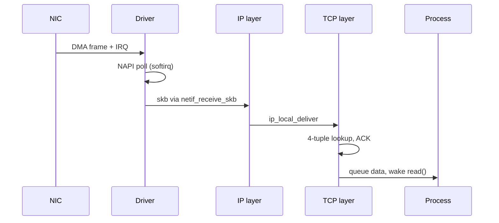

# The Networking Stack

> **Goal:** follow a byte from `write()` on a socket to electrical signals and
> back, meet the kernel objects involved (sockets, sk_buffs, interfaces,
> routes, netfilter), and pre-build every concept container networking will
> need.

## The layered reality

The kernel implements the classic TCP/IP stack. Mapping the theory to what
Linux actually has:

```text
  application        your process: nginx, curl, ssh        (user space)
──────────────────── socket syscalls ─────────────────────
  transport          TCP / UDP        ← ports, reliability  (kernel)
  network            IP               ← addressing, routing  (kernel)
  link               Ethernet, ARP    ← frames on one LAN    (kernel+driver)
  physical           the NIC          ← bits on a wire       (hardware)
```

Each layer wraps the previous: your HTTP bytes ride in TCP segments, inside
IP packets, inside Ethernet frames. The kernel does all the
wrapping/unwrapping; applications only ever see the socket bytestream. The
boundary between the top two rows is the [syscall
interface](#/kernel-vs-userspace); everything below it until the NIC is one
kernel subsystem, `net/`, at roughly a million lines of code.

The overhead is concrete: a standard Ethernet frame carries at most 1500
bytes of payload (the **MTU**). Subtract 20 bytes of IPv4 header and 20 bytes
of TCP header and you get the default **MSS** of 1460 bytes (1440 for IPv6,
whose base header is 40 bytes). Every layer's header is real bytes on the
wire that your goodput doesn't get.

## Sockets: the API

A **socket** is a kernel object (held via a file descriptor, naturally) that
represents one communication endpoint. The server-side liturgy:

```text
socket() → bind(:80) → listen() → accept() ──► new fd per client
                                                read()/write()
client:   socket() → connect(host:80)        → write()/read()
```

A TCP connection is uniquely identified by the 4-tuple
`(src IP, src port, dst IP, dst port)` — that's how one server on port 80
talks to thousands of clients simultaneously: every connection's tuple
differs, and the kernel demultiplexes incoming segments to the right socket.

Internally there are two structs, and the split matters when reading kernel
code:

- `struct socket` — the thin VFS-facing wrapper: it holds the `file`
  association, the socket `state`, and an `ops` pointer to the
  protocol-family operations (`inet_stream_ops` for TCP). This is what your
  fd resolves to.
- `struct sock` (universally called `sk`) — the real network-side object.
  Its fields are the chapter in miniature: `sk_receive_queue` and
  `sk_write_queue` (linked lists of buffered packets), `sk_rcvbuf` and
  `sk_sndbuf` (the byte limits on those queues), `sk_state` (the TCP state
  below), and `sk_data_ready` (the callback that wakes readers when data
  arrives). For TCP, `struct sock` is actually embedded at the head of the
  much larger `struct tcp_sock`, which adds sequence numbers (`snd_nxt`,
  `rcv_nxt`), the congestion window (`snd_cwnd`), and RTT estimates.

Demultiplexing is a hash-table lookup, not a scan. TCP keeps its sockets in
`struct inet_hashinfo` (the global instance is `tcp_hashinfo`): the **ehash**
table for established connections keyed by 4-tuple, and a listener table
keyed by port. An arriving segment costs one hash + one bucket walk to find
its socket — O(1) whether you have ten connections or a million.

```bash
ss -tlnp        # listening TCP sockets and who owns them
ss -tnp | head  # established connections
ss -s           # summary: total TCP/UDP/RAW sockets
ss -t -o        # connections with timers (keepalive, retransmit, etc.)
```

### Two queues behind listen()

`listen()` actually creates two queues, and confusing them causes real
outages:

1. **SYN queue** (incomplete connections): the kernel got a SYN, replied
   SYN-ACK, and is waiting for the final ACK. Sized by
   `net.ipv4.tcp_max_syn_backlog`. When it overflows, **SYN cookies**
   (`net.ipv4.tcp_syncookies=1`, the default) encode the connection state
   into the SYN-ACK's sequence number so nothing needs to be stored — the
   classic SYN-flood defence.
2. **Accept queue** (complete connections waiting for `accept()`): sized by
   `min(backlog, net.core.somaxconn)`. `somaxconn` defaults to 4096 since
   kernel 5.4 (it was 128 for two decades). If your process is too slow to
   call `accept()`, this queue fills and new connections get dropped —
   visible as `ListenOverflows` in `nstat`.

```bash
ss -ltn                     # Recv-Q = current accept-queue depth, Send-Q = its limit
nstat -az | grep -i listen  # ListenOverflows / ListenDrops counters
```

### The socket states (TCP state machine)

Every TCP socket moves through states tracked in `sk->sk_state`:

```text
LISTEN → SYN_RECV → ESTABLISHED → FIN_WAIT1 → FIN_WAIT2 → TIME_WAIT → CLOSED
                                     ↓
                              CLOSE_WAIT → LAST_ACK → CLOSED

TIME_WAIT lasts a fixed 60 seconds on Linux (TCP_TIMEWAIT_LEN, a
compile-time constant standing in for 2×MSL) — the socket lingers to catch
straggler packets and prevent old segments corrupting a new connection that
reuses the tuple. A server that opens/closes thousands of connections can
accumulate TIME_WAIT sockets; this is normal, not a leak.
```

Two common misconceptions worth killing: `net.ipv4.tcp_fin_timeout` does
**not** control TIME_WAIT — it controls how long an orphaned socket may sit
in FIN_WAIT2. And a socket in TIME_WAIT is cheap: the kernel demotes it from
a full `tcp_sock` to a minimal `struct inet_timewait_sock` (well under 200
bytes), so tens of thousands cost a few megabytes.

```bash
ss -tan | awk '{print $1}' | sort | uniq -c  # count by state
cat /proc/net/sockstat           # socket counts system-wide
cat /proc/sys/net/ipv4/tcp_fin_timeout  # FIN_WAIT2 timeout (NOT TIME_WAIT)
```

What TCP itself gives you (all inside the kernel): ordered, reliable delivery
(sequence numbers + retransmission, with retransmit timers built on the
[timer subsystem](#/timers)), flow control (don't drown the receiver), and
congestion control (don't drown the network — CUBIC by default, dissected in
[TCP Congestion Control & Tuning](#/tcp-congestion)).

UDP gives you none of that — just addressed datagrams — which is why DNS,
games and QUIC use it. And for processes on the *same* machine, Unix domain
sockets skip the whole stack below the socket layer — see [Pipes, FIFOs &
Unix Sockets](#/ipc-pipes).

### Kernel bypass for performance

A normal socket path involves copies, sk_buff allocations, and kernel
processing — call it 1–3 µs and a few thousand cycles per packet. At 10 Gbit/s
with minimum-size 64-byte frames that's 14.88 million packets per second,
about 67 ns per packet: no per-packet kernel path fits in that budget.

For that regime, kernel-bypass frameworks like **DPDK** and **AF_XDP** let
user space directly send and receive raw packets from NIC hardware queues,
bypassing the kernel stack entirely. This is how high-frequency trading and
carrier-grade load balancers work — but it's a niche: you lose all kernel
TCP/UDP/IP processing, netfilter, and `ss`-style observability, and must
implement everything in user space or hardware.

## The sk_buff: one struct to rule the stack

Every packet inside the kernel *is* a `struct sk_buff` ("skb") — arguably
the most important struct in `net/`. It's a descriptor (about 232 bytes on
x86-64 in v6.12) pointing at a separately allocated data buffer, and its
design encodes the layering trick:

- `head`, `data`, `tail`, `end` — four pointers into the data buffer.
  `head`→`end` is the whole allocation; `data`→`tail` is the currently
  valid content. Headers are added by moving `data` *backwards*
  (`skb_push()`) and removed by moving it forwards (`skb_pull()`) — **no
  copying**. The buffer is allocated with headroom so TCP, IP, and Ethernet
  can each prepend their header into pre-reserved space.
- `len` / `data_len` — total bytes, and how many live in paged fragments
  (big packets keep payload in page fragments, not the linear buffer).
- `dev` — the `struct net_device` this skb arrived on or will leave through.
- `sk` — the owning socket, if any.
- `cb[48]` — a 48-byte scratch "control buffer" each layer may use privately
  (TCP stores per-segment sequence bookkeeping here as `struct tcp_skb_cb`).

So "passing a packet up/down the stack" is really passing one pointer around
and nudging `skb->data`. The payload is ideally copied exactly twice in its
life: user buffer → kernel on `write()`, and DMA-buffer → user on `read()`
(and `sendfile()`/`splice()` can eliminate the first one).

## The journey of a packet

**Sending** (`write(fd, "GET /…", n)`):

1. Bytes are copied from your buffer into skbs on the socket's **send
   queue** (`sk_write_queue`); `write()` returns — transmission is
   asynchronous from your program's view. (If the buffer is full, `write()`
   blocks or returns `EAGAIN`.)
2. TCP decides *when* to send (congestion window, Nagle, pacing) and slices
   the stream into segments respecting the MSS, stamps ports/sequence
   numbers, sets flags (SYN, ACK, PSH). With **TSO** (TCP Segmentation
   Offload) it cheats: it builds one up-to-64 KiB super-segment and lets the
   NIC do the slicing in hardware, cutting per-packet CPU cost dramatically.
3. IP adds addresses and TTL, consults the **routing table** → which
   interface, which next hop? Builds the IP header.
4. The neighbour subsystem resolves next-hop IP → MAC address via **ARP**
   (IPv4) or **NDP** (IPv6). Cached in the neighbour table as
   `struct neighbour` entries.
5. The skb is enqueued on the **qdisc** (queue discipline) attached to the
   interface; the driver dequeues it, writes a descriptor into the NIC's TX
   **DMA ring buffer**, and the NIC puts it on the wire and raises an
   [interrupt](#/interrupts) when done so the driver can free the skb.

**Receiving** mirrors it: NIC DMAs the frame into pre-allocated RX-ring
buffers → interrupt → driver work in softirq context → IP validates the
header, checks "is this for me?" (or forwards it if routing) → TCP matches
the 4-tuple in `tcp_hashinfo`, ACKs the segment, queues the payload on that
socket's `sk_receive_queue` → `sk_data_ready` wakes any process blocked in
`read()` or `epoll_wait()`.



### NAPI: interrupts don't scale

One interrupt per packet melts a CPU at high rates (recall
[interrupt overhead](#/interrupts)). **NAPI** is the fix, and every modern
driver uses it: on the first packet the driver *disables* its RX interrupt
and schedules a poll (`napi_schedule()` raises `NET_RX_SOFTIRQ`). The softirq
handler `net_rx_action()` then calls the driver's poll function in a loop,
harvesting packets from the ring **without further interrupts**.

Two budgets bound the loop: each NAPI instance may process 64 packets per
poll (its weight), and one softirq invocation stops after
`net.core.netdev_budget` packets (default 300) or `netdev_budget_usecs`
(default 2000 µs = 2 ms), re-arming the interrupt when the ring runs dry.
Under sustained load the polling migrates into the per-CPU `ksoftirqd`
threads — which is why a loaded server shows `ksoftirqd/N` burning CPU:
that's your network stack.

Then **GRO** (Generic Receive Offload) — the receive-side twin of TSO —
coalesces consecutive segments of the same flow into one large skb (up to
~64 KiB) *before* the stack processes it, so IP and TCP run once per 45
packets instead of once per packet.

Multi-queue NICs spread this across CPUs: **RSS** hashes the 4-tuple in
hardware to pick an RX queue (each with its own IRQ, steerable via
`/proc/irq/*/smp_affinity`), and **RPS/RFS** do the same in software,
preferring the CPU where the consuming application runs.

```bash
ip -s link show eth0        # TX/RX bytes, packets, errors, drops
ethtool -g eth0             # RX/TX ring sizes (typically 256–4096 descriptors)
ethtool -l eth0             # number of hardware queues
netstat -s | head -40       # kernel TCP/UDP/IP stats ("TcpExt:" section is gold)
ss -m                       # socket memory usage
cat /proc/net/softnet_stat  # per-CPU: processed / dropped / squeezed (budget hit)
```

### Qdiscs: the queue you didn't know you had

Between IP and the driver sits a **qdisc** — a pluggable queueing algorithm
per interface. The kernel's compiled-in default is `pfifo_fast` (three dumb
FIFO bands), but systemd sets `net.core.default_qdisc=fq_codel` on virtually
every modern distro: fair queueing so one bulk flow can't starve your SSH
session, plus CoDel's ~5 ms target delay to fight **bufferbloat** (oversized
queues turning into seconds of latency). `tc qdisc show` tells you which
you're running; the interaction between qdiscs, pacing, and BBR gets a full
treatment in [TCP Congestion Control & Tuning](#/tcp-congestion).

### What the socket buffers really mean

Every socket has an rcvbuf and sndbuf — the `sk_rcvbuf`/`sk_sndbuf` limits
on how many bytes of skbs may sit on its queues:

```bash
cat /proc/sys/net/core/rmem_default   # default rcvbuf, typically 212992 (208 KiB)
cat /proc/sys/net/core/wmem_default   # default sndbuf, same
cat /proc/sys/net/core/rmem_max       # ceiling for setsockopt(SO_RCVBUF)
cat /proc/sys/net/ipv4/tcp_rmem       # TCP's own triple: min default max
ss -m | head                          # per-socket buffer usage
```

TCP ignores the `core` defaults and uses its own `tcp_rmem`/`tcp_wmem`
triples — typically `4096 131072 6291456` and `4096 16384 4194304` (min /
initial / max, in bytes). **Auto-tuning** then grows each connection's
buffers within `[min, max]` based on the measured **BDP**
(Bandwidth-Delay Product).

The arithmetic is unforgiving: a 10 Gbit/s path at 100 ms RTT needs 10⁹ B/s
× 0.1 s = **125 MB** in flight to stay full — if the buffer caps at 6 MB,
you get at most 6 MB / 0.1 s ≈ 480 Mbit/s no matter how fat the pipe. That's
the single most common "fast network, slow transfer" cause. (Note: calling
`setsockopt(SO_RCVBUF)` *disables* auto-tuning for that socket — usually a
downgrade.)

## Routing: every Linux box is a router

```bash
ip addr        # interfaces and their IPs
ip route       # the kernel's forwarding logic
```

```text
default via 192.168.1.1 dev wlan0            ← anything else: send to gateway
192.168.1.0/24 dev wlan0  src 192.168.1.42   ← my LAN: deliver directly
```

The kernel picks the **most specific matching prefix** (longest-prefix
match). Internally the IPv4 table is a `struct fib_table` holding an
**LC-trie** — a level-compressed trie over the 32-bit address space that
resolves a lookup in a handful of memory accesses even with a full internet
table of ~1M routes. You can literally read it:

```bash
cat /proc/net/fib_trie | head -30     # the actual trie, node by node
ip route get 8.8.8.8                  # which route and source IP would be used?
```

With `net.ipv4.ip_forward=1`, the kernel will also forward packets *between*
interfaces — your laptop becomes a router. Container networking (and
Kubernetes, and your home router, which runs Linux) is built on exactly
this.

The last routing step is layer-2: the **neighbour table** caches IP→MAC
mappings as `struct neighbour` entries, each with a state machine —
`REACHABLE` (confirmed recently), `STALE` (usable but unconfirmed), `DELAY`
→ `PROBE` (re-verifying with unicast ARP), `FAILED`. A `STALE` entry is
still used immediately; the kernel confirms it lazily. Garbage collection
kicks in above `net.ipv4.neigh.default.gc_thresh1` entries (default 128;
`gc_thresh3`, the hard cap, defaults to 1024 — a classic pain point on
Kubernetes nodes talking to thousands of peers).

```bash
ip neigh                           # the ARP/NDP neighbour table
ip -s neigh                        # includes reachability state
ping -c1 192.168.1.1 && ip neigh   # watch an entry turn REACHABLE
```

The routing table supports **policy routing**: `ip rule` chains multiple
routing tables selected by source IP, fwmark, or incoming interface. This is
used for multi-homed servers, VPN split tunnels, and advanced
[container networking](#/container-networking). And everything on this page
— tables, rules, neighbours — is per
[network namespace](#/namespaces).

## netfilter: hooks in the packet path

At five points along a packet's path through the kernel, **netfilter** lets
rules inspect/modify/drop it. `iptables` (legacy) and `nftables` (modern,
default since ~2020 on major distros, usually with an `iptables-nft` compat
shim) are the user-space tools that program those hooks.

```text
            ┌─────────► INPUT ───► local process
incoming → PREROUTING                  │
            └─► FORWARD ─┐          OUTPUT
                         ▼             │
                    POSTROUTING ◄──────┘ → outgoing
```

The five hooks are literal constants in the kernel — `NF_INET_PRE_ROUTING`,
`NF_INET_LOCAL_IN`, `NF_INET_FORWARD`, `NF_INET_LOCAL_OUT`,
`NF_INET_POST_ROUTING` — and the IP code calls into them via the `NF_HOOK()`
macro at exactly the points in the diagram. Each registered rule chain
returns a verdict: `NF_ACCEPT`, `NF_DROP`, `NF_STOLEN`, …

Three things get built on these hooks:

- **Firewalls** — `filter` table: accept/drop per rule.
- **NAT** — `nat` table rewrites addresses, *only on the first packet of a
  flow*; conntrack replays the decision for the rest. **Masquerade** = "as
  packets leave, replace their private source IP with mine, and un-rewrite
  the replies" — how your whole home shares one public IP, *and* how
  containers reach the internet.
- **Port forwarding** — DNAT in PREROUTING: "port 8080 arriving here →
  pod IP:80". This is `docker run -p 8080:80`, literally.

```bash
sudo nft list ruleset               # nftables replacement for iptables
sudo iptables -t nat -L -n -v       # NAT rules with hit counters
sudo iptables -t filter -L -n -v    # firewall rules with counters
conntrack -L 2>/dev/null | head     # the connection tracking table
```

### Connection tracking, precisely

**Conntrack** is the stateful memory making NAT and "allow established"
firewall rules possible. Each tracked flow is a `struct nf_conn` holding
**two** tuples: the original direction's and the reply direction's — and NAT
works by making the reply tuple *differ* from the mirrored original. A
masqueraded flow `10.0.0.5:43210 → 1.2.3.4:443` stores the reply tuple as
`1.2.3.4:443 → 203.0.113.7:43210` (the host's public IP); any arriving packet
matching that reply tuple gets automatically un-NATed back to the container.
Each entry also carries a state (`NEW`, `ESTABLISHED`, `RELATED`) and a
timeout — established TCP flows linger 5 days by default
(`nf_conntrack_tcp_timeout_established=432000` s), UDP 30–120 s.

The table is a hash table sized at boot from RAM (`nf_conntrack_max` is
often 262144 on multi-GB machines). When it fills, *new* connections are
dropped with the infamous log line:

```bash
cat /proc/sys/net/netfilter/nf_conntrack_max
cat /proc/sys/net/netfilter/nf_conntrack_count
dmesg | grep "nf_conntrack: table full"  # the dreaded "dropping packet" log
```

**Container link:** every Kubernetes service packet used to traverse this
machinery via kube-proxy's iptables rules — O(n) rule evaluation per packet.
That's precisely what eBPF-based dataplanes like Cilium replaced. See
[Container Networking](#/container-networking).

## Virtual networking: the container toolbox

Everything above used physical NICs. The kernel can also create **virtual**
network devices — every one a full `struct net_device` indistinguishable to
the stack from real hardware. This is the LEGO box containers are assembled
from:

| Device | What it is |
|---|---|
| `lo` | Loopback — 127.0.0.1, packets U-turn inside the kernel, never hit a NIC (MTU 65536: no wire, no wire limits) |
| **veth pair** | A virtual patch cable: two interfaces; in one end, out the other. One end goes *inside* a container's namespace, one stays outside |
| **bridge** | A virtual L2 switch (`docker0` is one) — veths plug into it, it learns MACs, forwards frames |
| **vlan / vxlan** | L2 segmentation / L2-over-UDP tunnels (VXLAN adds 50 bytes of headers — why overlay MTUs are 1450) |
| **tun/tap** | Packets to/from a *user-space program* — VPNs (OpenVPN; WireGuard is smarter — in-kernel), QEMU |
| **macvlan / ipvlan** | Give a container its own MAC/IP on the physical LAN — no NAT, direct L2 |
| **bond** | Link aggregation (LACP, round-robin, active-passive) |

A taste (root required) — the exact plumbing `docker network` automates:

```bash
sudo ip link add veth-a type veth peer name veth-b   # create the cable
sudo ip link add br0 type bridge                     # create the switch
sudo ip link set veth-b master br0                   # plug one end in
sudo ip link set veth-b up; sudo ip link set veth-a up
```

Add the fact that *network interfaces, routes, neighbour tables, conntrack,
and firewall rules all live per [network namespace](#/namespaces)*, and you
can already guess the whole container networking recipe: new namespace +
veth cable + bridge + NAT.
[Container Networking](#/container-networking) assembles it for real, and
[Build a Container by Hand](#/build-a-container) makes you type it.

## eBPF and XDP in the networking stack

[eBPF Internals](#/ebpf-internals) covers the machinery deeply, but the
attachment points belong in this picture:

- **XDP**: runs in the NIC driver's receive path, *before* sk_buff
  allocation — the program sees the raw DMA buffer and returns a verdict:
  `XDP_DROP` (cheapest possible drop — tens of millions of packets/s/core,
  the DDoS-mitigation workhorse), `XDP_PASS` (continue to the stack),
  `XDP_TX` (bounce back out the same NIC), or `XDP_REDIRECT` (to another
  NIC, CPU, or an AF_XDP user-space socket).
- **TC**: on the qdisc layer, after the packet is an skb — full packet
  rewriting, both ingress and egress. Traffic shaping, policy.
- **sockets**: per-socket programs (`SO_ATTACH_BPF`, sockmap) for custom
  filtering and socket-level redirection.

This is increasingly how high-performance container networking (Cilium) and
service-mesh data planes work: instead of long iptables chains, eBPF
programs attached at these hooks handle policy at native speed.

## Name resolution, the 30-second version

`curl example.org` first resolves the name: glibc consults
`/etc/nsswitch.conf` → `/etc/hosts`, then DNS via `/etc/resolv.conf`
(or hands off to `systemd-resolved` at 127.0.0.53). DNS queries are plain
UDP/TCP port 53 — ordinary sockets, nothing special in the kernel.
Misbehaving name resolution is user-space 99% of the time.

```bash
resolvectl status | head; getent hosts example.org
cat /etc/nsswitch.conf | grep hosts
dig +short example.org      # raw DNS query, bypasses nsswitch
```

## Follow the code (kernel v6.12)

Two traces, one per direction. Every function below exists in v6.12; read
along in `net/ipv4/` and `net/core/`.

### Transmit: write() to the wire

1. `write(fd, buf, n)` on a socket fd lands in
   [sock_write_iter()](https://elixir.bootlin.com/linux/v6.12/C/ident/sock_write_iter)
   (the socket file's `write_iter` op), which calls
   [sock_sendmsg()](https://elixir.bootlin.com/linux/v6.12/C/ident/sock_sendmsg)
   → for TCP,
   [tcp_sendmsg()](https://elixir.bootlin.com/linux/v6.12/C/ident/tcp_sendmsg).
2. [tcp_sendmsg_locked()](https://elixir.bootlin.com/linux/v6.12/C/ident/tcp_sendmsg_locked)
   does the real work: allocates skbs (leaving `MAX_TCP_HEADER` bytes of
   headroom), copies user bytes into them, charges `sk->sk_wmem_queued`
   against `sk_sndbuf` (blocking if over), and appends to the write queue.
3. [tcp_write_xmit()](https://elixir.bootlin.com/linux/v6.12/C/ident/tcp_write_xmit)
   is the sending engine: it walks the queue and asks, per segment — is
   there congestion-window room (`tp->snd_cwnd`)? receive-window room?
   does Nagle allow it? If yes,
   [__tcp_transmit_skb()](https://elixir.bootlin.com/linux/v6.12/C/ident/__tcp_transmit_skb)
   *clones* the skb (the original stays queued until ACKed — that's
   retransmission), builds the TCP header via `skb_push()`, and hands down.
4. [__ip_queue_xmit()](https://elixir.bootlin.com/linux/v6.12/C/ident/__ip_queue_xmit)
   attaches the route (`struct rtable`, cached on the socket), builds the IP
   header, and
   [ip_local_out()](https://elixir.bootlin.com/linux/v6.12/C/ident/ip_local_out)
   runs the `NF_INET_LOCAL_OUT` netfilter hook. Then
   [ip_output()](https://elixir.bootlin.com/linux/v6.12/C/ident/ip_output)
   runs `NF_INET_POST_ROUTING`, and
   [ip_finish_output2()](https://elixir.bootlin.com/linux/v6.12/C/ident/ip_finish_output2)
   looks up the `struct neighbour` for the next hop — triggering ARP if
   unresolved — and prepends the Ethernet header.
5. [__dev_queue_xmit()](https://elixir.bootlin.com/linux/v6.12/C/ident/__dev_queue_xmit)
   enqueues on the qdisc;
   [sch_direct_xmit()](https://elixir.bootlin.com/linux/v6.12/C/ident/sch_direct_xmit)
   dequeues and calls
   [dev_hard_start_xmit()](https://elixir.bootlin.com/linux/v6.12/C/ident/dev_hard_start_xmit),
   which invokes the driver's `ndo_start_xmit` operation (a member of
   `struct net_device_ops`) — the driver writes a TX descriptor into the DMA
   ring and the NIC takes it from there.

### Receive: wire to read()

1. The NIC DMAs the frame and raises an IRQ; the driver's handler just calls
   [napi_schedule()](https://elixir.bootlin.com/linux/v6.12/C/ident/napi_schedule)
   and disables further RX interrupts.
2. The `NET_RX_SOFTIRQ` handler
   [net_rx_action()](https://elixir.bootlin.com/linux/v6.12/C/ident/net_rx_action)
   polls each pending `struct napi_struct` within the 300-packet / 2 ms
   budget; the driver's poll function builds skbs from ring buffers and
   feeds them to
   [napi_gro_receive()](https://elixir.bootlin.com/linux/v6.12/C/ident/napi_gro_receive)
   for coalescing, then into
   [__netif_receive_skb_core()](https://elixir.bootlin.com/linux/v6.12/C/ident/__netif_receive_skb_core)
   — the protocol demux (also where TC ingress and packet taps like tcpdump
   hook in).
3. For IPv4:
   [ip_rcv()](https://elixir.bootlin.com/linux/v6.12/C/ident/ip_rcv)
   validates the header and runs `NF_INET_PRE_ROUTING`;
   [ip_rcv_finish()](https://elixir.bootlin.com/linux/v6.12/C/ident/ip_rcv_finish)
   does the routing lookup that decides local-vs-forward;
   [ip_local_deliver()](https://elixir.bootlin.com/linux/v6.12/C/ident/ip_local_deliver)
   runs `NF_INET_LOCAL_IN` and dispatches to the transport protocol.
4. [tcp_v4_rcv()](https://elixir.bootlin.com/linux/v6.12/C/ident/tcp_v4_rcv)
   finds the socket with
   [__inet_lookup_established()](https://elixir.bootlin.com/linux/v6.12/C/ident/__inet_lookup_established)
   (falling back to listener lookup for SYNs), then
   [tcp_rcv_established()](https://elixir.bootlin.com/linux/v6.12/C/ident/tcp_rcv_established)
   handles the common case: verify sequence numbers, schedule an ACK, queue
   the skb on `sk_receive_queue`, and call `sk->sk_data_ready` — normally
   [sock_def_readable()](https://elixir.bootlin.com/linux/v6.12/C/ident/sock_def_readable),
   which wakes whoever sleeps in `read()`/`epoll_wait()`. From there it's
   [scheduling's](#/scheduling) problem.

Source dirs worth browsing:
[net/ipv4/](https://elixir.bootlin.com/linux/v6.12/source/net/ipv4),
[net/core/](https://elixir.bootlin.com/linux/v6.12/source/net/core).

## Try it yourself

```bash
ip addr; ip route; ip neigh                  # interfaces, routes, ARP cache
ss -tlnp                                     # who is listening on what
ss -tan | awk '{print $1}' | sort | uniq -c  # connection state distribution
ss -tin | head -20                           # per-connection cwnd, rtt, retrans
ping -c2 192.168.1.1; ip neigh               # watch ARP learn the gateway
sudo tcpdump -i any -n port 53 -c 5 &        # sniff DNS…
getent hosts example.org                     # …while causing some
sudo nft list ruleset                        # modern firewall rules
cat /proc/net/softnet_stat                   # per-CPU softirq packet stats
cat /proc/sys/net/netfilter/nf_conntrack_count  # conntrack table usage
watch -n1 'grep NET_RX /proc/softirqs'       # softirq rate per CPU, live
```

For deeper poking, [observability tooling](#/observability) like
`perf trace` and bpftrace can put probes on any function named in "Follow
the code" above.

## Check your understanding

1. How does the kernel know which process gets an arriving TCP segment?

<details><summary>Show answer</summary>

It hashes the segment's 4-tuple (src IP, src port, dst IP, dst port) into
the established-connections hash table (`tcp_hashinfo.ehash`) and finds the
matching `struct sock`; data queued there wakes whichever process is
blocked reading that socket's fd. For a SYN, it falls back to the listener
lookup by destination port.

</details>

2. What does MASQUERADE rewrite, and why does it need connection tracking?

<details><summary>Show answer</summary>

It rewrites the source IP (and usually source port) of outgoing packets to
the host's address. Conntrack stores both the original and the NATed reply
tuple in `struct nf_conn`, so when replies arrive addressed to the host,
the kernel can match them and un-rewrite the destination back to the
private IP. Without that stored state, replies would be undeliverable.

</details>

3. Which three virtual devices/mechanisms would you combine to give a container internet access?

<details><summary>Show answer</summary>

A veth pair (one end inside the container's network namespace), a bridge on
the host that the outer veth end plugs into, and a MASQUERADE (SNAT)
netfilter rule so traffic leaving toward the internet carries the host's
IP.

</details>

4. What is TIME_WAIT, how long does it last on Linux, and why aren't thousands of them a leak?

<details><summary>Show answer</summary>

It's the state after actively closing a connection: the socket lingers 60
seconds (hardcoded `TCP_TIMEWAIT_LEN`, standing in for 2×MSL) to absorb
straggler packets and protect a new connection reusing the tuple. Each one
is demoted to a tiny `inet_timewait_sock`, so thousands cost only a few MB
— normal behaviour, not a resource leak. (`tcp_fin_timeout` does not
control it.)

</details>

5. Why might a 10 Gbit/s connection achieve only ~500 Mbit/s on a 100 ms cross-continent link with default settings?

<details><summary>Show answer</summary>

The Bandwidth-Delay Product is 10 Gbit/s × 100 ms = 125 MB of data that
must be in flight, but `tcp_rmem`/`tcp_wmem` cap auto-tuned buffers at a
few MB by default (~6 MB rcv, ~4 MB snd). With ~6 MB of window per 100 ms
round trip, throughput tops out near 480 Mbit/s. Raise the third value of
`tcp_rmem`/`tcp_wmem` (and `rmem_max`/`wmem_max`) for long fat pipes.

</details>

6. Your server is dropping new connections while established ones work fine, and `dmesg` shows "nf_conntrack: table full". What happened?

<details><summary>Show answer</summary>

The conntrack hash table hit `nf_conntrack_max`, so the kernel refuses to
track (and therefore drops) packets that would create *new* flows, while
already-tracked flows keep working. Fix by raising `nf_conntrack_max`,
lowering timeouts like `nf_conntrack_tcp_timeout_established` (5 days by
default), or exempting high-volume flows from tracking with a NOTRACK rule.

</details>

7. Why does the driver disable its RX interrupt when packets start arriving?

<details><summary>Show answer</summary>

That's NAPI: per-packet interrupts collapse under load, so on the first
packet the driver switches to polled mode — `net_rx_action()` in softirq
context harvests up to 64 packets per poll (bounded overall by
`netdev_budget` = 300 packets / 2 ms) and only re-enables the interrupt
when the ring is empty. Interrupt latency for the idle case, throughput for
the busy case.

</details>

## Sources & further reading

- [Linux networking documentation](https://docs.kernel.org/networking/index.html) — the kernel's own networking docs tree.
- [ip-sysctl](https://docs.kernel.org/networking/ip-sysctl.html) — authoritative reference for every `net.ipv4.*` tunable quoted in this chapter.
- [NAPI](https://docs.kernel.org/networking/napi.html) — kernel docs on the polling model, budgets, and IRQ mitigation.
- [Scaling in the Linux Networking Stack](https://docs.kernel.org/networking/scaling.html) — RSS, RPS, RFS, XPS explained by their authors.
- [tcp(7) man page](https://man7.org/linux/man-pages/man7/tcp.7.html) — socket options, `tcp_rmem`/`tcp_wmem` semantics, auto-tuning caveats.
- [ip(8) man page](https://man7.org/linux/man-pages/man8/ip.8.html) — the `ip` command used throughout.
- [net/ source tree, v6.12](https://elixir.bootlin.com/linux/v6.12/source/net) — browse everything traced above.
- "Monitoring and Tuning the Linux Networking Stack: Receiving Data" (Joe Damon, packagecloud blog) — the classic exhaustive walk through the RX path.

---

**Next:** TCP creates the connection, but congestion control decides how fast
it sends. CUBIC, BBR, ECN, pacing, bufferbloat, and the tuning knobs that
transform network performance from acceptable to extraordinary:
[TCP Congestion Control & Tuning](#/tcp-congestion).
