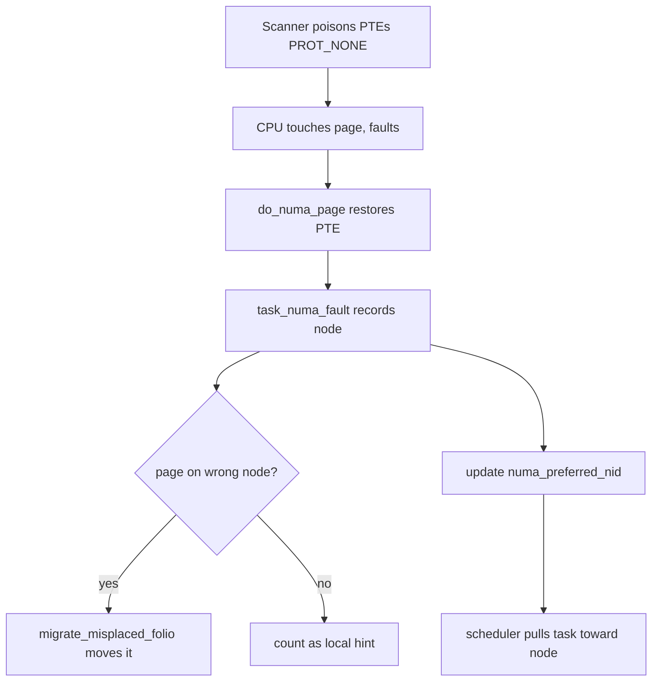

# NUMA Deep Dive

> **Goal:** understand the Non-Uniform Memory Access architecture that every multi-socket server uses, how the kernel (partially) hides it, what happens when it fails to, and the profound consequences for application performance — database latency, VM density, and container placement.

## The physical reality

In a single-socket system, one CPU die connects to one set of memory DIMMs through one memory controller. Latency is uniform: every core sees roughly the same time to any address — on modern DDR4/DDR5 servers, ~80-100 ns of load-to-use latency for a cache miss that hits DRAM. This is **UMA** (Uniform Memory Access).

In a two-socket system, each socket has its own integrated memory controller
and its own DIMMs. A core on socket 0 reaches socket 0's memory at ~80-100 ns
— but socket 1's memory means the request travels across the inter-socket
link, gets serviced by socket 1's controller, and comes back: ~130-150 ns.

That ~50-60 ns gap is the **NUMA penalty**, usually quoted as a *distance
ratio* of ~1.5-2.1×. On four-socket systems, or when a request takes two hops,
remote latency can exceed 300 ns. Bandwidth suffers too: the cross-socket link
(Intel UPI, AMD Infinity Fabric) has less bandwidth than local DRAM, so a
remote-heavy workload saturates the link long before it saturates memory.

```text
    ┌──────────── Socket 0 ────────────┐  ┌──────────── Socket 1 ────────────┐
    │  CPU 0   CPU 1   CPU 2   CPU 3   │  │  CPU 4   CPU 5   CPU 6   CPU 7   │
    │    │       │       │       │     │  │    │       │       │       │     │
    │    └───────┴───┬───┴───────┘     │  │    └───────┴───┬───┴───────┘     │
    │         Memory Controller        │  │         Memory Controller        │
    │         (Node 0, local)          │  │         (Node 1, local)          │
    │            DIMMs 64 GB           │  │            DIMMs 64 GB           │
    └────────────┬─────────────────────┘  └────────────┬─────────────────────┘
                 │                                     │
                 └──────────── UPI / Infinity Fabric ───┘
                         (inter-socket link, ~10-50 ns hop)
```

This isn't exotic. Any server with more than one physical CPU package is NUMA.
Cloud instances with many vCPUs run on NUMA hosts, and a large instance may
straddle two host nodes.

Your 128-core Threadripper or EPYC workstation is NUMA even with a single
socket: AMD builds these from multiple compute dies (CCDs) plus an I/O die,
and depending on the firmware's *NUMA Nodes Per Socket* (NPS) setting the
memory channels are partitioned into 1, 2, or 4 nodes per socket.

Recent Intel Xeon (Sapphire/Emerald Rapids) offer the same idea as *Sub-NUMA
Clustering* (SNC), splitting one physical socket into 2-4 logical NUMA nodes
so that cores talk to the nearest memory controller tile on the mesh.

## How the kernel sees NUMA

The kernel represents NUMA topology as **nodes**. Firmware describes the layout in two ACPI tables: the **SRAT** (System Resource Affinity Table) maps each CPU and memory range to a *proximity domain* (which becomes a node), and the **SLIT** (System Locality Information Table) gives a matrix of relative inter-node distances. The kernel reads these at boot and builds one [struct pglist_data](https://elixir.bootlin.com/linux/v6.12/C/ident/pglist_data) (typedef `pg_data_t`) per node.

That structure is the heart of the memory manager's per-node view. The fields that matter:

- `node_zones[]` — the memory zones on this node (`ZONE_DMA`, `ZONE_DMA32`, `ZONE_NORMAL`, `ZONE_MOVABLE`). Each [struct zone](https://elixir.bootlin.com/linux/v6.12/C/ident/zone) owns the free-page lists (`free_area[]`) and watermarks (`_watermark[]`) the allocator works against. See [Virtual Memory](#/memory) for zones and the buddy allocator.
- `node_zonelists[]` — the *fallback order*. Each node has an ordered list of every zone in the whole machine, nearest first. When the local node can't satisfy an allocation, this list dictates which remote node the allocator tries next. This is where "distance" becomes an actual code path.
- `node_id` — the integer node number (`0`, `1`, …).
- `node_present_pages` / `node_spanned_pages` — how much physical memory this node actually has.
- `kswapd` — the per-node reclaim kthread (`kswapd0`, `kswapd1`, …). Reclaim is per-node: pressure on node 0 wakes `kswapd0`, not the whole machine.

You can read all of this from userspace:

```bash
numactl --hardware
# available: 2 nodes (0-1)
# node 0 cpus: 0 1 2 3 4 5 6 7 8 9 10 11 12 13 14 15
# node 0 size: 64031 MB
# node 0 free: 57912 MB
# node 1 cpus: 16 17 18 19 20 21 22 23 24 25 26 27 28 29 30 31
# node 1 size: 64497 MB
# node 1 free: 61234 MB
# node distances:
# node   0   1
#   0:  10  21     ← 1.0x local, 2.1x to remote
#   1:  21  10

# The per-node view under sysfs
ls /sys/devices/system/node/
# node0/ node1/
cat /sys/devices/system/node/node0/cpulist    # CPUs on node 0
cat /sys/devices/system/node/node0/meminfo     # memory breakdown for node 0
cat /sys/devices/system/node/node0/distance    # this node's row of the SLIT

# Per-node allocation statistics
cat /sys/devices/system/node/node0/numastat
# numa_hit       234567890   ← allocation wanted this node and got it
# numa_miss        1234567   ← allocation wanted another node, landed here (overflow in)
# numa_foreign     9876543   ← allocation wanted this node, went elsewhere (overflow out)
# interleave_hit          0  ← interleave policy allocation satisfied here
# local_node      234000000  ← allocated here by a task running on this node
# other_node         567890  ← allocated here by a task running on another node
```

The distance values come straight from the SLIT, in units of 10. The kernel hard-codes `LOCAL_DISTANCE = 10` and `REMOTE_DISTANCE = 20` as reference points, and `RECLAIM_DISTANCE = 30`: if a node is farther than 30, the allocator would rather reclaim local pages than spill to it (this is the `zone_reclaim_mode` boundary). A value of `21` means remote memory is 2.1× the local latency — close enough that spilling is cheaper than reclaiming, so by default the kernel spills.

## The kernel's memory allocation policy

When a process running on CPU 0 touches a freshly-`mmap()`ed page for the first time, it takes a page fault, and the fault handler must choose *which node's* physical memory to hand out. That decision is the **NUMA memory policy**, held in [struct mempolicy](https://elixir.bootlin.com/linux/v6.12/C/ident/mempolicy) (defined in `mm/mempolicy.c`). The fields that matter:

- `mode` — `MPOL_DEFAULT`, `MPOL_BIND`, `MPOL_PREFERRED`, `MPOL_INTERLEAVE`, `MPOL_LOCAL`, or (since 6.1) `MPOL_PREFERRED_MANY` and `MPOL_WEIGHTED_INTERLEAVE` (6.9).
- `nodes` — a `nodemask_t` bitmap of the nodes this policy applies to.
- `flags` — modifiers like `MPOL_F_STATIC_NODES` (don't remap the mask when the task's cpuset changes) and `MPOL_F_RELATIVE_NODES`.
- `refcnt` — policies are reference-counted because a single policy can be shared by many VMAs.

Policies attach at two scopes. A *task policy* (set via `set_mempolicy(2)`) is the default for the whole process; a *VMA policy* (set via `mbind(2)`) overrides it for one address range and is stored on the [struct vm_area_struct](https://elixir.bootlin.com/linux/v6.12/C/ident/vm_area_struct). VMA policy wins when both exist.

### Default: first-touch (local) allocation

With `MPOL_DEFAULT`, the kernel allocates a page from the node of the CPU that faults it in. This is **first-touch**: memory is placed lazily, at the moment of first write, on whoever touches it first — not when `malloc()` returns. It is simple and correct when:

- Threads stay on their NUMA node (good affinity), and
- The thread that first touches the memory is the thread that will keep using it.

It fails badly when:

- A single initializer thread on node 0 pre-faults a big array (`memset` the whole thing), then worker threads on node 1 crunch it → every worker access is remote.
- A thread migrates after touching its data, and the pages don't follow.

First-touch is *the* thing to internalize: `numactl` and `mbind()` don't move memory that already exists, they only steer where the *next* first-touch lands.

### Explicit policies

```bash
# Bind: allocate ONLY from node 0 — fails with ENOMEM if node 0 can't satisfy it
numactl --membind=0 ./myapp

# Preferred: try node 0 first, silently fall back to others if full
numactl --preferred=0 ./myapp

# Interleave: round-robin every page across nodes 0 and 1
numactl --interleave=0,1 ./myapp

# The C API behind these (from <numaif.h>):
#   set_mempolicy(MPOL_BIND, &nodemask, maxnode);         // whole task
#   mbind(addr, len, MPOL_INTERLEAVE, &nodemask, maxnode, 0); // one range
#   move_pages(pid, count, pages, nodes, status, flags);  // migrate existing pages
```

Interleave is the classic answer to "one thread allocates, many use": by
striping pages across nodes at page granularity, every accessor gets a
predictable fraction of local hits and the memory bandwidth of *both*
controllers instead of one.

The cost is that it guarantees ~50% of accesses are remote on a 2-node box,
and it fights [transparent huge pages](#/memory): a 2 MiB huge page must come
from a single node, so a strictly interleaved region can't be backed by THP.
Since 6.9, `MPOL_WEIGHTED_INTERLEAVE` lets you bias the ratio (e.g. more pages
on faster CDXL/HBM tiers), which matters on tiered-memory machines.

### AutoNUMA: the kernel doing it for you

Since Linux 3.13, `CONFIG_NUMA_BALANCING` gives **automatic NUMA balancing** (AutoNUMA). Rather than trust first-touch forever, the kernel periodically samples where pages *are* versus where they're *used*, and migrates both pages and tasks to reduce remote accesses:

```bash
cat /proc/sys/kernel/numa_balancing    # 0 = off, 1 = on (default on if the kernel supports it)
```

The mechanism is a deliberate trick. A kthread-driven scanner walks a task's
page tables and strips the access bits from a batch of PTEs, marking them
**`PROT_NONE`** (specifically the `_PAGE_PROTNONE` encoding — the page is
still present, just poisoned for access).

The next time any CPU touches such a page, the MMU raises a fault. That **NUMA
hinting fault** is not a real protection error; the handler restores the PTE
and records *which node the faulting CPU was on*.

Accumulate enough of these and the kernel knows, per page and per task, where
the demand actually is. Then it migrates the page to the node that keeps
faulting on it, and — through the scheduler — nudges the task toward the node
that holds most of its pages.

```bash
# The knobs (all under /proc/sys/kernel/)
cat /proc/sys/kernel/numa_balancing_scan_size_mb        # pages scanned per pass (default 256)
cat /proc/sys/kernel/numa_balancing_scan_period_min_ms  # fastest scan interval (default 1000)
cat /proc/sys/kernel/numa_balancing_scan_period_max_ms  # slowest scan interval (default 60000)
cat /proc/sys/kernel/numa_balancing_scan_delay_ms       # grace period for a new task (default 1000)

# Monitor AutoNUMA activity
grep numa /proc/vmstat
# numa_pte_updates:      pages poisoned to PROT_NONE for hinting
# numa_hint_faults:      hinting faults taken
# numa_hint_faults_local: faults that were already local (no migration needed)
# numa_pages_migrated:   pages actually moved between nodes
```

The scan period is **adaptive**: a task whose pages are already well-placed gets scanned less often (period rises toward 60 s), while a task with lots of remote faults gets scanned aggressively (down to 1 s). The cost is real — extra minor faults, TLB shootdowns on migration, and scanner CPU — usually a fraction of a percent, but visible. For a workload you've already pinned by hand (a database with careful `numactl`, a latency-sensitive VM), AutoNUMA is pure overhead and jitter:

```bash
echo 0 > /proc/sys/kernel/numa_balancing        # runtime off
# or at boot:  numa_balancing=disable
```

For a workload with poor initial placement and no hand-tuning, it can lift throughput 20-50%. The rule of thumb: *let AutoNUMA run unless you've already done the placement yourself.*

## Scheduling and NUMA

The scheduler is NUMA-aware, and since 6.6 that scheduler is **EEVDF** (Earliest Eligible Virtual Deadline First), which replaced CFS — see [CPU Scheduling](#/scheduling). The NUMA-balancing machinery is largely orthogonal to the picking-the-next-task algorithm, though: it lives in the placement and load-balancing paths of `kernel/sched/fair.c` and predates the EEVDF switch.

Each task carries NUMA accounting in its [struct task_struct](https://elixir.bootlin.com/linux/v6.12/C/ident/task_struct):

- `numa_faults` — a per-node array of recent hinting-fault counts, split into memory faults and CPU faults, decayed over time. This is the evidence base for "where does this task's memory actually live."
- `numa_preferred_nid` — the node the scheduler currently believes the task belongs on.
- `numa_scan_seq` / `numa_scan_period` — bookkeeping for the adaptive scanner.
- `numa_group` — a pointer to a shared [struct numa_group](https://elixir.bootlin.com/linux/v6.12/C/ident/numa_group) when several threads touch the same pages. Grouping lets the kernel co-locate a whole thread pool with its shared working set instead of fighting over individual threads.

The scheduler builds a hierarchy of **sched domains** that mirrors the hardware: SMT siblings, then a core cluster / LLC, then the NUMA node, then cross-node NUMA domains ordered by SLIT distance. Load balancing is cheap and frequent inside a node and deliberately reluctant across nodes. When it *would* pull a task to a remote node purely for load, it applies an imbalance threshold so a small imbalance doesn't trigger an expensive cross-node migration that strands the task away from its memory.

```bash
# Inspect the domain hierarchy the scheduler built
cat /sys/kernel/debug/sched/domains/cpu0/domain*/name
# SMT
# MC        (multi-core / LLC)
# NUMA
cat /proc/schedstat | head
```

**VM link:** KVM leans on all of this. A vCPU is just a thread; if you don't pin it, AutoNUMA and the load balancer will chase it around, dragging guest memory locality with them. Production hypervisors pin vCPUs to physical CPUs (`virsh vcpupin`, or a `cpuset` cgroup) and pin guest RAM to the matching node, so a guest whose vCPUs *and* memory both sit on node 0 avoids the remote penalty entirely. Libvirt can also expose the host topology to the guest as a *virtual* NUMA layout so the guest OS makes its own good decisions. See [KVM & Virtualization Internals](#/kvm-internals).

## The SLIT matrix on real machines

The SLIT scales past two nodes, and that's where topology gets interesting:

```bash
# A 2-socket AMD EPYC set to NPS=4 (4 NUMA nodes per socket = 8 nodes total):
# node   0   1   2   3   4   5   6   7
#   0:  10  12  12  12  32  32  32  32   ← 1.2x = sibling die, same socket
#   4:  32  32  32  32  10  12  12  12   ← 3.2x = across the socket link
numactl --hardware | tail -n +5   # full distance matrix
```

On chiplet designs (EPYC) and mesh designs with sub-NUMA clustering (recent Xeon), latency varies *within* a socket, not just across sockets. The kernel models this faithfully because the SLIT (and, on newer platforms, the richer **HMAT** — Heterogeneous Memory Attribute Table, which reports actual latency and bandwidth numbers rather than relative distances) tells it. Getting placement right on an 8- or 16-node machine is worth far more than on a plain 2-socket box, because the worst-case remote hop is much more expensive.

## Real-world NUMA pathologies

### 1. The single-initializer problem

A main thread `memset`s a huge buffer at startup, then hands slices to workers spread across nodes. First-touch put every page on node 0, so every worker on node 1 is remote.

```bash
perf stat -e node-loads,node-load-misses,node-stores,node-store-misses ./myapp
# node-load-misses / node-loads > ~30% → serious remote traffic

# Fixes, in order of preference:
#  1. Have each worker first-touch its own slice (parallel init).
#  2. numactl --interleave=all ./myapp   (spread the pain evenly)
#  3. Leave AutoNUMA on and let it migrate the hot pages.
```

### 2. Node imbalance and silent remote spill

Node 0 has 2 GB free, node 1 has 60 GB free. A task on node 0 under `MPOL_DEFAULT` allocates 3 GB. The allocator honors first-touch until node 0 hits its low watermark, then walks the zonelist and spills the rest onto node 1 — the allocation *succeeds*, but a chunk of it is silently remote forever. If the policy had been `MPOL_BIND` to node 0, the same request would instead fail with `ENOMEM` or trigger the [OOM killer](#/lab-oom-killer) despite 60 GB sitting idle next door.

```bash
numastat -m        # per-node memory breakdown; watch numa_foreign climb on the busy node
```

### 3. The KSM cross-node trap

Kernel Same-page Merging deduplicates identical pages across VMs. If two VMs on *different* nodes share a page, KSM keeps one physical copy on one node — the other VM's access to it becomes permanently remote.

```bash
cat /sys/kernel/mm/ksm/merge_across_nodes   # 1 = merge freely, 0 = keep merges node-local
echo 0 > /sys/kernel/mm/ksm/merge_across_nodes   # trade dedup ratio for locality
```

### 4. Interleave versus huge pages

Strictly interleaving a region at 4 KiB granularity means no 2 MiB THP can back it (a huge page needs 512 contiguous 4 KiB frames from *one* node). You spread bandwidth but lose the TLB win of huge pages. On a working set that would otherwise fit comfortably in huge pages, that can be a net loss.

```bash
grep -E 'thp_fault_alloc|thp_collapse_alloc' /sys/devices/system/node/node*/vmstat
```

## NUMA and containers

**Container link:** the cgroup interface that pins a workload to a node is [cpuset](#/cgroups), specifically two files in the cgroup v2 hierarchy (which is the default on modern distros — systemd, Kubernetes, Docker all mount v2):

```bash
# cgroup v2 (default). The unified hierarchy lives under /sys/fs/cgroup/
cat /sys/fs/cgroup/mygroup/cpuset.cpus   # which CPUs tasks may run on
cat /sys/fs/cgroup/mygroup/cpuset.mems   # which NUMA nodes tasks may allocate from
echo 0 > /sys/fs/cgroup/mygroup/cpuset.mems   # confine allocation to node 0
```

`cpuset.mems` is a hard `MPOL_BIND`-style constraint layered *under* any
policy the task sets for itself: even `numactl --membind=1` can't escape a
cpuset that only lists node 0.

That's the mechanism Kubernetes' **Topology Manager** uses. With
`--topology-manager-policy=single-numa-node`, kubelet only admits a
Guaranteed-QoS pod if a single node has enough free CPUs *and* memory *and*
device (e.g. GPU/NIC) capacity, then writes `cpuset.cpus` and `cpuset.mems` so
every container in the pod is aligned to that one node.

A pod that spans nodes on a busy host can lose 30-50% of its effective memory
bandwidth — microseconds per access that compound into milliseconds of tail
latency. See [What a Container Actually Is](#/containers-overview) and
[Control Groups](#/cgroups).

## Follow the code (kernel v6.12)

Two paths are worth tracing: how a normal allocation picks a node, and how AutoNUMA migrates a page.

### Path A — where does a new page come from?

1. A userspace write to an unpopulated page traps into [handle_mm_fault()](https://elixir.bootlin.com/linux/v6.12/C/ident/handle_mm_fault) (`mm/memory.c`), the top of the page-fault machinery described in [Virtual Memory](#/memory).
2. For an anonymous page it reaches `do_anonymous_page()`, which calls the folio allocator. Under a NUMA kernel this goes through [alloc_pages_mpol()](https://elixir.bootlin.com/linux/v6.12/C/ident/alloc_pages_mpol), which consults the VMA's or task's `struct mempolicy` to turn `mode` + `nodes` into a preferred node id and a zonelist.
3. That lands in [__alloc_pages()](https://elixir.bootlin.com/linux/v6.12/C/ident/__alloc_pages) (`mm/page_alloc.c`), the buddy allocator's core. It walks the chosen node's `node_zonelists[]` — the fallback order built from the SLIT — calling [get_page_from_freelist()](https://elixir.bootlin.com/linux/v6.12/C/ident/get_page_from_freelist) on each zone.
4. `get_page_from_freelist()` checks each zone's watermark. If the local node's zones are above their watermarks, it returns a local page and increments `numa_hit`. If the local node is below the min watermark, it either wakes `kswapd` and reclaims locally, or (depending on distance and `zone_reclaim_mode`) continues down the zonelist to a remote node — that's the silent spill, counted as `numa_miss` here and `numa_foreign` on the node that wanted the page.

The takeaway: "local allocation" isn't a special case, it's just the fact that a node's own zones sit first in its zonelist. Remote allocation is the same code path continuing past the local zones.

### Path B — a NUMA hinting fault migrates a page

1. Periodically the scheduler runs [task_numa_work()](https://elixir.bootlin.com/linux/v6.12/C/ident/task_numa_work) (`kernel/sched/fair.c`), the scanner. It walks a `numa_balancing_scan_size_mb`-sized slice of the task's address space and calls `change_prot_numa()` to strip access and set `PROT_NONE` on those PTEs, bumping `numa_pte_updates`.
2. Later, a CPU touches one of those pages and faults. The handler routes it to [do_numa_page()](https://elixir.bootlin.com/linux/v6.12/C/ident/do_numa_page) (`mm/memory.c`), which recognizes a hinting fault (present page, `PROT_NONE`), restores the original protections so the access can proceed, and records the fault.
3. It calls [task_numa_fault()](https://elixir.bootlin.com/linux/v6.12/C/ident/task_numa_fault), which credits the faulting node in the task's `numa_faults[]` array and, over many faults, feeds `task_numa_placement()` to update `numa_preferred_nid` and the shared `numa_group` statistics.
4. If the page is on the wrong node and the heuristics say move it, `do_numa_page()` calls [migrate_misplaced_folio()](https://elixir.bootlin.com/linux/v6.12/C/ident/migrate_misplaced_folio) (`mm/migrate.c`), which allocates a folio on the target node, copies the contents, fixes up every PTE that maps it, frees the old page, and bumps `numa_pages_migrated`. (This function was `migrate_misplaced_page()` before the folio conversion; on 6.12 it operates on folios.)
5. Separately, the scheduler acts on `numa_preferred_nid`: on the next balancing tick it prefers to keep or pull the task toward that node, so task and memory converge.



## Try it yourself

```bash
# Map your NUMA topology
numactl --hardware
lstopo --no-io              # from the hwloc package — visual topology graph
lscpu | grep -E 'NUMA|Socket'

# Watch NUMA misses live, machine-wide
perf stat -e node-loads,node-load-misses,node-stores,node-store-misses -a sleep 5

# Compare local vs forced-remote bandwidth (needs a STREAM-like benchmark)
numactl --membind=0 --cpunodebind=0 ./stream   # CPU and memory both on node 0
numactl --membind=1 --cpunodebind=0 ./stream   # CPU on 0, memory on 1 — forced remote
# For precise latency/bandwidth use Intel MLC or lmbench's lat_mem_rd.

# Inspect a running process's per-node page distribution
cat /proc/$(pgrep -n mysqld)/numa_maps | head
# ...anon=12345 dirty=12345 N0=12000 N1=345   ← 12000 pages on node 0, 345 on node 1

# See how a process's policy and node binding are set
numactl --show

# Pin a process to a node (CPUs and memory together)
numactl --cpunodebind=0 --membind=0 ./myapp
taskset -c 0-15 numactl --membind=0 ./myapp

# Confine an existing cgroup to node 0 (cgroup v2)
echo 0 > /sys/fs/cgroup/myservice.slice/cpuset.mems
```

## Check your understanding

1. A 2-socket server has 128 GB per node. A single-threaded process under the default policy allocates and fills 200 GB. Where do the pages land, and what's the performance consequence?

<details><summary>Show answer</summary>

First-touch fills the local node (~128 GB minus what's already used) until it hits the low watermark, then `__alloc_pages()` spills the rest — roughly 72+ GB — down the zonelist onto the remote node. The allocation succeeds, but every access to that remote portion pays the ~1.5-2× latency penalty for the life of the process, and nothing moves it back unless AutoNUMA is on.

</details>

2. AutoNUMA migrates pages and tasks. What two things does it try to co-locate, and what signal drives the decision?

<details><summary>Show answer</summary>

It co-locates a task with the pages it actually uses. The signal is **NUMA hinting faults**: the scanner marks PTEs `PROT_NONE`, and each resulting fault records which node's CPU touched the page. Accumulated in `task_struct.numa_faults[]`, these votes decide whether to migrate the page (`migrate_misplaced_folio()`) and/or steer the task (`numa_preferred_nid`).

</details>

3. `perf stat -e node-load-misses` — what ratio suggests a real NUMA problem?

<details><summary>Show answer</summary>

Look at `node-load-misses` as a fraction of `node-loads`. Under ~10% is usually fine; above ~30% means a large share of loads are crossing the interconnect and you have a placement problem worth chasing.

</details>

4. A pod's cgroup has `cpuset.mems=0`. A container tries to `mmap()` and touch 20 GB. Node 0 has 10 GB free; node 1 has 100 GB free. What happens?

<details><summary>Show answer</summary>

`mmap()` succeeds (it only reserves address space) but the *touch* faults fail: `cpuset.mems=0` is a hard constraint, so the allocator may only use node 0. Once node 0's 10 GB is exhausted and reclaim can't free enough, the task hits the OOM killer despite 100 GB free on node 1. Fix: widen the cpuset with `echo 0-1 > cpuset.mems`, or size the pod to fit one node.

</details>

5. Why does `numactl --interleave=all` often disappoint despite appearing to solve the single-initializer problem?

<details><summary>Show answer</summary>

It guarantees ~50% remote access on a 2-node box rather than eliminating remote access, and it blocks transparent huge pages (a 2 MiB page can't span nodes), raising TLB pressure. It spreads bandwidth evenly, which helps bandwidth-bound workloads, but for latency-bound ones a proper parallel-first-touch or per-node binding usually beats it.

</details>

6. EEVDF replaced CFS in kernel 6.6. Did that change how AutoNUMA works?

<details><summary>Show answer</summary>

Not materially. EEVDF changed how the scheduler picks the *next* runnable task (virtual deadlines instead of vruntime fairness). AutoNUMA's scanning, hinting faults, `numa_faults[]` accounting, and preferred-node placement live in the load-balancing and placement paths of `kernel/sched/fair.c` and are essentially orthogonal to the pick algorithm.

</details>

7. Your SLIT shows a distance of `11` between two nodes on the same socket. Why does the kernel still prefer to spill an allocation there rather than reclaim locally?

<details><summary>Show answer</summary>

`RECLAIM_DISTANCE` is 30. A neighbor at distance 11 is far below that threshold, so the allocator treats it as cheap enough to use directly instead of paying the cost of reclaiming (evicting/writing back) local pages. `zone_reclaim_mode` would have to be tuned to change that behavior, and remote reclaim-avoidance is the sensible default at such short distances.

</details>

## Sources & further reading

- Linux kernel documentation: [NUMA Memory Policy](https://docs.kernel.org/admin-guide/mm/numa_memory_policy.html) and [Automatic NUMA balancing overview](https://docs.kernel.org/mm/numa.html).
- `man 7 numa`, [`man 2 set_mempolicy`](https://man7.org/linux/man-pages/man2/set_mempolicy.2.html), [`man 2 mbind`](https://man7.org/linux/man-pages/man2/mbind.2.html), and [`man 8 numactl`](https://man7.org/linux/man-pages/man8/numactl.8.html).
- Kernel source for the paths above: [mm/mempolicy.c](https://elixir.bootlin.com/linux/v6.12/source/mm/mempolicy.c), [mm/migrate.c](https://elixir.bootlin.com/linux/v6.12/source/mm/migrate.c), and [kernel/sched/fair.c](https://elixir.bootlin.com/linux/v6.12/source/kernel/sched/fair.c).
- Documentation/scheduler and `sysctl` reference: [Kernel sysctl — kernel/](https://docs.kernel.org/admin-guide/sysctl/kernel.html) (the `numa_balancing*` knobs).
- Christoph Lameter, "NUMA (Non-Uniform Memory Access): An Overview" — ACM Queue, 2013 (background on hardware and policy trade-offs).
- Peter Zijlstra & Mel Gorman, LWN coverage of AutoNUMA and its scan/placement heuristics (search LWN.net for "automatic NUMA balancing").

---

**Next:** the kernel allocates CPU time and memory across nodes — but what if you want to ban the kernel entirely from certain cores? [CPU isolation](#/cpu-isolation), `nohz_full`, `rcu_nocbs`, IRQ pinning, and PREEMPT_RT: the tools that turn a general-purpose OS into a deterministic real-time engine.