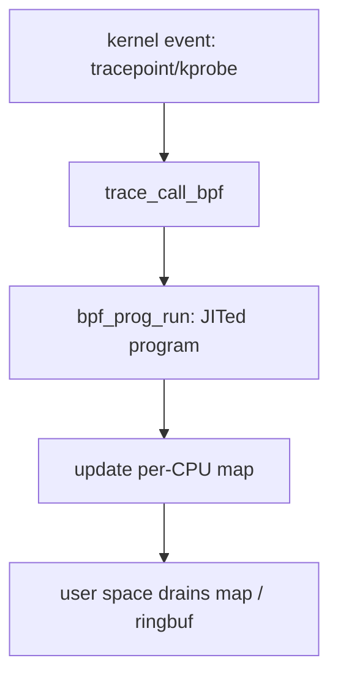

# /proc, strace, perf & eBPF

> **Goal:** assemble the observation toolkit — the tools that turn every
> claim on this site into something you can *watch happening* on a live
> system, from quick `/proc` reads to eBPF programs inside the kernel.

## The layered toolbox

```text
"what is the system doing?"
   ├── /proc, /sys ........ raw kernel state, as files       (always there)
   ├── ps/top/free/ss ..... pretty parsers of the above       (always there)
   ├── strace/ltrace ...... one process's syscalls, live      (apt install)
   ├── perf ............... CPU profiling, kernel tracepoints (apt install)
   └── eBPF (bpftrace) .... programmable kernel-side tracing  (modern kernels)
```

Rule of thumb: start at the top; descend only as far as the question requires.
Each layer down buys you more resolution and costs more perturbation. The
skill is not knowing the deepest tool — it is knowing when a `cat` of one file
already answers the question.

## The observability cost model

Every observation mechanism perturbs the system differently. The mature move
is not "use the most powerful tool"; it is choosing the cheapest probe that
can falsify the hypothesis.

| Mechanism | Strength | Cost/risk |
|---|---|---|
| `/proc`, `/sys` | exact kernel counters and state snapshots | polling can miss short events |
| `ps`, `ss`, `free` | fast summaries | hides source and interpretation |
| `strace` | complete syscall narrative for one process | ptrace stop/resume overhead, very invasive |
| `perf stat` | hardware/kernel counters | interpretation requires care |
| `perf record` | CPU stack profiles | sampling bias, symbols/unwind quality matter |
| tracepoints | stable event stream | event volume can be high |
| kprobes | almost arbitrary kernel functions | unstable internals, can be too hot |
| eBPF maps | in-kernel aggregation | verifier and map design complexity |

Put numbers on it. A `/proc` read is a syscall plus a `seq_file` render —
sub-microsecond, and it never stops the target. A `strace` round trip stops
the traced task **twice per syscall** (entry and exit), context-switching to
the tracer each time; a syscall-heavy process can slow down 10–100×. A
`perf record -F 99` samples 99 times/second per CPU — roughly 1–3% overhead.
A well-written eBPF probe that aggregates into a per-CPU map adds tens to a few
hundred nanoseconds per event, which is why it survives on production hot
paths where `strace` would melt.

The practical hierarchy:

```text
counter first
trace second
profile third
instrument hot paths only when the cheaper signals cannot answer
```

If you can answer the question with `cpu.stat`, do not kprobe the scheduler.
If `strace -c` says 90% of time is in `futex`, then a CPU flame graph alone
will lie by omission: the process is waiting, not burning CPU. Counters tell
you *whether*; profiles tell you *where*; traces tell you *why*, one event at
a time.

## /proc: the primary source

Everything `top` shows you came from here. `/proc` is not a real filesystem —
it is `procfs`, a synthetic filesystem whose files have no blocks on disk.
Each read runs kernel code that formats a live snapshot on the spot. A file
like `/proc/<pid>/status` is backed by a `struct proc_dir_entry` and, on read,
the kernel calls a generator (for status, [proc_pid_status()](https://elixir.bootlin.com/linux/v6.12/C/ident/proc_pid_status))
that walks the target's [task_struct](https://elixir.bootlin.com/linux/v6.12/C/ident/task_struct)
and prints fields through the `seq_file` interface. There is no cache: the
numbers are as fresh as the instant you `cat` them.

The per-process directories are the ones to internalize — most of them are
concepts from earlier chapters made into files:

```bash
ls /proc/$$/
cat  /proc/$$/status      # state, VmRSS, threads, capabilities, namespaces' seed
cat  /proc/$$/maps        # the address space (memory chapter, live)
ls -l /proc/$$/fd         # open fds (syscalls chapter, live)
ls -l /proc/$$/ns         # namespaces (containers, live)
cat  /proc/$$/cgroup      # cgroup membership
cat  /proc/$$/stack       # where in the KERNEL it's sleeping (root)
```

`/proc/<pid>/status` deserves a slow read. `State:` maps directly to the task
state you met in [Processes & Threads](#/processes) — `R` (running/runnable),
`S` (interruptible sleep), `D` (uninterruptible sleep, almost always waiting
on I/O), `Z` (zombie), `t` (traced/stopped). `VmRSS` is resident set size, the
physical pages backing the process right now, split into `RssAnon` (heap/stack)
and `RssFile` (file-backed, shared with the page cache — see
[Virtual Memory](#/memory)). `voluntary_ctxt_switches` versus
`nonvoluntary_ctxt_switches` is a free diagnosis: a task piling up
*non-voluntary* switches is being preempted (CPU-hungry, competing); one piling
up *voluntary* switches is blocking on something (I/O, locks).

`/proc/<pid>/stack` (root-only, needs `CONFIG_STACKTRACE`) prints the kernel
call stack of a *sleeping* task — the exact function it is blocked in. When a
process is stuck in `D` state, this file is often the whole answer: you see it
parked in [rwsem_down_read_slowpath()](https://elixir.bootlin.com/linux/v6.12/C/ident/rwsem_down_read_slowpath)
or deep in a filesystem's writeback path, and the mystery evaporates.

System-wide, the source-of-truth files:

- `/proc/meminfo` — every memory pool: `MemAvailable`, `Cached`, `Dirty`,
  `Writeback`, `Slab`, `SwapFree`. `MemAvailable` (kernel-computed, not just
  free) is the honest "how much can I allocate without swapping" number.
- `/proc/vmstat` — the raw counters `meminfo` is derived from, including
  `pgmajfault`, `pgscan_*`, and `oom_kill`.
- `/proc/pressure/{cpu,memory,io}` — **PSI**, Pressure Stall Information
  (since 4.20). Each file reports the fraction of a window in which tasks
  stalled waiting for that resource. This is the single best "is the machine
  *suffering* or merely busy?" signal, because 100% CPU utilization with
  zero CPU pressure is a healthy saturated box, while 40% utilization with
  30% pressure is a sick one.
- `/proc/interrupts`, `/proc/softirqs` — per-CPU interrupt and softirq counts,
  straight from [Interrupts, Exceptions & Softirqs](#/interrupts).
- `/proc/net/*` — `sockstat`, `snmp`, `tcp`; the raw material `ss` prettifies.

Some high-signal files deserve muscle memory:

| Question | File |
|---|---|
| Why did memory alerts fire? | `/proc/meminfo`, `/proc/vmstat`, cgroup `memory.stat` |
| Is the machine suffering or merely busy? | `/proc/pressure/{cpu,memory,io}` |
| Is this process stuck in kernel I/O? | `/proc/<pid>/stack` |
| Which namespaces is it in? | `/proc/<pid>/ns/*` |
| Which cgroup owns it? | `/proc/<pid>/cgroup` |
| What fd is leaking? | `/proc/<pid>/fd`, `/proc/<pid>/fdinfo/*` |
| Is TCP state exploding? | `/proc/net/sockstat`, `ss -s` |
| Are interrupts imbalanced? | `/proc/interrupts`, `/proc/softirqs` |

**Container link:** on a cgroup-v2 host (the default on every modern distro —
systemd mounts a single unified hierarchy at `/sys/fs/cgroup`), a container's
resource truth lives in its cgroup files, not `/proc/meminfo`. A process
inside a memory-limited container still sees the host's `MemTotal` in
`/proc/meminfo` unless something like LXCFS overlays it; the real limit and
usage are in `memory.max` and `memory.current`. See [Control Groups (cgroup v2)](#/cgroups).

## strace: the syscall narrative

Already met in [Kernel, User Space & Syscalls](#/kernel-vs-userspace); here is
the production-grade usage and the mechanism underneath.

```bash
strace -f -tt -T -o trace.log myprog     # follow forks, timestamps, durations
strace -e trace=%network curl example.org # filter by syscall family
strace -e trace=openat -Z myprog          # -Z: only FAILED calls ← gold
strace -p 1234 -c                         # attach to a runner, get a tally
```

The killer pattern — **"why doesn't it find its config?"**:

```bash
strace -e trace=openat -Z myapp 2>&1 | grep -E 'conf|ENOENT'
# openat(… "/etc/myapp/conf.yml") = -1 ENOENT
# openat(… "/usr/local/etc/conf.yml") = -1 ENOENT   ← so THAT's where it looks
```

No documentation, no source code — the syscalls cannot lie.

**How it works, and why it hurts.** `strace` is built on `ptrace(2)`. When it
attaches, the target's tracer is set and the kernel arms the
`SYSCALL_WORK_SYSCALL_TRACE` work flag on the task. On every syscall boundary,
the entry code ([syscall_trace_enter()](https://elixir.bootlin.com/linux/v6.12/C/ident/syscall_trace_enter))
checks that flag and calls [ptrace_notify()](https://elixir.bootlin.com/linux/v6.12/C/ident/ptrace_notify),
which stops the task and wakes the tracer. The tracer reads registers, decodes
the syscall, then `PTRACE_SYSCALL`-continues the target to the next stop. That
is **two full task stops and two context switches per syscall** — the source of
strace's brutal overhead. A process doing 100k syscalls/second becomes a
process doing 400k context switches/second. Never leave it running on a busy
production process; that is precisely what eBPF exists for.

Two more caveats worth internalizing:

- Remember `-f`. Anything interesting forks or spawns threads, and without
  `-f` you watch the parent do nothing while the child does the work.
- `strace` serializes the target. Timing-sensitive races often vanish under
  it (the classic Heisenbug), because every syscall now waits on a tracer.

`ltrace` does the same for *library* calls (via PLT breakpoints);
`/usr/bin/time -v` gives the one-shot summary — page faults, context switches,
peak RSS, wall vs CPU time — with essentially zero overhead.

## perf: where does the CPU go?

`perf` answers statistically. Rather than trace every event, it samples: it
programs the CPU's Performance Monitoring Unit (PMU) to fire an interrupt every
N events (N cycles, or N times/second in `-F` mode), and on each interrupt it
records the full call stack — kernel *and* user frames.

```bash
sudo perf top                          # live "what's hot, machine-wide"
sudo perf record -g -F 99 ./myprog     # profile one run…
sudo perf record -g -F 99 -p 1234 -- sleep 30   # …or 30s of a live process
sudo perf report                       # interactive: who burned the cycles
```

Why `-F 99` and not `100`? An off-by-one prime frequency avoids lock-step with
periodic kernel activity (timer ticks, cron-like 1 Hz work), which would
otherwise oversample whatever runs on the round number.

Reading results: time in `your_function` → your algorithm; time under
`copy_user_*`/`memcpy` → data shoveling; time in `*_lock`/futex → contention
(see [Kernel Synchronization](#/kernel-sync)); mostly idle → the bottleneck
isn't CPU at all — go look at I/O or locks.

**Flame graphs** turn a million stacks into one readable SVG (wide =
expensive; the x-axis is *not* time, it is fraction of samples):

```bash
git clone https://github.com/brendangregg/FlameGraph
perf script | FlameGraph/stackcollapse-perf.pl | FlameGraph/flamegraph.pl > out.svg
```

**Unwinding matters.** To attribute a sample to a stack, `perf` must walk
frames. Frame-pointer unwinding (`-g`, or `--call-graph fp`) is cheap but
requires binaries built with `-fno-omit-frame-pointer` — many distro packages
omit them, giving you truncated stacks. DWARF unwinding (`--call-graph dwarf`)
copies a chunk of stack per sample and reconstructs frames offline: accurate
but heavier and larger. Fedora and others now ship frame pointers by default
precisely because profiling was silently broken without them.

`perf` also counts hardware events. `perf stat` is often more useful than
`perf record`, because the ratios diagnose the *class* of problem:

```bash
sudo perf stat -d -p 1234 -- sleep 10
```

Signals to read carefully:

```text
low IPC + high cache misses      memory-bound or pointer-chasing
high context switches            blocking, lock contention, or scheduler churn
high migrations                  cache locality may be poor
high branch misses               unpredictable branches, parser/state-machine pain
low CPU utilization + latency    probably off-CPU: I/O, locks, throttling
```

IPC (instructions per cycle) is the headline number: on modern x86-64,
>2.0 is healthy compute, <0.5 usually means the CPU is stalled waiting on
memory. `perf` also hooks **tracepoints** — stable, versioned instrumentation
points compiled into the kernel (`perf list | grep sched:` shows every
scheduler event from [CPU Scheduling](#/scheduling), all observable by name).

CPU profiles show where time *runs*. They do not show where time is *lost*
while a task sleeps. For that you need off-CPU analysis — scheduler
tracepoints, `offcputime`, PSI, or direct wait analysis — covered under
[Performance Analysis Methodology](#/perf-methodology).

## eBPF: programmable kernel observability

The endgame. **eBPF** lets you load small, *verified* programs into the kernel,
attached to almost any event — syscalls, tracepoints, any kernel function
(kprobes), even user functions (uprobes). Programs run in-kernel with no
per-event process switch (this is why they are fast enough for production),
aggregate into **maps**, and stream results to user space.

What makes "run my code in ring 0" sane is the **verifier**. Before load, it
performs a static analysis — an abstract interpretation over all reachable
paths — proving the program terminates and touches only memory it is allowed
to. It enforces a bounded instruction budget (1 million analyzed instructions
as of 6.12), rejects unbounded loops (bounded loops are allowed since 5.3),
and tracks the type and range of every register so a stray pointer
dereference can't happen. This is the same technology family as seccomp's
syscall filters and Cilium's network datapath — observability, security, and
networking converged on one in-kernel VM. The internals get a full treatment
in [eBPF Internals](#/ebpf-internals).

**bpftrace** makes it a one-liner language:

```bash
sudo bpftrace -e 'tracepoint:syscalls:sys_enter_openat
                  { printf("%s %s\n", comm, str(args->filename)); }'
# every file open, system-wide, with the opener's name. Try THAT with strace.

sudo bpftrace -e 'tracepoint:sched:sched_process_exec
                  { printf("exec: %s by pid %d\n", str(args->filename), pid); }'
# watch every program execution on the machine

sudo bpftrace -e 'kprobe:vfs_read { @bytes = hist(arg2); }'
# live histogram of read() sizes, aggregated IN the kernel
```

That last example is the whole point: `@bytes = hist(arg2)` accumulates a
log-2 histogram *inside the kernel*, in a map, and only ships the compact
histogram to user space when you stop. No per-event trip across the syscall
boundary — the aggregation happens where the data is.

The **bcc tools** package ready-made classics — install and browse them as a
menu of questions you did not know you could ask: `execsnoop` (every exec),
`opensnoop` (every open), `biolatency` (disk-latency histograms — see
[The Linux Storage Stack](#/storage-stack)), `tcplife` (every TCP connection
with bytes/duration), `offcputime` (what are we *waiting* on).

```bash
sudo apt install bpfcc-tools
sudo execsnoop-bpfcc        # leave it running; be amazed what your box runs
```

For long-running agents, the production design is almost always:

```text
stable hook
  ↓
cheap predicate
  ↓
per-CPU map aggregation
  ↓
bounded event emission
  ↓
user-space renderer/exporter
```

The anti-pattern is printing every event from a hot hook. That turns
observability into the workload. Per-CPU maps matter because they avoid the
cache-line bouncing a shared counter would cause across cores; a bounded ring
buffer (the `BPF_MAP_TYPE_RINGBUF`, since 5.8) matters because it applies
backpressure instead of dropping silently or unbounded-allocating.

## Follow the code (kernel v6.12)

Two paths tie this chapter to the source: what `strace` triggers on every
syscall, and what happens when an eBPF program fires on a tracepoint.

**Path 1 — a traced syscall stops the world (ptrace).**

1. The traced task enters the kernel for a syscall. Architecture-independent
   entry code runs [syscall_trace_enter()](https://elixir.bootlin.com/linux/v6.12/C/ident/syscall_trace_enter),
   which checks the task's syscall-work flags in `thread_info`.
2. Because `strace` set the trace flag, it calls
   [ptrace_report_syscall()](https://elixir.bootlin.com/linux/v6.12/C/ident/ptrace_report_syscall),
   which invokes [ptrace_notify()](https://elixir.bootlin.com/linux/v6.12/C/ident/ptrace_notify).
3. `ptrace_notify()` calls [ptrace_stop()](https://elixir.bootlin.com/linux/v6.12/C/ident/ptrace_stop),
   which sets the task to `TASK_TRACED`, records the stop reason in the
   [task_struct](https://elixir.bootlin.com/linux/v6.12/C/ident/task_struct)
   (`last_siginfo`, `ptrace` fields), wakes the tracer, and calls
   [schedule()](https://elixir.bootlin.com/linux/v6.12/C/ident/schedule) —
   the traced task is now off-CPU.
4. `strace` wakes in its `waitpid()`, reads the target's registers with
   `PTRACE_GETREGS`/`PTRACE_GET_SYSCALL_INFO`, decodes and prints the call,
   then issues `PTRACE_SYSCALL` to continue the target to the *exit* stop —
   where steps 2–4 repeat. Two stops per syscall; that is the tax.

**Path 2 — a tracepoint fires an eBPF program.**

First, load and verification. The `bpf(BPF_PROG_LOAD)` syscall lands in the
verifier entry point [bpf_check()](https://elixir.bootlin.com/linux/v6.12/C/ident/bpf_check),
which builds a [bpf_verifier_env](https://elixir.bootlin.com/linux/v6.12/C/ident/bpf_verifier_env),
walks the control-flow graph, and simulates every path — tracking each
register's type and value range in `struct bpf_reg_state` — rejecting the
program if any path can fault, loop unbounded, or exceed the instruction
budget. On success the program is JIT-compiled to native code and wrapped in a
[bpf_prog](https://elixir.bootlin.com/linux/v6.12/C/ident/bpf_prog).

Then, at runtime, when the traced kernel path hits the tracepoint:

1. The tracepoint's static call reaches the BPF trampoline, which calls
   [trace_call_bpf()](https://elixir.bootlin.com/linux/v6.12/C/ident/trace_call_bpf)
   with the event context.
2. `trace_call_bpf()` disables preemption, bumps a per-CPU recursion guard
   (so a probe on a function the probe itself calls can't recurse forever),
   and invokes [bpf_prog_run()](https://elixir.bootlin.com/linux/v6.12/C/ident/bpf_prog_run).
3. The JITed program runs: it reads arguments from the context, applies its
   predicate, and updates a map — e.g. [bpf_map_update_elem()](https://elixir.bootlin.com/linux/v6.12/C/ident/bpf_map_update_elem)
   on a per-CPU hash — all in native code, no context switch.
4. User space (`bpftrace`, a bcc tool) periodically reads the map via
   `bpf(BPF_MAP_LOOKUP_ELEM)` or drains a ring buffer, and renders the result.

The contrast is the whole argument for eBPF: Path 1 stops the target and
switches to a tracer twice per event; Path 2 runs verified native code inline
and touches a per-CPU map, adding nanoseconds and never leaving the CPU.



## Observing containers specifically

Everything above works on containers — they're processes (the site's refrain,
see [What a Container Actually Is](#/containers-overview)). The container-aware
moves:

```bash
docker stats                              # cgroup files, prettified
PID=$(docker inspect -f '{{.State.Pid}}' ctr)
sudo strace -f -p $PID                    # strace reaches into namespaces fine
sudo nsenter -t $PID -n ss -tlnp          # host tools, container's net view
sudo cat /sys/fs/cgroup/system.slice/docker-*.scope/memory.stat
sudo execsnoop-bpfcc                      # eBPF sees ALL containers at once —
                                          # kernel-side tracing ignores walls
```

`nsenter -t $PID -n` is the key trick: it enters only the target's *network*
[namespace](#/namespaces) (`-n`), so a plain host `ss` or `tcpdump` now sees
exactly the sockets the container sees, without installing anything in the
image. Swap `-n` for `-m`/`-p`/`-u` to enter mount, PID, or UTS namespaces.

That last point is profound: because eBPF lives in the shared kernel, one
tracer observes every container with zero instrumentation inside images —
there is exactly one kernel, and namespaces don't hide anything from code
running below them. This is precisely how modern container security monitors
(Falco, Tetragon) work: a single eBPF agent on the host watches every
container's syscalls, execs, and connections at once.

## A debugging method, not just tools

When something is wrong and you don't know where:

1. **USE check** (Utilization/Saturation/Errors) per resource:
   `vmstat 1`, `free -h`, `iostat -x 1`, `ss -s`, `dmesg | tail` — 60 seconds.
2. PSI for the suffering signal: `cat /proc/pressure/{cpu,memory,io}`.
3. CPU-bound → `perf top` / flame graph. I/O-bound → `iostat -x`,
   `biolatency`. Stuck → `strace -p` (what syscall?) or
   `cat /proc/<pid>/stack` (where in the kernel?).
4. Form one hypothesis, find the file/tool that can falsify it, repeat.

The tools matter less than the habit: **the kernel will tell you exactly what's
happening if you ask precisely.** The full method — USE, RED, off-CPU analysis,
and how to sequence them — is [Performance Analysis Methodology](#/perf-methodology).

## A signal map for real incidents

| Symptom | First useful signals |
|---|---|
| p99 latency spikes every 100 ms | cgroup `cpu.stat`, `cpu.pressure`, scheduler tracepoints |
| container OOM with free host RAM | cgroup `memory.events`, `memory.stat`, exit code 137 |
| high load but low CPU | `ps` states, `iostat -x`, `/proc/pressure/io`, blocked stacks |
| memory "used" keeps growing | page cache vs anon in `/proc/meminfo` and `memory.stat` |
| service accepts slowly | `ss -ltn`, SYN backlog, `softirqs`, eBPF TCP tools |
| process burns CPU | `perf top`, `perf record -g`, flame graph |
| process does nothing | `strace -p`, `/proc/<pid>/stack`, off-CPU profile |
| disk latency | `iostat -x`, `biolatency`, block tracepoints |
| DNS weirdness | `strace -e trace=%network,openat`, `/etc/nsswitch.conf`, resolver traffic |

Two of these are worth decoding. **Exit code 137** is `128 + 9` — the process
was killed by signal 9 (`SIGKILL`), the fingerprint of the cgroup OOM killer;
`memory.events` will show a non-zero `oom_kill` count. **p99 spikes every
100 ms** is the signature of cgroup CPU throttling: `cpu.max` enforces a quota
per 100 ms period, and a bursty task that exhausts its quota is stalled until
the next period boundary — `cpu.stat`'s `nr_throttled` and `throttled_usec`
confirm it. See [Lab: Throttle a Process with cgroup v2](#/lab-cgroup-limits).

Good incident work converges. Several independent kernel signals should point
to the same mechanism. If `perf` says CPU, PSI says no CPU pressure, and
`strace` says long `poll()` sleeps, one of your interpretations is wrong.

## Check your understanding

1. You need to capture every new TCP connection machine-wide for an hour on a
   busy production host. Why is `strace` the wrong tool, and what is right?

<details><summary>Show answer</summary>

`strace` on a whole host isn't even possible per-process at that scale, and
attaching it to hot processes stops each task twice per syscall — catastrophic
overhead. Use eBPF: `tcplife-bpfcc` (or `tcpconnect-bpfcc`) runs a verified
program inline in the kernel, aggregates in a map, and adds only nanoseconds
per event.

</details>

2. `perf top` shows your process is nearly idle, yet requests are slow. What
   kind of problem is this and which tools do you reach for next?

<details><summary>Show answer</summary>

It's an *off-CPU* problem: the task is asleep (I/O, lock, or cgroup
throttling), so a CPU profile shows nothing. Check `/proc/<pid>/stack` for the
blocked kernel function, `/proc/pressure/*` for the stalled resource, and use
`offcputime-bpfcc` or scheduler tracepoints to see what it waits on.

</details>

3. Why does `strace` slow a syscall-heavy process by 10–100×?

<details><summary>Show answer</summary>

It's built on `ptrace`. Every syscall hits a trace stop on both entry and
exit, so the target is stopped and the kernel context-switches to the tracer
twice per syscall. A process doing 100k syscalls/s effectively does 400k
context switches/s.

</details>

4. Two processes both show high `ctxt_switches` in `/proc/<pid>/status`. One is
   CPU-bound, one is I/O-bound. How do the counters tell them apart?

<details><summary>Show answer</summary>

Split them: `nonvoluntary_ctxt_switches` piling up means the task is being
preempted while runnable — CPU-hungry and competing. `voluntary_ctxt_switches`
piling up means the task voluntarily blocks — waiting on I/O, locks, or a
sleep.

</details>

5. What does the eBPF verifier prove before a program is allowed to load, and
   why is that the precondition for running code in ring 0?

<details><summary>Show answer</summary>

Via static analysis over all reachable paths, it proves the program
terminates (bounded instruction budget, no unbounded loops) and only accesses
memory it's permitted to (tracking each register's type and range). Without
that guarantee, a buggy in-kernel program could hang the machine or corrupt
memory — the proof is what makes loading arbitrary code into the kernel safe.

</details>

6. A container is OOM-killed while the host has free RAM. Which files explain
   it, and what exit code confirms the kill?

<details><summary>Show answer</summary>

The container hit its cgroup limit, not the host's: `memory.max` versus
`memory.current`, with `memory.events` showing a non-zero `oom_kill`. The
process exits with code 137 (128 + SIGKILL's 9).

</details>

7. Why can a single eBPF tracer on the host observe every container at once,
   with nothing installed inside the images?

<details><summary>Show answer</summary>

There is exactly one kernel. Namespaces isolate processes' *views* of
resources but don't create separate kernels, and eBPF programs run below the
namespace layer, so a host-side probe on a syscall or tracepoint sees events
from every container regardless of its namespaces.

</details>

## Sources & further reading

- proc(5) — the per-process and system-wide file reference: https://man7.org/linux/man-pages/man5/proc.5.html
- ptrace(2) — the mechanism under strace/gdb: https://man7.org/linux/man-pages/man2/ptrace.2.html
- perf_event_open(2) — the syscall under perf: https://man7.org/linux/man-pages/man2/perf_event_open.2.html
- Pressure Stall Information (PSI) — kernel docs: https://docs.kernel.org/accounting/psi.html
- BPF and XDP reference / verifier docs: https://docs.kernel.org/bpf/verifier.html
- Brendan Gregg, *Systems Performance* (2nd ed.) and the flame-graph / bcc / bpftrace tooling: https://www.brendangregg.com/
- eBPF tracepoint machinery in the kernel source: https://elixir.bootlin.com/linux/v6.12/source/kernel/trace/bpf_trace.c

---

**Next (final chapter):** going to the source — reading kernel code, building
your own kernel, and where to go from here. See [Reading & Building the Kernel](#/kernel-dev).
