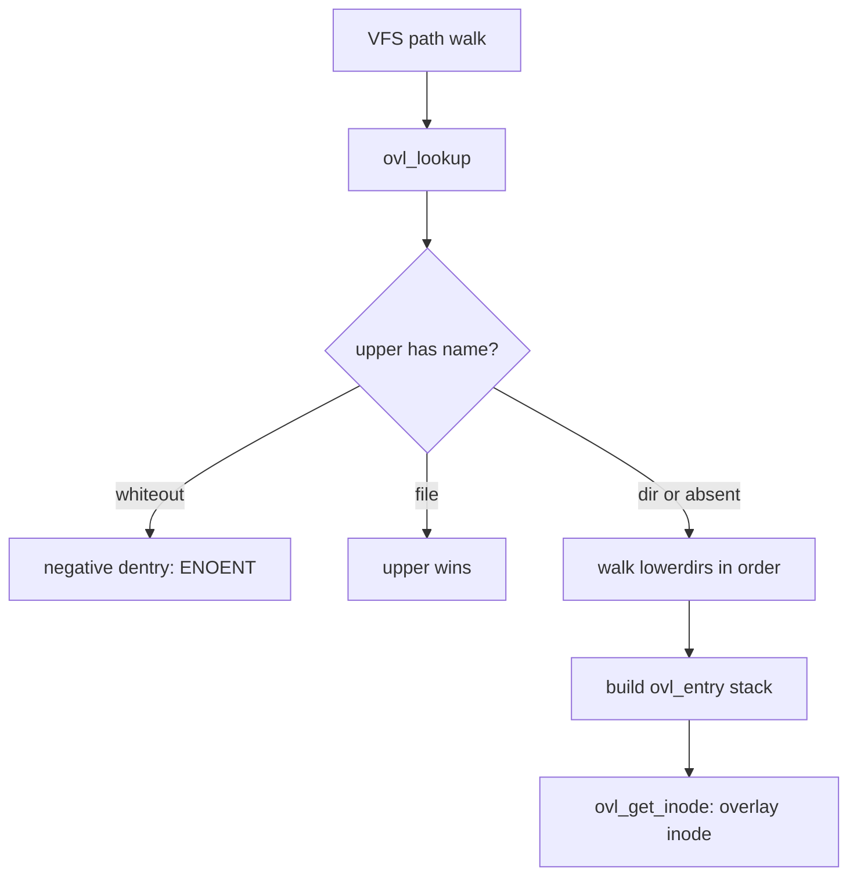

# Images & OverlayFS

> **Goal:** understand what a container image really is (a stack of
> tarballs), how OverlayFS fuses the stack into one filesystem, and why this
> design makes pulls fast, storage cheap — and a few behaviours weird.

## An image is a stack of tarballs

Strip away the tooling and a container image is embarrassingly simple:

- an ordered list of **layers** — each one a plain tarball of files and
  directories (a *diff* against the layer below);
- a small JSON **config** — env vars, default command, working dir, exposed
  ports, volumes;
- a **manifest** tying it together, everything addressed by SHA-256 digest.

This format is standardized as the **OCI Image Specification** — the reason
an image built by Docker runs under podman, containerd, or CRI-O without
conversion. Each layer blob is a (usually gzip- or zstd-compressed) tar
stream; the manifest lists blobs by digest and media type
(`application/vnd.oci.image.layer.v1.tar+gzip` and friends).

```bash
docker pull alpine
docker save alpine -o alpine.tar && tar tf alpine.tar
# blobs/sha256/…   ← the layers (tarballs) and config (json). That's all.
docker image inspect alpine | jq '.[0].RootFS.Layers'
# sha256:a0ea… sha256:7b2e… sha256:…   ← the layer digests
```

(Alpine is a nice extreme case: one layer, roughly 3–4 MB compressed.
Ubuntu's base is one layer of ~30 MB compressed / ~80 MB unpacked.)

### The digest chain, precisely

Two kinds of hash live in an image, and confusing them wastes an afternoon:

- The **manifest** references each layer blob by the digest of its
  *compressed* bytes — the thing a registry stores and transfers. Change the
  compression and this digest changes even if the files are identical.
- The **config** carries `rootfs.diff_ids`: the digest of each layer's
  *uncompressed* tar stream. This is the identity a runtime uses to decide
  whether it already has a layer unpacked on disk, independent of how it was
  compressed on the wire.

The config also holds a `history` array (one entry per build step, matching
your Dockerfile) and the `Env`/`Cmd`/`Entrypoint`/`WorkingDir` the runtime
applies at launch — none of which touch the filesystem. A multi-arch
`alpine:latest` is fronted by an **image index** (a manifest of manifests),
so the client picks the `linux/amd64` or `linux/arm64` manifest before ever
downloading a layer.

```bash
# The whole tree, without pulling layer bodies:
docker manifest inspect alpine | jq '.manifests[].platform'
docker image inspect alpine | jq '.[0].Config.Env, .[0].Config.Cmd'
```

Layers map to Dockerfile instructions:

```dockerfile
FROM debian:bookworm          # layers of the base image
RUN apt-get install -y nginx  # + 1 layer: files apt added/modified
COPY app/ /srv/app/           # + 1 layer: your files
ENV PORT=8080                 # metadata only — no layer
CMD ["./start.sh"]            # metadata only — no layer
```

Why bother with layers instead of one big tarball?

- **Deduplication** — fifty images `FROM debian:bookworm` share one copy of
  Debian, on disk and in the registry.
- **Cache** — rebuilds reuse unchanged layers; `docker push`/`pull` transfer
  only missing ones (pulls say "Already exists" line by line).
- **Immutability** — layers are content-addressed (digest = hash of bytes):
  shareable, verifiable, cacheable forever. The same digest *is* the same
  bytes.

A subtle detail that will matter later: a layer tarball can also record
*deletions*. The OCI spec encodes them as specially named files — a
`.wh.<name>` entry means "hide `<name>` from the layers below", and a
`.wh..wh..opq` entry inside a directory means "the directory below this
point is opaque; ignore everything under it in lower layers". When a runtime
unpacks a layer, it translates these tar entries into the kernel's own
whiteout representation (next section). Deletion in an image never removes
bytes — it adds markers.

But a running container needs one coherent root filesystem, and layers are
read-only. Enter the kernel.

## OverlayFS: the union

**OverlayFS** is a union filesystem — a regular VFS implementation like ext4
(the plug-in architecture from
[Files, Filesystems & the VFS](#/filesystems) paying off again), except that
instead of talking to a block device it delegates to *other, already-mounted
filesystems*. It was merged in kernel **3.18 (December 2014)** after years
out of tree, lives in `fs/overlayfs/`, and registers itself under the fs
type name `overlay` (the Docker storage driver `overlay2` is Docker's name,
not the kernel's). It stacks directories:

```text
        ┌───────────────────────────────┐
 upper  │  upperdir   (writable)        │  ← all changes land here
        ├───────────────────────────────┤
 lower  │  layer 3: your app            │  read-only ─┐
        │  layer 2: nginx               │  read-only  ├─ the image
        │  layer 1: debian base         │  read-only ─┘
        └───────────────────────────────┘
                    ↓ presented as
        ┌───────────────────────────────┐
        │  merged: one unified view     │  ← the container's /
        └───────────────────────────────┘
```

The rules are simple:

- **Read**: topmost layer that has the file wins.
- **Write**: copy the file up to `upperdir` first (**copy-up**), then modify
  the copy. Lower layers are never touched.
- **Delete**: can't delete from read-only layers — instead a **whiteout**
  marker is placed in upperdir; the merged view hides the file.
- **Directories** are the one case where layers *merge* instead of shadow:
  reading a directory combines the entries of every layer that contains it
  (deduplicated, whiteouts filtered). An **opaque** marker on an upper
  directory turns merging off for that subtree.

Try it with bare directories — no Docker involved:

```bash
mkdir lower upper work merged
echo "from the image" > lower/base.txt
sudo mount -t overlay overlay \
     -o lowerdir=lower,upperdir=upper,workdir=work merged

cat merged/base.txt              # from the image
echo change >> merged/base.txt   # write through the union…
cat lower/base.txt               # untouched! the original is immutable
ls upper/                        # base.txt — the copied-up version
rm merged/base.txt && ls -l upper/   # c--------- base.txt ← a whiteout
sudo umount merged
```

You just performed, by hand, exactly what Docker's storage driver does for
every container.

### The kernel objects behind the mount

When you run that `mount -t overlay`, the kernel builds a small object graph
(all in `fs/overlayfs/`, mostly `ovl_entry.h`):

- **`struct ovl_fs`** — one per mount, hung off the superblock. The fields
  that matter: `numlayer` and `layers` (an array of every layer, index 0
  being the upper), `config` (a `struct ovl_config` holding the parsed
  `upperdir`/`workdir`/`lowerdirs` strings and feature flags like
  `redirect_mode`, `index`, `metacopy`, `xino`), `workdir` (the dentry of
  the work directory), and `creator_cred` — a snapshot of the mounter's
  credentials, so *all* access to the underlying layers is checked against
  the mounter, not the current user. That last one is a security linchpin
  for unprivileged mounts (see [Namespaces](#/namespaces) for why the
  mounter and the caller can differ).
- **`struct ovl_layer`** — one per layer: the `mnt` (a private clone of the
  underlying mount, so the lower fs can't be unmounted from under the
  overlay), an `idx` (0 = upper, 1..n = lowers) and an `fsid` used for inode
  number multiplexing.
- **`struct ovl_entry`** — one per dentry: essentially an array of
  `struct ovl_path` (layer + dentry pairs), recording *which* real dentry in
  *which* layer backs this name. A file that exists only in layer 2 has one
  entry; a merged directory present in four layers has four.
- **`struct ovl_inode`** — the overlay's in-memory inode, wrapping a
  `vfs_inode` plus `__upperdentry` (the upper copy, if any), an RCU-protected
  pointer to the `ovl_entry` (RCU because path walks read it lockless — see
  [Kernel Synchronization: Locks, Atomics & RCU](#/kernel-sync)), a
  `version` counter used to invalidate cached directory listings, and the
  cached `redirect` path.

The upper limit on stacking is real and worth knowing: **`OVL_MAX_STACK` is
500 lower layers** as of 6.12. Docker's practical layer limit (127) is a
historical Docker constraint, not the kernel's. Until the fs got proper
new-mount-API support (`fsopen`/`fsconfig`, added in **6.7**), the whole
`lowerdir=a:b:c:…` string also had to fit in a single mount-options page
(4096 bytes) — since then you can pass layers one at a time with repeated
`lowerdir+=` options and escape commas properly.

### The mount options that change everything

Overlayfs has grown a pile of option flags, each fixing a specific real-world
sharp edge. The ones worth recognising on sight, with their default state as
of 6.12:

| Option | Default | What it does |
| --- | --- | --- |
| `redirect_dir` | `on`* | Lets a merged directory be renamed by leaving a `redirect` xattr behind (see below). |
| `index` | `off`* | Index dir mapping lower origins to upper copies; preserves hard links across copy-up, enables `nfs_export`. |
| `metacopy` | `off`* | Metadata-only copy-up: `chown`/`chmod` copy the inode, not the data. |
| `xino` | `auto` | Multiplex layer `fsid` into inode numbers so `st_ino` stays unique across layers. |
| `userxattr` | `off` | Use the `user.overlay.*` xattr namespace instead of `trusted.*`, for unprivileged mounts. |
| `volatile` | `off` | Skip `sync` of the upper layer — fast, unsafe across crashes. |
| `verity` | `off` | Require an fs-verity digest on metacopy origins (since **6.6**); tamper-evident lower data. |

*Compile-time and distro `CONFIG_` defaults vary; `redirect_dir` and `index`
are often forced by the storage driver rather than left to kernel defaults.

You rarely set these by hand — Docker, containerd, and the CRI plugins pick
them for you — but they explain almost every "why is overlayfs doing *that*"
question in this chapter.

### Lookup: how "topmost wins" actually works

A path lookup in the merged tree starts at the top and walks down the layer
stack. For `open("/etc/nginx/nginx.conf")` the kernel:

1. looks the name up in the upperdir. If found and it's a **whiteout** —
   stop: the file doesn't exist. If found and a regular file — stop: upper
   wins, no lower lookup at all.
2. Otherwise it walks `lowerdir` entries in order, collecting matches. For a
   regular file, the first hit wins and the walk stops. For a directory, the
   walk continues so all constituent layers are recorded in the
   `ovl_entry` — unless a layer marks the directory **opaque**, which cuts
   the stack there.
3. The collected stack becomes the dentry's `ovl_entry`, and an overlay
   inode is created that *delegates*: reads go to the topmost real inode,
   `readdir` merges all of them.

Two xattrs steer this walk (all in the `trusted.overlay.` namespace, or
`user.overlay.` with the `userxattr` option used for rootless containers):

- `trusted.overlay.opaque = "y"` — the opaque directory marker.
- `trusted.overlay.redirect` — written when a *merged directory is renamed*
  (with `redirect_dir=on`). You can't rename a directory that partly lives
  in read-only layers, so overlayfs renames the upper copy and leaves a
  redirect xattr pointing at the old path; lookups in lower layers follow
  it. Without `redirect_dir`, renaming a lower directory returns `EXDEV`
  and userspace (e.g. `mv`) falls back to copy+delete — which can be
  brutally slow on a big tree.

### Directory merge and readdir

Reading a directory is the one operation where overlayfs can't just pick a
winner — it has to fuse. When you `readdir` a merged directory that exists in
four layers, overlayfs must return the *union* of entries, minus whiteouts,
minus duplicates, and it has to do that while `getdents64` streams entries to
userspace in bounded chunks.

The kernel handles this by building a temporary in-memory list on the first
read: [ovl_iterate()](https://elixir.bootlin.com/linux/v6.12/C/ident/ovl_iterate)
(`fs/overlayfs/readdir.c`) reads every constituent real directory, top to
bottom, inserting each name into a red-black tree of `ovl_cache_entry`
structs keyed by name. A name already in the tree is skipped (upper shadows
lower); a whiteout marks its name so lower entries with that name are
dropped; an opaque directory stops the descent. The finished list is cached
on the open file and replayed to `getdents64`. Consequences:

- The first `readdir` of a wide, deeply-merged directory is O(total entries
  across all layers), not O(entries you see. A directory with 10,000 files
  merged across ten layers touches 100,000 real dirents to produce one
  listing.
- `d_type` (the file-type byte in `getdents64`) can come back `DT_UNKNOWN`
  for merged entries, forcing programs to `stat` each one — a measurable
  slowdown for tools like `find` or `ls -l` on large image trees.
- A directory that has ever had an entry deleted or copied up is marked
  **impure** (`trusted.overlay.impure`), telling overlayfs it must resolve
  real inode numbers rather than trust the cheap path.

### Whiteouts, precisely

A whiteout in upperdir is a **character device node with device number
0/0** (`mknod name c 0 0`) — a value reserved as `WHITEOUT_DEV` precisely
because no real device uses it. That's what the `c---------` in the
experiment above was. Overlayfs checks `S_ISCHR` + rdev 0 on every upper
lookup ([ovl_is_whiteout()](https://elixir.bootlin.com/linux/v6.12/C/ident/ovl_is_whiteout)).

Creating whiteouts needs `CAP_MKNOD` over the upper fs — one of the reasons
the *mounter's* credentials (that `creator_cred` field) are used for lower
and upper access. Deleting a merged directory is heavier: overlayfs must
first clear it by whiting out every lower entry, then replace the directory
itself with a whiteout, using the workdir for atomicity.

Map this back to images: when a builder commits a layer, whiteout device
nodes in the upperdir become `.wh.` entries in the tarball, and opaque
xattrs become `.wh..wh..opq`. Kernel representation and wire representation
of the same idea.

### Copy-up in detail

Copy-up is the heart of the design and the source of its sharpest edge.
Trigger conditions: opening a lower file for write, truncating it, changing
metadata (`chmod`, `chown`, `utimes`, setxattr), creating a hard link to
it — anything that would modify an inode that lives in a read-only layer.
Reads never trigger it.

The algorithm (see the code walk below) is careful about crash-consistency:

1. Ancestor directories are copied up first, top of the path down — copy-up
   of `/a/b/c` may create `a` and `b` in upperdir as directory copies.
2. The new file is created in **workdir** (or as an `O_TMPFILE` unlinked
   temp file on filesystems that support it), *not* directly in upperdir.
3. Data is copied. Since 4.19-era code, overlayfs first tries
   **reflink** ([vfs_clone_file_range()](https://elixir.bootlin.com/linux/v6.12/C/ident/vfs_clone_file_range)):
   if upper and lower live on the same XFS (with `reflink=1`) or Btrfs,
   copy-up of a 10 GB file is a metadata operation — milliseconds, near-zero
   extra blocks. Only if cloning fails does it fall back to
   [vfs_copy_file_range()](https://elixir.bootlin.com/linux/v6.12/C/ident/vfs_copy_file_range)
   / splice loops that actually move the bytes.
4. Metadata (mode, owner, timestamps, xattrs) is replicated, and a
   `trusted.overlay.origin` xattr — a file handle pointing back at the lower
   inode — is attached so the kernel can later tell "this upper file *is*
   that lower file, copied".
5. The temp file is **renamed** into place in upperdir. Rename is atomic
   within a filesystem — this is why `workdir` must be on the same
   filesystem as `upperdir`, and why it must be empty at mount time.

Two option-gated refinements:

- **`metacopy=on`**: a metadata-only change (`chown` in a Dockerfile is the
  classic) copies up *only the inode metadata*, leaving data in the lower
  layer until someone actually opens the file for data access. The upper
  stub carries `trusted.overlay.metacopy`. This is why `COPY --chown=…` in
  modern BuildKit doesn't double your layer size. Off by default (unless
  `CONFIG_OVERLAY_FS_METACOPY=y`) because it changes trust assumptions when
  lower layers come from untrusted sources.
- **`index=on`**: keeps an index directory mapping lower origins to upper
  copies, so that two hard links copied up at different times still point at
  one upper inode. Without it, copy-up **breaks hard links** — each name
  gets its own private copy. Also required for `nfs_export=on`.

## What `docker run` assembles

Each container gets a fresh, empty upperdir on top of the image's layer
stack — that's the **container layer**:

```bash
docker run -d --name web nginx
docker inspect web -f '{{json .GraphDriver.Data}}' | python3 -m json.tool
# LowerDir:  /var/lib/docker/overlay2/<id>/diff:…:…   ← image layers
# UpperDir:  /var/lib/docker/overlay2/<id>/diff        ← this container's writes
# MergedDir: /var/lib/docker/overlay2/<id>/merged      ← its actual /
# WorkDir:   /var/lib/docker/overlay2/<id>/work
```

Consequences you now understand from first principles:

- **Starting 100 containers from one image costs ~0 disk and ~0 time** —
  100 empty upperdirs, one shared lower stack.
- **They share the page cache too.** Because all 100 containers read
  `libc.so.6` through the *same lower inode*, the kernel caches it once
  (see [Virtual Memory](#/memory) and
  [Lab: Watch the Page Cache Work](#/lab-page-cache)). Block-level drivers
  like the old `devicemapper` gave each container its own device, so
  identical file content was cached N times. This page-cache sharing is a
  major, under-advertised reason `overlay2` won.
- **`docker rm` destroys all changes** — deleting a container = deleting its
  upperdir. "Ephemeral by design" isn't a philosophy, it's the data layout.
- **Persistent data needs volumes** — a volume is a bind mount of a real
  host directory *over* a path in the merged tree, bypassing the overlay
  entirely (and its copy-up cost — also why databases should write to
  volumes, not the container layer).
- **`docker commit` exists** — tar up the upperdir, calculate its digest,
  call it a new layer.

```bash
# See a container's real filesystem:
ls -la /var/lib/docker/overlay2/<container-id>/diff/
# Trace overlayfs mounts:
findmnt -t overlay
cat /proc/mounts | grep overlay   # the raw lowerdir=…:…:… string
```

## Copy-up performance: the hidden cost

Copy-up has real performance implications:

- **First write to a large file pays for the whole file.** Writing 1 byte to
  a 10 GB lower-layer file = a 10 GB copy-up on ext4 (both the latency —
  tens of seconds at typical NVMe copy rates of a few hundred MB/s through
  the fs — and the space: original and copy coexist until the container is
  removed). On XFS-with-reflink or Btrfs upper layers it's a near-instant
  clone instead; check what your `/var/lib/docker` sits on (see
  [The Linux Storage Stack](#/storage-stack)).
- **Metadata-only changes** (`chmod -R`, `chown -R` over a big tree) copy up
  every touched file unless `metacopy=on` — a classic source of mysteriously
  fat container layers.
- OverlayFS does *not* deduplicate across upperdirs — each container's copy
  of a file is independent. If 10 containers each modify the same 1 GB file,
  that's 10 separate 1 GB copies in 10 upperdirs.
- **Dockerfile best practice follows**: rarely-changing, small files early;
  large mutable data in volumes.

> **Container link:** the copy-up trigger is also why `readOnlyRootFilesystem`
> in Kubernetes is nearly free — a container that never writes to `/` never
> copies anything up, and its upperdir stays empty.

## Dockerfile hygiene, explained by layers

Layer mechanics turn into the build advice everyone repeats but few explain:

```dockerfile
# BAD: 'rm' can't shrink lower layers — the files live on in layer N,
# the whiteouts in layer N+1. Image got BIGGER.
RUN apt-get install -y build-essential
RUN make && make install
RUN apt-get remove -y build-essential && rm -rf /var/lib/apt/lists/*

# GOOD: create-and-delete inside ONE layer → files never get committed
RUN apt-get install -y build-essential \
 && make && make install \
 && apt-get remove -y build-essential && rm -rf /var/lib/apt/lists/*

# BEST: multi-stage — build artifacts cross, build environment doesn't
FROM debian AS build
RUN apt-get install -y build-essential && make
FROM debian:bookworm-slim
COPY --from=build /src/app /usr/local/bin/app
```

Same logic for cache ordering: put rarely-changing instructions (dependency
installs) before frequently-changing ones (`COPY . .`), because a changed
layer invalidates every layer after it — they all get rebuilt.

```dockerfile
# Correct order:
COPY package.json /app/        # change rarely → use cache
RUN npm install                # re-run only if package.json changes
COPY . /app/                   # change often → only this layer rebuilds
```

## pivot_root: making the merged dir become /

Last piece: the runtime must make that merged directory the container's
root. Inside the new **mount namespace** (see [Namespaces](#/namespaces)):

1. bind-mount the merged dir at a staging location (this also satisfies
   `pivot_root`'s requirement that the new root be a mount point);
2. `pivot_root(new_root, old_root)` — swap what `/` means *for this
   namespace*. The old root is moved to `/old_root` inside the new tree;
3. `umount2("/old_root", MNT_DETACH)` — lazily detach the old root from the
   namespace;
4. mount fresh `/proc` (proc), `/dev` (tmpfs with device nodes), `/sys`
   (sysfs).

Why `pivot_root` and not `chroot`? `chroot` only changes path *lookup* — the
old root stays mounted, and a privileged process can escape (the classic
`chroot("..")` double-chroot trick, or `/proc/<pid>/root` remaining).
`pivot_root` *detaches* the old root from the namespace's mount table; there
is nothing left to escape to. Runtimes use pivot_root — you'll do it
yourself in [Build a Container by Hand](#/build-a-container).

## Storage in the real world, briefly

- `overlay2` is Docker's default and the right answer almost always.
  Alternatives exist for other shapes: `btrfs`/`zfs` snapshot-based drivers
  (use filesystem snapshots as layers), `devicemapper` (block-level,
  historical, removed in modern Docker), `vfs` (plain full copies — for
  tests only).
- **containerd snapshotters** are the same concept one abstraction up
  (overlayfs snapshotter by default; `stargz`/`nydus` for lazy pulling —
  start the container before the pull finishes and fetch blocks on access).
  More in [Docker, containerd, runc](#/container-runtimes).
- **Rootless containers** work because since kernel **5.11** overlayfs can
  be mounted inside an unprivileged user namespace (with `userxattr`, since
  the mounter can't write `trusted.*` xattrs). Before that, rootless setups
  fell back to fuse-overlayfs in userspace.
- **`volatile`** (since 5.10) skips all syncing of the upper layer — great
  for CI throwaway containers, catastrophic for anything you want to survive
  a crash.
- Where does the space go? `docker system df` knows; dangling build layers
  and old images are the usual suspects (`docker system prune -a`).
- Quirks to recognize on sight:
  - `inotify`/`fanotify` on a lowerdir file misses post-copy-up changes —
    the watch is on the old lower inode; after copy-up, writes go to a
    different inode in upperdir (relevant when debugging with the tools
    from [/proc, strace, perf & eBPF](#/observability)).
  - Hard links break across copy-up unless `index=on`.
  - `st_ino`: on a single-fs setup inode numbers are stable and unique;
    with layers on multiple filesystems, `xino=on` packs the layer's `fsid`
    into the high bits of the inode number so userspace still sees unique
    inos. Directories always show overlay-private inode numbers.
  - The same image file may legitimately show different `st_dev` before and
    after copy-up. `tar`, `rsync` and backup tools crossing an overlay can
    get confused.
  - Changing a lower layer while the overlay is mounted is **undefined
    behaviour** — the kernel documentation says so explicitly. Immutable
    image layers aren't just policy; they're a correctness requirement.

```bash
docker system df
docker system df -v | head -40    # detailed breakdown
# Clean up:
docker system prune -a --volumes  # remove everything not in use (careful!)
```

### Where images are going: EROFS, composefs, fs-verity

The tarball-plus-overlayfs model has two soft spots people are now fixing in
the kernel:

- **Slow unpack.** Every layer must be extracted to a real directory tree
  before it can be a lowerdir — millions of small `write`s and `rename`s for
  a big image. **EROFS** (Enhanced Read-Only File System, `fs/erofs/`) lets a
  layer be one mountable, compressed image file instead of an unpacked tree:
  `mount -t erofs` and it *is* the lowerdir, no extraction. Combined with the
  **data-only lower layers** overlayfs feature (merged in **6.5**, the `::`
  separator), a small EROFS image can carry only the directory structure and
  point at a shared content-addressed blob store for the actual file data —
  the model **composefs** uses for image-based Linux (ostree/bootc).
- **No integrity.** Nothing stops a privileged process editing a lowerdir on
  disk, and overlayfs calls that undefined behaviour. **fs-verity** attaches
  a Merkle-tree digest to a file so any modified block is caught on read;
  overlayfs gained a `verity` mount option in **6.6** that records the lower
  file's fs-verity digest in the metacopy origin and refuses the file if it
  no longer matches. This is what makes an EROFS+composefs image
  *tamper-evident* — a building block for measured, verified container roots
  (see [Trusted Computing: Secure Boot, TPM & IMA](#/trusted-computing) and
  [Linux Security & Confinement](#/security-hardening)).

You won't type these by hand yet, but they explain why "container image" is
quietly becoming "a signed, verity-protected EROFS blob" rather than "a pile
of gzipped tarballs".

## Follow the code (kernel v6.12)

All of overlayfs is ~13k lines in
[fs/overlayfs/](https://elixir.bootlin.com/linux/v6.12/source/fs/overlayfs) —
small enough to actually read. Two paths tell most of the story.

### Path 1: lookup — `cat merged/etc/os-release`



1. The generic VFS walker (`link_path_walk` in `fs/namei.c`, covered in
   [Files, Filesystems & the VFS](#/filesystems)) reaches the overlay mount
   and calls the overlay's `lookup` inode operation:
   [ovl_lookup()](https://elixir.bootlin.com/linux/v6.12/C/ident/ovl_lookup)
   in `fs/overlayfs/namei.c`.
2. `ovl_lookup()` first probes the upper layer via
   [ovl_lookup_layer()](https://elixir.bootlin.com/linux/v6.12/C/ident/ovl_lookup_layer),
   which does an ordinary `lookup_one`-style lookup on the *real* underlying
   filesystem using the mounter's creds. If the result is a whiteout
   ([ovl_is_whiteout()](https://elixir.bootlin.com/linux/v6.12/C/ident/ovl_is_whiteout):
   `S_ISCHR && rdev == 0`), lookup terminates with a negative entry.
3. It reads `trusted.overlay.opaque` and `trusted.overlay.redirect` on each
   hit; a redirect substitutes the path used for the remaining lower
   lookups, an opaque marker stops the descent.
4. For each remaining lower layer it repeats the real lookup, appending
   `struct ovl_path { layer, dentry }` entries to the stack. Regular file:
   stop at first hit. Directory: keep going, this is a merge.
5. Finally [ovl_get_inode()](https://elixir.bootlin.com/linux/v6.12/C/ident/ovl_get_inode)
   in `fs/overlayfs/inode.c` allocates or finds the `struct ovl_inode`,
   wiring `__upperdentry` and the `ovl_entry` in place. From here on, reads
   are near-zero overhead: the overlay file simply operates on an open file
   of the topmost real inode. A later `readdir` on a merged directory goes
   through [ovl_iterate()](https://elixir.bootlin.com/linux/v6.12/C/ident/ovl_iterate),
   which builds the union list described above.

### Path 2: copy-up — first write to a lower file

1. `open(O_WRONLY)` on a merged path lands in
   [ovl_open()](https://elixir.bootlin.com/linux/v6.12/C/ident/ovl_open)
   (`fs/overlayfs/file.c`), which calls
   [ovl_maybe_copy_up()](https://elixir.bootlin.com/linux/v6.12/C/ident/ovl_maybe_copy_up):
   if the file has no upper dentry and the open is for write, copy-up is
   needed.
2. [ovl_copy_up()](https://elixir.bootlin.com/linux/v6.12/C/ident/ovl_copy_up)
   → [ovl_copy_up_flags()](https://elixir.bootlin.com/linux/v6.12/C/ident/ovl_copy_up_flags)
   (`fs/overlayfs/copy_up.c`) walks from the outermost ancestor without an
   upper copy down to the target, calling
   [ovl_copy_up_one()](https://elixir.bootlin.com/linux/v6.12/C/ident/ovl_copy_up_one)
   for each — parents become upper directories before children.
3. [ovl_do_copy_up()](https://elixir.bootlin.com/linux/v6.12/C/ident/ovl_do_copy_up)
   picks the strategy: an `O_TMPFILE` anonymous temp file if the upper fs
   supports it, otherwise a named temp file in `workdir`.
4. [ovl_copy_up_data()](https://elixir.bootlin.com/linux/v6.12/C/ident/ovl_copy_up_data)
   moves the bytes: try
   [vfs_clone_file_range()](https://elixir.bootlin.com/linux/v6.12/C/ident/vfs_clone_file_range)
   first (reflink — O(1) if lower and upper share an XFS/Btrfs), then fall
   back to chunked copying through
   [vfs_copy_file_range()](https://elixir.bootlin.com/linux/v6.12/C/ident/vfs_copy_file_range).
   With `metacopy=on` and a metadata-only trigger, this step is skipped
   entirely.
5. Metadata and xattrs are replicated, `trusted.overlay.origin` (an encoded
   file handle of the lower inode) is set, and the temp file is atomically
   renamed into upperdir. The dentry's `__upperdentry` is set — every later
   write is a plain write to the upper filesystem, overlayfs out of the hot
   path.

The delete path is the mirror image:
[ovl_do_remove()](https://elixir.bootlin.com/linux/v6.12/C/ident/ovl_do_remove)
in `fs/overlayfs/dir.c` decides whether a simple upper unlink suffices (the
file never existed below) or whether
[ovl_cleanup_and_whiteout()](https://elixir.bootlin.com/linux/v6.12/C/ident/ovl_cleanup_and_whiteout)
must swap in a 0/0 character device via the workdir.

## Check your understanding

1. Why is `RUN rm -rf /big-dir` in its own Dockerfile line unable to shrink
   an image?

<details><summary>Show answer</summary>

The deleted files still exist in the lower layer's tarball — layers are
immutable and content-addressed. The `rm` produces a *new* layer containing
whiteout entries (`.wh.` files in the tar, char-0/0 devices on disk) that
hide the files, but image size is the sum of all layer blobs; whiteouts add
bytes, they never subtract. Only deleting within the same layer that created
the files (one `RUN`), or a multi-stage build, avoids committing them.

</details>

2. A container writes 2 GB of logs to `/var/log/app.log` (no volume). Where
   exactly do those bytes live on the host, and what happens on `docker rm`?

<details><summary>Show answer</summary>

In the container's upperdir:
`/var/lib/docker/overlay2/<id>/diff/var/log/app.log`. `docker rm` deletes
the container's overlay2 directory — upperdir included — so the logs vanish.
That's the mechanical meaning of "containers are ephemeral".

</details>

3. Why do 100 containers from one image start with ~0 disk cost — and why is
   their *memory* footprint smaller than 100 VMs reading the same files?

<details><summary>Show answer</summary>

Each container is just a new empty upperdir + workdir over the shared,
read-only lower stack — no image copy. And because all 100 read library and
binary files through the same lower inodes, the page cache holds one copy of
each file for everyone; block-level drivers (or separate VM disks) would
cache identical content once per instance.

</details>

4. Why do runtimes use `pivot_root` instead of `chroot`?

<details><summary>Show answer</summary>

`chroot` only changes path lookup; the old root remains mounted in the
namespace and is escapable (`chroot("..")` tricks, `/proc/<pid>/root`).
`pivot_root` swaps the namespace's actual root mount and lets the runtime
lazily unmount the old one — after `umount2(…, MNT_DETACH)` there is nothing
left in the mount table to escape to.

</details>

5. You `chown -R app:app /usr/share/data` (5 GB, in a lower layer) in a
   running container on ext4. What happens, and which mount option would
   have prevented it?

<details><summary>Show answer</summary>

Every file touched gets fully copied up — metadata changes are copy-up
triggers like writes — so the upperdir gains ~5 GB and the operation is
slow. `metacopy=on` copies up only inode metadata (an upper stub with the
`trusted.overlay.metacopy` xattr), deferring data copy until a file's
contents are actually written.

</details>

6. What *is* a whiteout, at the level of `ls -l` and at the level of a layer
   tarball?

<details><summary>Show answer</summary>

On disk it's a character device node with major/minor 0/0 (`c---------` in
`ls -l`), a reserved `WHITEOUT_DEV` value the kernel checks with
`ovl_is_whiteout()`. In the OCI tar encoding of a layer, the same deletion
is a `.wh.<name>` entry (and `.wh..wh..opq` for opaque directories); the
runtime converts between the two when unpacking or committing layers.

</details>

7. Your file-watcher (inotify) monitors a config file that shipped in the
   image. The app rewrites the file; the watcher sees nothing. Why?

<details><summary>Show answer</summary>

The watch was placed on the lower layer's inode. The first write triggered
copy-up: the live file is now a *different inode* in upperdir, and all
subsequent writes go there. The lower inode the watcher holds never changes
again. Watch the merged path after the file has an upper copy, or use
polling.

</details>

8. What is the difference between the layer digest in an image *manifest* and
   the `diff_id` in the image *config*?

<details><summary>Show answer</summary>

The manifest digest is the SHA-256 of the layer's *compressed* blob — what
the registry stores and transfers, and it changes if you recompress. The
`diff_id` is the SHA-256 of the layer's *uncompressed* tar stream — the
stable identity a runtime uses to tell whether it has already unpacked that
layer, independent of compression.

</details>

## Sources & further reading

- [Overlay Filesystem — kernel documentation](https://docs.kernel.org/filesystems/overlayfs.html)
  — the authoritative reference: whiteouts, redirects, metacopy, xino,
  verity, non-standard behaviours.
- [fs/overlayfs source, v6.12](https://elixir.bootlin.com/linux/v6.12/source/fs/overlayfs)
  — small and readable; start with `namei.c`, `readdir.c` and `copy_up.c`.
- [EROFS — kernel documentation](https://docs.kernel.org/filesystems/erofs.html)
  — the read-only image format behind composefs-style image mounts.
- [fsverity — kernel documentation](https://docs.kernel.org/filesystems/fsverity.html)
  — the Merkle-tree integrity mechanism overlayfs `verity=` builds on.
- [mount_namespaces(7)](https://man7.org/linux/man-pages/man7/mount_namespaces.7.html)
  — the namespace half of the container filesystem story.
- [pivot_root(2)](https://man7.org/linux/man-pages/man2/pivot_root.2.html)
  — including the exact requirements on new_root and put_old.
- [OCI Image Format Specification](https://github.com/opencontainers/image-spec)
  — layer media types, `.wh.` whiteout encoding, manifests, config,
  `diff_ids` and digests.
- [Docker docs: OverlayFS storage driver](https://docs.docker.com/engine/storage/drivers/overlayfs-driver/)
  — how `overlay2` lays out `/var/lib/docker/overlay2`.

---

**Next:** the payoff chapter — assemble [namespaces](#/namespaces),
[cgroups](#/cgroups), pivot_root, capabilities and seccomp into a working
container, by hand, no Docker: [Build a Container by Hand](#/build-a-container).
