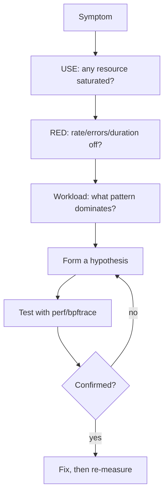

# Performance Analysis Methodology

> **Goal:** learn a systematic approach to finding what's slow — the USE method, the RED method, workload characterization, flame graphs, and the signal-to-investigation mapping. Every tool in the [observability chapter](#/observability) and every subsystem in this site has a purpose; this chapter is about knowing which to reach for and when.

## Why methodology matters

Linux exposes tens of thousands of metrics: `/proc/slabinfo`, `/proc/net/snmp`, `/sys/kernel/debug/...`, hardware PMU counters through `perf`, and arbitrary probe points through eBPF. Without a framework you drown in data — you end up staring at a dashboard, spotting a number that "looks high", tuning a knob, and hoping. That is guessing with extra steps.

A methodology does two things. It gives you a **complete** checklist so you don't miss the one saturated resource hiding behind nine healthy ones, and it gives you a **stopping rule** so you know when you've actually found the bottleneck instead of a bystander. The three frameworks below are complementary, not competing: USE looks at the machine from the bottom up, RED looks at the service from the top down, and workload characterization tells you what the system is even trying to do.

| Framework | Question it answers | Key metric type | Direction |
|---|---|---|---|
| **USE** | Is a resource the bottleneck? | Utilization, Saturation, Errors | Bottom-up (resources) |
| **RED** | Is the *service* healthy? | Rate, Errors, Duration | Top-down (requests) |
| **Workload Characterization** | What is the system even doing? | Composition, distribution, patterns | Sideways (what & who) |

The two methods catch different failures. A machine can sit at 100% CPU utilization (a USE red flag) while serving 500 req/s at p99 = 15 ms — that is a perfectly healthy service. Conversely a machine can idle at 10% CPU while p99 climbs to 2000 ms because every request blocks on one contended lock. USE would call that box healthy; only RED catches it. Run both.

## USE: Utilization, Saturation, Errors

For every physical resource — each CPU core, each disk, each network interface, the memory bus, the NUMA interconnect — ask three questions:

1. **Utilization**: what fraction of the time is it busy? (CPU 90% busy, disk `%util` 100%)
2. **Saturation**: how much work is queued *waiting* for it? (run-queue length beyond core count, disk `aqu-sz`, PSI "some")
3. **Errors**: what is failing? (disk media errors, NIC CRC/`rx_missed_errors`, ECC corrections)

Utilization and saturation are not the same thing, and the difference is where beginners go wrong. A single-lane road at 100% utilization with no cars queued is *fine* — fully used, not congested. The same road at 100% utilization with a mile-long queue is a catastrophe. Utilization tells you the resource is used; saturation tells you it's a bottleneck. **You almost always care about saturation more than utilization.**

```bash
# USE checklist — run these first, always
# ---- CPU ----
mpstat -P ALL 1                     # utilization per CPU (spot imbalance)
cat /proc/loadavg                   # saturation (runnable+uninterruptible vs cores)
cat /proc/pressure/cpu              # PSI: some/full contention
lscpu                               # inventory: sockets, cores, threads, NUMA

# ---- Memory ----
free -h                             # utilization: total vs available
cat /proc/pressure/memory           # saturation: reclaim/refault stalls
sar -r 1                            # utilization + saturation over time
grep -E '^SReclaimable|^MemAvailable' /proc/meminfo

# ---- Storage ----
iostat -x 1                         # %util (util), aqu-sz + await (sat), errors: none here
cat /proc/pressure/io               # PSI: IO stall pressure
cat /sys/block/sda/stat             # raw counts (fields 9-11 = in-flight, io_ticks)
lsblk && df -h                      # inventory

# ---- Network ----
sar -n DEV 1                        # utilization: rxkB/s, txkB/s vs link speed
nstat -az | grep -Ei 'retrans|drop' # errors/saturation: retransmits, drops
ip -s link show                     # per-interface error counters
ethtool -S eth0                     # driver-level drops, overruns, no-buffer
```

Notice that for most resources the "errors" line is quiet — errors are rare, but when a counter climbs steadily (a disk logging media errors, a NIC counting `rx_crc_errors`) it dwarfs any tuning you could do. Check it first so you don't spend an afternoon profiling a dying cable.

### PSI: Pressure Stall Information (since 4.20)

Load average is the traditional saturation signal, but it's a blunt instrument (more on why below). Pressure Stall Information, merged in 4.20 and now the metric cgroup v2 and `systemd-oomd` actually act on, measures the thing you care about directly: **how much wall-clock time tasks lost because a resource wasn't available.**

```bash
cat /proc/pressure/cpu
# some avg10=4.50 avg60=1.23 avg300=0.56 total=123456789
# full avg10=1.10 avg60=0.30 avg300=0.12 total=987654321
```

Read it like this:

- **some** — the fraction of time *at least one* runnable task was stalled waiting for the resource. This is your "is anything ever waiting?" line.
- **full** — the fraction of time *every* non-idle task was stalled simultaneously, meaning zero useful work happened. `full` for CPU is only tracked for cgroups (the root is always able to run *something*); for memory and I/O, `full > 0` means the whole group ground to a halt.
- **avg10 / avg60 / avg300** — decaying averages over the last 10, 60, and 300 seconds, expressed as a percentage.
- **total** — cumulative stall time in **microseconds** since boot. This is the raw counter; the averages are derived from it. For alerting, rate-of-change of `total` is more robust than the pre-smoothed averages.

The kernel maintains this per resource in `struct psi_group`. Each CPU has a `struct psi_group_cpu` holding a bitmask of the current task states — how many tasks on that CPU are running, memstalled, or I/O-stalled right now — plus per-state time accumulators (`times[]`). Every task state transition (wake, sleep, block on I/O, enter reclaim) flips bits in that per-CPU state and accrues the elapsed time into the right bucket. A periodic worker aggregates the per-CPU buckets into the pretty percentages you read. We trace this exact path in [Follow the code](#/perf-methodology@follow-the-code-kernel-v612) below.

```bash
cat /proc/pressure/io
# some avg10=12.30 avg60=5.40 avg300=2.10 total=1234567890123
# IO pressure is the single most common bottleneck on shared cloud instances.

cat /proc/pressure/memory
# some avg10=0.03 ... full avg10=0.00 ...
# memory "full" climbing means tasks are blocked in reclaim/refault — OOM territory.
```

**Container link:** every cgroup v2 directory exposes its own `cpu.pressure`, `io.pressure`, and `memory.pressure` files — PSI is per-cgroup, not just global. That is how `systemd-oomd` decides which cgroup to kill before the kernel OOM killer fires, and how you attribute a noisy-neighbour stall to a specific container. See [Control Groups (cgroup v2)](#/cgroups) and [Lab: Throttle a Process with cgroup v2](#/lab-cgroup-limits).

### What load average actually measures

`/proc/loadavg` shows three exponentially-damped moving averages, but the number being averaged is subtle and routinely misread.

```bash
cat /proc/loadavg
# 4.15 3.20 2.80 2/948 32451
# ^1min ^5min ^15min  ^running/total-threads  ^last-PID
```

The count sampled is **the number of tasks in `TASK_RUNNING` plus
`TASK_UNINTERRUPTIBLE`** — runnable tasks *and* tasks blocked in
uninterruptible sleep (the `D` state), which almost always means waiting on
disk I/O. That second category is why a machine with idle CPUs can still show
a load of 20: twenty threads all stuck in `D` waiting on a slow NFS mount
count toward load even though the CPU is doing nothing.

Load average is therefore a mix of CPU saturation *and* I/O saturation —
informative, but ambiguous. PSI splits them apart, which is exactly why it
exists.

The averaging uses fixed-point EWMA constants (`EXP_1`, `EXP_5`, `EXP_15`) and the active-task count is folded in roughly every 5 seconds (`LOAD_FREQ = 5*HZ + 1`, the odd `+1` deliberately avoiding lockstep with other periodic ticks). Because it's a 1/5/15-minute smoothing, load average is a lagging indicator — useless for catching a 200 ms latency spike, good for confirming a sustained trend. Rule of thumb: a 1-minute load persistently above your CPU count means CPU (or D-state) saturation; compare against `nproc`.

### Interpreting USE results

| Finding | What it means | Next step |
|---|---|---|
| CPU util > 90%, `psi cpu some` ~0% | Busy but nothing queuing | Accept, or add capacity — it's healthy |
| CPU util < 90%, load ≫ cores | Saturated or D-state pileup | Split with PSI cpu vs io; profile what tasks wait on |
| Disk `%util` = 100%, `await` > 50 ms | Disk saturated, requests queued | `iostat -x` for the busy device; `iotop`/`biolatency` for the process |
| `MemAvailable` < 10%, `psi memory some` > 0 | Reclaim under pressure | `slabtop`, `smem`, `top -o %MEM`; see [Virtual Memory](#/memory) |
| NIC drops or `rx_missed_errors` climbing | Ring buffer overflow | `ethtool -g` (grow ring), `ethtool -C` (coalescing); see [Networking](#/networking) |
| Any error counter rising for 5+ min | Hardware/driver fault | `dmesg`, SMART, cable/link check — stop profiling |

## RED: Rate, Errors, Duration

USE asks "is the machine healthy?" RED asks "is the *service* healthy from the caller's point of view?" It applies to anything that answers requests: HTTP endpoints, database queries, RPC methods, even syscalls (rate = calls/s, errors = `-errno` returns, duration = call latency).

| Metric | Question | Example |
|---|---|---|
| **Rate** | Requests per second | 500 HTTP req/s |
| **Errors** | Failed requests per second | 3% 5xx rate |
| **Duration** | Time to serve a request | p50 = 15 ms, p99 = 250 ms |

The critical discipline in RED is **never average the duration**. Averages hide tail latency: a service at 5 ms mean can still have 1% of requests taking 2 seconds, and those are the requests users complain about. Always look at percentiles — p50, p99, p99.9 — and the max. A blown p99 with a healthy p50 is the signature of a *conditional* stall: something that happens on a fraction of requests (a cache miss, a GC pause, a lock a few callers contend, a THP compaction event).

```bash
# Crude per-syscall RED with strace: rate=calls, errors=errors, duration=usecs/call
strace -c -f -T -p "$(pgrep -n nginx)"
# % time     seconds  usecs/call     calls    errors syscall
#  42.34    0.123456        1234       100         3 read
#  30.12    0.087654         876       100         0 write

# Real per-request latency distribution with eBPF (no app changes)
sudo bpftrace -e '
  kprobe:tcp_sendmsg /comm == "nginx"/  { @start[tid] = nsecs; }
  kretprobe:tcp_sendmsg /@start[tid]/   {
    @us = hist((nsecs - @start[tid]) / 1000); delete(@start[tid]);
  }'
# @us: a log2 histogram — read the tail buckets, not the mode
```

`strace -c` is convenient but the ptrace overhead perturbs the very latency you're measuring; use it for *composition* (which calls dominate) and reach for [eBPF](#/ebpf-internals) when you need honest numbers on a live process.

## Workload characterization

Before you optimize anything, know what the system is actually doing — who is consuming the resource and in what pattern. The first question is almost always: is this workload **CPU-bound, memory-bound, I/O-bound, or network-bound?** One `vmstat 1` usually answers it.

```bash
vmstat 1
# procs -----------memory---------- ---swap-- -----io---- -system-- ------cpu-----
#  r  b   swpd   free   buff  cache   si   so    bi    bo   in   cs us sy id wa st
#  4  0      0  12345  56789 123456    0    0   100  2000 5000 8000 45 15 30 10  0
```

Read it column by column:

- **r** = runnable + running threads. If `r` is persistently above your core count, the CPU is the bottleneck.
- **b** = threads blocked in uninterruptible sleep (usually disk). A rising `b` points at I/O.
- **si/so** = pages swapped in/out per second. Any sustained non-zero here means memory pressure; check [Virtual Memory](#/memory).
- **bi/bo** = blocks read/written per second (≈ kB/s). Separates read-heavy from write-heavy I/O.
- **wa** = CPU idle *because* it's waiting on I/O. High `wa` with high `b` confirms an I/O bound.
- **st** = "stolen" time — cycles the hypervisor gave to another VM. Non-zero `st` on a cloud instance means you're being throttled by a noisy neighbour, not by your own code; see [KVM & Virtualization Internals](#/kvm-internals).

The example above (`r=4`, low `bi`, moderate `bo`, `us+sy=60`, `wa=10`) is a CPU-bound workload with light writes and a healthy page cache.

```bash
# Who is using the CPU?
top -o %CPU -n 1 -b | head -20
pidstat 1                                    # per-process, keeps history

# What syscalls dominate? (composition, not latency)
strace -c -f -p "$(pgrep -n mysqld)" -S time

# Which kernel/user functions are hot?
perf top -e cycles:k                         # kernel mode
perf top -e cycles:u                         # user mode

# I/O pattern: sequential vs random, read vs write
iostat -x 1
sudo biolatency-bpfcc                        # block-layer latency histogram

# Network peers and connection churn
ss -tnp | awk '{print $5}' | cut -d: -f1 | sort | uniq -c | sort -rn | head
```

## The 60-second checklist

Brendan Gregg's canonical first-minute triage on an unfamiliar box. It's not a diagnosis — it's a fast pass that tells you *which* framework to dive into.

```bash
uptime                         # load averages: rising, flat, or falling?
dmesg -T | tail -20            # OOM kills, hardware faults, filesystem errors
vmstat 1 5                     # r/b, swap, wa, st
mpstat -P ALL 1 5              # per-CPU imbalance (one hot core = single-thread bottleneck)
pidstat 1 5                    # per-process CPU
iostat -xz 1 5                 # disk util, await, aqu-sz
free -m                        # available (not "free") + cache
sar -n DEV 1 5                 # NIC throughput vs link capacity
sar -n TCP,ETCP 1 5            # connection rate, retransmits, resets
top -o %CPU -n 1 -b | head -20 # top consumers
```

A single hot CPU in `mpstat` while the others idle is the classic fingerprint of a single-threaded bottleneck — no amount of adding cores will help. Retransmits climbing in `sar -n ETCP` point at the network before you've touched the app; see [TCP Congestion Control & Tuning](#/tcp-congestion).

## Flame graphs: from counters to understanding

Perf counters tell you *what* is hot; a flame graph tells you *how you got there*. It's built by sampling the full call stack many times per second and merging identical stacks: the wider a box, the more samples landed in that code path.

```bash
# On-CPU flame graph: where the CPU spends cycles
sudo perf record -F 99 -a -g -- sleep 30     # 99 Hz, all CPUs, call graphs
sudo perf script > out.perf
./stackcollapse-perf.pl out.perf | ./flamegraph.pl > flame.svg
```

Why `-F 99` and not 100? A round 100 Hz risks sampling in lockstep with other periodic 100 Hz activity (timers, tick-driven work), biasing the profile. The prime-ish 99 breaks that phase relationship. The overhead of 99 samples/CPU/second is negligible, and each sample is a stack walk (frame-pointer or DWARF/`--call-graph dwarf` if the binary lacks frame pointers).

```
    Flame graph reading:
    ┌──────────────────────────────────────────┐
    │  main()                              ← wide = many samples
    │  ┌──────────────────────────────────┐  │
    │  │  process_request()               │  │
    │  │  ┌─────────────────────────────┐ │  │
    │  │  │  parse_json()      write()  │ │  │ ← narrow = few samples
    │  │  │  ┌──────────┐               │ │  │
    │  │  │  │ strlen() │               │ │  │
    │  │  │  └──────────┘               │ │  │
    │  │  └─────────────────────────────┘ │  │
    │  └──────────────────────────────────┘  │
    └──────────────────────────────────────────┘
    y-axis = stack depth (caller below, callee above)
    x-axis = fraction of samples (sorted alphabetically, NOT time)
    width  = time spent in that path; color = arbitrary
```

The wide bars are your hot paths — but they're *supposed* to be wide, so they rarely teach you anything. **The value is in the narrow bars you didn't expect to see**: a `memcpy()` inside your packet fast-path, a `vsnprintf()` from a stray log line in the critical section, a `malloc()` where you assumed a pool. The flame graph surfaces them instantly.

One catch: a CPU flame graph only shows time **on** the CPU. If your service is slow because threads are *blocked* — on a lock, on disk, on a futex — they consume no cycles and appear nowhere. For that you need an **off-CPU flame graph**, which samples scheduler block/wake events instead of cycles:

```bash
# Off-CPU: where tasks BLOCK (invisible to a CPU flame graph)
sudo perf record -e sched:sched_switch -e sched:sched_wakeup -a -g -- sleep 30
# or, far cheaper, an eBPF offcputime:
sudo offcputime-bpfcc -df 30 > offcpu.folded
./flamegraph.pl --title "Off-CPU" offcpu.folded > offcpu.svg
```

Rule of thumb: if CPU utilization is high, reach for the on-CPU graph; if latency is high but CPU is idle, reach for off-CPU. The two together account for nearly every millisecond a request can spend.

## Signals and their investigations

Every symptom maps to a subsystem and a next tool. This table is the shortcut from "something's wrong" to "look here".

| Symptom | First check | Deep dive |
|---|---|---|
| High CPU, low throughput | `perf top` | Lock contention, busy-wait, spin loops; [Kernel Synchronization](#/kernel-sync) |
| High system CPU (`sy%`) | `perf top -e cycles:k` | Syscall overhead, page faults, softirq load; [Interrupts & Softirqs](#/interrupts) |
| High iowait (`wa%`) | `iostat -x 1` | Disk saturation; `biolatency`, `blktrace`; [Storage Stack](#/storage-stack) |
| Swap while `free` > 0 | `/proc/pressure/memory`, `numastat` | NUMA imbalance, zone pressure; [NUMA Deep Dive](#/numa-deep-dive) |
| App hangs, no CPU | off-CPU profile | Blocked on lock/I/O/futex; [Signals](#/signals) if it's a stuck handler |
| High context-switch rate | `pidstat -w 1` | Futex contention, over-eager `poll()`/`epoll` wakeups |
| p99 latency spikes | `bpftrace` on function entry/exit | THP compaction, cgroup throttling, GC, tail lock |
| Container OOM-killed | `dmesg \| grep -i oom`, cgroup `memory.events` | `memory.max` exceeded; `memory.stat` anon vs file; [Lab: OOM Killer](#/lab-oom-killer) |
| Network timeout bursts | `ss -ti`, `nstat -a` | Retransmits, zero-window, bufferbloat; [TCP Congestion](#/tcp-congestion) |

### The investigation loop



The loop is the whole discipline: never fix on a hunch, always confirm the hypothesis with a targeted measurement before you change anything, and always re-measure after. Every layer of this book — [processes](#/processes), [scheduling](#/scheduling), [memory](#/memory), the [storage stack](#/storage-stack), [networking](#/networking), [eBPF](#/ebpf-internals) — becomes the "deep dive" at a different point in this loop.

## Follow the code (kernel v6.12)

Let's trace how `/proc/pressure/io` gets its numbers, because it ties the methodology directly to the scheduler. The code lives in [kernel/sched/psi.c](https://elixir.bootlin.com/linux/v6.12/source/kernel/sched/psi.c).

1. **A task blocks or wakes.** Every scheduler state change routes through the PSI hooks. When the scheduler switches tasks it calls [psi_task_switch()](https://elixir.bootlin.com/linux/v6.12/C/ident/psi_task_switch), and reclaim/writeback paths mark a task memstalled via `psi_memstall_enter()`. These compute a delta of task-state flags — `TSK_RUNNING`, `TSK_IOWAIT`, `TSK_MEMSTALL` — for the task's CPU.

2. **Per-CPU accounting.** The delta feeds [psi_group_change()](https://elixir.bootlin.com/linux/v6.12/C/ident/psi_group_change), which updates the `tasks[]` counters and the `state_mask` inside `struct psi_group_cpu` — the per-CPU slice of pressure state. Crucially it walks *up* the cgroup hierarchy, updating each ancestor `struct psi_group`, which is how a container's `io.pressure` and the root `/proc/pressure/io` stay consistent from one event.

3. **Accrue elapsed time.** Before applying the new mask, `record_times()` computes how long the CPU sat in the previous state and adds it to the right bucket in `struct psi_group_cpu.times[]`. "some" accrues whenever `nr_iowait > 0`; "full" accrues only when *every* non-idle task on that CPU was stalled. This is per-CPU and lock-free on the hot path — the scheduler cannot afford a global lock here.

4. **Periodic aggregation.** A delayed work item, [psi_avgs_work()](https://elixir.bootlin.com/linux/v6.12/C/ident/psi_avgs_work), runs about every 2 seconds. It calls [collect_percpu_times()](https://elixir.bootlin.com/linux/v6.12/C/ident/collect_percpu_times) to sum the per-CPU `times[]` into group totals, then [update_averages()](https://elixir.bootlin.com/linux/v6.12/C/ident/update_averages) folds those totals into the decaying avg10/avg60/avg300 figures using fixed-point EWMA constants — the same math family as load average, just over stall time instead of task count.

5. **The read.** When you `cat /proc/pressure/io`, the seq_file handler formats the group's accumulated `total[]` (microseconds) and the three averages straight out of `struct psi_group`. No work happens at read time; you're reading numbers the scheduler already computed as a side effect of every context switch.

The payoff: PSI costs a few field updates per scheduling event and gives you a direct, per-cgroup measure of *lost time* — which is exactly the "saturation" axis of USE that utilization alone can't express. For the memory side of step 1, the stall is entered deep in the fault path around [handle_mm_fault()](https://elixir.bootlin.com/linux/v6.12/C/ident/handle_mm_fault) when a fault triggers reclaim; see [Virtual Memory](#/memory).

**A note on scheduler versions:** since 6.6 the fair-class scheduler is **EEVDF** (Earliest Eligible Virtual Deadline First), which replaced CFS. The PSI hooks are scheduler-independent, but when you profile run-queue latency the relevant fields on `struct sched_entity` are now `vruntime`, `deadline`, `vlag`, and `slice` rather than CFS's old `sched_latency` tunables. The [CPU Scheduling](#/scheduling) chapter covers EEVDF in depth.

## Putting it all together: a real investigation

Scenario: a Kubernetes node shows 80% CPU utilization, but the application (a Go web server) reports p99 = 500 ms where it's normally 10 ms.

```bash
# Step 1 — USE: split user vs system time
mpstat -P ALL 1
# ~40% user, ~40% system, 20% idle. sy% this high means the kernel is doing
# as much work as the app. That's the tell — dig into kernel time.

# Step 2 — what's the kernel doing?
sudo perf top -e cycles:k
# 15%  __futex_wait / futex_wake   ← futex traffic (userspace lock contention)
# 10%  handle_mm_fault             ← page faults
#  5%  __schedule                  ← context switching

# Step 3 — who's flooding futex?
sudo bpftrace -e 'tracepoint:syscalls:sys_enter_futex { @[comm] = count(); }'
# The app process dominates futex_wait calls.

# Step 4 — confirm with a flame graph
sudo perf record -F 99 -a -g -- sleep 10
sudo perf script | ./stackcollapse-perf.pl | ./flamegraph.pl > flame.svg
# Reveals Go-runtime channel/mutex operations serializing on one lock,
# spilling into kernel futex + involuntary context switches.
```

Root cause: a hot mutex in the *userspace* Go code. Every contended lock becomes a `futex()` syscall, and thousands per second show up as system CPU and context-switch overhead. The fix — shard the lock, reduce critical-section size — was in application code. But the *investigation* crossed six kernel subsystems: CPU utilization, [scheduling](#/scheduling), futexes, [page faults](#/memory), context switching, and perf profiling. That's the whole point of learning the stack: the symptom lives in the kernel even when the bug lives in the app.

## Try it yourself

```bash
# The USE method in ~10 seconds
uptime && free -h && mpstat -P ALL 1 1 && iostat -xz 1 1 && sar -n DEV 1 1

# PSI — watch pressure live across all three resources
watch -n1 'grep . /proc/pressure/*'

# Manufacture I/O pressure and watch io.pressure react
( fio --name=load --rw=randread --bs=4k --size=512M --numjobs=4 \
      --time_based --runtime=20 --direct=1 --filename=/tmp/fio.dat & )
watch -n1 'cat /proc/pressure/io'

# Manufacture CPU saturation and watch load average + psi cpu climb
stress-ng --cpu "$(nproc)" --timeout 20s &
watch -n1 'cat /proc/loadavg /proc/pressure/cpu'

# On-CPU flame graph
sudo perf record -F 99 -a -g -- sleep 30
sudo perf script > out.perf
# stackcollapse-perf.pl out.perf | flamegraph.pl > flame.svg

# Off-CPU: what BLOCKS tasks (needs bcc tools installed)
sudo offcputime-bpfcc -df 10 > offcpu.folded

# Per-cgroup pressure for a specific container (cgroup v2)
cat /sys/fs/cgroup/system.slice/docker-*.scope/{cpu,io,memory}.pressure
```

## Check your understanding

1. CPU utilization is 85% but `/proc/pressure/cpu` shows `some avg10=0.2`. How can both be true?

<details><summary>Show answer</summary>

Utilization and saturation are different axes. 85% util means cores are busy 85% of the time; PSI `some` at 0.2% means runnable tasks almost never had to *wait* for a core. The box is heavily used but not contended — a well-tuned workload with short, frequent CPU bursts. There's no bottleneck here; you'd only act if PSI (not utilization) were rising.

</details>

2. `vmstat` shows `wa=40` but `iostat -x` reports the disk at `%util=10`. What's going on?

<details><summary>Show answer</summary>

`wa` (iowait) is CPU idle time *attributed* to pending I/O, and it's easy to misread on multi-core systems: a couple of cores blocked on I/O while others idle can inflate the percentage even though the device itself is nearly idle. Trust the device-level numbers — `await`, `aqu-sz`, `%util` — over `wa`. A busy `wa` with an idle disk often means high-latency *individual* I/Os (e.g. remote/NFS, or fsync latency), not a saturated queue.

</details>

3. RED shows p50 = 5 ms but p99 = 800 ms, and every USE metric is normal. Where do you look?

<details><summary>Show answer</summary>

A blown p99 with a healthy p50 and healthy resources is a *conditional* stall hitting a fraction of requests. Suspects: transparent huge page compaction (`khugepaged`), a tail lock a few callers contend, cgroup I/O or CPU throttling, GC pauses (Go/Java/Node), or hypervisor `st` (stolen time). Reach for an off-CPU flame graph and per-function `bpftrace` latency histograms — averaged USE metrics can't see events that only touch 1% of requests.

</details>

4. A flame graph shows `__x64_sys_read` consuming 30% of samples. Is that suspicious?

<details><summary>Show answer</summary>

Not by itself. `read()` covers copying data from the page cache to user space and is expected to be wide in any I/O-heavy service. It's only a red flag if the workload is *supposed* to be compute-bound — then a fat `read()` bar hints at unexpected I/O, perhaps `mmap`-backed access or a mis-sized library cache. Context decides; the bar alone doesn't.

</details>

5. `vmstat` shows `r=12` on an 8-core box, yet `us=30 sy=10 id=60`. What does `r=12` actually measure, and why is idle so high?

<details><summary>Show answer</summary>

`r` is the number of tasks in the *runnable* state sampled over the interval — waiting to run or running — not the number simultaneously executing. Twelve tasks can be runnable in short bursts while the CPU still idles 60% of the time if they keep blocking (on I/O, locks, or futexes) right after being scheduled. High `r` with high idle points at frequent, short-lived blocking rather than steady CPU demand.

</details>

6. Load average is 20 on an 8-core box, but `mpstat` shows every CPU 90% idle. What's counted in that 20?

<details><summary>Show answer</summary>

Linux load average counts `TASK_RUNNING` **plus** `TASK_UNINTERRUPTIBLE` (`D` state) tasks. Idle CPUs plus a load of 20 means ~20 threads are stuck in uninterruptible sleep — almost always blocked on slow storage (a degraded disk, an NFS stall). Confirm by splitting the signal with `/proc/pressure/io` versus `/proc/pressure/cpu`; the I/O pressure will be high and CPU pressure near zero.

</details>

7. Your service p99 spiked but a CPU flame graph looks completely normal. Why, and what do you capture instead?

<details><summary>Show answer</summary>

A CPU flame graph only samples tasks *on* the CPU. If requests are slow because threads are *blocked* — on a mutex, disk, or futex — they burn no cycles and appear nowhere in the profile. Capture an off-CPU flame graph (`offcputime-bpfcc`, or `sched:sched_switch`/`sched:sched_wakeup` with `perf`) to see where tasks are sleeping and for how long.

</details>

## Sources & further reading

- Brendan Gregg, *Systems Performance*, 2nd ed. — the definitive reference for USE, the 60-second checklist, and flame graphs.
- Brendan Gregg, "The USE Method" and "The Flame Graph" — https://www.brendangregg.com/usemethod.html and https://www.brendangregg.com/flamegraphs.html
- Kernel PSI documentation — https://docs.kernel.org/accounting/psi.html
- PSI implementation — https://elixir.bootlin.com/linux/v6.12/source/kernel/sched/psi.c
- Facebook Engineering, "PSI: pressure stall information for CPU, memory, and IO" (introduces the metric and its motivation).
- `proc(5)` man page for `/proc/loadavg`, `/proc/pressure/*`, `/proc/meminfo` — https://man7.org/linux/man-pages/man5/proc.5.html
- `vmstat(8)`, `mpstat(1)`, `iostat(1)`, `perf(1)` man pages — https://man7.org/linux/man-pages/man8/vmstat.8.html
- LWN, "The EEVDF scheduler" — background on the 6.6 scheduler change that replaced CFS.

---

**Next:** go from observing and diagnosing the running kernel to reading and
building it yourself in [Reading & Building the Kernel](#/kernel-dev).
