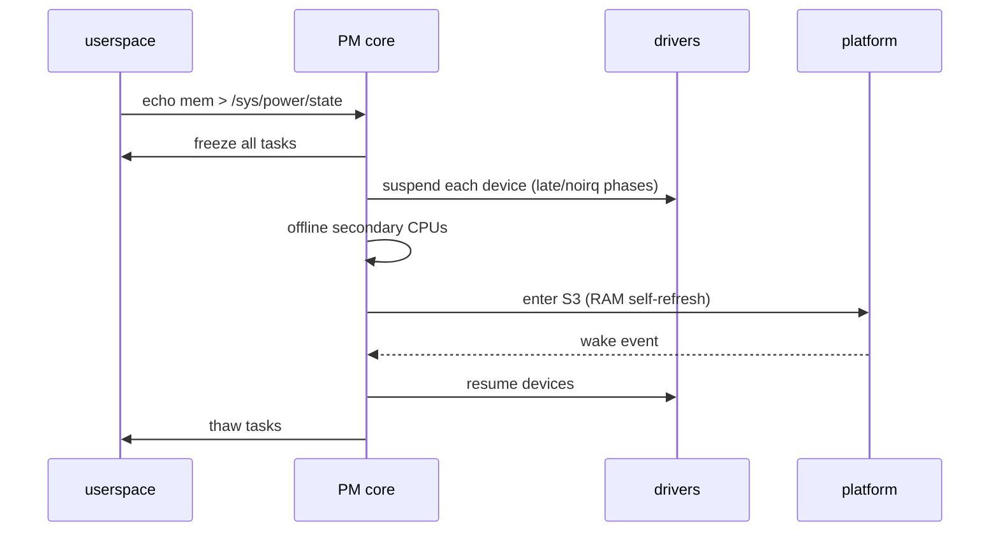

# Power Management: Governors, C-States & ACPI

> **Goal:** understand how the kernel decides when to slow down, sleep, or shut off components — the CPU frequency governors, the idle state hierarchy, suspend-to-RAM and hibernation, and the ACPI machinery that orchestrates it all. Every cloud datacenter and laptop battery depends on this code.

Power management is where the kernel spends most of its time doing *nothing* — deliberately. A busy server core is the exception; the common case is a core that is idle, throttled, or waiting for the next interrupt. The subsystems in this chapter decide, thousands of times per second, how deeply to sleep and how fast to run when awake. Get it wrong and you either burn battery/watts for nothing or add latency spikes that ruin a real-time workload.

## The three dimensions of power management

Linux power management operates on three orthogonal axes:

| Dimension | What | Knobs |
|---|---|---|
| **Frequency** (P-states) | How fast the CPU runs when active | cpufreq governors, intel_pstate, EPP |
| **Idle states** (C-states) | How deep the CPU sleeps when idle | `/sys/devices/system/cpu/cpuN/cpuidle/` |
| **System states** (S-states) | Suspend (S3), hibernate (S4), power off (S5) | `/sys/power/state`, `/sys/power/mem_sleep` |

They interact, and the interaction is not intuitive. A CPU running at low
frequency but never sleeping can use *more* total energy than a CPU that
sprints at full frequency, finishes the work, and drops into a deep idle
state.

That "race to idle" strategy is why the naive assumption — "lower clock always
saves power" — is wrong: static leakage current flows whenever the core is
powered, so the fastest way to save energy is often to get back to a
power-gated idle state as quickly as possible.

The three axes are managed by three separate frameworks (`cpufreq`, `cpuidle`,
the system-sleep core), all sitting on top of the ACPI or device-tree
description of the platform.

The P/C/S-state names come from ACPI, but the mechanisms below them are Linux's own. Let's take each axis in turn.

## CPU frequency scaling: the cpufreq framework

The kernel provides a framework (`drivers/cpufreq/`) plus per-architecture drivers that control the CPU clock frequency and core voltage together — DVFS, Dynamic Voltage and Frequency Scaling. Voltage matters more than frequency for power: dynamic power scales roughly as `C × V² × f`, so the `V²` term dominates. Higher frequencies require higher voltage to stay stable, which is why the top of the frequency range costs disproportionately more power than the bottom (the curve is superlinear). This single fact drives almost every tuning decision in this chapter.

```bash
# What driver are you using?
cat /sys/devices/system/cpu/cpu0/cpufreq/scaling_driver
# acpi-cpufreq, intel_pstate, intel_cpufreq, amd-pstate, amd-pstate-epp, or cppc_cpufreq

# Available frequencies (only exposed by table-based drivers)
cat /sys/devices/system/cpu/cpu0/cpufreq/scaling_available_frequencies
cat /sys/devices/system/cpu/cpu0/cpufreq/scaling_available_governors

# Current state
cat /sys/devices/system/cpu/cpu0/cpufreq/scaling_cur_freq   # requested frequency (kHz)
cat /sys/devices/system/cpu/cpu0/cpufreq/scaling_governor   # active governor
cat /sys/devices/system/cpu/cpu0/cpufreq/scaling_max_freq   # policy max
cat /sys/devices/system/cpu/cpu0/cpufreq/scaling_min_freq   # policy min
```

The central data structure is [struct cpufreq_policy](https://elixir.bootlin.com/linux/v6.12/C/ident/cpufreq_policy). One policy governs a group of CPUs that must share a frequency (a `cpumask` called `related_cpus` — on many Intel parts every core is independent, but on other hardware a whole cluster shares one clock domain). The fields that matter:

- `min`, `max`, `cur` — the policy frequency limits and last-requested value (kHz). `scaling_min_freq`/`scaling_max_freq` in sysfs write straight into `min`/`max`.
- `cpuinfo.min_freq`, `cpuinfo.max_freq` — the immovable hardware limits.
- `governor` — a pointer to the active [struct cpufreq_governor](https://elixir.bootlin.com/linux/v6.12/C/ident/cpufreq_governor), which supplies `->init`, `->start`, `->limits`, and `->stop` callbacks.
- `governor_data` — private per-policy state the governor allocates.

There are two fundamentally different ways the frequency actually changes.

### Legacy: table-based, kernel-controlled (acpi-cpufreq)

Firmware exposes a discrete P-state table (the ACPI `_PSS` object). The kernel picks one entry; a governor decides *which*, and the driver writes a control MSR to request it. Firmware/hardware performs the voltage-frequency transition. The classic governors run entirely in the kernel:

| Governor | Behavior |
|---|---|
| **powersave** | Always the lowest frequency in the policy |
| **performance** | Always the highest frequency in the policy |
| **ondemand** | Samples per-CPU load on a timer; ramps up fast, down slowly |
| **conservative** | Like ondemand but ramps up gradually too |
| **userspace** | User space writes the exact frequency via sysfs |
| **schedutil** | Scheduler-driven: frequency follows the scheduler's utilization signal |

`ondemand` is the historically important one and worth understanding as the thing `schedutil` replaced. It runs a deferrable timer (default `sampling_rate` ≈ 10 ms, and never faster than `transition_latency × 1000`). Each tick it computes busy time since the last sample; if utilization crosses `up_threshold` (default 80 %) it jumps straight to `max`, then steps down gradually as load falls. The weakness is structural: a burst that starts and ends *between* two 10 ms samples is invisible, so interactive latency suffers.

### Modern: hardware-managed P-states (intel_pstate / amd-pstate)

On recent Intel (Sandy Bridge and later) and AMD (Zen 2 and later) CPUs, the hardware itself can pick the P-state far faster than any kernel timer, using an in-silicon power controller. Linux configures it with hints rather than commanding exact frequencies.

Intel's `intel_pstate` driver has three operating modes:

```bash
cat /sys/devices/system/cpu/intel_pstate/status
# active  — hardware picks the P-state (HWP) guided by an EPP hint; no kernel governor
# passive — driver exposes as a normal cpufreq backend; a kernel governor (schedutil) runs
# off     — hand control back to acpi-cpufreq
```

In **active** mode with **HWP** (Hardware-managed P-states, since Skylake), the crucial knob is the **Energy Performance Preference** — a 0–255 value the kernel writes into the `IA32_HWP_REQUEST` MSR that biases the hardware's autonomous choice:

```bash
cat /sys/devices/system/cpu/cpu0/cpufreq/energy_performance_preference
# performance | balance_performance | balance_power | power
# or a raw value 0-255  (0 = max performance, 255 = max power saving)

# Set a balanced hint on every CPU
for f in /sys/devices/system/cpu/cpu*/cpufreq/energy_performance_preference; do
    echo balance_performance > "$f"
done
```

AMD's equivalent is the `amd-pstate` driver (merged in 5.17), built on the ACPI CPPC (Collaborative Processor Performance Control) interface. Its EPP-aware active mode landed as `amd-pstate-epp` in 6.1; as of 6.12 it supports `active`, `passive`, and `guided` modes:

```bash
cat /sys/devices/system/cpu/amd_pstate/status                          # active | passive | guided
cat /sys/devices/system/cpu/cpu0/cpufreq/energy_performance_available_preferences
```

### schedutil: the scheduler-driven governor

`schedutil` (since 4.7, and the default cpufreq governor on most modern distributions) is the one to understand deeply, because it fixed ondemand's blind spot. It has no sampling timer at all. Instead the CPU scheduler calls [cpufreq_update_util()](https://elixir.bootlin.com/linux/v6.12/C/ident/cpufreq_update_util) on every enqueue, dequeue, and tick, handing the governor a fresh utilization estimate. That estimate comes from PELT (Per-Entity Load Tracking): a geometric moving average of how busy each runqueue is, with a ~32 ms half-life, expressed on a scale where the CPU's maximum capacity is 1024.

Note the wrinkle for 6.6+: [CPU Scheduling](#/scheduling) replaced CFS with **EEVDF** as the default scheduler in 6.6, but PELT is a separate accounting layer that survived intact — EEVDF still feeds the same utilization signal to schedutil. The governor maps utilization to frequency with a fixed 25 % headroom:

```
next_freq = max_freq × (util / max_capacity) × 1.25
```

The 1.25 multiplier leaves spare capacity so a growing load isn't perpetually one step behind. Because the update is event-driven, schedutil reacts within microseconds of a task waking, not after the next 10 ms sample. To avoid thrashing the hardware, transitions are throttled by `rate_limit_us`:

```bash
cat /sys/devices/system/cpu/cpufreq/policy0/schedutil/rate_limit_us
# For latency-sensitive workloads, lower it:
echo 500 > /sys/devices/system/cpu/cpufreq/policy0/schedutil/rate_limit_us
```

**Container link:** cpufreq is a physical, host-wide property. A CPU cgroup weight or quota ([Control Groups](#/cgroups)) throttles how much CPU *time* a container gets, but it does not set the frequency — a heavily-limited container still runs on whatever frequency the host governor chose. If you cap containers hard, schedutil sees low utilization and may clock the package down, hurting the latency of everything co-located on it.

## Energy Aware Scheduling (EAS)

On **heterogeneous** ARM SoCs (big.LITTLE and DynamIQ), cores differ in their power-efficiency curves. A "big" Cortex-X core at 1 GHz can be more energy-efficient than a "little" Cortex-A core at 2 GHz for the same amount of work — or the reverse, depending on the operating point. EAS (merged in 4.12) gives the scheduler an **energy model** so it can place a task on the CPU that minimizes *predicted total energy*, not just balance load.

The kernel builds a [struct em_perf_domain](https://elixir.bootlin.com/linux/v6.12/C/ident/em_perf_domain) per frequency domain from the device tree or ACPI, listing each operating performance point (OPP) with its frequency, capacity, and power cost. On wakeup, the scheduler's [find_energy_efficient_cpu()](https://elixir.bootlin.com/linux/v6.12/C/ident/find_energy_efficient_cpu) walks the candidate CPUs, estimates the energy delta of placing the task on each, and picks the cheapest — as long as it doesn't hurt throughput. EAS only engages when the topology is asymmetric (the `SD_ASYM_CPUCAPACITY` scheduler-domain flag is set) and `CONFIG_ENERGY_MODEL=y`; on a symmetric x86 server it stays dormant.

```bash
cat /proc/sys/kernel/sched_energy_aware              # 1 = enabled
cat /sys/kernel/debug/energy_model/*/ps:*/cost       # energy cost per OPP (debugfs)
```

## C-states: idle depth

When a runqueue empties, the CPU runs the **idle task** (PID 0, one per CPU). It does not busy-loop — it executes an instruction that halts the core until the next interrupt. On x86 that is `HLT` or, for the deeper states, `MWAIT` with a hint; on arm64 it is `WFI` (Wait For Interrupt). Each successively deeper C-state powers down more of the core and package, saving more energy but taking longer to exit:

| C-state | Name | Exit latency | Power saving | What sleeps |
|---|---|---|---|---|
| C0 | Active | 0 µs | none | running |
| C1 | Halt | ~1 µs | clock gating | core stops executing |
| C1E | Enhanced Halt | ~2–3 µs | + lower voltage | core voltage drops |
| C2/C3 | Sleep | ~10–40 µs | + clock stopped | core clock stops, caches flushed |
| C6 | Deep sleep | ~50–150 µs | + power gate | core powered off, state saved to on-die SRAM |
| C7+ | Deepest | ~100–500 µs | + package savings | package-level power gating, L3 may flush |

Every state a driver exposes is a [struct cpuidle_state](https://elixir.bootlin.com/linux/v6.12/C/ident/cpuidle_state). The fields that govern the decision:

- `exit_latency_ns` — how long, in the worst case, from wake signal to first instruction of real work. This is what bounds interrupt response.
- `target_residency_ns` — the minimum time you must stay asleep for entering the state to be a net energy *win* (it costs energy to flush caches and power the core back up). The governor never picks a state whose target residency exceeds the predicted idle length.
- `enter` — the function pointer that actually halts the core.
- `flags` — e.g. `CPUIDLE_FLAG_TLB_FLUSHED`, `CPUIDLE_FLAG_POLLING`.

Choosing a state is the job of the **cpuidle governor**. Two are in tree:

- **menu** (`.rating = 20`, the default) predicts the next idle duration from timer deadlines and a correction factor learned from recent history, then picks the deepest state whose `target_residency` fits inside that prediction and whose `exit_latency` respects the current PM-QoS latency limit.
- **teo** (Timer Events Oriented, `.rating = 19`, since 4.18) bases its prediction more directly on how recent idle periods compared to the nearest timer, and often behaves better on tickless systems. Many latency-sensitive setups switch to it.

```bash
ls -1 /sys/devices/system/cpu/cpu0/cpuidle/            # state0/ state1/ ...
cat /sys/devices/system/cpu/cpu0/cpuidle/state3/name       # e.g. "C6"
cat /sys/devices/system/cpu/cpu0/cpuidle/state3/latency    # exit latency (µs)
cat /sys/devices/system/cpu/cpu0/cpuidle/state3/residency  # target residency (µs)
cat /sys/devices/system/cpu/cpu0/cpuidle/state3/usage       # times entered
cat /sys/devices/system/cpu/cpu0/cpuidle/state3/time        # total µs spent

cat /sys/devices/system/cpu/cpuidle/current_governor    # menu | teo | ladder
cat /sys/devices/system/cpu/cpuidle/current_driver      # intel_idle | acpi_idle

# Forbid a deep state on a latency-critical CPU
echo 1 > /sys/devices/system/cpu/cpu8/cpuidle/state3/disable
```

On modern Intel the driver is **intel_idle**, which ignores the firmware `_CST` table entirely and uses a hand-maintained per-model table of MWAIT hints — the kernel developers trust their own numbers more than the BIOS's. On other platforms `acpi_idle` reads the C-states from ACPI.

There is also a way for user space to demand bounded wake latency without disabling states by hand: the **PM QoS** interface. A process opens `/dev/cpu_dma_latency` and writes a microsecond value; the cpuidle governor will then never pick a state whose `exit_latency` exceeds it, for as long as the file stays open.

```bash
# Hold wake latency under 5 µs while a real-time job runs (keep the fd open!)
exec 3<> /dev/cpu_dma_latency
printf '\x05\x00\x00\x00' >&3
# ... run the latency-sensitive workload ...
exec 3>&-   # closing the fd releases the constraint
```

**Cross-cutting link:** deep C-states and the tickless kernel are two sides of one coin. [Timers & Time](#/timers) explains `NO_HZ` — with the periodic tick stopped, an idle CPU can stay in C6 for tens of milliseconds instead of being woken 250 times a second just to update jiffies. For isolating cores from *all* wakeups, see [CPU Isolation, NO_HZ & Real-Time](#/cpu-isolation), which frequently pins isolated cores out of deep C-states so their wake latency is deterministic.

## The idle loop: what a CPU does when nothing runs

```c
// Simplified do_idle() — kernel/sched/idle.c
while (1) {
    while (!need_resched()) {
        // pick and enter the best idle state, then wake on interrupt
        cpuidle_idle_call();
    }
    // something became runnable
    schedule_idle();   // switch to the real task
}
```

`cpuidle_idle_call()` is where the governor prediction, the state entry, and the after-the-fact learning happen. The idle task consumes no scheduler time budget — it is the lowest-priority thing on the CPU and runs only when the runqueue is otherwise empty. The instant an [interrupt](#/interrupts) makes a task runnable, `need_resched()` flips true and the CPU is back on real work within its C-state's exit latency.

## Follow the code (kernel v6.12)

### Path 1 — entering and leaving idle

1. The scheduler has nothing to run, so it schedules the per-CPU idle task, whose body is [do_idle()](https://elixir.bootlin.com/linux/v6.12/C/ident/do_idle) in `kernel/sched/idle.c`. It loops while `need_resched()` is false.
2. Each iteration calls [cpuidle_idle_call()](https://elixir.bootlin.com/linux/v6.12/C/ident/cpuidle_idle_call). If cpuidle is disabled it falls back to a plain `default_idle()` (`HLT`); otherwise it drives the framework.
3. [cpuidle_select()](https://elixir.bootlin.com/linux/v6.12/C/ident/cpuidle_select) invokes the active governor's `->select`. For the default governor that is [menu_select()](https://elixir.bootlin.com/linux/v6.12/C/ident/menu_select), which predicts the next idle duration (from the next timer deadline scaled by a learned correction factor), enforces the PM-QoS latency limit, and returns the index of the deepest viable `struct cpuidle_state`.
4. [cpuidle_enter()](https://elixir.bootlin.com/linux/v6.12/C/ident/cpuidle_enter) calls that state's `->enter` callback — on Intel, `intel_idle()`, which issues `MWAIT` with the state's hint. The core powers down. Interrupts are disabled around the entry so a wakeup can't be lost.
5. An interrupt fires, `MWAIT` returns, and control comes back to `cpuidle_enter()`, which records the *actual* time slept.
6. [cpuidle_reflect()](https://elixir.bootlin.com/linux/v6.12/C/ident/cpuidle_reflect) feeds that measured residency back into the governor so its correction factor improves — the menu governor is a closed feedback loop, constantly re-learning how good its predictions were.

### Path 2 — schedutil picking a frequency

1. A task wakes; the scheduler enqueues it and updates PELT, then calls [cpufreq_update_util()](https://elixir.bootlin.com/linux/v6.12/C/ident/cpufreq_update_util) with the runqueue's new utilization.
2. That dispatches to schedutil's [sugov_update_single_freq()](https://elixir.bootlin.com/linux/v6.12/C/ident/sugov_update_single_freq) (the single-CPU-policy fast path). It reads utilization via `sugov_get_util()`, combining CFS/EEVDF, RT, DL and IRQ pressure into one number.
3. [get_next_freq()](https://elixir.bootlin.com/linux/v6.12/C/ident/get_next_freq) applies the `max_freq × util/max × 1.25` mapping and clamps to the policy's `min`/`max`.
4. If `rate_limit_us` hasn't elapsed since the last change, the request is dropped. Otherwise, on hardware that supports it, `cpufreq_driver_fast_switch()` writes the new P-state MSR directly from the scheduler context — no workqueue, no context switch. On slower hardware a dedicated kthread performs the transition.

## System sleep states: suspend & hibernate

```bash
cat /sys/power/state
# freeze mem disk
# freeze = suspend-to-idle (s2idle / S0ix: CPUs idle, platform stays on)
# mem    = suspend-to-RAM (S3: RAM in self-refresh, almost everything off)
# disk   = hibernate (S4: RAM written to swap, full power-off)

cat /sys/power/mem_sleep     # what "mem" maps to: [s2idle] deep   (brackets = current)
echo mem > /sys/power/state  # sleep until a wake event

cat /proc/acpi/wakeup        # devices allowed to wake the system
```

The `s2idle` vs `deep` distinction matters on laptops: many modern machines only implement `s2idle` (S0ix) in firmware and no true S3, which is why some laptops drain noticeably in "sleep" — s2idle keeps more of the platform powered than S3 did.

### How suspend-to-RAM works

Suspend is a strictly ordered teardown so that no device is left half-configured:



1. **Freeze processes.** [freeze_processes()](https://elixir.bootlin.com/linux/v6.12/C/ident/freeze_processes) sends every user task through the *task freezer* — it parks them at a safe point via `try_to_freeze()`. Note this is the task freezer, **not** the cgroup-v2 freezer controller from [Control Groups](#/cgroups); they share a name and a concept but are different code. Kernel threads that must keep running during suspend mark themselves accordingly.
2. **Suspend devices.** The PM core walks the device tree calling each driver's `dev_pm_ops` callbacks in dependency order — `->prepare`, `->suspend`, then the `->suspend_late` and `->suspend_noirq` phases with interrupts progressively disabled. USB controllers, NVMe, GPU, and NICs drop to low power; drivers save whatever registers won't survive.
3. **Offline non-boot CPUs.** Every secondary CPU is hot-unplugged; only the boot CPU remains.
4. **Platform sleep.** `syscore_suspend()` runs, then the ACPI `_S3` transition puts DRAM into self-refresh. Only the power button, wake-on-LAN, lid, and a few GPIOs stay alive.

Resume runs the mirror image, and on a modern NVMe laptop the whole round trip is typically 1–3 seconds.

### Hibernate (suspend-to-disk)

Hibernation writes a snapshot of all in-use RAM to swap, then powers off entirely (S4). On the next boot the kernel detects the image, reads it back, and restores every process to its exact pre-hibernate state.

```bash
swapon --show                 # need swap >= the RAM you expect to be in use
echo disk > /sys/power/state  # or: systemctl hibernate

grep -o 'resume=[^ ]*' /proc/cmdline   # bootloader arg: which swap holds the image
# e.g. resume=/dev/nvme0n1p3 resume_offset=34816   (offset needed for swapfiles)
```

Under the hood,
[hibernate()](https://elixir.bootlin.com/linux/v6.12/C/ident/hibernate)
freezes tasks, snapshots memory into a set of image pages, then
`swsusp_write()` streams them to swap. The image is compressed on the way out
(LZO by default, with LZ4 and others selectable), which is usually a net
speedup because storage is the bottleneck.

A signature written into the swap header tells the resuming kernel to restore
rather than boot clean; the `resume=` kernel parameter (see [From Power Button
to Login](#/boot-process)) points at the device.

Because the image can be tens of GB and the write is a large sequential
[storage](#/storage-stack) transfer, hibernation is far slower than S3 —
seconds to tens of seconds — even on NVMe. It is also why hibernation and
encrypted swap need care: the image contains the entire contents of RAM.

```bash
cat /sys/power/image_size            # target image size (0 = auto, ~2/5 of RAM)
echo 1 > /sys/power/pm_debug_messages # verbose PM logging
journalctl -k | grep -i 'PM:'
```

### Device Runtime PM: fine-grained power gating

System sleep is all-or-nothing. **Runtime PM** lets an *individual* device power down while the rest of the machine runs, and it is how a modern laptop reaches 10+ hours — hundreds of devices independently gated.

```bash
cat /sys/class/net/eth0/power/runtime_status   # active | suspended | suspending
cat /sys/class/net/eth0/power/control          # on | auto
echo auto > /sys/class/net/eth0/power/control  # let the kernel autosuspend when idle
```

The framework keeps a per-device `usage_count` (an atomic refcount) and an `autosuspend_delay`. When the count hits zero and the device stays idle past the delay, the core calls the driver's `runtime_suspend` from its `dev_pm_ops`; the next access calls `runtime_resume`. See [Devices, Drivers & Modules](#/devices-modules) for where `dev_pm_ops` fits in the driver model. A USB host controller with nothing plugged in can power off, a SATA link can enter slumber, a GPU can clock-gate its display engine — all transparently.

## Practical power tuning

```bash
# ─── Server: maximum, predictable throughput ───
for g in /sys/devices/system/cpu/cpu*/cpufreq/scaling_governor; do echo performance > "$g"; done
echo 1 > /sys/devices/system/cpu/intel_pstate/no_turbo   # optional: kill turbo for stable latency
for e in /sys/devices/system/cpu/cpu*/cpufreq/energy_performance_preference; do echo performance > "$e"; done

# ─── Laptop: maximize battery ───
for e in /sys/devices/system/cpu/cpu*/cpufreq/energy_performance_preference; do echo balance_power > "$e"; done
# leave the deep C-states enabled (do NOT disable stateN/disable)

# ─── Mixed: responsive but efficient ───
for g in /sys/devices/system/cpu/cpu*/cpufreq/scaling_governor; do echo schedutil > "$g"; done

# ─── Cap the top frequency (skip the superlinear part of the V/f curve) ───
echo 2800000 > /sys/devices/system/cpu/cpu0/cpufreq/scaling_max_freq   # 2.8 GHz ceiling

# ─── Measure actual package energy (Intel/AMD RAPL) ───
cat /sys/class/powercap/intel-rapl/intel-rapl:0/energy_uj  # read twice, Δ/Δt = watts
```

## The ACPI subsystem

ACPI (Advanced Configuration and Power Interface) is the firmware contract that describes what the platform can power down and how. Crucially, the kernel's ACPI core (`drivers/acpi/`) is not a table parser — it embeds a full interpreter for **AML** (ACPI Machine Language) bytecode, so firmware ships *code* the OS executes to evaluate power methods, read thermal sensors, and receive events.

```bash
ls /sys/firmware/acpi/tables/                       # DSDT, SSDT, FADT, MADT, ...
cp /sys/firmware/acpi/tables/DSDT /tmp/dsdt.dat
iasl -d /tmp/dsdt.dat                               # disassemble AML to readable ASL

acpi_listen                                         # watch lid, button, battery, AC events
```

The interpreter evaluates the objects the other subsystems rely on: `_PSS` (the P-state table behind acpi-cpufreq), `_CST` (C-states behind acpi_idle), `_Sx` sleep requirements, and the thermal methods `_TMP`/`_PSV`/`_ACx`. When firmware wants to tell the OS something — AC adapter unplugged, thermal trip, battery low — it raises an SCI (System Control Interrupt), an [interrupt](#/interrupts) that the ACPI core turns into a `Notify` event routed to the right driver.

```bash
cat /sys/class/thermal/thermal_zone0/temp        # millidegrees C
cat /sys/class/thermal/thermal_zone0/type        # x86_pkg_temp | acpitz | ...
cat /sys/class/thermal/cooling_device*/cur_state # current cooling level (fan speed, etc.)
```

## Energy efficiency in cloud datacenters

Cloud operators optimize watts per request, not per machine, and the physics above dictates the playbook:

1. **Consolidate to enable idle.** Pack low-utilization VMs onto fewer sockets so the rest can reach deep package C-states — an idle-but-powered socket still leaks.
2. **Cap frequency below the peak.** Because of the superlinear V/f curve, holding cores at ~80–90 % of max sheds the most power-hungry P-states for a small throughput cost.
3. **SMT-aware placement.** Keep latency-sensitive threads off sibling hardware threads that contend for the same execution units — contention wastes both time and power.
4. **Per-guest P-state control.** With [KVM](#/kvm-internals), the host can bound a guest's effective frequency and expose (or hide) turbo, shaping the guest's power envelope without its cooperation.

## Try it yourself

```bash
# Live per-core frequency, C-state residency, and package power
turbostat --quiet --show PkgWatt,CorWatt,PkgTmp,Bzy_MHz,C1,C6 -i 1
# (from linux-tools / linux-cpupower packages)

# Inventory and monitor idle states
cpupower idle-info
cpupower monitor

# Find and (optionally) apply power tunables
powertop --calibrate    # ~5 min; then browse the Tunables tab
powertop --auto-tune

# Safe suspend test in a VM (no firmware dependency)
echo freeze > /sys/power/state    # suspend-to-idle; wake it from the hypervisor

# Watch a C-state fill up: pin a busy loop, then a sleep, and diff usage
before=$(cat /sys/devices/system/cpu/cpu0/cpuidle/state3/usage); sleep 5
after=$(cat /sys/devices/system/cpu/cpu0/cpuidle/state3/usage)
echo "C6 entries in 5s: $((after - before))"

# Power capping via RAPL (Intel)
cat /sys/class/powercap/intel-rapl:0/constraint_0_power_limit_uw
cat /sys/class/powercap/intel-rapl:0/constraint_0_time_window_us
```

## Check your understanding

1. The `performance` governor pins the CPU at maximum frequency. Why can that *reduce* real performance on a thermal-constrained laptop?

<details><summary>Show answer</summary>

Running flat-out drives the die to its thermal limit (~100 °C), at which point the hardware clamps frequency far below what the governor asked for. The resulting throttle-and-recover cycles add jitter, so sustained throughput can be lower — and less predictable — than a governor that never provokes throttling.

</details>

2. A core is in C6. An interrupt for a latency-critical task arrives. Roughly how long until the task's code runs, and where do you read that bound?

<details><summary>Show answer</summary>

Bounded by C6's exit latency, ~50–150 µs — the core must be re-powered, its state restored from on-die SRAM, and caches/interrupts re-enabled before the ISR runs. Read the exact value at `/sys/devices/system/cpu/cpuN/cpuidle/state3/latency`. To cap it, use PM QoS via `/dev/cpu_dma_latency` or disable the deep state on that CPU.

</details>

3. You suspend-to-RAM, close the lid, and put the laptop in a bag; the bag gets hot. What most likely happened?

<details><summary>Show answer</summary>

A spurious wake event (lid-sensor jitter, a USB device, or Wi-Fi firmware) resumed the machine. With no user interaction to re-trigger suspend, it stayed awake at full power with no ventilation. Check `/proc/acpi/wakeup` and `journalctl -k | grep -i 'PM:'` to find the culprit wake source.

</details>

4. Why is hibernation slow even on fast NVMe, and why does it write to swap at all when RAM is what changed?

<details><summary>Show answer</summary>

Hibernation snapshots every in-use RAM page — often tens of GB — and streams it to swap because that is the only place large enough to survive a full power-off (S4). Even compressed and sequential, moving that volume is a large storage transfer, so it takes seconds to tens of seconds versus S3's ~1–3 s.

</details>

5. schedutil replaced ondemand. What signal does it use, and why does that beat ondemand's approach?

<details><summary>Show answer</summary>

It uses the scheduler's PELT utilization (a ~32 ms half-life moving average on a 0–1024 scale), delivered via `cpufreq_update_util()` on every scheduling event. Because it is event-driven it reacts within microseconds, whereas ondemand polls every ~10 ms and misses any burst that begins and ends between samples.

</details>

6. On a symmetric x86 server, why does Energy Aware Scheduling do nothing, and where *does* it pay off?

<details><summary>Show answer</summary>

EAS only activates on asymmetric topologies (the `SD_ASYM_CPUCAPACITY` domain flag) with `CONFIG_ENERGY_MODEL=y` — it needs cores with *different* power-efficiency curves to choose between. On a uniform server every core is identical, so there is no energy-optimal placement to find; it pays off on heterogeneous ARM big.LITTLE/DynamIQ SoCs.

</details>

7. "Race to idle" says a faster clock can save energy. How is that compatible with capping frequency to save power in a datacenter?

<details><summary>Show answer</summary>

Both follow from the V/f curve plus static leakage. Race-to-idle wins when finishing sooner lets the core reach a deep, power-gated C-state — active leakage stops entirely. Frequency capping wins in the steady-busy case where the core never idles: there, avoiding the superlinear top of the V/f curve saves more than the extra runtime costs. The deciding factor is whether the workload actually goes idle.

</details>

## Sources & further reading

- CPUFreq core and governors — https://docs.kernel.org/admin-guide/pm/cpufreq.html
- intel_pstate driver (HWP, EPP, active/passive) — https://docs.kernel.org/admin-guide/pm/intel_pstate.html
- amd-pstate driver — https://docs.kernel.org/admin-guide/pm/amd-pstate.html
- CPUIdle core and governors — https://docs.kernel.org/admin-guide/pm/cpuidle.html
- Energy Aware Scheduling — https://docs.kernel.org/scheduler/sched-energy.html
- System sleep states (freeze/mem/disk) — https://docs.kernel.org/admin-guide/pm/sleep-states.html
- Runtime power management — https://docs.kernel.org/power/runtime_pm.html
- `cpupower(1)` and `turbostat(8)` — https://man7.org/linux/man-pages/man1/cpupower.1.html
- cpuidle source — https://elixir.bootlin.com/linux/v6.12/source/drivers/cpuidle

---

**Next:** you've seen how the kernel manages power across one physical package. Now we look at what happens when you have *multiple* packages — [NUMA Deep Dive](#/numa-deep-dive), where every memory access carries a price tag that depends on which CPU is asking and which DIMM holds the answer.
