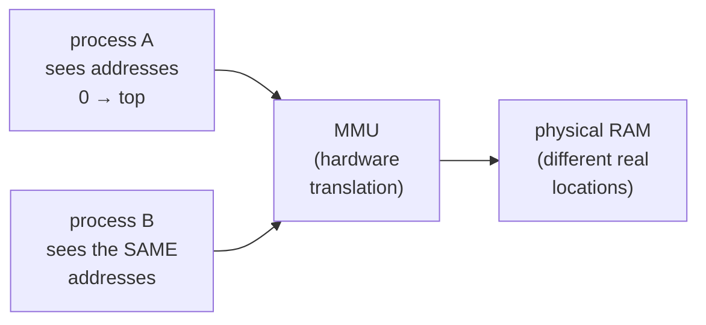

# From Source Code to Running Process

> **Goal:** turn "I type `./thing` and it runs" into a precise mental model —
> what a program *file* actually contains, what a running *process* looks like
> in memory, and the one idea that everything after this chapter depends on:
> a program can't touch anything by itself. It has to **ask the kernel**.

You use programs all day. `ls`, `grep`, `docker`, `python`, your editor. You
know how to *run* them. This chapter is about what they *are* — as files on
disk, and as living things in memory — and how one becomes the other. Nothing
here needs you to write code. You just need to stop treating the binary as a
black box.

By the end you'll be able to read the phrase "the kernel loads the ELF and
starts the process" — which shows up constantly in later chapters like
[Processes & Threads](#/processes) — and know exactly what each word means.

## A program file is just machine code plus data

Strip away the mystique and an executable file is two things wrapped in a
container:

- **Machine code** — the actual instructions the CPU runs, the ones from
  [The Machine Underneath](#/prereq-hardware): move this number into that
  register, add these two, jump if zero. Not text you'd want to read; raw
  bytes the CPU decodes directly.
- **Data** — constants the program needs baked in: the string `"Hello,
  world"`, a lookup table, the initial value of a counter.

The container that holds them, on Linux, is a file format called **ELF**
(Executable and Linkable Format). We'll open one up shortly. For now, the key
idea: an executable is not magic. It's a file, like any other, that happens to
contain instructions a CPU can execute and a header telling the kernel how to
lay them out.

### Compiled vs interpreted: who is the actual program?

Here's a distinction that quietly confuses people for years.

When you run a **compiled** program — most of the commands in `/bin` — the
file itself contains machine code. The CPU runs it directly. Someone took
human-readable **source code** (C, C++, Rust, Go) and ran it through a
**compiler** ahead of time to produce that machine code. `ls` is a compiled C
program; the `ls` on your disk is the finished machine code, and the C source
lives somewhere else entirely (in the coreutils project) and isn't needed to
run it.

When you run an **interpreted** program — `python script.py`, `node app.js`, a
bash script — something different happens. Your `.py` file is **not** a program
the CPU can run. It's a text file. The actual program is the **interpreter**:
`/usr/bin/python3` is itself a compiled ELF binary full of machine code, and
*it* reads your `.py` file as *data*, figures out what you meant, and does it.

| | Compiled (C, Go, Rust) | Interpreted (Python, JS, shell) |
|---|---|---|
| What's on disk | machine code, ready to run | source text |
| What the CPU runs | your program directly | the **interpreter** binary |
| Your source file is… | not needed at runtime | the data the interpreter reads |
| Startup | fast (already machine code) | slower (parse + interpret) |
| The binary is… | your program | the language runtime |

This is why `python3` shows up as the process name when your script runs, and
why you need Python *installed* to run a `.py` but not to run `ls`. It's also
why the `#!/usr/bin/python3` line at the top of a script is called a
**shebang**: it tells the kernel which interpreter to launch and hand the file
to. (The kernel special-cases those first two bytes, `#!`, when it's asked to
"run" a text file.)

The rest of this chapter follows the compiled path, because that's where you
can see every step. But keep the interpreter in mind: `python3` *itself* went
through exactly this pipeline.

## Walking one tiny C program to a binary

You don't need to know C yet (that's [Just Enough C to Read the
Kernel](#/prereq-c)). But watching five lines of it become a runnable file
demystifies the whole toolchain. Here is `hello.c`:

```c
#include <stdio.h>

int main(void) {
    printf("Hello, world\n");
    return 0;
}
```

Read it loosely: "include some standard definitions; the program starts at
`main`; print a line; return 0." Now you run one command:

```bash
gcc hello.c -o hello
```

`gcc` (the GNU C Compiler, installed on most dev machines — `apt install gcc`
or `dnf install gcc` if not) turns that text into a runnable binary called
`hello`. That single command actually runs a small assembly line of stages.
In plain words:

1. **Preprocess.** Handle the lines starting with `#`. `#include <stdio.h>`
   literally pastes in the contents of a system header file — a bunch of
   declarations, including one that says "a function called `printf` exists and
   takes a string." The output is still C, just expanded.
2. **Compile.** Translate the expanded C into **machine code** for your CPU
   architecture (x86-64, arm64…). The result is an **object file** — machine
   code, but with holes: the compiler knows you called `printf`, but it doesn't
   have `printf`'s actual code. It leaves a labelled blank: "call whatever
   `printf` turns out to be."
3. **Link.** Fill in the holes and assemble the final ELF. The **linker**
   resolves that `printf` reference — `printf` lives in the **C library**
   (libc), so the linker records "this program needs libc, and needs `printf`
   from it." It also bolts on **startup code**: a small chunk that runs
   *before* your `main`, sets up the argument list and environment, and calls
   `main` for you — and afterwards takes `main`'s return value and turns it
   into the program's exit status.

That last point is worth pausing on. `main` is not actually where a program
begins. The real entry point (`_start`, added by the linker) runs first, does
setup, calls `main`, and on return calls the `exit` machinery. You just never
see it.

The output, `hello`, is now a self-contained ELF file — except for the parts it
borrows from libc at runtime. Which brings us to what's inside.

## ELF at a glance

Ask the `file` command what `hello` — or any binary — actually is:

```bash
file /bin/ls
```

You'll get something close to this (illustrative; exact text varies by distro):

```text
/bin/ls: ELF 64-bit LSB pie executable, x86-64, version 1 (SYSV),
dynamically linked, interpreter /lib64/ld-linux-x86-64.so.2, ... stripped
```

Every phrase means something concrete:

| Phrase | What it tells you |
|---|---|
| **ELF** | the file format — the standard container for Linux executables, shared libraries, object files, and core dumps |
| **64-bit** | uses 64-bit addresses (the world from [The Machine Underneath](#/prereq-hardware)) |
| **LSB** | least-significant-byte-first (little-endian) — how multi-byte numbers are ordered, matching x86-64 |
| **pie executable** | Position-Independent Executable: it can be loaded at a *randomized* address each run (that's **ASLR**, a security feature — the program doesn't assume it lives at a fixed spot) |
| **x86-64** | the CPU architecture the machine code targets. An arm64 binary won't run here, and vice-versa |
| **dynamically linked** | it does **not** contain a copy of libc; it borrows it at load time (next section) |
| **interpreter /lib64/ld-linux-x86-64.so.2** | the **dynamic linker** — a helper program the kernel runs *first* to stitch in the shared libraries (more below) |
| **stripped** | the debugging symbol names were removed to save space |

Inside the ELF, the content is organized into **sections**. You don't need the
full catalogue, just the shape of it:

- **`.text`** — the machine code. "Text" is an ancient Unix synonym for
  executable instructions; it has nothing to do with human text.
- **`.rodata`** — read-only data: constants and string literals like
  `"Hello, world"`.
- **`.data`** — initialized read/write data: global variables that start with
  a specific value.
- **`.bss`** — variables that start out zero. Clever trick: since they're all
  zero, the file doesn't store them at all — it just records "reserve this many
  bytes and zero them." A giant zero-initialized array costs nothing on disk.
- **The symbol table** — a directory mapping names (`main`, `printf`) to
  addresses. Used by the linker and by debuggers; "stripped" means the
  non-essential parts of it were removed.

The ELF also has a **header** at the very start: a magic number (the four
bytes `\x7f E L F`, so the kernel can recognize it), the architecture, and —
crucially — the address of the entry point and a table describing which chunks
of the file to map into memory and with what permissions. When a later chapter
says "the kernel loads the ELF," this header is the instruction manual it
follows: map `.text` as executable, map `.data` as writable, jump to the entry
point.

## Libraries: why /bin/ls is so small

Run `ls -l /bin/ls` and you'll see it's maybe 100–150 KB. That's tiny for
something that formats output in columns, colorizes by file type, handles
dozens of flags, sorts, and understands file permissions and timestamps. Where
is all that code?

Most of it isn't in `ls` at all. It's in **shared libraries** — files ending
in `.so` ("shared object") that many programs borrow at runtime instead of each
carrying their own copy. Ask which ones `ls` needs:

```bash
ldd /bin/ls
```

Illustrative output (paths and versions differ per system):

```text
linux-vdso.so.1 (0x00007ffd...)
libselinux.so.1 => /lib/x86_64-linux-gnu/libselinux.so.1 (0x00007f...)
libc.so.6 => /lib/x86_64-linux-gnu/libc.so.6 (0x00007f...)
/lib64/ld-linux-x86-64.so.2 (0x00007f...)
```

Walk it line by line:

- **`linux-vdso.so.1`** — not a real file on disk. It's a tiny library the
  *kernel* injects into every process (the vDSO). Notice it has no path. It
  lets a few common operations, like "what time is it," skip the kernel round
  trip. You'll meet it properly in [Kernel, User Space &
  Syscalls](#/kernel-vs-userspace).
- **`libselinux.so.1`** — for querying SELinux security labels on files.
- **`libc.so.6`** — the big one. **The C library.** More on this in a moment.
- **`/lib64/ld-linux-x86-64.so.2`** — the **dynamic linker**, the same one
  named as the "interpreter" in the `file` output. It's listed here because
  it's the machinery that makes all the other lines work.

### libc: the library everything leans on

`libc` (on most Linux systems, **glibc**) shows up in the `ldd` output of
almost every binary on the machine. That is not a coincidence — it is *the*
foundational library, and it plays two roles:

1. **The standard toolkit.** `printf`, `malloc` (get memory), `strlen`,
   `fopen`, `qsort` — the everyday functions compiled programs expect to exist.
   Rather than every program shipping its own copy, they share libc's.
2. **The wrapper around the kernel.** This is the important one for this book.
   When your program needs something from the outside world — read a file, open
   a network connection, get more memory, find out the time — it doesn't (and
   *can't*) talk to the hardware directly. It calls a libc function, and libc
   makes the actual request to the kernel. `printf` eventually calls libc's
   `write`, which makes the real `write` request to the kernel. libc is the
   thin, universal layer between "ordinary function call" and "ask the kernel,"
   which is the entire subject of the next section and of
   [Kernel, User Space & Syscalls](#/kernel-vs-userspace).

So `ldd` shows libc almost everywhere because almost every program needs *both*
the standard toolkit and, sooner or later, to ask the kernel for something —
and libc is the road to both.

### Static vs dynamic linking, in one paragraph

Everything above describes **dynamic** linking: the program keeps its
libraries external and loads them at runtime, so one copy of libc in memory
serves hundreds of running programs and a security fix to libc protects all of
them at once. The alternative is **static** linking: bake copies of every
needed library function *into* the executable at link time. A statically linked
binary is bigger and self-contained — it has no `.so` dependencies, runs on a
machine with no libc installed, and never surprises you with a version
mismatch. That's why Go binaries and many container images ship statically
linked. The trade-off: a libc security fix requires rebuilding every static
binary, not just replacing one shared file. `ldd some-static-binary` will tell
you `not a dynamic executable`.

### The dynamic linker: a program that runs before main()

Return to that "interpreter" line. When you run a dynamically linked program,
the kernel does **not** jump straight into your code. It first loads and runs a
completely separate program — the **dynamic linker/loader**,
`/lib64/ld-linux-x86-64.so.2` — and hands *your* program to it.

The dynamic linker's job, before your `main` ever runs:

1. Read your ELF's list of needed libraries (`libc.so.6`, `libselinux.so.1`…).
2. Find each one on disk (searching standard paths plus anything in
   `LD_LIBRARY_PATH`), and map it into the process's memory.
3. **Resolve the holes** — remember the linker left "call whatever `printf`
   turns out to be"? The dynamic linker now finds `printf` inside the
   just-loaded libc and patches your program so the call lands in the right
   place. (Often lazily, on first use, but that's a detail.)
4. Finally, jump to your program's entry point.

So there's a real program that runs *before* your program, every single time,
whose only job is to stitch the borrowed pieces together. It's easy to go years
without knowing it exists — until a missing `.so` makes a binary refuse to
start with a cryptic error, and now you know exactly which helper is
complaining.

## What "running" actually means

You press Enter on `./hello`. What happens?

Your shell is itself a running program. It doesn't run `hello` inside itself —
it asks the **kernel** to create a brand-new process. Two kernel operations do
this, and you'll meet them in full in [Processes & Threads](#/processes):
**fork** (make a copy of the current process) and **exec** (replace that
copy's contents with a new program — load the ELF, set up memory, jump to the
entry point). For now the teaser is enough: *the shell asks the kernel to
build the process; the kernel loads your ELF into fresh memory and starts it.*

The result is a **process**: one running instance of a program, with its own
private view of memory. That memory has a classic, near-universal layout:

```text
high addresses
┌─────────────────────────────┐
│   command-line args & env    │   argv[], environment variables
├─────────────────────────────┤
│           stack              │   local variables, function call frames
│             │                │   GROWS DOWNWARD ↓ as calls nest
│             ▼                │
│                              │
│        (unused gap)          │
│                              │
│   shared libraries (libc…)   │   mapped in by the dynamic linker
│                              │
│             ▲                │
│             │                │   GROWS UPWARD ↑ as you request memory
│            heap              │   malloc / new live here
├─────────────────────────────┤
│   .bss   (zero-init data)    │
│   .data  (init'd globals)    │
│   .rodata (constants)        │
│   .text  (machine code)      │   ← loaded straight from the ELF
└─────────────────────────────┘
low addresses
```

Read from the bottom up, it's the same content as the ELF sections, now placed
in memory, plus two regions that only exist at runtime:

- **`.text`, `.rodata`, `.data`, `.bss`** — loaded from the file, exactly the
  sections you saw. Code is mapped read-only and executable; constants
  read-only; globals read/write.
- **Heap** — the pool your program grows when it asks for memory (`malloc`).
  Grows **upward**, toward higher addresses.
- **Shared libraries** — libc and friends, mapped in by the dynamic linker,
  somewhere in the middle.
- **Stack** — bookkeeping for function calls: each call pushes a frame holding
  its local variables and where to return. Grows **downward**, toward the heap.
  (Run away with unbounded recursion and the two eventually collide — the
  famous *stack overflow*.)
- **argv & environment** — at the very top, the command-line arguments and
  environment variables the kernel placed there at startup.

That diagram is one process's private map of memory — and here's the twist
that makes it work at all:



Every process believes it has the whole address space to itself, starting from
low addresses, with the layout above. Two processes can both think they're
using address `0x400000` and never collide, because those are **virtual
addresses** that the CPU's memory-management unit translates to different real
locations in RAM. That illusion is **virtual memory**, and it gets a full
chapter: [Virtual Memory](#/memory). For now: each process gets its own
private, tidy map, and the hardware keeps them apart.

### argv, environment, and exit status: things you already use

Three parts of that picture are things you've been touching from the shell
without necessarily connecting them to memory:

- **`argv`** — the command-line arguments. When you run `ls -l /tmp`, the
  strings `"ls"`, `"-l"`, `"/tmp"` are placed in the new process's memory as an
  array, and `main` receives them. The program decides what to do with them.
- **Environment variables** — that block at the top of memory is literally
  where `$PATH`, `$HOME`, `$LANG` and the rest physically live for a running
  process. `export FOO=bar` in your shell adds an entry that gets copied into
  the memory of every process the shell then launches. This is why a variable
  you `export` is visible to child programs but one you don't isn't — it's
  about what gets copied into the child's environment block. You can read any
  process's block directly:

  ```bash
  cat /proc/self/environ | tr '\0' '\n'   # this process's environment, one per line
  ```

- **Exit status** — when a process ends, it returns a small integer (0–255) to
  whoever started it. `0` means success by convention; anything else signals a
  kind of failure. Your shell stashes the last one in `$?`:

  ```bash
  ls /nonexistent; echo $?    # prints 2 — ls failed
  ```

  That number is `main`'s `return` value (remember the startup code that
  captures it), handed back to the kernel and relayed to your shell. Every time
  you've written `command && next` or checked `$?` in a script, you've been
  reading this exit status. Now you know where it comes from.

## The punchline: programs can't touch anything by themselves

Here is the single most important idea in this chapter, the one the whole book
is built on.

A running process, sitting in its private memory, **cannot do anything to the
outside world on its own.** It can shuffle numbers between registers and its
own memory all day — arithmetic, comparisons, loops — and that's it. It cannot:

- print to your terminal,
- read or write a file,
- open a network connection,
- find out what time it is,
- get more memory,
- start another process.

Not because it's polite, but because the **CPU physically forbids it**. User
programs run in a restricted mode (from [The Machine
Underneath](#/prereq-hardware)); the instructions that touch hardware are only
legal in the kernel's privileged mode. Try to touch a device directly and the
CPU traps.

So how does *anything* useful happen? The process **asks the kernel**. That
request is a **system call** (syscall). It's the one doorway from a program's
private world into the kernel that can actually act on hardware. Print a line?
That's a `write` syscall. Open a file? `openat`. More memory? `mmap`. The time?
`clock_gettime`. Start a process? `clone`/`execve`. Everything your program
accomplishes in the real world is a syscall, usually made on its behalf by
libc. The mechanism — how the CPU switches modes and how the kernel handles the
request — is the entire subject of [Kernel, User Space &
Syscalls](#/kernel-vs-userspace). Here we just need the fact: **nothing crosses
the line except through a syscall.**

### See it with your own eyes: strace

You can watch a program's every request to the kernel. `strace` prints each
syscall a program makes. The `-c` flag just counts and summarizes them:

```bash
strace -c ls >/dev/null
```

Illustrative summary (numbers vary run to run):

```text
% time   calls  syscall
------  ------- ----------------
 24.10       11  openat
 15.02        9  mmap
 12.55        6  read
  9.88        5  close
  ...        ..  write, statx, brk, ...
------  ------- ----------------
100.00       ~60  total
```

Sixty-odd syscalls to list a directory. Every one is `ls` asking the kernel to
do something it cannot do itself: open the directory, read its entries, get
file metadata, map in libc, write the formatted output to your terminal. Strip
away `strace`'s formatting and you are literally watching the boundary between
a program and the kernel. When something breaks — a permission denied, a
missing file, a hang — `strace` shows you the exact request and the exact
answer. It's the most instructive debugging tool you'll meet; there's a whole
chapter on mastering it and its faster cousins in [/proc, strace, perf &
eBPF](#/observability).

### File descriptors, and what `>` has been doing all along

When a process wants to work with a file (or a pipe, or a socket, or the
terminal), it doesn't hold the thing directly. It holds a small integer — a
**file descriptor** (fd) — that the kernel uses to look up the real object on
its side. Open a file, and the kernel hands back a number like `3`. From then
on the process says "read from fd 3," "write to fd 3," "close fd 3."

Three file descriptors are open in essentially every process before it even
starts, by universal convention:

| fd | Name | Default points at | Your shell name for it |
|---|---|---|---|
| **0** | standard input (stdin) | your keyboard/terminal | where a program reads input |
| **1** | standard output (stdout) | your terminal | normal output |
| **2** | standard error (stderr) | your terminal | error messages |

And now the payoff. Every time you've redirected output in the shell, you have
been **manipulating this fd table** — nothing more:

- `ls > out.txt` — before launching `ls`, the shell opens `out.txt` and makes
  **fd 1** point at it instead of the terminal. `ls` writes to fd 1 exactly as
  always, never knowing anything changed. Its output lands in the file.
- `ls 2> errors.txt` — same trick, but for **fd 2**. Normal output still goes
  to the terminal; only error messages get diverted.
- `ls > out.txt 2>&1` — the famous one. First point fd 1 at `out.txt`, then
  `2>&1` means "make fd 2 point at *wherever fd 1 currently points*." Now both
  streams flow into the same file. (Order matters: reverse them and fd 2 copies
  fd 1's *original* destination, the terminal.)
- `cmd1 | cmd2` — a pipe. The shell makes `cmd1`'s fd 1 and `cmd2`'s fd 0 the
  two ends of a kernel buffer, so one program's output becomes the other's
  input. That plumbing is its own chapter: [Pipes, FIFOs & Unix
  Sockets](#/ipc-pipes).

This is the first real "aha" of the book: **shell redirection isn't a shell
feature bolted onto files. It's file-descriptor manipulation, done by the shell
before your program starts.** The program is oblivious. It just reads fd 0,
writes fd 1, complains on fd 2 — and the shell decided, in advance, where those
three numbers lead. You can see any process's fds directly:

```bash
ls -l /proc/self/fd     # 0, 1, 2 (and 3, the ls of this very command)
```

## Try it yourself

```bash
# 1. What IS a binary? Decode the ELF header in plain English.
file /bin/ls
file /usr/bin/python3          # also an ELF — the interpreter is the program

# 2. Which shared libraries does ls borrow at runtime?
ldd /bin/ls                    # note libc.so.6 and ld-linux (the dynamic linker)

# 3. Compile a tiny C program yourself (needs gcc: apt/dnf install gcc).
cat > /tmp/hello.c <<'EOF'
#include <stdio.h>
int main(void) { printf("Hello, world\n"); return 0; }
EOF
gcc /tmp/hello.c -o /tmp/hello
file /tmp/hello                # your very own ELF
/tmp/hello                     # run it
echo $?                        # its exit status: 0 = success

# 4. Watch a program ask the kernel for everything it does.
strace -c -e trace=%file ls >/dev/null   # count just the file-related syscalls

# 5. Peek at a live process's memory layout (addresses WILL differ each run,
#    thanks to ASLR). A teaser for the Virtual Memory chapter.
cat /proc/self/maps | head     # look for r-xp (code), rw-p (data), [heap], [stack]

# 6. Where do environment variables physically live? Right here:
env | head                     # $PATH, $HOME, ... the process's environment block
```

## Check your understanding

1. You run `python3 script.py`. Which file contains the machine code the CPU
   actually executes — `script.py` or `python3`?

<details><summary>Show answer</summary>

`python3`. It's a compiled ELF binary full of machine code; `script.py` is
plain text that `python3` reads as *data* and interprets. That's the whole
difference between interpreted and compiled: for an interpreted language, the
interpreter is the real program and your source file is its input. For a
compiled language like C, the binary on disk *is* your program.

</details>

2. `ldd` on almost any binary lists `libc.so.6`. Why is the C library nearly
   universal?

<details><summary>Show answer</summary>

libc plays two roles every program needs. It's the standard toolkit
(`printf`, `malloc`, string functions), and — more fundamentally — it's the
wrapper layer that turns ordinary function calls into **system calls**. Since
every program eventually has to ask the kernel for something (I/O, memory,
time), and libc is the usual road to the kernel, nearly every dynamically
linked program depends on it.

</details>

3. What is fd 2, and what does `2> errors.txt` actually do?

<details><summary>Show answer</summary>

fd 2 is **standard error** — the file descriptor a program writes error
messages to, pointing at the terminal by default. `2> errors.txt` makes the
shell open `errors.txt` and point fd 2 at it *before launching the program*, so
error output is diverted to the file while normal output (fd 1) still goes to
the terminal. The program never knows; it just writes to fd 2 as always.

</details>

4. What does the dynamic linker (`ld-linux-x86-64.so.2`) do, and when does it
   run?

<details><summary>Show answer</summary>

It runs *before* your program's `main`, launched by the kernel as the ELF's
declared "interpreter." Its job: find and map in the shared libraries the
program lists (`libc.so.6`, etc.), then resolve the unfilled references — patch
each call to `printf` and friends so it lands at the real address inside the
now-loaded library — and finally jump to your program's entry point. A missing
`.so` is what makes it fail loudly at startup.

</details>

5. Where does the value you read with `echo $?` come from?

<details><summary>Show answer</summary>

It's the **exit status** of the last process — the small integer (0–255) that
its `main` returned (0 by convention meaning success). The linker's startup
code captures `main`'s return value and hands it to the kernel via the exit
machinery; the kernel relays it to the parent (your shell), which stores it in
`$?`. Every `&&`, `||`, or `if cmd; then` in a script is reading this number.

</details>

6. A running process wants to write a line to your screen. Why can't it just do
   that directly, and what has to happen instead?

<details><summary>Show answer</summary>

User programs run in the CPU's restricted mode, where the instructions that
touch hardware (including the terminal device) are illegal — the CPU traps if
they try. So the process must **ask the kernel** via a system call (`write` to
fd 1). libc usually makes the call on the program's behalf. The syscall is the
only sanctioned doorway from a program's private world to anything real, which
is exactly what [Kernel, User Space & Syscalls](#/kernel-vs-userspace) explores
next.

</details>

7. Two programs are running at once, and both appear to use memory address
   `0x400000`. Why don't they corrupt each other?

<details><summary>Show answer</summary>

Those are **virtual addresses**. Each process gets its own private address
space and its own layout starting from low addresses; the CPU's memory-
management unit translates each process's virtual addresses to *different* real
locations in physical RAM. So identical virtual addresses in two processes map
to unrelated physical memory. This illusion is virtual memory — the subject of
[Virtual Memory](#/memory).

</details>

---

**Next:** you've seen that programs are made of machine code and ask the kernel
for everything. To read the kernel's own source — and the C-flavored types and
function signatures the rest of this book quotes — you need a reading knowledge
of C. That's [Just Enough C to Read the Kernel](#/prereq-c).
