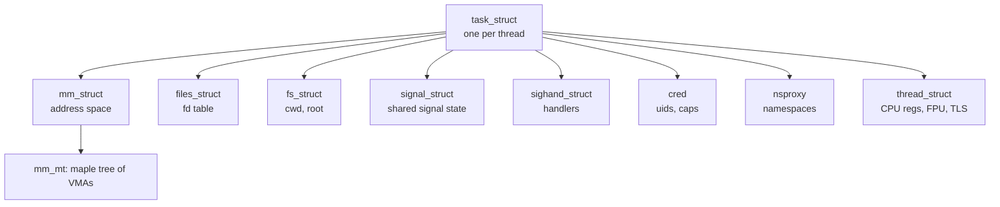
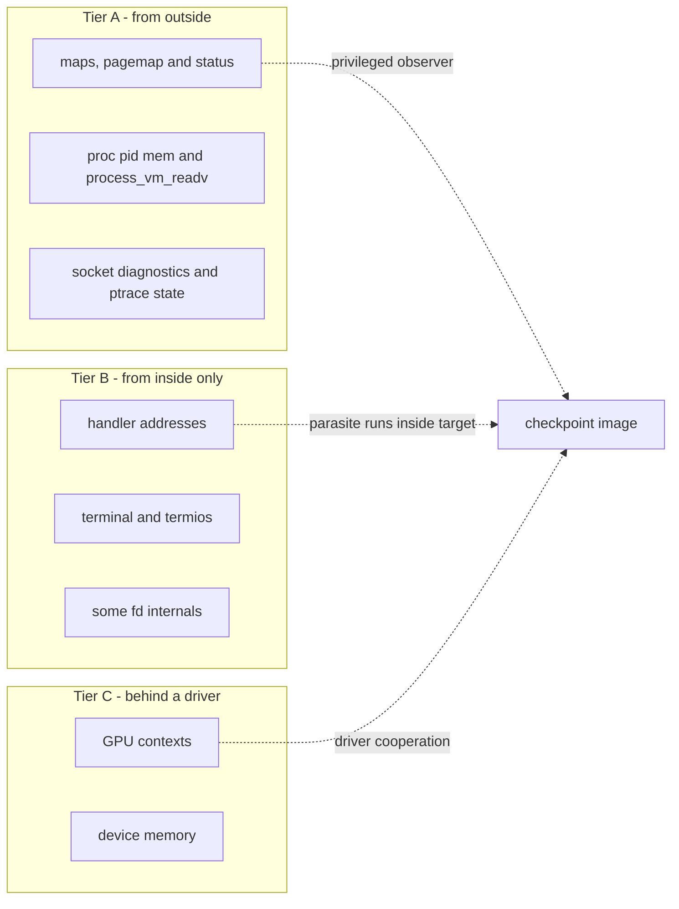

# The Anatomy of Process State

> **Goal:** before you can freeze a process, serialize it to disk, and rebuild
> it — maybe on another machine — you need an exact inventory of what "the
> state of a process" *is*. This chapter is that inventory: every category, its
> kernel home, its userspace window, and the reason each one resists
> reconstruction. It's the map the next two chapters navigate with CRIU.

## From a running container to a frozen one

[Build a Container by Hand](#/build-a-container) ended with a living process
behind walls: a shell in fresh namespaces, its resource use fenced by a
[cgroup](#/cgroups), rooted on an [OverlayFS](#/overlayfs) mount. The
punchline of Part IV was that the kernel has no `container` object — a
container is *just a process* (or a process tree) whose `task_struct` pointers
aim at non-default namespaces.

So here's the natural next question. If a container is an ordinary process,
can you **stop time** for it — stop every thread at a checkpoint boundary,
write its supported execution state to files, kill it, and later reconstruct a
process with equivalent supported semantics? Possibly on a *different* host?

That's **checkpoint/restore**. It powers live migration of VMs-that-aren't-VMs,
fast container startup from a warm snapshot, fault-tolerant batch jobs that
survive a node reboot, and debugging by rewind. And it all rests on one hard
prerequisite: an *exact* accounting of process state. Miss one fd, one pending
signal, one sequence number, and the restored process is subtly — or
catastrophically — wrong.

This chapter builds that accounting. We tour the state category by category:
where it lives in the kernel, how you observe it from userspace, and a hint of
what makes each one hard to rebuild. Then we distill the intellectual core —
a three-tier taxonomy of *visibility* that explains the entire architecture of
a checkpoint tool. We finish with **ptrace**, CRIU's central interface for
task control and register inspection, and `CAP_CHECKPOINT_RESTORE`, the narrow
capability that checkpoint/restore convinced the kernel to add.

We will not dump anything yet. That's [CRIU: Dumping a Live Process](#/criu-dump).
Here we only learn what there *is* to dump.

## The shape of a task

Everything hangs off one structure:
[`struct task_struct`](https://elixir.bootlin.com/linux/v6.12/C/ident/task_struct)
(`include/linux/sched.h`), the kernel's per-thread control block from
[Processes & Threads](#/processes). One `task_struct` per schedulable thread.
A "process" in the POSIX sense is a group of tasks sharing a thread-group
leader; most of what we call "process state" is reachable from the leader's
`task_struct`, either inline or through a handful of refcounted satellite
structures:



The satellites are **shared or private** depending on how the task was
created. Two threads of one process share `mm_struct`, `files_struct`,
`sighand_struct`, and `signal_struct` (that's what `CLONE_VM | CLONE_FILES |
CLONE_SIGHAND | CLONE_THREAD` *mean*); they have their own `thread_struct`,
their own pending-signal set, their own blocked mask. This sharing is exactly
what makes checkpoint hard: you can't dump a thread in isolation, and you
can't dump the shared parts more than once. A checkpointer must dump the
*whole thread group* atomically and record who shares what.

Let's walk the inventory.

## 1. CPU and per-thread register state

**What it is.** The values in every CPU register at the instant you froze the
thread: general-purpose registers, the instruction pointer, stack pointer,
flags, segment bases, plus the *extended* state — x87/SSE/AVX/AVX-512 vector
registers — saved through the XSAVE machinery.

**Kernel home.** Per-thread, in
[`struct thread_struct`](https://elixir.bootlin.com/linux/v6.12/C/ident/thread_struct)
(`arch/x86/include/asm/processor.h`), embedded at the *end* of `task_struct`.
The general-purpose registers as they were at kernel entry live in a
[`struct pt_regs`](https://elixir.bootlin.com/linux/v6.12/C/ident/pt_regs) at
the top of the thread's kernel stack. The FPU/vector state hangs off
`thread.fpu`, an architecture-defined XSAVE area whose exact layout depends on
which features the CPU advertises.

**Userspace window.** `ptrace(PTRACE_GETREGSET, pid, NT_PRSTATUS, &iov)` for
the general-purpose set, `NT_X86_XSTATE` for the extended set. (More on
`GETREGSET` below.) You can also glimpse a stopped thread's registers through
`/proc/<pid>/task/<tid>/syscall` and `.../stat`, but only ptrace gives you the
full, writable register file.

**Why it's hard.** The extended state's format is CPU-dependent — restore onto
a machine with a *narrower* XSAVE area (no AVX-512) and the saved state won't
fit. Around a system call, the register file also carries user-visible syscall
entry and restart state. CRIU does not serialize an arbitrary kernel stack
halfway through execution; it must instead arrange for supported interrupted
syscalls to resume or restart according to the kernel's restart rules.

## 2. The address space

The big one. A process's memory is described by
[`struct mm_struct`](https://elixir.bootlin.com/linux/v6.12/C/ident/mm_struct)
(`include/linux/mm_types.h`), which owns the page tables (`pgd`) and a
collection of **virtual memory areas** — the contiguous, homogeneous regions
you met in [Virtual Memory](#/memory). Since kernel 6.1 the VMAs live in a
**maple tree** rooted at `mm->mm_mt` (the old red-black tree `mm_rb` is gone),
each a
[`struct vm_area_struct`](https://elixir.bootlin.com/linux/v6.12/C/ident/vm_area_struct)
with `vm_start`, `vm_end`, `vm_flags`, and — for file-backed regions —
`vm_file` and `vm_pgoff`.

**Userspace window: the map.**

```bash
cat /proc/self/maps
```

```text
560f3a1c8000-560f3a1c9000 r-xp 00000000 08:01 1179657   /usr/bin/cat
560f3a3ca000-560f3a3cb000 r--p 00002000 08:01 1179657   /usr/bin/cat
560f3a3cb000-560f3a3cc000 rw-p 00003000 08:01 1179657   /usr/bin/cat
560f3b9a2000-560f3b9c3000 rw-p 00000000 00:00 0         [heap]
7f8c4e400000-7f8c4e428000 r--p 00000000 08:01 2361     /usr/lib/libc.so.6
...
7ffe1c3a0000-7ffe1c3c1000 rw-p 00000000 00:00 0         [stack]
7ffe1c3f4000-7ffe1c3f8000 r--p 00000000 00:00 0         [vvar]
7ffe1c3f8000-7ffe1c3fa000 r-xp 00000000 00:00 0         [vdso]
```

Each line is one VMA: address range, permissions (`r/w/x` and `p`rivate vs
`s`hared), file offset, device, inode, path. This tells you the *shape* of the
address space — but not what a dump must actually copy. Two VMAs of identical
size can cost wildly different amounts to save.

**Which pages actually exist.** A VMA is a *promise* of address space, not
committed memory. Thanks to demand paging and copy-on-write, most of a
freshly-mapped region has no physical page behind it at all. To dump memory
you must copy only the pages that are **really there**, and know for each one
whether it's resident, swapped, or file-backed-and-clean (in which case you
needn't copy it — you can re-read it from the file on restore). That
distinction is the difference between a 4 MB checkpoint and a 4 GB one.

The window is [`/proc/<pid>/pagemap`](https://www.kernel.org/doc/Documentation/admin-guide/mm/pagemap.rst):
one 64-bit entry per virtual page, indexed by page number. The high bits
answer exactly the questions a dumper asks:

- **bit 63** — page is *present* in RAM.
- **bit 62** — page is *swapped* (bits 0–4 then hold the swap type, 5–54 the
  offset).
- **bit 61** — page is *file-backed or shared-anonymous*.
- **bit 56** — page is *mapped exactly once* (exclusive), so no other process
  shares it.
- **bit 55** — page is *soft-dirty*: written since you last cleared the
  soft-dirty bits. This is the hook that makes **incremental** and
  **pre-copy** checkpoints possible — dump everything once, clear soft-dirty,
  let the process run, then on the next pass copy only the pages that changed.
  We rely on it heavily in [Live Migration](#/live-migration).

```bash
# Clear soft-dirty for a pid, then later read pagemap to see what it touched:
echo 4 > /proc/<pid>/clear_refs      # "4" = clear the soft-dirty bit
```

**Reading the bytes.** Once you know *which* pages to copy, you read them from
`/proc/<pid>/mem` (seek to the virtual address, read) or with
`process_vm_readv()` — covered in the ptrace section. Anonymous private pages
must be copied verbatim; clean file-backed pages can be skipped and
re-faulted from their file at restore; dirty file-backed (`MAP_SHARED`) pages
must be written back or copied depending on semantics.

**Why it's hard.** Special VMAs. `[vdso]` and `[vvar]` are kernel-injected and
their addresses can differ across kernels — restore has to *rewrite* the
process's idea of where the vDSO lives (CRIU literally patches it). `MAP_SHARED`
segments backed by a deleted file, `memfd` regions, hugepages, and regions
under [userfaultfd](#/lab-userfaultfd) management each need bespoke handling.

## 3. The file-descriptor table — a zoo

**What it is.** The numbered handles in `/proc/<pid>/fd`, each pointing at an
open **file description** (the kernel object with a type, a position, and
type-specific state). Structurally it's
[`struct files_struct`](https://elixir.bootlin.com/linux/v6.12/C/ident/files_struct)
→ `fdtable` → an array of
[`struct file *`](https://elixir.bootlin.com/linux/v6.12/C/ident/file).

**Userspace window.**

```bash
ls -l /proc/self/fd
```

```text
lrwx------ 0 -> /dev/pts/3
lrwx------ 1 -> /dev/pts/3
lrwx------ 2 -> /dev/pts/3
lr-x------ 3 -> /home/mo/data.log
lrwx------ 4 -> 'socket:[482913]'
lrwx------ 5 -> 'anon_inode:[eventpoll]'
lr-x------ 6 -> 'pipe:[73114]'
```

`/proc/<pid>/fdinfo/<n>` adds the crucial *per-fd* detail — `pos` (the file
offset), `flags`, and for special fds a type-specific dump:

```bash
cat /proc/self/fdinfo/3
```

```text
pos:    4096
flags:  0100000
mnt_id: 24
ino:    1179702
```

Now walk the zoo. Every animal is a different restore problem:

- **Regular file, with an offset.** Reopen the same path, `lseek()` to the
  saved `pos`, restore `O_APPEND`/`O_NONBLOCK` flags. Easy — *if* the path
  still exists and resolves to the same inode. A file `unlink()`ed while open
  (the classic "deleted but held open" pattern, shown as `(deleted)` in
  `/proc/<pid>/fd`) has no path to reopen; the dumper must copy its contents.
- **A pipe with bytes in flight.** [Pipes & IPC](#/ipc-pipes) taught you a
  pipe is a kernel ring buffer. At checkpoint time it may hold unread data.
  You must drain and save those bytes, remember both ends' fds, and on restore
  recreate the pipe and *re-inject* the pending bytes before wiring up
  readers and writers — in the right order, or you deadlock on a full buffer.
- **An established TCP socket.** The hard case among "ordinary" fds. The
  connection has send and receive **sequence numbers**, unacknowledged data
  in the retransmit queue, out-of-order data in the receive queue, window and
  congestion state, timers. None of it is reopenable — you can't "reconnect" a
  live TCP flow. It must be *frozen in place* (the kernel's `TCP_REPAIR`
  socket option, built for exactly this) and every counter serialized and
  restored through the *socket itself*. Diagnostic netlink can enumerate and
  describe sockets, but it is not a substitute for `TCP_REPAIR`. We devote
  real time to this in [CRIU: Dumping a Live Process](#/criu-dump).
- **A Unix-domain socket.** Carries a connected peer *inside the same
  checkpoint set*, possibly with in-flight datagrams and even passed fds
  (SCM_RIGHTS). Restoring it means restoring both ends and re-establishing the
  pairing — a dependency edge between two processes' dumps.
- **An epoll fd** — `anon_inode:[eventpoll]`. This is the ordering problem in
  miniature: an epoll fd is *an fd that references other fds*. To restore it
  you must first restore every fd in its interest list, *then* recreate the
  epoll and re-`EPOLL_CTL_ADD` each one. That edge has a topological order, but
  the full fd graph can contain cycles (Unix peers and passed fds), so a real
  restorer also needs staged creation and later fixups.
- **memfd** — anonymous file living in RAM, often shared by mmap between
  processes. Its *contents* are state; there's no path to reopen. Copy the
  bytes, recreate with `memfd_create()`, remap.
- **timerfd / signalfd / eventfd** — fds that wrap kernel objects. `eventfd`
  has a 64-bit counter; `timerfd` has an arming state and expiration;
  `signalfd` has a mask. All exposed in `fdinfo`, all must be recreated with
  the same internal state.
- **Device fds — `/dev/nvidia0`, `/dev/dri/card0`, and friends.** Here the
  road ends. An open GPU device fd references driver-private state — command
  submission contexts, on-device memory, DMA mappings — that the generic
  kernel cannot enumerate and no `/proc` file exposes. This is the
  *irreducible* case, and the whole reason [GPU Checkpoint](#/gpu-checkpoint)
  exists as its own chapter. Foreshadowing: without driver cooperation, you
  cannot checkpoint a process holding one.

## 4. Signal state

**What it is.** Three distinct things, and their per-thread vs shared split is
a frequent source of bugs.

- **Handlers** — the disposition of each signal (default, ignore, or a handler
  address plus `SA_*` flags). *Shared* across the thread group, in
  [`struct sighand_struct`](https://elixir.bootlin.com/linux/v6.12/C/ident/sighand_struct)
  (`action[]`, an array of `struct k_sigaction`).
- **Pending signals** — signals raised but not yet delivered. Two queues: a
  **per-thread** pending set (`task->pending`) for signals sent to a specific
  thread, and a **shared** pending set (`task->signal->shared_pending`) for
  process-directed signals any thread may take.
- **The blocked mask** — which signals this thread currently blocks
  (`task->blocked`). *Per-thread.*

**Userspace window.** `/proc/<pid>/status` exposes the masks as hex bitfields:

```bash
grep -E 'Sig|Shd' /proc/self/status
```

```text
SigQ:   0/63229          # queued/limit
SigPnd: 0000000000000000 # per-thread pending
ShdPnd: 0000000000000000 # shared (process) pending
SigBlk: 0000000000000000 # blocked mask
SigIgn: 0000000000000000 # ignored
SigCgt: 0000000180000000 # caught (have handlers)
```

The masks alone do not contain queued payloads. A tracer can retrieve pending
`siginfo` entries non-destructively with `PTRACE_PEEKSIGINFO`; the
`PTRACE_PEEKSIGINFO_SHARED` flag selects the process-wide shared queue. Handler
*addresses* still aren't in `/proc`; a checkpointer reads them by injecting
`rt_sigaction()` calls into the target (the parasite trick, below).

**Why it's hard.** Real-time signals carry a *payload* (`siginfo`) and queue
in order; both must be preserved. And a signal caught *during* checkpoint —
while the process is stopped by ptrace — must not be lost.

## 5. Timers

**POSIX timers** created with `timer_create()` live on
`task->signal->posix_timers`; each has an ID, a clock, an arming interval, and
a notification method. **Interval timers** (`setitimer()`: `ITIMER_REAL`,
`ITIMER_VIRTUAL`, `ITIMER_PROF`) live in `task->signal->it[]` and the real-time
one as an hrtimer. You can see POSIX timers here:

```bash
cat /proc/self/timers   # empty unless the process created some
```

**Why it's hard.** A timer's remaining time must be recomputed relative to the
clock it rides. If that clock is `CLOCK_MONOTONIC` and you restore on a host
with a different uptime, the timer would fire wrong — which is precisely why
the [time namespace](#/namespaces) exists: it offsets `CLOCK_MONOTONIC` and
`CLOCK_BOOTTIME` per-namespace so restored timers stay consistent.

## 6. Credentials and capabilities

**What it is.** Real/effective/saved UID and GID, supplementary groups, the
capability sets (permitted/effective/inheritable/bounding/ambient), securebits,
LSM labels (SELinux/AppArmor context). All in
[`struct cred`](https://elixir.bootlin.com/linux/v6.12/C/ident/cred)
(`task->cred`), a refcounted, copy-on-write object.

**Userspace window.** `/proc/<pid>/status` again — `Uid`, `Gid`, `Groups`,
`CapPrm`, `CapEff`, `CapBnd`, `CapAmb`. LSM context via
`/proc/<pid>/attr/current`.

**Why it's hard.** To *restore* privileged credentials you generally need to
*be* privileged — you can drop capabilities but not conjure them. And
capabilities are evaluated relative to a [user namespace](#/namespaces), so
the whole credential picture only makes sense alongside the namespace one.

## 7. Namespaces and cgroup membership

Every task points at one namespace of each type via
[`struct nsproxy`](https://elixir.bootlin.com/linux/v6.12/C/ident/nsproxy)
(plus the user namespace in `cred->user_ns`), and sits in one node of the
[cgroup v2](#/cgroups) hierarchy. For checkpoint/restore this is the
*container's identity*.

**Userspace window.** `/proc/<pid>/ns/*` (the inode numbers that define "same
namespace"), `/proc/<pid>/cgroup`, `/proc/<pid>/status` for `NStgid`/`NSpid`
(the layered PIDs).

**Why it's hard — the PID pinning problem.** A restored process usually must
get the **same PID** it had before, or every cached PID in the checkpoint
(parent/child links, PIDs cached by the application, pgid/sid)
becomes a lie. But you can't ask the kernel for a specific PID… normally. This
single requirement is why `CAP_CHECKPOINT_RESTORE` and the `clone3()`
`set_tid` feature exist — see below. Namespace *inode numbers*, by contrast,
are not preserved; only membership and topology are.

## 8. IPC objects that live *outside* the process

Some state a process depends on isn't *in* any `task_struct` at all — it lives
in a namespace-global table and merely *travels with* the checkpoint set:

- **System V IPC** — shared-memory segments (`shmget`), message queues
  (`msgget`), semaphore arrays (`semget`). Owned by the [IPC namespace](#/namespaces),
  visible via `ipcs` and `/proc/sysvipc/{shm,msg,sem}`. A shm segment's
  *contents* are state; a message queue's undelivered messages are state; a
  semaphore's current values (and each process's `semadj` undo list!) are
  state.
- **POSIX IPC** — message queues under `/dev/mqueue`, named shared memory
  under `/dev/shm` (which is just tmpfs, so it's really files).

**Why it's hard.** These objects are shared by *key*, not owned by one
process. The checkpointer must dump each one exactly once and reattach every
member process on restore — another edge in the dependency graph, and one that
crosses the process boundary.

## 9. The miscellany that still matters

- **cwd and root** — `task->fs`
  ([`struct fs_struct`](https://elixir.bootlin.com/linux/v6.12/C/ident/fs_struct)),
  seen at `/proc/<pid>/cwd` and `/proc/<pid>/root`. Restore must `chdir`/
  `chroot` to matching paths.
- **rlimits** — `task->signal->rlim[]`, seen at `/proc/<pid>/limits`.
- **personality** — execution-domain flags (`ADDR_NO_RANDOMIZE`, legacy
  layouts), `/proc/<pid>/personality`. CRIU disables ASLR during restore so it
  can place VMAs at their original addresses.
- **Robust futex list** — `task->robust_list`, the userspace linked list the
  kernel walks on thread exit to release [futexes](#/ipc-pipes) held by a
  crashed thread. Set via `set_robust_list()`, read back with
  `get_robust_list()`; must be re-registered on restore or a crash after
  restore leaks locks.
- **TLS / thread pointer** — the FS base (x86-64) that anchors thread-local
  storage, part of `thread_struct`. Restored with the register file.
- **The controlling terminal and its settings** — `termios`, window size,
  session/foreground pgrp. Terminal state is one of those things only fully
  visible *from inside* the process (tier B, below).

## The inventory, on one page

| State category | Kernel home | Userspace window | Who can read it |
|---|---|---|---|
| GP + vector registers | `thread_struct`, `pt_regs` | `PTRACE_GETREGSET` | tracer (ptrace) |
| Address space (VMAs) | `mm_struct` → `mm_mt` | `/proc/<pid>/maps`, `smaps` | any (perms permitting) |
| Which pages exist | page tables | `/proc/<pid>/pagemap` | privileged |
| Memory contents | physical pages | `/proc/<pid>/mem`, `process_vm_readv` | tracer |
| fd table | `files_struct` | `/proc/<pid>/fd`, `fdinfo` | owner / privileged |
| Signal handlers | `sighand_struct` (shared) | (inject `rt_sigaction`) | parasite |
| Pending / blocked signals | `task->pending`, `signal->shared_pending`, `task->blocked` | `/proc/<pid>/status` masks; `PTRACE_PEEKSIGINFO` queue entries | owner / tracer |
| POSIX / interval timers | `signal->posix_timers`, `signal->it[]` | `/proc/<pid>/timers` | owner |
| Credentials, capabilities | `cred` | `/proc/<pid>/status`, `attr/current` | any / owner |
| Namespaces | `nsproxy`, `cred->user_ns` | `/proc/<pid>/ns/*` | privileged |
| cgroup membership | `css_set` | `/proc/<pid>/cgroup` | any |
| SysV/POSIX IPC | IPC namespace tables | `ipcs`, `/proc/sysvipc/*` | owner / privileged |
| cwd, root | `fs_struct` | `/proc/<pid>/{cwd,root}` | owner / privileged |
| rlimits, personality | `signal->rlim[]`, `task->personality` | `/proc/<pid>/{limits,personality}` | any |
| Robust futex list | `task->robust_list` | `get_robust_list()` | tracer |
| Terminal state | tty driver | (inside-only ioctls) | parasite |

Read the "who can read it" column carefully. It's not uniform — and that
non-uniformity is the whole game.

## The three-tier visibility taxonomy

Step back from the catalogue and ask a single question of every item: **from
where is it observable?** The answers fall into exactly three tiers, and this
taxonomy *is* the architecture of every checkpoint tool.



**Tier A — readable from *outside* by a privileged observer.** The address
space (`/proc/<pid>/maps`, `pagemap`, `mem`), most signal masks and
credentials (`/proc/<pid>/status`), the register file and queued signal payloads
(via ptrace), and socket metadata (via the `sock_diag` netlink families used by
tools such as `ss`). Exact TCP checkpoint state is a useful boundary inside
this tier: CRIU obtains sequence numbers and queue state from the captured
socket fd in `TCP_REPAIR` mode, not from a generic `sock_diag` dump. A tracer
with the right privilege can still collect this state without cooperation from
the target's application. This is the easy tier, and the majority of state
lives here — deliberately, because Linux was built to be introspectable.

**Tier B — readable only from *inside* the process's own context.** Some state
has no external `/proc` window at all. Signal handler *addresses* are the clean
example: the kernel holds them in `sighand_struct`, but exposes them nowhere in
`/proc`. The only way to read them is to *be the process* and call
`rt_sigaction()` with a NULL new-action to query the old one. Same for certain
terminal settings and a few fd internals reachable only by issuing the object's
own ioctls. You cannot read this tier from outside; you must **run code inside
the target's address space**.

That is exactly what CRIU does. It uses ptrace to hijack the frozen process,
injects a small blob of position-independent code called the **parasite** into
the target's own memory, and runs it *as the target* to query the
inside-only state — then cleanly removes it, leaving the process pristine for
either resumption or the kill that ends the checkpoint.

Naming it here is enough; the mechanics (how you inject code into a stopped
process without corrupting it, how the parasite talks back over a socket) are
the heart of [CRIU: Dumping a Live Process](#/criu-dump).

**Tier C — held by hardware or a driver, behind an opaque ioctl interface.**
An open `/dev/nvidia0` references GPU contexts, VRAM allocations, and command
queues that the *generic* kernel cannot enumerate — there is no `/proc` file,
and no amount of parasite injection helps, because the state isn't in the
process's address space; it's on the device and in driver-private structures.
The only path is **cooperation**: a checkpoint interface in the driver, a CRIU
plugin that knows that interface, or explicit help from the application. A
generic transparent CRIU dump cannot checkpoint a process holding unsupported
GPU state; a supported device/plugin pair may be able to. This is the frontier,
and [GPU Checkpoint](#/gpu-checkpoint) maps it.

The tiers form a difficulty gradient: A is mechanical, B needs code injection,
C needs the driver's blessing. A checkpoint tool is, essentially, a machine
for handling tier A directly, tier B with a parasite, and tier C by delegating
or giving up. Hold this three-way split in your head and CRIU's design stops
being surprising.

## ptrace: the master key

Every tier-A register read, every parasite injection in tier B, rests on one
syscall:
[`ptrace(2)`](https://man7.org/linux/man-pages/man2/ptrace.2.html). It is the
foundation of `gdb`, `strace`, and CRIU alike — the kernel's sanctioned
interface for one process to observe and control another. Understanding its
two attach modes is worth real attention, because the *newer* one exists
largely for checkpoint/restore.

**`PTRACE_ATTACH` — the old way, and its flaw.** Attaching with
`PTRACE_ATTACH` sends the tracee a `SIGSTOP`. The man page is careful:

> "The tracee is sent a SIGSTOP, but will not necessarily have stopped by the
> completion of this call."

The problem is that `SIGSTOP` is a *real signal*. It mingles with the tracee's
own signal state — it can be confused with a legitimate job-control stop, it
perturbs `wait()` semantics for the tracee's real parent, and the tracee can
observe that it was stopped. For a debugger poking a program you're actively
inspecting, tolerable. For a *checkpointer* that must freeze a process, capture
its supported state, and resume it without corrupting application-visible
signal semantics, that disturbance is unacceptable.

**`PTRACE_SEIZE` — the checkpoint-grade attach.** Introduced to fix exactly
that:

> "Unlike PTRACE_ATTACH, PTRACE_SEIZE does not stop the process."

`PTRACE_SEIZE` attaches *without* injecting any signal and *without* stopping
the tracee — it keeps running, now traceable, with clean signal semantics. When
you actually want it stopped, you issue **`PTRACE_INTERRUPT`**, which produces
a special *ptrace stop* (not a signal-based group-stop) that is invisible to
the tracee's own signal handling. `PTRACE_INTERRUPT` only works on tracees
attached via `SEIZE` — the two are a matched pair. This clean, side-effect-free
"attach, then stop on demand" is why CRIU (and modern `gdb`) prefer `SEIZE`.

**Reading registers.** With the tracee stopped,
`ptrace(PTRACE_GETREGSET, tid, NT_PRSTATUS, &iov)` fills a `struct iovec` with
the general-purpose register set; `NT_X86_XSTATE` fetches the XSAVE area. The
regset interface (versus the older `PTRACE_GETREGS`) is architecture-neutral
and extensible — the kernel writes back `iov.len` to tell you how much it
actually produced, which is how the same call copes with CPUs of different
vector widths.

**Reading memory — two roads.** You can read the tracee's memory word by word
with `PTRACE_PEEKDATA`, but that's one syscall per word — glacial for
gigabytes. The fast roads:

- **`/proc/<pid>/mem`** — `open()` it, `pread()` at the virtual address. Bulk
  transfer, but each read still crosses into the kernel. The open is governed
  by a `PTRACE_MODE_ATTACH_FSCREDS` check: the access decision uses the caller's
  filesystem credentials.
- **[`process_vm_readv(2)`](https://man7.org/linux/man-pages/man2/process_vm_readv.2.html)**
  — scatter/gather copy *directly between address spaces*, no intermediate
  kernel buffer:

  > "Permission to read from or write to another process is governed by a
  > ptrace access mode PTRACE_MODE_ATTACH_REALCREDS check."

  One syscall moves many regions; it's the fastest way to vacuum up a frozen
  process's memory. (`process_vm_writev` is its restore-side twin.) The
  implementation is
  [`mm/process_vm_access.c`](https://elixir.bootlin.com/linux/v6.12/source/mm/process_vm_access.c).

Both roads use the kernel's **ptrace access-control model**, but not the same
credential selector: `process_vm_readv()` and ptrace attachment use
`PTRACE_MODE_ATTACH_REALCREDS`, while `/proc/<pid>/mem` uses
`PTRACE_MODE_ATTACH_FSCREDS` when the file is opened. The target's `dumpable`
flag, user-namespace capability checks, Yama, and other LSM policy can still
deny either path. Being allowed to perform one of the narrow restore operations
below does not automatically grant permission to read another task's memory.

## `CAP_CHECKPOINT_RESTORE`: the kernel bends toward C/R

For years, checkpoint/restore was a "needs `CAP_SYS_ADMIN`" affair —
root-or-nothing, because the operations it needs are individually dangerous.
But `CAP_SYS_ADMIN` is the kernel's junk drawer of god-powers; gating a
container-migration daemon behind *all* of it is a security embarrassment.

So Linux 5.9 (2020) carved out a narrow, purpose-built capability,
**`CAP_CHECKPOINT_RESTORE`**, that grants a small set of C/R-specific operations
without granting all of `CAP_SYS_ADMIN`. Per
[`capabilities(7)`](https://man7.org/linux/man-pages/man7/capabilities.7.html),
it permits a task to:

- "Update `/proc/sys/kernel/ns_last_pid`" — nudge the PID allocator so the
  next fork lands on a chosen number (the low-tech way to recover an original
  PID).
- "employ the `set_tid` feature of `clone3(2)`" — the *high*-tech way: ask
  `clone3()` for a specific PID (a whole array of them, one per namespace
  level) directly. The caller needs `CAP_CHECKPOINT_RESTORE` or
  `CAP_SYS_ADMIN` in every user namespace that owns a target PID namespace.
  This is how a modern restore reclaims exact PIDs across a PID-namespace
  hierarchy.
- "read the contents of the symbolic links in `/proc/<pid>/map_files` for
  other processes" — resolve the backing files of another process's mappings,
  needed to reconstruct file-backed VMAs.

The significance is bigger than the three bullets. It's a case study in
**checkpoint/restore shaping the kernel itself**. The requirement "restore a
process with its original identity" couldn't be met by any existing interface
without handing out excessive privilege, so the kernel grew a new capability
*and* a new `clone3()` feature *and* a namespaced view of the PID allocator to
serve it.

The [time namespace](#/namespaces) is the same story from Part IV — it exists
so `CLOCK_MONOTONIC` survives migration. CRIU didn't just consume kernel
interfaces; it *caused* several of them. When you see `set_tid` or
`ns_last_pid`, you're looking at fossilized checkpoint requirements.

The boundary is just as important as the grant: this capability does **not**
authorize ptrace attachment, `/proc/<pid>/mem`, or `process_vm_readv()` against
an otherwise inaccessible task. Same-credential access or a separate ptrace
permission — commonly `CAP_SYS_PTRACE` in the target's user namespace — is
still required, and Yama or another LSM may impose an additional restriction.

## So, precisely: what is a checkpoint?

We can now state it exactly, in the vocabulary this chapter built:

> A **checkpoint** is: **freeze** the target tree (optionally stabilize its
> membership with a cgroup freezer, then seize and stop its tasks with ptrace so
> CRIU can inspect and control them);
> **enumerate** every category of the inventory across all three visibility
> tiers — tier A from outside via `/proc` and ptrace, tier B from inside via a
> parasite, tier C via a driver plugin or an honest failure; and **serialize**
> it all into an image, recording the *dependency edges* (shared `mm`, epoll
> interest lists, socket pairings, IPC memberships) that constrain rebuild
> order.
>
> A **restore** is the inverse, run in dependency order: recreate namespaces
> and cgroups; fork tasks into their original PIDs (`clone3` `set_tid`); rebuild
> each address space at its original addresses (ASLR off); reopen or recreate
> every fd in dependency-aware stages so epoll references and cyclic socket
> relationships are attached only when their endpoints exist; reload registers;
> then *become* the process and jump back to
> the exact instruction it was frozen on.

That's the entire arc of Part V. This chapter gave you the *what* — the state
that exists and where it hides. The next two chapters do the *how*:
[CRIU: Dumping a Live Process](#/criu-dump) performs the
freeze-enumerate-serialize, parasite and all; [CRIU: Rebuilding From the Image](#/criu-restore)
performs the dependency-ordered rebuild. Everything else in the part —
[live migration](#/live-migration), the [snapshot taxonomy](#/snapshot-taxonomy),
[GPU checkpoint](#/gpu-checkpoint), and the [hands-on labs](#/lab-criu) — builds
on this inventory.

## Follow the code (kernel v6.12)

Guided source-reading to ground the inventory in real structures:

1. **The task and its satellites.** Open
   [`task_struct`](https://elixir.bootlin.com/linux/v6.12/C/ident/task_struct)
   in `include/linux/sched.h` and find the pointer fields we walked: `mm`,
   `files`, `fs`, `signal`, `sighand`, `cred`, `nsproxy`, `pending`,
   `blocked`, `robust_list`, `personality`. Note which are pointers (shareable)
   versus inline (per-thread) — that split *is* the thread-group sharing model.
2. **The address space.**
   [`mm_struct`](https://elixir.bootlin.com/linux/v6.12/C/ident/mm_struct):
   find `mm_mt` (the maple tree of VMAs) and `pgd`. Then
   [`vm_area_struct`](https://elixir.bootlin.com/linux/v6.12/C/ident/vm_area_struct):
   `vm_start`, `vm_end`, `vm_flags`, `vm_file`, `vm_pgoff`. These are the fields
   `/proc/<pid>/maps` prints.
3. **The fd table.**
   [`files_struct`](https://elixir.bootlin.com/linux/v6.12/C/ident/files_struct)
   → `fdtable` → the `fd[]` array of
   [`struct file`](https://elixir.bootlin.com/linux/v6.12/C/ident/file). The
   `f_pos` you see in `fdinfo` lives on `struct file`.
4. **The /proc plumbing.**
   [`fs/proc/base.c`](https://elixir.bootlin.com/linux/v6.12/source/fs/proc/base.c)
   is where `/proc/<pid>/{maps,status,fd,fdinfo}` are generated — read
   `proc_pid_status()` to see exactly how the `Sig*`/`Cap*`/`Uid` lines you
   grepped are assembled from `task_struct`.
5. **ptrace.**
   [`kernel/ptrace.c`](https://elixir.bootlin.com/linux/v6.12/source/kernel/ptrace.c):
   [`ptrace_attach()`](https://elixir.bootlin.com/linux/v6.12/C/ident/ptrace_attach)
   handles both `ATTACH` and `SEIZE` (look for the `PTRACE_SEIZE` branch that
   skips the `send_sig_info(SIGSTOP)`);
   [`ptrace_may_access()`](https://elixir.bootlin.com/linux/v6.12/C/ident/ptrace_may_access)
   is the shared `PTRACE_MODE_*` authorization helper used by many
   cross-process readers. Calling `/proc`, `process_vm_readv()`, or a pidfd API
   does not mean issuing a `ptrace()` syscall; interfaces can reuse the access
   model or apply their own checks.
6. **Cross-address-space copy.**
   [`mm/process_vm_access.c`](https://elixir.bootlin.com/linux/v6.12/source/mm/process_vm_access.c):
   [`process_vm_rw()`](https://elixir.bootlin.com/linux/v6.12/C/ident/process_vm_rw)
   is the bulk-memory road CRIU drives; note the `PTRACE_MODE_ATTACH_REALCREDS`
   check up front.

---

## Check your understanding

1. A VMA in `/proc/<pid>/maps` spans 4 MB, but the checkpoint of that region
   is only 40 KB. How can both be true, and which `/proc` file reconciles them?

<details><summary>Show answer</summary>

A VMA is reserved *address space*, not committed memory. Because of demand
paging and copy-on-write, most of the 4 MB may have no physical page behind
it. `/proc/<pid>/pagemap` gives one 64-bit entry per virtual page; bit 63 says
"present," bit 62 "swapped," and bit 61 "file-backed or shared-anonymous."
The dumper must preserve every meaningful anonymous or private-COW page,
including a swapped page whose bytes are faulted back in for capture, while it
can reconstruct untouched absent pages and clean file-backed pages from their
original backing. In this example only ten pages need image data.

</details>

2. Why does CRIU prefer `PTRACE_SEIZE` over `PTRACE_ATTACH` to freeze a
   process it intends to resume?

<details><summary>Show answer</summary>

`PTRACE_ATTACH` injects a real `SIGSTOP`, which perturbs the tracee's signal
state and job-control semantics — unacceptable when you must resume the
process as if nothing happened. `PTRACE_SEIZE` attaches without sending any
signal and without stopping the process; you then stop it on demand with
`PTRACE_INTERRUPT`, producing a ptrace stop invisible to the tracee's own
signal handling. Clean freeze, clean thaw.

</details>

3. Signal *handler addresses* aren't exposed anywhere in `/proc`. How does a
   checkpointer read them, and which visibility tier does that put them in?

<details><summary>Show answer</summary>

Tier B — inside-only. There's no external window, so the checkpointer must run
code *as the target*: it injects a parasite and calls `rt_sigaction()` with a
NULL new-action to query each signal's current handler. This is why a purely
external, `/proc`-only tool can't do full checkpointing, and why CRIU needs
code injection at all.

</details>

4. You restore a process and it immediately misbehaves because `getppid()` and
   cached PIDs are wrong. What requirement did the restore miss, and which two
   kernel features exist to satisfy it?

<details><summary>Show answer</summary>

It failed to recreate the process with its *original* PID. PIDs are baked into
parent/child links, session/group IDs, and userspace data captured at
checkpoint. The kernel offers two ways to reclaim a specific PID:
`/proc/sys/kernel/ns_last_pid` (set the allocator so the next fork lands on
your number) and, better, `clone3()`'s `set_tid` feature (request exact PIDs
directly, one per namespace level). They require `CAP_CHECKPOINT_RESTORE` or
`CAP_SYS_ADMIN`; for `set_tid`, that capability must be held in the user
namespaces that own the target PID namespaces.

</details>

5. An epoll fd and a plain regular-file fd both need restoring. Why is the
   epoll one categorically harder?

<details><summary>Show answer</summary>

A regular file is self-contained: reopen the path, `lseek` to the saved
offset, done. An epoll fd *references other fds* — its interest list points at
them. You can't recreate it until every fd it watches already exists, then you
recreate the epoll and re-add each one. Those edges impose an order; the wider
fd graph can also contain cycles, which CRIU breaks with staged creation,
fdstore publication, and later attachment of dependent relationships.

</details>

6. `process_vm_readv()` and `/proc/<pid>/mem` both bulk-read a target's
   memory. Which access-control family governs them, and what credential-mode
   difference matters?

<details><summary>Show answer</summary>

Both are governed by ptrace-style access checks and remain subject to the
target's `dumpable` state, user-namespace capability rules, Yama, and other
LSMs. `process_vm_readv()` uses `PTRACE_MODE_ATTACH_REALCREDS`; opening
`/proc/<pid>/mem` uses `PTRACE_MODE_ATTACH_FSCREDS`. The distinction is whether
the check selects the caller's real credentials or its filesystem credentials.

</details>

7. A System V shared-memory segment isn't stored in any `task_struct`. Why
   must a checkpoint still capture it, and what makes it awkward?

<details><summary>Show answer</summary>

It's process-*external* state that the process depends on: it lives in the IPC
namespace's tables, shared by key across potentially several processes in the
checkpoint set. The checkpoint must dump its contents exactly once and reattach
every member process on restore — a cross-process dependency edge, not
something you can handle one task at a time. The same holds for message queues
(undelivered messages) and semaphores (values plus per-process `semadj` undo
lists).

</details>

8. State the difference, in one sentence each, between tier A, tier B, and
   tier C of the visibility taxonomy, and give the mechanism each demands.

<details><summary>Show answer</summary>

**Tier A** is readable from outside by a privileged observer (`/proc`, ptrace,
socket diagnostic APIs or an owned socket fd) — mechanism: read it directly.
**Tier B** is readable only from inside the process's own context (handler
addresses, terminal settings) —
mechanism: inject a parasite and run code as the target. **Tier C** is held by
hardware/drivers behind opaque ioctls (GPU contexts, device memory) —
mechanism: a driver-aware checkpoint interface/plugin or application
cooperation; unsupported state makes a transparent checkpoint fail.

</details>

---

## Sources & further reading

- [ptrace(2)](https://man7.org/linux/man-pages/man2/ptrace.2.html) —
  `SEIZE` vs `ATTACH`, `INTERRUPT`, `GETREGSET`, and the stop-state machine in
  full.
- [process_vm_readv(2)](https://man7.org/linux/man-pages/man2/process_vm_readv.2.html) —
  cross-address-space copy and its `PTRACE_MODE_ATTACH_REALCREDS` gate.
- [capabilities(7)](https://man7.org/linux/man-pages/man7/capabilities.7.html) —
  the exact grants of `CAP_CHECKPOINT_RESTORE` (search the page).
- [proc(5)](https://man7.org/linux/man-pages/man5/proc.5.html) — the reference
  for `/proc/<pid>/{maps,status,fd,fdinfo,pagemap}` field-by-field.
- [pagemap documentation](https://www.kernel.org/doc/Documentation/admin-guide/mm/pagemap.rst) —
  the exact bit layout of pagemap, `clear_refs`, and soft-dirty tracking.
- [CRIU: "What can be checkpointed"](https://criu.org/What_cannot_be_checkpointed) —
  the project's own catalogue of supported and unsupported state — a real-world
  cross-check on this inventory.
- [CRIU: TCP connection](https://criu.org/TCP_connection) — how `TCP_REPAIR`
  freezes a live socket; preview of the next chapter.
- [Anatomy of a system call, and how CRIU uses ptrace](https://lwn.net/Articles/446528/) —
  LWN on ptrace internals underpinning tools like CRIU.
- Source: [kernel/ptrace.c](https://elixir.bootlin.com/linux/v6.12/source/kernel/ptrace.c),
  [mm/process_vm_access.c](https://elixir.bootlin.com/linux/v6.12/source/mm/process_vm_access.c),
  [fs/proc/base.c](https://elixir.bootlin.com/linux/v6.12/source/fs/proc/base.c).

**Next:** you now know *what* state exists and *where* it hides across the
three visibility tiers. Time to capture it — freeze a live process, inject the
parasite, and write the image:
[CRIU: Dumping a Live Process](#/criu-dump).
