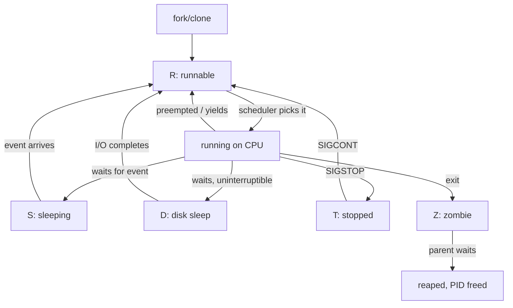

# Processes & Threads

> **Goal:** understand what a process *is* inside the kernel, how `fork()` and
> `exec()` create everything you see running, how processes die and are
> mourned, and why threads are just processes wearing a trenchcoat.

## What a process actually is

To you, a process is "a running program". To the kernel, it's a data
structure: `struct task_struct`, roughly 10 KB of C structure (the exact size
depends on config options) holding everything the kernel knows about one
thread of execution:

```text
task_struct (one per thread)
├── pid, tgid                  → its identity (thread ID / thread-group ID)
├── __state                    → Running? Sleeping? (exit_state: Zombie? Dead?)
├── mm        ──────────────►  the address space (shared by threads)
├── files     ──────────────►  the file descriptor table
├── cred                       → UID, GID, capabilities
├── real_parent, children,     → its place in the family tree
│   sibling
├── nsproxy   ──────────────►  its namespaces  ← containers live here!
├── cgroups                    → its resource-control groups
├── se (sched_entity)          → scheduler bookkeeping (vruntime, deadline…)
├── stack                      → kernel stack (16 KiB on x86-64/arm64)
├── thread_info                → flags, CPU-local metadata
├── signal, sighand            → shared signal state & handler table
└── flags                      → PF_KTHREAD, PF_FORKNOEXEC, …
```

Note what's *in* there: the address space, the fd table, the namespaces, the
cgroups. A "process" is really a bundle of references to kernel objects —
and creating processes is largely a question of which of those objects the
child **shares** and which it **copies**. That's the key to understanding
fork, threads, *and* containers, all at once.

Two of these members deserve a closer look before we go further.

### The address space: `mm_struct`

`task->mm` points to a `struct mm_struct` — one per address space, shared by
all threads of a process. The fields that matter:

- `pgd` — the root of the page table tree; loaded into the CPU's `CR3`
  register (x86-64) on every context switch. See [Virtual Memory](#/memory).
- `mm_mt` — a **maple tree** holding all the VMAs (memory regions). Until
  kernel 6.1 this was a linked list plus red-black tree; since 6.1 the maple
  tree replaced both.
- `mm_users` / `mm_count` — reference counts. Threads bump `mm_users`; when
  it hits zero the address space's memory is torn down.
- `start_brk`, `brk`, `start_stack` — the classic heap and stack boundaries.

Kernel threads have `mm == NULL` — that's literally what makes them kernel
threads.

### The kernel stack

Every task also carries a **kernel stack**, used when the task runs kernel
code (a [syscall or an interrupt](#/kernel-vs-userspace)). On x86-64 and
arm64 it's 16 KiB (`THREAD_SIZE`), and since 4.9 (`CONFIG_VMAP_STACK`, on by
default on x86-64) it's allocated from vmalloc space with unmapped guard
pages around it, so a kernel stack overflow faults immediately instead of
silently corrupting a neighbor. This stack is entirely separate from the
user-space stack (which is a plain VMA, typically 8 MiB by default — check
`ulimit -s`).

### PIDs and PID namespaces: `struct pid`

The number you see in `ps` is not stored as a plain int. Each task hangs off
a reference-counted `struct pid`, which contains an array of
`struct upid` — one entry **per PID namespace level**. The same task can be
PID 4231 on the host and PID 1 inside its container; both numbers live in
the same `struct pid`. This is how [Namespaces](#/namespaces) virtualize
process identity without duplicating anything.

PIDs are allocated from a per-namespace IDR (a radix-tree-based ID
allocator). The default ceiling is `kernel.pid_max = 32768`; the hard limit
on 64-bit is 4,194,304, and systemd (since v243) raises `pid_max` to that
maximum on boot, which is why modern distros show 7-digit PIDs.

```bash
cat /proc/sys/kernel/pid_max          # 4194304 on most modern distros
cat /proc/sys/kernel/threads-max      # global task limit, scaled from RAM
ulimit -u                             # per-user limit (RLIMIT_NPROC)
```

## The family tree

Every process has a parent; everything descends from PID 1. Look at yours:

```bash
pstree -p | less
cat /proc/$$/status | head -20    # $$ = your shell's PID
ps -eo pid,ppid,stat,comm | head
```

`/proc/<pid>/` is the kernel's live view of each process — its command line,
environment, fds, memory maps, stack (the kernel stack — root-only; shows
where in the kernel the process is sleeping). The `ps` and `top` commands
are merely pretty parsers of `/proc` — more on that in
[/proc, strace, perf & eBPF](#/observability).

The tree has exactly two roots: PID 1 (`init`/`systemd`, ancestor of all
user-space processes) and PID 2 (`kthreadd`, ancestor of all kernel
threads).

### Kernel threads

Not every PID belongs to a user program. Kernel threads — tasks that run
only in kernel space, with no user address space — handle background work:

```bash
ps aux | grep '\[.*\]'
# [ksoftirqd/0]    ← bottom-half interrupt processing
# [kworker/u8:1]   ← workqueue worker
# [kswapd0]        ← memory reclaim
# [kcompactd0]     ← memory compaction
# [migration/0]    ← per-CPU stopper thread: moves tasks between CPUs
```

Kernel threads are `task_struct` instances marked with `PF_KTHREAD`. They
have no `mm` pointer, they're created via `kthread_create()` (all forked
from `kthreadd`, PID 2), not `fork()`, and `ps` shows their names in
brackets because they have an empty `/proc/<pid>/cmdline`. Many are per-CPU
(`ksoftirqd/0`, `ksoftirqd/1`, …) — see
[Interrupts, Exceptions & Softirqs](#/interrupts).

## fork(): creation by cloning

Unix has a famously strange way to create processes: you don't "spawn program
X". Instead, a process **duplicates itself** with `fork()`:

```c
pid_t pid = fork();
if (pid == 0) {
    // child: an almost-perfect copy of the parent
} else if (pid > 0) {
    // parent: pid holds the child's PID
} else {
    // pid == -1: fork failed (errno set: EAGAIN, ENOMEM…)
}
```

One call, **two returns** — once in each process. (Mechanically: the kernel
builds the child's saved register state in `copy_thread()` so that when the
child is first scheduled, it "returns" from a syscall it never made, with
return value 0.)

What the child copies vs. shares, precisely:

| Copied (own instance) | Shared (same kernel object) | Reset |
|---|---|---|
| address space (via COW) | open file *descriptions* (offsets!) | pending signals (cleared) |
| fd *table* (the numbers) | text of the executable (page cache) | resource usage counters |
| signal dispositions | — | timers (POSIX timers not inherited) |
| cwd, umask, rlimits, nice | — | memory locks |
| namespaces, cgroup membership | — | — |

"Copy the address space" is a lie the kernel tells, and a brilliant one:
**copy-on-write (COW)**. `dup_mmap()` copies only the VMA tree and the page
tables, write-protecting every writable page in *both* processes. They
physically share every page until one of them *writes*; the write triggers a
page fault, and the fault handler copies that single 4 KiB page (the x86-64
default page size; arm64 can be built with 4, 16 or 64 KiB pages). Forking
a 2 GB process is nearly instant and costs almost no RAM — for 2 GB of
mapped 4 KiB pages, the copied page tables are about 4 MiB (8 bytes per
PTE). A fork of a small process completes in roughly 50–300 µs on modern
hardware, dominated by page-table copying.

But COW has a cost if either process writes aggressively:

- Each first write to a shared page is a **minor fault** — fast (on the
  order of a microsecond) but not free, and there can be millions of them.
- Each copied page is newly allocated physical memory — the "instant" fork
  materializes into RAM line by line. This is also why a huge process can
  fail to fork on a memory-constrained box even though the child would
  `exec()` immediately (see overcommit in [Virtual Memory](#/memory), and
  what happens when it goes wrong in the
  [OOM-killer lab](#/lab-oom-killer)).
- Write-protecting the parent's pages requires **TLB shootdowns** — IPIs to
  every CPU that might cache stale translations. On a many-core machine
  forking a many-threaded process, this is the expensive part.

Two historical footnotes you'll still meet: `vfork()` shares the parent's
address space outright and suspends the parent until the child execs (a
pre-COW optimization, now mostly a foot-gun), and `posix_spawn()` wraps
fork+exec in one library call — glibc implements it with
`clone(CLONE_VM|CLONE_VFORK)`, making it the fastest way to spawn from a
huge process.

### fork() and fds: what the child gets

The child gets its own fd **table**, but each entry points to the same
kernel `struct file` (the *open file description*) as the parent's. This
means:

- The **file offset lives in `struct file`**, so it's shared: if the child
  reads from fd 3, the parent's fd 3 advances too.
- Closing fd 3 in the child does *not* close it in the parent —
  `struct file` is reference-counted; close just drops one reference.
- Use `O_CLOEXEC` on fds that children shouldn't carry across `exec()`, or
  explicitly close them in the child between fork and exec.
- This sharing is why `fork() + exec()` is the standard pattern: the exec
  replaces the child's memory and the new program gets fresh state, while
  deliberately-kept fds (stdin/stdout/stderr, a pipe) carry over.

## exec(): becoming someone else

The second half of the duo: `execve(path, argv, envp)` **replaces** the
calling process with a new program. Same PID, same fds (minus the
`O_CLOEXEC` ones) — but the address space is thrown away and rebuilt from
the new executable.

So when you type `ls -l` in bash:

```text
bash ──fork()──► bash (child, a clone)
                   │ child sets up redirections (plain fd manipulation)
                   │ child may: dup2("out.txt", 1), chdir(), setenv()...
                   └─execve("/usr/bin/ls", ["ls","-l"], env)
                          ↓
                      ls runs, writes to stdout, exits
bash ──wait()──◄── kernel notifies: child finished with exit code 0
```

This two-step design looks odd but is why shells are so powerful: **between
fork and exec, the child sets up its own world** — redirect output, change
directory, drop privileges, `unshare()` namespaces… — using ordinary code,
before the new program ever starts. Containers exploit exactly this gap —
you'll do it by hand in [Build a Container by Hand](#/build-a-container).

```bash
strace -f -e trace=process bash -c 'ls' 2>&1 | grep -E 'clone|exec|wait|exit'
```

### The exec lifecycle

What `execve()` actually does, step by step. The kernel's working state for
an in-flight exec is a `struct linux_binprm` ("binary parameter" block):
the target `file`, the candidate `cred`, the half-built new `mm`, and `p`,
the creeping top-of-stack pointer.

1. Kernel opens the executable, reads the first 256 bytes, and asks each
   registered **binfmt handler** in turn: ELF? `#!` script? (A `#!` handler
   rewrites argv to the interpreter and restarts the search — that's all a
   shebang is.)
2. Kernel computes the post-exec credentials: setuid/setgid bits and file
   capabilities may change them — unless `no_new_privs` is set, in which
   case privilege-raising execs are flatly refused. This one flag is what
   makes unprivileged seccomp and many container hardening options sound
   (see [Linux Security & Confinement](#/security-hardening)).
3. Argv and envp are copied into fresh stack pages *before* the point of no
   return (they live in the old address space, so this must happen while it
   still exists). Total size is capped at `ARG_MAX` — at least 128 KiB,
   in practice ¼ of the stack rlimit — which is why a huge glob can fail
   with `E2BIG: Argument list too long`.
4. **Point of no return**: the kernel kills all other threads of the
   process, drops the old `mm_struct`, and installs the new one. From here
   on, failure doesn't return `-1` — it kills the process with `SIGSEGV`,
   because there's no old program left to return to.
5. Kernel maps the ELF segments — `r-x` for `.text`, `rw-` for `.data` —
   at ASLR-randomized addresses, plus the stack and, if the binary is
   dynamically linked, the ELF interpreter (`ld-linux-x86-64.so.2`), which
   is what actually gets control first and maps the shared libraries.
6. Kernel finalizes the stack: argv, envp, and the **auxiliary vector**
   (`AT_PAGESZ`, `AT_RANDOM`, `AT_ENTRY`… — run any binary with
   `LD_SHOW_AUXV=1` to see it). Signal handlers reset to default; the fd
   table is scrubbed of `O_CLOEXEC` entries.
7. Kernel sets the saved user registers to the entry point and returns to
   user space. The process is now the new program.

## Death, wait(), and zombies

When a process exits, it doesn't fully disappear. The kernel keeps a stub of
its `task_struct` — the exit status — until the parent collects it with
`wait()`. Between death and collection, the process is a **zombie**
(state `Z` in `ps`). Zombies hold no memory worth speaking of — the address
space and fds were freed at exit — just a PID, a `task_struct`, and an exit
code.

- Parent waits → zombie reaped, PID freed. Normal life.
- Parent never waits (buggy daemon) → zombies accumulate — and since PIDs
  are finite, enough of them will eventually make `fork()` fail with
  `EAGAIN` system-wide.
- Parent dies first → orphaned children are **re-parented to PID 1** (or to
  the nearest **sub-reaper** in the ancestry — any process that called
  `prctl(PR_SET_CHILD_SUBREAPER)`, as terminal multiplexers and service
  managers do), whose sacred duty is to wait for them.

> **Container link:** inside a container, *your* process is PID 1 of its
> [PID namespace](#/namespaces). If you run something that forks workers (a
> shell script wrapping a server, say) and your PID 1 never calls `wait()`,
> zombies pile up. This is why `docker run --init` (a tiny reaping init)
> exists. Process semantics don't change inside containers — that's the
> whole point of containers. See
> [What a Container Actually Is](#/containers-overview).

### The exit path (what happens on process death)

1. Process calls `exit_group(status)` (what libc's `exit()` really does), or
   is killed by a signal.
2. Kernel signals all the task's sibling threads to die and waits for them —
   the whole thread group exits together.
3. Kernel drops the address space (`mm_users` → 0 → page tables and
   anonymous pages freed) and closes all file descriptors — each close may
   trigger a flush, a socket shutdown, a `flock` release.
4. Kernel reparents any children to the nearest sub-reaper or PID 1.
5. Kernel packs the exit status into the `task_struct` and sets
   `exit_state = EXIT_ZOMBIE`.
6. Kernel sends `SIGCHLD` to the parent, waking it from `wait()`. When the
   parent reaps, the state briefly becomes `EXIT_DEAD` and the
   `task_struct` is finally freed.

[Signals](#/signals) are the other half of process death: `kill -TERM <pid>`
asks politely (catchable — the process can handle `SIGTERM` and do cleanup);
`SIGKILL` cannot be caught, blocked, or ignored — the kernel simply
terminates the task at the next opportunity. PID 1 is special again: signals
for which it hasn't installed handlers are ignored, even `SIGKILL` from
inside its own namespace — which is why a naive `docker stop` can hang
10 seconds (Docker's default grace period) and then resort to `SIGKILL`
from the host.

Modern kernels also offer a race-free alternative to raw PIDs:
**pidfds** (since 5.1–5.3). `pidfd_open()` or `clone3()` with
`CLONE_PIDFD` returns a file descriptor referring to the process; you can
`poll()` it for exit and `pidfd_send_signal()` it without the classic
"PID got recycled, I killed a stranger" race.

```bash
(sleep 100 &) ; ps -o pid,ppid,stat,comm -p $!    # watch re-parenting
sleep 5 & grep State /proc/$!/status               # S = interruptible sleep
kill -9 $! ; grep State /proc/$!/status            # Z = zombie (for a moment)
wait $!                                            # wait reaps it
```

## Threads: processes with maximum sharing

Here is Linux's elegant secret: **the kernel has no separate concept of a
thread.** Everything is a `task_struct`. The general creation syscall is
`clone()` (or its extensible successor `clone3()`, since 5.3), and its
flags say what the child shares with the parent:

```c
// fork() is roughly:
clone(SIGCHLD);                                  // share nothing, copy all

// creating a thread (what pthread_create does) is roughly:
clone(CLONE_VM | CLONE_FILES | CLONE_FS | CLONE_SIGHAND | CLONE_THREAD
      | CLONE_SETTLS | CLONE_CHILD_CLEARTID, ...);
```

The flags that make a thread a thread:

| Flag | Shares… |
|---|---|
| `CLONE_VM` | the address space (`mm_struct`) |
| `CLONE_FILES` | the fd table |
| `CLONE_FS` | cwd, root, umask |
| `CLONE_SIGHAND` | the signal handler table |
| `CLONE_THREAD` | the thread group: same `tgid`, one `wait()`-able unit |
| `CLONE_SETTLS` | (sets up) thread-local storage for the child |
| `CLONE_CHILD_CLEARTID` | clears the TID and wakes a futex on exit — how `pthread_join()` works without polling (see [Kernel Synchronization](#/kernel-sync)) |

Threads get their own PID internally (the kernel calls it `tid`), but share
a **thread group ID (`tgid`)** — which is what `ps` shows you as "the PID".
`getpid()` returns the tgid; `gettid()` returns the tid; for the main thread
they're equal. Each thread gets its own user-space stack (glibc default:
8 MiB of address space, allocated by `pthread_create` with `mmap`) and its
own kernel stack, but one shared heap.

```bash
ls /proc/$(pgrep -f firefox | head -1)/task/   # one dir per thread (tids)
cat /proc/$(pgrep firefox | head -1)/status | grep Threads  # thread count
top -H -p $(pgrep firefox | head -1)           # show threads individually
```

And now the punchline you can probably see coming:

> `clone()` has *other* flags too: `CLONE_NEWPID`, `CLONE_NEWNET`,
> `CLONE_NEWNS`… Each one gives the child a **new namespace** instead of
> sharing the parent's. **A container is created with the same syscall as a
> thread — just with the sharing flags flipped the other way.**
> Thread = share everything. Container = share as little as possible.

One mechanism, one spectrum: from threads (maximum sharing) through ordinary
processes (copy) to containers (isolate). This is the single most clarifying
idea in all of Linux internals. And the resource side of that spectrum —
*how much CPU and memory each subtree may use* — is the job of
[Control Groups](#/cgroups), which every task also references via
`task_struct->cgroups`.

## Checkpoint lens: controlling and recreating a task

The ordinary lifecycle lets the kernel choose a task's identity and lets the
task execute its own syscalls. Checkpoint/restore needs the inverse powers:
recreate an old identity exactly, and inspect or control a task from the
outside. Two kernel interfaces provide them.

### clone3() and choosing a PID

`clone()` accumulated flags for three decades until it ran out of room — its
fixed argument list could not grow without breaking the ABI. Kernel 5.3
replaced it with `clone3(2)`, which takes a single pointer to a growable
struct plus its size: new fields get appended at the end, and an old kernel
simply rejects a size it doesn't recognize. In v6.12 the struct
([clone_args](https://elixir.bootlin.com/linux/v6.12/C/ident/clone_args),
uapi) looks like this:

```c
struct clone_args {
    __u64 flags;         /* CLONE_* flags */
    __u64 pidfd;         /* where to store the pidfd */
    __u64 child_tid;     /* CLONE_CHILD_*TID target */
    __u64 parent_tid;    /* CLONE_PARENT_SETTID target */
    __u64 exit_signal;   /* signal to send the parent on exit */
    __u64 stack;
    __u64 stack_size;
    __u64 tls;
    __u64 set_tid;       /* pid_t array: PIDs to assign (since 5.5) */
    __u64 set_tid_size;  /* number of namespace levels in set_tid (5.5) */
    __u64 cgroup;        /* fd of target cgroup (CLONE_INTO_CGROUP) */
};
```

The field that matters here is `set_tid`, added in 5.5. For the kernel's
entire history it *chose* the PID of every new task — you got the next number
from the per-namespace allocator and had no say. That's fine until you have
to **restore** a checkpoint: the processes you're rebuilding had specific PIDs
when they were dumped, those numbers are baked into their `/proc` paths and
their own `getpid()` memory, and a tree with different PIDs is a *different
tree*. Before 5.5, CRIU forced the issue with a race — write the target minus
one to `/proc/sys/kernel/ns_last_pid`, then immediately `fork()` and pray
nobody grabbed the number in between. `set_tid` makes it honest: hand
`clone3()` an array of PIDs, one per PID-namespace level, and the kernel
assigns exactly those (it costs `CAP_CHECKPOINT_RESTORE`, or `CAP_SYS_ADMIN`).
This is the cleanest example in the tree of **checkpoint/restore reshaping a
core kernel interface** — a decades-old refusal reversed because restore
needed it. The restore side that drives it is
[CRIU: The Restore](#/criu-restore).

### ptrace: controlling another process

One syscall lets a process reach *inside* another one — read its registers,
read and write its memory, stop it, single-step it, intercept its syscalls.
It is `ptrace(2)`, and it is the machinery under gdb, under strace, and — the
reason it earns a section here — under CRIU, the tool that checkpoints a live
process to disk. Anything that inspects or reconstructs a process from the
outside goes through ptrace.

The classic entry point is `PTRACE_ATTACH`: it makes the caller the tracer of
a target and delivers a `SIGSTOP` to yank the tracee to a halt. That stop is
the problem. `SIGSTOP` is *visible* — it changes the tracee's job-control
state, it races with signals already in flight, and a process that was already
job-control-stopped becomes indistinguishable from one you stopped yourself.
For a debugger poking at a hung program that's tolerable. For a checkpoint
tool that must freeze a whole process tree *transparently*, photograph it, and
let it run on as if nothing happened, it is not.

So kernel 3.4 added `PTRACE_SEIZE`. It attaches **without** stopping the
tracee and **without** injecting a signal: the process keeps running, its
signal and job-control state undisturbed. When you actually want it stopped
you send `PTRACE_INTERRUPT` (also 3.4) — a stop that carries no signal and is
reported as a distinct `PTRACE_EVENT_STOP` rather than masquerading as
`SIGSTOP`. A companion, `PTRACE_LISTEN`, lets an already group-stopped tracee
wait quietly under the tracer's control. This trio — seize, interrupt,
listen — is exactly what made *serious* checkpointing possible: you can grab
a running process, learn everything about it, and release it with its own
notion of "am I stopped?" perfectly intact.

Once attached, you read the tracee's CPU state with `PTRACE_GETREGSET` (since
2.6.34) — the regset form, which passes a `struct iovec` and generalizes
across architectures and register banks (general-purpose, FP, vector) instead
of the old fixed-layout `PTRACE_GETREGS`. Memory is easier still, and mostly
sidesteps ptrace itself: open `/proc/<pid>/mem` and `pread()` at the virtual
address, or call `process_vm_readv(2)` to pull many regions across in one
syscall without a trap per word. CRIU uses precisely these: seize the tree,
read each task's mappings from `/proc/<pid>/maps`, and bulk-copy the pages.

This is only the barest sketch. The full account of *what* state a process
holds and how you extract all of it — registers, memory, open files, timers,
credentials, namespaces — is [The Anatomy of Process State](#/process-state),
and the dump procedure that drives ptrace is
[CRIU: Dumping a Live Process](#/criu-dump). Kernel-side it all lives in
[kernel/ptrace.c](https://elixir.bootlin.com/linux/v6.12/source/kernel/ptrace.c).

## Process states

You'll see these in `ps`/`top` (`STAT` column):

| State | Letter | Meaning |
|---|---|---|
| Running/runnable | `R` | On a CPU, or in the run queue waiting for one |
| Interruptible sleep | `S` | Waiting for an event (data, timer, lock) — the normal state |
| Uninterruptible sleep | `D` | Waiting on I/O, won't take signals (stuck NFS = `D` forever) |
| Stopped | `T` | Paused by `SIGSTOP`/`Ctrl-Z` or ptrace (`t`) |
| Zombie | `Z` | Dead, awaiting `wait()` from parent |
| Dead | `X` | Fully reaped, about to vanish (transient, rarely seen) |
| Idle | `I` | `TASK_IDLE`: kernel threads sleeping without inflating load average |

In the kernel these live in two fields: `task_struct->__state`
(`TASK_RUNNING`, `TASK_INTERRUPTIBLE`, `TASK_UNINTERRUPTIBLE`, …) for live
tasks, and `exit_state` (`EXIT_ZOMBIE`, `EXIT_DEAD`) for dying ones. Two
subtleties worth knowing:

- `R` means *runnable*, not necessarily running — which of the runnable
  tasks actually gets a CPU is [the scheduler's](#/scheduling) decision
  (EEVDF since kernel 6.6, replacing CFS).
- `D` exists because some kernel paths (a disk write in flight, a filesystem
  transaction) can't be safely abandoned halfway. Since 2.6.25 there's a
  middle ground, `TASK_KILLABLE`: uninterruptible *except* for fatal
  signals — NFS and many filesystems use it, so `kill -9` works where it
  once didn't. Both `D` and `R` states count toward the load average.



A healthy system is mostly `S` — hundreds of processes asleep, waiting for
work, costing nothing but memory.

```bash
cat /proc/$$/status | grep State
# State: S (sleeping)
```

## Follow the code (kernel v6.12)

Two code paths are worth tracing end-to-end. Fork lives in
[kernel/fork.c](https://elixir.bootlin.com/linux/v6.12/source/kernel/fork.c),
exec in
[fs/exec.c](https://elixir.bootlin.com/linux/v6.12/source/fs/exec.c).

### Path 1: `fork()` → a new runnable task

1. The `fork`, `vfork`, `clone` and `clone3` syscalls all converge on
   [kernel_clone()](https://elixir.bootlin.com/linux/v6.12/C/ident/kernel_clone),
   taking a `struct kernel_clone_args` that carries the `CLONE_*` flags.
2. [copy_process()](https://elixir.bootlin.com/linux/v6.12/C/ident/copy_process)
   does nearly all the work. First,
   [dup_task_struct()](https://elixir.bootlin.com/linux/v6.12/C/ident/dup_task_struct)
   allocates a new `task_struct` from its slab cache, memcpy's the parent's
   into it, and allocates the 16 KiB kernel stack.
3. Then comes a series of `copy_*` calls, each one a share-or-copy decision
   driven by the flags:
   [copy_files()](https://elixir.bootlin.com/linux/v6.12/C/ident/copy_files)
   (fd table),
   [copy_sighand()](https://elixir.bootlin.com/linux/v6.12/C/ident/copy_sighand),
   [copy_mm()](https://elixir.bootlin.com/linux/v6.12/C/ident/copy_mm) —
   with `CLONE_VM` it just bumps `mm_users` (a thread!); without it,
   [dup_mm()](https://elixir.bootlin.com/linux/v6.12/C/ident/dup_mm) calls
   [dup_mmap()](https://elixir.bootlin.com/linux/v6.12/C/ident/dup_mmap),
   which clones the VMA maple tree and copies page tables,
   write-protecting pages for COW.
4. [copy_thread()](https://elixir.bootlin.com/linux/v6.12/C/ident/copy_thread)
   (arch-specific) forges the child's saved registers so its first
   "return from syscall" yields 0, and
   [alloc_pid()](https://elixir.bootlin.com/linux/v6.12/C/ident/alloc_pid)
   allocates a `struct pid` with one `upid` per PID-namespace level.
5. Back in `kernel_clone()`,
   [wake_up_new_task()](https://elixir.bootlin.com/linux/v6.12/C/ident/wake_up_new_task)
   hands the child to the scheduler: it's placed on a runqueue and becomes
   visible to `ps` as `R`.

Later, when either process writes a shared page, the page-fault path —
[handle_mm_fault()](https://elixir.bootlin.com/linux/v6.12/C/ident/handle_mm_fault)
down to
[do_wp_page()](https://elixir.bootlin.com/linux/v6.12/C/ident/do_wp_page) —
performs the actual copy-on-write. That path is dissected in
[Virtual Memory](#/memory).

### Path 2: `execve()` → running the new program

1. The syscall lands in
   [do_execveat_common()](https://elixir.bootlin.com/linux/v6.12/C/ident/do_execveat_common),
   which builds the `struct linux_binprm` and copies argv/envp into fresh
   stack pages.
2. [bprm_execve()](https://elixir.bootlin.com/linux/v6.12/C/ident/bprm_execve)
   → [exec_binprm()](https://elixir.bootlin.com/linux/v6.12/C/ident/exec_binprm)
   → [search_binary_handler()](https://elixir.bootlin.com/linux/v6.12/C/ident/search_binary_handler)
   walks the registered binfmts until one claims the file — for a normal
   binary that's
   [load_elf_binary()](https://elixir.bootlin.com/linux/v6.12/C/ident/load_elf_binary)
   in `fs/binfmt_elf.c`.
3. `load_elf_binary()` calls
   [begin_new_exec()](https://elixir.bootlin.com/linux/v6.12/C/ident/begin_new_exec) —
   **the point of no return**. Inside it,
   [de_thread()](https://elixir.bootlin.com/linux/v6.12/C/ident/de_thread)
   kills every other thread in the group, and
   [exec_mmap()](https://elixir.bootlin.com/linux/v6.12/C/ident/exec_mmap)
   swaps in the new, nearly-empty `mm_struct`, dropping the old address
   space.
4. The loader then maps each `PT_LOAD` segment,
   [create_elf_tables()](https://elixir.bootlin.com/linux/v6.12/C/ident/create_elf_tables)
   lays out argv/envp/auxv on the new stack, and
   [start_thread()](https://elixir.bootlin.com/linux/v6.12/C/ident/start_thread)
   points the saved user instruction pointer at the entry point (the ELF
   interpreter's, for dynamic binaries). The return to user space starts
   the new program.

And symmetric to birth: death runs through
[do_exit()](https://elixir.bootlin.com/linux/v6.12/C/ident/do_exit) →
[exit_notify()](https://elixir.bootlin.com/linux/v6.12/C/ident/exit_notify)
(reparent children, become a zombie, signal the parent), and the parent's
`wait()` ends in
[release_task()](https://elixir.bootlin.com/linux/v6.12/C/ident/release_task),
which finally frees the `task_struct`.

## Try it yourself

```bash
( sleep 100 & ); ps -o pid,ppid,stat,comm -p $!   # watch re-parenting
strace -f -e trace=clone,execve,wait4 sh -c 'date' 2>&1 | tail -10
cat /proc/self/status | grep -E 'Pid|PPid|Threads|State|VmRSS'
top -H -p $(pgrep -f firefox | head -1)            # threads of one process
ls -l /proc/$$/fd                                   # your shell's open descriptors
cat /proc/self/mountinfo | wc -l                    # mount namespace contents
LD_SHOW_AUXV=1 /bin/true | head                     # the auxiliary vector
cat /proc/2/status | grep -E 'Name|Kthread'         # kthreadd, father of kernel threads
getconf ARG_MAX                                     # execve argv+envp budget
```

## Check your understanding

1. Why is `fork()` cheap even for a huge process?

<details><summary>Show answer</summary>

Copy-on-write: `dup_mmap()` copies only the VMA tree and page tables (about
4 MiB of PTEs for 2 GB of mappings), write-protecting the pages in both
processes. Physical pages are shared until one side writes; each first
write triggers a minor fault that copies just that one page.

</details>

2. What problem do zombies solve? (Hint: who needs the exit status?)

<details><summary>Show answer</summary>

The exit status must survive until the parent asks for it. A zombie is the
minimal remnant — a `task_struct` stub with the status, no memory or fds —
kept until the parent's `wait()` reaps it. Without zombies, a child that
exits before the parent waits would take its exit code to the grave.

</details>

3. In `clone()` terms, what's the difference between a thread and a container?

<details><summary>Show answer</summary>

Only the flags. A thread passes `CLONE_VM | CLONE_FILES | CLONE_SIGHAND |
CLONE_THREAD` to share everything; a container init passes `CLONE_NEWPID |
CLONE_NEWNET | CLONE_NEWNS | …` to *unshare* namespaces. Same syscall, same
`task_struct`, opposite sharing policy.

</details>

4. A process is in `D` state and `kill -9` doesn't work. Why?

<details><summary>Show answer</summary>

`D` is `TASK_UNINTERRUPTIBLE`: the task is inside a kernel operation (often
device I/O) that can't be safely abandoned, and signal delivery — including
`SIGKILL` — only happens when the task next wakes and returns toward user
space. If the device never responds (a dead NFS server), it never wakes.
Paths converted to `TASK_KILLABLE` (since 2.6.25) do accept fatal signals.

</details>

5. After `fork()`, the child closes fd 3. Does the parent's fd 3 close too?

<details><summary>Show answer</summary>

No. Fork copies the fd *table*, and each entry holds a counted reference to
the shared `struct file`. The child's close just drops its reference. But
the file *offset* lives in the shared `struct file`, so reads/writes by one
process do move the other's position.

</details>

6. `getpid()` returns the same number in every thread of a process. What is
   that number, kernel-side?

<details><summary>Show answer</summary>

The `tgid` (thread group ID) — the tid of the thread-group leader. Each
thread also has its own `pid` (what user space calls a tid, visible in
`/proc/<pid>/task/` and via `gettid()`); for the main thread, tid == tgid.

</details>

7. Why does `execve()` kill the process with `SIGSEGV` instead of returning
   an error if the ELF loader fails halfway through?

<details><summary>Show answer</summary>

Past `begin_new_exec()` — the point of no return — the old address space
has been destroyed and the other threads killed. There is no old program
left to return `-1` *to*, so the only option is to terminate the process.

</details>

## Sources & further reading

- [fork(2)](https://man7.org/linux/man-pages/man2/fork.2.html),
  [clone(2)](https://man7.org/linux/man-pages/man2/clone.2.html),
  [execve(2)](https://man7.org/linux/man-pages/man2/execve.2.html),
  [wait(2)](https://man7.org/linux/man-pages/man2/wait.2.html) — the man
  pages are precise about inheritance semantics and are worth reading in
  full.
- [pidfd_open(2)](https://man7.org/linux/man-pages/man2/pidfd_open.2.html) —
  race-free process handles.
- [proc(5)](https://man7.org/linux/man-pages/man5/proc.5.html) — everything
  under `/proc/<pid>/`.
- [Kernel sysctl documentation](https://docs.kernel.org/admin-guide/sysctl/kernel.html)
  — `pid_max`, `threads-max`, and friends.
- [kernel/fork.c](https://elixir.bootlin.com/linux/v6.12/source/kernel/fork.c)
  and [fs/exec.c](https://elixir.bootlin.com/linux/v6.12/source/fs/exec.c)
  in v6.12 — surprisingly readable with this chapter as a map.
- [LWN: Introducing maple trees](https://lwn.net/Articles/845507/) — the
  data structure that replaced the VMA list/rbtree in 6.1.
- *The Linux Programming Interface*, Michael Kerrisk — chapters 24–28 cover
  process creation and termination in definitive depth.

---

**Next:** ten processes are runnable, four CPUs exist. Who runs? The
[scheduler](#/scheduling) decides — let's see how.
