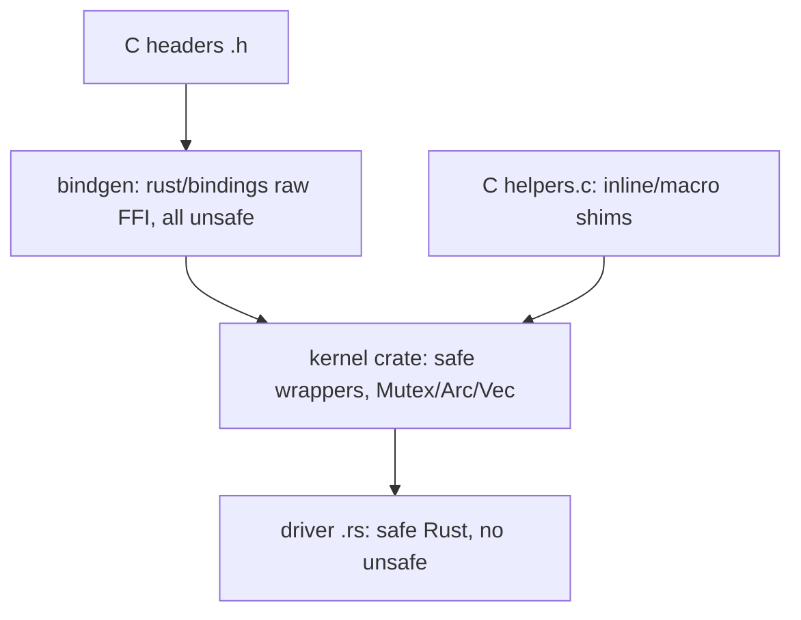

# Rust in the Linux Kernel

> **Goal:** understand why Rust is entering the kernel after 30 years of
> pure C, what has already been merged (since 6.1), how the safe Rust
> abstractions are actually built on top of the C codebase, and what this
> means for the future of kernel development and security.

## Why Rust in a 40-million-line C codebase?

The kernel's biggest source of exploitable vulnerabilities is **memory
safety bugs** in C code: use-after-free, double free, out-of-bounds
read/write, NULL dereference, uninitialized reads. Both Google (Android
security) and Microsoft have published the same headline number,
independently: roughly **70% of high-severity vulnerabilities are memory
safety bugs**, and that fraction has barely moved in a decade despite
enormous investment in dynamic tooling — syzbot fuzzing, KASAN, KFENCE,
KMSAN, KCSAN, lockdep, and kmemleak.

Those tools all share one weakness: they *detect* a bug at runtime, and
only if the fuzzer or the production workload happens to hit the vulnerable
path with the wrong timing. A use-after-free that fires one time in ten
million on a rare error path can ship for years.

Rust attacks the same bug classes at compile time instead:

| Bug class | C mitigation (runtime) | Rust (compile time) |
|---|---|---|
| Use-after-free | KASAN detector | Ownership + borrow checker — won't compile |
| Double free | Debug slab / SLUB_DEBUG | Ownership — `drop` runs exactly once |
| Buffer overflow | KASAN, FORTIFY_SOURCE | Slices are bounds-checked; `unsafe` opt-in |
| NULL dereference | Static analysis, `WARN_ON` | `Option<T>` — `None` must be handled |
| Data race | KCSAN | `Send`/`Sync` traits — won't compile |
| Uninitialized read | KMSAN | Every value must be initialized to construct |

The shift is from "find the bug in production" to "the compiler refuses to
emit the buggy machine code." Rust does not make a driver correct — logic
bugs, deadlocks from lock ordering, and hardware-protocol mistakes all
survive — but it deletes whole categories of the bugs that turn into CVEs.

Rust is **not** replacing C wholesale. Rewriting 40 million lines is not a
plan. The strategy is **Rust for new code**, concentrated where the
vulnerability density is highest: **drivers**.

### Why drivers specifically?

- Drivers are the majority of the tree — well over half of the ~40M lines
  live under `drivers/`.
- They are the majority of the vulnerabilities: written by hardware vendors
  rather than core maintainers, they are the lightly-reviewed long tail.
- They are self-contained. A driver talks to the rest of the kernel through
  a comparatively narrow, well-defined API (the subsystem's `*_ops`
  vtable), which makes it practical to wrap that boundary in safe Rust once
  and reuse it everywhere. Core subsystems have no such boundary — they *are*
  the boundary.

See [Devices, Drivers & Modules](#/devices-modules) for how that driver
boundary works in C, and [Lab: Write, Build & Load a Kernel Module](#/lab-kernel-module)
for the C module you can build today.

## What's actually merged (kernel 6.1 → 6.12)

Rust infrastructure landed in **6.1** (December 2022). It is gated behind
`CONFIG_RUST` and is still marked experimental. What has landed since,
corrected for the marketing:

| Kernel | What landed |
|---|---|
| 6.1 | Core infra: `rust/` tree, `kernel` crate, `module!` macro, `printk`/`pr_info!`, `Error`/`Result` types |
| 6.2–6.6 | `Arc` reference counting, `Mutex`/`SpinLock` wrappers, `Vec`/`Box`, workqueue and `Task` bindings, `Opaque`/`pin-init` groundwork |
| 6.8 | Network PHY abstractions plus a real reference PHY driver (`drivers/net/phy`, Asix AX88796B) — the first Rust touching real hardware in-tree |
| 6.10–6.11 | More PHY drivers, `Arc`/`ForeignOwnable` refinements, firmware and device-property bindings |
| 6.12 | Block-layer abstractions and the `rnull` Rust null-block driver; the DRM **panic QR-code generator** (first Rust in DRM); a new first-class allocator API (`Kmalloc`/`Vmalloc`/`KVmalloc`, `GFP` flags) replacing the old vendored `alloc` crate |

A couple of widely-repeated claims worth correcting, as of 6.12:

- The **Nova** driver is an in-progress Rust driver for modern **NVIDIA**
  GPUs (GSP-firmware based), *not* an Apple GPU driver. Its substantial
  upstreaming happened after 6.12.
- The impressive Rust **Apple GPU driver** (AGX, for M1/M2) is real but
  **out-of-tree**, developed for Asahi Linux.
- The **Android Binder** rewrite in Rust is being upstreamed but is not
  fully merged as of 6.12.

The `rust/` directory as of 6.12:

```text
rust/
├── kernel/         # safe wrappers over kernel C APIs (the crate drivers use)
├── macros/         # proc macros: module!, vtable, pin_data, ...
├── bindings/       # bindgen output: raw extern "C" declarations (all unsafe)
├── uapi/           # bindgen output for UAPI headers
├── pin-init/       # in-place / pinned initialization (the pin_init! machinery)
├── helpers/        # small C shims for things bindgen can't express (inlines, macros)
└── Makefile, build_error.rs, ...
```

## How Rust and C coexist

Rust does not bring its own build system. `make` invokes `rustc` for `.rs`
files just as it invokes `gcc`/`clang` for `.c`. The two languages meet at a
generated FFI layer produced by **bindgen**, which reads the kernel's C
headers and emits raw Rust declarations.

The critical architectural idea is the **three-layer stack**: raw unsafe
bindings at the bottom, a hand-written safe wrapper crate in the middle, and
driver code on top that (ideally) contains no `unsafe` at all. The `unsafe`
is not eliminated — it is *concentrated* in one reviewed layer instead of
being smeared across every vendor driver.



Note the `helpers/` box. bindgen cannot see `static inline` functions or
function-like macros — they have no symbol to link against. The kernel
works around this with tiny C shim functions in `rust/helpers/` that wrap
each inline/macro, giving bindgen a real symbol. That is why calling, say,
`spin_lock_init()` from Rust actually calls a generated helper, not the
macro directly.

Example — a kernel mutex in Rust, and what each line buys you:

```rust
use kernel::sync::{new_mutex, Mutex};
use kernel::prelude::*;

#[pin_data]
struct MyDriverData {
    #[pin]
    counter: Mutex<u64>,
}

fn bump(data: &MyDriverData) {
    let mut guard = data.counter.lock();  // acquires struct mutex; may sleep
    *guard += 1;
    // guard dropped here -> mutex_unlock() runs. Guaranteed, even on ?-return.
}
```

What Rust enforces that a C `mutex_lock()/mutex_unlock()` pair cannot:

- The data is **owned by the lock**. `Mutex<u64>` means you cannot touch the
  `u64` without holding the lock — there is no address of the inner value to
  dereference except through a `guard`. In C, nothing stops you reading a
  field the comment says is "protected by `->lock`."
- The guard's lifetime **is** the critical section. Code that uses the value
  after the guard is dropped does not compile.
- The guard's `Drop` implementation calls `mutex_unlock()` on every exit
  path — early return, error propagation with `?`, or panic. The classic C
  bug of a `goto out;` that skips the unlock cannot be written.
- For the IRQ-context variant, the `SpinLock` guard restores the saved
  interrupt state on drop, so the `spin_lock_irqsave` /
  `spin_unlock_irqrestore` pairing can never be mismatched. See
  [Interrupts, Exceptions & Softirqs](#/interrupts) for why that state
  matters and [Kernel Synchronization](#/kernel-sync) for the locks
  themselves.

## The hard parts (this is where the depth is)

### `no_std`: there is no standard library

Kernel Rust is compiled `#![no_std]`. It gets `core` (no allocation) and a
kernel-flavored `alloc`, but not `std`. `std::Vec`, `std::Box`,
`std::Mutex`, `std::fs`, threads, `println!` — none of it exists. The reasons
are concrete, not stylistic:

- **Allocation can fail and must not panic.** `std::Box::new` aborts the
  process on OOM. A kernel cannot "abort the process"; it must return
  `-ENOMEM`. So kernel Rust uses fallible allocation: `KBox::new(x, GFP_KERNEL)`
  returns `Result<KBox<T>, AllocError>`, and `KVec` grows with `push(...)?`.
- **You must pick an allocator and a GFP flag.** C code chooses between
  `kmalloc` (physically contiguous, fast, size-limited), `vmalloc`
  (virtually contiguous, can be large, slower), and `kvmalloc` (try one then
  the other). As of 6.12 Rust exposes these as the `Kmalloc`, `Vmalloc`, and
  `KVmalloc` allocators, and every allocation takes a `flags::GFP_KERNEL` /
  `GFP_ATOMIC` argument — the same context rules as C. See
  [Virtual Memory](#/memory) for what those allocators actually do.
- **Synchronization is kernel synchronization.** `std::Mutex` assumes a
  userspace futex and a running scheduler thread. The kernel crate's `Mutex`
  wraps `struct mutex`; its `SpinLock` wraps `spinlock_t` and is aware of
  interrupt context, which `std` has no concept of.

### Pinning: kernel objects cannot move

This is the single hardest concept in kernel Rust, and it has no C analogue
because C never promised objects could move.

Rust values are movable by default: assigning or returning a value can
memcpy it to a new address. Kernel objects violate that assumption
constantly. A `struct mutex` contains a `wait_list` whose list nodes, once
the mutex is registered, are pointed at by other list entries. A
`list_head` embedded in your struct is linked into a global list by address.
Move such an object and you have dangling pointers instantly.

Rust's answer is the `Pin<P>` type plus in-place initialization. Instead of
"construct the value, then move it into place," kernel Rust constructs the
value **directly at its final address** and then guarantees it never moves.
The machinery:

- **`Opaque<T>`** — a wrapper for a C type whose bytes the Rust compiler must
  not assume anything about (it is initialized by C code and is
  address-sensitive). It is `!Unpin`.
- **`PinInit<T, E>`** — a trait for a "recipe" that initializes a `T` in
  place at a given pointer, possibly failing with `E`.
- **`pin_init!` and `#[pin_data]`** — macros that let you write struct
  initialization that expands into in-place construction rather than a move.
  The `#[pin]` field attribute (seen in the example above) marks fields that
  must be pinned, like an embedded `Mutex`.

The payoff: a self-referential, address-sensitive kernel object can be built
safely, and the type system tracks that it must not be moved thereafter. The
cost: `pin_init!` and friends are unusual-looking and are the steepest part
of the learning curve.

### Passing ownership across the C boundary

C stores driver state in a `void *private_data` and hands it back later.
Rust models this with the **`ForeignOwnable`** trait: `into_foreign()`
consumes a Rust object (say an `Arc<Device>`) and returns a raw pointer to
stash in the C struct; `from_foreign()` reclaims it and restores Rust
ownership so `Drop` eventually runs. This is how a Rust driver survives the
round trip through a C callback without leaking or double-freeing.

### Error handling maps to errno

Kernel Rust's `Error` type wraps a negative errno. `Result<T>` is
`core::result::Result<T, Error>`, and `kernel::error::to_result()` /
`Error::to_errno()` convert both directions. The `?` operator propagates an
`-EINVAL` up and out of a function the same way a C function returns it — but
without the manual `if (ret) goto out;` ladder, and with the compiler
enforcing that the error is handled rather than dropped.

### Toolchain and architecture constraints

- **Rust version.** The kernel pins a minimum supported `rustc`; for 6.12
  that is **1.78.0**. A few features still require specific compiler flags,
  and the Rust-for-Linux team works with the compiler team to stabilize the
  kernel's needs (the long-term goal is building with a stable toolchain
  only). This complicates a project whose C toolchain policy is deliberately
  conservative.
- **Architecture coverage.** Rust codegen goes through LLVM, so it targets
  the architectures LLVM supports well: x86-64, arm64, riscv, loongarch. The
  GCC-only and niche architectures (some older or exotic ports) do not get
  Rust, which is a real objection for a project that still supports a long
  list of them. (`gccrs` and `rustc_codegen_gcc` aim to close this, slowly.)

### Cultural resistance

Not every maintainer is enthusiastic, and the objections are technical, not
just tribal:

- "Two languages forever" doubles the mental and tooling burden on any
  maintainer whose subsystem gains a Rust user.
- "The abstractions are leaky" — you still reach for `unsafe` at the raw
  hardware boundary (MMIO, DMA), so Rust is not a magic wand there.
- Governance friction: who reviews the Rust abstractions for a C subsystem,
  and can a C maintainer be forced to keep a Rust API working?

Linus Torvalds' stance has been cautiously pragmatic: he took the
infrastructure merge but has insisted Rust prove itself with real drivers
before any subsystem depends on it. See
[How the Kernel Is Made](#/kernel-governance) for how such decisions get
made.

## Follow the code (kernel v6.12)

### Path 1: what `module!` actually generates

A minimal Rust module:

```rust
module! {
    type: MyModule,
    name: "my_module",
    author: "you",
    description: "example",
    license: "GPL",
}

struct MyModule;

impl kernel::Module for MyModule {
    fn init(_module: &'static ThisModule) -> Result<Self> {
        pr_info!("loaded\n");
        Ok(MyModule)
    }
}
```

Step by step through the machinery:

1. The `module!` proc macro (in `rust/macros/`) expands to a
   `#[no_mangle] pub extern "C" fn init_module()` and matching
   `cleanup_module()` — the exact same C entry points a C module exposes, so
   the existing module loader needs no changes.
2. `init_module` calls your `MyModule::init`, converts its `Result` to an
   `int` errno via `Error::to_errno()`, and returns that to C. A returned
   `Err(EINVAL)` becomes `-EINVAL`, exactly as a C module's init would.
3. Loading `my_module.ko` from userspace enters the kernel through the
   [finit_module(2)](https://man7.org/linux/man-pages/man2/init_module.2.html)
   syscall, which lands in [load_module()](https://elixir.bootlin.com/linux/v6.12/C/ident/load_module).
   That function builds the `struct module`, resolves symbols, and finally
   calls [do_init_module()](https://elixir.bootlin.com/linux/v6.12/C/ident/do_init_module),
   which invokes the module's init function pointer — your generated
   `init_module`. From the loader's point of view, the Rust module is
   indistinguishable from a C one.

The `pr_info!` macro, in turn, calls into the C
[printk](https://elixir.bootlin.com/linux/v6.12/C/ident/printk)
family through a `rust/helpers` shim, because `printk` is a variadic macro
bindgen cannot bind directly.

### Path 2: `Mutex::lock()` down to the C slow path

When the earlier `data.counter.lock()` runs:

1. The Rust `Mutex::lock()` calls the FFI binding for
   [mutex_lock()](https://elixir.bootlin.com/linux/v6.12/C/ident/mutex_lock),
   passing a pointer to the embedded `struct mutex` (held inside an
   `Opaque<bindings::mutex>`). It receives back a guard object.
2. `mutex_lock()` first tries the fast path: a single atomic compare-exchange
   on the mutex's `owner` field, which packs the owning `task_struct` pointer
   plus low flag bits into an `atomic_long_t`. If the mutex is uncontended,
   the cmpxchg succeeds and the call returns without ever touching the wait
   list — this is the common, cheap case (tens of nanoseconds).
3. Under contention it drops into
   [__mutex_lock_slowpath()](https://elixir.bootlin.com/linux/v6.12/C/ident/__mutex_lock_slowpath)
   → `__mutex_lock_common()`. There the task may **optimistically spin**
   (MCS-queued) as long as the lock holder is still running on a CPU — a bet
   that the holder will release soon, cheaper than sleeping. If that fails,
   the task adds a `struct mutex_waiter` to the mutex's `wait_list`
   (protected by the internal `wait_lock` spinlock), sets itself
   `TASK_UNINTERRUPTIBLE`, and calls
   [schedule()](https://elixir.bootlin.com/linux/v6.12/C/ident/schedule) to
   yield the CPU. Control returns only when the previous owner hands the lock
   off. (See [CPU Scheduling](#/scheduling) — since 6.6 the picker behind
   `schedule()` is EEVDF, which replaced CFS.)
4. The three `struct mutex` fields that matter: **`owner`** (packed owner +
   flags, the fast-path target), **`wait_lock`** (the spinlock guarding the
   queue), and **`wait_list`** (the FIFO of waiters). These are exactly the
   address-sensitive internals that force the Rust side to keep the mutex
   pinned and wrapped in `Opaque`.
5. On the way out, dropping the guard calls
   [mutex_unlock()](https://elixir.bootlin.com/linux/v6.12/C/ident/mutex_unlock),
   which clears the fast-path owner and, if the wait list is non-empty, wakes
   the head waiter. Because this is `Drop`, it is emitted on *every* exit
   path by the compiler — the guarantee that motivated the whole exercise.

The same layering explains `Arc<T>`: the Rust `Arc` is a refcount modeled on
the C `refcount_t`, and cloning/dropping it calls
[refcount_inc()](https://elixir.bootlin.com/linux/v6.12/C/ident/refcount_inc)
and `refcount_dec_and_test()` under the hood, with the final drop running the
value's destructor.

## What this means for you

### If you want to write kernel code

Learning Rust alongside C is increasingly strategic. New drivers — the most
accessible entry point for a contributor — are where Rust will be preferred
first. The core (scheduler, memory management, VFS) will remain C
indefinitely; the driver layer is the frontier. Start with the out-of-tree
module below, then read the in-tree `rust/kernel/` crate as your reference.

### If you're reading kernel source

You will meet `.rs` files under `rust/`, `drivers/net/phy/`, and
`drivers/block/`. The concepts are the same ones from the C chapters —
mutexes, spinlocks, refcounts, vtables, callbacks — only the syntax and the
safety guarantees differ. When a Rust wrapper confuses you, find the C
function it binds; the behavior is identical.

### The security thesis

Google's Android team has stated plainly that Rust in the kernel is among
the most effective things they can do to shrink Android's attack surface,
and Android's own userspace data already shows new-code-in-Rust driving the
memory-safety-bug fraction down.

The kernel bet is the same over a 5–10 year horizon: as the *new* code that
vendors write shifts to Rust, the long-flat memory-safety-bug curve finally
bends. It is a bet on the margin — new code, new drivers — not a rewrite. See
[Linux Security & Confinement](#/security-hardening) for the broader
defense-in-depth picture Rust slots into.

**Container link:** almost none of this is container-specific, but the
control-plane pieces containers lean on — [cgroup v2](#/cgroups) accounting,
[namespaces](#/namespaces), Binder on Android — are exactly the kind of
security-sensitive driver/subsystem code that Rust is aimed at hardening
first.

## The bigger picture: this has happened before

The kernel has absorbed large tooling and substrate changes before:

- **BPF** added an entire in-kernel execution substrate — a bytecode, a
  verifier, and a JIT — and was accepted because it proved itself useful. See
  [eBPF Internals](#/ebpf-internals). Rust is a comparable
  infrastructure-scale addition solving a persistent problem the old tools
  could not.
- **Git** itself was written by Linus to manage the kernel and reshaped how
  the project develops.
- C was extended repeatedly for kernel needs (inline asm, `__attribute__`
  extensions, compiler intrinsics) rather than the kernel bending to standard
  C.

Rust differs in scale but fits the pattern: a new tool adopted to fix a
problem the existing tools structurally could not.

## Try it yourself

```bash
# Is Rust support compiled into your running kernel?
zgrep -E 'CONFIG_RUST\b' /proc/config.gz 2>/dev/null \
  || grep -E 'CONFIG_RUST\b' /boot/config-$(uname -r)
# CONFIG_RUST=y means Rust support is built in (still rare in distro kernels).

# Inspect the in-tree Rust crate on a kernel source tree:
ls rust/kernel/                     # sync/, alloc/, error.rs, init.rs, ...
git log --oneline --since=2024-01-01 -- rust/ | head

# Build an out-of-tree Rust module (needs a Rust-enabled kernel + toolchain):
git clone --depth=1 https://github.com/Rust-for-Linux/rust-out-of-tree-module
cd rust-out-of-tree-module && make
# Requires the Rust-for-Linux toolchain: rustc 1.78+ and the matching
# rust-src / bindgen. `make LLVM=1` is the usual invocation.

# Check whether the tools are present and consistent for a kernel build:
make rustavailable        # run inside a kernel tree; explains what's missing
```

If you want the C-module foundation first, do
[Lab: Write, Build & Load a Kernel Module](#/lab-kernel-module) and
[Reading & Building the Kernel](#/kernel-dev), then come back.

## Check your understanding

1. Why are drivers the target for Rust rather than the core scheduler or memory manager?

<details><summary>Show answer</summary>

Drivers are the largest slice of the tree, carry the highest vulnerability
density (vendor-written, lightly reviewed long tail), and are self-contained
behind a narrow subsystem API (the `*_ops` vtable). That boundary can be
wrapped in safe Rust once and reused. Core subsystems have no such boundary —
they define the boundary — so there is nothing clean to wrap.

</details>

2. What does the `Mutex` RAII guard guarantee that a C `mutex_lock()/mutex_unlock()` pair cannot?

<details><summary>Show answer</summary>

Three things: the protected data is owned by the lock, so you cannot access
it without a guard; the guard's lifetime is the critical section, so
use-after-unlock does not compile; and the guard's `Drop` runs
`mutex_unlock()` on *every* exit path (early return, `?`, panic), so a
`goto out;` that skips the unlock is unwritable.

</details>

3. Why can't kernel Rust use `std::Mutex` or `std::Box`?

<details><summary>Show answer</summary>

Kernel Rust is `#![no_std]`. `std` assumes userspace: `std::Box::new` aborts
on OOM, but the kernel must return `-ENOMEM`; `std::Mutex` assumes a futex and
a scheduler thread, with no concept of interrupt context. The `kernel` crate
provides fallible allocation (`KBox::new(x, GFP_KERNEL)? `) and locks that
wrap `struct mutex` / `spinlock_t` with the right context rules.

</details>

4. What is `unsafe` in kernel Rust — is its presence a bug?

<details><summary>Show answer</summary>

No. `unsafe` marks code where the compiler cannot verify the safety
invariants and the programmer asserts them by hand (raw MMIO, DMA, FFI into
C). It is a contract, not a defect. The design concentrates `unsafe` in the
reviewed `rust/bindings` and `rust/kernel` layers so that driver code above
can be entirely safe Rust.

</details>

5. Why does kernel Rust need `Pin` and `pin_init!`, when ordinary Rust rarely does?

<details><summary>Show answer</summary>

Rust values are movable by default (assignment can memcpy them), but many
kernel objects are address-sensitive: a `struct mutex`'s `wait_list` or an
embedded `list_head` is linked by address, so moving the object dangles those
pointers. `Pin` plus in-place initialization (`pin_init!`, `#[pin_data]`,
`Opaque<T>`) builds the object directly at its final address and forbids it
from moving afterward.

</details>

6. Which is the first Rust code touching real hardware merged in-tree, and what is *wrong* with the common "Nova is an Apple GPU driver" claim?

<details><summary>Show answer</summary>

The network PHY abstractions plus the Asix AX88796B reference PHY driver
(6.8) were the first Rust driving real hardware in-tree; 6.12 added the
`rnull` block driver and the DRM panic QR-code generator. Nova is an
in-progress driver for **NVIDIA** GSP-based GPUs, not Apple. The Rust
**Apple** GPU driver (AGX) is real but **out-of-tree**, developed for Asahi
Linux.

</details>

7. When `data.counter.lock()` contends, what happens down in the C mutex code, and which `struct mutex` fields are involved?

<details><summary>Show answer</summary>

The fast-path cmpxchg on `owner` fails, so `__mutex_lock_slowpath()` →
`__mutex_lock_common()` may optimistically spin while the holder still runs;
failing that, the task queues a `struct mutex_waiter` on `wait_list` (guarded
by `wait_lock`), sets itself uninterruptible, and calls `schedule()` (EEVDF
since 6.6). The fields that matter are `owner`, `wait_lock`, and `wait_list`.

</details>

## Sources & further reading

- Rust for Linux — kernel documentation index: <https://docs.kernel.org/rust/index.html>
- Rust coding and quick-start guide: <https://docs.kernel.org/rust/quick-start.html>
- The in-tree `kernel` crate source (browse `sync/`, `alloc/`, `init.rs`): <https://elixir.bootlin.com/linux/v6.12/source/rust/kernel>
- Rust-for-Linux project and out-of-tree module template: <https://rust-for-linux.com/>
- `mutex_lock()` and the mutex slow path in C: <https://elixir.bootlin.com/linux/v6.12/source/kernel/locking/mutex.c>
- Locking API design and semantics: <https://docs.kernel.org/locking/index.html>
- "Memory safe languages in Android 13" (Google Security Blog) — the ~70% figure and the new-code-in-Rust trend.
- Jon Corbet, "Rust in the kernel" coverage on LWN.net — ongoing reporting on merges and maintainer debate.

---

**Next:** Part VIII — the kernel as hypervisor. [KVM & Virtualization Internals](#/kvm-internals) turns Linux into the platform that runs every cloud VM on earth: the vCPU execution loop, VM exits, EPT/NPT nested page tables, virtio paravirtualized I/O, and why steal time matters.
