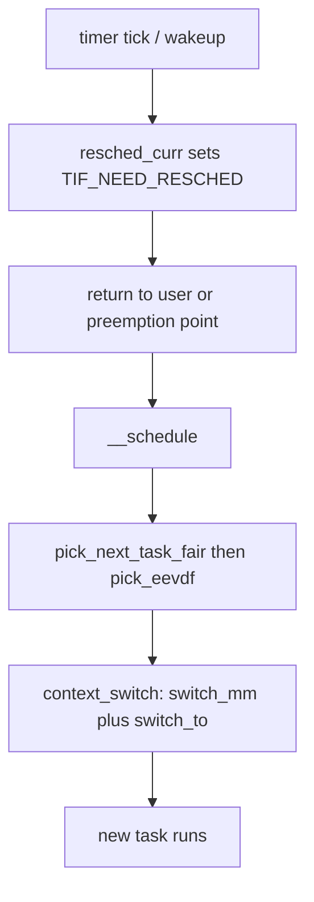

# CPU Scheduling

> **Goal:** understand how the kernel decides which process runs on which CPU
> and for how long — and what "nice", load average, and the cgroup CPU limits
> used by containers really mean.

## The problem

At any instant you might have 3 runnable processes and 8 cores — or 300 and 4.
The scheduler must pick who runs where, balancing goals that pull in
opposite directions:

- **Fairness** — everyone gets a share.
- **Latency** — when you press a key, the editor should respond *now*.
- **Throughput** — context switches aren't free; switching less gets more
  total work done.

The mechanism enabling all of it is **preemption**: a hardware timer
interrupts the CPU periodically (see [Interrupts, Exceptions & Softirqs](#/interrupts)),
handing control to the kernel, which may decide someone else's turn has come.
No process can hold a CPU hostage.

The scheduler is the busiest single piece of kernel code on most machines: on
a loaded server `__schedule()` may run tens of thousands of times per second
per CPU, and every path through it holds a per-CPU lock. So the design is
ruthlessly optimised — O(log n) picks, per-CPU data, and a "fast path" that
skips most of the machinery when only ordinary tasks are runnable.

## The big insight: most processes are asleep

A typical system has hundreds of processes but a load of nearly zero, because
almost everything is **blocked** — asleep in the kernel, waiting for input,
network data, or a timer. The scheduler only juggles the *runnable* few.

This drives the classic distinction:

- **I/O-bound** processes (editors, shells, most servers): run for microseconds,
  then block again. They crave **low latency** when their event arrives.
- **CPU-bound** processes (compilers, encoders, ML training): would happily
  compute forever. They crave **long uninterrupted slices**.

A good scheduler gives interactive tasks the CPU *quickly when they wake*, and
batch tasks the CPU *in big chunks when nobody interactive needs it*. The
elegance of Linux's fair scheduler is that it does both from a *single* number
per task — no "is this task interactive?" heuristic that a workload can fool.

## The moving parts: the data structures

Before the algorithms, meet the actual objects (all under
`kernel/sched/` and `include/linux/sched.h`):

- **`struct task_struct`** — the process/thread descriptor you met in
  [Processes & Threads](#/processes). The scheduler-relevant fields:
  `policy` (SCHED_OTHER, SCHED_FIFO, …), `prio` / `static_prio` /
  `normal_prio` (the kernel's 0–139 priority scale: 0–99 real-time,
  100–139 map to nice −20…+19), `on_rq` (is it currently queued?),
  `cpus_ptr` / `cpus_mask` (its allowed-CPU affinity), a pointer to its
  `sched_class`, and an embedded `se` — a `struct sched_entity`.

- **`struct sched_entity`** — the fair scheduler's per-task accounting
  block. The fields that matter as of 6.12: `vruntime` (weighted virtual
  runtime consumed), `deadline` (virtual deadline, the EEVDF sort key),
  `slice` (requested slice length, default 0.75 ms base), `vlag` (how far
  ahead/behind its fair share the task is, preserved across sleep), `load`
  (its weight, from the nice value), and a `sched_avg avg` (its PELT load
  tracking). A sched_entity can also represent an entire cgroup — that's how
  container CPU weights nest (see below).

- **`struct rq`** — one **run queue per CPU**, containing the per-class
  sub-queues (`cfs`, `rt`, `dl`), `curr` (what's running now), `nr_running`
  (total runnable across all classes), `clock` / `clock_task` (the queue's
  cached timestamps), and `__lock` (the per-queue raw spinlock). Per-CPU
  queues mean the hot path takes no global lock.

- **`struct cfs_rq`** — the fair-class sub-queue: a red-black tree
  (`tasks_timeline`) of runnable sched_entities, `nr_running`, `min_vruntime`
  (a monotone floor used to keep vruntimes from overflowing), and the running
  sums `avg_vruntime` / `avg_load` that together define the "average position"
  used by EEVDF's eligibility test. It also carries the group's PELT sums
  (`avg`) and, for a cgroup, a back-pointer to the `task_group` it belongs to.

- **`struct sched_class`** — scheduling policies are objects with methods
  (`enqueue_task`, `dequeue_task`, `pick_next_task`, `task_tick`,
  `select_task_rq`, …). The classes form a strict pecking order; a higher
  class with any runnable task always wins:

```text
stop  >  deadline  >  realtime (FIFO/RR)  >  fair (EEVDF)  >  idle
```

[__schedule()](https://elixir.bootlin.com/linux/v6.12/C/ident/__schedule)
asks each class in order for a task; in the overwhelmingly common case where
only fair tasks are runnable, a fast path in
[pick_next_task()](https://elixir.bootlin.com/linux/v6.12/C/ident/pick_next_task)
calls straight into the fair class and skips the class-by-class walk entirely.

## How Linux does it: fair-share scheduling

### CFS: Completely Fair Scheduler (2007–2023)

The default policy (`SCHED_OTHER`) was implemented by **CFS** — the Completely
Fair Scheduler, from kernel 2.6.23 (2007) until 6.5. The model:

> Imagine an ideal CPU that could run all N runnable tasks *simultaneously*,
> each at 1/N speed. CFS approximates this ideal on real hardware.

The bookkeeping is one number per task: **vruntime** — the virtual CPU time
it has consumed, *weighted* by its priority. The rule is simply:

```text
always run the runnable task with the smallest vruntime
```

- Tasks are kept in a red-black tree ordered by vruntime; the leftmost node
  is next to run — an O(log n) pick.
- While a task runs, its vruntime grows as
  `delta_exec × 1024 / weight` — a nice +10 task's vruntime grows faster,
  so it gets less real CPU (it's "nicer" to others).
- A task that **sleeps a lot** (interactive!) accumulates little vruntime, so
  when it wakes, it's far on the left — and runs almost immediately.
  Interactivity falls out of the design for free, with no heuristics.

There were no fixed time slices: CFS divided a *target latency* window
(`sched_latency`, 6 ms scaled up by log₂ of the CPU count) among the runnable
tasks, with a minimum granularity (~0.75 ms) so the CPU didn't drown in
context switches. CFS's weak spot: vruntime alone says who is *owed* CPU, but
nothing about *urgency* — a latency-sensitive task and a batch task with equal
vruntime looked identical, so CFS bolted on wakeup-preemption heuristics
(`GENTLE_FAIR_SLEEPERS`, `WAKEUP_PREEMPTION`) that were forever being tuned.

### EEVDF: the successor (kernel 6.6+)

Since kernel 6.6 (October 2023), the fair class implements **EEVDF** —
Earliest Eligible Virtual Deadline First, based on a 1995 paper by Stoica and
Abdel-Wahab. The fairness idea is the same; the mechanism adds a second axis,
*urgency*, and replaces the pile of heuristics with one clean rule:

```text
Each task has:
  - vruntime: virtual time consumed (same as CFS)
  - lag:      fair share owed = (ideal service) − (actual service)
              eligible ⇔ lag ≥ 0
  - deadline: vruntime + slice/weight  (virtual deadline)

Scheduler: among ELIGIBLE tasks (not ahead of their fair share),
           pick the EARLIEST virtual DEADLINE
```

The **eligibility test** is the heart of it. Rather than store lag per task
and recompute it constantly, `cfs_rq` maintains the running sums `avg_vruntime`
(Σ weightᵢ·(vruntimeᵢ − min_vruntime)) and `avg_load` (Σ weightᵢ). A task is
eligible when its vruntime is at or behind the weighted average — computed by
[entity_eligible()](https://elixir.bootlin.com/linux/v6.12/C/ident/entity_eligible)
in constant time. Two consequences:

- **Fairness is enforced by eligibility.** A task that has already consumed
  more than its fair share (negative lag) simply may not run until the others
  catch up — no heuristic boosts or penalties, and the fairness bound is
  *provable*: no task drifts more than one slice from its ideal service.
- **Latency is controlled by slice length.** A shorter requested slice means
  an earlier deadline: you get the CPU *sooner*, but for *less time*. Same
  total share — different granularity. This is a knob CFS never had.

The red-black tree is *augmented*: each node caches the minimum vruntime of its
subtree, so [pick_eevdf()](https://elixir.bootlin.com/linux/v6.12/C/ident/pick_eevdf)
can prune whole subtrees that contain no eligible task and still find the
earliest-deadline eligible entity in O(log n).

When a task wakes after sleeping, [place_entity()](https://elixir.bootlin.com/linux/v6.12/C/ident/place_entity)
inserts it at the queue's current average vruntime, adjusted by the **lag it
had when it went to sleep** (stored in `se->vlag`). Sleeping neither banks
unlimited credit (the CFS "sleeper bonus" is gone) nor forfeits what you were
owed — a task that was owed CPU when it blocked is still owed it when it wakes.

Kernel **6.12 completed EEVDF** with two notable pieces:

- **Per-task slices**: `sched_setattr(2)` with `sched_runtime` now sets
  `se->slice` (clamped to 0.1–100 ms), so a latency-critical task can request
  e.g. a 0.5 ms slice. Default is 0.75 ms scaled by log₂(nr_cpus) — about
  3 ms on an 8-CPU machine (`/sys/kernel/debug/sched/base_slice_ns`).
- **Delayed dequeue** (`DELAY_DEQUEUE`): a task that blocks while its lag is
  negative stays *on* the queue (marked not-runnable, `se->sched_delayed`)
  until its debt amortizes — otherwise a task could repeatedly over-consume,
  sleep briefly to launder the negative lag, and come back with a clean slate.

Also new in 6.12: **sched_ext** (`SCHED_EXT`), a scheduling class that lets a
BPF program implement the entire policy (used by custom gaming and datacenter
schedulers like `scx_lavd` and `scx_rusty`). See [eBPF Internals](#/ebpf-internals).

Practically, EEVDF feels like CFS but snappier — same fairness, same nice
weighting, better and *provable* handling of the gap between "wake up" and
"run".

```bash
cat /proc/self/sched          # policy, vruntime, deadline, slice, nr_switches
```

### nice: tilting the scales

`nice` values (−20 … +19, default 0) select a **weight** from a fixed table
([sched_prio_to_weight[]](https://elixir.bootlin.com/linux/v6.12/C/ident/sched_prio_to_weight)).
Each nice step is roughly a 1.25× CPU weight difference — chosen so that one
step changes a task's share of a busy CPU by about 10%:

```bash
nice -n 19 ./big_compile.sh        # background drudge work
sudo renice -n -5 -p 1234          # boost an existing process
ps -eo pid,ni,comm | sort -k2 -n   # sort by niceness
```

The exact anchors: nice 0 = weight 1024, nice +1 = 820, nice −1 = 1277;
the extremes are nice +19 = 15 and nice −20 = 88761. vruntime advances as
`delta_exec × 1024 / weight`, so under contention a nice −10 task
(weight 9548) gets roughly 87× the CPU of a nice +10 task (weight 110). On an
idle machine, nice changes nothing — weights only matter when tasks compete.
The kernel keeps a second table,
[sched_prio_to_wmult[]](https://elixir.bootlin.com/linux/v6.12/C/ident/sched_prio_to_wmult),
of precomputed `2³²/weight` inverses so the hot-path division becomes a
multiply-and-shift.

### Other policies, briefly

| Policy | Who uses it |
|---|---|
| `SCHED_OTHER` | Everything normal (EEVDF 6.6+, CFS before) |
| `SCHED_BATCH` | Hint: throughput over latency — treated as always-busy, no wakeup preemption |
| `SCHED_IDLE` | Run only when nothing else wants the CPU (weight 3, ~0.3% of a nice-0 task) |
| `SCHED_FIFO` / `SCHED_RR` | **Real-time**: fixed priorities 1–99, always beat any fair task |
| `SCHED_DEADLINE` | Declare `runtime`/`deadline`/`period`; kernel guarantees or refuses |
| `SCHED_EXT` | 6.12+: policy implemented by a loaded BPF scheduler |

Real-time classes are a different world:

- `SCHED_FIFO` has **no time slice at all** — a task runs until it blocks,
  yields, or a higher priority task wakes. `SCHED_RR` is FIFO plus
  round-robin among *equal* priorities, default slice 100 ms
  (`/proc/sys/kernel/sched_rr_timeslice_ms`).
- A SCHED_FIFO task at priority 99 in an infinite loop **starves that CPU**
  of all normal tasks. The historical fallback is **RT throttling**: by default
  the kernel reserves 5% of each second for non-RT tasks
  (`sched_rt_runtime_us = 950000` of `sched_rt_period_us = 1000000`), which
  is why a runaway RT task usually leaves the machine *barely* alive.
  Setting RT policies requires `CAP_SYS_NICE` (or an `RLIMIT_RTPRIO` grant).
- **New in 6.12 — the deadline server for fair tasks.** RT throttling is a
  blunt global instrument. 6.12 adds a per-CPU `dl_server`: the fair class runs
  as a SCHED_DEADLINE reservation, so even a CPU saturated with FIFO tasks
  still hands the fair class a guaranteed sliver of runtime. This is the
  mechanism that will eventually retire RT throttling.
- `SCHED_DEADLINE` (kernel 3.14+) is the only class with **admission
  control**: you declare, via `sched_setattr(2)`, "I need 5 ms of CPU every
  30 ms, finished within 25 ms", and the kernel *rejects* the request
  (`-EBUSY`) if the sum of reservations would exceed capacity (roughly, total
  utilisation `Σ runtime/period` must stay under the number of CPUs).
  Internally it's Earliest Deadline First plus a **Constant Bandwidth Server**
  (CBS): a task that overruns its declared `runtime` is throttled until its
  next period, so a misbehaving deadline task can't blow the guarantees of the
  others. Deadline tasks outrank both RT and fair, and can't be reniced or
  given an affinity that would break admission.

```bash
chrt -p $$               # current process's scheduling policy
sudo chrt -f -p 50 1234  # set process 1234 to SCHED_FIFO priority 50
chrt -m                  # show min/max priorities for each policy
```

## When does the scheduler actually run?

Nothing happens "continuously". Scheduling decisions occur at discrete
events:

1. **The timer tick** — an interrupt every 1/HZ seconds (HZ is a compile-time
   choice, typically 250 or 1000 → a 4 ms or 1 ms tick). The tick updates the
   running task's `vruntime`; if its slice/deadline is used up, the kernel
   sets the `TIF_NEED_RESCHED` flag. On idle CPUs the tick is stopped
   entirely (`NO_HZ_IDLE`), and on CPUs running a single task it can be
   stopped too (`NO_HZ_FULL`) — see [Timers & Time](#/timers) and
   [CPU Isolation, NO_HZ & Real-Time](#/cpu-isolation).
2. **Wakeups** — a task becoming runnable may *preempt* the current one if
   its virtual deadline is earlier (fair class) or its priority higher (RT).
3. **Blocking** — the running task sleeps on I/O or a lock and calls
   [schedule()](https://elixir.bootlin.com/linux/v6.12/C/ident/schedule)
   voluntarily.
4. **Return paths** — `TIF_NEED_RESCHED` is only *a flag*; the actual switch
   happens when the kernel next checks it: on return to user space, on return
   from interrupt, or at in-kernel preemption points.

How aggressively the *kernel itself* can be preempted is the
`CONFIG_PREEMPT_*` choice: `NONE` (servers: kernel code runs to completion),
`VOLUNTARY` (explicit preemption points), `PREEMPT` (desktops: almost
anywhere), and `PREEMPT_RT` — the real-time patch set, **mainlined in 6.12**
for x86_64, arm64 and riscv, which makes even most spinlock-held sections
preemptible by turning them into sleeping rt-mutexes (see
[Kernel Synchronization](#/kernel-sync)). Which model is compiled in is
visible in `uname -v` and, on `PREEMPT_DYNAMIC` kernels, switchable at boot
via `preempt=` without a rebuild.

## Multi-core: per-CPU queues and load balancing

Each CPU has its **own run queue** — no global lock fights. But queues drift
apart, so the kernel balances:

- **Topology-aware domains.** CPUs are organized into a hierarchy of
  `struct sched_domain`s: SMT siblings (share a core), cores sharing an LLC,
  packages, NUMA nodes. Each level has flags (`SD_SHARE_LLC`,
  `SD_NUMA`, …) and a `busy`/`idle` balance interval. Balancing runs more
  often and more cheaply at lower levels; crossing a NUMA boundary is the most
  reluctant move of all, gated by NUMA balancing and higher migration cost
  (see [NUMA Deep Dive](#/numa-deep-dive)).
- **Load tracking (PELT).** Each entity's recent CPU usage is tracked as a
  geometric decaying sum with a ~32 ms half-life in `struct sched_avg`:
  `load_avg` (weighted by nice), `util_avg` (unweighted, 0…1024 per CPU), and
  `runnable_avg`. History decays in 1 ms periods with a fixed decay factor
  (y where y³² ≈ 0.5). This — not instantaneous queue length — is what
  balancing compares, and `util_avg` is what drives frequency selection via
  the schedutil governor (see [Power Management](#/power-management)).
- **Balance events.** Periodic balancing runs from the tick as a softirq
  (`run_rebalance_domains`); *newidle* balancing runs the moment a CPU is
  about to go idle ("anyone got work for me?"); and wakeups do cheap placement
  via [select_task_rq_fair()](https://elixir.bootlin.com/linux/v6.12/C/ident/select_task_rq_fair),
  which hunts for an idle CPU sharing the waker's LLC. The balancer classifies
  each domain's busiest group (overloaded, imbalanced, has-spare-capacity) and
  pulls just enough load to even them out.
- **Cache affinity.** Migrating a task discards its warm L1/L2; a task that
  ran within the last ~0.5 ms (`sysctl_sched_migration_cost`) is considered
  cache-hot and left in place if possible. The `migration/N` kernel threads
  (one per CPU, SCHED_FIFO priority 99) perform forced moves when a task can't
  migrate itself.

You can pin tasks yourself:

```bash
taskset -c 2,3 ./worker            # only CPUs 2 and 3
numactl --cpunodebind=0 ./worker   # only CPUs on NUMA node 0
ls /sys/kernel/debug/sched/domains/cpu0/   # inspect the domain hierarchy
```

### SMT siblings and the security edge

SMT (Hyper-Threading) means two logical CPUs share one physical core's
execution units and L1 cache. The scheduler knows this and prefers to spread
tasks across real cores before doubling up on siblings — an idle whole core is
worth more than an idle sibling of a busy core. The security implication:
shared L1 enables cache side-channel attacks across siblings (see
[CPU Vulnerability Mitigations](#/cpu-mitigations)). Deployments that
can't disable SMT (`nosmt`) can use **core scheduling** (kernel 5.14+,
`prctl(PR_SCHED_CORE, ...)`): only tasks sharing a cookie may run
concurrently on siblings of one core, so a tenant's threads never share a core
with an untrusted one.

## Context switches: the price of it all

A switch means saving the old task's registers, switching the address space
(load a new page table root; TLB flushes are mitigated by PCID on x86-64 and
ASID on arm64 — see [Virtual Memory](#/memory)), and restoring the new task.
Threads of the same process skip the address-space switch entirely, which is
why thread pools are cheaper to switch between than separate processes. Rough
order: **1–3 µs direct cost**, and often more afterwards in indirect cost —
cold caches and TLB refills that can cost tens of microseconds of degraded
throughput before the working set is warm again.

```bash
vmstat 1          # 'cs' column = context switches/sec
pidstat -w 1      # voluntary vs involuntary switches per process
perf stat -e context-switches -a -- sleep 1
```

- **voluntary** switch: the task blocked — waited on I/O, a lock, a timer.
  Normal and healthy.
- **involuntary**: the task was preempted — its slice expired or something
  more urgent woke up. Lots of these = CPU contention.

On a busy server, 50,000–200,000 context switches per second is normal.
Above ~500,000/sec, switch overhead itself becomes a significant fraction of
total CPU — a signal to look at lock contention or over-threading (see
[Performance Analysis Methodology](#/perf-methodology)).

## Load average: the most misread number in Linux

```bash
uptime
# 14:11:21 up 12 days,  3:42,  1 user,  load average: 2.41, 1.13, 0.78
```

The three numbers are exponentially-damped moving averages (1, 5, 15 min),
sampled every 5 seconds, of the count of tasks **runnable + in
uninterruptible sleep (`D` state)**. Two readings:

- On an 8-core box, load 2.4 ≈ comfortable; load 9 ≈ saturated; load 50 ≈
  pain. **Always divide by core count.**
- Because `D`-state tasks count (a Linux peculiarity, added in 1993 so that
  disk-bound work still "looks busy"), a load spike can mean *disk/NFS
  trouble*, not CPU at all. Check `vmstat`'s `wa` column and
  `/proc/pressure/io` to tell them apart.

The formula underneath:

```text
load(t) = load(t-1) * exp(-5/60) + n_active * (1 - exp(-5/60))
```

(1-minute average; the 5- and 15-minute averages use different constants.)

```bash
cat /proc/loadavg        # also shows running/total threads and last PID
cat /proc/pressure/cpu   # PSI: % of time tasks stalled waiting for CPU
```

**PSI** (Pressure Stall Information, kernel 4.20+) is usually more useful
than load average: `some` = % of time at least one task was stalled waiting
for CPU; `full` = % of time *all* runnable tasks were stalled. Load average
can be 16 on a 16-core box with every core happily busy and **zero** CPU
pressure — they're working, not waiting. If PSI is high, something is
actually hurting. PSI is also what modern userspace managers (systemd-oomd,
`senpai`) act on, precisely because it distinguishes contention from busyness.
(More in [/proc, strace, perf & eBPF](#/observability).)

## Scheduling and containers (the bridge to Part III)

**Container link:** containers don't get a special scheduler. Their CPU
limits are [cgroup v2](#/cgroups) parameters (the default hierarchy on all
modern distros) feeding into this very machinery. Internally, a cgroup *is*
a `sched_entity` containing its own `cfs_rq`: EEVDF first picks among
top-level entities (tasks and groups), then recurses into the winning group's
tree. Fairness nests — a group's weight is split among *its* children exactly
as tasks' weights are split at the top level.

- `cpu.weight` (1–10000, default 100 ≙ the old "1024 shares") — fair-share
  *proportions* between groups: only matters under contention. Groups with
  weights 200 vs 100 split a busy CPU 2:1; on an idle machine both can use
  100%. This is **work-conserving**: no idle CPU is wasted.
- `cpu.max` (quota and period — the thing behind `docker run --cpus=1.5`,
  which writes `150000 100000`) — a **hard ceiling**: at most 150 ms of CPU
  per 100 ms period, summed across all cores. Exhaust it and *all* the
  group's tasks are **throttled** — frozen until the next period, even if
  every core is idle. This is the CFS bandwidth controller
  ([tg_throttle_down](https://elixir.bootlin.com/linux/v6.12/C/ident/tg_throttle_down)
  / [throttle_cfs_rq](https://elixir.bootlin.com/linux/v6.12/C/ident/throttle_cfs_rq)),
  layered on top of EEVDF.

That throttling is the classic "my container has CPU limit 1 and mysterious
100 ms latency spikes" production issue: a runtime with 16 worker threads
burns the whole quota in the first ~6 ms of each 100 ms period, then
everything — including the request that just arrived — stalls for ~94 ms.
Check your diagnosis:

```bash
cat /sys/fs/cgroup/system.slice/docker-<id>.scope/cpu.stat
# nr_periods 5000
# nr_throttled 1234        ← rising → the quota is biting
# throttled_usec 98765432  ← cumulative time spent frozen
```

The fix: raise the limit, add a burst budget (`cpu.max.burst`, kernel 5.14+ —
lets a group bank unused quota up to a cap and spend it in a busy period), or
reduce thread count so work spreads over the full period. The fair-share
mechanism (`cpu.weight`) is transparent and well-behaved; the hard-quota
mechanism is the one that creates pathological sawtooth latency. Try it
hands-on in [Lab: Throttle a Process with cgroup v2](#/lab-cgroup-limits).

## Follow the code (kernel v6.12)

All paths live in [kernel/sched/](https://elixir.bootlin.com/linux/v6.12/source/kernel/sched)
— mainly `core.c` (mechanism) and `fair.c` (EEVDF policy).

### Path 1: a sleeping task wakes up

Say `nginx` is blocked in `epoll_wait()` and a packet arrives
(see [The Networking Stack](#/networking)):

1. The softirq handling the packet calls
   [wake_up_process()](https://elixir.bootlin.com/linux/v6.12/C/ident/wake_up_process),
   a thin wrapper around
   [try_to_wake_up()](https://elixir.bootlin.com/linux/v6.12/C/ident/try_to_wake_up),
   which sets `p->__state = TASK_RUNNING` and must place the task somewhere.
2. [select_task_rq_fair()](https://elixir.bootlin.com/linux/v6.12/C/ident/select_task_rq_fair)
   picks a CPU: usually the task's previous CPU (warm caches) or the waker's,
   then [select_idle_sibling()](https://elixir.bootlin.com/linux/v6.12/C/ident/select_idle_sibling)
   scans for an idle CPU within the same LLC domain, falling back to the least
   loaded if none is idle.
3. [enqueue_task_fair()](https://elixir.bootlin.com/linux/v6.12/C/ident/enqueue_task_fair)
   → [enqueue_entity()](https://elixir.bootlin.com/linux/v6.12/C/ident/enqueue_entity)
   inserts the `sched_entity` into that CPU's `cfs_rq->tasks_timeline`.
   First, [place_entity()](https://elixir.bootlin.com/linux/v6.12/C/ident/place_entity)
   computes its `vruntime` from the queue's `avg_vruntime` adjusted by the
   stored `se->vlag`, and sets `se->deadline = vruntime + slice/weight`.
4. [check_preempt_wakeup_fair()](https://elixir.bootlin.com/linux/v6.12/C/ident/check_preempt_wakeup_fair)
   asks: is the newcomer eligible with an earlier virtual deadline than the
   current task? If yes,
   [resched_curr()](https://elixir.bootlin.com/linux/v6.12/C/ident/resched_curr)
   sets `TIF_NEED_RESCHED` on that CPU (sending a reschedule IPI if it's a
   remote one).
5. Nothing switches yet — the flag is honored at the next return-to-user or
   preemption point, where `__schedule()` runs (Path 2, step 3).

### Path 2: the tick ends a slice

1. The timer interrupt calls
   [sched_tick()](https://elixir.bootlin.com/linux/v6.12/C/ident/sched_tick)
   (renamed from `scheduler_tick()` in 6.10), which dispatches to the current
   class: [task_tick_fair()](https://elixir.bootlin.com/linux/v6.12/C/ident/task_tick_fair).
2. Down in [update_curr()](https://elixir.bootlin.com/linux/v6.12/C/ident/update_curr):
   `delta_exec = now − se->exec_start`, and
   `se->vruntime += delta_exec × 1024 / weight` (using the precomputed inverse
   weight, so it's a multiply-shift, not a divide). If the entity has consumed
   its slice, [update_deadline()](https://elixir.bootlin.com/linux/v6.12/C/ident/update_deadline)
   pushes its deadline forward and calls `resched_curr()`.
3. On the interrupt's return path the kernel sees `TIF_NEED_RESCHED` and
   calls [__schedule()](https://elixir.bootlin.com/linux/v6.12/C/ident/__schedule):
   take the runqueue lock, account the outgoing task via
   [put_prev_task()](https://elixir.bootlin.com/linux/v6.12/C/ident/put_prev_task),
   then [pick_next_task_fair()](https://elixir.bootlin.com/linux/v6.12/C/ident/pick_next_task_fair)
   → [pick_eevdf()](https://elixir.bootlin.com/linux/v6.12/C/ident/pick_eevdf),
   which walks the augmented red-black tree — ordered by virtual deadline,
   with min-vruntime annotations so ineligible subtrees are skipped — in
   O(log n).
4. [context_switch()](https://elixir.bootlin.com/linux/v6.12/C/ident/context_switch)
   does the physical swap:
   [switch_mm_irqs_off()](https://elixir.bootlin.com/linux/v6.12/C/ident/switch_mm_irqs_off)
   loads the new address space (new CR3 on x86-64, tagged with PCID to spare
   the TLB), then the arch-specific `switch_to()` swaps stack pointer and
   registers. The new task resumes exactly where it once called
   `schedule()` — or, for a fresh task, in
   [ret_from_fork](https://elixir.bootlin.com/linux/v6.12/C/ident/ret_from_fork).



## Try it yourself

```bash
cat /proc/self/sched | head -12         # your shell's vruntime, slice, switches
chrt -p $$                              # its policy and priority
grep . /sys/kernel/debug/sched/base_slice_ns 2>/dev/null  # EEVDF base slice (root)
stress -c $(nproc) &                    # saturate CPUs, then:
uptime; vmstat 1 5                      # watch load and 'cs' climb
perf stat -e context-switches -a -- sleep 1
cat /proc/pressure/cpu                  # PSI: are tasks actually waiting?
nice -n 19 stress -c 1 &                # add a polite hog; watch it lose
pidstat -w -p ALL 1 5 | head            # voluntary vs involuntary switches
kill %1 %2
# Real-time demo (careful — use a test VM):
sudo chrt -f 90 stress -c 1 &           # FIFO prio 90 starves normal tasks
ps -eo pid,comm,cls,rtprio | grep stress
sudo kill %1
```

## Check your understanding

1. Why do interactive tasks get good latency under EEVDF without any explicit
   "interactivity bonus"?

<details><summary>Show answer</summary>

A task that sleeps accumulates little vruntime, and its lag is preserved
across the sleep. When it wakes, `place_entity()` puts it at (or ahead of)
the queue average, so it's immediately eligible with an early virtual
deadline — it runs almost at once, by construction rather than by heuristic.

</details>

2. Load average is 8 on a 4-core machine, but CPU usage is 30%. What's the
   likely culprit?

<details><summary>Show answer</summary>

Tasks stuck in `D` state (uninterruptible sleep) count toward load. They're
waiting on disk I/O, NFS, or a kernel lock — not CPU. Confirm with `vmstat`'s
`wa` column, `/proc/pressure/io`, and `ps -eo state,comm | grep '^D'`.

</details>

3. Why can a container be throttled while the host's CPUs sit idle?

<details><summary>Show answer</summary>

`cpu.max` is a hard bandwidth ceiling, not a proportion: once the group burns
its quota (say 150 ms) within the current period (100 ms), every task in it
is frozen until the next period starts — regardless of idle capacity. Only
`cpu.weight` is work-conserving.

</details>

4. What's the difference between PSI and load average — why is PSI usually
   more useful?

<details><summary>Show answer</summary>

Load average counts runnable + D-state tasks — it measures *busyness*. PSI
measures the percentage of time tasks were *stalled waiting* for CPU. A fully
loaded but non-contended box shows load = nr_cpus with ~0 CPU pressure; PSI
answers "is anything hurting?" rather than "are things busy?".

</details>

5. A SCHED_FIFO task at priority 99 runs an infinite loop. What happens to
   normal tasks on that CPU?

<details><summary>Show answer</summary>

They're starved: FIFO tasks have no time slice, and the RT class beats the
fair class unconditionally. RT throttling (`sched_rt_runtime_us = 950000/1000000`)
reserves 5% of each second for non-RT tasks, so the CPU is ~95% frozen —
enough to (slowly) log in and kill the task. In 6.12 the new fair `dl_server`
gives the fair class a deadline-backed reservation with the same goal.

</details>

6. What does nice +10 vs nice 0 actually change in the kernel's arithmetic?

<details><summary>Show answer</summary>

It selects a smaller weight from `sched_prio_to_weight[]` (110 for nice +10 vs
1024 for nice 0). vruntime advances as `delta_exec × 1024 / weight`, so the
nice +10 task's virtual clock runs ~9.3× faster: under contention it becomes
ineligible sooner and gets roughly 1/10 of the CPU. With no contention, it
runs at full speed.

</details>

7. Under EEVDF, what does requesting a *shorter* slice (via
   `sched_setattr()`'s `sched_runtime`, kernel 6.12+) buy you — and what does
   it cost?

<details><summary>Show answer</summary>

The virtual deadline is `vruntime + slice/weight`, so a shorter slice means
earlier deadlines: the task gets scheduled sooner and more often. It does
*not* get more total CPU — same weight, same share — just finer-grained
access, at the cost of more context switches.

</details>

## Sources & further reading

- [CFS Scheduler design](https://docs.kernel.org/scheduler/sched-design-CFS.html) — kernel docs (still the fair-class conceptual reference)
- [EEVDF Scheduler](https://docs.kernel.org/scheduler/sched-eevdf.html) — kernel docs
- [Deadline Task Scheduling](https://docs.kernel.org/scheduler/sched-deadline.html) — kernel docs on SCHED_DEADLINE, CBS and admission control
- [Extensible Scheduler Class (sched_ext)](https://docs.kernel.org/scheduler/sched-ext.html) — kernel docs, new in 6.12
- [An EEVDF CPU scheduler for Linux](https://lwn.net/Articles/925371/) — Jonathan Corbet, LWN, 2023; see also "Completing the EEVDF scheduler" (LWN, 2024)
- [sched(7)](https://man7.org/linux/man-pages/man7/sched.7.html) and [sched_setattr(2)](https://man7.org/linux/man-pages/man2/sched_setattr.2.html) — man pages for policies and attributes
- [Linux Load Averages: Solving the Mystery](https://www.brendangregg.com/blog/2017-08-08/linux-load-averages.html) — Brendan Gregg on why D-state counts
- [kernel/sched source](https://elixir.bootlin.com/linux/v6.12/source/kernel/sched) — `core.c`, `fair.c`, `rt.c`, `deadline.c`, `pelt.c`

---

**Next:** the grandest illusion the kernel performs — [virtual memory](#/memory). Every process believes it has a private, contiguous address space gigabytes wide. How the MMU, page tables, TLB, page cache, and swap conspire to make that true.
